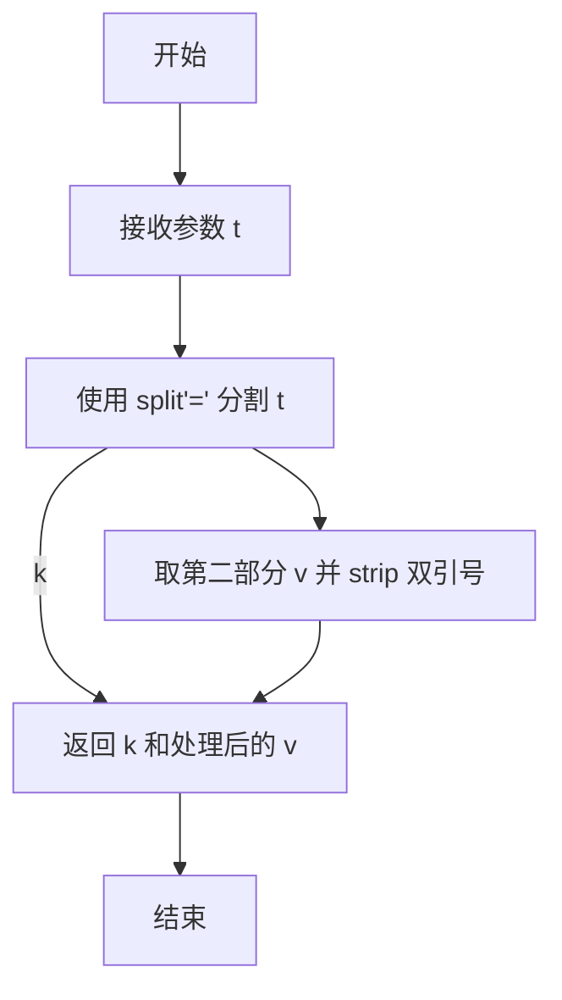
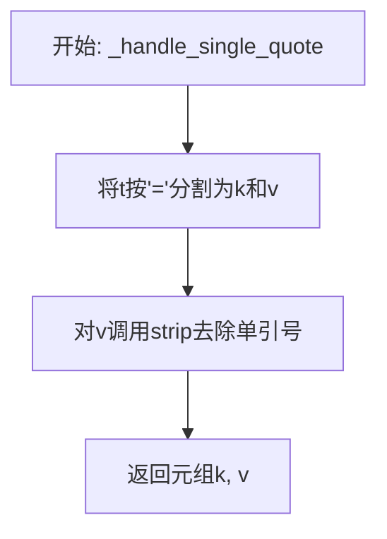
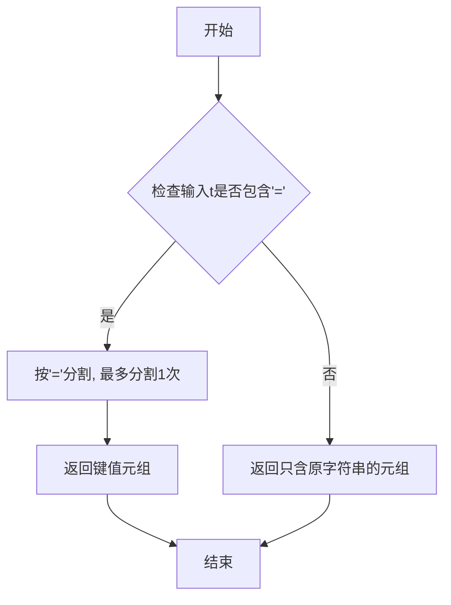
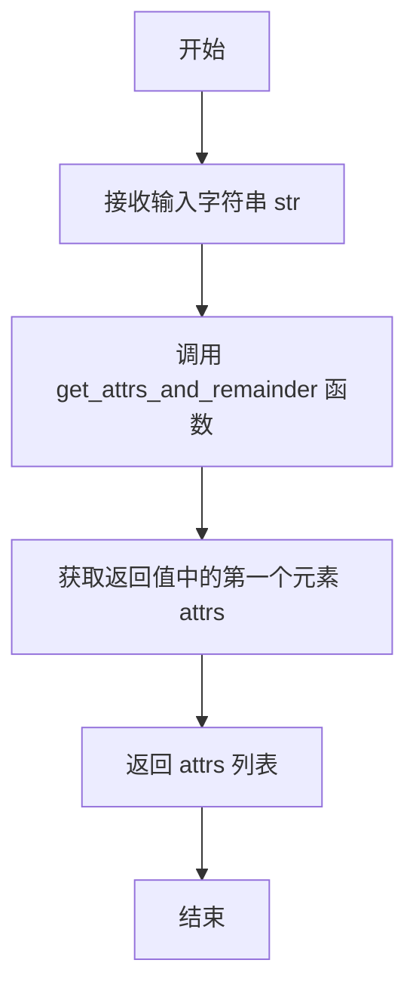
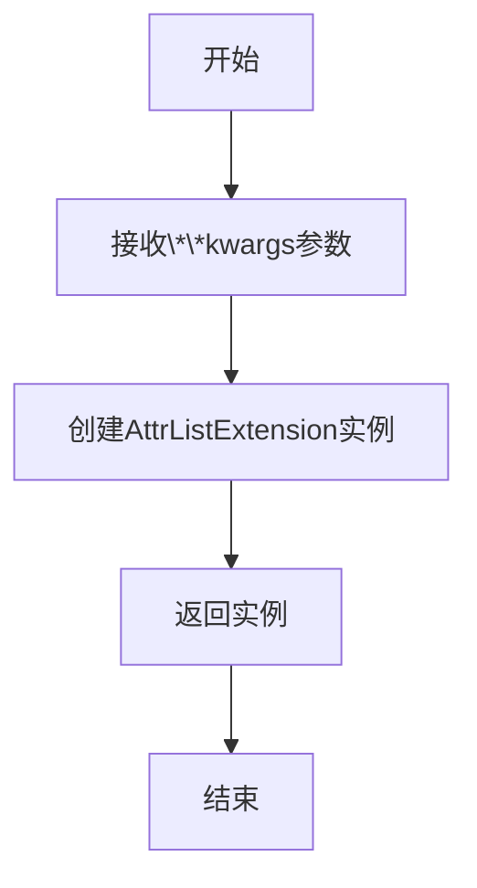
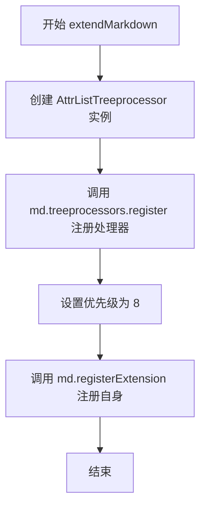
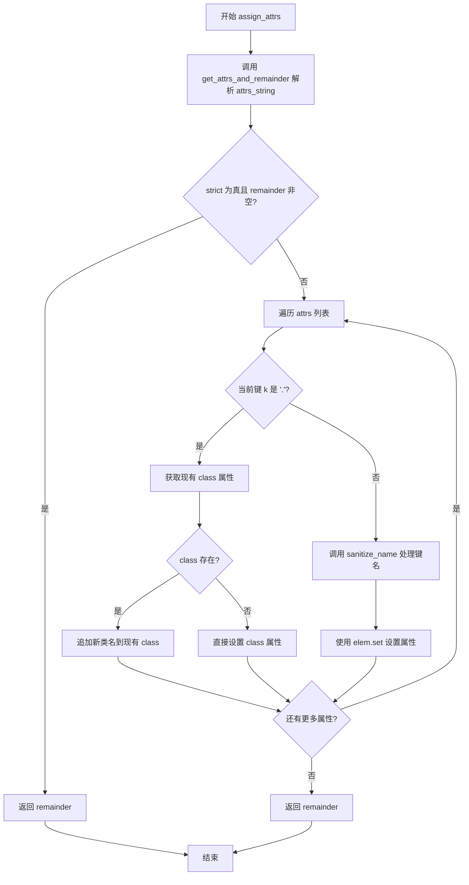
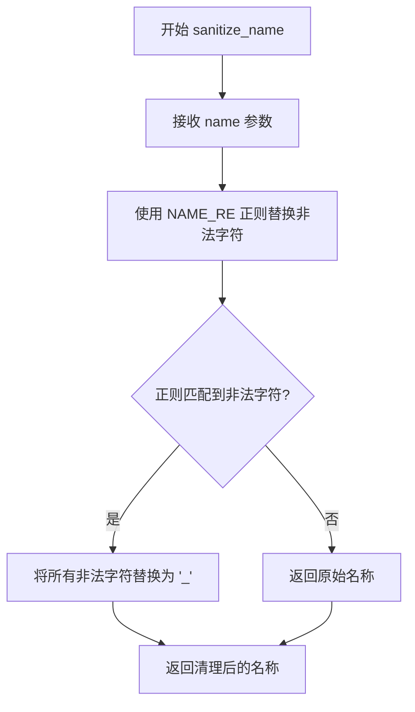

# `markdown\markdown\extensions\attr_list.py` 详细设计文档

该代码是 Python-Markdown 的一个扩展，名为 AttrList，用于解析 Markdown 文本中元素后附加的属性列表语法（如 {#id .class key=value}），并将其转换为对应 HTML 元素的 XML 属性。

## 整体流程

```mermaid
graph TD
    Markdown[输入 Markdown 文本] --> Treeproc[AttrListTreeprocessor.run]
    Treeproc --> Iterate[遍历 XML 树所有元素]
    Iterate --> Check{判断元素类型}
    Check -- 块级元素 --> BlockMatch[匹配 BLOCK_RE/HEADER_RE]
    Check -- 行内元素 --> InlineMatch[匹配 INLINE_RE]
    BlockMatch --> Parse{解析属性}
    InlineMatch --> Parse
    Parse -- 成功 --> Assign[调用 assign_attrs]
    Assign --> SetAttr[设置元素属性<br>(id, class, 或 key=value)]
    SetAttr --> Clean[清理文本中的语法]
    Clean --> Iterate
    Parse -- 失败 --> Iterate
    Iterate -- 完成 --> Output[输出 HTML]
```

## 类结构

```
Extension (基类)
└── AttrListExtension
Treeprocessor (基类)
└── AttrListTreeprocessor
```

## 全局变量及字段


### `_scanner`
    
正则表达式扫描器，用于解析属性列表语法，识别双引号、单引号、键值对和单词形式的属性

类型：`re.Scanner`
    


### `AttrListTreeprocessor.BASE_RE`
    
基础正则表达式字符串，用于匹配带有花括号的属性列表语法

类型：`str`
    


### `AttrListTreeprocessor.HEADER_RE`
    
编译后的正则表达式，用于匹配标题元素（h1-h6）、定义术语（dt）和表格单元格（td、th）末尾的属性列表

类型：`re.Pattern`
    


### `AttrListTreeprocessor.BLOCK_RE`
    
编译后的正则表达式，用于匹配块级元素最后一行文本中的属性列表

类型：`re.Pattern`
    


### `AttrListTreeprocessor.INLINE_RE`
    
编译后的正则表达式，用于匹配内联元素的tail部分（元素后面的文本）中的属性列表

类型：`re.Pattern`
    


### `AttrListTreeprocessor.NAME_RE`
    
编译后的正则表达式，用于清理不符合XML命名规范的字符，确保属性名符合XML名称标准

类型：`re.Pattern`
    
    

## 全局函数及方法


### `_handle_double_quote`

处理属性列表中的双引号语法，将形如 `key="value"` 的字符串解析为属性名和属性值（去除双引号）。

参数：

-  `s`：`str`，扫描器上下文参数（在此函数中未使用）
-  `t`：`str`，需要解析的字符串，格式为 `key="value"`

返回值：`tuple[str, str]`，返回包含属性名和属性值的元组，属性值已去除首尾的双引号

#### 流程图



#### 带注释源码

```python
def _handle_double_quote(s, t):
    """处理双引号包围的属性值。
    
    Args:
        s: 扫描器上下文（在此函数中未使用）
        t: 匹配的token，格式为 key="value"
    
    Returns:
        (key, value) 元组，其中value已去除双引号
    """
    # 使用等号分割字符串，只分割一次
    # 例如：'class="myclass"' -> ['class', '"myclass"']
    k, v = t.split('=', 1)
    # 去除属性值首尾的双引号并返回
    return k, v.strip('"')
```


### `_handle_single_quote`

处理属性列表中带单引号的值，将 `key='value'` 格式的字符串解析为 `(key, value)` 元组。

参数：

-  `s`：`str`，未使用的参数（Scanner 回调函数签名要求）
-  `t`：`str`，要处理的属性字符串，格式为 `key='value'`

返回值：`tuple[str, str]`，返回包含属性名和属性值的元组，属性值去除了单引号

#### 流程图



#### 带注释源码

```python
def _handle_single_quote(s, t):
    """
    处理带单引号的属性值。
    
    参数:
        s: str - 未使用的参数（Scanner回调函数签名要求）
        t: str - 要处理的属性字符串，格式为 key='value'
    
    返回:
        tuple[str, str] - (属性名, 属性值)元组，属性值已去除单引号
    """
    # 使用split将字符串按第一个'='分割为键和值两部分
    k, v = t.split('=', 1)
    # 去除值两端的单引号并返回键值对
    return k, v.strip("'")
```


### `_handle_key_value`

处理属性列表中的键值对语法（不含引号），将字符串按第一个 `=` 分割为键和值。作为 `re.Scanner` 的回调函数使用，用于匹配形如 `key=value` 的属性。

参数：

- `s`：`str`，Scanner 对象（未使用，仅为匹配 Scanner 回调签名）
- `t`：`str`，要解析的属性字符串，格式如 `key=value`

返回值：`tuple[str, str]`，包含键和值的元组

#### 流程图



#### 带注释源码

```python
def _handle_key_value(s, t):
    """处理属性列表中的键值对语法（不含引号）。
    
    作为re.Scanner的回调函数，用于匹配形如key=value的属性。
    只按第一个'='进行分割，值中可能包含额外的'='。
    
    参数:
        s: Scanner对象（未使用，保持函数签名一致）
        t: 要解析的字符串，如 "class=my-class" 或 "attr=value=with=equals"
    
    返回:
        包含键和值的元组。如输入 "id=123" 返回 ("id", "123")
    """
    return t.split('=', 1)
```


### `_handle_word`

处理属性列表中的"单词"类型标记，将CSS类（以`.`开头）、ID（以`#`开头）或其他单词转换为键值对元组。

参数：

- `s`：`str`，扫描器回调的第一个参数（当前未被使用）
- `t`：`str`，要处理的标记字符串

返回值：`tuple[str, str]`，返回键值对元组。如果`以`.`开头，返回`('.', 去掉`.`后的内容)`；如果`以`#`开头，返回`('id', 去掉`#`后的内容)`；否则返回`(t, t)`

#### 流程图

```mermaid
flowchart TD
    A[开始处理 token t] --> B{t.startswith('.')}
    B -->|是| C[返回 '.', t[1:]]
    B -->|否| D{t.startswith('#')}
    D -->|是| E[返回 'id', t[1:]]
    D -->|否| F[返回 t, t]
```

#### 带注释源码

```python
def _handle_word(s, t):
    """处理属性列表中的单词标记。
    
    参数:
        s: 扫描器回调的字符串参数（未使用）
        t: 要处理的标记字符串
    
    返回:
        tuple[str, str]: 键值对元组
            - 以 '.' 开头: ('.', 去掉点后的内容) 用于CSS类
            - 以 '#' 开头: ('id', 去掉#后的内容) 用于HTML ID
            - 其他: (t, t) 单词本身作为键和值
    """
    # 处理CSS类名语法: .classname -> ('.', 'classname')
    if t.startswith('.'):
        return '.', t[1:]
    # 处理ID语法: #someid -> ('id', 'someid')
    if t.startswith('#'):
        return 'id', t[1:]
    # 处理普通单词: word -> ('word', 'word')
    return t, t
```


### `get_attrs_and_remainder`

该函数用于解析 Markdown 属性列表语法（如 `{ .class #id key=value }`），返回一个包含属性键值对元组的列表，以及可能剩余的未解析文本（通常是右花括号后的内容）。

参数：

- `attrs_string`：`str`，需要解析的属性列表字符串

返回值：`tuple[list[tuple[str, str]], str]`，返回属性元组列表和剩余文本

#### 流程图

```mermaid
flowchart TD
    A[开始: get_attrs_and_remainder] --> B[调用 _scanner.scan attrs_string]
    B --> C{解析结果}
    C -->|成功| D[获取 attrs 和 remainder]
    C -->|失败| E[attrs 为空, remainder 为原字符串]
    D --> F{检查 remainder 中是否存在 '}'}
    F -->|存在| G[找到 '}' 的位置]
    G --> H[截取从 '}' 开始的剩余文本]
    H --> I[返回 attrs 和处理后的 remainder]
    F -->|不存在| J[remainder 设为空字符串]
    J --> I
    E --> I
```

#### 带注释源码

```python
def get_attrs_and_remainder(attrs_string: str) -> tuple[list[tuple[str, str]], str]:
    """ Parse attribute list and return a list of attribute tuples.

    Additionally, return any text that remained after a curly brace. In typical cases, its presence
    should mean that the input does not match the intended attribute list syntax.
    """
    # 使用正则表达式扫描器解析属性字符串
    # _scanner 定义了4种模式：
    # 1. 双引号值: key="value"
    # 2. 单引号值: key='value'
    # 3. key=value 形式
    # 4. 普通单词（用于 .class 或 #id 简写形式）
    attrs, remainder = _scanner.scan(attrs_string)
    
    # 为了保持历史行为，丢弃 '}' 之前的所有无法解析的文本
    # 查找 remainder 中第一个 '}' 的位置
    index = remainder.find('}')
    
    # 如果找到 '}'，则保留从 '}' 开始的剩余部分；否则置为空字符串
    remainder = remainder[index:] if index != -1 else ''
    
    # 返回属性元组列表和剩余文本
    return attrs, remainder
```


### `get_attrs`

解析属性字符串并返回属性元组列表。该函数是 `get_attrs_and_remainder` 的包装器，已被软弃用，建议优先使用 `get_attrs_and_remainder` 函数。

参数：

- `str`：`str`，输入的属性字符串，包含需要解析的属性列表

返回值：`list[tuple[str, str]]`，属性元组列表，每个元组包含属性名和属性值

#### 流程图



#### 带注释源码

```python
def get_attrs(str: str) -> list[tuple[str, str]]:  # pragma: no cover
    """ Soft-deprecated. Prefer `get_attrs_and_remainder`. """
    # 调用 get_attrs_and_remainder 函数，传入属性字符串
    # 该函数返回一个元组 (attrs_list, remainder)
    # 这里只需要取第一个元素，即属性列表
    return get_attrs_and_remainder(str)[0]
```


### `isheader`

该函数用于检查给定的 XML 元素是否为 HTML 标题元素（h1-h6）。它通过比较元素的标签名来判断是否属于标题标签，是属性列表扩展中用于区分标题元素以便应用特殊处理逻辑的辅助函数。

参数：

- `elem`：`Element`（来自 `xml.etree.ElementTree`），需要检查的 XML 元素

返回值：`bool`，如果元素是标题标签（h1、h2、h3、h4、h5 或 h6）则返回 `True`，否则返回 `False`

#### 流程图

```mermaid
flowchart TD
    A[开始 isheader] --> B{elem.tag in<br/>['h1', 'h2', 'h3', 'h4', 'h5', 'h6']?}
    B -->|True| C[返回 True]
    B -->|False| D[返回 False]
    C --> E[结束]
    D --> E
```

#### 带注释源码

```python
def isheader(elem: Element) -> bool:
    """检查元素是否为标题元素（h1-h6）。
    
    用于在属性列表处理中识别标题元素，以便对标题应用特殊的
    属性处理逻辑（如清理尾部的 # 符号）。
    
    参数:
        elem: Element, XML 元素节点
        
    返回:
        bool: 如果元素标签为 h1-h6 中的任何一个返回 True，否则返回 False
    """
    return elem.tag in ['h1', 'h2', 'h3', 'h4', 'h5', 'h6']
```


### `makeExtension`

该函数是 Python-Markdown 扩展的入口点函数，用于创建并返回 `AttrListExtension` 实例，使扩展可以被 Python-Markdown 加载器使用。

参数：

- `**kwargs`：可变关键字参数，用于传递给 `AttrListExtension` 构造函数的任意参数

返回值：`AttrListExtension`，返回一个新的属性列表扩展实例

#### 流程图



#### 带注释源码

```python
def makeExtension(**kwargs):  # pragma: no cover
    """
    创建并返回AttrListExtension实例的工厂函数。
    
    这是Python-Markdown扩展的入口点函数，Markdown在加载扩展时
    会调用此函数来实例化扩展对象。
    
    参数:
        **kwargs: 可变关键字参数，会被原样传递给AttrListExtension的
                  __init__方法，用于配置扩展行为
        
    返回值:
        AttrListExtension: 新创建的属性列表扩展实例
    """
    return AttrListExtension(**kwargs)
```


### `AttrListExtension.extendMarkdown`

该方法用于初始化属性列表扩展，将 `AttrListTreeprocessor` 注册到 Python-Markdown 的树处理器中，使 Markdown 文档能够解析和处理属性列表语法（如 `{ .class #id key=value }`）。

参数：

- `self`：`AttrListExtension` 实例，当前扩展对象实例
- `md`：`Markdown` 对象，Python-Markdown 的核心对象，用于注册扩展和处理器

返回值：`None`，无返回值（该方法通过副作用完成功能）

#### 流程图



#### 带注释源码

```python
def extendMarkdown(self, md):
    """
    初始化属性列表扩展。
    
    该方法在 Markdown 对象加载扩展时被调用，
    负责将 AttrListTreeprocessor 注册到 Markdown 的处理管道中。
    
    参数:
        md: Markdown 核心对象，用于注册处理器和扩展
    """
    # 创建树处理器实例并注册到 Markdown 对象的 treeprocessors 字典中
    # 优先级设置为 8（较高级别），确保在其他处理器之前运行
    md.treeprocessors.register(AttrListTreeprocessor(md), 'attr_list', 8)
    
    # 将当前扩展注册到 Markdown 对象，使其能够被识别和管理
    md.registerExtension(self)
```


### `AttrListTreeprocessor.run`

该方法是 Python-Markdown 的 AttrListTreeprocessor 类的核心方法，负责解析文档中各元素的属性列表语法（形如 `{ .class #id key=value }`），支持块级元素从尾部提取属性、内联元素从 tail 开头提取属性，并根据元素类型（标题、列表项、表格单元格等）选择合适的正则表达式进行匹配，最终将解析出的属性（类名、ID、普通属性）赋值给对应的 XML 元素。

参数：

- `doc`：`Element`，来自 xml.etree.ElementTree 的元素对象，代表整个 Markdown 文档解析后的 XML 树结构

返回值：`None`，该方法直接修改传入的 `doc` 元素树，不返回任何值

#### 流程图

```mermaid
flowchart TD
    A[开始 run 方法] --> B[遍历 doc 中的所有元素]
    B --> C{当前元素是否为块级元素?}
    
    C -->|是| D[确定使用的正则表达式]
    C -->|否| L[处理内联元素]
    
    D --> E{元素是标题 dt td th 之一?}
    E -->|是| F[使用 HEADER_RE]
    E -->|否| G[使用 BLOCK_RE]
    
    F --> H{元素标签是 li?}
    G --> H
    
    H -->|是| I[特殊处理列表项]
    H -->|否| J{元素有子元素?}
    
    I --> K1[从 elem.text 获取属性]
    I --> K2[从 elem[-1].tail 获取属性]
    I --> K3[从 elem[pos-1].tail 获取属性]
    K1 --> M
    K2 --> M
    K3 --> M
    
    J -->|是| M[从 elem[-1].tail 匹配属性]
    J -->|否| N[从 elem.text 匹配属性]
    
    M --> O{match 成功?}
    N --> O
    
    O -->|是| P[调用 assign_attrs 分配属性]
    O -->|否| Q[继续下一个元素]
    
    P --> R{assign_attrs 返回 remainder?}
    R -->|是| S[截断属性字符串剩余部分]
    R -->|否| Q
    
    S --> Q
    
    L --> T{elem.tail 存在?}
    T -->|否| Q
    T -->|是| U[使用 INLINE_RE 匹配 tail 开头]
    
    U --> V{match 成功?}
    V -->|否| Q
    V -->|是| W[调用 assign_attrs 获取属性]
    
    W --> X[更新 elem.tail 去除已匹配部分]
    X --> Y[拼接 remainder 返回值]
    Y --> Q
    Q --> Z[结束]
    
    style P fill:#90EE90
    style W fill:#90EE90
```

#### 带注释源码

```python
def run(self, doc: Element) -> None:
    """
    处理文档中的属性列表语法。
    
    遍历整个 XML 文档树，为各元素解析并分配属性列表中定义的属性。
    属性列表语法形如：{ .classname #elementid key=value }
    """
    # 遍历文档中的所有元素（包括根元素和所有子元素）
    for elem in doc.iter():
        # 判断当前元素是否为块级元素（block-level element）
        if self.md.is_block_level(elem.tag):
            # 块级元素处理分支
            
            # 默认使用 BLOCK_RE（块级属性列表正则）
            RE = self.BLOCK_RE
            
            # 如果是标题、定义术语或表格单元格，使用 HEADER_RE
            # 这些元素的属性列表出现在元素的末尾
            if isheader(elem) or elem.tag in ['dt', 'td', 'th']:
                RE = self.HEADER_RE
            
            # 特殊处理列表项（li 元素）
            # 因为 li 的子元素可能包含 ul 或 ol，需要找到合适的位置提取属性
            if len(elem) and elem.tag == 'li':
                pos = None
                # 查找 ul 或 ol 子元素的位置
                for i, child in enumerate(elem):
                    if child.tag in ['ul', 'ol']:
                        pos = i
                        break
                
                if pos is None and elem[-1].tail:
                    # 没有 ul/ol，使用最后一个子元素的 tail
                    m = RE.search(elem[-1].tail)
                    if m:
                        # 尝试分配属性，strict=True 表示严格模式
                        if not self.assign_attrs(elem, m.group(1), strict=True):
                            # 分配失败，截断 tail 中已匹配的部分
                            elem[-1].tail = elem[-1].tail[:m.start()]
                elif pos is not None and pos > 0 and elem[pos-1].tail:
                    # 有 ul/ol，使用其前一个子元素的 tail
                    m = RE.search(elem[pos-1].tail)
                    if m:
                        if not self.assign_attrs(elem, m.group(1), strict=True):
                            elem[pos-1].tail = elem[pos-1].tail[:m.start()]
                elif elem.text:
                    # 使用元素的 text（ul 是第一个子元素的情况）
                    m = RE.search(elem.text)
                    if m:
                        if not self.assign_attrs(elem, m.group(1), strict=True):
                            elem.text = elem.text[:m.start()]
            
            # 处理有子元素的块级元素（非 li）
            # 从最后一个子元素的 tail 提取属性
            elif len(elem) and elem[-1].tail:
                m = RE.search(elem[-1].tail)
                if m:
                    if not self.assign_attrs(elem, m.group(1), strict=True):
                        # 分配失败，截断 tail
                        elem[-1].tail = elem[-1].tail[:m.start()]
                        # 如果是标题，清理尾随的 # 符号（Markdown 标题语法）
                        if isheader(elem):
                            elem[-1].tail = elem[-1].tail.rstrip('#').rstrip()
            
            # 处理没有子元素的块级元素
            # 从元素的 text 提取属性
            elif elem.text:
                m = RE.search(elem.text)
                if m:
                    if not self.assign_attrs(elem, m.group(1), strict=True):
                        elem.text = elem.text[:m.start()]
                        # 标题同样需要清理尾随的 #
                        if isheader(elem):
                            elem.text = elem.text.rstrip('#').rstrip()
        
        else:
            # 内联元素处理分支
            # 内联元素的属性列表出现在 tail 的开头（即元素文本之后的文本）
            if elem.tail:
                m = self.INLINE_RE.match(elem.tail)
                if m:
                    # 分配属性，返回可能剩余的文本
                    remainder = self.assign_attrs(elem, m.group(1))
                    # 更新 tail：去除已匹配部分，拼接 remainder
                    elem.tail = elem.tail[m.end():] + remainder
```


### `AttrListTreeprocessor.assign_attrs`

该方法负责将解析后的属性字符串分配给XML元素，支持类属性（以`.`开头）和普通属性两种模式，并根据`strict`参数决定是否在属性字符串包含多余闭合花括号时停止分配。

参数：

- `elem`：`Element`，目标XML元素，属性将被分配到此元素
- `attrs_string`：`str`，包含属性定义的字符串，格式如`key="value"`或`.classname`
- `strict`：`bool`（关键字参数，默认为`False`），当为`True`时，如果属性字符串解析后有多余的`}`，则不分配属性并直接返回剩余文本

返回值：`str`，如果属性字符串中有多余的闭合花括号（`}`），则返回该剩余文本；否则返回空字符串

#### 流程图



#### 带注释源码

```python
def assign_attrs(self, elem: Element, attrs_string: str, *, strict: bool = False) -> str:
    """ Assign `attrs` to element.

    If the `attrs_string` has an extra closing curly brace, the remaining text is returned.

    The `strict` argument controls whether to still assign `attrs` if there is a remaining `}`.
    """
    # 1. 解析属性字符串，返回属性元组列表和剩余文本
    attrs, remainder = get_attrs_and_remainder(attrs_string)
    
    # 2. 严格模式下，如果有多余的 }，直接返回剩余文本，不分配属性
    if strict and remainder:
        return remainder

    # 3. 遍历所有解析出的属性
    for k, v in attrs:
        if k == '.':
            # 处理类名属性（以.开头）
            # 获取元素现有的class属性值
            cls = elem.get('class')
            if cls:
                # 如果已有class，追加新类名
                elem.set('class', '{} {}'.format(cls, v))
            else:
                # 直接设置class属性
                elem.set('class', v)
        else:
            # 处理普通属性
            # 先清理属性名（将非法XML字符替换为下划线），再设置属性
            elem.set(self.sanitize_name(k), v)
    
    # 4. 返回剩余文本（可能包含多余的闭合花括号）
    # 这个剩余文本会被调用者用于恢复原始文本
    return remainder
```


### `AttrListTreeprocessor.sanitize_name`

该方法用于将给定的名称 sanitized 为符合 XML NCName 规范的字符串，通过正则表达式将所有非法字符替换为下划线。

参数：

- `name`：`str`，需要被清理的名称

返回值：`str`，清理后的名称

#### 流程图



#### 带注释源码

```python
def sanitize_name(self, name: str) -> str:
    """
    Sanitize name as 'an XML Name, minus the `:`.'
    See <https://www.w3.org/TR/REC-xml-names/#NT-NCName>.
    
    该方法确保属性名称符合 XML NCName 规范，
    即只能包含字母、数字、下划线、连字符、冒号和句点等合法字符。
    所有非法字符都将被替换为下划线。
    
    参数:
        name: str - 需要被清理的属性名称
        
    返回:
        str - 符合 XML NCName 规范的清理后名称
    """
    # 使用类级别的 NAME_RE 正则表达式
    # NAME_RE 匹配所有不符合 XML NCName 规范的字符
    # sub('_', name) 将所有匹配到的非法字符替换为下划线
    return self.NAME_RE.sub('_', name)
```

## 关键组件


### 属性解析器（_scanner）

使用`re.Scanner`实现词法分析，将属性字符串解析为token，支持双引号、单引号、键值对和单词（class/id简写）四种语法。

### 属性处理函数（_handle_double_quote, _handle_single_quote, _handle_key_value, _handle_word）

分别处理双引号、单引号、键值对和单词形式的属性输入，提取键值对并返回。

### 属性解析主函数（get_attrs_and_remainder）

解析属性列表字符串，返回属性元组列表和可能剩余的文本（如未闭合的花括号）。

### 标题判断函数（isheader）

判断XML元素是否为标题标签（h1-h6）。

### 属性列表树处理器（AttrListTreeprocessor）

核心处理器类，继承自`Treeprocessor`，负责在Markdown转换为HTML的过程中将属性列表语法应用到元素上。

### 属性分配方法（assign_attrs）

将解析出的属性分配给XML元素，支持class属性追加和普通属性设置，处理严格模式下的剩余文本返回。

### 属性名清理方法（sanitize_name）

根据XML Name规范清理属性名，将不合法的字符替换为下划线。

### 属性列表扩展（AttrListExtension）

Python-Markdown扩展入口类，注册树处理器到Markdown实例。

### 正则表达式模式（BLOCK_RE, HEADER_RE, INLINE_RE, NAME_RE）

分别用于匹配块级元素、标题元素、内联元素和清理属性名的正则表达式。


## 问题及建议


### 已知问题

-   **使用弃用的API**：`re.Scanner` 在 Python 3.9+ 已被标记为弃用，未来版本可能会移除
- **函数参数名与内置类型冲突**：`get_attrs(str: str)` 函数使用 `str` 作为参数名，虽然有 `from __future__ import annotations`，但这仍是糟糕的实践，会导致代码混淆
- **使用过时的字符串格式化**：`'{} {}'.format(cls, v)` 使用 `.format()` 方法，而非更现代的 f-string
- **魔法字符串和数字**：`'attr_list'` 作为 treeprocessor 名称、优先级 `8` 等都是硬编码的魔法值，缺乏常量定义
- **类型注解不完整**：`get_attrs_and_remainder` 函数返回类型中的 `list[tuple[str, str]]` 缺少模块导入
- **重复代码逻辑**：`AttrListTreeprocessor.run()` 方法过长（约120行），包含多个相似模式的代码块可以提取
- **潜在的性能问题**：`NAME_RE` 正则表达式在每次调用 `sanitize_name` 时被使用，可以考虑预编译或缓存
- **缺乏异常处理的显式说明**：代码对非法属性名的处理依赖正则替换，可能存在边界情况

### 优化建议

-   **替换弃用的Scanner**：考虑使用 `re.findall` 配合自定义解析器，或使用第三方解析库如 `pyparsing`
-   **重命名参数**：将 `str` 改为 `attrs_string`，`s` 和 `t` 改为有意义的名称如 `scanner` 和 `token`
-   **使用f-string**：将所有 `.format()` 调用改为 f-string，提高可读性
-   **提取常量**：创建配置类或常量模块，存放 treeprocessor 名称、优先级等
-   **重构run方法**：将不同元素类型的处理逻辑提取为独立方法，如 `_process_block_element()`, `_process_header()`, `_process_list_item()`, `_process_inline_element()`
-   **添加类型注解**：`from typing import List, Tuple` 或使用 Python 3.9+ 的内置泛型
-   **完善文档**：为内部函数 `_handle_*` 系列添加完整的文档字符串，说明其解析逻辑

## 其它


### 设计目标与约束

本扩展旨在为Python-Markdown添加属性列表语法支持，允许用户在Markdown元素（如标题、列表项、表格单元格等）上添加id、class及其他自定义属性。设计约束包括：保持与Maruku属性列表语法的兼容性，支持块级和内联级属性，正确处理XML名称规范中的特殊字符，以及维护历史行为的兼容性。

### 错误处理与异常设计

本代码采用轻量级错误处理策略，主要通过正则表达式匹配和字符串操作来处理潜在问题。在`get_attrs_and_remainder`函数中，使用_scanner解析属性字符串，无法解析的文本被丢弃（保留'}'之后的内容）。在`assign_attrs`方法中，当`strict=True`且存在剩余的'}'时，会返回剩余文本而非静默失败。对于无效的属性名称，通过`sanitize_name`方法将其中的非法字符替换为下划线。代码不抛出自定义异常，依赖Python内置异常传播。

### 数据流与状态机

数据流主要分为三个阶段：1) 扩展初始化阶段：AttrListExtension加载并注册AttrListTreeprocessor；2) 属性解析阶段：属性字符串通过_scanner分解为(key, value)元组列表；3) 属性应用阶段：遍历文档树，根据元素类型（块级/内联级、标题/列表项/表格单元格等）选择不同的正则表达式匹配位置，然后将属性应用到对应元素。无复杂状态机，仅根据元素标签和结构特征进行流程分支。

### 外部依赖与接口契约

本扩展依赖Python-Markdown的核心模块：1) `Extension`基类，来自`markdown.extensions`；2) `Treeprocessor`树处理器，来自`markdown.treeprocessors`；3) `Element`类，来自`xml.etree.ElementTree`（类型提示）。提供的公共接口包括：`makeExtension(**kwargs)`函数用于实例化扩展；`AttrListExtension.extendMarkdown()`方法用于注册处理器；`get_attrs_and_remainder()`和`get_attrs()`函数可供外部调用以解析属性字符串。

### 性能考虑与优化空间

当前实现使用`doc.iter()`遍历所有元素，可能对大型文档产生性能影响。优化方向包括：1) 使用更精确的XPath选择器只处理可能包含属性的元素；2) 缓存编译后的正则表达式（虽然当前已使用re.compile，但可在多次调用间共享）；3) 对于嵌套深度较大的文档，考虑使用生成器模式减少内存占用。当前代码在属性解析效率上表现良好，_scanner基于正则表达式列表，解析速度较快。

### 安全性分析

本扩展涉及用户输入（Markdown中的属性字符串）到XML属性的转换，存在潜在的安全风险。主要安全考量：1) 属性名称通过`sanitize_name`方法进行清理，替换非法XML名称字符，防止XML注入；2) 属性值直接设置到Element属性，不执行任何代码或解析HTML实体；3) 建议在生产环境中对用户输入的属性值进行额外的转义处理，以防XSS攻击（虽然Markdown核心处理器负责最终输出）。

### 测试覆盖与验证策略

代码中包含`# pragma: no cover`标记，表明部分函数（如`get_attrs`、`makeExtension`）被标记为不测试。测试策略应覆盖：1) 各种属性语法格式（双引号、单引号、无引号、单词形式）；2) 特殊字符处理（Unicode范围、中文、日文等）；3) 边界条件（空字符串、仅有空格、无效语法）；4) 不同元素类型的属性应用（标题、列表、表格、代码块等）；5) 严格模式与宽松模式的行为差异。

### 版本兼容性与迁移指南

代码使用`from __future__ import annotations`支持Python 3.7+的类型提示。依赖的`typing.TYPE_CHECKING`确保类型提示仅在静态检查时导入，不影响运行时性能。设计上保持向后兼容：`get_attrs`函数标记为"soft-deprecated"但仍可用，返回值与历史版本一致。对于从旧版本迁移的用户，主要变化可能来自于属性解析行为的细微调整（如对无法解析文本的处理），建议在测试环境中验证输出。

    