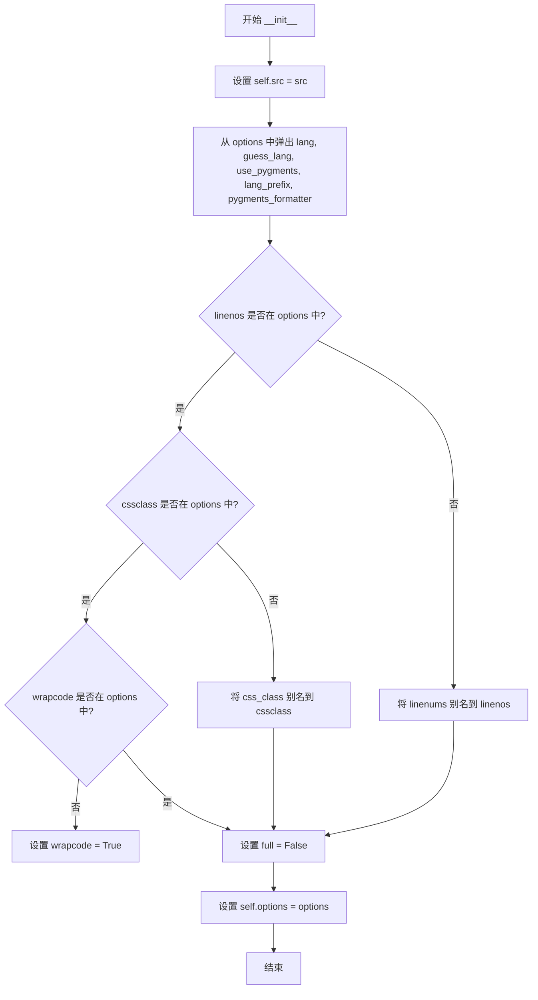
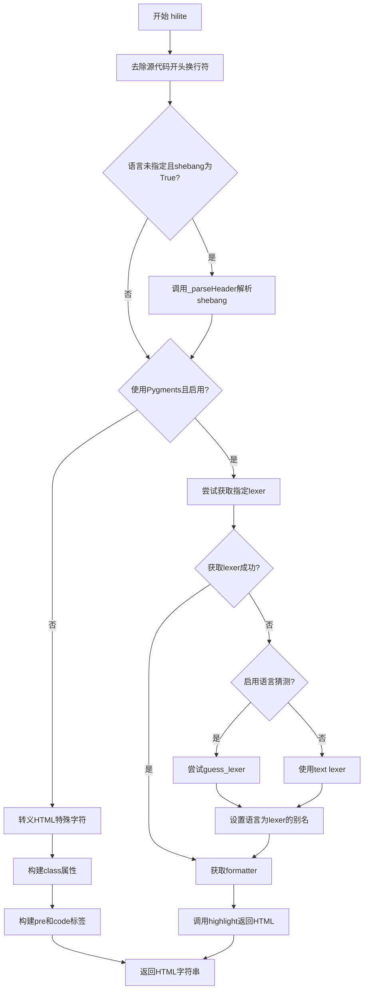
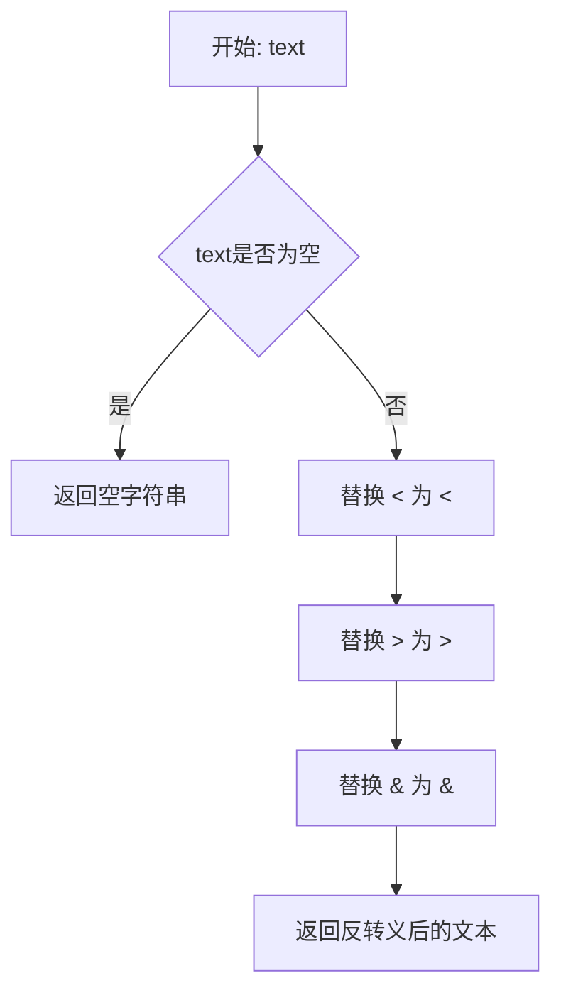
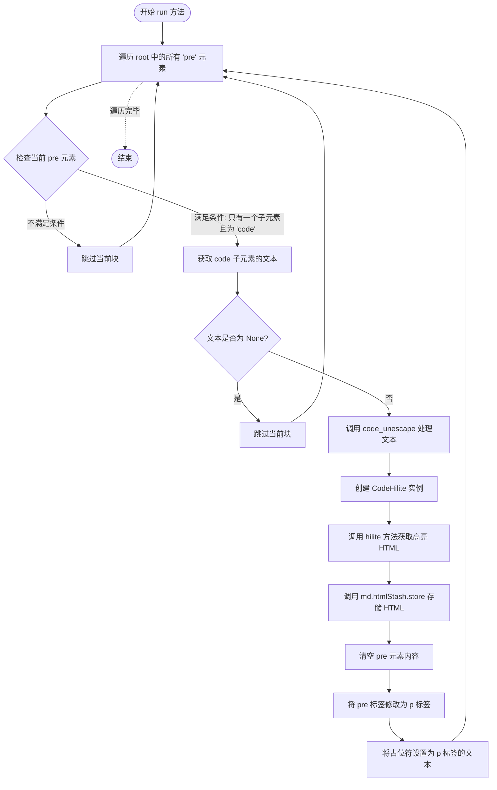
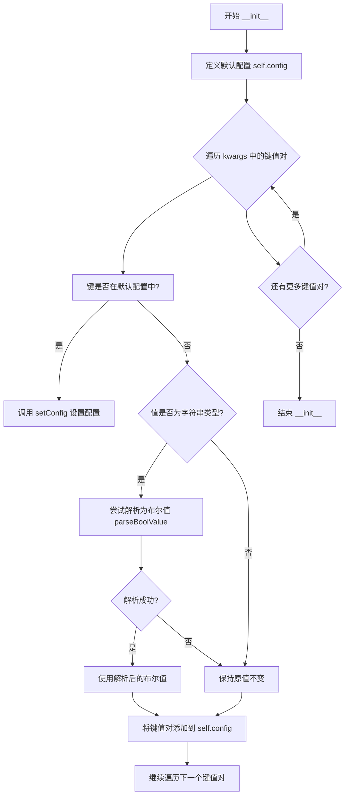
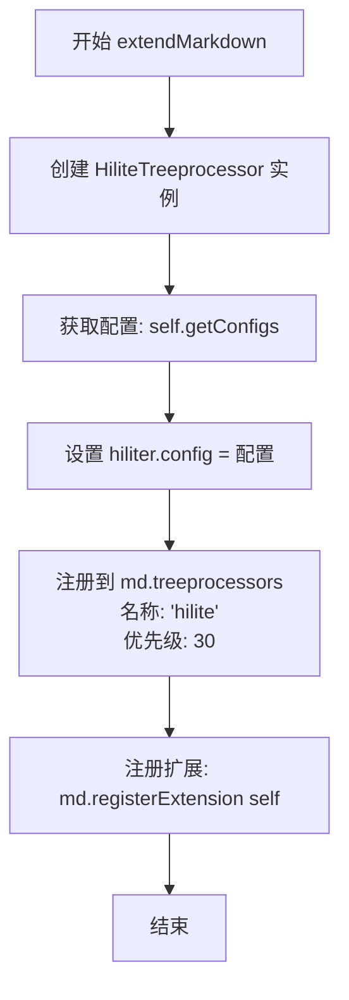

# `markdown\markdown\extensions\codehilite.py` 详细设计文档

Python-Markdown 的代码高亮扩展，通过 Pygments 库为 Markdown 代码块提供语法高亮功能，支持语言自动检测、行号显示、特定行高亮等特性。

## 整体流程

```mermaid
graph TD
A[Markdown 解析文档] --> B[Treeprocessor 遍历 DOM 树]
B --> C{发现 code 块?}
C -- 否 --> D[跳过]
C -- 是 --> E[创建 CodeHilite 实例]
E --> F{pygments 可用且 use_pygments=True?}
F -- 是 --> G[获取或猜测 lexer]
F -- 否 --> H[纯 HTML 转义处理]
G --> I[获取 formatter]
I --> J[调用 highlight() 高亮代码]
J --> K[返回 HTML]
H --> L[构建带语言类的 pre/code 标签]
L --> M[HTML 转义特殊字符]
K --> N[存储到 htmlStash]
M --> N
N --> O[替换原 code 块为占位符]
O --> P[最终渲染 HTML]
```

## 类结构

```
Extension (抽象基类)
└── CodeHiliteExtension
    ├── HiliteTreeprocessor (Treeprocessor 子类)
    └── CodeHilite (核心高亮类)
```

## 全局变量及字段


### `pygments`
    
Pygments 库可用性标志

类型：`bool`
    


### `CodeHilite.src`
    
源代码内容

类型：`str`
    


### `CodeHilite.lang`
    
语言名称

类型：`str | None`
    


### `CodeHilite.guess_lang`
    
是否自动检测语言

类型：`bool`
    


### `CodeHilite.use_pygments`
    
是否使用 Pygments

类型：`bool`
    


### `CodeHilite.lang_prefix`
    
语言 class 前缀

类型：`str`
    


### `CodeHilite.pygments_formatter`
    
Pygments 格式化器

类型：`str | Callable`
    


### `CodeHilite.options`
    
传递给 lexer/formatter 的选项

类型：`dict`
    


### `HiliteTreeprocessor.config`
    
配置选项

类型：`dict[str, Any]`
    


### `CodeHiliteExtension.config`
    
扩展配置字典

类型：`dict`
    
    

## 全局函数及方法


### `parse_hl_lines`

解析高亮行号字符串，将类似 '1 2' 的表达式转换为整数列表，用于指定代码块中需要高亮的行号。

参数：

- `expr`：`str`，高亮行号表达式，格式如 '1 2' 表示要高亮第1行和第2行

返回值：`list[int]`，返回要高亮的行号整数列表

#### 流程图

```mermaid
flowchart TD
    A[开始 parse_hl_lines] --> B{expr 是否为空}
    B -->|是| C[返回空列表 []]
    B -->|否| D[尝试分割并转换]
    D --> E{转换是否成功}
    E -->|是| F[返回整数列表 list]
    E -->|否| G[捕获 ValueError 异常]
    G --> C
    F --> H[结束]
    C --> H
```

#### 带注释源码

```python
def parse_hl_lines(expr: str) -> list[int]:
    """Support our syntax for emphasizing certain lines of code.

    `expr` should be like '1 2' to emphasize lines 1 and 2 of a code block.
    Returns a list of integers, the line numbers to emphasize.
    """
    # 如果表达式为空或 None，直接返回空列表
    if not expr:
        return []

    try:
        # 将表达式按空格分割，转换为整数列表
        # 例如：'1 2' -> [1, 2]
        return list(map(int, expr.split()))
    except ValueError:  # pragma: no cover
        # 如果转换失败（如包含非数字字符），返回空列表
        return []
```


### `makeExtension`

这是 Python-Markdown 扩展的入口点（工厂函数）。它接收可选的关键字参数，并将这些参数传递给 `CodeHiliteExtension` 类的构造函数，最终返回一个配置好的扩展实例供 Markdown 解析器使用。

参数：

- `**kwargs`：`Any`，可变关键字参数。这些参数会被直接传递给 `CodeHiliteExtension` 的构造函数，用于配置代码高亮的行为（例如 `linenums`、`pygments_style`、`css_class` 等）。

返回值：`CodeHiliteExtension`，返回已配置的 `CodeHiliteExtension` 类实例。

#### 流程图

```mermaid
graph TD
    A([开始: makeExtension]) --> B{接收 **kwargs}
    B --> C[实例化: new CodeHiliteExtension(**kwargs)]
    C --> D([返回: CodeHiliteExtension 实例])
```

#### 带注释源码

```python
def makeExtension(**kwargs):  # pragma: no cover
    """
    工厂函数，用于创建 CodeHilite 扩展的实例。
    Python-Markdown 通过此函数加载扩展。

    参数:
        **kwargs: 传递给 CodeHiliteExtension 的配置选项。

    返回值:
        CodeHiliteExtension: 扩展的实例。
    """
    return CodeHiliteExtension(**kwargs)
```


### `CodeHilite.__init__`

初始化 CodeHilite 类的实例，用于对源代码进行语法高亮处理。该方法接收源代码字符串和多个可选配置参数，设置语言检测、自动检测、格式化器等选项，并将剩余选项存储以传递给 Pygments 词法分析器和格式化器。

参数：

- `src`：`str`，源代码字符串或任何具有 `.readline` 属性的对象。
- `**options`：`Any`，可变关键字参数，用于配置语法高亮的各个选项，包括：
  - `lang`：`str | None`，Pygments 词法分析器名称，默认为 `None`。
  - `guess_lang`：`bool`，是否自动检测语言，默认为 `True`。
  - `use_pygments`：`bool`，是否使用 Pygments 进行高亮，默认为 `True`。
  - `lang_prefix`：`str`，语言前缀，默认为 `"language-"`。
  - `pygments_formatter`：`str | Callable`，Pygments 格式化器名称或类，默认为 `'html'`。
  - `linenums`：`bool | None`，是否显示行号，`None` 表示自动。
  - `css_class`：`str`，CSS 类名，默认为 `'codehilite'`。
  - 其他选项将传递给词法分析器和格式化器。

返回值：`None`，`__init__` 方法不返回任何值（隐式返回 `None`）。

#### 流程图



#### 带注释源码

```python
def __init__(self, src: str, **options):
    """
    初始化 CodeHilite 实例。

    参数:
        src: 源代码字符串或任何具有 .readline 属性的对象。
        **options: 关键字参数，用于配置语法高亮。
    """
    # 存储源代码
    self.src = src
    
    # 从 options 中弹出配置选项并设置实例属性
    # lang: 编程语言名称
    self.lang: str | None = options.pop('lang', None)
    # guess_lang: 是否自动检测语言
    self.guess_lang: bool = options.pop('guess_lang', True)
    # use_pygments: 是否使用 Pygments 库
    self.use_pygments: bool = options.pop('use_pygments', True)
    # lang_prefix: 语言类名前缀，用于非 Pygments 模式
    self.lang_prefix: str = options.pop('lang_prefix', 'language-')
    # pygments_formatter: Pygments 格式化器名称或类
    self.pygments_formatter: str | Callable = options.pop('pygments_formatter', 'html')

    # 处理选项别名：linenums 是 linenos 的别名
    if 'linenos' not in options:
        options['linenos'] = options.pop('linenums', None)
    
    # 处理选项别名：css_class 是 cssclass 的别名
    if 'cssclass' not in options:
        options['cssclass'] = options.pop('css_class', 'codehilite')
    
    # 设置 wrapcode 选项，覆盖 Pygments 默认值
    if 'wrapcode' not in options:
        # Override Pygments default
        options['wrapcode'] = True
    
    # 禁止使用 full 选项，强制设为 False
    # Disallow use of `full` option
    options['full'] = False

    # 将处理后的剩余选项存储在实例属性中
    # 这些选项将传递给 Pygments 词法分析器和格式化器
    self.options = options
```


### `CodeHilite.hilite`

该方法是CodeHilite类的核心方法，负责将源代码进行语法高亮处理并返回HTML格式的结果。它支持通过Pygments进行高亮，或在Pygments不可用时使用JavaScript高亮库所需的格式。

参数：

- `shebang`：`bool`，是否解析shebang来确定语言，默认为True

返回值：`str`，返回HTML格式的高亮代码

#### 流程图



#### 带注释源码

```python
def hilite(self, shebang: bool = True) -> str:
    """
    Pass code to the [Pygments](https://pygments.org/) highlighter with
    optional line numbers. The output should then be styled with CSS to
    your liking. No styles are applied by default - only styling hooks
    (i.e.: `<span class="k">`).

    returns : A string of html.

    """

    # 去除源代码开头和结尾的换行符
    self.src = self.src.strip('\n')

    # 如果未指定语言且允许解析shebang，则解析头部信息来确定语言
    if self.lang is None and shebang:
        self._parseHeader()

    # 判断是否使用Pygments进行高亮
    if pygments and self.use_pygments:
        # 尝试使用指定的语言获取lexer
        try:
            lexer = get_lexer_by_name(self.lang, **self.options)
        except ValueError:
            # 如果指定语言失败，尝试自动检测或使用text lexer
            try:
                if self.guess_lang:
                    lexer = guess_lexer(self.src, **self.options)
                else:
                    lexer = get_lexer_by_name('text', **self.options)
            except ValueError:  # pragma: no cover
                lexer = get_lexer_by_name('text', **self.options)
        
        # 如果没有指定语言，使用猜测到的lexer的语言别名
        if not self.lang:
            self.lang = lexer.aliases[0]
        
        # 构建语言字符串，用于传递给formatter
        lang_str = f'{self.lang_prefix}{self.lang}'
        
        # 获取formatter，可以是字符串名称或直接传入formatter类
        if isinstance(self.pygments_formatter, str):
            try:
                formatter = get_formatter_by_name(self.pygments_formatter, **self.options)
            except ClassNotFound:
                formatter = get_formatter_by_name('html', **self.options)
        else:
            formatter = self.pygments_formatter(lang_str=lang_str, **self.options)
        
        # 调用Pygments的highlight函数返回高亮后的HTML
        return highlight(self.src, lexer, formatter)
    else:
        # 不使用Pygments时的处理，构建适用于JavaScript高亮库的HTML
        # 转义HTML特殊字符
        txt = self.src.replace('&', '&amp;')
        txt = txt.replace('<', '&lt;')
        txt = txt.replace('>', '&gt;')
        txt = txt.replace('"', '&quot;')
        
        # 构建class列表
        classes = []
        if self.lang:
            classes.append('{}{}'.format(self.lang_prefix, self.lang))
        if self.options['linenos']:
            classes.append('linenums')
        
        # 构建class属性字符串
        class_str = ''
        if classes:
            class_str = ' class="{}"'.format(' '.join(classes))
        
        # 返回带有高亮类名的pre和code标签
        return '<pre class="{}"><code{}>{}\n</code></pre>\n'.format(
            self.options['cssclass'],
            class_str,
            txt
        )
```


### `CodeHilite._parseHeader`

该方法负责从代码块的 shebang 行（如 `#!python` 或 `:::python`）中解析编程语言，并在必要时移除 mock shebang 行，同时支持解析可选的高亮行参数 `hl_lines`。

参数：此方法为类方法，仅使用 `self` 参数（隐式），无其他显式参数。

- `self`：`CodeHilite` 类实例，通过类的属性（如 `self.src`、`self.lang`、`self.options`）访问和修改状态。

返回值：`None`，该方法直接修改 `CodeHilite` 实例的状态（`self.lang`、`self.options` 中的 `linenos` 和 `hl_lines`，以及 `self.src`），不返回任何值。

#### 流程图

```mermaid
flowchart TD
    A[开始 _parseHeader] --> B[将 self.src 按换行符分割成行列表]
    B --> C[取出第一行进行检查]
    C --> D{使用正则表达式匹配第一行}
    D -->|匹配成功| E[提取语言标识符并转为小写赋值给 self.lang]
    D -->|匹配失败| F[将第一行重新插入列表]
    F --> M[将处理后的行列表重新合并为 self.src]
    M --> Z[结束]
    
    E --> G{检查是否存在路径}
    G -->|是| H[将第一行重新插入列表]
    G -->|否| I{检查是否为真实 shebang 且 linenos 未设置}
    I -->|是| J[设置 self.options['linenos'] = True]
    I -->|否| K[解析 hl_lines 参数]
    J --> K
    H --> K
    K --> L[调用 parse_hl_lines 解析高亮行]
    L --> M
```

#### 带注释源码

```python
def _parseHeader(self) -> None:
    """
    Determines language of a code block from shebang line and whether the
    said line should be removed or left in place. If the shebang line
    contains a path (even a single /) then it is assumed to be a real
    shebang line and left alone. However, if no path is given
    (e.i.: `#!python` or `:::python`) then it is assumed to be a mock shebang
    for language identification of a code fragment and removed from the
    code block prior to processing for code highlighting. When a mock
    shebang (e.i: `#!python`) is found, line numbering is turned on. When
    colons are found in place of a shebang (e.i.: `:::python`), line
    numbering is left in the current state - off by default.

    Also parses optional list of highlight lines, like:

        :::python hl_lines="1 3"
    """

    import re  # 导入正则表达式模块

    # split text into lines
    lines = self.src.split("\n")  # 将源代码按换行符分割成行列表
    # pull first line to examine
    fl = lines.pop(0)  # 取出第一行进行检查

    # 定义正则表达式用于匹配 shebang 或伪 shebang 语法
    c = re.compile(r'''
        (?:(?:^::+)|(?P<shebang>^[#]!)) # 匹配 shebang (#!) 或两个及以上冒号 (:::)
        (?P<path>(?:/\w+)*[/ ])?        # 可选的路径部分（如 /usr/bin/python）
        (?P<lang>[\w#.+-]*)             # 语言标识符
        \s*                             # 可选空白字符
        # 可选的高亮行参数，支持单引号或双引号
        (hl_lines=(?P<quot>"|')(?P<hl_lines>.*?)(?P=quot))?
        ''',  re.VERBOSE)
    # search first line for shebang
    m = c.search(fl)  # 在第一行中搜索匹配的模式
    if m:
        # we have a match - 成功匹配到 shebang 或伪 shebang
        try:
            self.lang = m.group('lang').lower()  # 提取语言并转为小写
        except IndexError:  # pragma: no cover
            self.lang = None  # 若无语言信息则设为 None
        
        if m.group('path'):
            # path exists - 存在路径时，认为是真实的 shebang，保留原行
            lines.insert(0, fl)
        
        # 仅当用户未设置 linenos 且检测到真实 shebang 时，默认开启行号
        if self.options['linenos'] is None and m.group('shebang'):
            # Overridable and Shebang exists - use line numbers
            self.options['linenos'] = True

        # 解析高亮行参数（如 "1 3" 表示高亮第1行和第3行）
        self.options['hl_lines'] = parse_hl_lines(m.group('hl_lines'))
    else:
        # No match - 未匹配到任何 shebang 语法，原样保留第一行
        lines.insert(0, fl)

    # 将处理后的行重新合并为字符串，更新 self.src
    self.src = "\n".join(lines).strip("\n")
```


### `HiliteTreeprocessor.code_unescape`

该方法用于对代码文本进行HTML实体反转义，将HTML转义字符（如`&lt;`、`&gt;`、`&amp;`）转换回原始的`<`、`>`、`&`字符，以便正确处理代码块中的特殊字符。

参数：
- `text`：`str`，需要反转义的代码文本字符串

返回值：`str`，反转义后的原始代码文本字符串

#### 流程图



#### 带注释源码

```python
def code_unescape(self, text: str) -> str:
    """Unescape code."""
    # 将HTML实体 &lt; 替换为原始字符 <
    text = text.replace("&lt;", "<")
    # 将HTML实体 &gt; 替换为原始字符 >
    text = text.replace("&gt;", ">")
    # Escaped '&' should be replaced at the end to avoid
    # conflicting with < and >.
    # 最后替换 &amp; 为 &，避免与 < 和 > 的替换产生冲突
    text = text.replace("&amp;", "&")
    # 返回反转义后的文本
    return text
```


### `HiliteTreeprocessor.run`

该方法是 Python-Markdown 的 `CodeHilite` 扩展中的核心树处理器（Tree Processor），负责遍历 Markdown 解析后生成的 HTML 元素树（DOM），识别 `<pre><code>...</code></pre>` 结构，调用 Pygments 进行语法高亮处理，并将生成的 HTML 代码块存储至 HTML 暂存区（htmlStash），同时将原始代码块替换为占位符，以避免后续 Markdown 处理流程对其造成干扰。

参数：

-  `root`：`etree.Element`，Python-Markdown 解析后的文档根节点（ElementTree 对象），用于遍历查找代码块。

返回值：`None`，该方法直接修改传入的 DOM 树结构（通过 side-effect），不返回任何值。

#### 流程图



#### 带注释源码

```python
def run(self, root: etree.Element) -> None:
    """ Find code blocks and store in `htmlStash`. """
    # 1. 遍历文档树中所有的 <pre> 标签
    blocks = root.iter('pre')
    for block in blocks:
        # 2. 检查条件：<pre> 标签内必须只有一个子元素，且该子元素必须是 <code> 标签
        # 这符合 Markdown 规范中代码块的定义: ```lang ... ```
        if len(block) == 1 and block[0].tag == 'code':
            # 3. 获取局部配置（副本），避免污染全局配置
            local_config = self.config.copy()
            
            # 4. 获取 <code> 标签内的源代码文本
            text = block[0].text
            
            # 5. 如果文本为空（None），则跳过本次循环，不进行高亮处理
            if text is None:
                continue
            
            # 6. 对文本进行unescape处理，还原HTML实体（如 &lt;, &gt;, &amp;）
            # 这是因为Markdown解析阶段可能已经对这些字符进行了转义
            unescaped_code = self.code_unescape(text)
            
            # 7. 初始化 CodeHilite 对象
            # 传入源代码、语言（从配置或shebang获取）、tab长度、样式等
            code = CodeHilite(
                unescaped_code,
                tab_length=self.md.tab_length,
                # 弹出样式配置，剩余配置作为关键字参数传入
                style=local_config.pop('pygments_style', 'default'),
                **local_config
            )
            
            # 8. 执行高亮处理，返回高亮后的HTML字符串
            highlighted_html = code.hilite()
            
            # 9. 将高亮HTML存储到 htmlStash，并获取一个占位符（placeholder）
            # htmlStash 是为了防止高亮后的HTML被后续的 Markdown 处理器（如 stripper）破坏
            placeholder = self.md.htmlStash.store(highlighted_html)
            
            # 10. 清理 DOM 树中的代码块元素
            block.clear()  # 清空所有子元素
            
            # 11. 替换标签：为了最终能插入原始HTML，我们需要将 <pre> 标签
            # 改为普通的 <p> 标签（或者直接留空等待替换），这里策略是改为 <p>
            # 这样在最终渲染时，占位符会被替换回存储的HTML
            block.tag = 'p' 
            block.text = placeholder
```


### `CodeHiliteExtension.__init__`

该方法是 `CodeHiliteExtension` 类的构造函数，用于初始化代码高亮扩展。它定义了默认配置项（包括行号、语言自动检测、CSS类名、Pygments样式等），并处理用户传入的自定义参数，将其合并到配置中。

参数：

- `**kwargs`：`dict`，关键字参数，用于自定义扩展行为。可包含如 `linenums`、`guess_lang`、`css_class`、`pygments_style`、`noclasses`、`use_pygments`、`lang_prefix`、`pygments_formatter` 等配置项，以及其他自定义配置。

返回值：无（`None`），该方法为构造函数，仅初始化实例状态，不返回任何值。

#### 流程图



#### 带注释源码

```python
def __init__(self, **kwargs):
    """Initialize the CodeHiliteExtension with default and custom configuration.

    Arguments:
        **kwargs: Keyword arguments to override default configuration options.
                   Supported keys include:
                   - linenums: Line number display mode (True|table|inline|None)
                   - guess_lang: Auto-detect language (bool)
                   - css_class: CSS class for wrapper div (str)
                   - pygments_style: Pygments color scheme (str)
                   - noclasses: Use inline styles instead of CSS (bool)
                   - use_pygments: Use Pygments for highlighting (bool)
                   - lang_prefix: Language class prefix (str)
                   - pygments_formatter: Pygments formatter name (str)
    """
    # 定义默认配置项
    self.config = {
        'linenums': [
            None, "Use lines numbers. True|table|inline=yes, False=no, None=auto. Default: `None`."
        ],
        'guess_lang': [
            True, "Automatic language detection - Default: `True`."
        ],
        'css_class': [
            "codehilite", "Set class name for wrapper <div> - Default: `codehilite`."
        ],
        'pygments_style': [
            'default', 'Pygments HTML Formatter Style (Colorscheme). Default: `default`.'
        ],
        'noclasses': [
            False, 'Use inline styles instead of CSS classes - Default `False`.'
        ],
        'use_pygments': [
            True, 'Highlight code blocks with pygments. Disable if using a JavaScript library. Default: `True`.'
        ],
        'lang_prefix': [
            'language-', 'Prefix prepended to the language when `use_pygments` is false. Default: `language-`.'
        ],
        'pygments_formatter': [
            'html', 'Use a specific formatter for Pygments highlighting. Default: `html`.'
        ],
    }
    """ Default configuration options. """

    # 遍历用户传入的配置参数
    for key, value in kwargs.items():
        # 如果是预定义的配置项，使用 setConfig 方法设置
        if key in self.config:
            self.setConfig(key, value)
        else:
            # 手动设置未知的关键字参数
            if isinstance(value, str):
                try:
                    # 尝试将字符串解析为布尔值
                    # parseBoolValue 能够识别 'true', 'false', 'yes', 'no', '1', '0' 等
                    value = parseBoolValue(value, preserve_none=True)
                except ValueError:
                    pass  # 解析失败，假设不是布尔值，保持原样使用
            # 将未知配置项添加到 config 字典，空字符串为描述默认值
            self.config[key] = [value, '']
```


### `CodeHiliteExtension.extendMarkdown`

该方法接收一个Markdown实例作为参数，创建一个代码高亮树处理器（HiliteTreeprocessor），将其配置设置为扩展的默认配置，然后以优先级30注册到Markdown实例的树处理器列表中，最后将当前扩展注册到Markdown实例以完成扩展的初始化过程。

参数：

-  `md`：`Markdown`对象，Python-Markdown库的主类实例，用于处理Markdown文档的解析和转换

返回值：`None`，该方法没有返回值，仅执行注册操作

#### 流程图



#### 带注释源码

```python
def extendMarkdown(self, md):
    """ Add `HilitePostprocessor` to Markdown instance. """
    # 创建HiliteTreeprocessor实例，传入Markdown实例以便访问其属性
    hiliter = HiliteTreeprocessor(md)
    
    # 从当前扩展实例获取所有配置项
    hiliter.config = self.getConfigs()
    
    # 将hiliter注册到Markdown的树处理器中
    # 'hilite'是处理器的名称，30是优先级（数值越小越先执行）
    md.treeprocessors.register(hiliter, 'hilite', 30)

    # 将当前扩展注册到Markdown实例，使其可以被Markdown识别和管理
    md.registerExtension(self)
```

## 关键组件


### CodeHilite

核心语法高亮类，负责确定源代码语言并调用 Pygments 进行代码高亮处理。

### HiliteTreeprocessor

Markdown 树处理器，遍历 Markdown 文档中的代码块并调用 CodeHilite 进行高亮处理。

### CodeHiliteExtension

Markdown 扩展入口类，配置并注册 HiliteTreeprocessor 到 Markdown 处理流程。

### parse_hl_lines

解析高亮行号表达式的辅助函数，将形如 '1 2' 的字符串转换为行号列表。

### makeExtension

工厂函数，用于创建 CodeHiliteExtension 实例以集成到 Python-Markdown。


## 问题及建议


### 已知问题

-   **HTML转义方式低效**：`hilite`方法中手动使用字符串replace进行HTML转义（`&`, `<`, `>`），未使用标准库`html.escape()`，效率较低且容易遗漏边界情况。
-   **类型注解不准确**：`CodeHilite.__init__`中`src`参数注解为`str`，但文档说明可以是任何具有`.readline`属性的对象，存在类型与实现不一致。
-   **配置处理逻辑混乱**：`linenums`/`linenos`的处理在`__init__`和`hilite`方法中都有涉及，且通过`pop`修改`options`字典，逻辑分散难以维护。
-   **正则表达式重复编译**：`_parseHeader`方法中每次调用都重新编译正则表达式，未缓存复用，影响性能。
-   **错误处理不完善**：`parse_hl_lines`在`ValueError`时静默返回空列表，无日志记录；`_parseHeader`的正则匹配结果未做充分验证。
-   **代码重复**：`HiliteTreeprocessor.code_unescape`方法和`CodeHilite.hilite`中的转义逻辑部分重复（处理`&lt;`、`&gt;`、`&amp;`）。
-   **Pygments可选依赖处理不完整**：虽然通过`try/except`捕获了ImportError，但`hilite`方法中仍直接使用`pygments`变量判断，未对`pygments=False`情况做全面测试覆盖。
-   **配置验证缺失**：通过`**kwargs`接收任意配置参数，仅对部分已知键进行处理，未知键直接存储，缺乏运行时验证。
-   **lexer获取异常处理冗余**：在`hilite`方法中多次尝试获取lexer（先`get_lexer_by_name`，失败后`guess_lexer`），异常处理嵌套较深，可重构为更清晰的逻辑。

### 优化建议

-   使用`html.escape()`替代手动字符串替换进行HTML转义。
-   修正`src`参数类型注解为`str | Any`，或添加协议支持使其符合文档描述。
-   将正则表达式编译移至类外部或模块级，避免重复编译。
-   统一配置处理逻辑，将`linenums`/`linenos`的转换集中在一个方法中处理。
-   提取公共的HTML转义/反转义逻辑到工具函数，减少重复代码。
-   增加对`pygments=False`场景的单元测试覆盖，确保功能完整性。
-   添加配置参数的类型校验和默认值文档，明确哪些选项是合法的lexer/formatter选项。
-   使用`logging`模块记录解析异常，便于调试和问题排查。
-   考虑将lexer获取逻辑抽取为独立方法，提升代码可读性和可测试性。


## 其它


### 设计目标与约束

本扩展的设计目标是，为Python-Markdown提供代码语法高亮功能，支持多种编程语言，自动检测语言，支持行号显示和高亮行设置。主要约束包括：必须依赖Python-Markdown框架本身；Pygments为可选依赖，当不可用时降级为JavaScript高亮；不支持`full`选项强制关闭；保持与Python-Markdown扩展机制的一致性。

### 错误处理与异常设计

本代码中的错误处理采用分级设计。Lexer获取失败时，尝试使用guess_lexer猜测语言，若guess_lang为False或猜测也失败，则降级使用'text' lexer。Formatter获取失败时，默认降级到'html' formatter。parse_hl_lines函数在解析整数失败时返回空列表，不抛出异常。ImportError被捕获后设置pygments=False标志，后续代码根据此标志决定是否使用Pygments或降级方案。未捕获的ValueError等异常将向上传播，由调用者处理。

### 数据流与状态机

数据流主要分为两条路径。当use_pygments为True时：源代码经过strip处理 → 解析header获取语言 → 获取lexer → 获取formatter → 调用Pygments highlight → 返回HTML。当use_pygments为False时：源代码经过HTML转义 → 构建class属性 → 包装为pre/code标签 → 返回HTML。状态转换：初始状态lang=None → 调用_parseHeader或shebang解析 → 更新lang → 获取lexer → 高亮处理 → 输出。

### 外部依赖与接口契约

本扩展依赖以下外部包：Python-Markdown（Extension、Treeprocessor、parseBoolValue）；Pygments（highlight、get_lexer_by_name、guess_lexer、get_formatter_by_name、ClassNotFound）。可选依赖降级时通过pygments布尔标志控制。接口契约：CodeHilite接受src字符串和关键字参数，hilite()方法返回HTML字符串；HiliteTreeprocessor.run()接受ElementTree root参数，无返回值；CodeHiliteExtension.extendMarkdown()接受md实例，注册扩展。

### 配置项详解

本扩展提供以下配置项（默认值）：linenums（None）- 行号显示模式；guess_lang（True）- 自动检测语言；css_class（codehilite）- CSS类名；pygments_style（default）- Pygments配色方案；noclasses（False）- 使用内联样式；use_pygments（True）- 启用Pygments；lang_prefix（language-）- 语言前缀；pygments_formatter（html）- 格式化器名称。这些配置通过HiliteTreeprocessor.config传递给CodeHilite。

### 版本历史与变更记录

Original code Copyright 2006-2008 Waylan Limberg；All changes Copyright 2008-2014 The Python Markdown Project；License: BSD；从Python 2兼容代码迁移到Python 3（使用from __future__ import annotations和TYPE_CHECKING）；添加了pygments_formatter配置选项支持；添加了lang_prefix配置选项；支持JavaScript库降级方案。

### 扩展点与定制接口

本扩展提供多个扩展点：pygments_formatter参数支持传入字符串（formatter名称）或Callable（自定义formatter类）；lexer选项通过CodeHilite的options传递给get_lexer_by_name；formatter选项通过options传递；支持自定义Pygments lexer选项如startinline；支持自定义formatter选项如linenostart、hl_lines、linenos；可通过继承CodeHiliteExtension并覆盖extendMarkdown方法进行扩展。

### 性能考虑

Pygments高亮性能依赖lexer和formatter实现；guess_lexer比指定lexer耗时更多，建议明确指定lang；parse_hl_lines使用map和split效率较高；代码块遍历使用root.iter('pre')而非递归；htmlStash.store()会存储生成的HTML供后续插入，可能增加内存使用。

### 使用示例与API调用示例

基础用法：code = CodeHilite(src=some_code, lang='python'); html = code.hilite()；带配置：code = CodeHilite(src=some_code, lang='php', startinline=True, linenostart=42, hl_lines=[45,49,50], linenos='inline')；Markdown集成：md = markdown.Markdown(extensions=['codehilite'])；自定义配置：md = markdown.Markdown(extensions=[CodeHiliteExtension(linenums=True, pygments_style='monokai')])。

### 正则表达式解析规则

_parseHeader方法使用正则表达式解析代码块首行，规则如下：(?:(?:^::+)|(?P<shebang>^[#]!))匹配shebang或冒号；(?P<path>(?:/\w+)*[/ ])?匹配可选路径；(?P<lang>[\w#.+-]*)匹配语言标识符；(hl_lines=(?P<quot>"|')(?P<hl_lines>.*?)(?P=quot))?匹配高亮行参数。支持的语法格式包括：#!python、:::python、:::python hl_lines="1 3"、#!/usr/bin/python等。

### HTML输出格式

当使用Pygments时，输出格式取决于formatter配置。当不使用Pygments时，输出格式为：<pre class="{cssclass}"><code class="{lang_prefix}{lang}">{escaped_code}
</code></pre>\n。如果有linenos类，则添加linenums类。代码末尾保留换行符。

### 与其他Markdown扩展的交互

本扩展注册为treeprocessor，优先级为30（较低优先级，后执行）；通过htmlStash存储高亮后的HTML；将pre元素改为p元素以便后续插入原始HTML；使用markdown.Markdown.registerExtension()注册自身；配置通过getConfigs()获取并传递给HiliteTreeprocessor。

### 国际化与本地化

本扩展主要处理代码高亮，不涉及自然语言文本。错误信息和默认值均为英文。未提供翻译机制。CSS类名和HTML属性使用英文。未实现多语言支持。


    