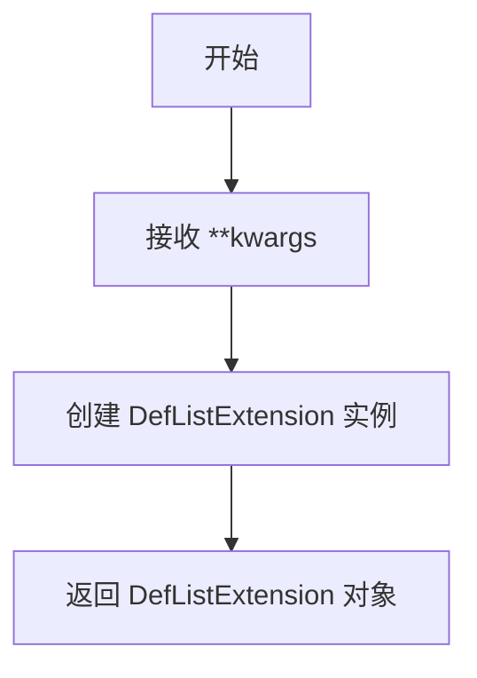
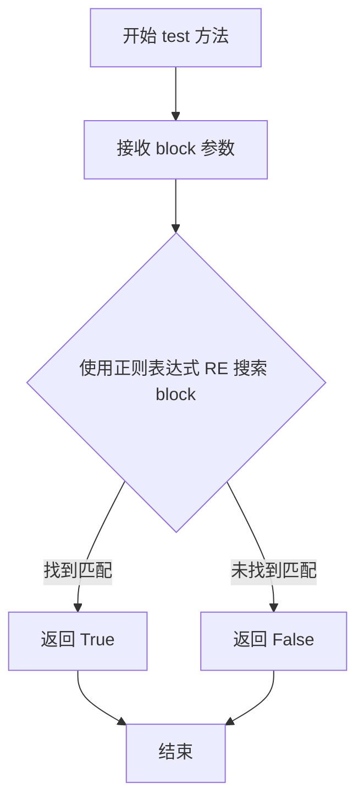
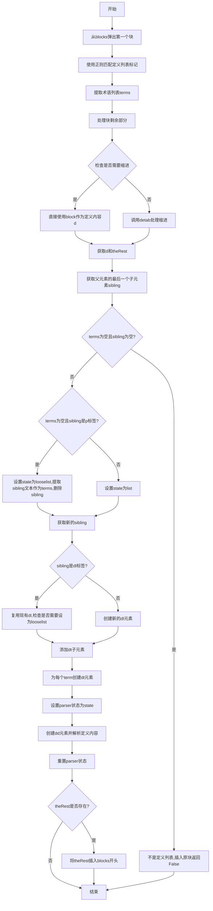
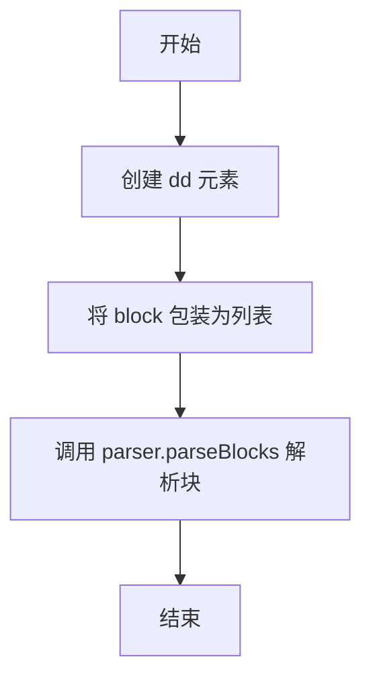
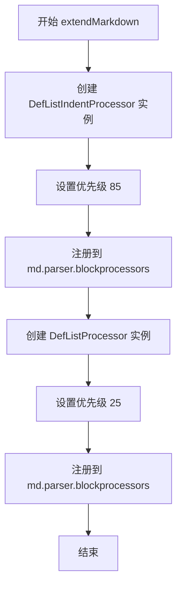
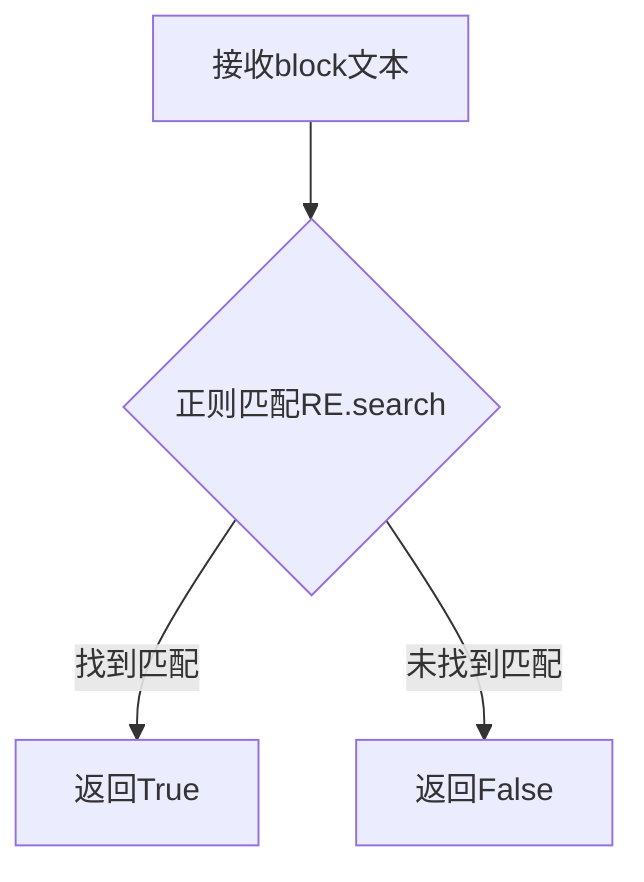
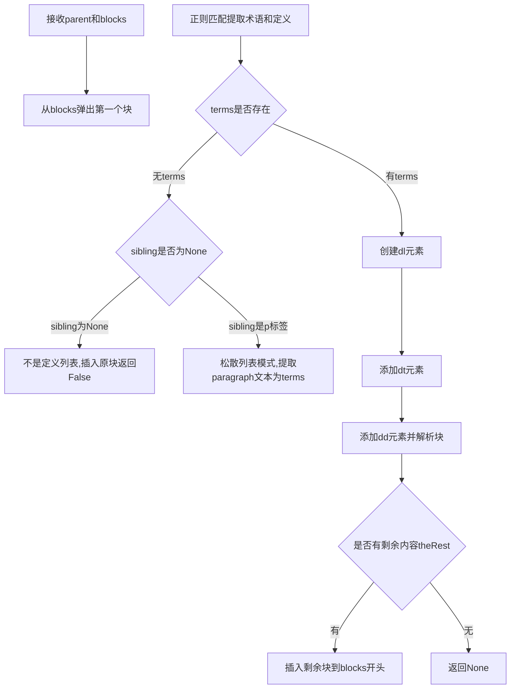
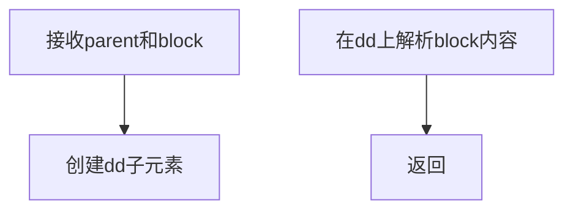
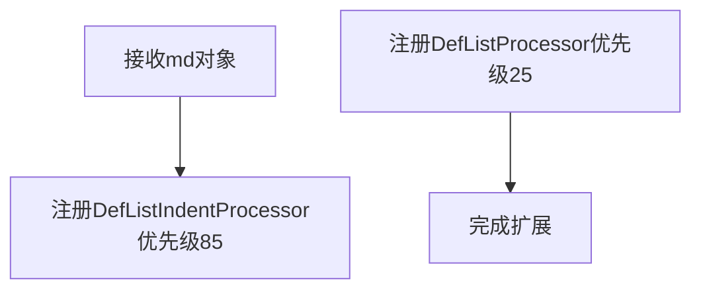

# `markdown\markdown\extensions\def_list.py` 详细设计文档

该代码是一个 Python-Markdown 扩展，提供了对定义列表（Definition Lists）的解析支持，能够将类似 '术语: 定义' 的文本转换为 HTML 的 <dl>, <dt>, <dd> 结构。

## 整体流程

```mermaid
graph TD
    A[Markdown 解析器开始] --> B{检查 DefListProcessor.test}
    B -- 不匹配 --> C[传递给下一个处理器]
    B -- 匹配 --> D[执行 DefListProcessor.run]
    D --> E[提取原始块中的术语 (Terms) 和 定义 (Definition)]
    E --> F{检查父级元素的兄弟节点 (Sibling)}
    F -- 无兄弟节点或为段落 --> G[创建新的 <dl> 元素]
    F -- 已有 <dl> 元素 --> H[复用现有 <dl> 元素]
    G --> I[添加 <dt> 元素 (术语)]
    H --> I
    I --> J[添加 <dd> 元素 (定义)]
    J --> K[递归调用 parser.parseBlocks 解析 <dd> 内的内容]
    K --> L[处理剩余块 (theRest)]
    L --> M[结束]
    K --> N{处理缩进 (DefListIndentProcessor)}
    N -->|嵌套列表/代码块| O[创建 <dd> 或 <li> 子元素]
```

## 类结构

```
Extension (抽象基类)
└── DefListExtension
BlockProcessor (抽象基类)
└── DefListProcessor
ListIndentProcessor (抽象基类)
└── DefListIndentProcessor
```

## 全局变量及字段


### `makeExtension`
    
创建并返回DefListExtension实例的工厂函数，用于Markdown扩展注册

类型：`function`
    


### `DefListProcessor.RE`
    
定义列表项的正则表达式，用于匹配以冒号开头的定义列表条目

类型：`re.Pattern`
    


### `DefListProcessor.NO_INDENT_RE`
    
用于检测无缩进的正则表达式，用于判断定义项是否需要重新计算缩进

类型：`re.Pattern`
    


### `DefListIndentProcessor.ITEM_TYPES`
    
包含 'dd', 'li' 的列表，定义列表项的元素类型

类型：`list`
    


### `DefListIndentProcessor.LIST_TYPES`
    
包含 'dl', 'ol', 'ul' 的列表，定义列表容器的元素类型

类型：`list`
    
    

## 全局函数及方法


### `makeExtension`

该函数是 Python-Markdown 定义列表扩展的入口函数，接收可变关键字参数并创建返回 `DefListExtension` 扩展实例。

参数：

- `**kwargs`：`dict`，可变关键字参数，用于传递配置选项到 `DefListExtension` 构造函数

返回值：`DefListExtension`，返回定义列表扩展的实例对象

#### 流程图



#### 带注释源码

```python
def makeExtension(**kwargs):  # pragma: no cover
    """
    创建并返回 Definition List Extension 实例。
    
    这是 Python-Markdown 扩展的入口函数，会被 Markdown 库
    在加载扩展时调用。
    
    参数:
        **kwargs: 传递给 DefListExtension 的配置选项
        
    返回值:
        DefListExtension: 定义列表扩展的实例
    """
    return DefListExtension(**kwargs)
```


### `DefListProcessor.test`

该方法用于测试给定的文本块是否符合定义列表的语法格式，通过正则表达式匹配以冒号开头的定义项模式。

参数：

- `parent`：`etree.Element`，父元素节点，用于上下文参考（在此方法中未直接使用）
- `block`：`str`，待测试的 Markdown 文本块

返回值：`bool`，如果文本块符合定义列表语法则返回 `True`，否则返回 `False`

#### 流程图



#### 带注释源码

```python
def test(self, parent: etree.Element, block: str) -> bool:
    """
    测试给定的文本块是否符合定义列表的语法格式。
    
    定义列表的语法格式为：可选换行 + 可选0-3个空格 + 冒号 + 1-3个空格 + 定义项内容
    
    Args:
        parent: 父元素节点（此方法中未使用，仅为方法签名一致性）
        block: 待测试的 Markdown 文本块
        
    Returns:
        bool: 如果文本块符合定义列表语法返回 True，否则返回 False
    """
    # 使用预编译的正则表达式 RE 在 block 中搜索匹配项
    # RE = re.compile(r'(^|\n)[ ]{0,3}:[ ]{1,3}(.*?)(\n|$)')
    # 匹配模式说明：
    # (^|\n)        - 匹配行首或换行符后
    # [ ]{0,3}      - 匹配0-3个空格（支持不同缩进级别）
    # :             - 匹配冒号（定义列表的关键标记）
    # [ ]{1,3}      - 匹配1-3个空格（冒号后的分隔空格）
    # (.*?)         - 捕获定义项内容（非贪婪匹配）
    # (\n|$)        - 匹配换行符或字符串结尾
    
    return bool(self.RE.search(block))
    # bool() 将 regex 匹配结果转换为布尔值
    # - 有匹配结果（Match对象）-> True
    # - 无匹配结果（None）-> False
```

#### 补充说明

| 项目 | 说明 |
|------|------|
| **正则表达式** | `r'(^\|\n)[ ]{0,3}:[ ]{1,3}(.*?)(\n\|$)'` |
| **匹配示例** | `"\n: Definition term"`, `" :term"`, `":term\ndefinition"` |
| **设计目的** | 作为 BlockProcessor 的入口检测方法，确定是否调用后续的 `run()` 方法处理定义列表 |
| **调用场景** | 由 Markdown 的 BlockParser 在遍历块级处理器时调用，作为过滤器的角色 |


### `DefListProcessor.run`

处理 Markdown 定义列表的核心方法，负责解析定义列表语法（术语和定义）并生成对应的 HTML `<dl>`、`<dt>`、`<dd>` 元素结构。

参数：

- `parent`：`etree.Element`，父 XML 元素，用于追加生成的结构
- `blocks`：`list[str]` Markdown 块列表，包含待处理的原始文本块

返回值：`bool | None`，返回 False 表示当前块不是有效的定义列表（可能为普通段落），None 表示处理成功

#### 流程图



#### 带注释源码

```python
def run(self, parent: etree.Element, blocks: list[str]) -> bool | None:
    """
    处理定义列表的主方法。
    
    参数:
        parent: etree.Element - 父 XML 元素
        blocks: list[str] - Markdown 块列表
    
    返回:
        bool | None - False 表示不是有效定义列表,None 表示处理成功
    """
    
    # 1. 从块列表中弹出第一个块进行处理
    raw_block = blocks.pop(0)
    
    # 2. 使用正则表达式匹配定义列表的标记模式 (如 ": term\n  definition")
    m = self.RE.search(raw_block)
    
    # 3. 提取标记前的内容作为术语列表，按换行分割并去除空白
    terms = [term.strip() for term in
             raw_block[:m.start()].split('\n') if term.strip()]
    
    # 4. 获取标记后的块内容
    block = raw_block[m.end():]
    
    # 5. 检查定义内容是否需要缩进处理
    no_indent = self.NO_INDENT_RE.match(block)
    if no_indent:
        # 不需要缩进，直接使用整个块作为定义内容
        d, theRest = (block, None)
    else:
        # 需要处理缩进，调用 detab 方法
        d, theRest = self.detab(block)
    
    # 6. 组装定义内容，将标记中的定义与后续内容合并
    if d:
        d = '{}\n{}'.format(m.group(2), d)
    else:
        d = m.group(2)
    
    # 7. 获取父元素的最后一个子元素作为兄弟节点
    sibling = self.lastChild(parent)
    
    # 8. 处理没有术语且没有兄弟节点的情况
    if not terms and sibling is None:
        # 这不是定义项，可能是以冒号开头的普通段落
        # 将原块放回块列表开头
        blocks.insert(0, raw_block)
        return False
    
    # 9. 处理前一个段落包含术语的情况（宽松列表模式）
    if not terms and sibling.tag == 'p':
        # 前一个段落包含了术语
        state = 'looselist'  # 宽松列表状态
        terms = sibling.text.split('\n')
        parent.remove(sibling)  # 移除该段落
        # 重新获取兄弟节点
        sibling = self.lastChild(parent)
    else:
        state = 'list'  # 标准列表状态
    
    # 10. 处理已存在的定义列表或创建新列表
    if sibling is not None and sibling.tag == 'dl':
        # 这是现有列表的另一个项目
        dl = sibling
        # 如果没有术语且最后一个 dd 元素有内容，设为宽松列表
        if not terms and len(dl) and dl[-1].tag == 'dd' and len(dl[-1]):
            state = 'looselist'
    else:
        # 创建新的定义列表元素 <dl>
        dl = etree.SubElement(parent, 'dl')
    
    # 11. 添加术语元素 <dt>
    for term in terms:
        dt = etree.SubElement(dl, 'dt')
        dt.text = term
    
    # 12. 解析并添加定义内容 <dd>
    self.parser.state.set(state)  # 设置解析器状态
    dd = etree.SubElement(dl, 'dd')
    self.parser.parseBlocks(dd, [d])  # 解析定义内容块
    self.parser.state.reset()  # 重置解析器状态
    
    # 13. 处理剩余未处理的内容
    if theRest:
        # 将剩余内容放回块列表开头
        blocks.insert(0, theRest)
```


### `DefListIndentProcessor.create_item`

创建新的 `dd` 元素（或根据父元素类型创建 `li`），并将块解析到该元素中。这是定义列表缩进处理器的核心方法，用于处理定义列表项的缩进部分。

参数：

- `parent`：`etree.Element`，父元素容器
- `block`：`str`，要解析的块内容

返回值：`None`，无返回值

#### 流程图



#### 带注释源码

```python
def create_item(self, parent: etree.Element, block: str) -> None:
    """ Create a new `dd` or `li` (depending on parent) and parse the block with it as the parent. """

    # 创建一个新的 <dd> 元素作为父元素的子元素
    # 虽然方法文档提到会根据父元素类型创建 dd 或 li，
    # 但实际实现中固定创建 dd 元素
    dd = etree.SubElement(parent, 'dd')
    
    # 调用解析器的 parseBlocks 方法，将 block 内容解析到 dd 元素中
    # 将 block 包装为列表，因为 parseBlocks 接受 blocks 列表参数
    self.parser.parseBlocks(dd, [block])
```


### `DefListExtension.extendMarkdown`

该方法是 Definition List（定义列表）扩展的核心入口点，负责将定义列表处理器注册到 Markdown 解析器的块处理器中，使 Markdown 能够解析和渲染定义列表语法。

参数：

- `md`：`markdown.Markdown`，Python-Markdown 的核心对象，包含解析器和渲染器配置

返回值：`None`，该方法通过副作用（注册处理器）完成功能，不返回任何值

#### 流程图



#### 带注释源码

```python
def extendMarkdown(self, md):
    """ Add an instance of `DefListProcessor` to `BlockParser`. """
    # 第一个注册：定义列表的缩进处理器
    # 优先级 85，较高优先级确保在其他处理器之前处理缩进
    md.parser.blockprocessors.register(DefListIndentProcessor(md.parser), 'defindent', 85)
    
    # 第二个注册：定义列表的核心处理器
    # 优先级 25，较低优先级确保在其他块处理器之后处理
    md.parser.blockprocessors.register(DefListProcessor(md.parser), 'deflist', 25)
```

## 关键组件


# Python-Markdown 定义列表扩展详细设计文档

## 一段话描述

该代码是Python-Markdown的一个扩展模块，为Markdown解析器添加了定义列表（Definition Lists）的支持，允许用户使用`:term definition`的语法格式编写术语定义列表，并将其转换为HTML的`<dl>`、`<dt>`、`<dd>`结构。

## 文件整体运行流程

1. **扩展加载阶段**：当Python-Markdown加载扩展时，`makeExtension()`函数被调用，创建`DefListExtension`实例
2. **处理器注册阶段**：`DefListExtension.extendMarkdown()`方法将`DefListIndentProcessor`和`DefListProcessor`注册到Markdown的块处理器注册表中
3. **文档解析阶段**：当解析Markdown文档时，`DefListProcessor.test()`方法检测是否存在定义列表模式（`: `或`:   `开头）
4. **列表处理阶段**：如果检测到定义列表，`DefListProcessor.run()`方法负责解析术语和定义，创建对应的XML元素树结构
5. **缩进处理阶段**：`DefListIndentProcessor`处理定义列表中缩进的子内容

## 类详细信息

### DefListProcessor

**描述**：继承自BlockProcessor的块处理器类，负责检测和解析定义列表语法

**类字段**：
| 字段名 | 类型 | 描述 |
|--------|------|------|
| RE | re.Pattern | 正则表达式，用于匹配定义列表项的pattern，匹配`:definition`或`:   definition`格式 |
| NO_INDENT_RE | re.Pattern | 正则表达式，用于检测定义文本是否无缩进 |

**类方法**：
#### test

```python
def test(self, parent: etree.Element, block: str) -> bool
```

| 参数名 | 参数类型 | 参数描述 |
|--------|----------|----------|
| parent | etree.Element | 父XML元素 |
| block | str | 待检测的文本块 |

| 返回值类型 | 返回值描述 |
|------------|------------|
| bool | 如果block中包含定义列表语法返回True，否则返回False |

**mermaid流程图**：


**带注释源码**：
```python
def test(self, parent: etree.Element, block: str) -> bool:
    """Test if block contains definition list pattern.
    
    Args:
        parent: Parent XML element (unused in this method)
        block: Text block to test
        
    Returns:
        True if block contains definition list syntax (:term definition)
    """
    return bool(self.RE.search(block))
```

#### run

```python
def run(self, parent: etree.Element, blocks: list[str]) -> bool | None
```

| 参数名 | 参数类型 | 参数描述 |
|--------|----------|----------|
| parent | etree.Element | 父XML元素，用于挂载dl元素 |
| blocks | list[str] | 文本块列表，包含待解析的定义列表内容 |

| 返回值类型 | 返回值描述 |
|------------|------------|
| bool \| None | 成功处理返回None，失败返回False |

**mermaid流程图**：


**带注释源码**：
```python
def run(self, parent: etree.Element, blocks: list[str]) -> bool | None:
    """Process definition list block.
    
    Extracts terms and definitions from the block and creates 
    dl/dt/dd XML elements.
    
    Args:
        parent: Parent XML element to attach definition list
        blocks: List of text blocks to process
        
    Returns:
        None on success, False if not a definition list
    """
    # Pop first block from list
    raw_block = blocks.pop(0)
    # Find definition pattern match
    m = self.RE.search(raw_block)
    # Extract terms from text before the match (split by newline)
    terms = [term.strip() for term in
             raw_block[:m.start()].split('\n') if term.strip()]
    # Get definition text after the match
    block = raw_block[m.end():]
    # Check if definition has no indent
    no_indent = self.NO_INDENT_RE.match(block)
    if no_indent:
        d, theRest = (block, None)
    else:
        # Handle tab indentation
        d, theRest = self.detab(block)
    # Format definition with term if there was indented content
    if d:
        d = '{}\n{}'.format(m.group(2), d)
    else:
        d = m.group(2)
    # Get last child of parent
    sibling = self.lastChild(parent)
    # Handle case where this is first item
    if not terms and sibling is None:
        # Not a definition list - likely a paragraph starting with colon
        blocks.insert(0, raw_block)
        return False
    # Handle loose list (previous paragraph contains terms)
    if not terms and sibling.tag == 'p':
        state = 'looselist'
        terms = sibling.text.split('\n')
        parent.remove(sibling)
        sibling = self.lastChild(parent)
    else:
        state = 'list'
    # Get or create dl element
    if sibling is not None and sibling.tag == 'dl':
        dl = sibling
        # Check for loose list state
        if not terms and len(dl) and dl[-1].tag == 'dd' and len(dl[-1]):
            state = 'looselist'
    else:
        # Create new definition list
        dl = etree.SubElement(parent, 'dl')
    # Add term elements
    for term in terms:
        dt = etree.SubElement(dl, 'dt')
        dt.text = term
    # Add definition element
    self.parser.state.set(state)
    dd = etree.SubElement(dl, 'dd')
    self.parser.parseBlocks(dd, [d])
    self.parser.state.reset()
    # Put back remaining content
    if theRest:
        blocks.insert(0, theRest)
```

---

### DefListIndentProcessor

**描述**：继承自ListIndentProcessor的缩进处理器，用于处理定义列表中缩进的子内容

**类字段**：
| 字段名 | 类型 | 描述 |
|--------|------|------|
| ITEM_TYPES | list[str] | 列表项类型，包含'dd'和'li'，将dd也视为列表项 |
| LIST_TYPES | list[str] | 列表类型，包含'dl'、'ol'、'ul'，将dl也视为列表类型 |

**类方法**：
#### create_item

```python
def create_item(self, parent: etree.Element, block: str) -> None
```

| 参数名 | 参数类型 | 参数描述 |
|--------|----------|----------|
| parent | etree.Element | 父元素，通常是dl元素 |
| block | str | 要解析的文本块 |

| 返回值类型 | 返回值描述 |
|------------|------------|
| None | 无返回值 |

**mermaid流程图**：


**带注释源码**：
```python
def create_item(self, parent: etree.Element, block: str) -> None:
    """Create a new `dd` or `li` (depending on parent) and parse the block with it as the parent.
    
    Args:
        parent: Parent element (usually 'dl')
        block: Text block to parse as definition
    """
    # Create dd (definition description) element
    dd = etree.SubElement(parent, 'dd')
    # Parse block content into the dd element
    self.parser.parseBlocks(dd, [block])
```

---

### DefListExtension

**描述**：Python-Markdown扩展类，负责注册定义列表处理器到Markdown解析器

**类字段**：
无类字段

**类方法**：
#### extendMarkdown

```python
def extendMarkdown(self, md) -> None
```

| 参数名 | 参数类型 | 参数描述 |
|--------|----------|----------|
| md | Markdown | Markdown实例对象 |

| 返回值类型 | 返回值描述 |
|------------|------------|
| None | 无返回值 |

**mermaid流程图**：


**带注释源码**：
```python
def extendMarkdown(self, md):
    """Add an instance of `DefListProcessor` to `BlockParser`.
    
    Registers both DefListIndentProcessor and DefListProcessor
    to the block processor registry with appropriate priorities.
    
    Args:
        md: Markdown instance to extend
    """
    # Register indent processor with priority 85
    md.parser.blockprocessors.register(DefListIndentProcessor(md.parser), 'defindent', 85)
    # Register main definition list processor with priority 25
    md.parser.blockprocessors.register(DefListProcessor(md.parser), 'deflist', 25)
```

---

## 全局函数详细信息

### makeExtension

```python
def makeExtension(**kwargs) -> DefListExtension
```

| 参数名 | 参数类型 | 参数描述 |
|--------|----------|----------|
| kwargs | dict | 关键字参数，传递给DefListExtension |

| 返回值类型 | 返回值描述 |
|------------|------------|
| DefListExtension | 返回一个新的DefListExtension实例 |

**带注释源码**：
```python
def makeExtension(**kwargs):  # pragma: no cover
    """Create and return DefListExtension instance.
    
    This is the entry point called by Python-Markdown when
    loading the extension.
    
    Args:
        **kwargs: Keyword arguments passed to DefListExtension
        
    Returns:
        DefListExtension instance
    """
    return DefListExtension(**kwargs)
```

---

## 关键组件信息

### 组件1: 定义列表语法检测（DefListProcessor.RE）

使用正则表达式`r'(^|\n)[ ]{0,3}:[ ]{1,3}(.*?)(\n|$)'`检测定义列表语法，支持0-3个前导空格和1-3个冒号后空格。

### 组件2: 惰性加载与块处理

采用块处理机制，一次只处理一个块，使用`blocks.pop(0)`获取当前块，剩余内容通过`blocks.insert(0, theRest)`放回处理队列。

### 组件3: 松散列表与紧凑列表状态机

通过`state`变量管理两种模式：`looselist`（松散列表，术语与定义分开成段落）和`list`（紧凑列表），根据上下文自动切换。

### 组件4: XML元素树构建

使用`xml.etree.ElementTree`构建DOM结构，创建`<dl>`、`<dt>`、`<dd>`元素并设置文本内容。

---

## 潜在技术债务与优化空间

1. **正则表达式性能**：使用`re.compile`预编译正则表达式是好的做法，但`NO_INDENT_RE`的编译可以移到类级别
2. **字符串格式化**：使用`'{}\n{}'.format()`较为老旧，可考虑使用f-string提升可读性
3. **类型注解**：部分返回类型使用了`bool | None`（Python 3.10+联合类型），可能影响旧版本Python兼容性
4. **错误处理**：缺乏对异常输入的健壮性处理，如空块、格式错误等
5. **代码复用**：`create_item`方法与父类逻辑高度相似，可考虑抽象到基类

---

## 其它项目

### 设计目标与约束
- **目标**：为Python-Markdown添加符合GitHub风格的定义列表支持
- **约束**：保持与现有块处理器的兼容性，通过优先级协调处理顺序
- **优先级**：deflist=25（高优先级，在普通列表之前处理），defindent=85（缩进处理器）

### 错误处理与异常设计
- 当检测不到有效定义列表时，将原块放回blocks队列并返回False
- 使用`bool()`包装正则匹配结果，避免返回None
- 缺乏显式的异常捕获机制

### 数据流与状态机
- **输入**：Markdown文本块
- **处理流程**：检测 → 解析术语 → 解析定义 → 构建XML树 → 输出HTML
- **状态转换**：初始 → looselist/list → 处理完成

### 外部依赖与接口契约
- 依赖`markdown.blockprocessors.BlockProcessor`和`ListIndentProcessor`
- 依赖`xml.etree.ElementTree`进行XML操作
- 依赖`re`模块进行正则匹配
- 对外提供`makeExtension()`接口供Python-Markdown加载


## 问题及建议


### 已知问题

-   **正则表达式重复编译**：`RE`和`NO_INDENT_RE`作为类属性，在每次实例化`DefListProcessor`时不会被缓存或预编译，应考虑作为模块级常量以提高性能
-   **魔法数字和硬编码值**：处理器优先级`85`和`25`直接硬编码在`extendMarkdown`方法中，缺乏注释说明其含义和设计考量
-   **状态管理使用字符串字面量**：`run`方法中使用`'list'`和`'looselist'`字符串表示状态，容易产生拼写错误，建议使用枚举或常量类
-   **变量命名不够清晰**：使用单字母或缩写命名如`d`、`theRest`、`m`、`dl`、`dd`、`dt`降低了代码可读性
-   **字符串操作效率**：在`run`方法中大量使用字符串拼接`'{}\n{}'.format(...)`和多次`split('\n')`操作，可优化为更高效的字符串处理方式
-   **缺少类型注解精确性**：部分变量如`sibling`的返回类型声明可以更精确，`test`方法返回值声明为`bool | None`但实际只返回布尔值
-   **文档字符串不完整**：`DefListExtension`类的文档字符串过于简单，`makeExtension`函数缺少参数说明

### 优化建议

-   将正则表达式移到模块顶部作为常量：`RE = re.compile(...)` 和 `NO_INDENT_RE = re.compile(...)`
-   定义优先级常量类或使用命名常量替代魔法数字，并添加注释说明优先级设置依据
-   创建状态枚举类替代字符串字面量，例如`class DefListState: LIST = 'list'; LOOSELIST = 'looselist'`
-   重命名缩写变量为更具描述性的名称，如`d`→`definition`, `theRest`→`remainingBlock`, `dl`→`defList`, `dd`→`defDescription`, `dt`→`defTerm`
-   使用`textwrap.dedent`或列表推导式处理多行文本，减少字符串拼接操作
-   完善文档字符串，特别是`extendMarkdown`、`test`和`create_item`等公开方法应包含参数和返回值说明
-   考虑添加单元测试覆盖边界情况，如空定义项、嵌套列表、混合列表类型等

## 其它


### 设计目标与约束

本扩展旨在为Python-Markdown添加Definition Lists（定义列表）支持，使Markdown能够解析类似术语表或 glossary 的格式。设计目标包括：遵循Markdown标准定义列表语法、与其他块处理器无缝集成、支持嵌套结构。约束条件包括：依赖Python-Markdown的核心架构、需要与列表处理器正确协作、必须处理边缘情况（如空定义、混合列表）。

### 错误处理与异常设计

代码主要通过返回False表示非定义列表场景，通过条件判断处理各种边界情况。当无法匹配定义列表模式时，将原始块重新插入队列并返回False。对于缺少术语的情况，会尝试从上一段落获取或判定为非定义列表。未实现显式异常抛出，错误处理依赖于Python-Markdown的块处理器框架。

### 数据流与状态机

DefListProcessor维护两种状态：'list'状态（标准定义列表）和'looselist'状态（宽松定义列表，术语与定义之间有空行）。状态转换逻辑：初始为'list'状态；当存在上一段落包含术语且当前块无缩进时转为'looselist'；当现有dl中最后一个dd元素有子内容时也转为'looselist'。状态通过self.parser.state.set()和reset()管理，用于控制子块的解析方式。

### 外部依赖与接口契约

依赖Python-Markdown的核心模块：Extension基类、BlockProcessor和ListIndentProcessor块处理器类、ElementTree用于XML元素构建、正则表达式模块re。接口契约：BlockProcessor需实现test()和run()方法；Extension需实现extendMarkdown()方法；处理器需注册到md.parser.blockprocessors注册表中，按优先级排序（defindent优先级85，deflist优先级25）。

### 正则表达式设计说明

DefListProcessor.RE = re.compile(r'(^|\n)[ ]{0,3}:[ ]{1,3}(.*?)(\n|$)') 用于匹配定义列表标记，格式为": "（冒号后至少一个空格，可最多3个空格前导）。NO_INDENT_RE = re.compile(r'^[ ]{0,3}[^ :]') 用于检测定义内容是否无缩进，用于判断列表项是否结束。

### HTML输出格式

解析后的定义列表生成HTML结构：<dl>作为根元素，<dt>包含术语，<dd>包含定义。示例：":term\ndefinition" 转换为 "<dl><dt>term</dt><dd><p>definition</p></dd></dl>"

### 配置参数

DefListExtension和makeExtension接受**kwargs参数，可用于未来配置扩展行为。当前实现中未使用任何配置参数，保留此接口以便向后兼容。

    