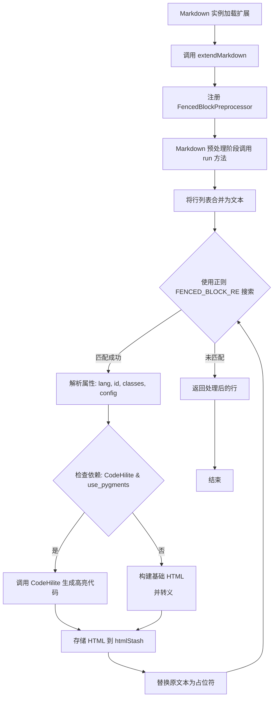
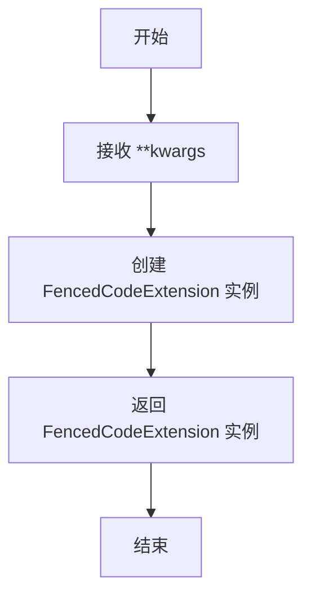
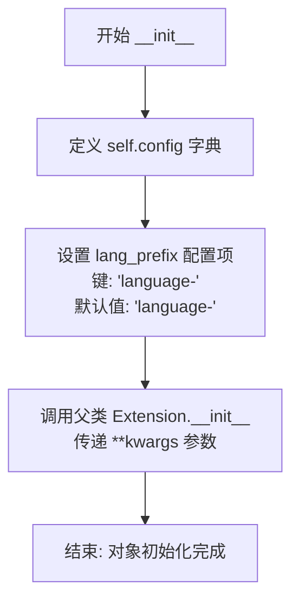
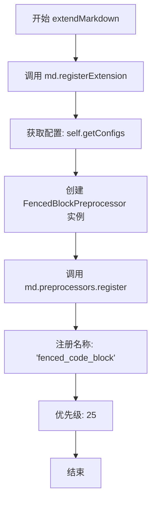

# `markdown\markdown\extensions\fenced_code.py` 详细设计文档

这是一个 Python-Markdown 扩展，名为 Fenced Code Extension，用于解析 Markdown 文本中的围栏代码块（使用三个反引号或波浪号），支持通过 CodeHilite 进行语法高亮，并允许为代码块指定语言、ID、类名及自定义键值对属性。

## 整体流程



## 类结构

```
Extension (基类)
└── FencedCodeExtension
Preprocessor (基类)
└── FencedBlockPreprocessor
```

## 全局变量及字段


### `makeExtension`
    
工厂函数，用于创建并返回 FencedCodeExtension 实例

类型：`function`
    


### `FencedCodeExtension.config`
    
扩展配置项，包含 lang_prefix 等选项

类型：`dict[str, Any]`
    


### `FencedCodeExtension.__init__`
    
初始化方法，设置默认配置项

类型：`method`
    


### `FencedCodeExtension.extendMarkdown`
    
向 Markdown 实例注册 FencedBlockPreprocessor 预处理器

类型：`method`
    


### `FencedBlockPreprocessor.FENCED_BLOCK_RE`
    
用于匹配围栏代码块的正则表达式，支持~~~和

类型：`re.Pattern`
    
    

## 全局函数及方法


### `makeExtension`

这是一个工厂函数，用于创建并返回 `FencedCodeExtension` 实例，以便将其作为 Markdown 扩展注册到 Python-Markdown 中。

参数：

- `**kwargs`：`任意关键字参数`，传递给 `FencedCodeExtension` 构造函数的配置参数

返回值：`FencedCodeExtension`，返回初始化后的 FencedCodeExtension 实例

#### 流程图



#### 带注释源码

```python
def makeExtension(**kwargs):  # pragma: no cover
    """
    工厂函数，用于创建并返回 FencedCodeExtension 实例。
    
    这是 Python-Markdown 扩展的入口点函数，当使用 markdown.markdown(extensions=[...]) 
    或 markdown.Markdown(extensions=[...]) 加载扩展时，Python-Markdown 会自动调用此函数。
    
    参数:
        **kwargs: 关键字参数，将传递给 FencedCodeExtension.__init__()
                 目前支持 'lang_prefix' 配置项
    
    返回值:
        FencedCodeExtension: 初始化后的扩展实例
    """
    return FencedCodeExtension(**kwargs)
```


### `FencedCodeExtension.__init__`

该方法用于初始化 FencedCodeExtension（围栏代码块扩展）的配置。它定义了默认的配置选项，包括语言前缀（lang_prefix），并调用父类的初始化方法完成扩展的注册基础设置。

参数：

- `**kwargs`：`dict`，关键字参数，会传递给父类 `Extension.__init__` 用于扩展的基类初始化

返回值：`None`，无返回值（`__init__` 方法用于初始化对象状态）

#### 流程图



#### 带注释源码

```python
def __init__(self, **kwargs):
    # 定义默认配置选项字典
    self.config = {
        'lang_prefix': ['language-', 'Prefix prepended to the language. Default: "language-"']
        # lang_prefix: 字符串前缀，用于在语言标识符前添加
        # 数组第二项为配置项的描述说明
    }
    """ Default configuration options. """
    
    # 调用父类 Extension 的初始化方法
    # 传递所有接收到的关键字参数
    super().__init__(**kwargs)
```


### `FencedCodeExtension.extendMarkdown`

该方法是 Fenced Code 扩展的核心入口点，负责将 `FencedBlockPreprocessor` 注册到 Markdown 实例中，使 Markdown 能够识别和处理由反引号或波浪号包裹的代码块。

参数：

- `md`：`Markdown`，Python Markdown 的核心实例，用于注册扩展和预处理器

返回值：`None`，该方法通过副作用注册预处理器，不返回任何值

#### 流程图



#### 带注释源码

```python
def extendMarkdown(self, md):
    """ Add `FencedBlockPreprocessor` to the Markdown instance. """
    # 将当前扩展实例注册到 Markdown 对象
    # 使 Markdown 能够通过 md.extensons 访问此扩展
    md.registerExtension(self)

    # 创建 FencedBlockPreprocessor 实例并注册到预处理器注册表
    # 参数:
    #   - FencedBlockPreprocessor(md, self.getConfigs()): 传入 Markdown 实例和扩展配置
    #   - 'fenced_code_block': 预处理的唯一名称标识符
    #   - 25: 处理器优先级，数值越小越先执行（低于标准块的 30）
    md.preprocessors.register(FencedBlockPreprocessor(md, self.getConfigs()), 'fenced_code_block', 25)
```


### `FencedBlockPreprocessor.__init__`

该方法是 `FencedBlockPreprocessor` 类的构造函数，负责初始化围栏代码块预处理器，包括配置存储、依赖检查标志、代码高亮配置、属性列表支持以及布尔选项列表的设置。

参数：

- `md`：`Markdown` 类型，Markdown 实例对象，用于访问注册扩展和 HTML 存储等
- `config`：`dict[str, Any]` 类型，包含扩展配置的字典，如 `lang_prefix` 等选项

返回值：`None`，构造函数无返回值，仅进行对象初始化操作

#### 流程图

```mermaid
flowchart TD
    A[开始 __init__] --> B[调用 super().__init__md]
    B --> C[设置 self.config = config]
    C --> D[设置 self.checked_for_deps = False]
    D --> E[设置 self.codehilite_conf = 空字典]
    E --> F[设置 self.use_attr_list = False]
    F --> G[初始化 self.bool_options 列表]
    G --> H[结束]
```

#### 带注释源码

```python
def __init__(self, md: Markdown, config: dict[str, Any]):
    """初始化 FencedBlockPreprocessor 实例。
    
    Args:
        md: Markdown 处理器实例，用于访问注册扩展和 htmlStash 等
        config: 包含扩展配置的字典，如 lang_prefix 等
    """
    # 调用父类 Preprocessor 的构造函数，传递 md 实例
    super().__init__(md)
    
    # 存储扩展配置字典，供后续方法使用
    self.config = config
    
    # 标志位：是否已检查过依赖的扩展（CodeHiliteExtension 和 AttrListExtension）
    # 避免在 run 方法中重复检查
    self.checked_for_deps = False
    
    # 存储 CodeHilite 扩展的配置，初始化为空字典
    # 只有当 CodeHiliteExtension 被注册时才会有值
    self.codehilite_conf: dict[str, Any] = {}
    
    # 标志位：是否启用 AttrListExtension（属性列表扩展）
    # 用于解析代码块的 id、class、key=value 等属性
    self.use_attr_list = False
    
    # 布尔选项列表：这些配置项会被转换为布尔值
    # - linenums: 是否显示行号
    # - guess_lang: 是否自动猜测语言
    # - noclasses: 是否不使用 CSS 类而使用内联样式
    # - use_pygments: 是否使用 Pygments 进行高亮
    self.bool_options = [
        'linenums',
        'guess_lang',
        'noclasses',
        'use_pygments'
    ]
```


### `FencedBlockPreprocessor.run`

该方法是 Python-Markdown 围栏代码块（Fenced Code Blocks）扩展的核心处理逻辑，负责扫描 Markdown 文本中的围栏代码块语法，解析语言标识和属性配置，根据是否启用代码高亮插件生成对应的 HTML 代码片段，并使用占位符替换原始内容后返回处理后的行列表。

参数：

-  `lines`：`list[str]`、输入的 Markdown 文本行列表

返回值：`list[str]`、处理后的 Markdown 文本行列表，其中围栏代码块已被替换为 HTML 占位符

#### 流程图

```mermaid
flowchart TD
    A[开始 run 方法<br/>输入: lines list[str]] --> B{检查依赖扩展}
    B -->|首次运行| C[遍历注册扩展<br/>检测 CodeHiliteExtension<br/>检测 AttrListExtension]
    C --> D[标记 checked_for_deps = True]
    B -->|非首次运行| D
    D --> E[将 lines 合并为 text<br/>index = 0]
    E --> F{使用正则表达式<br/>搜索围栏代码块}
    F -->|找到匹配| G[初始化变量<br/>lang, id, classes, config]
    G --> H{检查 attrs 属性}
    H -->|有 attrs| I[解析属性和剩余内容<br/>验证花括号匹配]
    H -->|无 attrs| J[检查 lang 属性<br/>检查 hl_lines 属性]
    I -->|匹配无效| K[index = m.end<br/>跳过继续]
    I -->|匹配有效| L[调用 handle_attrs<br/>提取 id, classes, config]
    J --> L
    L --> M{codehilite_conf 存在<br/>且 use_pygments 为真}
    M -->|是| N[合并配置<br/>构建 CodeHilite 实例]
    N --> O[调用 hilite 方法<br/>生成高亮代码]
    M -->|否| P[构建基础 HTML 属性<br/>id_attr, class_attr, lang_attr, kv_pairs]
    P --> Q[转义代码内容<br/>组装<pre><code>标签]
    O --> R[使用 htmlStash.store<br/>生成占位符]
    Q --> R
    R --> S[替换 text 中的代码块<br/>为占位符]
    S --> T[index = m.start + 1<br/>+ len(placeholder)]
    T --> F
    F -->|未找到匹配| U[text.split 返回行列表]
    U --> V[结束 返回 list[str]]
    K --> F
```

#### 带注释源码

```python
def run(self, lines: list[str]) -> list[str]:
    """ Match and store Fenced Code Blocks in the `HtmlStash`. """

    # 检查是否已检查过依赖扩展，避免重复检测
    if not self.checked_for_deps:
        # 遍历所有已注册的 Markdown 扩展
        for ext in self.md.registeredExtensions:
            # 检测代码高亮扩展，获取其配置
            if isinstance(ext, CodeHiliteExtension):
                self.codehilite_conf = ext.getConfigs()
            # 检测属性列表扩展
            if isinstance(ext, AttrListExtension):
                self.use_attr_list = True

        # 标记已完成依赖检查
        self.checked_for_deps = True

    # 将输入的 Markdown 行列表合并为单个字符串，便于正则匹配
    text = "\n".join(lines)
    index = 0
    
    # 进入循环，持续搜索围栏代码块
    while 1:
        # 使用预编译的正则表达式搜索下一个围栏代码块
        m = self.FENCED_BLOCK_RE.search(text, index)
        
        if m:
            # 初始化解析结果变量
            lang, id, classes, config = None, '', [], {}
            
            # 检查是否使用了 {attrs} 语法
            if m.group('attrs'):
                # 解析属性和剩余内容
                attrs, remainder = get_attrs_and_remainder(m.group('attrs'))
                
                if remainder:
                    # 花括号不匹配，语法无效，跳过该属性避免无限循环
                    index = m.end('attrs')
                    continue
                
                # 处理属性，提取 id、classes 和配置
                id, classes, config = self.handle_attrs(attrs)
                
                # 如果有类名，第一个作为语言标识
                if len(classes):
                    lang = classes.pop(0)
            else:
                # 检查语言标识
                if m.group('lang'):
                    lang = m.group('lang')
                
                # 检查高亮行配置（向后兼容）
                if m.group('hl_lines'):
                    config['hl_lines'] = parse_hl_lines(m.group('hl_lines'))

            # 如果 codehilite 扩展已启用且使用 Pygments
            if self.codehilite_conf and self.codehilite_conf['use_pygments'] and config.get('use_pygments', True):
                # 复制并合并配置
                local_config = self.codehilite_conf.copy()
                local_config.update(config)
                
                # 合并类名与 cssclass，确保 cssclass 在末尾
                if classes:
                    local_config['css_class'] = '{} {}'.format(
                        ' '.join(classes),
                        local_config['css_class']
                    )
                
                # 创建代码高亮器实例
                highliter = CodeHilite(
                    m.group('code'),
                    lang=lang,
                    style=local_config.pop('pygments_style', 'default'),
                    **local_config
                )

                # 生成高亮后的代码
                code = highliter.hilite(shebang=False)
            else:
                # 构建基础 HTML 属性字符串
                id_attr = lang_attr = class_attr = kv_pairs = ''
                
                # 添加语言属性
                if lang:
                    prefix = self.config.get('lang_prefix', 'language-')
                    lang_attr = f' class="{prefix}{_escape_attrib_html(lang)}"'
                
                # 添加类属性
                if classes:
                    class_attr = f' class="{_escape_attrib_html(" ".join(classes))}"'
                
                # 添加 ID 属性
                if id:
                    id_attr = f' id="{_escape_attrib_html(id)}"'
                
                # 如果启用了 attr_list 且配置存在且未使用 pygments
                if self.use_attr_list and config and not config.get('use_pygments', False):
                    # 生成键值对属性（排除 use_pygments）
                    kv_pairs = ''.join(
                        f' k="{_escape_attrib_html(v)}"' for k, v in config.items() if k != 'use_pygments'
                    )
                
                # 转义代码内容并包装为 HTML
                code = self._escape(m.group('code'))
                code = f'<pre{id_attr}{class_attr}><code{lang_attr}{kv_pairs}>{code}</code></pre>'

            # 使用 Markdown 的 HTML 存储机制保存代码，生成占位符
            placeholder = self.md.htmlStash.store(code)
            
            # 用占位符替换原文本中的代码块
            text = f'{text[:m.start()]}\n{placeholder}\n{text[m.end():]}'
            
            # 更新搜索索引，继续处理后续内容
            index = m.start() + 1 + len(placeholder)
        else:
            # 没有更多匹配，退出循环
            break
    
    # 将处理后的文本分割回行列表并返回
    return text.split("\n")
```


### `FencedBlockPreprocessor.handle_attrs`

该方法用于解析代码块的可选属性（如 id、类名、高亮行等），将属性元组的可迭代对象转换为包含 id、类列表和配置字典的元组，供后续代码块渲染使用。

参数：

- `attrs`：`Iterable[tuple[str, str]]`，属性键值对的可迭代对象，每个元素为 (键, 值) 元组

返回值：`tuple[str, list[str], dict[str, Any]]`，返回由三部分组成的元组：
  - `str`：元素 id
  - `list[str]`：CSS 类名列表
  - `dict[str, Any]`：配置项字典（包括 hl_lines、布尔选项等）

#### 流程图

```mermaid
flowchart TD
    A[开始 handle_attrs] --> B[初始化 id='']
    B --> C[初始化 classes=[]]
    C --> D[初始化 configs={}]
    D --> E{遍历 attrs 中的每个 k, v}
    E -->|k == 'id'| F[id = v]
    E -->|k == '.'| G[classes.append(v)]
    E -->|k == 'hl_lines'| H[configs[k] = parse_hl_lines(v)]
    E -->|k in bool_options| I[configs[k] = parseBoolValue(v)]
    E -->|其他情况| J[configs[k] = v]
    F --> K[继续遍历]
    G --> K
    H --> K
    J --> K
    K --> L{还有更多属性?}
    L -->|是| E
    L -->|否| M[返回 (id, classes, configs)]
```

#### 带注释源码

```python
def handle_attrs(self, attrs: Iterable[tuple[str, str]]) -> tuple[str, list[str], dict[str, Any]]:
    """ Return tuple: `(id, [list, of, classes], {configs})` """
    # 初始化返回值为空的id字符串
    id = ''
    # 初始化空的类名列表
    classes = []
    # 初始化空的配置字典
    configs = {}
    
    # 遍历属性元组中的每个键值对
    for k, v in attrs:
        # 如果键是 'id'，将值赋给 id 变量
        if k == 'id':
            id = v
        # 如果键是 '.'，表示这是一个 CSS 类名，追加到 classes 列表
        elif k == '.':
            classes.append(v)
        # 如果键是 'hl_lines'（高亮行），使用 parse_hl_lines 解析值
        elif k == 'hl_lines':
            configs[k] = parse_hl_lines(v)
        # 如果键是布尔选项（如 linenums, guess_lang 等），使用 parseBoolValue 解析
        elif k in self.bool_options:
            configs[k] = parseBoolValue(v, fail_on_errors=False, preserve_none=True)
        # 其他键值对直接存入 configs 字典
        else:
            configs[k] = v
    
    # 返回包含 id、classes、configs 的元组
    return id, classes, configs
```


### `FencedBlockPreprocessor._escape`

对文本进行基本的 HTML 转义处理，将 `&`、`<`、`>`、`"` 等特殊字符转换为 HTML 实体，以防止 XSS 攻击并确保在 HTML 代码块中正确显示。

#### 参数

- `txt`：`str`，需要转义的原始文本内容

#### 返回值

- `str`，转义后的 HTML 安全文本

#### 流程图

```mermaid
flowchart TD
    A[开始 _escape] --> B{检查 & 字符}
    B -->|存在| C[替换 & 为 &amp;]
    C --> D{检查 < 字符}
    D -->|存在| E[替换 < 为 &lt;]
    E --> F{检查 > 字符}
    F -->|存在| G[替换 > 为 &gt;]
    G --> H{检查 " 字符}
    H -->|存在| I[替换 " 为 &quot;]
    I --> J[返回转义后的文本]
    B -->|不存在| D
    D -->|不存在| F
    F -->|不存在| H
    H -->|不存在| J
```

#### 带注释源码

```python
def _escape(self, txt: str) -> str:
    """ basic html escaping """
    # 将 & 替换为 &amp;（必须首先处理，防止双重转义）
    txt = txt.replace('&', '&amp;')
    # 将 < 替换为 &lt;（防止 HTML 标签注入）
    txt = txt.replace('<', '&lt;')
    # 将 > 替换为 &gt;（防止闭合标签注入）
    txt = txt.replace('>', '&gt;')
    # 将双引号替换为 &quot;（防止属性注入）
    txt = txt.replace('"', '&quot;')
    # 返回转义后的安全文本
    return txt
```

## 关键组件


### FencedCodeExtension

FencedCodeExtension是扩展的主入口类，负责初始化配置并向Markdown实例注册FencedBlockPreprocessor。

### FencedBlockPreprocessor

FencedBlockPreprocessor是核心预处理器类，负责使用正则表达式匹配并提取Markdown文档中的fenced code blocks，将其转换为HTML代码块，并可选地调用CodeHilite进行语法高亮处理。

### FENCED_BLOCK_RE正则表达式

用于匹配fenced code blocks的正则表达式，支持```或~~~开闭 fence，支持可选的语言标识、属性花括号语法、hl_lines高亮行指定，以及捕获代码内容和属性。

### CodeHilite集成

与CodeHiliteExtension的集成逻辑，当codehilite扩展启用且use_pygments为True时，调用CodeHilite类进行代码语法高亮处理，支持通过config传递pygments_style等参数。

### handle_attrs方法

处理fenced code blocks属性的方法，将属性元组列表解析为(id, classes, config)三元组，支持id属性、.前缀的class属性、hl_lines高亮行配置、布尔选项解析及其他键值对配置。

### _escape方法

基本的HTML转义方法，将&、<、>、"等字符转换为HTML实体，防止XSS攻击和HTML解析问题。

### makeExtension函数

工厂函数，用于创建FencedCodeExtension实例，供Markdown库动态加载扩展使用。


## 问题及建议


### 已知问题

- **字符串拼接效率低下**：在 `run` 方法中频繁使用 `f'{text[:m.start()]}\n{placeholder}\n{text[m.end():]}'` 进行字符串拼接，这会在处理大型文档时产生大量中间字符串对象，导致性能问题
- **`_escape` 方法实现简陋**：使用多个独立的 `str.replace()` 调用进行 HTML 转义，而非使用标准库的 `html.escape()`，代码冗余且不够规范
- **配置检查逻辑耦合度过高**：通过遍历 `md.registeredExtensions` 并使用 `isinstance` 检查依赖扩展，这种硬编码的依赖检查方式脆弱且难以维护
- **类型注解不完整**：部分方法缺少返回类型注解，如 `run`、`handle_attrs`、`_escape` 等方法，这降低了代码的可读性和静态类型检查效果
- **错误处理缺失**：`run` 方法中没有对异常情况进行处理，如正则匹配失败、配置解析错误等
- **硬编码的布尔选项**：`self.bool_options` 列表硬编码在类中，如果需要新增布尔配置项需要修改类代码，不够灵活

### 优化建议

- 使用 `re.sub` 配合回调函数的方式处理匹配文本，避免频繁的字符串切片和拼接操作；或考虑使用 `io.StringIO` 进行流式处理
- 将 `_escape` 方法替换为 `html.escape()` 调用，代码更简洁且符合 Python 最佳实践
- 考虑使用更优雅的依赖注入方式，或在扩展初始化时显式传递依赖配置，而不是运行时遍历检查
- 为所有公共方法添加完整的类型注解，提升代码可维护性
- 添加适当的异常处理逻辑，特别是对正则匹配和配置解析部分
- 将布尔选项配置化，支持从外部配置文件中读取或通过构造函数注入

## 其它


### 设计目标与约束

**设计目标**：为Python-Markdown提供一个支持 fenced code blocks（围栏代码块）的扩展，允许用户使用` ``` `或`~~~`标记来定义代码块，并支持语言指定、语法高亮、行号显示、CSS类、ID属性等高级特性。

**设计约束**：
- 必须兼容Python-Markdown的扩展接口架构
- 需支持向后兼容的`hl_lines`参数写法
- 当`codehilite`扩展启用时，优先使用其进行语法高亮
- 当`attr_list`扩展启用时，支持为代码块添加额外属性

### 错误处理与异常设计

**语法错误处理**：
- 当代码块的属性花括号不匹配时（如`{attr}`语法错误），跳过该属性并继续解析，避免无限循环
- 使用`fail_on_errors=False`处理布尔值解析错误，静默忽略无效配置

**边界条件处理**：
- 正则表达式使用`(?<=\n)`确保代码块以换行符结尾
- 处理空的代码块（仅保留围栏标记）
- 处理代码块末尾的空格

**异常传播**：
- 依赖的`CodeHilite`扩展异常向上传播
- 配置缺失时使用默认值降级处理

### 数据流与状态机

**数据流**：
1. Markdown文本输入 → `FencedBlockPreprocessor.run()`
2. 文本拼接后使用正则表达式匹配fenced code blocks
3. 提取语言标识、属性配置、代码内容
4. 若启用`codehilite`，调用`CodeHilite`进行语法高亮
5. 若未启用高亮，构建HTML `<pre><code>`标签
6. 使用`htmlStash.store()`暂存HTML，防止进一步处理
7. 返回包含placeholder的行列表

**状态机**：
- 初始状态 → 检查依赖扩展（一次性）→ 遍历文本匹配代码块 → 解析属性/语言 → 判断是否高亮 → 生成HTML → 替换为placeholder → 继续匹配 → 结束

### 外部依赖与接口契约

**依赖的外部扩展**：
- `CodeHiliteExtension`：可选，用于代码语法高亮
- `AttrListExtension`：可选，用于解析属性列表

**依赖的模块**：
- `markdown.Extension`：扩展基类
- `markdown.preprocessors.Preprocessor`：预处理器基类
- `markdown.util.parseBoolValue`：布尔值解析
- `markdown.serializers._escape_attrib_html`：HTML属性转义
- `codehilite`：代码高亮处理
- `attr_list`：属性列表解析

**提供的接口**：
- `makeExtension(**kwargs)`：入口函数，返回`FencedCodeExtension`实例
- `FencedCodeExtension.getConfigs()`：获取配置
- `FencedBlockPreprocessor.run(lines)`：预处理方法，输入输出均为行列表

### 性能考虑

**正则表达式优化**：
- 使用预编译的正则表达式`FENCED_BLOCK_RE`
- 匹配失败时显式更新索引避免回溯

**依赖检查优化**：
- `checked_for_deps`标志确保依赖检查仅执行一次

**潜在性能问题**：
- 文本拼接`"\n".join(lines)`在大文档时可能影响性能
- 正则表达式`re.DOTALL`模式对长代码块可能有性能影响

### 版本兼容性

**Python版本**：
- 代码使用`from __future__ import annotations`支持类型提示
- 兼容Python 3.x

**Markdown版本**：
- 设计用于Python-Markdown 3.x系列
- 保持与旧版本API的兼容性

### 配置项

**FencedCodeExtension配置**：
| 配置项 | 类型 | 默认值 | 描述 |
|--------|------|--------|------|
| lang_prefix | str | "language-" | 语言属性的前缀 |

**FencedBlockPreprocessor内部配置**：
- 从`codehilite`扩展继承配置
- 从`attr_list`扩展获取属性解析支持
- `bool_options`列表定义需要布尔转换的选项

### 使用示例

**基本用法**：
````markdown
```python
def hello():
    print("Hello, World!")
```
````

**带语言和属性**：
````markdown
```python {.class1 .class2 #myid}
def hello():
    print("Hello")
```
````

**带行号高亮**：
````markdown
```python hl_lines="2 3"
def hello():
    print("Line 2")
    print("Line 3")
```
````

    