# `markdown\markdown\extensions\footnotes.py` 详细设计文档

Python-Markdown 的脚注扩展，为 Markdown 文档提供脚注功能，支持脚注定义、引用渲染、返回链接、去重处理和占位符替换。

## 整体流程

```mermaid
graph TD
    A[Markdown 文档输入] --> B[FootnoteBlockProcessor]
    B --> C{检测脚注定义 [^id]:}
    C -- 是 --> D[提取并存储脚注内容]
    C -- 否 --> E[保留原块]
    D --> F[FootnoteInlineProcessor]
    F --> G{检测引用 [^id]}
    G -- 是 --> H[生成 sup 元素]
    G -- 否 --> I[返回 None]
    H --> J[FootnoteTreeprocessor]
    J --> K[构建 footnote div]
    K --> L[FootnoteReorderingProcessor]
    L --> M{USE_DEFINITION_ORDER}
    M -- False --> N[按引用顺序重排]
    M -- True --> O[保持定义顺序]
    N --> P[FootnotePostTreeprocessor]
    O --> P
    P --> Q[处理重复脚注引用]
    Q --> R[FootnotePostprocessor]
    R --> S[替换占位符为 HTML 实体]
    S --> T[输出 HTML]
```

## 类结构

```
Extension (基类)
└── FootnoteExtension

BlockProcessor (基类)
└── FootnoteBlockProcessor

InlineProcessor (基类)
└── FootnoteInlineProcessor

Treeprocessor (基类)
├── FootnoteTreeprocessor
├── FootnoteReorderingProcessor
└── FootnotePostTreeprocessor

Postprocessor (基类)
└── FootnotePostprocessor
```

## 全局变量及字段


### `FN_BACKLINK_TEXT`
    
脚注返回链接文本占位符，用于在生成HTML前占位，之后被替换为实际的返回链接文本

类型：`str`
    


### `NBSP_PLACEHOLDER`
    
不间断空格占位符，用于在生成HTML前占位，之后被替换为HTML不间断空格实体

类型：`str`
    


### `RE_REF_ID`
    
引用ID正则表达式，用于匹配和解析脚注引用ID

类型：`re.Pattern`
    


### `RE_REFERENCE`
    
脚注引用正则表达式，用于匹配文档中的脚注引用标记[^...]

类型：`re.Pattern`
    


### `FootnoteExtension.config`
    
配置选项字典，存储扩展的各种配置项如PLACE_MARKER、UNIQUE_IDS等

类型：`dict`
    


### `FootnoteExtension.unique_prefix`
    
避免多次调用时的ID冲突前缀计数器

类型：`int`
    


### `FootnoteExtension.found_refs`
    
记录重复引用次数的字典，用于跟踪每个脚注被引用的次数

类型：`dict`
    


### `FootnoteExtension.used_refs`
    
已使用的引用集合，用于生成唯一的引用ID

类型：`set`
    


### `FootnoteExtension.footnote_order`
    
脚注引用顺序列表，记录脚注在文档中出现的顺序

类型：`list`
    


### `FootnoteExtension.footnotes`
    
存储脚注内容的有序字典，键为脚注ID，值为脚注文本

类型：`OrderedDict`
    


### `FootnoteExtension.parser`
    
Markdown解析器实例，用于解析脚注内容

类型：`Markdown parser`
    


### `FootnoteExtension.md`
    
Markdown主实例，用于访问注册的各项处理器

类型：`Markdown`
    


### `FootnoteBlockProcessor.RE`
    
脚注定义正则表达式，用于匹配文档中的脚注定义块

类型：`re.Pattern`
    


### `FootnoteBlockProcessor.footnotes`
    
脚注扩展实例，用于访问脚注存储和管理功能

类型：`FootnoteExtension`
    


### `FootnoteInlineProcessor.footnotes`
    
脚注扩展实例，用于处理内联脚注引用

类型：`FootnoteExtension`
    


### `FootnotePostTreeprocessor.footnotes`
    
脚注扩展实例，用于处理重复脚注引用

类型：`FootnoteExtension`
    


### `FootnotePostTreeprocessor.offset`
    
偏移量计数器，用于跟踪重复引用的偏移位置

类型：`int`
    


### `FootnoteTreeprocessor.footnotes`
    
脚注扩展实例，用于构建脚注div并添加到文档

类型：`FootnoteExtension`
    


### `FootnoteReorderingProcessor.footnotes`
    
脚注扩展实例，用于重新排序脚注列表

类型：`FootnoteExtension`
    


### `FootnotePostprocessor.footnotes`
    
脚注扩展实例，用于替换HTML中的占位符

类型：`FootnoteExtension`
    
    

## 全局函数及方法


### `makeExtension`

工厂函数，用于创建并返回 `FootnoteExtension` 扩展实例，允许调用者通过关键字参数配置扩展行为。

参数：

- `**kwargs`：`dict`，可选关键字参数，将直接传递给 `FootnoteExtension` 构造函数，用于配置扩展的各种选项（如 `PLACE_MARKER`、`UNIQUE_IDS`、`BACKLINK_TEXT`、`SUPERSCRIPT_TEXT`、`BACKLINK_TITLE`、`SEPARATOR`、`USE_DEFINITION_ORDER` 等）。

返回值：`FootnoteExtension`，返回初始化后的脚注扩展实例，用于注册到 Markdown 处理器中。

#### 流程图

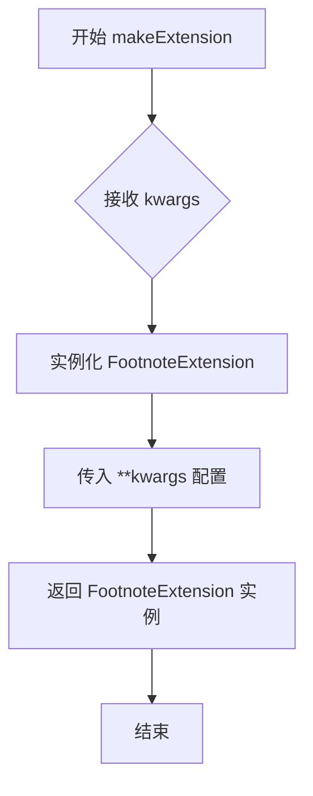

#### 带注释源码

```python
def makeExtension(**kwargs):  # pragma: no cover
    """ Return an instance of the `FootnoteExtension` """
    # **kwargs 允许调用者传入可选配置参数
    # 这些参数将传递给 FootnoteExtension.__init__ 方法
    # 例如：makeExtension(UNIQUE_IDS=True, BACKLINK_TEXT='↩')
    return FootnoteExtension(**kwargs)
```


### `FootnoteExtension.__init__`

该方法是 `FootnoteExtension` 类的构造函数，负责初始化扩展的配置选项、设置唯一前缀、初始化引用追踪数据结构，并调用父类构造方法以及重置方法准备处理新文档。

参数：

-  `**kwargs`：可变关键字参数，传递给父类 `Extension` 的配置参数

返回值：无（返回 `None`）

#### 流程图

```mermaid
flowchart TD
    A[开始 __init__] --> B[定义 self.config 字典]
    B --> C[设置默认配置选项]
    C --> D[调用父类 super().__init__]
    D --> E[初始化 self.unique_prefix = 0]
    E --> F[初始化 self.found_refs = {}]
    F --> G[初始化 self.used_refs = set()]
    G --> H[替换 BACKLINK_TITLE 中的 %d 为 {}]
    H --> I[调用 self.reset 方法]
    I --> J[结束 __init__]
```

#### 带注释源码

```python
def __init__(self, **kwargs):
    """ Setup configs. """
    # 定义默认配置选项字典
    self.config = {
        # 脚注占位符标记，用于指定脚注渲染位置
        'PLACE_MARKER': [
            '///Footnotes Go Here///', 'The text string that marks where the footnotes go'
        ],
        # 是否生成唯一ID，避免多次调用reset()时的名称冲突
        'UNIQUE_IDS': [
            False, 'Avoid name collisions across multiple calls to `reset()`.'
        ],
        # 返回链接显示的文本内容
        'BACKLINK_TEXT': [
            '&#8617;', "The text string that links from the footnote to the reader's place."
        ],
        # 上标文本格式，用于创建指向脚注的链接
        'SUPERSCRIPT_TEXT': [
            '{}', "The text string that links from the reader's place to the footnote."
        ],
        # 返回链接的HTML title属性文本
        'BACKLINK_TITLE': [
            'Jump back to footnote %d in the text',
            'The text string used for the title HTML attribute of the backlink. '
            '%d will be replaced by the footnote number.'
        ],
        # 脚注ID的分隔符
        'SEPARATOR': [
            ':', 'Footnote separator.'
        ],
        # 脚注标签排序方式：按定义顺序或文档中出现顺序
        'USE_DEFINITION_ORDER': [
            True,
            'Order footnote labels by definition order (True) or by document order (False). '
            'Default: True.'
        ]
    }
    """ Default configuration options. """
    # 调用父类Extension的初始化方法
    super().__init__(**kwargs)

    # 在多次调用时，生成不会混淆的链接标识符
    # 唯一前缀，用于生成唯一的脚注ID
    self.unique_prefix = 0
    # 存储已发现的引用及其出现次数 {引用ID: 出现次数}
    self.found_refs: dict[str, int] = {}
    # 存储已使用的引用ID集合，用于去重
    self.used_refs: set[str] = set()

    # 向后兼容旧版的 '%d' 占位符，替换为 '{}'
    self.setConfig('BACKLINK_TITLE', self.getConfig("BACKLINK_TITLE").replace("%d", "{}"))

    # 重置内部状态，为处理新文档做准备
    self.reset()
```


### `FootnoteExtension.extendMarkdown`

该方法是Python-Markdown脚注扩展的核心初始化方法，负责将各种处理器（块处理器、内联处理器、树处理器和后处理器）注册到Markdown解析流程中，以实现脚注的解析、渲染和后处理功能。

参数：

- `md`：`Markdown`，Python-Markdown的核心对象，用于注册各种处理器

返回值：`None`，该方法通过修改`md`对象的内部状态来工作，不返回任何值

#### 流程图

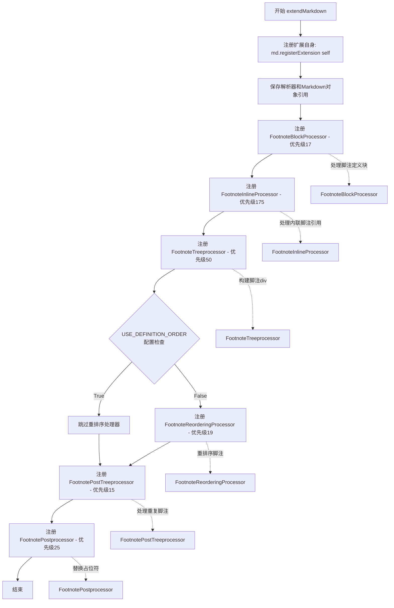

#### 带注释源码

```python
def extendMarkdown(self, md):
    """ Add pieces to Markdown. """
    # 注册扩展自身，使Markdown能够识别和管理此扩展
    md.registerExtension(self)
    # 保存解析器引用，用于后续解析脚注内容
    self.parser = md.parser
    # 保存Markdown实例引用，用于访问配置和其他扩展
    self.md = md
    
    # ============================================================
    # 块处理器 (Block Processor) - 优先级17
    # 在ReferencePreprocessor之前处理脚注定义块
    # 脚注定义格式: [^id]: content
    # ============================================================
    md.parser.blockprocessors.register(FootnoteBlockProcessor(self), 'footnote', 17)

    # ============================================================
    # 内联模式 (Inline Pattern) - 优先级175
    # 在ImageReferencePattern之前处理文档中的脚注引用
    # 脚注引用格式: [^1]
    # ============================================================
    FOOTNOTE_RE = r'\[\^([^\]]*)\]'  # blah blah [^1] blah
    md.inlinePatterns.register(FootnoteInlineProcessor(FOOTNOTE_RE, self), 'footnote', 175)
    
    # ============================================================
    # 树处理器 (Tree Processor) - 优先级50
    # 构建并追加脚注div到文档末尾
    # 必须在inline和codehilite处理器之前运行
    # 以便它们可以处理div内的内容
    # ============================================================
    md.treeprocessors.register(FootnoteTreeprocessor(self), 'footnote', 50)

    # ============================================================
    # 条件注册：脚注重排序处理器 - 优先级19
    # 仅当USE_DEFINITION_ORDER为False时注册
    # 必须在inline树处理器之后运行
    # 以便访问FootnoteInlineProcessor填充的footnote_order
    # ============================================================
    if not self.getConfig("USE_DEFINITION_ORDER"):
        md.treeprocessors.register(FootnoteReorderingProcessor(self), 'footnote-reorder', 19)

    # ============================================================
    # 树处理器 (Tree Processor) - 优先级15
    # 在inline处理完成后运行
    # 检查重复脚注并添加额外的backrefs
    # 指向重复引用的脚注
    # ============================================================
    md.treeprocessors.register(FootnotePostTreeprocessor(self), 'footnote-duplicate', 15)

    # ============================================================
    # 后处理器 (Post Processor) - 优先级25
    # 在amp_substitute处理器之后运行
    # 将占位符替换为HTML实体
    # (FN_BACKLINK_TEXT -> 实际链接文本)
    # (NBSP_PLACEHOLDER -> &nbsp;)
    # ============================================================
    md.postprocessors.register(FootnotePostprocessor(self), 'footnote', 25)
```


### `FootnoteExtension.reset`

该方法用于在每次文档处理开始时重置脚注扩展的内部状态，清空所有已存储的脚注、引用顺序和唯一前缀计数器，以便处理新的文档内容。

参数：
- 无（仅包含隐式参数 `self`）

返回值：`None`，无返回值（方法返回类型标注为 `None`）

#### 流程图

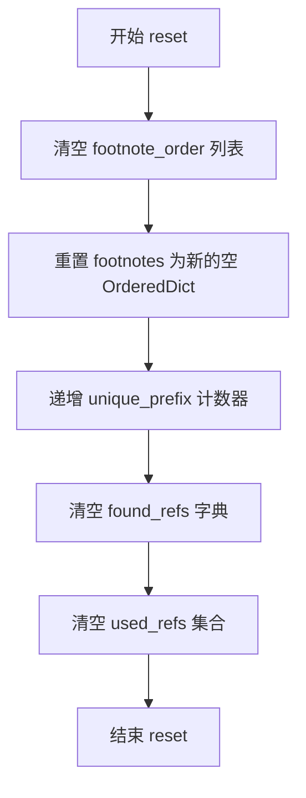

#### 带注释源码

```python
def reset(self) -> None:
    """ Clear footnotes on reset, and prepare for distinct document. """
    # 1. 清空脚注引用顺序列表，用于记录脚注在文档中出现的顺序
    self.footnote_order: list[str] = []
    
    # 2. 重置脚注字典为新的空 OrderedDict，用于存储脚注定义
    #    key: 脚注ID, value: 脚注内容
    self.footnotes: OrderedDict[str, str] = OrderedDict()
    
    # 3. 递增唯一前缀计数器，用于生成唯一的脚注ID
    #    避免在多次调用扩展时ID冲突
    self.unique_prefix += 1
    
    # 4. 清空发现引用字典，用于跟踪已发现的引用及其出现次数
    #    key: 原始引用ID, value: 出现次数
    self.found_refs = {}
    
    # 5. 清空已使用引用集合，用于跟踪已分配的唯一引用ID
    self.used_refs: set[str] = set()
```


### `FootnoteExtension.unique_ref`

获取唯一的引用标识符，用于处理重复的脚注引用。当文档中存在多个相同的脚注引用时，该方法会自动生成唯一的标识符（如 fnref2、fnref3 等），以避免 ID 冲突。

参数：

- `reference`：`str`，原始的脚注引用标识符（例如 "fnref:1"）
- `found`：`bool`，表示该引用是否已在文档中出现过多达一次，默认为 `False`

返回值：`str`，返回处理后的唯一引用标识符

#### 流程图

```mermaid
flowchart TD
    A[开始 unique_ref] --> B{found 参数是否为 False?}
    B -- 是 --> C[直接返回原始 reference]
    B -- 否 --> D[保存 original_ref = reference]
    E{reference 是否在 used_refs 中?} --> F{reference 是否匹配 RE_REF_ID 正则?}
    E -- 否 --> G[将 reference 添加到 used_refs]
    F -- 是 --> H[提取匹配组, 数字加1]
    F -- 否 --> I[在引用后添加数字 2]
    H --> J[构造新的 reference]
    I --> J
    J --> E
    G --> K{original_ref 是否在 found_refs 中?}
    K -- 是 --> L[found_refs[original_ref] 加 1]
    K -- 否 --> M[found_refs[original_ref] 设为 1]
    L --> N[返回 unique reference]
    M --> N
    C --> N
```

#### 带注释源码

```python
def unique_ref(self, reference: str, found: bool = False) -> str:
    """ Get a unique reference if there are duplicates. """
    # 如果 found 为 False，表示这是首次出现，无需生成唯一标识符
    if not found:
        return reference

    # 保存原始引用，用于后续计数
    original_ref = reference
    
    # 当生成的引用已经在 used_refs 集合中时，持续循环生成新的引用
    while reference in self.used_refs:
        # 使用分隔符分割引用（例如 "fnref:1" -> ["fnref", "1"]）
        ref, rest = reference.split(self.get_separator(), 1)
        
        # 尝试匹配带有数字的引用模式（如 fnref1, fnref2 等）
        m = RE_REF_ID.match(ref)
        if m:
            # 如果匹配成功，提取数字部分并加 1，构造新的引用
            # 例如 fnref1 -> fnref2
            reference = '%s%d%s%s' % (m.group(1), int(m.group(2))+1, self.get_separator(), rest)
        else:
            # 如果不匹配（如只有 "fnref"），则在末尾添加数字 2
            reference = '%s%d%s%s' % (ref, 2, self.get_separator(), rest)

    # 将生成的新唯一引用添加到已使用集合中
    self.used_refs.add(reference)
    
    # 更新原始引用的出现次数统计
    if original_ref in self.found_refs:
        self.found_refs[original_ref] += 1
    else:
        self.found_refs[original_ref] = 1
    
    # 返回最终生成或原始的引用标识符
    return reference
```


### `FootnoteExtension.findFootnotesPlaceholder`

在 Markdown 文档的 ElementTree 元素中递归查找包含脚注占位符（如 `///Footnotes Go Here///`）的节点，并返回该节点、其父节点以及占位符是否位于节点文本中的标志位。如果未找到占位符则返回 `None`。

参数：

- `root`：`etree.Element`，根元素节点，从该节点开始递归搜索脚注占位符

返回值：`tuple[etree.Element, etree.Element, bool] | None`，返回三元组（包含占位符的元素、父元素、占位符是否在元素的 text 属性中）；如果未找到占位符则返回 `None`

#### 流程图

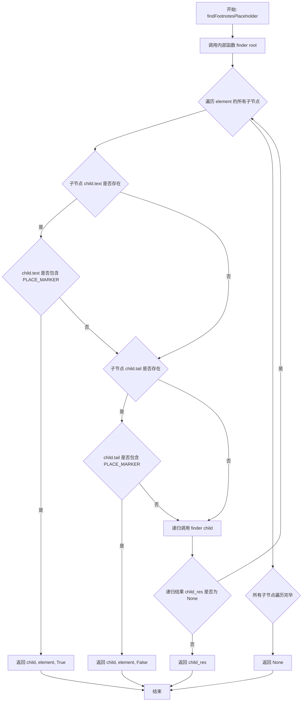

#### 带注释源码

```python
def findFootnotesPlaceholder(
    self, root: etree.Element
) -> tuple[etree.Element, etree.Element, bool] | None:
    """ Return ElementTree Element that contains Footnote placeholder. """
    # 定义内部递归查找函数 finder
    def finder(element):
        # 遍历当前元素的所有子节点
        for child in element:
            # 检查子节点的 text 属性是否包含占位符
            if child.text:
                if child.text.find(self.getConfig("PLACE_MARKER")) > -1:
                    # 占位符在 text 中，返回 (子节点, 父节点, True)
                    return child, element, True
            # 检查子节点的 tail 属性是否包含占位符
            # tail 表示子节点后面的文本内容
            if child.tail:
                if child.tail.find(self.getConfig("PLACE_MARKER")) > -1:
                    # 占位符在 tail 中，返回 (子节点, 父节点, False)
                    return child, element, False
            # 递归在子节点的子树中查找
            child_res = finder(child)
            if child_res is not None:
                return child_res
        # 遍历完所有子节点仍未找到，返回 None
        return None

    # 从根节点开始递归查找
    res = finder(root)
    return res
```


### `FootnoteExtension.setFootnote`

该方法用于将脚注文本存储到内部字典中，以便后续在文档渲染时检索和使用。

参数：

- `id`：`str`，脚注的唯一标识符
- `text`：`str`，脚注的文本内容

返回值：`None`，该方法不返回任何值，仅执行存储操作

#### 流程图

```mermaid
flowchart TD
    A[开始 setFootnote] --> B[接收 id 和 text 参数]
    B --> C{验证参数}
    C -->|参数有效| D[self.footnotes[id] = text]
    D --> E[将脚注存储到 OrderedDict]
    E --> F[结束]
```

#### 带注释源码

```python
def setFootnote(self, id: str, text: str) -> None:
    """ Store a footnote for later retrieval. """
    # 使用脚注ID作为键，将脚注文本存储到self.footnotes字典中
    # self.footnotes 是一个 OrderedDict，用于维护脚注的定义顺序
    self.footnotes[id] = text
```


### `FootnoteExtension.addFootnoteRef`

存储脚注引用ID，按其在文档中出现的顺序记录。

参数：

- `id`：`str`，脚注引用标识符

返回值：`None`，无返回值，仅更新内部状态

#### 流程图

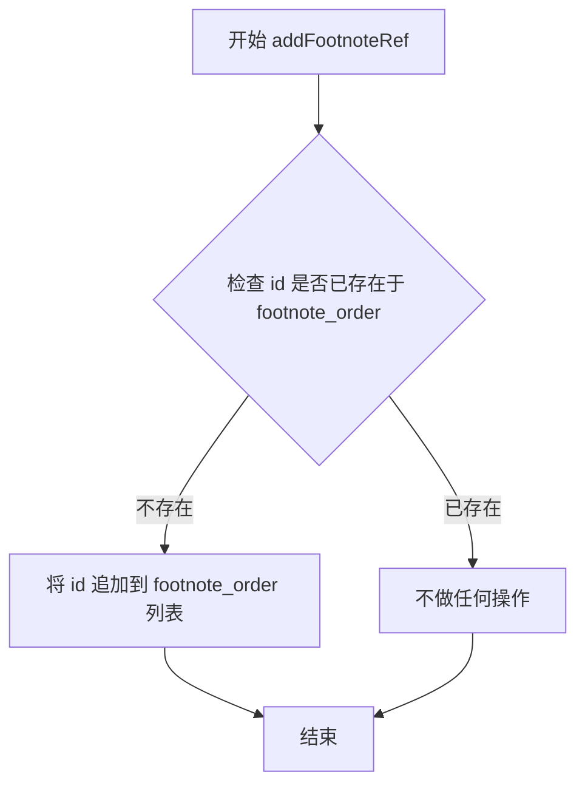

#### 带注释源码

```python
def addFootnoteRef(self, id: str) -> None:
    """ Store a footnote reference id in order of appearance. """
    # 仅当该脚注引用ID尚未被记录时，才将其添加到顺序列表中
    # 这样可以保持脚注按照它们首次在正文中出现的顺序进行编号
    if id not in self.footnote_order:
        self.footnote_order.append(id)
```


### `FootnoteExtension.get_separator`

获取脚注分隔符配置值的方法。该方法从扩展配置中读取`SEPARATOR`配置项的值，默认值为冒号`:`，用于在生成唯一引用标识时分割引用名称和数字。

参数：
- 无显式参数（`self` 为隐含参数）

返回值：`str`，返回脚注分隔符字符串，默认值为 `:`。

#### 流程图

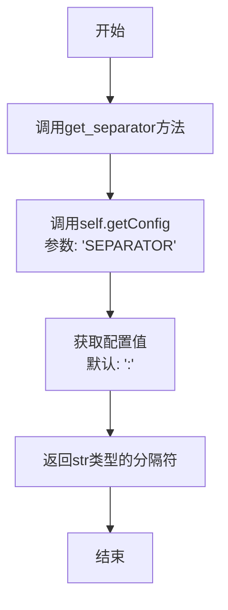

#### 带注释源码

```python
def get_separator(self) -> str:
    """
    获取脚注分隔符。

    该方法从扩展配置中读取SEPARATOR配置项的值。
    分隔符用于makeFootnoteId和makeFootnoteRefId方法中
    构造唯一的脚注引用标识符。

    Returns:
        str: 脚注分隔符，默认值为冒号 ':'
    """
    return self.getConfig("SEPARATOR")
```


### `FootnoteExtension.makeFootnoteId`

根据配置生成 footnote 的 HTML 链接 ID，用于在文档中创建指向特定脚注的超链接标识符。

参数：

- `id`：`str`，脚注的唯一标识符（例如 "1", "2" 等）

返回值：`str`，生成的 HTML 元素 ID 字符串

#### 流程图

```mermaid
flowchart TD
    A[开始 makeFootnoteId] --> B{获取配置 UNIQUE_IDS}
    B -->|True| C[生成唯一ID<br/>fn{separator}{unique_prefix}-{id}]
    B -->|False| D[生成普通ID<br/>fn{separator}{id}]
    C --> E[返回ID字符串]
    D --> E
    E --> F[结束]
```

#### 带注释源码

```python
def makeFootnoteId(self, id: str) -> str:
    """ Return footnote link id. """
    # 检查配置项 UNIQUE_IDS 是否启用
    if self.getConfig("UNIQUE_IDS"):
        # 当启用唯一ID模式时，在ID中加入唯一前缀
        # 格式: fn{separator}{unique_prefix}-{id}
        # 例如: fn:1-1, fn:2-1 等，用于避免多个文档实例间的ID冲突
        return 'fn%s%d-%s' % (self.get_separator(), self.unique_prefix, id)
    else:
        # 当未启用唯一ID模式时，使用简单格式
        # 格式: fn{separator}{id}
        # 例如: fn:1, fn:2 等
        return 'fn{}{}'.format(self.get_separator(), id)
```


### `FootnoteExtension.makeFootnoteRefId`

生成脚注返回链接的ID，用于在HTML中创建从脚注回到正文的链接标识符。

参数：

- `id`：`str`，脚注的唯一标识符
- `found`：`bool`，默认为 `False`，表示该引用是否已在正文中出现（用于处理重复引用的情况）

返回值：`str`，返回生成的脚注返回链接ID

#### 流程图

```mermaid
flowchart TD
    A[开始] --> B{检查 UNIQUE_IDS 配置}
    B -->|True| C[生成带唯一前缀的ID: fnref{分隔符}{unique_prefix}-{id}]
    B -->|False| D[生成普通ID: fnref{分隔符}{id}]
    C --> E[调用 unique_ref 处理重复引用]
    D --> E
    E --> F[返回最终ID]
```

#### 带注释源码

```python
def makeFootnoteRefId(self, id: str, found: bool = False) -> str:
    """ Return footnote back-link id. """
    # 根据 UNIQUE_IDS 配置决定是否使用唯一前缀
    if self.getConfig("UNIQUE_IDS"):
        # 格式: fnref{分隔符}{unique_prefix}-{id}
        # 例如: fnref:1-1
        return self.unique_ref('fnref%s%d-%s' % (self.get_separator(), self.unique_prefix, id), found)
    else:
        # 格式: fnref{分隔符}{id}
        # 例如: fnref:1
        return self.unique_ref('fnref{}{}'.format(self.get_separator(), id), found)
```


### `FootnoteExtension.makeFootnotesDiv`

该方法根据当前存储的脚注文本生成包含所有脚注的 HTML `<div>` 元素，遍历 `self.footnotes` 字典，为每个脚注创建带有序号、ID 和返回链接的列表项，并将其组织到有序列表中。

参数：

- `root`：`etree.Element`，Markdown 文档的根元素，用于提供上下文（虽然当前实现主要使用 `self.footnotes`）

返回值：`etree.Element | None`，返回包含所有脚注的 `<div class="footnote">` 元素，如果不存在脚注则返回 `None`

#### 流程图

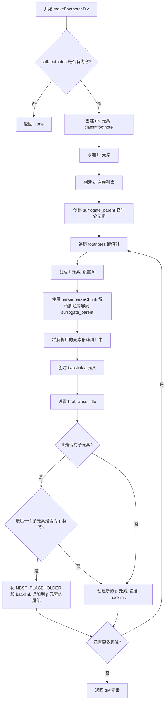

#### 带注释源码

```python
def makeFootnotesDiv(self, root: etree.Element) -> etree.Element | None:
    """ Return `div` of footnotes as `etree` Element. """

    # 检查是否存在脚注，如果没有则直接返回 None
    if not list(self.footnotes.keys()):
        return None

    # 创建脚注区域的根 div 元素，设置 class 为 'footnote'
    div = etree.Element("div")
    div.set('class', 'footnote')
    
    # 添加水平线 hr 元素作为脚注区域与正文的分隔
    etree.SubElement(div, "hr")
    
    # 创建有序列表 ol 用于包裹所有脚注项
    ol = etree.SubElement(div, "ol")
    
    # 创建临时父元素 surrogate_parent，用于解析脚注内容
    # 因为 li 元素有特殊的列表块处理逻辑，不能直接用于解析
    surrogate_parent = etree.Element("div")

    # 遍历所有脚注，按定义顺序生成列表项
    for index, id in enumerate(self.footnotes.keys(), start=1):
        # 为每个脚注创建 li 元素
        li = etree.SubElement(ol, "li")
        # 设置 li 的 id，使用 makeFootnoteId 生成唯一标识
        li.set("id", self.makeFootnoteId(id))
        
        # 使用 surrogate_parent 作为临时父节点解析脚注内容
        # parseChunk 会将内容解析为元素树并添加到 surrogate_parent
        self.parser.parseChunk(surrogate_parent, self.footnotes[id])
        
        # 将解析后的所有元素从 surrogate_parent 移动到 li 中
        for el in list(surrogate_parent):
            li.append(el)
            surrogate_parent.remove(el)
        
        # 创建返回链接（backlink）元素
        backlink = etree.Element("a")
        # 设置 href 指向文档中的脚注引用位置
        backlink.set("href", "#" + self.makeFootnoteRefId(id))
        # 设置 CSS 类名用于样式控制
        backlink.set("class", "footnote-backref")
        # 设置 HTML title 属性，显示提示文本
        # 使用配置中的 BACKLINK_TITLE 模板，index 为脚注序号
        backlink.set(
            "title",
            self.getConfig('BACKLINK_TITLE').format(index)
        )
        # 设置链接文本为占位符 FN_BACKLINK_TEXT
        # 后续 Postprocessor 会将其替换为实际的返回箭头符号
        backlink.text = FN_BACKLINK_TEXT

        # 如果 li 有子元素，则将 backlink 追加到最后一个元素
        if len(li):
            node = li[-1]
            # 如果最后一个元素是段落 p，则将内容追加到段落末尾
            if node.tag == "p":
                # 添加 NBSP 占位符用于保持格式，追加 backlink
                node.text = node.text + NBSP_PLACEHOLDER
                node.append(backlink)
            else:
                # 如果最后一个元素不是段落，则创建新的 p 元素包含 backlink
                p = etree.SubElement(li, "p")
                p.append(backlink)
    
    # 返回完整的脚注 div 元素
    return div
```


### `FootnoteBlockProcessor.__init__`

这是 `FootnoteBlockProcessor` 类的构造函数，用于初始化脚注块处理器，将脚注扩展实例存储为内部属性以便后续处理脚注定义。

参数：

- `footnotes`：`FootnoteExtension`，对 `FootnoteExtension` 实例的引用，用于访问脚注配置、存储和解析器

返回值：`None`，构造函数不返回有意义的值

#### 流程图

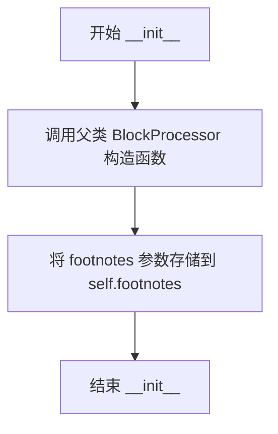

#### 带注释源码

```python
def __init__(self, footnotes: FootnoteExtension):
    """ Initialize the FootnoteBlockProcessor.

    Args:
        footnotes: An instance of FootnoteExtension which contains
                    the footnote storage and configuration.
    """
    # Call the parent class (BlockProcessor) constructor
    # This sets up the parser reference needed for block processing
    super().__init__(footnotes.parser)
    
    # Store reference to the FootnoteExtension instance
    # This allows the processor to access:
    # - self.footnotes.parser: for parsing footnote content
    # - self.footnotes.footnotes: OrderedDict storing footnote definitions
    # - self.footnotes.setFootnote(): method to store footnote content
    self.footnotes = footnotes
```


### `FootnoteBlockProcessor.test`

该方法是 `FootnoteBlockProcessor` 类的测试方法，用于判断给定的块是否应该被处理。在当前实现中，它无条件返回 `True`，表示该处理器接受所有块，随后由 `run` 方法进行具体的脚注定义识别和处理。

参数：

- `parent`：`etree.Element`，父 ElementTree 元素，用于构建文档结构
- `block`：`str`，待测试的文本块，判断其是否符合脚注定义的格式

返回值：`bool`，返回 `True` 表示该块应由此处理器处理

#### 流程图

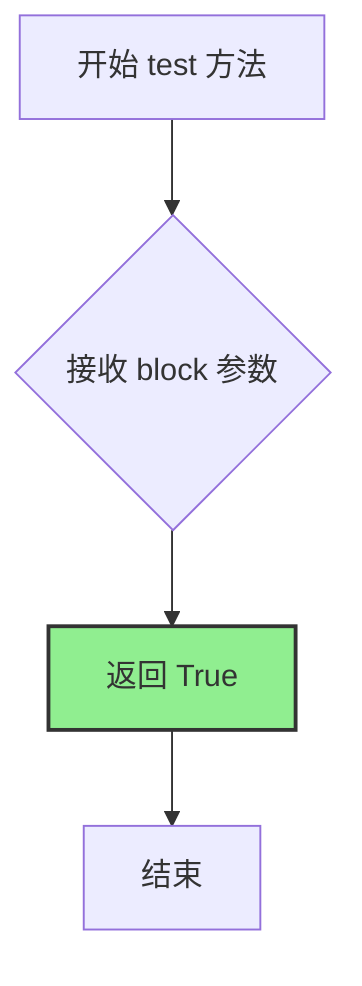

#### 带注释源码

```python
def test(self, parent: etree.Element, block: str) -> bool:
    """测试给定的块是否符合脚注定义的条件。
    
    参数:
        parent: 父 ElementTree 元素，用于构建文档结构。
        block: 待测试的文本块。
    
    返回:
        bool: 返回 True 表示该块应由此处理器处理。
              当前实现无条件返回 True，因为实际的脚注定义识别
              在 run() 方法中通过正则表达式完成。
    """
    return True
```


### `FootnoteBlockProcessor.run`

该方法负责在Markdown文档的块级处理器阶段，识别、提取并存储脚注定义块，同时将非脚注内容块归还给后续处理器处理。

参数：

- `self`：隐式参数，类型为`FootnoteBlockProcessor`实例，表示当前处理器对象
- `parent`：`etree.Element`，父元素节点，用于构建Markdown的抽象语法树（AST）
- `blocks`：`list[str]`，待处理的文本块列表，方法会从其中弹出并处理脚注定义块

返回值：`bool`，如果成功匹配并处理了脚注定义则返回`True`，否则返回`False`

#### 流程图

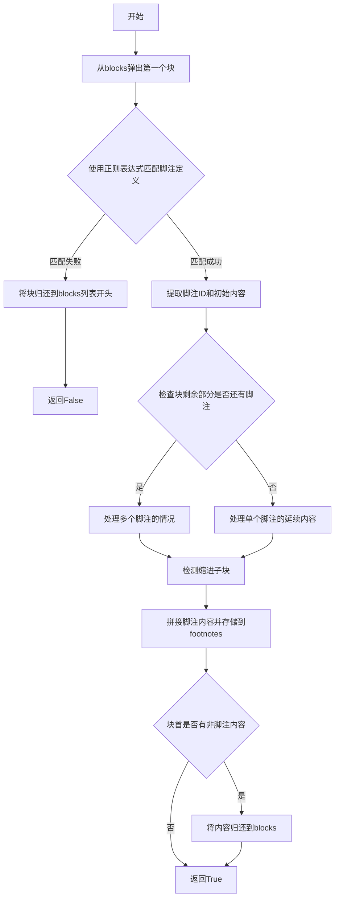

#### 带注释源码

```python
def run(self, parent: etree.Element, blocks: list[str]) -> bool:
    """ Find, set, and remove footnote definitions. """
    # 从待处理的块列表中弹出第一个块进行匹配尝试
    block = blocks.pop(0)

    # 使用预编译的正则表达式匹配脚注定义格式: [^id]: content
    m = self.RE.search(block)
    if m:
        # 成功匹配到脚注定义
        id = m.group(1)  # 提取脚注的唯一标识符
        fn_blocks = [m.group(2)]  # 提取脚注的初始内容行

        # 处理匹配位置之后的剩余内容
        therest = block[m.end():].lstrip('\n')
        m2 = self.RE.search(therest)
        if m2:
            # 在当前块的剩余部分发现了另一个脚注定义
            # 匹配位置之前的内容是当前脚注的延续（可能带有延迟缩进）
            before = therest[:m2.start()].rstrip('\n')
            fn_blocks[0] = '\n'.join([fn_blocks[0], self.detab(before)]).lstrip('\n')
            # 将从匹配开始位置到末尾的内容重新放回blocks，供下一次迭代处理
            blocks.insert(0, therest[m2.start():])
        else:
            # 当前块剩余的所有行都是该脚注的延续内容
            fn_blocks[0] = '\n'.join([fn_blocks[0], self.detab(therest)]).strip('\n')

            # 检查剩余blocks中是否有子缩进块（用于多段落脚注）
            fn_blocks.extend(self.detectTabbed(blocks))

        # 将多行脚注内容用双换行符连接（模拟Markdown段落分隔）
        footnote = "\n\n".join(fn_blocks)
        # 存储脚注到扩展实例中，末尾去除多余空白
        self.footnotes.setFootnote(id, footnote.rstrip())

        # 检查脚注定义之前是否还有其他内容
        if block[:m.start()].strip():
            # 将该内容作为独立块重新放回blocks队列开头
            blocks.insert(0, block[:m.start()].rstrip('\n'))
        
        # 返回True表示成功处理了一个脚注定义
        return True
    
    # 未匹配到任何脚注定义，将原始块归还
    blocks.insert(0, block)
    return False
```


### `FootnoteBlockProcessor.detectTabbed`

该方法用于在处理脚注定义时，检测并收集具有缩进的文本块，同时移除这些块的多余缩进，以便后续正确解析脚注内容。它会遍历文本块列表，找出属于当前脚注定义的连续缩进行，并在遇到新的脚注定义或非缩进行时停止。

参数：

- `blocks`：`list[str]`，待处理的文本块列表，每个元素代表文档中的一行或一段文本

返回值：`list[str]`，处理完成后返回一个新的列表，包含已移除缩进的文本块

#### 流程图

```mermaid
flowchart TD
    A[开始 detectTabbed] --> B[创建空列表 fn_blocks]
    B --> C{blocks 是否为空?}
    C -->|是| D[返回 fn_blocks]
    C -->|否| E{blocks[0] 是否以4个空格开头?}
    E -->|否| D
    E -->|是| F[弹出 blocks[0] 到变量 block]
    F --> G[用正则 RE 搜索 block]
    G --> H{是否找到脚注定义匹配?}
    H -->|是| I[提取匹配前的文本 before]
    I --> J[对 before 调用 detab 去缩进]
    J --> K[将结果追加到 fn_blocks]
    K --> L[将 block[m.start():] 插回 blocks 开头]
    L --> M[break 跳出循环]
    H -->|否| N[对整个 block 调用 detab]
    N --> O[将结果追加到 fn_blocks]
    O --> C
```

#### 带注释源码

```python
def detectTabbed(self, blocks: list[str]) -> list[str]:
    """ Find indented text and remove indent before further processing.

    Returns:
        A list of blocks with indentation removed.
    """
    # 用于存储处理后的脚注块
    fn_blocks = []
    
    # 循环遍历所有块，直到遇到非缩进块或块列表为空
    while blocks:
        # 检查当前块是否以4个空格开头（表示该块属于脚注的延续内容）
        if blocks[0].startswith(' '*4):
            # 弹出当前块进行处理
            block = blocks.pop(0)
            
            # 在当前块中搜索是否包含新的脚注定义
            m = self.RE.search(block)
            if m:
                # 如果找到新的脚注定义，说明当前块中包含两部分内容：
                # 1. 当前脚注的延续内容（在匹配之前）
                # 2. 另一个新的脚注定义（在匹配位置开始）
                
                # 提取匹配之前的文本内容
                before = block[:m.start()].rstrip('\n')
                
                # 对延续内容去除缩进后添加到结果列表
                fn_blocks.append(self.detab(before))
                
                # 将新的脚注定义部分放回 blocks 开头，留待下次迭代处理
                blocks.insert(0, block[m.start():])
                
                # 当前脚注定义处理完毕，退出循环
                break
            else:
                # 当前块完全是脚注的延续内容，没有新的脚注定义
                # 对整个块去除缩进后添加到结果列表
                fn_blocks.append(self.detab(block))
        else:
            # 当前块不是以4个空格开头，说明脚注定义已结束
            break
    
    # 返回处理完成的脚注块列表
    return fn_blocks
```


### `FootnoteBlockProcessor.detab`

移除代码块中一层缩进，处理懒缩进（lazy indentation）的脚注内容。

参数：

- `block`：`str`，需要移除缩进的文本块

返回值：`str`，移除一层缩进后的文本

#### 流程图

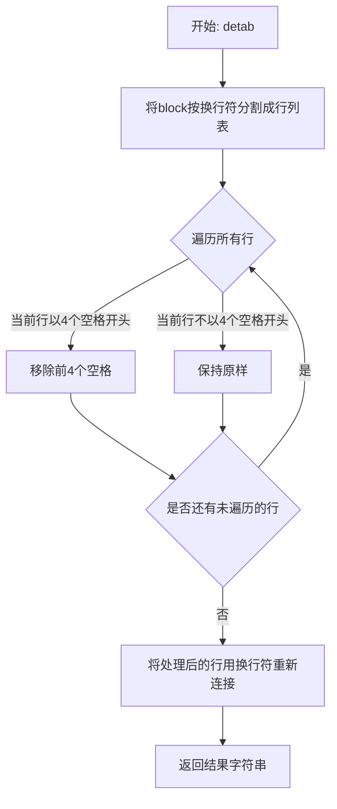

#### 带注释源码

```python
def detab(self, block: str) -> str:
    """ Remove one level of indent from a block.

    Preserve lazily indented blocks by only removing indent from indented lines.
    """
    # 将输入的block按换行符分割成行列表
    lines = block.split('\n')
    # 遍历每一行
    for i, line in enumerate(lines):
        # 只移除以4个空格开头的行的缩进
        # 这样可以保留懒缩进格式（即只有部分行缩进的情况）
        if line.startswith(' '*4):
            lines[i] = line[4:]
    # 将处理后的行列表重新用换行符连接成字符串
    return '\n'.join(lines)
```


### `FootnoteInlineProcessor.__init__`

这是 `FootnoteInlineProcessor` 类的构造函数，用于初始化脚注内联处理器，将用于匹配脚注标记的正则表达式模式与脚注扩展实例关联起来，使处理器能够访问和管理文档中的脚注数据。

参数：

- `pattern`：`str`，用于匹配脚注标记的正则表达式模式（例如 `\[\^([^\]]*)\]` 匹配 `[^1]` 这样的脚注引用）
- `footnotes`：`FootnoteExtension`，脚注扩展的实例，用于访问脚注存储、配置信息和脚注序号生成等功能

返回值：`None`，构造函数不返回值，仅初始化对象状态

#### 流程图

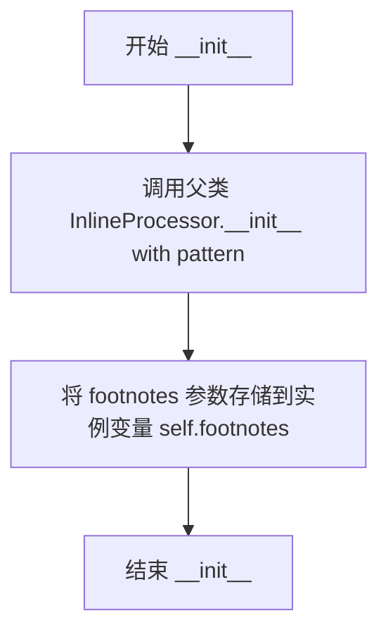

#### 带注释源码

```python
def __init__(self, pattern: str, footnotes: FootnoteExtension):
    """
    初始化脚注内联处理器。

    参数:
        pattern: 用于匹配脚注标记的正则表达式模式（如 [^1]）
        footnotes: 脚注扩展实例，用于管理脚注数据和配置
    """
    super().__init__(pattern)  # 调用父类 InlineProcessor 的构造函数，初始化正则匹配模式
    self.footnotes = footnotes  # 保存对 FootnoteExtension 实例的引用，供 handleMatch 方法使用
```


### `FootnoteInlineProcessor.handleMatch`

该方法处理文档正文中脚注标记（如 `[^1]`），通过匹配正则表达式提取脚注ID，查询已定义的脚注内容，并根据配置按定义顺序或引用顺序生成上标超链接元素返回，同时记录脚注引用顺序。

参数：

- `m`：`re.Match[str]`，正则表达式匹配对象，包含提取的脚注ID（group(1)）
- `data`：`str`，待处理的原始文本数据（此处未直接使用）

返回值：`tuple[etree.Element | None, int | None, int | None]`，返回包含脚注引用的上标元素、匹配起始位置和结束位置；若脚注不存在则返回三元素元组均为 `None`

#### 流程图

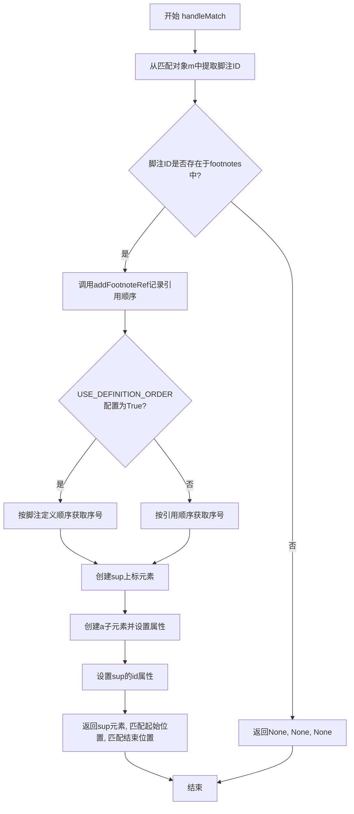

#### 带注释源码

```python
def handleMatch(self, m: re.Match[str], data: str) -> tuple[etree.Element | None, int | None, int | None]:
    """
    处理文档中脚注标记的正则匹配，生成脚注引用链接元素。
    
    参数:
        m: re.Match[str], 正则表达式匹配对象，包含脚注ID
        data: str, 待处理的原始文本数据（当前方法未直接使用）
    
    返回:
        tuple[etree.Element | None, int | None, int | None]: 
            成功时返回(上标元素, 匹配起始位置, 匹配结束位置)
            失败时返回(None, None, None)
    """
    # 从匹配结果中提取脚注ID（正则表达式 [^...] 中的内容）
    id = m.group(1)
    
    # 检查该ID是否在已定义的脚注字典中
    if id in self.footnotes.footnotes.keys():
        # 记录脚注引用顺序（用于按引用顺序编号的场景）
        self.footnotes.addFootnoteRef(id)

        # 根据配置决定脚注编号的排序方式
        if not self.footnotes.getConfig("USE_DEFINITION_ORDER"):
            # Order by reference: 按文档中引用出现的顺序编号
            footnote_num = self.footnotes.footnote_order.index(id) + 1
        else:
            # Order by definition: 按脚注定义出现的顺序编号（默认）
            footnote_num = list(self.footnotes.footnotes.keys()).index(id) + 1

        # 创建上标元素 <sup>，用于包裹脚注引用链接
        sup = etree.Element("sup")
        
        # 创建锚点元素 <a>，作为实际的可点击脚注引用
        a = etree.SubElement(sup, "a")
        
        # 设置上标元素的id属性，用于支持返回链接（backlink）
        # 调用makeFootnoteRefId生成唯一标识，found=True表示这是首次出现
        sup.set('id', self.footnotes.makeFootnoteRefId(id, found=True))
        
        # 设置锚点的href属性，链接到对应的脚注定义
        a.set('href', '#' + self.footnotes.makeFootnoteId(id))
        
        # 设置锚点的class属性，用于CSS样式和后续处理识别
        a.set('class', 'footnote-ref')
        
        # 设置锚点文本内容，使用配置的SUPERSCRIPT_TEXT模板格式化脚注编号
        a.text = self.footnotes.getConfig("SUPERSCRIPT_TEXT").format(footnote_num)
        
        # 返回生成的上标元素及匹配在原文中的起止位置
        return sup, m.start(0), m.end(0)
    else:
        # 脚注ID不存在于已定义的脚注中，返回空值
        # 这允许其他内联处理器继续处理该匹配
        return None, None, None
```


### `FootnotePostTreeprocessor.__init__`

这是 `FootnotePostTreeprocessor` 类的初始化方法，用于接收并存储 `FootnoteExtension` 扩展实例，以便后续处理脚注的重复引用。

参数：

-  `footnotes`：`FootnoteExtension`，脚注扩展实例，提供脚注配置和存储

返回值：`None`，初始化方法不返回值，仅设置实例属性

#### 流程图

```mermaid
flowchart TD
    A[开始 __init__] --> B[接收 footnotes 参数]
    B --> C[将 footnotes 赋值给实例属性 self.footnotes]
    C --> D[结束]
```

#### 带注释源码

```python
def __init__(self, footnotes: FootnoteExtension):
    """ 初始化 FootnotePostTreeprocessor。

    参数:
        footnotes: FootnoteExtension 实例，包含脚注的配置和数据
    """
    # 将传入的 FootnoteExtension 实例保存为实例属性
    # 供后续方法访问脚注配置和存储
    self.footnotes = footnotes
```


### `FootnotePostTreeprocessor.add_duplicates`

该方法用于处理脚注中的重复引用，当文档中多次引用同一脚注时，为每个重复引用在脚注列表项中添加额外的返回链接（`fnref2`、`fnref3`等），确保每个引用都能正确返回到文档中的对应位置。

参数：

- `li`：`etree.Element`，脚注的列表项（`<li>`）元素，包含需要处理的返回链接
- `duplicates`：`int`，重复引用的数量，用于确定需要添加多少个额外的返回链接

返回值：`None`，该方法直接修改传入的`li`元素，不返回任何值

#### 流程图

```mermaid
flowchart TD
    A[开始 add_duplicates] --> B[遍历 li 中的所有 a 链接]
    B --> C{找到 class='footnote-backref' 的链接?}
    C -->|否| B
    C -->|是| D[分割 href 获取 ref 和 rest]
    D --> E[初始化空列表 links]
    E --> F[循环 index 从 2 到 duplicates]
    F --> G[深拷贝当前链接]
    G --> H[修改 href 为 fnref{index}{separator}{rest}]
    H --> I[将新链接添加到 links 列表]
    I --> J[offset 计数器加 1]
    J --> F
    F --> K[获取 li 的最后一个子元素]
    K --> L[遍历 links 列表]
    L --> M[将每个新链接追加到最后一个子元素中]
    M --> N[跳出循环]
    N --> O[结束]
```

#### 带注释源码

```python
def add_duplicates(self, li: etree.Element, duplicates: int) -> None:
    """ Adjust current `li` and add the duplicates: `fnref2`, `fnref3`, etc. """
    # 遍历列表项中的所有 <a> 标签元素
    for link in li.iter('a'):
        # 查找需要被重复的返回链接
        # class='footnote-backref' 是脚注返回链接的标识
        if link.attrib.get('class', '') == 'footnote-backref':
            # 使用分隔符分割 href 属性，获取引用基础部分和剩余部分
            # 例如: href="#fnref1:1" -> ref="fnref1", rest="1"
            ref, rest = link.attrib['href'].split(self.footnotes.get_separator(), 1)
            
            # 创建空列表存储需要添加的重复链接
            links = []
            
            # 从2开始循环，因为第一个引用已经存在
            # duplicates 表示重复引用的总次数
            for index in range(2, duplicates + 1):
                # 深拷贝当前链接对象，创建一个新的独立副本
                sib_link = copy.deepcopy(link)
                
                # 修改新链接的 href 属性，指向下一个引用编号
                # 例如: fnref2:1, fnref3:1 等
                sib_link.attrib['href'] = '%s%d%s%s' % (ref, index, self.footnotes.get_separator(), rest)
                
                # 将新链接添加到列表中等待添加
                links.append(sib_link)
                
                # 维护一个偏移量计数器（用于跟踪已处理的重复引用）
                self.offset += 1
            
            # 获取列表项的最后一个子元素
            # 返回链接应该被添加到最后一个子元素中
            el = list(li)[-1]
            
            # 将所有新创建的重复链接追加到元素中
            for link in links:
                el.append(link)
            
            # 找到目标链接后即可退出循环
            break
```


### `FootnotePostTreeprocessor.get_num_duplicates`

该方法是 `FootnotePostTreeprocessor` 类的核心功能之一，负责计算特定脚注在文档正文中被引用的次数。它通过解析脚注列表项（`li`）的 ID 属性，构造对应的引用链接 ID，并在扩展的 `found_refs` 字典中查询该 ID 的出现次数，从而确定需要为该脚注添加多少个“返回链接”（backlink）以指向重复引用的位置。

参数：

- `li`：`etree.Element`，HTML 列表项元素（`<li>`），代表脚注区域（footnotes div）中的一个脚注定义项。

返回值：`int`，返回该脚注被引用的次数（重复引用数）。如果该脚注在正文中只出现一次或未在 `found_refs` 中找到记录，则返回 0。

#### 流程图

```mermaid
flowchart TD
    A[输入: li 元素] --> B[获取 li 的 id 属性]
    B --> C{id 是否存在}
    C -- 否 --> D[返回默认值 0]
    C -- 是 --> E[使用分隔符分割 id, 提取 'fn' 和剩余部分]
    E --> F[构造引用链接 ID: 'fnref' + 分隔符 + 剩余部分]
    F --> G[在 footnotes.found_refs 字典中查找 link_id]
    G --> H{是否找到}
    H -- 否 --> D
    H -- 是 --> I[返回查找到的引用次数]
```

#### 带注释源码

```python
def get_num_duplicates(self, li: etree.Element) -> int:
    """ 获取脚注的重复引用数量。 
    
    该方法通过分析 HTML 元素的 ID 属性来构建引用键，
    并查询内部字典以确定文档中该脚注被引用的总次数。
    
    参数:
        li: 脚注列表项的 ElementTree 元素。
    
    返回值:
        整数值，表示该脚注被引用的次数。如果未找到对应引用记录，返回 0。
    """
    # 1. 获取列表项的 id 属性 (例如 'fn1' 或 'fn2:1')
    # 使用 get_separator (通常为 ':') 分割 id
    # fn = 'fn', rest = '1' (或 '1' 之前的部分)
    fn, rest = li.attrib.get('id', '').split(self.footnotes.get_separator(), 1)
    
    # 2. 构造用于查找的 link_id
    # 脚注正文的 ID 格式为 'fn:1'，对应的引用链接格式通常为 'fnref:1'
    link_id = '{}ref{}{}'.format(fn, self.footnotes.get_separator(), rest)
    
    # 3. 从 found_refs 字典中获取引用次数
    # found_refs 字典记录了每个引用 ID 在文档中出现的次数
    # get 方法的第二个参数 0 是默认值，表示如果键不存在则返回 0
    return self.footnotes.found_refs.get(link_id, 0)
```


### `FootnotePostTreeprocessor.handle_duplicates`

该方法用于在脚注列表中检测重复的脚注引用，并为每个重复引用添加额外的返回链接（backlink），确保文档中多个位置引用同一个脚注时都能正确返回。

参数：

- `parent`：`etree.Element`，包含脚注列表项（`<li>`）的父元素（`<ol>`），用于遍历其中的脚注条目

返回值：`None`，该方法直接修改传入的 Element 树，不返回任何值

#### 流程图

```mermaid
flowchart TD
    A[开始 handle_duplicates] --> B[遍历 parent 中的所有 li 元素]
    B --> C{还有 li 元素吗?}
    C -->|是| D[调用 get_num_duplicates 获取重复次数]
    D --> E{count > 1?}
    E -->|是| F[调用 add_duplicates 添加重复链接]
    E -->|否| B
    F --> B
    C -->|否| G[结束]
```

#### 带注释源码

```python
def handle_duplicates(self, parent: etree.Element) -> None:
    """ Find duplicate footnotes and format and add the duplicates. """
    # 遍历父元素中的所有子元素（每个 li 代表一个脚注）
    for li in list(parent):
        # 检查该脚注的重复引用次数
        count = self.get_num_duplicates(li)
        # 如果存在重复引用（count > 1 表示至少有2处引用）
        if count > 1:
            # 调用 add_duplicates 为该脚注添加额外的返回链接
            self.add_duplicates(li, count)
```


### `FootnotePostTreeprocessor.run`

该方法是Python-Markdown脚注扩展中的`FootnotePostTreeprocessor`类的核心方法，负责在文档解析完成后，遍历生成的HTML抽象语法树（AST），定位脚注容器（class为'footnote'的div），并在其内部的有序列表（ol）中处理重复的脚注引用，通过调用`handle_duplicates`方法为每个重复引用添加额外的返回链接，确保读者可以从多个引用点返回到原始脚注位置。

参数：
- `root`：`etree.Element`，表示Markdown文档解析后生成的HTML AST的根元素，该方法以此为起点遍历查找脚注相关的DOM节点。

返回值：`None`，此方法不返回任何值，它直接修改传入的AST结构以添加重复脚注的链接。

#### 流程图

```mermaid
flowchart TD
    A([开始 run 方法]) --> B[设置 self.offset = 0]
    B --> C{遍历 root 中的每个 div 元素}
    C --> D{div 的 class 属性是否为 'footnote'?}
    D -->|否| C
    D -->|是| E{遍历该 div 中的每个 ol 元素}
    E --> F[调用 handle_duplicates 处理当前 ol 元素]
    F --> G[跳出 ol 循环]
    G --> C
    C --> H([结束])
```

#### 带注释源码

```python
def run(self, root: etree.Element) -> None:
    """ Crawl the footnote div and add missing duplicate footnotes. """
    self.offset = 0
    # 遍历文档中的所有 div 元素
    for div in root.iter('div'):
        # 查找脚注容器 div（class="footnote"）
        if div.attrib.get('class', '') == 'footnote':
            # 脚注应该位于脚注 div 下的第一个有序列表中，找到后退出循环
            for ol in div.iter('ol'):
                # 处理重复的脚注引用
                self.handle_duplicates(ol)
                break
```


### `FootnoteTreeprocessor.__init__`

这是 `FootnoteTreeprocessor` 类的构造函数，用于初始化脚注树处理器。该方法接收一个 `FootnoteExtension` 实例作为参数，用于在后续的 `run` 方法中访问脚注的配置信息和脚注数据，从而完成脚注 `div` 元素的构建和追加工作。

参数：

- `footnotes`：`FootnoteExtension`，包含脚注扩展的配置和数据的核心对象，供该树处理器在运行时调用以生成脚注列表

返回值：`None`，构造函数不返回任何值

#### 流程图

```mermaid
flowchart TD
    A[开始 __init__] --> B[接收 footnotes 参数]
    B --> C[将 footnotes 赋值给实例变量 self.footnotes]
    D[结束 __init__]
```

#### 带注释源码

```python
def __init__(self, footnotes: FootnoteExtension):
    """ 初始化 FootnoteTreeprocessor。

    Args:
        footnotes: FootnoteExtension 实例，包含脚注配置和数据
    """
    # 将传入的 FootnoteExtension 实例保存为实例变量
    # 以便在 run 方法中访问脚注内容和配置信息
    self.footnotes = footnotes
```


### `FootnoteTreeprocessor.run`

该方法是 FootnoteTreeprocessor 类的核心方法，负责在 Markdown 文档解析完成后，将脚注内容构建为 HTML div 并插入到文档中。它首先调用 `makeFootnotesDiv` 生成脚注 div，然后查找文档中的占位符（如果有），将脚注 div 插入到正确的位置，如果没有占位符则追加到文档末尾。

参数：

- `root`：`etree.Element`，Markdown 文档的根元素树

返回值：`None`，此方法不返回值，直接修改传入的 Element 树

#### 流程图

```mermaid
flowchart TD
    A[开始执行 run] --> B{footnotesDiv是否存在?}
    B -->|否| C[方法结束, 不做任何修改]
    B -->|是| D[调用findFootnotesPlaceholder查找占位符]
    D --> E{是否找到占位符?}
    E -->|否| F[将footnotesDiv追加到root末尾]
    F --> C
    E -->|是| G[获取child, parent, isText]
    G --> H{isText是否为True?}
    H -->|是| I[移除child并在其位置插入footnotesDiv]
    I --> C
    H -->|否| J[在child之后插入footnotesDiv, 设置child.tail为None]
    J --> C
```

#### 带注释源码

```python
def run(self, root: etree.Element) -> None:
    """
    在 Markdown 文档末尾构建并插入脚注 div。
    
    参数:
        root: Markdown 文档的根 Element 树
    """
    
    # 调用 makeFootnotesDiv 方法生成脚注的 HTML div 元素
    # 如果没有脚注定义,此方法返回 None
    footnotesDiv = self.footnotes.makeFootnotesDiv(root)
    
    # 检查是否生成了脚注 div
    if footnotesDiv is not None:
        # 查找文档中是否包含脚注占位符
        # 占位符由 PLACE_MARKER 配置指定,默认为 '///Footnotes Go Here///'
        result = self.footnotes.findFootnotesPlaceholder(root)
        
        if result:
            # 找到了占位符
            child, parent, isText = result
            
            # 获取 child 在 parent 中的索引位置
            ind = list(parent).index(child)
            
            if isText:
                # 占位符在元素的 text 属性中
                # 移除占位符元素,并在该位置插入脚注 div
                parent.remove(child)
                parent.insert(ind, footnotesDiv)
            else:
                # 占位符在元素的 tail 属性中
                # 在 child 之后插入脚注 div,并清空 child 的 tail
                parent.insert(ind + 1, footnotesDiv)
                child.tail = None
        else:
            # 没有找到占位符,将脚注 div 追加到文档根元素末尾
            root.append(footnotesDiv)
```


### `FootnoteReorderingProcessor.__init__`

该方法是 `FootnoteReorderingProcessor` 类的构造函数，用于初始化脚注重排序处理器，将传入的 `FootnoteExtension` 实例存储为类属性，以便后续处理脚注重排序逻辑。

参数：

- `footnotes`：`FootnoteExtension`，对 FootnoteExtension 实例的引用，用于访问脚注配置和数据

返回值：`None`，无返回值（`__init__` 方法）

#### 流程图

```mermaid
flowchart TD
    A[开始 __init__] --> B[接收 footnotes 参数]
    B --> C[将 footnotes 赋值给 self.footnotes]
    D[结束 __init__]
    C --> D
```

#### 带注释源码

```python
def __init__(self, footnotes: FootnoteExtension):
    """
    初始化 FootnoteReorderingProcessor 实例。

    该方法接收一个 FootnoteExtension 实例的引用，用于在后续的 run 方法中
    访问脚注数据（self.footnotes.footnotes）和脚注顺序（self.footnotes.footnote_order），
    以便根据文档中脚注引用的出现顺序对脚注列表进行重新排序。

    参数:
        footnotes: FootnoteExtension 对象，包含脚注的完整配置和数据
    """
    self.footnotes = footnotes
```


### `FootnoteReorderingProcessor.run`

该方法是一个树处理器（Treeprocessor），用于在文档顺序模式下重新排序脚注列表项。当脚注的引用顺序与其定义顺序不同时，该方法会遍历文档找到脚注容器（div），然后根据引用顺序重新排列列表项（li），同时更新返回链接的标题以反映新的序号。

参数：

- `root`：`etree.Element`，文档的根元素，用于遍历查找脚注容器

返回值：`None`，该方法直接修改文档树，不返回任何值

#### 流程图

```mermaid
flowchart TD
    A[开始: 执行 run 方法] --> B{检查是否有脚注}
    B -->|没有脚注| C[直接返回]
    B -->|有脚注| D{脚注引用顺序是否与定义顺序不同}
    D -->|顺序相同| C
    D -->|顺序不同| E[遍历文档查找 class='footnote' 的 div]
    E --> F[调用 reorder_footnotes 重新排序]
    F --> G[结束]
```

#### 带注释源码

```python
def run(self, root: etree.Element) -> None:
    """
    执行脚注重排序处理。
    
    参数:
        root: 文档的根元素 (etree.Element)
    返回:
        None: 直接修改文档树，不返回值
    """
    # 检查是否存在脚注，如果没有则直接返回
    if not self.footnotes.footnotes:
        return
    
    # 比较引用顺序与定义顺序是否不同
    # 如果相同则不需要重新排序
    if self.footnotes.footnote_order != list(self.footnotes.footnotes.keys()):
        # 遍历文档中的所有 div 元素
        for div in root.iter('div'):
            # 查找脚注容器 (class='footnote')
            if div.attrib.get('class', '') == 'footnote':
                # 调用内部方法进行脚注重排序
                self.reorder_footnotes(div)
                # 找到后跳出循环，只处理第一个脚注 div
                break
```


### `FootnoteReorderingProcessor.reorder_footnotes`

该方法负责在文档中脚注引用顺序与定义顺序不同时，将脚注列表重新排序为引用顺序（即文档中首次出现脚注引用的顺序），同时更新每个脚注的返回链接标题以反映新的序号。

参数：

- `parent`：`etree.Element`，包含脚注列表的 `<div>` 元素容器

返回值：`None`，该方法直接修改传入的 ElementTree 元素，不返回任何值

#### 流程图

```mermaid
flowchart TD
    A[接收 parent Element] --> B[在 parent 中查找 ol 元素]
    B --> C{找到 ol 元素?}
    C -->|否| Z[直接返回]
    C -->|是| D[移除旧的 ol 元素]
    D --> E[提取所有 li 子元素]
    E --> F[定义 order_by_id 排序函数]
    F --> G[按引用顺序对 items 排序]
    G --> H[创建新的 ol 元素]
    H --> I{遍历排序后的 items}
    I -->|还有 item| J[查找当前 item 的 backlink 元素]
    J --> K[更新 backlink 的 title 属性为新序号]
    K --> L[将 item 添加到新 ol 中]
    L --> I
    I -->|遍历完成| M[结束]
```

#### 带注释源码

```python
def reorder_footnotes(self, parent: etree.Element) -> None:
    """
    重新排序脚注列表项以匹配文档中的引用顺序。

    当配置 USE_DEFINITION_ORDER 为 False 时调用此方法，
    将脚注从定义顺序改为引用顺序（文档中首次出现该脚注的顺序）。

    参数:
        parent: 包含脚注列表的 div 元素
    """
    # 1. 在父元素中查找现有的有序列表(ol)
    old_list = parent.find('ol')
    # 2. 从 DOM 中移除旧的有序列表，为重建新顺序的列表做准备
    parent.remove(old_list)
    # 3. 提取所有脚注列表项(li)元素
    items = old_list.findall('li')

    # 定义排序键函数，根据脚注在文档中的引用顺序返回排序索引
    def order_by_id(li) -> int:
        # 从 li 元素的 id 属性中提取脚注标识符
        # id 格式示例: 'fn:1' 或 'fnref:1-2'，取冒号后的最后一部分
        id = li.attrib.get('id', '').split(self.footnotes.get_separator(), 1)[-1]
        # 返回该脚注在引用顺序列表中的索引位置
        # 如果未找到该脚注标识符，将其排在最后
        return (
            self.footnotes.footnote_order.index(id)
            if id in self.footnotes.footnote_order
            else len(self.footnotes.footnotes)
        )

    # 4. 使用定义的排序键对所有脚注列表项进行排序
    items = sorted(items, key=order_by_id)

    # 5. 创建新的有序列表元素
    new_list = etree.SubElement(parent, 'ol')

    # 6. 遍历排序后的脚注项，重新构建有序列表
    for index, item in enumerate(items, start=1):
        # 查找当前脚注项中的返回链接元素 (class="footnote-backref")
        backlink = item.find('.//a[@class="footnote-backref"]')
        # 更新返回链接的 title 属性，使用新的脚注序号
        # title 格式示例: "Jump back to footnote 1 in the text"
        backlink.set("title", self.footnotes.getConfig("BACKLINK_TITLE").format(index))
        # 将排好序的脚注项添加到新的有序列表中
        new_list.append(item)
```


### `FootnotePostprocessor.__init__`

初始化 FootnotePostprocessor 实例，存储对 FootnoteExtension 的引用，以便在后续的 `run` 方法中访问脚注配置和数据（如 BACKLINK_TEXT 等）。

参数：

- `footnotes`：`FootnoteExtension`，对 FootnoteExtension 实例的引用，用于访问脚注配置和数据

返回值：`None`，`__init__` 方法不返回值

#### 流程图

```mermaid
flowchart TD
    A[开始 __init__] --> B[接收 footnotes 参数]
    B --> C[将 footnotes 存储到实例变量 self.footnotes]
    C --> D[结束]
```

#### 带注释源码

```python
def __init__(self, footnotes: FootnoteExtension):
    """ 初始化 FootnotePostprocessor。

    Args:
        footnotes: FootnoteExtension 实例，用于访问脚注配置和数据
    """
    self.footnotes = footnotes
```


### `FootnotePostprocessor.run`

该方法是脚注后处理器，用于在最终渲染前将脚注中的占位符替换为实际的HTML实体（反向链接文本和不换行空格）。

参数：

- `text`：`str`，需要处理的文本内容，包含待替换的占位符

返回值：`str`，替换占位符后的文本

#### 流程图

```mermaid
flowchart TD
    A[开始] --> B{检查text是否为空}
    B -->|是| C[返回空字符串]
    B -->|否| D[查找FN_BACKLINK_TEXT占位符]
    D --> E{找到占位符?}
    E -->|是| F[替换为配置的BACKLINK_TEXT]
    E -->|否| G[继续下一步]
    F --> G
    G --> H[查找NBSP_PLACEHOLDER占位符]
    H --> I{找到占位符?}
    I -->|是| J[替换为HTML不换行空格&#160;]
    I -->|否| K[返回处理后的文本]
    J --> K
```

#### 带注释源码

```python
def run(self, text: str) -> str:
    """
    执行脚注后处理，替换占位符为HTML实体。
    
    该方法在Markdown解析完成后、HTML输出前被调用，
    用于将之前插入的占位符替换为实际的配置值。
    
    Args:
        text: 待处理的文本，通常是已构建的HTML片段
        
    Returns:
        替换占位符后的文本字符串
    """
    # 第一步：替换反向链接文本的占位符
    # FN_BACKLINK_TEXT 是之前插入的特殊标记（STX + "zz1337820767766393qq" + ETX）
    # 这里将其替换为用户配置的BACKLINK_TEXT（如 &#8617;）
    text = text.replace(
        FN_BACKLINK_TEXT, self.footnotes.getConfig("BACKLINK_TEXT")
    )
    
    # 第二步：替换不换行空格的占位符
    # NBSP_PLACEHOLDER 用于在脚注列表项中保持内容与返回链接的间距
    # 替换为HTML不换行空格实体 &#160;
    return text.replace(NBSP_PLACEHOLDER, "&#160;")
```

## 关键组件


### FootnoteExtension

主扩展类，负责配置管理和注册各种Markdown处理器到Python-Markdown核心系统中。

### FootnoteBlockProcessor

块处理器，继承自BlockProcessor，用于解析文档中的脚注定义（如`[^1]: 内容`），并存储供后续使用。

### FootnoteInlineProcessor

内联处理器，继承自InlineProcessor，用于处理文档正文中出现的脚注引用标记（如`[^1]`），并将其转换为上标链接。

### FootnoteTreeprocessor

树处理器，负责在文档末尾构建并插入脚注div元素，将存储的脚注内容渲染为HTML列表。

### FootnotePostTreeprocessor

树处理器，用于检测重复的脚注引用，并为每个重复引用添加额外的返回链接（backlink）。

### FootnoteReorderingProcessor

树处理器，当配置`USE_DEFINITION_ORDER`为False时，按文档中引用顺序重新排列脚注列表项。

### FootnotePostprocessor

后处理器，负责将内部占位符替换为实际的HTML实体（如`FN_BACKLINK_TEXT`替换为配置的返回链接文本）。

### 全局常量

- **FN_BACKLINK_TEXT**: 脚注返回链接的文本占位符，使用STX/ETX控制字符包裹以避免渲染冲突
- **NBSP_PLACEHOLDER**: 不间断空格占位符，用于脚注内容格式调整
- **RE_REF_ID**: 正则表达式，用于匹配带数字的脚注引用ID（如fnref1）
- **RE_REFERENCE**: 正则表达式，用于匹配文档中的脚注引用语法`[^...]`

### makeExtension

工厂函数，用于创建并返回`FootnoteExtension`实例，供Python-Markdown加载扩展使用。


## 问题及建议


### 已知问题

-   **正则表达式重复编译与分散定义**: `RE_REFERENCE`在模块级编译，但`FOOTNOTE_RE`在`extendMarkdown`方法内以字符串形式定义，`FootnoteBlockProcessor.RE`在类级编译，导致正则表达式定义分散且部分重复，增加维护成本和潜在的性能开销。
-   **低效的列表操作**: 在`FootnoteInlineProcessor.handleMatch`方法中，使用`list(self.footnotes.footnotes.keys()).index(id)`获取脚注序号，每次调用都会创建新的列表对象，当脚注数量较多时会产生不必要的性能开销，应直接迭代字典键或使用枚举。
-   **配置重复访问**: `makeFootnoteId`和`makeFootnoteRefId`方法在每次调用时都通过`self.getConfig("UNIQUE_IDS")`和`self.get_separator()`访问配置，这些值在单次解析过程中不会改变，可以缓存在`reset()`方法中以减少查找开销。
-   **魔法数字与硬编码优先级**: 在注册处理器时使用了大量魔法数字（如优先级17、175、50、19、15、25），缺乏注释说明其选择依据，增加了理解代码执行顺序的难度。
-   **类职责过于集中**: `FootnoteExtension`类同时承担了配置管理、脚注存储、ID生成、HTML生成等多重职责违反了单一职责原则，导致类膨胀和可测试性降低。
-   **硬编码的配置键名**: 在多处直接使用字符串如`'footnote'`、`'footnote-ref'`、`'footnote-backref'`、`'ol'`、`'li'`等类名和ID前缀，缺乏统一的常量定义，容易出现拼写错误且不利于全局修改。
-   **向后兼容代码残留**: 存在处理旧版`%d`占位符的向后兼容代码（`self.setConfig('BACKLINK_TITLE', ...).replace("%d", "{}")`），增加了代码复杂度，如果项目不再支持旧版本可以移除。
-   **不完整的类型提示**: 虽然使用了`from __future__ import annotations`，但部分方法如`makeFootnotesDiv`的返回类型使用了`|`运算符而非统一的类型提示风格。
-   **边界条件处理不足**: `findFootnotesPlaceholder`方法使用字符串`find`方法检查占位符，如果占位符是另一个字符串的子串，会产生误匹配；`FootnoteBlockProcessor`的`test`方法直接返回`True`缺乏实际验证。

### 优化建议

-   **集中管理正则表达式**: 将所有正则表达式常量提取到模块顶部或专门的配置类中，使用命名常量替代魔法字符串，提高可读性和可维护性。
-   **优化查找性能**: 在`FootnoteExtension`中为`footnotes`字典维护一个键的列表或使用枚举类型，避免在`handleMatch`中频繁创建列表；对于`UNIQUE_IDS`和`SEPARATOR`配置，在`reset()`时缓存到实例变量。
-   **提取常量定义**: 创建专门的常量类或模块级常量来存储CSS类名、HTML标签名、ID前缀等，避免硬编码字符串散布在代码各处。
-   **添加处理器优先级文档**: 为每个处理器的注册优先级添加详细注释，解释为何选择该数值，以及它与其他处理器的关系（如必须在哪两个处理器之间）。
-   **拆分大型类**: 将`FootnoteExtension`中的HTML生成逻辑（`makeFootnotesDiv`）、ID生成逻辑（`makeFootnoteId`系列）提取为独立的辅助类或策略类，降低类的复杂度。
-   **改进错误处理**: 为关键方法添加异常处理逻辑，特别是涉及文件解析和HTML生成的部分；验证脚注ID的合法性，防止XSS或无效HTML属性。
-   **清理遗留代码**: 评估并移除不再需要的向后兼容代码，简化代码库；考虑使用现代Python特性（如数据类、枚举）重构部分逻辑。
-   **完善类型提示**: 统一类型提示风格，确保所有公开方法都有完整的类型签名，提高IDE支持和代码自文档化能力。


## 其它


### 设计目标与约束

该扩展旨在为Python-Markdown提供脚注功能，允许用户在Markdown文档中定义和引用脚注。主要设计目标包括：支持脚注定义与引用分离、保持Markdown文档的可读性、生成符合语义化标准的HTML输出、支持重复脚注引用、处理多文档场景下的ID冲突。约束条件包括：依赖Python-Markdown的扩展框架、需与内联处理器和块处理器协同工作、生成的HTML需符合HTML5规范、必须保持向后兼容性。

### 错误处理与异常设计

代码采用防御性编程风格，主要错误处理场景包括：无效脚注ID处理（引用不存在的脚注时返回None）、重复脚注定义覆盖（后续定义覆盖之前定义）、占位符查找失败处理（findFootnotesPlaceholder返回None时追加到文档末尾）、正则表达式匹配失败（test方法始终返回True，由run方法处理实际匹配）。异常处理采用返回None/False而非抛出异常的方式，保持处理器链的正常执行。潜在改进：可增加配置选项以选择对未定义脚注引用的处理方式（忽略、警告或报错）。

### 数据流与状态机

数据流分为三个主要阶段：第一阶段为解析阶段（BlockProcessor），扫描文档提取脚注定义块，存储到footnotes字典；第二阶段为转换阶段（InlineProcessor），将文档中的脚注引用[^1]转换为sup元素，构建脚注顺序列表；第三阶段为输出阶段（Treeprocessor和Postprocessor），生成脚注div、排序、添加反向链接、替换占位符。状态转换：初始状态→解析定义→处理引用→构建输出→后处理。关键状态变量包括footnote_order（引用顺序）、footnotes（脚注内容映射）、found_refs（引用计数）、used_refs（已用引用ID集合）。

### 外部依赖与接口契约

依赖项包括：Python-Markdown核心库（Extension、BlockProcessor、InlineProcessor、Treeprocessor、Postprocessor）、Python标准库（re、copy、xml.etree.ElementTree、collections.OrderedDict）。接口契约方面，扩展需实现extendMarkdown方法注册各类处理器，与md.parser、md.inlinePatterns、md.treeprocessors、md.postprocessors交互。配置接口通过getConfig/setConfig方法访问，处理器之间通过FootnoteExtension实例共享状态。makeExtension函数作为工厂方法符合Python-Markdown扩展加载约定。

### 性能考虑与优化空间

主要性能考量：正则表达式编译（RE_REF_ID和RE_REFERENCE在模块级别编译）、ElementTree操作（多次遍历和修改DOM树）、重复脚注处理（deepcopy操作）。优化建议：1）cache正则匹配结果避免重复编译；2）使用lxml替代ElementTree提升性能；3）FootnoteReorderingProcessor可优化排序算法；4）detectTabbed方法可使用迭代器替代list操作；5）可考虑增量解析大型文档。复杂度分析：O(n)时间复杂度处理文档，O(m)空间复杂度存储脚注，n为文档长度，m为脚注数量。

### 安全性考量

输入验证：脚注ID允许任意字符串（除换行符和右括号外），建议增加ID格式验证防止XSS攻击。HTML转义：依赖Python-Markdown的parser处理内容转义，但脚注内容中的原始HTML需谨慎处理。配置项安全性：BACKLINK_TITLE使用.format()替换%d，需防止格式化字符串漏洞。潜在风险：用户可通过脚注内容注入恶意HTML/JS代码，建议增加配置选项控制是否允许原始HTML。

### 配置项详细说明

| 配置项 | 默认值 | 说明 |
|--------|--------|------|
| PLACE_MARKER | '///Footnotes Go Here///' | 脚注div插入位置的占位符 |
| UNIQUE_IDS | False | 是否为多文档场景生成唯一ID前缀 |
| BACKLINK_TEXT | '&#8617;' | 反向链接显示文本（↩） |
| SUPERSCRIPT_TEXT | '{}' | 上标格式化模板，{}替换为脚注编号 |
| BACKLINK_TITLE | 'Jump back to footnote %d in the text' | 反向链接title属性 |
| SEPARATOR | ':' | ID分隔符（用于唯一ID生成） |
| USE_DEFINITION_ORDER | True | true按定义顺序排序，false按引用顺序排序 |

### HTML输出格式

脚注引用输出格式：`<sup id="fnref:1" class="footnote-ref"><a href="#fn:1" class="footnote-ref">1</a></sup>`。脚注div输出格式：`<div class="footnote"><hr/><ol><li id="fn:1">脚注内容<a href="#fnref:1" class="footnote-backref" title="Jump back to footnote 1 in the text">↩</a></li></ol></div>`。重复脚注引用格式：`<sup id="fnref2:1" class="footnote-ref"><a href="#fn:1" class="footnote-ref">1</a></sup><sup id="fnref3:1" class="footnote-ref"><a href="#fn:1" class="footnote-ref">2</a></sup>`。NBSP占位符用于处理脚注内容末尾的空格，替换为`&#160;`。

### 使用示例

```markdown
这是一个段落[^1]包含脚注引用。

这是另一个段落[^note]引用命名的脚注。

[^1]: 这是第一个脚注的内容。
[^note]: 这是命名脚注的内容，可以是多行。
    续接内容使用缩进表示。
```

输出HTML包含内联sup元素指向脚注，文档末尾生成脚注列表div。反向链接允许读者返回原文位置。

### 版本兼容性

Python版本要求：3.5+（使用类型注解from __future__ import annotations）。Python-Markdown版本：3.2+（测试兼容）。标准库依赖：re（正则）、copy（深拷贝）、xml.etree.ElementTree（XML处理）、collections.OrderedDict（有序字典，Python 3.7+ dict已保证顺序但保持兼容）。外部依赖：无其他第三方库。Unicode支持：使用STX/ETX控制字符作为内部标记（STX=&#x0002;, ETX=&#x0003;）。

### 扩展点与定制化

扩展提供多个定制点：1）继承FootnoteExtension覆盖config或方法；2）注册自定义TreeProcessor调整脚注div生成逻辑；3）通过配置项控制行为（排序、ID唯一性、链接文本）；4）Postprocessor可被其他扩展hook替换。扩展的处理器注册优先级：blockprocessor(17)、inline(175)、treeprocessor(50)、treeprocessor-reorder(19)、treeprocessor-duplicate(15)、postprocessor(25)。可通过调整优先级与代码高亮等扩展协同工作。


    