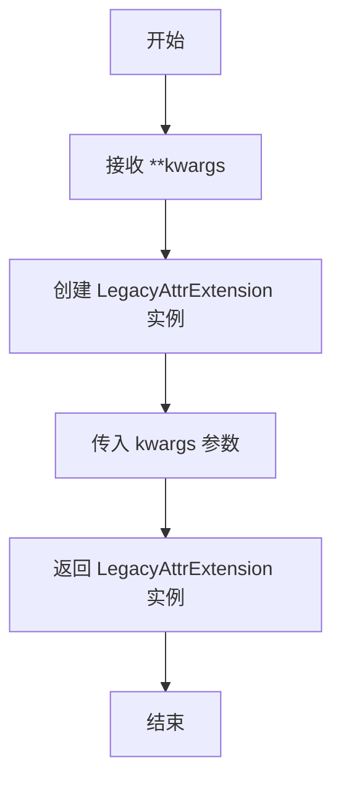
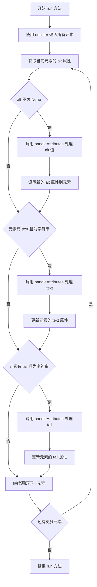
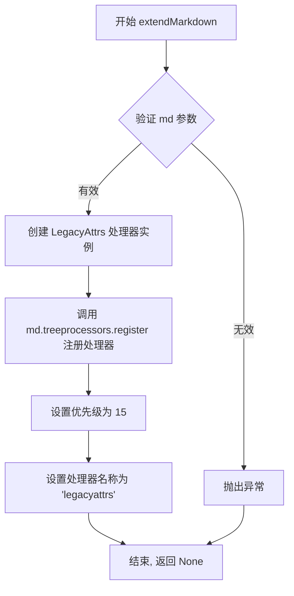

# `markdown\markdown\extensions\legacy_attrs.py` 详细设计文档

这是一个Python Markdown扩展模块，用于实现向后兼容的旧版属性功能，允许使用 {@key=value} 格式为Markdown元素设置属性。

## 整体流程

```mermaid
graph TD
    A[Markdown处理文档] --> B[调用 LegacyAttrs.run(doc)]
    B --> C[遍历文档所有元素]
    C --> D{还有元素未处理?}
    D -- 是 --> E[获取元素alt属性]
    E --> F[调用 handleAttributes 处理 alt]
    F --> G[检查元素 text]
    G --> H[调用 handleAttributes 处理 text]
    H --> I[检查元素 tail]
    I --> J[调用 handleAttributes 处理 tail]
    J --> C
    D -- 否 --> K[结束: 属性已设置到元素]
    L[handleAttributes] --> M[正则替换 {@key=value}]
    M --> N[调用回调函数设置元素属性]
    N --> O[返回移除属性定义后的文本]
```

## 类结构

```
Treeprocessor (markdown.treeprocessors.AbstractBlockProcessor)
└── LegacyAttrs (自定义Treeprocessor)

Extension (markdown.extensions.Extension)
└── LegacyAttrExtension (自定义Extension)
```

## 全局变量及字段


### `ATTR_RE`
    
全局正则表达式，用于匹配 {@key=value} 格式

类型：`re.Pattern`
    


### `LegacyAttrs.md`
    
Markdown实例引用，由Treeprocessor父类继承

类型：`Markdown`
    
    

## 全局函数及方法


### `makeExtension`

该函数是一个工厂函数，用于创建并返回 `LegacyAttrExtension` 类的实例，以便将 legacy 属性扩展注册到 Markdown 处理器中。

参数：

- `**kwargs`：`任意关键字参数`，传递给 `LegacyAttrExtension` 类的关键字参数，用于配置扩展行为

返回值：`LegacyAttrExtension`，返回 `LegacyAttrExtension` 类的实例对象

#### 流程图



#### 带注释源码

```python
def makeExtension(**kwargs):  # pragma: no cover
    """
    创建并返回 LegacyAttrExtension 实例的工厂函数。
    
    参数:
        **kwargs: 传递给 LegacyAttrExtension 类的关键字参数
        
    返回值:
        LegacyAttrExtension: 返回配置好的扩展实例
    """
    return LegacyAttrExtension(**kwargs)
```


### LegacyAttrs.run

该方法是 Python Markdown 库中 `LegacyAttrs` 扩展的核心处理方法，用于在文档树中查找并替换遗留属性格式 `{@key=value}`，将其转换为元素的实际属性，同时清理文本中的属性标记。

参数：

- `doc`：`etree.Element`（xml.etree.ElementTree.Element），表示要处理的 Markdown 文档的 XML 元素树

返回值：`None`，无返回值，该方法直接修改传入的文档树

#### 流程图



#### 带注释源码

```python
def run(self, doc: etree.Element) -> None:
    """Find and set values of attributes ({@key=value}). """
    # 遍历文档树中的所有元素（包括根元素和所有子元素）
    for el in doc.iter():
        # 获取当前元素的 'alt' 属性（通常用于 img 标签）
        alt = el.get('alt', None)
        # 如果存在 alt 属性，则处理其中的遗留属性格式
        if alt is not None:
            # 调用 handleAttributes 替换 {@key=value} 格式，并设置回元素
            el.set('alt', self.handleAttributes(el, alt))
        
        # 检查元素的主文本内容是否存在且为字符串类型
        if el.text and isString(el.text):
            # 处理文本中的遗留属性格式，并更新元素文本
            el.text = self.handleAttributes(el, el.text)
        
        # 检查元素的尾随文本（tail）是否存在且为字符串类型
        # tail 是 ElementTree 中用于存储元素标签后的文本
        if el.tail and isString(el.tail):
            # 处理尾随文本中的遗留属性格式，并更新 tail
            el.tail = self.handleAttributes(el, el.tail)
```


### `LegacyAttrs.handleAttributes`

设置元素属性并返回移除属性定义后的文本。该方法通过正则表达式匹配文本中的 `{@key=value}` 格式，将其转换为元素的属性，并从返回的文本中移除这些定义。

参数：

- `el`：`etree.Element`，需要设置属性的 XML/HTML 元素
- `txt`：`str`，包含属性定义（如 `{@id=123}`）的文本内容

返回值：`str`，移除属性定义后的文本内容

#### 流程图

```mermaid
flowchart TD
    A[Start: handleAttributes] --> B[接收 el 和 txt]
    B --> C{正则匹配 {@...=...}}
    C -->|找到匹配| D[提取 key: match.group 1]
    D --> E[提取 value: match.group 2]
    E --> F[value 替换换行符为空格]
    F --> G[el.set key, value]
    G --> C
    C -->|无匹配| H[返回处理后的 txt]
    H --> I[End]
```

#### 带注释源码

```python
def handleAttributes(self, el: etree.Element, txt: str) -> str:
    """ Set attributes and return text without definitions. """
    # 定义内部回调函数，用于处理每个正则匹配
    def attributeCallback(match: re.Match[str]):
        # match.group(1) 获取属性名（key）
        # match.group(2) 获取属性值（value），并将换行符替换为空格
        el.set(match.group(1), match.group(2).replace('\n', ' '))
    
    # 使用正则替换函数，将 txt 中所有 {@key=value} 模式替换为空字符串
    # 同时通过回调函数设置元素属性
    return ATTR_RE.sub(attributeCallback, txt)
```


### `LegacyAttrExtension.extendMarkdown`

该方法用于将 `LegacyAttrs` 树形处理器注册到 Markdown 实例中，以实现对旧版属性语法 `{@key=value}` 的支持，使文档能够正确渲染使用旧属性格式的历史文档。

参数：

- `self`：`LegacyAttrExtension`，隐式参数，表示扩展实例本身
- `md`：`Markdown`，需要注册扩展的 Markdown 实例对象

返回值：`None`，该方法通过修改传入的 `md` 对象完成注册，无返回值

#### 流程图



#### 带注释源码

```python
def extendMarkdown(self, md):
    """ Add `LegacyAttrs` to Markdown instance. """
    # 使用 md.treeprocessors.register 方法注册 LegacyAttrs 处理器
    # 参数1: LegacyAttrs(md) - 创建处理器实例,传入md配置对象
    # 参数2: 'legacyattrs' - 处理器的注册名称,用于标识和优先级排序
    # 参数3: 15 - 处理器优先级,数值越小越先执行,15为中高优先级
    md.treeprocessors.register(LegacyAttrs(md), 'legacyattrs', 15)
```

## 关键组件


### ATTR_RE 正则表达式

用于匹配 `{@key=value}` 格式的传统属性定义模式，支持提取属性键值对。

### LegacyAttrs 树处理器类

负责遍历 Markdown 生成的 XML 文档树，处理元素中的传统属性语法 `{@key=value}`，将属性设置到对应元素上并返回清理后的文本。

### LegacyAttrExtension 扩展类

实现 Markdown 扩展接口，将 LegacyAttrs 树处理器注册到 Markdown 实例中，优先级为 15。

### makeExtension 工厂函数

用于创建和返回 LegacyAttrExtension 实例的工厂函数，符合 Python Markdown 扩展加载规范。


## 问题及建议


### 已知问题

-   **正则表达式性能问题**：`ATTR_RE = re.compile(r'\{@([^\}]*)=([^\}]*)}')` 使用贪婪匹配 `[^\}]*`，在处理复杂输入时可能导致回溯性能问题，尤其当输入包含多个属性或嵌套花括号时
-   **类型检查方式过时**：使用 `isString(el.text)` 和 `isString(el.tail)` 是旧版Python的写法，现代Python中可直接使用 `isinstance(x, str)`，且 `isString` 函数来源不明确
-   **XML属性注入风险**：使用 `el.set(match.group(1), match.group(2).replace('\n', ' '))` 直接将用户输入设置为XML属性值，未对属性名和属性值进行安全验证，可能导致XML注入攻击
-   **alt属性特殊处理不明确**：仅对 `alt` 属性进行特殊处理并调用 `handleAttributes`，但未说明为何仅处理此属性，其他属性可能被忽略
-   **TYPE_CHECKING导入问题**：在 `TYPE_CHECKING` 块中导入 `xml.etree.ElementTree`，但代码运行时实际需要使用 `etree.Element` 类型，运行时可能存在类型解析问题
-   **魔法数字缺乏说明**：`md.treeprocessors.register(..., 15)` 中的优先级数字15没有注释说明其含义和选择依据

### 优化建议

-   **优化正则表达式**：改用非贪婪匹配或更精确的正则，如 `r'\{@([^}=]+)=([^}]*)}'`，或使用 `re.finditer` 逐个匹配避免回溯
-   **移除过时的类型检查**：使用 `isinstance(el.text, str)` 替代 `isString(el.text)`，提高代码可读性和性能
-   **添加安全验证**：在设置属性前验证属性名符合XML命名规范，并对属性值进行转义处理，防止XML注入
-   **统一属性处理逻辑**：考虑对所有属性文本内容统一调用 `handleAttributes`，或明确文档说明仅处理特定属性的原因
-   **添加类型注解完善**：确保运行时类型正确，可在文件顶部添加运行时导入 `import xml.etree.ElementTree as etree`
-   **提取魔法数字**：将优先级15定义为具名常量，如 `LEGACY_ATTRS_PRIORITY = 15`，并添加注释说明优先级含义
-   **增强文档和测试**：补充单元测试覆盖各种边界情况，如空属性、多属性、特殊字符等

## 其它


### 一段话描述

该代码是Python Markdown的一个扩展模块，实现了遗留属性（legacy attributes）功能，允许使用 `{@key=value}` 语法为Markdown文档中的元素定义属性，主要用于向后兼容早期版本（3.0之前）的属性定义方式。

### 文件的整体运行流程

当Markdown处理文档时，首先通过 `makeExtension` 工厂函数创建 `LegacyAttrExtension` 实例。在Markdown加载扩展时，`LegacyAttrExtension.extendMarkdown` 方法被调用，将 `LegacyAttrs` 树处理器注册到Markdown实例的处理器链中（优先级15）。当Markdown转换文档时，`LegacyAttrs.run` 方法遍历整个XML元素树，对每个元素的 `alt` 属性、文本节点和尾随文本节点调用 `handleAttributes` 方法。`handleAttributes` 使用正则表达式 `ATTR_RE` 匹配文本中的 `{@key=value}` 模式，提取属性名和属性值，将其设置为元素的属性，并返回移除属性定义后的文本。

### 类的详细信息

### 类：LegacyAttrs

**类描述**：树处理器类，负责在Markdown文档的XML树中查找和处理遗留属性定义。

**类字段**：

- `md`: Markdown实例，提供对Markdown环境的访问

**类方法**：

#### run 方法

- **名称**: run
- **参数**:
  - `doc`: etree.Element - Markdown文档的根元素
- **参数描述**: 待处理的XML文档树
- **返回值类型**: None
- **返回值描述**: 该方法直接修改传入的文档树，不返回值
- **mermaid流程图**:
```mermaid
flow TD
    A[开始run方法] --> B[遍历doc中的所有元素]
    B --> C{当前元素有alt属性?}
    C -->|是| D[调用handleAttributes处理alt属性]
    C -->|否| E{元素有文本内容?}
    E -->|是| F[调用handleAttributes处理文本]
    E -->|否| G{元素有尾随文本?}
    G -->|是| H[调用handleAttributes处理尾随文本]
    G -->|否| I[处理下一元素]
    D --> I
    F --> I
    H --> I
    I --> J{还有更多元素?}
    J -->|是| B
    J -->|否| K[结束]
```
- **带注释源码**:
```python
def run(self, doc: etree.Element) -> None:
    """Find and set values of attributes ({@key=value}). """
    # 遍历文档中的所有元素
    for el in doc.iter():
        # 处理元素的alt属性
        alt = el.get('alt', None)
        if alt is not None:
            el.set('alt', self.handleAttributes(el, alt))
        
        # 处理元素的文本内容
        if el.text and isString(el.text):
            el.text = self.handleAttributes(el, el.text)
        
        # 处理元素的尾随文本
        if el.tail and isString(el.tail):
            el.tail = self.handleAttributes(el, el.tail)
```

#### handleAttributes 方法

- **名称**: handleAttributes
- **参数**:
  - `el`: etree.Element - 当前处理的元素
  - `txt`: str - 包含属性定义的文本
- **参数描述**: 待解析的文本内容，可能包含属性定义
- **返回值类型**: str
- **返回值描述**: 移除属性定义后的文本
- **mermaid流程图**:
```mermaid
flow TD
    A[开始handleAttributes] --> B[定义attributeCallback内部函数]
    B --> C[使用ATTR_RE正则替换文本]
    C --> D[返回处理后的文本]
```
- **带注释源码**:
```python
def handleAttributes(self, el: etree.Element, txt: str) -> str:
    """ Set attributes and return text without definitions. """
    # 定义回调函数，用于处理正则匹配结果
    def attributeCallback(match: re.Match[str]):
        # 提取属性名和属性值，设置到元素上
        # 属性值中的换行符替换为空格
        el.set(match.group(1), match.group(2).replace('\n', ' '))
    
    # 使用正则表达式替换文本中的属性定义
    return ATTR_RE.sub(attributeCallback, txt)
```

### 类：LegacyAttrExtension

**类描述**：Markdown扩展类，负责将遗留属性处理器注册到Markdown处理链中。

**类字段**：

- 无公共字段

**类方法**：

#### extendMarkdown 方法

- **名称**: extendMarkdown
- **参数**:
  - `md`: Markdown - Markdown实例
- **参数描述**: Markdown处理器实例
- **返回值类型**: None
- **返回值描述**: 方法直接修改Markdown实例，不返回值
- **mermaid流程图**:
```mermaid
flow TD
    A[开始extendMarkdown] --> B[注册LegacyAttrs到treeprocessors]
    B --> C[设置优先级为15]
    C --> D[结束]
```
- **带注释源码**:
```python
def extendMarkdown(self, md):
    """ Add `LegacyAttrs` to Markdown instance. """
    # 将LegacyAttrs树处理器注册到Markdown实例
    # 优先级15确保在默认处理器之前运行
    md.treeprocessors.register(LegacyAttrs(md), 'legacyattrs', 15)
```

### 全局变量

#### ATTR_RE

- **名称**: ATTR_RE
- **类型**: re.Pattern
- **描述**: 正则表达式对象，用于匹配 `{@key=value}` 格式的属性定义，其中属性名和属性值都可以包含除右花括号外的任意字符

### 全局函数

#### makeExtension 函数

- **名称**: makeExtension
- **参数**:
  - `**kwargs`: 关键字参数
- **参数描述**: 传递给LegacyAttrExtension的构造参数
- **返回值类型**: LegacyAttrExtension
- **返回值描述**: 返回配置的LegacyAttrExtension实例
- **mermaid流程图**:
```mermaid
flow TD
    A[开始makeExtension] --> B[创建LegacyAttrExtension实例]
    B --> C[返回实例]
```
- **带注释源码**:
```python
def makeExtension(**kwargs):  # pragma: no cover
    return LegacyAttrExtension(**kwargs)
```

### 关键组件信息

### 正则表达式引擎

- **名称**: re模块
- **描述**: Python标准库正则表达式模块，用于编译和执行ATTR_RE正则表达式

### Markdown树处理器接口

- **名称**: Treeprocessor
- **描述**: Python Markdown定义的树处理器基类，LegacyAttrs继承此类以实现对文档树的遍历和修改

### 类型检查支持

- **名称**: TYPE_CHECKING
- **描述**: 用于在类型检查时导入xml.etree.ElementTree，避免运行时额外导入，提高性能

### 潜在的技术债务或优化空间

### 1. 硬编码优先级数字

- **问题**: 处理器优先级15是硬编码的数字，没有常量定义，如果未来Markdown内部优先级调整，可能导致意外行为
- **建议**: 考虑使用命名常量或通过配置获取合适的优先级

### 2. 缺少对属性的深度处理

- **问题**: 当前实现只处理元素的直接属性、文本和尾随文本，但不处理子元素的属性
- **建议**: 如果需要支持嵌套元素的属性定义，需要扩展处理逻辑

### 3. 正则表达式性能

- **问题**: ATTR_RE在每次调用handleAttributes时都会被使用，虽然已编译，但频繁调用仍可能有性能影响
- **建议**: 考虑批量处理或缓存机制

### 4. 错误处理不足

- **问题**: 代码没有处理无效属性定义的情况，如空键或空值可能产生意外结果
- **建议**: 添加属性名和值的验证逻辑

### 设计目标与约束

### 设计目标

1. **向后兼容**: 保持与Python-Markdown 3.0之前版本属性定义格式的兼容性
2. **最小侵入**: 作为独立扩展存在，不修改核心Markdown处理逻辑
3. **标准遵循**: 遵循Python Markdown扩展的标准接口规范

### 设计约束

1. **依赖约束**: 必须依赖markdown.treeprocessors和markdown.extensions模块
2. **Python版本**: 代码使用类型注解，需要Python 3.7+支持
3. **格式限制**: 仅支持 `{@key=value}` 格式，不支持其他变体

### 错误处理与异常设计

### 1. 正则匹配失败处理

- **当前实现**: 使用re.sub自动处理匹配失败的情况，匹配失败时返回原文本
- **评估**: 合理，无需额外错误处理

### 2. 空值处理

- **当前实现**: 使用条件检查确保属性、文本、尾随文本存在时才处理
- **评估**: 良好，避免了空值错误

### 3. 类型检查

- **当前实现**: 使用isString函数确保处理的是字符串类型
- **评估**: 必要，防止处理非字符串类型导致的错误

### 数据流与状态机

### 数据流

1. **输入**: Markdown源文档字符串
2. **处理阶段1**: Markdown核心将源文本转换为XML树
3. **处理阶段2**: LegacyAttrs.run遍历XML树
4. **处理阶段3**: 对每个元素调用handleAttributes解析属性定义
5. **处理阶段4**: 修改元素属性，清理文本内容
6. **输出**: 带有正确属性设置的XML树，继续后续处理

### 状态转换

- **初始状态**: 文档树加载完成，等待属性处理
- **处理状态**: 正在遍历元素并应用属性
- **完成状态**: 所有属性已应用，文本已清理

### 外部依赖与接口契约

### 必需的外部依赖

1. **markdown.treeprocessors.Treeprocessor**: 树处理器基类
2. **markdown.treeprocessors.isString**: 字符串类型判断函数
3. **markdown.extensions.Extension**: 扩展基类
4. **xml.etree.ElementTree**: XML元素树操作（类型检查时导入）
5. **re**: 正则表达式模块
6. **typing.TYPE_CHECKING**: 类型检查条件导入

### 公共接口

1. **makeExtension(**kwargs)**: 工厂函数，返回可配置的扩展实例
2. **LegacyAttrExtension**: 扩展类，实现extendMarkdown方法
3. **LegacyAttrs**: 处理器类，实现run方法

### 版本兼容性

- **最低支持**: Python-Markdown 3.0+（扩展本身是为兼容性而设计）
- **推荐环境**: Python 3.7+

### 性能特征

### 时间复杂度

- **run方法**: O(n*m)，其中n是元素数量，m是平均文本长度
- **handleAttributes**: O(k)，k是文本中属性定义的数量

### 空间复杂度

- **额外空间**: O(1)，仅使用常数级临时变量


    