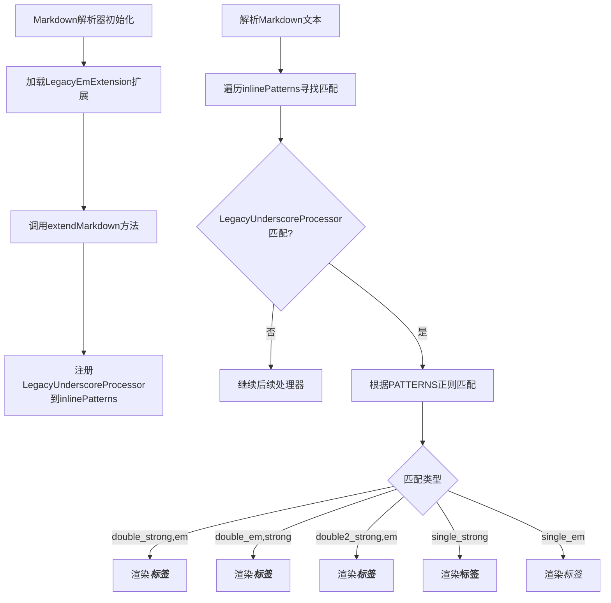
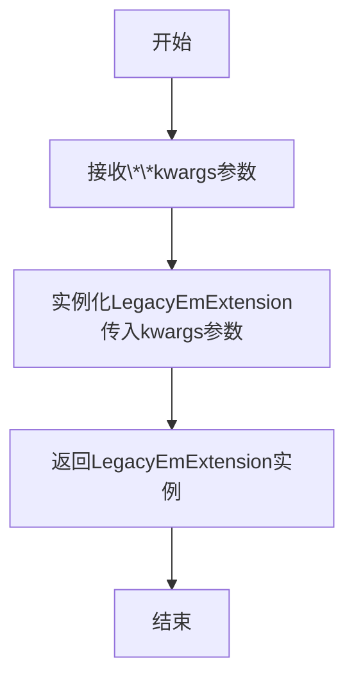
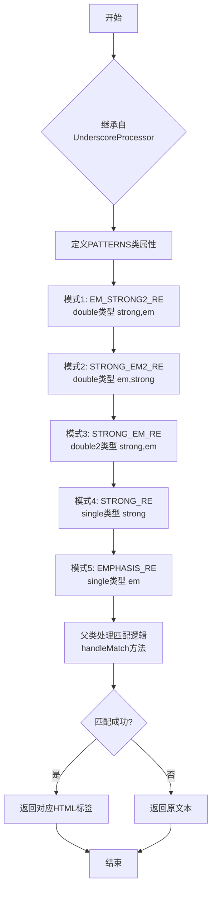
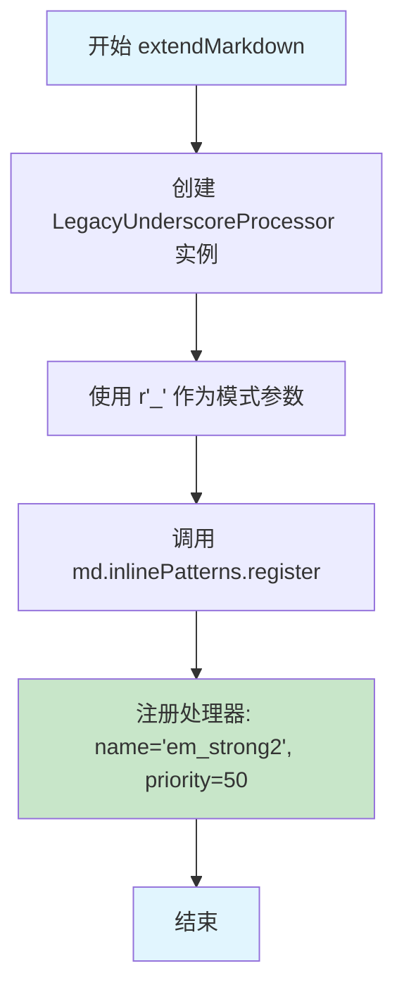

# `markdown\markdown\extensions\legacy_em.py` 详细设计文档

这是Python-Markdown的一个扩展模块，提供对下划线(_)的遗留（legacy）处理行为，用于在Markdown文本中解析和渲染强调(emphasis)和加粗(strong)标记，支持单下划线(_text_)、双下划线(__text__)和三重下划线(___text___)等多种格式。

## 整体流程



## 类结构

```
Extension (抽象基类)
└── LegacyEmExtension

UnderscoreProcessor (inlinepatterns模块)
└── LegacyUnderscoreProcessor
```

## 全局变量及字段


### `EMPHASIS_RE`
    
正则表达式，用于匹配单下划线强调格式 _text_

类型：`str`
    


### `STRONG_RE`
    
正则表达式，用于匹配双下划线加粗格式 __text__

类型：`str`
    


### `STRONG_EM_RE`
    
正则表达式，用于匹配三重下划线组合格式 ___text___

类型：`str`
    


### `LegacyUnderscoreProcessor.PATTERNS`
    
存储所有正则匹配模式和对应的渲染类型

类型：`list[EmStrongItem]`
    


### `LegacyEmExtension.extendMarkdown`
    
将LegacyUnderscoreProcessor注册到Markdown解析器的inlinePatterns中

类型：`method`
    
    

## 全局函数及方法


### `makeExtension`

该函数是Python-Markdown扩展的工厂函数，用于创建并返回`LegacyEmExtension`实例，使Markdown处理器能够支持旧版的`_connected_words_`下划线强调语法。

参数：

- `**kwargs`：`dict`，可选关键字参数，用于传递给`LegacyEmExtension`构造器进行配置

返回值：`LegacyEmExtension`，返回一个新的`LegacyEmExtension`实例，供Python-Markdown注册使用

#### 流程图



#### 带注释源码

```python
def makeExtension(**kwargs):  # pragma: no cover
    """ Return an instance of the `LegacyEmExtension` """
    # 使用可变关键字参数**kwargs实例化LegacyEmExtension类
    # 这些参数会传递给Extension基类的__init__方法
    # 返回的实例会被Python-Markdown的load_extensions()方法注册
    return LegacyEmExtension(**kwargs)
```


### LegacyUnderscoreProcessor

LegacyUnderscoreProcessor是一个强调处理器类，继承自UnderscoreProcessor，用于处理Markdown文本中基于下划线（_）的强调（emphasis）和加粗（strong）语法匹配，支持单下划线、双下划线以及混合的strong+em模式。

参数：
- 由于该类直接继承自UnderscoreProcessor且未覆写__init__方法，参数需参考父类
- `marker`：`str`，下划线标记字符，默认为下划线`_`

返回值：无返回值，该类通过父类方法处理匹配并返回处理后的HTML标签

#### 流程图



#### 带注释源码

```python
# _emphasis_  单下划线强调正则：_(内容)_
EMPHASIS_RE = r'(_)([^_]+)\1'

# __strong__  双下划线加粗正则：__(内容)__
STRONG_RE = r'(_{2})(.+?)\1'

# __strong_em___  双下划线混合加粗和强调正则：__(内容1)_(内容2)___
STRONG_EM_RE = r'(_)\1(?!\1)([^_]+?)\1(?!\1)(.+?)\1{3}'


class LegacyUnderscoreProcessor(UnderscoreProcessor):
    """Emphasis processor for handling strong and em matches inside underscores."""

    # PATTERNS类属性：定义正则表达式匹配模式列表
    # 每个EmStrongItem包含：(正则编译对象, 类型, 标签顺序)
    # 类型：single-单标记, double-双标记, double2-双标记变体
    # 标签顺序：strong,em表示外层strong内层em
    PATTERNS = [
        # 模式1: __strong__em__ 或 __em__strong__ 混合模式
        EmStrongItem(re.compile(EM_STRONG2_RE, re.DOTALL | re.UNICODE), 'double', 'strong,em'),
        
        # 模式2: ___strong_em___ 另一种混合顺序
        EmStrongItem(re.compile(STRONG_EM2_RE, re.DOTALL | re.UNICODE), 'double', 'em,strong'),
        
        # 模式3: __strong_em___ 特定混合模式（double2类型）
        EmStrongItem(re.compile(STRONG_EM_RE, re.DOTALL | re.UNICODE), 'double2', 'strong,em'),
        
        # 模式4: __strong__ 纯加粗
        EmStrongItem(re.compile(STRONG_RE, re.DOTALL | re.UNICODE), 'single', 'strong'),
        
        # 模式5: _emphasis_ 纯强调
        EmStrongItem(re.compile(EMPHASIS_RE, re.DOTALL | re.UNICODE), 'single', 'em')
    ]
```

#### 全局变量和正则模式

| 名称 | 类型 | 描述 |
|------|------|------|
| `EMPHASIS_RE` | `str` | 单下划线强调正则表达式，用于匹配`_文本_` |
| `STRONG_RE` | `str` | 双下划线加粗正则表达式，用于匹配`__文本__` |
| `STRONG_EM_RE` | `str` | 混合下划线加粗和强调正则表达式，用于匹配`__文本1_文本2___` |

#### 关键组件信息

- **EmStrongItem**：用于存储单个正则匹配模式的配置信息，包含正则对象、类型标记和HTML标签顺序
- **UnderscoreProcessor**：父类，提供核心的handleMatch方法和处理逻辑
- **EM_STRONG2_RE, STRONG_EM2_RE**：从inlinepatterns模块导入的预定义正则表达式

#### 潜在技术债务与优化空间

1. **缺少自定义方法**：该类仅定义了PATTERNS属性，完全依赖父类实现，如果需要自定义行为（如优先级调整、特殊处理），代码复用性较低
2. **硬编码正则表达式**：正则模式作为模块级常量定义，若需动态配置或扩展较困难
3. **文档缺失**：PATTERNS中各模式的具体匹配规则和优先级顺序未在注释中详细说明
4. **未使用makeInstance能力**：该类未实现自己的__init__或工厂方法，无法接受自定义配置

#### 其他设计说明

- **设计目标**：为Python-Markdown提供传统的下划线强调/加粗语法兼容
- **依赖关系**：依赖`..inlinepatterns`模块中的UnderscoreProcessor和EmStrongItem
- **注册方式**：通过LegacyEmExtension的extendMarkdown方法注册到md.inlinePatterns，优先级为50
- **错误处理**：继承父类的错误处理机制，正则匹配失败时返回原始文本


### `LegacyEmExtension.extendMarkdown`

将 `LegacyUnderscoreProcessor` 注册到 Markdown 解析器的 `inlinePatterns` 中，用于处理旧版下划线强调语法（`_emphasis_` 和 `__strong__`）。

参数：

- `self`：`LegacyEmderscoreExtension` 实例，隐含的实例引用
- `md`：`Markdown` 实例，Python-Markdown 的核心对象，包含 `inlinePatterns` 属性用于注册内联模式处理器

返回值：`None`（`void`），该方法直接修改 `md` 对象的内部状态，无返回值

#### 流程图



#### 带注释源码

```python
def extendMarkdown(self, md):
    """
    Modify inline patterns.
    
    该方法是 Python-Markdown 扩展接口的核心方法，在 Markdown 实例
    初始化时被调用，用于向 Markdown 解析器注册自定义的内联模式处理器。
    
    Args:
        md: Markdown 实例，Python-Markdown 的核心对象，
            其 inlinePatterns 属性是一个模式注册表，用于存储
            各种内联元素（如链接、强调、粗体）的处理逻辑。
    
    Returns:
        None (void)，直接修改 md 对象的内部状态
    """
    # 创建一个 LegacyUnderscoreProcessor 实例，使用 '_' 作为分隔符
    # 该处理器继承自 UnderscoreProcessor，专门处理旧版下划线强调语法
    processor = LegacyUnderscoreProcessor(r'_')
    
    # 将处理器注册到 Markdown 的内联模式注册表中
    # 参数说明：
    #   - processor: 处理器的实例
    #   - 'em_strong2': 处理器的唯一名称标识符
    #   - 50: 优先级，数值越高越早匹配（Python-Markdown 使用整数优先级）
    md.inlinePatterns.register(processor, 'em_strong2', 50)
```

## 关键组件


### LegacyUnderscoreProcessor

继承自`UnderscoreProcessor`的强调处理器类，负责处理下划线相关的强调模式匹配。该类定义了5种正则表达式模式，分别处理em、strong以及em和strong的组合情况，按优先级顺序存储在PATTERNS列表中。

### LegacyEmExtension

继承自`Extension`的扩展类，用于将旧式下划线强调处理器注册到Markdown实例中。该类实现了extendMarkdown方法，将`LegacyUnderscoreProcessor`注册到inlinePatterns中，优先级为50。

### EMPHASIS_RE

正则表达式常量，用于匹配单个下划线强调格式`_text_`。模式`(_)([^_]+)\1`使用捕获组和反向引用确保前后下划线匹配。

### STRONG_RE

正则表达式常量，用于匹配双下划线强调格式`__text__`。模式`(_{2})(.+?)\1`使用非贪婪匹配以支持多个连续强调。

### STRONG_EM_RE

正则表达式常量，用于匹配三下划线组合格式`___text___`或类似的strong和em组合。使用负向前瞻`(?!\\1)`避免重复匹配。

### makeExtension

工厂函数，用于创建并返回`LegacyEmExtension`实例。接受可变关键字参数**kwargs，遵循Python-Markdown扩展加载规范。


## 问题及建议


### 已知问题

-   **正则表达式逻辑错误**：`STRONG_EM_RE = r'(_)\1(?!\1)([^_]+?)\1(?!\1)(.+?)\1{3}'` 中 `\1` 引用单个下划线捕获组，但 `\1{3}` 实际表示重复单个下划线三次，而非双下划线，与注释 `__strong_em___` 不符。
-   **未使用的导入**：`EM_STRONG2_RE` 和 `STRONG_EM2_RE` 从 `..inlinepatterns` 导入但在代码中未使用。
-   **缺少父类初始化**：`LegacyUnderscoreProcessor` 继承 `UnderscoreProcessor` 但未显式调用 `super().__init__()`，可能导致父类状态未正确初始化。
-   **硬编码优先级**：`md.inlinePatterns.register(..., 50)` 中的优先级 50 是魔法数字，缺乏说明。
-   **重复的正则编译标志**：`re.DOTALL | re.UNICODE` 在多个地方重复定义，可提取为常量。
-   **注释与代码不匹配**：`EMPHASIS_RE` 注释为 `# _emphasis_` 但实际处理单下划线强调，命名略显混乱。

### 优化建议

-   修正 `STRONG_EM_RE` 正则表达式逻辑，确保与预期行为一致或移除未使用的模式。
-   清理未使用的导入 `EM_STRONG2_RE` 和 `STRONG_EM2_RE`。
-   在 `LegacyUnderscoreProcessor.__init__` 中调用父类初始化方法。
-   将优先级 50 提取为具名常量，如 `EM_STRONG_PRIORITY = 50`，并添加注释说明其用途。
-   提取公共正则标志为模块级常量，如 `RE_FLAGS = re.DOTALL | re.UNICODE`。
-   为 `LegacyUnderscoreProcessor` 添加类型注解和文档字符串，说明其处理的具体行为。
-   考虑为 `makeExtension` 函数添加单元测试而非使用 `pragma: no cover`。


## 其它


### 设计目标与约束

**设计目标**：为Python-Markdown提供遗留的下划线强调行为支持，兼容旧版本中对单下划线 `_` 和双下划线 `__` 的em/strong处理逻辑，使现有依赖旧行为的文档能够正确渲染。

**设计约束**：
- 必须继承自 `Extension` 基类以符合Python-Markdown扩展框架
- 必须继承自 `UnderscoreProcessor` 以保持与现有强调处理器的一致性
- 优先级设置为50，介于标准强调处理器和其他内联模式之间
- 正则表达式需使用 `re.DOTALL | re.UNICODE` 标志以支持跨行匹配和Unicode字符

### 错误处理与异常设计

**异常处理机制**：
- 本扩展主要依赖正则表达式匹配，不涉及复杂的业务逻辑，因此没有显式的异常处理
- 正则表达式编译错误会在模块加载时由Python解释器抛出
- 输入文本的无效匹配由父类 `UnderscoreProcessor` 的处理逻辑管理

**边界情况处理**：
- 空字符串或无匹配内容时返回原文本
- 嵌套的强调标签由 `EmStrongItem` 的优先级和匹配顺序决定
- 非连续下划线（如 `____`）不匹配任何模式

### 数据流与状态机

**数据处理流程**：
```
输入Markdown文本
    ↓
LegacyUnderscoreProcessor.process() 被调用
    ↓
遍历 PATTERNS 列表，按顺序尝试匹配
    ↓
找到匹配项后，根据 'single'/'double'/'double2' 类型构建HTML标签
    ↓
返回带HTML标签的渲染结果
    ↓
输出HTML片段
```

**状态转换**：
- **初始状态**：等待输入文本
- **匹配状态**：正则表达式引擎扫描文本
- **构建状态**：根据匹配类型生成对应的HTML标签
- **完成状态**：返回渲染后的HTML

### 外部依赖与接口契约

**外部依赖**：
- `markdown.Extension`：扩展基类
- `markdown.inlinepatterns.UnderscoreProcessor`：强调处理器基类
- `markdown.inlinepatterns.EmStrongItem`：强调项配置类
- `markdown.inlinepatterns.EM_STRONG2_RE`：标准双强调正则
- `markdown.inlinepatterns.STRONG_EM2_RE`：标准强强调正则
- `re` 模块：正则表达式支持

**接口契约**：
- `makeExtension(**kwargs)`：工厂函数，必须返回 `LegacyEmExtension` 实例
- `LegacyEmExtension.extendMarkdown(md)`：注册扩展到Markdown实例
- `LegacyUnderscoreProcessor`：必须实现父类的处理方法
- `PATTERNS` 属性：必须是 `EmStrongItem` 列表，每个包含编译后的正则、类型字符串和标签顺序

### 性能考虑

**性能优化点**：
- 正则表达式在类定义时编译一次，避免重复编译开销
- `PATTERNS` 列表按优先级排序，优先匹配高概率模式
- 使用非贪婪匹配 `.+?` 减少回溯

**潜在性能问题**：
- 复杂的嵌套模式可能导致较多的回溯
- 正则表达式顺序影响匹配效率

### 安全性考虑

**安全风险评估**：
- 无用户输入直接执行代码的风险
- 正则表达式无ReDoS（正则表达式拒绝服务）明显风险
- 输入来源为可信的Markdown文档

**安全建议**：
- 当前实现安全，因为只涉及文本模式匹配和HTML标签生成
- 建议保持依赖的Python-Markdown版本为最新稳定版

### 版本兼容性

**Python版本兼容性**：
- 使用 `from __future__ import annotations`  支持Python 3.7+的类型提示
- 无Python 2特定代码，但保持与Python 2.7的兼容性（通过future导入）

**Python-Markdown兼容性**：
- 设计用于Python-Markdown 2.x系列
- 与Python-Markdown 3.x版本兼容（通过抽象基类）

### 测试策略

**测试覆盖范围**：
- 单下划线强调：`_text_` → `<em>text</em>`
- 双下划线强调：`__text__` → `<strong>text</strong>`
- 混合强调顺序：`___text___` 和 `___text___` 的不同渲染
- 边界情况：连续下划线、跨行匹配、特殊字符

**测试用例示例**：
```python
def test_single_underscore_em():
    md = Markdown(extensions=['legacy_em'])
    result = md.convert('_italic_')
    assert result == '<p><em>italic</em></p>'

def test_double_underscore_strong():
    md = Markdown(extensions=['legacy_em'])
    result = md.convert('__bold__')
    assert result == '<p><strong>bold</strong></p>'
```

### 配置选项

**扩展参数**：
- 当前扩展不接受任何配置参数（`**kwargs` 仅用于接口一致性）
- 未来可扩展选项：自定义优先级、自定义标签样式

**使用方式**：
```python
md = Markdown(extensions=['legacy_em'])
# 或带参数（当前不支持）
md = Markdown(extensions=[{'name': 'legacy_em', 'priority': 50}])
```

### 使用示例

**基本使用**：
```python
import markdown
md = markdown.Markdown(extensions=['legacy_em'])
html = md.convert('This is _italic_ and __bold__ text')
# 输出: <p>This is <em>italic</em> and <strong>bold</strong> text</p>
```

**与Jinja2模板集成**：
```python
from markdown import Markdown
md = Markdown(extensions=['legacy_em', 'extra'])

template = """
# My Document
This is _important_ and this is __very important__.
"""

rendered = md(template)
```

### 配置管理

**注册配置**：
- 扩展通过 `md.inlinePatterns.register()` 注册
- 名称：`em_strong2`
- 优先级：50（高于默认的em/strong处理器）
- 注册时机：在 `extendMarkdown` 方法调用时

**优先级说明**：
- 50：确保在标准强调处理器（优先级70）之前执行，提供遗留行为覆盖
- 较低优先级允许其他处理器先处理其他内联模式

    