# `markdown\markdown\extensions\md_in_html.py` 详细设计文档

该文件实现了 Python-Markdown 的 'raw_html' 扩展，名为 Markdown in HTML。它允许用户在原始 HTML 标签内编写 Markdown 语法，通过解析 HTML 标签上的 `markdown` 属性（如 `markdown='1'`, `markdown='block'`, `markdown='span'`）来决定内部内容是否需要以及如何进行 Markdown 解析。

## 整体流程

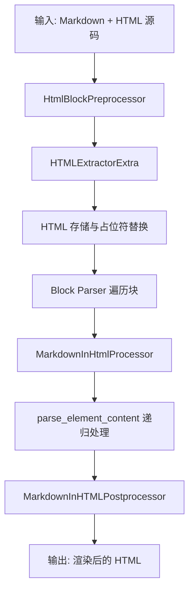

## 类结构

```
Extension (基类)
└── MarkdownInHtmlExtension

Preprocessor (基类)
└── HtmlBlockPreprocessor

BlockProcessor (基类)
└── MarkdownInHtmlProcessor

RawHtmlPostprocessor (基类)
└── MarkdownInHTMLPostprocessor

HTMLExtractor (外部依赖)
└── HTMLExtractorExtra
```

## 全局变量及字段


### `HTMLExtractorExtra.block_level_tags`
    
所有块级 HTML 标签集合

类型：`set`
    


### `HTMLExtractorExtra.span_tags`
    
内容仅做行级解析的块级标签（如 h1-h6, p 等）

类型：`set`
    


### `HTMLExtractorExtra.raw_tags`
    
内容完全不做解析的标签（如 script, style 等）

类型：`set`
    


### `HTMLExtractorExtra.block_tags`
    
内容作为块级解析的标签（块级 - 行级 - 原始）

类型：`set`
    


### `HTMLExtractorExtra.span_and_blocks_tags`
    
block_tags 和 span_tags 的合集

类型：`set`
    


### `HTMLExtractorExtra.mdstack`
    
存储当前激活的 markdown 标签栈

类型：`list`
    


### `HTMLExtractorExtra.treebuilder`
    
用于构建 DOM 元素树

类型：`etree.TreeBuilder`
    


### `HTMLExtractorExtra.mdstate`
    
存储对应的解析状态 ('block', 'span', 'off')

类型：`list`
    


### `HTMLExtractorExtra.mdstarted`
    
标记栈中标签是否已开始处理内容

类型：`list`
    
    

## 全局函数及方法


### `makeExtension`

这是一个工厂函数，供 Markdown 加载扩展使用。它接收可变关键字参数，并创建并返回一个 `MarkdownInHtmlExtension` 实例，以便将 Markdown 解析功能集成到原始 HTML 标签中。

参数：

- `**kwargs`：`任意关键字参数`，传递给 `MarkdownInHtmlExtension` 构造函数的配置参数，用于自定义扩展行为（例如传递配置选项给底层处理器）

返回值：`MarkdownInHtmlExtension`，返回配置好的扩展实例，供 Markdown 库注册使用

#### 流程图

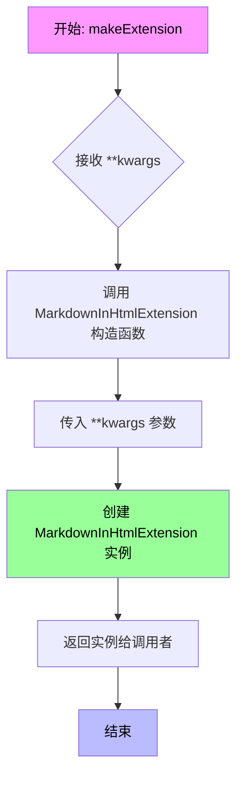

#### 带注释源码

```python
def makeExtension(**kwargs):  # pragma: no cover
    """
    工厂函数，供 Markdown 加载扩展使用。
    
    当用户在 Markdown 中使用 md_activate('markdown_in_html') 或在配置中
    启用 'markdown_in_html' 扩展时，Python-Markdown 库会调用此函数来
    创建扩展实例。
    
    参数:
        **kwargs: 任意关键字参数。这些参数将被原样传递给 
                  MarkdownInHtmlExtension 的构造函数，用于配置扩展行为。
    
    返回值:
        MarkdownInHtmlExtension: 扩展实例，该实例实现了 extendMarkdown 方法，
                                 负责向 Markdown 解析器注册各种处理器。
    """
    return MarkdownInHtmlExtension(**kwargs)
```


### `HTMLExtractorExtra.reset`

重置 HTMLExtractorExtra 实例的状态，清空 markdown 解析堆栈、树构建器、解析状态和启动标记，并调用父类的 reset 方法。

参数：  
该方法无显式参数（隐式参数 `self` 不计入）

返回值：无返回值（`None`），重置实例的内部状态

#### 流程图

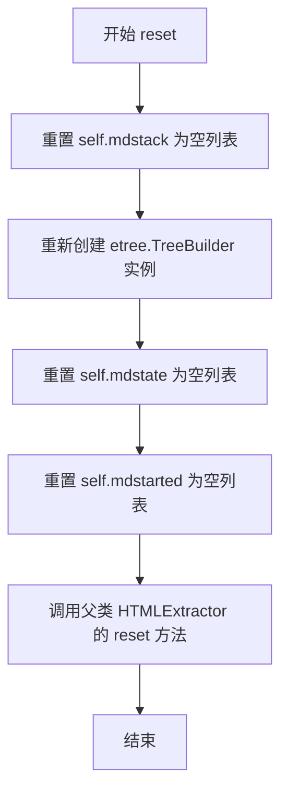

#### 带注释源码

```python
def reset(self):
    """Reset this instance.  Loses all unprocessed data."""
    # 重置 markdown 标签栈，用于跟踪 markdown=1 的标签列表
    self.mdstack: list[str] = []  # When markdown=1, stack contains a list of tags
    # 重新创建 TreeBuilder 实例，用于构建 etree Element 对象
    self.treebuilder = etree.TreeBuilder()
    # 重置解析状态列表，存储 'block', 'span', 'off', None 状态
    self.mdstate: list[Literal['block', 'span', 'off', None]] = []
    # 重置启动标记列表，跟踪标签是否已启动处理
    self.mdstarted: list[bool] = []
    # 调用父类 HTMLExtractor 的 reset 方法，完成基类状态重置
    super().reset()
```


### `HTMLExtractorExtra.close()`

该方法用于在HTML解析结束时处理缓冲区中的未闭合标签，确保所有嵌套的Markdown处理标签都能正确关闭，并输出最终的解析结果。

参数：无需显式参数（方法隐式使用实例属性 `self.mdstack`）

返回值：`None`，无返回值

#### 流程图

```mermaid
flowchart TD
    A[开始 close] --> B{调用父类 close}
    B --> C{检查 self.mdstack 是否非空}
    C -->|是| D[获取最外层未闭合标签 mdstack[0]]
    D --> E[调用 handle_endtag 关闭标签]
    E --> F[handle_endtag 会递归关闭所有子标签]
    F --> G[结束]
    C -->|否| G
```

#### 带注释源码

```python
def close(self):
    """Handle any buffered data."""
    # 调用父类 HTMLExtractor 的 close 方法
    # 处理HTML解析器的基础清理工作
    super().close()
    
    # 处理任何未闭合的标签
    if self.mdstack:
        # 关闭最外层的父标签
        # handle_endtag 方法会自动关闭所有未闭合的子标签
        self.handle_endtag(self.mdstack[0])
```


### `HTMLExtractorExtra.get_element`

该方法是 HTML 提取器扩展的核心辅助方法之一。它负责从内部的 `treebuilder` 中获取当前已构建完成的 XML Element（DOM 树），并在返回后立即重置 `treebuilder` 以便后续继续构建新的元素。通常在处理完一个需要解析 Markdown 的块级 HTML 标签时调用。

参数：

-  无（仅包含实例属性 `self`）

返回值：`etree.Element`，返回从树构建器中提取的完整 XML 元素对象。

#### 流程图

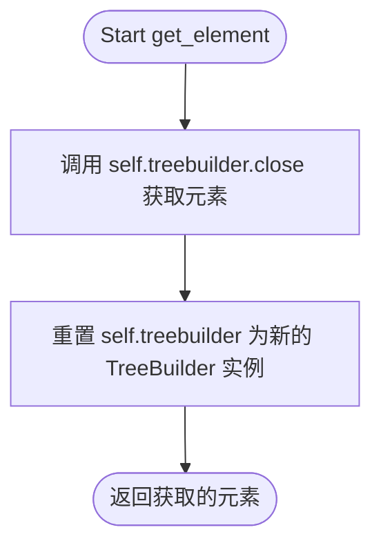

#### 带注释源码

```python
def get_element(self) -> etree.Element:
    """ Return element from `treebuilder` and reset `treebuilder` for later use. """
    # 关闭当前的树构建器，返回根元素
    element = self.treebuilder.close()
    # 重置树构建器，以便解析下一个块级标签的内容
    self.treebuilder = etree.TreeBuilder()
    return element
```


### `HTMLExtractorExtra.get_state`

该方法根据HTML标签名称和`markdown`属性值，结合父元素的解析状态，确定当前元素的内容解析状态（`block`、`span`、`off`或`None`），用于决定该元素内的Markdown语法是否需要被解析以及如何解析。

参数：

- `tag`：`str`，HTML标签名称，用于判断标签类型（块级、span级或行内级）
- `attrs`：`Mapping[str, str]`，HTML标签的属性字典，其中`markdown`属性用于控制Markdown解析行为

返回值：`Literal['block', 'span', 'off', None]`，解析状态标识：
- `'block'`：块级解析状态，该元素内容将作为块级元素进行Markdown解析
- `'span'`：内联解析状态，该元素内容仅作为内联内容解析
- `'off'`：关闭状态，该元素内容不进行Markdown解析
- `None`：默认状态，表示不应用特殊解析规则

#### 流程图

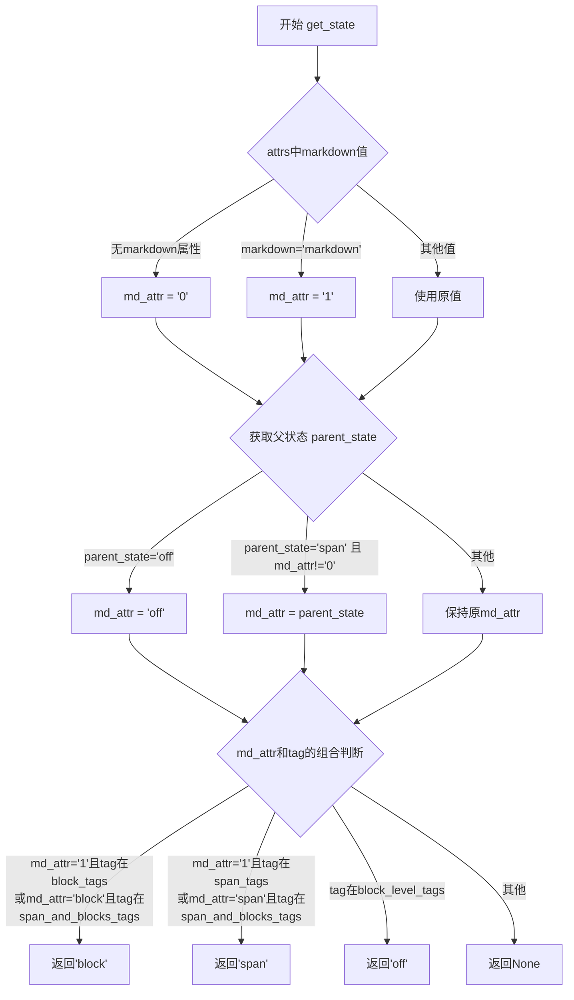

#### 带注释源码

```python
def get_state(self, tag, attrs: Mapping[str, str]) -> Literal['block', 'span', 'off', None]:
    """
    根据tag和markdown属性返回解析状态。
    
    参数:
        tag: HTML标签名称
        attrs: 包含markdown属性的字典
    
    返回:
        解析状态: 'block', 'span', 'off' 或 None
    """
    # 1. 获取markdown属性值，默认为'0'
    md_attr = attrs.get('markdown', '0')
    
    # 2. 处理无值的markdown属性（<tag markdown>等同于<tag markdown='1'>）
    if md_attr == 'markdown':
        md_attr = '1'
    
    # 3. 获取父元素状态，用于嵌套场景的继承判断
    parent_state = self.mdstate[-1] if self.mdstate else None
    
    # 4. 父状态优先级判断：如果父状态更严格，则使用父状态
    #    - 如果父状态是'off'，子元素也必须关闭
    #    - 如果父状态是'span'且当前元素没有显式设置'0'，则继承'span'
    if parent_state == 'off' or (parent_state == 'span' and md_attr != '0'):
        md_attr = parent_state
    
    # 5. 根据md_attr和tag类型判断最终状态
    #    情况1: 返回'block' - 块级解析
    #      - md_attr='1'且tag在block_tags中（显式块级）
    #      - md_attr='block'且tag在span_and_blocks_tags中（指定block模式）
    if ((md_attr == '1' and tag in self.block_tags) or
            (md_attr == 'block' and tag in self.span_and_blocks_tags)):
        return 'block'
    
    #    情况2: 返回'span' - 内联解析
    #      - md_attr='1'且tag在span_tags中（隐式span级）
    #      - md_attr='span'且tag在span_and_blocks_tags中（指定span模式）
    elif ((md_attr == '1' and tag in self.span_tags) or
          (md_attr == 'span' and tag in self.span_and_blocks_tags)):
        return 'span'
    
    #    情况3: 返回'off' - 不解析
    #      - tag是块级标签但不符合上述条件
    elif tag in self.block_level_tags:
        return 'off'
    
    #    情况4: 返回None - 行内元素默认不处理
    else:  # pragma: no cover
        return None
```


### `HTMLExtractorExtra.handle_starttag`

处理HTML开始标签，根据标签类型和markdown属性决定是否进入Markdown块解析状态，并构建相应的元素树。

参数：

- `tag`：`str`，HTML标签名
- `attrs`：`Mapping[str, str]`，HTML标签的属性集合

返回值：`None`，该方法不返回任何值

#### 流程图

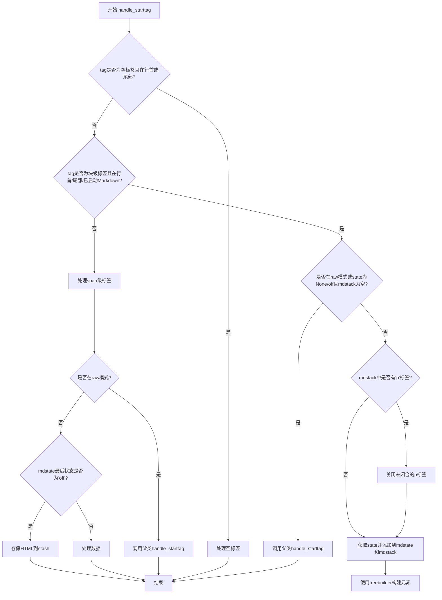

#### 带注释源码

```python
def handle_starttag(self, tag, attrs):
    # 处理应该是空标签且没有指定闭合标签的标签（如 , <br> 等）
    if tag in self.empty_tags and (self.at_line_start() or self.intail):
        # 将无值属性（如 checked）转换为键值对形式 {'checked': 'checked'}
        attrs = {key: value if value is not None else key for key, value in attrs}
        if "markdown" in attrs:
            # 如果存在markdown属性，先移除它
            attrs.pop('markdown')
            # 创建元素并转换为HTML字符串
            element = etree.Element(tag, attrs)
            data = etree.tostring(element, encoding='unicode', method='html')
        else:
            # 获取原始开始标签文本
            data = self.get_starttag_text()
        # 处理空标签
        self.handle_empty_tag(data, True)
        return

    # 检查是否为块级标签且在适当的上下文中（行首、尾部、或已启动Markdown）
    if (
        tag in self.block_level_tags and
        (self.at_line_start() or self.intail or self.mdstarted and self.mdstarted[-1])
    ):
        # 将无值属性转换为键值对形式
        attrs = {key: value if value is not None else key for key, value in attrs}
        # 根据tag和attrs获取解析状态（block、span、off）
        state = self.get_state(tag, attrs)
        
        # 如果在raw模式，或状态为None/off且没有mdstack，回退到默认行为
        if self.inraw or (state in [None, 'off'] and not self.mdstack):
            attrs.pop('markdown', None)
            # 调用父类方法处理
            super().handle_starttag(tag, attrs)
        else:
            # 如果mdstack中有'p'标签且当前是块级标签，关闭未闭合的p标签
            if 'p' in self.mdstack and tag in self.block_level_tags:
                self.handle_endtag('p')
            
            # 将状态和标签压入栈
            self.mdstate.append(state)
            self.mdstack.append(tag)
            self.mdstarted.append(True)
            # 在属性中添加markdown状态
            attrs['markdown'] = state
            # 使用treebuilder开始构建元素
            self.treebuilder.start(tag, attrs)

    else:
        # 处理span级标签（非块级标签）
        if self.inraw:
            # 在raw模式下调用父类方法
            super().handle_starttag(tag, attrs)
        else:
            # 获取原始开始标签文本
            text = self.get_starttag_text()
            if self.mdstate and self.mdstate[-1] == "off":
                # 如果状态为off，将HTML存储到stash
                self.handle_data(self.md.htmlStash.store(text))
            else:
                # 正常处理数据
                self.handle_data(text)
            
            # 如果标签是CDATA内容元素，清除CDATA模式
            if tag in self.CDATA_CONTENT_ELEMENTS:
                self.clear_cdata_mode()
```


### `HTMLExtractorExtra.handle_endtag`

该方法负责处理HTML结束标签，当遇到块级标签且该标签在markdown解析栈中时，会关闭元素及其所有未闭合的子元素，并对markdown块进行扁平化处理以确保内容解析的一致性，最后将处理后的元素存储到cleandoc中。

参数：

- `tag`：`str`，要处理的HTML结束标签的名称

返回值：`None`，无返回值

#### 流程图

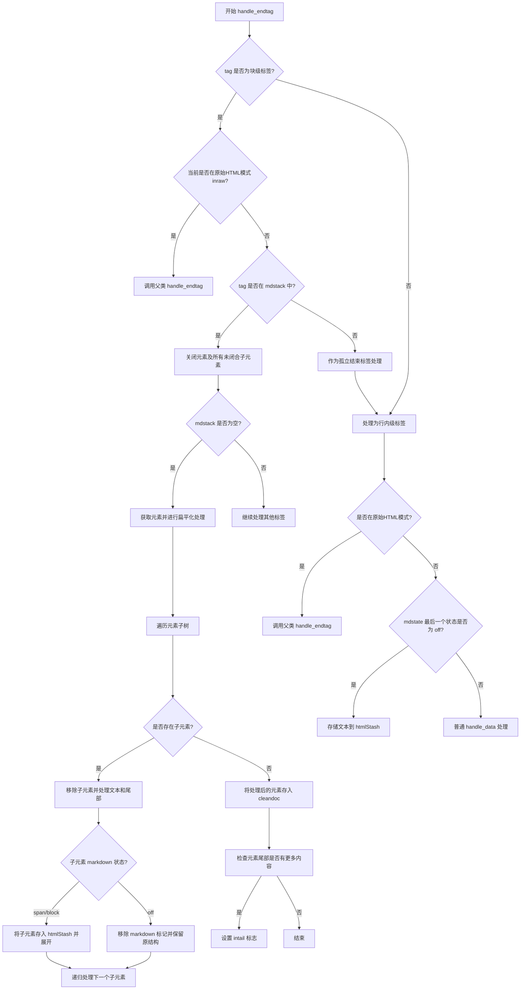

#### 带注释源码

```python
def handle_endtag(self, tag):
    """
    处理HTML结束标签。
    
    主要逻辑：
    1. 判断是否为块级标签
    2. 如果是块级标签且在mdstack中，关闭元素并进行扁平化处理
    3. 如果是块级标签但不在mdstack中，作为孤立标签处理（视为行内标签）
    4. 如果是行内标签，正常处理
    """
    # 判断是否为块级标签
    if tag in self.block_level_tags:
        # 如果当前处于原始HTML模式，调用父类方法处理
        if self.inraw:
            super().handle_endtag(tag)
        # 如果标签在mdstack中，需要关闭元素
        elif tag in self.mdstack:
            # 关闭元素及其所有未闭合的子元素
            while self.mdstack:
                item = self.mdstack.pop()          # 弹出标签栈
                self.mdstate.pop()                  # 弹出状态栈
                self.mdstarted.pop()                # 弹出起始标志栈
                self.treebuilder.end(item)          # 结束树节点
                if item == tag:                     # 找到目标标签，停止关闭
                    break
            
            # mdstack为空，表示最外层元素已关闭
            if not self.mdstack:
                # 从treebuilder获取元素并重置
                element = self.get_element()
                
                # 获取最后一条目检查是否以换行符结尾
                # 如果是元素，假设没有换行符
                item = self.cleandoc[-1] if self.cleandoc else ''
                
                # 如果块元素前只有一个换行符添加另一个
                if not item.endswith('\n\n') and item.endswith('\n'):
                    self.cleandoc.append('\n')

                # 扁平化HTML结构，使得markdown块在解析时，
                # 内部内容的解析方式与外部一致。
                # 在处理相邻内容之前，树中存在的真实HTML元素可能导致
                # 扩展的不可预测问题。
                current = element
                last = []
                
                # 遍历元素树进行扁平化
                while current is not None:
                    # 遍历当前元素的所有子元素
                    for child in list(current):
                        current.remove(child)      # 暂时移除子元素
                        
                        # 获取子元素的文本和尾部
                        text = current.text if current.text is not None else ''
                        tail = child.tail if child.tail is not None else ''
                        child.tail = None           # 清空尾部以便后续处理
                        state = child.attrib.get('markdown', 'off')

                        # 如果尾部不是单个换行符，添加换行符并去除尾部换行
                        if tail != '\n':
                            tail = '\n' + tail.rstrip('\n')

                        # 确保块之间有空行
                        if not text.endswith('\n\n'):
                            text = text.rstrip('\n') + '\n\n'

                        # 根据markdown状态适当处理嵌套块
                        if state in ('span', 'block'):
                            # 将子元素存入htmlStash并展开
                            current.text = f'{text}{self.md.htmlStash.store(child)}{tail}'
                            last.append(child)      # 记录待处理的子元素
                        else:
                            # 非Markdown的HTML不会被递归解析
                            # 移除标记并保持未扁平化状态
                            child.attrib.pop('markdown')
                            [c.attrib.pop('markdown', None) for c in child.iter()]
                            current.text = f'{text}{self.md.htmlStash.store(child)}{tail}'
                    
                    # 处理已展开的子元素
                    current = last.pop(0) if last else None

                # 将处理后的元素存入cleandoc
                self.cleandoc.append(self.md.htmlStash.store(element))
                self.cleandoc.append('\n\n')
                self.state = []
                
                # 检查元素后面是否有更多内容
                if not blank_line_re.match(
                        self.rawdata[self.line_offset + self.offset + len(self.get_endtag_text(tag)):]):
                    # endtag后有更多内容
                    self.intail = True
        else:
            # 将孤立的结束标签视为行内级标签处理
            text = self.get_endtag_text(tag)
            if self.mdstate and self.mdstate[-1] == "off":
                self.handle_data(self.md.htmlStash.store(text))
            else:
                self.handle_data(text)
    else:
        # 行内级标签处理
        if self.inraw:
            super().handle_endtag(tag)
        else:
            text = self.get_endtag_text(tag)
            if self.mdstate and self.mdstate[-1] == "off":
                self.handle_data(self.md.htmlStash.store(text))
            else:
                self.handle_data(text)
```


### `HTMLExtractorExtra.handle_startendtag`

处理自闭合标签（也称为空标签，如 ``、`<br/>` 等），根据标签类型和属性决定如何存储和处理这些标签。

参数：

- `tag`：`str`，要处理的标签名称（如 `img`、`br`、`input` 等）
- `attrs`：`Mapping[str, str]`，标签的属性字典，包含所有 HTML 属性及其值

返回值：`None`，该方法无返回值（返回类型为 `None`）

#### 流程图

```mermaid
flowchart TD
    A[开始 handle_startendtag] --> B{tag in empty_tags?}
    B -->|Yes| C[处理属性值]
    B -->|No| D[获取开始标签文本]
    C --> E{markdown in attrs?}
    E -->|Yes| F[移除markdown属性<br/>创建etree.Element<br/>序列化为HTML字符串]
    E -->|No| G[调用get_starttag_text获取原始文本]
    F --> H[调用handle_empty_tag]
    D --> H
    G --> H
    H --> I{is_block = md.is_block_level(tag)?}
    I -->|是块级| J[添加换行符并存储数据]
    I -->|不是块级| K{mdstate[-1] == 'off'?}
    K -->|是off| L[将数据存储到htmlStash]
    K -->|不是off| M[直接处理数据]
    J --> N[结束]
    L --> N
    M --> N
```

#### 带注释源码

```python
def handle_startendtag(self, tag, attrs):
    """
    处理自闭合标签（如 、<br/> 等）。
    
    参数:
        tag: 标签名称
        attrs: 属性字典
    """
    # 检查标签是否属于空标签集合（如 img, br, input, hr 等自闭合标签）
    if tag in self.empty_tags:
        # 处理 valueless 属性（如 checked、disabled 等）
        # 将 None 值转换为属性名本身（如 checked=None -> checked='checked'）
        attrs = {key: value if value is not None else key for key, value in attrs}
        
        # 检查是否指定了 markdown 属性
        if "markdown" in attrs:
            # 移除 markdown 属性（因为它不应该出现在输出HTML中）
            attrs.pop('markdown')
            # 使用 etree 创建元素并序列化为 HTML 字符串
            element = etree.Element(tag, attrs)
            data = etree.tostring(element, encoding='unicode', method='html')
        else:
            # 没有 markdown 属性，获取原始的标签文本
            data = self.get_starttag_text()
    else:
        # 非空标签集合中的标签（如 <div /> 等），也视为自闭合处理
        data = self.get_starttag_text()
    
    # 判断是否为块级元素
    is_block = self.md.is_block_level(tag)
    
    # 调用 handle_empty_tag 处理数据
    # 根据块级/行内级别和当前状态决定如何存储数据
    self.handle_empty_tag(data, is_block=is_block)
```


### `HTMLExtractorExtra.handle_data`

处理标签内的文本数据，根据当前解析状态（是否在原始HTML块中、是否在Markdown解析堆栈中）将数据传递给父类处理或累积到树构建器中。

参数：

- `data`：`str`，要处理的文本数据

返回值：`None`，无返回值（该方法修改实例状态）

#### 流程图

```mermaid
flowchart TD
    A[开始 handle_data] --> B{self.intail 为真<br/>且 data 包含换行符?}
    B -->|是| C[设置 self.intail = False]
    B -->|否| D{self.inraw 为真<br/>或 self.mdstack 为空?}
    C --> D
    D -->|是| E[调用父类<br/>HTMLExtractor.handle_data]
    D -->|否| F[设置 self.mdstarted[-1] = False]
    F --> G[调用 self.treebuilder.data<br/>累积数据到树构建器]
    E --> H[结束]
    G --> H
```

#### 带注释源码

```python
def handle_data(self, data):
    """
    处理标签内的文本数据。
    
    根据当前解析状态（是否在原始HTML块中、是否在Markdown解析堆栈中）
    将数据传递给父类处理或累积到树构建器中。
    
    参数:
        data: str, 要处理的文本数据
    返回值:
        None
    """
    # 如果在元素的尾部（tail）中处理数据，且数据包含换行符，
    # 则重置 intail 标志，表示已离开 tail 区域
    if self.intail and '\n' in data:
        self.intail = False
    
    # 如果当前正在处理原始HTML（self.inraw=True），
    # 或者Markdown解析堆栈为空（self.mdstack为空），
    # 则使用默认的HTML提取行为
    if self.inraw or not self.mdstack:
        super().handle_data(data)
    else:
        # 否则，将当前Markdown块标记为已开始（设为False表示数据已累积）
        self.mdstarted[-1] = False
        # 将数据添加到树构建器，在Markdown解析模式下累积元素内容
        self.treebuilder.data(data)
```


### `HTMLExtractorExtra.handle_empty_tag()`

处理空标签（自闭合标签或无结束标签）的数据，根据当前解析状态将标签数据存储到HTML暂存区或直接处理。

参数：

-  `data`：`str`，表示空标签的HTML文本（如 `` 或 `<br>` 的原始文本）
-  `is_block`：`bool`，表示该标签是否为块级元素（`True` 表示块级，`False` 表示行内级）

返回值：`None`，无返回值。该方法直接修改解析器内部状态，不返回任何值。

#### 流程图

```mermaid
flowchart TD
    A[开始 handle_empty_tag] --> B{self.inraw or not self.mdstack?}
    B -->|是| C[调用父类方法 super().handle_empty_tag]
    C --> D[结束]
    B -->|否| E{self.at_line_start and is_block?}
    E -->|是| F[调用 handle_data<br/>'\n' + self.md.htmlStash.store(data) + '\n\n']
    F --> D
    E -->|否| G{self.mdstate and self.mdstate[-1] == 'off'?}
    G -->|是| H[调用 handle_data<br/>self.md.htmlStash.store(data)]
    H --> D
    G -->|否| I[调用 handle_data<br/>data]
    I --> D
```

#### 带注释源码

```python
def handle_empty_tag(self, data, is_block):
    """
    处理空标签（自闭合标签）的数据。
    
    根据解析器当前的状态（是否在原始HTML块中、是否有markdown堆栈等）
    决定如何处理空标签的数据。
    
    参数:
        data: 空标签的HTML文本表示，如 ''
        is_block: 布尔值，指示该标签是否为块级元素
    """
    # 如果当前处于原始HTML模式，或者没有markdown堆栈（即不在markdown解析上下文中）
    # 则使用父类的默认处理方式
    if self.inraw or not self.mdstack:
        super().handle_empty_tag(data, is_block)
    else:
        # 处于markdown解析上下文中
        if self.at_line_start() and is_block:
            # 如果是块级标签且位于行首，添加换行符并将数据存入HTML暂存区
            # 这样可以确保块级空标签前后有适当的空白分隔
            self.handle_data('\n' + self.md.htmlStash.store(data) + '\n\n')
        elif self.mdstate and self.mdstate[-1] == "off":
            # 如果当前状态为'off'（该区域不解析markdown），将数据存入HTML暂存区
            # 这样可以保留原始HTML不被markdown处理
            self.handle_data(self.md.htmlStash.store(data))
        else:
            # 其他情况，直接将数据作为普通数据处理
            self.handle_data(data)
```


### `HTMLExtractorExtra.parse_pi`

解析处理指令（Processing Instruction，`<? ... ?>`），当处理指令不在块的起始位置时，将其作为普通文本处理，以避免错误消耗后续可能存在的标签。

参数：

- `i`：`int`，当前在原始 HTML 数据中的位置索引

返回值：`int`，处理完成后应跳转到的下一个位置索引

#### 流程图

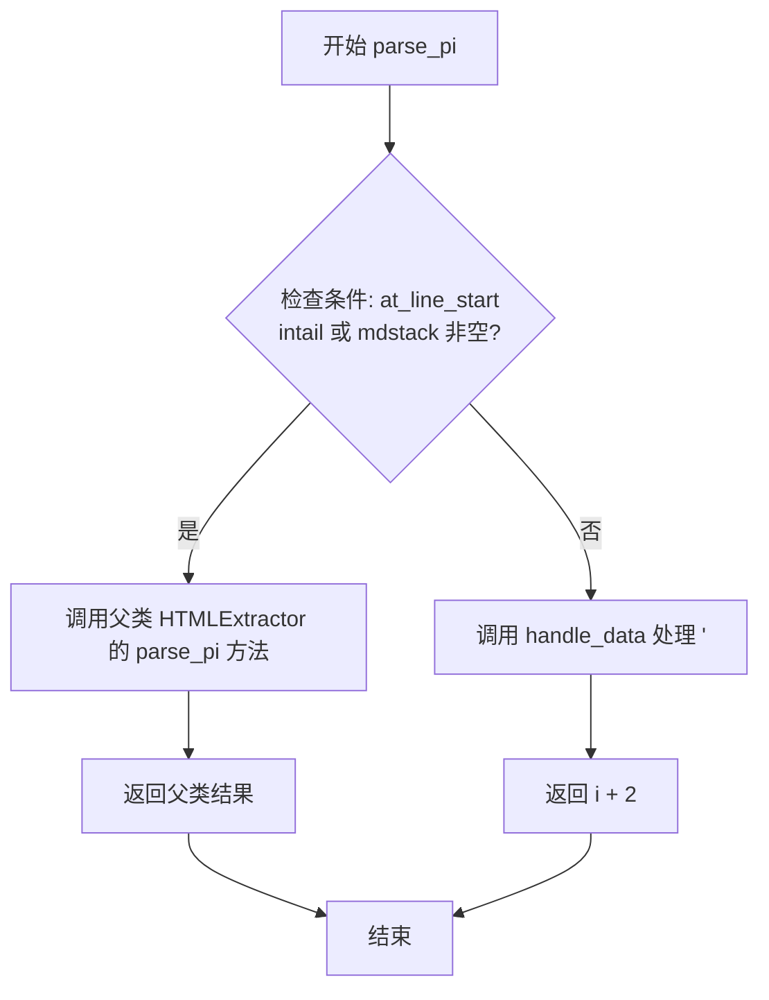

#### 带注释源码

```python
def parse_pi(self, i: int) -> int:
    """
    解析处理指令（Processing Instruction）。
    
    处理指令格式：<?target data?>
    例如：<?xml version="1.0" encoding="UTF-8"?>
    
    参数:
        i: int - 当前在原始数据中的位置索引
        
    返回:
        int - 处理完成后应跳转到的下一个位置索引
    """
    # 检查是否满足以下任一条件：
    # 1. at_line_start(): 当前位于行的开始位置
    # 2. intail: 处于尾随内容中
    # 3. mdstack: 存在未关闭的 Markdown 块级标签
    if self.at_line_start() or self.intail or self.mdstack:
        # 这种情况应该使用父类的标准处理方式
        # 注释说明：同样的覆盖逻辑在 HTMLExtractor 中也存在，但没有对 mdstack 的检查
        # 因此这里使用 HTMLExtractor 的父类（即更基础的解析器类）
        return super(HTMLExtractor, self).parse_pi(i)
    
    # 如果不满足上述条件，说明这不是一个原始块的开头
    # 此时将处理指令作为普通文本处理，避免消耗后续可能跟随的标签
    # 修复参考：见 issue #1066
    self.handle_data('<?')
    # 返回 i + 2，跳过已经处理的 '<?' 两个字符
    return i + 2
```


### `HTMLExtractorExtra.parse_html_declaration`

该方法用于解析HTML声明（如`<!DOCTYPE`、`<![CDATA[`、`<!ENTITY`等），覆盖了父类`HTMLExtractor`的实现，添加了对Python bug gh-77057的处理（当Python版本小于3.13时，解析器在处理某些CDATA相关声明时存在bug），并确保当HTML声明不是原始块开始时，将其作为普通数据处理以避免错误消耗后续标签。

参数：

- `i`：`int`，表示在待解析原始数据`rawdata`中开始解析的位置索引

返回值：`int`，返回解析完成后新的位置索引（即下一个待处理字符的索引）

#### 流程图

```mermaid
flowchart TD
    A[开始解析 HTML 声明<br/>输入位置 i] --> B{检查条件:<br/>at_line_start() 或<br/>intail 或 mdstack}
    B -->|是| C{检查 rawdata[i:i+3]<br/>== '<![' 且<br/>rawdata[i:i+9]<br/>!= '<![CDATA['}
    C -->|是| D[调用 parse_bogus_comment(i)<br/>处理 Python bug gh-77057]
    D --> E{result == -1?}
    E -->|是| F[调用 handle_data<br/>处理单个字符 '<'<br/>返回 i + 1]
    E -->|否| G[返回 result]
    C -->|否| H[调用父类方法<br/>super().parse_html_declaration(i)<br/>即 HTMLExtractor 的实现]
    B -->|否| I[调用 handle_data<br/>将 '<!' 作为普通数据处理<br/>返回 i + 2]
```

#### 带注释源码

```python
def parse_html_declaration(self, i: int) -> int:
    """
    解析 HTML 声明（如 <!DOCTYPE, <![CDATA[, <!ENTITY 等）
    
    参数:
        i: int - 在 rawdata 中开始解析的位置索引
        
    返回:
        int - 解析完成后新的位置索引
    """
    # 检查是否满足解析HTML声明的条件：
    # 1. at_line_start() - 在行首
    # 2. intail - 在标签尾部
    # 3. self.mdstack - 存在未关闭的Markdown标签
    if self.at_line_start() or self.intail or self.mdstack:
        # 检查是否遇到了Python bug gh-77057相关的问题
        # 该bug出现在 Python < 3.13 中，当解析类似 <![CDATA[ 的声明时
        # 检查以 '<![' 开头但不是 '<![CDATA[' 的情况
        if self.rawdata[i:i+3] == '<![' and not self.rawdata[i:i+9] == '<![CDATA[':
            # 调用 parse_bogus_comment 处理这个特殊情况
            # 这是为了解决 Python 3.13 之前版本解析器的bug
            result = self.parse_bogus_comment(i)
            if result == -1:
                # 如果解析失败，将单个字符 '<' 作为数据处理
                self.handle_data(self.rawdata[i:i + 1])
                return i + 1
            # 返回解析结果
            return result
        
        # 如果不是上述特殊情况，调用父类 HTMLExtractor 的实现
        # 注意：这里使用 super(HTMLExtractor, self) 而不是 super()
        # 是因为 HTMLExtractor 本身也有一个 parse_html_declaration 方法
        # 但那个方法没有检查 mdstack，所以我们直接调用 HTMLExtractor 的父类
        # 即 HTMLParser 的实现
        return super(HTMLExtractor, self).parse_html_declaration(i)
    
    # 如果不满足上述条件，说明这不是一个原始块的开始
    # 将 '<!' 作为普通文本数据处理，避免消耗后续可能存在的标签
    # 这解决了 issue #1066 中的问题
    self.handle_data('<!')
    return i + 2
```


### `HtmlBlockPreprocessor.run`

该方法是 Python-Markdown 的 HTML 块预处理器入口方法，负责接收 Markdown 源码中的文本行，调用 HTMLExtractorExtra 解析器识别并提取需要保留的原始 HTML 块，将这些 HTML 内容存储到 stash 中并替换为占位符，最终返回处理后的文本行列表供后续 Markdown 解析使用。

参数：

- `lines`：`list[str]`，Markdown 源文件按行分割的字符串列表

返回值：`list[str]`，处理后的文本行列表，原始 HTML 块已被替换为占位符

#### 流程图

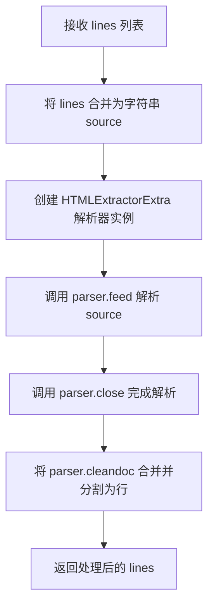

#### 带注释源码

```python
class HtmlBlockPreprocessor(Preprocessor):
    """Remove html blocks from the text and store them for later retrieval."""

    def run(self, lines: list[str]) -> list[str]:
        """
        预处理器入口方法，执行 HTML 块的提取和替换
        
        参数:
            lines: Markdown 源文件的行列表
            
        返回:
            处理后的行列表，HTML 块被替换为占位符
        """
        # Step 1: 将输入的行列表合并为单个字符串
        # 使用换行符连接，便于 HTML 解析器处理
        source = '\n'.join(lines)
        
        # Step 2: 创建 HTMLExtractorExtra 解析器实例
        # 该解析器继承自 HTMLExtractor，能够识别 markdown 属性标记的 HTML 块
        parser = HTMLExtractorExtra(self.md)
        
        # Step 3: 填充解析器数据
        # feed 方法会触发 starttag、data、endtag 等回调
        parser.feed(source)
        
        # Step 4: 关闭解析器
        # 确保所有缓冲数据被处理，handle_endtag 被调用以完成未闭合的标签
        parser.close()
        
        # Step 5: 将解析结果转换为行列表返回
        # parser.cleandoc 包含处理后的文档片段（HTML 已替换为占位符）
        # 合并后再分割为行，保持与输入格式一致
        return ''.join(parser.cleandoc).split('\n')
```

---

## 详细设计文档

### 一、核心功能概述

该代码模块是 Python-Markdown 的 **raw_html** 扩展实现，基于 PHP Markdown Extra 的规范，支持在原始 HTML 标签内解析 Markdown 语法。核心机制是通过自定义 HTML 解析器识别带有 `markdown` 属性的 HTML 块，将其内容提取并标记，供后续的块处理器和行内处理器进行 Markdown 解析，最终实现 Markdown 与 HTML 的混合编写。

### 二、文件整体运行流程

```
Markdown 源文件
       │
       ▼
┌─────────────────────────────┐
│  HtmlBlockPreprocessor.run  │  (Preprocessor)
│  - 提取 HTML 块             │
│  - 替换为占位符             │
└─────────────────────────────┘
       │
       ▼
┌─────────────────────────────┐
│  Markdown 核心解析器        │
│  - 解析剩余 Markdown 语法   │
└─────────────────────────────┘
       │
       ▼
┌─────────────────────────────┐
│  MarkdownInHtmlProcessor   │  (BlockProcessor)
│  - 处理 HTML 块内的 Markdown│
└─────────────────────────────┘
       │
       ▼
┌─────────────────────────────┐
│  MarkdownInHTMLPostprocessor│  (Postprocessor)
│  - 还原 HTML 输出           │
└─────────────────────────────┘
       │
       ▼
最终 HTML 输出
```

### 三、类详细信息

#### 3.1 `HTMLExtractorExtra`

| 字段/方法 | 类型/签名 | 描述 |
|-----------|----------|------|
| `block_level_tags` | `set[str]` | 所有块级 HTML 标签集合 |
| `span_tags` | `set[str]` | 仅进行行内解析的块级标签 |
| `raw_tags` | `set[str]` | 不解析内容的标签（canvas, math, pre 等） |
| `block_tags` | `set[str]` | 内容作为块级解析的标签 |
| `span_and_blocks_tags` | `set[str]` | block_tags 与 span_tags 的并集 |
| `mdstack` | `list[str]` | 当前打开的 markdown 块标签栈 |
| `mdstate` | `list[Literal['block', 'span', 'off', None]]` | 每个 mdstack 标签对应的解析状态 |
| `mdstarted` | `list[bool]` | 标记对应标签是否已开始处理内容 |
| `reset()` | `() -> None` | 重置解析器状态 |
| `close()` | `() -> None` | 处理缓冲数据，关闭未闭合标签 |
| `get_element()` | `() -> etree.Element` | 从 treebuilder 获取元素并重置 |
| `get_state(tag, attrs)` | `(str, Mapping[str, str]) -> Literal['block', 'span', 'off', None]` | 根据标签和 markdown 属性返回解析状态 |
| `handle_starttag(tag, attrs)` | `(str, Mapping[str, str]) -> None` | 处理开始标签，根据状态决定是否启用 Markdown 解析 |
| `handle_endtag(tag)` | `(str) -> None` | 处理结束标签，扁平化 markdown 块结构 |
| `handle_startendtag(tag, attrs)` | `(str, Mapping[str, str]) -> None` | 处理自闭合标签 |
| `handle_data(data)` | `(str) -> None` | 处理文本数据，根据状态写入 treebuilder 或调用父类方法 |
| `handle_empty_tag(data, is_block)` | `(str, bool) -> None` | 处理空标签 |
| `parse_pi(i)` | `(int) -> int` | 处理处理指令 |
| `parse_html_declaration(i)` | `(int) -> int` | 处理 HTML 声明 |

#### 3.2 `HtmlBlockPreprocessor`

| 字段/方法 | 类型/签名 | 描述 |
|-----------|----------|------|
| `run(lines)` | `(list[str]) -> list[str]` | **入口方法**，提取 HTML 块并替换为占位符 |

#### 3.3 `MarkdownInHtmlProcessor`

| 字段/方法 | 类型/签名 | 描述 |
|-----------|----------|------|
| `test(parent, block)` | `(etree.Element, str) -> bool` | 始终返回 True，实际匹配在 run 方法中判断 |
| `parse_element_content(element)` | `(etree.Element) -> None` | 递归解析元素的文本内容为 Markdown，处理块级和行内解析 |
| `run(parent, blocks)` | `(etree.Element, list[str]) -> bool` | 从 blocks 中提取 HTML 占位符，解析其中的 Markdown 内容 |

#### 3.4 `MarkdownInHTMLPostprocessor`

| 字段/方法 | 类型/签名 | 描述 |
|-----------|----------|------|
| `stash_to_string(text)` | `(str \| etree.Element) -> str` | 将 stash 中的元素或字符串转换为输出字符串 |

#### 3.5 `MarkdownInHtmlExtension`

| 字段/方法 | 类型/签名 | 描述 |
|-----------|----------|------|
| `extendMarkdown(md)` | `(Markdown) -> None` | 注册所有处理器到 Markdown 实例 |

### 四、关键组件信息

| 组件名称 | 描述 |
|----------|------|
| `HTMLExtractorExtra` | 自定义 HTML 解析器，继承自 `HTMLExtractor`，负责识别 `markdown` 属性并跟踪解析状态 |
| `HtmlBlockPreprocessor` | 预处理器，在主解析流程前提取并替换 HTML 块为占位符 |
| `MarkdownInHtmlProcessor` | 块处理器，处理 HTML 占位符内的 Markdown 内容 |
| `MarkdownInHTMLPostprocessor` | 后处理器，将 stash 中的元素序列化为最终 HTML 输出 |
| `MarkdownInHtmlExtension` | 扩展入口类，负责将各处理器注册到 Markdown 解析流程 |
| `mdstack` | 标签栈，追踪当前打开的需要 Markdown 解析的块级标签 |
| `mdstate` | 状态列表，记录每个 mdstack 标签对应的解析模式（block/span/off） |
| `htmlStash.store()` | 存储机制，将提取的 HTML 块转换为占位符供后续还原 |

### 五、潜在技术债务与优化空间

1. **列表操作效率低下**：在 `MarkdownInHtmlProcessor.run` 和 `parse_element_content` 中使用 `pop(index)` + `insert(index, '')` 维护 stash，应使用 `deque` 或直接赋值
2. **字符串拼接优化**：多处使用 `''.join()` 拼接字符串后可进一步优化为 `io.StringIO`
3. **parse_element_content 方法过于复杂**：该方法承担了过多职责（状态管理、元素遍历、占位符替换），可拆分为多个辅助方法
4. **重复代码模式**：`handle_starttag` 和 `handle_endtag` 中存在重复的属性处理逻辑（如 valueless attribute 转换）
5. **类型注解可增强**：部分复杂方法的参数类型可使用 `TypeAlias` 增强可读性

### 六、其它项目

#### 设计目标与约束

- **目标**：实现 PHP Markdown Extra 规范的 Markdown in HTML 功能，允许在 `<div markdown="1">` 等标签内编写 Markdown 语法
- **约束**：依赖 Python-Markdown 核心库和 `xml.etree.ElementTree`，需兼容 Python 3.8+

#### 错误处理与异常设计

- HTML 解析异常由 Python 内置 `html.parser` 自行抛出
- 未闭合标签通过 `close()` 方法的 `handle_endtag(self.mdstack[0])` 自动关闭
- 占位符匹配失败时 `MarkdownInHtmlProcessor.run` 返回 `False`，流程继续

#### 数据流与状态机

- **解析状态机**：通过 `mdstate` 追踪嵌套的 Markdown 解析模式（`block` → 块级解析，`span` → 行内解析，`off` → 禁用）
- **标签栈**：使用 `mdstack` 维护当前打开的需解析的块级标签，配合 `mdstarted` 标记内容是否已开始
- **数据流向**：`lines` → `source` → `parser.cleandoc` → `output lines`

#### 外部依赖与接口契约

- **核心依赖**：`markdown.Markdown`、`HTMLExtractor`、`BlockProcessor`、`Preprocessor`、`RawHtmlPostprocessor`、`util`、`HTMLExtractor`
- **第三方库**：`xml.etree.ElementTree`（标准库）
- **公开接口**：通过 `makeExtension(**kwargs)` 工厂函数创建扩展实例，遵循 Python-Markdown 扩展接口规范


以下是给定代码的详细设计文档，包含了针对 `MarkdownInHtmlProcessor.test` 方法的详细提取信息以及整体架构分析。

### 1. 整体描述
该文件是 Python-Markdown 的一个扩展（`raw_html`），实现了在原始 HTML 标签内解析 Markdown 语法的功能（基于 PHP Markdown Extra 的实现）。它通过预处理 HTML 块、使用自定义的 HTML 提取器、以及块处理器来管理带有 `markdown` 属性的 HTML 标签，最终将 Markdown 内容转换为 HTML 块。

### 2. 文件整体运行流程
1.  **预处理阶段 (`HtmlBlockPreprocessor`)**：遍历 Markdown 文本，识别带有 `markdown` 属性的 HTML 标签。利用 `HTMLExtractorExtra` 解析 HTML，将需要解析 Markdown 的块提取出来存入 `htmlStash`（占位符替换）。
2.  **块解析阶段 (`MarkdownInHtmlProcessor`)**：
    *   **test()**: 被块解析器调用，用于测试当前块是否符合处理条件。
    *   **run()**: 实际执行匹配逻辑，检查块是否为占位符，如果是，则从 Stash 中取出 HTML 元素并进行递归解析（处理嵌套的 Markdown）。
3.  **后处理阶段 (`MarkdownInHTMLPostprocessor`)**：将 Stash 中的 HTML 块或处理后的结果放回最终的 HTML 输出中。

### 3. 类的详细信息

#### 3.1 `HTMLExtractorExtra`
*   **描述**: 继承自 `HTMLExtractor`，用于解析原始 HTML，并根据 `markdown` 属性构建 ElementTree 元素。
*   **关键字段**:
    *   `mdstack`: 存储当前打开的 Markdown 标签栈。
    *   `mdstate`: 存储对应标签的解析状态（'block', 'span', 'off'）。

#### 3.2 `MarkdownInHtmlProcessor`
*   **描述**: 核心块处理器，负责处理存储在 Stash 中的 HTML 块，并递归解析其内部的 Markdown 内容。
*   **关键方法**:
    *   `test(parent, block)`: 块测试入口。
    *   `run(parent, blocks)`: 实际处理逻辑。
    *   `parse_element_content(element)`: 递归解析元素内的 Markdown。

#### 3.3 `MarkdownInHtmlExtension`
*   **描述**: 扩展入口类，负责向 Markdown 实例注册各个处理器。

### 4. 函数/方法详细信息 (针对 `MarkdownInHtmlProcessor.test`)

#### 4.1 `MarkdownInHtmlProcessor.test`

**描述**:  
这是一个块级别的测试方法，用于判断当前文本块是否应该由当前处理器尝试处理。代码逻辑极为简单，**总是返回 `True`**。这是因为该扩展的设计将实际的匹配逻辑（检查是否是有效的 HTML 占位符）完全委托给了 `run` 方法。这样做避免了重复匹配，提高了 `run` 方法的调用效率（由解析器框架保证 `run` 会被调用，尽管 `test` 通过）。

**参数**：
- `parent`：`etree.Element`，当前块所属的父元素节点。
- `block`：`str`，需要进行检查的原始文本块内容。

**返回值**：`bool`，无条件返回 `True`。

#### 流程图

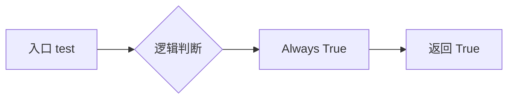

#### 带注释源码

```python
def test(self, parent: etree.Element, block: str) -> bool:
    # Always return True. `run` will return `False` it not a valid match.
    # 总是返回 True。实际的匹配逻辑由 run 方法执行。
    # 这是因为 run 方法需要访问 parser.md.htmlStash 来确认 block 是否为有效的 HTML 占位符，
    # 而 test 方法通常只接收原始文本，不包含解析后的 Stash 状态（或设计如此）。
    return True
```

### 5. 关键组件信息
- **`markdown` 属性**: 核心配置属性，用于在 HTML 标签上控制解析行为（如 `markdown="1"`, `markdown="block"`, `markdown="span"`）。
- **`htmlStash`**: 用于存储原始 HTML 块和带有 `markdown` 属性的元素，以避免它们在主 Markdown 解析过程中被提前转义或破坏。
- **`util.HTML_PLACEHOLDER_RE`**: 正则表达式，用于匹配 Stash 中存储的 HTML 占位符。

### 6. 潜在的技术债务或优化空间
- **`test` 方法设计**: `test` 方法总是返回 `True` 这一点虽然在注释中有所说明，但在某些代码模式中可能被认为增加了理解成本。如果未来解析器性能成为瓶颈，可以考虑在此处增加初步的占位符正则匹配（类似 `run` 方法中的逻辑），以减少无效的 `run` 调用，但这需要权衡代码重复度。
- **状态管理**: `HTMLExtractorExtra` 中使用列表（stack）管理状态，逻辑较复杂，单元测试覆盖率需要保持完整。

### 7. 其它项目
- **设计约束**: 该扩展依赖于 Python-Markdown 的 `BlockProcessor` 架构。
- **错误处理**: 如果 HTML 未闭合，解析器会在 `HTMLExtractorExtra.close()` 中尝试处理。对于非法的 `markdown` 属性，会回退到默认行为。
- **依赖**: 依赖 `xml.etree.ElementTree` 进行 DOM 操作。


### `MarkdownInHtmlProcessor.parse_element_content`

这是一个递归解析方法，用于处理 HTML 元素内的 Markdown 内容。它根据元素的 `markdown` 属性值（`block`、`span` 或 `off`）决定解析策略：对于 `block` 模式，调用块级解析器处理文本内容；对于 `span` 模式，递归处理其中的 HTML 占位符；对于 `off` 模式，将文本内容包装为 `AtomicString` 以禁用内联解析。

参数：

- `element`：`etree.Element`，待解析的 XML/HTML 元素对象

返回值：`None`，该方法直接修改传入的 `element` 对象，不返回任何值

#### 流程图

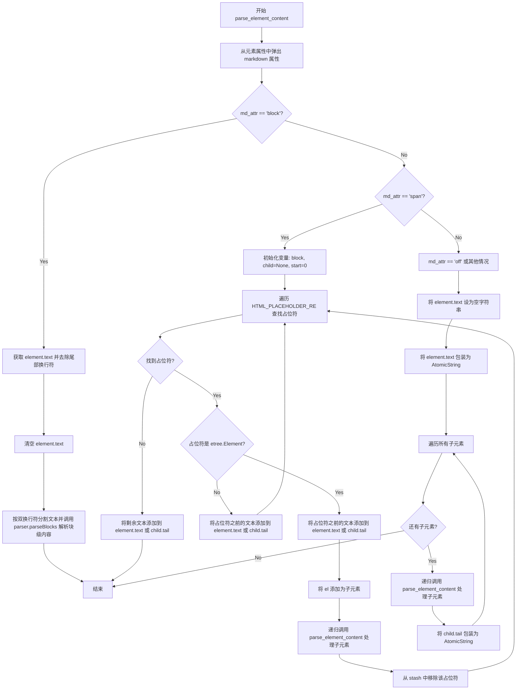

#### 带注释源码

```python
def parse_element_content(self, element: etree.Element) -> None:
    """
    Recursively parse the text content of an `etree` Element as Markdown.

    Any block level elements generated from the Markdown will be inserted as children of the element in place
    of the text content. All `markdown` attributes are removed. For any elements in which Markdown parsing has
    been disabled, the text content of it and its children are wrapped in an `AtomicString`.
    """
    # 从元素属性中移除 markdown 属性，并获取其值（默认为 'off'）
    md_attr = element.attrib.pop('markdown', 'off')

    # 情况1: block 模式 - 将元素文本作为块级 Markdown 解析
    if md_attr == 'block':
        # 检查元素是否有文本内容
        if element.text:
            # 去除末尾的换行符
            block = element.text.rstrip('\n')
            # 清空元素的原始文本内容
            element.text = ''
            # 按段落分割（双换行符分隔）并调用块级解析器
            self.parser.parseBlocks(element, block.split('\n\n'))

    # 情况2: span 模式 - 需要递归处理内部的 HTML 占位符
    elif md_attr == 'span':
        # 获取元素文本（可能为 None）
        block = element.text if element.text is not None else ''
        # 清空原始文本，后续将通过占位符重建
        element.text = ''
        child = None  # 当前处理的子元素
        start = 0     # 当前处理位置的起始索引

        # 遍历文本中所有的 HTML 占位符
        for m in util.HTML_PLACEHOLDER_RE.finditer(block):
            # 获取占位符对应的 stash 索引
            index = int(m.group(1))
            # 从 stash 中获取原始 HTML 元素
            el = self.parser.md.htmlStash.rawHtmlBlocks[index]
            # 获取占位符在文本中的结束位置
            end = m.start()

            # 如果是 Element 对象，需要进一步处理
            if isinstance(el, etree.Element):
                # 将占位符之前的文本添加到元素的 text 或前一个子元素的 tail
                if child is None:
                    element.text += block[start:end]
                else:
                    child.tail += block[start:end]
                
                # 将 HTML 元素追加为当前元素的子元素
                element.append(el)
                # 递归处理子元素的内容
                self.parse_element_content(el)
                # 更新 child 引用
                child = el
                if child.tail is None:
                    child.tail = ''
                # 从 stash 中移除该占位符（替换为空字符串）
                self.parser.md.htmlStash.rawHtmlBlocks.pop(index)
                self.parser.md.htmlStash.rawHtmlBlocks.insert(index, '')

            else:
                # 如果不是 Element 对象（可能是文本片段），直接处理文本
                if child is None:
                    element.text += block[start:end]
                else:
                    child.tail += block[start:end]
            
            # 更新起始位置
            start = end

        # 处理最后一个占位符之后剩余的文本
        if child is None:
            element.text += block[start:]
        else:
            child.tail += block[start:]

    # 情况3: off 模式 - 禁用所有 Markdown 内联解析
    else:
        # 确保 text 不为 None
        if element.text is None:
            element.text = ''
        # 将文本包装为 AtomicString，阻止内联解析器处理
        element.text = util.AtomicString(element.text)
        # 递归处理所有子元素
        for child in list(element):
            self.parse_element_content(child)
            # 将子元素的 tail 也包装为 AtomicString
            if child.tail:
                child.tail = util.AtomicString(child.tail)
```


### `MarkdownInHtmlProcessor.run`

该方法是Python-Markdown的HTML块内Markdown解析核心实现，负责检测并处理HTML占位符，提取已存储的HTML元素，调用内容解析方法处理元素内的Markdown语法，同时清理储备库并处理剩余内容，最终向块解析器确认匹配结果。

参数：
- `self`：隐式参数，类实例本身
- `parent`：`etree.Element`，父元素，用于追加处理后的HTML元素
- `blocks`：`list[str]`，包含待处理文本块的列表，第一个元素应包含HTML占位符

返回值：`bool`，如果成功匹配并处理HTML块则返回`True`，否则返回`False`

#### 流程图

```mermaid
flowchart TD
    A[开始执行 run 方法] --> B{检查 blocks[0] 是否匹配 HTML_PLACEHOLDER_RE}
    B -->|否| K[返回 False]
    B -->|是| C[提取占位符中的索引值]
    C --> D{根据索引获取 htmlStash 中的元素}
    D -->|不是 etree.Element| K
    D -->|是 etree.Element| E[从 blocks 弹出当前块]
    E --> F[将元素追加到 parent]
    F --> G[调用 parse_element_content 解析元素内容]
    G --> H[清理 htmlStash - 替换元素为空字符串]
    H --> I{检查块中是否有剩余内容}
    I -->|有| J[将剩余内容插回 blocks 开头]
    I -->|没有| L[返回 True]
    J --> L
```

#### 带注释源码

```python
def run(self, parent: etree.Element, blocks: list[str]) -> bool:
    """
    处理HTML块中的Markdown语法。
    
    参数:
        parent: 父元素，用于追加处理后的HTML元素
        blocks: 包含待处理文本块的列表
        
    返回:
        bool: 成功处理返回True，否则返回False
    """
    # 使用正则表达式匹配第一个块中的HTML占位符
    m = util.HTML_PLACEHOLDER_RE.match(blocks[0])
    if m:
        # 从占位符中提取索引值
        index = int(m.group(1))
        # 从htmlStash中获取对应的HTML元素
        element = self.parser.md.htmlStash.rawHtmlBlocks[index]
        
        # 检查是否为有效的etree元素
        if isinstance(element, etree.Element):
            # 匹配成功，处理该元素
            block = blocks.pop(0)  # 移除已处理的块
            parent.append(element)  # 将元素添加到父元素
            
            # 递归解析元素内容中的Markdown语法
            self.parse_element_content(element)
            
            # 清理储备库：用空字符串替换元素，避免后续处理混淆
            self.parser.md.htmlStash.rawHtmlBlocks.pop(index)
            self.parser.md.htmlStash.rawHtmlBlocks.insert(index, '')
            
            # 提取占位符之后的剩余内容
            content = block[m.end(0):]
            
            # 如果有剩余内容，重新放回块列表待续处理
            if content:
                blocks.insert(0, content)
            
            # 向块解析器确认匹配成功
            return True
    
    # 未找到匹配，返回失败
    return False
```


### `MarkdownInHTMLPostprocessor.stash_to_string`

该方法是 `MarkdownInHTMLPostprocessor` 类的成员方法，用于重写父类 `RawHtmlPostprocessor` 的默认行为，以处理可能仍然存在于 stash 中的 `etree` 元素对象。当输入是 `etree.Element` 类型时，调用 Markdown 对象的序列化器进行转换；否则直接将输入转换为字符串。

参数：

- `text`：`str | etree.Element`，需要处理的文本或 XML 元素对象

返回值：`str`，返回序列化后的字符串表示

#### 流程图

```mermaid
flowchart TD
    A[开始 stash_to_string] --> B{text 是否为 etree.Element}
    B -->|是| C[调用 self.md.serializer(text) 序列化元素]
    B -->|否| D[调用 str(text) 转换为字符串]
    C --> E[返回序列化后的字符串]
    D --> E
```

#### 带注释源码

```python
class MarkdownInHTMLPostprocessor(RawHtmlPostprocessor):
    def stash_to_string(self, text: str | etree.Element) -> str:
        """
        重写父类方法以处理 stash 中可能存在的 etree 元素。
        
        当 Markdown 在 HTML 块中被解析时，可能会产生 etree.Element 对象。
        这些元素需要通过 Markdown 的序列化器进行转换，而不是简单地转换为字符串。
        
        参数:
            text: 可以是普通字符串，也可以是尚未被处理的 etree.Element 对象
            
        返回:
            字符串形式的文本表示
        """
        # 检查输入是否为 etree.Element 对象
        if isinstance(text, etree.Element):
            # 如果是元素，使用 Markdown 对象的 serializer 方法进行序列化
            # serializer 会将元素树转换为有效的 HTML 字符串
            return self.md.serializer(text)
        else:
            # 对于普通字符串，直接使用 str() 转换
            return str(text)
```


### `MarkdownInHtmlExtension.extendMarkdown`

注册 `HtmlBlockPreprocessor`、`MarkdownInHtmlProcessor` 和 `MarkdownInHTMLPostprocessor` 到 Markdown 实例中，以启用在原始 HTML 标签内解析 Markdown 语法的功能。

参数：
-  `self`：`MarkdownInHtmlExtension`，扩展类的实例本身。
-  `md`：`Markdown`，需要被扩展的 Markdown 核心对象。

返回值：`None`，该方法通过修改 `md` 对象的组件注册表来实现功能，不返回任何值。

#### 流程图

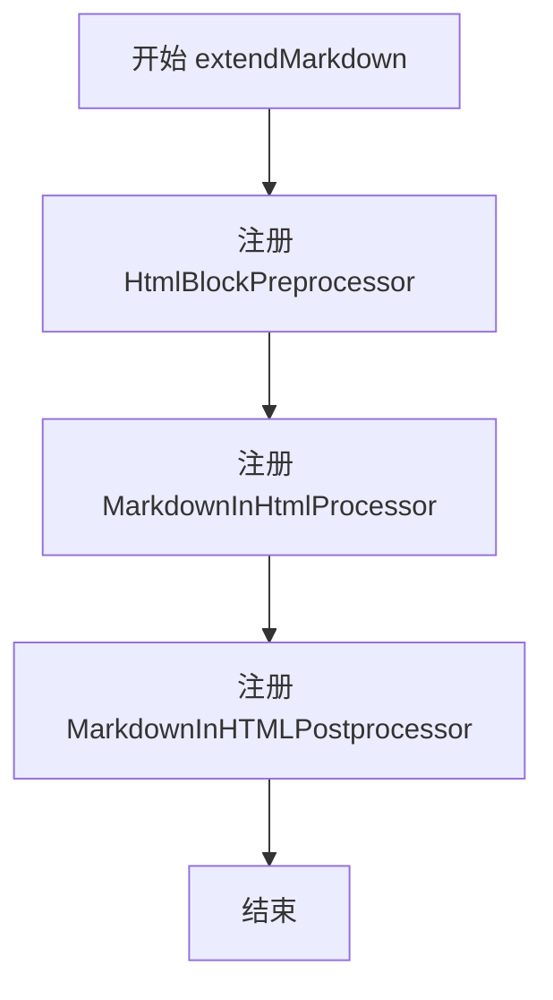

#### 带注释源码

```python
def extendMarkdown(self, md):
    """ Register extension instances. """

    # 替换原始 HTML 预处理程序
    # 优先级设为 20，用于在常规块解析前处理带有 markdown 属性的 HTML 标签
    md.preprocessors.register(HtmlBlockPreprocessor(md), 'html_block', 20)

    # 注册块处理器
    # 优先级设为 105，用于解析 HTML 标签内部的 Markdown 内容块
    md.parser.blockprocessors.register(
        MarkdownInHtmlProcessor(md.parser), 'markdown_block', 105
    )

    # 替换原始 HTML 后处理程序
    # 优先级设为 30，用于在最终渲染前将处理后的 HTML 元素序列化回字符串
    md.postprocessors.register(MarkdownInHTMLPostprocessor(md), 'raw_html', 30)
```

## 关键组件


### HTMLExtractorExtra

扩展 `HTMLExtractor` 的类，用于在原始HTML中提取和处理Markdown解析状态。核心功能是根据 `markdown` 属性（block/span/off）决定是否对HTML标签内的内容进行Markdown解析，并通过 `etree` 构建元素树。该类维护解析状态栈（`mdstate`、`mdstack`、`mdstarted`），区分块级标签、_span级标签和_raw标签，实现HTML标签的嵌套处理和内容扁平化。

### HtmlBlockPreprocessor

实现 `Preprocessor` 接口的预处理类，负责从文本中移除HTML块并存储以供后续检索。通过创建 `HTMLExtractorExtra` 解析器实例，提取原始HTML中需要Markdown解析的块，返回处理后的行列表。该组件是整个扩展的入口点，负责将包含Markdown的HTML块进行初步处理。

### MarkdownInHtmlProcessor

实现 `BlockProcessor` 接口的块处理器类，核心职责是处理HTML块中存储的 `etree` 元素，递归解析其文本内容为Markdown。支持三种解析模式：block模式（完全解析为块级元素）、span模式（仅解析内联元素，块级子元素递归处理）、off模式（禁用解析，包装为AtomicString）。通过 `parse_element_content` 方法实现递归解析逻辑。

### MarkdownInHTMLPostprocessor

继承 `RawHtmlPostprocessor` 的后处理类，扩展了默认的stash转字符串功能。主要增加了对 `etree.Element` 对象的序列化支持，调用 `md.serializer()` 将元素转换回HTML字符串。该组件确保存储在stash中的HTML元素能够正确还原为最终输出。

### MarkdownInHtmlExtension

实现 `Extension` 接口的扩展入口类，负责向Markdown实例注册各组件。使用 `extendMarkdown` 方法将 `HtmlBlockPreprocessor` 注册为优先级20的预处理、 `MarkdownInHtmlProcessor` 注册为优先级105的块处理、 `MarkdownInHTMLPostprocessor` 注册为优先级30的后处理，完整构建Markdown在HTML中解析的处理链。

### makeExtension

模块级工厂函数，用于实例化 `MarkdownInHtmlExtension`，符合Python-Markdown扩展加载规范，支持通过 `markdown.extensions` 方式启用扩展。


## 问题及建议


### 已知问题

- **状态管理复杂性**：使用多个独立列表（`mdstack`、`mdstate`、`mdstarted`）同步管理状态，缺乏原子性保护，当其中一个列表操作失败时会导致状态不同步
- **重复属性处理逻辑**：在`handle_starttag`和`handle_empty_tag`中重复出现将`valueless attribute`转换为`dict`的处理逻辑（`attrs = {key: value if value is not None else key for key, value in attrs}`）
- **继承方法覆盖不一致**：在`parse_pi`和`parse_html_declaration`中需要调用`super(HTMLExtractor, self)`而非`super().`来避免调用自身被覆盖的方法，这表明设计存在混乱
- **字符串操作低效**：在`handle_endtag`中使用大量字符串拼接和`list(current)`进行遍历时修改集合，存在频繁的内存分配和复制
- **魔法数字和硬编码**：`md_attr`的值('0', '1', 'block', 'span', 'off')和标签集合被硬编码在类中，缺乏常量定义
- **递归调用风险**：`parse_element_content`方法递归处理元素，在嵌套层级过深时可能导致栈溢出
- **可变默认参数风险**：虽然当前代码未发现，但`reset`方法中若添加列表默认参数可能引发Python常见陷阱
- **类型注解不完整**：部分方法如`handle_starttag`的参数和返回值缺少类型注解
- **注释与代码不一致**：`get_state`方法中`parent_state`可能为`None`，但注释说"One of 'block', 'span', or 'off'"，未包含None的情况说明

### 优化建议

- **提取公共逻辑**：将属性转换逻辑抽取为私有方法如`_normalize_attrs`，减少重复代码
- **定义常量类**：创建`MarkdownState`类或枚举，定义所有可能的Markdown状态值，避免魔法字符串
- **重构状态管理**：考虑使用命名元组或 dataclass 封装状态信息，确保状态一致性
- **优化字符串操作**：使用`io.StringIO`或列表推导式替代循环中的字符串拼接；对于DOM操作，使用迭代器而非复制列表
- **添加迭代深度限制**：在递归方法中添加最大深度检查，防止恶意输入导致栈溢出
- **完善类型注解**：为所有公共方法添加完整的类型注解，提高代码可维护性
- **增加单元测试覆盖**：针对边界情况（如嵌套MD解析、特殊属性组合）增加测试用例
- **考虑性能分析**：使用cProfile分析实际使用场景中的热点，针对性优化


## 其它


### 设计目标与约束

该扩展的设计目标是在原始HTML标签内启用Markdown解析功能，基于PHP Markdown Extra的实现规范。核心约束包括：仅支持特定的HTML标签（block-level标签）内的Markdown解析，通过`markdown`属性控制解析范围（block/span/off），保持与Python-Markdown核心库的兼容性，不引入额外的安全风险。

### 错误处理与异常设计

该模块主要依赖Python标准库的HTMLParser和ElementTree进行HTML解析，异常处理遵循以下原则：当遇到不完整的HTML标签时，通过`close()`方法自动关闭未闭合的标签；解析过程中使用`mdstack`和`mdstate`状态栈管理标签嵌套关系，状态异常时回退到默认行为；使用`htmlStash`机制暂存HTML片段，避免解析混乱；关键边界情况（如空标签、CDATA内容）通过条件分支特殊处理。

### 数据流与状态机

数据流主要分为三个阶段：预处理阶段（HtmlBlockPreprocessor）使用HTMLExtractorExtra解析原始HTML，识别带有`markdown`属性的标签并构建ElementTree元素；块处理阶段（MarkdownInHtmlProcessor）遍历HTML占位符，递归解析block级别元素的Markdown内容；后处理阶段（MarkdownInHTMLPostprocessor）将ElementTree元素序列化为HTML字符串。状态机包含四种状态：`block`（块级解析）、`span`（行内解析）、`off`（禁用解析）、`None`（默认），状态转换由当前标签的`markdown`属性和父级状态共同决定。

### 外部依赖与接口契约

该扩展依赖以下模块：markdown.core（Markdown主类）、markdown.blockprocessors（BlockProcessor基类）、markdown.preprocessors（Preprocessor基类）、markdown.postprocessors（RawHtmlPostprocessor基类）、markdown.htmlparser（HTMLExtractor基类）、markdown.util（HTML_PLACEHOLDER_RE、AtomicString）、xml.etree.ElementTree（HTML DOM操作）。扩展接口遵循Python-Markdown扩展规范，通过`extendMarkdown()`方法注册到Markdown实例，接收`**kwargs`配置参数。

### 性能考虑与优化空间

当前实现的主要性能关注点：每次调用`run()`方法都会创建新的HTMLExtractorExtra实例并完整解析输入；ElementTree的序列化和反序列化操作可能产生开销；HTML占位符的存储和查找使用列表索引。潜在优化方向：可考虑缓存已解析的HTML元素避免重复解析；对于大型文档可采用流式处理减少内存占用；占位符机制可考虑使用字典替代列表以提高查找效率。

### 安全性考虑

该扩展本身不引入额外的安全风险，Markdown解析的安全性由Python-Markdown核心库保证。需要注意的是：当使用`markdown`属性启用Markdown解析时，输入内容会被当作Markdown处理，可能存在XSS风险（取决于后续HTML渲染）；对于不信任的输入源，建议在渲染后使用HTML净化库；该扩展保留HTML解析器的所有安全特性，包括对恶意构造HTML的处理。

### 配置选项

该扩展通过makeExtension函数接收以下配置参数：**kwargs（可变关键字参数），这些参数直接传递给MarkdownInHtmlExtension构造函数。当前版本未定义额外的配置选项，解析行为主要通过HTML标签的`markdown`属性控制（可取值：'1'、'block'、'span'、'0'、'off'）。

### 版本兼容性

该扩展兼容Python 3.8+版本（支持`from __future__ import annotations`和类型提示）；需要Python-Markdown 3.5+版本；对于Python 3.13之前的版本有特殊的HTML声明解析处理（#1534 Python bug gh-77057）；使用`typing.TYPE_CHECKING`进行类型提示以避免运行时导入开销。

### 使用示例

基本用法：使用`markdown`属性启用块级解析（`<div markdown="1">**bold**</div>`）；启用行内解析（`<span markdown="span">*italic*</span>`）；禁用解析（`<div markdown="0"><b>not parsed</b></div>`）；嵌套使用（父元素设置`markdown="1"`，子元素可覆盖）。详细使用示例请参阅官方文档。

### 已知问题和限制

已知的限制包括：仅支持HTML块级标签内的Markdown解析（span级标签内容不会解析为块级元素）；CDATA内容中的独立标签会被特殊处理（#1036）；HTML声明在某些边界情况下会被特殊处理（#1066）；Python 3.13之前存在的HTML声明解析bug有特殊 workaround（#1534）；非Markdown HTML元素的内容不会被递归解析为Markdown。


    