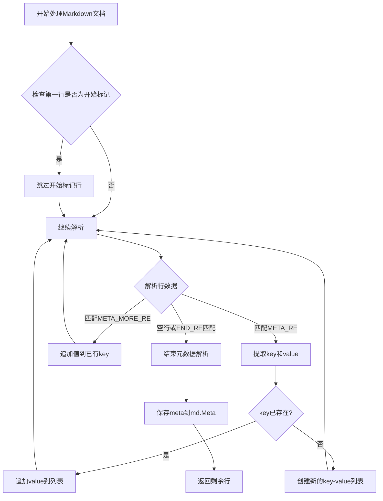
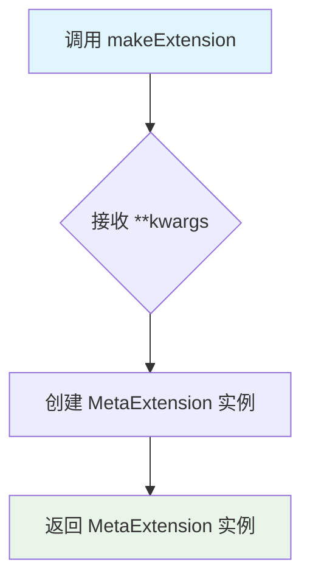
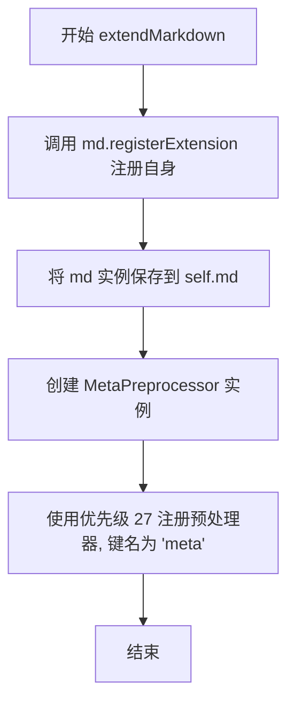
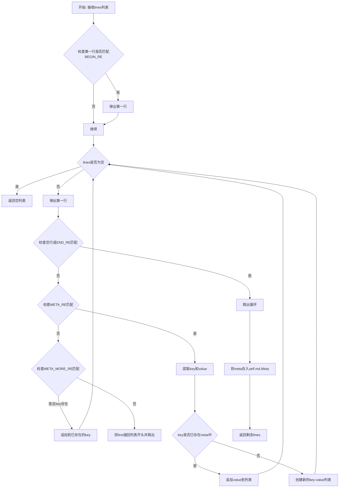
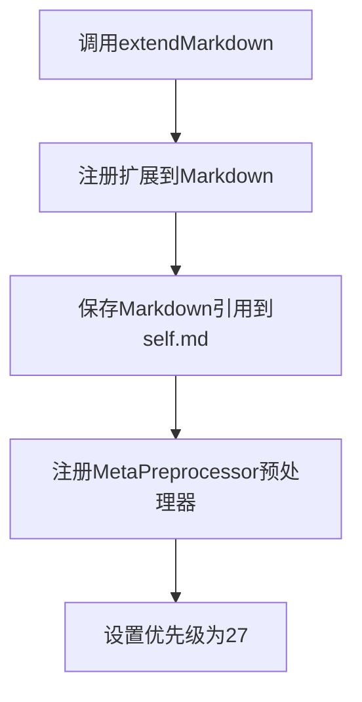
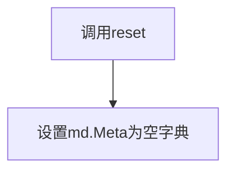
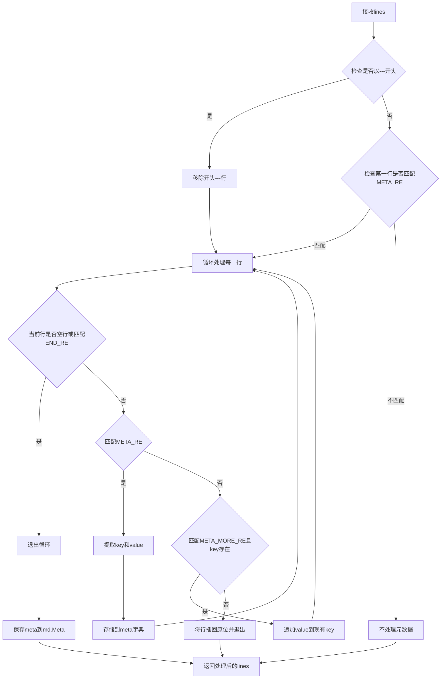
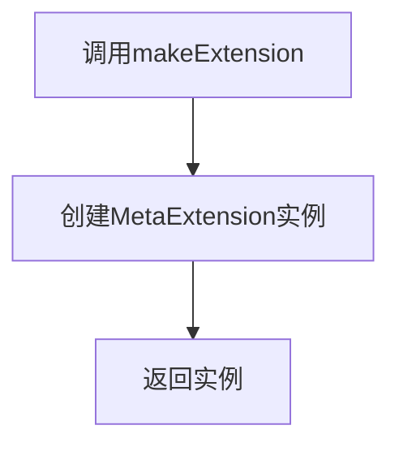

# `markdown\markdown\extensions\meta.py` 详细设计文档

这是Python-Markdown的一个扩展模块，用于解析和处理Markdown文档中的YAML风格元数据（front matter）。它从文档开头提取key-value格式的元数据，并将其存储在Markdown实例的Meta属性中供后续使用。

## 整体流程



## 类结构

```
Extension (ABC)
└── MetaExtension
    
Preprocessor (ABC)
└── MetaPreprocessor
```

## 全局变量及字段


### `META_RE`
    
用于匹配Markdown元数据键值对的正则表达式模式，捕获key和value两个组

类型：`re.Pattern`
    


### `META_MORE_RE`
    
用于匹配多行元数据值的正则表达式模式，要求至少4个空格缩进

类型：`re.Pattern`
    


### `BEGIN_RE`
    
用于匹配YAML元数据开始标记的正则表达式，匹配三个破折号及可选后续内容

类型：`re.Pattern`
    


### `END_RE`
    
用于匹配元数据结束标记的正则表达式，匹配三个破折号或三个点及可选后续内容

类型：`re.Pattern`
    


### `log`
    
Markdown库的日志记录器实例，用于记录扩展运行时的日志信息

类型：`logging.Logger`
    


### `MetaExtension.self.md`
    
Markdown实例的引用，用于访问Markdown对象的属性和方法，以及存储解析后的元数据

类型：`Markdown`
    
    

## 全局函数及方法


### `makeExtension`

这是一个用于实例化 `MetaExtension` 类的工厂函数，作为 Python-Markdown 扩展的入口点，允许通过 `markdown.use()` 或 `markdown.markdown(extensions=[...])` 方式加载元数据扩展。

参数：

- `**kwargs`：关键字参数，任意可选参数，将直接传递给 `MetaExtension` 构造函数用于扩展配置

返回值：`MetaExtension`，返回一个新创建的 `MetaExtension` 实例，用于注册到 Markdown 处理器中

#### 流程图



#### 带注释源码

```python
def makeExtension(**kwargs):  # pragma: no cover
    """
    创建并返回 MetaExtension 实例的工厂函数。
    
    这是 Python-Markdown 扩展的入口点函数，按照扩展API约定
    必须命名为 makeExtension，以便 Markdown 能够自动发现和加载扩展。
    
    参数:
        **kwargs: 任意关键字参数，将传递给 MetaExtension 构造函数
        
    返回:
        MetaExtension: 返回配置好的 MetaExtension 实例
    """
    return MetaExtension(**kwargs)
```

---

### 补充信息

#### 关键组件信息

| 组件名称 | 一句话描述 |
|---------|-----------|
| `MetaExtension` | Python-Markdown 扩展类，负责注册元数据预处理器 |
| `MetaPreprocessor` | 预处理器类，负责解析 Markdown 文档中的元数据 |
| `makeExtension` | 扩展入口点工厂函数，供 Markdown 框架调用 |

#### 潜在技术债务或优化空间

1. **缺少类型注解**：`makeExtension` 函数的返回值类型可以添加更明确的类型注解（如 `-> type[MetaExtension]`）
2. **无错误处理**：函数未对 `MetaExtension` 初始化失败的情况进行处理
3. **文档字符串不完整**：函数缺少完整的文档说明

#### 其它项目

**设计目标与约束**：
- 遵循 Python-Markdown 扩展接口规范
- 必须返回 `Extension` 子类实例

**错误处理与异常设计**：
- 当前实现未包含错误处理，依赖 `MetaExtension` 构造函数自然抛出异常

**数据流与状态机**：
- 此函数为简单工厂模式，将配置参数传递给扩展类构造

**外部依赖与接口契约**：
- 依赖 `MetaExtension` 类的存在
- 接收任意 `**kwargs` 并传递给扩展类，保持接口灵活性


### `MetaExtension.extendMarkdown`

该方法用于将 Meta 数据处理功能集成到 Python-Markdown 实例中，通过注册 MetaPreprocessor 预处理器来解析 markdown 文档中的元数据（如 YAML 头部信息），并将其存储在 Markdown 对象的 Meta 属性中供后续使用。

参数：

- `md`：`Markdown`，Python-Markdown 的核心实例，用于注册扩展和预处理器

返回值：`None`，无返回值，该方法直接修改传入的 `md` 对象状态

#### 流程图



#### 带注释源码

```python
def extendMarkdown(self, md):
    """ Add `MetaPreprocessor` to Markdown instance. """
    # 步骤1: 向 Markdown 实例注册当前扩展, 使其可以被追踪和管理
    md.registerExtension(self)
    
    # 步骤2: 保存 Markdown 实例的引用, 以便在 reset() 方法中使用
    self.md = md
    
    # 步骤3: 创建 MetaPreprocessor 实例并注册到预处理器注册表中
    # 优先级 27 表示执行顺序 (数值越高越早执行, 26-28 是预处理的常见区间)
    # 键名 'meta' 用于标识该预处理器
    md.preprocessors.register(MetaPreprocessor(md), 'meta', 27)
```


### `MetaExtension.reset`

该方法用于重置 Markdown 实例的元数据存储，将 `Meta` 属性重置为空字典，以便在每次文档处理开始时提供干净的元数据存储空间。

参数：

- `self`：`MetaExtension`，隐式参数，表示当前扩展实例本身

返回值：`None`，无返回值描述

#### 流程图

```mermaid
flowchart TD
    A[开始 reset] --> B{检查 self.md}
    B -->|存在| C[设置 self.md.Meta = {}]
    C --> D[结束]
    
    style A fill:#f9f,stroke:#333
    style C fill:#9f9,stroke:#333
    style D fill:#9f9,stroke:#333
```

#### 带注释源码

```python
def reset(self) -> None:
    """
    重置 Markdown 实例的元数据。
    
    当 Markdown 实例被重置或重新使用时，此方法被调用以清除
    之前文档的元数据，确保每个新文档都从空的元数据存储开始。
    这是 Python-Markdown 扩展接口的一部分，用于状态管理。
    """
    self.md.Meta = {}  # 将 Markdown 实例的 Meta 属性重置为空字典
```


### `MetaPreprocessor.run`

该方法负责从Markdown文档开头解析YAML格式的元数据（Meta Data），提取键值对并存储到Markdown实例的Meta属性中，同时返回剩余的非元数据行。

#### 参数

- `lines`：`list[str]`，待处理的Markdown文本行列表

#### 返回值

`list[str]`，解析元数据后剩余的行列表（不包含元数据部分的行）

#### 流程图



#### 带注释源码

```python
def run(self, lines: list[str]) -> list[str]:
    """ Parse Meta-Data and store in Markdown.Meta. """
    meta: dict[str, Any] = {}  # 用于存储解析出的元数据
    key = None  # 当前处理的元数据键
    
    # 如果第一行匹配开始标记（如"---"），则弹出该行
    if lines and BEGIN_RE.match(lines[0]):
        lines.pop(0)
    
    # 循环处理每一行，直到遇到空行或结束标记
    while lines:
        line = lines.pop(0)  # 取出第一行
        m1 = META_RE.match(line)  # 尝试匹配标准元数据格式 "key: value"
        
        # 如果遇到空行或结束标记（---或...），停止解析
        if line.strip() == '' or END_RE.match(line):
            break  # blank line or end of YAML header - done
        
        # 如果匹配到标准元数据格式
        if m1:
            key = m1.group('key').lower().strip()  # 提取键名并转为小写
            value = m1.group('value').strip()  # 提取值
            try:
                meta[key].append(value)  # 键已存在，追加值
            except KeyError:
                meta[key] = [value]  # 键不存在，创建新的键值列表
        else:
            # 尝试匹配多行值格式（缩进至少4个空格）
            m2 = META_MORE_RE.match(line)
            if m2 and key:
                # 存在未完成的key，将该行追加到key的值列表中
                meta[key].append(m2.group('value').strip())
            else:
                # 既不是标准格式也不是多行值，说明元数据块结束
                lines.insert(0, line)  # 将该行放回列表
                break  # no meta data - done
    
    # 将解析得到的元数据存储到Markdown实例的Meta属性中
    self.md.Meta = meta
    return lines  # 返回剩余的行（不包含元数据）
```

## 关键组件


### 核心功能概述

该代码是Python-Markdown的元数据扩展（Meta Data Extension），用于解析Markdown文档头部的YAML格式元数据（如标题、作者、日期等），并将解析结果存储到Markdown实例的Meta属性中供后续处理使用。

### 文件的整体运行流程

1. **扩展加载阶段**：当Markdown加载meta扩展时，调用`makeExtension()`函数创建`MetaExtension`实例
2. **注册阶段**：`MetaExtension.extendMarkdown()`方法被调用，将自身注册到Markdown实例，并注册`MetaPreprocessor`预处理器
3. **预处理阶段**：在Markdown转换为HTML之前，`MetaPreprocessor.run()`方法会扫描文档头部，提取YAML格式的元数据
4. **存储阶段**：解析后的元数据存储到`md.Meta`字典中，原始元数据行从文档中移除
5. **重置阶段**：每次调用`reset()`方法时清空Meta数据，支持多次渲染

### 类详细信息

### MetaExtension

**描述**：Python-Markdown的元数据扩展主类，负责将元数据预处理器注册到Markdown处理流水线

**类字段**：
- `md`：类型`Markdown`，存储Markdown实例引用

**类方法**：

#### extendMarkdown(self, md)

**参数**：
- `self`：MetaExtension实例
- `md`：Markdown实例，需要注册扩展的Markdown对象

**参数描述**：接收Markdown实例，注册自身和预处理器

**返回值类型**：None

**返回值描述**：无返回值，仅执行注册操作

**mermaid流程图**：


**源码**：
```python
def extendMarkdown(self, md):
    """ Add `MetaPreprocessor` to Markdown instance. """
    md.registerExtension(self)
    self.md = md
    md.preprocessors.register(MetaPreprocessor(md), 'meta', 27)
```

#### reset(self) -> None

**参数**：
- `self`：MetaExtension实例

**参数描述**：无额外参数

**返回值类型**：None

**返回值描述**：无返回值，重置Meta数据为空字典

**mermaid流程图**：


**源码**：
```python
def reset(self) -> None:
    self.md.Meta = {}
```

---

### MetaPreprocessor

**描述**：预处理器类，负责解析Markdown文档中的YAML格式元数据

**类字段**：
- `md`：类型`Markdown`，存储Markdown实例引用

**类方法**：

#### run(self, lines: list[str]) -> list[str]

**参数**：
- `self`：MetaPreprocessor实例
- `lines`：类型`list[str]`，Markdown文档的所有行

**参数描述**：接收完整的Markdown文档行列表

**返回值类型**：list[str]

**返回值描述**：返回移除元数据后的文档行列表

**mermaid流程图**：


**源码**：
```python
def run(self, lines: list[str]) -> list[str]:
    """ Parse Meta-Data and store in Markdown.Meta. """
    meta: dict[str, Any] = {}
    key = None
    if lines and BEGIN_RE.match(lines[0]):
        lines.pop(0)
    while lines:
        line = lines.pop(0)
        m1 = META_RE.match(line)
        if line.strip() == '' or END_RE.match(line):
            break  # blank line or end of YAML header - done
        if m1:
            key = m1.group('key').lower().strip()
            value = m1.group('value').strip()
            try:
                meta[key].append(value)
            except KeyError:
                meta[key] = [value]
        else:
            m2 = META_MORE_RE.match(line)
            if m2 and key:
                # Add another line to existing key
                meta[key].append(m2.group('value').strip())
            else:
                lines.insert(0, line)
                break  # no meta data - done
    self.md.Meta = meta
    return lines
```

---

### 全局变量和全局函数详细信息

### META_RE

**类型**：re.Pattern

**描述**：正则表达式，用于匹配元数据键值对格式（key: value），支持行首0-3个空格

### META_MORE_RE

**类型**：re.Pattern

**描述**：正则表达式，用于匹配元数据的多行值（行首4个以上空格）

### BEGIN_RE

**类型**：re.Pattern

**描述**：正则表达式，用于匹配YAML头部开始标记（---）

### END_RE

**类型**：re.Pattern

**描述**：正则表达式，用于匹配YAML头部结束标记（---或...）

### makeExtension(\*\*kwargs)

**参数**：
- `\*\*kwargs`：类型关键字参数，传递给MetaExtension的初始化参数

**参数描述**：可选的配置参数

**返回值类型**：MetaExtension

**返回值描述**：返回配置好的MetaExtension实例

**mermaid流程图**：


**源码**：
```python
def makeExtension(**kwargs):  # pragma: no cover
    return MetaExtension(**kwargs)
```

---

### 关键组件信息

### 元数据解析引擎

负责识别和提取Markdown文档中的YAML格式元数据，支持多行值和多个相同键

### 预处理器注册机制

通过Python-Markdown的注册接口将MetaPreprocessor集成到处理流水线，优先级27确保在其他预处理之前执行

### 元数据存储机制

将解析后的元数据存储到Markdown实例的Meta属性中，以字典形式组织，支持多值键

---

### 潜在的技术债务或优化空间

1. **正则表达式编译优化**：正则表达式在模块级别编译是好的实践，但可以添加预编译检查
2. **类型注解完整性**：部分变量如`key`的类型注解可以更明确
3. **错误处理不足**：元数据解析失败时没有降级处理或错误日志
4. **多行值处理限制**：仅支持4空格缩进，不支持其他有效的YAML多行格式
5. **重复键处理**：重复键的处理方式（追加到列表）可能导致意外行为

---

### 其它项目

#### 设计目标与约束
- 目标：为Python-Markdown提供标准的YAML头部元数据解析功能
- 约束：遵循Python-Markdown扩展接口规范，保持轻量级实现

#### 错误处理与异常设计
- 使用try-except处理KeyError异常（用于多值键）
- 元数据解析失败时静默返回原始行，不影响文档处理
- 缺少显式的错误日志和用户友好的错误提示

#### 数据流与状态机
- 输入：原始Markdown文档行列表
- 处理流程：检测头部标记 → 解析键值对 → 处理多行值 → 存储到Meta字典
- 输出：移除元数据后的文档行列表和md.Meta字典

#### 外部依赖与接口契约
- 依赖：`..preprocessors.Preprocessor`基类
- 依赖：`typing.Any`类型支持
- 接口：遵循Python-Markdown扩展的extendMarkdown()和reset()接口约定


## 问题及建议


### 已知问题

-   **性能问题**：`MetaPreprocessor.run()` 方法中使用 `lines.pop(0)` 进行列表头部删除，这是 O(n) 操作，对于大型文档会导致性能下降，应改用 `collections.deque` 或迭代器方式
-   **未使用的导入**：`logging` 模块被导入且创建了 `log` 变量，但整个代码中从未使用过
-   **类型注解不完整**：`md` 参数在 `extendMarkdown(self, md)` 中缺少类型注解；`self.md` 也缺少类型注解
-   **状态管理风险**：`reset()` 方法直接修改外部传入的 `md` 对象的 `Meta` 属性，这种状态共享方式可能导致意外的副作用和难以追踪的 bug
-   **缺少输入验证**：`run()` 方法接收 `lines` 参数但未进行 None 检查或空列表处理
-   **正则表达式可优化**：`META_RE` 中 `[A-Za-z0-9_-]` 可简化为 `\w`（注意下划线在 `\w` 中包含）
-   **设计缺陷**：`BEGIN_RE` 和 `END_RE` 仅支持固定格式（`---` 或 `...`），不支持更灵活的配置

### 优化建议

-   使用 `collections.deque` 替代 list 来处理行操作，或使用索引迭代方式避免频繁的 pop 操作
-   移除未使用的 `logging` 导入和 `log` 变量，或添加适当的日志记录
-   为所有函数参数和类属性添加完整的类型注解，提高代码可读性和 IDE 支持
-   考虑将 `Meta` 数据的存储改为通过配置或返回方式而非直接修改外部对象，或提供明确的接口契约
-   在 `run()` 方法开始处添加输入验证：`if not lines: return lines`
-   预编译的正则表达式可添加 `re.VERBOSE` 或 `re.UNICODE` 标志以提高健壮性
-   考虑将元数据解析逻辑与 Markdown 对象解耦，提高模块的可测试性

## 其它


### 设计目标与约束

本扩展的设计目标是为Python-Markdown提供元数据（Meta Data）支持，允许用户在Markdown文档开头使用YAML风格的键值对定义元信息。约束条件包括：遵循Python-Markdown扩展接口规范（必须继承Extension类并实现extendMarkdown方法）、使用预处理器（Preprocessor）在Markdown转换前提取元数据、元数据格式需匹配指定的正则表达式模式。

### 错误处理与异常设计

代码中的错误处理采用保守策略，主要体现在以下方面：使用try-except捕获KeyError异常，当meta字典中不存在对应key时创建新列表；正则匹配失败时不抛出异常，而是回退到普通行处理；遇到非元数据行时通过lines.insert(0, line)将行归还给后续处理器。潜在改进空间：可添加更详细的日志记录失败场景、考虑对无效元数据格式给出警告而非静默忽略。

### 数据流与状态机

元数据解析流程可视为一个简单状态机，包含三个状态：初始状态（等待开始标记）、解析状态（逐行解析键值对）、结束状态（遇到空行或结束标记）。数据流如下：输入原始Markdown行列表 → BEGIN_RE检查是否以"---"开头 → 进入解析循环 → META_RE匹配"key: value"格式或META_MORE_RE匹配缩进的后续行 → 构建meta字典 → 剩余行返回给Markdown主流程 → 元数据存储在md.Meta属性中供后续使用。

### 外部依赖与接口契约

本扩展依赖以下外部组件：Python-Markdown核心库的Extension类（基类）和Preprocessor类（预处理器基类）；Python标准库的re模块（正则表达式）、logging模块（日志记录）、typing模块（类型注解）。接口契约方面：扩展通过makeExtension工厂函数实例化；MetaExtension需实现extendMarkdown(self, md)方法注册自身；MetaPreprocessor需实现run(self, lines)方法返回处理后的行列表；md对象需提供preprocessors注册表和Meta存储属性。

### 版本兼容性与兼容性考虑

代码使用from __future__ import annotations确保Python 3.7+的向前兼容；函数参数使用类型注解提升代码可读性；无Python 2专属代码但保持__future__导入以兼容较老的Python 3版本。注意事项：依赖Python-Markdown 2.6+版本才能支持registerExtension和preprocessors.register接口；正则表达式依赖Python的re模块（标准库无外部依赖）。

### 安全考虑与输入验证

当前实现对输入的处理相对宽松，存在潜在安全风险：未对元数据key进行长度限制或特殊字符过滤；未对元数据value进行内容验证；meta字典直接存储在Markdown对象上可能被后续处理器修改。改进建议：可添加key长度限制（如64字符）、对value进行基本的XSS防护转义、考虑使用不可变字典存储元数据。

### 性能特征与优化空间

性能特征分析：使用正则表达式进行逐行匹配，时间复杂度O(n)与行数线性相关；每次调用run方法都创建新的meta字典；lines列表的pop(0)操作在Python中效率较低（O(n)）。优化建议：可使用collections.deque替代list提高pop(0)性能；可考虑缓存已解析的元数据避免重复解析；正则表达式可预编译以减少重复编译开销。

    