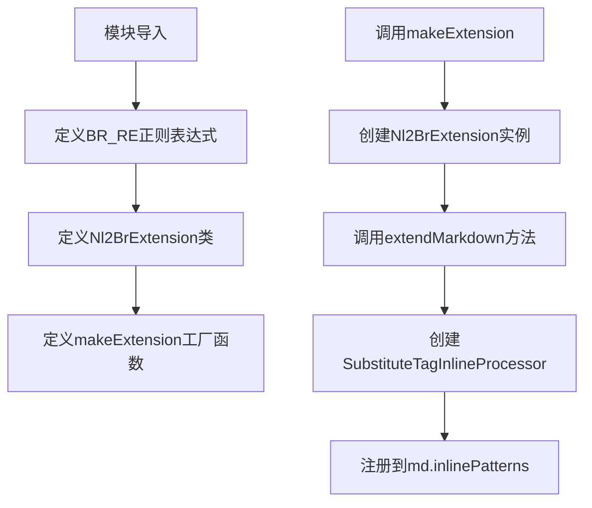
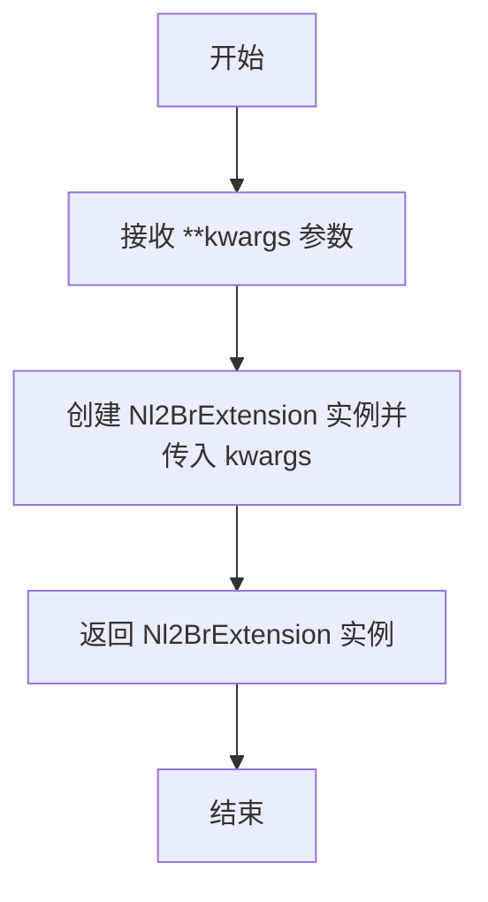
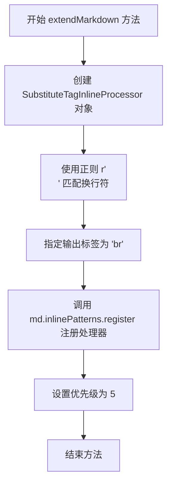

# `markdown\markdown\extensions\nl2br.py` 详细设计文档

一个Python-Markdown扩展，用于将文本中的换行符转换为HTML的<br>标签，模拟GitHub-flavored Markdown的换行行为。

## 整体流程



## 类结构

```
Extension (Python-Markdown基类)
└── Nl2BrExtension
```

## 全局变量及字段


### `BR_RE`
    
A regular expression pattern that matches a newline character, used to identify line breaks for conversion to <br> tags.

类型：`str`
    


    

## 全局函数及方法


### `makeExtension`

该函数是 Python-Markdown NL2BR 扩展的入口点，用于创建并返回 `Nl2BrExtension` 实例，以便将换行符转换为 HTML `<br>` 标签，类似于 GitHub 风格的 Markdown 行为。

参数：

- `**kwargs`：`dict`，可变关键字参数，用于传递给 `Nl2BrExtension` 构造函数的配置选项

返回值：`Nl2BrExtension`，返回一个配置好的 `Nl2BrExtension` 实例，用于注册到 Markdown 解析器中

#### 流程图



#### 带注释源码

```python
def makeExtension(**kwargs):  # pragma: no cover
    """
    创建并返回 Nl2BrExtension 实例的工厂函数。
    
    这是 Python-Markdown 扩展的入口点函数，会被 Markdown 库
    自动调用以加载扩展。该函数接受可变关键字参数，这些参数
    会被传递给 Nl2BrExtension 的构造函数。
    
    参数:
        **kwargs: 可变关键字参数，用于扩展的配置选项
        
    返回值:
        Nl2BrExtension: 返回一个 Nl2BrExtension 实例，
                       供 Markdown 解析器注册使用
    """
    return Nl2BrExtension(**kwargs)  # 创建并返回 Nl2BrExtension 实例
```


### `Nl2BrExtension.extendMarkdown`

该方法是 `Nl2BrExtension` 类的核心扩展方法，用于将 Python-Markdown 的换行符处理为 HTML `<br>` 标签。它创建一个 `SubstituteTagInlineProcessor` 实例，并将其注册到 Markdown 对象的内联模式注册表中，使 Markdown 在解析文本时能够将换行符转换为 `<br>` 标签，模拟 GitHub 风格的 Markdown 行为。

参数：

- `md`：`Markdown`，Markdown 实例对象，该方法通过此参数将自定义的内联模式处理器注册到 Markdown 的内联模式注册表中

返回值：`None`，该方法直接修改传入的 `md` 对象，不返回任何值

#### 流程图



#### 带注释源码

```python
def extendMarkdown(self, md):
    """ Add a `SubstituteTagInlineProcessor` to Markdown. """
    # 创建一个 SubstituteTagInlineProcessor 实例
    # 参数1: BR_RE = r'\n' - 用于匹配文本中的换行符
    # 参数2: 'br' - 指定将匹配的换行符转换为 HTML 的 <br> 标签
    br_tag = SubstituteTagInlineProcessor(BR_RE, 'br')
    
    # 将创建的内联模式处理器注册到 Markdown 对象的内联模式注册表中
    # 参数1: br_tag - 要注册的内联处理器
    # 参数2: 'nl' - 注册名称/键，用于标识这个内联模式
    # 参数3: 5 - 优先级，数值越高优先级越高
    md.inlinePatterns.register(br_tag, 'nl', 5)
```

## 关键组件


### Nl2BrExtension 类

Nl2BrExtension是Python-Markdown的扩展类，核心功能是将Markdown文本中的换行符转换为HTML的`<br>`标签，实现类似GitHub-flavored Markdown的换行行为。

### SubstituteTagInlineProcessor

SubstituteTagInlineProcessor是内联模式处理器，负责将匹配到的换行符替换为指定的HTML标签（`<br>`），实现换行符到HTML换行标签的转换逻辑。

### BR_RE 正则表达式

BR_RE定义了匹配换行符的正则表达式模式`r'\n'`，用于识别文本中的换行符并触发转换逻辑。

### makeExtension 函数

makeExtension是扩展工厂函数，负责创建并返回Nl2BrExtension实例，是Python-Markdown加载扩展的标准入口点。

### extendMarkdown 方法

extendMarkdown是扩展的核心方法，将SubstituteTagInlineProcessor注册到Markdown的inlinePatterns中，优先级设置为5，使其在解析内联文本时处理换行符。


## 问题及建议


### 已知问题

- 硬编码的优先级数值 `5` 缺乏说明文档，后续维护者难以理解该数值的选取依据
- 配置文件头注释与模块 docstring 存在重复内容，文档维护成本较高
- 正则表达式 `BR_RE = r'\n'` 过于简单，在某些边界场景下可能产生误匹配（如已存在于 `<pre>` 或 `<code>` 标签内的换行符）
- `makeExtension` 函数缺少返回类型注解（type hint），不利于类型检查工具进行静态分析
- 未暴露任何配置选项，无法根据用户需求自定义行为（如替换标签类型、优先级等）
- 未考虑与其它处理换行的扩展（如 `nl2br` 与 `sane_lists` 等）的潜在冲突

### 优化建议

- 提取优先级为命名常量（如 `BR_PRIORITY = 5`）并添加注释说明其作用
- 为 `makeExtension` 函数添加返回类型注解 `-> Nl2BrExtension`
- 考虑在 `extendMarkdown` 方法中增加配置参数支持（如 `tag` 参数允许自定义替换标签）
- 在正则匹配前增加上下文检查，尝试避免对代码块或预格式化标签内的换行进行转换
- 统一文档内容，移除重复的注释说明，仅保留模块级 docstring
- 添加单元测试覆盖边界场景，如连续换行、嵌套标签内的换行等情况


## 其它


### 设计目标与约束

将文本中的单个换行符转换为HTML的`<br>`标签，模拟GitHub风格的Markdown行为。约束：仅处理文本节点中的换行符，不影响代码块或预格式化文本中的换行符处理。

### 错误处理与异常设计

本扩展模块较为简单，主要依赖`SubstituteTagInlineProcessor`处理错误。可能的异常场景包括：1) Markdown对象未正确初始化；2) inlinePatterns属性不存在。异常处理方式：由Python-Markdown框架统一管理，扩展自身不做额外异常捕获。

### 数据流与状态机

数据流：输入Markdown文本 → Markdown解析器分词 → 内联模式处理器匹配 → `SubstituteTagInlineProcessor`将`\n`替换为`<br>`标签 → 输出HTML。无复杂状态机，仅有单一的替换状态转换。

### 外部依赖与接口契约

依赖项：1) `markdown.extension.Extension` - 扩展基类；2) `markdown.inlinepatterns.SubstituteTagInlineProcessor` - 内联标签替换处理器。接口契约：1) 扩展类需实现`extendMarkdown(md)`方法；2) 需向`md.inlinePatterns`注册处理器；3) 注册时需指定名称('nl')和优先级(5)。

### 配置与扩展性

当前版本无配置选项。如需扩展，可通过`makeExtension`函数传递参数添加配置项，例如自定义替换的标签名（默认为'br'）。

### 性能考虑

使用正则表达式`r'\n'`匹配换行符，复杂度为O(n)。对于大规模文档，性能主要取决于Markdown核心解析器效率，扩展本身开销极低。

### 版本兼容性

声明`from __future__ import annotations`支持Python 3.7+类型提示。需与Python-Markdown 3.0+版本兼容。

### 安全性考虑

本扩展仅做文本替换，不涉及用户输入执行或敏感数据处理，安全性风险较低。输出的`<br>`标签是标准HTML元素，无XSS风险。

### 测试策略建议

建议测试用例：1) 单词后换行应转换为`<br>`；2) 连续多个换行应转换为一个`<br>`；3) 与其他内联元素（链接、粗体等）混排时的行为；4) 代码块内换行不应转换。

### 使用示例与文档

```python
import markdown
md = markdown.Markdown(extensions=['nl2br'])
html = md.convert('Line 1\nLine 2')
# 输出: <p>Line 1<br>Line 2</p>
```


    