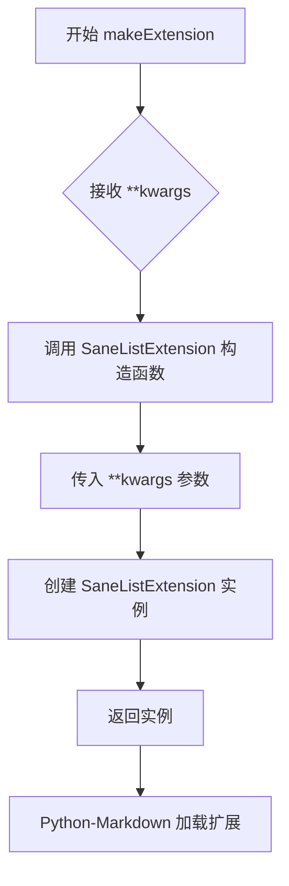
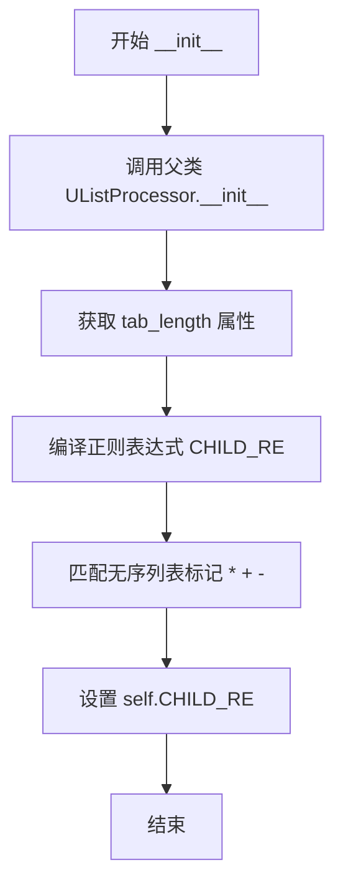
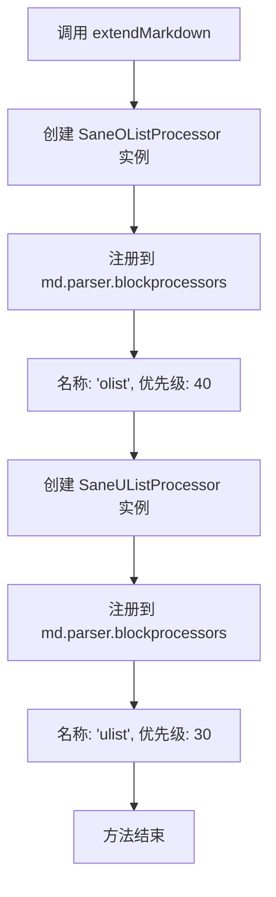

# `markdown\markdown\extensions\sane_lists.py` 详细设计文档

这是一个 Python-Markdown 扩展，用于修改列表的解析行为，使其更加规范（sane）。具体通过覆盖有序列表和无序列表的处理器，限制列表标签的兄弟关系并禁用有序列表的懒加载行为，从而提供更严格的列表解析规则。

## 整体流程

```mermaid
graph TD
A[加载 SaneListExtension] --> B[调用 extendMarkdown]
B --> C[注册 SaneOListProcessor 为 'olist' 处理器]
B --> D[注册 SaneUListProcessor 为 'ulist' 处理器]
C --> E[Markdown 解析器遇到有序列表]
D --> F[Markdown 解析器遇到无序列表]
E --> G{使用 SaneOListProcessor 处理}
F --> H{使用 SaneUListProcessor 处理}
G --> I[应用 SIBLING_TAGS = ['ol']]
G --> J[应用 LAZY_OL = False]
H --> K[应用 SIBLING_TAGS = ['ul']]
I --> L[渲染 HTML 列表]
```

## 类结构

```
Extension (抽象基类)
└── SaneListExtension

OListProcessor (父类)
└── SaneOListProcessor

UListProcessor (父类)
└── SaneUListProcessor
```

## 全局变量及字段


### `SaneOListProcessor.SIBLING_TAGS`
    
兄弟标签列表，仅包含 ['ol']，排除 'ul'

类型：`List[str]`
    


### `SaneOListProcessor.LAZY_OL`
    
禁用懒加载有序列表，设置为 False

类型：`bool`
    


### `SaneOListProcessor.CHILD_RE`
    
正则表达式，用于匹配有序列表项

类型：`re.Pattern`
    


### `SaneUListProcessor.SIBLING_TAGS`
    
兄弟标签列表，仅包含 ['ul']，排除 'ol'

类型：`List[str]`
    


### `SaneUListProcessor.CHILD_RE`
    
正则表达式，用于匹配无序列表项

类型：`re.Pattern`
    
    

## 全局函数及方法


### `makeExtension`

`makeExtension` 是 Python-Markdown 扩展的工厂函数入口点，用于创建并返回 `SaneListExtension` 实例，使得 Python-Markdown 能够以"理智"的方式处理列表（即严格区分有序和无序列表，不允许混用或lazy行为）。

参数：

- `**kwargs`：`dict`，可变关键字参数，将直接传递给 `SaneListExtension` 构造函数，用于扩展配置

返回值：`SaneListExtension`，返回新创建的 sane list 扩展实例

#### 流程图



#### 带注释源码

```python
def makeExtension(**kwargs):  # pragma: no cover
    """
    工厂函数，用于创建并返回 SaneListExtension 实例。
    
    这是 Python-Markdown 扩展接口的标准入口点函数。
    Markdown 扩展加载器会自动调用此函数来实例化扩展。
    
    参数:
        **kwargs: 可变关键字参数，将传递给 SaneListExtension 的构造函数
                  用于扩展的运行时配置
    
    返回值:
        SaneListExtension: 新创建的扩展实例
    
    示例:
        >>> md = markdown.Markdown(extensions=['sane_lists'])
        >>> # 或者带参数
        >>> md = markdown.Markdown(extensions=[makeExtension()])
    """
    return SaneListExtension(**kwargs)
```


### `SaneOListProcessor.__init__`

初始化 `SaneOListProcessor` 实例，调用父类构造函数并设置用于匹配有序列表项的正则表达式，以实现"理智列表"行为。

参数：

- `parser`：`blockparser.BlockParser`，块解析器实例，用于父类初始化

返回值：`None`，`__init__` 方法不返回值

#### 流程图

```mermaid
flowchart TD
    A[开始 __init__] --> B[调用 super().__init__parser]
    B --> C[计算 tab_length - 1]
    C --> D[构建正则表达式字符串]
    D --> E[编译正则表达式: r'^[ ]{0,%d}((\d+\.))[ ]+(.*)' % (tab_length - 1)]
    E --> F[赋值给 self.CHILD_RE]
    F --> G[结束]
```

#### 带注释源码

```python
def __init__(self, parser: blockparser.BlockParser):
    """
    初始化 SaneOListProcessor 实例。
    
    参数:
        parser: blockparser.BlockParser 实例，用于父类 OListProcessor 的初始化
    """
    # 调用父类 OListProcessor 的 __init__ 方法
    # 继承父类的属性和方法
    super().__init__(parser)
    
    # 设置 CHILD_RE 正则表达式，用于匹配有序列表项
    # 格式: [空格0到tab_length-1位][数字+.][空格][列表内容]
    # 例如: "1. Item content" 或 "  2. Item content"
    self.CHILD_RE = re.compile(
        r'^[ ]{0,%d}((\d+\.))[ ]+(.*)' %   # 正则表达式模板
        (self.tab_length - 1)               # 动态插入 tab_length-1 的值
    )
```


### `SaneUListProcessor.__init__`

初始化无序列表处理器，设置正则表达式以匹配标准的无序列表标记（*、+、-），排除有序列表作为兄弟元素。

参数：

- `parser`：`blockparser.BlockParser`，块解析器实例，用于处理 Markdown 块级元素

返回值：`None`，该方法为构造函数，不返回任何值

#### 流程图



#### 带注释源码

```python
def __init__(self, parser: blockparser.BlockParser):
    """
    初始化 SaneUListProcessor 实例。

    参数:
        parser: blockparser.BlockParser - 块解析器实例
    """
    # 调用父类 UListProcessor 的初始化方法
    # 继承父类的属性和方法
    super().__init__(parser)

    # 设置 CHILD_RE 正则表达式，用于匹配无序列表项
    # 模式: [ ]{0,tab_length-1}(([*+-]))[ ]+(.*)
    # - [ ]{0,tab_length-1}: 允许0到tab_length-1个空格缩进
    # - (([*+-])): 捕获无序列表标记(*, +, -)
    # - [ ]+: 至少一个空格分隔
    # - (.*): 捕获列表项内容
    self.CHILD_RE = re.compile(
        r'^[ ]{0,%d}(([*+-]))[ ]+(.*)' %  # 正则模式模板
        (self.tab_length - 1)              # 动态插入tab长度计算值
    )
```


### `SaneListExtension.extendMarkdown`

注册自定义列表处理器到 Markdown 解析器，覆盖现有的有序列表和无序列表处理器，使其行为更加理智（禁用懒列表模式并排除交叉嵌套）。

参数：

- `md`：`Markdown`，Markdown 实例，包含 parser 和其他组件，自定义处理器将注册到其 blockprocessors 中

返回值：`None`，无返回值，该方法直接修改 `md.parser.blockprocessors` 注册表

#### 流程图



#### 带注释源码

```python
def extendMarkdown(self, md):
    """ Override existing Processors. """
    # 注册有序列表处理器，优先级为 40（覆盖默认的 olis t 处理器）
    md.parser.blockprocessors.register(SaneOListProcessor(md.parser), 'olist', 40)
    
    # 注册无序列表处理器，优先级为 30（覆盖默认的 ulist 处理器）
    md.parser.blockprocessors.register(SaneUListProcessor(md.parser), 'ulist', 30)
```

## 关键组件


### SaneOListProcessor

有序列表处理器，继承自OListProcessor，通过覆盖SIBLING_TAGS排除ul标签并设置LAZY_OL为False来禁用惰性列表行为，同时自定义CHILD_RE正则表达式以更严格地匹配有序列表项。

### SaneUListProcessor

无序列表处理器，继承自UListProcessor，通过覆盖SIBLING_TAGS排除ol标签，并自定义CHILD_RE正则表达式以更严格地匹配无序列表项。

### SaneListExtension

扩展主类，继承自Extension，通过extendMarkdown方法将SaneOListProcessor和SaneUListProcessor注册到Markdown解析器的块处理器中，替换原有的列表处理器。

### makeExtension

工厂函数，用于创建SaneListExtension实例，供Python-Markdown调用以加载扩展。


## 问题及建议


### 已知问题

-   **代码重复**：SaneOListProcessor 和 SaneUListProcessor 的 `__init__` 方法结构高度相似，仅正则表达式模式不同（`\d+\.` 与 `[*+-]`），存在抽象冗余
-   **缺少类型注解**：`makeExtension` 函数缺少返回类型注解，`SaneListExtension` 类的 `extendMarkdown` 方法参数 `md` 缺少类型注解
-   **文档不完整**：核心方法如 `__init__` 缺少文档字符串，未说明参数和功能
-   **硬编码正则表达式**：正则表达式在每次实例化时重新编译，应考虑类级别预编译或缓存
-   **魔法数字**：注册处理器时使用的优先级（40 和 30）没有常量定义，可读性差
-   **无配置接口**：扩展未提供任何配置选项，无法自定义行为（如是否启用 lazy list、可混用的列表类型等）
-   **继承利用率低**：SIBLING_TAGS 只是简单覆盖为单元素列表，未充分利用父类继承机制

### 优化建议

-   抽象公共基类或工厂方法，减少重复代码
-   为所有公共方法添加类型注解和文档字符串
-   将正则表达式移至类属性或模块级别预编译
-   定义具名常量替代魔法数字
-   扩展配置接口，支持自定义 SIBLING_TAGS、LAZY_OL 等行为参数
-   考虑使用 dataclass 或 attrs 简化类定义

## 其它


### 设计目标与约束

该扩展的设计目标是为Python-Markdown提供"理智"的列表解析行为。具体约束包括：1）仅处理有序列表（ol）和无序列表（ul），不干扰其他块级元素；2）通过排除兄弟标签来防止混合列表的嵌套；3）禁用lazy list行为以确保列表项的严格匹配；4）保持与Python-Markdown现有扩展架构的兼容性。

### 错误处理与异常设计

该扩展主要依赖父类的错误处理机制。SaneOListProcessor和SaneUListProcessor在初始化时修改CHILD_RE正则表达式，若正则表达式编译失败将抛出re.error。扩展加载时若BlockParser未正确初始化可能导致注册失败。此外，由于使用了TYPE_CHECKING进行类型注解，运行时不会导入blockparser模块，避免了循环导入问题。

### 数据流与状态机

数据流主要经过：Markdown解析器 → 块级处理器注册 → 列表处理器匹配 → 正则表达式匹配 → HTML输出。当Markdown文档被解析时，blockparser按优先级调用olist（优先级40）和ulist（优先级30）处理器。SaneOListProcessor仅匹配以数字加点开头的行，SaneUListProcessor仅匹配以*、+、-开头的行，且都严格限制缩进。

### 外部依赖与接口契约

主要依赖：1）Python-Markdown核心库（markdown模块）；2）blockprocessors模块中的OListProcessor和UListProcessor；3）Extension基类；4）re模块用于正则表达式。接口契约：扩展必须实现extendMarkdown(md)方法并接受一个Markdown实例；处理器必须继承自对应的父类并实现必要的接口。

### 配置选项与参数

当前扩展不支持额外的配置参数。makeExtension函数接受**kwargs但未使用，保留为未来扩展预留。若需要扩展功能，可考虑添加：lazy_ol_enabled（控制有序列表lazy行为）、nested_lists_enabled（控制是否允许嵌套列表）等配置项。

### 性能影响

该扩展对性能的影响主要体现在：1）正则表达式编译（CHILD_RE）在每个处理器实例化时执行一次，开销较小；2）由于排除了部分兄弟标签，可能减少不必要的匹配尝试，提升解析效率；3）未引入额外的缓存或复杂计算，整体性能与原生列表处理器相当。

### 兼容性考虑

兼容性方面需要关注：1）Python版本支持（代码使用了f-string，需Python 3.6+）；2）与Python-Markdown版本的兼容性（建议3.0+）；3）与第三方扩展的潜在冲突（若其他扩展也注册了olist或ulist处理器，优先级决定了最终行为）；4）与不同Markdown解析器的兼容性（仅适用于Python-Markdown）。

### 测试策略建议

建议包含的测试用例：1）基本有序列表解析；2）基本无序列表解析；3）混合列表的处理；4）缩进变化测试；5）空列表处理；6）嵌套列表行为；7）lazy list行为验证（确保已禁用）；8）与其他扩展的交互测试。

### 版本历史与迁移

该扩展最初由Waylan Limberg创建（2011年），后由Python Markdown Project维护（2011-2014）。当前代码未标记版本号。若从早期版本迁移，需注意：1）配置参数可能发生变化；2）正则表达式行为可能调整；3）API变更（如extendMarkdown接口）。

### 相关文档与资源

官方文档：https://Python-Markdown.github.io/extensions/sane_lists；源代码仓库：Python-Markdown项目；许可协议：BSD许可证；相关扩展：Python-Markdown内置的其他列表相关扩展。

### 安全考虑

代码本身不涉及用户输入处理或文件操作，主要安全风险在于：1）正则表达式可能存在ReDoS攻击风险（当前正则较简单，风险较低）；2）依赖的外部库版本需关注安全公告；3）无需特别的安全加固。

### 许可与版权

代码采用BSD开源许可证发布。原始代码版权归属Waylan Limberg（2011年），后续修改版权归属The Python Markdown Project（2011-2014）。使用时请保留版权声明和许可声明。

    