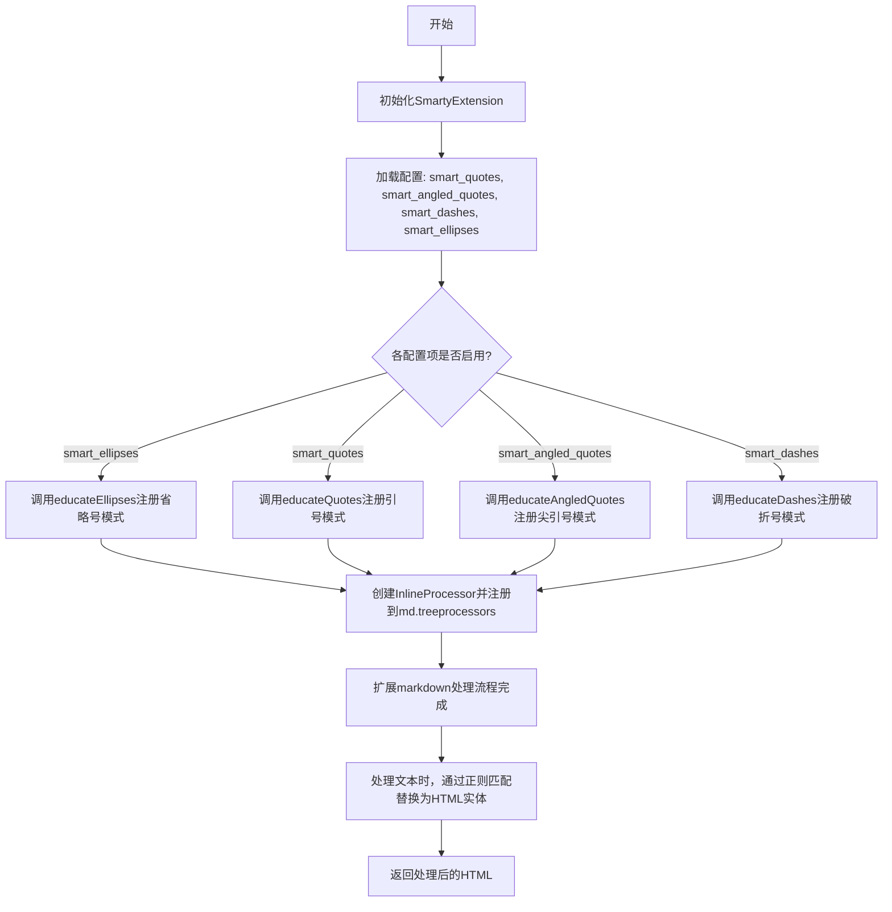
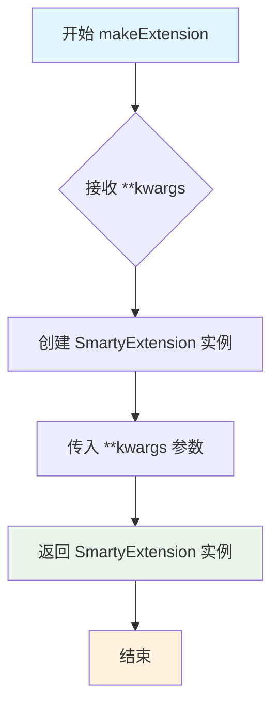
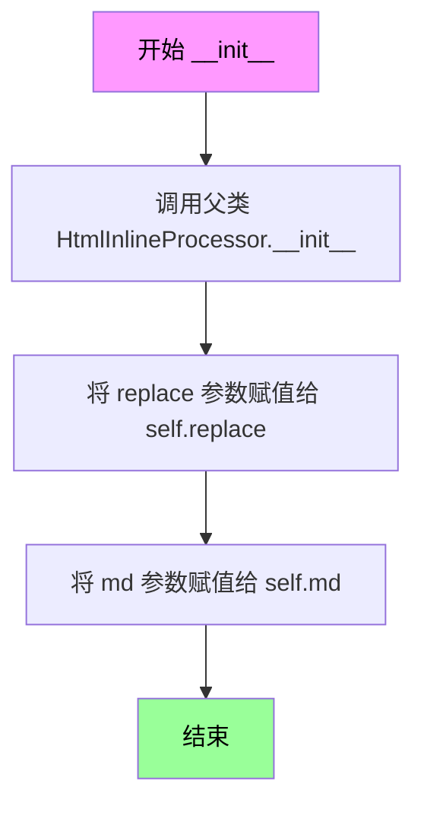
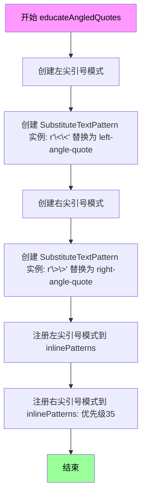
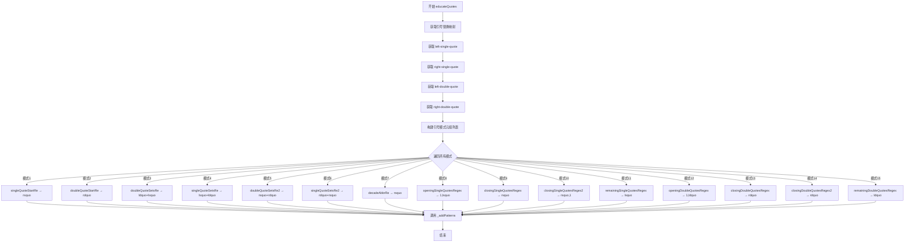

# `markdown\markdown\extensions\smarty.py` 详细设计文档

Python-Markdown的Smarty扩展，将ASCII破折号、引号和省略号转换为HTML实体等效物（如将---转换为&mdash;，将"转换为&ldquo;等），支持智能标点符号处理。

## 整体流程



## 类结构

```
Extension (基类)
└── SmartyExtension
    └── HtmlInlineProcessor
        └── SubstituteTextPattern
```

## 全局变量及字段


### `punctClass`
    
用于匹配标点符号的正则表达式字符类

类型：`str`
    


### `endOfWordClass`
    
用于匹配单词结尾字符的正则表达式字符类

类型：`str`
    


### `closeClass`
    
用于匹配非空白字符的正则表达式字符类，定义闭口规则

类型：`str`
    


### `openingQuotesBase`
    
用于匹配引号前导字符的基础正则表达式模板

类型：`str`
    


### `substitutions`
    
ASCII字符到HTML实体的替换映射字典

类型：`dict[str, str]`
    


### `singleQuoteStartRe`
    
匹配单引号在句子开头后接标点的正则表达式

类型：`str`
    


### `doubleQuoteStartRe`
    
匹配双引号在句子开头后接标点的正则表达式

类型：`str`
    


### `doubleQuoteSetsRe`
    
匹配双引号后接单引号的正则表达式

类型：`str`
    


### `singleQuoteSetsRe`
    
匹配单引号后接双引号的正则表达式

类型：`str`
    


### `doubleQuoteSetsRe2`
    
在闭口字符后匹配双引号后接单引号的正则表达式

类型：`str`
    


### `singleQuoteSetsRe2`
    
在闭口字符后匹配单引号后接双引号的正则表达式

类型：`str`
    


### `decadeAbbrRe`
    
匹配年代缩写的正则表达式，如'80s

类型：`str`
    


### `openingDoubleQuotesRegex`
    
匹配大多数开口双引号的正则表达式

类型：`str`
    


### `closingDoubleQuotesRegex`
    
匹配双引号后接空格的闭口双引号正则表达式

类型：`str`
    


### `closingDoubleQuotesRegex2`
    
在闭口字符后匹配闭口双引号的正则表达式

类型：`str`
    


### `openingSingleQuotesRegex`
    
匹配大多数开口单引号的正则表达式

类型：`str`
    


### `closingSingleQuotesRegex`
    
匹配单引号后接非空白字符的闭口单引号正则表达式

类型：`str`
    


### `closingSingleQuotesRegex2`
    
匹配单引号后接空白或s结尾的闭口单引号正则表达式

类型：`str`
    


### `remainingSingleQuotesRegex`
    
匹配所有剩余单引号的正则表达式

类型：`str`
    


### `remainingDoubleQuotesRegex`
    
匹配所有剩余双引号的正则表达式

类型：`str`
    


### `HTML_STRICT_RE`
    
严格的HTML标签正则表达式，防止重复闭合引号被处理

类型：`str`
    


### `SubstituteTextPattern.pattern`
    
用于匹配文本的正则表达式模式

类型：`str`
    


### `SubstituteTextPattern.replace`
    
替换内容序列，包含要替换的文本或HTML实体

类型：`Sequence[int | str | etree.Element]`
    


### `SubstituteTextPattern.md`
    
Markdown实例，用于访问HTML存储和处理功能

类型：`Markdown`
    


### `SmartyExtension.config`
    
扩展配置选项字典，包含智能引号、破折号、省略号等设置

类型：`dict`
    


### `SmartyExtension.substitutions`
    
字符替换映射表，将ASCII字符映射到对应的HTML实体

类型：`dict[str, str]`
    


### `SmartyExtension.inlinePatterns`
    
内联模式注册表，用于管理和匹配文本中的内联模式

类型：`Registry[inlinepatterns.InlineProcessor]`
    
    

## 全局函数及方法


### `makeExtension`

这是一个工厂函数，用于创建并返回SmartyExtension实例，作为Python-Markdown的Smarty扩展的入口点。它接收可变关键字参数并传递给SmartyExtension构造函数进行配置。

参数：

- `**kwargs`：可变关键字参数，用于传递给SmartyExtension的配置选项（如`smart_quotes`、`smart_angled_quotes`、`smart_dashes`、`smart_ellipses`等）

返回值：`SmartyExtension`，返回SmartyExtension的实例对象，用于注册到Markdown扩展系统中

#### 流程图



#### 带注释源码

```python
def makeExtension(**kwargs):  # pragma: no cover
    """
    创建并返回SmartyExtension实例的工厂函数。
    
    这是Python-Markdown扩展的入口点函数，框架会自动调用此函数
    来实例化扩展。该函数接收任意关键字参数，并将其传递给
    SmartyExtension的构造函数进行配置。
    
    参数:
        **kwargs: 可变关键字参数，包含以下可选配置:
            - smart_quotes: 是否转换直引号为弯引号 (默认: True)
            - smart_angled_quotes: 是否转换尖引号 (默认: False)
            - smart_dashes: 是否转换破折号 (默认: True)
            - smart_ellipses: 是否转换省略号 (默认: True)
            - substitutions: 自定义替换映射表 (默认: {})
    
    返回值:
        SmartyExtension: SmartyExtension类的实例，用于处理
                        Markdown文本中的Smarty标点符号转换
    """
    return SmartyExtension(**kwargs)
```


### `SubstituteTextPattern.__init__`

这是 `SubstituteTextPattern` 类的初始化方法，用于创建一个文本替换模式的处理器，继承自 `HtmlInlineProcessor`。该方法接收一个正则表达式模式、一个替换序列和 Markdown 实例，用于在 Markdown 文档中处理特定的文本替换（如将 ASCII 破折号、引号和省略号转换为对应的 HTML 实体）。

参数：

- `pattern`：`str`，正则表达式模式，用于匹配需要替换的文本
- `replace`：`Sequence[int | str | etree.Element]`，替换序列，可以包含整数（表示捕获组索引）、字符串（HTML 实体）或 XML 元素
- `md`：`Markdown`，Markdown 实例，用于访问 htmlStash 等功能

返回值：`None`，构造函数不返回值

#### 流程图



#### 带注释源码

```python
def __init__(self, pattern: str, replace: Sequence[int | str | etree.Element], md: Markdown):
    """ Replaces matches with some text. """
    # 调用父类 HtmlInlineProcessor 的初始化方法
    # 父类负责设置正则表达式模式和基本属性
    HtmlInlineProcessor.__init__(self, pattern)
    
    # 存储替换序列，用于在 handleMatch 中进行文本替换
    # replace 可以包含：
    #   - 整数：表示正则表达式捕获组的索引
    #   - 字符串：HTML 实体字符串，如 '&mdash;'
    #   - etree.Element：XML 元素对象
    self.replace = replace
    
    # 存储 Markdown 实例引用
    # 用于访问 htmlStash.store() 方法来存储 HTML 内容
    self.md = md
```


### `SubstituteTextPattern.handleMatch`

该方法用于处理正则表达式匹配结果，将匹配到的文本替换为指定的HTML实体（如引号、破折号、省略号等），并返回替换后的文本以及匹配的位置信息。

参数：

- `m`：`re.Match[str]`，正则表达式匹配对象，包含匹配的完整信息
- `data`：`str`，匹配到的原始数据字符串

返回值：`tuple[str, int, int]`，返回替换后的结果字符串、匹配起始位置和结束位置的元组

#### 流程图

```mermaid
flowchart TD
    A[开始 handleMatch] --> B[初始化空字符串 result]
    B --> C{遍历 self.replace 中的每个 part}
    C --> D{判断 part 是否为整数}
    D -->|是| E[使用 m.group(part) 获取匹配组]
    D -->|否| F[将 part 存入 htmlStash]
    E --> G[将结果添加到 result]
    F --> G
    G --> H{self.replace 遍历完成?}
    H -->|否| C
    H -->|是| I[返回 result, m.start(0), m.end(0)]
    I --> J[结束]
```

#### 带注释源码

```python
def handleMatch(self, m: re.Match[str], data: str) -> tuple[str, int, int]:
    """
    处理正则表达式匹配结果并进行文本替换。
    
    参数:
        m: re.Match[str] - 正则表达式匹配对象，包含匹配的完整信息
        data: str - 匹配到的原始数据字符串（虽然未直接使用）
    
    返回:
        tuple[str, int, int] - 替换后的文本、匹配起始位置、匹配结束位置
    """
    result = ''  # 初始化结果字符串
    
    # 遍历替换规则序列
    for part in self.replace:
        if isinstance(part, int):
            # 如果part是整数，表示要使用正则匹配组
            # 例如：part=1 表示使用第一个捕获组的内容
            result += m.group(part)
        else:
            # 如果part是字符串（HTML实体），则存储到htmlStash
            # htmlStash用于暂存HTML代码以避免被进一步处理
            result += self.md.htmlStash.store(part)
    
    # 返回替换结果、匹配起始位置和结束位置
    return result, m.start(0), m.end(0)
```


### `SmartyExtension.__init__`

初始化 Smarty 扩展类，设置默认配置选项并准备文本替换映射表。

参数：

- `**kwargs`：关键字参数，传递给父类 `Extension` 的初始化参数，用于配置扩展行为

返回值：`None`，无返回值（构造函数）

#### 流程图

```mermaid
flowchart TD
    A[Start __init__] --> B[设置 self.config 字典<br/>包含 smart_quotes, smart_angled_quotes<br/>smart_dashes, smart_ellipses<br/>substitutions 等配置项]
    B --> C[调用 super().__init__(\*\*kwargs)<br/>初始化父类 Extension]
    C --> D[初始化 self.substitutions<br/>复制全局 substitutions 字典]
    D --> E[调用 self.getConfig('substitutions')<br/>获取用户自定义替换映射]
    E --> F[使用 update 合并用户配置<br/>到 self.substitutions 字典]
    F --> G[End __init__]
```

#### 带注释源码

```python
def __init__(self, **kwargs):
    """ 初始化 SmartyExtension 实例，设置默认配置和替换映射表。 """
    # 定义扩展的配置选项字典，包含配置名称、默认值和描述
    self.config = {
        'smart_quotes': [True, 'Educate quotes'],           # 是否转换直引号为弯引号
        'smart_angled_quotes': [False, 'Educate angled quotes'],  # 是否转换尖引号
        'smart_dashes': [True, 'Educate dashes'],           # 是否转换破折号
        'smart_ellipses': [True, 'Educate ellipses'],       # 是否转换省略号
        'substitutions': [{}, 'Overwrite default substitutions'],  # 自定义替换映射
    }
    """ 默认配置选项字典 """
    
    # 调用父类 Extension 的初始化方法，传递关键字参数
    super().__init__(**kwargs)
    
    # 创建 substitutions 字典的副本，避免修改全局常量
    self.substitutions: dict[str, str] = dict(substitutions)
    
    # 获取用户自定义的 substitutions 配置并合并到实例变量中
    # 如果用户没有提供，则使用空字典作为默认值
    self.substitutions.update(self.getConfig('substitutions', default={}))
```


### SmartyExtension._addPatterns

该方法负责将一组文本替换模式批量注册到 Markdown 的内联模式注册表中，通过为每个模式分配唯一的名称和递减的优先级来实现智能排版（SmartyPants）功能。

参数：

- `md`：`Markdown`，Markdown 实例，用于处理文本和 HTML 实体存储
- `patterns`：`Sequence[tuple[str, Sequence[int | str | etree.Element]]]`，要添加的模式序列，每个元素为 (正则表达式, 替换内容) 的元组
- `serie`：`str`，模式系列名称，用于生成唯一的模式名称
- `priority`：`int`，基础优先级值，每个模式的实际优先级为 `priority-ind`

返回值：`None`，该方法直接修改 `self.inlinePatterns` 内部注册表，不返回任何值

#### 流程图

```mermaid
flowchart TD
    A[开始 _addPatterns] --> B{遍历 patterns 序列}
    B -->|ind=0,1,2...| C[获取当前模式 pattern]
    C --> D[将 md 实例添加到 pattern 元组末尾]
    D --> E[创建 SubstituteTextPattern 对象]
    E --> F[生成唯一名称: smarty-{serie}-{ind}]
    F --> G[计算实际优先级: priority - ind]
    G --> H[注册到 self.inlinePatterns]
    H --> I{是否还有更多模式?}
    I -->|是| C
    I -->|否| J[结束]
```

#### 带注释源码

```python
def _addPatterns(
    self,
    md: Markdown,
    patterns: Sequence[tuple[str, Sequence[int | str | etree.Element]]],
    serie: str,
    priority: int,
):
    """
    将一组文本替换模式批量注册到内联模式注册表中。
    
    参数:
        md: Markdown 实例，用于创建 HtmlInlineProcessor 和存储 HTML 实体
        patterns: 模式序列，每个元素为 (正则表达式, 替换内容) 元组
        serie: 系列名称，用于生成唯一的模式标识符
        priority: 基础优先级，数值越高优先级越高
    """
    # 遍历所有模式，为每个模式创建并注册处理器
    for ind, pattern in enumerate(patterns):
        # 将 Markdown 实例添加到模式元组的末尾，作为 SubstituteTextPattern 的最后一个参数
        pattern += (md,)
        # 解包元组创建 SubstituteTextPattern 对象
        # 参数结构: (正则表达式, 替换内容序列, md实例)
        pattern = SubstituteTextPattern(*pattern)
        # 生成唯一的模式名称，格式: smarty-{serie}-{索引}
        # 例如: smarty-quotes-0, smarty-quotes-1 等
        name = 'smarty-%s-%d' % (serie, ind)
        # 注册到内联模式注册表，优先级递减以保持原始顺序
        # 优先级 = 基础优先级 - 当前索引，确保先添加的模式具有更高优先级
        self.inlinePatterns.register(pattern, name, priority-ind)
```


### SmartyExtension.educateDashes

该方法是SmartyExtension类的一个成员方法，主要功能是将Markdown文本中的ASCII短横线（--）转换为HTML实体`&ndash;`（en-dash），将长横线（---）转换为HTML实体`&mdash;`（em-dash），从而实现智能 dashes 排版效果。

参数：

- `md`：`Markdown`，Markdown实例对象，用于注册内联模式和存储HTML实体

返回值：`None`，该方法无返回值，通过副作用（注册内联模式）完成功能

#### 流程图

```mermaid
flowchart TD
    A[开始 educateDashes] --> B[创建 em-dashes 模式]
    B --> C[匹配正则: (?<!-)---(?!-)]
    C --> D[替换为: &amp;mdash;]
    D --> E[创建 en-dashes 模式]
    E --> F[匹配正则: (?<!-)--(?!-)]
    F --> G[替换为: &amp;ndash;]
    G --> H[注册 em-dashes 模式到 inlinePatterns]
    H --> I[注册 en-dashes 模式到 inlinePatterns]
    I --> J[结束]
```

#### 带注释源码

```python
def educateDashes(self, md: Markdown) -> None:
    """
    为 Markdown 注册破折号（dashes）的智能转换模式。
    
    将双连字符（--）转换为 en-dash（&ndash;），
    将三连字符（---）转换为 em-dash（&mdash;）。
    
    参数:
        md: Markdown 实例，用于注册内联处理器模式
    """
    # 创建 em-dash（长破折号）匹配模式
    # 正则解释: (?<!-)---(?!-)
    #   (?<!-)  负向后查找，确保前面不是连字符
    #   ---    匹配三个连续连字符
    #   (?!-)   负向前查找，确保后面不是连字符
    # 这样可以避免将已有的 HTML 实体或多个连字符错误转换
    emDashesPattern = SubstituteTextPattern(
        r'(?<!-)---(?!-)',           # 正则表达式：匹配独立的三个连字符
        (self.substitutions['mdash'],),  # 替换为 &mdash; HTML实体
        md                               # 传递 Markdown 实例
    )
    
    # 创建 en-dash（短破折号）匹配模式
    # 正则解释: (?<!-)--(?!-)
    #   (?<!-)  负向后查找，确保前面不是连字符
    #   --     匹配两个连续连字符
    #   (?!-)   负向前查找，确保后面不是连字符
    enDashesPattern = SubstituteTextPattern(
        r'(?<!-)--(?!-)',            # 正则表达式：匹配独立的两个连字符
        (self.substitutions['ndash'],),   # 替换为 &ndash; HTML实体
        md                               # 传递 Markdown 实例
    )
    
    # 注册 em-dash 模式到内联模式注册表，优先级为 50
    # 较高优先级确保在其他模式之前处理
    self.inlinePatterns.register(emDashesPattern, 'smarty-em-dashes', 50)
    
    # 注册 en-dash 模式到内联模式注册表，优先级为 45
    # 较低优先级确保在 em-dash 模式之后处理
    # 这样可以确保 "---" 不会被错误地匹配为 "--" + "-"
    self.inlinePatterns.register(enDashesPattern, 'smarty-en-dashes', 45)
```


### `SmartyExtension.educateEllipses`

将文本中的ASCII省略号（三个点 `...`）转换为HTML实体 `&hellip;`。

参数：

- `md`：`Markdown`，Markdown实例，用于注册内联模式和存储替换后的HTML实体

返回值：`None`，无返回值。该方法通过注册内联模式到 `self.inlinePatterns` 来实现功能。

#### 流程图

```mermaid
flowchart TD
    A[开始 educateEllipses] --> B{检查配置 smart_ellipses}
    B -->|启用| C[创建省略号匹配正则表达式]
    B -->|禁用| D[结束方法]
    C --> D
    C --> E[创建 SubstituteTextPattern 对象]
    E --> F[正则表达式: r'(?<!\.)\.{3}(?!\.)']
    F --> G[替换为: self.substitutions['ellipsis'] 即 '&hellip;']
    G --> H[注册到 inlinePatterns: 名称 'smarty-ellipses', 优先级 10]
    H --> I[结束方法]
```

#### 带注释源码

```python
def educateEllipses(self, md: Markdown) -> None:
    """
    添加省略号转换模式到 Markdown 实例。
    
    该方法将三个连续的点（...）转换为 HTML 省略号实体（&hellip;），
    前提是这三个点前后都不是点字符，以避免误转换已存在的省略号形式。
    """
    # 创建省略号匹配模式：
    # (?<!\.) - 负向后查找断言，确保前面不是点
    # \.{3}   - 匹配三个点
    # (?!\.)  - 负向前查找断言，确保后面不是点
    ellipsesPattern = SubstituteTextPattern(
        r'(?<!\.)\.{3}(?!\.)',        # 正则表达式：匹配独立的三个点
        (self.substitutions['ellipsis'],),  # 替换为省略号实体 &hellip;
        md                            # Markdown 实例
    )
    # 将模式注册到内联模式注册表中
    # 名称: 'smarty-ellipses'
    # 优先级: 10（较低优先级，允许其他模式先处理）
    self.inlinePatterns.register(ellipsesPattern, 'smarty-ellipses', 10)
```


### `SmartyExtension.educateAngledQuotes`

该方法负责将文本中的双尖括号 `<<` 和 `>>` 转换为对应的HTML实体左尖引号（`&laquo;`）和右尖引号（`&raquo;`），通过注册两个`SubstituteTextPattern`实例到内联模式注册表中实现。

参数：

-  `md`：`Markdown`，Python-Markdown的核心对象，用于注册内联模式和存储HTML实体

返回值：`None`，无返回值，仅修改`md`的`inlinePatterns`注册表

#### 流程图



#### 带注释源码

```python
def educateAngledQuotes(self, md: Markdown) -> None:
    """
    为 Markdown 文本添加尖括号引号（angled quotes）的智能转换功能。
    
    该方法创建两个 SubstituteTextPattern 实例：
    1. 将 << 转换为左尖引号 &laquo;
    2. 将 >> 转换为右尖引号 &raquo;
    
    参数:
        md: Markdown 实例，用于注册内联模式和存储HTML实体
    """
    
    # 创建左尖引号模式：匹配文本中的 <<
    # 使用 self.substitutions['left-angle-quote'] 获取替换文本 '&laquo;'
    leftAngledQuotePattern = SubstituteTextPattern(
        r'\<\<',                    # 正则表达式：匹配两个连续的左尖括号
        (self.substitutions['left-angle-quote'],),  # 替换为左尖引号实体
        md                          # Markdown 对象引用
    )
    
    # 创建右尖引号模式：匹配文本中的 >>
    # 使用 self.substitutions['right-angle-quote'] 获取替换文本 '&raquo;'
    rightAngledQuotePattern = SubstituteTextPattern(
        r'\>\>',                    # 正则表达式：匹配两个连续的右尖括号
        (self.substitutions['right-angle-quote'],), # 替换为右尖引号实体
        md                          # Markdown 对象引用
    )
    
    # 将左尖引号模式注册到内联模式注册表，优先级为 40
    # 较高的优先级意味着在模式匹配时会被优先考虑
    self.inlinePatterns.register(leftAngledQuotePattern, 'smarty-left-angle-quotes', 40)
    
    # 将右尖引号模式注册到内联模式注册表，优先级为 35
    # 低于左尖引号的优先级
    self.inlinePatterns.register(rightAngledQuotePattern, 'smarty-right-angle-quotes', 35)
```


### `SmartyExtension.educateQuotes`

该方法是SmartyExtension类的核心方法之一，负责将ASCII引号字符（单引号和双引号）转换为对应的HTML实体（如左引号、右引号、单引号、双引号等），以实现更专业的排版效果。

参数：

- `md`：`Markdown`，Markdown实例，用于注册内联模式和存储HTML实体

返回值：`None`，该方法不返回值，通过副作用（注册内联模式）完成功能

#### 流程图



#### 带注释源码

```python
def educateQuotes(self, md: Markdown) -> None:
    """
    处理ASCII引号，将其转换为HTML实体引号。
    
    该方法定义了15种不同的引号替换模式，覆盖了：
    - 句首引号
    - 句尾引号
    - 嵌套引号
    - 十年缩写（如 '80s）
    - 剩余未匹配引号
    
    参数:
        md: Markdown实例，用于注册内联模式和存储HTML实体
    """
    # 从替换字典中获取左单引号 HTML 实体（如 &lsquo;）
    lsquo = self.substitutions['left-single-quote']
    # 从替换字典中获取右单引号 HTML 实体（如 &rsquo;）
    rsquo = self.substitutions['right-single-quote']
    # 从替换字典中获取左双引号 HTML 实体（如 &ldquo;）
    ldquo = self.substitutions['left-double-quote']
    # 从替换字典中获取右双引号 HTML 实体（如 &rdquo;）
    rdquo = self.substitutions['right-double-quote']
    
    # 定义所有引号处理模式，每个元素为 (正则表达式, 替换内容) 元组
    # 替换内容可以是字符串或整数（整数表示引用捕获组）
    patterns = (
        # 1. 特殊情况的句首单引号后接标点符号
        (singleQuoteStartRe, (rsquo,)),
        # 2. 特殊情况的句首双引号后接标点符号
        (doubleQuoteStartRe, (rdquo,)),
        # 3. 双引号内嵌套单引号（如 He said, "'Quoted'"）
        (doubleQuoteSetsRe, (ldquo + lsquo,)),
        # 4. 单引号内嵌套双引号
        (singleQuoteSetsRe, (lsquo + ldquo,)),
        # 5. 双引号后接单引号（闭双开单）
        (doubleQuoteSetsRe2, (rsquo + rdquo,)),
        # 6. 单引号后接双引号（闭单开双）
        (singleQuoteSetsRe2, (rdquo + rsquo,)),
        # 7. 十年缩写（如 '80s 中的撇号）
        (decadeAbbrRe, (rsquo,)),
        # 8. 常规开单引号（捕获前导空白后替换为左单引号）
        (openingSingleQuotesRegex, (1, lsquo)),
        # 9. 闭单引号（后面不是空格/s/数字）
        (closingSingleQuotesRegex, (rsquo,)),
        # 10. 闭单引号后接空格或s词边界
        (closingSingleQuotesRegex2, (rsquo, 1)),
        # 11. 剩余未匹配的单引号（作为左单引号）
        (remainingSingleQuotesRegex, (lsquo,)),
        # 12. 常规开双引号（捕获前导空白后替换为左双引号）
        (openingDoubleQuotesRegex, (1, ldquo)),
        # 13. 闭双引号后接空白
        (closingDoubleQuotesRegex, (rdquo,)),
        # 14. 闭双引号前有非空白字符
        (closingDoubleQuotesRegex2, (rdquo,)),
        # 15. 剩余未匹配的双引号（作为左双引号）
        (remainingDoubleQuotesRegex, (ldquo,))
    )
    
    # 调用内部方法将所有模式注册到Markdown的内联模式注册表中
    # 'quotes' 是系列名称，30是优先级
    self._addPatterns(md, patterns, 'quotes', 30)
```


### `SmartyExtension.extendMarkdown`

该方法是SmartyExtension类的核心方法，用于扩展Markdown处理流程，根据配置启用智能标点符号转换功能（包括引号、破折号和省略号），并注册相应的内联模式和树处理器。

参数：

- `md`：`Markdown`，Markdown实例对象，用于注册各种处理模式和树处理器

返回值：`None`，该方法不返回值，通过修改传入的Markdown对象来生效

#### 流程图

```mermaid
flowchart TD
    A[开始 extendMarkdown] --> B[获取配置 configs = self.getConfigs]
    B --> C[初始化内联模式注册表 self.inlinePatterns = Registry]
    C --> D{smart_ellipses 配置是否启用?}
    D -->|是| E[调用 educateEllipses(md)]
    D -->|否| F{smart_quotes 配置是否启用?}
    E --> F
    F -->|是| G[调用 educateQuotes(md)]
    F -->|否| H{smart_angled_quotes 配置是否启用?}
    G --> H
    H -->|是| I[调用 educateAngledQuotes(md)]
    H -->|否| J{smart_dashes 配置是否启用?}
    I --> K[注册 HtmlInlineProcessor 覆盖默认HTML_RE]
    K --> J
    J -->|是| L[调用 educateDashes(md)]
    J -->|否| M[创建 InlineProcessor 实例]
    L --> M
    M --> N[设置 inlineProcessor.inlinePatterns]
    N --> O[注册 inlineProcessor 到 treeprocessors]
    O --> P[添加转义字符 ", ']
    P --> Q[结束]
```

#### 带注释源码

```python
def extendMarkdown(self, md):
    """
    扩展 Markdown 实例，添加智能标点符号转换功能。
    
    该方法是 Smarty 扩展的入口点，根据配置选项注册各种内联模式
    和树处理器来处理 ASCII 标点符号到 HTML 实体等的转换。
    
    参数:
        md: Markdown 实例，用于注册处理模式和树处理器
        
    返回值:
        None (无返回值，通过副作用修改 md 对象)
    """
    # 步骤1: 获取当前扩展的配置选项
    # 配置字典包含 smart_ellipses, smart_quotes, smart_angled_quotes, smart_dashes 等选项
    configs = self.getConfigs()
    
    # 步骤2: 初始化内联模式注册表
    # 创建新的 Registry 实例用于存储智能标点符号的处理模式
    self.inlinePatterns: Registry[inlinepatterns.InlineProcessor] = Registry()
    
    # 步骤3: 根据配置条件性地启用各种智能标点转换
    
    # 3.1: 处理省略号 (ellipses) - 将三个点 ... 转换为 &hellip;
    if configs['smart_ellipses']:
        self.educateEllipses(md)
    
    # 3.2: 处理引号 (quotes) - 将直引号转换为弯引号
    if configs['smart_quotes']:
        self.educateQuotes(md)
    
    # 3.3: 处理尖角引号 (angled quotes) - 将 << 和 >> 转换为 &laquo; 和 &raquo;
    if configs['smart_angled_quotes']:
        self.educateAngledQuotes(md)
        # 重要: 覆盖 inlinepatterns.py 中的 HTML_RE，以防止处理
        # 具有重复闭包引号的标签（如 <<foo>>）
        md.inlinePatterns.register(HtmlInlineProcessor(HTML_STRICT_RE, md), 'html', 90)
    
    # 3.4: 处理破折号 (dashes) - 将 -- 转换为 &ndash;，--- 转换为 &mdash;
    if configs['smart_dashes']:
        self.educateDashes(md)
    
    # 步骤4: 创建并配置内联处理器
    # InlineProcessor 负责在 Markdown 树中处理内联模式的实际转换
    inlineProcessor = InlineProcessor(md)
    inlineProcessor.inlinePatterns = self.inlinePatterns
    
    # 步骤5: 注册内联处理器到 Markdown 的树处理器注册表
    # 优先级为 6，低于默认的 InlineProcessor
    md.treeprocessors.register(inlineProcessor, 'smarty', 6)
    
    # 步骤6: 扩展转义字符列表
    # 添加双引号和单引号到需要转义的字符列表
    md.ESCAPED_CHARS.extend(['"', "'"])
```

## 关键组件


### SubstituteTextPattern 类

用于替换匹配到的文本的处理器，继承自 HtmlInlinePattern，通过正则表达式匹配并将捕获组或静态文本替换为对应的 HTML 实体。

### SmartyExtension 类

Python-Markdown 的智能标点符号扩展类，负责将 ASCII 破折号、引号和省略号转换为 HTML 实体，支持配置化启用/禁用各类智能标点功能。

### substitutions 字典

存储默认的字符替换映射表，将破折号、省略号、尖引号、单引号和双引号映射到对应的 HTML 实体。

### educateDashes 方法

将 ASCII 破折号（--- 和 --）转换为 HTML 实体（&mdash; 和 &ndash;），通过注册内联模式实现。

### educateEllipses 方法

将三个点（...）转换为省略号 HTML 实体（&hellip;），处理省略号的前后上下文。

### educateQuotes 方法

处理引号的"教育"逻辑，根据引号在单词中的位置、前后字符类型，将直引号转换为对应的左/右双引号或单引号 HTML 实体。

### educateAngledQuotes 方法

将双小于号（<<）和双大于号（>>）转换为尖引号 HTML 实体（&laquo; 和 &raquo;）。

### InlineProcessor 组件

树处理器，负责在 Markdown 转换过程中扫描文档树并应用内联模式（包括智能标点符号替换模式）。

### 正则表达式模式组

用于匹配各种标点符号场景的正则表达式集合，包括句首引号、引号对、双引号集、年代缩写、闭合引号等复杂匹配模式。


## 问题及建议


### 已知问题

-   **类型注解不一致**：`self.inlinePatterns` 在 `extendMarkdown` 方法中被重新赋值为 `Registry()` 实例，但在 `__init__` 方法中未进行初始化，导致类型不明确且可能引发 AttributeError。
-   **配置参数兼容性**：`self.getConfig('substitutions', default={})` 中使用了 `default` 参数，但基类 `Extension` 的 `getConfig` 方法签名需要确认是否支持该参数，否则可能导致运行时错误。
-   **正则表达式重复构建**：`openingQuotesBase` 等正则表达式片段在多个地方被重复拼接使用，导致正则表达式被多次编译，增加内存开销。
-   **魔法数字与字符串**：优先级数值（如 `50`, `45`, `10`, `40`, `35`, `30`）和注册名称（如 `'smarty-em-dashes'`）以硬编码形式散布在多个方法中，缺乏常量定义。
-   **副作用风险**：直接修改 `md.ESCAPED_CHARS` 列表来扩展转义字符，可能与其它扩展产生冲突，缺乏隔离机制。
-   **文档缺失**：类方法（如 `educateDashes`, `educateQuotes` 等）缺少文档字符串，难以理解其行为和返回值。

### 优化建议

-   **统一类型初始化**：在 `__init__` 方法中初始化 `self.inlinePatterns: Registry[inlinepatterns.InlineProcessor] = Registry()`，或在 `extendMarkdown` 开头添加类型检查和初始化逻辑。
-   **提取常量定义**：将优先级数值、注册名称前缀等硬编码值提取为模块级常量，例如 `PRIORITY_EM_DASHES = 50`，提高可维护性。
-   **缓存正则表达式**：将重复使用的正则表达式片段在模块加载时编译一次并缓存，避免在每次调用时重新构建。
-   **配置验证**：在 `__init__` 中对用户提供的 `substitutions` 字典进行验证，确保键名合法，防止运行时 KeyError。
-   **添加文档字符串**：为所有类方法添加详细的 docstring，说明参数、返回值和副作用。
-   **解耦扩展配置**：考虑使用配置对象或 dataclass 来管理 SmartyExtension 的各项配置，提高可读性和可测试性。

## 其它


### 设计目标与约束

本扩展的设计目标是将Markdown文本中的ASCII标点符号（如破折号、引号、椭圆点）智能转换为对应的HTML实体，以提升网页排版的视觉效果。约束条件包括：必须兼容Python-Markdown的扩展机制，必须在Python 3环境下运行（使用`from __future__ import annotations`实现向后兼容），必须保持对现有Markdown解析流程的非侵入性扩展。

### 错误处理与异常设计

本扩展主要依赖正则表达式匹配和字符串替换操作，错误处理机制相对简单。对于SubstituteTextPattern类中的handleMatch方法，若正则表达式匹配失败返回空元组；对于配置参数，使用Python-Markdown内置的配置获取机制，若获取不到则使用默认值。代码中未实现显式的异常捕获和日志记录，依赖上层调用者处理可能的异常。

### 数据流与状态机

数据流从Markdown文本输入开始，经过InlineProcessor的inlinePatterns注册的所有SubstituteTextPattern处理器逐个匹配转换。状态机转换如下：初始状态（原始Markdown文本）→破折号处理（em-dash、en-dash）→引号处理（单引号、双引号、尖引号）→椭圆点处理→最终状态（包含HTML实体的文本）。每个educateXxx方法负责注册特定类型的转换模式，优先级顺序决定了处理先后。

### 外部依赖与接口契约

本扩展依赖以下外部模块：markdown.core.Markdown（主类）、markdown.inlinepatterns.HtmlInlineProcessor（HTML内联处理器基类）、markdown.treeprocessors.InlineProcessor（内联处理器）、markdown.util.Registry（注册表）、xml.etree.ElementTree（元素树，用于类型标注）。接口契约包括：必须实现extendMarkdown(md)方法作为扩展入口；SmartyExtension构造函数接受kwargs参数用于配置；makeExtension函数返回扩展实例供Markdown框架加载。

### 性能考虑

性能关键点在于正则表达式的编译和匹配效率。当前实现中每个模式在注册时都会创建新的SubstituteTextPattern实例，正则表达式未做预编译缓存。对于大量文档的处理，可以考虑将常用的正则表达式编译为预编译对象。此外，inlinePatterns使用Registry注册，查找效率为O(n)，对于大量模式可能存在优化空间。

### 版本兼容性

本扩展明确支持Python 3（通过TYPE_CHECKING和from __future__ import annotations实现），对Python 2不提供支持（已废弃）。与Python-Markdown 3.x版本兼容，代码中使用的一些语法特性（如类型注解的Sequence[int | str | ...]）需要Python 3.9+，若需支持更低版本需要使用Union类型标注。

### 安全性考虑

本扩展主要处理文本转换，不涉及用户输入执行、文件操作或网络请求，安全性风险较低。主要安全考量在于HTML实体的存储机制，使用md.htmlStash.store()方法将替换文本存入内部存储，避免直接插入导致的XSS风险（由上层Markdown框架处理）。正则表达式未使用用户提供的动态输入进行编译，不存在正则表达式注入风险。

### 配置管理

本扩展提供以下可配置选项：smart_quotes（布尔值，默认True）控制引号转换；smart_angled_quotes（布尔值，默认False）控制尖引号转换；smart_dashes（布尔值，默认True）控制破折号转换；smart_ellipses（布尔值，默认True）控制椭圆点转换；substitutions（字典，默认空字典）允许用户覆盖默认的替换映射。配置通过SmartyExtension的__init__方法接收并存储在self.config中，使用getConfig方法获取。

### 测试策略

测试应覆盖以下场景：各种引号组合的转换（单引号、双引号、嵌套引号）；破折号和短破折号的区分；椭圆点与句号的区分；与HTML标签的共存处理；配置选项的启用/禁用效果；自定义substitutions的覆盖效果；与其它扩展的配合（如codehilite、nl2br等）。建议使用pytest框架编写单元测试和集成测试。


    