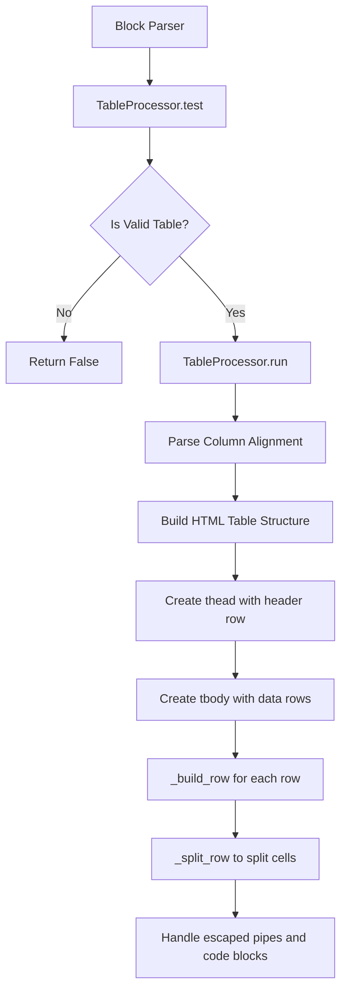
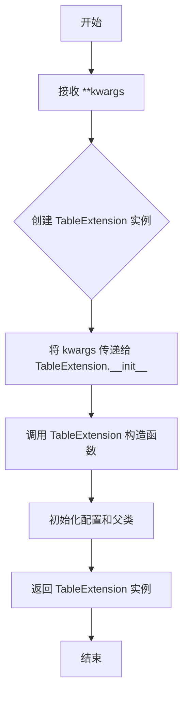
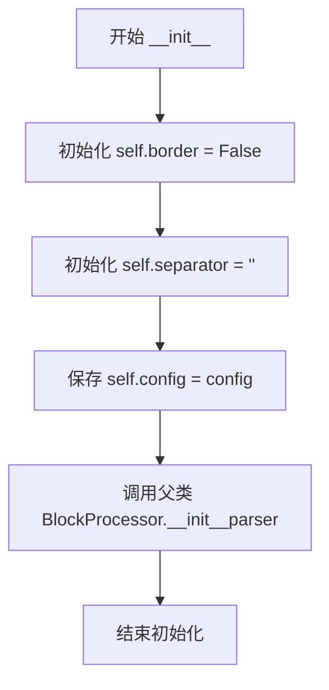
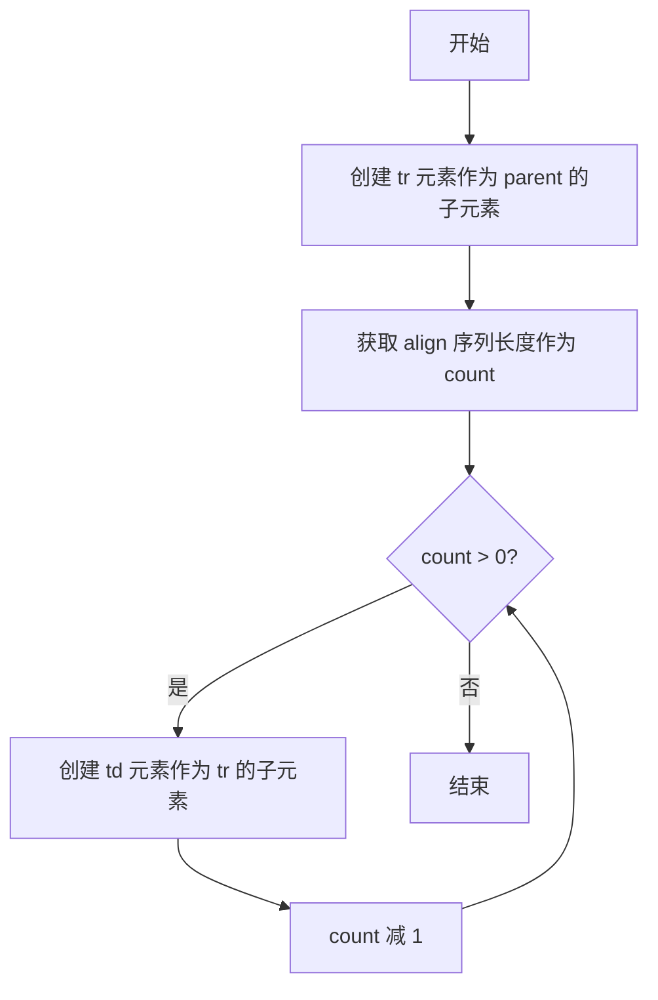

# `markdown\markdown\extensions\tables.py` 详细设计文档

This Python-Markdown extension adds table parsing functionality, allowing the conversion of Markdown table syntax (with headers, separators, and rows) into HTML tables with proper alignment support (left, center, right).

## 整体流程



## 类结构

```
Extension (Abstract Base)
└── TableExtension

BlockProcessor (Abstract Base)
└── TableProcessor
```

## 全局变量及字段


### `PIPE_NONE`
    
Flag indicating no pipe at either side of the table.

类型：`int`
    


### `PIPE_LEFT`
    
Flag indicating a pipe at the left side of the table.

类型：`int`
    


### `PIPE_RIGHT`
    
Flag indicating a pipe at the right side of the table.

类型：`int`
    


### `TableProcessor.RE_CODE_PIPES`
    
Regex to match escaped pipes and code ticks.

类型：`re.Pattern`
    


### `TableProcessor.RE_END_BORDER`
    
Regex to match trailing pipe.

类型：`re.Pattern`
    


### `TableProcessor.border`
    
Table border flags (PIPE_NONE, PIPE_LEFT, PIPE_RIGHT).

类型：`bool | int`
    


### `TableProcessor.separator`
    
The separator row content.

类型：`Sequence[str]`
    


### `TableProcessor.config`
    
Configuration options.

类型：`dict[str, Any]`
    


### `TableExtension.config`
    
Extension configuration with use_align_attribute option.

类型：`dict`
    
    

## 全局函数及方法


### `makeExtension`

该函数是一个工厂函数，用于创建并返回 `TableExtension` 实例，使 Python-Markdown 能够解析和渲染表格语法。

参数：

- `kwargs`：`dict`，关键字参数，用于传递给 `TableExtension` 的构造函数，以配置表格扩展的行为（例如 `use_align_attribute`）。

返回值：`TableExtension`，返回配置好的 `TableExtension` 实例，用于注册到 Markdown 解析器中。

#### 流程图



#### 带注释源码

```python
def makeExtension(**kwargs):  # pragma: no cover
    """
    创建并返回一个 TableExtension 实例。
    
    这是一个工厂函数，用于实例化 TableExtension 类，使 Python-Markdown
    能够支持表格语法。该函数通常由 Python-Markdown 的扩展加载机制调用。
    
    参数:
        **kwargs: 关键字参数，将传递给 TableExtension 的构造函数。
                  例如可用于设置 'use_align_attribute' 配置项。
    
    返回值:
        TableExtension: 配置好的 TableExtension 实例，可用于扩展 Markdown 功能。
    """
    return TableExtension(**kwargs)  # 创建并返回 TableExtension 实例
```


### `TableProcessor.__init__`

初始化 `TableProcessor` 实例，设置表格处理器的配置参数和状态变量，并调用父类构造函数完成初始化。

参数：

- `parser`：`blockparser.BlockParser`，Markdown 块解析器实例，用于处理文档块结构
- `config`：`dict[str, Any]`，扩展配置字典，包含如 `use_align_attribute` 等选项

返回值：`None`，无返回值（构造函数）

#### 流程图



#### 带注释源码

```python
def __init__(self, parser: blockparser.BlockParser, config: dict[str, Any]):
    """
    初始化 TableProcessor 实例。
    
    参数:
        parser: Markdown blockparser.BlockParser 实例，用于解析 Markdown 文档块
        config: 包含扩展配置的字典，如 {'use_align_attribute': False}
    """
    # 初始化边框标志，False 表示无边框，PIPE_LEFT/PIPE_RIGHT 位标志后续可能设置
    # 类型为 bool | int，False=0, PIPE_LEFT=1, PIPE_RIGHT=2, 可组合使用
    self.border: bool | int = False
    
    # 初始化分隔行（表头与数据行之间的对齐行），存储如 ['|:---', '---:', '---:']
    # 类型为 Sequence[str]，空字符串表示尚未解析分隔行
    self.separator: Sequence[str] = ''
    
    # 保存配置字典，供后续方法使用（如 _build_row 中使用 use_align_attribute）
    self.config = config

    # 调用父类 BlockProcessor 的初始化方法
    # 设置 self.parser = parser，供继承的 test() 和 run() 方法使用
    super().__init__(parser)
```


### TableProcessor.test

该方法用于测试给定的文本块是否符合表格语法规范，通过检查表头行和分隔行（separator row）的有效性来判断是否为有效表格，并记录表格的边框和分隔符信息以供后续处理使用。

参数：

- `parent`：`etree.Element`，父 XML 元素，用于后续构建表格元素
- `block`：`str`，待测试的 Markdown 表格文本块

返回值：`bool`，返回 True 表示该文本块是有效的表格格式，返回 False 则不是

#### 流程图

```mermaid
flowchart TD
    A[开始 test 方法] --> B{检查 block 是否有超过1行}
    B -->|否| Z[返回 False]
    B -->|是| C[获取第一行作为表头]
    C --> D[初始化 border = PIPE_NONE]
    D --> E{表头是否以 | 开头?}
    E -->|是| F[border |= PIPE_LEFT]
    E -->|否| G
    F --> G
    G --> H{表头是否以 | 结尾?}
    H -->|是| I[border |= PIPE_RIGHT]
    H -->|否| J
    I --> J
    J --> K[_split_row 拆分表头行]
    K --> L[获取列数 row0_len]
    L --> M{row0_len > 1?}
    M -->|是| N[设置 is_table = True]
    M -->|否| O{单列且有边框?}
    O -->|否| Z
    O -->|是| P[遍历剩余行检查管道符]
    P --> Q{当前行以 | 开头或结尾?}
    Q -->|是| R[is_table = True, 继续]
    Q -->|否| S[is_table = False, 跳出]
    R --> T{还有更多行?}
    T -->|是| P
    T -->|否| N
    N --> U{is_table 为 True?}
    U -->|是| V[_split_row 拆分第二行]
    U -->|否| Z
    V --> W{第二行列数 == row0_len 且只包含 |:-空格?}
    W -->|是| X[设置 self.separator = row, 返回 True]
    W -->|否| Z
    S --> Z
```

#### 带注释源码

```python
def test(self, parent: etree.Element, block: str) -> bool:
    """
    Ensure first two rows (column header and separator row) are valid table rows.

    Keep border check and separator row do avoid repeating the work.
    """
    # 初始化返回值，表示当前块是否为表格
    is_table = False
    
    # 将 block 按换行符分割，并去除每行首尾空格
    rows = [row.strip(' ') for row in block.split('\n')]
    
    # 表格至少需要两行：表头行和分隔行
    if len(rows) > 1:
        # 获取第一行作为表头
        header0 = rows[0]
        
        # 初始化边框标志，默认为无边框
        self.border = PIPE_NONE
        
        # 检查表头是否以管道符 | 开头，设置左边框标志
        if header0.startswith('|'):
            self.border |= PIPE_LEFT
        
        # 检查表头是否以管道符 | 结尾（排除转义的 |），设置右边框标志
        # 使用负向后顾断言 (?<!\\) 确保不是转义的 |
        if self.RE_END_BORDER.search(header0) is not None:
            self.border |= PIPE_RIGHT
        
        # 使用 _split_row 方法拆分表头行，处理转义和代码块内的管道符
        row = self._split_row(header0)
        
        # 获取列数
        row0_len = len(row)
        
        # 基本条件：至少需要2列才能构成表格
        is_table = row0_len > 1

        # 处理单列表格的边缘情况
        # 单列表格每行必须包含管道符才能被识别为表格
        if not is_table and row0_len == 1 and self.border:
            for index in range(1, len(rows)):
                # 检查当前行是否以 | 开头
                is_table = rows[index].startswith('|')
                if not is_table:
                    # 检查当前行是否以 | 结尾
                    is_table = self.RE_END_BORDER.search(rows[index]) is not None
                if not is_table:
                    # 如果当前行不构成表格，退出循环
                    break

        # 如果前面检查都通过，进一步验证分隔行
        if is_table:
            # 拆分第二行（分隔行）
            row = self._split_row(rows[1])
            
            # 分隔行必须满足以下条件：
            # 1. 列数与表头列数相同
            # 2. 只包含管道符 |、冒号 :、连字符 -、空格（用于对齐）
            is_table = (len(row) == row0_len) and set(''.join(row)) <= set('|:- ')
            
            if is_table:
                # 保存分隔行，用于后续确定列对齐方式
                self.separator = row

    # 返回测试结果
    return is_table
```


### `TableProcessor.run`

该方法负责解析Markdown表格块并构建HTML表格元素。它从blocks列表中获取表格文本，解析列对齐方式，创建table、thead、tbody元素，并根据对齐方式构建表头和表体行。

参数：

- `parent`：`etree.Element`，父元素，表格将作为子元素添加到此元素中
- `blocks`：`list[str]`（`list[str]`），包含待解析的表格文本块的列表，方法会从此列表中弹出第一个元素

返回值：`None`，无返回值，该方法直接操作XML元素树构建表格结构

#### 流程图

```mermaid
flowchart TD
    A[开始] --> B[从blocks弹出第一个块并按换行符分割]
    B --> C[提取表头行: block[0]]
    C --> D{块行数是否>=3?}
    D -->|是| E[提取表体行: block[2:]]
    D -->|否| F[rows设为空列表]
    E --> G[遍历self.separator解析列对齐方式]
    F --> G
    G --> H{对齐方式判断}
    H -->|两端有冒号| I[center]
    H -->|左端有冒号| J[left]
    H -->|右端有冒号| K[right]
    H -->|无冒号| L[None]
    I --> M[添加到align列表]
    J --> M
    K --> M
    L --> M
    M --> N[创建table元素作为parent的子元素]
    N --> O[创建thead元素]
    O --> P[调用_build_row构建表头行]
    P --> Q[创建tbody元素]
    Q --> R{行数是否为0?}
    R -->|是| S[调用_build_empty_row构建空行]
    R -->|否| T[遍历每行调用_build_row构建数据行]
    S --> U[结束]
    T --> U
```

#### 带注释源码

```python
def run(self, parent: etree.Element, blocks: list[str]) -> None:
    """ Parse a table block and build table. """
    # 从blocks列表中弹出第一个表格块，并按换行符分割成行列表
    block = blocks.pop(0).split('\n')
    # 提取表头行（第一行），去除首尾空格
    header = block[0].strip(' ')
    # 如果块少于3行（表头+分隔符+至少一行数据），则rows为空列表
    rows = [] if len(block) < 3 else block[2:]

    # 获取列的对齐方式
    align: list[str | None] = []
    # 遍历分隔符行中的每个单元格定义
    for c in self.separator:
        c = c.strip(' ')
        # 如果单元格同时以:开头和结尾，则为居中对齐
        if c.startswith(':') and c.endswith(':'):
            align.append('center')
        # 如果仅以:开头，则为左对齐
        elif c.startswith(':'):
            align.append('left')
        # 如果仅以:结尾，则为右对齐
        elif c.endswith(':'):
            align.append('right')
        else:
            # 无冒号表示使用默认对齐（None）
            align.append(None)

    # 构建HTML表格结构
    # 创建<table>元素作为父元素的子元素
    table = etree.SubElement(parent, 'table')
    # 创建<thead>元素用于表头
    thead = etree.SubElement(table, 'thead')
    # 调用_build_row方法构建表头行，传入表头文本、thead元素和对齐信息
    self._build_row(header, thead, align)
    # 创建<tbody>元素用于表体
    tbody = etree.SubElement(table, 'tbody')
    # 检查是否有数据行
    if len(rows) == 0:
        # 处理空表格情况（仅有表头），调用_build_empty_row创建空行
        self._build_empty_row(tbody, align)
    else:
        # 遍历所有数据行，为每行调用_build_row方法构建表格行
        for row in rows:
            self._build_row(row.strip(' '), tbody, align)
```


### `TableProcessor._build_empty_row`

构建一个空的表格行，用于在表格没有数据行时生成占位行，保持表格结构完整性。

参数：

- `self`：`TableProcessor`，当前类实例
- `parent`：`etree.Element`，父元素（tbody 元素）
- `align`：`Sequence[str | None]`，列对齐信息序列，用于确定需要创建的单元格数量

返回值：`None`，无返回值，该方法直接修改 XML 元素树结构

#### 流程图



#### 带注释源码

```python
def _build_empty_row(self, parent: etree.Element, align: Sequence[str | None]) -> None:
    """Build an empty row.
    
    当表格没有数据行时，创建一个仅包含结构但无内容的空行。
    这样可以保持表格的 HTML 结构完整性。
    
    Args:
        parent: 父元素，通常是 tbody 元素
        align: 列对齐信息序列，用于确定需要创建的单元格数量
    """
    # 在父元素（tbody）中创建一个新的 tr（表格行）元素
    tr = etree.SubElement(parent, 'tr')
    
    # 获取对齐信息的长度，即表格的列数
    count = len(align)
    
    # 循环创建与列数相同的空 td（表格单元格）元素
    while count:
        # 在当前 tr 中创建一个 td 元素（内容为空）
        etree.SubElement(tr, 'td')
        # 计数减 1
        count -= 1
```


### `TableProcessor._build_row`

将一行 Markdown 表格文本解析为 HTML 表格行元素（tr），并根据对齐配置设置单元格的对齐方式。

参数：

- `row`：`str`，要解析的表格行文本
- `parent`：`etree.Element`，父元素（thead 或 tbody）
- `align`：`Sequence[str | None]`，列对齐方式序列，包含 'left'、'center'、'right' 或 None

返回值：`None`，无返回值（通过修改 XML 树结构返回结果）

#### 流程图

```mermaid
flowchart TD
    A[开始 _build_row] --> B[创建 tr 子元素]
    B --> C{parent.tag == 'thead'?}
    C -->|是| D[tag = 'th']
    C -->|否| E[tag = 'td']
    D --> F[调用 _split_row 解析 row]
    E --> F
    F --> G[遍历 align 序列]
    G --> H[创建单元格元素 tr.tag]
    H --> I{索引 i < len(cells)?}
    I -->|是| J[c.text = cells[i].strip]
    I -->|否| K[c.text = ""]
    J --> L{对齐方式 a 是否存在}
    K --> L
    L -->|是 且 use_align_attribute=True| M[c.set 'align' = a]
    L -->|是 且 use_align_attribute=False| N[c.set 'style' = f'text-align: {a};']
    L -->|否| O[不设置对齐]
    M --> P[继续下一列]
    N --> P
    O --> P
    P{Q还有更多列?}
    P -->|是| G
    P -->|否| Q[结束]
```

#### 带注释源码

```python
def _build_row(self, row: str, parent: etree.Element, align: Sequence[str | None]) -> None:
    """ Given a row of text, build table cells. """
    # 1. 创建当前行的 tr 元素
    tr = etree.SubElement(parent, 'tr')
    
    # 2. 确定单元格标签：thead 下用 th（表头），tbody 下用 td（数据）
    tag = 'td'
    if parent.tag == 'thead':
        tag = 'th'
    
    # 3. 调用 _split_row 将文本行拆分为单元格列表
    cells = self._split_row(row)
    
    # 4. 遍历对齐方式序列，确保每行都有相同数量的列
    for i, a in enumerate(align):
        # 5. 为每列创建单元格元素（th 或 td）
        c = etree.SubElement(tr, tag)
        try:
            # 6. 尝试获取对应索引的单元格文本，去除首尾空格
            c.text = cells[i].strip(' ')
        except IndexError:  # pragma: no cover
            # 7. 如果单元格不存在（列数不足），设置为空字符串
            c.text = ""
        
        # 8. 如果存在对齐方式，根据配置设置对齐属性或样式
        if a:
            if self.config['use_align_attribute']:
                # 使用废弃的 align 属性（兼容旧版 HTML）
                c.set('align', a)
            else:
                # 使用现代的 style 属性设置文本对齐
                c.set('style', f'text-align: {a};')
```


### `TableProcessor._split_row`

该方法负责将表格的一行文本分割成单元格列表，处理可选的边框管道符（|），然后调用内部方法完成实际分割。

参数：

- `self`：`TableProcessor`，TableProcessor类的实例，包含border属性和配置信息
- `row`：`str`，要分割的表格行文本

返回值：`list[str]`，分割后的单元格文本列表

#### 流程图

```mermaid
flowchart TD
    A[开始 _split_row] --> B{self.border 是否为真?}
    B -->|是| C{row 是否以 '|' 开头?}
    B -->|否| E[调用 _split 方法]
    C -->|是| D[去除行首的 '|' 字符<br/>row = row[1:]]
    C -->|否| F[使用正则表达式替换<br/>RE_END_BORDER.sub 去除行尾管道符]
    D --> F
    F --> E
    E --> G[返回分割后的单元格列表]
```

#### 带注释源码

```python
def _split_row(self, row: str) -> list[str]:
    """
    将一行文本分割成单元格列表。
    
    处理表格边框（行首和行尾的管道符），然后调用内部方法进行实际分割。
    
    参数:
        row: str，要分割的表格行文本
        
    返回:
        list[str]，分割后的单元格文本列表
    """
    # 检查表格是否定义了边框（通过self.border标志）
    if self.border:
        # 如果行首有管道符，去除它
        if row.startswith('|'):
            row = row[1:]
        # 使用正则表达式去除行尾的管道符（处理转义情况）
        # 例如： "cell1|cell2|" -> "cell1|cell2"
        row = self.RE_END_BORDER.sub('', row)
    
    # 调用内部方法进行实际的单元格分割处理
    return self._split(row)
```


### `TableProcessor._split`

该方法负责将包含代码片段的表格行文本拆分为单元格列表，通过正则表达式识别反引号和反斜杠来区分表格分隔符与代码中的管道符。

参数：

- `self`：隐式参数，表示 `TableProcessor` 实例
- `row`：`str`，要拆分的表格行文本

返回值：`list[str]`，拆分后的单元格文本列表

#### 流程图

```mermaid
flowchart TD
    A[开始 _split] --> B[初始化空列表: elements, pipes, tics, tic_points, tic_region, good_pipes]
    B --> C[使用 RE_CODE_PIPES.finditer 遍历 row]
    C --> D{匹配分组}
    D -->|group(2) 反引号转义| E[记录转义的反引号信息到 tics 和 tic_points]
    D -->|group(3) 普通反引号| F[记录普通反引号信息到 tics 和 tic_points]
    D -->|group(5) 管道符| G[记录管道符位置到 pipes]
    E --> H{继续迭代}
    F --> H
    G --> H
    H -->|还有匹配| C
    H -->|没有匹配| I[配对反引号形成 tic_region]
    I --> J{遍历 tics 列表}
    J -->|找到匹配大小| K[记录 tic 区域 start, end]
    J -->|未找到| L[继续下一个]
    K --> M{继续迭代}
    L --> M
    M -->|还有 tic| J
    M -->|遍历完成| N[过滤管道符]
    N --> O{遍历 pipes}
    O -->|管道符不在 tic_region| P[加入 good_pipes]
    O -->|管道符在 tic_region 内| Q[丢弃]
    P --> R{继续迭代}
    Q --> R
    R -->|还有管道符| O
    R -->|遍历完成| S[根据 good_pipes 分割 row]
    S --> T[返回 elements 列表]
```

#### 带注释源码

```python
def _split(self, row: str) -> list[str]:
    """
    split a row of text with some code into a list of cells.
    
    此方法处理包含代码片段的表格行，通过识别反引号对来确定
    哪些管道符是表格分隔符，哪些是代码内容中的字符。
    
    参数:
        row: str - 要拆分的表格行文本
        
    返回:
        list[str]: 拆分后的单元格文本列表
    """
    # 初始化存储变量
    elements = []        # 最终的单元格列表
    pipes = []           # 所有找到的管道符位置
    tics = []            # 反引号组的长度
    tic_points = []      # 反引号的详细信息 (起始位置, 结束位置, 转义长度)
    tic_region = []      # 配对后的反引号区域列表
    good_pipes = []      # 有效的表格管道符（不在代码区域内）

    # Parse row
    # 使用正则表达式遍历行，识别转义的反斜杠、转义的反引号、普通反引号、转义的管道符、管道符
    for m in self.RE_CODE_PIPES.finditer(row):
        # m.group(1) 是 \\ 转义
        # m.group(2) 是 \`+ 转义的反引号
        # m.group(3) 是 `+ 普通的反引号
        # m.group(4) 是 \| 转义的管道符
        # m.group(5) 是 | 管道符
        
        # Store ` data (len, start_pos, end_pos)
        if m.group(2):
            # \`+
            # Store length of each tic group: subtract \
            # 记录转义的反引号组长度（减去反斜杠）
            tics.append(len(m.group(2)) - 1)
            # Store start of group, end of group, and escape length
            # 记录起始位置、结束位置和转义长度（1表示有转义）
            tic_points.append((m.start(2), m.end(2) - 1, 1))
        elif m.group(3):
            # `+
            # Store length of each tic group
            # 记录普通反引号组长度
            tics.append(len(m.group(3)))
            # Store start of group, end of group, and escape length
            # 记录起始位置、结束位置和转义长度（0表示无转义）
            tic_points.append((m.start(3), m.end(3) - 1, 0))
        # Store pipe location
        elif m.group(5):
            # 记录管道符的位置
            pipes.append(m.start(5))

    # Pair up tics according to size if possible
    # 根据反引号长度配对，形成有效的代码区域
    # Subtract the escape length *only* from the opening.
    # 只从开头的反引号中减去转义长度
    # Walk through tic list and see if tic has a close.
    # 遍历反引号列表，检查是否有对应的结束引号
    # Store the tic region (start of region, end of region).
    # 记录反引号区域（起始位置，结束位置）
    pos = 0
    tic_len = len(tics)
    while pos < tic_len:
        try:
            # 计算当前反引号的有效长度（减去转义长度）
            tic_size = tics[pos] - tic_points[pos][2]
            if tic_size == 0:
                raise ValueError
            # 在后续的反引号中查找相同长度的结束引号
            index = tics[pos + 1:].index(tic_size) + 1
            # 记录配对的区域（从开始到结束的位置）
            tic_region.append((tic_points[pos][0], tic_points[pos + index][1]))
            pos += index + 1
        except ValueError:
            pos += 1

    # Resolve pipes.  Check if they are within a tic pair region.
    # 解析管道符，过滤掉位于代码区域内的管道符
    # Walk through pipes comparing them to each region.
    # 遍历管道符与每个区域进行比较
    #     - If pipe position is less that a region, it isn't in a region
    #     - If it is within a region, we don't want it, so throw it out
    #     - If we didn't throw it out, it must be a table pipe
    for pipe in pipes:
        throw_out = False
        for region in tic_region:
            if pipe < region[0]:
                # Pipe is not in a region
                # 管道符在所有区域之前，不在任何区域内
                break
            elif region[0] <= pipe <= region[1]:
                # Pipe is within a code region.  Throw it out.
                # 管道符在代码区域内，需要丢弃
                throw_out = True
                break
        if not throw_out:
            # 有效的表格管道符，加入列表
            good_pipes.append(pipe)

    # Split row according to table delimiters.
    # 根据有效的管道符位置分割行文本
    pos = 0
    for pipe in good_pipes:
        # 从当前位置到管道符位置为一个单元格
        elements.append(row[pos:pipe])
        pos = pipe + 1
    # 添加最后一个单元格（从最后一个管道符后到行尾）
    elements.append(row[pos:])
    return elements
```


### `TableExtension.__init__`

该方法是 `TableExtension` 类的构造函数，负责初始化表格扩展的配置项。它设置默认配置参数（特别是 `use_align_attribute` 用于控制对齐方式的输出方式），并调用父类 `Extension` 的初始化方法完成基类初始化。

参数：

- `self`：当前实例对象
- `**kwargs`：可变关键字参数，用于接收传递给父类 Extension 的配置参数

返回值：`None`，该方法为构造函数，不返回任何值

#### 流程图

```mermaid
flowchart TD
    A[开始 __init__] --> B[设置 self.config 字典]
    B --> C[配置 use_align_attribute: False]
    C --> D[调用 super().__init__\*\*kwargs]
    D --> E[结束]
```

#### 带注释源码

```python
def __init__(self, **kwargs):
    """
    初始化 TableExtension 实例。
    
    参数:
        **kwargs: 传递给父类 Extension 的关键字参数
    """
    # 定义默认配置选项字典
    # use_align_attribute: 控制是否使用 HTML align 属性而非 style 属性
    #   - False (默认): 使用 style="text-align: xxx;" 方式
    #   - True: 使用 align="xxx" 属性方式
    self.config = {
        'use_align_attribute': [False, 'True to use align attribute instead of style.'],
    }
    """ Default configuration options. """

    # 调用父类 Extension 的 __init__ 方法
    # 传递所有接收到的关键字参数
    super().__init__(**kwargs)
```


### `TableExtension.extendMarkdown`

该方法用于向Markdown解析器注册表格处理器，使Markdown能够解析和渲染表格语法。

参数：

- `md`：`Markdown`，Markdown实例对象，包含解析器、字符转义列表等属性

返回值：`None`，无返回值，仅修改Markdown对象的内部状态

#### 流程图

```mermaid
flowchart TD
    A[开始 extendMarkdown] --> B{检查 '|' 是否在 ESCAPED_CHARS 中}
    B -->|不存在| C[将 '|' 添加到 md.ESCAPED_CHARS]
    B -->|存在| D[跳过添加步骤]
    C --> E[创建 TableProcessor 实例]
    D --> E
    E --> F[获取当前配置]
    F --> G[向 blockprocessors 注册 table 处理器<br/>优先级 75]
    G --> H[结束]
```

#### 带注释源码

```python
def extendMarkdown(self, md):
    """
    Add an instance of `TableProcessor` to `BlockParser`.
    
    该方法是Python-Markdown扩展的入口点，在扩展被加载时调用。
    负责将表格处理功能集成到Markdown解析器中。
    
    参数:
        md: Markdown 类的实例，包含 parser、ESCAPED_CHARS 等属性
    """
    # 检查管道符 '|' 是否已经在转义字符列表中
    # 表格使用 '|' 作为列分隔符，需要确保其能被正确处理
    if '|' not in md.ESCAPED_CHARS:
        # 如果不存在，则添加到转义字符列表
        md.ESCAPED_CHARS.append('|')
    
    # 创建 TableProcessor 实例，传入解析器和配置信息
    # parser: 块级处理器解析器
    # config: 扩展的配置选项（如 use_align_attribute）
    processor = TableProcessor(md.parser, self.getConfigs())
    
    # 将表格处理器注册到块级处理器注册表中
    # 'table': 处理器的名称标识符
    # 75: 处理器优先级，数值越低优先级越高
    # 此优先级确保表格在HTML块级处理器之前被处理
    md.parser.blockprocessors.register(processor, 'table', 75)
```

## 关键组件


### TableProcessor

表格块处理器，负责解析Markdown表格语法并构建HTML表格元素。继承自BlockProcessor，处理表格的识别、解析和DOM构建。

### TableExtension

Markdown扩展类，负责注册表格处理器到Markdown解析器。提供配置选项用于控制表格对齐方式的输出方式（使用align属性或style属性）。

### PIPE_NONE / PIPE_LEFT / PIPE_RIGHT

管道符位置常量，用于标识表格行首和行尾的管道符（|）状态。PIPE_NONE表示无管道符，PIPE_LEFT表示左侧有管道符，PIPE_RIGHT表示右侧有管道符。

### RE_CODE_PIPES

正则表达式编译对象，用于匹配表格行中的反引号和管道符。能够识别转义的管道符（\|）、转义的反引号（\`）以及普通管道符。

### RE_END_BACKET

正则表达式编译对象，用于匹配行尾的非转义管道符。确保正确处理表格行末的管道符。

### makeExtension

工厂函数，用于创建TableExtension实例。符合Python-Markdown扩展接口规范，供Markdown库在加载扩展时调用。


## 问题及建议


### 已知问题

-   **状态管理不清晰**: `TableProcessor`类的`border`和`separator`实例变量在`test()`方法中设置，在`run()`方法中使用，形成隐式状态依赖。如果`test()`未被调用或调用失败，`run()`将使用未初始化的状态。
-   **硬编码优先级**: 在`extendMarkdown`方法中注册处理器时使用魔法数字`75`作为优先级，缺乏常量定义，降低了可维护性。
-   **类型注解不完整**: `config`参数使用`dict[str, Any]`但未使用`from collections.abc`中的`Mapping`，且`Sequence[str | None]`在Python 3.8及以下版本需要`from __future__ import annotations`才能正确工作。
-   **异常捕获过于宽泛**: `_build_row`方法中使用`except IndexError: # pragma: no cover`捕获异常，未区分具体错误类型，且`# pragma: no cover`表明该分支缺乏测试覆盖。
-   **正则表达式重复编译风险**: `RE_CODE_PIPES`和`RE_END_BORDER`作为类属性定义，但在`test()`方法中每次都调用`search()`和`finditer()`，虽然正则对象本身被缓存，但匹配过程仍可优化。
-   **文档字符串不完善**: `run()`方法仅有简单描述，缺少参数说明；`_build_row()`方法的参数`row`、`parent`、`align`均无文档说明。
-   **可变默认参数风险**: `__init__`方法中`config: dict[str, Any]`如果误传可变对象可能导致状态污染，当前实现通过`self.config = config`直接赋值接收，风险较低但缺乏防御性复制。

### 优化建议

-   **消除隐式状态**: 将`border`和`separator`通过方法参数传递，或在`run()`方法开始时重新计算，避免`test()`和`run()`之间的状态耦合。
-   **提取常量**: 定义`PROCESSOR_PRIORITY = 75`常量，替代魔法数字，提升代码可读性和可维护性。
-   **完善类型注解**: 使用`Mapping[str, Any]`替代`dict[str, Any]`，或在文档中明确Python版本要求。
-   **改进异常处理**: 使用`except IndexError as e:`并添加日志记录或明确处理逻辑；确保所有异常分支有测试覆盖。
-   **优化文档**: 为所有公开方法添加完整的docstring，包括参数、返回值和异常说明。
-   **性能优化**: 考虑将`rows = [row.strip(' ') for row in block.split('\n')]`中的列表推导式改为生成器，减少内存占用；对于频繁调用的方法，可添加缓存机制。
-   **代码重构**: `_split()`方法逻辑复杂，可拆分为多个小方法（如`_find_tics()`、`_pair_tics()`、`_resolve_pipes()`）以提升可读性和可测试性。

## 其它


### 设计目标与约束

该扩展旨在为Python-Markdown提供表格解析功能，支持标准Markdown表格语法（包括带边框和不带边框的表格），并支持单元格对齐方式（左对齐、右对齐、居中对齐）。设计约束包括：必须依赖Python-Markdown的核心架构（BlockProcessor模式），必须与现有扩展兼容（如需要转义字符处理），配置选项保持简洁。

### 错误处理与异常设计

代码中的错误处理主要通过以下方式进行：1）在test()方法中使用try-except捕获IndexError；2）在_split_row和_split方法中使用正则表达式匹配处理边界情况；3）对于不规范的表格格式（如列数不匹配），通过is_table标志位返回False。代码中没有显式抛出自定义异常，错误情况通常通过返回False或空值来处理。

### 数据流与状态机

表格处理的数据流如下：1）BlockParser调用TableProcessor.test()验证表格格式；2）若验证通过，调用run()方法解析表格；3）从第一行提取表头，从第二行提取对齐信息，从后续行提取数据行；4）使用ElementTree构建HTML DOM树。状态转换：初始状态→检测表头和分隔行→解析对齐方式→构建表格元素→完成。

### 外部依赖与接口契约

主要外部依赖包括：1）python-markdown核心库（Extension类、BlockProcessor基类）；2）xml.etree.ElementTree（用于构建HTML元素）；3）re模块（正则表达式处理）；4）typing模块（类型注解）。接口契约：TableProcessor必须实现test()和run()方法以符合BlockProcessor接口；TableExtension必须实现extendMarkdown()方法以注册到Markdown处理器。

### 性能考虑

代码中已进行部分性能优化：1）test()方法中缓存border和separator值避免重复计算；2）使用正则表达式预编译（RE_CODE_PIPES、RE_END_BORDER）；3）在_build_row中使用enumerate减少索引计算。潜在优化空间：对于大型表格，可考虑流式处理避免一次性加载所有行；正则表达式可进一步优化以减少回溯。

### 安全性考虑

代码处理的是文本格式转换，安全性风险较低。但需要注意：1）用户输入的表格内容通过ElementTree.text属性设置，会自动进行XML转义，防止XSS；2）正则表达式处理需注意ReDoS攻击风险，当前实现使用固定模式且有明确边界，风险较低。

### 兼容性考虑

该扩展兼容Python 3.8+（使用from __future__ import annotations），与Python-Markdown 3.x版本兼容。配置选项use_align_attribute用于兼容不同HTML渲染需求：False使用style属性（现代标准），True使用align属性（传统HTML）。

### 使用示例

基本使用：
```python
import markdown
md = markdown.Markdown(extensions=['tables'])
html = md('| Header | Header |\n| --- | --- |\n| Cell | Cell |')
```

带对齐使用：
```python
md = markdown.Markdown(extensions=['tables'])
html = md('| Left | Center | Right |\n| :--- | :---: | ---: |\n| L | C | R |')
```

带边框使用：
```python
md = markdown.Markdown(extensions=['tables'])
html = md('| Header |\n| --- |\n| Cell |')
```

### 配置选项详解

| 配置项 | 类型 | 默认值 | 说明 |
|--------|------|--------|------|
| use_align_attribute | bool | False | True时使用HTML align属性，False时使用CSS style属性 |

### 限制与边界情况

1. 空表格：支持生成带有表头但无数据行的表格
2. 列数不匹配：自动填充空单元格或截断多余单元格
3. 代码块内管道符：支持反引号包裹的代码中的管道符不被识别为分隔符
4. 转义字符：支持\\和\|的转义
5. 单列表格：需要至少一行以|开头或结尾才能被识别为表格
6. 不支持：单元格跨行跨列、复杂单元格内容（如嵌套表格）


    