# `markdown\markdown\extensions\toc.py` 详细设计文档

This module implements a Python-Markdown extension that automatically generates a nested Table of Contents (TOC) based on headers (h1-h6) found in a Markdown document. It handles ID generation (slugifying), optional anchor links, permalinks, and injects the generated HTML TOC into the document at a specified marker location.

## 整体流程

```mermaid
graph TD
    A[Start: run(doc)] --> B[Collect existing IDs]
B --> C[Iterate Document Elements]
C --> D{Is Header?}
D -- No --> C
D -- Yes --> E[Adjust Level (set_level)]
E --> F[Render Inner HTML & Strip Tags]
F --> G[Generate Unique ID (slugify + unique)]
G --> H[Handle data-toc-label]
H --> I{Check Depth (toc_top/toc_bottom)}
I -- Out of Range --> C
I -- In Range --> J[Add to toc_tokens]
J --> K{Add Anchors?}
K -- Yes --> L[add_anchor]
K -- No --> M{Add Permalinks?}
L --> M
M -- Yes --> N[add_permalink]
M -- No --> C
C --> O[Nest Tokens (nest_toc_tokens)]
O --> P[Build TOC HTML (build_toc_div)]
P --> Q[Replace Marker in Doc]
Q --> R[Serialize TOC]
R --> S[Run Postprocessors]
S --> T[Store in md.toc]
T --> U[End]
```

## 类结构

```
Extension (Base)
└── TocExtension
Treeprocessor (Base)
└── TocTreeprocessor
```

## 全局变量及字段


### `IDCOUNT_RE`
    
Regular expression pattern to match IDs with numeric suffixes like 'name_1', 'name_2'.

类型：`re.Pattern`
    


### `AMP_SUBSTITUTE`
    
String constant used as a placeholder for ampersand characters during processing.

类型：`str`
    


### `TocTreeprocessor.marker`
    
Text to find and replace with Table of Contents.

类型：`str`
    


### `TocTreeprocessor.title`
    
Title to insert into TOC div.

类型：`str`
    


### `TocTreeprocessor.base_level`
    
Base level for headers, used to adjust header hierarchy.

类型：`int`
    


### `TocTreeprocessor.slugify`
    
Function to generate URL-friendly anchors from header text.

类型：`callable`
    


### `TocTreeprocessor.sep`
    
Word separator for slug generation.

类型：`str`
    


### `TocTreeprocessor.toc_class`
    
CSS class for TOC container div.

类型：`str`
    


### `TocTreeprocessor.title_class`
    
CSS class for TOC title.

类型：`str`
    


### `TocTreeprocessor.use_anchors`
    
Whether to add anchor links to headers.

类型：`bool`
    


### `TocTreeprocessor.anchorlink_class`
    
CSS class for anchor links.

类型：`str`
    


### `TocTreeprocessor.use_permalinks`
    
Whether to add permalinks, can be bool or custom link text.

类型：`bool | str`
    


### `TocTreeprocessor.permalink_class`
    
CSS class for permalink elements.

类型：`str`
    


### `TocTreeprocessor.permalink_title`
    
Title attribute for permalink.

类型：`str`
    


### `TocTreeprocessor.permalink_leading`
    
Whether to place permalink at start or end of header.

类型：`bool`
    


### `TocTreeprocessor.header_rgx`
    
Regular expression to match HTML header tags (h1-h6).

类型：`re.Pattern`
    


### `TocTreeprocessor.toc_top`
    
Top depth level for TOC inclusion.

类型：`int`
    


### `TocTreeprocessor.toc_bottom`
    
Bottom depth level for TOC inclusion.

类型：`int`
    


### `TocExtension.config`
    
Configuration dictionary for extension settings.

类型：`dict`
    


### `TocExtension.md`
    
Markdown instance for processing.

类型：`Markdown`
    


### `TocExtension.TreeProcessorClass`
    
Reference to TocTreeprocessor class.

类型：`type`
    
    

## 全局函数及方法


### `slugify`

将字符串转换为URL友好的slug格式，支持可选的Unicode保留或ASCII规范化。

参数：
- `value`：`str`，要转换的原始字符串
- `separator`：`str`，用于替换空白的分隔符（如 `-` 或 `_`）
- `unicode`：`bool`，是否保留Unicode字符（默认为 `False`，即转换为ASCII）

返回值：`str`，URL友好的slug字符串

#### 流程图

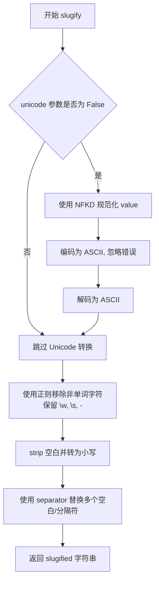

#### 带注释源码

```python
def slugify(value: str, separator: str, unicode: bool = False) -> str:
    """ Slugify a string, to make it URL friendly. """
    # 如果不保留 Unicode，则将扩展拉丁字符转换为 ASCII
    # 例如: 'žlutý' => 'zluty'
    if not unicode:
        # Unicode 规范化形式 D（分解）
        value = unicodedata.normalize('NFKD', value)
        # 转换为 ASCII 字节，忽略无法转换的字符，然后解码回字符串
        value = value.encode('ascii', 'ignore').decode('ascii')
    
    # 移除非单词字符（字母、数字、下划线）、空格、连字符以外的字符
    # strip() 去除首尾空白
    # lower() 转换为小写
    value = re.sub(r'[^\w\s-]', '', value).strip().lower()
    
    # 将一个或多个空白字符或已存在的 separator 替换为统一的 separator
    # 例如: 'hello  world' => 'hello-world' (当 separator='-')
    return re.sub(r'[{}\s]+'.format(separator), separator, value)
```


### `slugify_unicode`

该函数是一个用于生成 URL 友好字符串的辅助函数，它通过调用 `slugify` 函数并显式传入 `unicode=True` 参数，实现在保留 Unicode 字符的前提下将文本转换为 URL 友好的 slug 格式。

参数：

- `value`：`str`，要进行 slugify 处理的原始字符串
- `separator`：`str`，用于替换空格的分隔符（如 `-` 或 `_`）

返回值：`str`，经过 slugify 处理后的字符串，保留 Unicode 字符且符合 URL 命名规范

#### 流程图

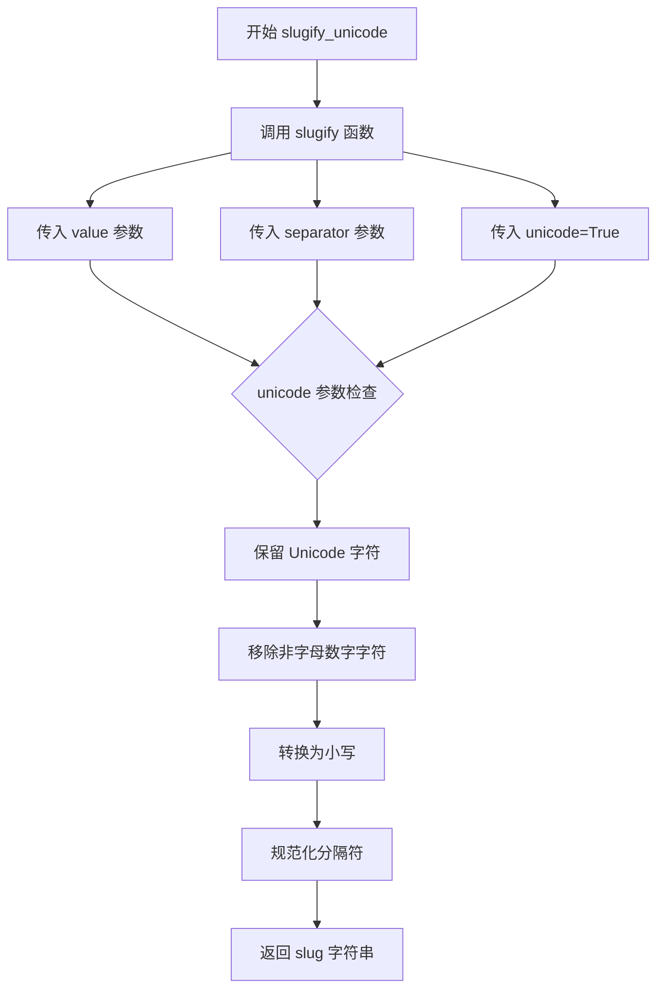

#### 带注释源码

```python
def slugify_unicode(value: str, separator: str) -> str:
    """ Slugify a string, to make it URL friendly while preserving Unicode characters. """
    # 调用核心 slugify 函数，unicode=True 表示保留 Unicode 字符
    # 而非将其转换为 ASCII 字符（如 'žlutý' 保留为 'žlutý' 而非 'zluty'）
    return slugify(value, separator, unicode=True)
```


### `unique(id, ids)`

确保给定的 ID 在 IDs 集合中唯一。如果 ID 已存在或为空，则自动追加数字后缀（如 `_1`, `_2`）直到生成唯一的 ID，然后将新生成的唯一 ID 添加到集合中并返回。

参数：

- `id`：`str`，需要检查唯一性的标识符字符串
- `ids`：`MutableSet[str]`，已使用的标识符集合，用于检查唯一性和存储新生成的 ID

返回值：`str`，确保在集合中唯一的标识符

#### 流程图

```mermaid
graph TD
A[开始: unique] --> B{id 在 ids 中?}
B -->|是| C{id 为空?}
B -->|否| H[将 id 添加到 ids]
C -->|是| D[匹配 id 与正则表达式 IDCOUNT_RE]
C -->|否| D
D --> E{匹配成功?}
E -->|是| F[提取前缀 m.group(1) 和数字 m.group(2)]
E -->|否| I[将 '_1' 添加到 id 末尾]
F[提取前缀和数字] --> G[数字 + 1, 重新拼接为新 id]
I[添加 '_1'] --> J[生成新 id]
G --> J
J --> B
H --> K[返回 id]
```

#### 带注释源码

```python
def unique(id: str, ids: MutableSet[str]) -> str:
    """ Ensure id is unique in set of ids. Append '_1', '_2'... if not """
    # 当 id 已在集合中 或 id 为空时循环生成新 id
    while id in ids or not id:
        # 使用正则表达式匹配 id 是否已有数字后缀
        m = IDCOUNT_RE.match(id)
        if m:
            # 已有后缀如 "header_1", 提取前缀和数字, 数字+1
            id = '%s_%d' % (m.group(1), int(m.group(2)) + 1)
        else:
            # 无后缀, 直接添加 "_1"
            id = '%s_%d' % (id, 1)
    # 循环结束, id 已唯一, 添加到集合
    ids.add(id)
    return id
```

---

#### 设计说明

1. **正则表达式**：`IDCOUNT_RE = re.compile(r'^(.*)_([0-9]+)$')` 用于匹配末尾带有数字的 ID 格式
2. **唯一性保证**：通过 `while` 循环持续检测，直到生成不在集合中的 ID
3. **空 ID 处理**：当传入空字符串时，也会触发循环生成新 ID（如 `"_1"`）
4. **递增策略**：从 `_1` 开始递增，确保始终生成连续的序号


### `get_name`

获取标题名称。该函数已弃用，用于从XML元素中提取文本内容，对`AtomicString`类型的文本进行HTML解码后返回清理后的文本字符串。

参数：

- `el`：`etree.Element`，XML/HTML元素，用于获取其文本内容作为标题名称

返回值：`str`，返回处理后的文本字符串，去除首尾空格

#### 流程图

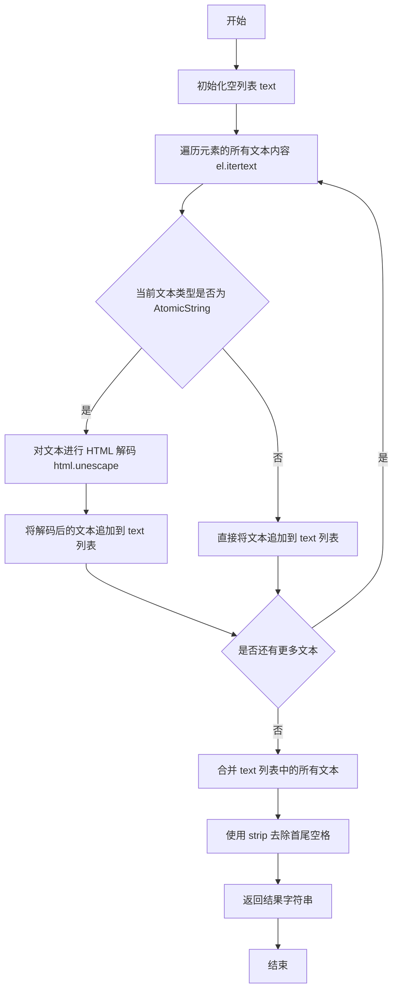

#### 带注释源码

```python
@deprecated('Use `render_inner_html` and `striptags` instead.')
def get_name(el: etree.Element) -> str:
    """Get title name."""
    # 初始化一个空列表用于存储文本片段
    text = []
    
    # 遍历元素的所有文本内容，包括子元素的文本
    for c in el.itertext():
        # 检查当前文本片段是否为 AtomicString 类型
        if isinstance(c, AtomicString):
            # 如果是 AtomicString，进行 HTML 实体解码
            # 例如 &lt; 解码为 <，&amp; 解码为 &
            text.append(html.unescape(c))
        else:
            # 普通文本直接追加到列表中
            text.append(c)
    
    # 合并所有文本片段为一个字符串，并去除首尾空格
    return ''.join(text).strip()
```


### `stashedHTML2text`

从 Markdown 实例的 HTML 占位符存储中提取原始 HTML，将其简化为纯文本，并用处理后的文本替换占位符。

参数：

- `text`：`str`，包含 HTML 占位符的输入文本
- `md`：`Markdown`，Markdown 实例，用于访问 `htmlStash` 获取原始 HTML 块
- `strip_entities`：`bool = True`，是否剥离 HTML 实体（如 `&amp;`、`&#123;` 等）

返回值：`str`，将 HTML 占位符替换为纯文本后的字符串

#### 流程图

```mermaid
flowchart TD
    A[开始: stashedHTML2text] --> B[定义内部函数 _html_sub]
    B --> C[使用 HTML_PLACEHOLDER_RE.sub 替换文本中的占位符]
    C --> D{对每个匹配调用 _html_sub}
    
    D --> E[提取占位符索引: int(m.group(1))]
    E --> F[从 md.htmlStash.rawHtmlBlocks 获取原始 HTML]
    F --> G{获取成功?}
    
    G -->|否| H[返回原始匹配文本]
    G -->|是| I[使用正则 r'<[^>]+>' 移除 HTML 标签]
    I --> J{strip_entities == True?}
    
    J -->|是| K[使用正则 r'&[\#a-zA-Z0-9]+;' 移除 HTML 实体]
    J -->|否| L[跳过实体剥离]
    
    K --> M[返回处理后的纯文本]
    L --> M
    H --> M
    M --> N[返回最终替换后的文本]
    
    style A fill:#f9f,color:#000
    style M fill:#9f9,color:#000
```

#### 带注释源码

```python
@deprecated('Use `render_inner_html` and `striptags` instead.')
def stashedHTML2text(text: str, md: Markdown, strip_entities: bool = True) -> str:
    """
    Extract raw HTML from stash, reduce to plain text and swap with placeholder.
    
    该函数已被弃用，建议使用 render_inner_html 和 striptags 代替。
    它用于处理 Markdown 中被替换为占位符的原始 HTML，将其还原为纯文本。
    
    参数:
        text: 包含 HTML 占位符的输入文本
        md: Markdown 实例，用于访问 htmlStash
        strip_entities: 是否剥离 HTML 实体，默认为 True
    
    返回:
        将占位符替换为纯文本后的字符串
    """
    
    def _html_sub(m: re.Match[str]) -> str:
        """
        内部函数：替代函数，用于处理每个 HTML 占位符匹配
        
        参数:
            m: 正则表达式匹配对象，包含占位符的索引信息
        
        返回:
            处理后的纯文本
        """
        try:
            # 从 Markdown 实例的 htmlStash 中获取原始 HTML 块
            # 占位符格式通常为 HTML_PLACEHOLDER（如 <!-- markdown-XXX -->）
            # 其中 XXX 是原始 HTML 块在 rawHtmlBlocks 列表中的索引
            raw = md.htmlStash.rawHtmlBlocks[int(m.group(1))]
        except (IndexError, TypeError):  # pragma: no cover
            # 如果索引无效或类型错误，返回原始匹配文本（不做处理）
            return m.group(0)
        
        # 移除 HTML 标签，留下文本内容
        # 正则 r'(<[^>]+>)' 匹配所有 HTML 标签
        res = re.sub(r'(<[^>]+>)', '', raw)
        
        # 如果 strip_entities 为 True，则移除 HTML 实体
        # HTML 实体格式如 &amp; &#123; &#xABC; 等
        if strip_entities:
            res = re.sub(r'(&[\#a-zA-Z0-9]+;)', '', res)
        
        return res

    # 使用正则表达式替换文本中的所有 HTML 占位符
    # HTML_PLACEHOLDER_RE 用于匹配占位符模式
    return HTML_PLACEHOLDER_RE.sub(_html_sub, text)
```


### `unescape`

取消转义 Markdown 中使用反斜杠转义的文本，通过实例化 `UnescapeTreeprocessor` 类并调用其 `unescape` 方法来实现。

参数：

- `text`：`str`，需要处理的文本

返回值：`str`，处理后的文本

#### 流程图

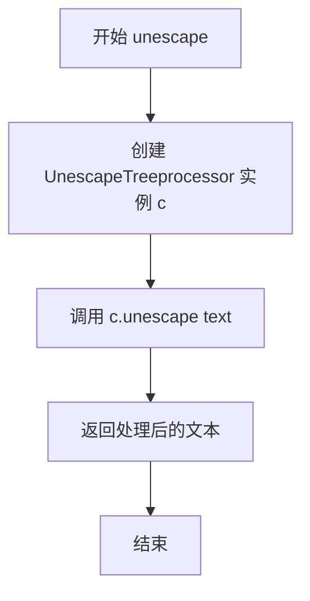

#### 带注释源码

```python
def unescape(text: str) -> str:
    """ Unescape Markdown backslash escaped text. """
    # 实例化 UnescapeTreeprocessor 类
    # 该类来自 markdown 核心库，负责处理 Markdown 转义序列
    c = UnescapeTreeprocessor()
    # 调用实例的 unescape 方法处理输入文本
    # 返回取消转义后的文本
    return c.unescape(text)
```


### `strip_tags(text)`

该函数用于从给定的HTML文本中移除所有HTML标签和注释，并返回纯文本内容。特别注意：HTML实体（如`&nbsp;`）将不会被转换或移除。

参数：

- `text`：`str`，需要处理的包含HTML标签的文本字符串

返回值：`str`，去除HTML标签和注释后的纯文本字符串

#### 流程图

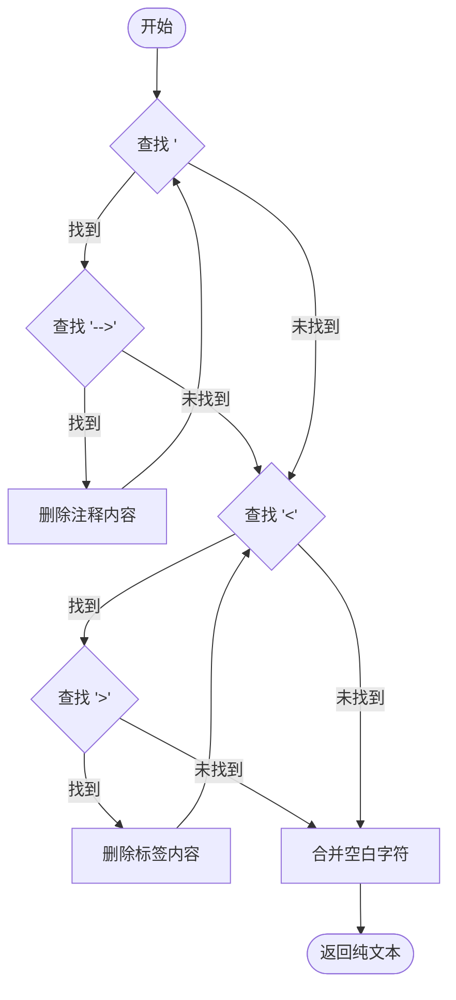

#### 带注释源码

```python
def strip_tags(text: str) -> str:
    """ Strip HTML tags and return plain text. Note: HTML entities are unaffected. """
    # A comment could contain a tag, so strip comments first
    # 首先处理HTML注释，因为注释内部可能包含标签
    while (start := text.find('<!--')) != -1 and (end := text.find('-->', start)) != -1:
        # 移除注释内容（包括注释标记本身）
        text = f'{text[:start]}{text[end + 3:]}'

    # 然后移除所有HTML标签
    # 使用find方法逐个查找标签的起始和结束位置
    while (start := text.find('<')) != -1 and (end := text.find('>', start)) != -1:
        # 移除从'<'到'>'的整个标签内容
        text = f'{text[:start]}{text[end + 1:]}'

    # Collapse whitespace
    # 将连续的空白字符（空格、换行、制表符等）合并为单个空格
    text = ' '.join(text.split())
    return text
```


### `escape_cdata`

该函数用于转义 XML/HTML 特殊字符（&、<、>），将可能干扰 XML/HTML 解析的字符转换为安全的形式，防止注入攻击或解析错误。

参数：

- `text`：`str`，需要转义处理的原始文本字符串

返回值：`str`，转义处理后的安全文本字符串

#### 流程图

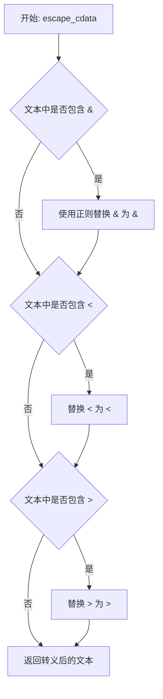

#### 带注释源码

```python
def escape_cdata(text: str) -> str:
    """ Escape character data. """
    # 检查是否存在 & 符号，需要特殊处理以避免误转义已存在的实体
    if "&" in text:
        # Only replace & when not part of an entity
        # 使用预定义的正则表达式 RE_AMP 替换独立的 & 符号
        # 避免将已存在的 HTML 实体（如 &nbsp;）错误地转换为 &amp;nbsp;
        text = RE_AMP.sub('&amp;', text)
    
    # 检查是否存在 < 符号，这是 XML/HTML 的标签开始符
    if "<" in text:
        # 替换为 XML 实体引用，防止被解析为标签
        text = text.replace("<", "&lt;")
    
    # 检查是否存在 > 符号，这是 XML/HTML 的标签结束符
    if ">" in text:
        # 替换为 XML 实体引用，防止被解析为标签
        text = text.replace(">", "&gt;")
    
    # 返回完成转义的文本
    return text
```


### `run_postprocessors`

运行 Markdown 实例的 postprocessors 对文本进行处理。

参数：

- `text`：`str`，需要处理的文本
- `md`：`Markdown`，Markdown 实例，包含已注册的 postprocessors

返回值：`str`，经过所有 postprocessor 处理并去除首尾空白后的文本

#### 流程图

```mermaid
flowchart TD
    A[开始] --> B[遍历 md.postprocessors]
    B --> C{postprocessors 中还有未处理的吗?}
    C -->|是| D[获取下一个 postprocessor pp]
    D --> E[text = pp.run&#40;text&#41;]
    E --> C
    C -->|否| F[返回 text.strip&#40;&#41;]
    F --> G[结束]
```

#### 带注释源码

```python
def run_postprocessors(text: str, md: Markdown) -> str:
    """ Run postprocessors from Markdown instance on text. """
    # 遍历 Markdown 实例中注册的所有 postprocessors
    for pp in md.postprocessors:
        # 每个 postprocessor 的 run 方法处理文本
        text = pp.run(text)
    # 返回处理后的文本，并去除首尾空白
    return text.strip()
```


### `render_inner_html`

该函数是 Python-Markdown TOC 扩展的核心工具函数之一，负责将给定的 XML 元素（`etree.Element`）的内部内容（innerHTML）完全渲染为纯文本字符串。它首先将元素序列化为 HTML 字符串，处理转义字符，去除最外层标签，最后通过 Markdown 实例的后处理器（Postprocessors）处理占位符（如脚注、注释等），确保返回的内容是最终渲染状态。

#### 参数

- `el`：`etree.Element`，待渲染内部的 XML 元素。
- `md`：`Markdown`（类型提示为 `Markdown`），Markdown 实例，用于调用序列化和后处理器。

#### 返回值

- `str`，返回处理后的元素内部 HTML 文本。

#### 流程图

```mermaid
flowchart TD
    A[Start render_inner_html] --> B[Call md.serializer(el)]
    B --> C[Get full HTML string: e.g., '<h1>Title</h1>']
    C --> D[Call unescape on string]
    D --> E[Strip parent tag]
    E --> F[Find first '>' and last '<']
    F --> G[Extract content between tags]
    G --> H[Call run_postprocessors]
    H --> I[Process placeholders/extensions]
    I --> J[Return final string]
```

#### 带注释源码

```python
def render_inner_html(el: etree.Element, md: Markdown) -> str:
    """ Fully render inner html of an `etree` element as a string. """
    # The `UnescapeTreeprocessor` runs after `toc` extension so run here.
    # 首先调用 Markdown 实例的 serializer 将 etree 元素序列化为字符串
    # 例如：<h1 id="title">Hello <b>World</b></h1>
    text = unescape(md.serializer(el))

    # strip parent tag
    # 去除最外层的标签，只保留 innerHTML
    # 找到第一个 '>' 的位置，截取其后的内容
    start = text.index('>') + 1
    # 找到最后一个 '<' 的位置，截取其前的内容
    end = text.rindex('<')
    # 去除首尾空白
    text = text[start:end].strip()

    # 运行 Markdown 的后处理器
    # 这是一个关键步骤，用于处理如 HTML Stash (占位符)、注释等在早期阶段生成的临时标记
    # 确保返回的文本是经过了所有 Pipeline 处理的最终结果
    return run_postprocessors(text, md)
```


### `remove_fnrefs`

该函数用于从元素树中移除脚注引用（footnote references），通过深度复制原始元素避免直接修改输入，并处理被移除元素的尾部文本（tail text）以保持文档结构完整性。

参数：

- `root`：`etree.Element`，需要处理的XML/HTML元素树的根节点

返回值：`etree.Element`，移除脚注引用后的元素副本

#### 流程图

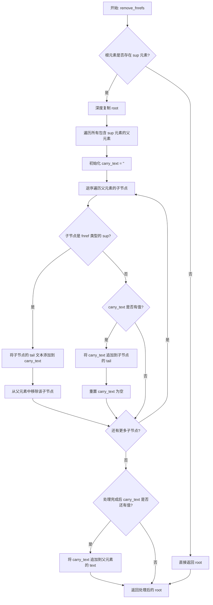

#### 带注释源码

```python
def remove_fnrefs(root: etree.Element) -> etree.Element:
    """ Remove footnote references from a copy of the element, if any are present. """
    # 脚注引用格式示例: `<sup id="fnref:1">...</sup>`
    # 如果没有 sup 元素，则直接返回原根元素，无需处理
    if next(root.iter('sup'), None) is None:
        return root
    
    # 使用 deepcopy 创建根元素的深拷贝，避免修改原始输入
    root = deepcopy(root)
    
    # 查找所有包含 sup 元素的父元素（通过 XPath './/sup/..'）
    for parent in root.findall('.//sup/..'):
        # 用于暂存被移除 sup 元素的 tail 文本
        carry_text = ""
        
        # 逆序遍历子节点，以便在迭代过程中安全地进行删除操作
        for child in reversed(parent):
            # 检查子节点是否为 sup 标签且 id 以 'fnref' 开头（脚注引用标记）
            if child.tag == 'sup' and child.get('id', '').startswith('fnref'):
                # 将当前 sup 元素的 tail 文本与之前的 carry_text 拼接
                carry_text = f'{child.tail or ""}{carry_text}'
                # 从父元素中移除该脚注引用节点
                parent.remove(child)
            elif carry_text:
                # 将累积的 carry_text 追加到当前非 sup 子元素的 tail
                child.tail = f'{child.tail or ""}{carry_text}'
                # 重置 carry_text，因为已处理完毕
                carry_text = ""
        
        # 如果循环结束后仍有未处理的 carry_text，追加到父元素的 text
        if carry_text:
            parent.text = f'{parent.text or ""}{carry_text}'
    
    # 返回处理后的元素树副本
    return root
```


### `nest_toc_tokens`

该函数接收一个扁平的 TOC（Table of Contents）标记列表，根据每个标记的 `level` 字段将其递归嵌套为树形结构，同时处理乱序和跳跃级别的边界情况，最终返回带有 `children` 属性的嵌套列表。

参数：

- `toc_list`：`list`，包含多个字典的列表，每个字典必须包含 `level` 键（整数类型），可能包含 `id`、`name` 等键，用于表示 TOC 标题的级别和元数据

返回值：`list`，返回嵌套后的列表，每个元素是一个字典，额外包含 `children` 键（类型为 `list`），用于存储子级 TOC 标记

#### 流程图

```mermaid
flowchart TD
    A[开始] --> B{检查 toc_list 是否为空}
    B -->|是| C[返回空列表 []]
    B -->|否| D[弹出第一个元素 last]
    D --> E[初始化 levels = [last['level']]]
    E --> F[初始化 parents = []]
    F --> G{检查 toc_list 是否为空}
    G -->|否| H[弹出下一个元素 t]
    H --> I[获取 current_level = t['level']]
    I --> J{current_level < levels[-1]?}
    J -->|是| K[从 levels 弹出最后一个元素]
    K --> L[遍历 parents 反向查找需要弹出的元素数量 to_pop]
    L --> M{to_pop > 0?}
    M -->|是| N[弹出对应数量的 levels 和 parents]
    M -->|否| O[将 current_level 加入 levels]
    J -->|否| P{current_level == levels[-1]?}
    P -->|是| Q[将 t 加入 parents[-1]['children'] 或 ordered_list]
    P -->|否| R[将 t 加入 last['children']]
    R --> S[将 last 加入 parents]
    S --> T[将 current_level 加入 levels]
    Q --> G
    O --> G
    G -->|是| U[返回 ordered_list]
```

#### 带注释源码

```python
def nest_toc_tokens(toc_list):
    """Given an unsorted list with errors and skips, return a nested one.

        [{'level': 1}, {'level': 2}]
        =>
        [{'level': 1, 'children': [{'level': 2, 'children': []}]}]

    A wrong list is also converted:

        [{'level': 2}, {'level': 1}]
        =>
        [{'level': 2, 'children': []}, {'level': 1, 'children': []}]
    """

    # 初始化结果列表
    ordered_list = []
    
    # 检查输入列表是否为空
    if len(toc_list):
        # 通过处理第一个条目来初始化所有变量
        # 注意：这里会修改原始列表，弹出第一个元素
        last = toc_list.pop(0)
        # 为每个条目添加 children 键，用于存储子级
        last['children'] = []
        # levels 列表用于追踪当前嵌套深度对应的级别
        levels = [last['level']]
        ordered_list.append(last)
        # parents 列表用于追踪当前的所有父级条目
        parents = []

        # 遍历剩余条目，正确嵌套它们
        while toc_list:
            # 弹出当前处理的条目
            t = toc_list.pop(0)
            current_level = t['level']
            t['children'] = []

            # 如果当前级别小于最后一个条目的级别，则减少深度
            if current_level < levels[-1]:
                # 由于我们知道当前级别小于最后一个级别，弹出最后一个级别
                levels.pop()

                # 弹出我们小于或等于的父级和级别
                to_pop = 0
                # 反向遍历父级，找出需要弹出的数量
                for p in reversed(parents):
                    if current_level <= p['level']:
                        to_pop += 1
                    else:  # pragma: no cover
                        break
                # 如果有需要弹出的元素
                if to_pop:
                    # 截取列表，去除最后 to_pop 个元素
                    levels = levels[:-to_pop]
                    parents = parents[:-to_pop]

                # 将当前级别记录为最后一个
                levels.append(current_level)

            # 级别相同，所以追加到当前父级（如果有）
            if current_level == levels[-1]:
                # 如果有父级则加入父级的 children，否则加入主列表
                (parents[-1]['children'] if parents
                 else ordered_list).append(t)

            # 当前级别大于最后一个条目的级别，
            # 所以将最后一个条目作为父级并将当前条目作为子级
            else:
                last['children'].append(t)
                parents.append(last)
                levels.append(current_level)
            
            # 更新 last 为当前处理的条目 t，供下次循环使用
            last = t

    # 返回嵌套有序列表
    return ordered_list
```


### `makeExtension`

该函数是 Python-Markdown TOC（Table of Contents）扩展的工厂函数，用于根据传入的配置参数创建并返回一个 `TocExtension` 实例，从而为 Markdown 文档启用目录生成功能。

参数：

- `**kwargs`：`任意类型（字典）`，可选配置参数，将直接传递给 `TocExtension` 构造函数，用于定制 TOC 的行为，如标记符、标题、锚点链接、永久链接等配置项。

返回值：`TocExtension`，返回一个新创建的 TOC 扩展实例，该实例注册到 Markdown 处理器后可以解析文档中的 `[TOC]` 标记并生成目录。

#### 流程图

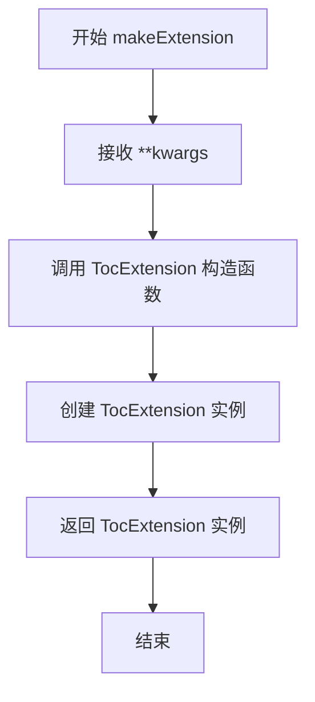

#### 带注释源码

```python
def makeExtension(**kwargs):  # pragma: no cover
    """
    创建并返回一个 TocExtension 实例。
    
    这是 Python-Markdown 扩展的入口点函数，用于将 TOC 扩展
    注册到 Markdown 处理器中。
    
    参数:
        **kwargs: 任意关键字参数，将传递给 TocExtension 构造函数
                 用于配置 TOC 的行为（如 marker, title, toc_class 等）
    
    返回值:
        TocExtension: TOC 扩展的实例，可用于注册到 Markdown 处理器
    """
    return TocExtension(**kwargs)
```


### `TocTreeprocessor.__init__`

该方法是 `TocTreeprocessor` 类的构造函数，负责初始化目录生成所需的各种配置参数，包括标记符、标题、层级、锚点链接、永久链接等选项，并从配置字典中提取相应值赋给实例属性。

参数：

- `md`：`Markdown`，Markdown 实例对象，用于访问 Markdown 的配置和处理器
- `config`：`dict[str, Any]`，包含目录扩展配置选项的字典，如标记符、标题、锚点链接等

返回值：`None`，该方法为构造函数，不返回任何值

#### 流程图

```mermaid
flowchart TD
    A[开始 __init__] --> B[调用父类 Treeprocessor 构造函数]
    B --> C[从 config 提取 marker 并赋值给 self.marker]
    C --> D[从 config 提取 title 并赋值给 self.title]
    D --> E[提取 baselevel 并减1赋值给 self.base_level]
    E --> F[提取 slugify 函数并赋值给 self.slugify]
    F --> G[提取 separator 并赋值给 self.sep]
    G --> H[提取 toc_class 并赋值给 self.toc_class]
    H --> I[提取 title_class 并赋值给 self.title_class]
    I --> J[提取 anchorlink 转换为布尔值赋值给 self.use_anchors]
    J --> K[提取 anchorlink_class 并赋值给 self.anchorlink_class]
    K --> L[提取 permalink 转换为布尔值赋值给 self.use_permalinks]
    L --> M{self.use_permalinks 是否为 None}
    M -->|是| N[使用原始 config['permalink'] 值]
    M -->|否| O[保持解析后的值]
    N --> O
    O --> P[提取 permalink_class 并赋值给 self.permalink_class]
    P --> Q[提取 permalink_title 并赋值给 self.permalink_title]
    Q --> R[提取 permalink_leading 转换为布尔值赋值给 self.permalink_leading]
    R --> S[编译 header_rgx 正则表达式匹配 h1-h6]
    S --> T{config['toc_depth'] 是否为字符串且包含'-'}
    T -->|是| U[解析为两个整数 toc_top 和 toc_bottom]
    T -->|否| V[设置 toc_top=1, toc_bottom 为整数]
    U --> W[结束 __init__]
    V --> W
```

#### 带注释源码

```python
def __init__(self, md: Markdown, config: dict[str, Any]):
    """ 初始化 TocTreeprocessor，设置目录生成所需的各种配置选项 """
    # 调用父类 Treeprocessor 的构造函数进行初始化
    super().__init__(md)

    # 从配置字典中提取标记符，用于标识目录插入位置
    self.marker: str = config["marker"]
    # 提取目录标题
    self.title: str = config["title"]
    # 提取基础级别并减1（因为HTML标题从0开始计算）
    self.base_level = int(config["baselevel"]) - 1
    # 提取用于生成锚点slug的函数
    self.slugify = config["slugify"]
    # 提取分隔符用于slugify
    self.sep = config["separator"]
    # 提取目录容器的CSS类名
    self.toc_class = config["toc_class"]
    # 提取标题的CSS类名
    self.title_class: str = config["title_class"]
    # 解析是否使用锚点链接的布尔值
    self.use_anchors: bool = parseBoolValue(config["anchorlink"])
    # 提取锚点链接的CSS类名
    self.anchorlink_class: str = config["anchorlink_class"]
    # 解析是否使用永久链接的布尔值，默认False
    self.use_permalinks = parseBoolValue(config["permalink"], False)
    # 如果解析结果为None，则使用原始配置值
    if self.use_permalinks is None:
        self.use_permalinks = config["permalink"]
    # 提取永久链接的CSS类名
    self.permalink_class: str = config["permalink_class"]
    # 提取永久链接的title属性
    self.permalink_title: str = config["permalink_title"]
    # 解析永久链接是否前置的布尔值
    self.permalink_leading: bool | None = parseBoolValue(config["permalink_leading"], False)
    # 编译正则表达式用于匹配HTML标题标签 h1-h6
    self.header_rgx = re.compile("[Hh][123456]")
    # 处理目录深度配置，支持范围格式如 '2-5'
    if isinstance(config["toc_depth"], str) and '-' in config["toc_depth"]:
        # 解析范围字符串为两个整数
        self.toc_top, self.toc_bottom = [int(x) for x in config["toc_depth"].split('-')]
    else:
        # 默认从h1开始，包含到指定级别
        self.toc_top = 1
        self.toc_bottom = int(config["toc_depth"])
```


### `TocTreeprocessor.iterparent`

这是一个迭代器方法，用于遍历 XML 元素树，生成所有符合条件的 (父元素, 子元素) 对。该方法过滤掉标题元素以及 `<pre>` 和 `<code>` 标签，以防止在已生成的 TOC 内放置新 TOC 标记时产生无限循环。

参数：

- `node`：`etree.Element`，要迭代的 XML 元素节点

返回值：`Iterator[tuple[etree.Element, etree.Element]]`，一个迭代器，返回 (父元素, 子元素) 的元组

#### 流程图

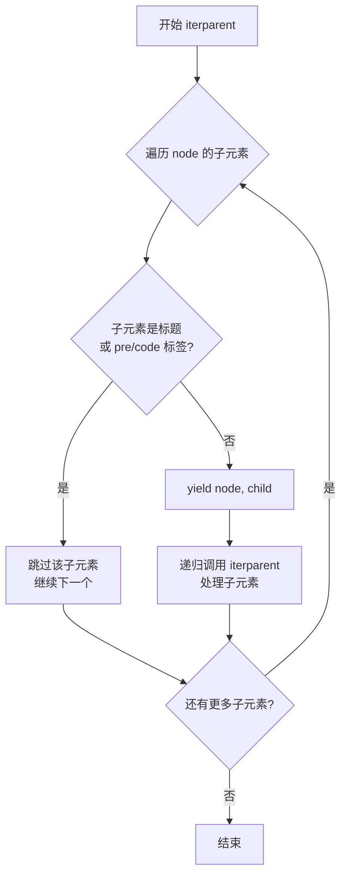

#### 带注释源码

```python
def iterparent(self, node: etree.Element) -> Iterator[tuple[etree.Element, etree.Element]]:
    """ Iterator wrapper to get allowed parent and child all at once. """

    # We do not allow the marker inside a header as that
    # would causes an endless loop of placing a new TOC
    # inside previously generated TOC.
    for child in node:
        # 如果子元素不是标题元素（通过 header_rgx 匹配）且不是 pre 或 code 标签
        if not self.header_rgx.match(child.tag) and child.tag not in ['pre', 'code']:
            # yield 当前父节点和子节点
            yield node, child
            # 递归遍历子元素的子元素
            yield from self.iterparent(child)
```


### `TocTreeprocessor.replace_marker`

该方法用于在 Markdown 文档解析后的 HTML 元素树中查找包含 TOC 标记（如 `[TOC]`）的段落元素（`<p>`），并将其替换为目录内容的 HTML 元素。这是 TOC 扩展将用户插入的标记转换为实际目录结构的核心逻辑。

参数：

- `root`：`etree.Element`，HTML 元素树的根节点，用于遍历查找标记
- `elem`：`etree.Element`，生成的 TOC 目录元素，将用于替换标记位置

返回值：`None`，该方法直接修改元素树，无返回值

#### 流程图

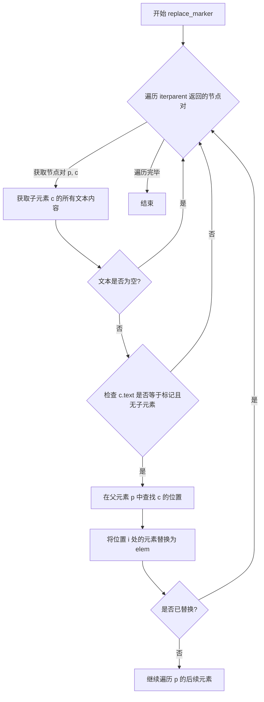

#### 带注释源码

```python
def replace_marker(self, root: etree.Element, elem: etree.Element) -> None:
    """ Replace marker with elem. """
    # 遍历文档树，使用 iterparent 迭代器获取所有(父元素, 子元素)对
    for (p, c) in self.iterparent(root):
        # 获取子元素的全部文本内容（包括子元素文本和尾部文本），去除首尾空白
        text = ''.join(c.itertext()).strip()
        
        # 如果文本为空，跳过当前元素（可能是空段落）
        if not text:
            continue

        # 为了防止输出验证失败（<div> 放在 <p> 内会导致验证错误），
        # 这里实际上是替换整个 <p> 元素，而不是仅仅替换其内容

        # <p> 元素可能包含多个文本内容（nl2br 可能会插入 <br> 标签）
        # 这种情况下，c.text 只返回第一个内容，忽略子元素内容或尾部内容
        # len(c) == 0 确保 <p> 元素内只有文本，没有子元素
        if c.text and c.text.strip() == self.marker and len(c) == 0:
            # 遍历父元素的所有子元素，找到目标子元素的位置
            for i in range(len(p)):
                if p[i] == c:
                    # 用 TOC 元素替换该位置的元素
                    p[i] = elem
                    break
```


### `TocTreeprocessor.set_level`

该方法用于根据配置的基础级别（base_level）调整HTML标题元素的层级，将h1-h6的标签修改为对应的目标级别，以确保TOC中的标题层级符合用户配置。

参数：

- `elem`：`etree.Element`，要调整层级的HTML标题元素（如h1、h2等）

返回值：`None`，无返回值（直接修改传入的元素对象）

#### 流程图

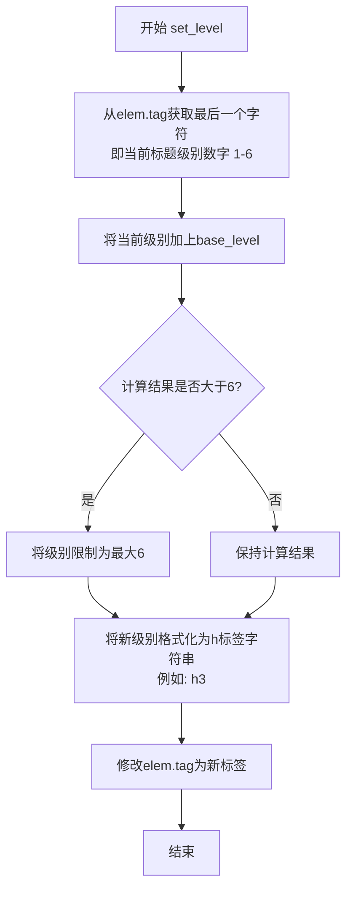

#### 带注释源码

```python
def set_level(self, elem: etree.Element) -> None:
    """ Adjust header level according to base level. """
    # 从HTML标签字符串（如'h1', 'h2'）中提取最后一个字符得到数字
    # 例如：'h1' -> 1, 'h3' -> 3
    level = int(elem.tag[-1]) + self.base_level
    
    # HTML标准只支持h1到h6，如果计算结果超过6则限制为6
    if level > 6:
        level = 6
    
    # 将新的级别数字转换为HTML标签字符串并更新元素标签
    # 例如：level=3 -> 'h3'
    elem.tag = 'h%d' % level
```


### `TocTreeprocessor.add_anchor`

为标题元素添加一个锚点链接，使其可以通过点击标题文本跳转到对应的目录项。

参数：

- `c`：`etree.Element`，需要添加锚点链接的标题元素（h1-h6）
- `elem_id`：`str`，锚点链接对应的目标元素 ID

返回值：`None`，该方法直接修改传入的元素对象，不返回值

#### 流程图

```mermaid
flowchart TD
    A[开始 add_anchor] --> B[创建新 &lt;a&gt; 元素 anchor]
    B --> C[将 c.text 复制到 anchor.text]
    C --> D[设置 anchor.href = "#" + elem_id]
    D --> E[设置 anchor.class = self.anchorlink_class]
    E --> F[清空 c.text = ""]
    F --> G[遍历 c 的所有子元素]
    G --> H{还有子元素?}
    H -->|是| I[将子元素添加到 anchor]
    H -->|否| J[清空 c 的所有子元素]
    I --> G
    J --> K[将 anchor 添加到 c]
    K --> L[结束]
```

#### 带注释源码

```python
def add_anchor(self, c: etree.Element, elem_id: str) -> None:
    """
    为标题元素添加锚点链接。
    
    该方法将标题元素转换为一个包含锚点链接的容器，
    使目录中的链接可以跳转到对应的标题位置。
    
    参数:
        c: etree.Element - 要添加锚点的标题元素 (h1-h6)
        elem_id: str - 锚点链接的目标ID
    返回:
        None - 直接修改传入的 Element 对象
    """
    
    # 1. 创建新的 <a> 锚点元素
    anchor = etree.Element("a")
    
    # 2. 将原标题的文本内容复制到锚点中
    anchor.text = c.text
    
    # 3. 设置锚点的 href 属性为 "#" + elem_id，形成页面内跳转
    anchor.attrib["href"] = "#" + elem_id
    
    # 4. 设置锚点的 CSS 类，用于样式控制
    anchor.attrib["class"] = self.anchorlink_class
    
    # 5. 清空原标题的文本内容（因为已转移到锚点中）
    c.text = ""
    
    # 6. 将原标题的所有子元素移动到锚点元素中
    #    这样嵌套的内容（如加粗、斜体等）也会被包含在链接内
    for elem in c:
        anchor.append(elem)
    
    # 7. 清空原标题的所有子元素
    while len(c):
        c.remove(c[0])
    
    # 8. 将创建好的锚点添加到原标题元素中
    #    此时 c 的结构变为: <hX><a>text + children</a></hX>
    c.append(anchor)
```


### `TocTreeprocessor.add_permalink`

该方法用于为文档标题（header）添加永久链接（permalink）元素。它创建一个 `<a>` 标签，根据配置设置其文本、href、class 和 title 属性，并将其插入到 header 元素的开头或末尾。

参数：

- `c`：`etree.Element`，要添加永久链接的目标 header 元素
- `elem_id`：`str`，header 元素的唯一标识符，用于构建永久链接的 href 属性

返回值：`None`，该方法直接修改传入的 XML 元素，不返回任何值

#### 流程图

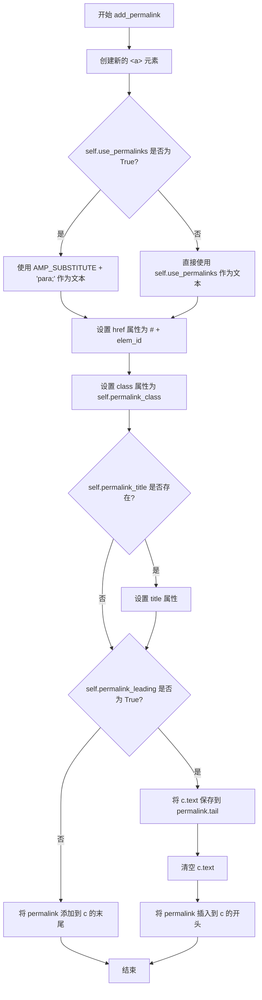

#### 带注释源码

```python
def add_permalink(self, c: etree.Element, elem_id: str) -> None:
    """为 header 元素添加永久链接。
    
    Args:
        c: 要添加永久链接的 header 元素 (h1-h6)
        elem_id: header 元素的唯一标识符
    """
    # 创建一个新的 <a> 元素作为永久链接
    permalink = etree.Element("a")
    
    # 根据配置设置永久链接的文本内容
    # 如果 use_permalinks 为 True，则使用 AMP_SUBSTITUTE 替换 & 符号
    # 否则直接使用配置的值（可以是布尔值或自定义字符串）
    permalink.text = ("%spara;" % AMP_SUBSTITUTE
                      if self.use_permalinks is True
                      else self.use_permalinks)
    
    # 设置 href 属性，指向目标 header
    permalink.attrib["href"] = "#" + elem_id
    
    # 设置 CSS 类名
    permalink.attrib["class"] = self.permalink_class
    
    # 如果配置了永久链接的 title 属性，则添加到元素上
    if self.permalink_title:
        permalink.attrib["title"] = self.permalink_title
    
    # 根据 permalink_leading 配置决定插入位置
    if self.permalink_leading:
        # 插入到开头：将原始 header 文本保存到 permalink 的 tail
        # 这样永久链接显示在标题前面，后面跟随原始标题文本
        permalink.tail = c.text
        c.text = ""  # 清空原始文本
        c.insert(0, permalink)  # 插入到第一个位置
    else:
        # 插入到末尾：直接作为最后一个子元素追加
        c.append(permalink)
```


### `TocTreeprocessor.build_toc_div`

该方法接收一个嵌套的TOC（目录）列表，根据配置信息和列表内容构建包含目录的HTML div元素，并支持可选的 prettify 格式化处理。

参数：

- `toc_list`：`list`，嵌套的TOC条目列表，每个条目包含 `level`、`id`、`name`、`children` 等字段

返回值：`etree.Element`，返回包含完整TOC结构的 `<div>` 元素

#### 流程图

```mermaid
flowchart TD
    A[开始 build_toc_div] --> B[创建 div 元素并设置 toc_class]
    B --> C{self.title 是否存在?}
    C -->|是| D[创建 span 元素作为标题]
    D --> E[设置标题文本和 title_class]
    C -->|否| F[调用 build_etree_ul 递归构建列表]
    F --> G[遍历 toc_list]
    G --> H[为每个条目创建 li 元素]
    H --> I[创建 a 元素设置链接文本和 href]
    I --> J{条目是否有 children?}
    J -->|是| K[递归调用 build_etree_ul 处理子元素]
    J -->|否| L[继续下一个条目]
    K --> L
    L --> G
    G --> M{ prettify 处理器是否注册?}
    M -->|是| N[运行 prettify.run 格式化 div]
    M -->|否| O[返回构建好的 div 元素]
    N --> O
```

#### 带注释源码

```python
def build_toc_div(self, toc_list: list) -> etree.Element:
    """ Return a string div given a toc list. """
    # 创建最外层的 div 元素，并设置 toc_class 属性
    div = etree.Element("div")
    div.attrib["class"] = self.toc_class

    # 检查配置中是否设置了标题，如有则添加标题到 div 中
    if self.title:
        # 创建 span 元素作为标题容器
        header = etree.SubElement(div, "span")
        # 如果配置了 title_class，则添加到 span 元素上
        if self.title_class:
            header.attrib["class"] = self.title_class
        # 设置标题文本内容
        header.text = self.title

    # 定义内部递归函数，用于构建嵌套的无序列表结构
    def build_etree_ul(toc_list: list, parent: etree.Element) -> etree.Element:
        # 为当前父元素创建 ul 元素
        ul = etree.SubElement(parent, "ul")
        # 遍历 TOC 列表中的每个条目
        for item in toc_list:
            # 为每个条目创建 li 元素
            li = etree.SubElement(ul, "li")
            # 创建 a 元素作为链接
            link = etree.SubElement(li, "a")
            # 设置链接文本（目录项名称）
            link.text = item.get('name', '')
            # 设置链接 href 属性指向对应标题
            link.attrib["href"] = '#' + item.get('id', '')
            # 如果条目有子条目（children），递归构建嵌套列表
            if item['children']:
                build_etree_ul(item['children'], li)
        return ul

    # 调用递归函数构建 TOC 的列表结构
    build_etree_ul(toc_list, div)

    # 检查是否注册了 prettify 树处理器，如有则运行格式化
    if 'prettify' in self.md.treeprocessors:
        self.md.treeprocessors['prettify'].run(div)

    # 返回构建完成的 div 元素
    return div
```


### `TocTreeprocessor.run`

该方法是 Python-Markdown TOC 扩展的核心处理器，负责遍历 Markdown 文档的抽象语法树（AST），识别标题元素，生成唯一的锚点ID，提取标题文本构建目录结构，并将生成的目录（TOC）HTML 插入到文档中标记的位置。

参数：

- `doc`：`etree.Element`，Markdown 文档的根元素（XML/HTML 树），代表整个需要处理的文档内容。

返回值：`None`。该方法通过修改 `doc` 树和 `self.md` 对象的状态来产生副作用，不返回具体值。

#### 流程图

```mermaid
flowchart TD
    A([开始 run]) --> B[收集已有ID: 遍历doc树, 将所有id加入used_ids]
    B --> C{遍历 doc 树寻找 header}
    C -->|找到 h1-h6| D[set_level: 调整标题层级]
    D --> E[render_inner_html: 渲染内部HTML]
    E --> F[strip_tags: 提取纯文本名称]
    F --> G{检查是否有预置ID}
    G -->|无 ID| H[unique + slugify: 生成唯一ID]
    G -->|有 ID| I[保留原ID]
    H --> J[处理 data-toc-label 属性]
    J --> K{检查TOC深度范围}
    K -->|在范围内| L[添加信息到 toc_tokens]
    K -->|不在范围| C
    L --> M{是否需要锚点}
    M -->|是| N[add_anchor: 添加目录内锚点]
    M -->|否| O{是否需要永久链接}
    N --> O
    O -->|是| P[add_permalink: 添加页内锚点]
    O -->|否| C
    C -->|遍历结束| Q[nest_toc_tokens: 嵌套列表]
    Q --> R[build_toc_div: 生成TOC HTML结构]
    R --> S{是否存在替换标记}
    S -->|是| T[replace_marker: 替换 [TOC] 标记]
    S -->|否| U
    T --> U[序列化TOC并运行后处理器]
    U --> V[保存结果到 self.md.toc 和 self.md.toc_tokens]
    V --> Z([结束])
```

#### 带注释源码

```python
def run(self, doc: etree.Element) -> None:
    # 1. 收集文档中已有的所有 ID，防止 TOC 生成的链接冲突
    used_ids = set()
    for el in doc.iter():
        if "id" in el.attrib:
            used_ids.add(el.attrib["id"])

    # 用于存储最终 TOC 数据的列表
    toc_tokens = []
    
    # 2. 遍历文档树，查找所有标题元素 (h1-h6)
    for el in doc.iter():
        # 检查标签是否为标题且是字符串类型（避免处理注释等）
        if isinstance(el.tag, str) and self.header_rgx.match(el.tag):
            
            # 2.1 调整标题级别 (根据 baselevel)
            self.set_level(el)
            
            # 2.2 渲染标题内部 HTML (处理转义、实体等)
            innerhtml = render_inner_html(remove_fnrefs(el), self.md)
            
            # 2.3 剥离 HTML 标签，获取纯文本作为目录项名称
            name = strip_tags(innerhtml)

            # 2.4 为标题生成唯一 ID
            # 如果没有预定义 ID，则根据名称生成
            if "id" not in el.attrib:
                # 使用 slugify 生成 URL 友好字符串，并确保唯一性
                el.attrib["id"] = unique(self.slugify(html.unescape(name), self.sep), used_ids)

            # 2.5 处理 data-toc-label 属性（允许自定义目录显示文本）
            data_toc_label = ''
            if 'data-toc-label' in el.attrib:
                # 运行后处理器以还原 Markdown 语法
                data_toc_label = run_postprocessors(unescape(el.attrib['data-toc-label']), self.md)
                # 用 sanitize 后的 label 覆盖显示名称
                name = escape_cdata(strip_tags(data_toc_label))
                # 删除该属性，因为它只在处理时有用
                del el.attrib['data-toc-label']

            # 2.6 过滤并收集符合条件的标题
            # 检查当前标题级别是否在配置的深度范围内
            if int(el.tag[-1]) >= self.toc_top and int(el.tag[-1]) <= self.toc_bottom:
                toc_tokens.append({
                    'level': int(el.tag[-1]),
                    'id': unescape(el.attrib["id"]),
                    'name': name,
                    'html': innerhtml,
                    'data-toc-label': data_toc_label
                })

            # 2.7 根据配置添加链接
            if self.use_anchors:
                self.add_anchor(el, el.attrib["id"])
            if self.use_permalinks not in [False, None]:
                self.add_permalink(el, el.attrib["id"])

    # 3. 将扁平的 token 列表转换为树形嵌套结构
    toc_tokens = nest_toc_tokens(toc_tokens)
    
    # 4. 根据数据构建 TOC 的 HTML Div 元素
    div = self.build_toc_div(toc_tokens)
    
    # 5. 替换文档中的标记 [TOC]
    if self.marker:
        self.replace_marker(doc, div)

    # 6. 序列化生成的 TOC Div
    # 将 ElementTree 转换为字符串
    toc = self.md.serializer(div)
    
    # 运行后处理器 (处理如 prettify 等插件)
    for pp in self.md.postprocessors:
        toc = pp.run(toc)
    
    # 7. 将结果挂载到 Markdown 实例对象上，供前端调用
    self.md.toc_tokens = toc_tokens
    self.md.toc = toc
```


### `TocExtension.__init__`

该方法是 `TocExtension` 类的构造函数，负责初始化目录扩展的配置选项，包括标记符、标题、CSS类、锚点链接、永久链接、基础层级、slugify函数、分隔符和目录深度等核心参数，并调用父类构造函数完成初始化。

参数：

- `**kwargs`：`任意关键字参数`，传递给父类 `Extension.__init__` 的可选配置参数，用于覆盖默认配置

返回值：无（`None`），构造函数不返回任何值，仅初始化实例属性

#### 流程图

```mermaid
flowchart TD
    A[开始 __init__] --> B[定义 self.config 字典]
    B --> C{设置配置项}
    C --> D[marker: '[TOC]']
    C --> E[title: '']
    C --> F[title_class: 'toctitle']
    C --> G[toc_class: 'toc']
    C --> H[anchorlink: False]
    C --> I[anchorlink_class: 'toclink']
    C --> J[permalink: 0]
    C --> K[permalink_class: 'headerlink']
    C --> L[permalink_title: 'Permanent link']
    C --> M[permalink_leading: False]
    C --> N[baselevel: '1']
    C --> O[slugify: 函数引用]
    C --> P[separator: '-']
    C --> Q[toc_depth: 6]
    D --> R[调用 super().__init__\*\*kwargs]
    R --> S[结束]
```

#### 带注释源码

```python
def __init__(self, **kwargs):
    """ 初始化 TocExtension 类的实例。
    
    该构造函数定义并初始化所有配置选项，包括：
    - marker: 用于标记TOC位置的文本
    - title: TOC div中的标题
    - title_class: 标题的CSS类
    - toc_class: TOC的CSS类
    - anchorlink: 是否将标题作为自链接
    - anchorlink_class: 锚点链接的CSS类
    - permalink: 是否添加Sphinx风格的永久链接
    - permalink_class: 永久链接的CSS类
    - permalink_title: 永久链接的title属性
    - permalink_leading: 永久链接是否放在标题开头
    - baselevel: 标题的基础级别
    - slugify: 生成锚点的函数
    - separator: 单词分隔符
    - toc_depth: 包含在TOC中的章节级别范围
    """
    
    # 定义默认配置选项字典，每个配置项包含[默认值, 描述]
    self.config = {
        'marker': [
            '[TOC]',
            'Text to find and replace with Table of Contents. Set to an empty string to disable. '
            'Default: `[TOC]`.'
        ],
        'title': [
            '', 'Title to insert into TOC `<div>`. Default: an empty string.'
        ],
        'title_class': [
            'toctitle', 'CSS class used for the title. Default: `toctitle`.'
        ],
        'toc_class': [
            'toc', 'CSS class(es) used for the link. Default: `toclink`.'
        ],
        'anchorlink': [
            False, 'True if header should be a self link. Default: `False`.'
        ],
        'anchorlink_class': [
            'toclink', 'CSS class(es) used for the link. Defaults: `toclink`.'
        ],
        'permalink': [
            0, 'True or link text if a Sphinx-style permalink should be added. Default: `False`.'
        ],
        'permalink_class': [
            'headerlink', 'CSS class(es) used for the link. Default: `headerlink`.'
        ],
        'permalink_title': [
            'Permanent link', 'Title attribute of the permalink. Default: `Permanent link`.'
        ],
        'permalink_leading': [
            False,
            'True if permalinks should be placed at start of the header, rather than end. Default: False.'
        ],
        'baselevel': ['1', 'Base level for headers. Default: `1`.'],
        'slugify': [
            slugify, 'Function to generate anchors based on header text. Default: `slugify`.'
        ],
        'separator': ['-', 'Word separator. Default: `-`.'],
        'toc_depth': [
            6,
            'Define the range of section levels to include in the Table of Contents. A single integer '
            '(b) defines the bottom section level (<h1>..<hb>) only. A string consisting of two digits '
            'separated by a hyphen in between (`2-5`) defines the top (t) and the bottom (b) (<ht>..<hb>). '
            'Default: `6` (bottom).'
        ],
    }
    """ Default configuration options. """

    # 调用父类 Extension 的构造函数，传递所有关键字参数
    super().__init__(**kwargs)
```


### `TocExtension.extendMarkdown`

该方法用于将 TOC（目录）树处理器注册到 Markdown 实例中，使 Markdown 能够处理 `[TOC]` 标记并生成目录。

参数：

- `md`：`Markdown`，Markdown 实例对象，用于注册扩展和树处理器

返回值：`None`，无返回值

#### 流程图

```mermaid
flowchart TD
    A[开始 extendMarkdown] --> B[调用 md.registerExtension self]
    B --> C[将 md 赋值给 self.md]
    C --> D[调用 self.reset 重置 TOC 状态]
    D --> E[创建 TocTreeprocessor 实例 tocext]
    E --> F[调用 md.treeprocessors.register 注册 tocext]
    F --> G[结束]
```

#### 带注释源码

```python
def extendMarkdown(self, md: Markdown) -> None:
    """ Add TOC tree processor to Markdown. """
    # 注册当前扩展到 Markdown 实例，使扩展可以被追踪和管理
    md.registerExtension(self)
    
    # 保存 Markdown 实例引用，便于后续使用
    self.md = md
    
    # 重置 TOC 相关状态，确保每次处理都是全新的开始
    # 设置 self.md.toc = '' 和 self.md.toc_tokens = []
    self.reset()
    
    # 使用配置创建 TOC 树处理器实例
    # TreeProcessorClass 默认是 TocTreeprocessor
    tocext = self.TreeProcessorClass(md, self.getConfigs())
    
    # 将树处理器注册到 Markdown 实例，优先级为 5
    # 优先级数字越小越早执行，5 是一个中等优先级
    md.treeprocessors.register(tocext, 'toc', 5)
```


### `TocExtension.reset`

该方法用于重置TOC扩展的内部状态，清空Markdown实例中与TOC相关的数据，确保每次调用`reset()`时TOC从头开始处理。

参数：

- `self`：`TocExtension`，隐式参数，表示TOC扩展的实例本身

返回值：`None`，无返回值，仅执行状态重置操作

#### 流程图

```mermaid
flowchart TD
    A[开始 reset] --> B{设置 self.md.toc}
    B --> C[将 toc 属性设置为空字符串 '']
    C --> D{设置 self.md.toc_tokens}
    D --> E[将 toc_tokens 属性设置为空列表 []]
    E --> F[结束 reset]
    
    style A fill:#e1f5fe
    style F fill:#e1f5fe
    style C fill:#fff3e0
    style E fill:#fff3e0
```

#### 带注释源码

```python
def reset(self) -> None:
    """重置TOC扩展的内部状态。
    
    当Markdown实例被重置时（每次调用md.reset()时），
    此方法会被调用以清空上一轮处理留下的TOC数据。
    每次处理新文档时都需要从干净的状态开始。
    """
    # 清空TOC的HTML序列化结果
    self.md.toc = ''
    
    # 清空TOC的token列表（包含标题级别、id、名称等信息）
    self.md.toc_tokens = []
```

## 关键组件


### TocExtension

TOC扩展的主类，负责配置管理和注册树处理器到Markdown实例。它定义了所有配置选项（如marker、title、toc_class等），并通过extendMarkdown方法将TocTreeprocessor注册到Markdown的树处理器列表中。

### TocTreeprocessor

核心树处理器类，负责遍历文档、提取标题、生成TOC并替换标记。它处理标题级别调整、锚点生成、永久链接添加、TOC嵌套结构构建等关键逻辑。

### slugify / slugify_unicode

将标题文本转换为URL友好的slug（标识符）。支持Unicode选项，非Unicode模式下会将扩展拉丁字符转换为ASCII字符。

### unique

确保生成的ID在文档中唯一。如果ID已存在或为空，则追加数字后缀（_1、_2等）直到唯一。

### nest_toc_tokens

将扁平的TOC token列表转换为嵌套的层级结构。处理错误的层级顺序，生成符合HTML列表规范的嵌套数据。

### render_inner_html

完全渲染ElementTree元素的内部HTML为字符串，处理unescape和后处理器运行，返回纯净的内部内容。

### strip_tags

剥离HTML标签并返回纯文本，同时处理HTML注释。保留HTML实体不变，仅去除标签标记。

### remove_fnrefs

从文档副本中移除脚注引用（sup元素），同时保留和处理tail文本，确保文档结构完整性。

### escape_cdata

转义XML字符数据（&、<、>），确保在XML/HTML中正确显示，与RE_AMP正则配合处理&amp;实体。

### run_postprocessors

在文本上运行Markdown实例的所有后处理器，用于最终格式化处理。

### TocTreeprocessor.build_toc_div

根据TOC列表数据构建HTML div元素，包含标题和嵌套的无序列表（ul/li），支持prettyify处理器美化。

### TocTreeprocessor.set_level

根据base_level配置调整HTML标题元素（h1-h6）的级别，确保TOC中的标题层次正确。

### TocTreeprocessor.add_anchor / add_permalink

为标题元素添加锚点链接或永久链接，创建a元素并设置href、class、title等属性。

### TocTreeprocessor.iterparent

迭代器的包装函数，遍历文档树找到非标题的标记节点（排除pre、code），用于定位TOC标记位置。

### TocTreeprocessor.replace_marker

用生成的TOC div替换文档中的TOC标记（默认为[TOC]），处理p元素内的标记替换。


## 问题及建议


### 已知问题

-   **O(n²)时间复杂度**：`nest_toc_tokens`函数使用`toc_list.pop(0)`进行列表操作，该操作时间复杂度为O(n)，导致整体算法时间复杂度为O(n²)，在大型文档上性能较差。
-   **重复的正则编译**：模块中多个函数（如`strip_tags`、`escape_cdata`）在每次调用时都进行正则表达式匹配，未在模块级别预编译正则表达式，造成重复开销。
-   **昂贵的深拷贝操作**：`remove_fnrefs`函数对整个DOM树执行`deepcopy`，在处理大型文档时会产生显著的性能开销和内存消耗。
-   **递归调用风险**：`iterparent`方法使用递归生成器，在嵌套深度很大时可能导致栈溢出问题。
-   **字符串操作效率低下**：`strip_tags`函数使用多个`str.find()`在循环中查找HTML标签，对于大型文档性能不佳。
-   **硬编码的优先级值**：在`md.treeprocessors.register(tocext, 'toc', 5)`中数字`5`为魔法数字，缺乏常量定义，可读性和可维护性差。
-   **类型注解不完整**：部分函数参数和返回值缺少详细的类型注解，影响代码可读性和IDE支持。
-   **配置验证不足**：配置项（如`toc_depth`）的解析和验证逻辑分散在多处，缺少集中式的配置校验机制。

### 优化建议

-   **优化列表操作**：将`toc_list`改为使用`collections.deque`替代列表，或重构算法避免使用`pop(0)`，将时间复杂度降低到O(n)。
-   **预编译正则表达式**：将`strip_tags`、`escape_cdata`等函数中使用的正则表达式移到模块顶部进行预编译，减少重复编译开销。
-   **改进深拷贝策略**：考虑使用更轻量的拷贝方式，或在`remove_fnrefs`中仅对需要的节点进行拷贝而非整个子树。
-   **消除递归**：将`iterparent`方法重构为使用显式栈的迭代实现，避免递归深度限制问题。
-   **使用HTML解析库**：考虑使用`lxml`等更高效的HTML解析库替代手动字符串操作处理HTML标签。
-   **添加常量定义**：为优先级值、默认配置等魔法数字定义具名常量，提高代码可读性。
-   **增强类型注解**：为所有公开函数添加完整的类型注解，包括泛型类型的使用。
-   **添加配置验证**：在`TocExtension.__init__`中添加配置项的集中验证逻辑，确保配置的有效性。
-   **实现缓存机制**：对于`slugify`函数的计算结果可考虑添加缓存，以优化重复标题的处理。
-   **改进错误处理**：为关键操作（如ID生成、元素处理）添加异常处理和边界检查，提高鲁棒性。


## 其它


### 设计目标与约束

该扩展的设计目标是向Python-Markdown文档自动生成可点击的目录（TOC），支持自定义标记（如[TOC]）、锚点链接、永久链接（permalink）功能，并允许通过配置控制目录的深度、基础级别和显示样式。约束方面，依赖Python-Markdown的核心Extension架构和Treeprocessor机制，必须在Treeprocessor执行链中正确运行，且需要与htmlStash、postprocessors等其他组件协同工作以保证HTML转义的正确性。

### 错误处理与异常设计

代码中的错误处理主要依赖Python异常捕获机制。在`stashedHTML2text`函数中，使用try-except捕获`IndexError`和`TypeError`以处理无效的HTML占位符索引。在`unique`函数中，通过正则表达式匹配处理ID冲突情况。`escape_cdata`函数对XML特殊字符（&、<、>）进行转义以防止XML解析错误。对于配置解析，`parseBoolValue`用于安全转换布尔值配置，`toc_depth`支持字符串和整数两种格式并做相应解析。整体上采用防御式编程，对外部输入（如配置、HTML占位符）进行校验后使用。

### 数据流与状态机

数据流主要经历以下阶段：1) 文档解析阶段：Markdown将源文本解析为ElementTree DOM；2) TOC处理阶段：`TocTreeprocessor.run()`遍历DOM提取所有标题元素，根据`header_rgx`正则匹配h1-h6标签；3. 标题处理阶段：对每个标题调用`set_level()`调整级别、`render_inner_html()`渲染内部HTML、`strip_tags()`提取纯文本作为目录项名称；4. ID生成阶段：使用`slugify()`将标题文本转换为URL友好ID，通过`unique()`确保ID唯一性；5. 链接增强阶段：根据配置添加anchor链接和permalink；6. TOC构建阶段：调用`nest_toc_tokens()`将扁平列表转为嵌套结构，`build_toc_div()`生成HTML div；7. 标记替换阶段：`replace_marker()`将[TOC]占位符替换为生成的TOC div；8. 后处理阶段：运行postprocessors序列化最终输出。

### 外部依赖与接口契约

主要外部依赖包括：1) Python-Markdown核心库：`Extension`基类、`Treeprocessor`基类、`Markdown`实例；2) `parseBoolValue`工具函数用于布尔配置解析；3) `HTML_PLACEHOLDER_RE`、`AtomicString`、`RE_AMP`等HTML处理工具；4) `UnescapeTreeprocessor`用于反转义；5) 标准库：`re`、`html`、`unicodedata`、`copy`、`xml.etree.ElementTree`、`typing`。接口契约方面，`TocExtension`需实现`extendMarkdown()`方法注册到Markdown实例；`TocTreeprocessor`需实现`run(doc)`方法处理ElementTree文档；配置通过字典传入，支持marker、title、toc_class、anchorlink、permalink、baselevel、slugify、separator、toc_depth等选项；输出通过`md.toc`属性存储序列化后的TOC HTML字符串，通过`md.toc_tokens`属性存储结构化TOC数据供其他组件使用。

### 配置项详解

配置项共13项：`marker`定义TOC标记文本默认为"[TOC]"；`title`设置TOC标题；`title_class`设置标题CSS类默认为"toctitle"；`toc_class`设置TOC容器CSS类默认为"toc"；`anchorlink`控制是否生成标题自链接默认为False；`anchorlink_class`设置锚点链接CSS类；`permalink`控制永久链接生成可设为True/字符串/False；`permalink_class`设置永久链接CSS类；`permalink_title`设置永久链接title属性；`permalink_leading`控制永久链接位置；`baselevel`设置标题基础级别；`slugify`设置slug生成函数；`separator`设置slug分隔符；`toc_depth`设置TOC包含的标题级别范围。

### 关键算法说明

`nest_toc_tokens`函数实现嵌套TOC结构的核心算法：维护一个`levels`列表记录当前路径上的级别，一个`parents`列表记录父节点。当遇到更高级别时压栈父子关系，遇到同级别时追加到当前父节点或根列表，遇到更低级时弹栈直到找到合适父节点。`unique`函数通过正则匹配处理ID冲突，支持`_1`、`_2`等后缀格式。`strip_tags`使用双循环查找`<`和`>`位置逐个移除HTML标签，同时先处理HTML注释以避免注释内标签干扰。`escape_cdata`针对XML CDATA部分转义&、<、>字符。

### 性能考量与优化空间

性能考量：1) `run()`方法中两次遍历整个文档（一次收集used_ids，一次处理标题），可合并为单次遍历；2) `strip_tags`函数使用字符串查找效率较低，可考虑编译正则表达式；3) `nest_toc_tokens`中频繁的`pop(0)`操作时间复杂度O(n)，可改用deque或迭代器；4) `remove_fnrefs`每次调用都执行`deepcopy`，对于无脚注的文档可跳过。优化空间：可添加缓存机制存储slugify结果以避免重复计算；可选lazy rendering模式；可增加流式处理支持大型文档；可添加并行处理支持多核CPU。


    