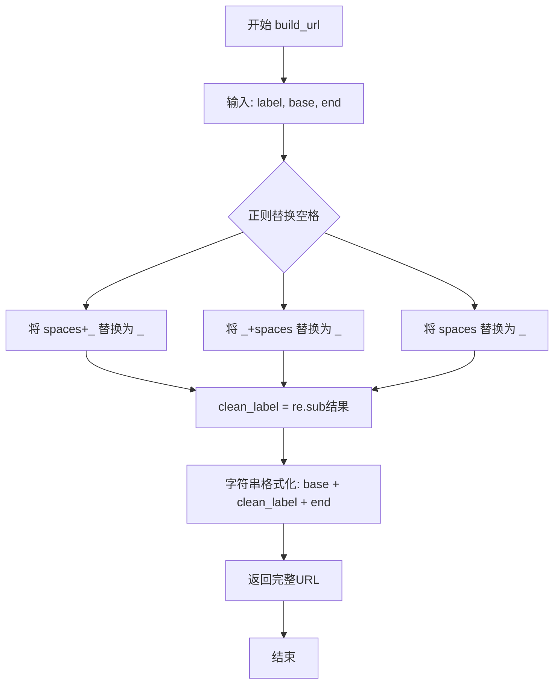
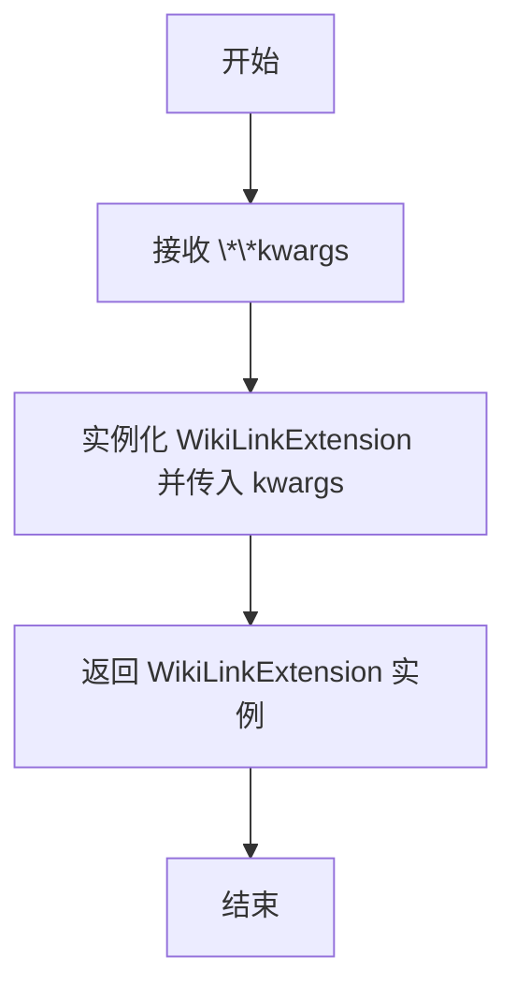
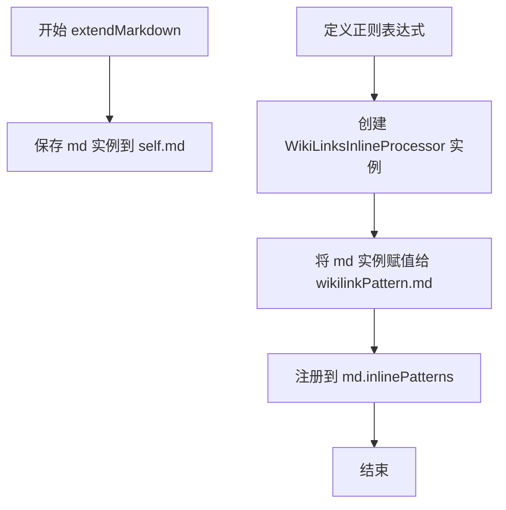
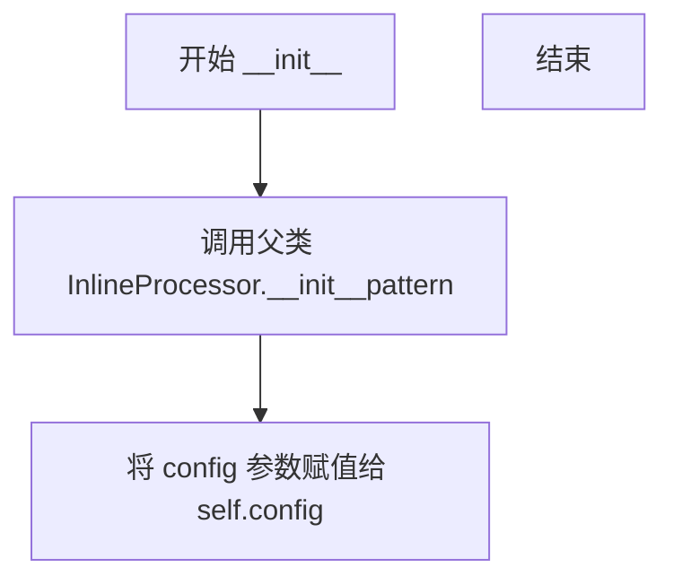

# `markdown\markdown\extensions\wikilinks.py` 详细设计文档

Python-Markdown扩展，将Markdown文档中的[[WikiLinks]]语法转换为HTML相对链接，支持自定义URL前缀、后缀和CSS类名。

## 整体流程

```mermaid
graph TD
    A[Markdown解析开始] --> B[遇到[[WikiLinks]]模式]
    B --> C[WikiLinksInlineProcessor.handleMatch]
    C --> D{标签是否为空?}
    D -- 是 --> E[_getMeta获取配置]
    E --> F[build_url构建URL]
    F --> G[创建a标签元素]
    G --> H[设置href和class属性]
    H --> I[返回HTML元素和位置]
    D -- 否 --> J[返回空字符串]
    I --> K[Markdown渲染为HTML]
```

## 类结构

```
Extension (父类)
└── WikiLinkExtension
InlineProcessor (父类)
└── WikiLinksInlineProcessor
```

## 全局变量及字段


### `config`
    
扩展配置选项，包含base_url、end_url、html_class和build_url

类型：`dict`
    


### `WikiLinksInlineProcessor.config`
    
运行时配置字典

类型：`dict[str, Any]`
    


### `WikiLinksInlineProcessor.md`
    
Markdown实例引用(从外部赋值)

类型：`Markdown`
    
    

## 全局函数及方法


### `build_url`

该函数是WikiLinks扩展中用于构建完整URL的核心工具函数。它接收标签、基础URL和结尾URL三个参数，通过正则表达式清理标签中的空格（将空格替换为下划线），然后将清理后的标签与基础URL和结尾URL拼接形成完整的超链接路径。

参数：

- `label`：`str`，WikiLink标签文本，即`[[ ]]`中包裹的内容
- `base`：`str`，URL前缀部分，通常为站点根路径（如`"/"`）
- `end`：`str`，URL后缀部分，通常为文件扩展名（如`".html"`或`"/"`）

返回值：`str`，拼接后的完整URL字符串

#### 流程图



#### 带注释源码

```python
def build_url(label: str, base: str, end: str) -> str:
    """
    构建完整URL地址。
    
    参数:
        label: WikiLink标签文本，如 'My Page'
        base: URL前缀路径，如 '/wiki/'
        end: URL后缀扩展名，如 '.html'
    
    返回:
        拼接后的完整URL字符串
    """
    # 使用正则表达式清理标签中的空格，将其替换为下划线
    # 匹配三种模式：
    # 1. ([ ]+_) 空格后跟下划线 -> 替换为 _
    # 2. (_[ ]+) 下划线后跟空格 -> 替换为 _
    # 3. ([ ]+) 纯空格 -> 替换为 _
    clean_label = re.sub(r'([ ]+_)|(_[ ]+)|([ ]+)', '_', label)
    
    # 使用format方法拼接base、clean_label和end三个部分
    return '{}{}{}'.format(base, clean_label, end)
```


### `makeExtension`

这是一个工厂函数，用于根据传入的配置参数创建并返回一个 `WikiLinkExtension` 实例，供 Python-Markdown 框架加载 WikiLinks 扩展使用。

参数：

- `**kwargs`：`dict`，可变关键字参数，会原封不动地传递给 `WikiLinkExtension` 构造函数，用于配置扩展的行为（如 `base_url`、`end_url`、`html_class`、`build_url` 等）。

返回值：`WikiLinkExtension`，返回配置好的 WikiLink 扩展实例。

#### 流程图



#### 带注释源码

```python
def makeExtension(**kwargs):  # pragma: no cover
    """
    工厂函数，用于创建 WikiLinkExtension 扩展实例。
    
    此函数由 Python-Markdown 框架在加载扩展时调用。
    它接受任意关键字参数，并将它们传递给 WikiLinkExtension 的构造函数，
    从而允许用户在配置中自定义扩展行为（如 URL 格式、CSS 类名等）。
    
    参数:
        **kwargs: 传递给 WikiLinkExtension.__init__ 的关键字参数。
                  常见参数包括:
                  - base_url: 链接的基础 URL 路径
                  - end_url: 链接的结尾 URL 路径
                  - html_class: 生成的 HTML 元素的 CSS 类名
                  - build_url: 用于构建 URL 的可调用对象
    
    返回值:
        WikiLinkExtension: 配置好的扩展实例，会被注册到 Markdown 处理器中
    """
    return WikiLinkExtension(**kwargs)
```


### `WikiLinkExtension.__init__`

该方法是 `WikiLinkExtension` 类的构造函数，用于初始化 WikiLinks 扩展插件。它设置了四个默认配置项（`base_url`、`end_url`、`html_class`、`build_url`），并调用父类 `Extension` 的构造函数完成初始化。

参数：

- `self`：隐式参数，当前 `WikiLinkExtension` 实例
- `**kwargs`：任意关键字参数，传递给父类 `Extension` 的初始化方法

返回值：`None`，构造函数无返回值

#### 流程图

```mermaid
flowchart TD
    A[开始 __init__] --> B[定义 self.config 字典]
    B --> C{设置配置项}
    C --> D[base_url: 默认为 '/']
    C --> E[end_url: 默认为 '/']
    C --> F[html_class: 默认为 'wikilink']
    C --> G[build_url: 默认为 build_url 函数]
    D --> H[调用 super().__init__(**kwargs)]
    E --> H
    F --> H
    G --> H
    H --> I[结束 __init__]
```

#### 带注释源码

```python
def __init__(self, **kwargs):
    """
    初始化 WikiLinkExtension 实例。
    
    设置默认配置选项，包括URL构建规则、CSS类名等。
    这些配置可在使用时通过Markdown扩展参数覆盖。
    """
    # 定义配置字典，包含4个可配置项
    # 每个配置项为 [默认值, 描述] 的列表
    self.config = {
        'base_url': ['/', 'String to append to beginning or URL.'],
        # URL前缀，默认为 '/'，会在生成的链接前添加此前缀
        
        'end_url': ['/', 'String to append to end of URL.'],
        # URL后缀，默认为 '/'，会在生成的链接末尾添加此后缀
        
        'html_class': ['wikilink', 'CSS hook. Leave blank for none.'],
        # CSS类名，默认为 'wikilink'，用于<a>标签的class属性
        
        'build_url': [build_url, 'Callable formats URL from label.'],
        # URL构建函数，默认为模块内的 build_url 函数
        # 该函数接受 (label, base, end) 三个参数
    }
    """ Default configuration options. """
    
    # 调用父类 Extension 的初始化方法
    # 传递所有关键字参数，使基类也能正确初始化
    super().__init__(**kwargs)
```


### `WikiLinkExtension.extendMarkdown`

该方法负责将 WikiLink 内联处理器注册到 Markdown 实例的 inlinePatterns 中，使得 Markdown 能够解析 `[[WikiLink]]` 语法并将其转换为相对链接。

参数：

- `self`：`WikiLinkExtension`，当前扩展实例本身
- `md`：`Markdown`，Markdown 解析实例，用于注册内联模式处理器

返回值：`None`，无返回值，仅执行注册操作

#### 流程图



#### 带注释源码

```python
def extendMarkdown(self, md):
    """将 WikiLink 内联处理器注册到 Markdown 实例"""
    # 步骤 1: 将传入的 Markdown 实例保存为类属性，供后续处理方法使用
    self.md = md

    # 步骤 2: 定义 WikiLink 的正则表达式
    # 匹配 [[任意字母数字下划线空格连字符]]
    # 例如: [[My Page]] 或 [[page-name]]
    WIKILINK_RE = r'\[\[([\w0-9_ -]+)\]\]'
    
    # 步骤 3: 创建内联处理器实例，传入正则和配置
    # 使用 self.getConfigs() 获取用户配置或默认配置
    wikilinkPattern = WikiLinksInlineProcessor(WIKILINK_RE, self.getConfigs())
    
    # 步骤 4: 将 Markdown 实例注入到处理器中
    # 使处理器能够访问 Markdown 的元数据 (Meta)
    wikilinkPattern.md = md
    
    # 步骤 5: 注册到 Markdown 的内联模式注册表
    # 'wikilink' 为处理器名称，75 为优先级 (数值越小优先级越高)
    # 在 inlinePatterns 中注册，使 Markdown 处理流程能够调用此处理器
    md.inlinePatterns.register(wikilinkPattern, 'wikilink', 75)
```


### WikiLinksInlineProcessor.__init__

初始化 WikiLinksInlineProcessor 处理器，设置用于匹配 WikiLink 的正则表达式模式和配置参数。

参数：

- `self`：隐式参数，代表 WikiLinksInlineProcessor 的实例对象
- `pattern`：`str`，正则表达式模式，用于匹配 `[[WikiLinks]]` 格式的链接
- `config`：`dict[str, Any]`，配置字典，包含 base_url（基础URL）、end_url（URL后缀）、html_class（CSS类名）和 build_url（URL构建函数）

返回值：`None`，`__init__` 方法不返回任何值

#### 流程图



#### 带注释源码

```python
def __init__(self, pattern: str, config: dict[str, Any]):
    """
    初始化 WikiLinksInlineProcessor 处理器。
    
    参数:
        pattern: 正则表达式模式,用于匹配 [[WikiLinks]] 格式的链接
        config: 配置字典,包含 base_url、end_url、html_class 和 build_url
    """
    # 调用父类 InlineProcessor 的构造方法,初始化模式匹配
    super().__init__(pattern)
    
    # 将配置字典保存到实例变量,供 handleMatch 和 _getMeta 方法使用
    self.config = config
```


### WikiLinksInlineProcessor.handleMatch

处理匹配的WikiLink并返回HTML元素。该方法接收一个正则表达式匹配对象，提取链接标签，构建URL，并生成对应的HTML锚点元素。

参数：

- `self`：WikiLinksInlineProcessor，当前类的实例，包含配置信息和Markdown实例引用
- `m`：re.Match[str]，正则表达式匹配对象，包含`[[label]]`格式的WikiLink匹配结果，其中`m.group(1)`提取标签文本
- `data`：str，原始输入数据，包含待处理的文本内容

返回值：`tuple[etree.Element | str, int, int]`，返回元组包含：
- 第一个元素：etree.Element | str，当标签非空时返回HTML `<a>`元素，否则返回空字符串
- 第二个元素：int，匹配项在原始数据中的起始位置（`m.start(0)`）
- 第三个元素：int，匹配项在原始数据中的结束位置（`m.end(0)`）

#### 流程图

```mermaid
flowchart TD
    A[开始 handleMatch] --> B{检查 m.group(1).strip() 是否为空}
    B -->|否| C[调用 _getMeta 获取 base_url, end_url, html_class]
    B -->|是| J[设置 a = 空字符串 '']
    C --> D[提取标签 label = m.group(1).strip()]
    D --> E[调用 build_url 构建 URL]
    E --> F[创建 etree.Element 'a']
    F --> G[设置 a.text = label]
    G --> H[设置 a.set href = url]
    H --> I{检查 html_class 是否存在}
    I -->|是| K[设置 a.set class = html_class]
    I -->|否| L[跳过设置class]
    K --> M[返回 a, m.start(0), m.end(0)]
    L --> M
    J --> M
    
    style A fill:#f9f,color:#000
    style M fill:#9f9,color:#000
```

#### 带注释源码

```python
def handleMatch(self, m: re.Match[str], data: str) -> tuple[etree.Element | str, int, int]:
    """
    处理匹配的WikiLink并返回HTML元素。
    
    参数:
        m: 正则表达式匹配对象，包含 [[label]] 格式的匹配结果
        data: 原始输入数据字符串
        
    返回:
        tuple: (HTML元素或空字符串, 匹配起始位置, 匹配结束位置)
    """
    
    # 检查WikiLink标签是否非空（去除首尾空格后）
    if m.group(1).strip():
        
        # --- 步骤1: 获取配置数据 ---
        # 从Markdown元数据或配置中获取URL构建参数
        base_url, end_url, html_class = self._getMeta()
        
        # --- 步骤2: 提取标签文本 ---
        # m.group(1) 捕获 [[ ]] 内部的内容
        label = m.group(1).strip()
        
        # --- 步骤3: 构建URL ---
        # 使用配置的 build_url 函数将标签转换为URL
        # 默认行为: clean_label = re.sub(r'([ ]+_)|(_[ ]+)|([ ]+)', '_', label)
        # 然后返回 f"{base_url}{clean_label}{end_url}"
        url = self.config['build_url'](label, base_url, end_url)
        
        # --- 步骤4: 创建HTML元素 ---
        # 创建 <a> 元素
        a = etree.Element('a')
        
        # 设置锚点文本为标签内容
        a.text = label
        
        # 设置 href 属性为构建的URL
        a.set('href', url)
        
        # --- 步骤5: 设置样式类 ---
        # 如果配置了html_class，则添加class属性
        if html_class:
            a.set('class', html_class)
            
    else:
        # 标签为空时返回空字符串
        a = ''
        
    # --- 步骤6: 返回结果 ---
    # 返回HTML元素、匹配起始位置、匹配结束位置
    # 这样Markdown可以正确替换原始匹配文本
    return a, m.start(0), m.end(0)
```


### `WikiLinksInlineProcessor._getMeta`

获取元数据或配置数据，用于构建 WikiLink 的 URL 相关配置信息。该方法首先从实例配置（config）中读取 base_url、end_url 和 html_class，然后尝试从 Markdown 对象的 Meta 属性中查找是否有对应的覆盖值（如 `wiki_base_url`、`wiki_end_url`、`wiki_html_class`），最终返回三个配置项的元组。

参数：

- `self`：`WikiLinksInlineProcessor`，调用该方法的实例本身，包含 config 配置字典和 md（Markdown 实例）引用

返回值：`tuple[str, str, str]`，返回 (base_url, end_url, html_class) 三个字符串组成的元组，分别表示 URL 前缀、URL 后缀和 CSS 类名

#### 流程图

```mermaid
flowchart TD
    A[开始 _getMeta] --> B[从 self.config 获取默认值]
    B --> C{self.md 是否有 Meta 属性}
    C -->|否| F[返回默认配置]
    C -->|是| D{Meta 中是否存在 wiki_base_url}
    D -->|是| E[使用 Meta['wiki_base_url'][0] 覆盖 base_url]
    D -->|否| G{Meta 中是否存在 wiki_end_url}
    E --> G
    G -->|是| H[使用 Meta['wiki_end_url'][0] 覆盖 end_url]
    G -->|否| I{Meta 中是否存在 wiki_html_class}
    H --> I
    I -->|是| J[使用 Meta['wiki_html_class'][0] 覆盖 html_class]
    I -->|否| K[返回最终配置元组]
    J --> K
    F --> K
```

#### 带注释源码

```python
def _getMeta(self) -> tuple[str, str, str]:
    """ Return meta data or `config` data. """
    # 从实例配置字典中获取默认的 URL 构建参数
    # base_url: URL 前缀，默认为 '/'
    base_url = self.config['base_url']
    # end_url: URL 后缀，默认为 '/'
    end_url = self.config['end_url']
    # html_class: CSS 类名，默认为 'wikilink'
    html_class = self.config['html_class']
    
    # 检查 Markdown 实例是否具有 Meta 属性（元数据存储）
    # Python-Markdown 允许通过 Meta 存储文档级元数据
    if hasattr(self.md, 'Meta'):
        # 如果 Meta 中定义了 wiki_base_url，则覆盖默认的 base_url
        # Meta 中的值通常是列表，取第一个元素 [0]
        if 'wiki_base_url' in self.md.Meta:
            base_url = self.md.Meta['wiki_base_url'][0]
        
        # 如果 Meta 中定义了 wiki_end_url，则覆盖默认的 end_url
        if 'wiki_end_url' in self.md.Meta:
            end_url = self.md.Meta['wiki_end_url'][0]
        
        # 如果 Meta 中定义了 wiki_html_class，则覆盖默认的 html_class
        if 'wiki_html_class' in self.md.Meta:
            html_class = self.md.Meta['wiki_html_class'][0]
    
    # 返回最终使用的三个配置项
    return base_url, end_url, html_class
```

## 关键组件


### WikiLinkExtension

扩展插件的主类，负责配置管理和注册内联处理器到Markdown核心。提供四个配置选项：base_url（URL前缀）、end_url（URL后缀）、html_class（CSS类名）和build_url（URL构建函数）。通过extendMarkdown方法将WikiLinksInlineProcessor注册到inlinePatterns中，优先级为75。

### WikiLinksInlineProcessor

继承自InlineProcessor的内联模式处理器，负责实际处理[[WikiLinks]]语法并转换为HTML链接。核心方法handleMatch使用正则匹配结果构建<a>元素，支持从Markdown元数据（Meta）覆盖配置。_getMeta方法实现配置优先读取逻辑：先取config默认值，再尝试从md.Meta获取同名覆盖值。

### build_url

纯函数式URL构建工具，接收label、base和end三个参数。使用正则表达式将标签中的空白字符和混合格式（如下划线前后有空格）标准化为下划线，然后拼接返回完整URL。

### makeExtension

工厂函数，符合Python-Markdown扩展接口规范，负责实例化WikiLinkExtension并传入关键字参数。

### 配置系统

采用字典式配置管理，默认值在__init__中定义，支持运行时覆盖。元数据覆盖机制允许通过Markdown文件的YAML前置元数据指定wiki_base_url、wiki_end_url和wiki_html_class来覆盖默认配置。

### 正则表达式模式

WIKILINK_RE = r'\[\[([\w0-9_ -]+)\]\]' 定义Wiki链接的匹配规则，支持字母、数字、下划线、空格和连字符组成的标签内容。

## 问题及建议


### 已知问题

-   **正则表达式局限性**：`WIKILINK_RE = r'\[\[([\w0-9_ -]+)\]\]'` 仅支持字母、数字、下划线和连字符，无法匹配中文、日文等非ASCII字符的WikiLink标签
-   **类型注解不完整**：`build_url` 函数缺少返回类型注解；`makeExtension` 函数缺少返回类型注解
-   **配置访问未验证可调用性**：直接调用 `self.config['build_url']` 而未验证其为可调用对象，可能导致运行时错误
-   **魔法数字缺乏说明**：注册inlinePattern时使用的优先级 `75` 没有任何注释说明
-   **空值处理不一致**：`handleMatch` 中当标签为空时返回空字符串 `''`，但类型注解期望返回 `etree.Element | str`，未明确处理 `None` 情况
-   **潜在的字典键访问错误**：`_getMeta` 方法中通过字符串键直接访问 `self.md.Meta` 字典，假设键必定存在

### 优化建议

-   **扩展正则表达式**：使用 `r'\[\[([^\]]+)\]\]'` 或支持Unicode的 `r'\[\[([\w0-9_ -]+)\]\]'` 改为 `r'\[\[([\s\S]+?)\]\]'` 以支持更广泛的字符集
-   **完善类型注解**：为 `build_url` 添加 `-> str` 返回类型，为 `makeExtension` 添加 `-> WikiLinkExtension` 返回类型
-   **添加配置验证**：在构造函数或 `handleMatch` 中验证 `build_url` 是否为可调用对象，使用 `callable()` 检查
-   **提取魔法数字**：将优先级数值定义为类常量或配置常量，并添加注释说明其含义（如 `PRIORITY = 75`）
-   **加强空值防御**：在 `handleMatch` 中增加对 `label` 为空或 `None` 的显式检查，返回安全的默认值
-   **安全访问字典**：使用 `self.md.Meta.get('wiki_base_url', [base_url])[0]` 替代直接键访问，提供默认值避免 KeyError

## 其它


### 设计目标与约束

将Markdown文档中的[[WikiLinks]]语法转换为HTML相对链接，提供可配置的URL构建逻辑，支持Python-Markdown 3.x版本。

### 错误处理与异常设计

代码中主要处理空链接情况，当[[]]中间没有内容时返回空字符串。配置参数通过字典传递，缺乏必要验证。异常处理主要依赖Python-Markdown框架的异常机制。

### 数据流与状态机

数据流：Markdown源文本 → InlineProcessor正则匹配 → 提取链接标签 → build_url构建URL → 生成HTML `<a>`元素 → 返回渲染结果

### 外部依赖与接口契约

依赖Python-Markdown核心库（Extension、InlineProcessor）、xml.etree.ElementTree、re模块。提供makeExtension工厂函数作为入口，符合Python-Markdown扩展接口规范。

### 配置管理

通过WikiLinkExtension的config字典管理配置，支持base_url、end_url、html_class、build_url四个配置项，支持从md.Meta读取wiki_base_url、wiki_end_url、wiki_html_class元数据覆盖。

### 扩展性分析

build_url函数设计为可调用对象，允许用户自定义URL构建逻辑。InlineProcessor子类化机制便于扩展其他内联模式。

### 性能考虑

正则表达式r'\[\[([\w0-9_ -]+)\]\]'在每次渲染时执行，对于大量文档可能存在优化空间。re.sub在build_url中被调用。

### 安全性考虑

label通过clean_label处理空格和下划线，但未进行完整的HTML转义处理，存在潜在的XSS风险（如果label包含恶意内容）。

### 版本兼容性

使用from __future__ import annotations支持类型提示，兼容Python 3.9+。

### 使用示例

```python
import markdown
md = markdown.Markdown(extensions=['wikilinks'])
html = md.convert('[[WikiPage]]')
```


    