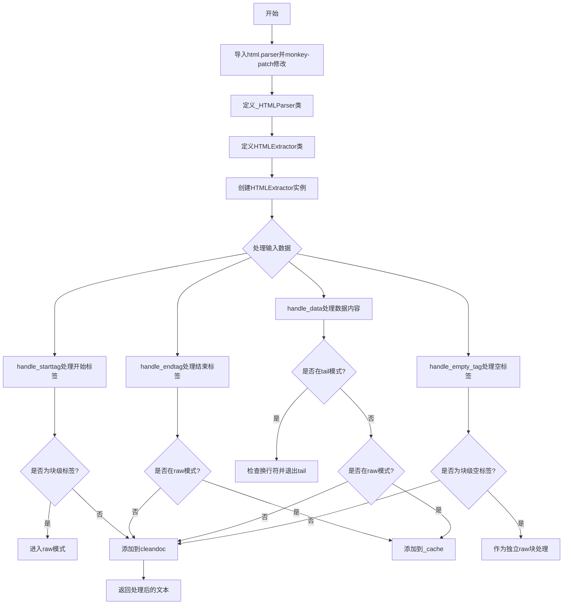
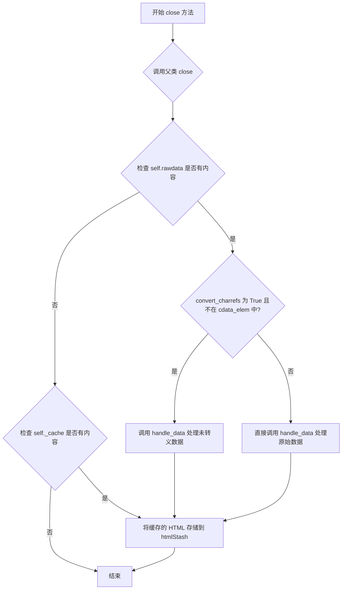
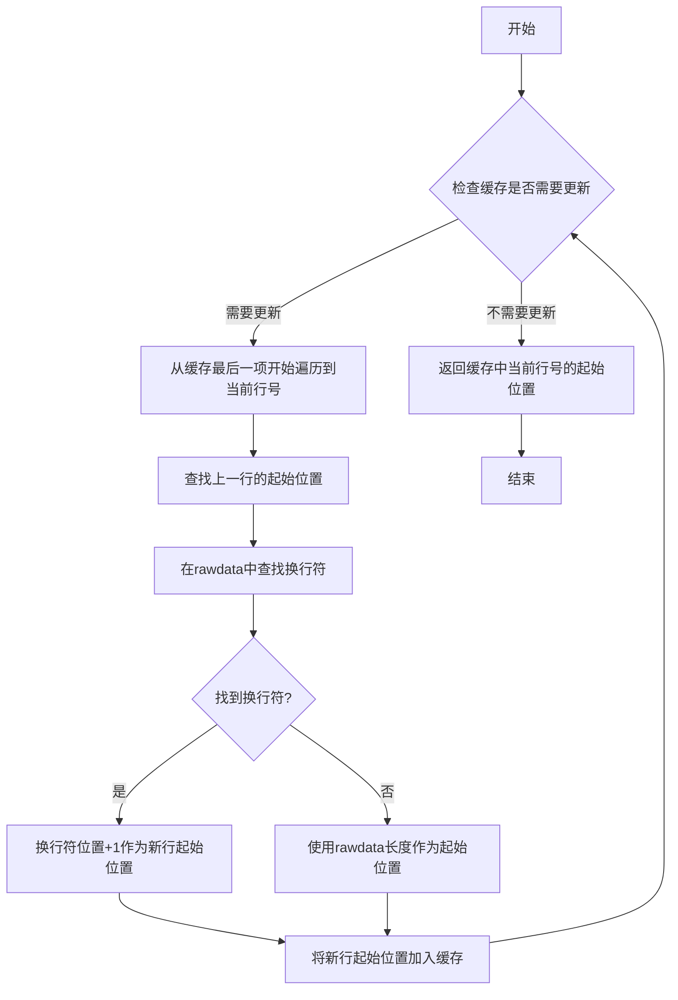
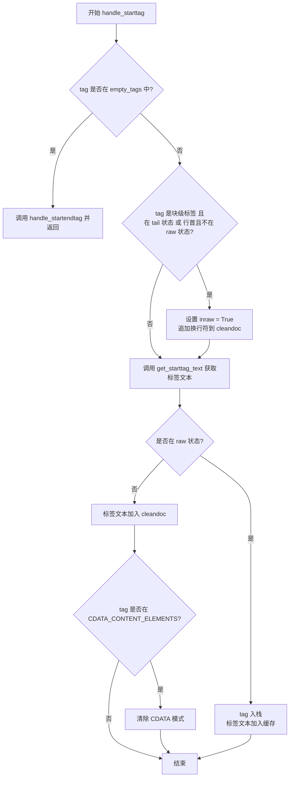
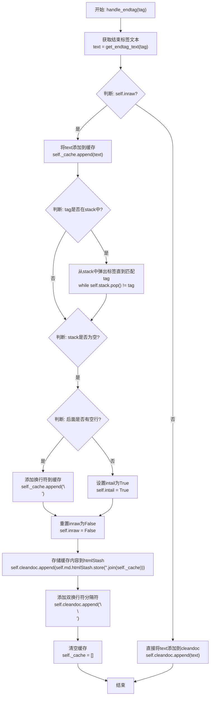
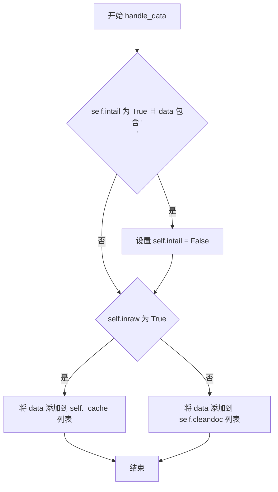
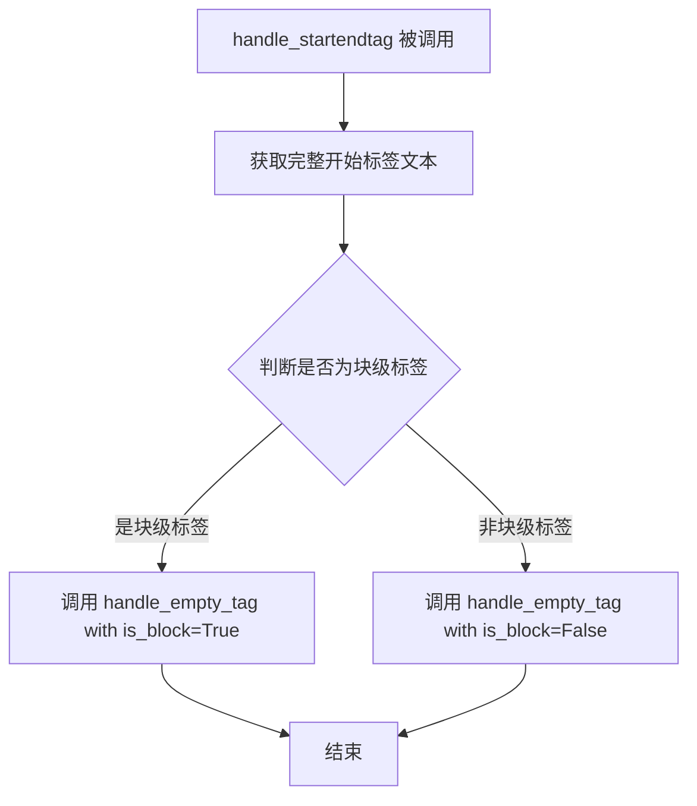
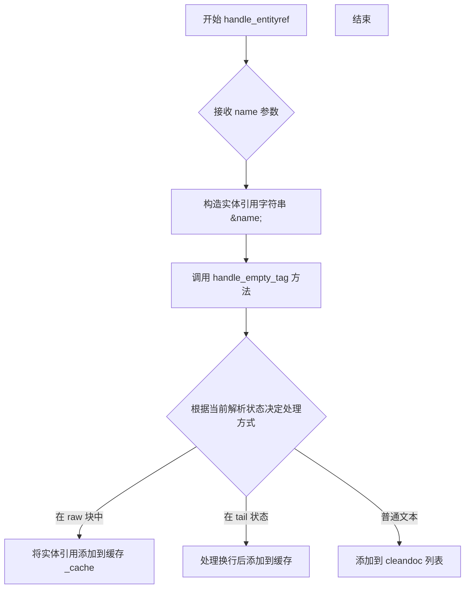
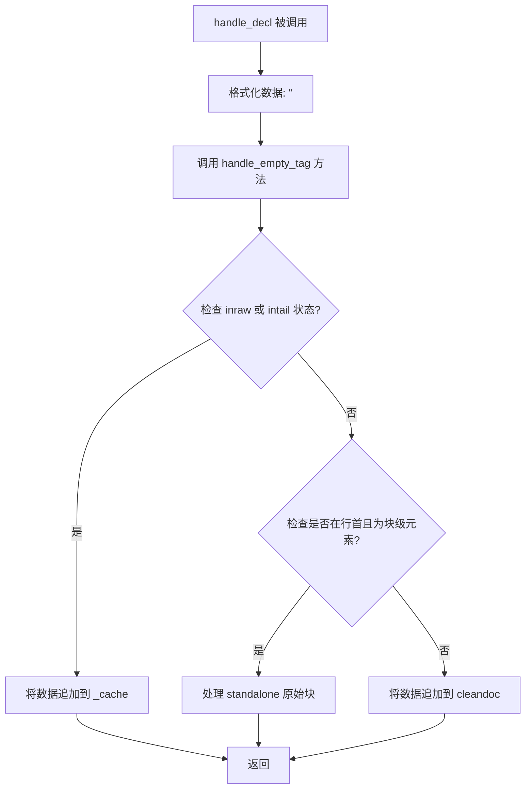

# `markdown\markdown\htmlparser.py` 详细设计文档

该模块是Python Markdown库的HTML解析核心，通过monkey-patch修改标准库的HTMLParser，实现从Markdown文本中提取原始HTML内容，并将处理后的纯文本存储在cleandoc列表中，同时使用HtmlStash暂存HTML片段供后续处理。

## 整体流程



## 类结构

```
htmlparser.HTMLParser (标准库)
└── _HTMLParser (自定义扩展)
    └── HTMLExtractor (功能主体)
```

## 全局变量及字段


### `commentclose`
    
正则表达式，用于匹配HTML注释的结束符 '-->' 或 '--!>'

类型：`re.Pattern`
    


### `blank_line_re`
    
正则表达式，用于匹配文本开头的空白行（两个连续换行符）

类型：`re.Pattern`
    


### `htmlparser`
    
html.parser模块的副本，通过importlib动态导入以进行猴子补丁

类型：`module`
    


### `spec`
    
html.parser模块的规格说明对象，用于动态加载模块

类型：`importlib.machinery.ModuleSpec`
    


### `HTMLExtractor.md`
    
Markdown实例引用，用于访问htmlStash和is_block_level等方法

类型：`Markdown`
    


### `HTMLExtractor.empty_tags`
    
自闭合块级标签集合，如hr标签

类型：`set[str]`
    


### `HTMLExtractor.lineno_start_cache`
    
缓存每行起始位置的字符索引，用于快速定位行开始位置

类型：`list[int]`
    


### `HTMLExtractor.inraw`
    
标记当前解析器是否处于原始HTML块内部

类型：`bool`
    


### `HTMLExtractor.intail`
    
标记当前解析器是否处于HTML块结束标签之后的位置

类型：`bool`
    


### `HTMLExtractor.stack`
    
标签栈，用于跟踪嵌套的HTML标签

类型：`list[str]`
    


### `HTMLExtractor._cache`
    
临时缓存区，用于存储原始HTML块的内容片段

类型：`list[str]`
    


### `HTMLExtractor.cleandoc`
    
存储清理后的文档片段列表，HTML块已被替换为占位符

类型：`list[str]`
    
    

## 全局函数及方法


### `_HTMLParser.parse_endtag`

该方法用于解析 HTML 结束标签，特别处理了 `</>` 这类非标准结束标签。当检测到结束标签不符合标准格式时，将其作为普通数据处理并返回调整后的索引位置。

参数：

- `i`：`int`，表示在原始数据 `rawdata` 中的起始索引位置

返回值：`int`，返回处理结束后新的索引位置

#### 流程图

```mermaid
flowchart TD
    A[开始 parse_endtag] --> B[获取 rawdata[i:i+3] 赋值给 start]
    B --> C[获取 start 最后一个字符的 ASCII 码赋值给 c]
    C --> D{len(start) < 3?}
    D -->|是| E{65 <= c <= 90 或 97 <= c <= 122?}
    D -->|否| F{65 <= c <= 90 或 97 <= c <= 122?}
    E -->|否| G[调用 handle_data 处理 rawdata[i:i+2]]
    E -->|是| H[调用父类 parse_endtag]
    F -->|否| G
    F -->|是| H
    G --> I[返回 i + 2]
    H --> I
    I[结束]
```

#### 带注释源码

```python
def parse_endtag(self, i):
    """
    解析 HTML 结束标签。
    
    该方法重写了父类的 parse_endtag，用于处理特殊的结束标签。
    特别是当遇到 </> 这样的非标准结束标签时，会将其作为普通数据处理。
    
    参数:
        i: int, 在 rawdata 中的起始索引位置
        
    返回:
        int, 处理结束后新的索引位置
    """
    # 获取从位置 i 开始的最多3个字符
    start = self.rawdata[i:i+3]
    
    # 获取最后一个字符的 ASCII 码值
    c = ord(start[-1])
    
    # 检查条件：
    # 1. start 长度小于3（表示可能是 </> 这样的短标签）
    # 2. 最后一个字符不是英文字母（A-Z: 65-90, a-z: 97-122）
    if len(start) < 3 or not (65 <= c <= 90 or 97 <= c <= 122):
        # 将前2个字符作为普通数据处理（如 </> 中的 </ 部分）
        self.handle_data(self.rawdata[i:i + 2])
        # 返回 i + 2，跳过已处理的2个字符
        return i + 2
    
    # 对于标准的结束标签，调用父类的 parse_endtag 方法处理
    return super().parse_endtag(i)
```


### `_HTMLParser.parse_starttag`

该方法是 `_HTMLParser` 类中重写的 `parse_starttag` 方法，用于处理 HTML 解析中的特殊边缘情况。它首先检查当前解析位置是否遇到了 `</>` 这个特殊的字符串（这是一个 hack，用于捕获被 HTML 解析器通常会丢弃的标签），如果是，则将其作为普通数据处理并返回；否则，调用父类的默认实现进行标准标签解析。

参数：

- `i`：`int`，表示在原始数据 `rawdata` 中开始解析标签的位置索引

返回值：`int`，返回解析结束后的位置索引（即下一个待处理字符的位置）

#### 流程图

```mermaid
flowchart TD
    A[开始 parse_starttag] --> B{检查 rawdata[i:i+3] == '</>'?}
    B -->|是| C[调用 handle_data 处理 '</>' 作为数据]
    B -->|否| D[调用父类 super().parse_starttag 处理]
    C --> E[返回 i + 3]
    D --> F[返回父类处理结果]
    E --> G[结束]
    F --> G
```

#### 带注释源码

```python
def parse_starttag(self, i: int) -> int:  # pragma: no cover
    # 特殊处理 </> 这种情况
    # 这是一个 hack，用于捕获被 HTML 解析器通常会丢弃的字符串
    # 当遇到 </> 时，我们将其作为普通数据处理，而不是作为标签
    
    # 检查从位置 i 开始的 3 个字符是否正好是 '</>'
    if self.rawdata[i:i + 3] == '</>':
        # 将 '</>' 作为数据处理（调用 handle_data 而不是 handle_endtag）
        self.handle_data(self.rawdata[i:i + 3])
        # 返回解析位置，跳过这 3 个字符
        return i + 3

    # 如果不是 '</>'，则调用父类的标准 parse_starttag 方法处理正常的 HTML 标签
    return super().parse_starttag(i)
```


### `HTMLExtractor.__init__`

这是 `HTMLExtractor` 类的构造函数，负责初始化HTML提取器实例。该方法配置了字符引用转换选项、设置了空标签集合（如`<hr>`）、初始化了行号缓存，并调用父类HTMLParser的初始化方法，同时保存Markdown实例引用以供后续处理使用。

参数：

- `md`：`Markdown`，Markdown实例，用于访问`htmlStash`存储和`is_block_level`方法判断块级标签
- `*args`：可变位置参数，传递给父类`htmlparser.HTMLParser`的参数
- `**kwargs`：可变关键字参数，传递给父类的参数，支持`convert_charrefs`等选项

返回值：`None`，无返回值（`__init__`方法）

#### 流程图

```mermaid
flowchart TD
    A[开始 __init__] --> B{kwargs中是否有convert_charrefs?}
    B -->|否| C[设置convert_charrefs=False]
    B -->|是| D[保留原有值]
    C --> E[创建self.empty_tags集合<br/>包含'h r']
    D --> E
    E --> F[初始化self.lineno_start_cache<br/>为[0]]
    F --> G[调用super().__init__<br/>传入args和kwargs]
    G --> H[保存self.md = md<br/>引用Markdown实例]
    H --> I[结束 __init__]
```

#### 带注释源码

```python
def __init__(self, md: Markdown, *args, **kwargs):
    """
    初始化HTMLExtractor实例。
    
    参数:
        md: Markdown实例，用于访问htmlStash和is_block_level方法
        *args: 可变位置参数，传递给HTMLParser父类
        **kwargs: 可变关键字参数，可包含convert_charrefs等选项
    """
    
    # 如果kwargs中没有指定convert_charrefs，则默认设置为False
    # 这样做是为了保持HTML实体引用的原始形式，不进行自动转换
    if 'convert_charrefs' not in kwargs:
        kwargs['convert_charrefs'] = False

    # 定义应该没有内容的块级标签（自闭合标签）
    # 'hr'是唯一的自闭合块级标签
    self.empty_tags = set(['hr'])

    # 初始化行号起始位置缓存
    # 用于跟踪每一行的起始字符位置，优化行偏移计算
    self.lineno_start_cache = [0]

    # 调用父类HTMLParser的__init__方法
    # 这会触发reset()方法，初始化解析器状态
    # This calls self.reset
    super().__init__(*args, **kwargs)
    
    # 保存Markdown实例引用，以便后续处理中使用
    # 如访问htmlStash.store()存储HTML片段
    # 如调用is_block_level()判断块级标签
    self.md = md
```


### `HTMLExtractor.reset`

重置HTMLExtractor实例的状态，清除所有未处理的原始HTML数据、标签栈、缓存和行号信息，将解析状态恢复为初始值。

参数：

- `self`：隐式参数，HTMLExtractor实例本身

返回值：`None`，无返回值描述（该方法重置实例状态，不返回任何值）

#### 流程图

```mermaid
flowchart TD
    A[开始 reset] --> B[设置 self.inraw = False]
    B --> C[设置 self.intail = False]
    C --> D[清空 self.stack 列表]
    D --> E[清空 self._cache 列表]
    E --> F[清空 self.cleandoc 列表]
    F --> G[重置 self.lineno_start_cache = [0]]
    G --> H[调用父类 reset 方法]
    H --> I[结束]
```

#### 带注释源码

```python
def reset(self):
    """Reset this instance.  Loses all unprocessed data."""
    # 标记当前不在原始HTML块中
    self.inraw = False
    # 标记当前不在尾部处理状态
    self.intail = False
    # 清空标签栈，用于追踪嵌套的HTML标签
    self.stack: list[str] = []  # When `inraw==True`, stack contains a list of tags
    # 清空缓存，缓存待处理的HTML片段
    self._cache: list[str] = []
    # 清空清理后的文档列表
    self.cleandoc: list[str] = []
    # 重置行号起始位置缓存，用于追踪行号
    self.lineno_start_cache = [0]

    # 调用父类htmlparser.HTMLParser的reset方法
    super().reset()
```


### `HTMLExtractor.close`

该方法用于在解析完成时处理缓冲区中剩余的原始数据，并将任何未闭合的 HTML 标签存储到 `htmlStash` 中，同时将清理后的文档内容保存到 `cleandoc` 列表中。

参数： 无（仅包含隐式参数 `self`）

返回值：`None`，完成所有缓冲数据处理和清理操作后直接返回

#### 流程图



#### 带注释源码

```python
def close(self):
    """Handle any buffered data."""
    # 调用父类 htmlparser.HTMLParser 的 close 方法
    # 这会完成解析器的关闭操作，处理任何剩余的原始数据
    super().close()
    
    # 检查是否还有未处理的原始数据
    if len(self.rawdata):
        # Python bug 临时修复 (https://bugs.python.org/issue41989)
        # TODO: 当所有支持的 Python 版本都修复此 bug 后移除此修复
        # 只有当 convert_charrefs 为 True 且不在 CDATA 元素中时才进行字符引用转换
        if self.convert_charrefs and not self.cdata_elem:  # pragma: no cover
            # 将字符引用转换为实际字符后处理
            self.handle_data(htmlparser.unescape(self.rawdata))
        else:
            # 直接将原始数据作为文本处理
            self.handle_data(self.rawdata)
    
    # 处理任何未闭合的标签（缓存中的数据）
    if len(self._cache):
        # 将缓存的 HTML 内容存储到 htmlStash 并添加到 cleandoc
        self.cleandoc.append(self.md.htmlStash.store(''.join(self._cache)))
        # 清空缓存，准备下一次使用
        self._cache = []
```


### `HTMLExtractor.line_offset`

这是一个属性方法，用于返回当前行在原始数据中的起始字符索引位置。它通过维护一个行号起始位置的缓存来高效地计算行偏移量。

参数：

- 无参数（属性方法，仅使用 `self`）

返回值：`int`，返回当前行在 `self.rawdata` 中的起始字符索引

#### 流程图



#### 带注释源码

```python
@property
def line_offset(self) -> int:
    """Returns char index in `self.rawdata` for the start of the current line. """
    # 遍历从缓存最后一项到当前行号的范围
    for ii in range(len(self.lineno_start_cache)-1, self.lineno-1):
        # 获取上一行的起始位置
        last_line_start_pos = self.lineno_start_cache[ii]
        # 在rawdata中从上一行起始位置开始查找换行符
        lf_pos = self.rawdata.find('\n', last_line_start_pos)
        if lf_pos == -1:
            # 未找到更多换行符，使用原始数据末尾作为超出范围的行的起始位置
            lf_pos = len(self.rawdata)
        # 将新行的起始位置（换行符+1）添加到缓存中
        self.lineno_start_cache.append(lf_pos+1)

    # 返回当前行号对应的起始字符索引
    return self.lineno_start_cache[self.lineno-1]
```


### `HTMLExtractor.at_line_start`

该方法用于判断 HTML 解析器的当前偏移位置是否处于一行的起始位置。它允许在行首最多有三个空格/制表符的空白字符，如果当前偏移位置到行首之间全是空白字符，则返回 True；否则返回 False。

参数： 无（仅使用实例属性 `self.offset` 和 `self.line_offset`）

返回值：`bool`，如果当前偏移位置在行首（允许最多三个空白字符），返回 True；否则返回 False

#### 流程图

```mermaid
flowchart TD
    A([开始 at_line_start]) --> B{self.offset == 0?}
    B -->|是| C[返回 True<br/>位于文档起始位置]
    B -->|否| D{self.offset > 3?}
    D -->|是| E[返回 False<br/>偏移超过3个字符]
    D -->|否| F[获取从 line_offset 到<br/>line_offset + offset 的子串]
    F --> G{子串.strip() == ''?}
    G -->|是| H[返回 True<br/>行首仅有空白字符]
    G -->|否| I[返回 False<br/>行首存在非空白字符]
```

#### 带注释源码

```python
def at_line_start(self) -> bool:
    """
    Returns True if current position is at start of line.

    Allows for up to three blank spaces at start of line.
    """
    # 检查是否位于文档/块的起始位置（偏移为0）
    if self.offset == 0:
        return True
    
    # 如果偏移超过3个字符，则不可能在行首（因为行首最多允许3个空白）
    if self.offset > 3:
        return False
    
    # 获取从当前行起始位置到当前偏移位置的子串
    # self.line_offset 是属性，计算当前行起始字符在 rawdata 中的索引
    # self.offset 是 HTMLParser 的属性，表示当前字符在行中的偏移量
    substring = self.rawdata[self.line_offset:self.line_offset + self.offset]
    
    # 检查该子串去除首尾空白后是否为空（即全是空白字符）
    return substring.strip() == ''
```


### `HTMLExtractor.get_endtag_text`

该方法用于从原始数据中提取HTML结束标签的完整文本，包括`<`、标签名和`>`。如果无法从原始数据中提取，它会根据提供的`tag`参数构建一个格式良好的结束标签。

参数：

- `tag`：`str`，要获取结束标签的标签名（例如 `div`、`span` 等）

返回值：`str`，结束标签的完整文本（例如 `</div>`）

#### 流程图

```mermaid
flowchart TD
    A[开始 get_endtag_text] --> B[计算起始位置: start = line_offset + offset]
    C[在 rawdata 中从 start 位置搜索结束标签] --> D{找到匹配?}
    D -->|是| E[返回 rawdata[start:m.end()] 即完整结束标签文本]
    D -->|否| F[返回 '</{tag}>' 即构建的结束标签]
    E --> G[结束]
    F --> G
```

#### 带注释源码

```python
def get_endtag_text(self, tag: str) -> str:
    """
    Returns the text of the end tag.

    If it fails to extract the actual text from the raw data, it builds a closing tag with `tag`.
    """
    # Attempt to extract actual tag from raw source text
    # 计算搜索的起始位置，基于当前行的偏移量和当前偏移量
    start = self.line_offset + self.offset
    
    # 使用 htmlparser.endendtag 正则表达式在原始数据中搜索结束标签
    m = htmlparser.endendtag.search(self.rawdata, start)
    
    if m:
        # 找到匹配，返回从起始位置到匹配结束位置的完整结束标签文本
        return self.rawdata[start:m.end()]
    else:  # pragma: no cover
        # 从原始数据中提取失败，假设格式良好且为小写，构建一个结束标签
        return '</{}>'.format(tag)
```


### `HTMLExtractor.handle_starttag`

处理HTML开始标签的方法，根据标签类型（空标签、块级标签、CDATA内容标签）将原始HTML存储到htmlStash或追加到cleandoc，同时管理raw block的状态栈。

参数：

- `tag`：`str`，HTML标签名称
- `attrs`：`Sequence[tuple[str, str]]`，HTML标签的属性列表，每个元素为(属性名, 属性值)的元组

返回值：`None`，该方法无返回值，直接修改实例状态

#### 流程图



#### 带注释源码

```python
def handle_starttag(self, tag: str, attrs: Sequence[tuple[str, str]]):
    """
    处理HTML开始标签。
    
    参数:
        tag: HTML标签名称
        attrs: 标签属性列表,每个元素为(属性名, 属性值)的元组
    """
    # 处理应该是空标签(自闭合)且未指定闭合标签的标签
    if tag in self.empty_tags:
        # 对于空标签(如<hr>),直接作为自闭合标签处理
        self.handle_startendtag(tag, attrs)
        return

    # 如果是块级标签,且(在tail状态或位于行首且不在raw状态)
    if self.md.is_block_level(tag) and (self.intail or (self.at_line_start() and not self.inraw)):
        # 开始一个新的原始块,准备堆栈
        self.inraw = True
        # 追加换行符标记块开始
        self.cleandoc.append('\n')

    # 获取完整的开始标签文本(如 <div class="test">)
    text = self.get_starttag_text()
    
    if self.inraw:
        # 在raw模式下,将标签压入堆栈并加入缓存
        self.stack.append(tag)
        self._cache.append(text)
    else:
        # 不在raw模式下,将标签文本追加到cleandoc
        self.cleandoc.append(text)
        
        # 如果标签是CDATA内容元素(可能是代码片段中的独立标签)
        if tag in self.CDATA_CONTENT_ELEMENTS:
            # 清除CDATA模式(参见#1036)
            self.clear_cdata_mode()
```


### `HTMLExtractor.handle_endtag`

处理HTML文档中的结束标签，根据当前解析状态（是否在原始HTML块中）将标签内容添加到相应的存储位置，并管理标签堆栈和块级元素的边界。

参数：

- `tag`：`str`，要处理的HTML结束标签的名称（如 "div", "p" 等）

返回值：`None`，无返回值（该方法直接修改实例状态）

#### 流程图



#### 带注释源码

```python
def handle_endtag(self, tag: str):
    """
    处理HTML结束标签。
    
    根据当前是否处于原始HTML块中(inraw状态)，将结束标签添加到
    缓存或干净文档中，并管理标签堆栈以跟踪嵌套的块级元素。
    
    Args:
        tag: 结束标签的名称（不含尖括号）
    """
    # 获取结束标签的完整文本（包括</>）
    text = self.get_endtag_text(tag)

    # 判断当前是否在原始HTML块中
    if self.inraw:
        # === 在原始HTML块中 ===
        
        # 将结束标签文本追加到缓存
        self._cache.append(text)
        
        # 如果当前标签在堆栈中，弹出堆栈直到找到匹配的标签
        if tag in self.stack:
            # Remove tag from stack
            while self.stack:
                if self.stack.pop() == tag:
                    break
        
        # 检查堆栈是否为空，即是否到达原始块的结束位置
        if len(self.stack) == 0:
            # === 原始块结束 ===
            
            # 检查结束标签后面是否有空行（两个换行符）
            # blank_line_re 匹配行首的两个换行符（可能带有前导空格）
            if blank_line_re.match(self.rawdata[self.line_offset + self.offset + len(text):]):
                # Preserve blank line and end of raw block.
                # 保留原始块结束后的空行
                self._cache.append('\n')
            else:
                # More content exists after `endtag`.
                # 结束标签后还有更多内容，设置intail标志
                self.intail = True
            
            # 重置堆栈状态
            self.inraw = False
            
            # 将缓存的原始HTML存储到htmlStash（用于后续替换）
            # 并添加到cleandoc列表中
            self.cleandoc.append(self.md.htmlStash.store(''.join(self._cache)))
            
            # 在当前块和下一行之间插入空行
            self.cleandoc.append('\n\n')
            
            # 清空缓存，准备处理下一个块
            self._cache = []
    else:
        # === 不在原始HTML块中 ===
        # 直接将结束标签文本添加到cleandoc
        self.cleandoc.append(text)
```


### `HTMLExtractor.handle_data`

该方法用于处理 HTML 解析过程中的文本数据，根据当前解析状态（是否在原始 HTML 块中或是否在尾部）将数据分别添加到内部缓存或清理后的文档列表中。

参数：

- `data`：`str`，要处理的原始文本数据

返回值：`None`，无返回值，仅执行数据路由逻辑

#### 流程图



#### 带注释源码

```python
def handle_data(self, data: str):
    """
    处理 HTML 解析过程中的文本数据。
    
    根据当前解析状态（inraw: 是否在原始HTML块中，intail: 是否在块尾部）
    将数据路由到不同的存储位置：
    - 在原始块中：添加到 _cache 缓存
    - 不在原始块中：添加到 cleandoc 清理后的文档列表
    """
    # 如果处于尾部状态且数据包含换行符，则退出尾部状态
    # 这表示块后的第一个换行符会结束尾部状态
    if self.intail and '\n' in data:
        self.intail = False
    
    # 判断当前是否在处理原始 HTML 块
    if self.inraw:
        # 在原始块中，将数据追加到缓存列表
        # 这些数据稍后会被存储到 htmlStash
        self._cache.append(data)
    else:
        # 不在原始块中，将数据追加到清理后的文档列表
        self.cleandoc.append(data)
```


### `HTMLExtractor.handle_empty_tag`

该方法负责处理 Markdown 解析过程中的空标签（Empty Tags），如自闭合标签、字符引用、实体引用、注释、声明等，根据当前解析状态（是否在原始块中、是否在行首、是否为块级元素）将标签内容正确地追加到缓存或干净文档中，并处理空白行的保留逻辑。

参数：

- `data`：`str`，要处理的空标签数据内容，可能包含完整的标签字符串（如 `<hr>`、`&#123;`、`&amp;` 等）
- `is_block`：`bool`，标识该空标签是否为块级元素，块级元素会影响后续空白行的处理逻辑

返回值：`None`，该方法无返回值，通过修改实例状态（`self._cache`、`self.cleandoc`、`self.intail`）来输出处理结果

#### 流程图

```mermaid
flowchart TD
    A["开始: handle_empty_tag(data, is_block)"] --> B{self.inraw or self.intail?}
    B -->|是| C["追加 data 到 self._cache"]
    C --> D["结束"]
    B -->|否| E{self.at_line_start() and is_block?}
    E -->|是| F{self.rawdata 后续是否匹配 blank_line_re?}
    F -->|是| G["data += '\n' 保留空白行"]
    F -->|否| H["self.intail = True"]
    G --> I{"self.cleandoc[-1] 是否只以单个换行符结尾?"}
    H --> I
    I -->|是| J["self.cleandoc.append('\n') 添加额外换行"]
    I -->|否| K["self.cleandoc.append(self.md.htmlStash.store(data))"]
    J --> K
    K --> L["self.cleandoc.append('\\n\\n') 插入行间空行"]
    L --> D
    E -->|否| M["self.cleandoc.append(data) 直接追加"]
    M --> D
```

#### 带注释源码

```python
def handle_empty_tag(self, data: str, is_block: bool):
    """
    Handle empty tags (`<data>`).

    处理空标签的入口方法，被以下场景调用：
    1. handle_startendtag: 处理自闭合标签（如 <hr />）
    2. handle_charref: 处理字符引用（如 &#123;）
    3. handle_entityref: 处理实体引用（如 &amp;）
    4. handle_comment: 处理注释（如 <!-- comment -->）
    5. handle_decl: 处理声明（如 <!DOCTYPE>）
    6. handle_pi: 处理处理指令（如 <?xml?>）
    7. unknown_decl: 处理未知声明
    8. parse_bogus_comment: 处理伪注释

    Args:
        data: 空标签的数据内容，包括完整标签字符串
        is_block: 标识该空标签是否为块级元素，块级元素会触发独立的原始块处理逻辑
    """
    # 场景1: 如果当前正在解析原始 HTML 块（inraw）或处于尾部处理状态（intail）
    # 则将数据追加到缓存中，保持原始格式不变
    if self.inraw or self.intail:
        # Append this to the existing raw block
        self._cache.append(data)

    # 场景2: 如果处于行首且是块级元素，则作为独立的原始块处理
    elif self.at_line_start() and is_block:
        # Handle this as a standalone raw block

        # 检查标签后面是否紧跟空白行（两个换行符）
        # blank_line_re = re.compile(r'^([ ]*\n){2}') 匹配行首的空白行
        if blank_line_re.match(self.rawdata[self.line_offset + self.offset + len(data):]):
            # Preserve blank line after tag in raw block.
            # 保留空白行，在 data 后追加换行符
            data += '\n'
        else:
            # More content exists after tag.
            # 标签后还有内容，设置 intail 标志表示后续内容需要特殊处理
            self.intail = True

        # 获取当前 cleandoc 最后一个元素，用于检查换行符情况
        item = self.cleandoc[-1] if self.cleandoc else ''

        # If we only have one newline before block element, add another
        # 如果只有一个换行符，添加第二个，确保与块级元素的分隔
        if not item.endswith('\n\n') and item.endswith('\n'):
            self.cleandoc.append('\n')

        # 将空标签内容存储到 htmlStash 并追加到 cleandoc
        self.cleandoc.append(self.md.htmlStash.store(data))

        # Insert blank line between this and next line.
        # 在当前块和下一行之间插入两个换行符作为分隔
        self.cleandoc.append('\n\n')

    # 场景3: 否则作为普通数据直接追加到 cleandoc
    else:
        self.cleandoc.append(data)
```


### `HTMLExtractor.handle_startendtag`

该方法用于处理 HTML 自闭合标签（如 `<hr/>`、`<br/>` 等），将标签文本传递给 `handle_empty_tag` 方法进行处理，并根据标签是否为块级元素传递相应的标志。

参数：

- `self`：`HTMLExtractor`，当前类的实例
- `tag`：`str`，HTML 标签名称（如 "hr"、"br" 等）
- `attrs`：`Sequence[tuple[str, str]]`（未使用），从父类继承的参数，包含标签的属性列表

返回值：`None`，无返回值，该方法直接调用 `handle_empty_tag` 处理标签

#### 流程图



#### 带注释源码

```python
def handle_startendtag(self, tag: str, attrs):
    """
    处理自闭合标签（空标签）。

    当遇到如 <hr/> 或 <br/> 这样的自闭合标签时，此方法被调用。
    它获取标签的完整文本（包括属性），并根据标签是否为块级元素
    来调用 handle_empty_tag 进行处理。

    参数:
        tag: 标签名称（如 'hr', 'br' 等）
        attrs: 标签属性列表（从父类继承，但在此方法中未使用）
    """
    # 获取开始标签的完整文本（包括标签名和所有属性）
    # 例如：'<hr style="border:1px solid red"/>'
    starttag_text = self.get_starttag_text()
    
    # 检查该标签是否为块级元素（如 hr）
    # 如果是块级元素，is_block 为 True；否则为 False
    is_block = self.md.is_block_level(tag)
    
    # 调用 handle_empty_tag 进行实际处理
    # 该方法会根据 is_block 标志决定如何存储和处理标签内容
    self.handle_empty_tag(starttag_text, is_block=is_block)
```


### `HTMLExtractor.handle_charref`

处理字符引用（character reference），将字符引用（如 `&#123;` 或 `&#x41;`）格式化后传递给 `handle_empty_tag` 方法进行统一处理。

参数：

- `name`：`str`，字符引用的名称部分，例如 "123"（十进制）或 "x41"（十六进制）

返回值：`None`，无返回值（该方法通过副作用处理数据）

#### 流程图

```mermaid
flowchart TD
    A[开始 handle_charref] --> B[接收字符引用名称 name]
    B --> C{format: '&#{name};'}
    C --> D[调用 handle_empty_tag]
    D --> E{判断处理方式}
    E -->|在 raw 块或 tail 中| F[追加到 _cache]
    E -->|在行首且是块级| G[作为独立原始块处理]
    E -->|其他情况| H[追加到 cleandoc]
    F --> I[结束]
    G --> I
    H --> I
```

#### 带注释源码

```python
def handle_charref(self, name: str):
    """
    处理字符引用事件。
    
    当 HTML 解析器遇到字符引用时调用此方法，例如 &#123; 或 &#x41;。
    字符引用是一种表示 Unicode 字符的方式，可以用十进制或十六进制表示。
    
    参数:
        name: 字符引用的名称部分。
              十进制示例: '65' 表示字符 'A'
              十六进制示例: 'x41' 表示字符 'A'
    """
    # 将字符引用格式化为完整的 HTML 字符引用字符串
    # 例如: name='65' -> '&#65;'
    #       name='x41' -> '&#x41;'
    charref = '&#{};'.format(name)
    
    # 调用 handle_empty_tag 进行统一处理
    # is_block=False 表示字符引用不是块级元素
    self.handle_empty_tag(charref, is_block=False)
```


### `HTMLExtractor.handle_entityref`

处理HTML实体引用（如 `&nbsp;`、`&amp;` 等），将实体引用转换为对应的HTML标签格式并调用 `handle_empty_tag` 进行处理。

参数：

- `name`：`str`，实体引用的名称（例如 `nbsp`、`amp` 等，不包含 `&` 和 `;`）

返回值：`None`，无返回值（该方法直接调用 `handle_empty_tag` 处理实体引用）

#### 流程图



#### 带注释源码

```python
def handle_entityref(self, name: str):
    """
    处理HTML实体引用。
    
    当解析器在文本中遇到如 &nbsp;、&amp; 等实体引用时调用此方法。
    该方法将实体引用格式化为完整的HTML实体字符串，然后委托给
    handle_empty_tag 进行实际处理。
    
    参数:
        name: str - 实体引用的名称，不包含 & 和 ; 分隔符
              例如: 'nbsp', 'amp', 'lt', 'gt' 等
    """
    # 使用 format 方法将实体名称包裹在 & 和 ; 之间
    # 形成完整的HTML实体引用格式，如 &nbsp;
    # 然后调用 handle_empty_tag 进行处理，is_block=False 表示实体引用不是块级元素
    self.handle_empty_tag('&{};'.format(name), is_block=False)
```


### `HTMLExtractor.handle_comment`

处理HTML注释内容，将注释作为块级元素处理并存储到HTML暂存区。

参数：

-  `data`：`str`，HTML注释标签内的内容（即 `<!--` 和 `-->` 之间的内容）

返回值：`None`，无返回值（该方法直接修改实例状态）

#### 流程图

```mermaid
flowchart TD
    A[开始 handle_comment] --> B[接收注释数据 data]
    B --> C{检查注释是否未关闭}
    C -->|需要覆盖位置| D[格式化注释为 <!--{data}-->]
    C -->|正常| D
    D --> E[调用 handle_empty_tag 方法]
    E --> F[标记为块级元素 is_block=True]
    F --> G[将注释存储到 HTML stash 或 cleandoc]
    G --> H[结束]
```

#### 带注释源码

```python
def handle_comment(self, data: str):
    """
    处理HTML注释。
    
    当解析器遇到HTML注释时，此方法被调用。
    它将注释内容格式化为完整的HTML注释标签，
    然后作为块级元素处理。
    
    参数:
        data: str, 注释标签内部的内容（不包含<!--和-->）
    """
    # 检查注释是否未闭合，如果未闭合需要覆盖位置
    # 将注释数据格式化为完整的HTML注释标签 <!--{data}-->
    # 作为块级元素处理（is_block=True），使注释可以单独占一行
    self.handle_empty_tag('<!--{}-->'.format(data), is_block=True)
```


### `HTMLExtractor.handle_decl`

该方法用于处理 HTML 声明（如 `<!DOCTYPE>` 或 `<!ENTITY>` 等），将其格式化为完整的声明标签字符串，然后委托给 `handle_empty_tag` 方法作为块级元素处理。

参数：

-  `data`：`str`，包含声明内容的字符串（如 `DOCTYPE html` 或 `ENTITY` 等）

返回值：`None`，该方法无返回值（隐式返回 `None`）

#### 流程图



#### 带注释源码

```python
def handle_decl(self, data: str):
    """
    处理 HTML 声明（如 DOCTYPE、ENTITY 等）。
    
    该方法接收 HTML 声明的内容，添加 <! 和 > 包围符，
    然后将其作为块级元素传递给 handle_empty_tag 进行处理。
    
    参数:
        data: str - HTML 声明的内容（如 'DOCTYPE html'）
    返回:
        None
    """
    # 将声明内容格式化为完整的 HTML 声明标签
    # 例如: data='DOCTYPE html' -> '<!DOCTYPE html>'
    self.handle_empty_tag('<!{}>'.format(data), is_block=True)
```


### `HTMLExtractor.handle_pi`

处理HTML解析过程中的处理指令（Processing Instruction），将处理指令数据包装成标准格式后调用 `handle_empty_tag` 进行处理。

参数：

- `data`：`str`，处理指令的内容（即 `<?...?>` 中间的部分）

返回值：`None`，无返回值（Python 默认返回 None）

#### 流程图

```mermaid
flowchart TD
    A[开始 handle_pi] --> B{接收 data 参数}
    B --> C[格式化数据为 '<?{data}?>']
    C --> D[调用 handle_empty_tag]
    D --> E[设置 is_block=True]
    E --> F[返回 None]
    
    style A fill:#f9f,color:#000
    style F fill:#f9f,color:#000
```

#### 带注释源码

```python
def handle_pi(self, data: str):
    """
    处理处理指令（Processing Instruction）。
    
    处理指令的示例：<?xml version="1.0" encoding="UTF-8"?>
    这里 data 就是 'xml version="1.0" encoding="UTF-8"' 这部分内容。
    
    Args:
        data: str，处理指令的内容，不包括开始标记 '<?' 和结束标记 '?>'
    
    Returns:
        None
    """
    # 将处理指令数据格式化为标准 XML 处理指令格式 '<?...?>'
    # 例如：data = 'xml version="1.0"' -> '<?xml version="1.0"?>'
    self.handle_empty_tag('<?{}?>'.format(data), is_block=True)
    # 调用 handle_empty_tag 方法处理，is_block=True 表示作为块级元素处理
    # 这样处理指令会被存储到 HTML stash 中，而不是直接输出到 cleandoc
```


### `HTMLExtractor.unknown_decl`

处理未知的HTML声明（如CDATA节或其他非标准声明）。该方法根据声明内容确定正确的结束标记，然后调用 `handle_empty_tag` 进行处理。

参数：

- `data`：`str`，包含未知声明的数据内容

返回值：`None`，无返回值（该方法通过调用 `handle_empty_tag` 处理声明）

#### 流程图

```mermaid
flowchart TD
    A[开始 unknown_decl] --> B{检查 data 是否以 'CDATA[' 开头}
    B -->|是| C[设置 end = ']]>']
    B -->|否| D[设置 end = ']>']
    C --> E[构建标签字符串: '<![{data}{end}']
    D --> E
    E --> F[调用 handle_empty_tag 处理标签]
    F --> G[结束]
```

#### 带注释源码

```python
def unknown_decl(self, data: str):
    """
    处理未知的HTML声明。
    
    该方法接收HTML解析器无法识别的声明数据（如CDATA节），
    并将其转换为适当的标签格式进行处理。
    
    参数:
        data: str, 未知声明的数据内容
        
    返回值:
        None
    """
    # 根据data是否以'CDATA['开头来确定结束标记
    # CDATA节使用']]>'作为结束标记，其他声明使用']>'
    end = ']]>' if data.startswith('CDATA[') else ']>'
    
    # 构建完整的声明标签并调用handle_empty_tag处理
    # is_block=True表示作为块级元素处理
    self.handle_empty_tag('<![{}{}'.format(data, end), is_block=True)
```


### `HTMLExtractor.parse_pi`

该方法用于处理HTML处理指令（Processing Instruction, PI），当PI不在行首或不在尾部时，将其作为普通数据处理，以避免消耗可能跟随的标签。

参数：

- `i`：`int`，表示在原始数据 `rawdata` 中开始解析的位置索引

返回值：`int`，返回处理完成后在原始数据中的位置索引

#### 流程图

```mermaid
flowchart TD
    A[开始 parse_pi] --> B{检查: at_line_start() 或 intail}
    B -->|是| C[调用父类 parse_pi]
    C --> D[返回父类结果]
    B -->|否| E[调用 handle_data 处理 '<?' 作为普通数据]
    E --> F[返回 i + 2]
    D --> G[结束]
    F --> G
```

#### 带注释源码

```python
def parse_pi(self, i: int) -> int:
    """
    解析处理指令(Processing Instruction)。
    
    如果当前位置在行首或处于tail状态，则正常解析PI；
    否则将其作为普通数据处理，避免消耗后续可能跟随的标签。
    
    参数:
        i: int, 在原始数据 rawdata 中的起始位置索引
    
    返回:
        int, 处理完成后在原始数据中的位置索引
    """
    # 检查是否在行首或处于尾部(tail)状态
    if self.at_line_start() or self.intail:
        # 在行首或tail状态，调用父类的parse_pi进行正常解析
        return super().parse_pi(i)
    
    # This is not the beginning of a raw block so treat as plain data
    # and avoid consuming any tags which may follow (see #1066).
    # 不在行首，也不是raw块的开始，将其作为普通数据处理
    # 这样可以避免消耗后续可能跟随的标签（参见issue #1066）
    self.handle_data('<?')
    
    # 返回处理后的位置，跳过 '<?' 的两个字符
    return i + 2
```


### `HTMLExtractor.parse_comment`

解析 HTML 注释内容，从 `<!--` 开始到 `-->` 结束，返回解析后的位置索引。

参数：

- `i`：`int`，表示在 `rawdata` 中开始解析注释的位置索引（从 `<!--` 的起始位置开始）
- `report`：`bool`，默认为 `True`，表示是否报告注释内容给 `handle_comment` 方法处理；如果为 `False`，则只返回结束位置但不调用 `handle_comment`

返回值：`int`，返回解析完成后在 `rawdata` 中的位置索引（即 `-->` 结束标记的结束位置），如果注释未正确终止则返回 `i + 1`

#### 流程图

```mermaid
flowchart TD
    A[开始解析注释 at position i] --> B{rawdata[i:i+4] 是否为 '<!--'}
    B -->|否| C[断言失败 - 意外调用]
    B -->|是| D[在 rawdata 中从 i+4 位置搜索结束标记 --> 或 ]-->匹配结果]
    E{找到结束标记?}
    匹配结果 --> E
    E -->|否| F[调用 handle_data('<') 处理不完整的开始标记]
    E -->|是| G{report 参数为 True?}
    G -->|否| I[直接返回 match.end]
    G -->|是| H[提取注释内容 rawdata[i+4:j] 其中 j=match.start]
    H --> I2[调用 handle_comment 处理注释内容]
    I2 --> I
    F --> J[返回 i+1]
    I --> K[结束 - 返回位置索引]
    J --> K
```

#### 带注释源码

```python
def parse_comment(self, i, report=True):
    """
    Internal -- parse comment, return length or -1 if not terminated
    see https://html.spec.whatwg.org/multipage/parsing.html#comment-start-state
    
    Args:
        i: int, position in rawdata to start parsing (should be at '<!--')
        report: bool, if True then call handle_comment with the comment content
    
    Returns:
        int, the position in rawdata after the parsed comment
    """
    # 获取原始数据引用
    rawdata = self.rawdata
    
    # 断言确保当前位置确实是注释开始标记 '<!--'
    assert rawdata.startswith('<!--', i), 'unexpected call to parse_comment()'
    
    # 在 '<!--' 之后搜索注释结束标记 '-->' 或变体 '-->'
    # commentclose 正则表达式为: r'--!?>' 可以匹配 '-->'、'--!>' 等
    match = commentclose.search(rawdata, i+4)
    
    # 如果没有找到结束标记，说明注释未正确终止
    if not match:
        # 处理这个不完整的开始标记 '<'
        self.handle_data('<')
        # 返回 i+1，跳过一个字符继续解析
        return i + 1
    
    # 找到结束标记
    if report:
        # 获取注释内容的结束位置（不含结束标记）
        j = match.start()
        # 提取注释内容：从 '<!--' 之后 (i+4) 到结束标记开始之前 (j)
        # 调用 handle_comment 处理注释内容
        self.handle_comment(rawdata[i+4: j])
    
    # 返回注释结束标记的结束位置
    return match.end()
```


### `HTMLExtractor.parse_html_declaration`

该方法用于解析HTML文档声明（如`<!DOCTYPE html>`、`<![CDATA[...]]>`或`<!ENTITY...>`等），根据当前解析器状态（是否在行首或tail模式）决定是调用父类的标准解析逻辑，还是将`<!`作为普通数据处理，以支持Markdown代码块内嵌入的HTML内容的正确处理。

参数：

- `i`：`int`，表示在`self.rawdata`中当前解析位置（字符索引）

返回值：`int`，返回解析后推进的位置索引

#### 流程图

```mermaid
flowchart TD
    A[开始解析 HTML 声明] --> B{当前在行首 或 in_tail 模式?}
    B -->|是| C{检查 rawdata[i:i+3] == '<![' 且 rawdata[i:i+9] != '<![CDATA['?}
    B -->|否| H[将 '<!' 作为普通数据处理]
    H --> I[调用 handle_data('<!')]
    I --> J[返回 i + 2]
    C -->|是| D[调用 parse_bogus_comment 解析]
    C -->|否| E[调用父类 parse_html_declaration]
    D --> F{result == -1?}
    F -->|是| G[处理单个字符 '<']
    F -->|否| K[返回 result]
    E --> L[返回父类处理结果]
    G --> M[返回 i + 1]
    
    style H fill:#ffcccc
    style C fill:#ffffcc
    style D fill:#ccffcc
```

#### 带注释源码

```python
def parse_html_declaration(self, i: int) -> int:
    """
    Parse HTML declaration (like <!DOCTYPE ...> or <![CDATA[...]]>).
    
    处理HTML文档声明的解析，根据当前解析器状态决定处理策略。
    如果当前处于行首或tail模式，则尝试解析声明；
    否则将'<!'作为普通数据处理，以避免错误地消耗代码块中的标签。
    """
    # 检查是否在行首或处于tail模式（tag后的尾部内容）
    if self.at_line_start() or self.intail:
        # 检查是否是 '<![' 开头但不是 '<![CDATA['
        # 这是为了处理 Python 3.11/3.12 的 bug #1534 (gh-77057)
        # 这些版本在解析 CDATA 时会错误地将 '<' 视为非法字符
        if self.rawdata[i:i+3] == '<![' and not self.rawdata[i:i+9] == '<![CDATA[':
            # 调用 parse_bogus_comment 来处理这个有问题的声明
            # 这是针对 Python < 3.13 的临时解决方案
            result = self.parse_bogus_comment(i)
            if result == -1:
                # 解析失败，只处理第一个字符 '<'
                self.handle_data(self.rawdata[i:i + 1])
                return i + 1
            # 返回解析后的位置
            return result
        # 对于其他情况，调用父类的标准解析方法
        return super().parse_html_declaration(i)
    
    # 如果不在行首且不在tail模式，说明这不是原始块的开头
    # 应该将 '<!' 作为普通数据处理，避免消耗后续可能存在的标签 (issue #1066)
    self.handle_data('<!')
    return i + 2
```

#### 关键设计考量

| 方面 | 描述 |
|------|------|
| **设计目标** | 正确处理Markdown中嵌入的HTML声明，确保代码块内的`<!`不会被错误解析为HTML标签 |
| **状态依赖** | 严重依赖`at_line_start()`和`intail`属性判断当前解析上下文 |
| **兼容性处理** | 针对Python 3.11/3.12的CDATA解析bug提供变通方案 |
| **异常处理** | 当`parse_bogus_comment`返回-1时，优雅降级为单字符处理 |

#### 潜在优化空间

1. **硬编码字符串**：`<![CDATA[`和`<!`等字符串可提取为常量，提高可维护性
2. **多层条件嵌套**：当前条件判断较深，可考虑提取为独立方法如`_is_cdata_bug_case()`
3. **魔法数字**：返回的`i+1`、`i+2`缺乏语义，可定义常量说明其含义


### `HTMLExtractor.parse_bogus_comment`

该方法覆盖了Python标准库HTMLParser的默认行为，用于解析HTML中的伪造注释（bogus comments）。通过将`report`参数设置为0，它允许伪造注释原样通过而不被修改，然后调用`handle_empty_tag`方法将解析出的注释内容作为空标签处理。

参数：

- `self`：隐式参数，HTMLExtractor实例本身
- `i`：`int`，在原始数据`rawdata`中开始解析的位置索引
- `report`：`int`，默认为0，控制是否向父类报告注释；设置为0时让注释原样通过（参见issue #1425）

返回值：`int`，返回解析结束后的位置索引；如果解析失败返回-1

#### 流程图

```mermaid
flowchart TD
    A[开始 parse_bogus_comment] --> B[调用父类方法 super().parse_bogus_comment i, report]
    B --> C{返回值 pos == -1?}
    C -->|是| D[返回 -1]
    C -->|否| E[调用 handle_empty_tag 处理原始数据中的片段 self.rawdata i:pos]
    E --> F[返回位置 pos]
```

#### 带注释源码

```python
def parse_bogus_comment(self, i: int, report: int = 0) -> int:
    """
    解析伪造注释（bogus comment）。
    
    该方法覆盖了HTMLParser的默认行为，使伪造注释能够原样通过。
    通过将report设置为0，可以避免对注释进行任何转换处理。
    
    参数:
        i: int - 在rawdata中开始解析的位置索引
        report: int - 控制是否报告注释；默认为0，允许注释原样通过
    
    返回:
        int - 解析结束后的位置索引，失败时返回-1
    """
    # 调用父类的parse_bogus_comment方法进行实际解析
    # report参数控制是否报告注释，0表示原样通过
    pos = super().parse_bogus_comment(i, report)
    
    # 如果解析失败（返回-1），直接返回-1
    if pos == -1:  # pragma: no cover
        return -1
    
    # 解析成功，使用handle_empty_tag处理提取出的注释内容
    # is_block=False表示不将其作为块级元素处理
    self.handle_empty_tag(self.rawdata[i:pos], is_block=False)
    
    # 返回解析结束的位置，供后续解析使用
    return pos
```


### `HTMLExtractor.get_starttag_text`

该方法用于返回完整的HTML开始标签源码（包括标签名、属性等），例如 `<a href="url">`。

参数：無

返回值：`str`，返回完整的开始标签源码字符串，例如 `<div class="example">`。

#### 流程图

```mermaid
flowchart TD
    A[调用 get_starttag_text] --> B{检查 __starttag_text}
    B -->|有值| C[返回 __starttag_text]
    B -->|None| D[返回 None]
    
    E[handle_starttag 调用] --> F[调用 get_starttag_text]
    F --> C
    
    G[handle_startendtag 调用] --> H[调用 get_starttag_text]
    H --> C
    
    I[parse_starttag 解析] --> J[设置 __starttag_text]
    J --> K[存储标签源码]
```

#### 带注释源码

```python
def get_starttag_text(self) -> str:
    """
    Return full source of start tag: `<...>`.
    
    此方法是Python标准库html.parser.HTMLParser中方法的副本。
    由于__starttag_text是私有属性，所有引用必须在子类中。
    用于获取完整的开始标签源码，包括标签名和所有属性。
    
    返回值:
        str: 返回完整的HTML开始标签源码，如 ''
             如果尚未解析任何标签或解析失败，返回None（但类型标注为str）
    """
    return self.__starttag_text
```

#### 关联信息

- **私有属性**: `__starttag_text: str | None` - 在 `parse_starttag` 方法中被赋值，存储当前解析的开始标签的原始源码
- **调用者**: 
  - `handle_starttag` - 处理开始标签时获取标签源码
  - `handle_startendtag` - 处理自闭合标签时获取标签源码
- **设置者**: `parse_starttag` 方法在成功解析开始标签后设置 `self.__starttag_text = rawdata[i:endpos]`


### `HTMLExtractor.parse_starttag`

该方法是 `HTMLExtractor` 类中重写的 HTML 起始标签解析方法，继承自 `htmlparser.HTMLParser`。它负责解析原始数据中的 HTML 起始标签，提取标签名和属性列表，并调用相应的处理方法（如 `handle_starttag`、`handle_startendtag`）或处理特殊标签（如 `</>`）。该方法还处理了 CDATA 内容的特殊模式设置。

参数：

-  `i`：`int`，表示在原始数据 `rawdata` 中的起始位置索引，用于开始解析起始标签

返回值：`int`，返回解析完成后在原始数据中的位置索引（即解析到的结束位置），供后续解析使用

#### 流程图

```mermaid
flowchart TD
    A[开始 parse_starttag] --> B{检查是否是</>}
    B -->|是| C[调用handle_data处理</>]
    C --> D[返回i+3]
    B -->|否| E[初始化__starttag_text为None]
    E --> F{check_for_whole_start_tag}
    F -->|endpos < 0| G[handle_data单个字符]
    G --> H[返回i+1]
    F -->|endpos >= 0| I[提取__starttag_text]
    I --> J[使用tagfind_tolerant匹配标签名]
    J --> K[提取tag并转为小写]
    K --> L{遍历属性位置k < endpos}
    L -->|是| M[使用attrfind_tolerant匹配属性]
    M --> N{匹配成功}
    N -->|是| O[提取属性名和属性值]
    O --> P{处理属性值引号}
    P -->|有引号| Q[去掉引号]
    P -->|无引号| R[属性值设为None]
    Q --> S[unescape属性值]
    R --> S
    S --> T[添加属性到attrs列表]
    T --> L
    N -->|否| L
    L -->|否| U{检查结束标记}
    U -->|不在>或/>中| V[获取行号和偏移]
    V --> W[handle_data整个标签文本]
    W --> X[返回endpos]
    U -->|在>或/>中| Y{检查是否是XHTML空标签}
    Y -->|是/>| Z[调用handle_startendtag]
    Y -->|否> AA{检查CDATA内容元素}
    AA -->|是| AB[set_cdata_mode]
    AA -->|否| AC[调用handle_starttag]
    Z --> AD[返回endpos]
    AB --> AC
    AC --> AD
```

#### 带注释源码

```python
def parse_starttag(self, i: int) -> int:  # pragma: no cover
    # 特殊处理：</> 不是真实的标签，应作为普通数据处理
    if self.rawdata[i:i + 3] == '</>':
        self.handle_data(self.rawdata[i:i + 3])
        return i + 3

    # 初始化标签文本缓存为 None
    self.__starttag_text = None
    # 检查是否有完整的起始标签
    endpos = self.check_for_whole_start_tag(i)
    if endpos < 0:
        # 不完整的标签，作为单字符数据处理
        self.handle_data(self.rawdata[i:i + 1])
        return i + 1
    
    rawdata = self.rawdata
    # 提取完整的起始标签文本
    self.__starttag_text = rawdata[i:endpos]

    # 解析标签名和属性列表
    attrs = []
    # 使用 tolerant 正则匹配标签名（允许反引号等）
    match = htmlparser.tagfind_tolerant.match(rawdata, i+1)
    assert match, 'unexpected call to parse_starttag()'
    k = match.end()
    # 记录最后处理的标签，并转为小写
    self.lasttag = tag = match.group(1).lower()
    
    # 循环解析所有属性
    while k < endpos:
        m = htmlparser.attrfind_tolerant.match(rawdata, k)
        if not m:
            break
        attrname, rest, attrvalue = m.group(1, 2, 3)
        # 如果没有等号，属性值为 None
        if not rest:
            attrvalue = None
        # 处理属性值的引号（单引号或双引号）
        elif attrvalue[:1] == '\'' == attrvalue[-1:] or \
             attrvalue[:1] == '"' == attrvalue[-1:]:  # noqa: E127
            attrvalue = attrvalue[1:-1]
        # 如果有属性值，进行 HTML 实体解码
        if attrvalue:
            attrvalue = htmlparser.unescape(attrvalue)
        # 添加属性到列表，属性名转小写
        attrs.append((attrname.lower(), attrvalue))
        k = m.end()

    # 检查标签结束符
    end = rawdata[k:endpos].strip()
    if end not in (">", "/>"):
        # 结束符不合法，获取位置信息并处理数据
        lineno, offset = self.getpos()
        if "\n" in self.__starttag_text:
            lineno = lineno + self.__starttag_text.count("\n")
            offset = len(self.__starttag_text) \
                     - self.__starttag_text.rfind("\n")  # noqa: E127
        else:
            offset = offset + len(self.__starttag_text)
        self.handle_data(rawdata[i:endpos])
        return endpos
    
    # 处理 XHTML 风格的自关闭标签
    if end.endswith('/>'):
        # XHTML-style empty tag: `<span attr="value" />`
        self.handle_startendtag(tag, attrs)
    else:
        # *** 先设置 cdata_mode 以便在 handle_starttag 中可以覆盖它 (见 #1036) ***
        if tag in self.CDATA_CONTENT_ELEMENTS:
            self.set_cdata_mode(tag)
        self.handle_starttag(tag, attrs)
    return endpos
```

## 关键组件


### Monkey-patched HTMLParser

通过 `importlib` 导入 HTMLParser 的副本并使用正则表达式进行大量 monkey-patch，自定义标签匹配规则（禁止反引号、修改实体引用匹配等），以适应 Markdown 解析需求。

### _HTMLParser 类

继承自 HTMLParser 的子类，重写 `parse_endtag` 和 `parse_starttag` 方法，将 `</>` 视为普通数据处理而非真实标签，解决特殊边界情况。

### HTMLExtractor 类

核心 HTML 提取器，继承自 monkey-patched 的 HTMLParser。主要功能是从 Markdown 文本中提取原始 HTML 并存储到 HtmlStash，同时将清理后的文档保存为字符串列表。包含原始块状态管理、行偏移计算、块级标签与内联标签区分处理等逻辑。

### blank_line_re 正则表达式

编译后的正则表达式，用于匹配块文本开头的空行（两个换行符），可能包含前导空格，用于判断 HTML 块的边界。

### HTML 标签处理方法集

包括 `handle_starttag`、`handle_endtag`、`handle_data`、`handle_empty_tag`、`handle_startendtag`、`handle_charref`、`handle_entityref`、`handle_comment`、`handle_decl`、`handle_pi` 等方法，分别处理不同类型的 HTML 元素和内容，将提取的 HTML 存储到 stash 或追加到 cleandoc。

### 原始块状态管理机制

通过 `inraw`、`intail`、`stack` 和 `_cache` 变量追踪原始 HTML 块的状态。当遇到块级标签时进入原始模式，将标签和数据累积到缓存区，块结束时将完整 HTML 存储到 HtmlStash 并插入换行符分隔。

### 行偏移计算属性

`line_offset` 属性动态计算当前行在原始数据中的字符起始位置，通过缓存机制优化性能，避免重复扫描。`at_line_start` 方法判断解析器是否处于行首位置（允许最多三个前导空格）。

### CDATA 模式处理

支持 CDATA 内容元素的识别与清理，通过 `parse_html_declaration` 和相关方法处理 `<![CDATA[` 声明，解决 Python 3.13 之前的 bug。

## 问题及建议


### 已知问题

- **Monkey Patching 脆弱性**：代码通过大量 monkey-patching 修改 `htmlparser` 模块的内部实现（如 `starttagopen`、`entityref`、`locatestarttagend_tolerant` 等），这些修改依赖于 Python 内部实现细节，在 Python 版本升级时容易失效。
- **临时修复未清理**：第 131 行存在 TODO 注释，针对 Python bug 41989 的临时修复代码长期存在，未及时清理。
- **缓存实现低效**：`line_offset` 属性每次调用都动态计算并修改缓存列表，逻辑与计算混在一起，缺乏封装。
- **魔法数字**：第 209 行 `if self.offset > 3:` 使用魔法数字 3，未提取为有意义的常量。
- **类型标注不完整**：`parse_comment` 方法的 `report` 参数缺少类型标注。
- **代码重复**：`_HTMLParser` 和 `HTMLExtractor` 类中均重写了 `parse_starttag` 方法，代码几乎完全重复。
- **硬编码值**：`empty_tags` 只包含 `'hr'`，其他自闭合块级标签（如 `img`、`br` 等）未纳入。
- **断言用于生产环境**：多处使用 `assert` 进行关键逻辑判断（如 `assert match`），在 Python 优化模式下会被跳过。
- **注释与实现不一致**：模块文档声称“imports a copy”但实际使用 `importlib.util` 动态加载并修改 `sys.modules` 中的模块。

### 优化建议

- 考虑使用组合而非继承，或提供独立的 HTML 解析器实现，减少对 Python 内部实现的依赖。
- 定期审查并清理 TODO 和临时修复代码，或添加版本检查逻辑自动移除。
- 将 `line_offset` 的缓存逻辑提取为独立方法，或使用 `@functools.cached_property` 优化。
- 提取魔法数字为模块级常量，如 `MAX_LEADING_SPACES = 3`，并添加注释说明。
- 完善类型标注，确保所有函数参数和返回值都有类型信息。
- 抽取重复的 `parse_starttag` 逻辑到基类或工具函数中复用。
- 扩展 `empty_tags` 集合或通过配置文件管理自闭合标签。
- 将关键路径中的 `assert` 替换为显式的 `raise` 异常处理。
- 统一文档描述与实际实现逻辑，避免误导。

## 其它


### 设计目标与约束

本模块的设计目标是从Markdown文本中提取原始HTML内容，将提取的HTML存储到`HtmlStash`中，同时保留剩余的清洁文本供后续Markdown处理使用。主要约束包括：1）必须保持与Python内置`html.parser`的兼容性；2）需要支持自定义的HTML解析行为（如限制反引号字符、修改实体引用匹配规则）；3）需要在不修改原是html.parser模块的情况下实现定制化功能。

### 错误处理与异常设计

代码采用了防御性编程策略。对于HTML解析过程中的异常，主要处理方式包括：1）使用正则表达式匹配来检测和跳过不完整的标签；2）通过`try-except`块捕获解析错误并调用`handle_data`将内容作为普通文本处理；3）对于Python 3.11之前版本的`html.parser`bug（如41989），在`close()`方法中进行了临时修复。对于解析失败的标签提取，使用`get_endtag_text`方法中的fallback逻辑，假设标签格式良好并自动生成闭合标签。

### 数据流与状态机

数据流遵循以下流程：输入Markdown文本 -> HTML解析器识别标签 -> 根据标签类型分类处理 -> 输出清洁文档和HTML存储。状态机包含三个主要状态：`inraw`（是否在原始HTML块内）、`intail`（是否在HTML块之后的尾部）、以及标签栈`stack`用于追踪嵌套的HTML标签。状态转换由`handle_starttag`、`handle_endtag`、`handle_data`等方法触发，当遇到块级标签且位于行首时进入`inraw`状态，当HTML块结束时转移到`intail`状态。

### 外部依赖与接口契约

主要外部依赖包括：1）Python内置的`html.parser`模块（通过`importlib.util`动态导入）；2）Markdown核心模块的`Markdown`类（用于访问`htmlStash`和`is_block_level`方法）；3）正则表达式模块`re`。接口契约方面：1）`HTMLExtractor`类接收`Markdown`实例作为构造参数；2）解析结果通过`cleandoc`属性返回字符串列表；3）HTML内容通过`md.htmlStash.store()`方法存储并返回占位符。

### 性能考虑

代码包含多个性能优化点：1）使用`lineno_start_cache`缓存行偏移量，避免重复计算；2）使用集合`empty_tags`进行O(1)查找判断自闭合标签；3）通过正则表达式预编译（`blank_line_re`、`commentclose`等）提高匹配效率；4）在`at_line_start()`方法中限制最大检查字符数为3，减少不必要的字符串操作。

### 安全性考虑

代码通过多个机制增强安全性：1）使用`locatestarttagend_tolerant`正则表达式禁止反引号字符出现在标签名、属性名和裸值中，防止注入攻击；2）通过修改`entityref`正则表达式确保实体引用必须以分号结尾，防止部分实体攻击；3）处理字符引用和实体引用时使用`handle_empty_tag`统一处理，避免XSS风险。

### 兼容性考虑

代码考虑了多个Python版本的兼容性：1）使用`TYPE_CHECKING`导入避免运行时类型检查开销；2）针对Python 3.11之前的`html.parser`bug 41989在`close()`方法中提供了临时修复；3）针对Python 3.13之前的HTML解析bug（issue gh-77057）提供了`parse_html_declaration`中的特殊处理；4）使用`from __future__ import annotations`支持Python 3.7+的类型注解。

### 配置与扩展点

本模块提供了多个扩展点：1）`empty_tags`集合可配置需要视为自闭合的块级标签；2）`_HTMLParser`类可被继承以自定义HTML解析行为；3）通过monkey-patch的多个正则表达式（`starttagopen`、`endtagopen`、`piclose`等）可定制标签识别规则；4）`HTMLExtractor`的子类可重写`handle_*`系列方法处理特定的HTML元素。

    