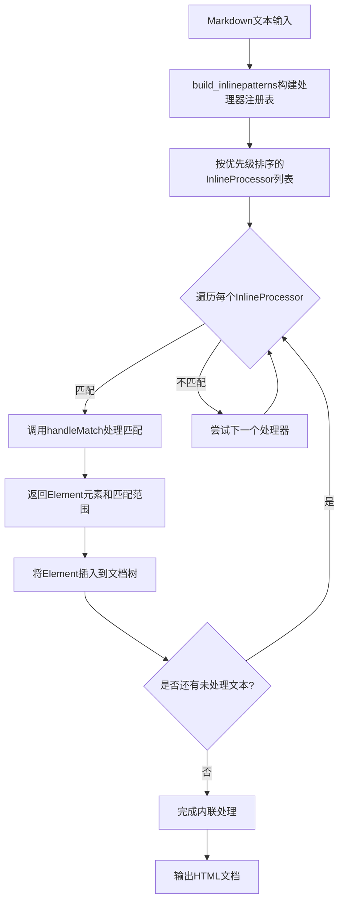
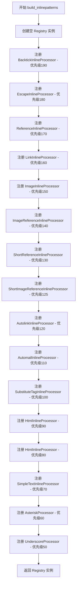
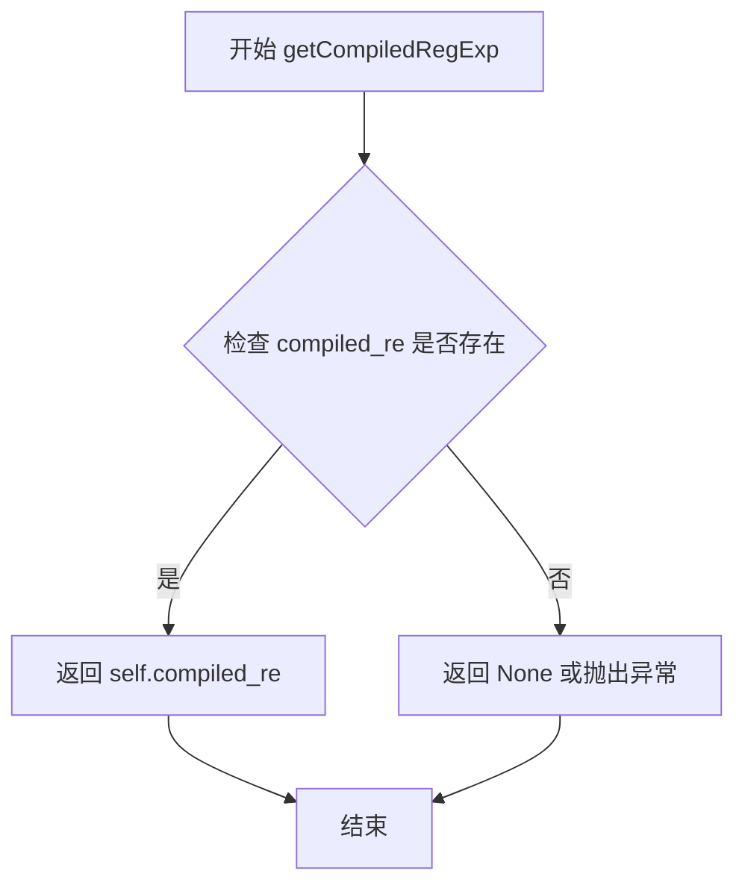
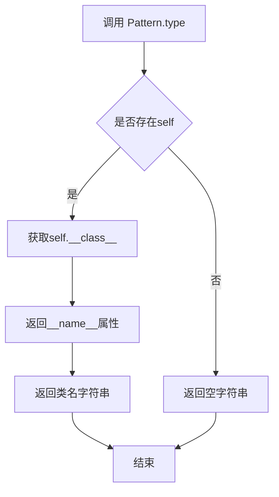
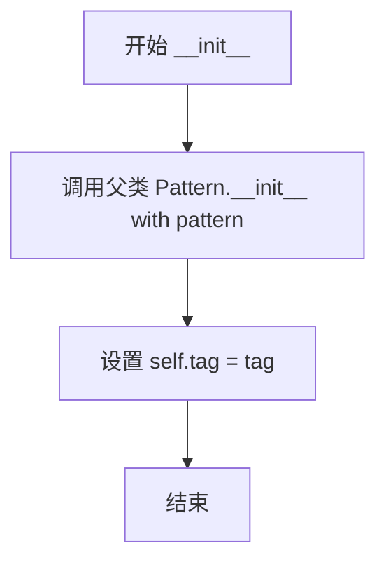
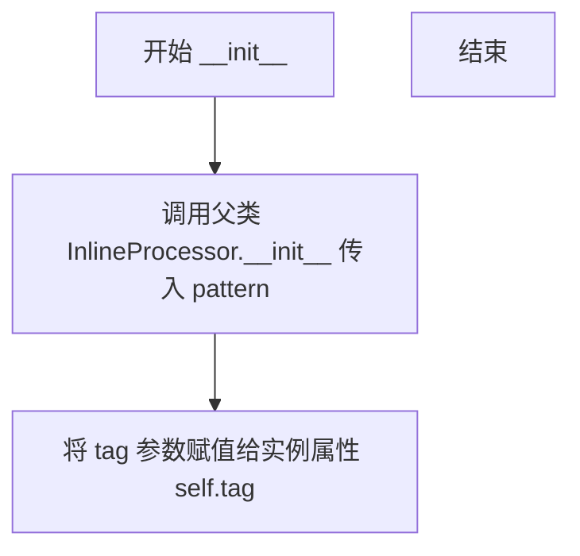
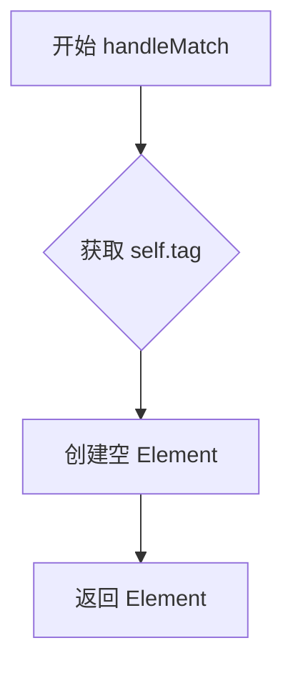
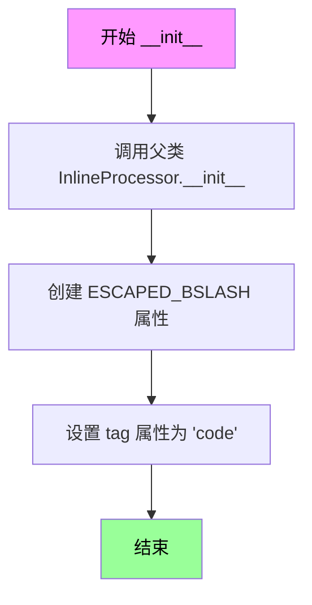

# `markdown\markdown\inlinepatterns.py` 详细设计文档

这是Python Markdown库的内联模式处理模块，负责解析和转换Markdown文本中的内联元素（如强调、加粗、链接、图片、HTML实体、转义字符等），将其转换为HTML元素树。该模块提供了旧式Pattern类和新式InlineProcessor类两种处理方式，支持通过正则表达式匹配并构建相应的XML元素。

## 整体流程



## 类结构

```
Pattern (旧式基类)
├── SimpleTextPattern
├── SimpleTagPattern
│   └── DoubleTagPattern
│   └── SubstituteTagPattern
└── InlineProcessor (新式基类)
    ├── SimpleTextInlineProcessor
    ├── EscapeInlineProcessor
    ├── SimpleTagInlineProcessor
    │   ├── SubstituteTagInlineProcessor
    │   └── DoubleTagInlineProcessor
    ├── BacktickInlineProcessor
    ├── HtmlInlineProcessor
    ├── AsteriskProcessor
    │   └── UnderscoreProcessor
    ├── LinkInlineProcessor
    │   ├── ImageInlineProcessor
    │   ├── ReferenceInlineProcessor
    │   │   ├── ShortReferenceInlineProcessor
    │   │   ├── ImageReferenceInlineProcessor
    │   │   └── ShortImageReferenceInlineProcessor
    ├── AutolinkInlineProcessor
    └── AutomailInlineProcessor
```

## 全局变量及字段


### `NOIMG`
    
用于匹配非图片前缀的正则表达式片段，确保不匹配图片链接

类型：`str`
    


### `BACKTICK_RE`
    
匹配反引号引用的字符串，包括单反引号和多反引号

类型：`str`
    


### `ESCAPE_RE`
    
匹配反斜杠转义字符

类型：`str`
    


### `EMPHASIS_RE`
    
匹配星号强调语法 *emphasis*

类型：`str`
    


### `STRONG_RE`
    
匹配星号加粗语法 **strong**

类型：`str`
    


### `SMART_STRONG_RE`
    
智能匹配下划线加粗语法，忽略单词内部的独立下划线

类型：`str`
    


### `SMART_EMPHASIS_RE`
    
智能匹配下划线强调语法，忽略单词内部的独立下划线

类型：`str`
    


### `SMART_STRONG_EM_RE`
    
智能匹配下划线组合强调和加粗语法 __strong _em__

类型：`str`
    


### `EM_STRONG_RE`
    
匹配星号组合强调和加粗语法 ***strongem*** 或 ***em*strong**

类型：`str`
    


### `EM_STRONG2_RE`
    
匹配下划线组合强调和加粗语法 ___emstrong___ 或 ___em_strong__

类型：`str`
    


### `STRONG_EM_RE`
    
匹配星号先加粗后强调语法 ***strong**em*

类型：`str`
    


### `STRONG_EM2_RE`
    
匹配下划线先加粗后强调语法 ___strong__em_

类型：`str`
    


### `STRONG_EM3_RE`
    
匹配星号组合强调和加粗语法变体 **strong*em***

类型：`str`
    


### `LINK_RE`
    
匹配行内链接的起始标记 [text](url)

类型：`str`
    


### `IMAGE_LINK_RE`
    
匹配行内图片链接的起始标记 

类型：`str`
    


### `REFERENCE_RE`
    
匹配引用链接的起始标记 [Label][3]

类型：`str`
    


### `IMAGE_REFERENCE_RE`
    
匹配图片引用链接的起始标记 ![alt text][2]

类型：`str`
    


### `NOT_STRONG_RE`
    
匹配独立的星号或下划线字符，不作为强调或加粗标记

类型：`str`
    


### `AUTOLINK_RE`
    
匹配自动链接语法 <http://www.example.com>

类型：`str`
    


### `AUTOMAIL_RE`
    
匹配自动邮件链接语法 <me@example.com>

类型：`str`
    


### `HTML_RE`
    
匹配HTML标签、注释、处理指令和CDATA节

类型：`str`
    


### `ENTITY_RE`
    
匹配HTML实体，包括十进制、十六进制和命名实体

类型：`str`
    


### `LINE_BREAK_RE`
    
匹配行末的两个空格，用于软换行

类型：`str`
    


### `Pattern.ANCESTOR_EXCLUDES`
    
定义不希望作为父元素的标签名称集合

类型：`Collection[str]`
    


### `Pattern.compiled_re`
    
编译后的正则表达式对象，用于匹配文本模式

类型：`re.Pattern[str]`
    


### `Pattern.md`
    
Markdown实例的引用，用于访问文档上下文

类型：`Markdown | None`
    


### `Pattern.pattern`
    
原始的正则表达式模式字符串

类型：`str`
    


### `InlineProcessor.compiled_re`
    
编译后的正则表达式对象，用于匹配文本模式

类型：`re.Pattern[str]`
    


### `InlineProcessor.md`
    
Markdown实例的引用，用于访问文档上下文

类型：`Markdown | None`
    


### `InlineProcessor.pattern`
    
原始的正则表达式模式字符串

类型：`str`
    


### `InlineProcessor.safe_mode`
    
安全模式标志，控制是否过滤不安全的内容

类型：`bool`
    


### `SimpleTagPattern.tag`
    
用于创建简单HTML标签的元素名

类型：`str`
    


### `SimpleTagInlineProcessor.tag`
    
用于创建简单HTML标签的元素名

类型：`str`
    


### `BacktickInlineProcessor.ESCAPED_BSLASH`
    
转义反斜杠的占位符字符串

类型：`str`
    


### `BacktickInlineProcessor.tag`
    
代码元素的HTML标签名，默认为'code'

类型：`str`
    


### `AsteriskProcessor.PATTERNS`
    
存储星号相关强调和加粗模式及其构建器的列表

类型：`list[EmStrongItem]`
    


### `UnderscoreProcessor.PATTERNS`
    
存储下划线相关强调和加粗模式及其构建器的列表

类型：`list[EmStrongItem]`
    


### `LinkInlineProcessor.RE_LINK`
    
用于解析链接URL和标题的正则表达式

类型：`re.Pattern`
    


### `LinkInlineProcessor.RE_TITLE_CLEAN`
    
用于清理链接标题中多余空白的正则表达式

类型：`re.Pattern`
    


### `ReferenceInlineProcessor.NEWLINE_CLEANUP_RE`
    
用于清理引用ID中换行符的正则表达式

类型：`re.Pattern`
    


### `ReferenceInlineProcessor.RE_LINK`
    
用于解析引用链接ID的正则表达式

类型：`re.Pattern`
    
    

## 全局函数及方法


### `build_inlinepatterns`

该函数是Python Markdown库的核心初始化函数，负责构建Markdown文本处理的内联模式处理器注册表。它按照严格的优先级顺序注册各种内联处理器（如反引号、转义、链接、图像、HTML实体、加粗、斜体等），确保Markdown解析的正确性和处理优先级。

参数：

- `md`：`Markdown`，Markdown实例对象，提供对Markdown文档对象的引用，用于初始化需要访问Markdown状态的内联处理器
- `**kwargs`：`Any`，可选关键字参数，用于传递额外的配置选项（当前代码中未使用，保留为扩展接口）

返回值：`util.Registry[InlineProcessor]`，返回一个包含所有已注册内联处理器的注册表对象，该注册表用于在Markdown解析过程中按优先级顺序匹配和处理内联内容

#### 流程图



#### 带注释源码

```python
def build_inlinepatterns(md: Markdown, **kwargs: Any) -> util.Registry[InlineProcessor]:
    """
    Build the default set of inline patterns for Markdown.

    The order in which processors and/or patterns are applied is very important - e.g. if we first replace
    `http://.../` links with `<a>` tags and _then_ try to replace inline HTML, we would end up with a mess. So, we
    apply the expressions in the following order:

    * backticks and escaped characters have to be handled before everything else so that we can preempt any markdown
      patterns by escaping them;

    * then we handle the various types of links (auto-links must be handled before inline HTML);

    * then we handle inline HTML.  At this point we will simply replace all inline HTML strings with a placeholder
      and add the actual HTML to a stash;

    * finally we apply strong, emphasis, etc.

    """
    # 创建一个新的Registry实例用于存储内联模式处理器
    inlinePatterns = util.Registry()
    
    # 注册反引号内联处理器 - 处理行内代码如 `code`
    inlinePatterns.register(BacktickInlineProcessor(BACKTICK_RE), 'backtick', 190)
    
    # 注册转义字符处理器 - 处理如 \* 的转义字符
    inlinePatterns.register(EscapeInlineProcessor(ESCAPE_RE, md), 'escape', 180)
    
    # 注册引用链接处理器 - 处理如 [text][ref] 的引用链接
    inlinePatterns.register(ReferenceInlineProcessor(REFERENCE_RE, md), 'reference', 170)
    
    # 注册普通链接处理器 - 处理如 [text](url) 的行内链接
    inlinePatterns.register(LinkInlineProcessor(LINK_RE, md), 'link', 160)
    
    # 注册图片链接处理器 - 处理如  的行内图片
    inlinePatterns.register(ImageInlineProcessor(IMAGE_LINK_RE, md), 'image_link', 150)
    
    # 注册图片引用处理器 - 处理如 ![alt][ref] 的引用图片
    inlinePatterns.register(
        ImageReferenceInlineProcessor(IMAGE_REFERENCE_RE, md), 'image_reference', 140
    )
    
    # 注册短引用链接处理器 - 处理如 [ref] 的短引用
    inlinePatterns.register(
        ShortReferenceInlineProcessor(REFERENCE_RE, md), 'short_reference', 130
    )
    
    # 注册短图片引用处理器 - 处理如 ![ref] 的短图片引用
    inlinePatterns.register(
        ShortImageReferenceInlineProcessor(IMAGE_REFERENCE_RE, md), 'short_image_ref', 125
    )
    
    # 注册自动链接处理器 - 处理如 <http://example.com> 的自动链接
    inlinePatterns.register(AutolinkInlineProcessor(AUTOLINK_RE, md), 'autolink', 120)
    
    # 注册自动邮件处理器 - 处理如 <me@example.com> 的自动邮件链接
    inlinePatterns.register(AutomailInlineProcessor(AUTOMAIL_RE, md), 'automail', 110)
    
    # 注册换行标签处理器 - 处理两个空格结尾的换行
    inlinePatterns.register(SubstituteTagInlineProcessor(LINE_BREAK_RE, 'br'), 'linebreak', 100)
    
    # 注册HTML内联处理器 - 处理原始HTML标签
    inlinePatterns.register(HtmlInlineProcessor(HTML_RE, md), 'html', 90)
    
    # 注册HTML实体处理器 - 处理如 &#38; 或 &amp; 的HTML实体
    inlinePatterns.register(HtmlInlineProcessor(ENTITY_RE, md), 'entity', 80)
    
    # 注册简单文本处理器 - 处理独立的强调标记避免误匹配
    inlinePatterns.register(SimpleTextInlineProcessor(NOT_STRONG_RE), 'not_strong', 70)
    
    # 注册星号强调处理器 - 处理使用星号的加粗和斜体
    inlinePatterns.register(AsteriskProcessor(r'\*'), 'em_strong', 60)
    
    # 注册下划线强调处理器 - 处理使用下划线的加粗和斜体
    inlinePatterns.register(UnderscoreProcessor(r'_'), 'em_strong2', 50)
    
    # 返回包含所有内联模式处理器的注册表
    return inlinePatterns
```


### `dequote`

该函数用于移除字符串两端的引号（双引号或单引号），如果字符串没有被引号包围则返回原字符串。

参数：

- `string`：`str`，需要移除引号的字符串

返回值：`str`，移除引号后的字符串，如果字符串没有被引号包围则返回原字符串

#### 流程图

```mermaid
flowchart TD
    A[开始 dequote] --> B{字符串是否以双引号开头和结尾?}
    B -->|是| C[返回 string[1:-1]]
    B -->|否| D{字符串是否以单引号开头和结尾?}
    D -->|是| C
    D -->|否| E[返回原字符串 string]
    C --> F[结束]
    E --> F
```

#### 带注释源码

```python
def dequote(string: str) -> str:
    """Remove quotes from around a string."""
    # 检查字符串是否被双引号包围
    if ((string.startswith('"') and string.endswith('"')) or
       # 或检查字符串是否被单引号包围
       (string.startswith("'") and string.endswith("'"))):
        # 移除首尾字符（引号）并返回
        return string[1:-1]
    else:
        # 未被引号包围，返回原字符串
        return string
```


### Pattern.__init__

这是 `Pattern` 类的构造函数，用于初始化内联模式处理器。该方法接受一个正则表达式模式和一个可选的 `Markdown` 实例，编译正则表达式并存储引用。

参数：

- `pattern`：`str`，要匹配的正则表达式模式
- `md`：`Markdown | None`，可选的 `Markdown` 实例指针，可在类实例中通过 `self.md` 访问

返回值：`None`，构造函数无返回值

#### 流程图

```mermaid
flowchart TD
    A[开始 __init__] --> B{检查 md 参数}
    B -->|有 md| C[保存 md 引用]
    B -->|无 md| D[md 设为 None]
    C --> E[保存 pattern 字符串]
    D --> E
    E --> F[编译正则表达式: r&quot;^(.*?)%pattern%(.*)$&quot;]
    F --> G[使用 re.DOTALL | re.UNICODE 标志]
    H[结束 __init__]
```

#### 带注释源码

```python
def __init__(self, pattern: str, md: Markdown | None = None):
    """
    Create an instant of an inline pattern.

    Arguments:
        pattern: A regular expression that matches a pattern.
        md: An optional pointer to the instance of `markdown.Markdown` and is available as
            `self.md` on the class instance.

    """
    # 保存原始正则表达式模式字符串
    self.pattern = pattern
    
    # 编译正则表达式：
    # - 模式被包裹在 r"^(.*?)%s(.*)$" 中
    # - ^(.*?) 匹配行首任意字符（非贪婪）
    # - %s 是传入的 pattern 模式
    # - (.*)$ 匹配行尾任意字符
    # - re.DOTALL: 使 . 匹配包括换行符在内的所有字符
    # - re.UNICODE: 启用 Unicode 匹配
    self.compiled_re = re.compile(r"^(.*?)%s(.*)$" % pattern,
                                  re.DOTALL | re.UNICODE)

    # 保存 Markdown 实例引用，供后续方法使用
    self.md = md
```


### `Pattern.getCompiledRegExp`

该方法返回在 Pattern 实例初始化时预编译的正则表达式对象，用于匹配 Markdown 内联模式。

参数：无（仅包含隐式参数 `self`）

返回值：`re.Pattern`，返回编译后的正则表达式对象

#### 流程图



#### 带注释源码

```python
def getCompiledRegExp(self) -> re.Pattern:
    """ Return a compiled regular expression. """
    # 直接返回在 __init__ 方法中编译的正则表达式对象
    # 该正则表达式在实例化时通过 re.compile 生成
    # 格式为: r"^(.*?)" + pattern + r"(.*)$"
    # 使用 re.DOTALL 和 re.UNICODE 标志
    return self.compiled_re
```


### `Pattern.handleMatch`

处理正则表达式匹配并返回对应的 ElementTree 元素。这是旧式内联模式的基类方法，子类应重写此方法以实现具体的匹配处理逻辑。

参数：

- `m`：`re.Match[str]`，包含模式匹配结果的匹配对象

返回值：`etree.Element | str`，ElementTree 元素对象或字符串

#### 流程图

```mermaid
flowchart TD
    A[开始 handleMatch] --> B{子类是否重写?}
    B -->|是 子类实现 --> C[返回具体处理结果]
    B -->|否 基类默认实现 --> D[返回 None/pass]
    C --> E[结束]
    D --> E
```

#### 带注释源码

```python
def handleMatch(self, m: re.Match[str]) -> etree.Element | str:
    """Return a ElementTree element from the given match.

    Subclasses should override this method.

    Arguments:
        m: A match object containing a match of the pattern.

    Returns: An ElementTree Element object.

    """
    pass  # pragma: no cover
```


# Python Markdown InlinePatterns 模块详细设计文档

## 一段话描述

该代码是Python Markdown库的内联模式处理模块（`inlinepatterns.py`），负责解析和转换Markdown文本中的内联元素，包括强调、加粗、链接、图片、转义字符、HTML实体等各类内联语法，将其转换为对应的HTML元素树。

## 文件的整体运行流程

```
1. 模块初始化
   ├── 定义全局正则表达式（各种Markdown模式的匹配规则）
   └── 定义辅助函数（dequote等）

2. 构建内联模式注册表 build_inlinepatterns(md)
   ├── 创建Registry实例
   └── 按优先级顺序注册各类InlineProcessor

3. Pattern类层次结构
   ├── Pattern (基类)
   │   ├── InlineProcessor (新型处理器)
   │   ├── SimpleTextPattern/SimpleTextInlineProcessor
   │   ├── EscapeInlineProcessor
   │   ├── SimpleTagPattern/SimpleTagInlineProcessor
   │   ├── SubstituteTagPattern/SubstituteTagInlineProcessor
   │   ├── BacktickInlineProcessor
   │   ├── DoubleTagPattern/DoubleTagInlineProcessor
   │   ├── HtmlInlineProcessor
   │   ├── AsteriskProcessor/UnderscoreProcessor
   │   ├── LinkInlineProcessor/ImageInlineProcessor
   │   ├── ReferenceInlineProcessor/ImageReferenceInlineProcessor
   │   ├── AutolinkInlineProcessor/AutomailInlineProcessor
   │   └── ... 其他处理器

4. 运行时流程
   ├── Markdown解析器调用InlineProcessor处理文本
   ├── 每个处理器通过handleMatch匹配正则表达式
   ├── 返回ElementTree元素或占位符
   └── 最终生成完整HTML文档
```

## 类的详细信息

### 核心类

| 类名 | 类型 | 描述 |
|------|------|------|
| `Pattern` | 基类 | 内联模式的基类，定义统一接口 |
| `InlineProcessor` | 类 | 新型内联处理器，支持更灵活的匹配方式 |
| `EmStrongItem` | 命名元组 | 存储强调/加粗模式的pattern、builder和tags |

### 全局变量

| 名称 | 类型 | 描述 |
|------|------|------|
| `NOIMG` | `str` | 负向后顾断言正则，匹配非图片前缀 |
| `BACKTICK_RE` | `str` | 反引号引用字符串匹配 |
| `ESCAPE_RE` | `str` | 反斜杠转义字符匹配 |
| `EMPHASIS_RE` | `str` | 星号强调匹配 |
| `STRONG_RE` | `str` | 星号加粗匹配 |
| `LINK_RE` | `str` | 内联链接匹配 |
| `IMAGE_LINK_RE` | `str` | 内联图片匹配 |
| `REFERENCE_RE` | `str` | 引用链接匹配 |
| `AUTOLINK_RE` | `str` | 自动链接匹配 |
| `AUTOMAIL_RE` | `str` | 自动邮件链接匹配 |
| `HTML_RE` | `str` | HTML标签匹配 |
| `ENTITY_RE` | `str` | HTML实体匹配 |
| `LINE_BREAK_RE` | `str` | 换行符匹配 |

### 全局函数

| 函数名 | 参数 | 返回值 | 描述 |
|--------|------|--------|------|
| `build_inlinepatterns` | `md: Markdown`, `**kwargs` | `util.Registry[InlineProcessor]` | 构建默认内联模式集合 |
| `dequote` | `string: str` | `str` | 移除字符串首尾引号 |

---

## 重点提取：Pattern.type 方法

### `Pattern.type`

该方法定义在内联模式的基类`Pattern`中，用于返回当前模式处理器的类型标识符。

#### 参数

- 无（仅包含隐式参数`self`）

#### 返回值

- `str`，返回当前类的类名，用于标识pattern类型

#### 流程图



#### 带注释源码

```python
def type(self) -> str:
    """ Return class name, to define pattern type """
    return self.__class__.__name__
```

**源码解析：**
- `self`：当前Pattern子类的实例
- `self.__class__`：获取实例对应的类对象
- `__name__`：Python类的内置属性，返回类的名称字符串
- 返回值：类名如"LinkInlineProcessor"、"EmphasisProcessor"等

---

## 关键组件信息

| 组件名称 | 描述 |
|----------|------|
| `Pattern` 基类 | 提供内联模式的标准接口，定义`type()`方法返回类名 |
| `InlineProcessor` | 新型内联处理器，支持返回匹配位置索引 |
| `AsteriskProcessor`/`UnderscoreProcessor` | 处理星号和下划线的强调/加粗嵌套 |
| `LinkInlineProcessor` | 处理标准内联链接语法 `[text](url)` |
| `ImageInlineProcessor` | 处理内联图片语法 `` |
| `HtmlInlineProcessor` | 处理原始HTML和HTML实体 |
| `EscapeInlineProcessor` | 处理转义字符如 `\*`、`\\` |
| `build_inlinepatterns` | 工厂函数，按优先级注册所有内联处理器 |

---

## 潜在的技术债务或优化空间

1. **正则表达式编译重复**：每个处理器实例都重新编译相同的正则表达式，可以考虑在类级别共享编译后的模式
2. **继承层次过深**：`SimpleTagPattern` → `SubstituteTagPattern`，`SimpleTagInlineProcessor` → `SubstituteTagInlineProcessor` 继承链较长，可考虑使用组合模式
3. **硬编码优先级数值**：在`build_inlinepatterns`中使用了魔法数字（190, 180, 160等），缺乏文档说明优先级逻辑
4. **Pattern类已标记为废弃**：`Pattern`基类标注了`pragma: no cover`，官方推荐使用`InlineProcessor`，但仍需维护向后兼容
5. **异常处理缺失**：部分方法如`getLink`的复杂解析逻辑缺乏详细的错误处理和边界情况测试
6. **类型注解不完整**：部分返回类型使用了`Any`或`None`，可以进一步细化

---

## 其它项目

### 设计目标与约束

- **向后兼容**：保留`Pattern`类以兼容第三方扩展
- **处理顺序敏感**：内联模式的应用顺序至关重要（如自动链接需在内联HTML之前处理）
- **性能优化**：新型`InlineProcessor`不需要匹配整个块，提升效率

### 错误处理与异常设计

- 使用`try/except KeyError`处理`stashed_nodes`不存在的情况
- `handleMatch`返回`None`表示匹配无效
- 链接解析中使用`handled`标志位追踪解析状态

### 数据流与状态机

```
输入Markdown文本
    ↓
逐个InlineProcessor尝试匹配
    ↓
匹配成功 → handleMatch处理 → 返回Element/占位符 + 位置索引
    ↓
匹配失败 → 继续下一个处理器
    ↓
所有处理器处理完毕 → 输出HTML元素树
```

### 外部依赖与接口契约

- `markdown.Markdown`：主解析器对象，通过`md`属性传递
- `xml.etree.ElementTree`：用于构建HTML元素
- `markdown.util`：工具模块，提供`STX`、`ETX`、`AtomicString`等
- `html.entities`：Python标准库，提供HTML实体名称映射


### `Pattern.unescape`

该方法是 `Pattern` 基类的一个实例方法，用于处理内联占位符的反转义操作。它从 Markdown 的内联处理器中获取之前存储的节点或元素，并将文本中的占位符替换回原始内容，支持字符串和 ElementTree 元素的恢复。

参数：

-  `text`：`str`，需要进行反转义的文本，其中包含内联占位符

返回值：`str`，反转义后的文本，替换了所有占位符为原始存储的内容

#### 流程图

```mermaid
flowchart TD
    A[开始: unescape text] --> B{尝试获取self.md.treeprocessors['inline'].stashed_nodes}
    B -->|成功| C[定义get_stash函数]
    B -->|失败 KeyError| D[直接返回原文本]
    C --> E{正则匹配占位符}
    E -->|匹配到占位符| F{占位符ID在stash中?}
    F -->|是| G{value是字符串?}
    F -->|否| E
    G -->|是| H[返回字符串value]
    G -->|否| I[返回元素的itertext拼接]
    H --> E
    I --> E
    E -->|无更多匹配| J[返回处理后的文本]
    D --> J
```

#### 带注释源码

```python
def unescape(self, text: str) -> str:
    """ Return unescaped text given text with an inline placeholder. """
    # 尝试从Markdown实例中获取内联处理器的stashed_nodes
    # stashed_nodes存储了之前被替换为占位符的原始内容
    try:
        stash = self.md.treeprocessors['inline'].stashed_nodes
    except KeyError:  # pragma: no cover
        # 如果获取失败（如内联处理器不存在），直接返回原文本
        return text

    def get_stash(m):
        """
        内部函数：用于正则替换回调
        从stash中根据占位符ID获取原始值
        """
        # 获取占位符中的ID（捕获组1）
        id = m.group(1)
        if id in stash:
            # 从stash获取存储的值
            value = stash.get(id)
            if isinstance(value, str):
                # 如果是字符串，直接返回
                return value
            else:
                # 如果是xml.etree.ElementTree.Element
                # 返回其文本内容的拼接（包含所有后代文本）
                return ''.join(value.itertext())
    
    # 使用INLINE_PLACEHOLDER_RE正则表达式替换所有占位符
    # INLINE_PLACEHOLDER_RE通常匹配类似\x02芯\x03的占位符格式
    return util.INLINE_PLACEHOLDER_RE.sub(get_stash, text)
```


### `InlineProcessor.__init__`

初始化 `InlineProcessor` 类的新实例，设置用于匹配内联模式的正则表达式和 Markdown 实例引用。

参数：

- `pattern`：`str`，用于匹配内联元素的标准正则表达式模式
- `md`：`Markdown | None`，指向 `markdown.Markdown` 实例的可选指针，可在类实例中作为 `self.md` 访问

返回值：`None`，构造函数不返回值

#### 流程图

```mermaid
flowchart TD
    A[开始 __init__] --> B[接收 pattern 和 md 参数]
    B --> C[将 pattern 存储到 self.pattern]
    C --> D[使用 re.compile 编译正则表达式<br/>re.DOTALL | re.UNICODE]
    D --> E[设置 self.compiled_re 为编译后的正则表达式]
    E --> F[初始化 self.safe_mode = False]
    F --> G[将 md 参数赋值给 self.md]
    G --> H[结束 __init__]
```

#### 带注释源码

```python
def __init__(self, pattern: str, md: Markdown | None = None):
    """
    Create an instant of an inline processor.

    Arguments:
        pattern: A regular expression that matches a pattern.
        md: An optional pointer to the instance of `markdown.Markdown` and is available as
            `self.md` on the class instance.

    """
    # 存储传入的正则表达式模式
    self.pattern = pattern
    
    # 编译正则表达式，使用 DOTALL 和 UNICODE 标志
    # DOTALL: 使 . 匹配包括换行符在内的所有字符
    # UNICODE: 启用 Unicode 匹配
    self.compiled_re = re.compile(pattern, re.DOTALL | re.UNICODE)

    # API for Markdown to pass `safe_mode` into instance
    # 初始化安全模式标志，默认为 False
    self.safe_mode = False
    
    # 存储对 Markdown 实例的引用，以便后续处理
    self.md = md
```


### `InlineProcessor.handleMatch`

该方法是一个抽象方法（模板方法），用于处理正则表达式匹配结果。它接收一个正则匹配对象和当前文本块，从中提取信息并构建 XML 元素树节点，同时计算该节点在原文本中的起止索引位置，以供 Markdown 处理器替换文本使用。

参数：
- `m`：`re.Match[str]`，正则表达式匹配对象，包含了具体的模式匹配结果。
- `data`：`str`，当前正在分析的全部文本内容（缓冲区）。

返回值：`tuple[etree.Element | str | None, int | None, int | None]`，返回一个元组，包含：
1.  `el`: 处理后的 ElementTree 元素、字符串文本或 None。
2.  `start`: 匹配文本在 `data` 中的起始索引，若为 None 则表示未找到有效区域。
3.  `end`: 匹配文本在 `data` 中的结束索引。

#### 流程图

```mermaid
graph TD
    A([开始 handleMatch]) --> B[输入: m (Match对象), data (全文)]
    B --> C{根据 m 和 data 实现具体逻辑}
    C -- 生成元素 --> D[创建 etree.Element 或 String]
    C -- 跳过处理 --> E[返回 None, None, None]
    D --> F[获取索引: start = m.start(0)]
    D --> G[获取索引: end = m.end(0)]
    F --> H[返回 Tuple[el, start, end]]
    G --> H
```

#### 带注释源码

```python
def handleMatch(self, m: re.Match[str], data: str) -> tuple[etree.Element | str | None, int | None, int | None]:
    """Return a ElementTree element from the given match and the
    start and end index of the matched text.

    If `start` and/or `end` are returned as `None`, it will be
    assumed that the processor did not find a valid region of text.

    Subclasses should override this method.

    Arguments:
        m: A re match object containing a match of the pattern.
        data: The buffer currently under analysis.

    Returns:
        el: The ElementTree element, text or None.
        start: The start of the region that has been matched or None.
        end: The end of the region that has been matched or None.

    """
    pass  # pragma: no cover
```


### `SimpleTextPattern.handleMatch`

该方法是 `SimpleTextPattern` 类的核心方法，用于从正则表达式匹配结果中提取简单的文本内容。它接收一个正则表达式匹配对象，并返回该匹配对象中第二个捕获组（即 `group(2)`）的内容。这种模式主要用于处理那些只需要提取纯文本而不需要生成 XML 元素的情况。

参数：

- `m`：`re.Match[str]`，包含正则表达式匹配结果的对象，其中 `group(2)` 存储了要提取的文本内容

返回值：`str`，返回匹配模式中第二个捕获组的文本内容

#### 流程图

```mermaid
flowchart TD
    A[开始 handleMatch] --> B{接收匹配对象 m}
    B --> C[调用 m.group(2)]
    C --> D[提取第二个捕获组内容]
    D --> E[返回文本字符串]
    E --> F[结束]
```

#### 带注释源码

```python
class SimpleTextPattern(Pattern):  # pragma: no cover
    """ 返回匹配模式中 group(2) 的简单文本。 """
    
    def handleMatch(self, m: re.Match[str]) -> str:
        """ 返回匹配模式的 group(2) 的字符串内容。
        
        该方法是 Pattern 基类 handleMatch 方法的简单实现，
        用于处理只需要提取纯文本而不需要生成 XML 元素的场景。
        
        参数:
            m: re.Match[str] 对象，包含正则表达式的匹配结果
            
        返回:
            str: 返回匹配对象中第二个捕获组的内容
        """
        # 直接返回匹配对象的 group(2)，即正则表达式中的第二个捕获组
        return m.group(2)
```


### `SimpleTextInlineProcessor.handleMatch`

该方法是 Markdown 库中 `SimpleTextInlineProcessor` 类的核心处理方法，用于处理非强调文本的内联模式匹配。它从正则表达式匹配对象中提取第一个捕获组的内容，并返回该文本内容及其在原始数据中的起始和结束索引位置，供上游调用者进行文本替换或进一步处理。

参数：

- `m`：`re.Match[str]`，正则表达式匹配对象，包含与 `NOT_STRONG_RE` 模式匹配的结果，其中 `group(1)` 保存实际匹配的文本内容
- `data`：`str`，当前正在分析的完整文本缓冲区，用于提供上下文信息（虽然此方法未直接使用）

返回值：`tuple[str, int, int]`，返回一个三元组，包含：匹配的第一个捕获组文本（`str`）、匹配项在 `data` 中的起始索引（`int`）、匹配项在 `data` 中的结束索引（`int`）

#### 流程图

```mermaid
flowchart TD
    A[开始 handleMatch] --> B[提取 m.group(1)]
    B --> C[提取 m.start(0)]
    C --> D[提取 m.end(0)]
    D --> E[返回三元组 文本, 起始索引, 结束索引]
    E --> F[结束]
```

#### 带注释源码

```python
class SimpleTextInlineProcessor(InlineProcessor):
    """ Return a simple text of `group(1)` of a Pattern. """
    def handleMatch(self, m: re.Match[str], data: str) -> tuple[str, int, int]:
        """ Return string content of `group(1)` of a matching pattern. """
        # m.group(1): 获取正则表达式第一个捕获组的内容
        # 即 NOT_STRONG_RE 模式中匹配的独立星号或下划线字符
        # m.start(0): 获取整个匹配项在原始数据中的起始位置
        # m.end(0): 获取整个匹配项在原始数据中的结束位置
        return m.group(1), m.start(0), m.end(0)
```

#### 关键组件信息

| 组件名称 | 一句话描述 |
|---------|-----------|
| `SimpleTextInlineProcessor` | 处理 Markdown 中非强 emphasis 的独立星号/下划线的内联处理器 |
| `NOT_STRONG_RE` | 正则表达式 `r'((^|(?<=\s))(\*{1,3}|_{1,3})(?=\s|$))'`，用于匹配独立的 `*` 或 `_` 字符 |
| `InlineProcessor` | 基类，提供内联处理器的通用接口和 `handleMatch` 方法签名 |
| `InlineProcessor.handleMatch` | 父类方法，定义了所有内联处理器必须实现的接口模式 |

#### 潜在的技术债务或优化空间

1. **功能过于简单**：当前实现仅为 `m.group(1), m.start(0), m.end(0)` 的直接透传，未进行任何额外处理（如转义、验证等），可以考虑在此层面增加统一的前置处理逻辑。

2. **未使用 `data` 参数**：方法签名包含 `data` 参数但未实际使用，造成了 API 设计上的冗余，可考虑重构或添加注释说明预期用途。

3. **错误处理缺失**：未对 `m.group(1)` 返回 `None` 的边界情况进行处理，可能导致上游调用时出现 `TypeError`。

4. **文档可改进**：类级别的 docstring 与方法级别的 docstring 几乎相同，未能充分说明该处理器在整体 Markdown 转换流程中的角色定位。

#### 其它项目

**设计目标与约束**：
- 该处理器在 `build_inlinepatterns` 中以优先级 70 注册，位于 HTML 实体处理之后、强强调处理之前
- 设计的核心目标是识别并保留独立的星号/下划线字符，防止它们被后续的强调/加粗处理器错误匹配

**错误处理与异常设计**：
- 依赖正则表达式匹配的有效性，假设 `m` 对象始终有效
- 当正则表达式未匹配时，该方法不会被调用，因此内部无需处理匹配失败的情况

**数据流与状态机**：
- 输入：正则表达式匹配对象 `m`（包含 `NOT_STRONG_RE` 的匹配结果）和当前文本块 `data`
- 输出：原始文本片段及其在原文本中的位置范围
- 该方法处于内联处理管道的末端，仅进行文本透传，不修改或转换内容

**外部依赖与接口契约**：
- 依赖 `re.Match` 对象的 `group()`、`start()`、`end()` 方法
- 遵循 `InlineProcessor.handleMatch` 定义的返回契约：`(Element | str | None, int | None, int | None)`


### `EscapeInlineProcessor.handleMatch`

该方法用于处理 Markdown 中的转义字符。当匹配到反斜杠转义字符（如 `\*`、`\\` 等）时，如果该字符在允许转义的字符列表中，则将其转换为特殊的占位符格式；否则返回 `None`，表示该匹配无效。

参数：

- `m`：`re.Match[str]`，正则表达式匹配对象，包含通过 `group(1)` 获取的被转义字符
- `data`：`str`，当前正在分析的整个文本缓冲区

返回值：`tuple[str | None, int, int]`，返回包含处理结果的元组：
- 第一个元素：转换后的转义字符串（位于 `util.STX` 和 `util.ETX` 之间），如果字符不在允许转义列表中则为 `None`
- 第二个元素：匹配文本的起始索引（`m.start(0)`）
- 第三个元素：匹配文本的结束索引（`m.end(0)`）

#### 流程图

```mermaid
flowchart TD
    A[开始 handleMatch] --> B[从匹配对象获取字符: char = m.group(1)]
    B --> C{字符是否在 ESCAPED_CHARS 中?}
    C -->|是| D[将字符转换为Unicode码点<br/>使用 ord(char) 获取码点]
    D --> E[构建转义字符串<br/>格式: STX + 码点 + ETX]
    E --> F[返回 元组: (转义字符串, 起始索引, 结束索引)]
    C -->|否| G[返回 元组: (None, 起始索引, 结束索引)]
    F --> H[结束]
    G --> H
```

#### 带注释源码

```python
def handleMatch(self, m: re.Match[str], data: str) -> tuple[str | None, int, int]:
    """
    处理转义字符匹配。

    如果 pattern 的 group(1) 匹配的字符在 ESCAPED_CHARS 中，
    则返回该字符的 Unicode 码点（由 ord() 返回），并包装在
    util.STX 和 util.ETX 中。

    如果匹配的字符不在 ESCAPED_CHARS 中，则返回 None。
    """
    # 从匹配结果中提取被转义的单字符（group(1) 匹配反斜杠后的字符）
    char = m.group(1)
    
    # 检查该字符是否属于允许转义的字符集合
    if char in self.md.ESCAPED_CHARS:
        # 将字符转换为转义格式：
        # 1. ord(char) 获取字符的 Unicode 码点
        # 2. 使用 STX (文本开始) 和 ETX (文本结束) 标记包裹
        # 这样可以在后续处理中识别并还原转义字符
        return '{}{}{}'.format(util.STX, ord(char), util.ETX), m.start(0), m.end(0)
    else:
        # 字符不在允许转义列表中，返回 None 表示该匹配无效
        # 仍需返回匹配的起始和结束位置
        return None, m.start(0), m.end(0)
```


### `SimpleTagPattern.__init__`

该方法是 `SimpleTagPattern` 类的构造函数，用于创建一个简单的标签模式实例。它继承自 `Pattern` 类，并额外接受一个 `tag` 参数来指定要渲染的 HTML 标签类型。

参数：

- `pattern`：`str`，一个正则表达式，用于匹配 Markdown 中的特定模式
- `tag`：`str`，要渲染的 HTML 元素标签（如 `strong`、`em` 等）

返回值：`None`，该方法为构造函数，不返回任何值

#### 流程图



#### 带注释源码

```python
def __init__(self, pattern: str, tag: str):
    """
    Create an instant of an simple tag pattern.

    Arguments:
        pattern: A regular expression that matches a pattern.
        tag: Tag of element.

    """
    Pattern.__init__(self, pattern)  # 调用父类 Pattern 的构造函数，初始化正则表达式和编译后的模式
    self.tag = tag  # 保存要渲染的 HTML 标签到实例属性
    """ The tag of the rendered element. """  # 用于存储渲染元素的标签名
```


### `SimpleTagPattern.handleMatch`

该方法接收一个正则表达式匹配对象，创建一个指定标签类型的 XML Element，将匹配对象中第3组的内容设置为 Element 的文本，并返回该 Element。

参数：

- `m`：`re.Match[str]`，包含模式匹配结果的匹配对象

返回值：`etree.Element`，包含匹配文本的 XML Element 元素

#### 流程图

```mermaid
flowchart TD
    A[开始 handleMatch] --> B[创建新 Element: etree.Element(self.tag)]
    B --> C[设置元素文本: el.text = m.group(3)]
    C --> D[返回 Element 对象]
```

#### 带注释源码

```python
def handleMatch(self, m: re.Match[str]) -> etree.Element:
    """
    Return [`Element`][xml.etree.ElementTree.Element] of type `tag` with the string in `group(3)` of a
    matching pattern as the Element's text.
    
    参数:
        m: 正则表达式匹配对象，包含模式匹配结果
        
    返回:
        XML Element 元素，其文本内容为匹配对象第3组的内容
    """
    # 创建一个指定标签类型（如 em, strong 等）的 XML Element
    el = etree.Element(self.tag)
    
    # 将匹配对象中第3组的内容设置为 Element 的文本属性
    el.text = m.group(3)
    
    # 返回构建好的 Element 对象
    return el
```


### `SimpleTagInlineProcessor.__init__`

该方法是 `SimpleTagInlineProcessor` 类的构造函数，用于创建一个简单的标签内联处理器实例。它继承自 `InlineProcessor`，接收一个正则表达式模式和一个标签名称，将模式编译后存储，并保存标签名称供后续处理匹配内容时使用。

参数：

- `self`：隐式的实例自身参数
- `pattern`：`str`，用于匹配文本的正则表达式模式
- `tag`：`str`，要渲染的 HTML 标签名称（如 `strong`、`em` 等）

返回值：`None`，构造函数无返回值

#### 流程图



#### 带注释源码

```python
def __init__(self, pattern: str, tag: str):
    """
    Create an instant of an simple tag processor.

    Arguments:
        pattern: A regular expression that matches a pattern.
        tag: Tag of element.

    """
    # 调用父类 InlineProcessor 的构造函数
    # 父类会完成以下操作：
    # 1. 将 pattern 存储到 self.pattern
    # 2. 使用 re.compile 将 pattern 编译成正则表达式并存入 self.compiled_re
    # 3. 初始化 self.safe_mode = False
    # 4. 将 md 参数赋值给 self.md
    InlineProcessor.__init__(self, pattern)
    
    # 将传入的 tag 参数存储为实例属性
    # 该属性在 handleMatch 方法中用于创建对应标签的 Element 节点
    self.tag = tag
    """ The tag of the rendered element. """
```


### `SimpleTagInlineProcessor.handleMatch`

该方法是 `SimpleTagInlineProcessor` 类的核心处理函数，专注于将 Markdown 中的简单文本修饰符（如加粗、斜体）转换为对应的 HTML 元素。它接收一个正则匹配对象，提取匹配文本中的第二组内容（即标签包裹的文本），构建一个 XML 元素，并返回该元素及其在原文中的起止位置。

#### 参数

- `m`：`re.Match[str]` ，正则表达式的匹配对象，包含了具体匹配到的字符串及其捕获组。
- `data`：`str`，当前正在处理的完整 Markdown 文本块（该方法逻辑中未直接使用 `data`，仅作接口继承使用）。

#### 返回值

`tuple[etree.Element, int, int]`
- 第一个元素：生成的 XML 元素（如 `<strong>`, `<em>`）。
- 第二个元素：匹配项在 `data` 中的起始索引 (`m.start(0)`)。
- 第三个元素：匹配项在 `data` 中的结束索引 (`m.end(0)`)。

#### 流程图

```mermaid
graph TD
    A[开始 handleMatch] --> B[创建 XML 元素 el, 标签为 self.tag]
    B --> C[从匹配对象 m 中获取 group(2) 的文本]
    C --> D[将文本设置为元素 el 的文本内容]
    D --> E[获取匹配起始位置: start = m.start(0)]
    E --> F[获取匹配结束位置: end = m.end(0)]
    F --> G[返回元组 (el, start, end)]
    G --> H[结束]
```

#### 带注释源码

```python
def handleMatch(self, m: re.Match[str], data: str) -> tuple[etree.Element, int, int]:  # pragma: no cover
    """
    Return [`Element`][xml.etree.ElementTree.Element] of type `tag` with the string in `group(2)` of a
    matching pattern as the Element's text.
    """
    # 1. 创建一个以 self.tag (如 'strong', 'em') 命名的 XML 元素
    el = etree.Element(self.tag)
    
    # 2. 从正则匹配结果中提取第2组的内容。
    # 对于如 r'(\*)([^\*]+)\1' 这样的正则（匹配 *text*），
    # group(1) 是开始的 *，group(2) 是中间的文本，group(3) 是结束的 *。
    el.text = m.group(2)
    
    # 3. 计算匹配项在原始数据中的索引范围，用于 Markdown 引擎替换原文中的对应片段
    # m.start(0) 和 m.end(0) 对应整个匹配项的起止位置
    return el, m.start(0), m.end(0)
```

#### 逻辑分析

作为资深架构师，我对这段代码的分析如下：

1.  **职责单一性**：该方法完美体现了“单一职责原则”。它仅仅负责将 regex match 转换为 Element 树节点，不涉及复杂的链接解析、引用查找或 HTML 转义。
2.  **性能考量**：该方法直接使用 `m.group(2)` 和索引进行操作，没有任何额外的字符串搜索或遍历操作，是处理速度最快的一类 InlineProcessor。
3.  **接口契约**：虽然接收了 `data` 参数，但方法内部未使用。这在 `InlineProcessor` 基类的实现中较为常见，因为对于简单的标签（如 `**bold**`），匹配器已经足够确定文本边界，无需回溯扫描 `data`。这种设计符合 Liskov 替换原则，子类可以忽略父类接口中不需要的参数。
4.  **潜在的优化空间**：由于该方法非常简洁，当前实现已接近最优。唯一的改进点可能在于错误处理（例如当 `m.group(2)` 为 `None` 时的行为），但根据调用链和正则表达式的定义，这种情况通常不会发生。


### `SubstituteTagPattern.handleMatch`

该方法是Python Markdown库中`SubstituteTagPattern`类的核心方法，继承自`SimpleTagPattern`，用于返回一个不包含任何子文本内容的空XML元素（如`<br/>`换行标签）。当正则表达式匹配到特定模式时，此方法会创建一个对应的空元素节点。

参数：

- `m`：`re.Match[str]`，正则表达式匹配对象，包含与模式匹配的结果信息

返回值：`etree.Element`，返回一个指定类型的空XML Element元素

#### 流程图



#### 带注释源码

```python
class SubstituteTagPattern(SimpleTagPattern):  # pragma: no cover
    """ Return an element of type `tag` with no children. """
    
    def handleMatch(self, m: re.Match[str]) -> etree.Element:
        """ Return empty [`Element`][xml.etree.ElementTree.Element] of type `tag`. """
        # 创建一个指定类型（self.tag）的空XML元素并返回
        # 该元素不包含任何文本内容或子元素
        return etree.Element(self.tag)
```


### `SubstituteTagInlineProcessor.handleMatch`

该方法是 `SubstituteTagInlineProcessor` 类的方法，用于处理 Markdown 中的简单替代标签（如换行符 `<br>`），返回一个无子元素的空 ElementTree 元素及其在文本中的起始和结束位置。

参数：

-  `m`：`re.Match[str]`，包含模式匹配结果的 match 对象
-  `data`：`str`，当前正在分析的整个文本缓冲区

返回值：`tuple[etree.Element, int, int]`，返回类型为 `tag` 的空 ElementTree 元素，以及匹配文本的起始位置 `m.start(0)` 和结束位置 `m.end(0)`

#### 流程图

```mermaid
flowchart TD
    A[开始 handleMatch] --> B[接收参数 m (Match对象) 和 data (文本缓冲区)]
    B --> C{执行匹配}
    C --> D[创建空 Element: etree.Element(self.tag)]
    D --> E[返回元组: 元素, m.start(0), m.end(0)]
    E --> F[结束]
    
    style A fill:#f9f,color:#333
    style D fill:#bbf,color:#333
    style E fill:#bfb,color:#333
```

#### 带注释源码

```python
class SubstituteTagInlineProcessor(SimpleTagInlineProcessor):
    """ 
    返回一个无子元素的指定类型标签的处理器。
    例如：用于处理 Markdown 中的两空格换行符 (line break)，
    将其转换为 HTML 的 <br> 标签。
    """
    
    def handleMatch(self, m: re.Match[str], data: str) -> tuple[etree.Element, int, int]:
        """
        处理匹配并返回一个空元素及其在文本中的位置。
        
        参数:
            m: 正则表达式匹配对象，包含匹配的起始和结束位置信息
            data: 当前正在处理的整个文本缓冲区（虽然此方法未使用）
            
        返回:
            tuple: 包含以下三个元素的元组:
                - etree.Element: 空的 XML 元素（如 <br/>）
                - int: 匹配文本的起始索引 (m.start(0))
                - int: 匹配文本的结束索引 (m.end(0))
        """
        # 创建空元素，元素类型由 self.tag 决定（如 'br'）
        # 注意：这里不设置任何子元素或文本内容，因此是"空"元素
        return etree.Element(self.tag), m.start(0), m.end(0)
```

#### 补充说明

| 项目 | 说明 |
|------|------|
| **类层次结构** | `SubstituteTagInlineProcessor` → `SimpleTagInlineProcessor` → `InlineProcessor` → `Pattern` |
| **用途** | 用于处理 Markdown 中需要替换为自闭合标签的简单模式（如换行符） |
| **注册方式** | 在 `build_inlinepatterns` 函数中通过 `SubstituteTagInlineProcessor(LINE_BREAK_RE, 'br')` 注册 |
| **匹配模式** | `LINE_BREAK_RE = r'  \n'`（两个空格后跟换行符） |
| **技术特点** | 这是一个极简处理器，仅创建空标签并返回匹配范围，不涉及复杂的文本解析或嵌套处理 |


### `BacktickInlineProcessor.__init__`

该方法是 `BacktickInlineProcessor` 类的初始化方法，负责初始化反引号内联处理器的实例。它继承自 `InlineProcessor` 类，设置用于匹配 Markdown 反引号代码块的正则表达式模式，并初始化用于转义反斜杠的占位符以及渲染元素的目标标签。

参数：

- `pattern`：`str`，用于匹配反引号代码块的正则表达式模式

返回值：`None`，该方法为构造函数，不返回值（隐式返回 `None`）

#### 流程图



#### 带注释源码

```python
def __init__(self, pattern: str):
    """
    初始化 BacktickInlineProcessor 实例。

    Arguments:
        pattern: 用于匹配反引号代码块的正则表达式模式
    """
    # 调用父类 InlineProcessor 的初始化方法
    # 父类会设置 self.pattern、self.compiled_re、self.safe_mode 和 self.md 属性
    InlineProcessor.__init__(self, pattern)
    
    # 设置反斜杠转义的占位符
    # util.STX 是文本开始标记，util.ETX 是文本结束标记
    # ord('\\') 返回反斜杠字符的 Unicode 码点 (92)
    # 格式: STX + 92 + ETX，用于在后续处理中标识转义的反斜杠
    self.ESCAPED_BSLASH = '{}{}{}'.format(util.STX, ord('\\'), util.ETX)
    
    # 设置渲染元素的标签为 'code'
    # 用于在 handleMatch 方法中创建 <code> 元素
    self.tag = 'code'
    """ The tag of the rendered element. """
```


### `BacktickInlineProcessor.handleMatch`

处理 Markdown 中的反引号内联代码块匹配。如果匹配到内容（group(3)存在），则返回一个包含转义文本的 `<code>` 元素；否则返回转义的反斜杠文本。

参数：

- `m`：`re.Match[str]`，正则表达式匹配对象，包含反引号代码块的捕获组
- `data`：`str`，正在分析的整个文本缓冲区

返回值：`tuple[etree.Element | str, int, int]`，返回元素（或字符串）、匹配起始索引、匹配结束索引

#### 流程图

```mermaid
flowchart TD
    A["开始 handleMatch"] --> B{"m.group(3) 是否存在?"}
    B -->|是| C["创建 <code> 元素"]
    C --> D["使用 code_escape 转义 group(3) 内容"]
    D --> E["包装为 AtomicString 设置为元素文本"]
    E --> F["返回 (元素, m.start(0), m.end(0))"]
    B -->|否| G["获取 m.group(1) 文本"]
    G --> H["替换双反斜杠为转义序列"]
    H --> I["返回 (转义文本, m.start(0), m.end(0))"]
    F --> J["结束"]
    I --> J
```

#### 带注释源码

```python
def handleMatch(self, m: re.Match[str], data: str) -> tuple[etree.Element | str, int, int]:
    """
    处理反引号内联代码块的匹配。

    如果匹配包含 group(3)（即实际代码内容），则返回包含 HTML 转义文本的 code 元素。
    如果没有 group(3)（即只有转义的反斜杠），则返回转义后的文本。

    参数:
        m: 正则表达式匹配对象，包含反引号模式的捕获组
        data: 当前正在分析的整个文本缓冲区

    返回:
        el: ElementTree 元素、字符串或 None
        start: 匹配区域的起始索引
        end: 匹配区域的结束索引
    """
    # 检查是否匹配到实际的代码内容（group(3)）
    if m.group(3):
        # 创建 <code> 元素
        el = etree.Element(self.tag)
        # 对代码内容进行 HTML 转义，并去除首尾空白
        # 使用 AtomicString 防止进一步转义
        el.text = util.AtomicString(util.code_escape(m.group(3).strip()))
        # 返回元素及其在原始文本中的位置范围
        return el, m.start(0), m.end(0)
    else:
        # 没有代码内容，可能是转义的反斜杠序列
        # 将双反斜杠替换为特殊的转义标记格式
        # 格式: STX + ord('\\') + ETX
        return m.group(1).replace('\\\\', self.ESCAPED_BSLASH), m.start(0), m.end(0)
```


### `DoubleTagPattern.handleMatch`

该方法用于处理双标签模式匹配，返回一个嵌套的 ElementTree 元素，其中外层标签为 `tag1`，内层标签为 `tag2`。适用于处理 Markdown 中的strong和emphasis等嵌套格式。

参数：

- `m`：`re.Match[str]`，包含模式匹配结果的匹配对象，其中 `group(3)` 为标签内容，`group(4)` 为可选的尾部内容

返回值：`etree.Element`，返回嵌套的 ElementTree 元素，格式为 `<tag1><tag2>group(3)</tag2>group(4)</tag2>`（其中 `group(4)` 可选）

#### 流程图

```mermaid
flowchart TD
    A[开始 handleMatch] --> B[从 self.tag 分离 tag1 和 tag2]
    B --> C[创建外层元素 el1]
    C --> D[创建内层子元素 el2 挂载到 el1]
    D --> E[设置 el2.text = m.group(3)]
    E --> F{匹配组数 == 5?}
    F -->|是| G[设置 el2.tail = m.group(4)]
    F -->|否| H[跳过尾部设置]
    G --> I[返回 el1]
    H --> I
```

#### 带注释源码

```python
def handleMatch(self, m: re.Match[str]) -> etree.Element:
    """
    Return ElementTree Element in following format:
    `<tag1><tag2>group(3)</tag2>group(4)</tag2>` where `group(4)` is optional.
    
    参数:
        m: 包含模式匹配结果的 Match 对象
            - group(1): 外层标签的匹配（可选）
            - group(2): 内层标签的匹配（可选）
            - group(3): 标签内的文本内容
            - group(4): 标签后的尾部文本（可选，仅当有5个匹配组时存在）
            - group(5): 最外层标签的尾部（可选）
    
    返回:
        嵌套的 ElementTree Element，外层标签为 tag1，内层为 tag2
    """
    # 从 self.tag 属性中分离出两个标签名（格式如 "strong,em"）
    tag1, tag2 = self.tag.split(",")
    
    # 创建外层元素（如 <strong> 或 <em>）
    el1 = etree.Element(tag1)
    
    # 创建内层子元素并挂载到外层元素上（如 <em> 嵌套在 <strong> 内）
    el2 = etree.SubElement(el1, tag2)
    
    # 将匹配到的第三个分组内容设置为内层元素的文本
    el2.text = m.group(3)
    
    # 如果匹配组数为5（即包含 group(4)），则设置内层元素的尾部文本
    # 这允许处理如 "**bold *italic* bold**" 这样的情况
    if len(m.groups()) == 5:
        el2.tail = m.group(4)
    
    # 返回构建完成的嵌套元素
    return el1
```


### `DoubleTagInlineProcessor.handleMatch`

处理匹配的双标签内联处理器，用于生成嵌套的 XML 元素（如 `<strong><em>...</em></strong>`）。

参数：

- `m`：`re.Match[str]`，正则表达式匹配对象，包含模式的匹配结果
- `data`：`str`，当前正在分析的文本缓冲区

返回值：`tuple[etree.Element, int, int]`，返回创建的嵌套元素、匹配文本的起始位置和结束位置

#### 流程图

```mermaid
flowchart TD
    A[开始 handleMatch] --> B{从 self.tag 获取标签}
    B --> C[用逗号分割 tag1 和 tag2]
    D[创建外层元素 el1] --> E[创建内层子元素 el2]
    E --> F[设置 el2.text = m.group(2)]
    F --> G{检查匹配组数量}
    G -->|等于 3| H[设置 el2.tail = m.group(3)]
    G -->|不等于 3| I[跳过尾部设置]
    H --> J[返回 el1, m.start(0), m.end(0)]
    I --> J
```

#### 带注释源码

```python
def handleMatch(self, m: re.Match[str], data: str) -> tuple[etree.Element, int, int]:
    """
    处理双标签内联匹配，返回嵌套的 ElementTree 元素。

    返回格式：<tag1><tag2>group(2)</tag2>group(3)</tag2>，其中 group(3) 是可选的。

    参数:
        m: 正则表达式匹配对象，包含模式的匹配结果
        data: 当前正在分析的文本缓冲区

    返回:
        el1: 嵌套的 ElementTree 元素
        start: 匹配文本的起始位置
        end: 匹配文本的结束位置
    """
    # 从 self.tag 属性获取标签，格式为 "tag1,tag2"（如 "strong,em"）
    tag1, tag2 = self.tag.split(",")
    
    # 创建外层元素（如 <strong>）
    el1 = etree.Element(tag1)
    
    # 创建内层子元素（如 <em>），嵌套在外层元素内
    el2 = etree.SubElement(el1, tag2)
    
    # 将匹配组 2 的内容设置为内层元素的文本（如强调文本内容）
    el2.text = m.group(2)
    
    # 如果存在第 3 个匹配组（可选的尾部文本），将其设置为内层元素的 tail
    # 这允许处理如 ***strong em*** 这样的情况
    if len(m.groups()) == 3:
        el2.tail = m.group(3)
    
    # 返回创建的嵌套元素及匹配文本的起止位置
    return el1, m.start(0), m.end(0)
```


### `HtmlInlineProcessor.handleMatch`

该函数是 Markdown 解析器中处理内联 HTML（标签、注释、CDATA 等）的核心方法。它接收一个正则匹配对象，提取原始 HTML 内容，进行反转义处理，然后将其安全地存储到内部存储器中以供后续渲染，同时返回一个占位符来替代原文中的 HTML 片段，从而防止 Markdown 语法在该片段内被解析。

#### 参数

- `m`：`re.Match[str]`，正则表达式匹配对象，包含了被检测到的 HTML 片段（如 `<b>`, `<!-- comment -->` 等）。
- `data`：`str`，当前正在分析的整行文本（buffer）。

#### 返回值

`tuple[str, int, int]`
- 第一个元素：用于替换原始 HTML 的占位符字符串（从 `htmlStash` 获取）。
- 第二个元素：匹配项在 `data` 中的起始索引 (`m.start(0)`)。
- 第三个元素：匹配项在 `data` 中的结束索引 (`m.end(0)`)。

#### 流程图

```mermaid
flowchart TD
    A([Start handleMatch]) --> B[提取匹配内容: raw = m.group(1)]
    B --> C{调用 self.unescape}
    C -->|处理嵌套占位符| D{调用 self.backslash_unescape}
    D -->|处理 Markdown 转义字符<br>如 `\<` 还原为 `<`| E[调用 md.htmlStash.store]
    E -->|将处理后的 HTML 存入存储器| F[获取 Placeholder]
    F --> G[返回 Tuple(Placeholder, start, end)]
```

#### 带注释源码

```python
def handleMatch(self, m: re.Match[str], data: str) -> tuple[str, int, int]:
    """ Store the text of `group(1)` of a pattern and return a placeholder string. """
    # 1. 获取匹配到的原始 HTML 字符串（不包含外层括号）
    rawhtml = m.group(1)
    
    # 2. 第一次反转义：处理可能存在的内联占位符（防止嵌套解析）
    # Pattern.unescape 会查找 INLINE_PLACEHOLDER 并尝试还原为存储的节点或文本
    rawhtml = self.unescape(rawhtml)
    
    # 3. 第二次反转义：处理 Markdown 的反斜杠转义
    # 例如 HTML 实体中的转义序列 \&#39; 或反斜杠转义 \<div>
    rawhtml = self.backslash_unescape(rawhtml)
    
    # 4. 存储处理后的 HTML 到 htmlStash，防止后续处理将其视为 Markdown 语法
    # htmlStash 会返回一个唯一的占位符字符串（如 '\x02...\x03'）
    place_holder = self.md.htmlStash.store(rawhtml)
    
    # 5. 返回占位符以及该 HTML 在原文本中的起止位置
    # 这样解析器可以用占位符替换原文中的这段 HTML
    return place_holder, m.start(0), m.end(0)
```

#### 关键组件与依赖说明

*   **htmlStash**: `self.md.htmlStash` 是 Markdown 实例的一个组件，用于暂存原始 HTML 代码，防止其干扰 Markdown 解析流程，并在最终渲染阶段将其还原。
*   **unescape (Pattern类)**: 基类方法，用于处理已被替换为占位符的文本还原。
*   **backslash_unescape**: `HtmlInlineProcessor` 特有的方法，用于处理 Markdown 标准的反斜杠转义（如将 `\&lt;` 还原为 `<`），确保 HTML 标签不被 Markdown 解析器误伤。
*   **HTML_RE**: 定义在模块级别的正则表达式，用于匹配 HTML 标签、注释、PI 和 CDATA。


### `HtmlInlineProcessor.unescape`

该方法用于处理包含内联占位符的文本，将占位符替换为之前存储的 HTML 节点或原始文本内容，并支持递归处理嵌套的占位符。

参数：

- `text`：`str`，需要处理的包含内联占位符的文本

返回值：`str`，处理后的文本，其中占位符已被替换为实际内容

#### 流程图

```mermaid
flowchart TD
    A[开始 unescape] --> B{能否获取 stashed_nodes}
    B -->|成功| C[遍历文本中的占位符]
    B -->|失败 KeyError| D[直接返回原文本]
    C --> E{获取占位符 ID 对应的值}
    E -->|值为 None| F[返回带反斜杠的原始值]
    E -->|值不为 None| G{尝试序列化元素}
    G -->|成功| H[递归调用 unescape]
    G -->|失败| F
    H --> I[返回处理后的文本]
    F --> I
    I --> J[替换所有占位符]
    J --> K[返回最终文本]
    D --> K
```

#### 带注释源码

```python
def unescape(self, text: str) -> str:
    """
    Return unescaped text given text with an inline placeholder.
    处理包含内联占位符的文本，返回转义后的文本。
    
    参数:
        text: 包含内联占位符的字符串
        
    返回:
        处理后的字符串，占位符已被替换为实际内容
    """
    # 尝试从 markdown 实例的 treeprocessors 获取内联处理的存储节点
    try:
        stash = self.md.treeprocessors['inline'].stashed_nodes
    except KeyError:  # pragma: no cover
        # 如果获取失败，直接返回原始文本
        return text

    # 定义内部函数用于获取存储的值
    def get_stash(m: re.Match[str]) -> str:
        # 获取占位符的 ID
        id = m.group(1)
        # 从存储中获取对应 ID 的值
        value = stash.get(id)
        if value is not None:
            try:
                # 确保没有占位符嵌套在另一个占位符中
                # 递归调用 unescape 处理可能的嵌套情况
                return self.unescape(self.md.serializer(value))
            except Exception:
                # 如果序列化失败，返回带反斜杠的原始值
                return r'\%s' % value

    # 使用正则表达式替换所有占位符
    return util.INLINE_PLACEHOLDER_RE.sub(get_stash, text)
```


### `HtmlInlineProcessor.backslash_unescape`

该方法用于恢复文本中的反斜杠转义字符，将形如 `\NNN`（八进制）或 `\xNN`（十六进制）的转义序列还原为对应的字符。

参数：

- `text`：`str`，需要处理的文本，包含待还原的反斜杠转义序列

返回值：`str`，已还原反斜杠转义后的文本

#### 流程图

```mermaid
flowchart TD
    A[开始: backslash_unescape] --> B{尝试获取 unescape 正则表达式}
    B -->|成功| C[定义内部函数 _unescape]
    B -->|KeyError 异常| D[直接返回原文本]
    C --> E[使用正则替换文本]
    E --> F[对每个匹配调用 _unescape]
    F --> G[将捕获组转换为整数并返回对应字符]
    G --> H[返回替换后的文本]
    D --> H
```

#### 带注释源码

```python
def backslash_unescape(self, text: str) -> str:
    """
    Return text with backslash escapes undone (backslashes are restored).
    
    该方法处理 HTML 内联处理器中的反斜杠转义还原。它通过调用 Markdown 实例中
    的 treeprocessors['unescape'] 获取用于匹配转义序列的正则表达式，然后
    将匹配到的转义序列（如 \123 或 \x41）转换为对应的字符。
    
    参数:
        text: 包含反斜杠转义序列的字符串
        
    返回:
        已还原转义序列的字符串
    """
    # 尝试从 Markdown 处理器获取 'unescape' tree processor 的正则表达式
    # 该正则表达式用于匹配反斜杠转义的字符（如 \n, \t, \123, \x41 等）
    try:
        RE = self.md.treeprocessors['unescape'].RE
    except KeyError:  # pragma: no cover
        # 如果获取失败（不存在 unescape processor），直接返回原文本
        return text

    # 定义内部转换函数，将匹配到的转义序列转换为对应字符
    def _unescape(m: re.Match[str]) -> str:
        # m.group(1) 捕获的是转义序列中的数字部分（如 123 或 41）
        # 将其转换为整数后，用 chr() 获取对应的字符
        return chr(int(m.group(1)))

    # 使用正则表达式的 sub 方法进行全局替换
    # RE 通常匹配形如 \NNN（八进制）或 \xNN（十六进制）的模式
    return RE.sub(_unescape, text)
```


### `AsteriskProcessor.build_single`

该方法用于构建单个强调/加粗标签（如 `<em>` 或 `<strong>`），从正则匹配中提取文本内容，并递归解析其中的子模式。

参数：

- `m`：`re.Match[str]`，正则表达式匹配对象，包含要处理的文本匹配信息
- `tag`：`str`，要创建的 XML 元素标签名称（如 "em" 或 "strong"）
- `idx`：`int`，当前处理的模式索引，用于避免重复处理父元素已用过的模式

返回值：`etree.Element`，返回构建好的单个 XML 元素

#### 流程图

```mermaid
flowchart TD
    A[开始 build_single] --> B[创建 XML 元素 el1]
    B --> C[从匹配对象 m 获取 group(2) 文本]
    C --> D[调用 parse_sub_patterns 解析子模式]
    D --> E[将解析后的内容附加到 el1]
    E --> F[返回 el1 元素]
```

#### 带注释源码

```python
def build_single(self, m: re.Match[str], tag: str, idx: int) -> etree.Element:
    """Return single tag."""
    # 创建一个新的 XML 元素，标签名为传入的 tag 参数（如 'em' 或 'strong'）
    el1 = etree.Element(tag)
    
    # 从正则匹配对象中获取第2个捕获组的内容，这是强调/加粗的实际文本内容
    text = m.group(2)
    
    # 调用 parse_sub_patterns 方法递归解析文本中的子模式（如嵌套的强调或加粗）
    # 参数：text-要解析的文本, el1-父元素, None-没有上一个子元素, idx-当前模式索引
    self.parse_sub_patterns(text, el1, None, idx)
    
    # 返回构建好的 XML 元素
    return el1
```


### `AsteriskProcessor.build_double`

该方法用于构建双层嵌套的 HTML 标签（例如 `<strong><em>...</em></strong>`），专门处理 Markdown 中的 `***` 或 `___` 等组合强调语法。它首先创建外层和内层元素，然后递归调用 `parse_sub_patterns` 来处理内部可能存在的进一步嵌套（尽管在单次 `build_double` 调用中通常处理主要文本），最后处理可能的尾部文本。

参数：

-   `m`：`re.Match[str]`，正则表达式匹配对象，包含了当前处理的 Markdown 强调语法的匹配组（例如 `group(2)` 是主要文本，`group(3)` 是尾部文本）。
-   `tags`：`str`，逗号分隔的标签字符串，格式为 `"外层标签,内层标签"`（例如 `"strong,em"` 或 `"em,strong"`）。
-   `idx`：`int`，当前使用的模式索引，用于在递归解析子模式时跳过导致当前匹配的同一模式，防止无限递归。

返回值：`etree.Element`，返回构建好的 XML/HTML 元素树对象。

#### 流程图

```mermaid
flowchart TD
    A([开始 build_double]) --> B[拆分 tags 获取 tag1, tag2]
    B --> C[创建外层元素 el1 (tag1)]
    C --> D[创建内层元素 el2 (tag2)]
    D --> E[提取 m.group(2) 作为主要文本]
    E --> F{调用 parse_sub_patterns}
    F --> G[将解析结果附加到 el2]
    G --> H[将 el2 添加为 el1 的子元素]
    H --> I{判断匹配组数量 == 3?}
    I -- 是 --> J[提取 m.group(3) 作为尾部文本]
    J --> K[调用 parse_sub_patterns 处理尾部]
    K --> L[将尾部文本附加到 el1 (作为 el2 的 tail)]
    I -- 否 --> M([返回 el1])
    L --> M
```

#### 带注释源码

```python
def build_double(self, m: re.Match[str], tags: str, idx: int) -> etree.Element:
    """Return double tag (e.g., <strong><em>text</em></strong>)."""
    
    # 1. 解析标签字符串，tag1 为外层标签，tag2 为内层标签
    # 例如 tags="strong,em" -> tag1="strong", tag2="em"
    tag1, tag2 = tags.split(",")
    
    # 2. 创建 XML 元素
    el1 = etree.Element(tag1)  # 外层元素
    el2 = etree.Element(tag2)  # 内层元素
    
    # 3. 获取主要文本内容 (通常对应正则表达式的 group(2))
    # 例如对于 ***text***，这里获取 'text'
    text = m.group(2)
    
    # 4. 递归解析主要文本中的子模式（处理嵌套的强调）
    # 将解析后的子元素添加到 el2 (内层元素) 中
    self.parse_sub_patterns(text, el2, None, idx)
    
    # 5. 将内层元素 el2 追加到外层元素 el1 中
    el1.append(el2)
    
    # 6. 检查是否存在第三个捕获组 (group(3))
    # 这用于处理如 ***em*strong** 这种结构，其中 'strong' 是 group(3)
    # 它代表内层标签闭合后，在外层标签闭合前剩余的文本
    if len(m.groups()) == 3:
        text = m.group(3)
        # 解析这部分文本，并将其作为 el2 的尾部 (tail) 添加到 el1 中
        # 参数 parent 是 el1，last 是 el2
        self.parse_sub_patterns(text, el1, el2, idx)
        
    # 7. 返回构建好的外层元素
    return el1
```


### `AsteriskProcessor.build_double2`

该方法用于构建双重标签（变体2），返回 `<strong>text <em>text</em></strong>` 格式的嵌套元素，处理如 `**strong *em***` 这类强强调混合的Markdown语法。

参数：

- `self`：`AsteriskProcessor`，方法所属的类实例
- `m`：`re.Match[str]`，正则表达式匹配对象，包含匹配到的文本分组
- `tags`：`str`，标签字符串，格式为 `"tag1,tag2"`（如 `"strong,em"`）
- `idx`：`int`，当前模式索引，用于递归解析子模式

返回值：`etree.Element`，返回构建好的双重嵌套XML元素

#### 流程图

```mermaid
flowchart TD
    A[开始 build_double2] --> B[分割 tags 为 tag1 和 tag2]
    B --> C[创建外层元素 el1]
    C --> D[创建内层元素 el2]
    D --> E[提取 m.group(2) 作为第一段文本]
    E --> F[调用 parse_sub_patterns 解析文本并附加到 el1]
    F --> G[提取 m.group(3) 作为第二段文本]
    G --> H[将 el2 添加为 el1 的子元素]
    H --> I[调用 parse_sub_patterns 解析文本并附加到 el2]
    I --> J[返回外层元素 el1]
```

#### 带注释源码

```python
def build_double2(self, m: re.Match[str], tags: str, idx: int) -> etree.Element:
    """Return double tags (variant 2): `<strong>text <em>text</em></strong>`."""

    # 分割标签字符串，如 "strong,em" 分割为 "strong" 和 "em"
    tag1, tag2 = tags.split(",")
    
    # 创建外层元素（例如 <strong>）
    el1 = etree.Element(tag1)
    
    # 创建内层元素（例如 <em>）
    el2 = etree.Element(tag2)
    
    # 获取第一个捕获组的文本内容（例如 "text " 在 <strong>text <em>text</em></strong> 中）
    text = m.group(2)
    
    # 递归解析子模式，将文本解析并附加到外层元素 el1
    # 参数：文本内容、父元素、最后的子元素、当前模式索引
    self.parse_sub_patterns(text, el1, None, idx)
    
    # 获取第二个捕获组的文本内容（例如 "text" 在 <em>text</em> 中）
    text = m.group(3)
    
    # 将内层元素 el2 添加为外层元素 el1 的子元素
    el1.append(el2)
    
    # 递归解析子模式，将文本解析并附加到内层元素 el2
    self.parse_sub_patterns(text, el2, None, idx)
    
    # 返回构建好的外层元素
    return el1
```


### `AsteriskProcessor.parse_sub_patterns`

该方法用于递归解析文本中的下级强调（emphasis）和加粗（strong）模式。它接收一段文本数据和父元素，遍历文本查找与当前模式索引之后的正则表达式匹配项，将匹配的文本转换为对应的HTML元素（em或strong），并将其附加到父元素上。处理完成后返回`None`。

参数：

- `data`：`str`，要评估的文本
- `parent`：`etree.Element`，要附加文本和子元素的父元素
- `last`：`etree.Element | None`，父元素的最后一个附加子元素。如果父元素没有子元素，则为`None`
- `idx`：用于评估父元素的当前模式索引

返回值：`None`，该方法直接修改`parent`元素，不返回任何值

#### 流程图

```mermaid
flowchart TD
    A[开始 parse_sub_patterns] --> B[初始化 offset=0, pos=0]
    B --> C{pos < length?}
    C -->|是| D{compiled_re.match{data, pos}?}
    C -->|否| L[处理剩余文本]
    
    D -->|是| E[matched = False]
    D -->|否| M[pos += 1]
    M --> C
    
    E --> F[遍历 PATTERNS 列表]
    F --> G{index <= idx?}
    G -->|是| H[跳过当前模式]
    G -->|否| I{item.pattern.match{data, pos}?}
    
    I -->|否| J{还有更多模式?}
    J -->|是| F
    J -->|否| K[pos += 1]
    K --> C
    
    I -->|是| M1[提取文本 data[offset:m.start(0)]]
    M1 --> N{last is not None?}
    N -->|是| O[last.tail = text]
    N -->|否| P[parent.text = text]
    
    O --> Q[build_element 创建元素]
    P --> Q
    Q --> R[parent.append(el)]
    R --> S[last = el]
    S --> T[offset = pos = m.end(0)]
    T --> U[matched = True]
    U --> C
    
    L --> V{text 非空?}
    V -->|是| W{last is not None?}
    V -->|否| X[结束]
    
    W -->|是| Y[last.tail = text]
    W -->|否| Z[parent.text = text]
    
    Y --> X
    Z --> X
```

#### 带注释源码

```python
def parse_sub_patterns(
    self, data: str, parent: etree.Element, last: etree.Element | None, idx: int
) -> None:
    """
    Parses sub patterns.

    `data`: text to evaluate.

    `parent`: Parent to attach text and sub elements to.

    `last`: Last appended child to parent. Can also be None if parent has no children.

    `idx`: Current pattern index that was used to evaluate the parent.
    """

    offset = 0  # 记录已处理文本的起始位置
    pos = 0     # 当前遍历位置

    length = len(data)  # 待处理文本的总长度
    while pos < length:
        # 查找潜在强调或加粗标记的起始位置
        if self.compiled_re.match(data, pos):
            matched = False
            # 检查是否能匹配到强调/加粗模式
            for index, item in enumerate(self.PATTERNS):
                # 只评估比父元素使用的模式索引更大的模式
                if index <= idx:
                    continue
                m = item.pattern.match(data, pos)
                if m:
                    # 将子节点附加到父元素
                    # 文本节点应附加到最后一个子节点（如果存在），
                    # 如果不存在，则作为父元素的文本节点添加
                    text = data[offset:m.start(0)]
                    if text:
                        if last is not None:
                            last.tail = text
                        else:
                            parent.text = text
                    # 根据匹配结果构建对应的元素（em或strong）
                    el = self.build_element(m, item.builder, item.tags, index)
                    parent.append(el)
                    last = el
                    # 将位置移动到匹配文本之后
                    offset = pos = m.end(0)
                    matched = True
            if not matched:
                # 未匹配到任何模式，移动到下一个字符
                pos += 1
        else:
            # 未找到潜在强调标记的起始位置，位置递增
            pos += 1

    # 将剩余文本作为文本节点追加
    text = data[offset:]
    if text:
        if last is not None:
            last.tail = text
        else:
            parent.text = text
```


### `AsteriskProcessor.build_element`

该方法是`AsteriskProcessor`类的元素构建器，负责根据传入的匹配结果和构建类型（single、double、double2）来构造相应的XML元素（em、strong或它们的组合）。

参数：

- `m`：`re.Match[str]`，包含正则表达式匹配结果的对象
- `builder`：`str`，构建器类型，值为`'single'`、`'double'`或`'double2'`，决定了调用哪个内部构建方法
- `tags`：`str`，标签字符串，如`'strong,em'`表示外层是strong内层是em
- `index`：`int`，当前模式在PATTERNS列表中的索引，用于递归解析子模式时避免重复匹配相同的模式

返回值：`etree.Element`，返回构建好的XML元素

#### 流程图

```mermaid
flowchart TD
    A[开始 build_element] --> B{builder == 'double2'?}
    B -->|Yes| C[调用 build_double2]
    B --> No --> D{builder == 'double'?}
    D -->|Yes| E[调用 build_double]
    D --> No --> F[调用 build_single]
    C --> G[返回元素]
    E --> G
    F --> G
```

#### 带注释源码

```python
def build_element(self, m: re.Match[str], builder: str, tags: str, index: int) -> etree.Element:
    """Element builder."""

    # 根据builder类型选择不同的构建方法
    if builder == 'double2':
        # 处理双标签变体2: <strong>text <em>text</em></strong>
        return self.build_double2(m, tags, index)
    elif builder == 'double':
        # 处理双标签: <em><strong>text</strong></em> 或 <strong><em>text</em></strong>
        return self.build_double(m, tags, index)
    else:
        # 处理单标签: <em>text</em> 或 <strong>text</strong>
        return self.build_single(m, tags, index)
```


### `AsteriskProcessor.handleMatch`

该方法是AsteriskProcessor类的核心方法，用于解析Markdown文本中的星号（*）强调和加粗语法。它通过遍历预定义的模式列表，在给定的数据字符串中匹配相应的强调/加粗模式，并构建对应的HTML元素（`<em>`、`<strong>`等），同时返回元素在原始文本中的起始和结束位置。

参数：

- `m`：`re.Match[str]`，正则表达式匹配对象，包含当前处理的匹配结果
- `data`：`str`，待处理的完整文本数据，用于在其中进行模式匹配

返回值：`tuple[etree.Element | None, int | None, int | None]`

- 第一个元素：生成的ElementTree元素（`<em>`或`<strong>`）或None
- 第二个元素：匹配文本的起始位置
- 第三个元素：匹配文本的结束位置

#### 流程图

```mermaid
flowchart TD
    A[开始 handleMatch] --> B[初始化 el=None, start=None, end=None]
    B --> C[遍历 self.PATTERNS 列表]
    C --> D{当前索引是否<br/>在模式列表中?}
    D -->|是| E[从 m.start(0) 位置开始<br/>匹配当前模式]
    E --> F{匹配成功?}
    F -->|是| G[获取匹配的起始和结束位置]
    G --> H[调用 build_element<br/>构建元素]
    H --> I[返回 el, start, end]
    F -->|否| J[继续下一个模式]
    D -->|否| J
    J --> C
    C --> K{所有模式匹配完毕?}
    K -->|是| L[返回 None, None, None]
    I --> M[结束]
    L --> M
```

#### 带注释源码

```python
def handleMatch(self, m: re.Match[str], data: str) -> tuple[etree.Element | None, int | None, int | None]:
    """Parse patterns.
    
    该方法遍历预定义的模式列表，在data中从m.start(0)位置开始匹配，
    一旦找到匹配的模式，就构建相应的HTML元素并返回。
    
    Arguments:
        m: 正则表达式匹配对象，包含当前处理单元的匹配结果
        data: 完整的文本数据，在其中进行模式匹配
        
    Returns:
        el: 生成的ElementTree元素（em或strong），如果未匹配则返回None
        start: 匹配文本的起始位置，如果未匹配则返回None
        end: 匹配文本的结束位置，如果未匹配则返回None
    """
    
    # 初始化返回值
    el = None       # 存储生成的元素
    start = None    # 匹配起始位置
    end = None      # 匹配结束位置
    
    # 遍历所有预定义的强调/加粗模式
    # PATTERNS 列表包含以下模式（按优先级顺序）:
    # 1. EM_STRONG_RE: ***strongem*** 或 ***em*strong**
    # 2. STRONG_EM_RE: ***strong**em*
    # 3. STRONG_EM3_RE: **strong*em***
    # 4. STRONG_RE: **strong**
    # 5. EMPHASIS_RE: *emphasis*
    for index, item in enumerate(self.PATTERNS):
        # 在data中从m.start(0)位置开始匹配当前模式
        # item.pattern 是编译后的正则表达式
        # item.builder 指示使用哪种构建方法（single/double/double2）
        # item.tags 指示生成的HTML标签（strong,em等）
        m1 = item.pattern.match(data, m.start(0))
        
        if m1:
            # 找到匹配，获取匹配的起始和结束位置
            start = m1.start(0)
            end = m1.end(0)
            
            # 构建相应的元素
            # 根据builder类型选择不同的构建方法
            el = self.build_element(m1, item.builder, item.tags, index)
            
            # 一旦找到匹配就退出循环（优先级高的模式先匹配）
            break
    
    # 返回元素、起始位置和结束位置的元组
    # 如果没有匹配成功，el、start、end都为None
    return el, start, end
```


### `LinkInlineProcessor.handleMatch`

处理内联链接语法（如 `[text](url)` 或 `[text](url "title")`），解析链接文本、URL 和标题，并返回对应的 HTML `<a>` 元素及在原文中的起止位置。

参数：

- `self`：`LinkInlineProcessor`，LinkInlineProcessor 类的实例
- `m`：`re.Match[str]`，正则表达式匹配对象，包含对链接文本部分（`[` 内的内容）的匹配结果
- `data`：`str`，完整的待处理文本数据，包含链接的完整上下文

返回值：`tuple[etree.Element | None, int | None, int | None]`，返回元组包含：解析得到的 `<a>` 元素（或解析失败时为 None）、链接在 data 中的起始位置（失败时为 None）、链接在 data 中的结束位置（失败时为 None）

#### 流程图

```mermaid
flowchart TD
    A[开始 handleMatch] --> B[调用 getText 解析 [text] 部分]
    B --> C{是否成功解析?}
    C -->|否| D[返回 None, None, None]
    C -->|是| E[调用 getLink 解析 (url "title") 部分]
    E --> F{是否成功解析?}
    F -->|否| D
    F -->是 --> G[创建 a 元素]
    G --> H[设置元素文本为链接文本]
    H --> I[设置 href 属性为 URL]
    J --> J{有标题?}
    J -->|是| K[设置 title 属性]
    J -->|否| L[跳过设置 title]
    K --> L
    L --> M[返回元素, 起始位置, 结束位置]
```

#### 带注释源码

```python
def handleMatch(self, m: re.Match[str], data: str) -> tuple[etree.Element | None, int | None, int | None]:
    """ Return an `a` [`Element`][xml.etree.ElementTree.Element] or `(None, None, None)`. """
    # 1. 解析链接文本部分（[...]中的内容）
    # m.end(0) 是正则匹配到的 [ 之后的起始位置
    # getText 方法处理嵌套的方括号
    text, index, handled = self.getText(data, m.end(0))

    # 2. 如果链接文本解析失败，返回空元组
    if not handled:
        return None, None, None

    # 3. 解析 URL 和标题部分（(...)中的内容）
    # index 是链接文本结束后的下一个位置
    href, title, index, handled = self.getLink(data, index)
    if not handled:
        return None, None, None

    # 4. 创建 <a> 元素并设置属性
    el = etree.Element("a")
    el.text = text  # 设置链接显示文本

    el.set("href", href)  # 设置 href 属性

    # 5. 如果存在标题，设置 title 属性
    if title is not None:
        el.set("title", title)

    # 6. 返回元素及在原文中的起止位置
    # m.start(0) 是 [ 的位置，index 是链接结束后的位置
    return el, m.start(0), index
```


### `LinkInlineProcessor.getLink`

该方法负责解析 Markdown 链接中括号 `()` 内的内容，包括链接地址（href）和可选的标题（title），支持嵌套括号和不同引号格式（单引号、双引号）。

参数：
- `data`：`str`，需要解析的文本数据，包含完整的 Markdown 链接内容
- `index`：`int`，开始解析的位置索引，指向 `(` 之后的第一个字符

返回值：`tuple[str, str | None, int, bool]`
- 第一个元素 `str`：解析得到的 href（链接地址）
- 第二个元素 `str | None`：解析得到的 title（标题），如果没有则为 None
- 第三个元素 `int`：解析结束后的索引位置
- 第四个元素 `bool`：是否成功处理了该链接

#### 流程图

```mermaid
flowchart TD
    A[开始 getLink] --> B[初始化: href='', title=None, handled=False]
    B --> C{使用 RE_LINK 正则匹配 data 从 index 位置}
    C --> D{匹配成功且存在 group1?}
    D -->|Yes| E[提取 href: 去掉首尾尖括号并 strip]
    E --> F{存在 group2?}
    F -->|Yes| G[提取 title: 去掉首尾引号]
    F -->|No| H[title 保持 None]
    G --> I[index = m.end(0), handled = True]
    H --> I
    D -->|No| J[手动解析嵌套括号]
    I --> K[清理 title: 去除多余空白, dequote, unescape]
    K --> L[清理 href: unescape, strip]
    L --> M[返回 (href, title, index, handled)]
    
    J --> J1[bracket_count=1, backtrack_count=1, quote=None]
    J1 --> J2{遍历 data[pos] 从 index 到 len(data)}
    J2 --> J3{c == '('?}
    J3 -->|Yes| J4[bracket_count += 1]
    J3 -->|No| J5{c == ')'?}
    J5 -->|Yes| J6{处理退出引号情况}
    J5 -->|No| J7{c 是引号?}
    J7 -->|Yes| J8[处理引号开始/结束]
    J7 -->|No| J9[更新 last = c]
    J6 --> J10{bracket_count == 0?}
    J4 --> J10
    J8 --> J10
    J9 --> J10
    J10 -->|Yes| J11[提取 href 和 title]
    J10 -->|No| J2
    J11 --> M
```

#### 带注释源码

```python
def getLink(self, data: str, index: int) -> tuple[str, str | None, int, bool]:
    """Parse data between `()` of `[Text]()` allowing recursive `()`. """

    # 初始化默认返回值
    href = ''
    title: str | None = None
    handled = False

    # 使用正则表达式匹配括号内的内容，格式如: (<link> "title") 或 (<link> 'title')
    m = self.RE_LINK.match(data, pos=index)
    if m and m.group(1):
        # 情况1: 匹配到 [Text](<link> "title") 格式
        # 提取链接地址，去掉首尾尖括号并去除多余空白
        href = m.group(1)[1:-1].strip()
        # 如果存在标题，提取标题（去掉首尾引号）
        if m.group(2):
            title = m.group(2)[1:-1]
        # 更新索引位置到匹配结束处
        index = m.end(0)
        # 标记已成功处理
        handled = True
    elif m:
        # 情况2: 需要手动解析嵌套括号 [Text](link "title") 或 [Text](link)
        # 括号计数器，跟踪 '(' 和 ')' 的嵌套深度
        bracket_count = 1
        # 回溯计数器，用于处理标题解析失败时的备用结束位置
        backtrack_count = 1
        start_index = m.end()  # 链接内容的起始位置
        index = start_index
        last_bracket = -1  # 最后一个有效的括号位置

        # 主引号（第一个引号）追踪
        quote: str | None = None
        start_quote = -1  # 标题内容起始位置
        exit_quote = -1   # 标题内容结束位置
        ignore_matches = False  # 是否忽略括号匹配（进入标题区域）

        # 备用引号追踪（处理双引号情况）
        alt_quote = None
        start_alt_quote = -1
        exit_alt_quote = -1

        # 记录最后一个非空白字符
        last = ''

        # 遍历数据字符，解析嵌套的括号和引号
        for pos in range(index, len(data)):
            c = data[pos]
            if c == '(':
                # 遇到开括号，增加嵌套深度
                if not ignore_matches:
                    bracket_count += 1
                elif backtrack_count > 0:
                    backtrack_count -= 1
            elif c == ')':
                # 遇到闭括号，减少嵌套深度
                # 如果在已关闭的标题中且引号是最后一个字符，重置括号计数
                if ((exit_quote != -1 and quote == last) or (exit_alt_quote != -1 and alt_quote == last)):
                    bracket_count = 0
                elif not ignore_matches:
                    bracket_count -= 1
                elif backtrack_count > 0:
                    backtrack_count -= 1
                    # 记录备用结束位置，以防标题解析失败
                    if backtrack_count == 0:
                        last_bracket = index + 1

            elif c in ("'", '"'):
                # 处理引号开始或结束
                if not quote:
                    # 首次遇到引号，进入标题区域
                    ignore_matches = True
                    backtrack_count = bracket_count
                    bracket_count = 1
                    start_quote = index + 1
                    quote = c
                # 处理备用引号（第二个引号）
                elif c != quote and not alt_quote:
                    start_alt_quote = index + 1
                    alt_quote = c
                # 主引号关闭
                elif c == quote:
                    exit_quote = index + 1
                # 备用引号关闭
                elif alt_quote and c == alt_quote:
                    exit_alt_quote = index + 1

            index += 1

            # 括号嵌套已闭合，解析完成
            if bracket_count == 0:
                # 根据引号关闭位置提取标题和链接
                if exit_quote >= 0 and quote == last:
                    # 情况: [text](link "title") - 单引号标题
                    href = data[start_index:start_quote - 1]
                    title = ''.join(data[start_quote:exit_quote - 1])
                elif exit_alt_quote >= 0 and alt_quote == last:
                    # 情况: [text](link 'title') - 双引号作为备用
                    href = data[start_index:start_alt_quote - 1]
                    title = ''.join(data[start_alt_quote:exit_alt_quote - 1])
                else:
                    # 情况: [text](link) - 无标题
                    href = data[start_index:index - 1]
                break

            # 记录最后一个非空白字符
            if c != ' ':
                last = c

        # 处理边缘情况: 标题字符串解析失败，使用回溯位置
        # 场景: [test](link"notitle) - 引号未正确闭合
        if bracket_count != 0 and backtrack_count == 0:
            href = data[start_index:last_bracket - 1]
            index = last_bracket
            bracket_count = 0

        # 标记处理状态
        handled = bracket_count == 0

    # 清理标题: 去除多余空白并去转义
    if title is not None:
        title = self.RE_TITLE_CLEAN.sub(' ', dequote(self.unescape(title.strip())))

    # 清理链接: 去除转义字符和多余空白
    href = self.unescape(href).strip()

    return href, title, index, handled
```


### `LinkInlineProcessor.getText`

解析方括号内的文本内容，支持嵌套方括号的处理。

参数：

- `data`：`str`，待解析的文本数据，包含链接或图像的文本部分
- `index`：`int`，开始解析的起始索引位置

返回值：`tuple[str, int, bool]`

- `str`：解析得到的文本内容
- `int`：解析结束后的下一个索引位置
- `bool`：是否成功解析（当括号完全匹配时返回 `True`，否则返回 `False`）

#### 流程图

```mermaid
flowchart TD
    A[开始 getText] --> B[初始化 bracket_count = 1, text = []]
    B --> C{遍历 data 从 index 开始}
    C -->|遍历中| D{当前字符 c}
    D -->|c == ']'| E[bracket_count -= 1]
    D -->|c == '['| F[bracket_count += 1]
    D -->|其他字符| G[继续]
    E --> H[index += 1]
    F --> H
    G --> H
    H --> I{bracket_count == 0?}
    I -->|是| J[break 退出循环]
    I -->|否| C
    J --> K[将 text 列表连接为字符串]
    K --> L[返回 (text_str, index, bracket_count == 0)]
    L --> M[结束]
```

#### 带注释源码

```python
def getText(self, data: str, index: int) -> tuple[str, int, bool]:
    """Parse the content between `[]` of the start of an image or link
    resolving nested square brackets.

    该方法用于解析链接或图像标记中位于 `[]` 内的文本内容。
    支持嵌套方括号，例如 [[link]](url) 这种情况。

    参数:
        data: 完整的 Markdown 文本数据
        index: 开始解析的位置（通常是 '[' 之后的第一个字符位置）

    返回值:
        tuple[str, int, bool]: 解析得到的文本、结束索引、是否成功解析
    """
    # 初始化括号计数器，从1开始表示需要匹配一个开始的 '['
    bracket_count = 1
    # 用于存储解析得到的文本字符
    text = []
    
    # 从指定索引开始遍历数据
    for pos in range(index, len(data)):
        c = data[pos]
        
        # 遇到闭合括号 ']'，减少括号计数
        if c == ']':
            bracket_count -= 1
        # 遇到开始括号 '[',增加括号计数，支持嵌套
        elif c == '[':
            bracket_count += 1
        
        # 更新索引位置
        index += 1
        
        # 如果括号已经完全匹配（计数为0），退出循环
        if bracket_count == 0:
            break
        
        # 将当前字符添加到文本列表中
        text.append(c)
    
    # 将字符列表连接成字符串，返回结果
    # 返回值包含：解析的文本、当前索引位置、是否成功解析
    return ''.join(text), index, bracket_count == 0
```


### `ImageInlineProcessor.handleMatch`

该方法是`ImageInlineProcessor`类的核心方法，负责处理内联图像语法（如``或``），通过调用父类的`getText`和`getLink`方法解析文本和链接信息，然后构建并返回对应的HTML ``元素及其在原始数据中的位置边界。

#### 参数

- `m`：`re.Match[str]`，正则表达式匹配对象，包含与图像模式（如`![...]`）的匹配结果
- `data`：`str`，当前正在分析的完整文本缓冲区

#### 返回值

`tuple[etree.Element | None, int | None, int | None]`

- 成功时：返回包含``元素的元组，元素本身、匹配起始索引、匹配结束索引
- 失败时：返回`(None, None, None)`表示无法处理该匹配

#### 流程图

```mermaid
flowchart TD
    A[开始 handleMatch] --> B[调用 getText 获取 alt 文本]
    B --> C{handled 是否为 True?}
    C -->|否| D[返回 None, None, None]
    C -->|是| E[调用 getLink 获取 src 和 title]
    E --> F{handled 是否为 True?}
    F -->|否| D
    F -->|是| G[创建 img 元素]
    G --> H[设置 src 属性]
    H --> I{title 存在?}
    I -->|是| J[设置 title 属性]
    I -->|否| K[设置 alt 属性]
    J --> K
    K --> L[返回元素, m.start(0), index]
```

#### 带注释源码

```python
def handleMatch(self, m: re.Match[str], data: str) -> tuple[etree.Element | None, int | None, int | None]:
    """ Return an `img` [`Element`][xml.etree.ElementTree.Element] or `(None, None, None)`. """
    # 第一步：解析图像 alt 文本部分
    # 调用父类 LinkInlineProcessor 的 getText 方法
    # 从匹配结束位置开始解析 [] 中的内容
    text, index, handled = self.getText(data, m.end(0))
    
    # 如果无法解析 alt 文本（如括号不匹配），返回空
    if not handled:
        return None, None, None

    # 第二步：解析图像链接和标题
    # 从 alt 文本结束后开始解析 () 中的 URL 和可选标题
    src, title, index, handled = self.getLink(data, index)
    
    # 如果无法解析链接（如括号不匹配），返回空
    if not handled:
        return None, None, None

    # 第三步：构建 img 元素
    el = etree.Element("img")

    # 设置 src 属性为图像 URL
    el.set("src", src)

    # 如果存在可选标题，设置 title 属性
    if title is not None:
        el.set("title", title)

    # 设置 alt 属性，注意需要对文本进行 unescape 处理
    # 以还原可能存在的转义字符
    el.set('alt', self.unescape(text))
    
    # 返回构建的元素以及该匹配在原始数据中的起止位置
    # m.start(0) 是整个匹配的起始位置（即 ! 的位置）
    # index 是整个匹配（包括 [] 和 ()）的结束位置
    return el, m.start(0), index
```


### `ReferenceInlineProcessor.handleMatch`

该方法用于处理 Markdown 中的引用链接（如 `[text][ref]` 或 `[text][ref_id]`），从预定义的引用字典中查找匹配的 URL 和标题，并返回对应的 HTML `<a>` 元素。如果引用未定义或解析失败，则返回 `(None, None, None)`。

参数：

- `m`：`re.Match[str]`，正则表达式匹配对象，包含对引用链接模式的匹配结果
- `data`：`str`，当前正在分析的完整文本缓冲区

返回值：`tuple[etree.Element | None, int | None, int | None]`，返回一个元组，包含：
- `el`：生成的 `<a>` 元素，或解析失败时为 `None`
- `start`：匹配文本的起始位置，或失败时为 `None`
- `end`：匹配文本的结束位置，或失败时为 `None`

#### 流程图

```mermaid
flowchart TD
    A[开始 handleMatch] --> B[调用 getText 获取链接文本]
    B --> C{handled 是否为 True?}
    C -->|否| D[返回 None, None, None]
    C -->|是| E[调用 evalId 获取引用 ID]
    E --> F{handled 是否为 True?}
    F -->|否| D
    F -->|是| G[清理 ID 中的换行符]
    G --> H{ID 是否在 references 字典中?}
    H -->|否| I[返回 None, m.start(0), end]
    H -->|是| J[获取 href 和 title]
    J --> K[调用 makeTag 生成元素]
    K --> L[返回元素, m.start(0), end]
```

#### 带注释源码

```python
def handleMatch(self, m: re.Match[str], data: str) -> tuple[etree.Element | None, int | None, int | None]:
    """
    Return Element returned by makeTag method or (None, None, None).
    
    处理引用链接的匹配，将 Markdown 引用链接转换为 HTML 锚点元素。
    
    参数:
        m: 正则表达式匹配对象，包含对引用链接模式的匹配结果
        data: 当前正在分析的完整文本缓冲区
    
    返回:
        包含元素、起始位置和结束位置的元组，或失败时返回 (None, None, None)
    """
    # 第一步：提取链接显示文本 [text] 部分
    # 使用从父类 LinkInlineProcessor 继承的 getText 方法
    # 该方法处理嵌套方括号
    text, index, handled = self.getText(data, m.end(0))
    
    # 如果无法提取文本，解析失败
    if not handled:
        return None, None, None

    # 第二步：评估引用 ID 部分 [id] 或使用文本作为 ID
    # evalId 方法处理 [ref][id] 和 [ref][] 两种形式
    id, end, handled = self.evalId(data, index, text)
    
    # 如果无法评估 ID，解析失败
    if not handled:
        return None, None, None

    # 清理 ID 中的换行符和多余空白
    # 将多行空白替换为单个空格，便于查找引用
    id = self.NEWLINE_CLEANUP_RE.sub(' ', id)
    
    # 第三步：在 Markdown 对象的 references 字典中查找引用
    # references 字典在文档解析前通过定义性引用块填充
    if id not in self.md.references:  # 忽略未定义的引用
        # 对于未定义的引用，返回 None 但保留匹配范围
        return None, m.start(0), end

    # 从字典中获取 URL 和标题
    href, title = self.md.references[id]

    # 第四步：生成锚点元素
    # makeTag 方法创建 <a> 元素并设置 href、title 和文本内容
    return self.makeTag(href, title, text), m.start(0), end
```


### ReferenceInlineProcessor.evalId

评估引用标识符部分，处理 `[ref][id]` 或 `[ref][]` 格式的引用链接。

参数：
- `self`：`ReferenceInlineProcessor`，方法所属的类实例
- `data`：`str`，包含完整 Markdown 文本的数据缓冲区
- `index`：`int`，当前解析位置（指向 `[ref][` 后的位置）
- `text`：`str`，方括号内的文本内容（用于回退作为 ID）

返回值：`tuple[str | None, int, bool]`，返回元组包含：
- 第一个元素：解析得到的引用 ID（字符串）或 None（解析失败时）
- 第二个元素：匹配文本的结束位置
- 第三个元素：布尔值，表示是否成功解析

#### 流程图

```mermaid
flowchart TD
    A[开始 evalId] --> B{RE_LINK 是否匹配 data[index:]?}
    B -->|否| C[返回 None, index, False]
    B -->|是| D[提取 group(1) 并转为小写]
    D --> E[获取匹配结束位置 end = m.end(0)]
    E --> F{id 是否为空?}
    F -->|是| G[id = text.lower()]
    F -->|否| H[保持当前 id]
    G --> I[返回 id, end, True]
    H --> I
```

#### 带注释源码

```python
def evalId(self, data: str, index: int, text: str) -> tuple[str | None, int, bool]:
    """
    Evaluate the id portion of `[ref][id]`.

    If `[ref][]` use `[ref]`.
    
    参数:
        data: 包含完整 Markdown 文本的数据缓冲区
        index: 当前解析位置（指向 `[ref][` 后的位置）
        text: 方括号内的文本内容（用于回退作为 ID）
    
    返回:
        tuple: (解析得到的ID, 结束位置, 是否成功)
               - ID: 引用标识符字符串（转小写），失败时为 None
               - end: 匹配文本的结束位置
               - bool: 解析是否成功
    """
    # 使用正则表达式匹配 `[id]` 格式的引用标识符
    m = self.RE_LINK.match(data, pos=index)
    
    # 如果没有匹配到任何内容，说明引用格式不正确
    if not m:
        return None, index, False
    else:
        # 提取捕获组中的标识符并转换为小写
        id = m.group(1).lower()
        # 获取匹配内容的结束位置
        end = m.end(0)
        
        # 如果标识符为空（例如 `[ref][]` 格式），则使用文本内容作为 ID
        if not id:
            id = text.lower()
    
    # 返回解析得到的 ID、结束位置和成功标志
    return id, end, True
```


### `ReferenceInlineProcessor.makeTag`

该方法是引用链接处理器的核心组件，用于根据提供的 href、title 和 text 参数构造并返回一个 HTML `<a>` 元素（ElementTree Element）。

参数：

- `href`：`str`，链接的目标 URL
- `title`：`str`，链接的标题（可选，可为 None）
- `text`：`str`，链接的显示文本内容

返回值：`etree.Element`，返回构造完成的 XML ElementTree 元素（`<a>` 标签）

#### 流程图

```mermaid
flowchart TD
    A[开始 makeTag] --> B[创建 a 元素]
    B --> C[设置 href 属性]
    C --> D{title 是否存在?}
    D -->|是| E[设置 title 属性]
    D -->|否| F[跳过 title 设置]
    E --> G[设置 text 内容]
    F --> G
    G --> H[返回元素]
```

#### 带注释源码

```python
def makeTag(self, href: str, title: str, text: str) -> etree.Element:
    """
    Return an `a` Element.
    
    该方法根据传入的 href、title 和 text 参数构建一个 HTML 锚点元素。
    用于处理 Markdown 中的引用链接语法，如 [text][id]。
    
    Arguments:
        href: 链接的目标 URL 地址
        title: 链接的可选标题，将作为 title 属性
        text: 链接的显示文本内容
    
    Returns:
        An ElementTree Element representing an <a> tag
    """
    # 创建一个新的 <a> 元素节点
    el = etree.Element('a')

    # 设置 href 属性为传入的 URL
    el.set('href', href)
    
    # 如果存在 title，则设置为 title 属性
    if title:
        el.set('title', title)

    # 将链接文本内容设置为元素的 text 属性
    el.text = text
    
    # 返回构造完成的元素
    return el
```


### `ShortReferenceInlineProcessor.evalId`

评估短引用形式的 `id`，即处理 `[ref]` 形式的引用，其中 `ref` 直接作为引用 id 使用，无需额外的括号。

参数：

- `self`：隐式参数， ShortReferenceInlineProcessor 实例
- `data`：`str`，需要解析的完整文本数据
- `index`：`int`，当前解析位置索引
- `text`：`str`，从 `[` 到 `]` 之间的文本内容（即方括号内的文本）

返回值：`tuple[str, int, bool]`，返回包含三个元素的元组：
- 第一个元素：`str`，转换小写后的引用 id
- 第二个元素：`int`，解析结束后的索引位置（与输入的 index 相同）
- 第三个元素：`bool`，表示解析是否成功（始终返回 True）

#### 流程图

```mermaid
flowchart TD
    A[开始 evalId] --> B{方法调用}
    B --> C[返回 text.lower<br/>index<br/>True]
    C --> D[结束]
```

#### 带注释源码

```python
def evalId(self, data: str, index: int, text: str) -> tuple[str, int, bool]:
    """Evaluate the id of `[ref]`.  """
    # 短引用形式（如 [google]）直接使用方括号内的文本作为引用 id
    # 无需进一步解析，直接将文本转换为小写并返回
    # 参数 index 保持不变，因为没有额外的字符需要消耗
    return text.lower(), index, True
```


### `ImageReferenceInlineProcessor.makeTag`

该方法用于根据给定的引用信息（href、title、text）创建一个 `img` 元素的 XML ElementTree 元素，并返回该元素。

参数：

- `href`：`str`，图片的链接地址（URL）
- `title`：`str`，图片的标题（可选，如果存在则设置为 title 属性）
- `text`：`str`，图片的替代文本（alt text）

返回值：`etree.Element`，返回创建的 `img` 元素

#### 流程图

```mermaid
flowchart TD
    A[开始 makeTag] --> B[创建 img 元素]
    B --> C[设置 src 属性为 href]
    C --> D{title 是否存在?}
    D -->|是| E[设置 title 属性为 title 值]
    D -->|否| F[跳过设置 title]
    E --> G[设置 alt 属性为 unescape(text)]
    F --> G
    G --> H[返回元素]
```

#### 带注释源码

```python
def makeTag(self, href: str, title: str, text: str) -> etree.Element:
    """ Return an `img` [`Element`][xml.etree.ElementTree.Element]. """
    # 创建一个新的  元素
    el = etree.Element("img")
    # 设置 img 元素的 src 属性为传入的 href 参数
    el.set("src", href)
    # 如果 title 存在，则设置 title 属性
    if title:
        el.set("title", title)
    # 设置 alt 属性，使用 unescape 方法处理 text 中的转义字符
    el.set("alt", self.unescape(text))
    # 返回构建好的 img 元素
    return el
```


### `ShortImageReferenceInlineProcessor.evalId`

该方法是短格式图片引用（`![ref]`）的内联处理器ID评估函数，继承自`ImageReferenceInlineProcessor`，用于将引用文本直接作为图片引用ID使用，无需额外解析。

参数：

- `self`：隐式参数，类型为`ShortImageReferenceInlineProcessor`实例，表示调用此方法的对象本身
- `data`：`str`，包含待处理文本的数据缓冲区
- `index`：`int`，当前在`data`中解析的位置索引
- `text`：`str`，从`data`的`index`位置已经解析出来的方括号内的文本内容

返回值：`tuple[str, int, bool]`

- `str`：小写化后的文本，作为引用ID
- `int`：原始索引位置（未改变）
- `bool`：始终返回`True`，表示处理成功

#### 流程图

```mermaid
flowchart TD
    A[开始 evalId] --> B[将text转换为小写]
    B --> C[返回 小写text, index, True]
```

#### 带注释源码

```python
def evalId(self, data: str, index: int, text: str) -> tuple[str, int, bool]:
    """Evaluate the id of `[ref]`.  """
    # 短格式图片引用直接使用方括号内的文本作为引用ID
    # 不需要在data中继续解析额外的ID部分
    # 直接将已解析的text转为小写作为ID
    return text.lower(), index, True
```

#### 类继承关系说明

```mermaid
classDiagram
    class InlineProcessor {
        <<abstract>>
        +pattern: str
        +handleMatch(m: re.Match, data: str) -> tuple
    }
    
    class ReferenceInlineProcessor {
        +handleMatch(m, data) -> tuple
        +evalId(data, index, text) -> tuple
        +makeTag(href, title, text) -> Element
    }
    
    class ImageReferenceInlineProcessor {
        +makeTag(href, title, text) -> Element
    }
    
    class ShortImageReferenceInlineProcessor {
        +evalId(data, index, text) -> tuple
    }
    
    InlineProcessor <|-- ReferenceInlineProcessor
    ReferenceInlineProcessor <|-- ImageReferenceInlineProcessor
    ImageReferenceInlineProcessor <|-- ShortImageReferenceInlineProcessor
```


### `AutolinkInlineProcessor.handleMatch`

该方法用于处理自动链接（如 `<http://example.com>`），将其转换为 HTML `<a>` 元素，并返回元素及匹配文本的起止位置。

参数：

- `m`：`re.Match[str]`，正则表达式匹配对象，包含自动链接的匹配结果
- `data`：`str`，当前正在分析的文本缓冲区

返回值：`tuple[etree.Element, int, int]`，返回生成的 `<a>` 元素、匹配文本的起始索引和结束索引

#### 流程图

```mermaid
flowchart TD
    A[开始 handleMatch] --> B[创建 a 元素]
    B --> C[从匹配对象获取 group1]
    C --> D[设置 href 属性为 unescape(group1)]
    D --> E[设置元素文本为 AtomicString(group1)]
    E --> F[返回元素, m.start0, m.end0]
```

#### 带注释源码

```python
def handleMatch(self, m: re.Match[str], data: str) -> tuple[etree.Element, int, int]:
    """
    Return an `a` Element of `group(1)`.

    Arguments:
        m: A re match object containing a match of the pattern.
        data: The buffer currently under analysis.

    Returns:
        el: The ElementTree element (an <a> element).
        start: The start of the region that has been matched.
        end: The end of the region that has been matched.
    """
    # 创建一个新的 <a> 元素
    el = etree.Element("a")
    # 使用 unescape 方法处理链接文本并设置为 href 属性
    el.set('href', self.unescape(m.group(1)))
    # 将链接文本设置为元素的文本内容，使用 AtomicString 防止进一步转义
    el.text = util.AtomicString(m.group(1))
    # 返回元素以及匹配区域的起始和结束位置
    return el, m.start(0), m.end(0)
```


### `AutomailInlineProcessor.handleMatch`

该方法用于处理自动邮件链接（Auto-mail Link），例如 `<foo@example.com>` 格式的电子邮件地址。它将电子邮件地址转换为 HTML 的 `<a>` 元素，并使用字符实体编码来混淆邮件地址以防止垃圾邮件爬虫。

参数：

- `m`：`re.Match[str]`，正则表达式匹配对象，包含对 AUTOMAIL_RE 模式的匹配结果
- `data`：`str`，正在分析的完整文本缓冲区

返回值：`tuple[etree.Element, int, int]`，返回一个元组，包含生成的 `<a>` 元素、匹配文本的起始位置和结束位置

#### 流程图

```mermaid
flowchart TD
    A[开始 handleMatch] --> B[从匹配对象中获取邮件地址]
    B --> C{邮件地址是否以 mailto: 开头?}
    C -->|是| D[去除 mailto: 前缀]
    C -->|否| E[使用原始邮件地址]
    D --> F[将邮件地址每个字符转换为字符实体名称]
    E --> F
    F --> G[创建 'a' 元素]
    G --> H[使用字符实体编码构建 mailto: URL]
    H --> I[设置元素的 href 属性为编码后的 mailto URL]
    I --> J[设置元素的 text 为编码后的邮件地址]
    J --> K[返回元素和匹配的起止位置]
```

#### 带注释源码

```python
def handleMatch(self, m: re.Match[str], data: str) -> tuple[etree.Element, int, int]:
    """
    Return an [`Element`][xml.etree.ElementTree.Element] containing a `mailto` link  of `group(1)`.
    
    处理自动邮件链接，返回包含 mailto 链接的 ElementTree 元素。
    """
    # 创建 <a> 元素用于构建邮件链接
    el = etree.Element('a')
    
    # 从匹配结果中获取邮件地址，并进行反转义处理
    email = self.unescape(m.group(1))
    
    # 检查邮件地址是否已经包含 mailto: 前缀
    if email.startswith("mailto:"):
        # 如果已包含，则去除 mailto: 前缀以避免重复
        email = email[len("mailto:"):]

    # 定义内部函数：将字符的 Unicode 码点转换为 HTML 实体名称
    def codepoint2name(code: int) -> str:
        """Return entity definition by code, or the code if not defined."""
        # 尝试获取字符的实体名称（如 aacute 代表 á）
        entity = entities.codepoint2name.get(code)
        if entity:
            # 如果存在实体名称，返回带前缀的实体
            return "{}{};".format(util.AMP_SUBSTITUTE, entity)
        else:
            # 如果不存在实体名称，返回数字实体（如 &#97;）
            return "%s#%d;" % (util.AMP_SUBSTITUTE, code)

    # 将邮件地址的每个字符转换为字符实体名称，实现地址混淆
    letters = [codepoint2name(ord(letter)) for letter in email]
    
    # 使用 AtomicString 设置元素文本（不会被进一步处理）
    el.text = util.AtomicString(''.join(letters))

    # 构建 mailto URL，同样进行字符实体编码混淆
    mailto = "mailto:" + email
    mailto = "".join([util.AMP_SUBSTITUTE + '#%d;' %
                      ord(letter) for letter in mailto])
    
    # 设置 <a> 元素的 href 属性为混淆后的 mailto URL
    el.set('href', mailto)
    
    # 返回元素及匹配文本的起始和结束位置
    return el, m.start(0), m.end(0)
```

## 关键组件


### InlineProcessor

新的内联处理器基类，使用更高效和灵活的方法搜索匹配文本，支持返回替换区域的起始和结束索引。

### Pattern

旧版内联模式基类，为向后兼容保留，所有正则表达式必须捕获整个块（以`^(.*)`开头，`(.*)$`结尾）。

### build_inlinepatterns

构建Markdown默认内联模式的工厂函数，按优先级顺序注册各种内联处理器（backtick -> escape -> reference -> link -> image等）。

### BacktickInlineProcessor

处理反引号标记的代码块（`` `code` `` 或 ``` ```code``` ```），返回包含转义文本的`<code>`元素。

### EscapeInlineProcessor

处理反斜杠转义字符（如`\\*`、`\\<`），返回字符的Unicode码点包装在STX/ETX中。

### LinkInlineProcessor

处理内联链接语法`[text](url)`或`[text](<url> "title")`，解析嵌套括号和引号，返回`<a>`元素。

### ImageInlineProcessor

处理内联图片语法``，继承LinkInlineProcessor并返回``元素。

### ReferenceInlineProcessor

处理引用链接`[text][ref]`，从已存储的引用字典中查找href和title，返回`<a>`元素。

### ImageReferenceInlineProcessor

处理图片引用`![alt][ref]`，返回``元素。

### AutolinkInlineProcessor

处理自动链接`<http://example.com>`，返回带href属性的`<a>`元素。

### AutomailInlineProcessor

处理自动邮件链接`<foo@example.com>`，将邮件地址转换为HTML实体以防垃圾邮件爬虫。

### HtmlInlineProcessor

处理内联HTML标签、注释、CDATA和实体，将其存储到stash并返回占位符。

### AsteriskProcessor

处理星号强调语法（`*emphasis*`、`**strong**`、`***strongem***`），使用多个嵌套的EmStrongItem模式匹配。

### UnderscoreProcessor

处理下划线强调语法（`_emphasis_`、`__strong__`），继承AsteriskProcessor但使用不同的正则模式。

### SimpleTagInlineProcessor

返回带有文本属性的简单标签元素。

### SubstituteTagInlineProcessor

返回无子元素的空标签元素（如`<br/>`）。

### SimpleTextInlineProcessor

返回纯文本内容。

### EmStrongItem

NamedTuple，存储emphasis/strong模式的编译正则、builder类型和标签。

### 正则表达式常量

定义各种内联模式匹配的正则表达式，如BACKTICK_RE、ESCAPE_RE、EMPHASIS_RE、STRONG_RE、LINK_RE等。


## 问题及建议


### 已知问题

-   **代码重复**：多个类之间存在大量重复逻辑，如`SimpleTagPattern`/`SimpleTagInlineProcessor`、`DoubleTagPattern`/`DoubleTagInlineProcessor`功能几乎相同，`ReferenceInlineProcessor`/`ImageReferenceInlineProcessor`/`ShortReferenceInlineProcessor`/`ShortImageReferenceInlineProcessor`之间也有显著重复代码。
-   **正则表达式重复编译**：`AsteriskProcessor`和`UnderscoreProcessor`的`PATTERNS`列表在类定义时即编译所有正则表达式，且每次实例化不会重新使用；`LinkInlineProcessor`在类方法内部定义了`RE_LINK`和`RE_TITLE_CLEAN`正则表达式。
-   **魔法数字和硬编码优先级**：在`build_inlinepatterns`函数中使用的优先级数字（190、180、170等）缺乏明确注释说明其含义。
-   **类型标注不完整**：部分方法缺少返回类型注解，如`Pattern.handleMatch`返回`etree.Element | str`但标注为`pass`；过度使用`Any`类型（如`**kwargs: Any`）降低类型安全性。
-   **旧API与新API并存**：`Pattern`类（基于旧式`^(.*)%s(.*)$`包装）和`InlineProcessor`类（新的灵活匹配方式）同时存在，增加了维护成本和学习成本。
-   **错误处理不健壮**：多处使用`try-except KeyError`捕获后直接返回原文本（如`Pattern.unescape`），异常信息被吞没；`HtmlInlineProcessor.unescape`中的异常处理过于宽泛。
-   **逐字符遍历性能低**：`LinkInlineProcessor.getLink`和`getText`方法使用Python循环逐字符处理，在大段文本上效率较低。
-   **设计耦合**：`EmStrongItem` NamedTuple直接绑定到`AsteriskProcessor`/`UnderscoreProcessor`，降低了通用性。

### 优化建议

-   **重构代码结构**：提取公共基类或使用组合模式，将`ReferenceInlineProcessor`系列、`ImageInlineProcessor`等重复逻辑抽象到共享方法中。
-   **正则表达式优化**：将类级别的正则表达式移到模块常量或使用`functools.lru_cache`缓存编译结果；将`LinkInlineProcessor`内部的正则表达式提升为类属性。
-   **添加优先级常量**：将魔法数字定义为具有明确语义的常量或枚举，如`PRIORITY_BACKTICK = 190`，并添加注释说明优先级规则。
-   **完善类型标注**：为所有公开方法添加完整的类型注解；考虑使用`typing.Protocol`或泛型减少`Any`的使用。
-   **逐步废弃旧API**：为`Pattern`类添加弃用警告，引导用户迁移到`InlineProcessor`，最终在文档中说明不再维护旧API。
-   **改进错误处理**：使用日志记录替代静默返回；为关键异常添加具体错误信息；在`HtmlInlineProcessor`中使用更具体的异常类型捕获。
-   **性能优化**：对于大规模文本处理，考虑使用`re.Scanner`或分块处理；`LinkInlineProcessor`的括号匹配逻辑可使用栈结构优化。

## 其它


### 设计目标与约束

本模块（inlinepatterns）是Python Markdown库的核心组件，负责解析和转换Markdown文本中的内联元素（如强调、加粗、链接、图片、HTML实体等）。设计目标包括：1）提供灵活且高效的内联模式处理机制；2）保持与旧版Pattern类的向后兼容性；3）支持自定义内联处理器扩展。主要约束包括：依赖Python标准库的re模块进行正则匹配、依赖xml.etree.ElementTree构建DOM元素、受限于Markdown语法的优先级规则（某些模式必须按特定顺序应用）。

### 错误处理与异常设计

本模块主要采用防御式编程风格而非抛出异常。对于无效的匹配模式，处理器返回None值作为"未匹配"的信号，由调用方决定后续处理。具体表现为：handleMatch方法在模式不匹配时返回(None, None, None)元组。在Pattern基类中，当获取stash中的节点失败时（如KeyError），采用返回原文的降级策略。HtmlInlineProcessor和EscapeInlineProcessor在解析失败时返回空值或原始文本。此外，使用util.INLINE_PLACEHOLDER_RE正则表达式安全地处理占位符替换，避免正则匹配错误导致的程序崩溃。

### 数据流与状态机

内联模式处理遵循"注册→匹配→替换"的数据流模型。核心状态转换如下：
1. **初始化状态**：Markdown实例创建时，build_inlinepatterns函数注册所有内置InlineProcessor到Registry中
2. **就绪状态**：各Processor已编译正则表达式，等待匹配
3. **匹配状态**：InlineProcessor遍历文本，尝试匹配正则表达式
4. **处理状态**：匹配成功后，handleMatch方法将匹配文本转换为ElementTree元素或占位符
5. **替换状态**：返回元素及索引范围，调用方使用返回内容替换原文本
6. **循环状态**：继续向后扫描直至文本结束
关键状态转移由processor.handleMatch的返回值控制：返回有效元素则执行替换，返回(None, None, None)则跳过当前匹配继续扫描。

### 外部依赖与接口契约

本模块依赖以下外部组件：
- **markdown.util模块**：提供Registry类（模式注册表）、STX/ETX常量（内联占位符）、INLINE_PLACEHOLDER_RE正则、code_escape函数、AtomicString类
- **markdown.Markdown类**：通过md参数传递，提供ESCAPED_CHARS集合、references字典、htmlStash、treeprocessors等核心对象
- **Python标准库re模块**：用于编译和执行正则表达式
- **Python标准库xml.etree.ElementTree**：用于创建DOM元素
- **Python标准库html.entities**：提供HTML实体名称到码点的映射（codepoint2name函数）
接口契约要求：InlineProcessor子类必须实现handleMatch方法并返回tuple[Element|str|None, int|None, int|None]格式；Pattern子类必须实现handleMatch方法并返回Element或str；所有Processor需接受pattern字符串和可选的Markdown实例作为构造参数。

### 性能考虑与优化空间

代码中存在以下性能特征和优化点：
1. **正则预编译**：所有正则表达式在模块加载时编译一次，存储于compiled_re或PATTERNS列表中
2. **早期退出**：LinkInlineProcessor.getLink方法在解析括号嵌套时使用状态机而非递归，避免栈溢出
3. **模式优先级**：AsteriskProcessor按顺序检查多个预定义模式，使用索引控制避免重复匹配
优化空间包括：
- LinkInlineProcessor.getText和getLink方法可考虑使用迭代器而非手动索引管理
- 大量连续文本处理时可考虑分块处理减少单次正则匹配开销
- HtmlInlineProcessor的unescape方法每次调用都遍历stash，可考虑缓存已解码的片段

### 安全性考虑

本模块处理用户输入的Markdown文本，涉及以下安全考量：
1. **HTML转义**：BacktickInlineProcessor使用util.code_escape对代码块内容进行HTML转义，防止XSS
2. **占位符隔离**：HTML内容和实体存储于stash中，使用唯一ID标识，避免直接拼接导致注入
3. **链接安全**：LinkInlineProcessor和ImageInlineProcessor未对href属性进行白名单验证，依赖调用方在输出阶段处理
4. **邮件混淆**：AutomailInlineProcessor将邮箱地址转换为HTML实体形式，提供基本的反爬虫保护

### 配置与扩展性

扩展本模块的方式包括：
1. **自定义InlineProcessor**：继承InlineProcessor类，实现handleMatch方法，通过md.inlinePatterns.register()注册
2. **自定义Pattern**：继承Pattern类（传统方式），实现handleMatch和getCompiledRegExp方法
3. **修改内置模式行为**：通过md.inlinePatterns.deregister()移除原有模式，注册自定义版本
4. **配置选项**：InlineProcessor接受md参数，可通过self.md访问全局配置（如self.md.ESCAPED_CHARS可自定义转义字符集）

### 线程安全性

本模块本身不维护实例状态，核心的InlineProcessor和Pattern对象设计为无状态函数式风格。但需要注意：
- Pattern.__init__中的compiled_re是类实例属性，非共享状态
- 共享的Markdown实例（如md.references字典）可能存在并发访问风险，需由调用方保证线程安全
- 多线程环境下应避免共享同一Markdown实例进行并发转换


    