# `markdown\markdown\postprocessors.py` 详细设计文档

这是Python Markdown库的后处理器模块，负责在Markdown文档被序列化为字符串后进行后处理，主要功能包括恢复原始HTML内容、替换&符号转义以及处理转义字符等操作。

## 整体流程

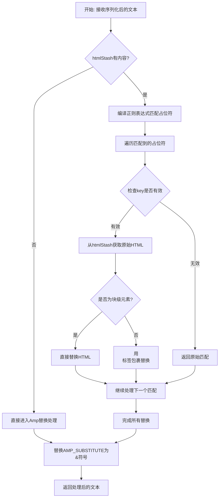

## 类结构

```
Postprocessor (抽象基类)
├── RawHtmlPostprocessor (恢复原始HTML)
├── AndSubstitutePostprocessor (恢复&符号)
└── UnescapePostprocessor (废弃-恢复转义字符)
```

## 全局变量及字段


### `RawHtmlPostprocessor.BLOCK_LEVEL_REGEX`
    
A compiled regular expression pattern to match HTML block-level tags at the start of a string, used to determine if an HTML element is block-level.

类型：`re.Pattern[str]`
    


### `UnescapePostprocessor.RE`
    
A compiled regular expression pattern to match unescape sequences for special characters, using STX and ETX delimiters with numeric character codes.

类型：`re.Pattern[str]`
    
    

## 全局函数及方法


### `build_postprocessors`

该函数用于构建Markdown的默认后处理器注册表，实例化并注册`RawHtmlPostprocessor`和`AndSubstitutePostprocessor`两个后处理器，以实现对Markdown文档序列化后的文本进行HTML还原和实体替换等处理。

参数：

- `md`：`Markdown`，Markdown实例对象，包含文档的完整状态和配置信息
- `**kwargs`：`Any`，可选的额外关键字参数，用于扩展或覆盖默认行为

返回值：`util.Registry[Postprocessor]`，后处理器注册表对象，包含已注册的后处理器实例及其名称和优先级信息

#### 流程图

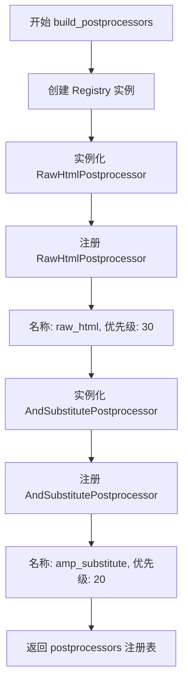

#### 带注释源码

```python
def build_postprocessors(md: Markdown, **kwargs: Any) -> util.Registry[Postprocessor]:
    """ Build the default postprocessors for Markdown. """
    # 创建一个新的后处理器注册表实例，用于管理和调度各个后处理器
    postprocessors = util.Registry()
    
    # 注册 RawHtmlPostprocessor 处理器
    # 功能：恢复文档中被暂存的原始HTML内容
    # 名称：raw_html
    # 优先级：30（数值越低优先级越高）
    postprocessors.register(RawHtmlPostprocessor(md), 'raw_html', 30)
    
    # 注册 AndSubstitutePostprocessor 处理器
    # 功能：将占位符 & 替换回正确的 & 实体
    # 名称：amp_substitute
    # 优先级：20
    postprocessors.register(AndSubstitutePostprocessor(), 'amp_substitute', 20)
    
    # 返回包含所有后处理器的注册表对象
    return postprocessors
```


### `Postprocessor.run`

该方法是 Markdown 库中 Postprocessor 基类的核心方法，定义了所有后处理器应实现的接口规范。子类需要重写此方法以对整个文档的序列化文本进行自定义处理，如恢复原始 HTML、替换转义字符等操作。

参数：

- `text`：`str`，包含整个 HTML 文档的单个文本字符串

返回值：`str`，返回（可能已修改的）文本字符串

#### 流程图

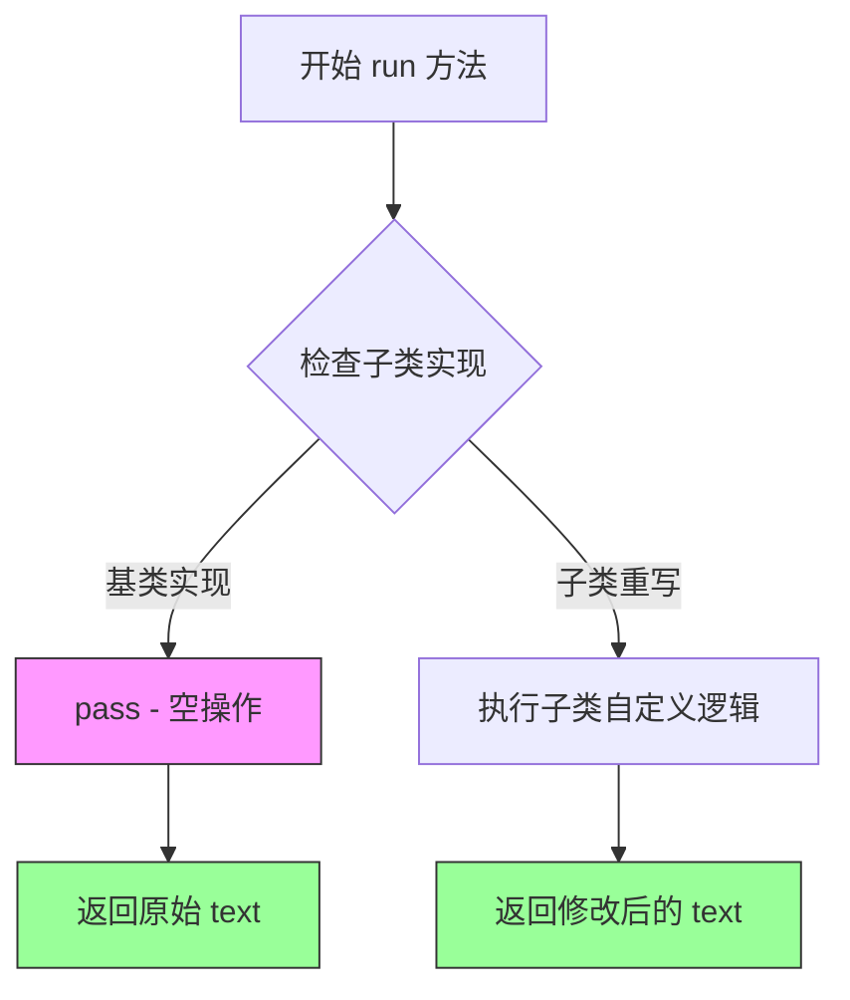

#### 带注释源码

```python
def run(self, text: str) -> str:
    """
    Subclasses of `Postprocessor` should implement a `run` method, which
    takes the html document as a single text string and returns a
    (possibly modified) string.

    """
    pass  # pragma: no cover
```

**源码说明：**

- **方法签名**：`run(self, text: str) -> str`
  - `self`：Postprocessor 实例的引用
  - `text: str`：接收整个文档的文本字符串作为输入
  - `-> str`：返回处理后的字符串

- **文档字符串**：明确说明子类必须重写此方法，实现自定义的文本处理逻辑

- **实现逻辑**：基类中仅包含 `pass` 语句，是一个空实现（模板方法模式）
  - 标记 `# pragma: no cover` 表示此代码不会被测试覆盖，因为基类不会被直接调用

- **设计意图**：
  - 作为抽象接口，定义后处理器的标准行为
  - 子类（如 `RawHtmlPostprocessor`、`AndSubstitutePostprocessor`）重写此方法实现具体功能
  - 接收已序列化的 HTML 字符串，处理完成后返回修改版本


### `RawHtmlPostprocessor.run`

该方法是 `RawHtmlPostprocessor` 类的核心方法，负责在 Markdown 文档被序列化为字符串后，遍历 HTML 占位符存储（htmlStash）并恢复原始 HTML 内容到文档中。

参数：

- `text`：`str`，待处理的 HTML 文档字符串

返回值：`str`，恢复原始 HTML 后的文档字符串

#### 流程图

```mermaid
flowchart TD
    A[开始: run text] --> B{检查 htmlStash.html_counter > 0?}
    B -->|否| C[直接返回原 text]
    B -->|是| D[构建正则表达式 pattern]
    D --> E[调用 pattern.sub substitute_match 替换]
    E --> F[返回替换后的 text]
    
    subgraph substitute_match [substitute_match 函数]
        G[接收 Match 对象 m] --> H{检查 m.group(1) 存在?}
        H -->|是| I[key = m.group(1), wrapped = True]
        H -->|否| J[key = m.group(2), wrapped = False]
        I --> K{key >= html_counter?}
        J --> K
        K -->|是| L[返回原始匹配 m.group(0)]
        K -->|否| M[获取 stash 中的 HTML]
        M --> N{wrapped 且 isblocklevel?}
        N -->|否| O[递归替换 HTML 内部]
        N -->|是| P[用 p 标签包装后递归替换]
        O --> Q[返回替换后的 HTML]
        P --> Q
    end
    
    F --> Z[结束]
```

#### 带注释源码

```python
def run(self, text: str) -> str:
    """
    Iterate over html stash and restore html.
    
    该方法遍历 HTML 占位符存储（stash），将占位符替换回原始 HTML 内容。
    支持块级元素和行内元素的区别处理。
    
    参数:
        text: str, 包含 HTML 占位符的文档字符串
        
    返回:
        str, 恢复原始 HTML 后的文档字符串
    """
    
    # 定义内部函数 substitute_match，用于替换每个匹配的占位符
    def substitute_match(m: re.Match[str]) -> str:
        """
        替换函数：处理每个占位符匹配，将其替换为存储的原始 HTML
        
        参数:
            m: re.Match[str], 正则表达式匹配对象
            
        返回:
            str, 替换后的 HTML 字符串
        """
        # 检查第一个捕获组是否存在（即 <p> 标签包裹的占位符）
        if key := m.group(1):
            wrapped = True  # 标记是否为包裹形式
        else:
            key = m.group(2)  # 使用第二个捕获组（未包裹的占位符）
            wrapped = False
        
        # 将 key 转换为整数
        if (key := int(key)) >= self.md.htmlStash.html_counter:
            # 如果 key 超出范围，返回原始匹配（占位符未定义）
            return m.group(0)
        
        # 从 stash 中获取原始 HTML 块
        html = self.stash_to_string(self.md.htmlStash.rawHtmlBlocks[key])
        
        # 如果未包裹或 HTML 是块级元素，直接递归替换
        if not wrapped or self.isblocklevel(html):
            return pattern.sub(substitute_match, html)
        
        # 否则用 <p> 标签包装后再递归替换
        return pattern.sub(substitute_match, f"<p>{html}</p>")

    # 检查是否有需要处理的 HTML stash
    if self.md.htmlStash.html_counter:
        # 构建基础占位符格式和完整正则表达式
        # 匹配两种形式: <p>$HTML_PLACEHOLDER$</p> 或 $HTML_PLACEHOLDER$
        base_placeholder = util.HTML_PLACEHOLDER % r'([0-9]+)'
        pattern = re.compile(f'<p>{ base_placeholder }</p>|{ base_placeholder }')
        
        # 使用正则替换恢复 HTML 并返回
        return pattern.sub(substitute_match, text)
    else:
        # 没有 HTML stash，直接返回原文本
        return text
```


### `RawHtmlPostprocessor.isblocklevel`

该方法用于检查给定的 HTML 字符串是否为块级元素。它通过正则表达式匹配 HTML 标签，然后根据标签名称或特殊前缀（!、?、@、%）判断是否为块级元素。

参数：

- `html`：`str`，需要检查的 HTML 字符串

返回值：`bool`，如果 HTML 是块级元素则返回 True，否则返回 False

#### 流程图

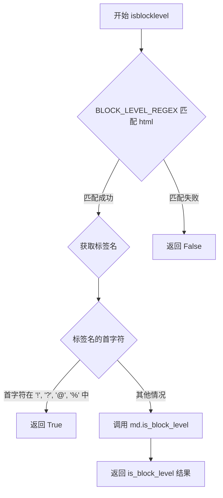

#### 带注释源码

```python
def isblocklevel(self, html: str) -> bool:
    """ Check is block of HTML is block-level. """
    # 使用类级别正则表达式匹配 HTML 标签
    m = self.BLOCK_LEVEL_REGEX.match(html)
    if m:
        # 检查标签名的首字符是否为特殊字符
        if m.group(1)[0] in ('!', '?', '@', '%'):
            # 处理特殊标签：注释、PHP 声明、模板变量等
            # 这些通常被视为块级元素
            return True
        # 调用 Markdown 对象的 is_block_level 方法判断是否为块级
        return self.md.is_block_level(m.group(1))
    # 如果没有匹配到有效的 HTML 标签，返回 False
    return False
```


### `RawHtmlPostprocessor.stash_to_string`

该方法用于将Markdown内部存储的原始HTML对象转换为字符串形式，以便最终输出到文档中。

参数：

- `text`：`str`，需要转换的存储对象（可以是HTML片段或任意可转换为字符串的对象）

返回值：`str`，转换后的字符串形式

#### 流程图

```mermaid
flowchart TD
    A[开始 stash_to_string] --> B{输入 text}
    B --> C[调用 str&#40;text&#41; 转换]
    C --> D[返回转换后的字符串]
    D --> E[结束]
    
    style A fill:#e1f5fe
    style D fill:#e8f5e8
    style E fill:#f3e5f5
```

#### 带注释源码

```python
def stash_to_string(self, text: str) -> str:
    """
    将存储的HTML对象转换为字符串。
    
    该方法是Markdown HTML存储系统的一部分，用于将之前通过占位符
    存储的原始HTML片段恢复为可输出的字符串格式。
    
    参数:
        text: 需要转换的存储对象，通常是HTML字符串或包含HTML的容器对象
        
    返回值:
        转换后的字符串形式
    """
    return str(text)
```

#### 补充说明

| 项目 | 说明 |
|------|------|
| **所属类** | `RawHtmlPostprocessor` |
| **类职责** | 在Markdown转换为HTML后，将文档中预先存储的原始HTML片段还原到输出文档 |
| **调用场景** | 在 `run` 方法内部被 `substitute_match` 函数调用，用于恢复具体的HTML内容 |
| **设计目的** | 提供一个统一的接口将各种存储的HTML对象（可能是字符串、特殊容器对象等）转换为可输出的字符串 |
| **潜在优化空间** | 当前实现仅做简单的 `str()` 转换，如果存储的对象结构更复杂，可能需要更细致的处理逻辑以保留原始格式和属性 |


### `AndSubstitutePostprocessor.run`

该方法是Markdown库中的后处理器，负责将处理过程中临时替换的`&`符号占位符恢复为标准的`&`字符，确保输出的HTML文档包含有效的实体引用。

参数：
- `text`：`str`，需要处理的文本字符串，包含待替换的`AMP_SUBSTITUTE`占位符

返回值：`str`，替换完成后的文本字符串

#### 流程图

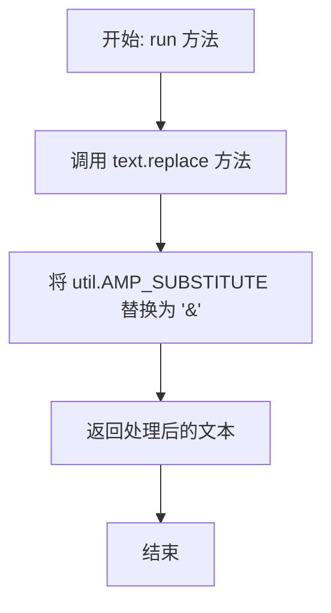

#### 带注释源码

```python
def run(self, text: str) -> str:
    """
    Restore valid entities.
    
    该方法执行后处理操作，将文档中临时替换的 & 符号占位符
    恢复为标准的 & 字符。这是必要的，因为 Markdown 解析过程中
    可能会将 & 替换为其他形式以避免与 HTML 实体混淆。
    
    参数:
        text: str - 需要处理的文本字符串
        
    返回:
        str - 替换占位符后的文本字符串
    """
    # 使用字符串的 replace 方法将占位符替换回 & 符号
    # util.AMP_SUBSTITUTE 是在 util 模块中定义的常量
    # 通常是类似 '&amp;' 的形式或者自定义的占位符
    text = text.replace(util.AMP_SUBSTITUTE, "&")
    
    # 返回处理完成的文本
    return text
```

---

### 详细设计文档

#### 一段话描述

`AndSubstitutePostprocessor` 是 Python-Markdown 库的后处理器之一，其核心功能是在文档序列化后，将处理过程中临时替换的 `&` 符号占位符恢复为标准的 `&` 字符，确保输出的 HTML 包含有效的实体引用。

#### 文件的整体运行流程

1. **Markdown 解析流程**：
   - 输入 Markdown 文本
   - 经过预处理（Preprocessors）处理特殊标记
   - 转换为 ElementTree 结构
   - 序列化为 HTML 字符串
   - **后处理（Postprocessors）阶段**：执行本类处理
   - 输出最终 HTML

2. **Postprocessors 注册流程**：
   - `build_postprocessors` 函数创建 Registry
   - 注册 `RawHtmlPostprocessor`（优先级30）
   - 注册 `AndSubstitutePostprocessor`（优先级20）
   - 返回后处理器注册表

#### 类的详细信息

**1. AndSubstitutePostprocessor 类**

| 字段/方法 | 类型 | 描述 |
|-----------|------|------|
| `run` | 方法 | 执行 & 符号占位符替换的后处理逻辑 |

**2. 基类 Postprocessor**

| 字段/方法 | 类型 | 描述 |
|-----------|------|------|
| `run` | 方法 | 抽象方法，子类需实现具体的处理逻辑 |

**3. 相关类 RawHtmlPostprocessor**

| 字段/方法 | 类型 | 描述 |
|-----------|------|------|
| `BLOCK_LEVEL_REGEX` | 类属性 | 正则表达式，用于匹配 HTML 块级标签 |
| `run` | 方法 | 恢复原始 HTML 到文档 |
| `isblocklevel` | 方法 | 检查 HTML 是否为块级元素 |
| `stash_to_string` | 方法 | 将存储的对象转换为字符串 |

#### 全局函数和变量信息

| 名称 | 类型 | 描述 |
|------|------|------|
| `build_postprocessors` | 函数 | 构建并返回默认后处理器注册表 |
| `Postprocessor` | 类 | 后处理器基类，定义接口规范 |
| `RawHtmlPostprocessor` | 类 | 用于恢复原始 HTML 的后处理器 |
| `AndSubstitutePostprocessor` | 类 | 用于恢复 & 符号的后处理器 |
| `UnescapePostprocessor` | 类 | 已废弃的转义字符恢复处理器 |

#### 关键组件信息

1. **util.AMP_SUBSTITUTE**：在 util 模块中定义的常量，表示处理过程中临时替换 `&` 的占位符
2. **util.Registry**：后处理器注册表，用于管理和调用后处理器
3. **util.Processor**：处理器基类，提供基础功能

#### 潜在的技术债务或优化空间

1. **占位符替换逻辑简单**：当前实现使用简单的字符串替换，如果占位符定义不当可能产生误替换
2. **缺乏错误处理**：没有处理 `text` 为 `None` 或非字符串类型的情况
3. **已废弃的类**：`UnescapePostprocessor` 已标记为废弃，但代码中仍有实现，可能造成维护负担

#### 其它项目

**设计目标与约束**：
- 后处理器应在文档序列化后执行
- 保持与预处理器的对称性（预处理分离占位符，后处理恢复）
- 不应改变文档的结构，只处理实体引用

**错误处理与异常设计**：
- 当前实现未进行输入验证
- 如果输入不是字符串，`replace` 方法可能抛出 `AttributeError`

**数据流与状态机**：
- 输入：包含 `AMP_SUBSTITUTE` 占位符的文本
- 处理：字符串替换
- 输出：恢复 `&` 符号的文本

**外部依赖与接口契约**：
- 依赖 `util` 模块中的 `AMP_SUBSTITUTE` 常量
- 依赖 `Postprocessor` 基类定义的接口
- 返回值类型必须为 `str` 以保持接口一致性


### `UnescapePostprocessor.unescape`

该方法是一个正则表达式替换回调函数，用于将 Markdown 文档中经过 STX/ETX（Start of Text/End of Text）包装的数字形式的转义字符还原为实际的 Unicode 字符。它接收一个正则匹配对象，提取其中包含的数字码点并转换为对应的字符。

参数：

- `m`：`re.Match[str]`，正则表达式匹配对象，包含需要解码的数字（代表字符的 Unicode 码点）

返回值：`str`，返回解码后的单个字符

#### 流程图

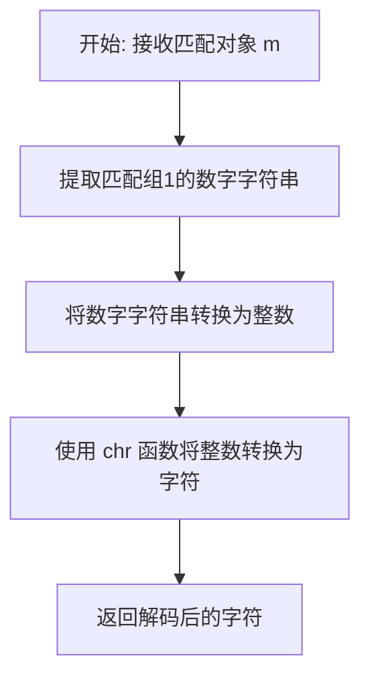

#### 带注释源码

```python
def unescape(self, m: re.Match[str]) -> str:
    """
    将正则匹配的数字转换为对应的字符。
    
    该方法作为 re.sub() 的替换函数使用，将形如 \x02NUM\x03 的
    模式转换为实际的单个字符（NUM 为字符的 Unicode 码点）。
    
    参数:
        m: re.Match[str] - 正则表达式匹配对象，包含要解码的数字组
        
    返回值:
        str - 解码后的单个字符
    """
    # 从匹配对象中提取第一个捕获组（即数字字符串）
    # 然后将其转换为整数，最后用 chr() 转换为对应的字符
    return chr(int(m.group(1)))
```


### `UnescapePostprocessor.run`

该方法是 `UnescapePostprocessor` 类的核心方法，用于恢复文档中被转义的字符。它通过正则表达式匹配以 STX（Start of Text）和 ETX（End of Text）为标记的转义序列，并将捕获的数字转换回对应的字符（使用 `chr` 函数）。该类已被标记为弃用，推荐使用 `UnescapeTreeprocessor` 替代。

参数：

- `text`：`str`，需要处理的文本字符串，包含待恢复的转义字符序列

返回值：`str`，处理后的文本字符串，其中转义字符已被还原为原始字符

#### 流程图

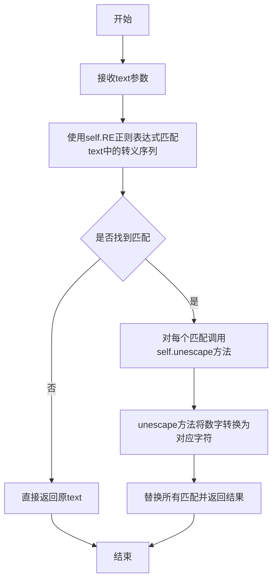

#### 带注释源码

```python
def run(self, text: str) -> str:
    """
    执行转义字符的恢复操作。
    
    该方法使用预编译的正则表达式 self.RE 匹配文本中的转义序列，
    然后通过 self.unescape 方法将每个匹配的数字转换回对应的字符。
    
    参数:
        text: str - 输入的文本字符串，包含以 STX 和 ETX 包裹的数字序列
        
    返回:
        str - 处理后的文本，所有转义序列已被还原为原始字符
    """
    # 使用正则表达式的 sub 方法替换所有匹配项
    # self.RE 匹配模式: STX + 数字 + ETX
    # self.unescape 是替换函数，将数字转为对应字符
    return self.RE.sub(self.unescape, text)
```

## 关键组件


## 概述

该模块是Python Markdown库的后处理器（Postprocessors）模块，负责在文档序列化后对文本进行最终处理，主要功能包括恢复原始HTML内容、替换HTML实体占位符以及处理转义字符，是Markdown到HTML转换流程的最后一个关键环节。

## 整体运行流程

1. **初始化阶段**：通过`build_postprocessors`工厂函数创建后处理器注册表，注册`RawHtmlPostprocessor`和`AndSubstitutePostprocessor`
2. **执行阶段**：在Markdown文档转换为HTML字符串后，后处理器依次运行
   - `RawHtmlPostprocessor`首先检查HTML占位符计数器，若存在占位符则通过正则匹配替换为原始HTML内容
   - `AndSubstitutePostprocessor`将`&`的占位符`util.AMP_SUBSTITUTE`还原为`&`符号
3. **输出阶段**：返回处理完成的HTML字符串

## 类详细信息

### 类：Postprocessor

**基类**：util.Processor

**描述**：所有后处理器的基类，定义了后处理器的接口规范

**字段**：
| 名称 | 类型 | 描述 |
|------|------|------|
| md | Markdown | Markdown实例引用，用于访问配置和存储对象 |

**方法**：

**run(text: str) -> str**
- 参数：text - HTML文档字符串
- 参数类型：str
- 参数描述：待处理的HTML文本
- 返回值类型：str
- 返回值描述：（可能修改的）处理后文本
- 流程图：
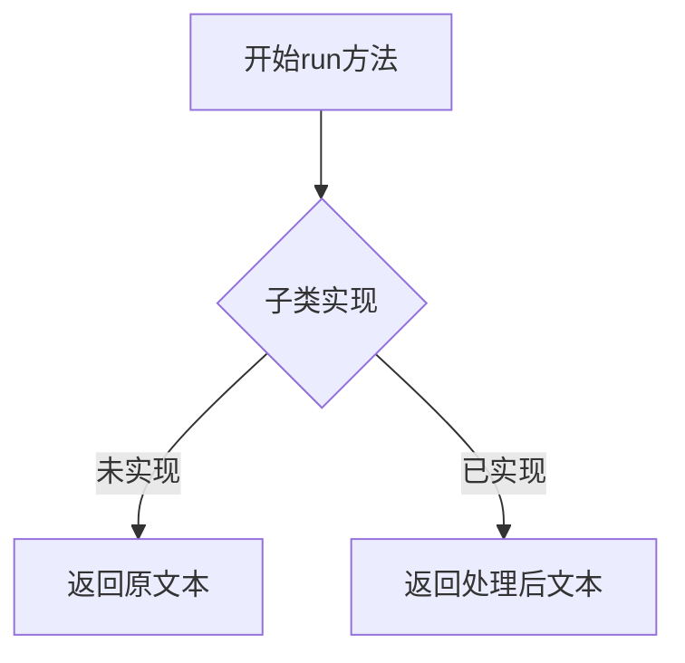
- 源码：
```python
def run(self, text: str) -> str:
    """
    Subclasses of `Postprocessor` should implement a `run` method, which
    takes the html document as a single text string and returns a
    (possibly modified) string.

    """
    pass  # pragma: no cover
```

---

### 类：RawHtmlPostprocessor

**基类**：Postprocessor

**描述**：恢复原始HTML内容到文档中，处理HTML占位符替换

**字段**：
| 名称 | 类型 | 描述 |
|------|------|------|
| BLOCK_LEVEL_REGEX | re.Pattern | 正则表达式，用于匹配HTML标签判断是否为块级元素 |

**方法**：

**run(text: str) -> str**
- 参数：text - 包含HTML占位符的文档字符串
- 参数类型：str
- 参数描述：待处理的文档文本
- 返回值类型：str
- 返回值描述：HTML占位符已替换为原始HTML的文档
- 流程图：
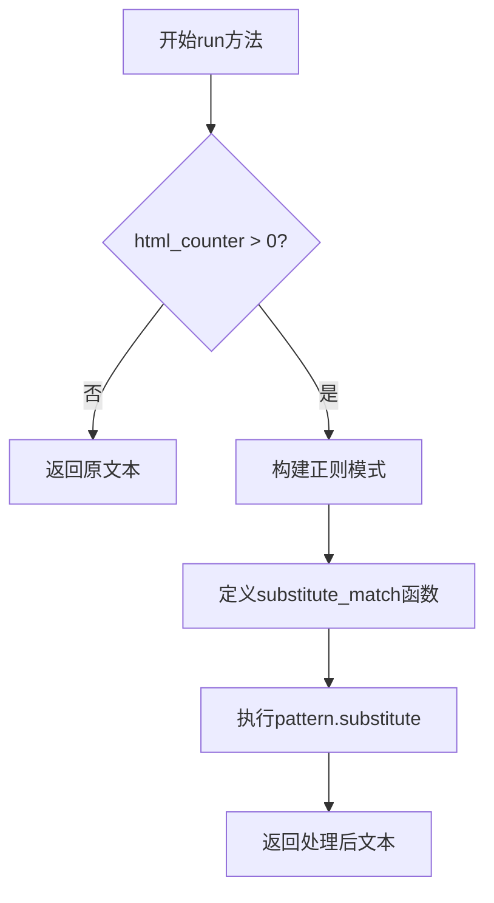
- 源码：
```python
def run(self, text: str) -> str:
    """ Iterate over html stash and restore html. """
    def substitute_match(m: re.Match[str]) -> str:
        if key := m.group(1):
            wrapped = True
        else:
            key = m.group(2)
            wrapped = False
        if (key := int(key)) >= self.md.htmlStash.html_counter:
            return m.group(0)
        html = self.stash_to_string(self.md.htmlStash.rawHtmlBlocks[key])
        if not wrapped or self.isblocklevel(html):
            return pattern.sub(substitute_match, html)
        return pattern.sub(substitute_match, f"<p>{html}</p>")

    if self.md.htmlStash.html_counter:
        base_placeholder = util.HTML_PLACEHOLDER % r'([0-9]+)'
        pattern = re.compile(f'<p>{ base_placeholder }</p>|{ base_placeholder }')
        return pattern.sub(substitute_match, text)
    else:
        return text
```

**isblocklevel(html: str) -> bool**
- 参数：html - HTML字符串
- 参数类型：str
- 参数描述：待检查的HTML片段
- 返回值类型：bool
- 返回值描述：是否为块级元素
- 流程图：
```mermaid
flowchart TD
    A[开始isblocklevel] --> B[正则匹配HTML标签]
    B --> C{匹配成功?}
    C -->|否| D[返回False]
    C -->|是| E{标签首字符在'!?@%'中?}
    E -->|是| F[返回True]
    E -->|否| G[调用md.is_block_level]
    G --> H[返回块级判断结果]
```
- 源码：
```python
def isblocklevel(self, html: str) -> bool:
    """ Check is block of HTML is block-level. """
    m = self.BLOCK_LEVEL_REGEX.match(html)
    if m:
        if m.group(1)[0] in ('!', '?', '@', '%'):
            # Comment, PHP etc...
            return True
        return self.md.is_block_level(m.group(1))
    return False
```

**stash_to_string(text: str) -> str**
- 参数：text - stashed对象
- 参数类型：str
- 参数描述：存储的HTML对象
- 返回值类型：str
- 返回值描述：转换后的字符串
- 源码：
```python
def stash_to_string(self, text: str) -> str:
    """ Convert a stashed object to a string. """
    return str(text)
```

---

### 类：AndSubstitutePostprocessor

**基类**：Postprocessor

**描述**：将&符号的占位符替换回原始&符号

**字段**：无

**方法**：

**run(text: str) -> str**
- 参数：text - 包含AMP_SUBSTITUTE占位符的文本
- 参数类型：str
- 参数描述：待处理的文档文本
- 返回值类型：str
- 返回值描述：&符号已还原的文档
- 流程图：
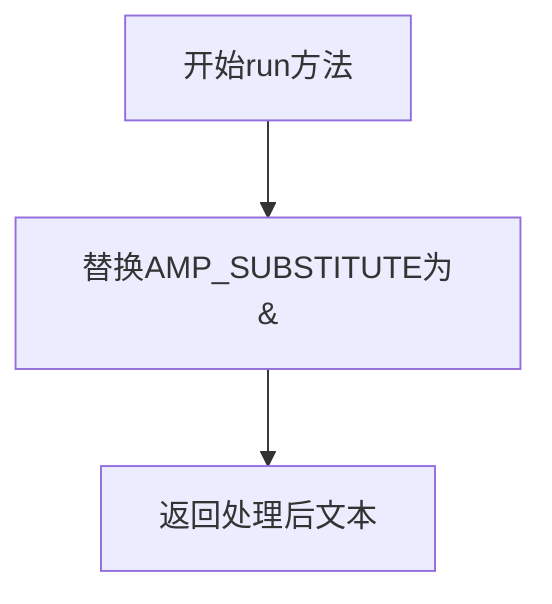
- 源码：
```python
def run(self, text: str) -> str:
    text = text.replace(util.AMP_SUBSTITUTE, "&")
    return text
```

---

### 类：UnescapePostprocessor（已弃用）

**基类**：Postprocessor

**描述**：恢复转义字符，已废弃并指向UnescapeTreeprocessor

**字段**：
| 名称 | 类型 | 描述 |
|------|------|------|
| RE | re.Pattern | 匹配转义序列的正则表达式 |

**方法**：

**unescape(m: re.Match[str]) -> str**
- 参数：m - 正则匹配对象
- 参数类型：re.Match[str]
- 参数描述：包含数字的匹配组
- 返回值类型：str
- 返回值描述：对应的Unicode字符

**run(text: str) -> str**
- 参数：text - 包含转义序列的文本
- 参数类型：str
- 参数描述：待处理的文档
- 返回值类型：str
- 返回值描述：转义字符已还原的文档

---

## 全局函数

### build_postprocessors

**描述**：构建并返回默认的Postprocessors注册表

**参数**：
| 参数名 | 参数类型 | 参数描述 |
|--------|----------|----------|
| md | Markdown | Markdown实例 |
| **kwargs | Any | 额外关键字参数 |

**返回值类型**：util.Registry[Postprocessor]

**返回值描述**：包含已注册后处理器的注册表对象

**源码**：
```python
def build_postprocessors(md: Markdown, **kwargs: Any) -> util.Registry[Postprocessor]:
    """ Build the default postprocessors for Markdown. """
    postprocessors = util.Registry()
    postprocessors.register(RawHtmlPostprocessor(md), 'raw_html', 30)
    postprocessors.register(AndSubstitutePostprocessor(), 'amp_substitute', 20)
    return postprocessors
```

---

## 关键组件信息

### RawHtmlPostprocessor

负责恢复原始HTML内容，处理HTML占位符替换逻辑，支持块级HTML元素的正确包装

### AndSubstitutePostprocessor

处理HTML实体中的&符号，防止与HTML语法冲突

### Postprocessor基类

定义后处理器接口规范，是所有后处理器的抽象基类

### build_postprocessors工厂函数

负责创建和注册默认后处理器，是模块的入口点

---

## 潜在技术债务与优化空间

1. **UnescapePostprocessor已弃用但未移除**：虽然标记为deprecated但代码仍保留，可能造成代码库冗余

2. **RawHtmlPostprocessor中的嵌套函数substitute_match**：该内部函数每次调用run都会重新定义，可考虑提取为类方法或模块级函数以提高性能

3. **isblocklevel方法中正则匹配效率**：每次调用都执行正则匹配，可考虑缓存BLOCK_LEVEL_REGEX的编译结果（当前已是类变量但可优化）

4. **stash_to_string方法实现简单**：仅调用str()转换，未做任何验证或错误处理

5. **缺少单元测试覆盖标记**：`pass # pragma: no cover`表明基类run方法无测试覆盖

---

## 其它项目

### 设计目标与约束

- **单一职责**：每个Postprocessor只处理一种文本转换任务
- **可扩展性**：通过继承Postprocessor基类可以添加新的后处理器
- **执行顺序**：通过优先级参数（30、20）控制后处理器执行顺序

### 错误处理与异常设计

- 未对htmlStash为None的情况进行防御性检查
- substitute_match中的key解析可能抛出ValueError（int()转换失败）
- 正则匹配失败时返回空匹配，无详细错误信息

### 数据流与状态机

```
输入文本 → RawHtmlPostprocessor → AndSubstitutePostprocessor → 输出文本
         (替换HTML占位符)    (替换&符号实体)
```

### 外部依赖与接口契约

- **依赖util模块**：使用HTML_PLACEHOLDER、AMP_SUBSTITUTE、STX、ETX等常量
- **依赖Markdown实例**：通过md引用访问htmlStash和is_block_level方法
- **依赖re模块**：用于正则表达式匹配和替换


## 问题及建议


### 已知问题

-   **RawHtmlPostprocessor.run()方法存在逻辑缺陷**：在substitute_match函数中，变量key被重复赋值且逻辑混乱。第一次使用walrus operator获取m.group(1)后立即被m.group(2)覆盖，导致代码意图不清晰，存在潜在bug风险
-   **正则表达式重复编译**：在run()方法内部每次调用都会重新编译正则表达式 `pattern = re.compile(f'...')`，应在类级别预编译以提升性能
-   **缺少异常处理**：代码中使用 `int(key)` 进行类型转换，但没有处理转换失败时的异常情况（如key非数字字符串）
-   **废弃代码仍存在**：UnescapePostprocessor类虽已标记废弃并说明将移除，但代码中仍保留，会增加维护负担
-   **stash_to_string方法实现冗余**：该方法仅返回str(text)，与直接调用str()无异，方法存在价值低
-   **类型注解不完整**：build_postprocessors函数返回类型标注为Registry[Postprocessor]，但未进行运行时验证
-   **代码可读性问题**：isblocklevel方法中通过检查第一个字符判断HTML类型的方式缺乏文档说明，且magic number/字符检查不易维护

### 优化建议

-   重构RawHtmlPostprocessor.run()中的substitute_match函数，清晰分离key和wrapped变量的赋值逻辑
-   将pattern正则表达式提升为类级别常量，避免每次调用都重新编译
-   为int(key)转换添加try-except异常处理，或使用安全的类型检查
-   考虑完全移除UnescapePostprocessor类，或将其移至单独的废弃模块中
-   移除冗余的stash_to_string方法，直接在调用处使用str()
-   为BLOCK_LEVEL_REGEX和特殊字符检查添加常量定义和注释说明意图
-   考虑为Postprocessor基类添加抽象方法声明，增强类型安全和代码可读性


## 其它


### 设计目标与约束

该模块作为Python Markdown库的后处理器组件，核心目标是处理文档序列化后的最终文本，负责恢复预处理器提取的HTML片段、处理HTML实体替换等最终输出工作。设计约束包括：必须继承自`util.Processor`基类、实现`run`方法、返回修改后的字符串；与预处理器的`Preprocessor`形成对称处理逻辑；依赖`markdown.Markdown`主类的实例状态（如`htmlStash`）进行数据交换。

### 错误处理与异常设计

本模块采用最小错误处理策略，主要依赖调用方（Markdown核心引擎）保证输入有效性。`RawHtmlPostprocessor`中的`run`方法通过正则匹配和键值校验实现防御性编程：当`key >= self.md.htmlStash.html_counter`时直接返回原始匹配文本，避免索引越界；`isblocklevel`方法对特殊前缀（!、?、@、%）的HTML标签直接返回True。`AndSubstitutePostprocessor`仅做简单的字符串替换，无异常风险。已废弃的`UnescapePostprocessor`通过`@util.deprecated`装饰器标记迁移路径。

### 数据流与状态机

后处理器阶段位于Markdown转换流程的末端，数据流为：Markdown源文本 → 解析器（Parser）→ 元素树（ElementTree）→ 序列化器（Serializer）→ 后处理器（Postprocessors）→ 最终输出。`RawHtmlPostprocessor`维护有限状态：检查`htmlStash`是否为空（`html_counter`是否为0）决定是否执行替换；内部通过正则匹配占位符（`<p>$$1$$</p>`或`$$1$$`）触发状态转换，将占位符还原为原始HTML。`AndSubstitutePostprocessor`执行单向状态转换：将`AMP_SUBSTITUTE`占位符替换为"&"字符。

### 外部依赖与接口契约

本模块依赖以下外部组件：1）`markdown.Markdown`主类实例，通过构造注入`self.md`属性，依赖其`htmlStash`属性（类型为`util.HtmlStash`）和`is_block_level`方法；2）`markdown.util`模块，提供`Registry`类用于后处理器注册、`Processor`基类、`HTML_PLACEHOLDER`常量、`AMP_SUBSTITUTE`常量、`STX`和`ETX`控制字符常量；3）Python标准库`re`模块用于正则表达式处理。接口契约要求：`Postprocessor`子类必须实现`run(self, text: str) -> str`方法；构造函数接受`md: Markdown`参数（基类默认实现）；全局工厂函数`build_postprocessors`返回`util.Registry[Postprocessor]`类型。

### 性能考虑与优化空间

当前实现存在以下性能特征与优化点：1）`RawHtmlPostprocessor.run`方法在每次调用时编译正则表达式，可提取为类属性在`__init__`中预编译；2）`isblocklevel`方法对每个HTML块调用`self.md.is_block_level`，若该方法开销较大可考虑缓存结果；3）`AndSubstitutePostprocessor`使用`str.replace`简单高效；4）模块级别无全局状态，适合多实例并发使用。建议优化：预编译`BLOCK_LEVEL_REGEX`为类属性；考虑将`pattern`编译移至构造函数。

### 安全性考虑

后处理器阶段涉及HTML重构，需注意：1）`RawHtmlPostprocessor`从`htmlStash`恢复HTML时应确保来源可信（由预处理阶段预先生成）；2）`isblocklevel`对特殊前缀（!、?、@、%）的处理可防止误判文档类型声明和服务器端包含指令；3）已废弃的`UnescapePostprocessor`涉及字符码转换（`chr(int(m.group(1)))`），需防范恶意输入导致的大整数计算。建议在调用前确保`htmlStash`内容已经过安全过滤。

### 测试策略建议

应覆盖以下测试场景：1）`RawHtmlPostprocessor`处理空`htmlStash`的直接返回；2）嵌套HTML占位符的正确还原；3）块级元素与行内元素的差异化处理（是否包裹`<p>`标签）；4）特殊前缀标签（`<!-- -->`、`<?xml -->`）的块级判定；5）`AndSubstitutePostprocessor`对`AMP_SUBSTITUTE`占位符的替换；6）`UnescapePostprocessor`对废弃警告的触发；7）`build_postprocessors`工厂函数返回的注册表完整性。测试数据应包含合法HTML片段、混合 Markdown/HTML 场景、边界条件（空文本、单标签、畸形HTML）。

### 配置选项与扩展性

后处理器注册表支持动态添加/移除处理器：`Registry.register(instance, name, priority)`允许自定义后处理器，`Registry.deregister(name)`支持移除默认处理器。优先级机制（priority参数）控制执行顺序，当前`raw_html`优先级30、`amp_substitute`优先级20。扩展点包括：实现自定义`Postprocessor`子类处理特殊输出需求（如代码高亮、文档包装等）；通过`util.deprecated`装饰器标记废弃接口实现平滑迁移。

    