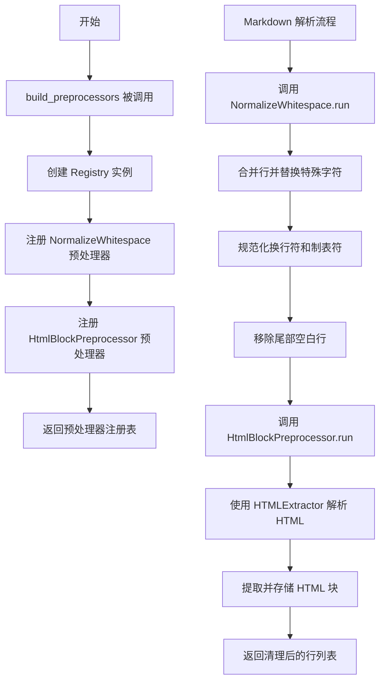
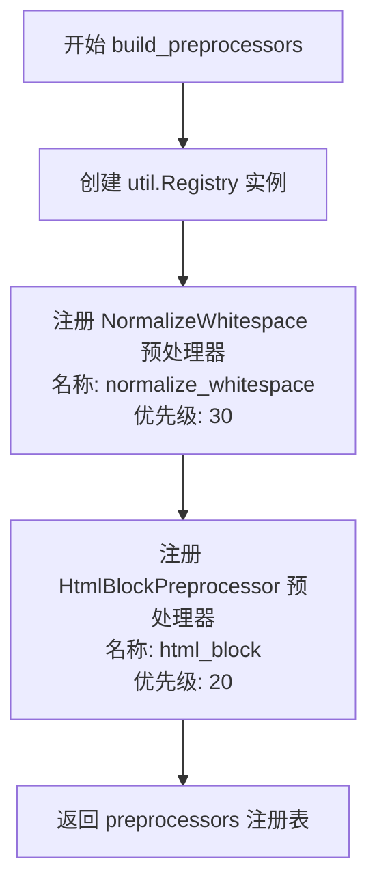
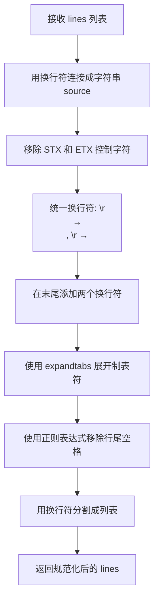

# `markdown\markdown\preprocessors.py` 详细设计文档

该模块实现了Markdown文本的预处理功能，在文档被解析器分解为独立部分之前对源代码进行预处理，包括规范化空白字符和处理HTML块，以清洁不良字符或提取后续处理所需的内容。

## 整体流程



## 类结构

```
util.Processor (抽象基类)
└── Preprocessor (预处理器基类)
    ├── NormalizeWhitespace (空白字符规范化)
    └── HtmlBlockPreprocessor (HTML块预处理)
```

## 全局变量及字段


### `util`
    
Markdown 项目的工具模块，提供 Registry、HtmLStash 等通用工具类

类型：`module`
    


### `HTMLExtractor`
    
HTML 提取器类，用于解析和清理 HTML 文档

类型：`type`
    


### `re`
    
Python 正则表达式模块，用于文本模式匹配和替换

类型：`module`
    


### `TYPE_CHECKING`
    
类型检查标志，仅在类型检查时为 True，用于避免运行时导入类型提示

类型：`bool`
    


    

## 全局函数及方法


### `build_preprocessors`

该函数是Markdown库中的预处理器构建函数，负责创建和注册默认的文本预处理器集合，这些预处理器在文档解析前对源代码进行标准化和清理处理。

参数：

- `md`：`Markdown`，Markdown实例对象，提供对配置和HtmlStash的访问
- `**kwargs`：`Any`，可选关键字参数，用于未来扩展或传递额外配置

返回值：`util.Registry[Preprocessor]`，返回一个包含已注册预处理器实例的注册表对象

#### 流程图



#### 带注释源码

```python
def build_preprocessors(md: Markdown, **kwargs: Any) -> util.Registry[Preprocessor]:
    """ Build and return the default set of preprocessors used by Markdown. """
    # 创建一个新的Registry实例用于存储预处理器
    preprocessors = util.Registry()
    
    # 注册NormalizeWhitespace预处理器，用于规范化空白字符
    # 优先级30，数值越高越晚执行
    preprocessors.register(NormalizeWhitespace(md), 'normalize_whitespace', 30)
    
    # 注册HtmlBlockPreprocessor预处理器，用于提取和处理HTML块
    # 优先级20，数值越低越早执行
    preprocessors.register(HtmlBlockPreprocessor(md), 'html_block', 20)
    
    # 返回包含所有预处理器的注册表
    return preprocessors
```


### Preprocessor.run

这是 Markdown 预处理器基类中的抽象方法，定义了对文档文本行进行处理的标准接口。各子类通过覆盖此方法实现特定的文本预处理逻辑，如规范化空白字符、提取HTML块等。

参数：

- `self`：Preprocessor，Preprocessor 类的实例本身
- `lines`：`list[str]`，文档按换行符分割后的字符串列表

返回值：`list[str]`，处理（修改）后的字符串列表

#### 流程图

```mermaid
flowchart TD
    A[开始 run 方法] --> B{子类是否覆盖}
    B -- 是 --> C[执行子类具体处理逻辑]
    B -- 否 --> D[返回 None (pass语句)]
    C --> E[返回处理后的 lines]
    E --> F[结束]
    D --> F
    
    style B fill:#f9f,color:#000
    style C fill:#9f9,color:#000
    style D fill:#fcc,color:#000
```

#### 带注释源码

```python
def run(self, lines: list[str]) -> list[str]:
    """
    Each subclass of `Preprocessor` should override the `run` method, which
    takes the document as a list of strings split by newlines and returns
    the (possibly modified) list of lines.

    """
    pass  # pragma: no cover
```

---

#### 技术债务

1. **类型注解与实际返回值不匹配**：方法签名声明返回 `list[str]`，但基类实现只有 `pass` 语句，实际返回 `None`。这可能导致调用方类型检查失败或运行时错误。正确的做法是：
   - 将返回类型改为 `Optional[list[str]]`
   - 或在基类中抛出 `NotImplementedError` 而非使用 `pass`


### `NormalizeWhitespace.run`

该方法是 Markdown 预处理器的一部分，用于规范化文档中的空白字符，包括统一换行符格式、移除特殊控制字符、展开制表符以及清理多余的空格，以确保后续解析的一致性。

参数：

- `lines`：`list[str]` ，文档内容，按换行符分割的字符串列表

返回值：`list[str]` ，规范化后的字符串列表

#### 流程图



#### 带注释源码

```python
def run(self, lines: list[str]) -> list[str]:
    """
    Normalize whitespace in the document for consistent parsing.
    
    Args:
        lines: Document as a list of strings split by newlines
        
    Returns:
        The (possibly modified) list of lines
    """
    # 将输入的字符串列表用换行符连接成单个字符串
    source = '\n'.join(lines)
    
    # 移除 STX (Start of Text) 和 ETX (End of Text) 特殊控制字符
    # 这些字符可能来自之前的处理步骤，需要清理
    source = source.replace(util.STX, "").replace(util.ETX, "")
    
    # 统一换行符格式：将 Windows 风格的 \r\n 和 Mac 风格的 \r 
    # 统一转换为 Unix 风格的 \n
    source = source.replace("\r\n", "\n").replace("\r", "\n") + "\n\n"
    
    # 展开制表符为空格，使用 Markdown 实例的 tab_length 配置
    source = source.expandtabs(self.md.tab_length)
    
    # 使用正则表达式移除行尾空格：
    # (?<=\n) +\\n 匹配换行符后面跟着空格和换行符的情况
    # 这样可以清理多余的空行
    source = re.sub(r'(?<=\n) +\n', '\n', source)
    
    # 重新用换行符分割成字符串列表并返回
    return source.split('\n')
```


### `HtmlBlockPreprocessor.run`

该方法是 Markdown 预处理器的一部分，用于处理文档中的 HTML 块。它将输入的行列表合并为字符串，通过 HTMLExtractor 解析和清理 HTML 内容，然后返回处理后的行列表。

参数：

- `lines`：`list[str]` ，需要处理的文档行列表

返回值：`list[str]` ，处理后的文档行列表

#### 流程图

```mermaid
flowchart TD
    A[开始 run 方法] --> B[将 lines 合并为 source 字符串<br/>source = '\n'.join(lines)]
    B --> C[创建 HTMLExtractor 解析器实例<br/>parser = HTMLExtractor(self.md)]
    C --> D[调用 parser.feed 处理 HTML<br/>parser.feed(source)]
    D --> E[调用 parser.close 完成解析<br/>parser.close]
    E --> F[从 parser.cleandoc 获取清理后的文档<br/>''.join(parser.cleandoc)]
    F --> G[将文档按换行符分割成列表<br/>split('\n')]
    G --> H[返回处理后的行列表]
```

#### 带注释源码

```python
def run(self, lines: list[str]) -> list[str]:
    """
    运行 HTML 块预处理器。
    
    该方法接收文档的行列表，提取并清理 HTML 块，
    将处理后的结果以行列表形式返回。
    
    参数:
        lines: 文档的原始行列表
        
    返回:
        处理后的行列表，HTML 块已被提取并替换为占位符
    """
    # 步骤1: 将行列表合并为单个字符串，便于 HTML 解析
    source = '\n'.join(lines)
    
    # 步骤2: 创建 HTML 提取器实例，传入 Markdown 实例以访问配置
    parser = HTMLExtractor(self.md)
    
    # 步骤3: 向解析器提供 HTML 源文本进行解析
    # 解析过程中会识别 HTML 块并存储
    parser.feed(source)
    
    # 步骤4: 完成解析，处理所有未关闭的标签
    parser.close()
    
    # 步骤5: 获取清理后的文档（HTML 块已被替换为占位符）
    # 然后按换行符分割成行列表并返回
    return ''.join(parser.cleandoc).split('\n')
```

## 关键组件


### Preprocessor 基类

预处理器抽象基类，定义了预处理器的接口规范。所有预处理器都继承该类并实现 `run` 方法，用于在文本被分解为单独部分之前对源代码进行处理。

### NormalizeWhitespace 组件

规范化空白字符的预处理器，负责统一换行符（\r\n、\r转为\n）、替换STX/ETX控制字符、展开制表符、移除行尾多余空格等操作，确保解析的一致性。

### HtmlBlockPreprocessor 组件

HTML块预处理器，使用 HTMLExtractor 从文本中提取并移除 HTML 块，将原始 HTML 存储到 HtmlStash 中供后续检索，用于防止解析器因 HTML 语法而阻塞。

### build_preprocessors 工厂函数

构建并返回 Markdown 默认预处理器注册表的函数，注册 normalize_whitespace 和 html_block 两个预处理器，按优先级排序。

### HTMLExtractor 组件

HTML 提取器（从 htmlparser 导入），用于解析和提取文本中的 HTML 块内容，配合 HtmlBlockPreprocessor 完成 HTML 分离工作。


## 问题及建议


### 已知问题

-   **Preprocessor.run方法是空实现**：基类中的run方法只有pass语句，没有返回值。如果子类没有正确覆盖该方法，会隐式返回None，可能导致后续处理出现TypeError。
-   **正则表达式未预编译**：`re.sub(r'(?<=\n) +\n', '\n', source)` 在每次调用时都会重新编译正则表达式，增加了性能开销。
-   **字符串操作效率低下**：多次使用 `'\n'.join(lines)` 和 `source.split('\n')` 进行字符串转换，中间还进行了多次replace操作，可以优化。
-   **缺少错误处理**：HTMLExtractor的feed和close方法调用没有异常捕获，如果HTML解析失败会导致整个预处理失败。
-   **硬编码的字符串替换**：使用链式replace时，每次调用都会创建新的字符串对象，效率较低。
-   **文档不完整**：util.STX和util.ETX的具体含义和使用场景在代码中没有说明，HTMLExtractor依赖外部模块但未在本文档中说明。

### 优化建议

-   **预编译正则表达式**：在模块级别或类级别预先编译正则表达式，如 `RE_BLANK_LINE = re.compile(r'(?<=\n) +\n')`，提高性能。
-   **优化字符串处理**：使用正则表达式一次性处理多个替换操作，或者使用str.translate方法处理字符替换。
-   **添加错误处理**：为HTMLExtractor的调用添加try-except块，捕获并处理可能的解析异常。
-   **完善Preprocessor基类**：在基类的run方法中添加类型提示和文档说明，或者添加入口检查确保子类正确实现。
-   **考虑使用__slots__**：如果这些类会被频繁实例化，可以考虑添加__slots__来减少内存开销。
-   **性能优化**：对于大量的文本处理，可以考虑使用生成器代替列表操作，减少内存复制。


## 其它


### 设计目标与约束

本模块作为Markdown解析流程的预处理阶段，核心目标是在文档正式解析前对原始文本进行规范化处理，包括空白字符标准化、HTML块级元素提取与暂存，为后续的块级和行级解析器提供干净、一致的输入文本。设计约束包括：1) 保持与John Gruber原版Markdown规范的行为一致；2) 处理各类平台（Windows、Unix）的换行符差异；3) 遵守Python的typing规范以支持类型检查；4) 作为Markdown核心扩展机制的一部分，需与Registry注册机制兼容。

### 错误处理与异常设计

本模块主要依赖Python内置异常机制和HTML解析器的错误处理。关键设计包括：1) HTMLExtractor内部可能抛出HTML解析相关异常，由调用方Markdown实例的异常处理机制捕获；2) 正则表达式操作在NormalizeWhitespace中使用re.sub，若出现正则表达式编译错误将向上传播；3) 文件编码问题由上层处理，本模块假设输入为Unicode字符串；4) 无自定义异常类定义，错误传播遵循"快速失败"原则。

### 数据流与状态机

数据流遵循以下路径：原始Markdown文本 → 按行分割为list[str] → 依次经过注册在Registry中的各个Preprocessor → 处理后的lines传递至BlockParser。每个Preprocessor接收lines输入，经过处理后可返回相同或新的lines列表。HtmlBlockPreprocessor内部使用HTMLExtractor进行状态机式的HTML解析，识别块级HTML标签并将原始HTML暂存至md.htmlStash，同时用占位符替换原文。处理流程为单向流动，无回溯或循环状态。

### 外部依赖与接口契约

主要外部依赖包括：1) `markdown.util`模块：提供Registry注册机制、Processor基类、STX/ETX常量；2) `markdown.htmlparser.HTMLExtractor`：自定义HTML解析器；3) `re`模块：用于空白标准化的正则表达式。接口契约方面：1) Preprocessor子类必须实现run(lines: list[str]) -> list[str]方法；2) Preprocessor构造函数接收md: Markdown实例作为参数；3) 所有Preprocessor需注册到util.Registry中，遵循name和priority属性；4) run方法不应修改输入的lines列表元素内容，应创建新的list返回。

### 性能考虑与优化空间

性能特征包括：1) NormalizeWhitespace使用单次expandtabs和re.sub，复杂度为O(n)；2) HtmlBlockPreprocessor需完整解析HTML，复杂度依赖输入规模和HTML结构；3) join和split操作会产生新的字符串对象。潜在优化点：1) 可考虑使用str.translate()替代replace链式调用以提升性能；2) 对于大型文档，HTMLExtractor可考虑增量解析；3) 可缓存已编译的正则表达式避免重复编译；4) 当前实现中join后再split的操作可优化为直接在原list上操作。

### 配置项与扩展性

本模块的配置通过Markdown实例的属性驱动：1) md.tab_length：控制expandtabs的制表符宽度，默认值为4；2) md.htmlStash：HTML暂存区的引用，由Markdown实例在初始化时创建。扩展性设计：1) 开发者可通过build_preprocessors钩子函数注册自定义Preprocessor；2) Preprocessor类可被继承以实现自定义预处理逻辑；3) 利用Registry的priority机制控制执行顺序（数值越小越先执行）；4) 支持通过Preprocessor的name属性在配置中启用/禁用特定预处理器。

### 线程安全与并发考量

本模块本身不包含线程状态，但需注意：1) Markdown实例非线程安全，多线程环境下每个线程应创建独立的Markdown实例；2) md.htmlStash和md.tab_length为实例级状态，线程间共享需加锁；3) Preprocessor的run方法应设计为无状态或使用传入参数而非实例变量。当前实现中run方法仅依赖传入的lines参数和md实例属性，符合无状态设计原则。


    