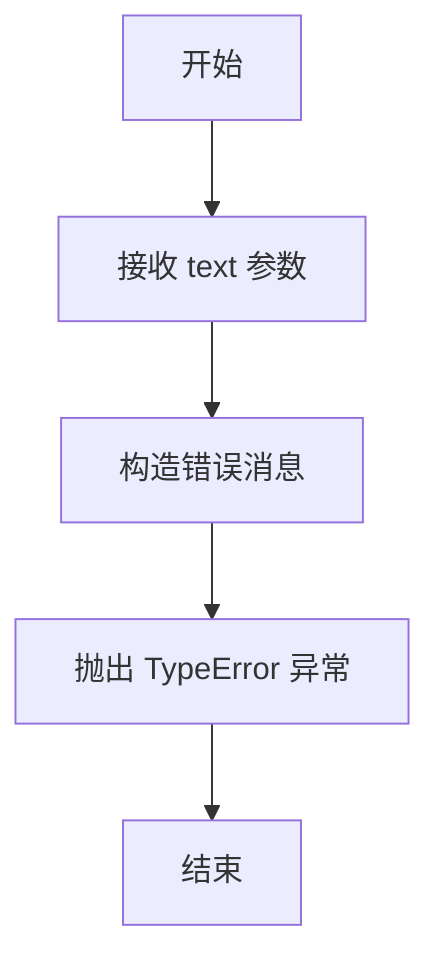
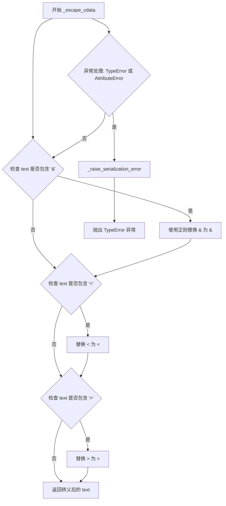
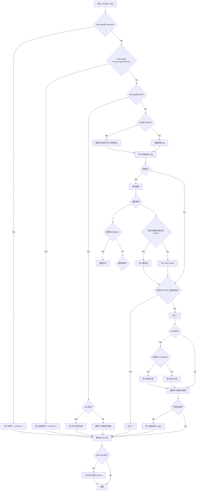
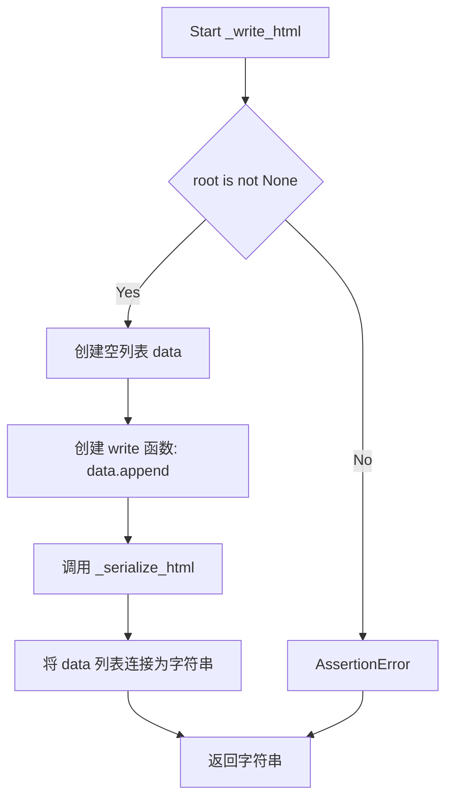
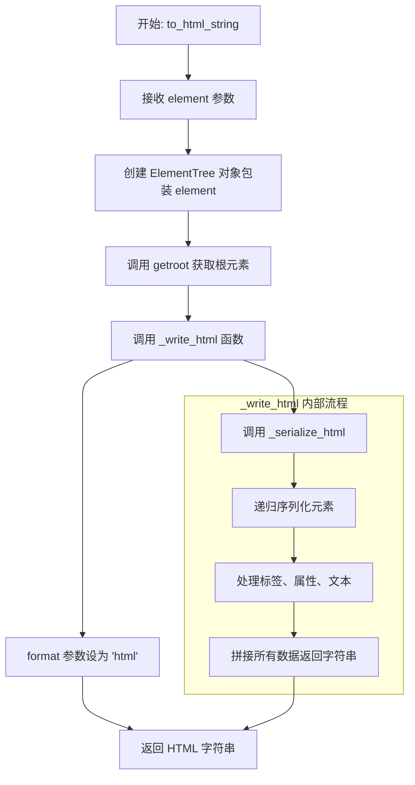

# `markdown\markdown\serializers.py` 详细设计文档

该模块提供将xml.etree.ElementTree的Element对象序列化为HTML5或XHTML字符串的功能，支持自定义转义规则、空标签处理和命名空间处理。

## 整体流程

```mermaid
graph TD
    A[开始: to_html_string/to_xhtml_string] --> B[_write_html]
    B --> C[调用 _serialize_html]
    C --> D{元素类型判断}
    D -->|Comment| E[写入注释]
    D -->|ProcessingInstruction| F[写入处理指令]
    D -->|None(文本节点)| G[写入文本内容]
    D -->|普通标签| H[写入标签开始]
    H --> I[写入属性]
    I --> J{格式为xhtml且为空标签?}
    J -->|是| K[写入 />]
    J -->|否| L[写入 >]
    L --> M[写入文本内容]
    M --> N[递归处理子元素]
    N --> O{不是空标签?}
    O -->|是| P[写入闭合标签]
    O -->|否| Q[写入尾随文本]
    Q --> R[结束]
```

## 类结构

```
xml.etree.ElementTree
├── Element (被序列化的元素)
├── ElementTree (包装器)
├── QName (命名空间处理)
├── Comment (注释节点)
└── ProcessingInstruction (处理指令)
```

## 全局变量及字段


### `__all__`
    
Module public API export list defining accessible functions when using 'from module import *'

类型：`list[str]`
    


### `RE_AMP`
    
Compiled regex pattern to match ampersand characters that are NOT part of valid HTML/XML entities (e.g., &amp;)

类型：`re.Pattern`
    


    

## 全局函数及方法


### `_raise_serialization_error`

该函数是一个内部错误处理函数，用于在序列化过程中遇到无法序列化的对象时抛出 `TypeError` 异常。它接收一个表示无法序列化内容的文本参数，并抛出一个格式化的错误消息。

参数：

- `text`：`str`，表示无法序列化的文本内容

返回值：`NoReturn`，该函数永不返回，总是抛出 `TypeError` 异常

#### 流程图



#### 带注释源码

```python
def _raise_serialization_error(text: str) -> NoReturn:  # pragma: no cover
    """
    抛出序列化错误异常。
    
    该函数在无法将给定文本序列化为字符串时调用，例如当尝试序列化
    一个不支持的类型（如整数、字典或其他非字符串对象）时。
    
    参数:
        text: 无法序列化的文本内容
        
    返回:
        NoReturn: 此函数永不返回，总是抛出异常
    """
    raise TypeError(
        "cannot serialize {!r} (type {})".format(text, type(text).__name__)
    )
```


### `_escape_cdata`

该函数用于转义XML/HTML中的字符数据（文本内容），将特殊字符（如 `&`、`<`、`>`）替换为对应的HTML实体，以防止文本内容被解析器误认为是标签或实体的一部分。

参数：

-  `text`：任意类型，待转义的文本数据

返回值：`str`，转义后的文本字符串

#### 流程图



#### 带注释源码

```python
def _escape_cdata(text) -> str:
    """
    转义字符数据（Character Data）
    
    将XML/HTML中的特殊字符转换为对应的实体引用，防止文本内容
    被解析器误解析为标签或实体的一部分。
    """
    # escape character data
    try:
        # it's worth avoiding do-nothing calls for strings that are
        # shorter than 500 character, or so.  assume that's, by far,
        # the most common case in most applications.
        # 优化：对于短字符串，避免执行无意义的替换操作
        if "&" in text:
            # Only replace & when not part of an entity
            # 使用正则表达式替换独立的 & 符号，保留已存在的实体引用
            text = RE_AMP.sub('&amp;', text)
        if "<" in text:
            # 替换 < 符号为 &lt; 实体
            text = text.replace("<", "&lt;")
        if ">" in text:
            # 替换 > 符号为 &gt; 实体
            text = text.replace(">", "&gt;")
        return text
    except (TypeError, AttributeError):  # pragma: no cover
        # 捕获类型错误和属性错误，用于处理非字符串类型的输入
        _raise_serialization_error(text)
```


### `_escape_attrib`

该函数用于转义XML/HTML属性值中的特殊字符（&、<、>、"、换行符），将其转换为对应的HTML实体，以防止属性值中的特殊字符破坏HTML结构。

参数：

- `text`：`str`，需要转义的属性值文本

返回值：`str`，转义后的属性值

#### 流程图

```mermaid
flowchart TD
    A[开始 _escape_attrib] --> B[输入: text: str]
    B --> C{检查 text 中是否包含 '&'}
    C -->|是| D[将 & 替换为 &amp;]
    C -->|否| E{检查 text 中是否包含 '<'}
    D --> E
    E -->|是| F[将 < 替换为 &lt;]
    E -->|否| G{检查 text 中是否包含 '>'}
    F --> G
    G -->|是| H[将 > 替换为 &gt;]
    G -->|否| I{检查 text 中是否包含 '"'}
    H --> I
    I -->|是| J[将 " 替换为 &quot;]
    I -->|否| K{检查 text 中是否包含换行符}
    J --> K
    K -->|是| L[将换行符替换为 &#10;]
    K -->|否| M[返回转义后的文本]
    L --> M
    C -.->|异常| N[_raise_serialization_error]
    E -.->|异常| N
    G -.->|异常| N
    I -.->|异常| N
    K -.->|异常| N
```

#### 带注释源码

```python
def _escape_attrib(text: str) -> str:
    """
    转义属性值中的特殊字符
    
    参数:
        text: 需要转义的字符串
        
    返回:
        转义后的字符串
    """
    # 尝试处理属性值的转义
    try:
        # 如果文本中包含 & 符号
        if "&" in text:
            # 只替换不是实体部分的 &
            # 使用正则表达式避免替换已存在的实体如 &nbsp; &#123; &#xabc;
            text = RE_AMP.sub('&amp;', text)
        
        # 如果文本中包含 < 符号，转义为 &lt;
        if "<" in text:
            text = text.replace("<", "&lt;")
        
        # 如果文本中包含 > 符号，转义为 &gt;
        if ">" in text:
            text = text.replace(">", "&gt;")
        
        # 如果文本中包含双引号，转义为 &quot;
        # HTML属性值必须用双引号包裹，因此需要转义内部的引号
        if "\"" in text:
            text = text.replace("\"", "&quot;")
        
        # 如果文本中包含换行符，转义为 &#10;
        # 换行符在属性值中可能导致HTML解析问题
        if "\n" in text:
            text = text.replace("\n", "&#10;")
        
        # 返回转义后的文本
        return text
    
    # 捕获类型错误和属性错误（如text为None或非字符串类型）
    except (TypeError, AttributeError):  # pragma: no cover
        # 抛出序列化错误
        _raise_serialization_error(text)
```


### `_escape_attrib_html`

该函数用于将文本中的特殊字符转义为HTML安全字符，主要用于HTML属性值的转义处理。它会处理 `&`、`<`、`>` 和 `"` 四个字符，将其转换为对应的HTML实体，防止在HTML属性中引发解析问题。

参数：

- `text`：`str`，需要进行HTML属性转义的原始文本

返回值：`str`，转义后的HTML安全文本

#### 流程图

```mermaid
flowchart TD
    A[Start _escape_attrib_html] --> B{尝试处理}
    B --> C{text 包含 '&'?}
    C -->|是| D[使用正则替换 '&' 为 '&amp;']
    C -->|否| E{text 包含 '<'?}
    D --> E
    E -->|是| F[替换 '<' 为 '&lt;']
    E -->|否| G{text 包含 '>'?}
    F --> G
    G -->|是| H[替换 '>' 为 '&gt;']
    G -->|否| I{text 包含 '"'?}
    H --> I
    I -->|是| J[替换 '"' 为 '&quot;']
    I -->|否| K[返回转义后的文本]
    J --> K
    
    B -->|异常| L[_raise_serialization_error]
    L --> M[End with Error]
    K --> N[End - Return escaped text]
```

#### 带注释源码

```python
def _escape_attrib_html(text: str) -> str:
    """
    转义HTML属性值中的特殊字符
    
    参数:
        text: 需要转义的文本字符串
    
    返回:
        转义后的HTML安全字符串
    """
    # 转义属性值
    try:
        # 检查并替换 & 符号（需要排除已经是HTML实体的部分）
        if "&" in text:
            # Only replace & when not part of an entity
            # 使用正则表达式确保不重复转义已存在的实体
            text = RE_AMP.sub('&amp;', text)
        
        # 检查并替换 < 符号
        if "<" in text:
            text = text.replace("<", "&lt;")
        
        # 检查并替换 > 符号
        if ">" in text:
            text = text.replace(">", "&gt;")
        
        # 检查并替换双引号（HTML属性用双引号包裹）
        if "\"" in text:
            text = text.replace("\"", "&quot;")
        
        # 注意：此处不处理换行符\n（与_xhtml版本_escape_attrib的区别）
        # HTML5规范中允许属性值包含换行，而XHTML不允许
        
        return text
    except (TypeError, AttributeError):  # pragma: no cover
        # 捕获类型错误和属性错误（当text为非字符串类型时触发）
        _raise_serialization_error(text)
```


### `_serialize_html`

该函数是 HTML/XHTML 序列化的核心递归函数，负责将 XML Element 对象序列化为 HTML 或 XHTML 字符串。它根据元素类型（注释、处理指令、普通标签）进行不同处理，处理命名空间、属性转义、布尔属性和空标签，并递归处理所有子元素。

参数：

- `write`：`Callable[[str], None]`，用于写入输出字符串的回调函数
- `elem`：`Element`，要序列化的 XML Element 对象
- `format`：`Literal["html", "xhtml"]`，输出格式，"html" 或 "xhtml"

返回值：`None`，通过 `write` 回调函数输出结果

#### 流程图



#### 带注释源码

```python
def _serialize_html(write: Callable[[str], None], elem: Element, format: Literal["html", "xhtml"]) -> None:
    """
    将 Element 对象序列化为 HTML/XHTML 字符串。
    
    参数:
        write: 回调函数，用于接收生成的字符串片段
        elem: 要序列化的 XML Element 对象
        format: 输出格式，'html' 或 'xhtml'
    """
    # 获取元素的标签名
    tag = elem.tag
    # 获取元素的文本内容
    text = elem.text
    
    # 处理注释节点
    if tag is Comment:
        # 注释格式: <!--content-->
        write("<!--%s-->" % _escape_cdata(text))
    
    # 处理处理指令节点
    elif tag is ProcessingInstruction:
        # 处理指令格式: <?content?>
        write("<?%s?>" % _escape_cdata(text))
    
    # 处理文本节点（无标签）
    elif tag is None:
        # 如果有文本内容，写入转义后的文本
        if text:
            write(_escape_cdata(text))
        # 递归处理所有子元素
        for e in elem:
            _serialize_html(write, e, format)
    
    # 处理普通元素标签
    else:
        namespace_uri = None
        
        # 处理 QName 对象（包含命名空间的标签）
        if isinstance(tag, QName):
            # QName 格式为 '{uri}tag'
            if tag.text[:1] == "{":
                # 提取命名空间 URI 和标签名
                namespace_uri, tag = tag.text[1:].split("}", 1)
            else:
                raise ValueError('QName objects must define a tag.')
        
        # 写入开始标签
        write("<" + tag)
        
        # 处理元素属性
        items = elem.items()
        if items:
            # 按字母顺序排序属性
            items = sorted(items)
            for k, v in items:
                # 处理属性名的 QName
                if isinstance(k, QName):
                    k = k.text
                # 处理属性值的 QName
                if isinstance(v, QName):
                    v = v.text
                else:
                    # 转义属性值（HTML 模式，不转义换行符）
                    v = _escape_attrib_html(v)
                
                # HTML 模式下处理布尔属性（如 checked、disabled）
                if k == v and format == 'html':
                    write(" %s" % v)
                else:
                    write(' {}="{}"'.format(k, v))
        
        # 写入命名空间声明
        if namespace_uri:
            write(' xmlns="%s"' % (_escape_attrib(namespace_uri)))
        
        # XHTML 模式下处理空自闭合标签
        if format == "xhtml" and tag.lower() in HTML_EMPTY:
            write(" />")
        else:
            write(">")
            
            # 处理元素的文本内容
            if text:
                # script 和 style 标签不转义内容
                if tag.lower() in ["script", "style"]:
                    write(text)
                else:
                    write(_escape_cdata(text))
            
            # 递归处理所有子元素
            for e in elem:
                _serialize_html(write, e, format)
            
            # 如果不是空标签，写入结束标签
            if tag.lower() not in HTML_EMPTY:
                write("</" + tag + ">")
    
    # 处理尾随文本（元素之后的文本）
    if elem.tail:
        write(_escape_cdata(elem.tail))
```


### `_write_html`

该函数是 Python-Markdown 中用于将 ElementTree 的 `Element` 对象序列化为 HTML 或 XHTML 字符串的内部函数。它接收一个根元素和格式参数，创建一个列表来收集输出，然后调用 `_serialize_html` 进行递归序列化，最后将结果连接成字符串返回。

参数：

- `root`：`Element`，要序列化的 XML/HTML 元素树的根元素
- `format`：`Literal["html", "xhtml"]`，输出格式，默认为 "html"

返回值：`str`，序列化后的 HTML 或 XHTML 字符串

#### 流程图



#### 带注释源码

```python
def _write_html(root: Element, format: Literal["html", "xhtml"] = "html") -> str:
    """
    将 Element 对象序列化为 HTML 或 XHTML 字符串
    
    参数:
        root: Element - XML 元素树的根节点
        format: str - 输出格式，"html" 或 "xhtml"
    
    返回:
        str - 序列化后的字符串
    """
    # 断言 root 不为 None，如果为 None 则抛出 AssertionError
    assert root is not None
    
    # 创建一个空列表用于收集输出数据
    # 使用列表而非字符串拼接可以提高性能（避免 O(n²) 复杂度）
    data: list[str] = []
    
    # 将 list.append 方法赋值给 write 变量
    # 这是一个常见的优化技巧，避免在循环中频繁查找方法
    write = data.append
    
    # 调用内部序列化函数，递归处理元素及其子元素
    # write 函数会被多次调用，每次添加一部分生成的 HTML/XHTML
    _serialize_html(write, root, format)
    
    # 将列表中的所有字符串片段连接成一个完整的 HTML/XHTML 字符串
    # 使用 join 而非 + 拼接，避免创建多个中间字符串对象
    return "".join(data)
```


### `to_html_string`

将 `ElementTree.Element` 对象序列化转换为 HTML5 字符串的公共函数。

参数：

- `element`：`Element`，要序列化的 XML 元素节点

返回值：`str`，返回生成的 HTML5 字符串

#### 流程图



#### 带注释源码

```python
def to_html_string(element: Element) -> str:
    """ Serialize element and its children to a string of HTML5. """
    # 使用 ElementTree 包装传入的 Element 对象
    # 然后获取其根元素，调用 _write_html 进行序列化
    # format 参数指定为 "html"，表示输出 HTML5 格式
    return _write_html(ElementTree(element).getroot(), format="html")
```


### `to_xhtml_string`

将 XML 元素对象序列化为符合 XHTML 规范的字符串表示形式。

参数：

- `element`：`Element`（来自 `xml.etree.ElementTree.Element`），需要序列化的根元素对象

返回值：`str`，返回生成的 XHTML 字符串

#### 流程图

```mermaid
flowchart TD
    A[开始: to_xhtml_string] --> B[接收 element 参数]
    B --> C[创建 ElementTree 对象: ElementTree(element)]
    C --> D[调用 getroot 获取根元素]
    D --> E[调用 _write_html 函数]
    E --> F[format 参数设为 'xhtml']
    F --> G[_write_html 内部]
    G --> H[创建空列表 data 用于存储输出]
    H --> I[定义 write 回调函数为 data.append]
    I --> J[调用 _serialize_html 递归序列化]
    J --> K{遍历元素节点}
    K -->|注释节点| L[写入注释格式: <!--comment-->]
    K -->|处理指令| M[写入PI格式: <?target?>]
    K -->|普通标签| N[写入标签和属性]
    N --> O{检查是否为XHTML空标签}
    O -->|是| P[写入自闭合标签: />]
    O -->|否| Q[写入开始标签: >]
    Q --> R[写入文本内容]
    R --> S[递归处理子元素]
    S --> T[写入结束标签]
    T --> U[写入尾随文本 tail]
    U --> V[将 data 列表连接为字符串]
    V --> W[返回 XHTML 字符串]
    W --> X[结束]
```

#### 带注释源码

```python
def to_xhtml_string(element: Element) -> str:
    """
    将元素及其子元素序列化为XHTML字符串。
    
    参数:
        element: ElementTree的Element对象
        
    返回:
        字符串形式的XHTML表示
    """
    # 使用 ElementTree 包装 element，并获取其根元素
    # 这确保了无论传入的是元素还是树，都能正确处理
    return _write_html(ElementTree(element).getroot(), format="xhtml")
```

---

### 相关底层函数

#### `_write_html`

参数：

- `root`：`Element`，XML 根元素
- `format`：`Literal["html", "xhtml"]`，输出格式，默认为 "html"

返回值：`str`，返回生成的 HTML/XHTML 字符串

```python
def _write_html(root: Element, format: Literal["html", "xhtml"] = "html") -> str:
    """将元素序列化为HTML或XHTML字符串的内部函数。"""
    assert root is not None  # 确保根元素不为空
    data: list[str] = []  # 用于收集输出字符串的列表
    write = data.append  # 创建写入回调函数
    _serialize_html(write, root, format)  # 执行递归序列化
    return "".join(data)  # 将列表中的所有字符串连接返回
```

#### `_serialize_html`

递归序列化元素的核心函数，负责生成实际的 HTML/XHTML 标记。

```python
def _serialize_html(write: Callable[[str], None], elem: Element, format: Literal["html", "xhtml"]) -> None:
    """递归地将元素写入到输出流中。"""
    tag = elem.tag  # 获取元素标签
    text = elem.text  # 获取元素文本内容
    
    # 处理注释节点
    if tag is Comment:
        write("<!--%s-->" % _escape_cdata(text))
    # 处理处理指令(Processing Instruction)
    elif tag is ProcessingInstruction:
        write("<?%s?>" % _escape_cdata(text))
    # 处理文本节点(无标签)
    elif tag is None:
        if text:
            write(_escape_cdata(text))
        # 递归处理子元素
        for e in elem:
            _serialize_html(write, e, format)
    else:
        # 处理普通元素标签
        namespace_uri = None
        # 处理 QName 对象(带命名空间的标签)
        if isinstance(tag, QName):
            if tag.text[:1] == "{":
                namespace_uri, tag = tag.text[1:].split("}", 1)
            else:
                raise ValueError('QName objects must define a tag.')
        
        write("<" + tag)  # 写入开始标签
        
        # 处理属性
        items = elem.items()
        if items:
            items = sorted(items)  # 按字母顺序排序属性
            for k, v in items:
                # 处理 QName 类型的属性名和值
                if isinstance(k, QName):
                    k = k.text
                if isinstance(v, QName):
                    v = v.text
                else:
                    v = _escape_attrib_html(v)
                
                # HTML格式下处理布尔属性(如 checked, disabled)
                if k == v and format == 'html':
                    write(" %s" % v)
                else:
                    write(' {}="{}"'.format(k, v))
        
        # 写入命名空间声明
        if namespace_uri:
            write(' xmlns="%s"' % (_escape_attrib(namespace_uri)))
        
        # XHTML模式下处理空标签(如 <br>, , <input>)
        if format == "xhtml" and tag.lower() in HTML_EMPTY:
            write(" />")
        else:
            write(">")
            # 写入文本内容
            if text:
                # script/style 标签不转义内容
                if tag.lower() in ["script", "style"]:
                    write(text)
                else:
                    write(_escape_cdata(text))
            
            # 递归处理所有子元素
            for e in elem:
                _serialize_html(write, e, format)
            
            # 写入结束标签(非空标签)
            if tag.lower() not in HTML_EMPTY:
                write("</" + tag + ">")
    
    # 写入尾随文本(tail，即结束标签后的文本)
    if elem.tail:
        write(_escape_cdata(elem.tail))
```

## 关键组件


### to_html_string / to_xhtml_string

公共API函数，将ElementTree的Element对象序列化为HTML5或XHTML字符串。to_html_string生成HTML5兼容输出，to_xhtml_string生成XHTML兼容输出。

### _write_html

内部核心函数，负责初始化序列化流程，收集序列化后的数据并返回字符串。

### _serialize_html

递归序列化函数，核心组件。处理Element的所有子元素，生成对应的HTML/XHTML标记。处理命名空间、属性、文本、尾随文本、注释、ProcessingInstruction等。

### _escape_cdata

转义字符数据（CDATA）中的特殊字符（&、<、>），确保输出为合法的XML/HTML。

### _escape_attrib

转义属性值中的特殊字符（&、<、>、"、换行符），生成合法的属性值。

### _escape_attrib_html

HTML模式下的属性转义，与_xhtml版本相比不转义换行符。

### RE_AMP

正则表达式编译对象，用于识别需要转义的&字符（不包括已转义的实体）。

### _raise_serialization_error

错误处理函数，当遇到无法序列化的对象时抛出TypeError。

### HTML_EMPTY 集合

来自xml.etree.ElementTree模块的预定义集合，包含HTML空元素列表（如br、hr、img等），用于区分自闭合标签。

### QName 处理

处理XML命名空间的逻辑，将{QName}格式的标签解析为命名空间URI和本地标签名。


## 问题及建议


### 已知问题

- **代码重复**：`_escape_attrib` 和 `_escape_attrib_html` 函数存在大量重复代码，只有少数字符处理不同（如换行符和引号处理），可提取公共逻辑。
- **冗余的对象创建**：`to_html_string` 和 `to_xhtml_string` 函数中创建了 `ElementTree(element)` 对象来获取根元素，但输入的 `element` 本身已经是 `Element` 对象，此操作多余。
- **字符串拼接效率**：在 `_serialize_html` 函数中大量使用 `+` 操作符进行字符串拼接（如 `write("<" + tag)`），可改用 f-string 或 format 字符串提升可读性和性能。
- **类型注解不完整**：`_escape_cdata` 函数的参数 `text` 缺少类型注解，且返回值类型注解为 `str` 但实际返回的可能是 `Any`（当输入为非字符串时会在异常处理中抛出）。
- **属性排序开销**：`items = sorted(items)` 每次都创建新列表，对于 HTML 格式输出（属性顺序不影响渲染）可考虑跳过排序以提升性能。
- **魔法数字**：代码注释中提到 "500 characters" 作为阈值判断，但没有定义为常量，语义不清晰。
- **错误处理过于宽泛**：捕获 `TypeError` 和 `AttributeError` 并统一抛出通用错误，无法区分具体失败原因。

### 优化建议

- 将 `_escape_attrib` 和 `_escape_attrib_html` 合并为一个函数，通过参数控制是否处理换行符和引号。
- 移除 `to_html_string` 和 `to_xhtml_string` 中多余的 `ElementTree` 包装，直接传递 `element` 给 `_write_html`。
- 使用 f-string 重写字符串拼接逻辑，如 `write(f"<{tag}")`。
- 为 `_escape_cdata` 添加参数类型注解 `text: str`，并统一返回值类型。
- 定义常量 `SHORT_STRING_THRESHOLD = 500` 替代魔法数字，并考虑移除该优化（现代 Python 解释器已足够快）。
- 在 `_serialize_html` 中对 HTML 格式跳过排序，仅对 XHTML 格式保留确定性输出。
- 提供更具体的异常类型或添加日志记录以帮助调试。

## 其它


### 设计目标与约束

本模块的设计目标是为Python-Markdown提供将ElementTree序列化为HTML/XHTML字符串的功能。主要约束包括：1) 必须兼容Python标准库的xml.etree.ElementTree模块；2) 支持HTML5和XHTML两种输出格式；3) 处理空标签、布尔属性、命名空间等特殊场景；4) 确保字符转义的正确性，防止XSS等安全问题。

### 错误处理与异常设计

代码采用错误传播模式，主要通过_raise_serialization_error函数处理序列化错误。当遇到无法序列化的对象类型时，抛出TypeError并附带详细错误信息。转义函数(_escape_cdata、_escape_attrib等)捕获TypeError和AttributeError异常并重新抛出序列化错误。所有公开函数(to_html_string、to_xhtml_string)通过try-except捕获底层异常并提供友好的错误消息。

### 数据流与状态机

数据流为：输入Element对象 → ElementTree包装 → 获取根节点 → 递归序列化(_serialize_html) → 字符串拼接输出。_serialize_html函数的状态转换基于elem.tag的类型：Comment节点、ProcessingInstruction节点、普通元素节点(None表示文本节点)。对于普通元素，进一步判断是否为自闭合标签(HTML_EMPTY)、是否为script/style标签(不转义内容)、是否需要处理命名空间等。

### 外部依赖与接口契约

主要依赖：1) xml.etree.ElementTree模块的ProcessingInstruction、Comment、ElementTree、Element、QName、HTML_EMPTY；2) re模块用于正则表达式；3) typing模块用于类型提示。公开接口：to_html_string(element: Element) -> str和to_xhtml_string(element: Element) -> str，均接受ElementTree.Element对象并返回字符串。

### 性能考虑

代码已包含基本性能优化：1) 使用list的append方法而非字符串拼接；2) 对短字符串避免不必要的转义操作；3) 使用正则表达式预编译(RE_AMP)。潜在优化空间：可添加缓存机制处理重复的命名空间URI，对大型文档可考虑增量序列化。

### 安全性考虑

本模块主要涉及HTML转义，防止XSS攻击。_escape_cdata处理元素内容，_escape_attrib和_escape_attrib_html处理属性值。关键点：1) &符号需使用正则排除已存在的实体；2) 属性值中的换行符需转义为&#10；3) XHTML模式使用引号包裹属性值。

### 兼容性说明

代码兼容Python 3.x版本(使用from __future__ import annotations)。与ElementTree 1.3预览版保持兼容。HTML_EMPTY标签列表来自标准库，不同Python版本可能有细微差异。

### 使用示例

```python
from xml.etree.ElementTree import Element, SubElement
from markdown.html import to_html_string, to_xhtml_string

# 创建元素
root = Element('html')
body = SubElement(root, 'body')
p = SubElement(body, 'p')
p.text = 'Hello & World'
p.set('class', 'intro')

# HTML输出
html_output = to_html_string(root)
# <html><body><p class="intro">Hello &amp; World</p></body></html>

# XHTML输出
xhtml_output = to_xhtml_string(root)
# <html><body><p class="intro">Hello &amp; World</p></body></html>
```

### 配置与常量

RE_AMP：预编译正则表达式，用于识别需要转义的&符号。HTML_EMPTY：来自xml.etree.ElementTree的常量，定义HTML中的空标签列表。

### 变更历史

本模块基于ElementTree 1.3预览版修改而来，由PythonWare的Fredrik Lundh编写。Python-Markdown项目对其进行封装以提供HTML/XHTML序列化功能。


    