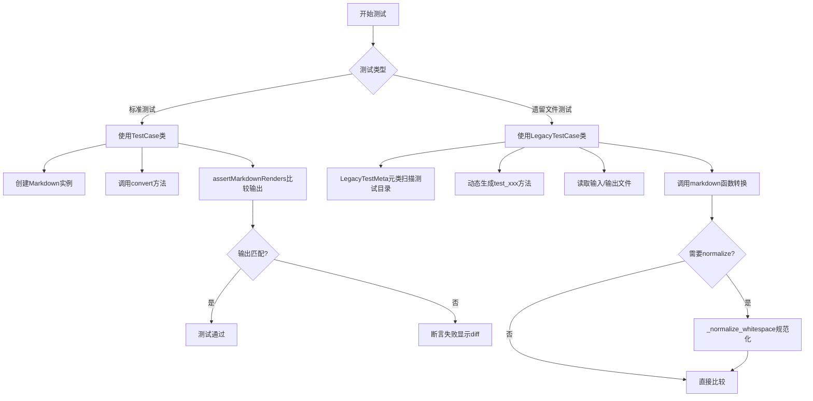
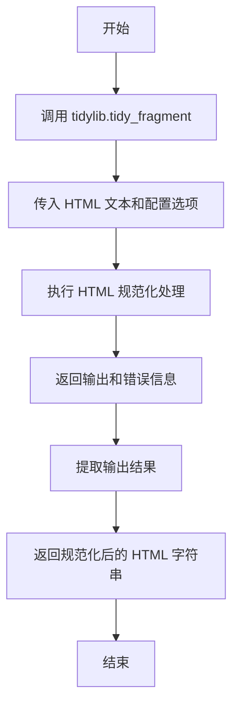
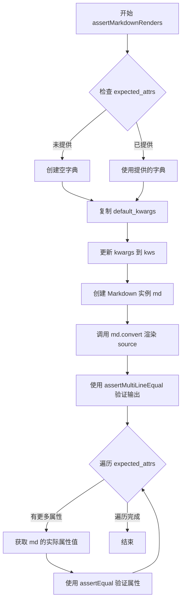
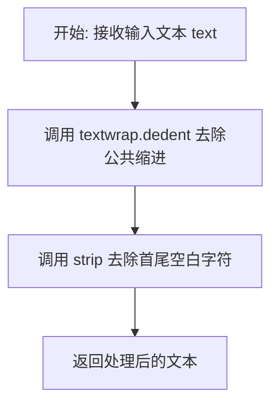
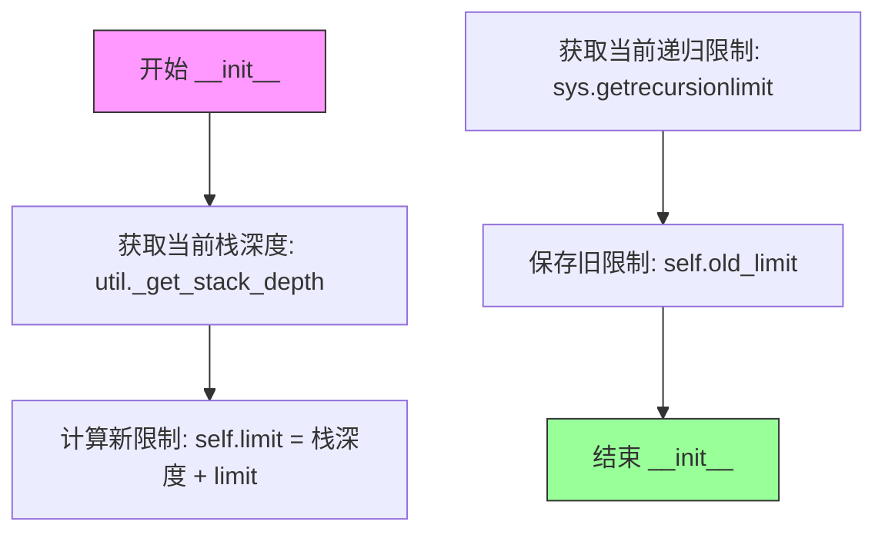
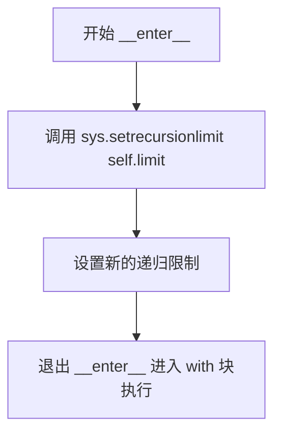
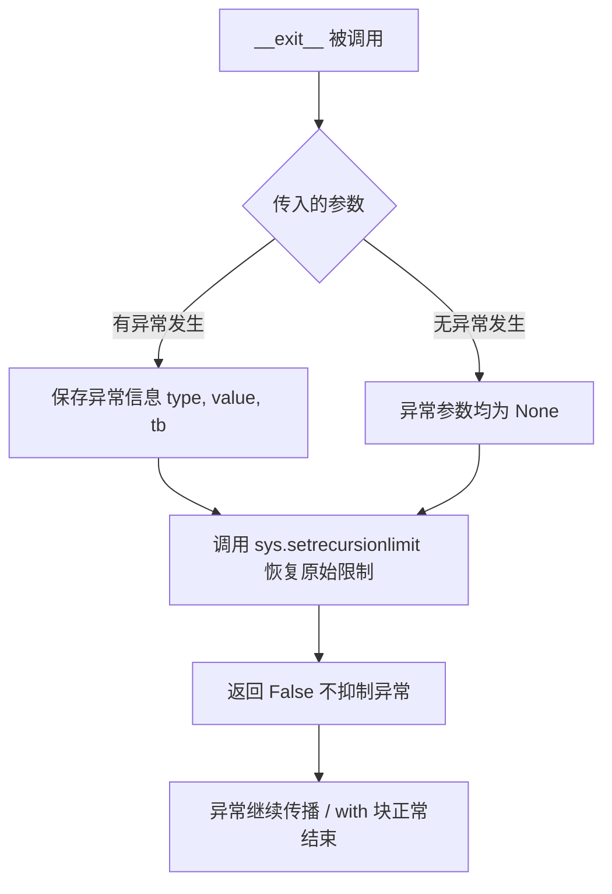
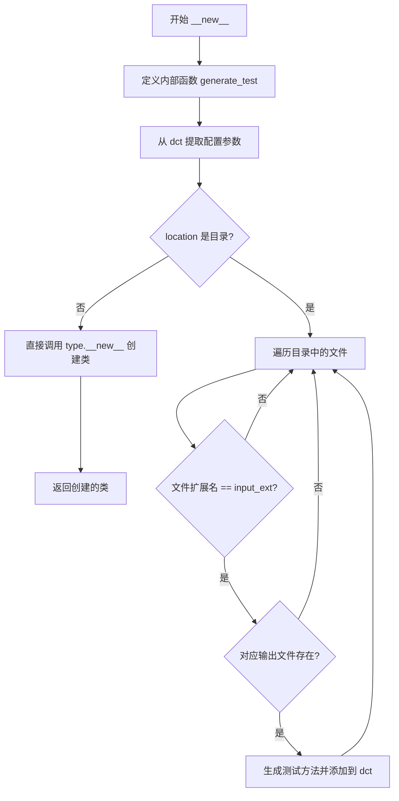

# `markdown\markdown\test_tools.py` 详细设计文档

这是一个Python Markdown库的测试框架模块，提供TestCase和LegacyTestCase类用于单元测试，支持Markdown到HTML的转换测试、递归限制管理、HTML规范化等功能。

## 整体流程



## 类结构

```
unittest.TestCase (标准库基类)
├── TestCase (主测试类)
│   ├── default_kwargs (类字段)
│   ├── assertMarkdownRenders() (方法)
│   └── dedent() (方法)
│
recursionlimit (上下文管理器)
│   ├── __init__()
│   ├── __enter__()
│   └── __exit__()
│
dict
└── Kwargs (字典子类)
│
type (元类)
└── LegacyTestMeta (元类)
    └── __new__() (动态生成测试方法)
│
unittest.TestCase
└── LegacyTestCase (遗留文件测试类)
    └── location, exclude, normalize, input_ext, output_ext, default_kwargs (类属性)
```

## 全局变量及字段


### `tidylib`
    
可选的tidylib库导入，可能为None

类型：`Any`
    


### `__all__`
    
导出的模块列表，包含 TestCase、LegacyTestCase 和 Kwargs

类型：`list[str]`
    


### `TestCase.default_kwargs`
    
传递给Markdown的默认选项

类型：`dict[str, Any]`
    


### `recursionlimit.limit`
    
临时递归限制值（当前堆栈深度加上提供的限制）

类型：`int`
    


### `recursionlimit.old_limit`
    
修改前的原始递归限制

类型：`int`
    


### `LegacyTestCase.location`
    
测试文件目录的路径

类型：`str`
    


### `LegacyTestCase.exclude`
    
排除的测试文件列表（不含扩展名）

类型：`list[str]`
    


### `LegacyTestCase.normalize`
    
是否对HTML进行规范化

类型：`bool`
    


### `LegacyTestCase.input_ext`
    
输入文件的扩展名

类型：`str`
    


### `LegacyTestCase.output_ext`
    
输出文件的扩展名

类型：`str`
    


### `LegacyTestCase.default_kwargs`
    
所有测试的默认关键字参数

类型：`Kwargs`
    
    

## 全局函数及方法


### `_normalize_whitespace`

该函数是一个全局工具函数，用于使用 `tidylib` 库对 HTML 文本进行空白规范化处理，通过配置特定的 Tidy 选项将 HTML 片段转换为标准化的 XHTML 格式，确保测试输出的一致性。

参数：

- `text`：`str`，需要规范化的 HTML 文本字符串

返回值：`str`，规范化后的 HTML 字符串

#### 流程图



#### 带注释源码

```python
def _normalize_whitespace(text):
    """
    Normalize whitespace for a string of HTML using `tidylib`.
    
    该函数使用 HTML Tidy 库对输入的 HTML 文本进行标准化处理，
    确保测试用例的输出在不同的平台上保持一致。
    
    参数:
        text: 需要规范化的 HTML 文本字符串
        
    返回:
        规范化后的 HTML 字符串
    """
    # 调用 tidylib 的 tidy_fragment 函数处理 HTML 片段
    # options 字典包含 Tidy 库的配置选项
    output, errors = tidylib.tidy_fragment(text, options={
        'drop_empty_paras': 0,      # 不删除空段落
        'fix_backslash': 0,         # 不修复反斜杠
        'fix_bad_comments': 0,     # 不修复错误的注释
        'fix_uri': 0,               # 不修复 URI
        'join_styles': 0,          # 不合并样式属性
        'lower_literals': 0,       # 不转换字面量为小写
        'merge_divs': 0,           # 不合并 div 元素
        'output_xhtml': 1,         # 输出 XHTML 格式
        'quote_ampersand': 0,      # 不转义 & 符号
        'newline': 'LF'            # 使用 Unix 风格的换行符
    })
    # 返回规范化后的 HTML 输出，忽略错误信息
    return output
```


### `TestCase.assertMarkdownRenders`

该方法用于测试 Markdown 源文本是否使用给定的关键字参数渲染为期望的 HTML 输出，并可选择性地验证 Markdown 实例的特定属性值。

参数：

- `source`：`str`，要渲染的 Markdown 源文本
- `expected`：`str`，期望的 HTML 输出
- `expected_attrs`：`dict[str, Any]`，可选，期望的 Markdown 实例属性字典，键为属性名，值为期望的属性值
- `**kwargs`：`Any`，其他要传递给 Markdown 的关键字参数

返回值：`None`，该方法无返回值，通过断言验证输出

#### 流程图



#### 带注释源码

```python
def assertMarkdownRenders(self, source, expected, expected_attrs=None, **kwargs):
    """
    Test that source Markdown text renders to expected output with given keywords.

    `expected_attrs` accepts a `dict`. Each key should be the name of an attribute
    on the `Markdown` instance and the value should be the expected value after
    the source text is parsed by Markdown. After the expected output is tested,
    the expected value for each attribute is compared against the actual
    attribute of the `Markdown` instance using `TestCase.assertEqual`.
    """

    # 如果未提供 expected_attrs，则使用空字典
    expected_attrs = expected_attrs or {}
    
    # 复制默认关键字参数（类属性）
    kws = self.default_kwargs.copy()
    
    # 使用传入的 kwargs 更新默认配置，允许覆盖默认值
    kws.update(kwargs)
    
    # 使用合并后的配置创建 Markdown 实例
    md = Markdown(**kws)
    
    # 将 Markdown 源文本转换为 HTML 输出
    output = md.convert(source)
    
    # 使用 unittest 的 assertMultiLineEqual 验证输出
    # 该方法会提供更友好的多行字符串差异比较
    self.assertMultiLineEqual(output, expected)
    
    # 遍历期望的属性字典，逐一验证 Markdown 实例的属性
    for key, value in expected_attrs.items():
        # 获取 Markdown 实例的实际属性值
        # 使用 getattr 安全地获取属性
        self.assertEqual(getattr(md, key), value)
```


### `TestCase.dedent`

该方法用于去除多行文本字符串的公共缩进，常用于测试中处理三引号字符串字面量，以获得干净的文本进行比较。

参数：

- `text`：`str`，需要去除缩进的文本字符串

返回值：`str`，去除公共缩进并去除首尾空白后的文本字符串

#### 流程图



#### 带注释源码

```python
def dedent(self, text):
    """
    Dedent text.
    """

    # TODO: If/when actual output ends with a newline, then use:
    #     return textwrap.dedent(text.strip('/n'))
    return textwrap.dedent(text).strip()
```

**代码说明：**

1. **第一行**：方法定义，接受一个 `self`（TestCase 实例）和 `text` 参数
2. **文档字符串**：简单描述方法功能为"去除文本缩进"
3. **TODO 注释**：提示未来可能的改进，如果实际输出以换行符结尾，应该使用 `text.strip('/n')` 进行预处理
4. **核心逻辑**：
   - `textwrap.dedent(text)`：移除文本中所有行的公共前导空白（共同缩进）
   - `.strip()`：去除结果字符串首尾的空白字符（包括换行符、空格等）
5. **返回值**：返回处理后的干净文本字符串


### `recursionlimit.__init__`

该方法是 `recursionlimit` 类的构造函数，用于初始化上下文管理器。它接收一个 `limit` 参数，结合当前栈深度计算出新的递归限制，并保存旧的递归限制值以供后续恢复。

参数：

- `limit`：`int`，用户期望设置的递归限制值，该值会与当前栈深度相加得到最终的限制值

返回值：`None`，构造函数不返回值，仅初始化实例属性

#### 流程图



#### 带注释源码

```python
def __init__(self, limit):
    """
    初始化 recursionlimit 上下文管理器。
    
    参数:
        limit: int，用户期望设置的递归限制值。该值会与当前调用栈深度相加，
               以确保在测试环境中（可能有额外的框架栈帧）仍能提供一致的递归深度限制。
    """
    # 计算最终的递归限制：当前栈深度 + 用户指定的限制
    # 这样做是为了补偿测试框架、coverage 等可能添加的额外栈帧
    self.limit = util._get_stack_depth() + limit
    
    # 保存当前系统的递归限制，以便在上下文管理器退出时恢复
    self.old_limit = sys.getrecursionlimit()
```


### `recursionlimit.__enter__`

进入上下文设置递归限制的方法。该方法在进入 `with` 语句块时自动被调用，用于临时将 Python 系统的递归限制设置为预先计算的值，以确保测试用例能够在一个可控的递归深度环境中运行。

参数： 无（仅包含隐式参数 `self`）

返回值：`None`，无返回值描述

#### 流程图



#### 带注释源码

```python
def __enter__(self):
    """
    进入上下文管理器时调用的方法。
    
    当代码执行进入 with recursionlimit() as ...: 语句块时，
    此方法被自动调用，用于将系统的递归限制设置为在 __init__ 中
    预先计算好的限制值。
    
    该值是通过 util._get_stack_depth() + limit 计算得出，
    其中 limit 是用户传入的目标递归深度，这样可以确保测试
    代码能够在一致的栈深度环境下运行。
    
    参数:
        无（仅包含隐式参数 self）
    
    返回值:
        None
    """
    sys.setrecursionlimit(self.limit)
```


### `recursionlimit.__exit__`

退出上下文时恢复原始的 Python 递归限制。当退出 `with` 语句块时，将系统递归限制重置为进入上下文前保存的原始值，从而确保不会永久修改全局递归限制。

参数：

- `type`：`type | None`，异常类型参数，当没有异常发生时为 `None`，否则传递异常的异常类
- `value`：`BaseException | None`，异常值参数，当没有异常发生时为 `None`，否则传递异常的实例
- `tb`：`TracebackType | None`，回溯对象参数，当没有异常发生时为 `None`，否则传递异常的traceback对象

返回值：`bool`，返回 `False`（或 `None`）表示不抑制异常传播，异常将继续向外抛出

#### 流程图



#### 带注释源码

```python
def __exit__(self, type, value, tb):
    """
    退出上下文管理器时恢复原始递归限制。

    参数:
        type: 异常类型，如果没有异常则为 None
        value: 异常值/实例，如果没有异常则为 None
        tb: 异常回溯对象，如果没有异常则为 None

    返回:
        bool: 返回 False 表示不抑制异常，让异常继续向外传播
    """
    # 恢复系统递归限制为进入上下文前保存的原始值
    sys.setrecursionlimit(self.old_limit)
```


### `LegacyTestMeta.__new__`

该方法是 Python Markdown 项目测试框架中的元类方法，通过扫描指定目录中的测试文件（输入/输出文件对），动态为每个文件对生成对应的 unittest 测试方法，从而实现基于文件的自动化测试用例生成。

参数：

- `cls`：元类自身（LegacyTestMeta）
- `name`：str，新创建的测试类的名称
- `bases`：tuple，测试类的基类元组（通常为 `(unittest.TestCase,)`）
- `dct`：dict，包含测试类属性和方法的字典，其中包含 `location`、`exclude`、`normalize`、`input_ext`、`output_ext`、`default_kwargs` 等配置项

返回值：`type`，返回新创建的测试类对象

#### 流程图



#### 带注释源码

```python
class LegacyTestMeta(type):
    def __new__(cls, name, bases, dct):
        """
        元类方法：动态生成测试用例
        
        该方法在类定义时被调用，扫描指定目录中的测试文件，
        为每个输入/输出文件对生成对应的测试方法。
        """

        def generate_test(infile, outfile, normalize, kwargs):
            """
            创建单个测试方法的工厂函数
            
            参数:
                infile: str，输入文件路径
                outfile: str，期望输出文件路径
                normalize: bool，是否规范化 HTML
                kwargs: dict，传递给 markdown 的关键字参数
            """
            def test(self):
                # 读取输入文件内容
                with open(infile, encoding="utf-8") as f:
                    input = f.read()
                # 读取期望输出文件内容，并规范化换行符
                with open(outfile, encoding="utf-8") as f:
                    expected = f.read().replace("\r\n", "\n")
                # 执行 markdown 转换
                output = markdown(input, **kwargs)
                # 如果需要规范化 HTML（使用 tidylib）
                if tidylib and normalize:
                    try:
                        expected = _normalize_whitespace(expected)
                        output = _normalize_whitespace(output)
                    except OSError:
                        self.skipTest("Tidylib's c library not available.")
                elif normalize:
                    self.skipTest('Tidylib not available.')
                # 断言输出与期望一致
                self.assertMultiLineEqual(output, expected)
            return test

        # 从类属性中提取配置参数
        location = dct.get('location', '')       # 测试文件目录路径
        exclude = dct.get('exclude', [])          # 排除的测试名称列表
        normalize = dct.get('normalize', False)   # 是否规范化 HTML
        input_ext = dct.get('input_ext', '.txt') # 输入文件扩展名
        output_ext = dct.get('output_ext', '.html') # 输出文件扩展名
        kwargs = dct.get('default_kwargs', Kwargs()) # 默认关键字参数

        # 如果 location 是有效目录，则扫描生成测试
        if os.path.isdir(location):
            for file in os.listdir(location):
                infile = os.path.join(location, file)
                if os.path.isfile(infile):
                    tname, ext = os.path.splitext(file)
                    # 检查是否为指定的输入文件扩展名
                    if ext == input_ext:
                        outfile = os.path.join(location, tname + output_ext)
                        # 将文件名中的空格和短横线替换为下划线
                        tname = tname.replace(' ', '_').replace('-', '_')
                        kws = kwargs.copy()
                        # 如果有针对特定文件的参数配置，则合并
                        if tname in dct:
                            kws.update(dct[tname])
                        test_name = 'test_%s' % tname
                        # 如果不在排除列表中，则生成测试方法
                        if tname not in exclude:
                            dct[test_name] = generate_test(infile, outfile, normalize, kws)
                        else:
                            # 否则创建跳过的测试
                            dct[test_name] = unittest.skip('Excluded')(lambda: None)

        # 调用 type.__new__ 创建新类
        return type.__new__(cls, name, bases, dct)
```

## 关键组件


### 整体描述

该代码是Python Markdown项目的测试框架，提供了一套完整的单元测试工具，用于测试Markdown解析器的输出是否符合预期，支持基于文件和代码的测试方式，并包含用于临时调整Python递归限制的上下文管理器。

### 运行流程

测试框架的运行流程如下：首先，`TestCase`类通过`assertMarkdownRenders`方法接收Markdown源码和期望输出，创建`Markdown`实例并调用`convert`方法进行转换，最后对比实际输出与期望输出；同时，`LegacyTestCase`类通过元类`LegacyTestMeta`在类创建时扫描指定目录下的测试文件，为每个输入/输出文件对自动生成对应的测试方法；此外，`recursionlimit`上下文管理器可在需要时临时调整Python递归限制以支持深层递归测试。

### 关键组件

#### TestCase类

**描述**：`unittest.TestCase`的子类，提供Markdown输出测试的辅助方法，支持默认关键字参数配置、渲染结果验证和属性检查。

**字段**：
- `default_kwargs: dict[str, Any]`：传递给Markdown的默认选项字典

**方法**：
- `assertMarkdownRenders(source, expected, expected_attrs=None, **kwargs)`：验证Markdown源码渲染后与期望输出一致，并可验证Markdown实例属性
- `dedent(text)`：去除文本缩进

#### recursionlimit类

**描述**：上下文管理器，用于临时修改Python递归限制以维持测试一致性。

**字段**：
- `limit`：新的递归限制值
- `old_limit`：原来的递归限制值

**方法**：
- `__init__(limit)`：初始化时计算新的限制值
- `__enter__()`：进入上下文时设置新的递归限制
- `__exit__(type, value, tb)`：退出上下文时恢复原来的递归限制

#### Kwargs类

**描述**：继承自dict的类，用于保存关键字参数，标识测试配置。

#### _normalize_whitespace函数

**描述**：使用tidylib库规范化HTML空白字符，处理空段落、换行符等。

**参数**：
- `text`：待规范化的HTML文本

**返回值**：规范化后的HTML字符串

#### LegacyTestMeta元类

**描述**：元类，用于在`LegacyTestCase`类创建时自动扫描目录并生成测试方法。

**方法**：
- `__new__(cls, name, bases, dct)`：扫描指定目录，生成测试方法

#### LegacyTestCase类

**描述**：用于运行Markdown传统基于文件的测试的测试用例类，支持配置测试文件目录、排除列表、规范化选项等。

**属性**：
- `location`：测试文件目录路径
- `exclude`：排除的测试列表
- `normalize`：是否规范化HTML
- `input_ext`：输入文件扩展名
- `output_ext`：输出文件扩展名
- `default_kwargs`：默认关键字参数

### 潜在技术债务与优化空间

1. **tidylib依赖处理**：代码中通过try-except处理tidylib导入失败，但规范化功能降级处理可能导致测试覆盖不完整，应考虑内置规范化实现或明确文档说明依赖要求

2. **动态测试生成**：`LegacyTestMeta`元类在类定义时执行文件扫描，测试发现与代码耦合较紧，建议与pytest等现代测试框架的fixture机制解耦

3. **TODO注释**：代码中存在TODO注释关于换行处理，应在后续版本中实现完整的换行符规范化支持

4. **递归限制计算**：`recursionlimit`依赖`util._get_stack_depth()`函数，需确保该函数在不同Python版本和环境下的稳定性

### 其它项目

#### 设计目标与约束
- 兼容Python 3.x（使用`from __future__ import annotations`）
- 支持传统基于文件的测试与现代基于代码的测试两种模式
- 通过默认关键字参数实现测试配置的可复用性

#### 错误处理与异常设计
- `tidylib`不可用时跳过相关测试（使用`skipTest`）
- 文件读取异常会直接抛出
- 规范化失败时捕获`OSError`并跳过测试

#### 外部依赖与接口契约
- 依赖`unittest`标准库
- 可选依赖`tidylib`用于HTML规范化
- 通过`markdown`模块导入`Markdown`类进行测试


## 问题及建议


### 已知问题

- **元类设计缺陷**：`LegacyTestMeta`元类在类定义阶段就扫描文件系统并动态生成测试方法，这种设计不符合常规的`unittest`模式，导致测试发现机制混乱，且元类中的`generate_test`函数存在闭包变量捕获问题。
- **错误处理不完善**：在`LegacyTestMeta.generate_test`中捕获`OSError`过于宽泛，应更具体地处理文件读写异常；`_normalize_whitespace`中`tidylib`调用失败时仅跳过测试但未记录详细日志。
- **遗留代码未清理**：`dedent`方法中存在注释掉的TODO代码和未使用的`strip('/n')`逻辑，表明功能未完成或已被废弃但未删除。
- **类型注解缺失**：全局函数`_normalize_whitespace`缺少参数和返回值类型注解；`LegacyTestMeta.__new__`中的部分变量缺少类型标注。
- **硬编码与魔法字符串**：文件扩展名`.txt`和`.html`作为默认值硬编码在元类中，应提取为类属性或配置常量。
- **测试框架耦合**：`LegacyTestCase`既是测试类又是测试生成器，职责不清晰，且依赖特定目录结构，难以独立复用。

### 优化建议

- **重构元类逻辑**：将文件扫描和测试生成移至`setUpClass`或独立的测试加载器中，遵循标准的`unittest`发现机制；修复闭包捕获问题，使用参数传递而非闭包引用。
- **完善错误处理**：为文件操作添加更具体的异常捕获和日志记录；区分`tidylib`缺失与`tidylib`调用失败的不同情况。
- **清理技术债务**：删除`dedent`中的注释代码，或实现TODO中的功能（处理输出末尾换行符）。
- **增强类型注解**：为所有公共函数添加完整的类型注解，提升代码可维护性和IDE支持。
- **配置外部化**：将文件扩展名默认值提取为`LegacyTestCase`类的类属性，便于子类配置。
- **分离关注点**：考虑将测试生成逻辑抽取为独立的`TestLoader`类，`LegacyTestCase`仅负责定义测试行为。

## 其它


### 设计目标与约束

本测试框架旨在为Python Markdown库提供全面的测试能力，支持单元测试和基于文件的遗留测试两种模式。设计约束包括：必须兼容Python 3.x版本，需要unittest框架支持，可选依赖tidylib用于HTML规范化，测试文件必须采用UTF-8编码。

### 错误处理与异常设计

测试框架采用分层错误处理策略：TestCase.assertMarkdownRenders方法在渲染结果与预期不符时抛出AssertionError并附带差异信息；LegacyTestMeta元类在文件缺失或读取失败时静默跳过测试；_normalize_whitespace函数在tidylib不可用时通过try-except捕获OSError并调用skipTest跳过测试。所有异常均继承自unittest框架的标准异常体系。

### 数据流与状态机

测试框架的数据流遵循以下路径：输入源文本 → Markdown实例化 → convert方法转换 → 输出HTML → assertMultiLineEqual比对。LegacyTestCase额外涉及文件系统读取流程：目录扫描 → 文件过滤 → 输入/输出文件配对 → 动态生成test_方法。状态机包含：初始状态 → 测试执行中状态 → 验证完成状态。

### 外部依赖与接口契约

核心依赖包括：unittest标准库提供测试基础框架；textwrap用于文本缩进处理；typing提供类型注解支持；os和sys提供系统级操作；tidylib为可选依赖用于HTML规范化。外部接口契约：Markdown类需提供convert(source)方法返回字符串；Markdown实例需支持动态属性存取；测试文件需遵循input_ext和output_ext约定的扩展名规范。

### 性能考虑与资源管理

recursionlimit上下文管理器在每次进入测试时动态计算栈深度并调整递归限制，避免固定值导致的测试不稳定。文件读取采用流式处理，大文件不会一次性加载至内存。元类在类定义阶段完成所有测试方法的生成，避免运行时重复扫描文件系统。

### 安全性考虑

测试框架本身不处理用户输入，安全性风险较低。潜在风险点：文件路径操作使用os.path.join防止路径遍历；文件读取明确指定UTF-8编码防止编码错误；外部命令调用仅限于tidylib库且在异常处理保护下执行。

### 版本兼容性

代码使用from __future__ import annotations实现Python 3.7+的向前类型注解兼容。sys.getrecursionlimit和sys.setrecursionlimit接口在所有Python 3.x版本中保持稳定。unittest.TestCase的API在不同Python版本间保持一致。

### 配置与扩展性

TestCase类通过default_kwargs类属性支持全局配置，单个测试可通过kwargs参数覆盖。LegacyTestCase支持通过exclude列表排除特定测试，通过normalize布尔值控制HTML规范化，通过input_ext/output_ext自定义文件扩展名，支持default_kwargs和个体文件kwargs的层级覆盖机制。

### 关键组件交互关系

TestCase与Markdown类通过convert方法交互；LegacyTestMeta元类与LegacyTestCase类通过类属性（location、exclude、normalize等）进行配置传递；_normalize_whitespace函数作为独立工具函数被LegacyTestMeta生成的测试方法调用；recursionlimit独立运作于所有测试类之外提供栈深度管理。

### 潜在技术债务

代码中存在TODO注释标记：dedent方法需处理实际输出以换行符结尾的情况但尚未实现。LegacyTestMeta使用动态lambda创建测试方法可能导致作用域问题。Kwargs类目前仅为dict别名，未实现任何自定义逻辑，可能存在过度设计。

    