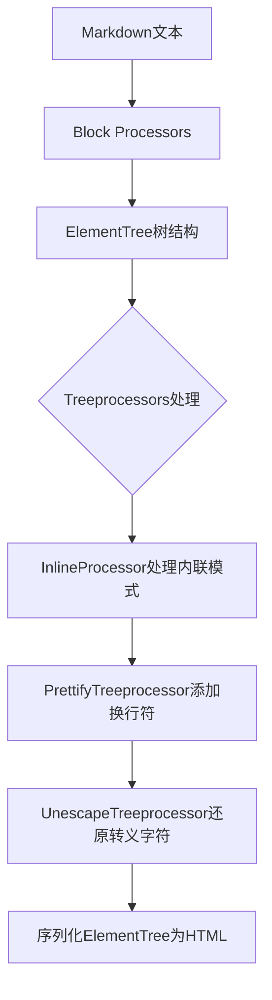
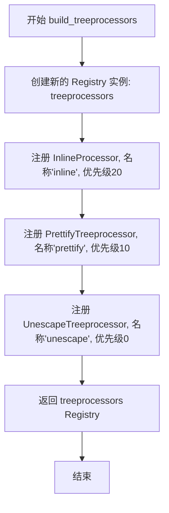
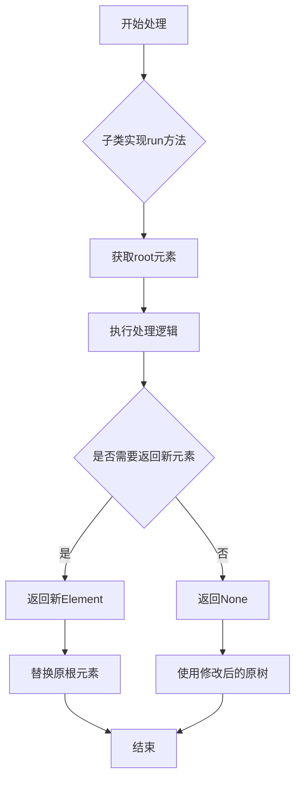
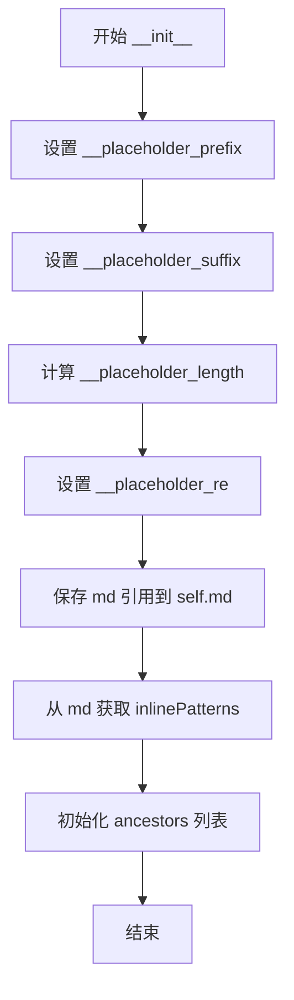
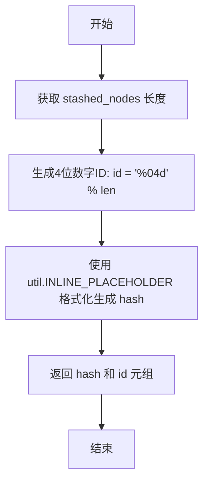
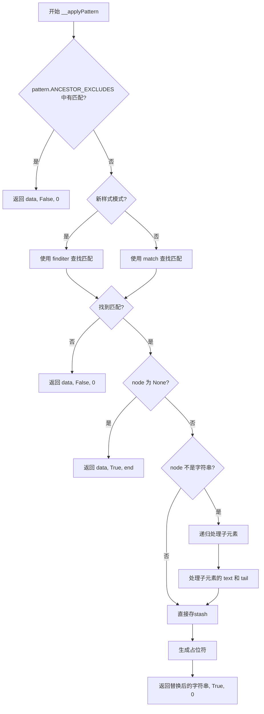
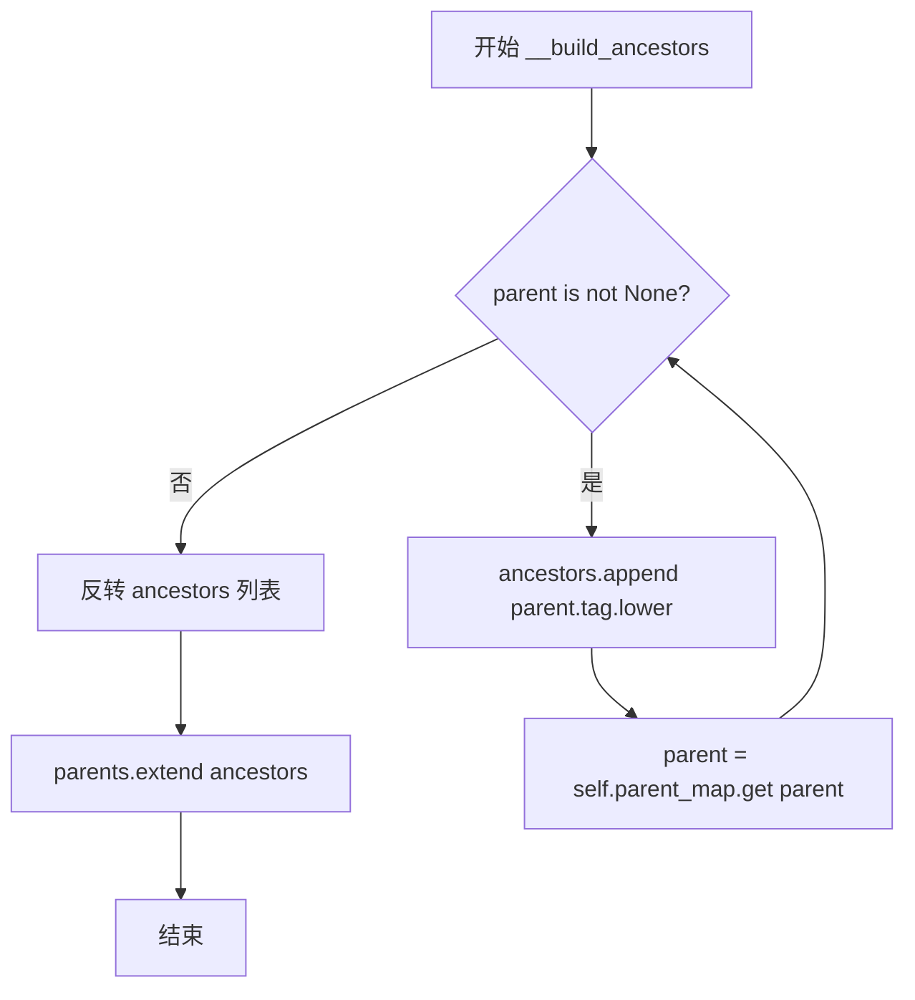
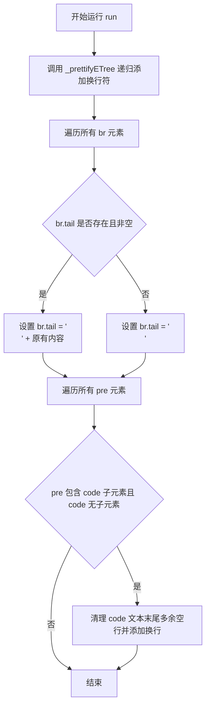
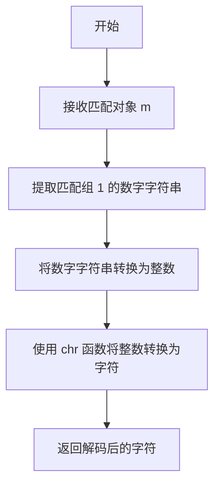
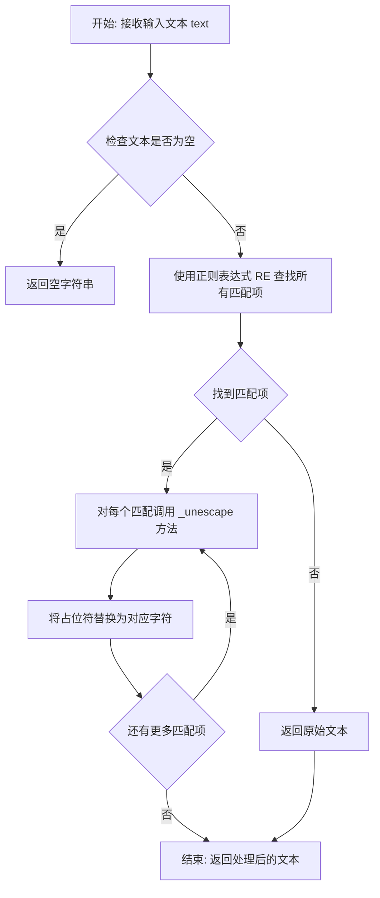

# `markdown\markdown\treeprocessors.py` 详细设计文档

该文件是Python Markdown库的树处理器模块，负责操作由块处理器创建的ElementTree对象，包括内联模式处理、HTML格式美化（添加换行符）以及转义字符的还原，是Markdown到HTML转换流程中的关键环节。

## 整体流程



## 类结构

```
util.Processor (抽象基类)
└── Treeprocessor
    ├── InlineProcessor
    ├── PrettifyTreeprocessor
    └── UnescapeTreeprocessor
```

## 全局变量及字段


### `build_treeprocessors`
    
构建并返回默认的treeprocessors注册表，包含inline、prettify和unescape处理器

类型：`function`
    


### `isString`
    
检查对象是否是字符串但不是AtomicString

类型：`function`
    


### `UnescapeTreeprocessor.RE`
    
用于匹配转义字符的正则表达式模式，格式为STX+数字+ETX

类型：`re.Pattern`
    


### `InlineProcessor._InlineProcessor__placeholder_prefix`
    
内联占位符前缀，从util模块获取，用于标记待处理的内联元素

类型：`str`
    


### `InlineProcessor._InlineProcessor__placeholder_suffix`
    
内联占位符后缀，从util模块获取（ETX字符），与前缀配合使用

类型：`str`
    


### `InlineProcessor._InlineProcessor__placeholder_length`
    
占位符的总长度计算值，用于确定唯一标识符的编号范围

类型：`int`
    


### `InlineProcessor._InlineProcessor__placeholder_re`
    
用于搜索和匹配内联占位符的正则表达式对象

类型：`re.Pattern`
    


### `InlineProcessor.md`
    
Markdown主对象的引用，用于访问配置和注册表

类型：`Markdown`
    


### `InlineProcessor.inlinePatterns`
    
内联模式的注册表，存储所有待应用的内联处理器模式

类型：`Registry`
    


### `InlineProcessor.ancestors`
    
当前处理节点的祖先元素标签列表，用于排除特定上下文

类型：`list[str]`
    


### `InlineProcessor.stashed_nodes`
    
临时存储已处理节点的字典，键为占位符ID，值为Element对象或字符串

类型：`dict[str, Element | str]`
    
    

## 全局函数及方法


### `build_treeprocessors`

该函数用于构建 Markdown 的默认树处理器（Tree Processors）注册表，通过实例化并注册 InlineProcessor、PrettifyTreeprocessor 和 UnescapeTreeprocessor 三个树处理器到 Registry 中，最终返回一个包含这些处理器的 Registry 对象供 Markdown 实例使用。

参数：

- `md`：`Markdown`，Markdown 实例对象，用于初始化各个树处理器
- `**kwargs`：`Any`，可选的额外关键字参数（当前函数体中未使用，但符合函数签名约定）

返回值：`util.Registry[Treeprocessor]`，返回包含已注册树处理器的 Registry 对象

#### 流程图



#### 带注释源码

```python
def build_treeprocessors(md: Markdown, **kwargs: Any) -> util.Registry[Treeprocessor]:
    """ Build the default  `treeprocessors` for Markdown. """
    # 创建一个新的 Registry 实例用于存储树处理器
    treeprocessors = util.Registry()
    
    # 注册 InlineProcessor 处理器，负责处理行内模式（inline patterns）
    # 优先级为 20，在 prettify 之前执行
    treeprocessors.register(InlineProcessor(md), 'inline', 20)
    
    # 注册 PrettifyTreeprocessor 处理器，负责美化 HTML 输出（添加换行）
    # 优先级为 10，在 inline 之后执行
    treeprocessors.register(PrettifyTreeprocessor(md), 'prettify', 10)
    
    # 注册 UnescapeTreeprocessor 处理器，负责还原转义字符
    # 优先级为 0，最后执行
    treeprocessors.register(UnescapeTreeprocessor(md), 'unescape', 0)
    
    # 返回包含所有默认树处理器的 Registry 对象
    return treeprocessors
```


### `isString`

该函数用于检查给定的对象是否为字符串，但排除 `AtomicString` 类型的特殊字符串对象。

参数：

- `s`：`object`，要检查的对象

返回值：`bool`，如果对象是字符串（但不是 `AtomicString`）则返回 `True`，否则返回 `False`

#### 流程图

```mermaid
flowchart TD
    A[开始] --> B{isinstance(s, util.AtomicString)}
    B -->|是| C[返回 False]
    B -->|否| D{isinstance(s, str)}
    D -->|是| E[返回 True]
    D -->|否| F[返回 False]
    C --> G[结束]
    E --> G
    F --> G
```

#### 带注释源码

```python
def isString(s: object) -> bool:
    """
    检查对象是否为字符串，但排除 AtomicString 类型。
    
    参数:
        s: 要检查的对象，可以是任意类型
        
    返回值:
        bool: 如果对象是普通字符串返回 True，如果是 AtomicString 或其他类型返回 False
    """
    # 先检查是否不是 AtomicString
    if not isinstance(s, util.AtomicString):
        # 如果不是 AtomicString，再检查是否是普通字符串
        return isinstance(s, str)
    # 如果是 AtomicString，返回 False
    return False
```


### `Treeprocessor.run`

这是 `Treeprocessor` 抽象基类中的 `run` 方法，定义了树处理器处理 Markdown 解析后 ElementTree 的标准接口。子类需实现此方法以对元素树进行修改、转换或增强，并返回处理后的元素或 None 表示直接修改原树。

参数：
- `root`：`etree.Element`，Markdown 解析后生成的 ElementTree 根元素

返回值：`etree.Element | None`，返回新的 Element 替换原有根元素，或返回 None 表示直接修改原树

#### 流程图



#### 带注释源码

```python
class Treeprocessor(util.Processor):
    """
    `Treeprocessor`s are run on the `ElementTree` object before serialization.

    Each `Treeprocessor` implements a `run` method that takes a pointer to an
    `Element` and modifies it as necessary.

    `Treeprocessors` must extend `markdown.Treeprocessor`.

    """
    
    def run(self, root: etree.Element) -> etree.Element | None:
        """
        Subclasses of `Treeprocessor` should implement a `run` method, which
        takes a root `Element`. This method can return another `Element`
        object, and the existing root `Element` will be replaced, or it can
        modify the current tree and return `None`.
        
        参数:
            root: ElementTree的根元素，Markdown解析后的结构化文档树
        返回:
            Element | None: 返回新元素替换原根，或返回None表示直接修改原树
        """
        pass  # pragma: no cover
```


### `InlineProcessor.__init__`

这是`InlineProcessor`类的构造函数，用于初始化内联处理器实例。在初始化过程中，设置占位符相关属性（用于替换内联元素），并引用Markdown对象的内联模式注册表，同时初始化祖先节点列表用于追踪元素的父级标签。

参数：

- `self`：隐式的实例参数，表示当前 InlineProcessor 对象
- `md`：`Markdown`类型，Markdown实例对象，用于访问其 `inlinePatterns`（内联模式注册表）等属性

返回值：`None`，构造函数不返回任何值

#### 流程图



#### 带注释源码

```python
def __init__(self, md: Markdown):
    """
    初始化 InlineProcessor 实例。

    Arguments:
        md: Markdown 实例，用于访问其 inlinePatterns 注册表。
    """
    # 设置内联占位符前缀，使用工具类中的常量
    self.__placeholder_prefix = util.INLINE_PLACEHOLDER_PREFIX
    
    # 设置内联占位符后缀，使用工具类中的 ETX 常量
    self.__placeholder_suffix = util.ETX
    
    # 计算占位符长度：固定长度4 + 前缀长度 + 后缀长度
    # 用于后续字符串处理和占位符识别
    self.__placeholder_length = 4 + len(self.__placeholder_prefix) \
                                  + len(self.__placeholder_suffix)
    
    # 编译后的占位符正则表达式，用于查找和提取占位符
    self.__placeholder_re = util.INLINE_PLACEHOLDER_RE
    
    # 保存 Markdown 实例的引用，以便后续访问其属性
    self.md = md
    
    # 从 Markdown 实例获取内联模式注册表
    # 这是一个 Registry 对象，包含所有注册的内联模式
    self.inlinePatterns = md.inlinePatterns
    
    # 初始化祖先节点列表，用于在处理过程中追踪当前元素的父级标签
    # 这对于某些需要知道父元素上下文的内联模式很重要
    self.ancestors: list[str] = []
```


### `InlineProcessor.__makePlaceholder`

生成一个内联元素的占位符，用于在处理 Markdown 文本时临时替换内联元素，以便后续处理。

参数：

- `self`：`InlineProcessor`，类的实例本身
- `type`：`str`，占位符类型标识（用于记录该占位符关联的内联元素类型）

返回值：`tuple[str, str]`，返回一个元组，包含占位符字符串（hash）和对应的唯一标识符（id）

#### 流程图



#### 带注释源码

```python
def __makePlaceholder(self, type: str) -> tuple[str, str]:
    """ Generate a placeholder """
    # 使用 stashed_nodes 当前长度作为 ID，确保每个占位符有唯一标识
    id = "%04d" % len(self.stashed_nodes)
    # 使用 INLINE_PLACEHOLDER 格式化模板生成占位符字符串
    # 格式类似于: \x02__XXXX\x03 其中 XXXX 是4位数字ID
    hash = util.INLINE_PLACEHOLDER % id
    # 返回占位符字符串和ID元组，供调用者使用
    return hash, id
```


### `InlineProcessor.__findPlaceholder`

该方法为 `InlineProcessor` 类的私有方法，用于在给定的数据字符串中从指定索引位置开始搜索 Markdown 内联处理的占位符，并通过正则表达式提取占位符的 ID 和搜索结束后的索引位置。

参数：

- `self`：`InlineProcessor`，InlineProcessor 类实例
- `data`：`str`，需要搜索的字符串数据
- `index`：`int`，搜索的起始索引位置

返回值：`tuple[str | None, int]`，包含占位符 ID（字符串或 None）和搜索结束后的索引位置

#### 流程图

```mermaid
flowchart TD
    A[开始 __findPlaceholder] --> B[使用正则表达式 __placeholder_re 在 data 中从 index 开始搜索]
    B --> C{找到匹配项?}
    C -->|是| D[返回匹配组1 作为占位符ID<br/>返回匹配结束位置 m.end()]
    C -->|否| E[返回 None 作为占位符ID<br/>返回 index + 1]
    D --> F[结束]
    E --> F
```

#### 带注释源码

```python
def __findPlaceholder(self, data: str, index: int) -> tuple[str | None, int]:
    """
    Extract id from data string, start from index.

    Arguments:
        data: String.
        index: Index, from which we start search.

    Returns:
        Placeholder id and string index, after the found placeholder.

    """
    # 使用预编译的正则表达式 __placeholder_re 在 data 字符串中从 index 位置开始搜索
    # __placeholder_re 用于匹配内联占位符格式，格式类似于 STX + ID + ETX
    m = self.__placeholder_re.search(data, index)
    
    # 如果找到匹配项
    if m:
        # m.group(1) 提取第一个捕获组，即占位符的 ID 部分
        # m.end() 返回匹配项结束后的索引位置
        return m.group(1), m.end()
    else:
        # 如果未找到匹配项，返回 None 作为占位符 ID
        # 并将索引向前移动一位（index + 1），避免死循环
        return None, index + 1
```


### `InlineProcessor.__stashNode`

将给定的元素节点或字符串节点存储到内部暂存区（stash）中，并生成一个唯一的占位符字符串用于在后续处理中替代原始节点。

参数：

- `node`：`etree.Element | str`，需要暂存的节点，可以是 XML 元素或字符串
- `type`：`str`，节点的类型标识，用于生成占位符

返回值：`str`，返回生成的占位符字符串，用于在原位置替换该节点

#### 流程图

```mermaid
flowchart TD
    A[开始 __stashNode] --> B[调用 __makePlaceholder 生成占位符]
    B --> C[生成占位符 hash 和 id]
    C --> D[将 node 存储到 self.stashed_nodes[id] 字典中]
    D --> E[返回 placeholder 字符串]
    E --> F[结束]
```

#### 带注释源码

```python
def __stashNode(self, node: etree.Element | str, type: str) -> str:
    """
    将节点暂存到内部存储中，并返回对应的占位符。
    
    该方法是 InlineProcessor 的私有方法，用于在处理内联模式时，
    将复杂的元素（如链接、图片等）替换为临时占位符，以避免在后续
    处理过程中被错误地重复处理。
    
    Arguments:
        node: etree.Element | str - 要暂存的节点，可以是元素或字符串
        type: str - 节点类型标识，用于生成唯一的占位符
    
    Returns:
        str - 生成的占位符字符串，可在后续处理中替代原节点
    """
    # 调用内部方法生成占位符
    # __makePlaceholder 方法会根据 type 和当前 stashed_nodes 的数量
    # 生成一个唯一的占位符字符串和对应的 ID
    placeholder, id = self.__makePlaceholder(type)
    
    # 将原始节点存储到 stashed_nodes 字典中
    # key 是生成的唯一 ID，value 是原始的 Element 或字符串
    # 这样可以在后续需要时通过 ID 检索到原始节点
    self.stashed_nodes[id] = node
    
    # 返回生成的占位符字符串
    # 该占位符会在原位置替代原始节点，完成处理后可再还原
    return placeholder
```


### `InlineProcessor.__handleInline`

该方法是InlineProcessor类的私有方法，用于处理Markdown文本中的内联模式（inline patterns）。它遍历指定的内联模式列表，对输入的Markdown文本进行模式匹配和转换，将匹配到的内联元素（如链接、粗体、斜体等）替换为占位符，并返回处理后的文本。

参数：

- `self`：`InlineProcessor`，InlineProcessor 类实例
- `data`：`str`，要处理的 Markdown 文本行
- `patternIndex`：`int`，可选参数，默认为 0，表示从第几个内联模式开始处理

返回值：`str`，包含占位符的字符串，原始的内联元素已被替换为占位符

#### 流程图

```mermaid
flowchart TD
    A[开始 __handleInline] --> B{data 是否为 AtomicString?}
    B -->|是| C[直接返回 data]
    B -->|否| D[初始化 startIndex = 0]
    D --> E[count = len(self.inlinePatterns)]
    E --> F{patternIndex < count?}
    F -->|否| M[返回处理后的 data]
    F -->|是| G[调用 __applyPattern 应用当前模式]
    G --> H{是否匹配成功?}
    H -->|是| I[保持当前 patternIndex]
    H -->|否| J[patternIndex += 1]
    I --> F
    J --> F
```

#### 带注释源码

```python
def __handleInline(self, data: str, patternIndex: int = 0) -> str:
    """
    Process string with inline patterns and replace it with placeholders.

    Arguments:
        data: A line of Markdown text.
        patternIndex: The index of the `inlinePattern` to start with.

    Returns:
        String with placeholders.

    """
    # 如果 data 不是 AtomicString，则进行处理
    # AtomicString 是不会被处理的字符串（如代码块中的内容）
    if not isinstance(data, util.AtomicString):
        # 初始化搜索起始索引
        startIndex = 0
        # 获取内联模式的总数量
        count = len(self.inlinePatterns)
        
        # 遍历从 patternIndex 开始的所有内联模式
        while patternIndex < count:
            # 应用当前索引的内联模式
            # 返回: (处理后的data, 是否匹配, 新的起始索引)
            data, matched, startIndex = self.__applyPattern(
                self.inlinePatterns[patternIndex],  # 要应用的内联模式
                data,                                # 待处理的文本
                patternIndex,                        # 当前模式索引
                startIndex                           # 搜索起始位置
            )
            
            # 如果当前模式没有匹配到任何内容，则尝试下一个模式
            if not matched:
                patternIndex += 1
    
    # 返回处理后的文本（包含占位符）
    return data
```


### `InlineProcessor.__processElementText`

该方法用于处理从 `self.stashed_nodes` 中弹出的元素的 `Element.text` 或 `Element.tail` 中的占位符，将占位符替换为实际元素并插入到 DOM 树中。

参数：

- `self`：`InlineProcessor` 实例，隐式参数
- `node`：`etree.Element`，父节点，用于插入处理后的子元素
- `subnode`：`etree.Element`，当前正在处理的节点，包含待处理的占位符文本
- `isText`：`bool`，布尔标志，True 表示处理 `Element.text`，False 表示处理 `Element.tail`

返回值：`None`，无返回值（方法直接修改传入的 DOM 树）

#### 流程图

```mermaid
flowchart TD
    A[开始 __processElementText] --> B{isText?}
    B -->|True| C[获取 subnode.text]
    B -->|False| D[获取 subnode.tail]
    C --> E[设置 subnode.text = None]
    D --> F[设置 subnode.tail = None]
    E --> G[调用 __processPlaceholders 处理文本]
    F --> G
    G --> H[获取处理结果 childResult]
    H --> I{isText is False and node is not subnode?}
    I -->|True| J[计算插入位置: pos = index of subnode + 1]
    I -->|False| K[设置 pos = 0]
    J --> L[反转 childResult 列表]
    K --> L
    L --> M{遍历 newChild in childResult}
    M -->|Yes| N[node.insertpos, newChild[0]]
    N --> M
    M -->|No| O[结束]
```

#### 带注释源码

```python
def __processElementText(self, node: etree.Element, subnode: etree.Element, isText: bool = True) -> None:
    """
    Process placeholders in `Element.text` or `Element.tail`
    of Elements popped from `self.stashed_nodes`.

    Arguments:
        node: Parent node.
        subnode: Processing node.
        isText: Boolean variable, True - it's text, False - it's a tail.

    """
    # 判断是处理文本还是尾部内容
    if isText:
        # 获取元素的文本内容
        text = subnode.text
        # 置空原始文本，防止重复处理
        subnode.text = None
    else:
        # 获取元素的尾部内容
        text = subnode.tail
        # 置空原始尾部，防止重复处理
        subnode.tail = None

    # 调用内部方法处理占位符，将占位符转换为实际的 Element 元素
    # 返回结果为列表，每个元素为 (Element, ancestors) 的元组
    childResult = self.__processPlaceholders(text, subnode, isText)

    # 确定插入位置
    # 如果处理的是 tail 且 node 与 subnode 不同，需要在 subnode 之后插入
    if not isText and node is not subnode:
        # 获取 subnode 在父节点中的位置，加1表示插入到其后
        pos = list(node).index(subnode) + 1
    else:
        # 否则插入到开头位置
        pos = 0

    # 反转列表以保证正确的插入顺序
    childResult.reverse()
    # 遍历处理结果，依次插入到父节点中
    for newChild in childResult:
        # newChild[0] 是处理后的 Element 节点
        node.insert(pos, newChild[0])
```


### `InlineProcessor.__processPlaceholders`

该方法处理包含占位符的字符串，并生成应用了内联模式的 `ElementTree` 元素列表。它遍历数据字符串，查找占位符，从 `stash` 中检索相应的节点或文本，并将其重新构建为元素树结构。

参数：

- `self`：隐式参数，`InlineProcessor` 实例本身
- `data`：`str | None`，包含 `ElementTree` 元素占位符的字符串
- `parent`：`etree.Element`，包含待处理内联数据的父元素
- `isText`：`bool`，布尔变量，`True` 表示处理文本（text），`False` 表示处理尾随文本（tail）

返回值：`list[tuple[etree.Element, list[str]]]`，包含应用了内联模式的 `ElementTree` 元素列表，每个元素与祖先标签列表组成的元组

#### 流程图

```mermaid
flowchart TD
    A[开始 __processPlaceholders] --> B[定义内部函数 linkText]
    B --> C[初始化 result = [], startIndex = 0]
    C --> D{data 是否为空?}
    D -->|否| E[从 startIndex 开始查找占位符前缀]
    E --> F{找到占位符?}
    F -->|是| G[提取 id 和 phEndIndex]
    G --> H{id 在 stashed_nodes 中?}
    H -->|是| I[获取 node]
    H -->|否| J[处理错误占位符]
    I --> K{index > 0?}
    K -->|是| L[提取占位符前的文本并链接]
    K -->|否| M{node 是 Element?}
    M -->|是| N[遍历处理子元素的 tail 和 text]
    M -->|否| O[链接文本节点]
    N --> P[startIndex = phEndIndex]
    O --> P
    J --> Q[链接错误占位符文本]
    Q --> P
    P --> R[将 (node, ancestors[:]) 添加到 result]
    R --> D
    F -->|否| S[提取剩余文本]
    S --> T{data 是 AtomicString?}
    T -->|是| U[将文本包装为 AtomicString]
    T -->|否| V[链接文本]
    U --> V
    V --> W[data = '']
    W --> D
    D -->|是| X[返回 result]
```

#### 带注释源码

```python
def __processPlaceholders(
    self,
    data: str | None,
    parent: etree.Element,
    isText: bool = True
) -> list[tuple[etree.Element, list[str]]]:
    """
    处理包含占位符的字符串并生成 ElementTree 树。

    参数:
        data: 包含 ElementTree 元素占位符的字符串。
        parent: 包含待处理内联数据的元素。
        isText: 布尔变量，True 表示处理文本，False 表示处理尾随文本。

    返回:
        包含应用了内联模式的 ElementTree 元素列表。
    """
    # 定义内部函数，用于将文本链接到结果树中的适当位置
    def linkText(text: str | None) -> None:
        if text:
            if result:
                # 如果结果中已有元素，将文本添加到最后一个元素的 tail
                if result[-1][0].tail:
                    result[-1][0].tail += text
                else:
                    result[-1][0].tail = text
            elif not isText:
                # 如果没有结果且不是处理文本，将文本添加到父元素的 tail
                if parent.tail:
                    parent.tail += text
                else:
                    parent.tail = text
            else:
                # 否则，将文本添加到父元素的 text
                if parent.text:
                    parent.text += text
                else:
                    parent.text = text
    
    # 初始化结果列表和起始索引
    result = []
    strartIndex = 0
    
    # 主循环：处理数据字符串中的所有占位符
    while data:
        # 查找占位符前缀的位置
        index = data.find(self.__placeholder_prefix, strartIndex)
        if index != -1:
            # 找到占位符，提取 id 和占位符结束位置
            id, phEndIndex = self.__findPlaceholder(data, index)

            # 检查 id 是否在存储的节点中
            if id in self.stashed_nodes:
                node = self.stashed_nodes.get(id)

                # 如果在占位符前有文本，先链接该文本
                if index > 0:
                    text = data[strartIndex:index]
                    linkText(text)

                # 如果节点是 Element（不是字符串）
                if not isinstance(node, str):
                    # 遍历节点及其所有子元素
                    for child in [node] + list(node):
                        # 处理子元素的 tail
                        if child.tail:
                            if child.tail.strip():
                                self.__processElementText(node, child, False)
                        # 处理子元素的 text
                        if child.text:
                            if child.text.strip():
                                self.__processElementText(child, child)
                else:
                    # 节点只是字符串，直接链接
                    linkText(node)
                    strartIndex = phEndIndex
                    continue

                # 更新起始索引并将节点添加到结果
                strartIndex = phEndIndex
                result.append((node, self.ancestors[:]))

            else:
                # 错误的占位符，将其作为普通文本处理
                end = index + len(self.__placeholder_prefix)
                linkText(data[strartIndex:end])
                strartIndex = end
        else:
            # 没有找到更多占位符，处理剩余文本
            text = data[strartIndex:]
            if isinstance(data, util.AtomicString):
                # 保留 AtomicString 不被处理
                text = util.AtomicString(text)
            linkText(text)
            data = ""  # 结束循环

    return result
```


### `InlineProcessor.__applyPattern`

该方法检查文本是否符合给定的内联模式，如果匹配则创建相应的元素并将其添加到 `stashed_nodes` 中，返回包含占位符的字符串。

参数：

- `self`：隐式参数，InlineProcessor 实例本身
- `pattern`：`inlinepatterns.Pattern`，要检查的内联模式
- `data`：`str`，要处理的文本
- `patternIndex`：`int`，当前模式的索引
- `startIndex`：`int`，从哪个字符串索引开始搜索（默认为 0）

返回值：`tuple[str, bool, int]`，包含处理后的字符串、是否匹配的布尔值、结束索引

#### 流程图



#### 带注释源码

```python
def __applyPattern(
    self,
    pattern: inlinepatterns.Pattern,
    data: str,
    patternIndex: int,
    startIndex: int = 0
) -> tuple[str, bool, int]:
    """
    Check if the line fits the pattern, create the necessary
    elements, add it to `stashed_nodes`.

    Arguments:
        data: The text to be processed.
        pattern: The pattern to be checked.
        patternIndex: Index of current pattern.
        startIndex: String index, from which we start searching.

    Returns:
        String with placeholders instead of `ElementTree` elements.

    """
    # 判断是否为新样式（InlineProcessor）模式
    new_style = isinstance(pattern, inlinepatterns.InlineProcessor)

    # 检查模式是否在排除列表中（例如不能在某些父元素内使用）
    for exclude in pattern.ANCESTOR_EXCLUDES:
        if exclude.lower() in self.ancestors:
            return data, False, 0

    if new_style:
        match = None
        # Since `handleMatch` may reject our first match,
        # we iterate over the buffer looking for matches
        # until we can't find any more.
        # 遍历查找所有匹配项，直到找到有效的匹配
        for match in pattern.getCompiledRegExp().finditer(data, startIndex):
            node, start, end = pattern.handleMatch(match, data)
            if start is None or end is None:
                startIndex += match.end(0)
                match = None
                continue
            break
    else:  # pragma: no cover
        # 旧样式模式处理
        match = pattern.getCompiledRegExp().match(data[startIndex:])
        leftData = data[:startIndex]

    # 如果没有匹配，返回原始数据
    if not match:
        return data, False, 0

    if not new_style:  # pragma: no cover
        # 处理旧样式模式的匹配结果
        node = pattern.handleMatch(match)
        start = match.start(0)
        end = match.end(0)

    # 如果 node 为 None，表示该匹配被拒绝/忽略
    if node is None:
        return data, True, end

    # 如果返回的不是字符串（即 Element 对象），需要递归处理其子元素
    if not isinstance(node, str):
        if not isinstance(node.text, util.AtomicString):
            # We need to process current node too
            # 递归处理子元素的 text 和 tail
            for child in [node] + list(node):
                if not isString(node):
                    if child.text:
                        # 添加当前标签到祖先列表
                        self.ancestors.append(child.tag.lower())
                        # 递归处理文本内容，使用更高优先级的模式
                        child.text = self.__handleInline(
                            child.text, patternIndex + 1
                        )
                        # 处理完后移除
                        self.ancestors.pop()
                    if child.tail:
                        # 处理尾部文本
                        child.tail = self.__handleInline(
                            child.tail, patternIndex
                        )

    # 将节点存入 stash 并获取占位符
    placeholder = self.__stashNode(node, pattern.type())

    # 返回替换了占位符的字符串
    if new_style:
        return "{}{}{}".format(data[:start],
                               placeholder, data[end:]), True, 0
    else:  # pragma: no cover
        return "{}{}{}{}".format(leftData,
                                 match.group(1),
                                 placeholder, match.groups()[-1]), True, 0
```


### `InlineProcessor.__build_ancestors`

该方法用于构建从根节点到当前父节点的祖先元素标签列表。它通过 `parent_map` 字典向上遍历 DOM 树，收集所有祖先元素的标签名（转换为小写），然后将结果添加到传入的 `parents` 列表中。

参数：

- `self`：隐式参数，`InlineProcessor` 的实例
- `parent`：`etree.Element | None`，起始的父元素节点
- `parents`：`list[str]`：要追加祖先标签列表的目标列表

返回值：`None`，无返回值（该方法直接修改 `parents` 列表）

#### 流程图



#### 带注释源码

```python
def __build_ancestors(self, parent: etree.Element | None, parents: list[str]) -> None:
    """Build the ancestor list."""
    # 初始化本地祖先列表
    ancestors = []
    
    # 从当前 parent 开始向上遍历到根节点
    while parent is not None:
        # 确认 parent 不为 None（冗余检查）
        if parent is not None:
            # 将父元素的标签名转为小写并添加到列表
            ancestors.append(parent.tag.lower())
        # 通过 parent_map 获取上一级父元素
        parent = self.parent_map.get(parent)
    
    # 此时 ancestors 是从当前节点向上到根节点的顺序
    # 需要反转，使列表变为从根节点到当前节点的顺序
    ancestors.reverse()
    
    # 将构建好的祖先列表扩展到传入的 parents 列表中
    parents.extend(ancestors)
```


### `InlineProcessor.run`

应用内联模式到已解析的 Markdown 树。该方法遍历 Element 树，查找具有内联标签的元素，应用内联模式并将新创建的 Elements 追加到树中。为避免进一步处理带有内联模式的字符串，可使用 AtomicString。

参数：

- `tree`：`etree.Element`，表示 Markdown 树的 Element 对象
- `ancestors`：`list[str] | None`，树节点前面的父标签名称列表（可选，默认为 None）

返回值：`etree.Element`，应用了内联模式的元素树对象

#### 流程图

```mermaid
flowchart TD
    A[开始: run tree, ancestors] --> B[初始化 stashed_nodes 字典]
    B --> C{ancestors 是否为 None?}
    C -->|是| D[创建空列表 tree_parents]
    C -->|否| E[复制 ancestors 列表]
    D --> F[构建 parent_map: 子元素 -> 父元素]
    E --> F
    F --> G[初始化栈: [(tree, tree_parents)]]
    G --> H{栈是否为空?}
    H -->|否| I[弹出 currElement 和 parents]
    I --> J[设置 self.ancestors = parents]
    J --> K[调用 __build_ancestors 构建祖先列表]
    K --> L[初始化 insertQueue]
    L --> M[遍历 currElement 的子元素]
    M --> N{子元素有 text 且不是 AtomicString?}
    N -->|是| O[追加 child.tag 到 ancestors]
    O --> P[保存 text 并置空 child.text]
    P --> Q[调用 __handleInline 处理 text]
    Q --> R[调用 __processPlaceholders 处理结果]
    R --> S[更新 parent_map 并加入栈和 insertQueue]
    S --> T[弹出 ancestors 最后一项]
    N -->|否| T
    T --> U{子元素有 tail?}
    U -->|是| V[处理 tail 内联内容]
    V --> W[处理结果并插入到 currElement]
    U -->|否| X
    X --> Y{子元素有子节点?}
    Y -->|是| Z[更新 parent_map 并将子元素加入栈]
    Y -->|否| M
    Z --> M
    M --> AA[处理 insertQueue 中的元素]
    AA --> H
    H -->|是| BB[返回 tree]
    BB --> END[结束]
```

#### 带注释源码

```python
def run(self, tree: etree.Element, ancestors: list[str] | None = None) -> etree.Element:
    """Apply inline patterns to a parsed Markdown tree.

    Iterate over `Element`, find elements with inline tag, apply inline
    patterns and append newly created Elements to tree.  To avoid further
    processing of string with inline patterns, instead of normal string,
    use subclass [`AtomicString`][markdown.util.AtomicString]:

        node.text = markdown.util.AtomicString("This will not be processed.")

    Arguments:
        tree: `Element` object, representing Markdown tree.
        ancestors: List of parent tag names that precede the tree node (if needed).

    Returns:
        An element tree object with applied inline patterns.

    """
    # 初始化存储节点的字典，用于存放被替换的内联元素
    self.stashed_nodes: dict[str, etree.Element | str] = {}

    # 确保有效的父列表，但复制传入的列表
    # 以确保用户不会意外修改它
    # 如果 ancestors 为 None，创建空列表；否则复制列表
    tree_parents = [] if ancestors is None else ancestors[:]

    # 构建父元素映射：每个子元素映射到其父元素
    # 用于快速查找元素的父元素
    self.parent_map = {c: p for p in tree.iter() for c in p}
    
    # 初始化栈，用于深度优先遍历
    # 栈中存储 (当前元素, 父元素列表) 元组
    stack = [(tree, tree_parents)]

    # 使用栈遍历树
    while stack:
        # 弹出当前元素和其父元素列表
        currElement, parents = stack.pop(0)

        # 设置当前元素的祖先列表
        self.ancestors = parents
        # 构建当前元素的完整祖先路径
        self.__build_ancestors(currElement, self.ancestors)

        # 初始化插入队列，用于批量插入处理后的元素
        insertQueue = []
        
        # 遍历当前元素的所有子元素
        for child in currElement:
            # 处理子元素的 text 属性
            # 如果 text 存在且不是 AtomicString，则进行处理
            if child.text and not isinstance(
                child.text, util.AtomicString
            ):
                # 将当前子元素的标签添加到祖先列表
                self.ancestors.append(child.tag.lower())
                # 保存原始 text 并置空，为后续处理做准备
                text = child.text
                child.text = None
                # 先处理内联模式，将文本转换为占位符
                lst = self.__processPlaceholders(
                    self.__handleInline(text), child
                )
                # 更新父子元素映射
                for item in lst:
                    self.parent_map[item[0]] = child
                # 将处理结果加入栈和插入队列
                stack += lst
                insertQueue.append((child, lst))
                # 处理完后移除刚才添加的标签
                self.ancestors.pop()
            
            # 处理子元素的 tail 属性（尾随文本）
            if child.tail:
                # 处理 tail 中的内联内容
                tail = self.__handleInline(child.tail)
                # 创建临时元素用于处理
                dumby = etree.Element('d')
                child.tail = None
                # 处理 tail 中的占位符
                tailResult = self.__processPlaceholders(tail, dumby, False)
                # 如果有处理结果，将其设置回 child.tail
                if dumby.tail:
                    child.tail = dumby.tail
                # 计算插入位置
                pos = list(currElement).index(child) + 1
                # 反转结果并插入到当前元素中
                tailResult.reverse()
                for newChild in tailResult:
                    self.parent_map[newChild[0]] = currElement
                    currElement.insert(pos, newChild[0])
            
            # 如果子元素还有子节点，将其加入栈继续处理
            if len(child):
                self.parent_map[child] = currElement
                stack.append((child, self.ancestors[:]))

    # 处理插入队列，将处理后的元素插入到正确位置
    for element, lst in insertQueue:
        for i, obj in enumerate(lst):
            newChild = obj[0]
            element.insert(i, newChild)
    
    # 返回处理后的树
    return tree
```


### `PrettifyTreeprocessor._prettifyETree`

该方法递归地为 `ElementTree` 元素的子节点添加换行符，以美化生成的 HTML 文档格式。它会判断元素是否为块级元素，并根据文本内容和子元素情况适当添加换行符。

参数：

- `self`：`PrettifyTreeprocessor`，PrettifyTreeprocessor 实例本身
- `elem`：`etree.Element`，需要处理的 ElementTree 元素节点

返回值：`None`，无返回值（直接修改传入的 ElementTree 元素）

#### 流程图

```mermaid
flowchart TD
    A[开始 _prettifyETree] --> B{elem 是块级元素<br/>且标签不是 code/pre?}
    B -->|否| I[直接跳到 I]
    B -->|是| C{elem.text 为空或空白<br/>且存在子元素<br/>且第一个子元素是块级?}
    C -->|是| D[设置 elem.text = '\n']
    C -->|否| E[跳过设置 text]
    D --> F{遍历 elem 的每个子元素 e}
    F --> G{e 是块级元素?}
    G -->|是| H[递归调用 _prettifyETree(e)]
    G -->|否| F
    H --> F
    F --> I{elem.tail 为空或空白?}
    I -->|是| J[设置 elem.tail = '\n']
    I -->|否| K[保持原 tail 不变]
    J --> L[结束]
    K --> L
    E --> F
```

#### 带注释源码

```python
def _prettifyETree(self, elem: etree.Element) -> None:
    """ Recursively add line breaks to `ElementTree` children. """

    # 定义换行符常量，用于美化 HTML 输出格式
    i = "\n"
    
    # 判断当前元素是否为块级标签，并且不是 code 或 pre 标签
    # code 和 pre 标签需要保持原始格式，不添加额外换行
    if self.md.is_block_level(elem.tag) and elem.tag not in ['code', 'pre']:
        
        # 检查是否需要为元素添加文本节点换行
        # 条件：没有文本或文本仅为空白 AND 有子元素 AND 第一个子元素是块级
        # 例如：<div><p>...</p></div> 这种结构需要在前添加换行
        if (not elem.text or not elem.text.strip()) \
                and len(elem) and self.md.is_block_level(elem[0].tag):
            elem.text = i  # 设置文本为换行符
        
        # 递归处理所有子元素，只对块级子元素进行处理
        for e in elem:
            if self.md.is_block_level(e.tag):
                self._prettifyETree(e)  # 递归调用美化子元素
    
    # 处理元素的 tail 属性（元素之后的文本内容）
    # 如果 tail 为空或仅包含空白字符，则添加换行符
    # 这样可以保证块级元素之间有适当的间距
    if not elem.tail or not elem.tail.strip():
        elem.tail = i
```


### `PrettifyTreeprocessor.run`

为 HTML 文档添加换行符以美化输出的方法。该方法递归地遍历 ElementTree，为块级元素添加必要的换行符，并单独处理 `<br />` 标签和代码块中的额外空行。

参数：

- `self`：`PrettifyTreeprocessor` 实例本身
- `root`：`etree.Element`，需要美化的 ElementTree 根元素

返回值：`None`，此方法直接修改传入的 ElementTree，不返回新对象

#### 流程图



#### 带注释源码

```python
def run(self, root: etree.Element) -> None:
    """ Add line breaks to `Element` object and its children. """

    # 步骤1: 递归遍历 ElementTree，为块级元素添加换行符
    # _prettifyETree 方法会:
    # - 为块级元素（code和pre除外）的文本前添加换行符
    # - 为每个元素的尾部（tail）添加换行符
    # - 递归处理子元素
    self._prettifyETree(root)

    # 步骤2: 单独处理 <br /> 标签
    # <br /> 标签通常出现在行内内容的中间，_prettifyETree 可能会遗漏它们
    # 遍历所有 <br /> 标签，确保每个标签后都有换行符
    brs = root.iter('br')
    for br in brs:
        if not br.tail or not br.tail.strip():
            # 如果 br 标签没有 tail 或 tail 为空，直接设置 tail 为换行符
            br.tail = '\n'
        else:
            # 如果 tail 已存在内容，在前面插入换行符
            br.tail = '\n%s' % br.tail

    # 步骤3: 清理代码块末尾的多余空行
    # 遍历所有 <pre> 元素
    pres = root.iter('pre')
    for pre in pres:
        # 检查 pre 是否有子元素且第一个子元素是 code
        if len(pre) and pre[0].tag == 'code':
            code = pre[0]
            # Only prettify code containing text only
            # 只处理仅包含文本的 code 元素（没有子元素）
            if not len(code) and code.text is not None:
                # 移除文本末尾的空白字符，然后添加一个换行符
                # 使用 AtomicString 防止进一步处理
                code.text = util.AtomicString(code.text.rstrip() + '\n')
```


### `UnescapeTreeprocessor._unescape`

这是一个用于恢复转义字符的内部方法，它将存储为数字形式的转义字符（如 STX + 数字 + ETX）转换回原始字符。

参数：

- `m`：`re.Match[str]`，正则表达式匹配对象，包含要处理的转义字符信息（数字形式的字符码）

返回值：`str`，返回转换后的原始字符

#### 流程图



#### 带注释源码

```python
def _unescape(self, m: re.Match[str]) -> str:
    """
    将数字形式的转义字符转换回原始字符。

    参数:
        m: 正则表达式匹配对象，包含数字形式的字符码

    返回值:
        转换后的原始字符
    """
    # m.group(1) 获取正则表达式中 (\d+) 匹配的数字部分
    # int() 将数字字符串转换为整数
    # chr() 将整数转换为对应的字符
    return chr(int(m.group(1)))
```


### `UnescapeTreeprocessor.unescape`

该方法用于将 Markdown 树中经过转义的特殊字符恢复为原始字符。通过正则表达式匹配形如 `{STX}数字{ETX}` 的占位符，并将其转换为对应的 ASCII 字符。

参数：

- `self`：`UnescapeTreeprocessor`，当前实例
- `text`：`str`，需要处理的文本字符串

返回值：`str`，完成转义字符恢复后的文本字符串

#### 流程图



#### 带注释源码

```python
def unescape(self, text: str) -> str:
    """
    将转义字符恢复为原始字符。
    
    参数:
        text: 包含转义占位符的字符串，格式为 {STX}数字{ETX}
    
    返回:
        将占位符替换为对应 ASCII 字符后的字符串
    """
    # 使用类属性 RE (预编译的正则表达式) 替换所有匹配项
    # RE 匹配格式: {STX}数字{ETX}
    # _unescape 方法会将数字转换为对应的 ASCII 字符
    return self.RE.sub(self._unescape, text)
```


### `UnescapeTreeprocessor.run`

该函数是 `UnescapeTreeprocessor` 类的主方法，用于遍历 Markdown 解析后的 HTML 元素树，将所有被转义的字符还原为原始字符（包括元素文本、尾部和属性值），但跳过 `<code>` 标签内的内容。

参数：

- `self`：`UnescapeTreeprocessor`，`UnescapeTreeprocessor` 类实例本身
- `root`：`etree.Element`，Markdown 解析后生成的 ElementTree 根元素

返回值：`None`，该方法直接修改传入的 ElementTree 对象，不返回任何值

#### 流程图

```mermaid
flowchart TD
    A[开始: 传入 root 元素] --> B[遍历 root 中的所有元素: root.iter()]
    B --> C{当前元素是否存在}
    C -->|是| D{检查 elem.text 且 elem.tag != 'code'}
    C -->|否| H{检查 elem.tail}
    D -->|是| E[调用 unescape 替换 elem.text]
    D -->|否| G{检查 elem.tail}
    E --> G
    G -->|是| I[调用 unescape 替换 elem.tail]
    G -->|否| J{遍历 elem 的属性}
    I --> J
    J -->|有属性| K[对每个属性值调用 unescape 替换]
    J -->|无属性| L[继续下一个元素]
    K --> L
    L --> B
    B --> M[所有元素遍历完毕]
    M --> N[结束]
```

#### 带注释源码

```python
def run(self, root: etree.Element) -> None:
    """
    Loop over all elements and unescape all text.
    
    该方法遍历传入的 ElementTree 中的所有元素，
    将元素文本、尾部和属性中由 util.STX 和 util.ETX 包裹的
    数字序列转换回对应的字符（通过 chr 函数）。
    跳过 <code> 标签内的文本内容以保留代码原样。
    
    参数:
        root: etree.Element，Markdown 解析后的 ElementTree 根元素
    
    返回:
        None，直接修改传入的 ElementTree 对象
    """
    
    # 使用 ElementTree 的 iter 方法遍历所有元素（包括根元素）
    for elem in root.iter():
        
        # 1. 处理元素的 text 属性（元素开始标签后的第一段文本）
        # 但跳过 <code> 标签，因为代码内容不应被转义还原
        if elem.text and not elem.tag == 'code':
            elem.text = self.unescape(elem.text)
        
        # 2. 处理元素的 tail 属性（元素结束标签后的文本）
        if elem.tail:
            elem.tail = self.unescape(elem.tail)
        
        # 3. 处理元素的属性值（如 href, src 等）
        for key, value in elem.items():
            elem.set(key, self.unescape(value))
```

## 关键组件


### Treeprocessor 基类

树处理器基类，定义了处理 ElementTree 的接口规范，所有具体树处理器都继承此类，实现了在 ElementTree 序列化前对其进行操作的能力。

### InlineProcessor

核心内联模式处理器，负责遍历 Markdown 解析生成的 ElementTree，应用各种内联模式（如加粗、斜体、链接等），通过占位符机制和节点暂存技术处理嵌套的内联元素。

### PrettifyTreeprocessor

HTML 格式化处理器，递归遍历 ElementTree 为块级元素添加换行符，使生成的 HTML 文档具有可读性，特别处理了代码块和 br 标签的尾随换行。

### UnescapeTreeprocessor

字符转义恢复处理器，使用正则表达式匹配特殊标记的转义字符（STX/ETX 包裹的数字），将其还原为实际的 Unicode 字符。

### 占位符机制（Placeholder System）

InlineProcessor 内部使用占位符替换技术，将已匹配的内联元素替换为特殊格式的占位符字符串（格式：STX + 4位数字 + ETX），避免在后续处理中被重复匹配，支持嵌套和复杂场景。

### 节点暂存（Stashed Nodes）

InlineProcessor 维护一个字典存储被替换的节点（stashed_nodes），通过占位符 ID 关联，支持后续恢复和重新插入处理后的 ElementTree 节点。

### 祖先链构建（Ancestors Tracking）

InlineProcessor 在处理内联元素时维护祖先元素标签列表（ancestors），用于排除规则判断，确保某些内联模式不在特定上下文中生效（如链接文本中不再处理链接）。


## 问题及建议


### 已知问题

-   **变量名拼写错误**：`__processPlaceholders` 方法中的 `strartIndex` 应该是 `startIndex`，`__processElementText` 方法中的 `dumby` 应该是 `dummy`，这些拼写错误会影响代码可读性和可维护性。
-   **性能问题**：`InlineProcessor.run` 方法中使用 `stack.pop(0)` 对列表进行头部操作，时间复杂度为 O(n)，在大文档场景下性能较差，应使用 `collections.deque` 替代。
-   **魔法数字和硬编码**：`__placeholder_length` 的计算 `4 + len(self.__placeholder_prefix) + len(self.__placeholder_suffix)` 缺少注释说明，4 这个数字的含义不明确。
-   **未使用的全局函数**：`isString` 函数在模块中被定义但未被使用，造成代码冗余。
-   **重复代码逻辑**：`InlineProcessor.__processElementText` 方法中处理 `text` 和 `tail` 的逻辑高度相似，可以抽象为通用方法。
-   **类型注解不完整**：`Treeprocessor.run` 方法返回 `etree.Element | None`，但基类实现直接返回 `None`，子类 `InlineProcessor.run` 实际只返回 `etree.Element`，类型定义存在不一致。
-   **嵌套函数性能损耗**：`__processPlaceholders` 方法中定义了嵌套函数 `linkText`，每次调用都会重新创建函数对象，可提取为类方法或模块级函数。
-   **parent_map 重复构建**：在 `run` 方法的每次循环中都通过字典推导式重新构建 `parent_map`，未进行缓存或优化。
-   **字符串格式化方式陈旧**：多处使用 `.format()` 方法而非 f-string，代码风格不够现代统一。

### 优化建议

-   **修正拼写错误**：将 `strartIndex` 改为 `startIndex`，`dumby` 改为 `dummy`。
-   **使用 deque 优化队列操作**：将 `stack = [(tree, tree_parents)]` 改为使用 `collections.deque`，并使用 `popleft()` 代替 `pop(0)`。
-   **移除未使用的函数**：删除 `isString` 函数或将其移至专门的工具模块。
-   **提取公共逻辑**：将 `__processElementText` 中的文本处理逻辑抽象为通用方法，减少代码重复。
-   **添加类型注解和文档**：为关键变量和方法补充完整的类型注解和文档注释，特别是魔法数字需要说明其含义。
-   **优化 parent_map 构建**：考虑将 `parent_map` 的构建移到循环外部，或使用更高效的数据结构。
-   **统一字符串格式化**：将 `.format()` 替换为 f-string，提升代码可读性。
-   **提取嵌套函数**：将 `linkText` 函数从 `__processPlaceholders` 中提取出来，作为类方法或独立函数。

## 其它


### 设计目标与约束

本模块的设计目标是操作 Markdown 解析后生成的 ElementTree 对象，实现内联模式的处理、美化输出以及转义字符的还原。主要约束包括：必须继承自 Treeprocessor 基类、实现 run 方法；处理过程中需要维护父元素映射关系以支持树结构的正确遍历；需要处理 AtomicString 以避免重复处理内联内容。

### 错误处理与异常设计

代码中主要依赖 Python 内置异常机制。当占位符 ID 不存在于 stashed_nodes 时，会将该占位符作为普通文本处理而非抛出异常。ElementTree 操作可能引发 XML 解析错误，但调用方负责捕获。若传入的 data 参数类型不符合预期（如非字符串且非 AtomicString），inlinePatterns 的迭代处理会直接返回原始数据而不报错。

### 数据流与状态机

InlineProcessor 的数据流如下：接收 ElementTree 根节点 → 遍历树节点 → 对每个非 AtomicString 的文本节点调用 __handleInline 处理内联模式 → 使用占位符替换内联元素 → 将替换后的元素存入 stashed_nodes → 最后通过 __processPlaceholders 还原占位符为实际 Element 对象。状态机主要维护 stashed_nodes 字典、parent_map 映射表以及 ancestors 列表来跟踪处理上下文。

### 外部依赖与接口契约

主要依赖包括：markdown.util 模块提供 INLINE_PLACEHOLDER_PREFIX、INLINE_PLACEHOLDER、ETX、AtomicString 等工具；markdown.inlinepatterns 模块提供 Pattern 和 InlineProcessor 类；xml.etree.ElementTree 提供 ElementTree 操作能力。Treeprocessor 类必须实现 run(root: etree.Element) -> etree.Element | None 方法。

### 性能考虑与优化空间

代码中存在可优化的性能瓶颈：__applyPattern 方法中每次模式匹配失败都会创建新的正则表达式迭代器；parent_map 在每次 run 调用时重新构建，可考虑缓存；insertQueue 和 stack 的频繁列表操作可使用 deque 替代列表以提升性能。stashed_nodes 字典在每次 run 调用时重新初始化，若能复用可减少内存分配。

### 安全考量

内联模式处理涉及用户输入的 Markdown 文本，需要注意：占位符替换机制可防止注入攻击；ElementTree 的文本设置需确保不包含恶意 XML 字符；属性值的 unescape 处理需验证转义序列的有效性，防止畸形输入导致解析异常。

### 配置与扩展点

主要扩展点包括：可通过注册新的 Treeprocessor 到 Registry 来扩展处理流程；InlineProcessor 支持通过 inlinePatterns 添加新的内联模式；PrettifyTreeprocessor 的 is_block_level 方法可被重写以自定义块级元素判断逻辑。build_treeprocessors 函数提供了构建默认处理器注册表的入口。

### 并发与线程安全性

该模块本身不维护实例级状态（除了 InlineProcessor 的 stashed_nodes 等），但 Markdown 对象的 inlinePatterns 和 md 引用需要在多线程环境下谨慎使用。建议每个线程创建独立的 Markdown 实例以避免竞争条件。

### 版本兼容性

代码使用 TYPE_CHECKING 导入以支持类型检查；采用 from __future__ import annotations 实现 PEP 563 延迟注解求值；支持的 Python 版本取决于主 markdown 包的兼容性要求（通常为 Python 3.7+）。

### 调试与日志支持

当前代码未包含日志记录功能。stashed_nodes 和 parent_map 的内部状态可考虑添加调试接口以便排查内联处理问题。占位符的前缀和后缀可通过 util 模块的配置进行调整。

### 内存管理

stashed_nodes 字典存储所有替换下的节点引用，需确保在大文档处理时不会导致内存膨胀。parent_map 字典在处理完成后应被垃圾回收。AtomicString 的使用可避免重复处理导致的额外内存分配。

### 边界条件处理

代码对多种边界情况进行了处理：空文本节点会被跳过；嵌套元素的 tail 属性会单独处理；code 和 pre 标签的内容会被排除在美化处理之外；AtomicString 会保留而不进行进一步的内联模式匹配。


    