# `markdown\markdown\util.py` 详细设计文档

Python Markdown库的基础设施模块，提供HTML占位符管理、扩展注册机制、辅助工具函数和基础处理器类，用于支持Markdown文档到HTML的转换过程。

## 整体流程

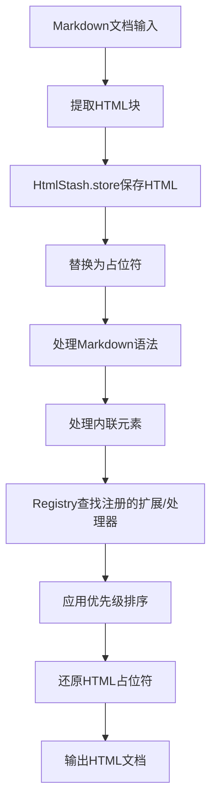

## 类结构

```
Processor (处理器基类)
├── HtmlStash (HTML存储类)
│   ├── store() - 存储HTML片段
│   ├── reset() - 重置存储
│   ├── get_placeholder() - 获取占位符
│   └── store_tag() - 存储标签数据
└── Registry<T> (泛型注册表)
    ├── register() - 注册项
    ├── deregister() - 注销项
    ├── __contains__() - 包含检查
    ├── __getitem__() - 获取项
    ├── __iter__() - 迭代器
    └── _sort() - 按优先级排序
```

## 全局变量及字段


### `BLOCK_LEVEL_ELEMENTS`
    
HTML块级元素列表，用于标识哪些HTML标签属于块级元素

类型：`list[str]`
    


### `STX`
    
文本起始标记占位符，用于替换文本的起始位置

类型：`str`
    


### `ETX`
    
文本结束标记占位符，用于替换文本的结束位置

类型：`str`
    


### `INLINE_PLACEHOLDER_PREFIX`
    
内联占位符前缀，用于生成内联文本占位符

类型：`str`
    


### `INLINE_PLACEHOLDER`
    
内联占位符模板，用于存储内联文本片段

类型：`str`
    


### `INLINE_PLACEHOLDER_RE`
    
内联占位符正则表达式，用于匹配和提取内联占位符

类型：`re.Pattern`
    


### `AMP_SUBSTITUTE`
    
HTML实体替换模板，用于替换&符号为占位符

类型：`str`
    


### `HTML_PLACEHOLDER`
    
HTML占位符模板，用于存储原始HTML片段

类型：`str`
    


### `HTML_PLACEHOLDER_RE`
    
HTML占位符正则表达式，用于匹配和提取HTML占位符

类型：`re.Pattern`
    


### `TAG_PLACEHOLDER`
    
标签占位符模板，用于存储HTML标签

类型：`str`
    


### `RTL_BIDI_RANGES`
    
RTL双向文本范围，用于处理从右到左书写方向的文本

类型：`tuple`
    


### `Processor.md`
    
Markdown实例引用，用于访问Markdown对象的属性和方法

类型：`Markdown | None`
    


### `TagData.tag`
    
HTML标签名，存储标签的名称

类型：`str`
    


### `TagData.attrs`
    
HTML属性字典，存储标签的所有属性键值对

类型：`dict[str, str]`
    


### `TagData.left_index`
    
左侧索引，表示标签在原始文本中的起始位置

类型：`int`
    


### `TagData.right_index`
    
右侧索引，表示标签在原始文本中的结束位置

类型：`int`
    


### `HtmlStash.html_counter`
    
HTML片段计数器，用于生成唯一的占位符索引

类型：`int`
    


### `HtmlStash.rawHtmlBlocks`
    
原始HTML块列表，用于暂存提取的原始HTML内容

类型：`list[str | etree.Element]`
    


### `HtmlStash.tag_counter`
    
标签计数器，用于生成标签占位符的唯一标识

类型：`int`
    


### `HtmlStash.tag_data`
    
标签数据列表，按顺序存储所有提取的标签信息

类型：`list[TagData]`
    


### `_PriorityItem.name`
    
项目名称，用于标识注册项的唯一名称

类型：`str`
    


### `_PriorityItem.priority`
    
优先级数值，用于决定注册项的排序顺序

类型：`float`
    


### `Registry._data`
    
存储注册项的数据字典，以名称为键存储所有注册对象

类型：`dict[str, _T]`
    


### `Registry._priority`
    
优先级排序列表，维护注册项的名称和优先级对应关系

类型：`list[_PriorityItem]`
    


### `Registry._is_sorted`
    
排序状态标志，标记优先级列表是否已排序

类型：`bool`
    
    

## 全局函数及方法


### `get_installed_extensions`

该函数用于获取Python环境中所有已安装的Markdown扩展插件，通过Python的entry_points机制实现，支持Python 3.10+及更低版本的兼容性处理，并使用LRU缓存避免重复加载。

参数： 无

返回值：`types.SimpleNamespace`，返回`markdown.extensions`组中的所有入口点（EntryPoints）

#### 流程图

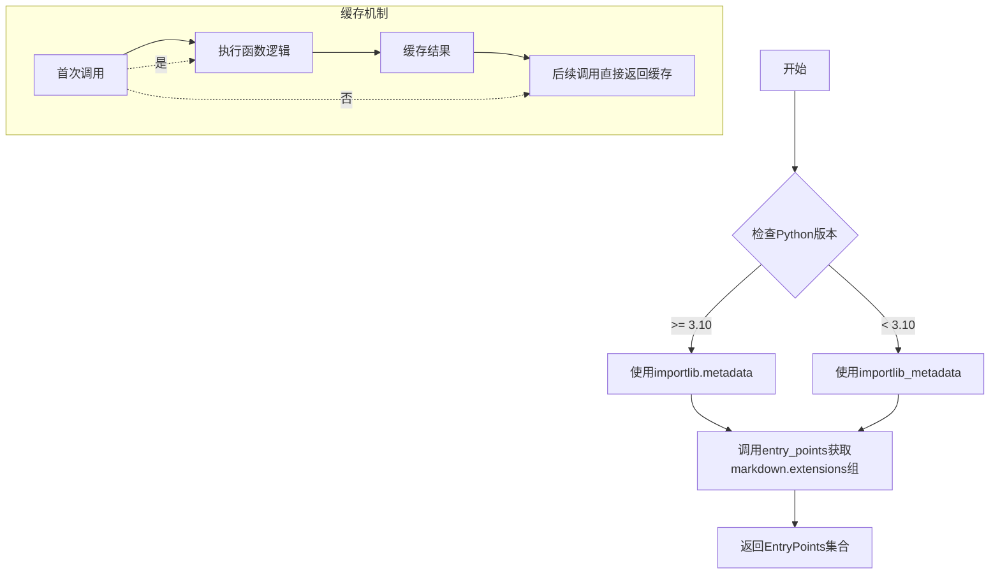

#### 带注释源码

```python
@lru_cache(maxsize=None)
def get_installed_extensions():
    """
    Return all entry_points in the `markdown.extensions` group.
    
    该函数使用@lru_cache装饰器缓存结果，确保多次调用时
    不会重复加载entry_points，提高性能。
    """
    # 检查Python版本，根据版本选择合适的metadata库
    if sys.version_info >= (3, 10):
        # Python 3.10+内置importlib.metadata
        from importlib import metadata
    else:  # `<PY310` use backport
        # Python 3.9及以下使用backport库
        import importlib_metadata as metadata
    
    # Only load extension entry_points once.
    # 使用entry_points的group参数过滤出markdown扩展
    return metadata.entry_points(group='markdown.extensions')
```


### `deprecated`

该装饰器用于标记函数或方法已弃用。当调用被装饰的函数时，会发出 `DeprecationWarning` 警告，提示用户该功能将在未来版本中移除。

参数：

- `message`：`str`，弃用警告的具体信息，说明为什么弃用以及建议使用什么替代方案
- `stacklevel`：`int`，警告堆栈深度，用于控制警告信息中显示的调用者位置，默认为 2

返回值：`Callable`，返回一个装饰器函数，该函数包装原始函数并在调用时发出弃用警告

#### 流程图

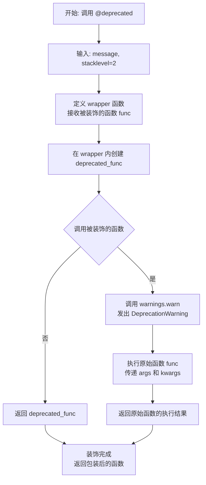

#### 带注释源码

```python
def deprecated(message: str, stacklevel: int = 2):
    """
    Raise a [`DeprecationWarning`][] when wrapped function/method is called.

    Usage:

    ```python
    @deprecated("This method will be removed in version X; use Y instead.")
    def some_method():
        pass
    ```
    """
    # 定义外层装饰器函数，接收 message 和 stacklevel 参数
    def wrapper(func):
        # 使用 functools.wraps 保持原函数的元信息（名称、文档等）
        @wraps(func)
        def deprecated_func(*args, **kwargs):
            # 发出弃用警告，stacklevel 控制警告堆栈显示的深度
            warnings.warn(
                f"'{func.__name__}' is deprecated. {message}",  # 格式化警告消息
                category=DeprecationWarning,  # 警告类别为弃用警告
                stacklevel=stacklevel  # 堆栈深度，默认值为 2
            )
            # 调用原始函数并返回其结果
            return func(*args, **kwargs)
        # 返回包装后的函数
        return deprecated_func
    # 返回装饰器
    return wrapper
```


### parseBoolValue

该函数是一个全局辅助函数，用于将字符串解析为布尔值。支持解析多种常见布尔值表示形式（如"true"、"yes"、"y"、"on"、"1"等），同时提供错误处理和None值保留的选项。

参数：

- `value`：`str | None`，要解析的字符串值，可以是布尔值字符串、None或其他类型
- `fail_on_errors`：`bool = True`，解析失败时是否抛出ValueError异常，默认为True
- `preserve_none`：`bool = False`，是否保留None值，默认为False

返回值：`bool | None`，成功解析返回True或False，若解析失败且fail_on_errors=False则返回None，若preserve_none=True则可能返回None

#### 流程图

```mermaid
flowchart TD
    A[开始 parseBoolValue] --> B{value 是字符串类型?}
    B -->|否| C{preserve_none 为 True 且 value 为 None?}
    C -->|是| D[返回 None]
    C -->|否| E[将 value 转换为 bool 并返回]
    B -->|是| F{preserve_none 为 True 且 value.lower 为 'none'?}
    F -->|是| G[返回 None]
    F -->|否| H{value.lower 在 ['true', 'yes', 'y', 'on', '1']?}
    H -->|是| I[返回 True]
    H -->|否| J{value.lower 在 ['false', 'no', 'n', 'off', '0', 'none']?}
    J -->|是| K[返回 False]
    J -->|否| L{fail_on_errors 为 True?}
    L -->|是| M[抛出 ValueError 异常]
    L -->|否| N[返回 None]
```

#### 带注释源码

```python
def parseBoolValue(value: str | None, fail_on_errors: bool = True, preserve_none: bool = False) -> bool | None:
    """Parses a string representing a boolean value. If parsing was successful,
       returns `True` or `False`. If `preserve_none=True`, returns `True`, `False`,
       or `None`. If parsing was not successful, raises `ValueError`, or, if
       `fail_on_errors=False`, returns `None`."""
    # 检查输入值是否为字符串类型
    if not isinstance(value, str):
        # 如果不是字符串且启用None保留且值为None，返回None
        if preserve_none and value is None:
            return value
        # 否则将非字符串值转换为布尔值（0/None等转为False，非零/非空转为True）
        return bool(value)
    # 如果是字符串且启用None保留且值为'none'（不区分大小写），返回None
    elif preserve_none and value.lower() == 'none':
        return None
    # 检查字符串是否匹配表示True的值
    elif value.lower() in ('true', 'yes', 'y', 'on', '1'):
        return True
    # 检查字符串是否匹配表示False的值
    elif value.lower() in ('false', 'no', 'n', 'off', '0', 'none'):
        return False
    # 解析失败，根据fail_on_errors决定行为
    elif fail_on_errors:
        raise ValueError('Cannot parse bool value: %r' % value)
```


### `code_escape`

该函数用于将代码字符串中的特殊HTML字符（`&`、`<`、`>`）转换为对应的HTML实体，以防止在生成的HTML文档中产生意外的标签或实体解析问题。

参数：

- `text`：`str`，需要转义的代码字符串

返回值：`str`，HTML转义后的字符串

#### 流程图

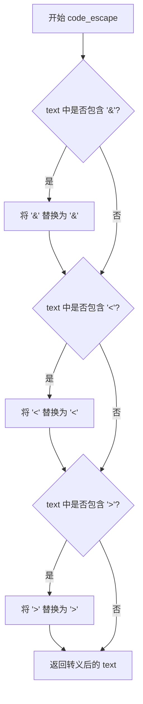

#### 带注释源码

```python
def code_escape(text: str) -> str:
    """HTML escape a string of code."""
    # 检查字符串中是否包含 & 符号，如果包含则替换为 &amp;
    if "&" in text:
        text = text.replace("&", "&amp;")
    # 检查字符串中是否包含 < 符号，如果包含则替换为 &lt;
    if "<" in text:
        text = text.replace("<", "&lt;")
    # 检查字符串中是否包含 > 符号，如果包含则替换为 &gt;
    if ">" in text:
        text = text.replace(">", "&gt;")
    # 返回转义后的字符串
    return text
```


### `_get_stack_depth`

获取当前调用栈的深度，通过高效的方式遍历栈帧直到栈顶。

参数：

- `size`：`int`，起始栈深度，默认为 2，用于指定从哪个帧开始计数

返回值：`int`，当前栈的深度，即从指定位置到栈顶的帧数

#### 流程图

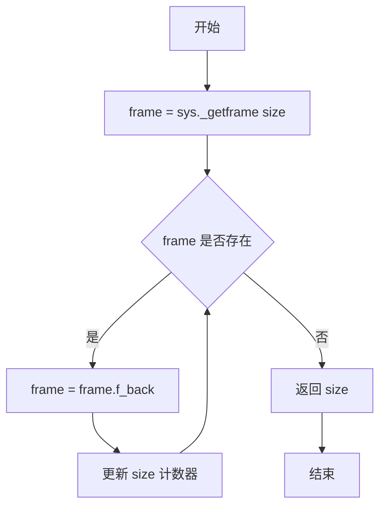

#### 带注释源码

```python
def _get_stack_depth(size: int = 2) -> int:
    """Get current stack depth, performantly.
    
    该函数通过系统帧对象高效地获取当前调用栈的深度。
    使用 sys._getframe() 直接访问底层栈帧，避免了其他方法带来的性能开销。
    
    Args:
        size: 起始栈深度，默认为 2。表示从调用该函数的位置向上追溯的起始偏移量。
              例如：size=2 表示从 get_stack_depth 的调用者开始计数。
    
    Returns:
        int: 当前栈的深度，即从指定起始位置到栈顶的帧数。
    """
    # 首先获取指定深度的栈帧对象
    # sys._getframe(size) 返回指定深度的帧对象
    frame = sys._getframe(size)

    # 使用 itertools.count 创建一个无限计数器
    # 从传入的 size 开始，每次迭代递增 1
    for size in count(size):
        # 获取当前帧的上一级调用者帧
        frame = frame.f_back
        
        # 如果 frame 为 None，说明已经到达栈顶（最外层调用）
        if not frame:
            # 返回当前计数，即为栈的深度
            return size
```


### `nearing_recursion_limit`

该函数用于检测当前Python调用栈深度是否接近系统设定的递归限制，通过比较最大递归限制与当前栈深度的差值来判断是否在安全阈值（100）范围内，常用于防止在递归处理过程中触发RecursionError异常。

参数：无

返回值：`bool`，如果当前栈深度与最大递归限制的差值小于100（即接近限制），返回`True`，否则返回`False`

#### 流程图

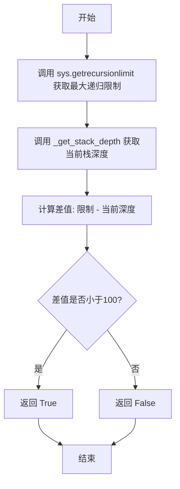

#### 带注释源码

```python
def nearing_recursion_limit() -> bool:
    """
    判断当前调用栈深度是否接近递归限制。
    
    该函数通过获取系统的最大递归限制，并计算与当前实际栈深度的差值，
    来判断是否即将达到递归上限。在差值小于100时返回True，
    提示调用者可能需要采取措施防止栈溢出。
    
    Returns:
        bool: 如果当前栈深度距离最大递归限制少于100层，返回True；
              否则返回False。
    """
    # 获取Python解释器配置的最大递归深度限制
    recursion_limit = sys.getrecursionlimit()
    
    # 获取当前调用栈的实际深度（从当前函数开始向上追溯）
    current_depth = _get_stack_depth()
    
    # 计算剩余可用栈空间
    remaining = recursion_limit - current_depth
    
    # 如果剩余空间小于100，认为接近递归限制
    return remaining < 100
```

---

**补充说明：**

该函数依赖于同模块内的私有函数 `_get_stack_depth()`，其签名和功能如下：

- **函数名**: `_get_stack_depth`
- **参数**: `size: int`（默认为2，表示从调用者的调用者开始计数）
- **返回类型**: `int`
- **功能**: 高效获取当前栈的深度，通过迭代访问 `frame.f_back` 直至栈顶

**技术债务与优化空间**：

1. **硬编码阈值**：100这个阈值是硬编码的，对于某些深度递归场景可能不够灵活，可考虑将其提取为可配置参数
2. **性能开销**：虽然 `_get_stack_depth` 已经优化过，但频繁调用仍有一定开销，在递归密集型操作中需谨慎使用
3. **平台差异**：`sys.getrecursionlimit()` 的默认值在不同Python实现和平台上可能不同，阈值100的合理性未经验证


# AtomicString 类详细设计文档

## 1. 概述

AtomicString 是一个继承自 Python 内置 `str` 类的简单包装类，用于表示"不应被进一步处理"的字符串。在 Markdown 解析器中，该类用于标记那些需要保留原始形式、不进行转换或处理的文本内容。

## 2. 类继承关系

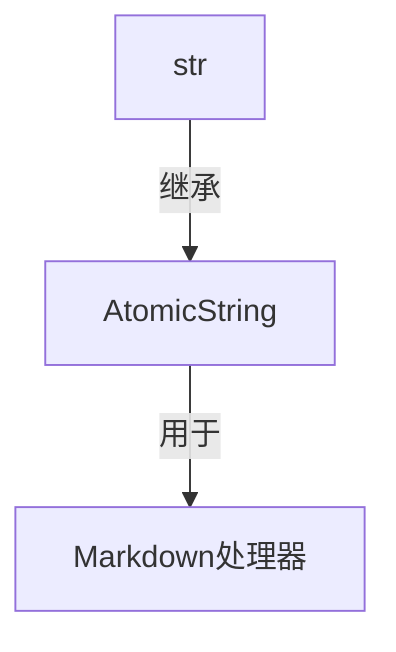

## 3. 继承自 str 的关键方法

由于 `AtomicString` 继承自 `str`，它自动获得了 `str` 类的所有方法。以下是 `str` 类最常用的方法说明：

### 3.1 `str.capitalize()`

#### 描述
将字符串的第一个字符转换为大写字母，其余字符转换为小写字母。

参数：无

返回值：`str`，首字母大写的新字符串

#### 流程图

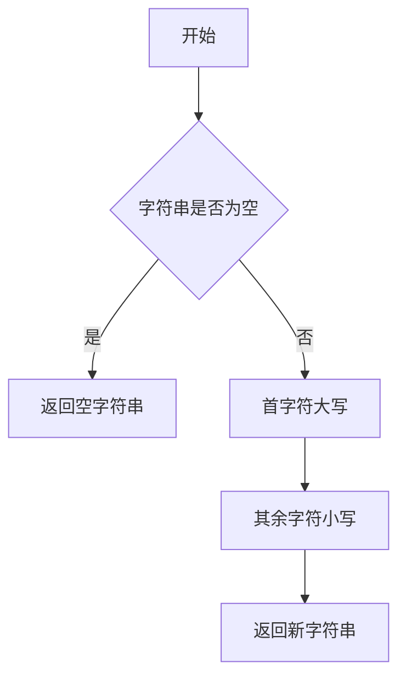

#### 带注释源码

```python
# 继承自 str 的方法示例
# AtomicString 继承自 str，因此自动拥有此方法
# 示例: "hello world".capitalize() -> "Hello world"
# 注意：此方法不会改变 AtomicString 实例本身，因为 str 是不可变的
```

---

### 3.2 `str.split(sep=None, maxsplit=-1)`

#### 描述
根据分隔符拆分字符串，返回由子字符串组成的列表。

参数：
- `sep`：分隔符，默认为空白字符
- `maxsplit`：最大分割次数，-1 表示不限制

返回值：`list[str]`，子字符串列表

#### 流程图

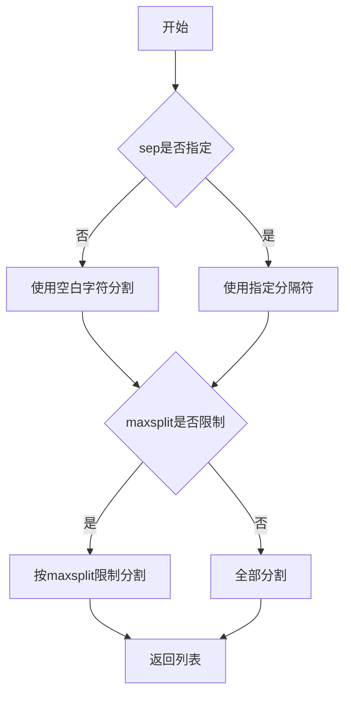

---

### 3.3 `str.replace(old, new, count=-1)`

#### 描述
替换字符串中的子串。

参数：
- `old`：要替换的子串
- `new`：替换后的新子串
- `count`：替换次数，-1 表示全部替换

返回值：`str`，替换后的新字符串

#### 流程图

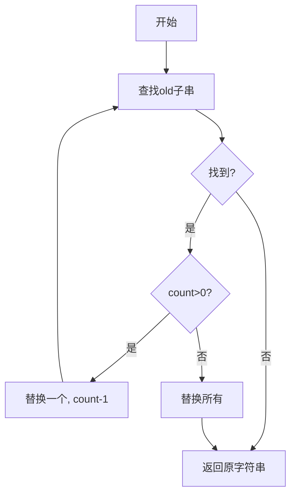

---

### 3.4 `str.strip([chars])`

#### 描述
移除字符串两端指定字符（默认为空白字符）。

参数：
- `chars`：要移除的字符集，默认为空白字符

返回值：`str`，移除字符后的新字符串

---

### 3.5 `str.startswith(prefix[, start[, end]])`

#### 描述
检查字符串是否以指定前缀开头。

参数：
- `prefix`：要检查的前缀
- `start`：检查起始位置
- `end`：检查结束位置

返回值：`bool`，如果字符串以指定前缀开头则返回 True

---

### 3.6 `str.endswith(suffix[, start[, end]])`

#### 描述
检查字符串是否以指定后缀结尾。

参数：
- `suffix`：要检查的后缀
- `start`：检查起始位置
- `end`：检查结束位置

返回值：`bool`，如果字符串以指定后缀结尾则返回 True

---

### 3.7 `str.find(sub[, start[, end]])`

#### 描述
查找子串首次出现的位置。

参数：
- `sub`：要查找的子串
- `start`：查找起始位置
- `end`：查找结束位置

返回值：`int`，子串首次出现的索引，未找到则返回 -1

---

### 3.8 `str.join(iterable)`

#### 描述
将可迭代对象中的元素用字符串连接。

参数：
- `iterable`：可迭代对象

返回值：`str`，连接后的新字符串

---

### 3.9 `str.upper()`

#### 描述
将字符串所有字符转换为大写。

参数：无

返回值：`str`，全部大写的新字符串

---

### 3.10 `str.lower()`

#### 描述
将字符串所有字符转换为小写。

参数：无

返回值：`str`，全部小写的新字符串

---

## 4. AtomicString 的使用场景

在 Python-Markdown 中，AtomicString 的主要用途是：

1. **标记原始文本**：当解析器遇到不应被 Markdown 语法处理的文本时，将其包装为 AtomicString
2. **防止二次处理**：确保某些内容（如代码块中的文本）不会被递归处理
3. **占位符机制**：在文档处理过程中保留原始 HTML 或特殊内容

## 5. 关键组件信息

| 组件名称 | 描述 |
|---------|------|
| `AtomicString` | 继承自 str 的简单类，用于标记不应被 Markdown 进一步处理的字符串 |
| `str` 基类 | Python 内置的不可变字符串类型，提供所有字符串操作方法 |

## 6. 技术债务与优化空间

1. **缺少自定义方法**：AtomicString 目前只有简单的类定义，没有添加任何自定义功能
2. **文档不完整**：类定义只有简单的 docstring，没有详细说明使用场景
3. **无验证逻辑**：没有添加对字符串内容的验证或处理逻辑

## 7. 设计约束

- **不可变性**：由于继承自 str，AtomicString 实例也是不可变的
- **向后兼容**：必须保持与 str 所有方法的兼容性
- **语义明确**：使用 AtomicString 应能明确表达"此字符串不应被处理"的语义


### `Processor.__init__`

该方法是 `Processor` 类的构造函数，用于初始化处理器实例并关联 Markdown 实例。

参数：

-  `md`：`Markdown | None`，该处理器所属的 `Markdown` 实例，默认为 `None`

返回值：`None`，构造函数不返回任何值

#### 流程图

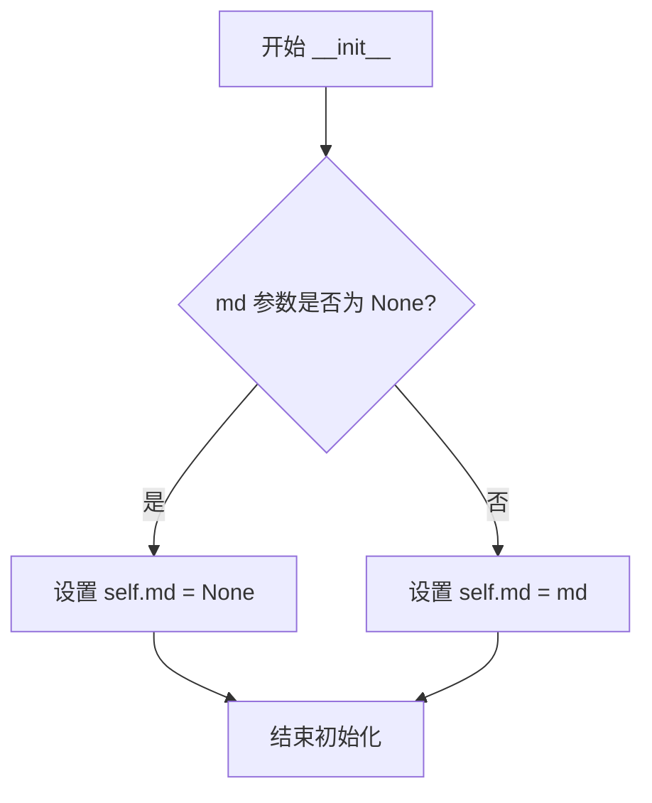

#### 带注释源码

```python
class Processor:
    """ The base class for all processors.

    Attributes:
        Processor.md: The `Markdown` instance passed in an initialization.

    Arguments:
        md: The `Markdown` instance this processor is a part of.

    """
    def __init__(self, md: Markdown | None = None):
        """
        初始化 Processor 实例。

        参数:
            md: 可选的 Markdown 实例，用于关联到当前处理器。
                如果未提供，则默认为 None。

        返回值:
            无返回值（构造函数）。
        """
        self.md = md  # 将传入的 Markdown 实例存储为实例属性
```


# 分析结果

根据代码分析，`TagData` 是继承自 `TypedDict` 的类型定义，用于类型提示而非实际类实现。`TypedDict` 本质上是用于声明字典结构的类型提示，不包含传统意义上的方法。

在代码中，`TagData` 被用于 `HtmlStash` 类的 `tag_data` 字段，其结构定义如下：

```python
if TYPE_CHECKING:  # pragma: no cover
    class TagData(TypedDict):
        tag: str
        attrs: dict[str, str]
        left_index: int
        right_index: int
```

由于 `TypedDict` 是类型提示工具，不包含可执行的方法，因此没有符合要求的"继承自TypedDict的方法"可以提取。

但是，`TagData` 类型在 `HtmlStash` 类中被实际使用。以下是使用 `TagData` 的相关方法信息：

### HtmlStash.store_tag

存储标签数据并返回占位符。

参数：

- `tag`：`str`，HTML 标签名称
- `attrs`：`dict[str, str]`，HTML 属性字典
- `left_index`：`int`，左索引位置
- `right_index`：`int`，右索引位置

返回值：`str`，返回一个占位符字符串

#### 流程图

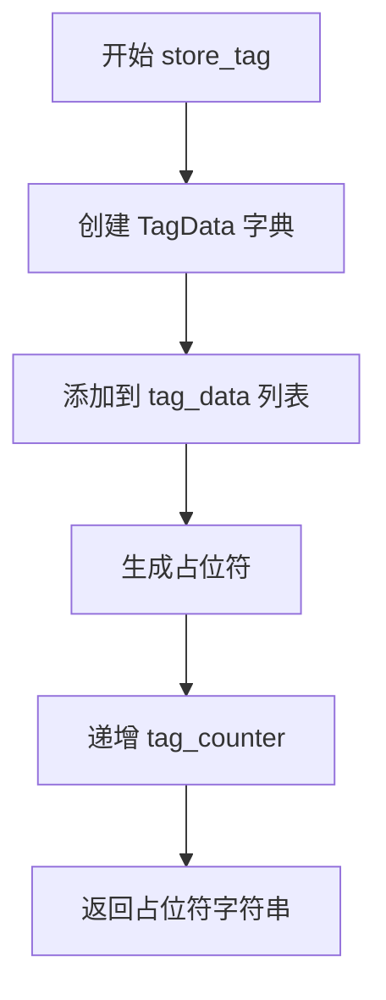

#### 带注释源码

```python
def store_tag(self, tag: str, attrs: dict[str, str], left_index: int, right_index: int) -> str:
    """Store tag data and return a placeholder."""
    # 将标签数据追加到 tag_data 列表中
    self.tag_data.append({'tag': tag, 'attrs': attrs,
                          'left_index': left_index,
                          'right_index': right_index})
    # 生成并返回占位符
    placeholder = TAG_PLACEHOLDER % str(self.tag_counter)
    self.tag_counter += 1  # equal to the tag's index in `self.tag_data`
    return placeholder
```

---

### TagData 字段信息

| 字段名称 | 类型 | 描述 |
|---------|------|------|
| `tag` | `str` | HTML 标签名称 |
| `attrs` | `dict[str, str]` | HTML 属性字典 |
| `left_index` | `int` | 左索引位置 |
| `right_index` | `int` | 右索引位置 |

> **注意**：`TagData` 是一个 `TypedDict` 类型定义，仅用于静态类型检查，不包含任何可执行的方法。上述字段信息是从类型定义中提取的结构信息。


### `HtmlStash.__init__`

初始化 `HtmlStash` 类实例，用于存储从文档中提取的 HTML 对象，并在后续处理中通过占位符进行重新插入。

参数：

- `self`：隐式参数，HtmlStash 类实例本身，无需显式传递

返回值：`None`，构造函数不返回值，仅初始化实例状态

#### 流程图

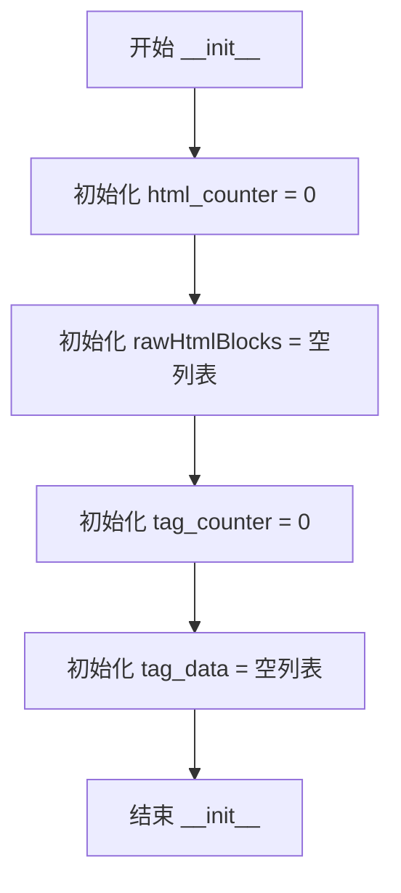

#### 带注释源码

```python
def __init__(self):
    """ Create an `HtmlStash`. """
    # 用于计数内联 HTML 片段的计数器，从 0 开始
    # 每次调用 store() 方法存储 HTML 时递增
    self.html_counter = 0
    
    # 存储提取的原始 HTML 块，可以是字符串或 Element 对象
    # 用于后续文档处理完成后重新插入到文档中
    self.rawHtmlBlocks: list[str | etree.Element] = []
    
    # 用于计数标签的计数器，从 0 开始
    # 每次调用 store_tag() 方法存储标签时递增
    self.tag_counter = 0
    
    # 存储标签数据的列表，按标签出现顺序保存
    # 每个元素是包含 tag, attrs, left_index, right_index 的字典
    self.tag_data: list[TagData] = []
```


### `HtmlStash.store`

该方法用于将提取的HTML片段暂存到内部存储中，并返回一个唯一的占位符字符串，以便后续重新插入文档。

参数：

- `html`：`str | etree.Element`，需要暂存的HTML片段，可以是字符串或ElementTree元素

返回值：`str`，用于替换原始HTML的占位符字符串

#### 流程图

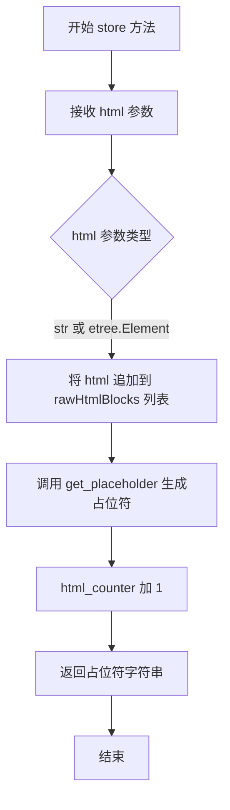

#### 带注释源码

```python
def store(self, html: str | etree.Element) -> str:
    """
    Saves an HTML segment for later reinsertion.  Returns a
    placeholder string that needs to be inserted into the
    document.

    Keyword arguments:
        html: An html segment.

    Returns:
        A placeholder string.

    """
    # 将传入的HTML片段追加到内部存储列表中保存
    self.rawHtmlBlocks.append(html)
    # 根据当前计数器生成对应的占位符字符串
    placeholder = self.get_placeholder(self.html_counter)
    # 计数器递增，为下一个HTML片段准备
    self.html_counter += 1
    # 返回生成的占位符，用于在文档中替换原始HTML
    return placeholder
```


### `HtmlStash.reset`

该方法用于清空 `HtmlStash` 实例中存储的 HTML 内容，将计数器归零并清空存储列表，以便在处理新的 Markdown 文档时能够重新使用该 stash 实例。

参数：无（仅包含 `self` 参数）

返回值：`None`，无返回值

#### 流程图

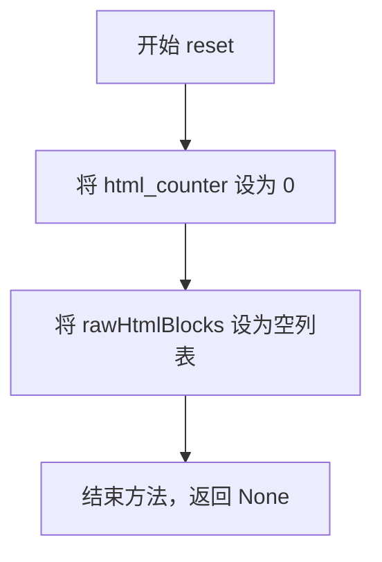

#### 带注释源码

```python
def reset(self) -> None:
    """ Clear the stash. """
    self.html_counter = 0        # 重置 HTML 片段计数器为 0
    self.rawHtmlBlocks = []      # 清空已存储的 HTML 片段列表
```


### `HtmlStash.get_placeholder`

该方法是 `HtmlStash` 类的核心成员之一，负责根据传入的数字键生成唯一的HTML占位符字符串，用于在Markdown处理过程中临时替换原始HTML内容，待处理完成后再还原。

参数：
- `key`：`int`，用于生成占位符的数字键，与 `html_counter` 相关联

返回值：`str`，返回格式为 `\u0002wzxhzdk:{key}\u0003` 的占位符字符串

#### 流程图

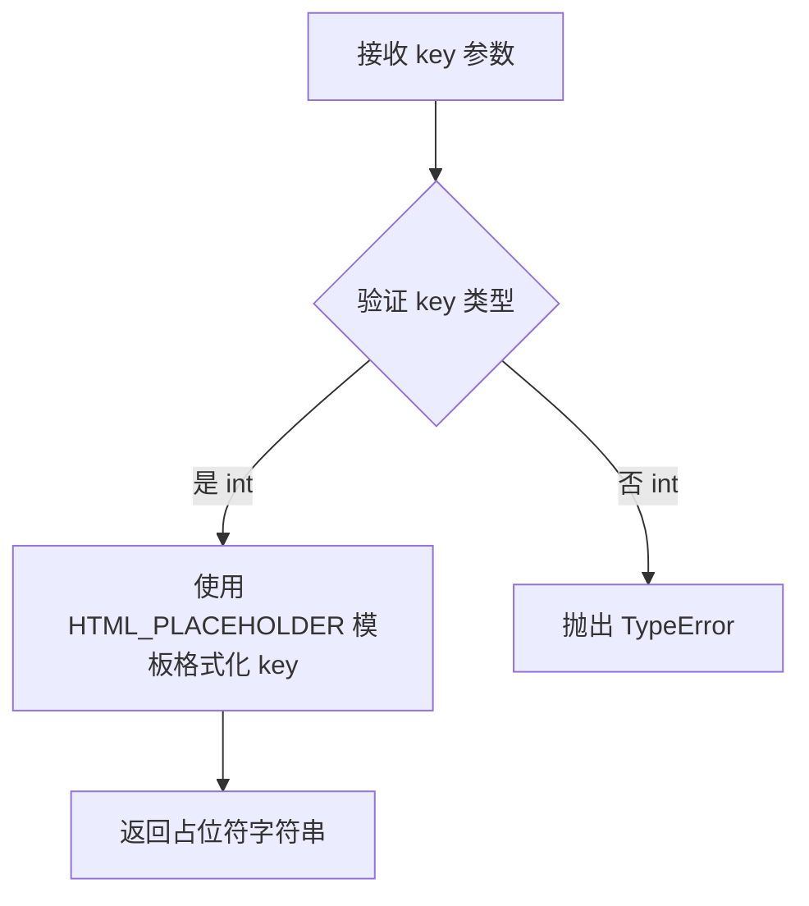

#### 带注释源码

```python
def get_placeholder(self, key: int) -> str:
    """
    根据传入的 key 生成对应的 HTML 占位符字符串。
    
    占位符格式为：STX + "wzxhzdk:%s" + ETX
    其中 STX = '\\u0002' (文本开始标记), ETX = '\\u0003' (文本结束标记)
    
    参数:
        key: int - 用于生成占位符的唯一数字索引
        
    返回:
        str - 格式化后的占位符字符串，示例：'\\u0002wzxhzdk:0\\u0003'
    """
    return HTML_PLACEHOLDER % key
```

---

### 类：HtmlStash

`HtmlStash` 是 Python Markdown 库中用于暂存原始 HTML 内容的数据结构类。在 Markdown 转换为 HTML 的过程中，某些 HTML 片段需要被提取并替换为占位符，以避免被 Markdown 处理器错误处理。

#### 类字段

| 字段名 | 类型 | 描述 |
|--------|------|------|
| `html_counter` | `int` | 用于计数内联 HTML 片段的计数器 |
| `rawHtmlBlocks` | `list[str \| etree.Element]` | 存储提取的原始 HTML 块 |
| `tag_counter` | `int` | 用于计数标签的计数器 |
| `tag_data` | `list[TagData]` | 按出现顺序存储标签数据的列表 |

#### 类方法

| 方法名 | 描述 |
|--------|------|
| `__init__` | 初始化 HtmlStash 实例 |
| `store` | 保存 HTML 片段并返回占位符 |
| `reset` | 清空暂存区 |
| `get_placeholder` | 生成 HTML 占位符（当前分析的方法） |
| `store_tag` | 存储标签数据并返回占位符 |

---

### 关键组件信息

| 组件名 | 描述 |
|--------|------|
| `HTML_PLACEHOLDER` | HTML 占位符模板常量，格式为 `\u0002wzxhzdk:%s\u0003` |
| `STX` | Unicode 字符 `\u0002`，表示"文本开始"标记 |
| `ETX` | Unicode 字符 `\u0003`，表示"文本结束"标记 |
| `HTML_PLACEHOLDER_RE` | 用于匹配 HTML 占位符的正则表达式 |

---

### 潜在的技术债务或优化空间

1. **魔法字符串**：占位符前缀 `wzxhzdk` 和 `hzzhzkh` 缺乏明确语义，可考虑使用常量或配置化方式管理
2. **字符串拼接**：`HTML_PLACEHOLDER % key` 使用旧式字符串格式化，建议改用 f-string 或 `.format()`
3. **类型提示**：虽然导入了 `TYPE_CHECKING`，但部分方法参数仍可增强类型注解

---

### 其它项目

#### 设计目标
- 在 Markdown 解析过程中安全保留原始 HTML 内容
- 通过唯一占位符实现 HTML 内容的可逆替换

#### 错误处理
- 当前方法未对 `key` 类型进行显式验证，若传入非整数可能导致意外行为

#### 数据流
1. `store()` 方法调用 `get_placeholder()` 生成占位符
2. 占位符被插入到文档中，原 HTML 被存入 `rawHtmlBlocks`
3. 后续通过正则表达式匹配占位符并还原原始 HTML

#### 外部依赖
- 依赖全局常量 `HTML_PLACEHOLDER`、`STX`、`ETX`
- 使用 `xml.etree.ElementTree` 处理元素（仅在类型检查时导入）


### `HtmlStash.store_tag`

该方法用于存储提取的HTML标签数据，并返回一个占位符字符串以便后续重新插入原位。

参数：

- `tag`：`str`，HTML标签名称（如 `div`、`span` 等）
- `attrs`：`dict[str, str]`，HTML标签的属性字典
- `left_index`：`int`，标签在原始文本中的起始位置索引
- `right_index`：`int`，标签在原始文本中的结束位置索引

返回值：`str`，生成的占位符字符串，用于在Markdown处理过程中替换原始标签

#### 流程图

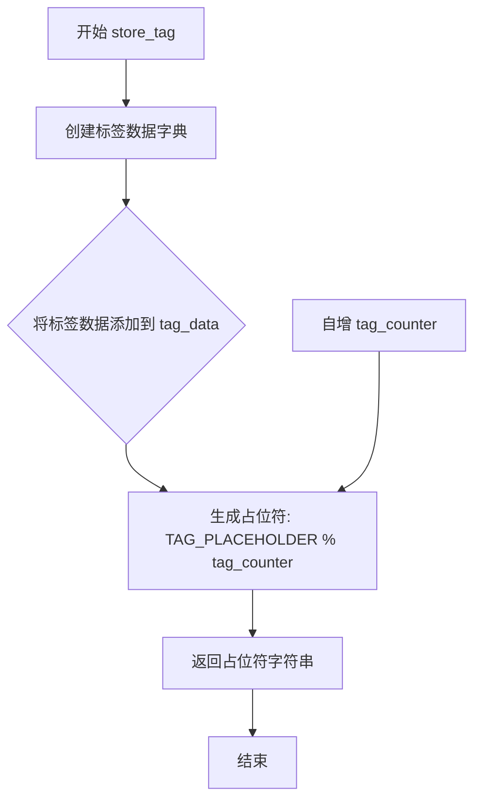

#### 带注释源码

```python
def store_tag(self, tag: str, attrs: dict[str, str], left_index: int, right_index: int) -> str:
    """Store tag data and return a placeholder."""
    # 将标签信息保存到 tag_data 列表中，以便后续恢复
    self.tag_data.append({'tag': tag, 'attrs': attrs,
                          'left_index': left_index,
                          'right_index': right_index})
    # 使用 TAG_PLACEHOLDER 模板生成占位符字符串
    placeholder = TAG_PLACEHOLDER % str(self.tag_counter)
    # 计数器自增，该值等于标签在 tag_data 列表中的索引
    self.tag_counter += 1  # equal to the tag's index in `self.tag_data`
    # 返回生成的占位符，用于替换文档中的原始标签
    return placeholder
```


### `_PriorityItem` 类

`_PriorityItem` 是一个继承自 `NamedTuple` 的简单数据结构，用于存储优先级项的名称和优先级值。它自动继承了 `NamedTuple` 和 `tuple` 类的所有方法，无需自定义实现。

参数：

- `name`：`str`，优先级项的名称
- `priority`：`float`，优先级数值

返回值：`_PriorityItem` 实例

#### 流程图

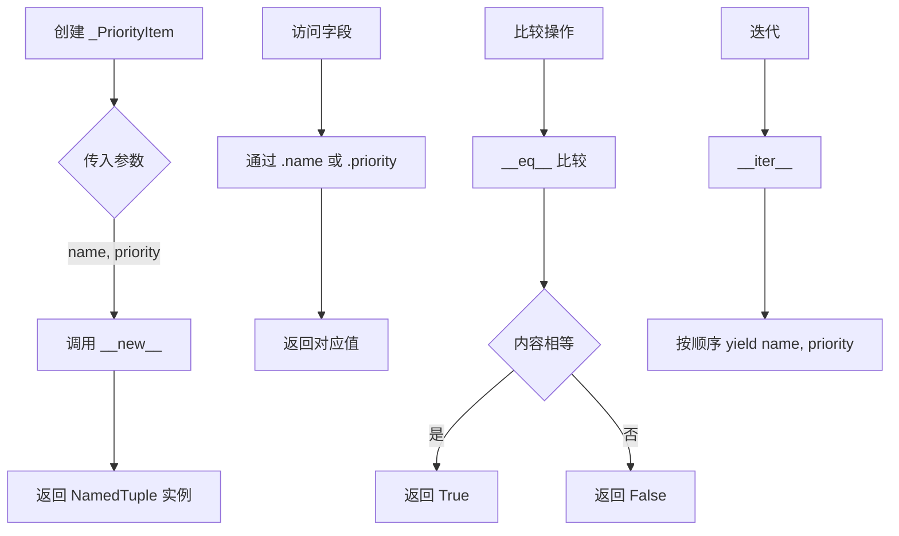

#### 带注释源码

```python
class _PriorityItem(NamedTuple):
    """
    用于 Registry 内部排序的优先级项。
    
    提供更易读的 API，例如 `item.name` 比 `item[0]` 更清晰。
    
    字段：
        name: 优先级项的名称
        priority: 优先级数值
    """
    name: str
    priority: float

# NamedTuple 自动生成的方法：

# 1. __new__ - 创建新实例
# _PriorityItem(name='extension', priority=10)

# 2. __repr__ - 返回字符串表示
# 例如：_PriorityItem(name='extension', priority=10)

# 3. __eq__ - 相等性比较
# item1 == item2

# 4. name 属性 - 访问 name 字段

# 5. priority 属性 - 访问 priority 字段

# 继承自 tuple 的方法：
# 6. __hash__ - 哈希值
# 7. __iter__ - 迭代器
# 8. __len__ - 长度（总是 2）
# 9. __getitem__ - 索引访问
```


### Registry.__init__

这是`Registry`类的构造函数，用于初始化一个优先级排序的注册表实例。该方法创建空的数据字典来存储注册项、初始化优先级列表用于排序、以及设置排序标志位。

参数：

- `self`：隐式参数，`Registry`类实例本身

返回值：`None`，该方法不返回值（Python中`__init__`方法自动返回`None`）

#### 流程图

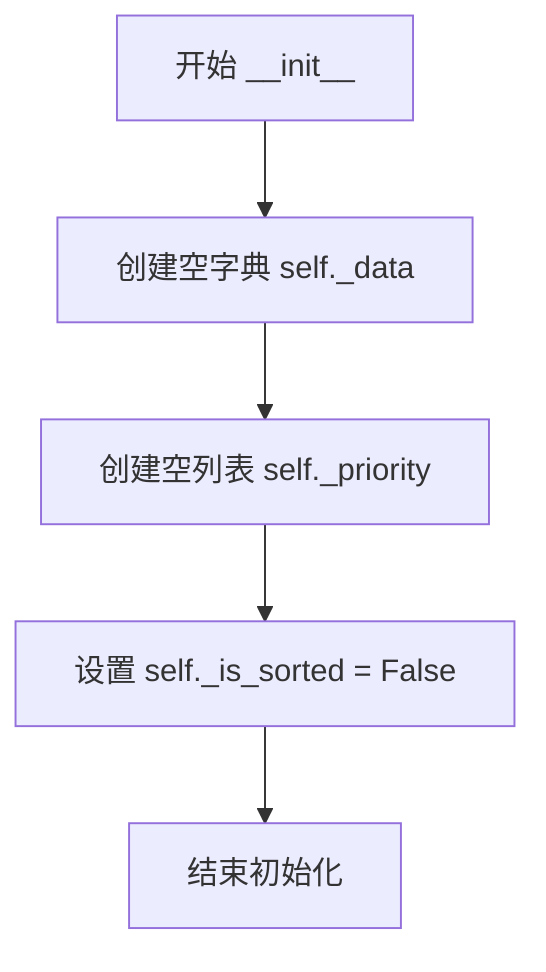

#### 带注释源码

```python
def __init__(self):
    """
    初始化Registry实例。
    
    创建一个空的优先级注册表，包含：
    - _data: 用于存储注册项的字典，键为名称，值为注册项对象
    - _priority: 用于存储名称和优先级的列表
    - _is_sorted: 标记是否已排序的标志位
    """
    self._data: dict[str, _T] = {}       # 初始化数据字典，存储注册项
    self._priority: list[_PriorityItem] = []  # 初始化优先级列表
    self._is_sorted = False              # 初始时未排序
```


### `Registry.__contains__`

该方法实现了 Python 的 `in` 运算符，用于检查注册表中是否包含指定的元素。可以根据名称（字符串）或元素实例进行查询。

参数：

- `item`：`str | _T`，要检查的元素。可以是注册项的名称（字符串），也可以是注册项的实例。

返回值：`bool`，如果元素存在于注册表中则返回 `True`，否则返回 `False`。

#### 流程图

```mermaid
flowchart TD
    A[Start __contains__] --> B{Is item a string?}
    B -->|Yes| C[Check if item in self._data.keys]
    B -->|No| D[Check if item in self._data.values]
    C --> E[Return result]
    D --> E
    E --> F[End]
```

#### 带注释源码

```python
def __contains__(self, item: str | _T) -> bool:
    """
    Check if an item exists in the registry.
    
    当使用 `in` 运算符检查 Registry 对象时，此方法会被自动调用。
    支持两种查询方式：按名称（字符串）查询，或按实例对象查询。
    """
    if isinstance(item, str):
        # 检查是否已存在以此名称注册的元素。
        # 仅检查键（即名称），返回布尔值。
        return item in self._data.keys()
    # 检查此实例是否已注册。
    # 遍历所有注册的值，检查是否存在相同的实例。
    return item in self._data.values()
```


### `Registry.__iter__`

该方法是 `Registry` 类的迭代器实现，用于遍历注册表中已注册的所有项。调用时首先确保内部数据按优先级排序，然后返回一个包含所有注册项的迭代器。

参数： 无

返回值：`Iterator[_T]`，返回一个迭代器，用于逐个访问注册表中的项

#### 流程图

```mermaid
flowchart TD
    A[开始 __iter__] --> B{检查 _is_sorted 标志}
    B -->|False| C[调用 _sort 方法]
    B -->|True| D[跳过排序]
    C --> E[按优先级降序排序 _priority 列表]
    D --> F[从 _priority 中提取键]
    E --> F
    F --> G[使用键从 _data 字典获取对应值]
    G --> H[构建值列表]
    H --> I[返回列表的迭代器]
```

#### 带注释源码

```python
def __iter__(self) -> Iterator[_T]:
    """
    迭代器方法，用于遍历注册表中的所有注册项。
    
    迭代顺序按照注册时的 priority 从高到低排序。
    
    Returns:
        Iterator[_T]: 返回一个迭代器对象，可遍历所有已注册的项
    """
    # 首先确保数据已按优先级排序
    # _sort 方法会检查 _is_sorted 标志，避免重复排序
    self._sort()
    
    # 使用列表推导式从 _priority 中提取每个项的名称，
    # 然后用该名称从 _data 字典中获取对应的实际项
    # 最后将其包装为迭代器返回
    return iter([self._data[k] for k, p in self._priority])
```


### `Registry.__getitem__`

该方法是 `Registry` 类的核心索引访问方法，允许通过字符串名称、整数索引或切片对象三种方式获取注册表中的项。当使用切片时，会返回一个新的 `Registry` 实例，包含指定范围内的项；当使用整数或字符串时，直接返回对应的单个项。

参数：

- `key`：`str | int | slice`，用于从注册表中检索项的键。可以是字符串（项名称）、整数（项索引）或切片（项范围）。

返回值：`_T | Registry[_T]`，当 key 为 str 或 int 时返回单个 `_T` 类型的项；当 key 为 slice 时返回一个新的包含切片项的 `Registry[_T]` 实例。

#### 流程图

```mermaid
flowchart TD
    A[开始 __getitem__] --> B[调用 self._sort]
    B --> C{key 是 slice?}
    C -->|Yes| D[创建新的空 Registry 实例 data]
    D --> E[遍历 self._priority[key] 切片范围]
    E --> F[对每个 k, p 调用 data.register]
    F --> G[返回 data]
    C -->|No| H{key 是 int?}
    H -->|Yes| I[返回 self._data[self._priority[key].name]
    H -->|No| J[返回 self._data[key] 字符串查找]
    I --> K[结束]
    G --> K
    J --> K
```

#### 带注释源码

```python
@overload
def __getitem__(self, key: str | int) -> _T:  # pragma: no cover
    ...

@overload
def __getitem__(self, key: slice) -> Registry[_T]:  # pragma: no cover
    ...

def __getitem__(self, key: str | int | slice) -> _T | Registry[_T]:
    """
    获取注册表中的一项或多项。

    参数:
        key: 字符串名称、整数索引或切片对象。

    返回:
        单个项或新的 Registry 实例。
    """
    # 首先确保注册表已按优先级排序
    self._sort()
    
    # 如果 key 是切片，返回一个新的 Registry 实例
    if isinstance(key, slice):
        data: Registry[_T] = Registry()
        # 遍历切片范围内的优先级项
        for k, p in self._priority[key]:
            # 将选中的项注册到新实例中
            data.register(self._data[k], k, p)
        return data
    
    # 如果 key 是整数，按索引返回项
    if isinstance(key, int):
        # 通过优先级列表找到对应名称，再从数据字典中获取项
        return self._data[self._priority[key].name]
    
    # 否则按字符串名称返回项
    return self._data[key]
```


### `Registry.__len__`

该方法返回注册表中已注册项的数量，通过返回内部优先级列表 `_priority` 的长度来实现，是 Python 魔术方法之一，使 Registry 实例可以直接使用 `len()` 函数获取元素个数。

参数：

- `self`：`Registry`，类的实例本身

返回值：`int`，返回注册表中注册项的数量

#### 流程图

```mermaid
flowchart TD
    A[调用 lenRegistry 实例] --> B{调用 __len__ 方法}
    B --> C[返回 lenself._priority]
    C --> D[返回注册项数量]
```

#### 带注释源码

```python
def __len__(self) -> int:
    """
    返回注册表中已注册项的数量。
    
    这是 Python 的魔术方法，使 Registry 实例可以直接使用内置的 len() 函数。
    该方法返回内部维护的 _priority 列表的长度，该列表包含了所有已注册项的名称和优先级信息。
    
    Returns:
        int: 注册表中注册项的数量
    """
    return len(self._priority)
```


### `Registry.__repr__`

该方法为 `Registry` 类提供字符串表示形式，返回一个格式为 `<Registry([items])>` 的字符串，其中 `[items]` 是注册表中所有项的列表表示。

参数：

- 无参数（仅包含 `self`）

返回值：`str`，返回 Registry 对象的字符串表示形式，格式为 `<类名([迭代出的元素列表])>`

#### 流程图

```mermaid
flowchart TD
    A[开始 __repr__] --> B[获取类名: self.__class__.__name__]
    B --> C[调用 list(self) 触发 __iter__]
    C --> D{self._is_sorted?}
    D -->|否| E[调用 _sort 方法排序优先级列表]
    D -->|是| F[直接迭代]
    E --> F
    F --> G[将迭代结果转换为列表]
    G --> H[使用 format 构造字符串: <{类名}({列表})>]
    H --> I[返回字符串]
```

#### 带注释源码

```python
def __repr__(self):
    """
    返回对象的字符串表示形式。
    
    Returns:
        str: 格式为 '<Registry([item1, item2, ...])>' 的字符串表示。
    """
    # self.__class__.__name__ 获取类名 "Registry"
    # list(self) 调用 __iter__ 方法，先排序再返回所有注册项的列表
    return '<{}({})>'.format(self.__class__.__name__, list(self))
```


### `Registry.get_index_for_name`

返回给定名称的项在注册表中的索引位置，如果不存在则抛出 `ValueError` 异常。

参数：

- `name`：`str`，要查找索引的项目名称

返回值：`int`，给定名称的项目在优先级排序列表中的索引位置

#### 流程图

```mermaid
flowchart TD
    A[开始 get_index_for_name] --> B{检查名称是否存在}
    B -->|不存在| C[抛出 ValueError 异常]
    B -->|存在| D[调用 _sort 方法确保列表已排序]
    D --> E[查找优先级列表中名称匹配的项]
    E --> F[返回该项的索引位置]
    C --> G[结束]
    F --> G
```

#### 带注释源码

```python
def get_index_for_name(self, name: str) -> int:
    """
    Return the index of the given name.
    """
    # 检查传入的名称是否存在于注册表中
    # 利用 __contains__ 方法进行判断
    if name in self:
        # 如果存在，先确保优先级列表已排序
        # 调用 _sort 方法进行排序（从高到低按优先级）
        self._sort()
        # 使用列表推导找到名称匹配的 _PriorityItem
        # 然后通过 index() 方法获取其索引位置
        return self._priority.index(
            [x for x in self._priority if x.name == name][0]
        )
    # 如果名称不存在，抛出详细的 ValueError 异常
    raise ValueError('No item named "{}" exists.'.format(name))
```


### `Registry.register`

将项注册到注册表中，并使用提供的名称和优先级对其进行排序。如果已存在同名项，则替换旧项。

参数：

- `item`：`_T`（泛型类型），正在注册的对象
- `name`：`str`，用于引用该项的字符串名称
- `priority`：`float`，用于对所有项进行排序的浮点数优先级

返回值：`None`，无返回值，仅修改注册表内部状态

#### 流程图

```mermaid
flowchart TD
    A[开始 register] --> B{检查 name 是否已存在}
    B -->|是| C[调用 deregister 移除旧项]
    B -->|否| D[设置 _is_sorted = False]
    C --> D
    D --> E[将 item 存入 _data 字典]
    E --> F[创建 _PriorityItem 并加入 _priority 列表]
    F --> G[结束 register]
```

#### 带注释源码

```python
def register(self, item: _T, name: str, priority: float) -> None:
    """
    Add an item to the registry with the given name and priority.

    Arguments:
        item: The item being registered.
        name: A string used to reference the item.
        priority: An integer or float used to sort against all items.

    If an item is registered with a "name" which already exists, the
    existing item is replaced with the new item. Treat carefully as the
    old item is lost with no way to recover it. The new item will be
    sorted according to its priority and will **not** retain the position
    of the old item.
    """
    # 检查是否已存在同名项，如有则先移除旧项
    if name in self:
        # Remove existing item of same name first
        self.deregister(name)
    # 标记注册表未排序，后续访问时将重新排序
    self._is_sorted = False
    # 将新项存入数据字典，以 name 为键
    self._data[name] = item
    # 将名称和优先级添加到优先级列表
    self._priority.append(_PriorityItem(name, priority))
```


### `Registry.deregister`

从注册表中移除指定名称的项。如果 `strict=True`（默认），则在项不存在时抛出 `ValueError`；如果 `strict=False`，则静默失败。

参数：

- `name`：`str`，要注销的项的名称
- `strict`：`bool = True`，是否启用严格模式；为 `True` 时在名称不存在时抛出 `ValueError`，为 `False` 时静默忽略

返回值：`None`，无返回值

#### 流程图

```mermaid
flowchart TD
    A[开始 deregister] --> B{尝试获取 name 的索引}
    B --> C{索引获取成功?}
    C -->|Yes| D[删除 _priority[index]]
    D --> E[删除 _data[name]]
    E --> F[结束]
    C -->|No| G{strict == True?}
    G -->|Yes| H[raise ValueError]
    H --> I[结束]
    G -->|No| J[静默返回]
    J --> I
```

#### 带注释源码

```python
def deregister(self, name: str, strict: bool = True) -> None:
    """
    Remove an item from the registry.

    Set `strict=False` to fail silently. Otherwise a [`ValueError`][] is raised for an unknown `name`.
    """
    try:
        # 尝试获取该项在优先级列表中的索引位置
        index = self.get_index_for_name(name)
        # 从优先级列表中删除该元素
        del self._priority[index]
        # 从数据字典中删除该元素
        del self._data[name]
    except ValueError:
        # 如果未找到该名称，且 strict 模式为 True，则抛出异常
        if strict:
            raise
```


### `Registry._sort`

该方法用于根据优先级对注册表中的项进行排序（从高到低），是一个内部方法，不应被显式调用。

参数：此方法无显式参数（`self` 为隐式参数）。

返回值：`None`，无返回值，仅修改对象内部状态。

#### 流程图

```mermaid
flowchart TD
    A[开始 _sort] --> B{_is_sorted?}
    B -->|True| C[结束 - 已排序]
    B -->|False| D[按 priority 降序排序 _priority 列表]
    D --> E[_is_sorted = True]
    E --> C
```

#### 带注释源码

```python
def _sort(self) -> None:
    """
    Sort the registry by priority from highest to lowest.

    This method is called internally and should never be explicitly called.
    """
    # 检查是否已经排序过，避免重复排序带来的性能开销
    if not self._is_sorted:
        # 使用 Python 内置 sort 方法，按 priority 字段降序排序
        # reverse=True 表示从高到低排序（优先级高的排在前面）
        self._priority.sort(key=lambda item: item.priority, reverse=True)
        # 标记已排序状态，避免后续重复排序
        self._is_sorted = True
```

## 关键组件


### Constants

### Block-level Elements Configuration

**BLOCK_LEVEL_ELEMENTS**: 包含HTML块级元素标签的列表，用于标识哪些元素不能被包裹在`<p>`标签中，以及哪些元素的内容不应被Markdown处理。

### Placeholder System

**STX**: Unicode字符`\u0002`，用作文本起始标记。

**ETX**: Unicode字符`\u0003`，用作文本结束标记。

**INLINE_PLACEHOLDER_PREFIX**: 内联占位符前缀，格式为`STX + "klzzwxh:"`。

**INLINE_PLACEHOLDER**: 内联文本占位符模板，用于存储临时提取的内联内容。

**INLINE_PLACEHOLDER_RE**: 正则表达式，用于匹配内联占位符。

**AMP_SUBSTITUTE**: HTML实体`&`的替换占位符。

**HTML_PLACEHOLDER**: 原始HTML块的占位符模板。

**HTML_PLACEHOLDER_RE**: 正则表达式，用于匹配HTML占位符。

**TAG_PLACEHOLDER**: HTML标签的占位符模板。

### Unicode and Internationalization

**RTL_BIDI_RANGES**: 从右到左（RTL）语言的Unicode字符范围，包括希伯来语、阿拉伯语、叙利亚语等。

### Global Functions

### Extension Loading

**get_installed_extensions**: 获取所有通过entry_points注册的Markdown扩展。使用`lru_cache`缓存结果以提高性能，支持Python 3.10+和更低版本的importlib_metadata。

### Deprecation Mechanism

**deprecated**: 装饰器函数，用于标记已弃用的函数或方法。当被装饰的函数被调用时，会发出`DeprecationWarning`。

### Boolean Parsing

**parseBoolValue**: 解析字符串形式的布尔值，支持多种格式如'true'、'yes'、'y'、'on'、'1'等返回True；'false'、'no'、'n'、'off'、'0'、'none'返回False。

### Code Escaping

**code_escape**: 对代码字符串进行HTML转义，将`&`、`<`、`>`字符分别替换为`&amp;`、`&lt;`、`&gt;`。

### Stack Depth Detection

**_get_stack_depth**: 性能优化地获取当前堆栈深度。

**nearing_recursion_limit**: 检查当前堆栈深度是否接近递归限制（在100以内）。

### Core Classes

### AtomicString

**AtomicString**: 继承自str的类，用于标记不应被进一步处理的字符串内容。

### Processor

**Processor**: 所有Markdown处理器的基类，提供Markdown实例的引用。

### HtmlStash

**HtmlStash**: 用于暂存HTML片段的类，在文档处理开始时提取HTML并用占位符替换，处理完成后再恢复。

- **html_counter**: 计数器，用于分配唯一ID给内联HTML片段
- **rawHtmlBlocks**: 存储原始HTML块（包括字符串和Element对象）的列表
- **tag_counter**: 标签计数器
- **tag_data**: 存储标签元数据的列表

**store**: 存储HTML片段并返回占位符字符串。

**reset**: 清空暂存区。

**get_placeholder**: 生成HTML占位符。

**store_tag**: 存储标签数据并返回占位符。

### Registry

**Registry**: 通用优先级排序注册表类，支持按名称和优先级注册、注销和检索项目。

- **_data**: 存储名称到项目的映射
- **_priority**: 存储优先级项的列表
- **_is_sorted**: 标记是否已排序

**register**: 注册项目到注册表，支持优先级排序。

**deregister**: 从注册表移除项目。

**__contains__**: 检查项目是否存在（支持名称或实例）。

**__iter__**: 迭代器，按优先级顺序返回所有项目。

**__getitem__**: 支持按索引、切片或名称获取项目。

**get_index_for_name**: 根据名称获取项目索引。

### _PriorityItem

**_PriorityItem**: 命名元组，用于存储注册表项的名称和优先级。


## 问题及建议


### 潜在技术债务与优化空间

#### 已知问题

- **`get_installed_extensions()` 缓存策略不当**：使用 `@lru_cache(maxsize=None)` 永久缓存扩展列表，运行时动态安装的扩展无法被感知。需考虑提供缓存失效机制或在文档中明确说明限制。

- **Registry 类排序开销**：`__iter__`、`__getitem__` 和 `get_index_for_name` 方法每次调用都会执行 `_sort()`，在高频访问场景下存在性能隐患。建议在注册/注销操作后惰性排序，或使用更高效的数据结构（如 heapq）维护有序状态。

- **HtmlStash 的 tag_data 索引管理**：`tag_counter` 仅用于占位符生成，实际通过 `len(self.tag_data) - 1` 获取索引，存在逻辑不一致。建议统一使用 `len(self.tag_data)` 作为唯一标识。

- **类型注解依赖运行时延迟导入**：`Markdown` 和 `etree` 仅在 `TYPE_CHECKING` 块中导入，虽避免循环依赖但削弱了运行时的类型检查能力。

- **_get_stack_depth 函数实现脆弱**：依赖 `frame.f_back` 手动遍历，在某些解释器实现或优化场景下可能失效。缺乏单元测试覆盖。

- **Registry.get_index_for_name 线性查找**：使用列表推导和 `index()` 方法在已排序列表中查找，时间复杂度为 O(n)。可优化为字典映射或二分查找。

- **AtomicString 类功能单薄**：仅继承 `str` 未添加额外逻辑，未实现任何防处理机制（注释声称不应被处理，但无实际保护）。

- **code_escape 函数效率低下**：多次字符串替换未合并，可使用 `str.translate()` 或正则表达式一次性处理。

- **BLOCK_LEVEL_ELEMENTS 列表硬编码**：作为全局常量缺乏扩展性，应考虑从配置或 HTML 规范动态加载。

- **deprecated 装饰器默认 stacklevel 可能失效**：依赖调用栈深度，在嵌套调用场景下警告位置可能不准确。

#### 优化建议

- 为 `get_installed_extensions()` 提供缓存清理方法或配置选项，并添加文档说明缓存行为。
- 重构 Registry 类，在注册/注销时维护排序标志，使用 bisect 模块插入优先级项，避免全量排序。
- 统一 HtmlStash 的索引策略，使用枚举或常量明确标记含义。
- 将 `nearing_recursion_limit` 和 `_get_stack_depth` 封装为独立模块并添加详尽测试。
- 为 Registry 添加缓存的排序结果或使用 `sortedcontainers` 库优化查找性能。
- 扩展 AtomicString 实现 `__init__` 或元类机制，确保实例不会被意外处理。
- 重写 `code_escape` 使用 `html.escape()` 或 `str.translate()` 提升性能。
- 将 BLOCK_LEVEL_ELEMENTS 迁移至配置文件，支持用户自定义扩展。
- 改进 deprecated 装饰器，支持自定义调用栈层级或提供上下文管理器版本。
- 补充类型注解的运行时验证（如使用 `pydantic` 或 `beartype`）。

## 其它


### 设计目标与约束

本模块作为Python Markdown的核心基础模块，主要目标是为整个Markdown库提供通用工具函数、占位符管理、HTML存储以及注册表管理等基础设施工具。设计约束包括：保持与Python 3.7+的向后兼容性（通过TYPE_CHECKING条件导入），使用类型提示提升代码可维护性，以及通过lru_cache优化重复调用的性能。

### 错误处理与异常设计

本模块采用分级错误处理策略：**ValueError**用于参数校验失败场景（如parseBoolValue中无效的布尔值字符串）；**DeprecationWarning**通过deprecated装饰器标记废弃接口；**KeyError/IndexError**由Registry类在查找不存在的项时抛出，可通过deregister方法的strict参数控制是否静默处理。HtmlStash的store_tag方法在标签数据异常时返回占位符而非抛出异常，保证解析流程的连续性。

### 数据流与状态机

**数据输入流**：外部HTML/标签片段 → HtmlStash.store() → 转换为占位符（STX+wzxhzdk:数字+ETX）→ 存入rawHtmlBlocks列表 → 返回占位符供后续处理。**数据输出流**：处理完成后 → HtmlStash.get_placeholder() → 根据key索引还原原始HTML。**Registry状态机**：注册项存储在_data字典和_priority列表中，通过_is_sorted标志位延迟排序，访问时触发_sort()方法按优先级（从高到低）排序。

### 外部依赖与接口契约

本模块依赖以下外部包：**importlib.metadata**（Python 3.10+）或**importlib_metadata**（Python 3.9及以下）用于获取已安装的Markdown扩展；**xml.etree.ElementTree**仅在类型检查时导入（避免运行时依赖）。提供的公共接口包括：get_installed_extensions()返回EntryPoints对象；parseBoolValue()接受字符串/None/其他类型返回布尔值或None；Registry类的register/deregister/__getitem__等方法；HtmlStash的store/reset/get_placeholder方法。

### 性能考虑与优化空间

**已实现的优化**：get_installed_extensions()使用@lru_cache(maxsize=None)缓存结果，避免重复扫描入口点；Registry类的_sort()方法使用延迟排序（_is_sorted标志），仅在必要时排序；parseBoolValue对常见布尔值字符串使用字典查找而非多重条件判断。**潜在优化点**：HtmlStash的rawHtmlBlocks使用list而非deque，在大量HTML片段场景下append操作可能涉及扩容；Registry的get_index_for_name使用列表推导式遍历，可考虑建立name到index的映射以提升查找效率。

### 安全考虑

本模块涉及HTML处理，但采用"存储-替换"策略：原始HTML被替换为不可逆的占位符（STX/ETX控制字符），处理完成后再还原，有效防止XSS攻击在转换过程中发生。code_escape函数对代码片段进行HTML转义（&、<、>），防止在代码块渲染时注入恶意HTML。Registry类通过名称验证防止注册冲突，但不对注册项的内容进行安全校验（依赖调用方负责）。

### 配置与扩展性

**可配置常量**：BLOCK_LEVEL_ELEMENTS列表可被外部修改以调整块级元素定义；占位符前缀（STX、INLINE_PLACEHOLDER_PREFIX等）理论上可修改但需保持一致性。**扩展点**：Registry类使用泛型类型_T，支持注册任意类型的处理器/扩展；Processor类作为基类允许扩展实现自定义处理器；HtmlStash的tag_data字段设计为字典列表，便于第三方扩展添加自定义标签属性。

### 版本兼容性

代码使用`from __future__ import annotations`实现向前类型注解；条件导入（TYPE_CHECKING块）避免运行时依赖不存在的模块；get_installed_extensions()内部对Python版本进行判断，兼容Python 3.7-3.9（使用backport）以及Python 3.10+（使用标准库）。parseBoolValue的preserve_none参数设计考虑了配置系统中none值与布尔false的语义区分需求。

### 测试策略建议

建议为Registry类设计以下测试用例：注册/注销流程验证、优先级排序正确性验证（高优先级在前）、名称/索引访问正确性、切片操作、重复注册覆盖行为、严格/非严格模式下的异常抛出。HtmlStash测试应覆盖：HTML存储与占位符还原的完整性、标签数据的存储与顺序保持、reset方法状态清理。parseBoolValue需覆盖各种输入格式（字符串大小写、yes/no/on/off/1/0、None、布尔值对象）的返回值正确性。

    