# `markdown\scripts\gen_ref_nav.py` 详细设计文档

这是一个 MkDocs 文档生成脚本，用于自动化生成 markdown 模块的参考文档页面和导航结构。它遍历指定目录下的所有 Python 模块，为每个模块生成对应的 .md 引用文件，并构建项目文档的 SUMMARY.md 导航文件。

## 整体流程

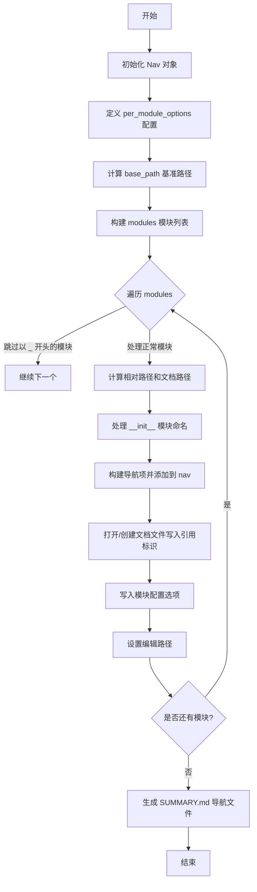

## 类结构

```
脚本文件 (无类定义)
└── 主要流程: 顺序执行
```

## 全局变量及字段


### `nav`
    
导航构建器实例，用于管理和构建文档导航结构

类型：`mkdocs_gen_files.Nav`
    


### `per_module_options`
    
每个模块的配置选项，定义markdown文档的summary包含属性、函数和类

类型：`dict`
    


### `base_path`
    
项目基准路径，指向代码库的根目录

类型：`Path`
    


### `modules`
    
需要生成文档的模块路径列表，包含markdown核心模块和扩展模块

类型：`list`
    


### `src_path`
    
当前遍历的源文件路径，用于迭代处理每个Python模块

类型：`Path`
    


### `path`
    
相对路径，相对于base_path的模块路径

类型：`Path`
    


### `module_path`
    
模块路径（无后缀），用于生成模块标识符

类型：`Path`
    


### `doc_path`
    
文档文件路径，Markdown文件的输出路径

类型：`Path`
    


### `full_doc_path`
    
完整的文档路径，包含reference前缀的目标文件路径

类型：`Path`
    


### `parts`
    
路径部分元组，将模块路径拆分为各部分用于构建标识符

类型：`tuple`
    


### `nav_parts`
    
导航部分列表，用于构建导航栏的层级结构

类型：`list`
    


### `ident`
    
模块标识符（点号分隔），用于在文档中引用模块

类型：`str`
    


### `yaml_options`
    
YAML格式的配置选项，用于控制文档生成的特定行为

类型：`str`
    


    

## 全局函数及方法


### `Path.resolve`

获取Path对象的绝对路径，解析所有符号链接，并解析路径中的 `.` 和 `..` 组件。

参数：

- 此方法无参数。

返回值：`Path`，返回一个新的Path对象，表示绝对路径。

#### 流程图

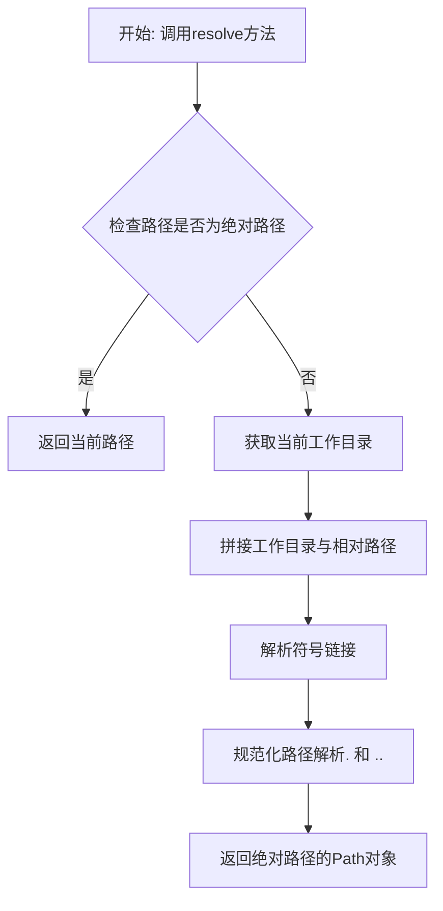

#### 带注释源码

```python
# Path.resolve() 在 pathlib.py 中的实现逻辑（简化版）
# 位置：Python 标准库 pathlib 模块

def resolve(self):
    """
    获取绝对路径并解析符号链接。
    
    处理流程：
    1. 如果路径已是绝对路径，直接处理
    2. 否则与当前工作目录拼接
    3. 解析所有符号链接
    4. 解析 . (当前目录) 和 .. (父目录)
    5. 返回规范化的绝对路径
    """
    # 示例实现逻辑
    if self.is_absolute():
        # 如果已经是绝对路径，直接规范化
        return self._flavour.resolve(self)
    
    # 否则，从当前工作目录开始解析
    base = Path.cwd()
    return (base / self).resolve()
    # 注意：实际实现会更复杂，涉及系统调用如 os.path.realpath()
```

**在用户代码中的实际使用：**

```python
# 从用户提供代码中提取
base_path = Path(__file__).resolve().parent.parent

# 解析流程：
# 1. Path(__file__) - 创建当前脚本文件的Path对象
# 2. .resolve() - 获取该文件的绝对路径
#    例如：'/project/markdown/docs/gen_ref_pages.py'
# 3. .parent.parent - 获取父目录的父目录
#    第一次parent: '/project/markdown/docs'
#    第二次parent: '/project/markdown' (即项目根目录)
```

#### 关键信息

| 项目 | 详情 |
|------|------|
| 所属类 | `pathlib.Path` |
| 模块 | `pathlib` |
| Python版本 | 3.6+ |
| 功能分类 | 路径处理/文件系统操作 |


### `Path.parent`

获取当前路径的父目录，返回一个新的 Path 对象表示上一级目录。

参数：无（`Path.parent` 是一个属性，不是方法）

返回值：`Path`，返回当前路径的父目录路径对象。

#### 流程图

```mermaid
graph TD
    A[当前路径对象] --> B[访问 .parent 属性]
    B --> C{是否存在父目录}
    C -->|是| D[返回父目录Path对象]
    C -->|否| E[返回根路径或空]
    
    F[示例: Path('/a/b/c')] --> G[.parent]
    G --> H[结果: Path('/a/b')]
    
    I[示例: Path('/a/b/c').parent.parent] --> J[.parent]
    J --> K[结果: Path('/a')]
```

#### 带注释源码

```python
"""Generate the code reference pages and navigation."""

import textwrap
import yaml
from pathlib import Path

import mkdocs_gen_files

# 使用示例：获取当前文件的父目录的父目录
# Path(__file__) 获取当前脚本的绝对路径
# .resolve() 解析为绝对路径，消除符号链接
# .parent 获取父目录（即脚本所在目录）
# .parent 再次获取父目录（即项目根目录）
base_path = Path(__file__).resolve().parent.parent

# 在这段代码中，base_path 最终指向项目根目录
# 例如：/path/to/project_root
# 然后用于构建各个模块的路径：
# base_path.joinpath("markdown", "__init__.py")
# base_path.joinpath("markdown", "preprocessors.py")
# 等等...

# Path.parent 的特性：
# 1. 返回新的 Path 对象，不修改原始路径
# 2. 对于根路径（如 / 或 C:\），返回自身
# 3. 可以链式调用多次，如 path.parent.parent
```

#### 详细说明

| 属性 | 说明 |
|------|------|
| 所属类 | `pathlib.Path` |
| 属性类型 | 属性（Property） |
| Python版本 | Python 3.4+ |
| 兼容性 | 仅适用于 `pathlib.Path`，不适用于 `os.path` |

#### 实际使用场景

在提供的代码中，`Path.parent` 的使用场景如下：

1. **获取项目根目录**：
   ```python
   base_path = Path(__file__).resolve().parent.parent
   ```
   - `Path(__file__)` → 当前脚本路径
   - `.resolve()` → 绝对路径
   - `.parent` → 脚本所在目录（项目根目录下的某处）
   - `.parent` → 项目根目录

2. **构建模块路径**：
   ```python
   base_path.joinpath("markdown", "__init__.py")
   ```
   结合 `base_path` 构建所有需要文档化的模块路径。

#### 技术债务与优化空间

1. **硬编码路径**：模块列表手动定义，可考虑自动发现
2. **缺少错误处理**：如果 `base_path` 不存在，代码会直接报错
3. **魔法数字**：多次使用 `.parent.parent` 可以提取为明确命名的常量


### `Path.joinpath`

Path.joinpath() 是 Python pathlib 模块中 Path 类的实例方法，用于将多个路径部分拼接成一个完整的路径对象，类似于 os.path.join()，但返回 Path 对象以便进行面向对象的路径操作。

参数：

- `*paths`：`str` 或 `Path`，可变数量的路径部分（目录名或文件名），每个参数代表路径的一个组成部分

返回值：`Path`，返回一个新的 Path 对象，表示拼接后的完整路径

#### 流程图


#### 带注释源码

```python
# 从代码中提取的 joinpath 使用示例

# 定义基础路径
base_path = Path(__file__).resolve().parent.parent

# 使用 joinpath 拼接多个路径部分
# 参数：多个字符串路径部分
# 返回值：Path 对象
modules = [
    # 第一次调用 joinpath，拼接 "markdown" 和 "__init__.py"
    base_path.joinpath("markdown", "__init__.py"),
    
    # 第二次调用，拼接 "markdown" 和 "preprocessors.py"
    base_path.joinpath("markdown", "preprocessors.py"),
    
    # 第三次调用，拼接 "markdown" 和 "blockparser.py"
    base_path.joinpath("markdown", "blockparser.py"),
    
    # 以此类推，拼接其他模块路径
    base_path.joinpath("markdown", "blockprocessors.py"),
    base_path.joinpath("markdown", "treeprocessors.py"),
    base_path.joinpath("markdown", "inlinepatterns.py"),
    base_path.joinpath("markdown", "postprocessors.py"),
    base_path.joinpath("markdown", "serializers.py"),
    base_path.joinpath("markdown", "util.py"),
    base_path.joinpath("markdown", "htmlparser.py"),
    base_path.joinpath("markdown", "test_tools.py"),
    
    # 拼接 "markdown" 和 "extensions"，然后使用 rglob 查找所有 .py 文件
    *sorted(base_path.joinpath("markdown", "extensions").rglob("*.py")),
]

# joinpath 的内部实现逻辑（简化版）
# def joinpath(self, *paths):
#     for path in paths:
#         # 将当前路径与新部分拼接
#         self = self._make_child(path)
#     return self

# 使用示例：
# 假设 base_path = /home/user/project
# base_path.joinpath("markdown", "util.py")
# 返回: Path('/home/user/project/markdown/util.py')
```


### `Path.relative_to`

计算当前路径相对于指定基准路径的相对路径。在本段代码中，用于将模块的绝对源文件路径转换为相对于项目根目录（`base_path`）的路径，以便后续生成文档结构。

参数：

- `self`：`Path`，隐式参数。当前路径对象，即调用此方法的 `src_path`。
- `other`：`Path`，基准路径。在本代码上下文中为 `base_path`（项目根目录的绝对路径）。

返回值：`Path`，返回一个新的 `Path` 对象，表示相对路径。

#### 流程图

```mermaid
graph TD
    A([开始]) --> B[输入: src_path (绝对路径)<br>基准: base_path (绝对路径)]
    B --> C{调用 src_path.relative_to(base_path)}
    C --> D[计算路径差]
    D --> E[输出: Path 对象<br>相对路径]
    E --> F([结束])
```

#### 带注释源码

```python
# 假设 base_path 为 "/project"，src_path 为 "/project/markdown/__init__.py"
# 计算 src_path 相对于 base_path 的路径
path = src_path.relative_to(base_path)

# 假设 src_path 不是 base_path 的子路径，此处会抛出 ValueError
# 成功时，path 将是 Path("markdown/__init__.py")
module_path = path.with_suffix("")
```


### `Path.with_suffix()`

该方法用于替换路径的后缀名，返回一个新的 Path 对象，保留原路径的目录和文件名部分，仅更改文件扩展名。在代码中，通过传入空字符串移除后缀，或传入新的后缀字符串（如 `.md`）来替换原有后缀。

参数：

-  `suffix`：`str`，新的后缀名，可以是空字符串（移除后缀）或带点的后缀（如 `".md"`）

返回值：`Path`，返回一个新的 Path 对象，其后缀已替换为指定的后缀

#### 流程图


#### 带注释源码

```python
# 代码中使用 with_suffix 的两处实例：

# 1. 移除后缀：将模块路径的后缀移除
# 例如：path = "markdown/__init__.py" -> module_path = "markdown/__init__"
module_path = path.with_suffix("")

# 2. 替换后缀：将路径后缀替换为 .md
# 例如：path = "markdown/__init__.py" -> doc_path = "markdown/__init__.md"
doc_path = path.with_suffix(".md")
```

#### 详细说明

在给定的代码上下文中，`with_suffix()` 方法发挥了两个关键作用：

1. **生成模块路径**：`module_path = path.with_suffix("")` 
   - 将相对路径的后缀移除，用于后续构建模块标识符
   - 例如：`markdown/blockparser.py` → `markdown/blockparser`

2. **生成文档路径**：`doc_path = path.with_suffix(".md")`
   - 将 Python 文件路径转换为 Markdown 文档路径
   - 例如：`markdown/blockparser.py` → `markdown/blockparser.md`

这种模式在 MkDocs 文档生成中非常常见，用于将源代码文件映射为文档文件。


### `Path.parts`

`Path.parts` 是 `pathlib.Path` 类的一个属性，用于将路径拆分为一个元组，其中每个元素都是路径的一个组成部分（例如，在 Unix 系统上，`/home/user/file.txt` 会变成 `('home', 'user', 'file.txt')`，或者如果根路径包含根，则可能包含根）。在提供的代码中，它被用来获取模块路径的各个部分以生成文档导航和标识符。

参数：此属性不接受任何参数。

返回值：`tuple`，返回路径的各个组成部分的元组。

#### 流程图

由于 `Path.parts` 是一个属性而不是方法，其流程图主要表示其简单的属性访问行为：

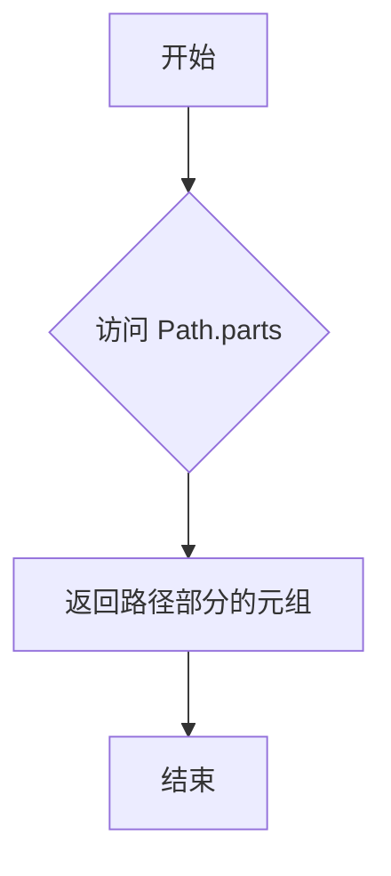

#### 带注释源码

在提供的代码中，`Path.parts` 的使用如下：

```python
# 获取模块路径（去除后缀）
module_path = path.with_suffix("")

# 将 Path 对象的 parts 属性转换为元组并赋值给 parts 变量
# parts 是一个元组，包含了路径的各个组成部分，例如 ('markdown', 'util')
parts = tuple(module_path.parts)
```

注意：在代码中，使用的具体表达式是 `module_path.parts`，其中 `module_path` 是一个 `Path` 对象实例。`parts` 属性自动返回该路径的组成部分元组，而 `tuple()` 函数确保它是一个不可变的元组，便于后续处理。


### `Path.as_posix()`

将 `Path` 对象转换为 POSIX 风格的字符串路径（使用正斜杠 `/` 分隔符），不受操作系统限制。

参数：

- 此方法不接受任何显式参数（隐式参数 `self` 为 `Path` 实例本身）

返回值：`str`，返回 POSIX 风格的路径字符串，例如 `foo/bar/baz.txt`

#### 流程图

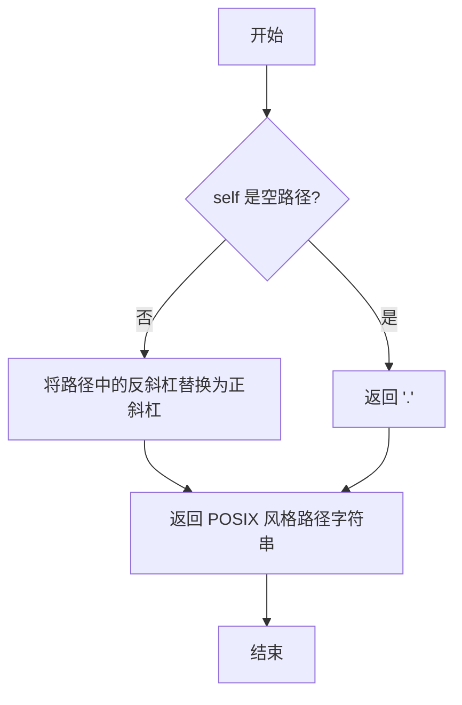

#### 带注释源码

```python
# Path.as_posix() 源码位于 pathlib 模块中
# 位置: Lib/pathlib.py (Python 标准库)

def as_posix(self):
    """Return the path as a POSIX-style string.
    
    将路径转换为使用正斜杠 / 作为分隔符的字符串。
    这确保了路径在不同操作系统间的一致性表示。
    """
    # 获取内部路径表示 (Windows 使用反斜杠，POSIX 使用正斜杠)
    # _str 属性存储底层的路径字符串
    return self._str.replace(self._flavour.sep, '/')
    # _flavour 是 Path 对象的内部属性，包含特定操作系统的路径风格
    # sep 属性是该操作系统的路径分隔符
    # 在 Windows 上是 '\\'，在 POSIX 系统上是 '/'
    # replace 方法将其统一转换为正斜杠
```

#### 在代码中的使用示例

```python
# 从提供代码的第 48 行:
# nav[nav_parts] = doc_path.as_posix()

# 示例:
# doc_path = Path("reference/markdown/index.md")
# as_posix() 返回: "reference/markdown/index.md"
# 这确保无论在哪个操作系统上，导航路径都使用正斜杠格式
```


### `str.startswith()`

该方法用于检查字符串是否以指定的前缀开头，常用于代码中过滤以双下划线开头的模块文件（如 `__init__`）。

参数：

- `prefix`：`str` 或 `tuple`，要检查的前缀字符串或前缀元组
- `start`：`int`（可选），开始检查的位置索引，默认为 0
- `end`：`int`（可选），结束检查的位置索引，默认为字符串长度

返回值：`bool`，如果字符串以指定前缀开头返回 `True`，否则返回 `False`

#### 流程图

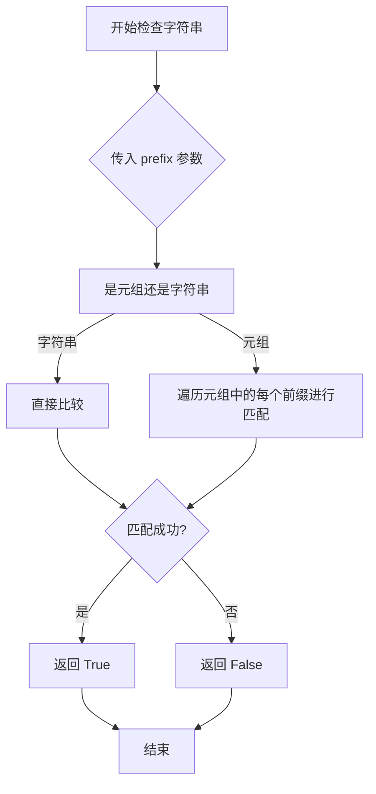

#### 带注释源码

```python
# 代码上下文：
# parts 是一个元组，包含模块路径的各个部分
# 例如：('markdown', 'extensions', 'example')
parts = tuple(module_path.parts)

# 使用字符串的 startswith 方法检查模块名是否以单下划线开头
# 如果是双下划线开头的模块（如 __init__），则跳过不生成文档
elif parts[-1].startswith("_"):
    # parts[-1] 获取元组最后一个元素，即模块文件名（不含扩展名）
    # startswith("_") 检查该文件名是否以 "_" 开头
    # 例如："__init__".startswith("_") 返回 True
    #      "example".startswith("_") 返回 False
    continue  # 跳过以单下划线开头的模块文件
```

#### 实际调用示例

```python
# 在本代码中的具体使用
parts = tuple(module_path.parts)  # 例如：('markdown', 'extensions', '__init__')

# 检查最后一个路径部分是否以 "_" 开头
# 如果 parts[-1] 是 "__init__"，则跳过该模块
# 因为 __init__ 模块已经在前面通过 parts[-1] == "__init__" 处理过了
# 这里处理的是普通的以单下划线开头的模块（如 _private.py）
if parts[-1].startswith("_"):
    continue
```

#### 技术说明

| 项目 | 说明 |
|------|------|
| 调用对象类型 | `str`（字符串） |
| 实际方法 | Python 内置字符串方法 |
| 代码中的作用 | 过滤私有/内部模块，跳过以单下划线开头的文件 |
| 性能考虑 | 字符串 `startswith` 方法经过 C 语言优化，性能高效 |


### `Path.rglob()`

递归 glob 匹配方法是 `pathlib.Path` 类的实例方法，用于递归遍历目录并匹配符合特定模式的文件。在代码中，该方法被用于收集 `markdown/extensions` 目录下所有 Python 文件的路径。

参数：

- `pattern`：`str`，glob 模式字符串，用于匹配文件名称（如 `*.py`）

返回值：`generator`，一个生成器（`Path` 对象），逐个返回匹配的文件路径

#### 流程图

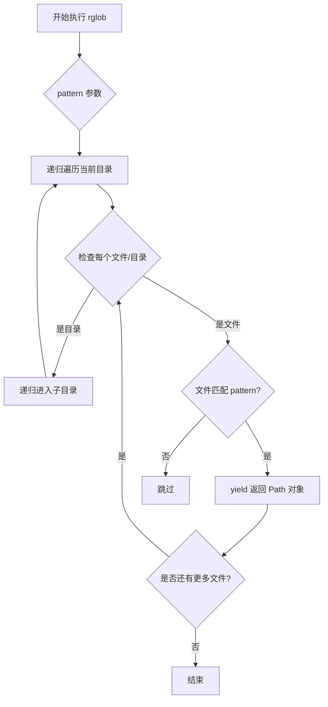

#### 带注释源码

```python
# 代码中的具体使用示例
# base_path 是 Path 对象，指向项目根目录
base_path = Path(__file__).resolve().parent.parent

# 使用 joinpath 构建 extensions 目录路径
extensions_dir = base_path.joinpath("markdown", "extensions")

# 调用 rglob 方法递归匹配所有 .py 文件
# 参数 "*.py" 表示匹配所有扩展名为 .py 的文件
# rglob 会递归遍历 extensions 目录及其所有子目录
py_files = extensions_dir.rglob("*.py")

# 使用 sorted 将生成器转换为排序后的列表
# 这在代码中用于确保模块的处理顺序一致
modules = [
    base_path.joinpath("markdown", "__init__.py"),
    # ... 其他显式指定的模块
    *sorted(base_path.joinpath("markdown", "extensions").rglob("*.py")),
]
```

#### 技术说明

| 项目 | 说明 |
|------|------|
| 方法类型 | `pathlib.Path` 类的实例方法 |
| Python 版本 | Python 3.4+ |
| 与 glob 的区别 | `glob` 只匹配当前目录，`rglob` 递归匹配所有子目录 |
| 返回类型 | 生成器（Generator[Path]），按需产生结果，节省内存 |


# 代码设计文档

## 核心功能概述

该代码是一个文档生成脚本，用于扫描项目中的 Markdown 相关模块文件，并通过 mkdocs_gen_files 库自动生成代码参考页面和导航结构。

---

### `sorted`

Python 内置的排序函数，用于对可迭代对象进行排序并返回排序后的新列表。

参数：

-  `iterable`：`iterable`，要排序的可迭代对象（在此代码中为 `base_path.joinpath("markdown", "extensions").rglob("*.py")` 返回的文件路径迭代器）
-  `key`：`function`，可选，用于指定排序依据的函数（此代码中未使用）
-  `reverse`：`bool`，可选，是否反向排序（此代码中未使用）

返回值：`list`，返回排序后的新列表

#### 流程图

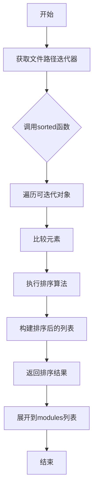

#### 带注释源码

```python
# 代码中的使用位置（第32行）
*sorted(base_path.joinpath("markdown", "extensions").rglob("*.py")),
#                              ↑
#                    sorted() 函数调用位置

# 完整上下文：
modules = [
    base_path.joinpath("markdown", "__init__.py"),
    base_path.joinpath("markdown", "preprocessors.py"),
    base_path.joinpath("markdown", "blockparser.py"),
    base_path.joinpath("markdown", "blockprocessors.py"),
    base_path.joinpath("markdown", "treeprocessors.py"),
    base_path.joinpath("markdown", "inlinepatterns.py"),
    base_path.joinpath("markdown", "postprocessors.py"),
    base_path.joinpath("markdown", "serializers.py"),
    base_path.joinpath("markdown", "util.py"),
    base_path.joinpath("markdown", "htmlparser.py"),
    base_path.joinpath("markdown", "test_tools.py"),
    *sorted(base_path.joinpath("markdown", "extensions").rglob("*.py")),
    # *sorted(...) 表示将排序后的结果展开为独立元素
    # rglob("*.py") 递归查找所有 .py 文件
    # sorted() 对文件路径列表进行字母顺序排序
]
```

---

## 补充信息

### 关键组件

| 组件名称 | 描述 |
|---------|------|
| `mkdocs_gen_files` | 用于在 MkDocs 构建过程中生成文件 |
| `Nav` | 导航对象，用于构建文档导航结构 |
| `base_path` | 项目根路径 |
| `modules` | 包含所有待处理模块文件路径的列表 |

### 技术债务与优化

1. **硬编码路径**：模块路径列表硬编码在代码中，若新增模块需手动添加
2. **异常处理缺失**：未对文件读取/写入可能出现的异常进行处理
3. **配置外部化**：`per_module_options` 可考虑抽取为独立配置文件

### 设计目标与约束

- **目标**：自动生成 Markdown 项目的 API 参考文档
- **约束**：依赖 mkdocs_gen_files 插件生态


### `modules` 列表

这是代码中定义的一个列表变量，包含了项目markdown模块的所有文件路径，用于后续遍历生成文档。

参数：无（这是一个列表定义，不是函数）

返回值：`list[Path]`，返回包含所有markdown模块路径的列表

#### 流程图

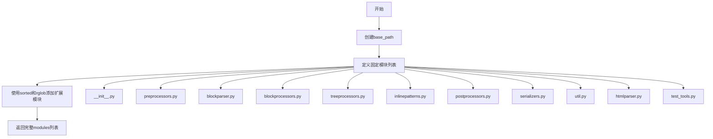

#### 带注释源码

```python
# 基础路径：获取当前文件所在目录的父目录的父目录
base_path = Path(__file__).resolve().parent.parent

# 定义需要生成文档的模块列表
# 这是一个列表推导式和展开操作的组合
modules = [
    # 核心模块 - 手动指定的具体模块路径
    base_path.joinpath("markdown", "__init__.py"),           # 初始化模块
    base_path.joinpath("markdown", "preprocessors.py"),     # 预处理模块
    base_path.joinpath("markdown", "blockparser.py"),      # 块解析器模块
    base_path.joinpath("markdown", "blockprocessors.py"),  # 块处理器模块
    base_path.joinpath("markdown", "treeprocessors.py"),    # 树处理器模块
    base_path.joinpath("markdown", "inlinepatterns.py"),    # 内联模式模块
    base_path.joinpath("markdown", "postprocessors.py"),    # 后处理器模块
    base_path.joinpath("markdown", "serializers.py"),       # 序列化模块
    base_path.joinpath("markdown", "util.py"),              # 工具模块
    base_path.joinpath("markdown", "htmlparser.py"),        # HTML解析模块
    base_path.joinpath("markdown", "test_tools.py"),        # 测试工具模块
    
    # 扩展模块 - 使用rglob递归查找并排序
    # *sorted(...) 展开运算符将排序后的迭代器展开为列表元素
    *sorted(base_path.joinpath("markdown", "extensions").rglob("*.py")),
]
```


### `mkdocs_gen_files.Nav`

该类是 MkDocs Gen Files 插件中的导航类，用于构建文档的导航结构。它允许通过类似字典的方式添加导航项，并能将导航结构生成为 MkDocs 兼容的列表格式。

参数：

- 无显式构造函数参数（`__init__` 不接受除 `self` 外的参数）

返回值：`Nav` 类实例

#### 流程图

```mermaid
flowchart TD
    A[创建 Nav 实例] --> B[通过 nav[key] = value 添加导航项]
    B --> C[调用 build_literate_nav 方法]
    C --> D[返回导航项列表]
    D --> E[写入 SUMMARY.md 文件]
    
    style A fill:#f9f,stroke:#333
    style D fill:#9f9,stroke:#333
```

#### 带注释源码

```python
# 导入 mkdocs_gen_files 模块
import mkdocs_gen_files

# 创建 Nav 导航类实例
# Nav 类用于管理 MkDocs 文档的导航结构
nav = mkdocs_gen_files.Nav()

# ... 代码中构建模块路径等逻辑 ...

# 使用 __setitem__ 方法添加导航项
# 语法: nav[nav_parts] = doc_path.as_posix()
# 参数:
#   - nav_parts: 导航项的路径部分列表，通常包含 HTML 格式的代码标签
#   - doc_path.as_posix(): 文档的相对路径（字符串格式）
nav[nav_parts] = doc_path.as_posix()

# ... 文件写入逻辑 ...

# 使用 build_literate_nav 方法生成导航内容
# 返回值类型: list[str]
# 返回值描述: 返回 MkDocs 兼容的导航项列表，每一项是一行文本
# 该列表直接用于 writelines 方法写入文件
with mkdocs_gen_files.open("reference/SUMMARY.md", "w") as nav_file:
    nav_file.writelines(nav.build_literate_nav())
```

#### 关键方法说明

| 方法名 | 用途 |
|--------|------|
| `__setitem__` | 通过 `nav[key] = value` 语法添加导航项 |
| `build_literate_nav` | 将导航结构生成为 Markdown 列表格式的文本行 |

#### 补充信息

- **设计目标**：提供一种简洁的 API 来构建复杂的文档导航结构
- **使用约束**：`nav_parts` 通常为包含 HTML `<code>` 标签的元组，用于在导航中显示模块路径
- **外部依赖**：依赖 `mkdocs_gen_files` 包的实际实现


### `mkdocs_gen_files.open()`

打开文件用于写入操作，返回文件对象供写入内容使用

参数：

-  `path`：`str` 或 `Path`，要打开的文件路径
-  `mode`：`str`，文件打开模式（如 "w" 表示写入）

返回值：`file-like object`，文件对象，支持写入操作（如 `write()`、`writelines()`）

#### 流程图

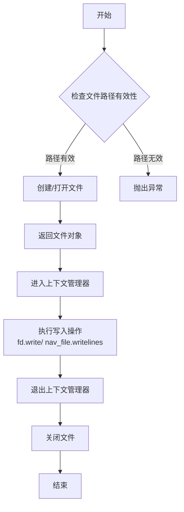

#### 带注释源码

```python
# 使用方式1：生成参考文档页面
with mkdocs_gen_files.open(full_doc_path, "w") as fd:
    # full_doc_path: Path对象，目标markdown文件路径
    # "w": 写入模式
    # fd: 返回的文件描述符，用于写入内容
    
    ident = ".".join(parts)  # 构建模块标识符，如 "markdown.util"
    fd.write(f"::: {ident}")  # 写入mermaid mkdocs的引用语法
    
    # 根据模块选项追加YAML配置
    if ident in per_module_options:
        yaml_options = yaml.dump({"options": per_module_options[ident]})
        fd.write(f"\n{textwrap.indent(yaml_options, prefix='    ')}")
    elif ident.startswith("markdown.extensions."):
        yaml_options = yaml.dump({"options": {"inherited_members": False}})
        fd.write(f"\n{textwrap.indent(yaml_options, prefix='    ')}")

# 使用方式2：生成SUMMARY导航文件
with mkdocs_gen_files.open("reference/SUMMARY.md", "w") as nav_file:
    # "reference/SUMMARY.md": 导航文件路径
    # "w": 写入模式
    # nav_file: 文件对象
    
    # 写入生成的导航结构
    nav_file.writelines(nav.build_literate_nav())
    # nav.build_literate_nav() 返回包含MkDocs导航语法的行列表
```

#### 说明

`mkdocs_gen_files.open()` 是 MkDocs Gen Files 插件提供的核心函数，用于在文档生成过程中动态创建或写入文件。该函数：

1. **上下文管理器**：支持 `with` 语句，自动管理文件生命周期
2. **路径处理**：接受 `str` 或 `Path` 对象作为文件路径
3. **模式支持**：常用模式包括 `"w"`（写入）、`"a"`（追加）等
4. **集成功能**：自动处理 MkDocs 插件系统的文件注册和编辑路径设置


# mkdocs_gen_files.set_edit_path()

## 描述

`set_edit_path()` 是 mkdocs-gen-files 模块中的一个函数，用于为生成的文档页面设置编辑链接路径。这个函数允许 MkDocs 插件在生成文档时指定对应源文件的编辑链接，使用户能够直接从文档页面跳转到源代码进行编辑。

## 参数

- `doc_path`：`Path`，目标文档的路径，通常是相对于文档根目录的路径（如 `reference/module.md`）
- `edit_path`：`Path`，指向源文件的编辑路径，通常是相对于文档目录的路径（如 `../markdown/module.py`）

## 返回值

`None`，该函数没有返回值，仅修改全局的编辑路径映射

## 流程图

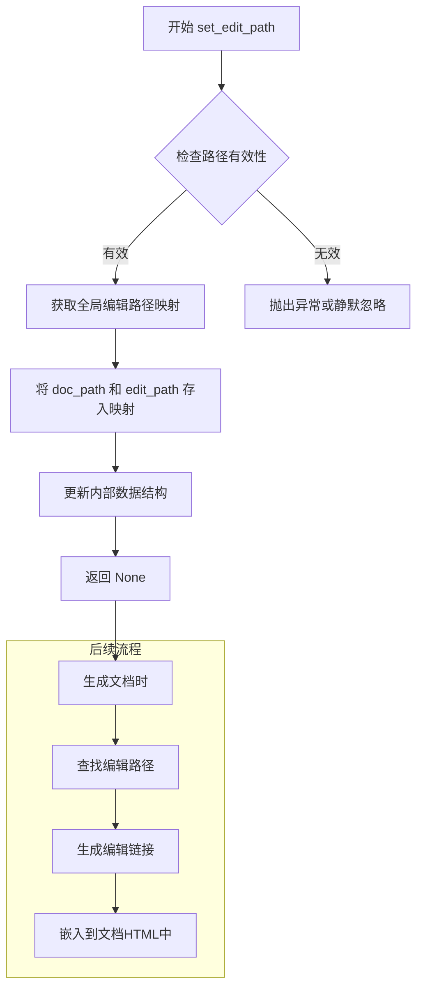

## 带注释源码

```python
# mkdocs_gen_files 模块中 set_edit_path 函数的典型实现

# 全局变量：用于存储文档路径到编辑路径的映射
_edit_paths = {}

def set_edit_path(doc_path: Path, edit_path: Path) -> None:
    """
    设置文档的编辑路径
    
    参数:
        doc_path: 目标文档的路径 (Path对象)
            - 例如: Path("reference/markdown/index.md")
            - 用于标识需要设置编辑链接的文档
        
        edit_path: 指向源文件的编辑路径 (Path对象)
            - 例如: Path("../markdown/__init__.py")
            - 通常是相对于文档目录的相对路径
            - 也可以是绝对路径或URL
    
    返回值:
        None: 此函数不返回任何值
    
    说明:
        - 该函数将 doc_path 和 edit_path 的对应关系存储到全局字典中
        - 在生成文档时，MkDocs 主题会检查此映射并生成编辑链接
        - 编辑链接通常显示在文档页面底部，标为"Edit this page"
    """
    # 将 Path 对象转换为字符串作为字典键
    # 确保路径格式一致，便于后续查找
    doc_path_str = str(doc_path)
    edit_path_str = str(edit_path)
    
    # 存储到全局字典
    _edit_paths[doc_path_str] = edit_path_str


# 调用示例（来自用户提供的代码）
# 为 reference/markdown/index.md 设置编辑路径为 ../markdown/__init__.py
mkdocs_gen_files.set_edit_path(full_doc_path, ".." / path)
```


### `yaml.dump()`

YAML 序列化函数，用于将 Python 对象转换为 YAML 格式的字符串，常用于生成 MkDocs 文档的配置选项。

参数：

- `data`：`Any`，需要序列化的 Python 对象（字典、列表等），在代码中为包含选项信息的字典
- `stream`（可选）：`TextIO`，可选的文件对象，如果提供则写入文件，否则返回字符串

返回值：`str`，返回 YAML 格式的字符串表示

#### 流程图

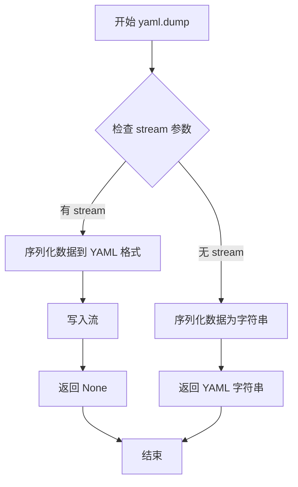

#### 带注释源码

```python
# yaml.dump() 在本项目中的两次使用：

# 第一次使用：序列化模块特定选项
# per_module_options[ident] 获取当前模块的配置选项字典
# 然后使用 yaml.dump() 将其转换为 YAML 格式字符串
yaml_options = yaml.dump({"options": per_module_options[ident]})

# 第二次使用：序列化扩展的默认选项
# 为 markdown.extensions 开头的模块设置默认的 inherited_members 选项
# 使用 yaml.dump() 将选项字典序列化为 YAML 格式
yaml_options = yaml.dump({"options": {"inherited_members": False}})

# 两种用法都使用了 textwrap.indent() 格式化后写入 MkDocs 参考文档
fd.write(f"\n{textwrap.indent(yaml_options, prefix='    ')}")
```

#### 详细说明

| 使用场景 | 输入数据 | 输出格式 |
|---------|---------|---------|
| 模块特定选项 | `{"options": {"markdown": {"summary": {...}}}}` | YAML 字符串 |
| 扩展默认选项 | `{"options": {"inherited_members": False}}` | YAML 字符串 |

**在代码中的作用**：该函数将 Python 字典对象转换为 YAML 格式，用于生成 MkDocs 文档页面中的 `::: {identifier}` 块配置，使 mkdocs-gen-files 插件能够正确识别并渲染代码参考文档的选项。


### `textwrap.indent`

`textwrap.indent()` 是 Python 标准库 `textwrap` 模块中的一个函数，用于为字符串的每一行添加指定的前缀（缩进）。

参数：

-  `text`：`str`，需要添加缩进的文本字符串
-  `prefix`：`str`，要添加到每一行开头的前缀字符串
-  `predicate`：`Callable[[str], bool] | None`（可选），一个可选的回调函数，用于决定哪些行应该被缩进。如果为 `None`，则所有行都会被添加前缀

返回值：`str`，返回添加前缀后的新字符串

#### 流程图

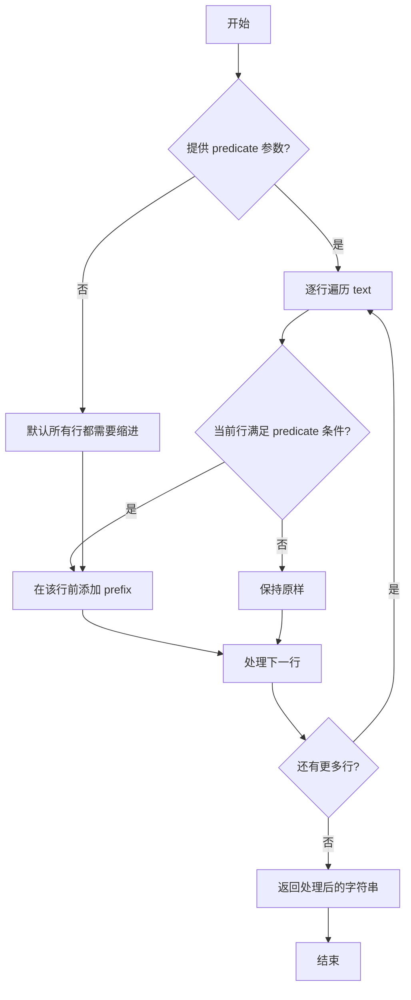

#### 带注释源码

```python
def indent(text, prefix, predicate=None):
    """
    为 text 中的每一行添加 prefix 前缀。
    
    参数:
        text: 需要添加缩进的字符串
        prefix: 要添加到每行开头的前缀
        predicate: 可选函数，用于决定哪些行需要缩进
    
    返回:
        添加前缀后的新字符串
    """
    if predicate is None:
        # 如果没有提供 predicate，默认对所有行添加前缀
        def predicate(line):
            return True
    
    # 将文本按行分割
    lines = text.splitlines(True)  # keepends=True 保留换行符
    
    # 遍历每一行，根据 predicate 条件决定是否添加前缀
    indented_lines = []
    for line in lines:
        if predicate(line):
            indented_lines.append(prefix + line)
        else:
            indented_lines.append(line)
    
    # 合并所有行并返回
    return ''.join(indented_lines)
```

#### 在项目代码中的实际使用

在提供的代码中，`textwrap.indent()` 被用于为 YAML 配置选项添加缩进：

```python
# 第一次使用：为模块选项添加缩进
if ident in per_module_options:
    yaml_options = yaml.dump({"options": per_module_options[ident]})
    fd.write(f"\n{textwrap.indent(yaml_options, prefix='    ')}")
# prefix='    ' 表示在每一行前添加 4 个空格

# 第二次使用：为扩展选项添加缩进
elif ident.startswith("markdown.extensions."):
    yaml_options = yaml.dump({"options": {"inherited_members": False}})
    fd.write(f"\n{textwrap.indent(yaml_options, prefix='    ')}")
```

这里 `textwrap.indent()` 的作用是将 YAML 输出的多行字符串整体向右缩进 4 个空格，以符合 MkDocs 文档的配置格式要求。


### `str.writelines()`

写入多行内容到文件对象。该方法接收一个可迭代对象（通常是字符串列表），将其中的每个元素作为一行写入文件，不自动添加换行符。

参数：

-  `lines`：`Iterable[str]`，要写入的文件行内容列表，每项应为字符串
-  `nav_file`：`TextIOWrapper`，通过 `mkdocs_gen_files.open()` 打开的文件对象

返回值：`None`，无返回值，直接修改文件内容

#### 流程图


#### 带注释源码

```python
# 代码片段：使用writelines写入导航文件
# 上下文：生成MkDocs文档的SUMMARY.md导航文件

# 打开目标文件用于写入（创建或覆盖）
with mkdocs_gen_files.open("reference/SUMMARY.md", "w") as nav_file:
    # 调用writelines方法写入多行
    # 参数：nav.build_literate_nav() 返回一个字符串列表
    # 该列表包含了MkDocs文档的导航结构
    nav_file.writelines(nav.build_literate_nav())

# writelines方法内部实现原理：
# def writelines(self, lines):
#     """Write a list of lines to the file."""
#     for line in lines:
#         # 逐行写入，不自动添加换行符
#         # 需要调用者确保line中包含必要的换行符
#         self.write(line)
#     # 返回None
```

## 关键组件


### Nav导航对象

MkDocs Gen Files的Nav类实例，用于构建文档的导航结构，支持通过层级键值对添加导航项。

### per_module_options配置字典

存储每个模块的特定选项配置，定义了markdown文档的摘要选项（attributes、functions、classes）。

### base_path基础路径

通过Path.resolve().parent.parent获取的项目根目录路径，用于定位所有markdown模块文件。

### modules模块列表

包含所有需要生成文档的Python模块文件路径列表，涵盖markdown核心模块及扩展模块。

### 模块遍历与文档生成逻辑

遍历modules列表中的每个Python源文件，生成对应的MkDocs文档引用页面，包括处理__init__模块和私有模块的特殊逻辑。

### nav_parts导航项构建

将模块路径的各部分用`<code>`标签包装，用于在导航中显示代码风格的项目名称。

### 文档写入与选项注入

使用mkdocs_gen_files.open()写入文档内容，注入模块标识符和YAML格式的选项配置，支持模块特定选项和扩展继承选项。

### SUMMARY.md生成

通过nav.build_literate_nav()构建 literate 风格的导航，并写入reference/SUMMARY.md文件供MkDocs生成目录。

## 问题及建议


### 已知问题

-   **硬编码的模块列表**：模块路径列表是硬编码的，如果项目结构变化或添加新模块，需要手动更新代码，缺乏灵活性。
-   **不完整的配置覆盖**：`per_module_options` 字典仅包含两个模块的配置，其余模块均采用默认配置，可能导致部分模块文档生成不符合预期。
-   **缺乏错误处理**：代码未对文件不存在、路径解析失败等情况进行异常捕获，当指定模块缺失时会导致整个脚本失败。
-   **魔法字符串**：`"markdown.extensions."` 等字符串硬编码在逻辑中，降低了代码可维护性。
-   **重复的 YAML 配置写入逻辑**：生成 `yaml_options` 的代码逻辑在两个分支中重复，未实现复用。
-   **缺少类型注解**：参数和返回值均无类型标注，影响代码可读性和静态分析工具的效能。
-   **依赖私有方法**：`nav.build_literate_nav()` 调用了可能属于内部实现的私有方法，存在 API 稳定性风险。

### 优化建议

-   将模块列表改为动态发现或外部配置，例如扫描 `base_path` 下的所有 Python 文件，或从配置文件读取模块列表。
-   完善 `per_module_options` 配置，对所有需要特殊处理的模块进行覆盖，或提供默认配置模板。
-   添加 try-except 块处理文件读取、路径解析等可能失败的环节，提升脚本健壮性。
-   提取常量定义，如将 `"markdown.extensions."` 等字符串定义为常量。
-   重构 YAML 配置生成逻辑，抽取公共函数以消除重复代码。
-   为函数参数、返回值添加类型注解，提升代码可读性。
-   考虑使用 `mkdocs_gen_files` 公开的 API 构建导航，或添加版本兼容检查应对 API 变化。

## 其它


### 设计目标与约束

该脚本的主要设计目标是自动化生成 MkDocs 文档系统的代码参考页面和导航结构。约束条件包括：1）仅处理 Python 模块文件（.py）；2）跳过以单下划线（_）开头的模块；3）生成的文档路径基于模块路径转换而来；4）依赖 mkdocs_gen_files、yaml、textwrap 和 pathlib 等标准/第三方库。

### 错误处理与异常设计

代码采用较为简单的错误处理策略：1）使用 Path.resolve() 确保路径解析为绝对路径；2）relative_to() 可能抛出 ValueError 如果路径不在 base_path 下；3）文件写入操作使用 with 语句确保资源正确释放；4）对于无效的模块路径，依赖 Python 的异常传播机制向上抛出。目前缺乏对文件读取失败、权限问题等的专门捕获和处理。

### 数据流与状态机

数据流主要遵循以下路径：1）定义基础路径 base_path；2）构建待处理模块列表 modules；3）遍历每个模块，生成对应的文档路径；4）构建导航项（nav_parts）；5）写入文档内容（使用 mkdocs_gen_files.open）；6）最后生成 SUMMARY.md 导航文件。不存在复杂的状态机，仅有线性处理流程。

### 外部依赖与接口契约

主要外部依赖包括：1）mkdocs_gen_files - 提供 Nav 类、open()、set_edit_path() 等函数用于文档生成；2）yaml - 用于生成 YAML 配置选项；3）textwrap - 用于格式化 YAML 输出缩进；4）pathlib.Path - 用于路径操作。接口契约方面：mkdocs_gen_files.open() 接受相对文档路径和写入模式；nav.build_literate_nav() 返回可迭代的导航行列表。

### 性能考虑

当前实现的主要性能考量：1）使用 rglob 递归扫描扩展目录可能产生较多文件 I/O；2）sorted() 对文件列表进行排序增加了时间复杂度；3）每个模块独立打开文件写入，I/O 次数等于模块数量。可考虑批量写入、缓存模块列表、使用生成器优化内存。

### 安全性考虑

代码主要涉及文件读取和写入操作，安全考量包括：1）base_path 通过 resolve() 规范化路径，防止路径遍历攻击；2）生成的文档路径基于模块路径转换，理论上可控；3）未对模块内容进行任何解析或执行，风险较低。建议增加路径验证逻辑，确保生成的文档路径不越界。

### 配置说明

per_module_options 字典提供模块级配置，目前仅针对 "markdown" 根模块配置了 summary 显示选项（attributes、functions、classes）。对于 markdown.extensions.* 子模块，默认设置 inherited_members: False。该配置通过 YAML 格式写入生成的文档文件，mkdocs-gen-files 插件会读取并应用这些选项。

### 测试策略

当前代码未包含任何测试。建议添加以下测试：1）模块列表生成的单元测试，验证包含预期模块；2）路径转换逻辑测试，验证 .py 到 .md 的正确转换；3）导航构建测试，验证 nav.build_literate_nav() 输出格式；4）边界条件测试，如空模块列表、单下划线模块过滤等。

### 部署相关

该脚本作为开发/文档构建工具使用，不涉及运行时部署。部署时应确保：1）目标环境已安装 mkdocs-gen-files、PyYAML 等依赖；2）base_path 正确指向项目根目录；3）通常在 MkDocs 构建流程中调用（通过 mkdocs.yml 配置或手动执行）。

### 版本兼容性

代码使用 Python 3.x 语法（pathlib、类型注解风格参数），兼容 Python 3.6+。依赖库版本要求：mkdocs-gen-files（建议最新稳定版）、PyYAML（3.x+）。未对 Python 2 提供兼容性支持。

    