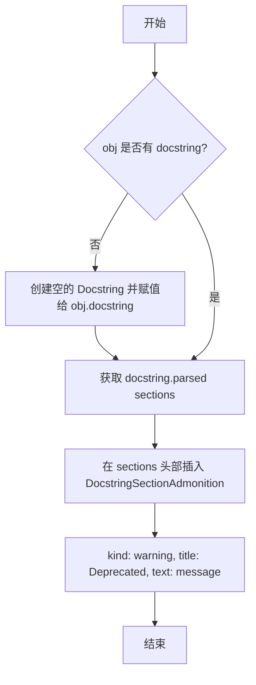

# `markdown\scripts\griffe_extensions.py` 详细设计文档

这是一个Griffe库的扩展模块，提供两个扩展类：一个用于检测并标记markdown.util.deprecated装饰器标记的弃用类和函数，另一个用于在指定函数的文档字符串中自动生成处理器优先级的表格。

## 整体流程

```mermaid
graph TD
    A[开始] --> B{解析Python AST}
    B --> C{遍历所有类和函数}
    C --> D{检查DeprecatedExtension}
    D --> E{检测@deprecated装饰器?}
    E -- 是 --> F[_insert_message添加警告说明]
    E -- 否 --> G{继续}
    F --> H[添加deprecated标签]
    G --> I{检查PriorityTableExtension}
    I --> J{函数路径在paths中?}
    J -- 是 --> K[解析函数体AST]
    J -- 否 --> L[跳过]
    K --> M{查找Registry.register调用}
    M -- 是 --> N[提取类名/名称/优先级]
    M -- 否 --> O[继续]
    N --> P[构建优先級表格]
    P --> Q[添加到文档字符串]
    O --> R[结束]
    L --> R
```

## 类结构

```
Extension (Griffe基类)
├── DeprecatedExtension
│   ├── _insert_message()
│   ├── on_class_instance()
│   └── on_function_instance()
└── PriorityTableExtension
    ├── __init__()
    ├── linked_obj()
    └── on_function_instance()
```

## 全局变量及字段


### `_deprecated`
    
模块级函数，用于检查对象是否带有@markdown.util.deprecated装饰器，若有则返回弃用消息

类型：`Callable[[Class | Function], str | None]`
    


### `PriorityTableExtension.paths`
    
可选的参数，指定需要插入优先级表的函数路径列表

类型：`list[str] | None`
    


### `DeprecatedExtension.DeprecatedExtension`
    
继承自Extension的子类，用于处理@markdown.util.deprecated装饰器，无显式字段

类型：`class`
    


### `PriorityTableExtension.PriorityTableExtension`
    
继承自Extension的子类，用于在指定函数的文档字符串中插入处理器优先级表，包含paths字段

类型：`class`
    
    

## 全局函数及方法


### `_deprecated`

该函数用于检测给定的类或函数是否使用了 `@markdown.util.deprecated` 装饰器，如果使用了，则提取并返回其中的弃用消息字符串。

参数：

-  `obj`：`Class | Function`，待检测的 Griffe 类或函数对象，用于检查其是否带有弃用装饰器

返回值：`str | None`，如果对象使用了 `@markdown.util.deprecated` 装饰器，则返回装饰器中定义的弃用消息；否则返回 `None`

#### 流程图

```mermaid
flowchart TD
    A[开始 _deprecated] --> B[遍历 obj.decorators]
    B --> C{是否还有未检查的装饰器}
    C -->|是| D{decorator.callable_path == 'markdown.util.deprecated'}
    C -->|否| H[返回 None]
    D -->|是| E[获取 decorator.value.arguments[0]]
    E --> F[使用 ast.literal_eval 解析参数值]
    F --> G[返回解析后的消息字符串]
    D -->|否| B
```

#### 带注释源码

```python
def _deprecated(obj: Class | Function) -> str | None:
    """检测并提取对象上 @markdown.util.deprecated 装饰器的消息。
    
    参数:
        obj: Griffe 的 Class 或 Function 对象
        
    返回:
        如果对象使用了 @markdown.util.deprecated 装饰器，
        返回该装饰器的第一个参数（弃用消息）；
        如果未使用该装饰器则返回 None。
    """
    # 遍历对象的所有装饰器
    for decorator in obj.decorators:
        # 检查装饰器的调用路径是否为指定的弃用装饰器
        if decorator.callable_path == "markdown.util.deprecated":
            # 获取装饰器的第一个参数值并将其转换为字符串
            # 然后使用 ast.literal_eval 安全地解析为 Python 对象（通常是字符串）
            return ast.literal_eval(str(decorator.value.arguments[0]))
    # 未找到匹配的装饰器，返回 None
    return None
```


### `DeprecatedExtension._insert_message`

该方法用于向已弃用的类或函数的文档字符串中插入一个警告提示（Deprecated admonition），将弃用信息添加到文档的最前面。

参数：

- `obj`：`Function | Class`，目标对象，可以是函数或类实例
- `message`：`str`，要插入的弃用说明信息

返回值：`None`，该方法直接修改对象的 `docstring` 属性，不返回任何值

#### 流程图



#### 带注释源码

```python
def _insert_message(self, obj: Function | Class, message: str) -> None:
    """向对象的文档字符串中插入弃用警告信息。
    
    Args:
        obj: Griffe 的 Function 或 Class 对象，用于添加弃用说明
        message: 弃用消息文本，将显示在警告框中
    
    Returns:
        None: 直接修改传入对象的 docstring 属性，无返回值
    """
    # 检查对象是否已有文档字符串
    if not obj.docstring:
        # 如果没有文档字符串，创建一个空的 Docstring 对象
        # parent 参数指向当前对象，建立关联关系
        obj.docstring = Docstring("", parent=obj)
    
    # 获取文档字符串的解析后章节列表
    sections = obj.docstring.parsed
    
    # 在章节列表的最前面插入弃用警告框
    # kind="warning" 表示这是一个警告类型的提示
    # title="Deprecated" 作为警告框的标题
    # text=message 是具体的弃用说明内容
    sections.insert(
        0,  # 插入到列表开头，确保在文档最显眼的位置显示
        DocstringSectionAdmonition(
            kind="warning",    #  admonition 类型为 warning
            text=message,     #  弃用消息内容
            title="Deprecated" #  标题显示为 "Deprecated"
        )
    )
```


### `DeprecatedExtension.on_class_instance`

为带有 `@markdown.util.deprecated` 装饰器的类添加弃用警告到文档字符串中，并标记为已弃用。

参数：

- `node`：`ast.AST | ObjectNode`，AST 节点或 Griffe 对象节点，表示类的源代码 AST 或对象树节点
- `cls`：`Class`，Griffe Class 对象，表示正在检查的类
- `agent`：`Visitor | Inspector`，访问者或检查器实例，用于遍历代码结构
- `**kwargs`：`Any`，其他可选关键字参数（当前未使用）

返回值：`None`，该方法无返回值，仅修改传入的类对象的文档字符串和标签

#### 流程图

```mermaid
flowchart TD
    A[开始 on_class_instance] --> B{调用 _deprecated(cls)}
    B -->|有装饰器| C[获取弃用消息]
    B -->|无装饰器| D[结束]
    C --> E{检查是否有消息}
    E -->|有消息| F[调用 _insert_message 插入警告]
    E -->|无消息| D
    F --> G[添加 'deprecated' 标签到 cls.labels]
    G --> D
```

#### 带注释源码

```python
def on_class_instance(
    self,
    node: ast.AST | ObjectNode,
    cls: Class,
    agent: Visitor | Inspector,
    **kwargs: Any  # noqa: ARG002
) -> None:
    """Add section to docstrings of deprecated classes."""
    # 使用 walrus operator 检查类是否有弃用装饰器消息
    if message := _deprecated(cls):
        # 调用内部方法将弃用警告插入到文档字符串开头
        self._insert_message(cls, message)
        # 为类添加 'deprecated' 标签，用于后续识别和处理
        cls.labels.add("deprecated")
```


### DeprecatedExtension.on_function_instance

为带有 `@markdown.util.deprecated` 装饰器的函数添加弃用警告文档片段，并将 "deprecated" 标签添加到函数元数据中。

参数：

- `node`：`ast.AST | ObjectNode`，AST 节点或对象节点，表示函数的抽象语法树结构
- `func`：`Function`，Griffe 函数对象，表示被检查的函数
- `agent`：`Visitor | Inspector`，访问者或检查器代理，用于遍历和检查代码
- `**kwargs`：`Any`，额外的关键字参数（当前未使用）

返回值：`None`，该方法直接修改传入的 `func` 对象，不返回任何值

#### 流程图

```mermaid
flowchart TD
    A[开始 on_function_instance] --> B{message := _deprecated(func)}
    B -->|有弃用消息| C[_insert_message func, message]
    B -->|无弃用消息| E[结束]
    C --> D[func.labels.add 'deprecated']
    D --> E
```

#### 带注释源码

```python
def on_function_instance(
    self,
    node: ast.AST | ObjectNode,
    func: Function,
    agent: Visitor | Inspector,
    **kwargs: Any
) -> None:  # noqa: ARG002
    """Add section to docstrings of deprecated functions."""
    # 调用 _deprecated 辅助函数检查函数是否带有 @markdown.util.deprecated 装饰器
    # 如果存在装饰器，则返回装饰器消息；否则返回 None
    if message := _deprecated(func):
        # 如果检测到弃用标记，则调用 _insert_message 方法
        # 在函数的 docstring 开头插入一个警告类型的文档片段
        self._insert_message(func, message)
        # 为函数添加 "deprecated" 标签，用于后续筛选和处理
        func.labels.add("deprecated")
```

#### 关联的辅助函数

**`_deprecated`**

```python
def _deprecated(obj: Class | Function) -> str | None:
    """检查对象是否带有 @markdown.util.deprecated 装饰器并返回消息。
    
    参数：
        - obj: Class | Function，要检查的类或函数对象
        
    返回值：
        - str | None，如果存在弃用装饰器则返回消息字符串，否则返回 None
    """
    for decorator in obj.decorators:
        # 检查装饰器的调用路径是否为 "markdown.util.deprecated"
        if decorator.callable_path == "markdown.util.deprecated":
            # 使用 ast.literal_eval 解析装饰器第一个参数的值（弃用消息）
            return ast.literal_eval(str(decorator.arguments[0]))
    return None
```

**`_insert_message`**

```python
def _insert_message(self, obj: Function | Class, message: str) -> None:
    """将弃用警告插入到对象 docstring 的开头。
    
    参数：
        - obj: Function | Class，要添加警告的函数或类对象
        - message: str，弃用警告消息内容
        
    返回值：
        - None
    """
    # 如果对象没有 docstring，则创建一个空的新 Docstring 对象
    if not obj.docstring:
        obj.docstring = Docstring("", parent=obj)
    # 获取已解析的文档部分列表
    sections = obj.docstring.parsed
    # 在文档开头插入警告类型的 admonition 片段
    sections.insert(0, DocstringSectionAdmonition(kind="warning", text=message, title="Deprecated"))
```


### `PriorityTableExtension.__init__`

这是 `PriorityTableExtension` 类的构造函数，用于初始化扩展实例，过滤需要处理的目标函数路径。

参数：

- `self`：实例对象，隐式参数，表示类的当前实例
- `paths`：`list[str] | None`，可选参数，用于指定需要添加优先级表的函数路径列表。如果为 `None`，则处理所有函数。

返回值：`None`，构造函数无返回值。

#### 流程图

```mermaid
flowchart TD
    A[开始 __init__] --> B[调用 super().__init__ 初始化基类 Extension]
    B --> C[将 paths 参数赋值给 self.paths 实例变量]
    C --> D[结束 __init__]
```

#### 带注释源码

```python
def __init__(self, paths: list[str] | None = None) -> None:
    """初始化 PriorityTableExtension 实例。
    
    参数:
        paths: 可选的函数路径列表，用于过滤目标函数。
               如果为 None，则处理所有函数。
    """
    # 调用父类 Extension 的初始化方法
    super().__init__()
    
    # 存储路径过滤器到实例变量，供后续 on_function_instance 方法使用
    self.paths = paths
```


### `PriorityTableExtension.linked_obj`

将对象名称包装为 Markdown 引用链接格式，用于在文档中生成可点击的交叉引用链接。

参数：

- `value`：`str`，要链接的对象名称（如类名、函数名）
- `path`：`str`，对象所在的模块路径（不含对象名本身）

返回值：`str`，Markdown 格式的引用链接字符串，格式为 `` [`{value}`][{path}.{value}] ``

#### 流程图

```mermaid
flowchart TD
    A[开始] --> B[接收 value 和 path 参数]
    B --> C[格式化链接字符串]
    C --> D[返回 Markdown 引用链接]
    
    subgraph 格式化逻辑
    C1["`f'[\`{value}\`][{path}.{value}]'`"]
    end
    
    D --> E[结束]
```

#### 带注释源码

```python
def linked_obj(self, value: str, path: str) -> str:
    """ Wrap object name in reference link. """
    # 该方法接受两个参数：
    # - value: 要链接的对象名称（字符串）
    # - path: 对象所属的路径（不包含对象名本身）
    #
    # 返回格式为 Markdown 链接语法：
    # [`对象名`][路径.对象名]
    # 例如：[`MyClass`][module.submodule.MyClass]
    # 这种格式可以与 MkDocs 或其他文档工具的交叉引用系统配合使用
    return f'[`{value}`][{path}.{value}]'
```


### `PriorityTableExtension.on_function_instance`

为指定函数（如 `build_inlinepatterns`）的文档字符串添加一个优先级表，该表从函数源码中提取通过 `util.Registry.register` 注册的类实例信息，包括类实例、名称和优先级。

参数：

- `node`：`ast.AST | ObjectNode`，AST 节点或对象节点，表示函数的抽象语法树结构
- `func`：`Function`，Griffe 函数对象，包含函数元数据（如路径、名称、返回值等）
- `agent`：`Visitor | Inspector`，访问者或检查器代理对象，用于遍历和检查代码
- `**kwargs`：`Any`，可选的额外关键字参数（此处未使用，仅为扩展接口兼容）

返回值：`None`，该方法直接修改传入的 `func` 对象的 `docstring` 属性，不返回任何值

#### 流程图

```mermaid
flowchart TD
    A[开始 on_function_instance] --> B{self.paths 存在且 func.path 不在 paths 中?}
    B -->|是| C[直接返回，跳过处理]
    B -->|否| D[初始化表格数据 - 表头]
    D --> E[遍历 node.body 中的每个 AST 节点]
    E --> F{当前节点是 Expr 且是 register 调用?}
    F -->|否| E
    F -->|是| G[提取 register 的三个参数: 类实例、名称、优先级]
    H{func.name == 'build_inlinepatterns'?}
    H -->|否| I[直接使用类实例名]
    H -->|是| J{第一个参数是常量字符串?}
    J -->|是| K[格式化为字符串常量]
    J -->|否| L[格式化为链接变量]
    K --> M[拼接类实例和模式]
    L --> M
    M --> N[添加表格行: 类实例 | 名称 | 优先级]
    N --> E
    E --> O[将表格数据用换行符连接成表格字符串]
    O --> P[构建文档字符串 body 内容]
    P --> Q{func.docstring 存在?}
    Q -->|否| R[创建新的 Docstring 对象]
    Q -->|是| S[获取现有 parsed sections]
    R --> S
    S --> T[在 sections 末尾添加 Priority Table 小节]
    T --> U[结束]
```

#### 带注释源码

```python
def on_function_instance(
    self,
    node: ast.AST | ObjectNode,
    func: Function,
    agent: Visitor | Inspector,
    **kwargs: Any
) -> None:  # noqa: ARG002
    """Add table to specified function docstrings."""
    # 如果配置了 paths 且当前函数不在指定路径中，则跳过处理
    if self.paths and func.path not in self.paths:
        return  # skip objects that were not selected

    # 初始化表格数据，包含 Markdown 表格表头
    # 表头: Class Instance | Name | Priority
    data = [
        'Class Instance | Name | Priority',
        '-------------- | ---- | :------:'
    ]

    # 遍历函数体中的每个 AST 节点，提取 register 调用信息
    # Extract table body from source code of function.
    for obj in node.body:
        # 只处理表达式语句且是函数调用的情况
        # Extract the arguments passed to `util.Registry.register`.
        if isinstance(obj, ast.Expr) and isinstance(obj.value, ast.Call) and obj.value.func.attr == 'register':
            # 提取调用参数: [类实例, 名称, 优先级]
            _args = obj.value.args
            
            # 将类实例格式化为引用链接形式
            # 例如: [ClassName][module.path.ClassName]
            cls = self.linked_obj(_args[0].func.id, func.path.rsplit('.', 1)[0])
            
            # 提取名称和优先级值
            name = _args[1].value
            priority = str(_args[2].value)
            
            # 针对 build_inlinepatterns 函数，需要额外处理模式参数
            if func.name == ('build_inlinepatterns'):
                # Include Pattern: first arg passed to class
                # 检查类构造函数的第一个参数是否为字符串常量
                if isinstance(_args[0].args[0], ast.Constant):
                    # Pattern is a string
                    # 格式化为带引号的字符串常量
                    value = f'`"{_args[0].args[0].value}"`'
                else:
                    # Pattern is a variable
                    # 格式化为引用链接形式
                    value = self.linked_obj(_args[0].args[0].id, func.path.rsplit('.', 1)[0])
                
                # 在类实例后添加模式信息
                cls = f'{cls}({value})'
            
            # 添加表格行，使用反引号格式化名称和优先级
            data.append(f'{cls} | `{name}` | `{priority}`')

    # 将表格数据用换行符连接成完整的 Markdown 表格
    table = '\n'.join(data)
    
    # 构建文档字符串主体内容，包含返回值类型说明和表格
    body = (
        f"Return a [`{func.returns.canonical_name}`][{func.returns.canonical_path}] instance which contains "
        "the following collection of classes with their assigned names and priorities.\n\n"
        f"{table}"
    )

    # 将生成的表格添加到函数的文档字符串中
    # Add to docstring.
    # 如果函数没有文档字符串，则创建一个新的空文档字符串
    if not func.docstring:
        func.docstring = Docstring("", parent=func)
    
    # 获取已解析的文档字符串小节列表
    sections = func.docstring.parsed
    
    # 在小节列表末尾添加优先级表文本小节
    sections.append(DocstringSectionText(body, title="Priority Table"))
```

## 关键组件


### DeprecatedExtension

Griffe 扩展类，用于检测并为标记有 `@markdown.util.deprecated` 装饰器的类和函数添加弃用警告文档。

### PriorityTableExtension

Griffe 扩展类，用于在指定函数的文档字符串中自动插入处理器优先级表格，展示 Registry 注册的类实例及其优先级。

### _deprecated(obj) 

辅助函数，用于检查对象是否应用了 `@markdown.util.deprecated` 装饰器，并提取其中的弃用消息文本。

### DocstringSectionAdmonition

用于在文档字符串中插入警告类型的 admonition 区块，展示弃用提示信息。

### DocstringSectionText

用于向文档字符串追加文本内容块，此处用于插入优先级表格内容。

### linked_obj(value, path) 

方法，用于将对象名称包装成 Markdown 参考链接格式，便于文档中跨索引引用。

### AST 解析逻辑

通过 AST 遍历函数体，提取 `util.Registry.register` 调用的参数，用于构建优先级表格数据。

### Visitor/Inspector 机制

Griffe 框架的扩展钩子机制，通过 `on_class_instance` 和 `on_function_instance` 回调实现对类和函数的动态处理。


## 问题及建议


### 已知问题

-   **硬编码的装饰器路径**：`DeprecatedExtension` 中 `_deprecated` 函数直接硬编码了 `"markdown.util.deprecated"` 字符串，降低了扩展的可复用性。
-   **硬编码的函数名判断**：`PriorityTableExtension` 中使用 `func.name == ('build_inlinepatterns')` 进行条件判断，函数名被硬编码在代码中，不便于配置和扩展。
-   **AST 解析缺乏健壮性**：多处直接访问 `_args[0].func.id`、`_args[1].value`、`_args[2].value` 等嵌套属性，未进行空值或类型检查，可能导致 `AttributeError`。例如 `_args[0].func.id` 假设 `func` 总是有 `id` 属性，但实际可能不存在。
-   **字符串拼接构造文档**：使用 f-string 和字符串拼接构造文档内容，缺乏对特殊字符的转义处理，可能导致生成的 Markdown 格式错误。
-   **重复的 docstring 初始化逻辑**：`_insert_message` 方法和 `on_function_instance` 方法中都有 `if not obj.docstring: obj.docstring = Docstring("", parent=obj)` 的重复代码。
-   **类型注解不完整**：`linked_obj` 方法返回类型注解为 `str`，但实际可能返回包含无效 Markdown 链接格式的字符串。
-   **缺少边界检查**：在访问 `_args` 列表元素时未检查索引是否有效，如 `_args[0]`, `_args[1]`, `_args[2]` 的访问均未验证列表长度。
-   **魔法数字和字符串**：优先级表中使用 `rsplit('.', 1)[0]` 分割路径，依赖特定的命名约定，缺乏明确的常量定义。

### 优化建议

-   **配置化改造**：将装饰器路径 `"markdown.util.deprecated"` 和函数名 `"build_inlinepatterns"` 改为构造函数参数或配置选项，提升扩展的通用性。
-   **增加空值和类型检查**：在 AST 解析部分增加 `hasattr` 检查或 `try-except` 异常处理，确保访问属性前确认其存在性。
-   **提取公共方法**：将 docstring 初始化的重复逻辑提取为基类方法或工具函数，避免代码重复。
-   **使用安全的字符串处理**：考虑使用专门的 Markdown 渲染库或正则表达式来处理特殊字符，确保生成的文档格式正确。
-   **定义常量**：将 `.rsplit('.', 1)[0]` 等魔法操作封装为清晰的工具函数，并添加类型注解和文档说明。
-   **增强错误日志**：在关键位置添加日志记录，便于调试和追踪问题。
-   **考虑使用 dataclass 或 Pydantic**：对配置参数进行建模，提供更好的类型验证和默认值处理。


## 其它


### 设计目标与约束

本模块旨在扩展Griffe（一个Python文档生成库）的功能，支持解析Markdown项目中特定的装饰器和注册模式。主要目标包括：1）自动为标记为废弃的类/函数添加弃用警告到文档中；2）自动为注册处理器的函数生成优先级表格。约束条件包括：依赖Griffe框架的Extension基类和AST解析能力，仅支持`@markdown.util.deprecated`装饰器格式，且PriorityTableExtension仅针对`util.Registry.register`调用模式。

### 错误处理与异常设计

代码主要依赖Python内置异常处理机制。关键风险点包括：1）`_deprecated`函数中使用`ast.literal_eval`解析装饰器参数时，若参数格式异常可能抛出`ValueError`；2）PriorityTableExtension中访问AST节点属性（如`_args[0].func.id`）时，若AST结构不符合预期（如非标准调用表达式）会引发`AttributeError`；3）`func.returns`为空时访问`canonical_name`可能导致异常。当前代码未显式捕获这些异常，属于静默失败模式（部分数据无法解析时跳过该条记录）。

### 数据流与状态机

数据流主要分为两个独立分支：DeprecatedExtension流程为"遍历类/函数节点 → 检查装饰器 → 解析弃用信息 → 插入警告文档节 → 添加deprecated标签"；PriorityTableExtension流程为"遍历指定函数 → 扫描函数体AST → 筛选register调用 → 提取参数构建表格 → 追加到文档字符串"。两个扩展均无状态机设计，属于无状态的转换处理器。

### 外部依赖与接口契约

核心依赖包括：1）`griffe`包（提供Extension基类、Docstring类、Visitor/Inspector接口）；2）`ast`模块（Python标准库，用于解析装饰器和函数体）；3）`typing`模块（类型注解）。接口契约方面：Extension类需实现`on_class_instance`和`on_function_instance`方法，接收AST节点或ObjectNode对象、Class/Function对象、Visitor/Inspector实例及kwargs。PriorityTableExtension额外提供构造函数接受`paths`参数用于过滤目标函数。

### 配置说明

DeprecatedExtension无需配置参数。PriorityTableExtension通过构造函数接受可选参数`paths: list[str] | None`，用于指定需要插入优先级表格的函数路径列表；若为`None`（默认值），则处理所有函数。调用示例：`extension = PriorityTableExtension(paths=["module.build_inlinepatterns", "module.build_blockpatterns"])`。

### 使用示例

```python
from griffe import Agent
from your_extension_module import DeprecatedExtension, PriorityTableExtension

# 初始化Agent并加载扩展
agent = Agent()
agent.load_extension(DeprecatedExtension())
agent.load_extension(PriorityTableExtension(paths=["markdown.builtins.build_inlinepatterns"]))

# 扫描文档目录
agent.visit_directory("./markdown")
```

### 性能考虑

主要性能瓶颈在于PriorityTableExtension的AST遍历：每次调用`on_function_instance`都会遍历函数体的完整AST节点列表，时间复杂度为O(n)，其中n为函数体语句数量。对于大型代码库，建议通过`paths`参数限制目标函数范围，避免全量扫描。当前实现无缓存机制，重复扫描同一模块时会重复计算。

### 安全性考虑

代码主要处理静态代码分析，不涉及用户输入或网络交互，安全性风险较低。潜在风险点：1）`_deprecated`中使用`ast.literal_eval`解析装饰器参数，理论上可执行任意Python字面量，但传入源为装饰器定义，风险可控；2）PriorityTableExtension直接拼接字符串构建Markdown表格，需注意特殊字符转义，当前代码未做转义处理。

### 版本兼容性

代码明确依赖`from __future__ import annotations`实现延迟注解解析，支持Python 3.9+（需配合`from __future__ import annotations`或Python 3.10+的内置类型）。Griffe框架版本需兼容测试，未在代码中声明版本约束。AST模块API在Python 3.9-3.12间保持稳定。


    