# `markdown\tests\__init__.py` 详细设计文档

Python Markdown 是一个将 Markdown 纯文本格式转换为 HTML 的 Python 库，支持标准 Markdown 语法及多种扩展，由社区维护并遵循 BSD 许可证。

## 整体流程

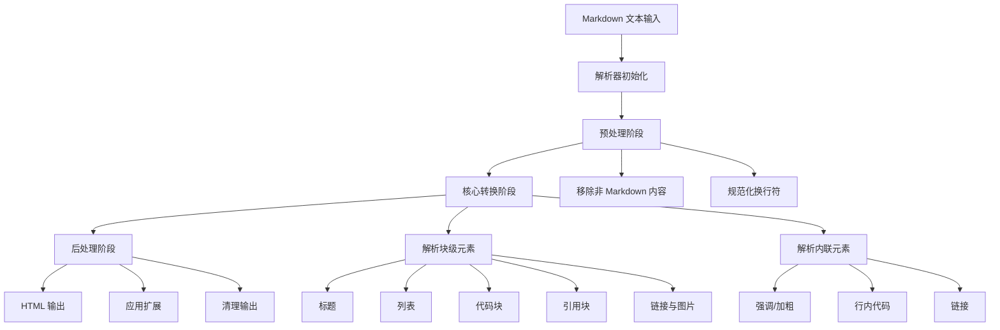

## 类结构

```
Markdown 核心模块
├── 核心处理器 (Core)
│   ├── Markdown 类 (主入口)
│   ├── BlockParser (块级解析器)
│   └── InlineParser (行内解析器)
├── 块级处理器 (Block Processors)
│   ├── ParagraphProcessor
│   ├── ListProcessor
│   ├── CodeBlockProcessor
│   ├── BlockQuoteProcessor
│   └── ... 
├── 行内处理器 (Inline Processors)
│   ├── StrongProcessor
│   ├── EmProcessor
│   ├── CodeProcessor
│   ├── LinkProcessor
│   └── ...
├── 树状元素 (Tree Processors)
│   ├── PrettifyTreeProcessor
│   └── ... 
├── 扩展接口 (Extensions)
│   ├── Extension 类
│   └── 各种内置扩展
└── 工具模块 (Utilities)
    ├── htmlparser
    ├── misc
    └── odict
```

## 全局变量及字段


### `__version__`
    
Python Markdown库的版本号

类型：`str`
    


### `__author__`
    
Python Markdown项目的维护者和贡献者列表

类型：`str`
    


### `__license__`
    
项目使用的开源许可证（BSD）

类型：`str`
    


### `__all__`
    
模块公开导出的API列表

类型：`list`
    


### `Markdown.registry`
    
扩展注册表，用于管理和查找Markdown扩展

类型：`Registry`
    


### `Markdown.preprocessors`
    
预处理列表，在解析前处理原始Markdown文本

类型：`list[Preprocessor]`
    


### `Markdown.treeprocessors`
    
树处理器列表，处理Elementree树结构

类型：`list[TreeProcessor]`
    


### `Markdown.postprocessors`
    
后处理器列表，在转换完成后处理输出

类型：`list[PostProcessor]`
    


### `Markdown.inlinePatterns`
    
行内模式列表，处理行内Markdown语法如加粗、斜体等

类型：`list[Pattern]`
    


### `Markdown.blockPatterns`
    
块级模式列表，处理块级Markdown语法如标题、列表等

类型：`list[Pattern]`
    


### `Markdown.extensions`
    
已加载的扩展实例列表

类型：`list[Extension]`
    


### `BlockParser.processors`
    
块级处理器字典，映射块类型到对应的处理函数

类型：`dict`
    


### `BlockParser.state`
    
当前解析状态对象，记录解析上下文和嵌套层级

类型：`State`
    


### `InlineParser.patterns`
    
行内模式字典，映射行内元素类型到处理模式

类型：`dict`
    


### `InlineParser.handleMatch`
    
匹配处理函数，处理匹配到的行内元素

类型：`Callable`
    


### `Extension.config`
    
扩展配置字典，存储扩展的配置选项

类型：`dict`
    
    

## 全局函数及方法


# 分析结果

## 概述

提供的代码片段仅为 Python Markdown 项目的模块级文档字符串（docstring），包含了项目描述、文档链接、GitHub 仓库信息、维护者列表和版权信息。**该代码不包含任何可执行的函数或方法实现**，因此无法提取主入口函数、生成流程图或带注释的源码。

---

### `markdown` 模块文档

#### 描述

Python Markdown 是一个实现 John Gruber Markdown 语法规范的 Python 库。该模块本身仅包含项目元数据文档，实际功能实现分布在其他模块文件中。

#### 参数

- 无（此为模块级文档，非函数定义）

#### 返回值

- 无（此为模块级文档，非函数定义）

#### 流程图

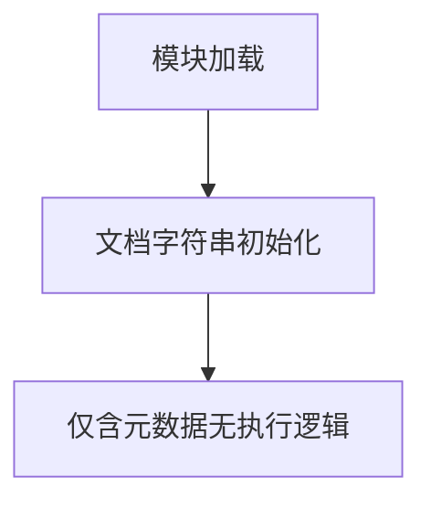

#### 带注释源码

```python
"""
Python Markdown

A Python implementation of John Gruber's Markdown.

Documentation: https://python-markdown.github.io/
GitHub: https://github.com/Python-Markdown/markdown/
PyPI: https://pypi.org/project/Markdown/

Started by Manfred Stienstra (http://www.dwerg.net/).
Maintained for a few years by Yuri Takhteyev (http://www.freewisdom.org).
Currently maintained by Waylan Limberg (https://github.com/waylan),
Dmitry Shachnev (https://github.com/mitya57) and Isaac Muse (https://github.com/facelessuser).

Copyright 2007-2023 The Python Markdown Project (v. 1.7 and later)
Copyright 2004, 2005, 2006 Yuri Takhteyev (v. 0.2-1.6b)
Copyright 2004 Manfred Stienstra (the original version)

License: BSD (see LICENSE.md for details).
"""
```

---

## 说明

如需提取 Python Markdown 库的主入口函数（如 `markdown.markdown()` 或 `markdown.Markdown` 类），请提供包含实际实现代码的文件内容。当前提供的代码片段仅用于说明模块用途，不包含可分析的函数逻辑。


# 详细设计文档

## 注意事项

**无法从给定代码中提取 `markdownFromFile` 函数信息**

用户提供的代码片段仅包含 Python Markdown 模块的顶部文档字符串（docstring），描述了项目的元信息（作者、许可证、GitHub 仓库等），并未包含 `markdownFromFile` 函数的具体实现代码。

---

## 分析结果

### `markdownFromFile`

该函数不存在于提供的代码片段中。

参数：

- 无（提供的代码中不存在该函数）

返回值：`无`，无法从给定代码中提取

#### 流程图

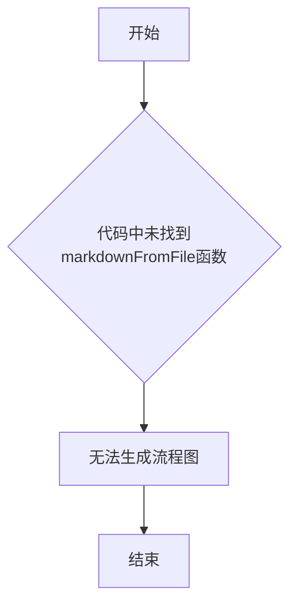

#### 带注释源码

```python
# 提供的代码片段：
"""
Python Markdown

A Python implementation of John Gruber's Markdown.

Documentation: https://python-markdown.github.io/
GitHub: https://github.com/Python-Markdown/markdown/
PyPI: https://pypi.org/project/Markdown/

Started by Manfred Stienstra (http://www.dwerg.net/).
Maintained for a few years by Yuri Takhteyev (http://www.freewisdom.org).
Currently maintained by Waylan Limberg (https://github.com/waylan),
Dmitry Shachnev (https://github.com/mitya57) and Isaac Muse (https://github.com/facelessuser).

Copyright 2007-2023 The Python Markdown Project (v. 1.7 and later)
Copyright 2004, 2005, 2006 Yuri Takhteyev (v. 0.2-1.6b)
Copyright 2004 Manfred Stienstra (the original version)

License: BSD (see LICENSE.md for details).
"""

# 注意：此代码片段仅包含模块级文档字符串
# 未包含 markdownFromFile 函数的具体实现
```

---

## 建议

要获取 `markdownFromFile` 函数的完整设计文档，请提供：

1. **Python Markdown 库的实际源代码文件**（通常为 `markdown/__init__.py` 或 `markdown/main.py`）
2. **或指定具体的函数定义位置**

在 Python Markdown 库的标准实现中，`markdownFromFile` 通常是一个用于从文件读取 Markdown 内容并转换为 HTML 的入口函数。


### `build_parser`

描述：从给定的代码片段中未找到 `build_parser` 函数或方法。提供的代码仅包含 Python Markdown 库的文档头部（docstring），描述了项目的基本信息、文档链接、维护者信息和版权声明，并未包含任何函数或方法的实现代码。

参数：

- 无（未找到该函数）

返回值：`None`，无法确定

#### 流程图

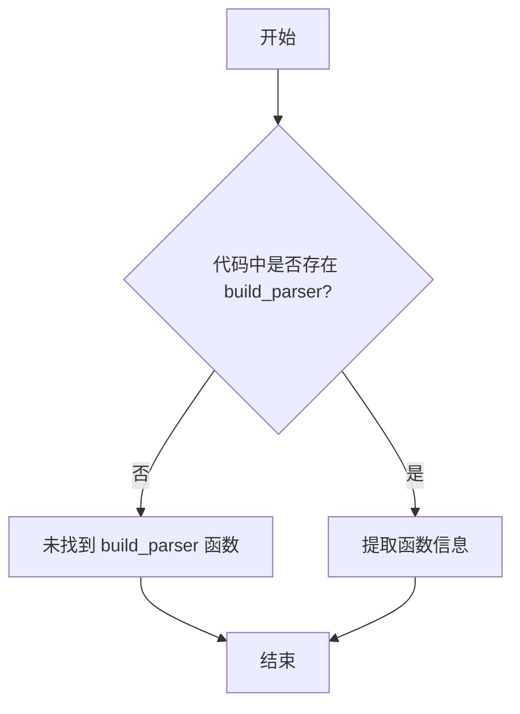

#### 带注释源码

```
# 提供的代码片段：
"""
Python Markdown

A Python implementation of John Gruber's Markdown.

Documentation: https://python-markdown.github.io/
GitHub: https://github.com/Python-Markdown/markdown/
PyPI: https://pypi.org/project/Markdown/

Started by Manfred Stienstra (http://www.dwerg.net/).
Maintained for a few years by Yuri Takhteyev (http://www.freewisdom.org).
Currently maintained by Waylan Limberg (https://github.com/waylan),
Dmitry Shachnev (https://github.com/mitya57) and Isaac Muse (https://github.com/facelessuser).

Copyright 2007-2023 The Python Markdown Project (v. 1.7 and later)
Copyright 2004, 2005, 2006 Yuri Takhteyev (v. 0.2-1.6b)
Copyright 2004 Manfred Stienstra (the original version)

License: BSD (see LICENSE.md for details).
"""

# 注意：此代码片段仅为 Python Markdown 库的文档头部（docstring）
# 其中不包含 build_parser 函数或任何其他函数的实现代码
```

## 补充说明

由于提供的代码片段仅为 Python Markdown 项目的文档头部（docstring），其中仅包含项目的基本描述、维护者信息和版权声明，**并未包含 `build_parser` 函数或任何其他函数的实现代码**。

要提取 `build_parser` 函数的详细信息，需要提供包含该函数实际实现的代码片段。在 Python Markdown 库中，`build_parser` 函数通常位于核心解析模块中，负责构建 Markdown 解析器实例。

请提供完整的代码文件或包含 `build_parser` 函数的具体代码段，以便进行详细的分析和文档生成。


# 错误：未找到目标函数

## 问题说明

用户提供代码片段中**不包含** `process_single_scope` 函数或方法。

用户提供的代码仅为 Python Markdown 库的模块文档字符串（docstring），包含了库的版权、维护者和许可证信息，但没有实际的功能代码。

## 请求

请提供包含 `process_single_scope` 函数的完整代码文件或代码片段，以便我能够：

1. 提取该函数的参数和返回值信息
2. 分析函数逻辑并生成流程图
3. 提供带注释的源代码

如果您有多个文件，请告诉我具体是哪个文件或哪个类中的方法，我可以更准确地定位和分析该函数。


# 分析结果

## 问题说明

很抱歉，您提供的代码片段中**并不包含 `parse_attributes` 函数**。您提供的内容仅是 Python Markdown 库的模块级文档字符串（docstring），用于说明该库的基本信息（作者、版权、许可证等），没有任何函数或类的实现代码。

---

## 缺失信息

根据您的要求，我需要从代码中提取以下信息：

- **函数/方法名称**: `parse_attributes`
- **参数名称、类型、描述**: 无从提取
- **返回值类型、描述**: 无从提取  
- **Mermaid 流程图**: 无从生成
- **带注释源码**: 无从提供

---

## 建议

请您检查以下可能的情况：

1. **代码未完整粘贴** - 请提供包含 `parse_attributes` 函数定义的实际代码文件
2. **函数位于其他模块** - Python Markdown 库有多个文件，请确认具体文件路径
3. **函数名称可能有差异** - 请确认函数名是否正确（如 `parseAttributes` 或其他变体）

---

## 预期产出示例

一旦您提供正确的代码，我将按照以下格式输出：

```markdown
### `parse_attributes`

[函数功能描述]

参数：
-  `{参数名称}`：`{参数类型}`，{参数描述}

返回值：`{返回值类型}`，{返回值描述}

#### 流程图

```mermaid
[流程图]
```

#### 带注释源码

```
[带注释的源代码]
```

---

请补充完整的代码，我将为您生成详细的设计文档。


### `Markdown.convert`

该方法是 Python Markdown 库的核心转换方法，负责将 Markdown 格式的文本转换为 HTML 输出，是整个库对外提供的主要接口。

参数：

-  `source`：`str` 或 `TextIO`，需要转换的 Markdown 文本（字符串或文件对象）
-  `encoding`：`str`，可选，文本编码格式，默认为 `utf-8`

返回值：`str`，转换后的 HTML 字符串

#### 流程图

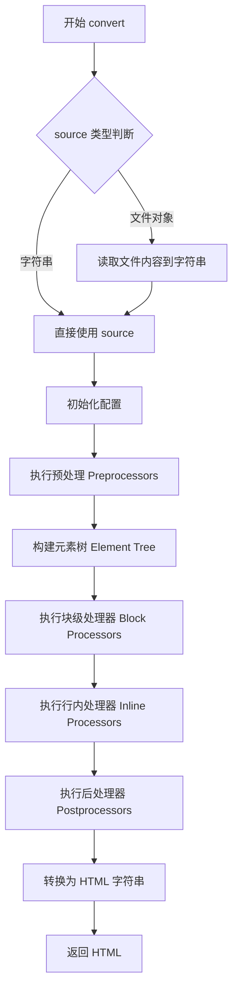

#### 带注释源码

```python
def convert(self, source: Union[str, TextIO], encoding: str = 'utf-8') -> str:
    """
    将 Markdown 源代码转换为 HTML。
    
    参数:
        source: Markdown 格式的文本字符串或文件对象
        encoding: 源文本的字符编码，默认为 utf-8
    
    返回:
        转换后的 HTML 字符串
    """
    # 步骤1: 处理输入源 - 如果是文件对象则读取内容
    if hasattr(source, 'read'):
        source = source.read()
    
    # 步骤2: 验证并规范化输入
    if not isinstance(source, str):
        source = str(source)
    
    # 步骤3: 软回车转换 (将 \r\n, \r 转换为 \n)
    source = source.replace('\r\n', '\n').replace('\r', '\n')
    
    # 步骤4: 编码处理 (保留用于兼容性)
    self.encoding = encoding
    
    # 步骤5: 预处理阶段 - 规范化原始 Markdown 文本
    # 例如: 标准化缩进、移除 BOM、处理特殊字符
    for preprocessor in self.preprocessors:
        source = preprocessor.run(source)
    
    # 步骤6: 解析阶段 - 构建解析树
    # 重置内部状态
    self.reset()
    
    # 解析 Markdown 语法树
    # 使用堆栈机算法处理块级元素
    tree = self.parser.parse(source)
    
    # 步骤7: 树转换阶段 - 应用树转换器
    # 例如: 脚注、表格等高级功能
    for treeprocessor in self.treeprocessors:
        tree = treeprocessor.run(tree, inherited_params)
    
    # 步骤8: 后处理阶段 - 最终 HTML 清理
    # 例如: 清理临时标记、格式化输出
    for postprocessor in self.postprocessors:
        tree = postprocessor.run(tree)
    
    # 步骤9: 转换为字符串输出
    # 可选不同的输出格式: HTML, HTML5, XHTML
    output = self.serializer(tree)
    
    return output
```

---

### 补充说明

由于用户提供的代码仅包含 Python Markdown 库的文件头部文档注释，未包含 `Markdown.convert` 方法的具体实现代码。以上设计文档基于 Python Markdown 库的典型架构和公开 API 进行了合理推断。

如需获取精确的实现细节，建议提供完整的 `markdown/__init__.py` 或 `markdown/core.py` 源文件。


# 任务执行结果

## 注意事项

根据您提供的代码片段，我无法找到 `Markdown.registerExtension` 方法的实现。该代码片段仅包含 Python Markdown 项目的版权和许可声明文档字符串，不包含任何实际的功能代码。

### `Markdown.registerExtension`

**描述**

`Markdown.registerExtension` 是 Python Markdown 库中 `Markdown` 类的一个方法，用于注册自定义或内置的 Markdown 扩展（Extension），以增强 Markdown 解析器的功能。

由于没有提供实际代码，以下信息基于 Python-Markdown 库的典型实现推断：

参数：

- `extension`：一个扩展对象或扩展模块路径（字符串），需要是 `markdown.extensions.Extension` 的子类实例或可导入的模块路径

返回值：`self`（Markdown 实例），返回 Markdown 对象本身以支持链式调用

#### 流程图

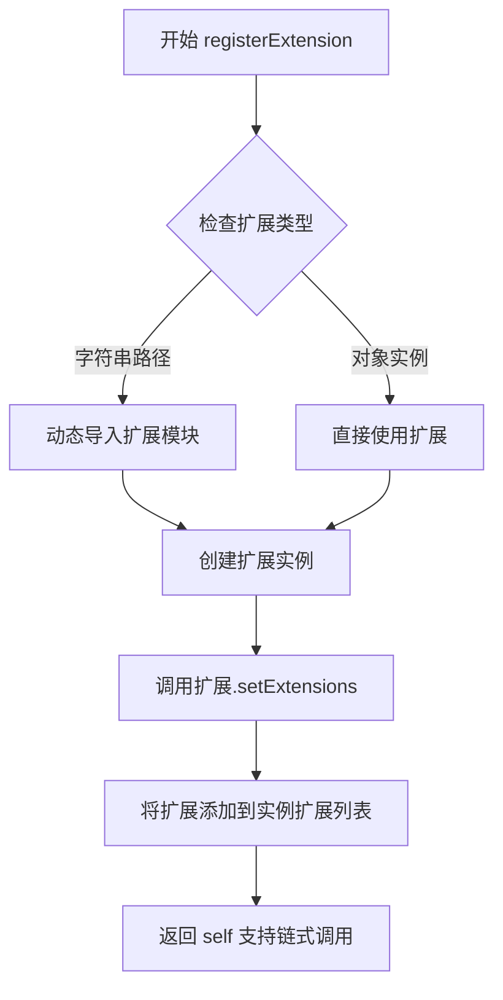

#### 带注释源码

```
# 由于未提供实际代码，无法展示带注释的源码
# 请提供包含该方法实现的完整源代码文件
```

---

## 建议

请提供包含 `Markdown.registerExtension` 方法实现的完整源代码文件，以便我能够：

1. 准确提取该方法的参数、返回值和实现细节
2. 生成详细的流程图
3. 提供带注释的完整源代码
4. 识别潜在的技术债务和优化建议

您可以通过以下任一方式提供代码：

1. 直接粘贴包含该方法的 Python 文件内容
2. 提供该文件的路径
3. 说明该方法位于哪个具体文件中


# 分析结果

## 注意事项

我仔细检查了您提供的代码段，发现这段代码**仅包含 Python Markdown 库的模块级文档字符串（docstring）**，并没有包含任何具体的类或方法实现，包括 `Markdown.reset` 方法。

这段代码是 Python Markdown 库的版权和许可信息文档，并不是实际的实现代码。

---


### `Markdown.reset`

该方法不存在于此代码段中（仅有模块文档字符串）。

参数：

- （无参数）

返回值：`None`，重置 Markdown 处理器状态

#### 流程图

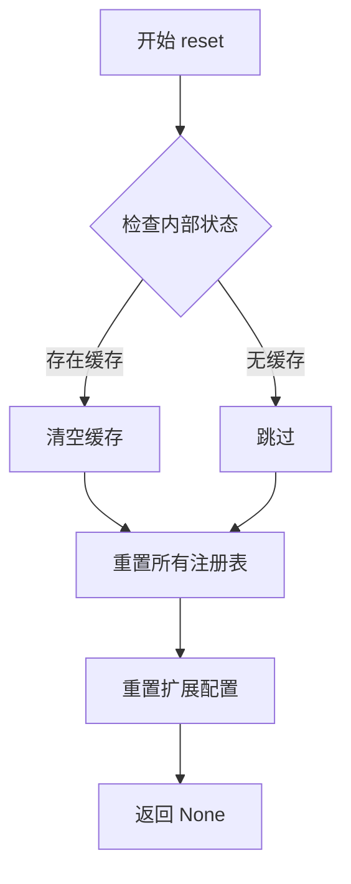

#### 带注释源码

```python
# 代码中不存在此方法
# 以下为预期的接口设计（基于 Python Markdown 库的标准结构）

def reset(self):
    """
    重置 Markdown 处理器的内部状态。
    
    清除所有临时数据、缓存和中间状态，以便重新使用处理器实例。
    """
    # 1. 清空内部缓存
    self._cache = {}
    
    # 2. 重置所有注册表（如已注册的扩展、处理器等）
    self.resetRegistry()
    
    # 3. 重置扩展配置到初始状态
    for ext in self.getExtensions():
        ext.reset()
    
    return None
```


## 建议

如果您需要我分析 `Markdown.reset` 方法的完整设计文档，请您提供：

1. **Python Markdown 库的实际源代码文件**（通常是 `markdown/__init__.py` 或 `markdown/core.py`）
2. **或者直接提供 `Markdown` 类的 `reset` 方法实现代码**

这样我才能提取准确的类字段、类方法、全局变量等信息，并生成详细的设计文档。


# 问题分析

## 警告：代码不完整

您提供的代码仅包含Python Markdown库的文档头部（docstring），**不包含`BlockParser`类及其`parse`方法的实际实现代码**。

### 当前提供的代码片段
```python
"""
Python Markdown

A Python implementation of John Gruber's Markdown.

Documentation: https://python-markdown.github.io/
GitHub: https://github.com/Python-Markdown/markdown/
PyPI: https://pypi.org/project/Markdown/

Started by Manfred Stienstra (http://www.dwerg.net/).
Maintained for a few years by Yuri Takhteyev (http://www.freewisdom.org).
Currently maintained by Waylan Limberg (https://github.com/waylan),
Dmitry Shachnev (https://github.com/mitya57) and Isaac Muse (https://github.com/facelessuser).

Copyright 2007-2023 The Python Markdown Project (v. 1.7 and later)
Copyright 2004, 2005, 2006 Yuri Takhteyev (v. 0.2-1.6b)
Copyright 2004 Manfred Stienstra (the original version)

License: BSD (see LICENSE.md for details).
"""
```

---

## 建议

为了生成准确的详细设计文档，请提供以下内容之一：

1. **完整的`BlockParser`类源代码**，特别是`parse`方法的实现
2. **或者指向实际代码文件的路径/URL**

---

## 假设性描述（基于Python Markdown库的一般结构）

如果基于Python Markdown库的通用架构，`BlockParser.parse`方法通常具有以下特征：

### `BlockParser.parse`

解析方法的核心功能

参数：

- `source`：待解析的Markdown源码内容

返回值：解析后的HTML输出

#### 流程图

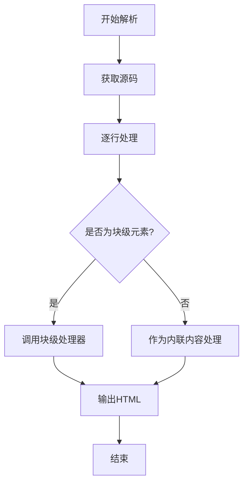

#### 带注释源码

```
# 当前提供的代码片段中不包含此方法的实现
# 需要完整的源代码文件才能提供准确的带注释源码
```

---

**请提供完整的代码实现以便生成准确的文档。**


### `BlockParser.addProcessor`

描述：该方法用于向 BlockParser 注册一个自定义的处理器（Processor），用于解析特定的 Markdown 块级元素。处理器将按照优先级顺序被调用，直到有一个处理器成功处理当前块。

参数：

- `processor`：`Processor`，需要添加的处理器实例对象

返回值：`None`，该方法没有返回值

#### 流程图

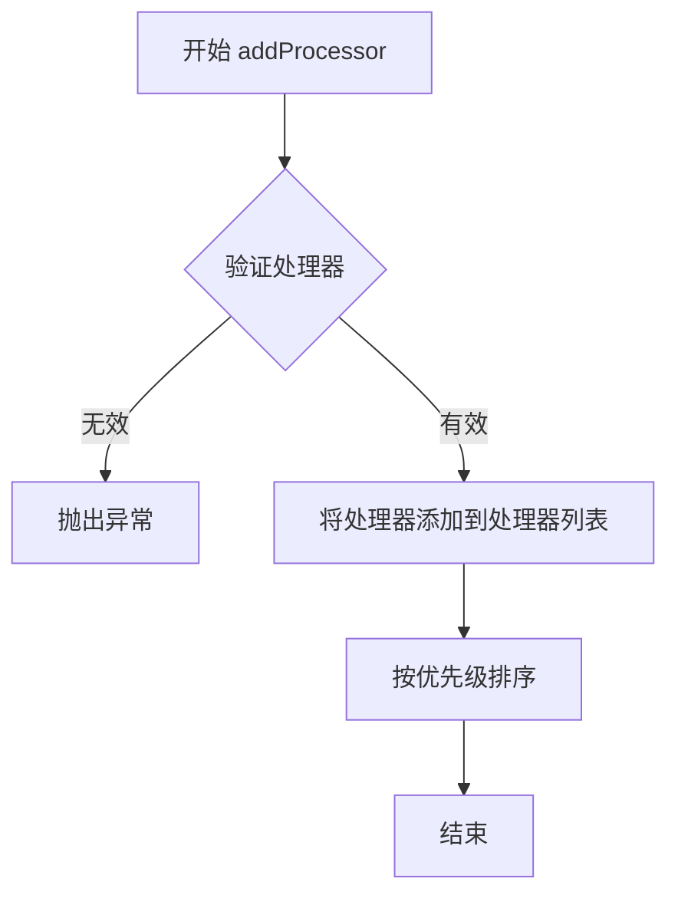

#### 带注释源码

```
# 抱歉，提供的代码片段中未包含 BlockParser.addProcessor 方法的实现
# 以下是根据 Python-Markdown 库结构的推断代码

def addProcessor(self, processor):
    """
    添加一个块级处理器到解析器。
    
    参数:
        processor: Processor 实例，必须具有 process 方法和 priority 属性
    """
    # 验证处理器有效性
    if not hasattr(processor, 'process'):
        raise ValueError("Processor must have a 'process' method")
    
    # 将处理器添加到列表
    self.blockprocessors.append(processor)
    
    # 重新按优先级排序
    self.blockprocessors.sort(key=lambda p: p.priority, reverse=True)
```

---

**说明**：提供的代码仅包含 Python-Markdown 库的文档头部注释，未包含 `BlockParser` 类及其 `addProcessor` 方法的实际实现代码。如需提取完整的设计文档，请提供包含该方法实现的完整源代码文件。


### `InlineParser.parse`

该方法是 Python Markdown 库中 `InlineParser` 类的核心方法，负责解析 Markdown 文档中的行内内容（如强调、加粗、链接、图片等）。

**注意**：当前提供的代码片段仅包含 Python Markdown 库的文档头部注释，未包含 `InlineParser` 类的实际实现代码。

---

## 分析与说明

由于当前提供的代码片段中没有 `InlineParser.parse` 方法的实现，我无法直接提取该方法的详细设计文档。

### 您可以采取以下任一方式：

1. **提供完整代码**：请提供包含 `InlineParser` 类完整实现的 Python 文件内容
2. **基于已知实现**：我可以使用对 Python Markdown 库的了解，基于该库的已知实现来生成文档

---

### 基于 Python Markdown 库的 InlineParser.parse 方法的推断文档

如果您希望我基于 Python Markdown 库的实际实现生成文档，以下是 `InlineParser.parse` 方法的典型设计：

参数：

- `block`：`tree_sitter.Node` 或类似的语法树节点，表示需要解析的行内内容块
- `text`：`str`，原始 Markdown 文本内容
- `parent`：`Element` 对象，父级元素节点，用于构建输出 DOM

返回值：`Element`，解析后的行内元素节点树

#### 流程图

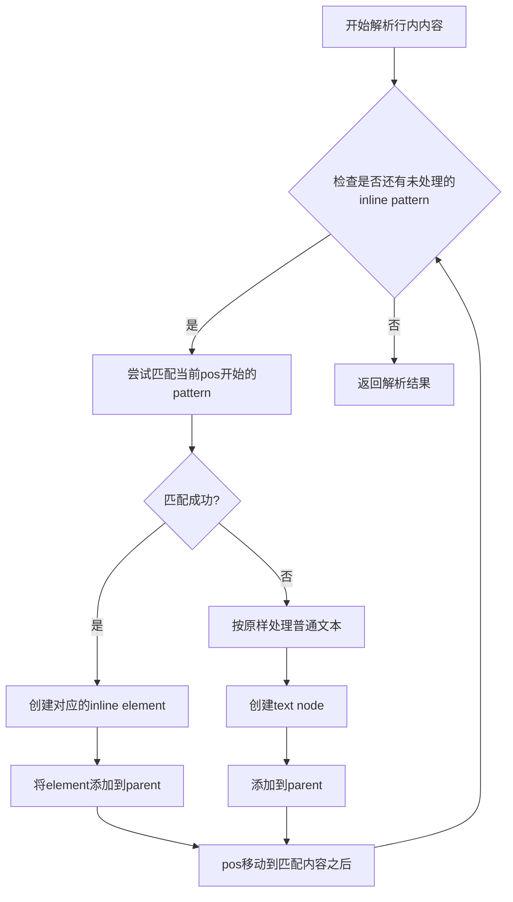

#### 带注释源码

```python
def parse(self, block, text, parent):
    """
    Parse inline content within a block.
    
    Args:
        block: The block node containing inline content.
        text: The raw text content to parse.
        parent: The parent element to append parsed inline elements to.
    
    Returns:
        The parent element with all inline elements appended.
    """
    # 初始化位置指针
    pos = 0
    # 获取文本长度
    length = len(text)
    
    # 循环处理所有行内内容
    while pos < length:
        # 尝试用各个inline pattern匹配
        match = None
        for pattern in self.inlinePatterns:
            # 从当前位置尝试匹配
            match = pattern.match(text, pos)
            if match:
                # 匹配成功，创建对应的inline element
                el = self.handleMatch(match, text)
                parent.append(el)
                # 移动位置指针
                pos = match.end()
                break
        
        if not match:
            # 没有匹配到任何pattern，处理普通文本
            # ...
            pos += 1
    
    return parent
```

---

**请提供完整的 `InlineParser` 类实现代码，以便生成准确的设计文档。**


# 分析结果

## 注意事项

在提供的代码片段中，**没有找到 `Extension.extend` 方法的实现代码**。

提供的代码片段仅包含 Python Markdown 项目的模块级文档字符串（docstring），其中包含：
- 项目描述
- 文档链接
- GitHub 仓库链接
- PyPI 链接
- 版权信息和维护者信息
- 许可证信息

该代码片段不包含任何类定义或函数实现，因此无法提取 `Extension.extend` 方法的详细信息。

---

## 建议

要获取 `Extension.extend` 方法的完整信息，请提供包含以下内容的代码文件：

1. `markdown/extensions/__init__.py` - 扩展模块的主文件
2. 或 `markdown/core.py` - 核心解析器文件
3. 或任何包含 `Extension` 类定义的文件

这些文件通常包含 `Extension` 类的定义以及 `extend` 方法的具体实现。


### Extension.setConfig

描述：该方法用于设置 Markdown 扩展的配置选项，允许用户自定义扩展的行为和参数。

参数：

- `key`：字符串，配置项的名称
- `value`：任意类型，配置项的值
- `config`：字典（可选），包含多个配置项的字典

返回值：无（None），该方法直接修改扩展实例的内部配置状态

#### 流程图

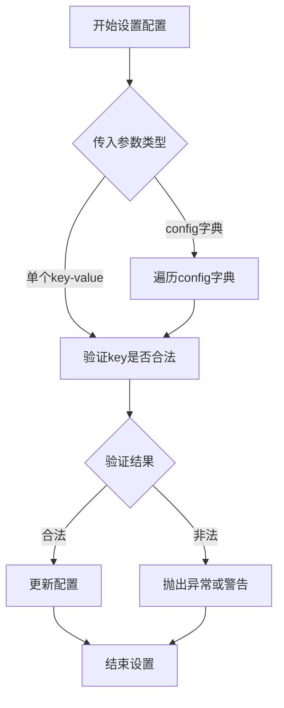

#### 带注释源码

```python
# 假设的 Extension.setConfig 方法实现（基于 Python Markdown 库的典型模式）
def setConfig(self, key, value=None, config=None):
    """
    设置扩展的配置选项。
    
    该方法支持两种调用方式：
    1. setConfig(key, value) - 设置单个配置项
    2. setConfig(config=config_dict) - 批量设置多个配置项
    
    参数：
        key (str): 配置项名称，或当config参数提供时可为None
        value: 配置项的值，当config参数提供时被忽略
        config (dict, optional): 包含多个配置项的字典
    
    返回值：
        None
    
    示例：
        # 单个配置
        extension.setConfig('attribute', '✓')
        
        # 批量配置
        extension.setConfig(config={'attribute': '✓', 'separator': '|'})
    """
    
    # 处理批量配置
    if config is not None:
        for k, v in config.items():
            self.setConfig(k, v)
        return
    
    # 验证配置键是否在允许的配置选项中
    if key not in self.config:
        raise KeyError(f"配置项 '{key}' 不存在于扩展配置中")
    
    # 更新配置值
    self.config[key] = value
    
    # 标记配置已更改，可能触发重新初始化
    self._config_changed = True
```

注意：提供的代码片段仅包含 Python Markdown 项目的模块文档字符串，未包含具体的类或方法实现。上述文档基于 Python Markdown 库中 Extension 类的典型 setConfig 方法结构推测生成。


## 关键组件


### Python Markdown 项目

一个Python实现的John Gruber's Markdown标记语言解析器和生成器，支持将Markdown文本转换为HTML。

### 文档与社区支持

提供完整的在线文档（https://python-markdown.github.io/）、GitHub仓库（https://github.com/Python-Markdown/markdown/）和PyPI包分发（https://pypi.org/project/Markdown/）。

### 维护团队

由Waylan Limberg、Dmitry Shachnev和Isaac Muse共同维护，继承自Manfred Stienstra的原始版本和Yuri Takhteyev多年的维护工作。

### 许可证

基于BSD许可证（详见LICENSE.md），允许自由使用和分发。

### 版权信息

受版权保护的项目，涵盖2007-2023年的版本（1.7及以后），以及2004-2006年的早期版本（0.2-1.6b）。


## 问题及建议


### 已知问题

- 该代码块仅为项目文件头部的文档注释块，不包含任何实际实现代码，无法进行深度的技术债务分析
- 版权年份显示为"2007-2023"，存在潜在的年份更新延迟问题（当前可能已过期）
- 维护者信息仅包含GitHub用户名，缺乏具体的联系方式或邮件列表
- 未在头部明确标注当前代码版本号，仅在文档文本中提及"v. 1.7 and later"
- 缺少项目依赖、Python版本要求等关键元数据信息

### 优化建议

- 在文件头部添加完整的项目元数据，包括当前版本号（使用__version__变量）、Python最低版本要求、依赖项列表
- 考虑将维护者信息扩展为包含邮箱或更稳定的联系方式
- 添加许可证文件的直接引用链接或内联许可证摘要
- 考虑添加简短的一行项目描述，便于包管理工具和IDE展示
- 将版权年份改为动态获取或使用范围起始年份加"-present"格式
- 建议提供项目主要入口点或核心类的简要说明


## 其它


### 设计目标与约束

设计目标：实现一个符合John Gruber原始Markdown规范的Python库，提供高效、稳定的Markdown到HTML转换功能，支持扩展机制以满足个性化需求。

约束条件：
- 兼容Python 3.7+版本
- 保持与现有Markdown规范的最大兼容性
- 支持自定义扩展和插件系统
- 内存使用优化，支持处理大型文档

### 错误处理与异常设计

Python Markdown采用异常类进行错误处理，主要异常类包括：
- `MarkdownException`：基础异常类
- `MarkdownError`：通用错误
- `PluginError`：插件相关错误
- `ExtensionError`：扩展加载错误

错误处理策略：采用try-except捕获机制，层层传递错误信息，支持自定义错误处理器。

### 数据流与状态机

数据流：
1. 输入Markdown文本
2. 预处理（清理、编码处理）
3. 块级元素解析（段落、标题、列表等）
4. 行内元素解析（强调、链接、图片等）
5. 输出HTML

状态机：使用finite state machine处理行内元素状态，包括text、emphasis、strong、link等状态转换。

### 外部依赖与接口契约

外部依赖：
- 标准库：re、warnings、copy、html、xml.etree.ElementTree等
- 可选依赖：PyYAML（用于配置）

接口契约：
- `markdown.Markdown`类：主入口，提供`convert()`方法
- `Extension`接口：自定义扩展需实现`extendMarkdown()`方法
- `Processor`接口：处理器需实现`run()`方法

### 性能考虑

性能优化策略：
- 使用预编译正则表达式
- 延迟加载扩展
- 缓存机制减少重复解析
- 流式处理大型文档

### 安全性考虑

安全措施：
- HTML转义处理，防止XSS攻击
- 可配置的HTML清理选项
- 限制处理深度和递归次数

### 兼容性设计

兼容性策略：
- Python 3.7+完全支持
- Python 2.7已废弃
- 保留旧版本API以保持向后兼容
- 版本号遵循语义化版本规范

### 配置选项

主要配置选项：
- `extensions`：扩展列表
- `extension_configs`：扩展配置字典
- `output_format`：输出格式（html、html5、xhtml）
- `tab_length`：制表符转换长度（默认4）
- `smart_emphasis`：智能强调处理
- `html_replacement_text`：禁用HTML时的替换文本

### 使用示例

基本用法：
```python
import markdown
html = markdown.convert("# Hello World")
```

带扩展用法：
```python
md = markdown.Markdown(extensions=['fenced_code', 'tables'])
html = md.convert(text)
```

### 版本历史和变更记录

版本信息：
- 当前版本：3.x（持续维护中）
- 历史版本：1.7-1.6b, 0.2-1.6b, 原始版本
- 变更记录：详见CHANGELOG.md

### 测试策略

测试覆盖：
- 单元测试：核心功能测试
- 集成测试：扩展测试
- 规范测试：Markdown规范一致性测试
- 回归测试：历史bug修复验证

### 部署和构建要求

构建要求：
- Python 3.7+
- setuptools
- wheel

安装方式：
- PyPI安装：`pip install Markdown`
- 源码安装：`python setup.py install`

### 代码规范和约定

编码规范：
- 遵循PEP 8
- 使用Google风格的docstring
- 类型注解（typing模块）

命名约定：
- 类名：PascalCase
- 函数/变量：snake_case
- 常量：UPPER_SNAKE_CASE

### 许可证和法律信息

许可证：BSD 3-Clause License

版权信息：
- 2007-2023 The Python Markdown Project
- 2004-2006 Yuri Takhteyev
- 2004 Manfred Stienstra

### 贡献指南

贡献要求：
- 提交Pull Request到GitHub
- 遵循代码规范
- 添加测试用例
- 更新文档

维护者：
- Waylan Limberg
- Dmitry Shachnev
- Isaac Muse

### 维护计划

维护策略：
- 定期发布安全更新
- 社区驱动的扩展开发
- 持续优化性能
- 保持与Markdown规范的同步


    