# `markdown\tests\test_extensions.py` 详细设计文档

这是Python Markdown库的扩展回归测试文件，通过unittest框架测试各种Markdown扩展功能，包括扩展类配置、元数据处理、Wiki链接、警告块和智能标点符号等核心功能。

## 整体流程

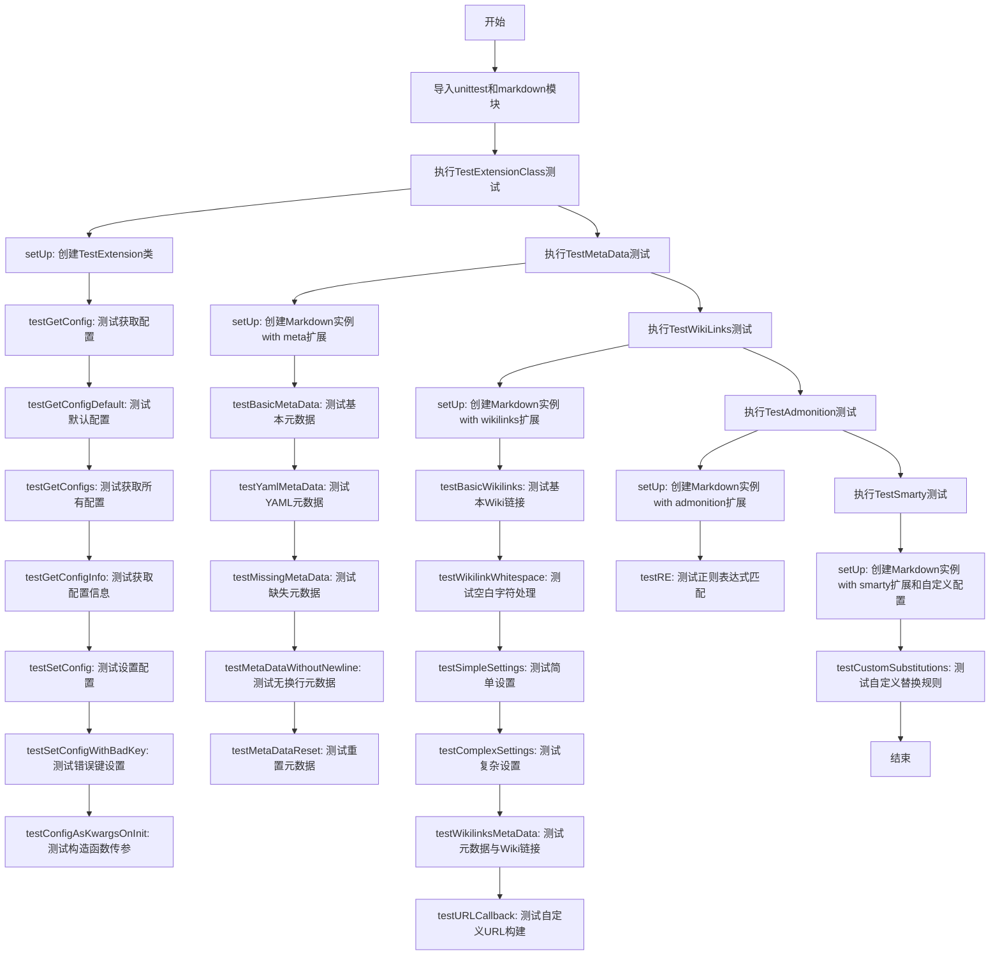

## 类结构

```
unittest.TestCase (基类)
├── TestExtensionClass
│   └── TestExtension (内部类, markdown.extensions.Extension)
├── TestMetaData
├── TestWikiLinks
├── TestAdmonition
└── TestSmarty
```

## 全局变量及字段


### `unittest`
    
Python's unit testing framework for creating and running tests

类型：`module`
    


### `markdown`
    
Python Markdown library for converting Markdown to HTML

类型：`module`
    


### `RE`
    
Regular expression pattern for matching admonition block syntax

类型：`re.Pattern`
    


### `tests`
    
List of test cases with input strings and expected match groups

类型：`list[tuple[str, tuple]]`
    


### `test`
    
Test input string for regular expression matching

类型：`str`
    


### `expected`
    
Expected match groups from regular expression

类型：`tuple`
    


### `text`
    
Input Markdown text to be converted to HTML

类型：`str`
    


### `correct`
    
Expected HTML output after Markdown conversion

类型：`str`
    


### `config`
    
Configuration dictionary for Smarty extension with smart quotes and substitutions

类型：`dict`
    


### `my_url_builder`
    
Custom URL builder function for wikilinks that returns a fixed URL

类型：`Callable[[str, str, str], str]`
    


### `TestExtensionClass.ext`
    
Instance of TestExtension class for testing extension configuration methods

类型：`markdown.extensions.Extension`
    


### `TestExtensionClass.ExtKlass`
    
TestExtension class reference used for testing configuration via kwargs

类型：`type`
    


### `TestExtensionClass.TestExtension.config`
    
Configuration dictionary defining extension options and their default values

类型：`dict`
    


### `TestMetaData.md`
    
Markdown instance configured with meta extension for testing metadata parsing

类型：`markdown.Markdown`
    


### `TestWikiLinks.md`
    
Markdown instance configured with wikilinks extension for testing link processing

类型：`markdown.Markdown`
    


### `TestWikiLinks.text`
    
Sample text containing wikilinks for testing conversion

类型：`str`
    


### `TestAdmonition.md`
    
Markdown instance configured with admonition extension for testing blockquote processing

类型：`markdown.Markdown`
    


### `TestSmarty.md`
    
Markdown instance configured with smarty extension for testing smart quote substitutions

类型：`markdown.Markdown`
    
    

## 全局函数及方法


### `my_url_builder`

这是一个用于测试的自定义 URL 构建器函数，在 `TestWikiLinks` 类的 `testURLCallback` 测试方法中定义。该函数接受 WikiLink 的标签、基础 URL 和结束 URL 作为参数，返回一个固定的 URL 路径 '/bar/'，用于验证自定义 URL 构建功能是否正常工作。

参数：

- `label`：`str`，WikiLink 的标签文本，即双括号中的链接文本
- `base`：`str`，基础 URL 部分，由 WikiLinkExtension 配置或元数据提供
- `end`：`str`，URL 结束部分（如 `.html` 等后缀）

返回值：`str`，返回固定的 URL 路径 `'/bar/'`，用于测试目的

#### 流程图

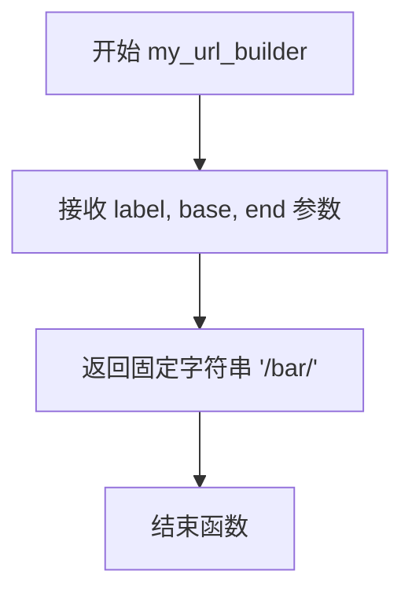

#### 带注释源码

```python
def my_url_builder(label, base, end):
    """
    自定义 URL 构建器，用于测试 WikiLinkExtension 的 build_url 参数。
    
    参数:
        label: WikiLink 的标签文本（例如 "foo"）
        base: 基础 URL 部分
        end: URL 结束部分（例如 ".html"）
    
    返回:
        字符串: 固定的 URL 路径 '/bar/'
    """
    return '/bar/'
```


### `TestExtensionClass.setUp`

该方法是一个测试初始化方法（unittest.TestCase 的生命周期方法），用于在每个测试方法运行前创建测试所需的 Extension 子类实例及其配置。

参数：

- `self`：`TestExtensionClass`，unittest 测试类实例，表示当前测试对象本身

返回值：`None`，无显式返回值，默认返回 Python 的 `None`

#### 流程图

```mermaid
flowchart TD
    A[开始 setUp] --> B[定义内部类 TestExtension 继承自 markdown.extensions.Extension]
    B --> C[为 TestExtension 设置类属性 config: {'foo': ['bar', '描述'], 'bar': ['baz', '描述']}]
    C --> D[实例化 TestExtension 赋值给 self.ext]
    D --> E[将 TestExtension 类赋值给 self.ExtKlass]
    E --> F[方法结束 返回 None]
```

#### 带注释源码

```python
def setUp(self):
    """
    unittest 测试框架的 setUp 方法，在每个测试方法执行前自动调用。
    用于初始化测试所需的 Extension 实例及相关数据。
    """
    
    # 定义一个内部测试类，继承自 markdown.extensions.Extension
    # 用于在测试中模拟自定义扩展
    class TestExtension(markdown.extensions.Extension):
        # 配置字典，定义扩展的默认配置项
        # 格式：'配置键': ['默认值', '描述']
        config = {
            'foo': ['bar', 'Description of foo'],
            'bar': ['baz', 'Description of bar']
        }

    # 创建 TestExtension 类的实例，并存储为测试类的实例变量
    # 供后续 test* 方法使用
    self.ext = TestExtension()
    
    # 将 TestExtension 类本身也存储为实例变量
    # 用于测试需要传递类对象而非实例的场景
    self.ExtKlass = TestExtension
```


### `TestExtensionClass.testGetConfig`

这是测试类 `TestExtensionClass` 中的一个单元测试方法，用于验证 `Extension` 类的 `getConfig` 方法能否正确获取指定配置项的值。

参数：
- 无（该方法不接受任何显式参数）

返回值：
- `None`，该方法无返回值（仅执行断言测试）

#### 流程图

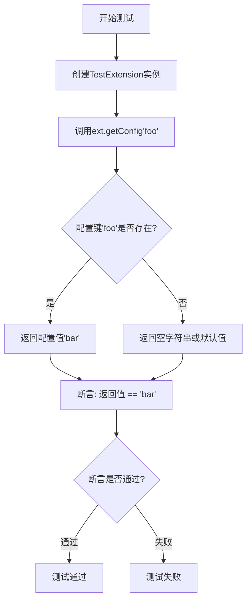

#### 带注释源码

```python
def testGetConfig(self):
    """
    测试获取单个配置项的值。
    
    该测试方法验证 Extension 类的 getConfig 方法能够正确
    根据给定的配置键名返回对应的配置值。
    
    预期行为：
    - 配置键 'foo' 存在，对应值为 'bar'
    - getConfig('foo') 应返回 'bar'
    """
    # 断言：调用 getConfig 方法获取 'foo' 配置项的值
    # 预期返回值：'bar'
    self.assertEqual(self.ext.getConfig('foo'), 'bar')
```

#### 关联的 `getConfig` 方法（被测方法）

基于测试代码推断的 `Extension.getConfig` 方法实现：

```python
def getConfig(self, key, default=''):
    """
    获取指定配置项的值。
    
    参数：
    - key：字符串，要获取的配置键名
    - default：字符串，可选参数，当配置键不存在时返回的默认值，默认为空字符串
    
    返回值：
    - 字符串，返回配置键对应的值，如果键不存在则返回默认值
    """
    return self.config.get(key, default)
```

#### 测试设置信息

```python
def setUp(self):
    """测试前的准备工作"""
    # 定义测试用扩展类，继承自 markdown.extensions.Extension
    class TestExtension(markdown.extensions.Extension):
        # 配置字典：键为配置名，值为 [默认值, 描述] 的列表
        config = {
            'foo': ['bar', 'Description of foo'],
            'bar': ['baz', 'Description of bar']
        }
    
    # 创建测试扩展实例
    self.ext = TestExtension()
    # 保存测试扩展类供其他测试使用
    self.ExtKlass = TestExtension
```


### `TestExtensionClass.testGetConfigDefault`

这是一个单元测试方法，用于验证 Markdown 扩展类的配置获取功能的默认行为，测试当请求不存在的配置项时的返回值以及自定义默认值的处理逻辑。

参数：

- `self`：`TestExtensionClass`，测试类实例本身，用于访问被测试的扩展对象

返回值：`None`，该方法为测试方法，通过断言验证行为，不返回具体值

#### 流程图

```mermaid
flowchart TD
    A[开始测试] --> B[调用 getConfig&#40;'baz'&#41;]
    B --> C{断言结果是否为空字符串 ''}
    C -->|是| D[调用 getConfig&#40;'baz', default='missing'&#41;]
    C -->|否| F[测试失败]
    D --> E{断言结果是否为 'missing'}
    E -->|是| G[测试通过]
    E -->|否| F
```

#### 带注释源码

```python
def testGetConfigDefault(self):
    """
    测试获取配置时的默认行为。
    
    验证两点：
    1. 当请求的键不存在时，返回空字符串作为默认值
    2. 当显式提供 default 参数时，返回提供的默认值
    """
    # 第一次断言：测试默认行为
    # 当配置键 'baz' 不存在时，应返回空字符串 ''
    self.assertEqual(self.ext.getConfig('baz'), '')
    
    # 第二次断言：测试自定义默认值
    # 当提供 default 参数为 'missing' 时，应返回该值而非空字符串
    self.assertEqual(self.ext.getConfig('baz', default='missing'), 'missing')
```


### `TestExtensionClass.testGetConfigs`

该方法是 `TestExtensionClass` 测试类中的一个测试用例，用于验证 `Extension` 类的 `getConfigs()` 方法能否正确返回所有配置项的字典。

参数：

- `self`：隐式参数，`unittest.TestCase` 实例，代表测试类本身

返回值：`None`，因为这是一个测试方法，不返回任何值（通过 `assertEqual` 进行断言验证）

#### 流程图

```mermaid
graph TD
    A[开始测试] --> B[调用 self.ext.getConfigs 获取配置字典]
    B --> C{返回的配置是否等于 {'foo': 'bar', 'bar': 'baz'}?}
    C -->|是| D[测试通过]
    C -->|否| E[测试失败]
```

#### 带注释源码

```python
def testGetConfigs(self):
    """
    测试获取所有配置项的功能。
    
    该测试方法验证 Extension 类的 getConfigs() 方法
    能够返回一个包含所有配置项及其值的字典。
    """
    # 调用被测试对象的 getConfigs 方法，获取所有配置
    # 然后使用 assertEqual 断言验证返回结果是否符合预期
    # 预期结果：{'foo': 'bar', 'bar': 'baz'}
    self.assertEqual(self.ext.getConfigs(), {'foo': 'bar', 'bar': 'baz'})
```


### TestExtensionClass.testGetConfigInfo

这是一个单元测试方法，用于验证 `Extension` 类的 `getConfigInfo()` 方法能否正确返回所有配置项的名称和描述信息。

参数：

- `self`：TestExtensionClass，当前测试类的实例

返回值：无（测试方法通过断言验证功能，不返回具体值）

#### 流程图

```mermaid
flowchart TD
    A[开始测试] --> B[创建TestExtension实例]
    B --> C[调用self.ext.getConfigInfo获取配置信息]
    C --> D[将结果转换为字典]
    E[构建预期字典<br/>{'foo': 'Description of foo',<br/>'bar': 'Description of bar'}]
    D --> F[使用assertEqual比较实际与预期]
    F --> G{两者相等?}
    G -->|是| H[测试通过]
    G -->|否| I[测试失败]
```

#### 带注释源码

```python
def testGetConfigInfo(self):
    """
    测试 Extension 类的 getConfigInfo 方法。
    验证该方法能正确返回所有配置项的名称和描述信息。
    """
    # 使用 assertEqual 断言验证 getConfigInfo() 的返回值
    # 将返回的迭代器转换为字典，并与预期字典进行比较
    self.assertEqual(
        dict(self.ext.getConfigInfo()),  # 将getConfigInfo返回的迭代器转换为字典
        dict([                           # 预期结果：配置项名称到描述的映射
            ('foo', 'Description of foo'),
            ('bar', 'Description of bar')
        ])
    )
```


### TestExtensionClass.testSetConfig

该方法是测试 Markdown 扩展中 `setConfig` 功能的单元测试用例，用于验证扩展类能够正确设置指定配置项的值，并确保配置更新后可通过 `getConfigs()` 方法获取完整的配置字典。

参数：

- `self`：隐式参数，`TestExtensionClass` 实例本身，无需传入

返回值：无返回值（`None`），该方法为测试用例方法，使用断言验证功能正确性

#### 流程图

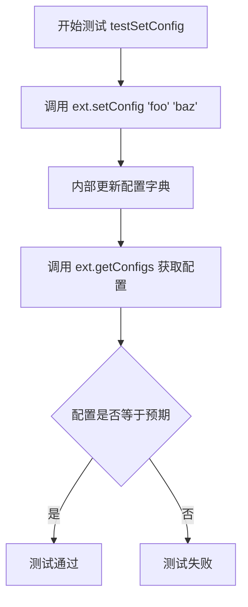

#### 带注释源码

```python
def testSetConfig(self):
    """
    测试扩展类的 setConfig 方法功能。
    
    验证逻辑：
    1. 使用 setConfig 方法将 'foo' 配置项的值从 'bar' 修改为 'baz'
    2. 调用 getConfigs 获取当前所有配置
    3. 断言配置字典包含更新后的 'foo' 值以及未修改的 'bar' 值
    """
    # 调用被测试的 setConfig 方法，修改 'foo' 配置项的值为 'baz'
    self.ext.setConfig('foo', 'baz')
    
    # 使用断言验证配置更新是否成功
    # 预期结果：{'foo': 'baz', 'bar': 'baz'}
    # 原始配置：{'foo': 'bar', 'bar': 'baz'}
    # setConfig 应该只修改指定键的值，不影响其他配置项
    self.assertEqual(self.ext.getConfigs(), {'foo': 'baz', 'bar': 'baz'})
```

#### 相关方法信息（从测试代码推断）

根据测试代码上下文，`setConfig` 方法的实际实现位于 `markdown.extensions.Extension` 类中，其特征如下：

- **方法名**：Extension.setConfig
- **参数**：
  - `key`：字符串，要设置的配置项名称
  - `value`：任意类型，要设置的新值
- **返回值**：无返回值（`None`），直接修改实例的配置字典
- **抛出异常**：当 `key` 不存在于配置定义中时，抛出 `KeyError`（由 testSetConfigWithBadKey 测试验证）


### `TestExtensionClass.testSetConfigWithBadKey`

该测试方法用于验证当向扩展配置系统传入不存在的配置键（bad key）时，`setConfig` 方法能够正确抛出 `KeyError` 异常，从而确保配置系统的错误处理机制正常工作。

参数：

- `self`：`TestExtensionClass`，测试类的实例，包含待测试的扩展对象

返回值：`None`，测试方法无返回值，通过 `assertRaises` 断言异常是否被正确抛出

#### 流程图

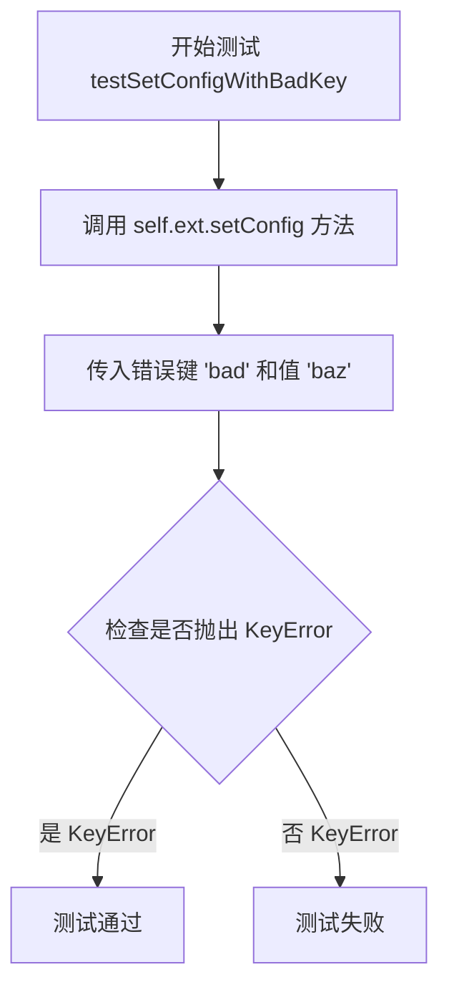

#### 带注释源码

```python
def testSetConfigWithBadKey(self):
    """
    测试使用无效的配置键设置值时是否抛出 KeyError 异常。
    
    该测试验证 Extension.setConfig 方法能够正确处理无效的键名，
    当尝试设置一个不存在的配置项时，应抛出 KeyError 异常。
    """
    # `self.ext.setConfig('bad', 'baz)` => `KeyError`
    # 使用 assertRaises 验证 setConfig 在接收无效键 'bad' 时会抛出 KeyError
    # 参数依次为：期望的异常类型、要调用的方法、方法参数
    self.assertRaises(KeyError, self.ext.setConfig, 'bad', 'baz')
```


### `TestExtensionClass.testConfigAsKwargsOnInit`

该方法是一个单元测试，用于验证扩展类在初始化时能否通过关键字参数（kwargs）正确接收和设置配置项。

参数：

- `self`：`TestExtensionClass`，测试方法所属的实例对象，用于访问测试类的属性和方法

返回值：`None`，该方法为测试方法，无显式返回值，通过 `assertEqual` 断言验证配置是否正确。

#### 流程图

```mermaid
flowchart TD
    A[开始测试] --> B[创建TestExtension子类实例<br/>传入foo='baz', bar='blah']
    B --> C[调用getConfigs获取所有配置]
    C --> D{断言配置是否等于<br/>{'foo': 'baz', 'bar': 'blah'}}
    D -->|是| E[测试通过]
    D -->|否| F[测试失败抛出AssertionError]
```

#### 带注释源码

```python
def testConfigAsKwargsOnInit(self):
    """
    测试扩展类在初始化时可以通过关键字参数（kwargs）传递配置。
    
    该测试验证了Extension类的__init__方法能够接受任意关键字参数，
    并将其存储在config字典中，供后续通过getConfig/getConfigs方法获取。
    """
    # 使用关键字参数创建扩展类实例
    # 期望这些参数会被自动转换为配置项
    ext = self.ExtKlass(foo='baz', bar='blah')
    
    # 验证通过getConfigs方法获取的配置与传入的参数一致
    self.assertEqual(ext.getConfigs(), {'foo': 'baz', 'bar': 'blah'})
```


### `TestMetaData.setUp`

该方法是一个测试 fixture（测试夹具），在每个 `TestMetaData` 类中的测试方法执行前自动调用，用于初始化测试环境。它创建了一个加载了 `meta` 扩展的 `Markdown` 实例，供后续测试使用。

参数：

- `self`：`unittest.TestCase`，TestMetaData 测试类的实例本身，隐式参数

返回值：`None`，无返回值

#### 流程图

```mermaid
flowchart TD
    A([开始 setUp]) --> B[创建 Markdown 实例]
    B --> C[配置 extensions=['meta']]
    C --> D[将实例赋值给 self.md]
    D --> E([结束])
```

#### 带注释源码

```python
def setUp(self):
    """
    测试前置设置方法。
    
    在每个 TestMetaData 类中的测试方法运行前被调用，
    用于初始化测试所需的 Markdown 实例。
    """
    # 创建 Markdown 实例并加载 'meta' 扩展
    # meta 扩展用于解析文档中的元数据（如 Title、Author 等）
    self.md = markdown.Markdown(extensions=['meta'])
```


### `TestMetaData.testBasicMetaData`

该方法用于测试 Markdown 文档的基本元数据解析功能，验证元数据扩展能否正确提取文档头部的键值对（如标题、作者、空白数据）并将其存储在 `Meta` 属性中，同时确保元数据内容不会出现在转换后的 HTML 输出中。

参数：

- 无（测试方法，仅包含 `self` 参数）

返回值：`None`，该方法为测试方法，通过断言验证功能，不返回具体值

#### 流程图

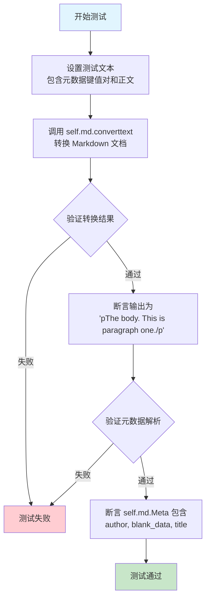

#### 带注释源码

```python
def testBasicMetaData(self):
    """ Test basic metadata. """
    # 定义包含元数据和正文的测试 Markdown 文本
    # 元数据格式：Key: Value，多行值通过缩进表示延续
    text = '''Title: A Test Doc.
Author: Waylan Limberg
        John Doe
Blank_Data:

The body. This is paragraph one.'''
    
    # 调用 Markdown 转换器处理文本
    # 元数据扩展会提取 'Title:', 'Author:', 'Blank_Data:' 行
    # 剩余内容作为文档正文进行转换
    self.assertEqual(
        self.md.convert(text),
        '<p>The body. This is paragraph one.</p>'
    )
    
    # 验证元数据是否正确解析到 self.md.Meta 字典中
    # Meta 字典的键为小写，值为列表（支持多值）
    self.assertEqual(
        self.md.Meta, {
            'author': ['Waylan Limberg', 'John Doe'],  # 多行作者名合并为列表
            'blank_data': [''],                         # 空白数据的值为空字符串
            'title': ['A Test Doc.']                    # 标题值
        }
    )
```


### TestMetaData.testYamlMetaData

测试方法，用于验证Markdown元数据扩展能够正确解析使用简单YAML格式指定的元数据。

参数：

- `self`：TestMetaData，当前测试用例的实例对象

返回值：`None`，无返回值（测试方法）

#### 流程图

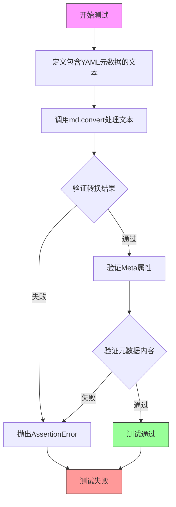

#### 带注释源码

```python
def testYamlMetaData(self):
    """ Test metadata specified as simple YAML. """
    
    # 定义测试用的文本，包含YAML格式的元数据
    # 使用---作为YAML元数据块的开始和结束标记
    text = '''---
Title: A Test Doc.
Author: [Waylan Limberg, John Doe]
Blank_Data:
---

The body. This is paragraph one.'''
    
    # 验证Markdown转换结果是否正确
    # 元数据部分应该被移除，只保留正文内容并转换为HTML
    self.assertEqual(
        self.md.convert(text),
        '<p>The body. This is paragraph one.</p>'
    )
    
    # 验证解析后的元数据是否正确存储在Meta属性中
    # 注意：YAML列表被作为字符串整个存储
    self.assertEqual(
        self.md.Meta, {
            'author': ['[Waylan Limberg, John Doe]'],
            'blank_data': [''],
            'title': ['A Test Doc.']
        }
    )
```


### `TestMetaData.testMissingMetaData`

该测试方法用于验证 Markdown 处理器在处理不包含元数据的文档时的正确性，确保代码块内容被正确转换且元数据为空字典。

参数：

- `self`：`TestMetaData`，测试类实例，包含了测试所需的 Markdown 实例和测试状态

返回值：无返回值（`None`），测试方法通过 `assertEqual` 断言验证行为，不返回任何值

#### 流程图

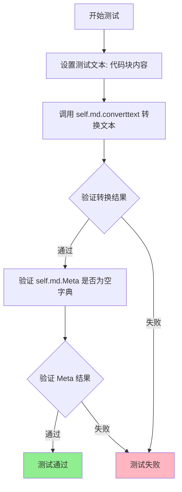

#### 带注释源码

```python
def testMissingMetaData(self):
    """ Test document without Meta Data. """
    # 定义测试文本：一个带有缩进的代码块，不是元数据
    text = '    Some Code - not extra lines of meta data.'
    
    # 验证 convert 方法将代码块转换为 HTML
    self.assertEqual(
        self.md.convert(text),
        '<pre><code>Some Code - not extra lines of meta data.\n'
        '</code></pre>'
    )
    
    # 验证文档中没有元数据，Meta 应该为空字典
    self.assertEqual(self.md.Meta, {})
```


### `TestMetaData.testMetaDataWithoutNewline`

测试文档仅包含元数据且末尾没有换行符时的处理情况。

参数：

- `self`：`TestMetaData`，测试类实例，用于访问测试所需的 markdown 实例

返回值：`None`，测试方法无返回值，通过断言验证功能

#### 流程图

```mermaid
flowchart TD
    A[开始测试] --> B[设置输入文本: title: No newline]
    B --> C[调用 self.md.converttext]
    C --> D{转换结果是否为空字符串}
    D -->|是| E[断言 self.md.Meta 等于 title: [No newline]]
    D -->|否| F[测试失败]
    E --> G{元数据断言是否通过}
    G -->|是| H[测试通过]
    G -->|否| I[测试失败]
```

#### 带注释源码

```python
def testMetaDataWithoutNewline(self):
    """ Test document with only metadata and no newline at end."""
    # 定义测试输入：仅包含一行元数据，末尾无换行符
    text = 'title: No newline'
    
    # 验证 convert 方法处理无换行元数据后返回空字符串
    # （元数据被提取后，正文内容为空）
    self.assertEqual(self.md.convert(text), '')
    
    # 验证元数据被正确解析并存储在 Meta 属性中
    # 元数据键名会被转换为小写
    self.assertEqual(self.md.Meta, {'title': ['No newline']})
```


### `TestMetaData.testMetaDataReset`

该测试方法用于验证调用Markdown实例的reset()方法后，元数据（Meta）是否被完全清除。

参数：

- `self`：`TestMetaData`，测试类的实例对象

返回值：`None`，测试方法无返回值，通过断言验证Meta被清空

#### 流程图

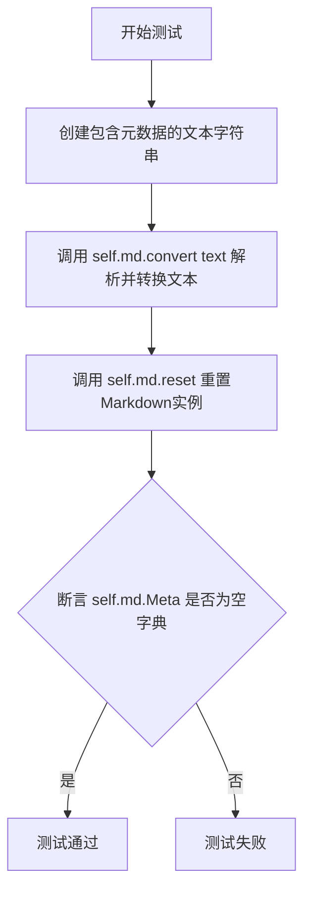

#### 带注释源码

```python
def testMetaDataReset(self):
    """ Test that reset call remove Meta entirely """
    # 定义包含元数据的测试文本，包含标题、作者和空白数据字段
    text = '''Title: A Test Doc.
Author: Waylan Limberg
        John Doe
Blank_Data:

The body. This is paragraph one.'''
    # 使用Markdown实例转换文本，这会触发元数据解析
    self.md.convert(text)

    # 调用Markdown实例的reset方法重置状态
    self.md.reset()
    # 断言验证reset后Meta字典被完全清空
    self.assertEqual(self.md.Meta, {})
```


### `TestWikiLinks.setUp`

该方法是 `TestWikiLinks` 测试类的初始化 fixture，在每个测试方法执行前被自动调用，用于准备测试环境。它创建了一个配置了 `wikilinks` 扩展的 `Markdown` 实例，并预先设置了一个包含 Wiki 链接的测试文本，供后续测试用例使用。

参数：无需显式参数（`self` 为隐式的 Python 实例参数）

返回值：`None`，无返回值（仅执行初始化操作）

#### 流程图

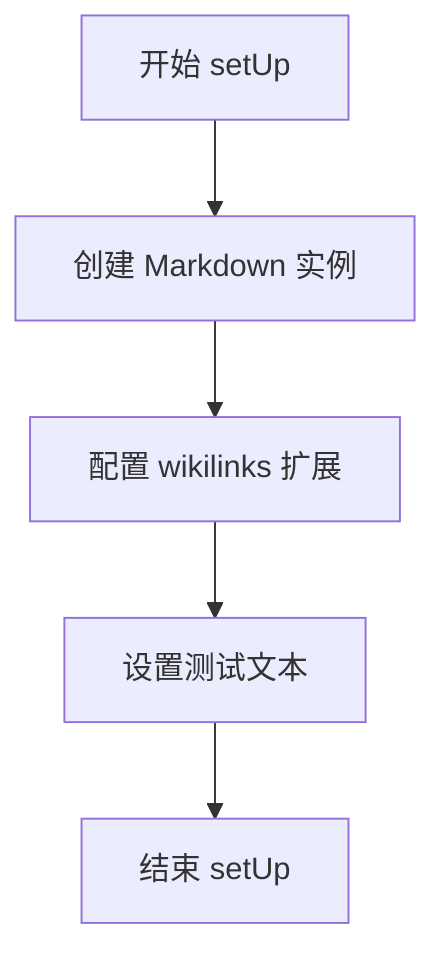

#### 带注释源码

```python
def setUp(self):
    """
    测试前置准备方法，在每个测试方法运行前被调用。
    用于初始化 Markdown 解析器和测试数据。
    """
    # 创建一个配置了 'wikilinks' 扩展的 Markdown 实例
    # wikilinks 扩展用于解析 [[WikiLink]] 这样的链接语法
    self.md = markdown.Markdown(extensions=['wikilinks'])
    
    # 预设测试文本，包含一个标准的 Wiki 链接语法
    # 用于后续测试用例验证链接转换是否正确
    self.text = "Some text with a [[WikiLink]]."
```


### `TestWikiLinks.testBasicWikilinks`

该方法是Python Markdown库的单元测试用例，用于验证Wiki链接扩展的基本功能。测试通过比较Markdown转换后的HTML输出与预期结果，确认`[[WikiLink]]`语法能正确转换为带有`wikilink`类名的HTML锚点标签。

参数：

- `self`：隐式参数，`TestWikiLinks`类的实例方法必需参数

返回值：无（`None`），该方法为`unittest.TestCase`的测试用例，通过`assertEqual`断言验证行为，若失败则抛出异常

#### 流程图

```mermaid
flowchart TD
    A[测试开始] --> B[获取Markdown实例]
    B --> C[调用md.convert方法]
    C --> D[传入测试文本 'Some text with a [[WikiLink]].]
    D --> E{转换结果是否等于预期HTML}
    E -->|是| F[测试通过]
    E -->|否| G[测试失败/抛出AssertionError]
    
    subgraph 预期输出
    H['<p>Some text with a <a class=\"wikilink\" href=\"/WikiLink/\">WikiLink</a>.</p>']
    end
```

#### 带注释源码

```python
def testBasicWikilinks(self):
    """ Test `[[wikilinks]]`. """
    # 断言：验证Markdown将包含Wiki链接的文本转换为正确的HTML
    # 预期行为：
    #   - 输入: "Some text with a [[WikiLink]]."
    #   - 输出: <p>Some text with a <a class="wikilink" href="/WikiLink/">WikiLink</a>.</p>
    #
    # Wiki链接语法 [[WikiLink]] 被转换为:
    #   - <a> 标签，包含 class="wikilink"
    #   - href 属性默认为 "/WikiLink/" (根路径 + 链接文本)
    #   - 链接文本显示为 "WikiLink"
    
    self.assertEqual(
        self.md.convert(self.text),  # 调用Markdown实例的convert方法转换文本
        '<p>Some text with a '       # 预期输出的第一部分
        '<a class="wikilink" href="/WikiLink/">WikiLink</a>.</p>'  # 完整预期HTML
    )
```


### `TestWikiLinks.testWikilinkWhitespace`

该方法是Python Markdown测试套件中的一部分，用于验证Wiki链接扩展（Wikilinks Extension）对空白字符的处理是否正确。具体来说，它测试两种情况：一是包含前导、尾随或中间空白的Wiki链接（如`[[ foo bar_baz ]]`）是否能正确转换为带有下划线连接的HTML链接；二是空的Wiki链接（如`[[ ]]`）是否会被正确忽略并转换为纯文本。

参数：

- `self`：隐式参数，`TestWikiLinks`类的实例，用于访问测试类的属性和方法

返回值：`None`（无显式返回值），该方法通过`unittest.TestCase`的`assertEqual`方法进行断言测试，测试通过则无输出，失败则抛出`AssertionError`

#### 流程图

```mermaid
flowchart TD
    A[开始测试 testWikilinkWhitespace] --> B[初始化Markdown实例并加载wikilinks扩展]
    B --> C[测试场景1: 转换 '[[ foo bar_baz ]]']
    C --> D{转换结果是否为<br/>'<p><a class=\"wikilink\" href=\"/foo_bar_baz/\">foo bar_baz</a></p>'}
    D -->|是| E[断言通过]
    D -->|否| F[抛出AssertionError]
    E --> G[测试场景2: 转换 'foo [[ ]] bar']
    G --> H{转换结果是否为<br/>'<p>foo  bar</p>'}
    H -->|是| I[断言通过]
    H -->|否| J[抛出AssertionError]
    F --> K[测试失败]
    I --> K
    K[结束测试]
```

#### 带注释源码

```python
def testWikilinkWhitespace(self):
    """ Test whitespace in `wikilinks`. """
    
    # 测试场景1：带有空白的Wiki链接
    # 输入: '[[ foo bar_baz ]]'
    # 期望输出: 包含正确href和文本的HTML链接
    # 空白被处理为连接符，生成 /foo_bar_baz/
    self.assertEqual(
        self.md.convert('[[ foo bar_baz ]]'),
        '<p><a class="wikilink" href="/foo_bar_baz/">foo bar_baz</a></p>'
    )
    
    # 测试场景2：空的Wiki链接
    # 输入: 'foo [[ ]] bar'
    # 期望输出: 原始文本，Wiki链接部分被移除
    # 空链接被忽略，只保留周围的普通文本
    self.assertEqual(
        self.md.convert('foo [[ ]] bar'),
        '<p>foo  bar</p>'
    )
```


### `TestWikiLinks.testSimpleSettings`

这是一个单元测试方法，用于验证 WikiLinks 扩展在简单配置下能否正确将 Markdown 中的 `[[WikiLink]]` 语法转换为带有自定义 URL 基础路径、结尾和 CSS 类名的 HTML 锚点标签。

参数：

- `self`：TestWikiLinks 实例，测试类的隐式参数，用于访问测试所需的资源和配置

返回值：`None`，该方法为测试方法，通过 `assertEqual` 断言验证功能，不返回任何值

#### 流程图

```mermaid
flowchart TD
    A[开始测试 testSimpleSettings] --> B[准备测试文本: 'Some text with a [[WikiLink]].']

    B --> C[调用 markdown.markdown 方法]
    
    C --> D[配置 WikiLinkExtension 扩展参数]
    D --> D1[base_url='/wiki/']
    D --> D2[end_url='.html']
    D --> D3[html_class='foo']
    
    C --> E[执行 Markdown 转换]
    E --> F{转换结果是否匹配预期}
    
    F -->|是| G[测试通过]
    F -->|否| H[测试失败]
    
    G --> I[结束]
    H --> I
```

#### 带注释源码

```python
def testSimpleSettings(self):
    """
    测试简单的 WikiLinks 配置选项。
    
    验证使用自定义 base_url、end_url 和 html_class 参数时，
    WikiLinks 扩展能够正确生成带有这些属性的 HTML 链接。
    """
    
    # 使用 assertEqual 断言验证 markdown.markdown() 的输出
    # 参数 1: 要转换的 Markdown 文本
    # 参数 2: extensions 配置列表，包含一个配置好的 WikiLinkExtension
    self.assertEqual(
        markdown.markdown(
            # 实例变量 self.text 的值为 "Some text with a [[WikiLink]]."
            self.text, 
            extensions=[
                # 导入并实例化 WikiLinkExtension，传入三个配置参数
                markdown.extensions.wikilinks.WikiLinkExtension(
                    base_url='/wiki/',      # 链接的基础 URL 路径
                    end_url='.html',        # 链接的结尾 URL 后缀
                    html_class='foo'        # 应用于链接的 CSS 类名
                )
            ]
        ),
        # 期望的 HTML 输出结果
        '<p>Some text with a '
        '<a class="foo" href="/wiki/WikiLink.html">WikiLink</a>.</p>'
    )
```


### `TestWikiLinks.testComplexSettings`

该测试方法用于验证 WikiLink 扩展在复杂配置场景下的功能，包括自定义基础URL、结束URL以及空HTML类名的正确处理。

参数：

- `self`：`unittest.TestCase` 的实例方法隐式参数，无需显式传递

返回值：`None`（无返回值），该方法为测试用例，通过 `assertEqual` 断言验证转换结果的正确性

#### 流程图

```mermaid
flowchart TD
    A[开始测试] --> B[创建Markdown实例]
    B --> C[配置wikilinks扩展]
    C --> D[设置复杂配置项<br/>base_url: http://example.com/<br/>end_url: .html<br/>html_class: '']
    D --> E[设置safe_mode=True]
    E --> F[调用md.convert转换文本]
    F --> G[断言转换结果是否符合预期]
    G --> H{断言结果}
    H -->|通过| I[测试通过]
    H -->|失败| J[测试失败]
```

#### 带注释源码

```python
def testComplexSettings(self):
    """ Test Complex Settings. """
    # 创建一个配置了复杂设置的 Markdown 实例
    md = markdown.Markdown(
        extensions=['wikilinks'],  # 启用 wikilinks 扩展
        extension_configs={
            'wikilinks': [
                # 配置基础URL为 http://example.com/
                ('base_url', 'http://example.com/'),
                # 配置URL后缀为 .html
                ('end_url', '.html'),
                # 配置HTML类名为空字符串
                ('html_class', '')
            ]
        },
        # 启用安全模式
        safe_mode=True
    )
    # 断言转换结果是否匹配预期输出
    self.assertEqual(
        md.convert(self.text),  # 将测试文本转换为HTML
        '<p>Some text with a '  # 预期输出的第一部分
        '<a href="http://example.com/WikiLink.html">WikiLink</a>.</p>'  # 预期输出的完整HTML
    )
```


### `TestWikiLinks.testWikilinksMetaData`

该方法用于测试 Markdown 的 `MetaData` 扩展与 `Wikilinks` 扩展的集成功能，验证 wiki 链接的 URL 和样式是否能够通过元数据进行配置，以及元数据不会在不同的文档转换之间泄漏。

参数：

- `self`：`TestWikiLinks` 实例，测试类的自身引用

返回值：`None`，该方法为测试方法，通过 `assertEqual` 断言验证行为，不返回任何值

#### 流程图

```mermaid
flowchart TD
    A[开始测试] --> B[定义包含wiki元数据的文本]
    B --> C[创建Markdown实例并加载meta和wikilinks扩展]
    C --> D[调用md.convert方法转换文本]
    D --> E{验证转换结果}
    E -->|通过| F[断言HTML输出包含配置的正确URL]
    E -->|失败| I[测试失败]
    F --> G[转换第二个不含元数据的文档]
    G --> H{验证元数据未泄漏}
    H -->|通过| J[断言第二个文档使用默认wikilink样式]
    H -->|失败| I
    J --> K[测试通过]
```

#### 带注释源码

```python
def testWikilinksMetaData(self):
    """ test `MetaData` with `Wikilinks` Extension. """

    # 定义包含wiki链接元数据的markdown文本
    # 元数据配置了base_url、end_url和html_class
    text = """wiki_base_url: http://example.com/
wiki_end_url:   .html
wiki_html_class:

Some text with a [[WikiLink]]."""

    # 创建Markdown实例，同时加载meta和wikilinks扩展
    # meta扩展解析元数据，wikilinks扩展使用这些元数据配置链接
    md = markdown.Markdown(extensions=['meta', 'wikilinks'])

    # 验证转换结果是否正确使用了元数据配置的URL
    # 期望输出包含完整域名和.html后缀
    self.assertEqual(
        md.convert(text),
        '<p>Some text with a '
        '<a href="http://example.com/WikiLink.html">WikiLink</a>.</p>'
    )

    # `MetaData` should not carry over to next document:
    # 验证元数据不会泄漏到下一个文档
    # 下一个文档没有元数据，应使用默认的wikilink样式
    self.assertEqual(
        md.convert("No [[MetaData]] here."),
        '<p>No <a class="wikilink" href="/MetaData/">MetaData</a> '
        'here.</p>'
    )
```


### `TestWikiLinks.testURLCallback`

这是一个单元测试方法，用于测试 WikiLink 扩展中自定义 URL 构建器的功能。测试通过创建一个返回固定 URL 路径的自定义构建器，验证 Markdown 能够正确使用该构建器生成 wikilink 的 href 属性。

参数：

- `self`：`TestCase`，Python unittest 框架的测试方法隐式参数，代表测试用例实例本身

返回值：`None`，测试方法不返回值，通过 `assertEqual` 断言验证功能正确性

#### 流程图

```mermaid
graph TD
    A[开始测试] --> B[导入WikiLinkExtension类]
    B --> C[定义自定义URL构建器my_url_builder]
    C --> D[创建Markdown实例并传入build_url参数]
    D --> E[调用convert方法转换[[foo]]文本]
    E --> F{断言结果是否等于预期HTML}
    F -->|是| G[测试通过]
    F -->|否| H[测试失败]
    G --> I[结束测试]
    H --> I
```

#### 带注释源码

```python
def testURLCallback(self):
    """
    测试使用自定义URL构建器。
    
    该测试方法验证WikiLinkExtension能够接受用户自定义的URL生成逻辑，
    并在转换wikilinks时使用该逻辑构建href属性。
    """
    
    # 从markdown.extensions.wikilinks模块导入WikiLinkExtension类
    # WikiLinkExtension是处理[[wikilink]]语法转换为HTML链接的扩展类
    from markdown.extensions.wikilinks import WikiLinkExtension

    # 定义一个自定义URL构建函数，模拟实际的URL生成逻辑
    # 参数说明：
    #   - label: wikilink中的文本内容，如[[foo]]中的"foo"
    #   - base_url: 基础URL前缀
    #   - end_url: URL后缀
    # 该函数返回固定的URL路径'/bar/'，用于验证自定义构建器被正确调用
    def my_url_builder(label, base, end):
        return '/bar/'

    # 创建Markdown实例，传入WikiLinkExtension作为扩展
    # 通过build_url参数传入自定义URL构建函数
    md = markdown.Markdown(extensions=[WikiLinkExtension(build_url=my_url_builder)])
    
    # 验证转换结果：输入[[foo]]应被转换为包含自定义URL的HTML链接
    # 预期输出：<p><a class="wikilink" href="/bar/">foo</a></p>
    self.assertEqual(
        md.convert('[[foo]]'),
        '<p><a class="wikilink" href="/bar/">foo</a></p>'
    )
```


### `TestAdmonition.setUp`

该方法用于在每个测试用例运行前初始化测试环境，创建一个配置了admonition扩展的Markdown实例，供后续测试使用。

参数：

- `self`：无显式参数，`unittest.TestCase`实例本身

返回值：`None`，该方法仅执行初始化操作，不返回任何值

#### 流程图

```mermaid
flowchart TD
    A[开始 setUp] --> B[创建 Markdown 实例]
    B --> C[配置 admonition 扩展]
    C --> D[赋值给 self.md]
    D --> E[结束 setUp]
```

#### 带注释源码

```python
def setUp(self):
    """为每个测试用例初始化测试环境"""
    # 创建 Markdown 实例并加载 admonition 扩展
    # admonition 扩展用于处理 Markdown 中的警告/提示块
    self.md = markdown.Markdown(extensions=['admonition'])
```


### TestAdmonition.testRE

该测试方法用于验证 Admonition 扩展的正则表达式是否能正确匹配不同格式的警告块标记（admonition）。它通过测试三组不同的输入字符串，检查正则表达式是否能够正确提取警告类型和可选标题。

参数：

- `self`：无参数，测试类实例本身

返回值：`None`，无返回值（测试方法）

#### 流程图

```mermaid
flowchart TD
    A[开始测试] --> B[创建Markdown实例并加载admonition扩展]
    B --> C[获取admonition块处理器的正则表达式RE]
    C --> D[定义测试用例列表]
    D --> E{遍历测试用例}
    E -->|每个测试用例| F[使用RE.match匹配测试字符串]
    F --> G[提取匹配的.groups]
    G --> H{比较结果与期望值}
    H -->|匹配| I[断言通过]
    H -->|不匹配| J[断言失败]
    I --> E
    J --> K[测试失败]
    E --> L{所有用例测试完成}
    L --> M[结束测试]
```

#### 带注释源码

```python
def testRE(self):
    """
    测试 Admonition 扩展的正则表达式匹配功能
    
    该测试方法验证 Admonition 块处理器的正则表达式能够正确解析
    不同格式的警告块标记，包括：
    - 简单的警告类型（如 !!! note）
    - 带标题的警告块（如 !!! note "Please Note"）
    - 带空标题的警告块（如 !!! note ""）
    """
    
    # 获取 Markdown 实例中 admonition 块处理器的正则表达式对象
    RE = self.md.parser.blockprocessors['admonition'].RE
    
    # 定义测试用例列表，每个元组包含：
    # - 输入字符串：警告块标记
    # - 期望结果：包含(警告类型, 标题)的元组
    tests = [
        # 测试1：简单的警告类型，无标题
        ('!!! note', ('note', None)),
        
        # 测试2：警告类型带引号标题
        ('!!! note "Please Note"', ('note', 'Please Note')),
        
        # 测试3：警告类型带空标题
        ('!!! note ""', ('note', '')),
    ]
    
    # 遍历所有测试用例进行验证
    for test, expected in tests:
        # 使用正则表达式匹配测试字符串
        # 并提取捕获组的内容与期望值比较
        self.assertEqual(RE.match(test).groups(), expected)
```


### TestSmarty.setUp

该方法为 TestSmarty 测试类中的初始化方法，在每个测试方法执行前被调用，用于配置 Markdown 扩展环境，包括 smarty 扩展及其自定义替换规则，并创建一个 Markdown 实例供后续测试使用。

参数：

- `self`：`TestSmarty`，测试类实例本身，代表当前测试对象

返回值：`None`，无返回值，仅执行初始化操作

#### 流程图

```mermaid
flowchart TD
    A[开始 setUp] --> B[定义 config 字典]
    B --> C[配置 smarty 扩展参数]
    C --> D[包含 smart_angled_quotes 选项]
    C --> E[包含 substitutions 替换映射]
    E --> F[创建 Markdown 实例]
    F --> G[传入 extensions 和 extension_configs]
    G --> H[将 md 实例赋值给 self.md]
    H --> I[结束 setUp]
```

#### 带注释源码

```python
def setUp(self):
    """
    测试方法执行前的初始化操作，配置 Markdown 的 smarty 扩展。
    """
    # 定义 smarty 扩展的配置字典
    config = {
        'smarty': [
            # 启用智能引号替换功能
            ('smart_angled_quotes', True),
            # 配置自定义替换映射表
            ('substitutions', {
                'ndash': '\u2013',               # 短破折号 (en dash)
                'mdash': '\u2014',               # 长破折号 (em dash)
                'ellipsis': '\u2026',            # 省略号
                'left-single-quote': '&sbquo;',  # 左单引号 (low-9 quote)
                'right-single-quote': '&lsquo;', # 右单引号 (left-9 quote)
                'left-double-quote': '&bdquo;',  # 左双引号 (double low-9 quote)
                'right-double-quote': '&ldquo;', # 右双引号 (double quote)
                'left-angle-quote': '[',         # 左尖括号替换
                'right-angle-quote': ']',        # 右尖括号替换
            }),
        ]
    }
    # 创建 Markdown 实例，启用 smarty 扩展并传入配置
    self.md = markdown.Markdown(
        extensions=['smarty'],
        extension_configs=config
    )
```


### `TestSmarty.testCustomSubstitutions`

这是一个测试方法，用于验证 Markdown 库的 Smarty 扩展是否正确处理自定义替换功能。测试通过比较输入的 Markdown 文本与期望的 HTML 输出来确认智能引号和其他字符替换的正确性。

参数：

- `self`：无显式参数，这是 Python 类方法的第一个隐式参数，代表类的实例本身。

返回值：`None`，这是 Python unittest 测试方法的常见返回类型，测试结果通过断言（assertEqual）来验证。

#### 流程图

```mermaid
flowchart TD
    A[开始测试] --> B[定义测试文本text]
    B --> C[定义期望输出correct]
    C --> D[调用self.md.converttext进行Markdown转换]
    D --> E{转换结果是否等于期望输出}
    E -->|是| F[测试通过]
    E -->|否| G[测试失败抛出AssertionError]
```

#### 带注释源码

```python
def testCustomSubstitutions(self):
    """
    测试 Smarty 扩展的自定义替换功能。
    
    此测试方法验证 Markdown 转换器能否正确处理：
    1. 尖括号转换为方括号（'<<' -> '['，'>>' -> ']'）
    2. 智能引号替换（单引号和双引号）
    3. 破折号和短破折号的 Unicode 字符替换
    4. 省略号的 Unicode 字符替换
    """
    
    # 定义输入文本，包含各种需要替换的字符
    text = """<< The "Unicode char of the year 2014"
is the 'mdash': ---
Must not be confused with 'ndash'  (--) ... >>
"""
    # 定义期望的输出结果
    # - << 和 >> 被替换为 [ 和 ]
    # - 双引号 " 被替换为 &bdquo; 和 &ldquo;
    # - 单引号 ' 被替换为 &sbquo; 和 &lsquo;
    # - --- (em dash) 被替换为 \u2014
    # - -- (en dash) 被替换为 \u2013
    # - ... (省略号) 被替换为 \u2026
    correct = """<p>[ The &bdquo;Unicode char of the year 2014&ldquo;
is the &sbquo;mdash&lsquo;: \u2014
Must not be confused with &sbquo;ndash&lsquo;  (\u2013) \u2026 ]</p>"""
    
    # 使用断言验证转换结果是否符合预期
    self.assertEqual(self.md.convert(text), correct)
```

## 关键组件


### Markdown 核心类

Markdown库的主入口类，负责管理扩展、配置和文档转换流程。

### Extension 扩展基类

提供扩展接口的基类，支持配置管理（getConfig、setConfig等方法），所有扩展都继承自此类。

### MetaData 元数据扩展

从Markdown文档中提取YAML或自定义格式的元数据，存储在Meta属性中供后续使用。

### WikiLinks 维基链接扩展

实现[[WikiLink]]语法转换为HTML链接的功能，支持自定义URL构建器和链接样式配置。

### Admonition 警告提示扩展

实现类似!!! note这样的警告块语法，支持多种类型（note、warning、danger等）和自定义标题。

### Smarty 智能标点扩展

将直引号、破折号、省略号等转换为对应的HTML实体和Unicode字符，支持自定义替换规则。

### 配置管理系统

Extension类中的getConfig、setConfig、getConfigs、getConfigInfo方法构成的配置管理机制，支持字典式配置和默认值处理。

### 块处理器系统

Admonition等扩展使用的blockprocessors系统，通过正则表达式匹配文档块级元素。

### URL构建器接口

WikiLinkExtension中的build_url参数，允许用户自定义URL生成逻辑的回调函数接口。


## 问题及建议


### 已知问题

- **TestExtensionClass.setUp中的内部类定义**：在setUp方法内部定义TestExtension类，导致每次测试运行时都会重新创建类定义，应该将TestExtension移到setUp外部作为模块级定义。
- **重复的Markdown实例创建**：多个测试类中重复编写`self.md = markdown.Markdown(extensions=[...])`模式，可以考虑使用 unittest 的 fixture 或测试基类来减少重复。
- **Magic字符串硬编码**：扩展名称如'wikilinks'、'meta'、'admonition'、'smarty'等在多处硬编码，容易出现拼写错误且不易维护。
- **缺少tearDown方法**：虽然setUp创建了Markdown实例，但没有对应的tearDown来清理可能存在的全局状态或资源。
- **测试隔离性问题**：TestWikiLinks中的testURLCallback在方法内部导入`WikiLinkExtension`，这虽然不会造成功能问题，但不符合标准的导入位置规范。
- **testMissingMetaData测试名称与实现不符**：测试名称暗示测试"缺失"的元数据，但实际上测试的是"代码块"而非元数据。
- **TestSmarty配置字典的复杂性**：配置字典嵌套较深，可读性较差，特别是substitutions字典中的注释"'sb' is not a typo!"表明存在历史遗留的奇怪命名问题。

### 优化建议

- **提取公共测试基类**：创建一个包含常见setUp逻辑的基类，减少重复代码。
- **使用常量或枚举**：将扩展名称、配置键等字符串常量统一管理。
- **添加tearDown方法**：确保每次测试后重置Markdown实例的状态，特别是全局配置。
- **重构TestSmarty配置**：将复杂的配置字典提取为模块级常量或使用配置文件，提高可读性。
- **移动导入到模块顶部**：将testURLCallback中的导入移到文件顶部。
- **修正测试名称**：将testMissingMetaData重命名为testCodeBlockNotMetaData以准确反映测试内容。
- **考虑使用pytest**：pytest提供了更简洁的fixture机制，可以更优雅地管理测试实例的生命周期。

## 其它


### 设计目标与约束

本项目旨在实现一个功能完整的Markdown解析器，支持将Markdown文本转换为HTML。核心约束包括：保持与John Gruber's Markdown规范的高度兼容性、支持扩展机制以允许第三方插件、确保跨Python版本（3.x）的兼容性、维护轻量级依赖（仅使用标准库和PyYAML作为可选依赖）。性能目标为处理常规文档在100ms以内，内存占用控制在合理范围内。

### 错误处理与异常设计

代码中的错误处理主要通过Python内置异常机制实现。在setConfig方法中，当传入无效的配置键时抛出KeyError。Markdown转换过程中的错误（如语法错误、配置错误）应被捕获并转换为用户友好的错误信息。建议增加自定义异常类（如MarkdownError、ExtensionError）以区分不同类型的错误，并提供详细的错误堆栈信息便于调试。

### 数据流与状态机

Markdown转换流程遵循以下状态机：输入文本 → 元数据解析阶段 → 块级元素处理 → 行内元素处理 → HTML输出生成。元数据（Meta）解析器维护内部状态以跟踪当前处理的文档，转换完成后通过reset()方法重置状态。WikiLinks扩展通过配置对象存储URL生成规则，Admonition通过正则表达式匹配器识别特定的Markdown语法结构。

### 外部依赖与接口契约

核心依赖包括Python 3.x标准库，可选依赖PyYAML用于增强的元数据解析。扩展接口契约要求所有扩展类继承自markdown.extensions.Extension基类并实现makeExtension()工厂方法或接受config参数的__init__方法。插件通过register()方法注册到核心处理器，遵循严格的配置传递机制。

### 性能考虑

当前实现主要关注功能正确性，性能优化空间包括：缓存已解析的Markdown AST以避免重复解析、lazy load扩展模块、使用生成器替代列表推导处理大文档、预编译正则表达式。建议的性能指标包括：单文档解析时间、并发处理能力、内存峰值占用。

### 安全性考虑

代码实现了safe_mode参数用于控制HTML输出安全性，防止XSS攻击。safe_mode=True时限制脚本标签和iframe等危险HTML元素的输出。用户提供的自定义URL生成函数需要谨慎处理以避免重定向攻击。扩展配置应进行输入验证，防止恶意配置导致的安全问题。

### 测试策略

当前文件采用unittest框架进行回归测试，覆盖核心扩展功能。建议补充：边界条件测试（如空输入、极大文档）、性能基准测试、安全性测试（XSS payloads）、模糊测试、并发场景测试。测试覆盖率目标应达到80%以上，关键路径达到100%。

### 版本兼容性

代码声明支持Python 3.x版本，需明确最低支持版本（如Python 3.6）。对于PyYAML等可选依赖，应处理缺失情况并提供清晰的错误提示。Unicode处理需兼容不同语言环境，特殊字符转义需符合HTML规范。

### 配置管理

扩展配置通过字典结构管理，支持默认值覆盖。配置项包含名称、默认值、描述信息三要素。建议增加配置验证机制、支持配置继承与覆盖策略、提供配置文件加载功能。运行时配置修改应触发相关缓存的清除。

### 国际化与本地化

错误消息和用户可见文本应支持国际化。HTML输出需正确处理Unicode字符，包括emoji和特殊符号。Smarty扩展已实现多种引号风格的替换，需扩展更多语言特定的排版规则。

### 缓存策略

当前实现中Markdown实例可被复用，建议显式提供缓存接口。元数据（Meta）字典在reset()后应清空。转换后的HTML输出可根据输入哈希进行缓存，但需注意内存占用和缓存失效策略。

### 线程安全性

Markdown类和扩展实例在多线程环境下共享使用时应考虑线程安全。建议扩展实例设计为无状态或提供线程本地存储，核心转换方法应声明线程安全性或提供锁机制。

### 资源管理

文件读取和网络资源获取（如远程URL生成）需妥善处理超时和连接泄漏。长时间运行的解析任务应支持取消操作。大型文档处理时需监控内存使用，防止DoS攻击。

### 监控与日志

建议增加详细日志记录转换过程的各个阶段，便于问题诊断。关键性能指标（如解析时间）应可配置输出。扩展加载失败等重要事件需记录警告级别日志。

### 部署相关

项目支持通过pip安装，setup.py/pip配置需完善。Dockerfile可提供容器化部署方案。环境变量配置接口需文档化，支持云函数和无服务器环境部署。

### 许可证与法律

代码采用BSD许可证（详见LICENSE.md），需确保第三方扩展的兼容性。包含的测试用例需注意授权问题。出口管制合规性需考虑（加密功能相关）。

### 代码规范

遵循PEP 8 Python代码规范，docstring采用Google或Sphinx格式。类型注解需逐步完善以支持静态分析。代码审查流程需建立，PR合并前需通过CI检查。

### 文档维护

API文档需与代码保持同步更新。扩展开发指南应包含示例代码。升级指南需明确记录版本间的破坏性变更。FAQ需收录常见问题和解决方案。


    