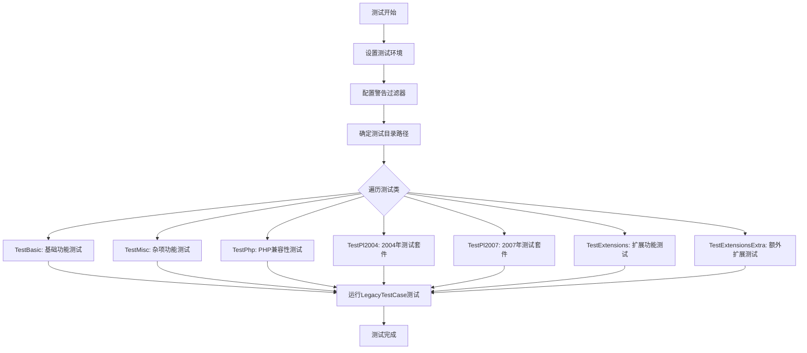
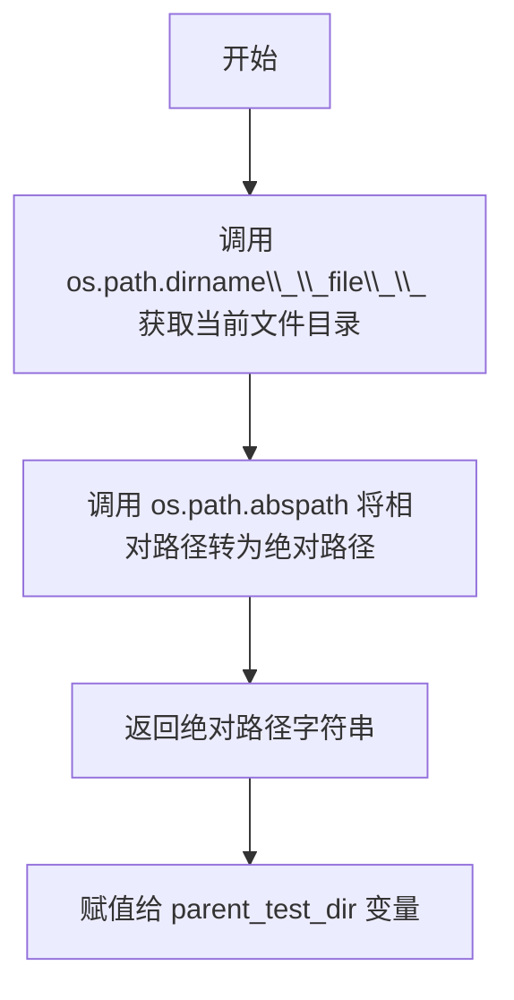
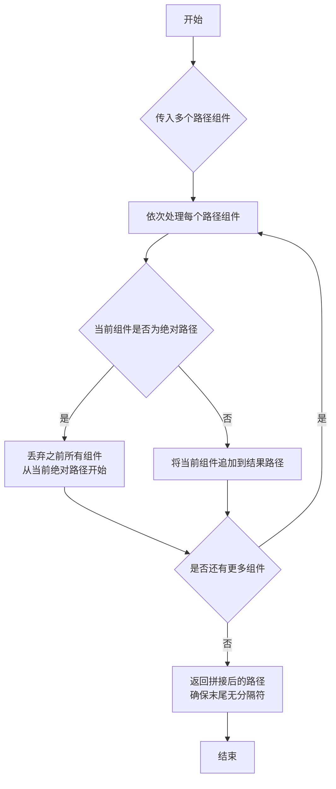

# `markdown\tests\test_legacy.py` 详细设计文档

这是Python Markdown项目的测试套件文件，定义了多个测试类来验证Markdown解析器的基本功能、PHP兼容性、旧版本测试(2004/2007)以及各种扩展(如代码高亮、目录生成、脚注等)的功能正确性。

## 整体流程



## 类结构

```
LegacyTestCase (抽象基类, 来自 markdown.test_tools)
├── TestBasic (基础功能测试)
├── TestMisc (杂项功能测试)
├── TestPhp (PHP兼容性测试)
├── TestPl2004 (2004年测试套件)
├── TestPl2007 (2007年测试套件)
├── TestExtensions (扩展功能测试)
└── TestExtensionsExtra (额外扩展测试)
```

## 全局变量及字段


### `parent_test_dir`
    
测试文件父目录的绝对路径

类型：`str`
    


### `warnings`
    
Python警告模块

类型：`module`
    


### `os`
    
Python操作系统模块

类型：`module`
    


### `TestBasic.TestBasic.location`
    
测试文件所在目录路径

类型：`str`
    


### `TestMisc.TestMisc.location`
    
测试文件所在目录路径

类型：`str`
    


### `TestPhp.TestPhp.location`
    
PHP测试文件目录

类型：`str`
    


### `TestPhp.TestPhp.normalize`
    
是否规范化输出

类型：`bool`
    


### `TestPhp.TestPhp.input_ext`
    
输入文件扩展名

类型：`str`
    


### `TestPhp.TestPhp.output_ext`
    
输出文件扩展名

类型：`str`
    


### `TestPhp.TestPhp.exclude`
    
排除的测试用例列表

类型：`list[str]`
    


### `TestPl2004.TestPl2004.location`
    
2004测试文件目录

类型：`str`
    


### `TestPl2004.TestPl2004.normalize`
    
是否规范化输出

类型：`bool`
    


### `TestPl2004.TestPl2004.input_ext`
    
输入文件扩展名

类型：`str`
    


### `TestPl2004.TestPl2004.exclude`
    
排除的测试用例

类型：`list[str]`
    


### `TestPl2007.TestPl2007.location`
    
2007测试文件目录

类型：`str`
    


### `TestPl2007.TestPl2007.normalize`
    
是否规范化输出

类型：`bool`
    


### `TestPl2007.TestPl2007.input_ext`
    
输入文件扩展名

类型：`str`
    


### `TestPl2007.TestPl2007.exclude`
    
排除的测试用例

类型：`list[str]`
    


### `TestExtensions.TestExtensions.location`
    
扩展测试文件目录

类型：`str`
    


### `TestExtensions.TestExtensions.exclude`
    
排除的测试用例

类型：`list[str]`
    


### `TestExtensions.TestExtensions.attr_list`
    
attr_list扩展配置

类型：`Kwargs`
    


### `TestExtensions.TestExtensions.codehilite`
    
代码高亮扩展配置

类型：`Kwargs`
    


### `TestExtensions.TestExtensions.toc`
    
目录生成扩展配置

类型：`Kwargs`
    


### `TestExtensions.TestExtensions.toc_invalid`
    
无效TOC测试配置

类型：`Kwargs`
    


### `TestExtensions.TestExtensions.toc_out_of_order`
    
乱序TOC测试配置

类型：`Kwargs`
    


### `TestExtensions.TestExtensions.toc_nested`
    
嵌套TOC测试配置(含permalink)

类型：`Kwargs`
    


### `TestExtensions.TestExtensions.toc_nested2`
    
嵌套TOC测试配置(自定义permalink)

类型：`Kwargs`
    


### `TestExtensions.TestExtensions.toc_nested_list`
    
嵌套列表TOC配置

类型：`Kwargs`
    


### `TestExtensions.TestExtensions.wikilinks`
    
维基链接扩展配置

类型：`Kwargs`
    


### `TestExtensions.TestExtensions.github_flavored`
    
GitHub风格扩展配置

类型：`Kwargs`
    


### `TestExtensions.TestExtensions.sane_lists`
    
合理列表扩展配置

类型：`Kwargs`
    


### `TestExtensions.TestExtensions.nl2br_w_attr_list`
    
换行转br与属性列表组合配置

类型：`Kwargs`
    


### `TestExtensions.TestExtensions.admonition`
    
警告提示扩展配置

类型：`Kwargs`
    


### `TestExtensionsExtra.TestExtensionsExtra.location`
    
额外扩展测试文件目录

类型：`str`
    


### `TestExtensionsExtra.TestExtensionsExtra.default_kwargs`
    
默认扩展配置(extra)

类型：`Kwargs`
    


### `TestExtensionsExtra.TestExtensionsExtra.loose_def_list`
    
宽松定义列表配置

类型：`Kwargs`
    


### `TestExtensionsExtra.TestExtensionsExtra.simple_def_lists`
    
简单定义列表配置

类型：`Kwargs`
    


### `TestExtensionsExtra.TestExtensionsExtra.abbr`
    
缩写扩展配置

类型：`Kwargs`
    


### `TestExtensionsExtra.TestExtensionsExtra.footnotes`
    
脚注扩展配置

类型：`Kwargs`
    


### `TestExtensionsExtra.TestExtensionsExtra.extra_config`
    
自定义extra配置(脚注占位符)

类型：`Kwargs`
    
    

## 全局函数及方法


### `os.path.abspath`

`os.path.abspath` 是 Python 标准库 `os.path` 模块中的一个函数，用于将相对路径转换为绝对路径，并解析路径中的符号链接（如果底层操作系统支持）。在给定的代码中，它被用于获取当前测试文件所在目录的绝对路径。

参数：

- `path`：`str`，表示需要转换为绝对路径的路径字符串。

返回值：`str`，返回给定路径的绝对路径字符串。

注意：在提供的代码中，`os.path.abspath` 是作为 Python 标准库的函数被调用的，而不是在该代码库中定义的。以下是代码中使用该函数的部分：

#### 带注释源码

```python
# 导入 os 模块（Python 标准库）
import os

# 获取当前文件的绝对路径
# os.path.abspath: 将相对路径转换为绝对路径
# os.path.dirname(__file__): 获取当前文件所在的目录
# 这里的 __file__ 是当前 Python 模块的路径
parent_test_dir = os.path.abspath(os.path.dirname(__file__))
# parent_test_dir 现在存储的是当前测试文件所在目录的绝对路径
```

#### 流程图



#### 补充说明

由于 `os.path.abspath` 是 Python 标准库的一部分，其实现细节位于 Python 解释器内部。以下是该函数的一般行为：

1. **如果路径已经是绝对路径**：直接返回该路径
2. **如果路径是相对路径**：将其与当前工作目录（CWD）结合形成绝对路径
3. **路径规范化**：移除多余的分割符和 "."（当前目录），解析 ".."（父目录）
4. **符号链接解析**：如果操作系统支持，解析路径中的符号链接

在当前代码中，该函数用于确保测试文件能够正确引用项目中的其他测试资源，无论测试从哪个目录运行。


### `os.path.join`

os.path.join 是 Python 标准库中的路径拼接函数，用于将多个路径组件智能地连接在一起，并根据操作系统自动处理路径分隔符。

参数：

- `*paths`：可变数量的路径组件（str类型），表示需要拼接的路径部分，可以包含目录名或文件名

返回值：`str`，返回拼接后的规范化路径字符串

#### 流程图



#### 带注释源码

```python
# 代码中 os.path.join 的实际使用示例：

# 获取当前测试文件的父目录的绝对路径
# os.path.dirname(__file__) 获取当前文件所在目录
# os.path.abspath() 将相对路径转换为绝对路径
parent_test_dir = os.path.abspath(os.path.dirname(__file__))

# 将父测试目录与子目录名称拼接，形成完整路径
# 例如：'/path/to/markdown/test' + '/basic' -> '/path/to/markdown/test/basic'
class TestBasic(LegacyTestCase):
    location = os.path.join(parent_test_dir, 'basic')

class TestMisc(LegacyTestCase):
    location = os.path.join(parent_test_dir, 'misc')

class TestPhp(LegacyTestCase):
    location = os.path.join(parent_test_dir, 'php')

class TestPl2004(LegacyTestCase):
    location = os.path.join(parent_test_dir, 'pl/Tests_2004')

class TestPl2007(LegacyTestCase):
    location = os.path.join(parent_test_dir, 'pl/Tests_2007')

class TestExtensions(LegacyTestCase):
    location = os.path.join(parent_test_dir, 'extensions')

class TestExtensionsExtra(LegacyTestCase):
    location = os.path.join(parent_test_dir, 'extensions/extra')
```

#### 关键信息

| 项目 | 描述 |
|------|------|
| 函数名 | os.path.join |
| 所属模块 | os.path (Python 标准库) |
| 使用场景 | 在测试框架中构建指向不同测试用例目录的路径 |
| 路径分隔符处理 | 自动根据操作系统使用 `/` 或 `\` |
| 优势 | 跨平台兼容，避免手动处理路径分隔符 |


## 关键组件


### LegacyTestCase

基础测试类，继承自markdown.test_tools，用于执行Markdown解析器的各种测试用例，支持自定义测试位置、输入输出扩展名、规范化选项和排除列表配置。

### Kwargs

测试参数包装类，用于传递扩展名称和扩展配置给测试框架，支持通过关键字参数方式配置多个Markdown扩展及其相关设置。

### TestBasic

基础功能测试类，加载并执行basic目录下的所有测试用例，验证Markdown解析器的基本转换功能。

### TestMisc

杂项功能测试类，加载并执行misc目录下的测试用例，覆盖不属于特定类别的各种Markdown语法测试场景。

### TestPhp

PHP兼容测试类，测试Markdown.pl实现的兼容性，包含输入输出规范化、文本输入与XHTML输出格式转换，并排除11个已知存在差异的测试用例。

### TestPl2004

2004年测试套件类，加载并执行Tests_2004目录下的测试，排除Yuri_Footnotes和Yuri_Attributes两个测试，验证早期Markdown规范兼容性。

### TestPl2007

2007年测试套件类，加载并执行Tests_2007目录下的测试，排除5个已知存在问题的测试用例，验证2007年Markdown规范实现。

### TestExtensions

扩展功能测试类，测试各种Markdown扩展插件，包括attr_list、def_list、smarty、codehilite、toc、wikilinks、fenced_code、sane_lists、nl2br和admonition等功能。

### TestExtensionsExtra

额外扩展测试类，测试extra扩展包的综合功能，包含def_list、abbr、footnotes等子扩展，并支持自定义脚注位置标记符配置。

### parent_test_dir

全局变量，存储测试文件所在目录的绝对路径，用于所有测试类定位测试用例文件。

### warnings配置

通过Python warnings模块配置测试期间的警告处理策略，将警告设为错误以确保测试严格性，同时对PendingDeprecationWarning和特定模块的DeprecationWarning保持默认处理。


## 问题及建议


### 已知问题

-   **魔法字符串和硬编码值**：排除的测试名称（如 `'Quotes_in_attributes'`, `'Inline_HTML_(Span)'` 等）以硬编码字符串形式分散在多个测试类中，缺乏统一管理，容易导致拼写错误或遗漏
-   **路径构造方式**：使用 `os.path.join(parent_test_dir, ...)` 构造路径，假设目录结构固定，缺乏对测试数据缺失情况的容错处理
-   **TODO 标记未追踪**：代码中存在大量 TODO 注释（如 "TODO: fix me", "TODO: fix raw HTML" 等），表明存在已知缺陷但未建立跟踪机制，长期累积形成技术债务
-   **配置重复**：多个测试类重复定义相同的配置参数（`normalize=True`, `input_ext='.text'` 等），违反 DRY 原则
-   **测试类职责不清晰**：`TestPhp` 类中包含大量注释说明为何跳过某些测试，注释本身变成了"文档"，而非通过代码结构或配置系统来表达
-   **警告过滤粒度过粗**：`warnings.filterwarnings` 使用简单的模块名匹配（`module='markdown'`），可能遗漏或误判某些警告
-   **测试隔离性风险**：全局 `warnings.simplefilter('error')` 和 `warnings.filterwarnings` 配置会影响整个测试会话，可能导致测试间相互影响
-   **文档缺失**：测试类缺少类级别的文档字符串说明其测试目的和范围

### 优化建议

-   **集中管理测试配置**：创建配置类或数据文件（如 YAML/JSON）统一管理排除的测试列表和测试参数，便于维护和扩展
-   **建立 TODO 跟踪机制**：使用 GitHub Issues 或项目内部的 TODO 追踪系统，将代码中的 TODO 转换为可追踪的任务
-   **抽象公共配置**：通过测试基类或 mixin 抽象公共配置项，减少重复代码
-   **改进警告处理**：使用 pytest 的警告插件或自定义警告控制器，实现更精细的测试级别警告管理
-   **添加路径验证**：在测试开始前验证测试数据目录和文件是否存在，提供清晰的错误信息
-   **补充文档**：为关键测试类添加文档字符串，说明测试范围、排除的测试及其原因
-   **考虑使用 pytest 参数化**：对于不同测试变体，可考虑使用 pytest 的 parametrize 机制替代手动创建多个 Kwargs

## 其它


### 设计目标与约束

本测试套件旨在验证Python Markdown库在不同场景下的功能正确性，包括基本功能、杂项功能、PHP兼容性、版本兼容性以及各类扩展。测试设计遵循以下约束：使用LegacyTestCase作为基础测试框架，所有测试数据存储在外部文件中，测试目录结构与代码仓库结构保持一致，警告信息需严格处理以确保代码质量，并通过排除列表管理已知问题或暂未实现的特性。

### 错误处理与异常设计

代码中通过warnings模块实现了精细的警告控制策略：使用warnings.simplefilter('error')将大部分警告转换为异常以确保测试失败，这种设计强制开发者在开发过程中处理所有警告。同时，针对PendingDeprecationWarning和特定模块的DeprecationWarning使用warnings.filterwarnings('default')保留默认行为，允许这些警告正常显示而不中断测试流程。这种分层处理既保证了代码质量又提供了适当的灵活性。

### 数据流与状态机

测试数据通过文件系统进行管理，每个测试类对应一个目录（basic、misc、php、pl/Tests_2004、pl/Tests_2007、extensions、extensions/extra），测试框架从这些目录中读取输入文件并生成输出文件进行比对。输入文件通常使用.text或指定的扩展名，输出文件使用.xhtml或其他指定扩展名。测试过程遵循"读取输入→处理→比对输出"的简单数据流模型，没有复杂的状态机设计。

### 外部依赖与接口契约

本测试模块依赖以下外部组件：markdown.test_tools模块提供LegacyTestCase基类和Kwargs辅助类，Python标准库的os模块处理文件路径，warnings模块管理警告行为。测试类通过类属性定义接口契约，包括location（测试目录路径）、normalize（是否规范化输出）、input_ext/input_ext（输入输出文件扩展名）、exclude（排除的测试用例列表）以及各种扩展配置参数。测试框架约定测试目录必须存在且包含有效的测试文件，扩展配置遵循字典格式。

### 测试覆盖范围分析

测试套件覆盖七个主要测试场景：TestBasic验证基础Markdown语法转换；TestMisc测试各种杂项功能；TestPhp确保与PHP Markdown实现的兼容性；TestPl2004和TestPl2007分别测试2004和2007版本的兼容性测试用例；TestExtensions测试各类扩展插件如attr_list、def_list、smarty、codehilite、toc、wikilinks、fenced_code、sane_lists、nl2br、admonition等；TestExtensionsExtra测试extra扩展的子特性包括definition lists、footnotes、abbr等。

### 已知限制与排除原因

代码中的exclude列表记录了已知的功能限制：PHP测试排除Quotes_in_attributes（属性顺序差异）、Inline_HTML_Span（内联HTML处理）、Backslash_escapes（反斜杠转义）、Ins_del（ins/del标签行为）、Auto_Links（自动链接识别）、Empty_List_Item（空列表项）、Headers（标题空白行要求）、Mixed_OLs_and_ULs（混合有序无序列表）、Emphasis（强调标记组合）、Code_block_in_list_item（列表中的代码块）、PHP_Specific_Bugs（PHP特定问题）。2004版本排除Yuri_Footnotes和Yuri_Attributes；2007版本排除Images、Code_Blocks、Links_reference_style、Backslash_escapes、Code_Spans；扩展测试排除codehilite。

### 配置管理策略

测试配置采用分层管理策略：类级别通过location定义测试目录，通过exclude定义排除列表，通过normalize、input_ext、output_ext定义文件处理规则；方法级别通过Kwargs对象传递特定的扩展配置，如TestExtensions类中的attr_list、codehilite、toc、wikilinks等类方法分别配置不同的扩展组合。这种设计允许在类级别定义通用配置的同时，通过方法参数实现细粒度的个性化配置。

    