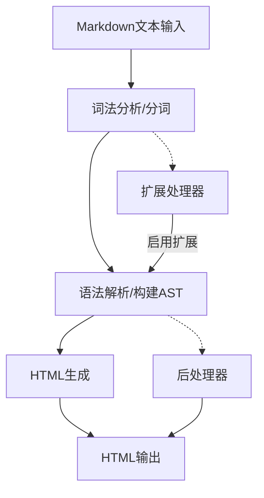

# `markdown\tests\test_syntax\blocks\__init__.py` 详细设计文档

Python Markdown是一个纯Python实现的Markdown标记语言解析器和转换器，支持将Markdown文本转换为HTML，广泛用于博客系统、文档生成等领域。该项目由Manfred Stienstra创建，后由Yuri Takhteyev维护，目前由Waylan Limberg、Dmitry Shachnev和Isaac Muse共同维护，采用BSD许可证。

## 整体流程



## 类结构

```

```

## 全局变量及字段


    

## 全局函数及方法


## 关键组件


### 项目概述

Python Markdown 是一个纯Python实现的Markdown标记语言解析器，支持将Markdown文本转换为HTML，遵循John Gruber's Markdown规范，提供丰富的扩展API和配置选项。

### 关键组件

**Markdown核心解析引擎**：负责将Markdown语法转换为HTML的核心组件，支持标准Markdown语法和自定义扩展。

**扩展系统(Extension System)**：提供插件化架构，允许开发者通过注册扩展来添加自定义Markdown语法支持。

**配置管理系统**：管理解析器的各种配置选项，如代码高亮、表格支持、URL自动链接等。

**文档与社区支持**：包含完整的API文档、GitHub仓库和PyPI分发信息，便于开发者使用和贡献。

### 潜在的技术债务与优化空间

由于提供的是项目文档注释而非实际实现代码，无法从该代码片段中识别具体的技术债务。从项目结构来看，可能存在的优化方向包括：性能优化（针对大型文档）、更多内置扩展的支持、以及与现代Python特性的兼容性提升。

### 其它项目信息

**设计目标**：提供一个轻量级、易扩展的Markdown解析库，兼容标准Markdown语法并支持自定义扩展。

**错误处理**：作为基础库，应提供清晰的错误信息和异常处理机制。

**外部依赖**：纯Python实现，无外部硬依赖，便于集成到各种项目中。

**接口契约**：通过extension接口、treeprocessors等提供扩展点，支持第三方插件开发。


## 问题及建议


### 已知问题

-   版权年份可能过时：声明为2007-2023，但当前年份可能已更新
-   维护者信息可能不够准确：文档中列出的当前维护者可能随时间变化而不再准确
-   缺乏具体的功能描述：文档仅提供链接而无代码核心功能的具体说明
-   缺少版本追踪：未标注当前版本号，无法快速识别正在分析的版本

### 优化建议

-   将静态的维护者信息迁移至项目配置文件（如setup.py或pyproject.toml），通过自动化工具生成避免手动更新
-   考虑使用动态版权年份或年度自动更新机制
-   在文档字符串中添加核心功能的一两句话概述，便于快速了解项目用途
-   添加版本标识符或使用__version__变量引用，便于版本追踪
-   将详细文档链接结构化，提供不同语言版本的文档链接
-   考虑使用Sphinx或类似工具自动生成版本和版权信息


## 其它


### 1. 项目概述

Python Markdown是一个将Markdown文本转换为HTML的Python库，实现了John Gruber's Markdown规范，提供文档转换功能。

### 2. 设计目标与约束

- **设计目标**：实现Markdown文本到HTML的高效转换，保持Markdown的简洁性和可读性
- **性能约束**：转换过程应在合理时间内完成，支持大规模文档处理
- **兼容性目标**：支持Python 3.x版本，兼容主流Markdown语法扩展

### 3. 整体架构设计

Python Markdown采用模块化架构设计，核心组件包括：
- 解析器（Parser）：负责Markdown语法解析
- 渲染器（Renderer）：负责HTML输出生成
- 扩展机制（Extension）：支持自定义扩展插件
- 配置系统（Config）：管理转换选项和参数

### 4. 核心模块与接口

- **markdown.core**：主入口模块，提供Markdown类
- **markdown.parsers**：语法解析模块
- **markdown.renderers**：HTML渲染模块
- **markdown.extensions**：扩展接口定义
- **markdown.treepcessors**：树处理模块

### 5. 数据流与状态机

Markdown转换过程：
1. 原始文本输入
2. 预处理（移除多余空白）
3. 块级元素解析（段落、标题、列表等）
4. 行内元素处理（粗体、链接、代码等）
5. HTML树构建
6. HTML输出生成

### 6. 错误处理与异常设计

- **MarkdownError**：基础异常类
- **BlockParserError**：块级解析错误
- **InlineParserError**：行内解析错误
- **ExtensionError**：扩展加载错误

### 7. 外部依赖与接口契约

- **外部依赖**：Python标准库（re, html等）
- **扩展接口**：Extension基类定义
- **配置文件格式**：YAML/JSON配置支持

### 8. 扩展机制设计

- **PreProcessor**：文本预处理扩展
- **BlockProcessor**：块级元素处理扩展
- **InlineProcessor**：行内元素处理扩展
- **PostProcessor**：输出后处理扩展
- **Treeprocessor**：树结构处理扩展

### 9. 配置管理

- **markdown.Markdown类**：主配置类
- **extensions**：扩展列表配置
- **extension_configs**：扩展参数配置
- **output_format**：输出格式配置

### 10. 性能优化建议

- 缓存机制优化
- 懒加载扩展
- 正则表达式编译优化
- 流式处理支持

    