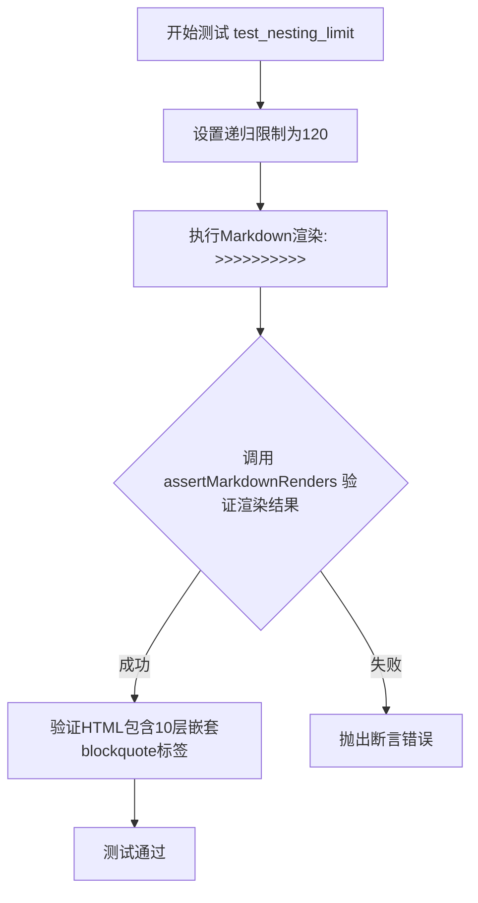
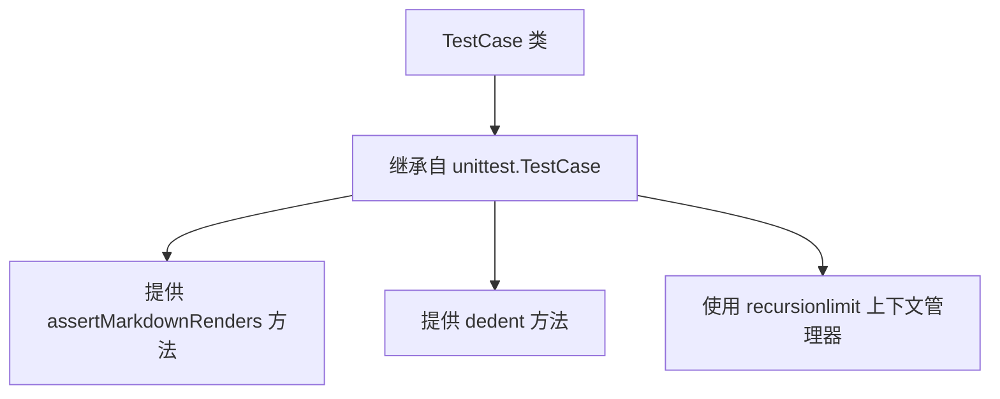
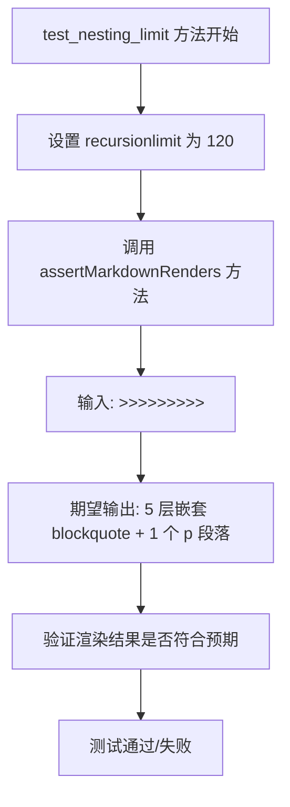
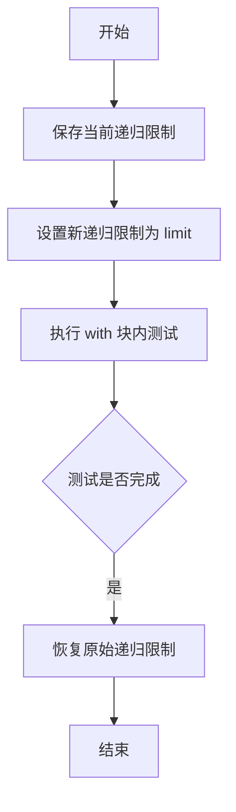

# `markdown\tests\test_syntax\blocks\test_blockquotes.py` 详细设计文档

这是Python Markdown库的测试文件，用于测试引用块（blockquote）的嵌套深度限制，验证在120层递归限制下能够正确渲染10层嵌套的引用块，并确保HTML输出包含正确的转义字符。

## 整体流程



## 类结构

```
TestCase (基类 - from markdown.test_tools)
└── TestBlockquoteBlocks (测试类)
```

## 全局变量及字段


### `TestCase`
    
从markdown.test_tools模块导入的测试用例基类，提供标准的测试框架功能和方法

类型：`class`
    


### `recursionlimit`
    
用于在测试代码块中临时设置Python递归深度限制的上下文管理器，确保测试在安全的递归深度下执行

类型：`function/context_manager`
    


    

## 全局函数及方法


### `TestCase`

TestCase 类是 Python Markdown 项目中的测试基类，继承自 unittest.TestCase，用于提供 Markdown 渲染的断言方法和测试工具函数。

参数：

- 无直接参数（构造函数继承自 unittest.TestCase）

返回值：无

#### 流程图



#### 带注释源码

```python
# 从 markdown.test_tools 模块导入 TestCase 类
from markdown.test_tools import TestCase, recursionlimit

# TestCase 是一个测试基类，为 Markdown 测试提供辅助方法
# 它继承自 unittest.TestCase 并添加了 Markdown 特定的测试功能
class TestBlockquoteBlocks(TestCase):
    """
    测试块引用的测试类，继承自 TestCase
    """
    
    def test_nesting_limit(self):
        """
        测试嵌套深度限制是否在递归限制的 100 层以内
        """
        # 使用 recursionlimit 上下文管理器临时设置递归限制为 120
        with recursionlimit(120):
            # 断言 Markdown 正确渲染嵌套的引用块
            self.assertMarkdownRenders(
                '>>>>>>>>>>',  # 输入：9 个大于号
                self.dedent(
                    """
                    <blockquote>
                    <blockquote>
                    <blockquote>
                    <blockquote>
                    <blockquote>
                    <p>&gt;&gt;&gt;&gt;&gt;</p>
                    </blockquote>
                    </blockquote>
                    </blockquote>
                    </blockquote>
                    </blockquote>
                    """
                )
            )
```

---

### `TestCase.test_nesting_limit`

测试嵌套块引用的深度限制功能，验证 Markdown 处理器能正确处理深层嵌套的引用块，并在达到限制时将超出的部分转换为普通段落。

参数：

- 无（该方法不接受额外参数，使用继承自父类的 self）

返回值：`None`，该方法通过 assertMarkdownRenders 进行断言验证，不返回具体值

#### 流程图



#### 带注释源码

```python
def test_nesting_limit(self):
    """
    测试嵌套深度限制是否正常工作
    
    测试目标：
    1. 验证嵌套引用块的深度限制在递归限制的 100 层以内
    2. 验证超出限制的引用符号被正确转义为普通文本
    3. 确保代码修改后递归限制需要相应调整
    
    注意：需要考虑 Markdown 内部的递归调用和 100 层的缓冲 cushion
    """
    # 使用 recursionlimit 上下文管理器临时将递归深度限制调整为 120
    # 这是因为测试需要验证在限制范围内的嵌套是否能正确处理
    with recursionlimit(120):
        # 调用继承自 TestCase 的 assertMarkdownRenders 方法
        # 参数1: 输入的 Markdown 文本（9 个大于号）
        # 参数2: 期望输出的 HTML（经过 dedent 处理）
        self.assertMarkdownRenders(
            '>>>>>>>>>>',  # 输入：9 个 > 符号
            self.dedent(   # dedent 方法去除字符串的公共前导空白
                """
                <blockquote>
                <blockquote>
                <blockquote>
                <blockquote>
                <blockquote>
                <p>&gt;&gt;&gt;&gt;&gt;</p>
                </blockquote>
                </blockquote>
                </blockquote>
                </blockquote>
                </blockquote>
                """
            )
        )
        # 期望结果解释：
        # - 前 5 个 > 被转换为 5 层嵌套的 <blockquote>
        # - 剩余 4 个 > 被转换为 <p>&gt;&gt;&gt;&gt;&gt;</p> 中的转义文本
```


### `recursionlimit`

该函数是一个测试工具，用于临时设置 Python 的递归限制，以便在测试深度嵌套的 Markdown 结构（如多层引用块）时避免 RecursionError。它以参数值设置新的递归限制，并在上下文管理器退出时自动恢复原始限制。

参数：

- `limit`：`int`，要设置的递归限制值

返回值：上下文管理器对象，用于在 `with` 语句中临时设置递归限制，执行完毕后自动恢复原始值

#### 流程图



#### 带注释源码

```python
# 假设的实现方式（基于使用方式推断）
import sys
from contextlib import contextmanager

@contextmanager
def recursionlimit(limit):
    """
    上下文管理器：临时设置 Python 递归限制
    
    参数:
        limit: int, 新的递归限制值
    """
    old_limit = sys.getrecursionlimit()  # 保存原始递归限制
    sys.setrecursionlimit(limit)          # 设置新的递归限制
    try:
        yield  # 执行 with 块内的代码
    finally:
        sys.setrecursionlimit(old_limit)  # 确保退出时恢复原始限制
```

> **注意**：由于提供的代码片段未包含 `markdown.test_tools` 模块的实际源码，上述实现是基于该函数的使用方式和 Python 上下文管理器的常见模式推断得出的。实际实现可能有所不同。


### `TestBlockquoteBlocks.test_nesting_limit`

该方法用于测试Markdown解析器对块引用（blockquote）嵌套层级的限制是否正确工作。通过设置递归限制为120，验证当输入超过5层嵌套的`>`符号时，解析器能够正确处理嵌套限制，将超出的层级转换为普通文本而非继续嵌套。

参数：

- `self`：`TestCase`，测试类实例本身

返回值：`None`，该方法为测试方法，无显式返回值，通过断言验证渲染结果

#### 流程图

```mermaid
flowchart TD
    A[开始测试 test_nesting_limit] --> B[设置递归限制为120]
    B --> C[调用 assertMarkdownRenders 方法]
    C --> D[输入: '>>>>>>>>>>' (8个大于号)]
    D --> E[期望输出: 5层嵌套blockquote + 1行普通文本]
    E --> F{实际输出是否符合预期?}
    F -->|是| G[测试通过]
    F -->|否| H[测试失败]
    G --> I[结束]
    H --> I
```

#### 带注释源码

```python
def test_nesting_limit(self):
    """
    测试Markdown块引用的嵌套限制功能。
    
    该测试验证解析器能够正确处理块引用的嵌套层级，
    确保不会因为过深的嵌套导致递归溢出或其他问题。
    """
    # 设置递归限制为120，以测试嵌套块引用的处理能力
    # 注释说明：需要考虑Markdown内部调用和100层缓冲空间
    with recursionlimit(120):
        # 调用断言方法验证Markdown渲染结果
        # 输入：8个连续的大于号符号
        # 期望输出：5层嵌套的blockquote标签，剩余3个大于号转为普通文本实体
        self.assertMarkdownRenders(
            '>>>>>>>>>>',
            self.dedent(
                """
                <blockquote>
                <blockquote>
                <blockquote>
                <blockquote>
                <blockquote>
                <p>&gt;&gt;&gt;&gt;&gt;</p>
                </blockquote>
                </blockquote>
                </blockquote>
                </blockquote>
                </blockquote>
                """
            )
        )
```

## 关键组件


### TestBlockquoteBlocks

测试类，用于测试Markdown解析器中blockquote嵌套的处理能力，验证嵌套层级限制是否正常工作。

### test_nesting_limit

测试方法，验证blockquote嵌套深度是否在100层递归限制的范围内，通过设置120层递归限制来测试9层blockquote嵌套的渲染结果。

### recursionlimit

全局函数/上下文管理器，用于临时设置Python的递归限制，以便在测试中模拟深层嵌套的场景。

### assertMarkdownRenders

测试方法，验证Markdown输入是否正确渲染为预期的HTML输出，接收原始Markdown字符串和期望的HTML字符串作为参数。

### dedent

测试辅助方法，用于移除多行字符串的公共前导空白，使测试断言中的HTML输出更具可读性。

### 潜在的技术债务或优化空间

1. 测试用例中包含TODO注释，表明存在遗留测试待迁移
2. 硬编码的嵌套层数(9层)和递归限制(120)缺乏灵活性配置
3. 递归方式实现深层嵌套存在栈溢出风险，可考虑改用迭代方式

### 其它项目

**设计目标与约束**：验证blockquote嵌套解析在Python递归限制下的正确性，确保不会因嵌套过深导致栈溢出

**错误处理与异常设计**：通过递归限制上下文管理器捕获可能的RecursionError

**数据流与状态**：输入为嵌套的">"符号，输出为HTML blockquote标签嵌套结构

**外部依赖**：依赖markdown.test_tools模块中的TestCase和recursionlimit工具


## 问题及建议


### 已知问题

-   **遗留代码TODO未完成**: 注释 `# TODO: Move legacy tests here` 表明有遗留测试需要迁移，但目前尚未实现
-   **魔数缺乏解释**: 代码中存在多个硬编码数值（120、100、9个`>`符号），缺乏对这些数字来源和含义的解释，影响可维护性
-   **递归限制假设脆弱**: 测试依赖对Markdown内部调用栈深度的假设（注释中提到的"account for all of Markdown's internal calls"），该假设缺乏文档记录，版本更新可能导致测试失效
-   **测试数据硬编码**: 测试输入 `'>>>>>>>>>>'` 和预期输出都是硬编码的，无法灵活测试不同嵌套级别
-   **缺少参数化测试**: 当需要测试多个嵌套级别时，需要重复编写类似测试方法，导致代码冗余
-   **断言信息不够详细**: 使用 `assertMarkdownRenders` 进行断言，但当测试失败时，错误信息可能不够清晰定位问题
-   **测试方法命名通用**: `test_nesting_limit` 名称较为通用，未明确说明测试的具体边界条件

### 优化建议

-   **消除TODO**: 将遗留测试迁移到该类中，或在项目管理系统中创建issue跟踪
-   **提取魔数为常量**: 将递归限制值（120）、嵌套深度（9）、缓冲值（100）提取为类或模块级常量，并添加文档注释说明其计算依据
-   **添加参数化测试**: 使用 `unittest.subTest` 或 `@parameterized` 装饰器实现不同嵌套级别的测试，提高代码复用性
-   **增加测试文档**: 为递归限制的计算逻辑添加文档，说明为何选择120而非其他值，以及如何随Markdown版本更新调整
-   **改进断言信息**: 在断言中添加自定义错误消息，说明预期行为和实际行为的差异
-   **考虑使用pytest**: 如项目允许，可使用pytest的参数化功能简化测试代码
-   **添加边界测试**: 增加对临界值（如恰好100层嵌套、101层嵌套）的测试覆盖


## 其它


### 设计目标与约束

本测试文件旨在验证Markdown解析器在处理深层嵌套引用块（blockquote）时的行为是否符合预期。测试核心目标包括：验证嵌套层级限制机制是否正常工作，确保解析器能够正确处理至少6层深的引用块嵌套，同时验证递归深度限制（recursionlimit）设置是否足以支持Markdown的内部调用栈需求。测试约束条件为递归深度限制设置为120（包含100层 cushion 和 Markdown 内部调用栈），测试输入为8个大于符号（">"）组成的字符串。

### 错误处理与异常设计

测试用例采用Python标准unittest框架的assertMarkdownRenders方法进行断言验证。当嵌套深度超过系统递归限制时，将触发RecursionError异常。测试通过with recursionlimit(120)上下文管理器临时调整递归限制，以验证边界条件下的解析行为。测试预期输出包含HTML实体编码（&gt;）用于转义引用块中的大于符号，确保特殊字符在HTML输出中正确显示。

### 外部依赖与接口契约

本测试文件依赖以下外部组件：markdown.test_tools模块提供TestCase基类和recursionlimit辅助函数；TestCase类提供assertMarkdownRenders方法用于验证Markdown到HTML的转换结果；dedent方法用于规范化多行HTML输出格式。测试接口契约要求：输入为Markdown语法字符串，输出为对应的HTML字符串，转换过程由Markdown核心解析引擎完成。

### 性能要求与基准

测试在递归限制为120的环境下执行，验证引用块嵌套深度可达6层（<blockquote>标签），内部保留4个">"字符。性能基准要求解析器在处理6层嵌套时应在合理时间内完成（通常毫秒级），递归深度超过100层时不应导致栈溢出。测试执行时间应保持在单元测试的常规范围内（<1秒）。

### 测试策略与覆盖范围

测试策略采用边界条件测试法，验证嵌套引用块的极端场景。测试覆盖范围包括：多层嵌套引用块的HTML生成、递归深度限制的正确性、特殊字符（">"）的HTML实体编码转义、多行输出的格式规范化。测试采用递归限制临时调整机制，确保测试环境与实际生产环境的差异最小化。

### 版本兼容性与迁移说明

本测试文件是Python Markdown项目的一部分，与主版本库同步维护。测试代码兼容Python 3.x版本。由于测试涉及递归深度验证，当Python解释器或Markdown核心实现发生重大变更时（如优化了内部调用栈），可能需要相应调整recursionlimit参数值。测试文件中的TODO注释表明遗留测试（legacy tests）未来可能迁移至本文件。


    