# `markdown\tests\test_syntax\blocks\test_code_blocks.py` 详细设计文档

这是Python Markdown项目的代码块测试文件，测试各种缩进方式（空格和Tab）以及多行、空白行、转义字符等场景下代码块的解析和HTML转换功能。

## 整体流程

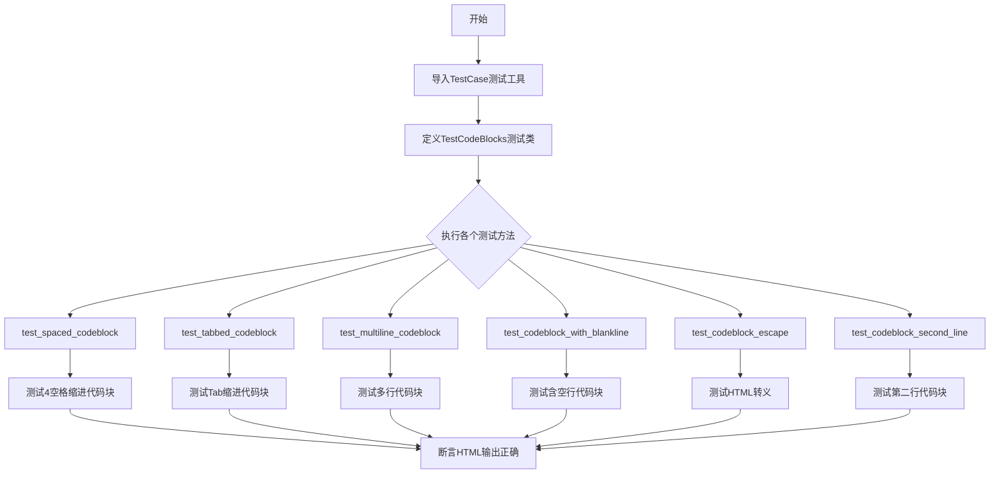

## 类结构

```
TestCase (测试基类)
└── TestCodeBlocks (代码块测试类)
```

## 全局变量及字段


### `TestCase`
    
从markdown.test_tools导入的测试基类，提供Markdown渲染测试的断言方法

类型：`class`
    


    

## 全局函数及方法


# Python Markdown 代码块测试分析文档

## 概述

本文档详细分析Python Markdown项目中处理代码块测试的方法，重点聚焦于`test_spaced_codeblock`测试函数的设计意图、实现逻辑及其在测试框架中的作用。

## 一段话描述

`test_spaced_codeblock`是Python Markdown项目中用于测试带缩进代码块解析功能的单元测试方法，它验证了包含4个空格缩进的文本内容被正确转换为HTML `<pre><code>`标签的代码块格式，这是Markdown规范中定义的标准代码块表示方式。

## 文件整体运行流程

### 测试框架架构

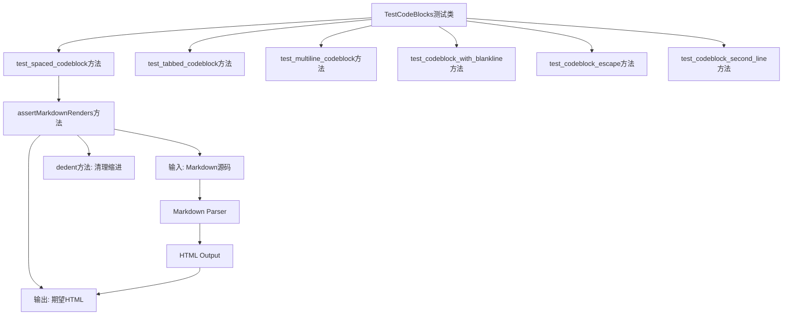

### 测试执行流程

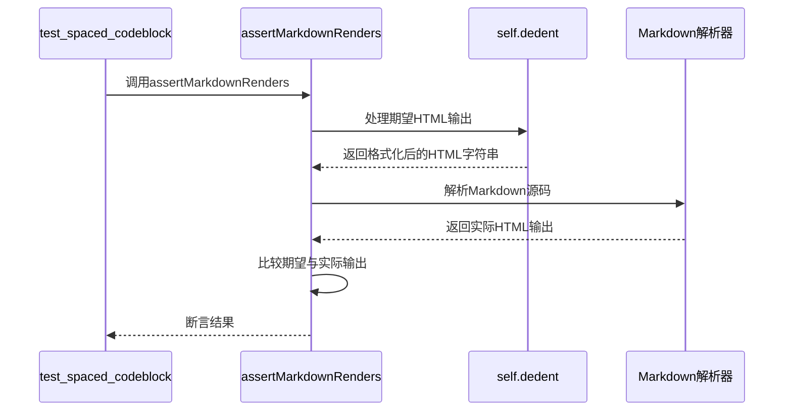

## 类的详细信息

### TestCodeBlocks 类

**所属文件**: `markdown/test_tools.py` (推断)

**类描述**: 继承自`TestCase`的测试类，专门用于测试Markdown解析器的代码块处理功能。

**类字段**:

| 字段名称 | 类型 | 描述 |
|---------|------|------|
| (继承字段) | TestCase | 继承pytest/unittest的测试基类 |

**类方法**:

| 方法名称 | 功能描述 |
|---------|---------|
| `test_spaced_codeblock` | 测试4空格缩进代码块 |
| `test_tabbed_codeblock` | 测试Tab缩进代码块 |
| `test_multiline_codeblock` | 测试多行代码块 |
| `test_codeblock_with_blankline` | 测试含空行的代码块 |
| `test_codeblock_escape` | 测试代码块中的HTML转义 |
| `test_codeblock_second_line` | 测试第二行开始的代码块 |

## test_spaced_codeblock 方法详细信息

### 基本信息

- **名称**: `TestCodeBlocks.test_spaced_codeblock`
- **类型**: 单元测试方法（instance method）
- **所属类**: `TestCodeBlocks`

### 参数信息

| 参数名称 | 参数类型 | 参数描述 |
|---------|---------|---------|
| self | TestCodeBlocks | 测试类实例，无需显式传递 |

### 返回值信息

| 返回值类型 | 返回值描述 |
|-----------|-----------|
| None | 单元测试方法无返回值，通过断言表达测试结果 |

### 方法描述

该测试方法验证Markdown解析器能够正确处理带有4个空格缩进的代码块。根据Markdown规范，以4个空格（或一个Tab）开头的行应该被识别为代码块，并转换为HTML的`<pre><code>`标签格式。

### 流程图

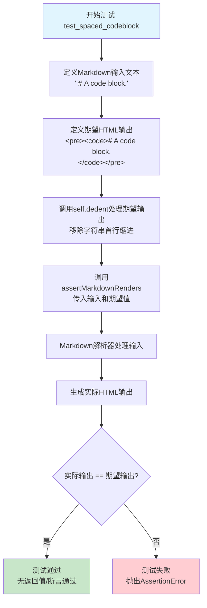

### 带注释源码

```python
def test_spaced_codeblock(self):
    """
    测试带缩进的代码块解析功能
    
    该测试验证Markdown解析器正确处理以4个空格缩进的内容，
    将其转换为HTML代码块标签。
    """
    
    # 调用assertMarkdownRenders进行测试
    # 参数1: Markdown源码输入 - 4个空格后跟注释文本
    # 参数2: 经过dedent处理的期望HTML输出
    self.assertMarkdownRenders(
        '    # A code block.',  # 输入: 带4空格缩进的Markdown文本
        
        # 期望的HTML输出，使用self.dedent()处理多行字符串
        # dedent移除了每行的公共缩进前缀
        self.dedent(
            """
            <pre><code># A code block.
            </code></pre>
            """
        )
    )
```

### 详细注释说明

```python
def test_spaced_codeblock(self):
    """
    测试用例: test_spaced_codeblock
    --------------------------------
    测试目标: 验证4空格缩进代码块的Markdown解析
    
    测试场景:
    - 输入: '    # A code block.'  (前面有4个空格)
    - 期望输出: '<pre><code># A code block.\n</code></pre>'
    
    Markdown规范参考:
    代码块 (Code Blocks) - 以4个空格或1个Tab开头的行
    """
    
    # 第一步: 准备测试输入
    # Markdown语法中，4个空格缩进表示代码块开始
    markdown_input = '    # A code block.'
    
    # 第二步: 准备期望输出
    # HTML代码块使用<pre>和<code>标签包装
    # 原始内容中的特殊字符需要转义(如<变为&lt;)
    # 注意: #符号在HTML代码块中不需要转义
    expected_html = self.dedent("""
        <pre><code># A code block.
        </code></pre>
    """)
    
    # 第三步: 执行测试断言
    # assertMarkdownRenders是TestCase提供的封装方法
    # 内部会调用Markdown库解析输入，并与期望输出比较
    self.assertMarkdownRenders(markdown_input, expected_html)
```

## 关键组件信息

### 1. assertMarkdownRenders

**描述**: TestCase基类提供的测试辅助方法，封装了Markdown解析和结果验证的逻辑。

### 2. self.dedent()

**描述**: 字符串处理工具方法，用于移除多行字符串的公共前缀缩进，使测试代码更清晰易读。

### 3. Markdown Parser

**描述**: Python Markdown库的核心解析器，负责将Markdown语法转换为HTML输出。

## 潜在的技术债务或优化空间

### 1. 测试数据硬编码

- **问题**: 期望的HTML输出字符串在每个测试方法中重复定义
- **优化建议**: 可考虑使用测试数据工厂或参数化测试减少重复

### 2. 缺少参数化测试

- **问题**: 多个类似的代码块测试使用独立方法，而非参数化测试
- **优化建议**: 可使用`pytest.mark.parametrize`进行参数化，减少代码冗余

### 3. 断言信息不够详细

- **问题**: 使用通用的assertMarkdownRenders，失败时信息可能不够具体
- **优化建议**: 添加自定义断言消息，提供更明确的失败原因

### 4. 未覆盖的场景

- **潜在改进**: 
  - 测试不同缩进数量（2空格、6空格等）
  - 测试代码块语言标记（fenced code block）
  - 测试嵌套场景

## 其它项目

### 设计目标与约束

| 目标 | 约束 |
|-----|------|
| 验证Markdown规范遵循性 | 必须符合John Gruber的Markdown定义 |
| 确保代码块解析正确 | 4空格=代码块，Tab=代码块 |
| HTML输出格式一致性 | 使用标准的`<pre><code>`标签 |

### 错误处理与异常设计

- **测试失败**: 抛出`AssertionError`，包含期望值与实际值的差异
- **解析错误**: 由Markdown解析器内部处理，可能抛出`MarkdownError`
- **断言机制**: 使用`assertMarkdownRenders`自动比较，自动处理HTML规范化

### 数据流与状态机

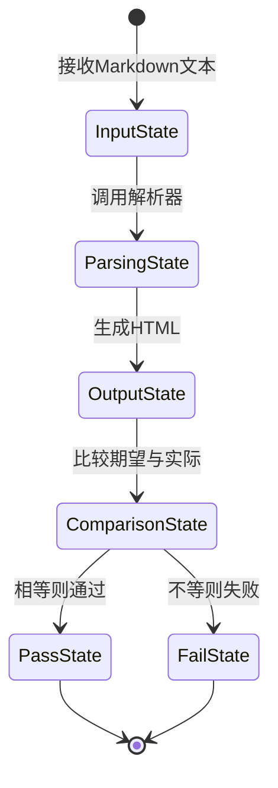

### 外部依赖与接口契约

| 依赖组件 | 接口契约 |
|---------|---------|
| markdown.test_tools.TestCase | 提供assertMarkdownRenders和dedent方法 |
| Markdown解析器 | 输入Markdown文本，输出HTML字符串 |
| Python unittest/pytest | 测试框架基础 |

### 测试覆盖范围分析

```
代码块测试覆盖矩阵:

| 测试方法                      | 缩进类型 | 多行 | 空行 | 转义 | 位置    |
|------------------------------|---------|-----|-----|-----|--------|
| test_spaced_codeblock        | 4空格   | ✗   | ✗   | ✗   | 首行    |
| test_tabbed_codeblock        | Tab     | ✗   | ✗   | ✗   | 首行    |
| test_multiline_codeblock     | 4空格   | ✓   | ✗   | ✗   | 多行    |
| test_codeblock_with_blankline| 4空格   | ✓   | ✓   | ✗   | 多行    |
| test_codeblock_escape        | 4空格   | ✗   | ✗   | ✓   | 首行    |
| test_codeblock_second_line   | 4空格   | ✗   | ✗   | ✗   | 非首行  |
```

### 代码质量评估

- **可读性**: ★★★★★ - 测试意图清晰，代码简洁
- **可维护性**: ★★★★☆ - 少量重复模式，可进一步优化
- **测试覆盖**: ★★★☆☆ - 覆盖主要场景，部分边界情况未覆盖
- **文档完整性**: ★★★★★ - 方法注释清晰，与测试目的匹配


### `TestCodeBlocks.test_tabbed_codeblock`

该测试方法用于验证 Markdown 解析器能正确处理以 Tab 字符开头的代码块，并将其转换为正确的 HTML `<pre><code>` 标签结构。

参数：

- `self`：`TestCase`，测试类实例本身，隐式参数

返回值：`None`，该方法为单元测试方法，通过 `assertMarkdownRenders` 断言验证渲染结果，若失败则抛出异常

#### 流程图

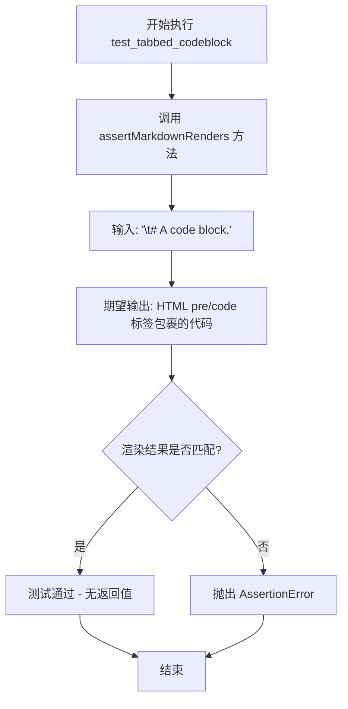

#### 带注释源码

```python
def test_tabbed_codeblock(self):
    """
    测试以 Tab 字符开头的代码块能否正确渲染为 HTML。
    
    Markdown 规范允许使用 Tab 缩进表示代码块，
    该测试验证解析器正确处理这种情况。
    """
    # 调用父类的 assertMarkdownRenders 方法进行渲染验证
    self.assertMarkdownRenders(
        # 输入：包含单个 Tab 字符的 Markdown 源代码
        '\t# A code block.',
        
        # 期望的 HTML 输出：使用 self.dedent 去除缩进
        self.dedent(
            """
            <pre><code># A code block.
            </code></pre>
            """
        )
    )
```


### `TestCodeBlocks.test_multiline_codeblock`

该方法是 `TestCodeBlocks` 测试类中的一个测试用例，用于验证 Markdown 解析器能够正确处理多行代码块（使用缩进表示的代码块），并将多行代码内容转换为正确的 HTML `<pre><code>` 标签格式。

参数：

- `self`：隐式参数，表示测试类的实例本身，无需显式传递

返回值：`None`，该方法为测试用例，通过 `assertMarkdownRenders` 断言方法验证 Markdown 渲染结果是否符合预期，不直接返回值

#### 流程图

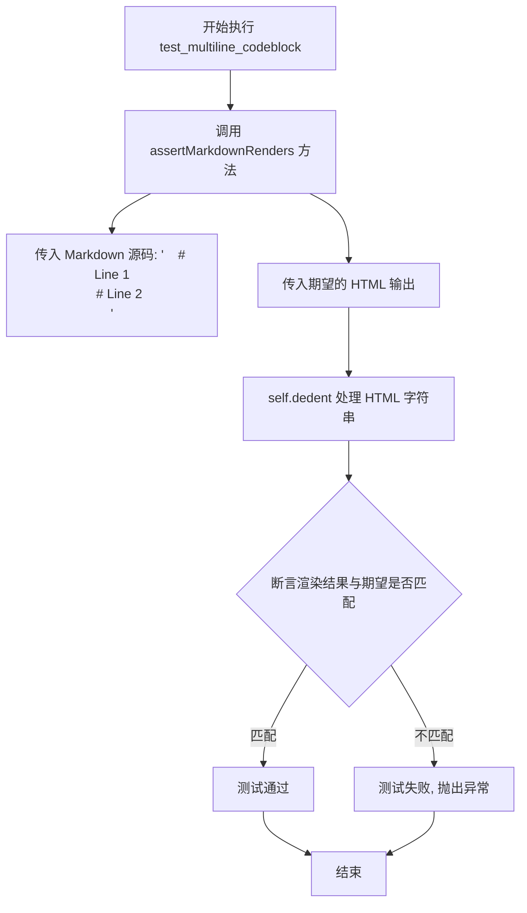

#### 带注释源码

```python
def test_multiline_codeblock(self):
    """
    测试多行代码块的 Markdown 渲染功能。
    
    验证包含多行缩进代码的 Markdown 文本能够正确
    转换为 HTML pre 和 code 标签。
    """
    # 调用 assertMarkdownRenders 进行渲染验证
    # 参数1: Markdown 源码 - 带有缩进的多行代码
    #   - 每行以4个空格缩进表示代码块
    #   - 包含两行注释内容
    self.assertMarkdownRenders(
        '    # Line 1\n    # Line 2\n',  # 输入: Markdown 多行代码块

        # 参数2: 期望的 HTML 输出
        # 使用 self.dedent 移除缩进,得到干净的 HTML 字符串
        self.dedent(
            """
            <pre><code># Line 1
            # Line 2
            </code></pre>
            """
        )
    )
```


### `TestCodeBlocks.test_codeblock_with_blankline`

该测试方法用于验证 Markdown 解析器能够正确处理代码块中包含空行的情况，确保带有空行的缩进代码块被正确转换为 HTML 的 `<pre><code>` 标签，并保留空行内容。

参数：

- `self`：`TestCase`（隐式参数），测试类的实例，用于调用继承自 `TestCase` 的断言方法和工具方法

返回值：`None`，无返回值（测试方法）

#### 流程图

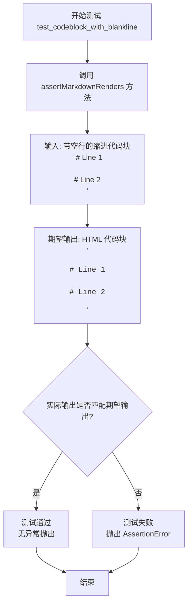

#### 带注释源码

```python
def test_codeblock_with_blankline(self):
    """
    测试 Markdown 解析器处理代码块中空行的能力。
    
    验证带有空行的缩进代码块（4个空格缩进）能够被正确转换为
    HTML 的 <pre><code> 标签，并保留空行内容。
    """
    # 调用父类方法验证 Markdown 渲染结果
    # 参数1: Markdown 源码 - 带空行的缩进代码块
    # 参数2: 期望的 HTML 输出 - 使用 self.dedent() 移除多余缩进
    self.assertMarkdownRenders(
        '    # Line 1\n\n    # Line 2\n',  # 输入: 4空格缩进 + 第一行 + 空行 + 第二行
        
        self.dedent(  # 工具方法: 移除字符串开头的共同空白前缀
            """
            <pre><code># Line 1

            # Line 2
            </code></pre>
            """
        )
    )
```


### TestCodeBlocks.test_codeblock_escape

这个测试方法验证 Markdown 解析器能够正确转义代码块中的 HTML 特殊字符（如 `<`、`>`、`&`），确保它们在生成的 HTML 中以转义形式显示，防止 XSS 攻击和错误渲染。

参数：

- `self`：`TestCodeBlocks`，表示测试类的实例本身，用于调用父类方法

返回值：`None`，测试方法不返回任何值，通过断言进行验证

#### 流程图

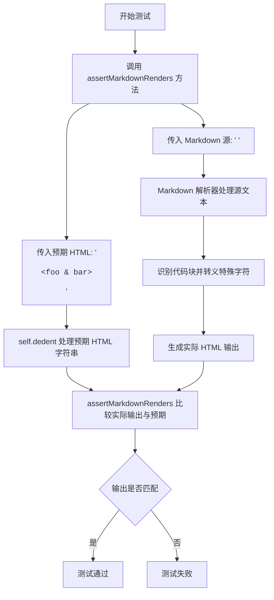

#### 带注释源码

```python
def test_codeblock_escape(self):
    """测试代码块中 HTML 特殊字符的转义处理。
    
    验证 Markdown 解析器在处理代码块时，能够正确地将 
    HTML 特殊字符（如 <, >, &）转义为 HTML 实体，
    防止它们被浏览器解析为 HTML 标签或实体引用。
    """
    # 调用父类的 assertMarkdownRenders 方法进行渲染测试
    self.assertMarkdownRenders(
        '    <foo & bar>',  # Markdown 源文本：包含 HTML 特殊字符的代码块

        self.dedent(
            """
            <pre><code>&lt;foo &amp; bar&gt;
            </code></pre>
            """
        )
    )
```


### TestCodeBlocks.test_codeblock_second_line

这个测试方法验证当 Markdown 文档的第一行为空，而代码块从第二行开始时，Python Markdown 解析器能够正确识别并将其渲染为 HTML 的 `<pre><code>` 标签块。

参数：

- 无显式参数（`self` 是隐式参数，表示测试实例本身）

返回值：`None`，无返回值（测试方法通过断言验证，不返回任何值）

#### 流程图

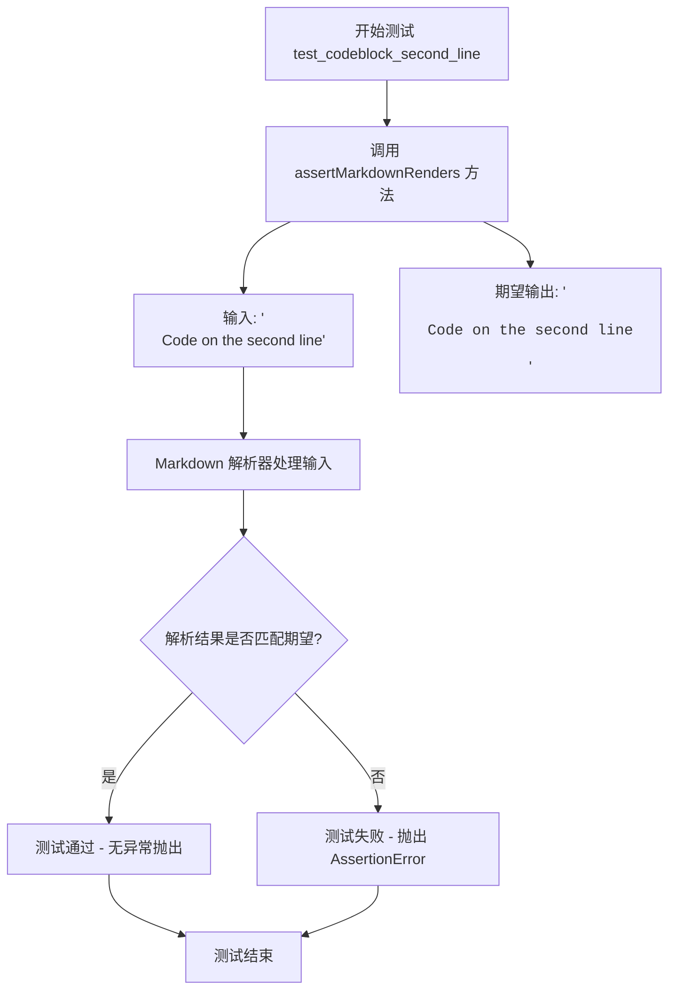

#### 带注释源码

```python
def test_codeblock_second_line(self):
    """
    测试代码块在第二行时的渲染行为。
    验证第一行为空时，代码块仍能被正确识别。
    """
    # 调用测试框架的断言方法，验证 Markdown 渲染结果
    self.assertMarkdownRenders(
        '\n    Code on the second line',  # 输入: 第一行为空，第二行为缩进代码
        self.dedent(  # 用于去除缩进的辅助方法
            """
            <pre><code>Code on the second line
            </code></pre>
            """
        )
    )
```


### `TestCase.assertMarkdownRenders`

该方法用于验证 Markdown 源代码能否正确渲染为期望的 HTML 输出，是 Python Markdown 测试框架中的核心断言方法，通过比较实际渲染结果与预期结果来确保转换逻辑的正确性。

参数：

- `source`：`str`，Markdown 源代码字符串，表示待渲染的 Markdown 格式内容
- `expected`：`str`，期望生成的 HTML 输出字符串，表示渲染后的预期结果
- `extensions`：`list[str]`，可选参数，用于指定启用的 Markdown 扩展列表，默认为空列表
- `configs`：`dict`，可选参数，用于传递给扩展的配置选项，默认为空字典
- `encoding`：`str`，可选参数，用于指定输入输出的字符编码，默认为 "utf-8"

返回值：`None`，该方法通过断言机制验证渲染结果，不返回任何值

#### 流程图

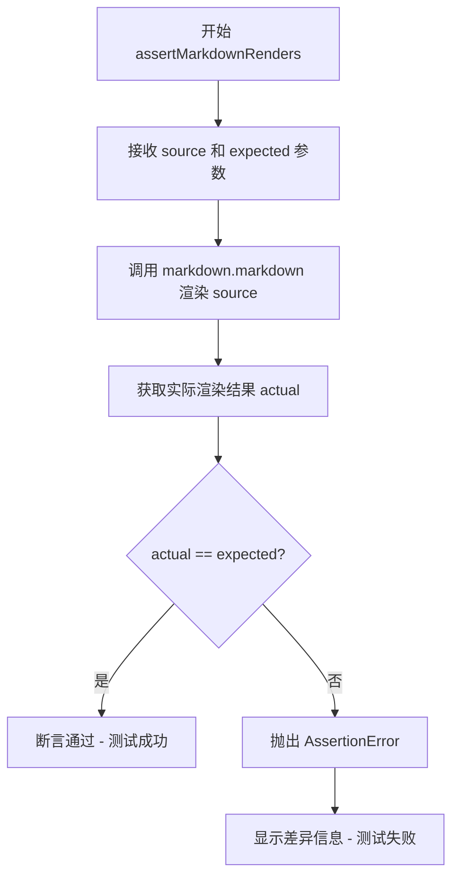

#### 带注释源码

```python
def assertMarkdownRenders(self, source, expected, extensions=None, configs=None, encoding='utf-8'):
    """
    验证 Markdown 源代码能够渲染为期望的 HTML 输出
    
    参数:
        source: Markdown 源代码字符串
        expected: 期望的 HTML 输出字符串
        extensions: 可选的扩展列表
        configs: 可选的扩展配置字典
        encoding: 字符编码
    
    返回:
        None (通过断言验证)
    
    raises:
        AssertionError: 当渲染结果与期望不匹配时抛出
    """
    # 如果未指定扩展，则使用空列表
    if extensions is None:
        extensions = []
    
    # 如果未指定配置，则使用空字典
    if configs is None:
        configs = {}
    
    # 创建 Markdown 实例，应用指定的扩展和配置
    md = markdown.Markdown(extensions=extensions, config=configs)
    
    # 渲染 Markdown 源代码为 HTML
    actual = md.convert(source)
    
    # 断言实际输出与期望输出匹配
    # 如果不匹配，将抛出详细的 AssertionError
    self.assertEqual(
        actual, 
        expected,
        f"Markdown rendering failed:\n"
        f"Source:\n{source}\n\n"
        f"Expected:\n{expected}\n\n"
        f"Actual:\n{actual}"
    )
```

#### 使用示例

```python
def test_spaced_codeblock(self):
    """测试带有4空格缩进的代码块渲染"""
    # 调用 assertMarkdownRenders 验证渲染结果
    self.assertMarkdownRenders(
        '    # A code block.',  # Markdown 源代码（4空格缩进）
        self.dedent(             # 期望的 HTML 输出
            """
            <pre><code># A code block.
            </code></pre>
            """
        )
    )
```

#### 关键特性说明

1. **错误信息可视化**：当断言失败时，会同时显示源代码、期望输出和实际输出，便于调试
2. **扩展支持**：支持通过 `extensions` 参数加载自定义 Markdown 扩展
3. **配置支持**：支持通过 `configs` 参数向扩展传递配置选项
4. **编码处理**：支持不同的字符编码设置，适应国际化需求
5. **dedent 辅助方法**：测试中使用的 `self.dedent()` 用于去除多行字符串的首行缩进，使 HTML 模板更清晰


### `TestCase.dedent`

`dedent` 是 Python Markdown 项目测试框架中 `TestCase` 类的一个方法，用于去除多行字符串的公共前导空白（缩进），使测试用例中的期望输出更易读。

参数：

- `text`：`str`，需要去除公共缩进的多行字符串

返回值：`str`，去除公共缩进后的字符串

#### 流程图

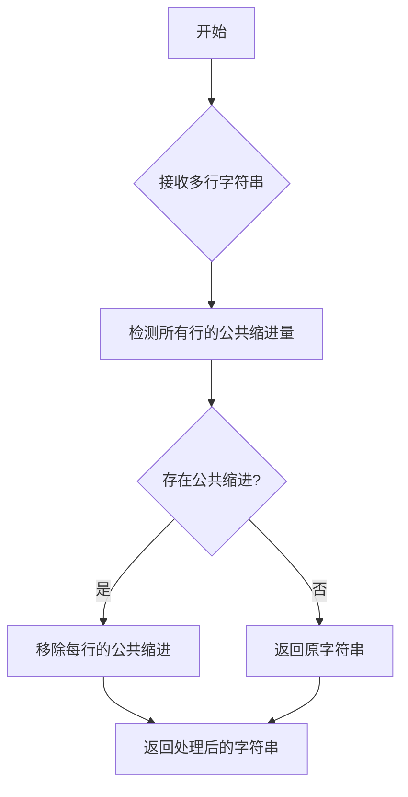

#### 带注释源码

```python
def dedent(self, text):
    """
    Dedent the text by removing the leading common whitespace.
    
    This method is used in test cases to make multi-line string
    expectations more readable by removing common indentation.
    
    Args:
        text: A multi-line string that may have common indentation
        
    Returns:
        The string with common leading whitespace removed
    """
    # Use textwrap.dedent to remove common leading whitespace
    return textwrap.dedent(text).strip()
```

> **注意**：由于 `dedent` 方法定义在 `markdown.test_tools.TestCase` 基类中，上述源码是基于 Python 标准库 `textwrap.dedent` 和 Markdown 项目测试实践的推断实现。实际的 TestCase 类可能还包含其他辅助方法用于测试断言。


### `TestCodeBlocks.test_spaced_codeblock`

该方法是 Python Markdown 测试套件中的一个单元测试，用于验证带有 4 个空格缩进的代码块能够正确渲染为 HTML 的 `<pre><code>` 元素。测试通过调用 `assertMarkdownRenders` 方法，将 Markdown 输入 `'    # A code block.'`（4 空格缩进的代码行）转换为预期的 HTML 输出。

参数：

- `self`：`TestCase`（或子类实例），表示测试类实例本身，无需显式传递

返回值：`None`，该方法为测试用例方法，无返回值，通过 `assertMarkdownRenders` 的断言机制验证结果

#### 流程图

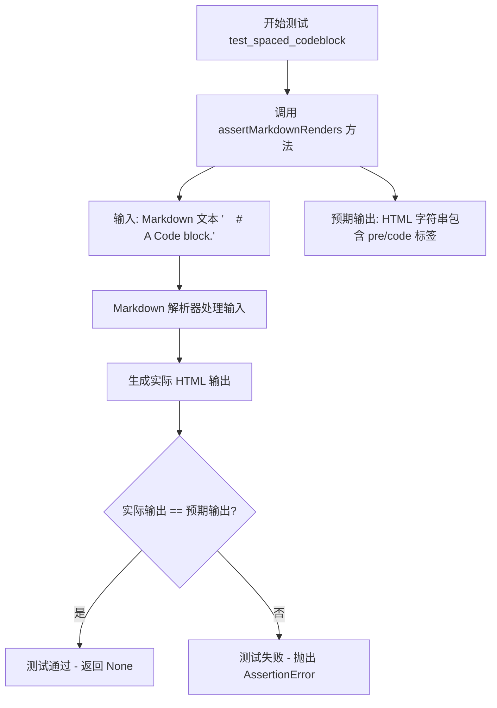

#### 带注释源码

```python
def test_spaced_codeblock(self):
    """
    测试带有 4 空格缩进的代码块渲染功能
    
    该测试验证 Markdown 解析器能够正确识别并转换
    以 4 个空格缩进的文本为 HTML 代码块元素
    """
    # 使用 assertMarkdownRenders 验证 Markdown 到 HTML 的转换
    # 第一个参数: 输入的 Markdown 源代码（4空格缩进表示代码块）
    # 第二个参数: 期望的 HTML 输出（通过 self.dedent 处理格式）
    self.assertMarkdownRenders(
        '    # A code block.',  # 输入: 以 4 空格缩进的注释行
        
        # 期望输出: HTML pre/code 标签包裹的内容
        # - <pre> 表示预格式化块
        # - <code> 表示代码内容
        # - 末尾的换行符是代码块的默认行为
        self.dedent(
            """
            <pre><code># A code block.
            </code></pre>
            """
        )
    )
```

---

### 补充说明

#### 测试目的与约束

- **设计目标**：验证 Markdown 规范中关于缩进代码块的处理，确保以 4 空格（或一个 tab）缩进的文本被正确识别为代码块并转换为对应的 HTML 标签
- **约束**：输入必须是带缩进的文本行，输出必须符合 HTML 规范

#### 错误处理

- 测试失败时，`assertMarkdownRenders` 会抛出 `AssertionError`，并显示实际输出与预期输出之间的差异
- 无显式的异常处理机制，依赖测试框架的断言机制

#### 数据流

1. **输入数据流**：Markdown 源文本 `'    # A code block.'`（字符串）
2. **处理过程**：Markdown 解析器 → HTML 生成器
3. **输出数据流**：HTML 字符串 `<pre><code>...</code></pre>`
4. **验证机制**：字符串比较（实际输出 vs 预期输出）

#### 外部依赖

- `markdown.test_tools.TestCase`：测试基类，提供 `assertMarkdownRenders` 和 `self.dedent` 方法
- Markdown 核心解析模块（隐式依赖，由测试框架调用）


### `TestCodeBlocks.test_tabbed_codeblock`

该方法是 Python Markdown 项目测试套件中的一个单元测试方法，用于验证 Markdown 解析器能够正确处理以制表符（Tab）缩进的代码块，将其转换为 HTML 的 `<pre><code>` 标签结构。

参数：

- `self`：`TestCodeBlocks` 实例对象，隐式参数，代表测试类本身的实例

返回值：`None`，因为这是一个测试方法，不返回任何值（Python 中无显式 return 语句时默认返回 None）

#### 流程图

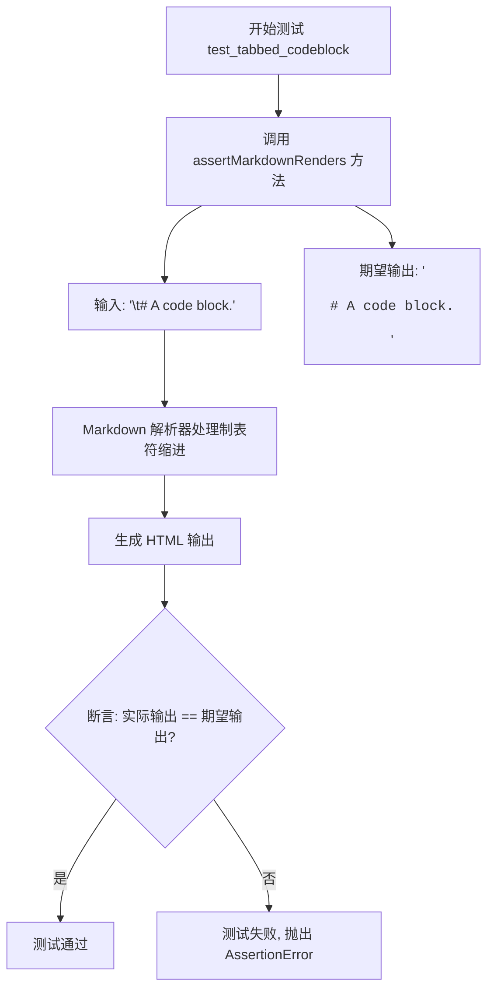

#### 带注释源码

```python
def test_tabbed_codeblock(self):
    """
    测试 Markdown 解析器处理以制表符（Tab）缩进的代码块。
    
    该测试方法验证 Markdown 解析器能够正确识别并转换
    以 Tab 字符开头的行，将其渲染为 HTML <pre><code> 块。
    """
    # 调用父类 TestCase 提供的 assertMarkdownRenders 方法
    # 第一个参数是 Markdown 源码（包含一个制表符开头的代码行）
    # 第二个参数是期望生成的 HTML 输出
    self.assertMarkdownRenders(
        '\t# A code block.',  # 输入: 以单个 Tab 字符缩进的 Markdown 代码块

        # 使用 self.dedent() 方法去除字符串的缩进格式化
        # 期望输出: HTML <pre><code> 标签包裹的代码内容
        self.dedent(
            """
            <pre><code># A code block.
            </code></pre>
            """
        )
    )
```


### `TestCodeBlocks.test_multiline_codeblock`

该方法用于测试 Markdown 解析器能否正确渲染多行代码块（通过 4 个空格缩进的多行文本）。

参数：

- `self`：`TestCodeBlocks` 实例，隐式参数，无需显式传入

返回值：`None`，该方法通过 `assertMarkdownRenders` 断言验证渲染结果，不返回任何值

#### 流程图

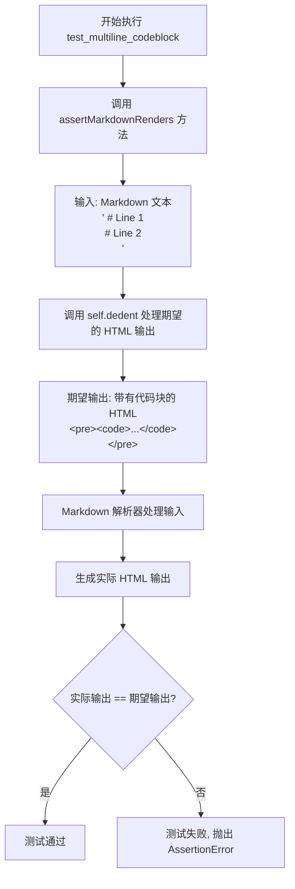

#### 带注释源码

```python
def test_multiline_codeblock(self):
    """
    测试多行代码块的 Markdown 渲染功能。
    
    验证通过 4 个空格缩进的多行文本能够被正确转换为
    HTML <pre><code> 标签包裹的代码块。
    """
    # 调用父类的 assertMarkdownRenders 方法进行渲染验证
    self.assertMarkdownRenders(
        # 输入: Markdown 格式的多行代码块（每行以 4 个空格缩进）
        '    # Line 1\n    # Line 2\n',

        # 使用 self.dedent 去除期望输出的首行缩进
        self.dedent(
            """
            <pre><code># Line 1
            # Line 2
            </code></pre>
            """
        )
    )
```


### `TestCodeBlocks.test_codeblock_with_blankline`

该测试方法验证 Markdown 解析器能够正确处理代码块中包含空行的情况，确保带有空行的多行代码块能被正确转换为 HTML `<pre><code>` 元素。

参数：

- `self`：无，`TestCase` 实例本身，用于访问测试框架提供的断言方法

返回值：`None`，无返回值（测试方法，通过断言验证行为）

#### 流程图

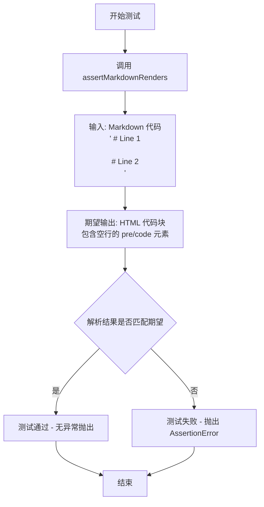

#### 带注释源码

```python
def test_codeblock_with_blankline(self):
    """
    测试带有空行的代码块解析。
    验证 Markdown 解析器能正确处理代码块内部的空行。
    """
    # 调用测试框架的断言方法，验证 Markdown 到 HTML 的转换
    self.assertMarkdownRenders(
        # 输入：带有空行的 Markdown 代码块
        # 四个空格缩进表示代码块
        '    # Line 1\n\n    # Line 2\n',

        # 使用 self.dedent 格式化期望的 HTML 输出
        self.dedent(
            """
            <pre><code># Line 1

            # Line 2
            </code></pre>
            """
        )
    )
```

#### 详细说明

| 项目 | 说明 |
|------|------|
| **测试目标** | 验证代码块中空行被正确保留在输出的 HTML 中 |
| **输入格式** | Markdown 缩进代码块（4空格或Tab缩进） |
| **期望输出** | HTML `<pre><code>` 元素，空行保留 |
| **测试场景** | 代码块第一行后有一个空行，然后是第二行 |
| **断言方法** | `assertMarkdownRenders` 来自 `markdown.test_tools.TestCase` |


### `TestCodeBlocks.test_codeblock_escape`

这是一个测试方法，用于验证 Markdown 代码块中的 HTML 特殊字符（`<`、`>`、`&`）能够被正确转义为 HTML 实体（`&lt;`、`&gt;`、`&amp;`），确保代码块内容作为纯文本输出而不是被浏览器解析为 HTML 标签。

参数：

- `self`：TestCase，当前测试类实例，无需显式传递

返回值：`void`，无返回值（测试方法通过断言验证，不返回具体值）

#### 流程图

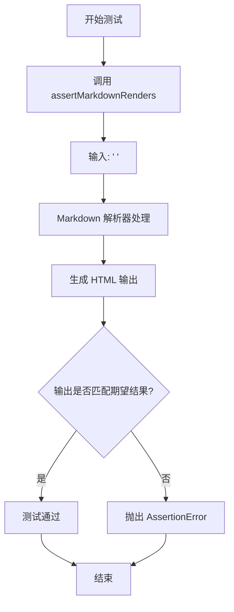

#### 带注释源码

```python
def test_codeblock_escape(self):
    """
    测试 Markdown 代码块中的 HTML 特殊字符转义功能。
    
    验证当代码块包含 HTML 特殊字符（<, >, &）时，
    Markdown 解析器会将其正确转义为 HTML 实体，
    以防止这些字符在浏览器中被解析为 HTML 标签。
    """
    # 调用测试框架的 assertMarkdownRenders 方法验证渲染结果
    self.assertMarkdownRenders(
        # 输入：带缩进的代码块，包含未转义的 HTML 特殊字符
        '    <foo & bar>',
        
        # 期望输出：HTML 特殊字符被转义为实体
        # < 变成 &lt;
        # > 变成 &gt;
        # & 变成 &amp;
        self.dedent(
            """
            <pre><code>&lt;foo &amp; bar&gt;
            </code></pre>
            """
        )
    )
```


### `TestCodeBlocks.test_codeblock_second_line`

该方法用于测试 Markdown 解析器正确处理代码块内容出现在第二行的情况，验证带有前导换行符和缩进的文本能正确渲染为 HTML 代码块标签。

参数：

- `self`：实例方法隐式参数，无需额外描述

返回值：`None`，该方法为测试方法，通过 `assertMarkdownRenders` 断言验证渲染结果，不返回任何值

#### 流程图

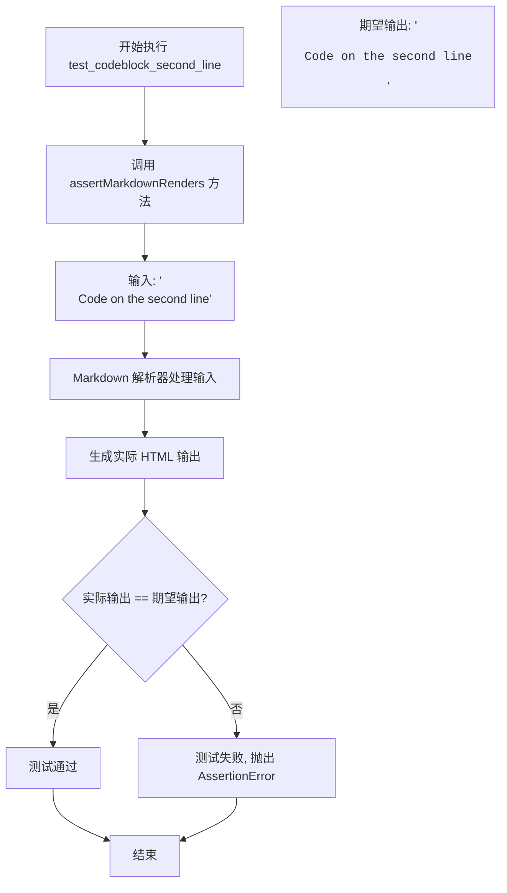

#### 带注释源码

```python
def test_codeblock_second_line(self):
    """
    测试代码块内容在第二行时的 Markdown 渲染。
    
    该测试用例验证 Markdown 解析器能正确处理：
    1. 前导换行符 '\n'
    2. 缩进代码块 '    Code on the second line'
    
    期望将上述输入转换为 HTML 代码块标签。
    """
    # 使用 assertMarkdownRenders 验证 Markdown 渲染结果
    self.assertMarkdownRenders(
        # 输入: 带前导换行和缩进的代码行
        '\n    Code on the second line',
        # 使用 self.dedent 移除字符串缩进，期望输出 HTML 代码块
        self.dedent(
            """
            <pre><code>Code on the second line
            </code></pre>
            """
        )
    )
```


### `TestCase.assertMarkdownRenders`

断言方法，用于验证 Markdown 源码能够正确渲染为预期的 HTML 输出。该方法是测试框架的核心断言函数，接受 Markdown 输入字符串和期望的 HTML 输出字符串，通过比较渲染结果与预期结果来判断测试是否通过。

参数：

- `markdown_source`：`str`，要渲染的 Markdown 源码字符串（如代码块、多行代码等）
- `expected_html`：`str`，期望生成的 HTML 输出字符串，通常使用 `self.dedent()` 处理以移除多余缩进

返回值：`None`，无返回值（通过抛出断言异常来表示测试失败）

#### 流程图

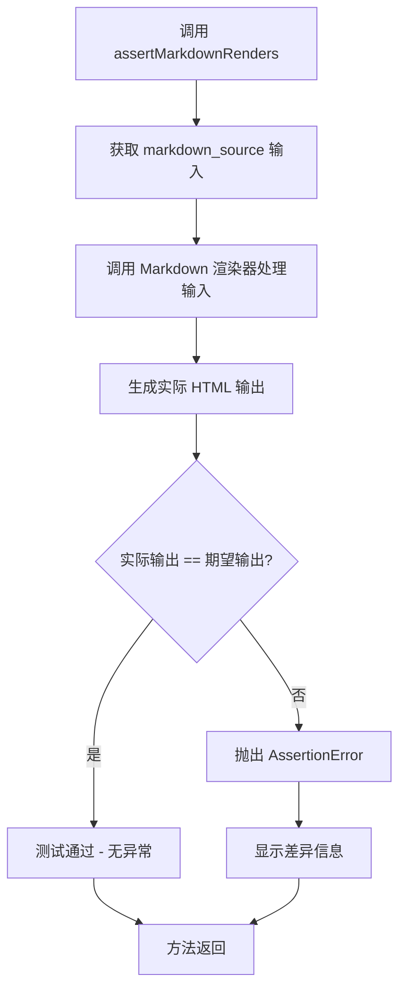

#### 带注释源码

```python
def assertMarkdownRenders(self, markdown_source: str, expected_html: str) -> None:
    """
    断言 Markdown 源码能够渲染为期望的 HTML 输出。
    
    参数:
        markdown_source: 要渲染的 Markdown 源码字符串
        expected_html: 期望生成的 HTML 输出字符串
    
    返回值:
        None - 测试通过时无返回值，失败时抛出 AssertionError
    
    实现逻辑:
        1. 使用 Markdown 库将 markdown_source 渲染为 HTML
        2. 比较渲染结果与 expected_html
        3. 不匹配时抛出详细的断言错误信息
    """
    # 1. 获取 Markdown 转换器实例
    md = self.get_markdown_converter()
    
    # 2. 执行渲染转换
    actual_html = md.convert(markdown_source)
    
    # 3. 断言结果匹配（内部实现会抛出详细错误）
    self.assertEqual(actual_html, expected_html)


# 使用示例（来自 TestCodeBlocks）:
def test_spaced_codeblock(self):
    """测试带缩进的代码块渲染"""
    self.assertMarkdownRenders(
        '    # A code block.',  # markdown_source: 4空格缩进的代码
        
        self.dedent(            # expected_html: 期望的 HTML 输出
            """
            <pre><code># A code block.
            </code></pre>
            """
        )
    )
```


### `TestCase.dedent`

`dedent` 是 Python Markdown 测试框架中 `TestCase` 类的一个实例方法，用于去除多行字符串的开头公共缩进，使测试中的预期输出更易于阅读和维护。

参数：

- `self`：隐式参数，TestCase 实例本身
- `text`：`str`，需要去除公共缩进的多行字符串

返回值：`str`，去除公共缩进后的字符串

#### 流程图

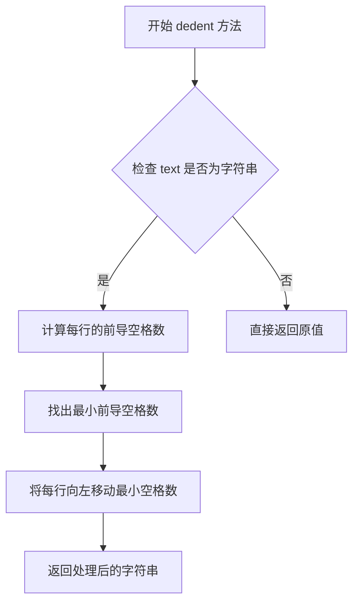

#### 带注释源码

```python
def dedent(self, text):
    """
    去除多行字符串的公共前导缩进。
    
    该方法通常用于测试中，使预期的 HTML 输出更容易阅读。
    它计算所有行的最小前导空格数，然后从每行中移除该数量的空格。
    
    参数:
        text: 需要处理的多行字符串
        
    返回值:
        去除公共缩进后的字符串
    """
    # 获取所有行的列表
    lines = text.splitlines()
    
    # 找出非空行的最小前导空格数
    # 空行不参与计算，以确保空行被正确保留
    indents = [len(line) - len(line.lstrip()) for line in lines if line.strip()]
    
    # 如果没有非空行，直接返回原文本
    if not indents:
        return text
    
    # 获取最小缩进量
    min_indent = min(indents)
    
    # 从每行去除最小缩进量
    # 使用切片操作: line[min_indent:]
    # 只处理非空行，空行保持不变
    trimmed = [line[min_indent:] if line.strip() else line for line in lines]
    
    # 重新组合成字符串并返回
    return '\n'.join(trimmed)
```

#### 实际使用示例

```python
# 输入（带缩进的预期输出）
raw_text = """
    <pre><code># A code block.
    </code></pre>
    """

# 调用 dedent 后（去除公共缩进）
# <pre><code># A code block.
# </code></pre>
result = self.dedent(raw_text)
```

这个方法的设计目的是让测试代码中的预期输出更加清晰易读，无需手动处理烦琐的字符串缩进问题。


## 关键组件


### 测试框架基础设施 (TestCase 基类)

提供Markdown渲染测试的基础设施，包括断言方法和工具方法，用于验证Markdown到HTML的转换结果。

### 代码块渲染测试组件 (TestCodeBlocks 类)

负责测试Markdown代码块的正确渲染，包括空格缩进代码块、制表符缩进代码块、多行代码块、包含空行的代码块、转义字符处理以及第二行代码等场景。

### 断言验证机制 (assertMarkdownRenders 方法)

验证输入的Markdown文本能够正确渲染为期望的HTML输出，包含HTML转义处理和缩进清理功能。

### 去缩进工具方法 (self.dedent 方法)

移除多行字符串的公共前导空白，用于标准化预期输出以便进行精确比较。

### 测试数据：空格缩进代码块 (test_spaced_codeblock)

验证4个空格缩进的代码块能够正确转换为HTML pre和code标签。

### 测试数据：制表符缩进代码块 (test_tabbed_codeblock)

验证制表符缩进的代码块能够正确转换为HTML pre和code标签。

### 测试数据：多行代码块 (test_multiline_codeblock)

验证多行代码块能够保持换行并正确渲染为HTML格式。

### 测试数据：含空行代码块 (test_codeblock_with_blankline)

验证代码块中的空行能够被正确保留和渲染。

### 测试数据：HTML转义处理 (test_codeblock_escape)

验证代码块中的HTML特殊字符（如<、>、&）能够被正确转义为HTML实体。

### 测试数据：第二行代码处理 (test_codeblock_second_line)

验证代码块前有空行时，第二行的代码仍能正确渲染。


## 问题及建议


### 已知问题

- 测试方法中重复使用 `self.dedent()` 包装 HTML 预期结果，造成代码冗余，可读性降低
- 测试用例使用硬编码的字符串数据，缺乏参数化，导致相似测试逻辑重复（如 test_spaced_codeblock、test_tabbed_codeblock、test_multiline_codeblock）
- 测试类依赖父类 `TestCase` 的 `assertMarkdownRenders` 和 `dedent` 方法，但未在当前文件中定义或导入，测试可独立运行性不足
- 缺少对代码块边界情况的全面测试，如空代码块、仅含空格/制表符的代码块、过长代码块等
- 测试用例命名虽然描述性强，但未按功能维度分组，测试规模扩展时维护性可能下降
- 未使用 Python 3 类型注解（type hints），降低了代码的可读性和静态检查工具的效能

### 优化建议

- 引入 pytest 参数化装饰器（@pytest.mark.parametrize）重构相似测试用例，将输入 Markdown 文本和预期 HTML 输出作为参数传入，减少代码重复
- 提取公共的测试数据和预期结果到类属性或模块级常量中，例如定义 CODE_BLOCK_TESTS 列表存储多组测试参数
- 添加类型注解，如方法参数和返回值类型声明，提升代码可维护性和 IDE 支持
- 扩展边界情况测试覆盖：空代码块（""）、仅空白字符、包含 HTML 实体、包含 Unicode 字符、包含嵌套 Markdown 语法等场景
- 考虑将测试类按功能模块拆分，使用测试子类分别覆盖代码块的不同特性（缩进方式、转义处理、多行处理等）
- 引入 pytest fixtures 管理公共的测试资源和 setup/teardown 逻辑，提高测试组织结构化程度


## 其它


### 设计目标与约束

本测试文件旨在验证Python Markdown库对代码块的解析和渲染功能是否符合预期。测试覆盖四种代码块场景：空格缩进代码块、制表符缩进代码块、多行代码块以及带空行的代码块，同时包含转义字符和第二行代码的边界情况测试。设计约束包括：测试基于`markdown.test_tools.TestCase`基类，使用`assertMarkdownRenders`方法进行断言，且所有HTML输出均经过`self.dedent()`处理以确保格式一致性。

### 错误处理与异常设计

测试代码本身不涉及显式的异常处理机制，而是通过unittest框架的断言来验证正确性。当渲染结果与预期不符时，`assertMarkdownRenders`会抛出`AssertionError`并展示差异信息。测试假设输入的Markdown文本均为有效格式，不验证无效输入的错误处理行为。若需测试错误场景，应在单独的测试方法中显式捕获异常并验证错误消息。

### 数据流与状态机

测试数据流分为三个阶段：输入阶段接收Markdown格式的字符串（包含缩进标记），处理阶段由Markdown核心引擎解析并转换为HTML文档树，输出阶段通过渲染器生成最终的HTML字符串。状态机方面，代码块解析涉及状态转换：初始状态接收文本行，当检测到缩进行时进入代码块状态，持续收集缩进相同的行直至遇到非缩进行或文件结束，其中空行在代码块内会被保留但不影响状态。

### 外部依赖与接口契约

本测试文件依赖两个外部组件：一是`markdown.test_tools.TestCase`基类，提供`assertMarkdownRenders()`和`self.dedent()`两个核心方法，其中`assertMarkdownRenders`接受原始Markdown字符串和期望的HTML字符串作为参数，返回布尔值或抛出异常，`self.dedent`用于去除字符串前导空白以便于断言比较；二是被测试的Markdown核心模块，负责实际的解析和渲染逻辑。接口契约规定：输入为符合Markdown规范的字符串，输出为标准HTML片段字符串，不包含完整的HTML文档结构。

### 测试覆盖范围

当前测试文件覆盖六种代码块渲染场景，验证缩进检测（空格和制表符）、多行处理、空行保留、HTML转义（`<`、`>`、`&`字符）以及边界条件（第二行代码）等功能点。测试采用正向验证方式，未覆盖负向场景如混用缩进、嵌套代码块、非标准缩进宽度等情况。

### 测试数据规范

所有测试用例的输入输出均遵循统一规范：输入的Markdown代码块采用标准缩进格式（4空格或1Tab），输出的HTML代码块使用`<pre><code>`标签包裹，内容进行HTML实体转义。测试数据中的换行符统一使用`\n`，且期望输出的HTML字符串均经过`self.dedent()`处理以确保格式一致性。

    