# `markdown\tests\test_syntax\blocks\test_headers.py` 详细设计文档

这是一个Python Markdown库的测试文件，专门用于测试两种标题（Headers）解析功能：Setext格式（使用=或-下划线定义标题）和Hash格式（使用#符号定义标题），包含多种边界情况和变体的测试用例。

## 整体流程

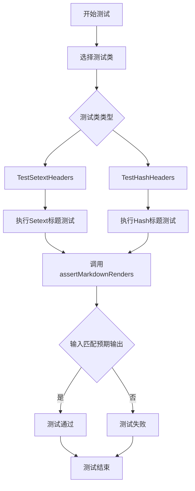

## 类结构

```
TestCase (基类)
├── TestSetextHeaders (Setext格式标题测试)
│   ├── test_setext_h1
│   ├── test_setext_h2
│   ├── test_setext_h1_mismatched_length
│   ├── test_setext_h2_mismatched_length
│   ├── test_setext_h1_followed_by_p
│   ├── test_setext_h2_followed_by_p
│   └── (2个被跳过的测试)
└── TestHashHeaders (Hash格式标题测试)
    ├── test_hash_h1_open ~ test_hash_h6_open
    ├── test_hash_gt6_open
    ├── test_hash_h1_open_missing_space ~ test_hash_h6_open_missing_space
    ├── test_hash_gt6_open_missing_space
    ├── test_hash_h1_closed ~ test_hash_h6_closed
    ├── test_hash_gt6_closed
    ├── test_hash_h1_closed_missing_space ~ test_hash_h6_closed_missing_space
    ├── test_hash_gt6_closed_missing_space
    ├── test_hash_h1_closed_mismatch ~ test_hash_h6_closed_mismatch
    ├── test_hash_gt6_closed_mismatch
    ├── test_hash_h1_followed_by_p ~ test_hash_h6_followed_by_p
    ├── test_hash_h1_leading_space ~ test_hash_h6_leading_space
    ├── test_hash_h1_open_trailing_space ~ test_hash_h6_open_trailing_space
    ├── test_hash_gt6_open_trailing_space
    ├── test_hash_h1_closed_trailing_space ~ test_hash_h6_closed_trailing_space
    ├── test_hash_gt6_closed_trailing_space
    ├── test_no_blank_lines_between_hashs
    ├── test_random_hash_levels
    ├── test_hash_followed_by_p
    ├── test_p_followed_by_hash
    ├── test_escaped_hash
    └── test_unescaped_hash
```

## 全局变量及字段


    

## 全局函数及方法


### `TestSetextHeaders.test_setext_h1`

该测试方法用于验证 Python Markdown 库对 Setext 格式一级标题的解析能力，具体测试将"标题文本 + 连续等号下划线"格式正确转换为 HTML 的 `<h1>` 标签。

**参数：** 无显式参数（`self` 为隐式实例参数）

**返回值：** `None`，该方法为测试用例，无返回值，通过 `assertMarkdownRenders` 断言验证转换结果

#### 流程图

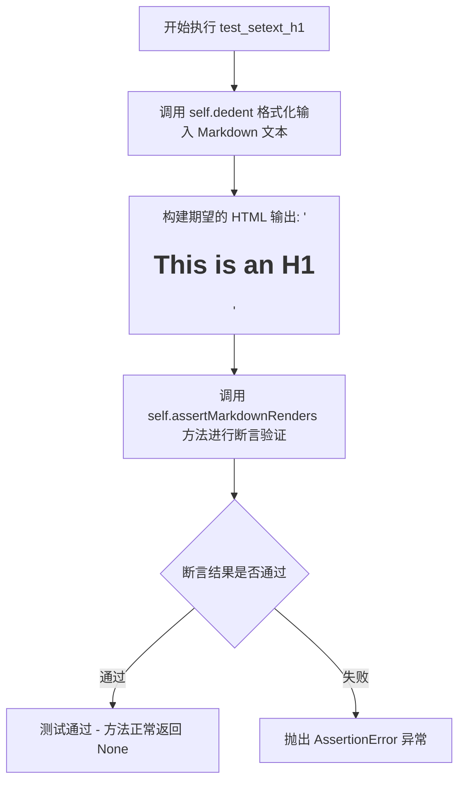

#### 带注释源码

```python
def test_setext_h1(self):
    """
    测试 Setext 格式的一级标题解析。
    
    Setext 格式使用底线下划线定义标题：
    - H1: 使用等号 (=) 下划线
    - H2: 使用连字符 (-) 下划线
    
    该测试用例验证 H1 标题的解析是否正确。
    """
    # 使用 self.dedent 移除多行字符串的公共缩进
    # 输入的 Markdown 源码格式：
    # This is an H1
    # =============
    # （标题文本在上，等号下划线在下）
    self.assertMarkdownRenders(
        self.dedent(
            """
            This is an H1
            =============
            """
        ),
        # 期望输出的 HTML：
        # <h1>This is an H1</h1>
        '<h1>This is an H1</h1>'
    )
```


### `TestSetextHeaders.test_setext_h2`

该方法是一个单元测试用例，用于验证Python Markdown库能否正确将Setext格式的H2标题（使用`-`符号作为下划线）转换为HTML的`<h2>`标签。

参数：

- `self`：`TestSetextHeaders`（隐式），测试类的实例本身

返回值：`None`（无返回值），该方法通过`assertMarkdownRenders`进行断言验证

#### 流程图

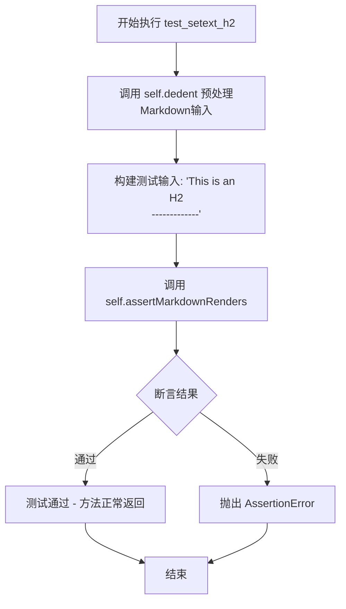

#### 带注释源码

```python
def test_setext_h2(self):
    """
    测试Setext格式的H2标题渲染功能。
    Setext格式使用底部的连续短横线（---）来定义H2标题。
    """
    # 调用 assertMarkdownRenders 方法进行Markdown到HTML的转换验证
    self.assertMarkdownRenders(
        # 第一个参数：原始Markdown文本
        # 使用 self.dedent() 移除多行字符串的公共前导空白
        self.dedent(
            """
            This is an H2
            -------------
            """
        ),
        # 第二个参数：期望输出的HTML
        '<h2>This is an H2</h2>'
    )
```


### `TestSetextHeaders.test_setext_h1_mismatched_length`

该方法是 Python Markdown 测试套件中的一个测试用例，用于验证当 Setext 风格的 H1 标题的下划线（"==="）长度与上方文本不匹配时，Markdown 解析器仍能正确将其渲染为 H1 标题。

参数：

- `self`：`TestSetextHeaders`（隐式参数），测试类的实例本身，用于调用继承的 `assertMarkdownRenders` 方法

返回值：`None`，该方法为测试用例，通过断言验证 Markdown 渲染结果，不返回任何值

#### 流程图

```mermaid
flowchart TD
    A[开始测试 test_setext_h1_mismatched_length] --> B[调用 self.dedent 格式化输入 Markdown 文本]
    B --> C[准备输入: "This is an H1\n==="]
    C --> D[调用 self.assertMarkdownRenders 方法]
    D --> E{断言结果是否匹配}
    E -->|匹配| F[测试通过]
    E -->|不匹配| G[测试失败并抛出 AssertionError]
    F --> H[结束测试]
    G --> H
```

#### 带注释源码

```python
def test_setext_h1_mismatched_length(self):
    """
    测试 Setext 风格 H1 标题在长度不匹配时的渲染行为。
    
    根据 Markdown 规范，Setext 风格标题的下划线长度不需要
    与上方文本完全匹配，只要包含至少一个 '=', 即认为是 H1。
    """
    # 使用 assertMarkdownRenders 验证 Markdown 渲染结果
    # 第一个参数是输入的 Markdown 文本（经过 dedent 格式化）
    # 第二个参数是期望输出的 HTML
    self.assertMarkdownRenders(
        self.dedent(
            """
            This is an H1
            ===
            """
        ),
        # 期望输出：即使下划线 "===" 比文本短，仍渲染为 <h1> 标签
        '<h1>This is an H1</h1>'
    )
```

#### 附加说明

**测试目的**：验证 Markdown 解析器正确实现了 Setext 风格标题的"宽松长度匹配"规则。根据 CommonMark 规范和原始 Markdown 行为，下划线字符的数量只需要足以表示标题级别即可，不需要严格匹配文本长度。

**输入格式**：
- 文本行：`This is an H1`
- 下划线：`===`（仅 3 个字符，而文本 "This is an H1" 有 14 个字符）

**期望输出**：
- `<h1>This is an H1</h1>`

**测试用例类信息**：
- 父类：`markdown.test_tools.TestCase`（自定义测试基类）
- 同类方法包括：`test_setext_h1`、`test_setext_h2`、`test_setext_h2_mismatched_length` 等，用于测试各种 Setext 标题场景


### `TestSetextHeaders.test_setext_h2_mismatched_length`

该方法是 Python-Markdown 测试套件中的一个测试用例，用于验证 Setext 风格 H2 标题在底线（underline）与标题文本长度不匹配时仍能正确解析为 H2 标签。具体测试场景为：标题文本"This is an H2"下方使用仅包含三个短横线（`---`）的短底线，尽管长度不匹配，但仍应正确渲染为 `<h2>This is an H2</h2>`。

参数：

- `self`：`TestCase`（隐式参数），测试类实例本身，包含测试所需的断言方法

返回值：`None`，该方法为测试用例，通过 `assertMarkdownRenders` 断言验证 Markdown 解析结果，不返回任何值

#### 流程图

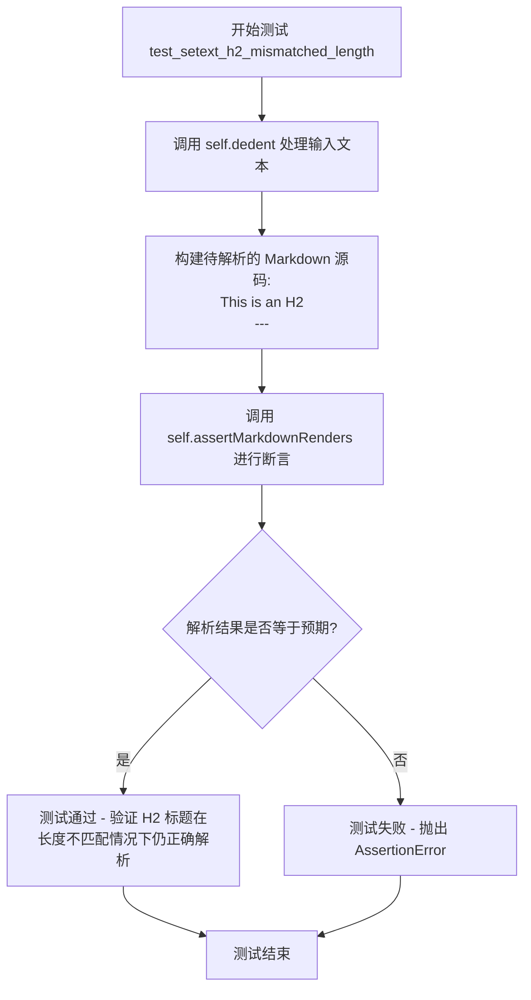

#### 带注释源码

```python
def test_setext_h2_mismatched_length(self):
    """
    测试 Setext 风格 H2 标题在底线长度不匹配时的解析行为。
    
    根据 Markdown 规范，Setext 标题的底线长度应与标题文本长度匹配，
    但实际实现中通常允许长度不匹配的情况。
    本测试验证 Python-Markdown 能够正确处理这种边界情况。
    """
    # 使用 self.assertMarkdownRenders 验证 Markdown 解析结果
    # 参数1: 输入的 Markdown 源码（经过 dedent 处理去除缩进）
    # 参数2: 期望的 HTML 输出
    self.assertMarkdownRenders(
        # 调用 self.dedent 清理多行字符串的公共前缀缩进
        self.dedent(
            """
            This is an H2
            ---
            """
        ),
        # 期望的 HTML 输出：即使底线只有3个字符，也应正确渲染为 H2
        '<h2>This is an H2</h2>'
    )
```

#### 备注

该测试用例体现了 Markdown 解析器的宽松策略：允许 Setext 标题的底线长度与标题文本不完全匹配，只要底线字符符合 `=`（对应 H1）或 `-`（对应 H2）的模式，即可正确识别标题级别。


### `TestSetextHeaders.test_setext_h1_followed_by_p`

该测试方法用于验证Markdown解析器能够正确处理Setext格式的H1标题（使用等号下划线定义）后面直接跟随段落（无空行分隔）的情况，确保标题和段落都能被正确渲染为HTML。

参数：

- `self`：`TestSetextHeaders`（隐式参数），测试类的实例本身，包含测试所需的断言方法和工具方法

返回值：`None`，该方法为测试方法，无返回值，通过 `assertMarkdownRenders` 方法进行断言验证

#### 流程图

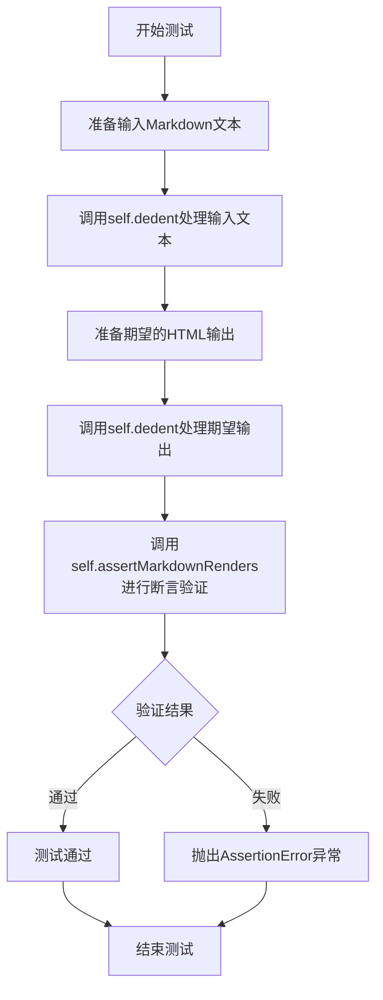

#### 带注释源码

```python
def test_setext_h1_followed_by_p(self):
    """
    测试Setext格式H1标题后跟随段落的情况
    
    验证Markdown解析器能够正确处理以下格式：
    This is an H1
    =============
    Followed by a Paragraph with no blank line.
    
    期望输出：
    <h1>This is an H1</h1>
    <p>Followed by a Paragraph with no blank line.</p>
    """
    # 调用assertMarkdownRenders方法进行渲染验证
    # 参数1: 输入的Markdown文本（经过dedent处理去除缩进）
    # 参数2: 期望的HTML输出（经过dedent处理去除缩进）
    self.assertMarkdownRenders(
        # 准备输入的Markdown源码
        self.dedent(
            """
            This is an H1
            =============
            Followed by a Paragraph with no blank line.
            """
        ),
        # 准备期望的HTML输出
        self.dedent(
            """
            <h1>This is an H1</h1>
            <p>Followed by a Paragraph with no blank line.</p>
            """
        )
    )
```


### `TestSetextHeaders.test_setext_h2_followed_by_p`

该测试方法用于验证 Markdown 解析器正确处理 Setext 风格的 H2 标题（使用 `-` 下划线定义）后面跟随段落（无空行分隔）的场景，确保输出包含正确的 `<h2>` 标签和紧随其后的 `<p>` 标签。

参数：

- `self`：`TestSetextHeaders`（继承自 `TestCase`），测试用例实例，用于调用继承的 `assertMarkdownRenders` 和 `dedent` 方法

返回值：`None`，测试方法通过断言验证结果，不返回具体值

#### 流程图

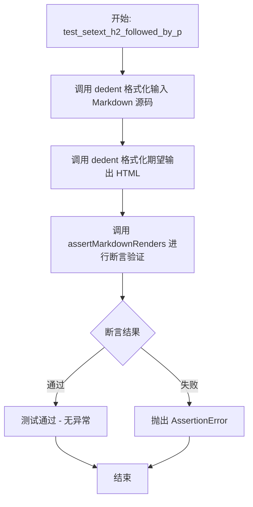

#### 带注释源码

```python
def test_setext_h2_followed_by_p(self):
    """
    测试 Setext 风格 H2 标题后跟随段落的情况
    
    Markdown 源码格式：
    This is an H2
    -------------
    Followed by a Paragraph with no blank line.
    
    期望输出：
    <h2>This is an H2</h2>
    <p>Followed by a Paragraph with no blank line.</p>
    """
    # 使用 dedent 方法规范化多行字符串，移除公共前导空白
    self.assertMarkdownRenders(
        self.dedent(
            """
            This is an H2
            -------------
            Followed by a Paragraph with no blank line.
            """
        ),
        # 期望的 HTML 输出
        self.dedent(
            """
            <h2>This is an H2</h2>
            <p>Followed by a Paragraph with no blank line.</p>
            """
        )
    )
```


### `TestSetextHeaders.test_p_followed_by_setext_h1`

这是一个测试方法，用于测试在段落后面直接跟随 Setext 风格的 H1 标题（没有空行分隔）的情况。该测试目前被标记为跳过（Skip），因为 Python-Markdown 在处理这种边界情况时存在已知 bug。

参数：

- `self`：`TestSetextHeaders`（隐式参数），代表测试用例实例本身

返回值：`None`，无返回值（测试方法通过 `assertMarkdownRenders` 断言来验证结果）

#### 流程图

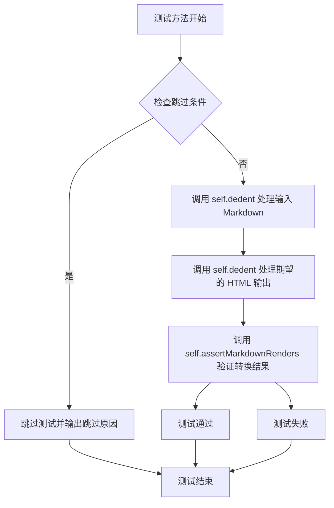

#### 带注释源码

```python
# TODO: fix this
# see https://johnmacfarlane.net/babelmark2/?normalize=1&text=Paragraph%0AAn+H1%0A%3D%3D%3D%3D%3D
@unittest.skip('This is broken in Python-Markdown')
def test_p_followed_by_setext_h1(self):
    """测试段落后直接跟 Setext H1 标题（无空行分隔）"""
    self.assertMarkdownRenders(
        # 输入的 Markdown 文本（待渲染）
        self.dedent(
            """
            This is a Paragraph.
            Followed by an H1 with no blank line.
            =====================================
            """
        ),
        # 期望输出的 HTML 文本
        self.dedent(
            """
            <p>This is a Paragraph.</p>
            <h1>Followed by an H1 with no blank line.</h1>
            """
        )
    )
```


### `TestSetextHeaders.test_p_followed_by_setext_h2`

该测试方法用于验证当段落（Paragraph）后面紧跟一个 Setext 风格的 H2 标题（使用 `-` 线）且中间没有空行时，Markdown 解析器能否正确将其渲染为 `<p>` 标签包裹的段落和 `<h2>` 标签包裹的标题。当前该功能在 Python-Markdown 中存在 bug，因此测试被跳过。

参数：

- `self`：`TestSetextHeaders`（继承自 `TestCase`），表示测试用例的实例对象，无需显式传递

返回值：`None`，该方法为测试方法，不返回任何值，仅通过 `assertMarkdownRenders` 断言验证渲染结果

#### 流程图

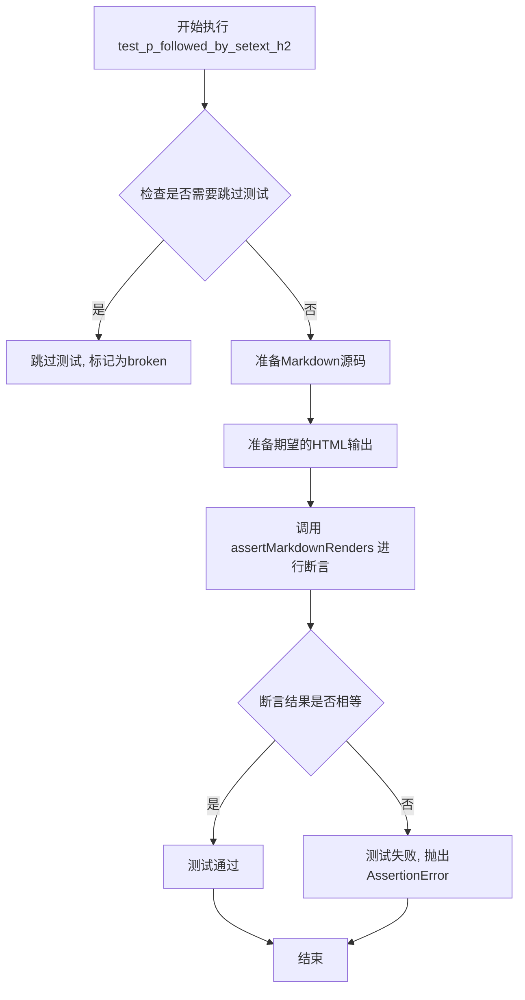

#### 带注释源码

```python
# TODO: fix this
# see https://johnmacfarlane.net/babelmark2/?normalize=1&text=Paragraph%0AAn+H2%0A-----
# 该测试方法被标记为跳过，原因是 Python-Markdown 在解析此类场景时存在已知 bug
# 相关讨论见: johnmacfarlane.net/babelmark2
@unittest.skip('This is broken in Python-Markdown')
def test_p_followed_by_setext_h2(self):
    """
    测试段落后跟 Setext 风格 H2 标题的渲染情况
    
    测试场景:
    - 输入: 一个普通段落,后跟一个 H2 标题标记行(使用减号),中间无空行
    - 期望输出: 段落转换为 <p> 标签, H2 标题转换为 <h2> 标签
    
    Markdown 源码结构:
    This is a Paragraph.          <- 普通段落文本
    Followed by an H2 with no blank line.  <- H2 标题文本
    -------------------------------------    <- H2 标题标记(至少3个减号)
    """
    self.assertMarkdownRenders(
        # 使用 self.dedent() 去除多行字符串的公共缩进
        self.dedent(
            """
            This is a Paragraph.
            Followed by an H2 with no blank line.
            -------------------------------------
            """
        ),
        # 期望的 HTML 输出
        self.dedent(
            """
            <p>This is a Paragraph.</p>
            <h2>Followed by an H2 with no blank line.</h2>
            """
        )
    )
```


### `TestHashHeaders.test_hash_h1_open`

该测试方法用于验证 Markdown 中 ATX 风格的 H1 标题（以单个 `#` 符号开头）能否正确转换为 HTML 的 `<h1>` 标签，是 Python-Markdown 项目中哈希标题测试用例的重要组成部分。

参数：

- 无显式参数（继承自 TestCase，self 为隐式参数）

返回值：`None`（无返回值），该方法为 unittest 测试用例，通过 `assertMarkdownRenders` 断言验证 Markdown 渲染结果的正确性。

#### 流程图

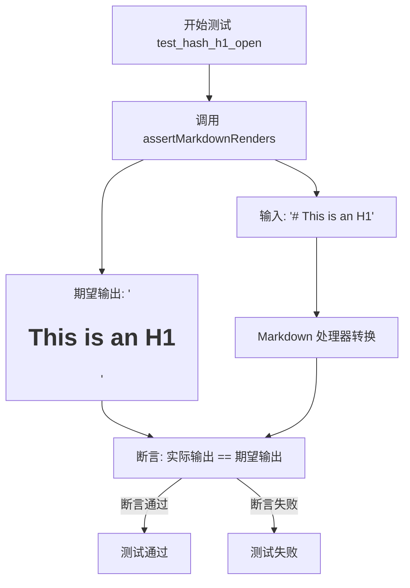

#### 带注释源码

```python
def test_hash_h1_open(self):
    """
    测试 ATX 风格 H1 标题的基本渲染功能。
    
    验证 Markdown 语法 '# This is an H1' 能正确转换为
    HTML 的 '<h1>This is is an H1</h1>'。
    """
    # 调用父类 TestCase 提供的断言方法，验证 Markdown 渲染结果
    # 参数1: 输入的 Markdown 源码
    # 参数2: 期望输出的 HTML
    self.assertMarkdownRenders(
        '# This is an H1',          # 输入: ATX 风格 H1 标题
        
        '<h1>This is an H1</h1>'    # 期望: 对应的 HTML h1 标签
    )
```


### `TestHashHeaders.test_hash_h2_open`

这是一个测试方法，用于验证 Markdown 解析器正确处理 ATX 风格的 H2 标题（以 `##` 开头的二级标题），确保输入 `'## This is an H2'` 能正确渲染为 HTML 输出 `'<h2>This is an H2</h2>'`。

参数：

- `self`：`TestHashHeaders`，测试用例的实例，隐式参数，用于调用继承的 `assertMarkdownRenders` 方法

返回值：`None`，无返回值（测试方法不返回值，通过 `assertMarkdownRenders` 进行断言验证）

#### 流程图

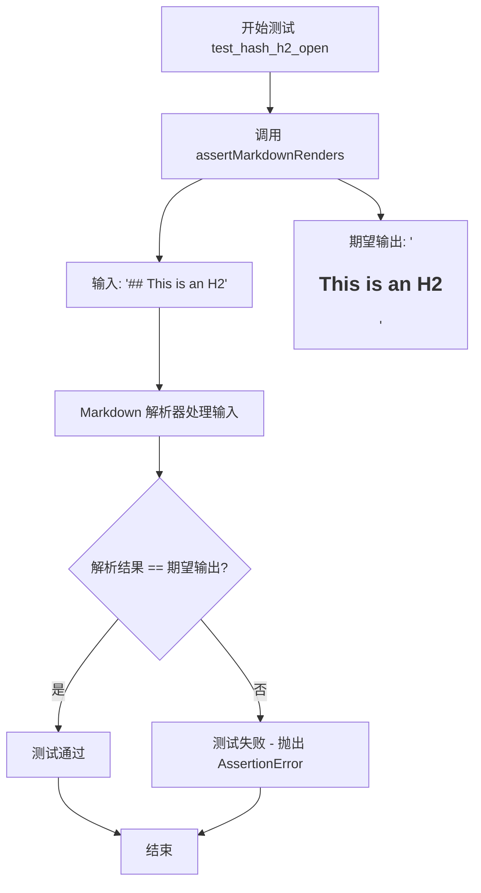

#### 带注释源码

```python
def test_hash_h2_open(self):
    """
    测试 ATX 风格的 H2 标题（开放格式）的渲染。
    
    验证以 '##' 开头的二级标题能正确解析为 HTML <h2> 标签。
    开放格式指标题后不闭合（如 ## Title 而不是 ## Title ##）。
    """
    # 调用父类 TestCase 提供的测试辅助方法
    # 参数1: Markdown 源文本
    # 参数2: 期望的 HTML 输出
    self.assertMarkdownRenders(
        '## This is an H2',  # 输入: Markdown 二级标题，开放格式

        '<h2>This is an H2</h2>'  # 期望: HTML 二级标题标签
    )
```


### `TestHashHeaders.test_hash_h3_open`

这是一个测试方法，用于验证 Markdown 解析器能够正确将 ATX 风格的 H3 标题（以三个井号 `###` 开头）转换为 HTML 的 `<h3>` 标签。

参数：

- `self`：`TestCase`，表示测试类的实例本身，继承自 `markdown.test_tools.TestCase`

返回值：`None`，无返回值（该方法为测试方法，通过断言验证功能，不返回任何值）

#### 流程图

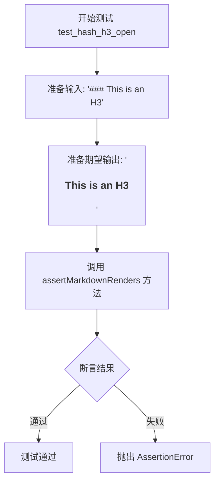

#### 带注释源码

```python
def test_hash_h3_open(self):
    """
    测试 ATX 风格 H3 标题的解析（开括号形式）
    
    验证 Markdown 中的 '### This is an H3' 能被正确解析为
    HTML 的 '<h3>This is an H3</h3>'
    """
    # 调用父类的 assertMarkdownRenders 方法进行断言验证
    self.assertMarkdownRenders(
        '### This is an H3',  # 输入：Markdown 格式的 H3 标题

        '<h3>This is an H3</h3>'  # 期望输出：HTML 格式的 H3 标签
    )
```


### `TestHashHeaders.test_hash_h4_open`

该方法是 `TestHashHeaders` 测试类中的一个测试用例，用于验证 Markdown 解析器能够正确处理 ATX 风格的 4 级标题（`#### This is an H4`），将其渲染为 HTML 的 `<h4>This is an H4</h4>` 标签。

参数：

- `self`：`TestHashHeaders`（隐式参数），测试类的实例，包含测试所需的断言方法

返回值：`None`，该方法为测试用例，通过 `assertMarkdownRenders` 断言方法验证 Markdown 渲染结果，不返回具体值

#### 流程图

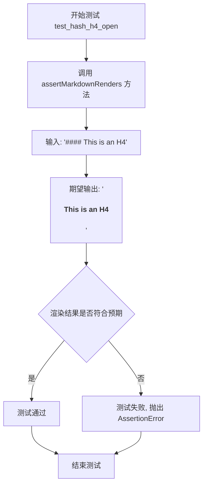

#### 带注释源码

```python
def test_hash_h4_open(self):
    """
    测试 ATX 风格 H4 标题的渲染功能。
    
    验证 Markdown 语法 '#### This is an H4' 
    能否正确转换为 HTML 的 <h4> 标签。
    """
    # 调用父类 TestCase 提供的断言方法
    # 参数1: 输入的 Markdown 文本
    # 参数2: 期望输出的 HTML 文本
    self.assertMarkdownRenders(
        '#### This is an H4',  # 输入: 4个#号 + 标题文本
        '<h4>This is an H4</h4>'  # 期望: H4 标签包裹标题内容
    )
```


### `TestHashHeaders.test_hash_h5_open`

该方法用于测试 Markdown 解析器能否正确将五级标题的 ATX 语法（`##### This is an H5`）转换为 HTML 的 `<h5>` 标签，验证解析器对 H5 级别标题的渲染能力。

参数：

- `self`：`TestCase`，隐式参数，代表测试类实例本身，继承自 `markdown.test_tools.TestCase`

返回值：`None`，无显式返回值，通过 `assertMarkdownRenders` 方法内部的断言来验证 Markdown 到 HTML 的转换结果是否符合预期。

#### 流程图

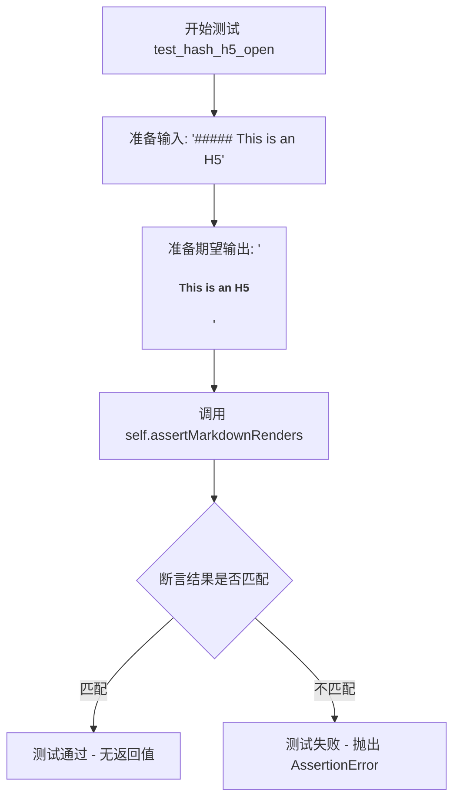

#### 带注释源码

```python
def test_hash_h5_open(self):
    """
    测试五级标题（ATX 风格）的 Markdown 解析。
    
    验证 Markdown 语法：
        ##### This is an H5
    正确转换为 HTML：
        <h5>This is an H5</h5>
    """
    # 调用父类方法 assertMarkdownRenders 进行断言验证
    # 参数1: 待解析的 Markdown 源码
    # 参数2: 期望的 HTML 输出
    self.assertMarkdownRenders(
        '##### This is an H5',  # 输入: 五级标题的 ATX 语法，5个#号
        
        '<h5>This is an H5</h5>'  # 期望输出: HTML h5 标签包裹的文本
    )
```


### `TestHashHeaders.test_hash_h6_open`

该方法是Python Markdown测试套件中的一个单元测试，用于验证Markdown解析器正确处理六级标题（`<h6>`）的"开放"语法（仅前导哈希标记）。测试用例检查输入`'###### This is an H6'`是否被正确转换为HTML输出`<h6>This is an H6</h6>`。

参数：

- `self`：`TestHashHeaders`，测试类实例本身，包含测试所需的上下文和方法

返回值：`None`，该方法为测试方法，不返回值，通过`assertMarkdownRenders`进行断言验证

#### 流程图

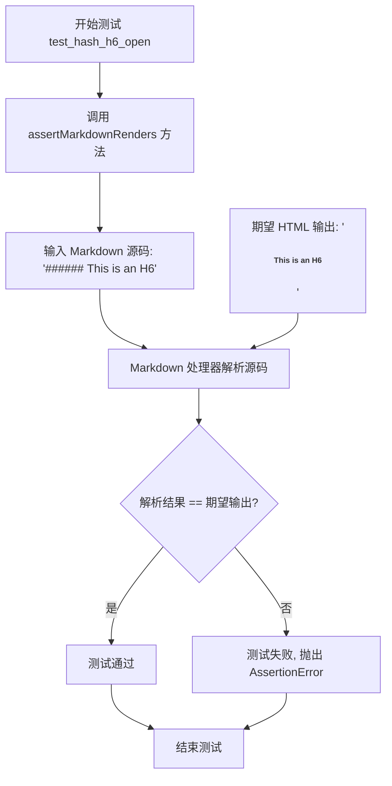

#### 带注释源码

```python
def test_hash_h6_open(self):
    """
    测试方法：验证六级标题的开放哈希语法
    
    测试场景：
    - 输入：'###### This is an H6'（6个哈希符号 + 空格 + 标题文本）
    - 期望输出：'<h6>This is an H6</h6>'
    
    开放语法特点：
    - 只有前导哈希标记，没有尾随哈希标记
    - 哈希数量决定标题级别（1-6级）
    """
    # 调用父类 TestCase 的断言方法，验证 Markdown 到 HTML 的转换
    self.assertMarkdownRenders(
        '###### This is an H6',  # 输入：Markdown 格式的六级标题
        
        '<h6>This is an H6</h6>'  # 期望输出：HTML 格式的六级标题
    )
```


### `TestHashHeaders.test_hash_gt6_open`

该测试方法用于验证 Markdown 解析器处理超过 6 级标题（7 个及以上 `#` 号）的行为。根据 Markdown 规范，标题级别最大为 6 级，因此当输入超过 6 个 `#` 号时，应将前 6 个视为标题标记，剩余的作为普通文本输出。

参数：

- `self`：`TestCase`，测试类的实例方法，隐含的 `self` 参数

返回值：`None`，该方法为测试用例，使用 `assertMarkdownRenders` 进行断言验证，不返回具体值

#### 流程图

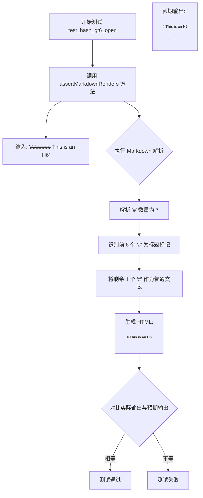

#### 带注释源码

```python
def test_hash_gt6_open(self):
    """
    测试超过 6 级标题的处理方式。
    
    根据 Markdown 规范，标题级别最大为 H6 (1-6)。
    当输入的 # 号超过 6 个时，解析器应：
    1. 将前 6 个 # 视为标题标记
    2. 将剩余的 # 作为普通文本内容输出
    """
    self.assertMarkdownRenders(
        '####### This is an H6',  # 输入：7 个 # 号

        '<h6># This is an H6</h6>'  # 期望输出：6 个 # 转换为 h6 标签，多余的 1 个 # 保留为文本
    )
```


### `TestHashHeaders.test_hash_h1_open_missing_space`

该测试方法用于验证 Markdown 解析器在井号（#）后缺少空格的情况下仍能正确将 `#This is an H1` 解析为 HTML `<h1>This is an H1</h1>`，体现了 Markdown 语法的宽松性。

参数：

- `self`：`TestHashHeaders`，代表测试类实例本身

返回值：`None`，该方法为测试用例，通过 `assertMarkdownRenders` 断言验证解析结果，无显式返回值

#### 流程图

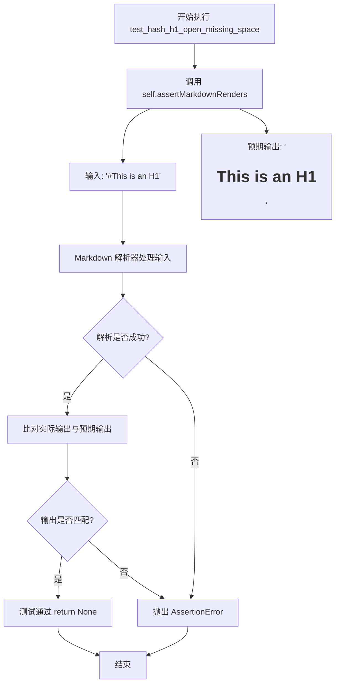

#### 带注释源码

```python
def test_hash_h1_open_missing_space(self):
    """
    测试 ATX 风格 H1 标题解析：井号后缺少空格的情况
    
    验证 Markdown 解析器能够容忍井号(#)和标题文本之间
    缺少空格的情况，正确解析为 H1 标题标签
    """
    # 调用测试框架的断言方法验证 Markdown 渲染结果
    # 参数1: 待解析的 Markdown 文本（井号后无空格）
    # 参数2: 期望的 HTML 输出
    self.assertMarkdownRenders(
        '#This is an H1',          # 输入: 缺少空格的 ATX H1 标题
        
        '<h1>This is an H1</h1>'   # 期望输出: 正确解析为 H1 标签
    )
```


### `TestHashHeaders.test_hash_h2_open_missing_space`

该测试方法用于验证当 Markdown 二级标题（`##`）缺少开始空格时（即 `##This is an H2`），Python Markdown 解析器仍能正确将其转换为 HTML 二级标题 `<h2>This is an H2</h2>`。

参数：

- `self`：`TestHashHeaders` 实例，测试用例本身

返回值：`None`，该方法为测试用例，通过 `assertMarkdownRenders` 断言验证 Markdown 到 HTML 的转换结果是否符合预期。

#### 流程图

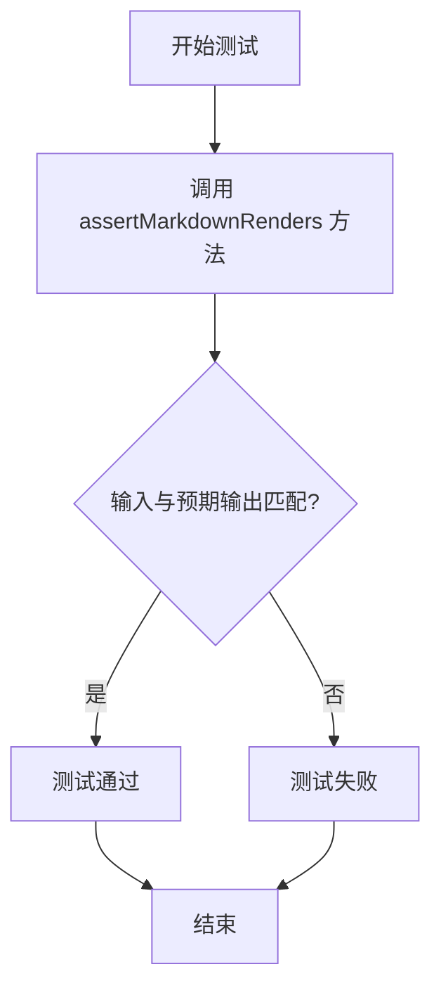

#### 带注释源码

```python
def test_hash_h2_open_missing_space(self):
    """
    测试二级标题缺少空格的情况
    
    验证 Markdown 语法 '##This is an H2' (## 后紧跟文本无空格)
    能够被正确解析为 HTML '<h2>This is an H2</h2>'
    """
    # 调用父类 TestCase 的 assertMarkdownRenders 方法进行断言验证
    # 参数1: Markdown 源文本（注意 ## 后无空格）
    # 参数2: 期望生成的 HTML 输出
    self.assertMarkdownRenders(
        '##This is an H2',

        '<h2>This is an H2</h2>'
    )
```


### `TestHashHeaders.test_hash_h3_open_missing_space`

该方法用于测试 Python Markdown 库在处理缺少空格的 ATX 风格 H3 标题时的解析能力，验证即使 `#` 符号与标题文本之间没有空格，解析器仍能正确生成 `<h3>` 标签。

参数：

- `self`：`TestHashHeaders`，测试类实例本身，隐式参数，用于访问父类 `TestCase` 的方法

返回值：`None`，该方法为测试用例，无返回值，通过 `assertMarkdownRenders` 断言验证解析结果

#### 流程图

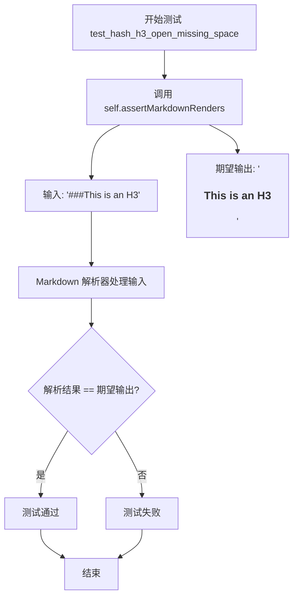

#### 带注释源码

```python
def test_hash_h3_open_missing_space(self):
    """
    测试 ATX 风格 H3 标题在缺少空格时的解析行为。
    验证 '#' 符号与标题文本直接相连时仍能被正确解析为 H3 标题。
    """
    # 调用父类 TestCase 的 assertMarkdownRenders 方法进行断言验证
    # 参数1: 输入的 Markdown 文本（### 与标题文本之间无空格）
    # 参数2: 期望输出的 HTML 标签
    self.assertMarkdownRenders(
        '###This is an H3',

        '<h3>This is an H3</h3>'
    )
```


### `TestHashHeaders.test_hash_h4_open_missing_space`

该测试方法用于验证 Markdown 解析器能够正确处理缺少空格的四级哈希标题（即 `####This is an H4` 格式），并将其解析为正确的 HTML `<h4>` 元素。

参数：

- `self`：`TestCase`，隐式参数，测试类实例本身，引用当前的测试用例对象

返回值：`None`，无返回值，该测试方法不返回任何值，仅执行断言验证

#### 流程图

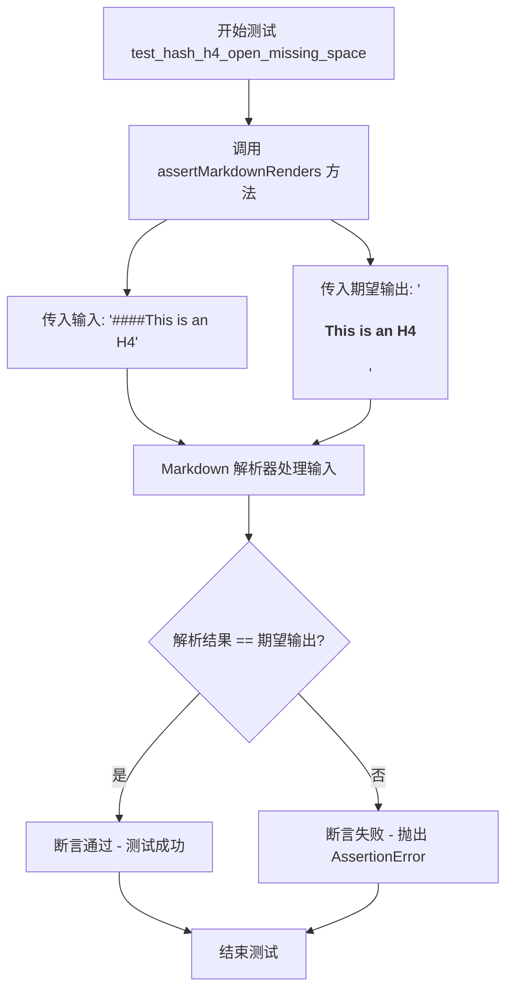

#### 带注释源码

```python
def test_hash_h4_open_missing_space(self):
    """
    测试四级哈希标题在缺少空格时的解析行为。
    
    验证 Markdown 解析器能够正确处理没有空格的情况，
    例如 '####This is an H4' 应被解析为 '<h4>This is an H4</h4>'。
    """
    # 调用父类的 assertMarkdownRenders 方法进行断言验证
    # 参数1: 输入的 Markdown 文本（缺少井号后的空格）
    # 参数2: 期望输出的 HTML 文本
    self.assertMarkdownRenders(
        '####This is an H4',    # 输入: 缺少空格的 H4 标记
        
        '<h4>This is an H4</h4>'  # 期望: 正确的 H4 标签
    )
```


### `TestHashHeaders.test_hash_h5_open_missing_space`

该方法是 `TestHashHeaders` 测试类中的一个测试用例，用于验证当 H5 标题（5个井号）缺少空格时，Markdown 解析器仍能正确将其渲染为 `<h5>` 标签。

参数：

- `self`：`TestCase`，测试类实例本身，包含测试所需的上下文和方法

返回值：`None`，该方法为测试用例，通过 `assertMarkdownRenders` 断言验证渲染结果，不返回具体值

#### 流程图

```mermaid
flowchart TD
    A[开始测试 test_hash_h5_open_missing_space] --> B[调用 assertMarkdownRenders 方法]
    B --> C[输入: '#####This is an H5']
    B --> D[期望输出: '<h5>This is an H5</h5>']
    C --> E[Markdown 解析器处理输入]
    E --> F{解析结果是否等于期望输出?}
    F -->|是| G[测试通过]
    F -->|否| H[测试失败, 抛出 AssertionError]
    G --> I[结束]
    H --> I
```

#### 带注释源码

```python
def test_hash_h5_open_missing_space(self):
    """
    测试 H5 标题（5个井号）在缺少空格时的渲染行为。
    验证 Markdown 解析器能够正确处理 '#####This is an H5' 格式的输入，
    并将其渲染为 <h5>This is an H5</h5>。
    """
    # 调用父类 TestCase 的 assertMarkdownRenders 方法进行断言验证
    # 参数1: 待解析的 Markdown 文本（5个井号后直接跟标题文本，无空格）
    # 参数2: 期望的 HTML 输出结果
    self.assertMarkdownRenders(
        '#####This is an H5',  # 输入: 缺少空格的 H5 标题语法
        
        '<h5>This is an H5</h5>'  # 期望输出: 正确的 H5 标签
    )
```


### `TestHashHeaders.test_hash_h6_open_missing_space`

该方法用于测试 Python Markdown 库对 ATX 风格 H6 标题的处理能力，验证当井号（#）后面缺少空格时（如 `######This is an H6`），解析器仍能正确将其转换为 `<h6>This is an H6</h6>`。

参数：

- `self`：`TestCase`，隐式参数，测试用例实例本身，用于调用继承的 `assertMarkdownRenders` 方法进行断言验证

返回值：`None`，该方法为测试方法，通过 `assertMarkdownRenders` 内部断言验证 Markdown 到 HTML 的转换结果是否符合预期

#### 流程图

```mermaid
flowchart TD
    A[开始测试] --> B[调用 assertMarkdownRenders]
    B --> C[输入: '######This is an H6']
    D[期望输出: '<h6>This is an H6</h6>']
    C --> E[Markdown 解析器处理输入]
    E --> F{解析结果 == 期望输出?}
    F -->|是| G[测试通过]
    F -->|否| H[测试失败]
    G --> I[结束]
    H --> I
```

#### 带注释源码

```python
def test_hash_h6_open_missing_space(self):
    """
    测试 ATX 风格 H6 标题在井号后缺少空格时的解析行为。
    
    验证 Python Markdown 能够正确处理以下两种格式：
    1. 标准格式：'###### This is an H6'（井号后有空格）
    2. 非标准格式：'######This is an H6'（井号后缺少空格）
    
    两者都应该被解析为 <h6> 标签。
    """
    # 调用父类 TestCase 提供的断言方法，验证 Markdown 渲染结果
    self.assertMarkdownRenders(
        '######This is an H6',  # 输入：井号后缺少空格的 H6 标题 Markdown 源码
        
        '<h6>This is an H6</h6>'  # 期望输出：对应的 HTML h6 标签
    )
```


### `TestHashHeaders.test_hash_gt6_open_missing_space`

该测试方法用于验证当标题标记使用超过6个井号（`#######`）且缺少空格时，Markdown 解析器能够正确处理这种情况，将超过6个的井号视为普通文本，只保留前6个作为H6标题标记。

参数：

- `self`：`TestHashHeaders`（隐式参数），代表测试类的实例本身

返回值：`None`，测试方法不返回值，通过 `assertMarkdownRenders` 断言验证渲染结果

#### 流程图

```mermaid
flowchart TD
    A[测试开始] --> B[调用 assertMarkdownRenders]
    B --> C[输入: '#######This is an H6']
    C --> D[期望输出: '<h6>#This is an H6</h6>']
    D --> E{渲染结果 == 期望?}
    E -->|是| F[测试通过]
    E -->|否| G[测试失败]
```

#### 带注释源码

```python
def test_hash_gt6_open_missing_space(self):
    """
    测试超过6个井号且缺少空格的情况
    
    场景：7个#号后直接跟随文本，没有空格
    预期：超过6个的#号被当作普通文本处理，保留1个#在标题内容中
    """
    self.assertMarkdownRenders(
        '#######This is an H6',  # 输入：7个#号，无空格
        
        '<h6>#This is an H6</h6>'  # 输出：H6标题，内容前保留一个#号
    )
```


# 详细设计文档

## 1. 一段话描述

`TestHashHeaders.test_hash_h1_closed` 是 Python-Markdown 项目中的一个单元测试方法，用于验证 Markdown 解析器能够正确处理带有前后闭合符号（#）的 H1 标题（即 ATX 风格闭合标题），确保输入 `# This is an H1 #` 能正确渲染为 `<h1>This is an H1</h1>`。

## 2. 文件的整体运行流程

该测试文件（假设为 `test_hash_headers.py`）属于 Python-Markdown 项目的测试套件，整体运行流程如下：

1. **测试框架初始化**：unittest 框架加载 `TestHashHeaders` 测试类
2. **测试用例执行**：对每个以 `test_` 开头的方法执行测试
3. **断言验证**：通过 `assertMarkdownRenders` 方法验证 Markdown 源码到 HTML 的转换结果
4. **测试报告**：输出每个测试用例的通过/失败状态

## 3. 类的详细信息

### 3.1 类 `TestHashHeaders`

| 属性/方法 | 类型 | 描述 |
|-----------|------|------|
| `test_hash_h1_open` | 方法 | 测试 ATX 风格开放 H1 标题 |
| `test_hash_h2_open` | 方法 | 测试 ATX 风格开放 H2 标题 |
| ... | ... | ... |
| `test_hash_h1_closed` | 方法 | 测试 ATX 风格闭合 H1 标题 |
| `test_hash_h2_closed` | 方法 | 测试 ATX 风格闭合 H2 标题 |
| `test_hash_h1_closed_mismatch` | 方法 | 测试前后闭合符号数量不匹配的情况 |

### 3.2 父类 `TestCase` (from markdown.test_tools)

| 属性/方法 | 类型 | 描述 |
|-----------|------|------|
| `assertMarkdownRenders` | 方法 | 核心断言方法，验证 Markdown 到 HTML 的转换 |
| `dedent` | 方法 | 去除多行字符串公共前缀缩进 |

## 4. 函数详细信息

### `TestHashHeaders.test_hash_h1_closed`

**描述**：验证 Markdown 解析器正确处理闭合式 ATX H1 标题（带前后 # 符号）

**参数**：无（仅包含 `self` 参数）

**返回值**：无（通过 unittest 断言验证）

#### 流程图

```mermaid
flowchart TD
    A[开始测试 test_hash_h1_closed] --> B[调用 assertMarkdownRenders]
    B --> C[输入: '# This is an H1 #']
    C --> D[期望输出: '<h1>This is an H1</h1>']
    D --> E{解析结果 == 期望?}
    E -->|是| F[测试通过]
    E -->|否| G[测试失败, 抛出 AssertionError]
    F --> H[结束测试]
    G --> H
```

#### 带注释源码

```python
def test_hash_h1_closed(self):
    """
    测试 ATX 风格闭合 H1 标题的解析
    
    验证 Markdown 语法: # Title # (前后带闭合 # 符号)
    预期输出: <h1>Title</h1> (闭合符号被移除)
    """
    self.assertMarkdownRenders(
        '# This is an H1 #',  # 输入: Markdown 源码，带前后闭合 #

        '<h1>This is an H1</h1>'  # 期望输出: 闭合 # 被移除后的 HTML
    )
```

## 5. 关键组件信息

| 组件名称 | 描述 |
|----------|------|
| `TestCase` (markdown.test_tools) | 提供 `assertMarkdownRenders` 断言方法，用于验证 Markdown 解析结果 |
| `assertMarkdownRenders` | 核心验证方法，接收 Markdown 源码和期望的 HTML 输出进行比对 |
| `dedent` | 辅助方法，用于处理多行测试字符串的缩进 |

## 6. 潜在的技术债务或优化空间

1. **测试数据硬编码**：测试用例中的输入输出值直接硬编码，缺乏参数化测试设计
2. **重复代码模式**：多个测试方法（h1-h6）的结构高度相似，可通过参数化测试（pytest.mark.parametrize）减少代码冗余
3. **缺失边界测试**：未覆盖一些边界情况，如闭合符号中间包含空格、多个空格等
4. **断言信息不够详细**：`assertMarkdownRenders` 在失败时提供的调试信息可能不够详细

## 7. 其它项目

### 设计目标与约束
- **目标**：确保 Markdown 解析器符合 CommonMark 规范中关于 ATX 标题的解析规则
- **约束**：闭合符号必须与开头符号数量匹配（或忽略不匹配部分）

### 错误处理与异常设计
- 测试失败时抛出 `unittest.TestCase.failureException` (AssertionError)
- 解析错误由底层 Markdown 解析器处理，测试仅验证最终输出

### 外部依赖与接口契约
- 依赖 `markdown.test_tools.TestCase` 基类
- 依赖 `markdown.convert` 函数进行实际转换
- 接口契约：输入有效 Markdown 字符串，输出符合规范的 HTML 字符串

### 数据流
```
Markdown 源码 ('# This is an H1 #')
    ↓
Markdown 解析器 (Core -> Preprocessors -> BlockParser -> Treeprocessors)
    ↓
HTML 输出 ('<h1>This is an H1</h1>')
    ↓
assertMarkdownRenders 断言验证
```


### `TestHashHeaders.test_hash_h2_closed`

该测试方法用于验证 Markdown 中带闭合标记的 H2 标题（`## This is an H2 ##`）能够正确渲染为 HTML `<h2>` 标签，是 Python-Markdown 项目中 ATX 标题渲染测试的一部分。

参数：无（仅包含 `self` 参数）

返回值：`None`，该方法为测试用例，无返回值，通过 `assertMarkdownRenders` 方法进行断言验证

#### 流程图

```mermaid
flowchart TD
    A[开始 test_hash_h2_closed] --> B[调用 assertMarkdownRenders]
    B --> C{输入匹配输出?}
    C -->|是| D[测试通过]
    C -->|否| E[抛出 AssertionError]
    D --> F[结束]
    E --> F
```

#### 带注释源码

```python
def test_hash_h2_closed(self):
    """
    测试带闭合标记的 H2 标题渲染
    
    验证 Markdown 语法: ## This is an H2 ##
    期望渲染为 HTML: <h2>This is an H2</h2>
    """
    self.assertMarkdownRenders(
        '## This is an H2 ##',  # 输入：带闭合##的H2标题语法
        
        '<h2>This is an H2</h2>'  # 期望输出：渲染后的H2标签
    )
```


### `TestHashHeaders.test_hash_h3_closed`

该测试方法用于验证 Markdown 解析器能够正确处理带有闭合哈希标记（`###`）的 H3 标题（`### This is an H3 ###`），确保解析输出为标准 HTML `<h3>` 标签。

#### 参数

由于该方法是测试用例，其参数遵循 Python unittest 框架的约定：

- `self`：`TestCase`（或子类实例），Python unittest 测试框架的标准参数，代表当前测试实例，用于调用断言方法

#### 返回值

- `None`（无显式返回值），测试方法通过 `self.assertMarkdownRenders()` 进行断言验证，若测试失败则抛出异常

#### 流程图

```mermaid
flowchart TD
    A[开始测试 test_hash_h3_closed] --> B[调用 assertMarkdownRenders 方法]
    B --> C[输入 Markdown 文本: '### This is an H3 ###']
    D[期望输出 HTML: '<h3>This is an H3</h3>']
    C --> E[Markdown 处理器解析输入]
    E --> F{解析结果是否匹配期望输出}
    F -->|是| G[测试通过 - 无返回值/抛出异常]
    F -->|否| H[测试失败 - 抛出 AssertionError]
```

#### 带注释源码

```python
def test_hash_h3_closed(self):
    """
    测试方法：验证带有闭合哈希标记的 H3 标题解析
    
    测试场景：
    - 输入：'### This is an H3 ###'（带有前后闭合哈希的 H3 标题）
    - 期望输出：'<h3>This is an H3</h3>'（标准 HTML H3 标签）
    
    此测试验证 Markdown 解析器能够：
    1. 识别开头的哈希标记数量（3个 # 对应 H3）
    2. 正确提取标题文本内容（'This is an H3'）
    3. 处理结尾的闭合哈希标记（3个 #）
    4. 输出符合 HTML 规范的 h3 标签
    """
    # 调用父类 TestCase 提供的断言方法进行渲染验证
    # 参数1：待解析的 Markdown 文本
    # 参数2：期望的 HTML 输出
    self.assertMarkdownRenders(
        '### This is an H3 ###',  # 输入：带有闭合标记的 H3 标题
        
        '<h3>This is an H3</h3>'   # 期望输出：标准 HTML H3 标签
    )
```


### `TestHashHeaders.test_hash_h4_closed`

这是一个 Markdown 解析器的单元测试方法，用于验证使用闭合式语法（`#### text ####`）书写的 H4 标题能正确转换为 HTML `<h4>` 标签。

参数：

- `self`：`TestCase`（隐式参数），测试用例的实例对象，用于调用继承的 `assertMarkdownRenders` 方法

返回值：`None`，该方法为 void 类型，不返回任何值，仅通过断言验证 Markdown 渲染结果

#### 流程图

```mermaid
flowchart TD
    A[开始执行 test_hash_h4_closed] --> B[调用 assertMarkdownRenders 方法]
    B --> C[输入: '#### This is an H4 ####']
    B --> D[期望输出: '<h4>This is an H4</h4>']
    C --> E[Markdown 解析器处理输入]
    E --> F[生成实际 HTML 输出]
    F --> G{实际输出 == 期望输出?}
    G -->|是| H[测试通过]
    G -->|否| I[测试失败, 抛出 AssertionError]
    H --> J[结束]
    I --> J
```

#### 带注释源码

```python
def test_hash_h4_closed(self):
    """
    测试闭合式 H4 标题的 Markdown 解析
    
    验证 Markdown 语法: #### This is an H4 ####
    能否正确转换为 HTML: <h4>This is an H4</h4>
    """
    # 调用父类方法验证 Markdown 渲染结果
    # 参数1: 输入的 Markdown 文本（闭合式 H4 标题语法）
    # 参数2: 期望输出的 HTML 字符串
    self.assertMarkdownRenders(
        '#### This is an H4 ####',

        '<h4>This is an H4</h4>'
    )
```


### `TestHashHeaders.test_hash_h5_closed`

该方法用于测试 Markdown 中带闭合标记的 H5 标题（5 个 # 号）是否正确渲染为 `<h5>` HTML 标签。

参数：

- `self`：`TestHashHeaders` 实例对象，隐式参数，表示测试类实例本身

返回值：`None`，该方法为测试方法，通过 `assertMarkdownRenders` 断言验证渲染结果，不返回显式值

#### 流程图

```mermaid
flowchart TD
    A[开始测试 test_hash_h5_closed] --> B[调用 assertMarkdownRenders 方法]
    B --> C[输入: '##### This is an H5 #####']
    B --> D[期望输出: '<h5>This is an H5</h5>']
    C --> E[Markdown 解析器处理输入]
    E --> F[生成实际 HTML 输出]
    F --> G{实际输出 == 期望输出?}
    G -->|是| H[测试通过]
    G -->|否| I[测试失败, 抛出 AssertionError]
    H --> J[结束]
    I --> J
```

#### 带注释源码

```python
def test_hash_h5_closed(self):
    """
    测试带闭合标记的 H5 标题渲染功能
    
    验证 Markdown 语法: ##### This is an H5 #####
    期望渲染为: <h5>This is an H5</h5>
    """
    # 使用 TestCase 提供的 assertMarkdownRenders 方法进行断言验证
    # 参数1: Markdown 源码字符串 (带前后闭合 # 号的 H5 标题)
    # 参数2: 期望生成的 HTML 字符串
    self.assertMarkdownRenders(
        '##### This is an H5 #####',  # 输入: Markdown 格式的 H5 标题,首尾带有闭合 # 号

        '<h5>This is an H5</h5>'       # 期望: HTML <h5> 标签包裹的标题文本
    )
```


### `TestHashHeaders.test_hash_h6_closed`

该测试方法用于验证 Markdown 中使用闭合语法（ATX 风格）渲染 H6 标题的功能，具体测试当输入为 `'###### This is an H6 ######'` 时，能够正确输出为 `'<h6>This is an H6</h6>'`。

参数：

- `self`：`TestCase`，继承自 `unittest.TestCase` 的测试类实例，用于调用测试框架的断言方法

返回值：`None`，此测试方法不返回任何值，仅通过 `assertMarkdownRenders` 方法执行断言验证

#### 流程图

```mermaid
flowchart TD
    A[开始测试 test_hash_h6_closed] --> B[调用 assertMarkdownRenders 方法]
    B --> C[输入: '###### This is an H6 ######']
    D[输入: 期望输出: '<h6>This is an H6</h6>']
    C --> E[执行 Markdown 渲染转换]
    D --> E
    E --> F{实际输出是否匹配期望输出?}
    F -->|是| G[测试通过]
    F -->|否| H[测试失败, 抛出 AssertionError]
    G --> I[结束测试]
    H --> I
```

#### 带注释源码

```python
def test_hash_h6_closed(self):
    """
    测试 ATX 风格闭合语法渲染 H6 标题的功能。
    
    验证 Markdown 语法:
    '###### This is an H6 ######'
    
    期望渲染为:
    '<h6>This is an H6</h6>'
    """
    # 使用 TestCase 基类提供的 assertMarkdownRenders 方法
    # 参数1: 输入的 Markdown 文本
    # 参数2: 期望渲染输出的 HTML 字符串
    self.assertMarkdownRenders(
        '###### This is an H6 ######',  # 输入: 6个#号包裹标题内容,首尾各有6个#号
        '<h6>This is an H6</h6>'        # 期望: 标准H6标签包裹标题内容
    )
```


### `TestHashHeaders.test_hash_gt6_closed`

该测试方法用于验证当使用7个或更多井号（#）作为闭合式ATX标题标记时，Markdown解析器能够正确将其转换为H6标签，并将多余的井号符号作为普通文本保留在标题内容中。

参数：

- `self`：`TestHashHeaders`，测试类的实例，代表测试本身

返回值：`None`，无返回值（测试方法）

#### 流程图

```mermaid
flowchart TD
    A[开始测试] --> B[调用 assertMarkdownRenders]
    B --> C[输入: '####### This is an H6 #######']
    D[Markdown 解析器处理] --> E[输出: '<h6># This is an H6</h6>']
    C --> D
    B --> E
    E --> F{输出是否匹配预期}
    F -->|是| G[测试通过]
    F -->|否| H[测试失败]
```

#### 带注释源码

```python
def test_hash_gt6_closed(self):
    """
    测试闭合式ATX标题使用超过6个井号时的行为。
    
    根据Markdown规范，1-6个井号对应H1-H6标题。
    超过6个井号时，多余的井号应作为普通文本保留在标题内容中。
    """
    # 调用父类测试框架的断言方法，验证Markdown渲染结果
    self.assertMarkdownRenders(
        # 输入：7个井号开头和7个井号结尾的标题标记
        '####### This is an H6 #######',
        
        # 预期输出：H6标签，内容前保留一个井号作为文本
        '<h6># This is an H6</h6>'
    )
```


### `TestHashHeaders.test_hash_h1_closed_missing_space`

该测试方法用于验证 Markdown 解析器在处理 ATX 风格 H1 标题（闭合形式）且缺少空格的情况下的正确性。具体来说，它测试输入 `'#This is an H1#'` 是否被正确解析为 `<h1>This is an H1</h1>`。

参数：

- `self`：`TestCase`，隐式的实例参数，表示测试类本身

返回值：`None`，无返回值，这是一个测试用例方法

#### 流程图

```mermaid
flowchart TD
    A[开始测试 test_hash_h1_closed_missing_space] --> B[调用 assertMarkdownRenders 方法]
    B --> C[输入: '#This is an H1#']
    B --> D[期望输出: '<h1>This is an H1</h1>']
    C --> E[Markdown 解析器处理输入]
    E --> F{解析结果是否匹配期望输出}
    F -->|是| G[测试通过]
    F -->|否| H[测试失败]
    G --> I[结束]
    H --> I
```

#### 带注释源码

```python
def test_hash_h1_closed_missing_space(self):
    """
    测试 ATX 风格 H1 标题（闭合形式）缺少开头和结尾空格的情况。
    
    验证 Markdown 解析器能够正确处理类似 '#This is an H1#' 的输入，
    其中 '#' 符号后面没有空格，且结束 '#' 前面也没有空格。
    """
    # 调用父类的 assertMarkdownRenders 方法进行断言验证
    # 第一个参数为 Markdown 源文本，第二个参数为期望的 HTML 输出
    self.assertMarkdownRenders(
        '#This is an H1#',  # 输入：H1 标题，闭合形式，缺少空格
        
        '<h1>This is an H1</h1>'  # 期望输出：标准 H1 标签
    )
```


### `TestHashHeaders.test_hash_h2_closed_missing_space`

该测试方法用于验证当使用闭合式ATX标题（`##`）且标题文本前后缺少空格时，Markdown解析器能够正确将其渲染为H2级别的HTML标题元素。

参数：

- `self`：TestCase，隐式的测试用例实例，继承自`markdown.test_tools.TestCase`

返回值：`None`，该方法无返回值，通过`assertMarkdownRenders`断言验证渲染结果

#### 流程图

```mermaid
flowchart TD
    A[开始测试 test_hash_h2_closed_missing_space] --> B[调用 assertMarkdownRenders]
    B --> C[输入: '##This is an H2##']
    C --> D[期望输出: '<h2>This is an H2</h2>']
    D --> E{断言结果}
    E -->|通过| F[测试通过]
    E -->|失败| G[抛出 AssertionError]
```

#### 带注释源码

```python
def test_hash_h2_closed_missing_space(self):
    """
    测试闭合式ATX标题（H2）在缺少空格时的渲染行为。
    验证 ##This is an H2## 能够正确转换为 <h2>This is an H2</h2>
    """
    # 调用父类的 assertMarkdownRenders 方法进行断言验证
    # 参数1: 待解析的Markdown文本（#号后缺少空格，结束#号前也缺少空格）
    # 参数2: 期望的HTML输出结果
    self.assertMarkdownRenders(
        '##This is an H2##',  # 输入: 缺少空格的闭合式H2标题

        '<h2>This is an H2</h2>'  # 期望输出: H2级别的HTML标题元素
    )
```


### `TestHashHeaders.test_hash_h3_closed_missing_space`

该测试方法用于验证 Markdown 解析器正确处理带有闭合标记（`###`）但缺少空格的 H3 标题（`###This is an H3###`），确保其能正确渲染为 `<h3>This is an H3</h3>`。

参数：

- `self`：继承自 `TestCase` 的测试类实例，无需显式传递

返回值：`None`，该方法通过 `assertMarkdownRenders` 执行断言验证，测试通过则无异常，测试失败则抛出断言错误

#### 流程图

```mermaid
flowchart TD
    A[开始测试 test_hash_h3_closed_missing_space] --> B[调用 assertMarkdownRenders 方法]
    B --> C[输入: '###This is an H3###']
    B --> D[期望输出: '<h3>This is an H3</h3>']
    C --> E[Markdown 解析器处理输入]
    E --> F{解析结果是否匹配期望输出?}
    F -->|是| G[测试通过]
    F -->|否| H[测试失败抛出 AssertionError]
    G --> I[结束]
    H --> I
```

#### 带注释源码

```python
def test_hash_h3_closed_missing_space(self):
    """
    测试 Markdown 解析器处理带有闭合标记但缺少空格的 H3 标题。
    
    测试场景：
    - 输入：'###This is an H3###' (3个#号 + 标题文本 + 3个#号，无空格)
    - 期望输出：'<h3>This is an H3</h3>'
    
    该测试验证解析器能够正确识别两种情况：
    1. 开头缺少空格的 # 号序列（如 ###）
    2. 结尾缺少空格的 # 号序列（如 ###）
    """
    
    # 调用父类 TestCase 的断言方法，验证 Markdown 渲染结果
    self.assertMarkdownRenders(
        # 第一个参数：Markdown 源码输入
        '###This is an H3###',
        
        # 第二个参数：期望的 HTML 输出
        '<h3>This is an H3</h3>'
    )
```


### `TestHashHeaders.test_hash_h4_closed_missing_space`

该测试方法用于验证 Markdown 解析器在处理闭合形式 H4 标题（标题标记与文本之间缺少空格）时的正确性。测试用例为 `####This is an H4####`，期望渲染为 `<h4>This is an H4</h4>`。

参数：

- `self`：`TestCase`，测试类实例本身，继承自 `markdown.test_tools.TestCase`

返回值：`None`，测试方法无返回值，通过 `assertMarkdownRenders` 方法内部断言验证渲染结果是否符合预期。

#### 流程图

```mermaid
flowchart TD
    A[开始测试 test_hash_h4_closed_missing_space] --> B[调用 assertMarkdownRenders 方法]
    B --> C[输入: '####This is an H4####']
    B --> D[期望输出: '<h4>This is an H4</h4>']
    C --> E[Markdown 解析器处理输入]
    E --> F[生成实际 HTML 输出]
    F --> G{实际输出 == 期望输出?}
    G -->|是| H[测试通过]
    G -->|否| I[测试失败, 抛出 AssertionError]
    H --> J[结束测试]
    I --> J
```

#### 带注释源码

```python
def test_hash_h4_closed_missing_space(self):
    """
    测试闭合形式 H4 标题（缺少空格）的渲染
    
    输入: '####This is an H4####'
    期望输出: '<h4>This is an H4</h4>'
    
    此测试验证 Markdown 解析器能够正确处理以下情况:
    1. 标题标记 #'s 连续出现且未与文本之间添加空格
    2. 起始和结束 #'s 都缺少空格
    3. 将其正确识别为闭合式 H4 标题并渲染
    """
    self.assertMarkdownRenders(
        '####This is an H4####',  # 输入 Markdown 文本：闭合式 H4，缺少空格
        '<h4>This is an H4</h4>'  # 期望输出的 HTML
    )
```


### `TestHashHeaders.test_hash_h5_closed_missing_space`

这是一个测试方法，用于验证 Python Markdown 库在处理带有闭合哈希标记（`#####`）但缺少空格（missing space）的 H5 标题时的解析行为。测试用例 `'#####This is an H5#####'` 应被正确解析为 `<h5>This is an H5</h5>`。

参数：

- `self`：`TestCase`，测试用例实例本身，用于调用继承的 assertMarkdownRenders 方法

返回值：`None`，该方法为测试方法，无返回值，通过断言验证 Markdown 解析结果

#### 流程图

```mermaid
graph TD
    A[开始执行 test_hash_h5_closed_missing_space] --> B[调用 assertMarkdownRenders 方法]
    B --> C[输入: '#####This is an H5#####']
    D[调用 markdown 解析器] --> E{解析为 H5 标题}
    E -->|是| F[输出: '<h5>This is an H5</h5>']
    E -->|否| G[测试失败]
    F --> H[断言比对期望输出]
    H --> I{输出匹配}
    I -->|是| J[测试通过]
    I -->|否| K[测试失败]
    C --> D
```

#### 带注释源码

```python
def test_hash_h5_closed_missing_space(self):
    """
    测试闭合式 H5 标题（带闭合哈希标记）但缺少空格的情况。
    验证 Markdown 解析器能够正确识别这种格式并解析为 H5 标题。
    """
    # 调用父类 TestCase 的 assertMarkdownRenders 方法进行断言验证
    # 第一个参数：输入的 Markdown 文本（# 号后缺少空格）
    # 第二个参数：期望输出的 HTML
    self.assertMarkdownRenders(
        '#####This is an H5#####',  # 输入：5 个 # 号后直接跟标题文本，末尾也有 5 个 # 号，无空格
        
        '<h5>This is an H5</h5>'    # 期望输出：标准 H5 标题 HTML 标签
    )
```


### `TestHashHeaders.test_hash_h6_closed_missing_space`

该测试方法用于验证 Python Markdown 解析器能够正确处理带有 6 个闭合哈希符号（`######`）但在符号和文本之间缺少空格的 H6 标题，即将输入 `'######This is an H6######'` 正确转换为 `<h6>This is an H6</h6>`。

参数：

- `self`：`TestHashHeaders`，测试类实例本身，无需显式传递

返回值：`None`，测试方法无返回值，通过 `assertMarkdownRenders` 断言验证解析结果

#### 流程图

```mermaid
flowchart TD
    A[开始执行 test_hash_h6_closed_missing_space] --> B[调用 assertMarkdownRenders 方法]
    B --> C[输入: '######This is an H6######']
    B --> D[期望输出: '<h6>This is an H6</h6>']
    C --> E[Markdown 解析器处理输入]
    E --> F{解析结果是否匹配期望?}
    F -->|是| G[测试通过]
    F -->|否| H[测试失败]
    G --> I[结束]
    H --> I
```

#### 带注释源码

```python
def test_hash_h6_closed_missing_space(self):
    """
    测试闭合的 H6 标题（6个 #）但缺少空格的情况。
    
    验证 Markdown 解析器能够处理以下情况：
    - 开头使用 6 个 # 符号（######）
    - 标题文本与 # 符号之间没有空格
    - 结尾使用 6 个 # 符号（######）
    
    期望行为：即使缺少空格，也应正确解析为 H6 标题
    """
    # 调用父类 TestCase 的 assertMarkdownRenders 方法进行验证
    # 参数1: 输入的 Markdown 文本（# 符号与文本之间无空格）
    # 参数2: 期望输出的 HTML
    self.assertMarkdownRenders(
        '######This is an H6######',  # 输入: 缺少空格的闭合 H6 标题
        
        '<h6>This is an H6</h6>'      # 期望输出: 标准 H6 HTML 标签
    )
```


### `TestHashHeaders.test_hash_gt6_closed_missing_space`

这是一个测试方法，用于验证 Markdown 中当使用超过6个井号（`#`）且缺少空格时的 ATX 风格标题（Hash Headers）的渲染行为。具体来说，它测试了7个或更多井号紧跟着标题文本且标题末尾也紧跟着井号（无空格）的情况，此时多余的井号应被处理为标题文本的一部分。

参数：

- `self`：`TestHashHeaders`（隐式参数），表示测试类实例本身，用于调用父类方法 `assertMarkdownRenders`

返回值：`None`，该方法为测试方法，通过 `assertMarkdownRenders` 进行断言验证，若测试失败则抛出异常

#### 流程图

```mermaid
flowchart TD
    A[开始测试] --> B[调用 assertMarkdownRenders]
    B --> C[输入: '#######This is an H6#######']
    B --> D[期望输出: '<h6>#This is an H6</h6>']
    C --> E[Markdown 处理器解析]
    E --> F{井号数量 > 6?}
    F -->|是| G[第一个井号为标题级别标记]
    F -->|否| H[使用实际井号数作为标题级别]
    G --> I[剩余井号作为文本内容]
    I --> J[生成 HTML]
    H --> J
    J --> K{输出 == 期望?}
    K -->|是| L[测试通过]
    K -->|否| M[测试失败: 抛出 AssertionError]
```

#### 带注释源码

```python
def test_hash_gt6_closed_missing_space(self):
    """
    测试超过6个井号且缺少空格时的ATX标题渲染
    
    验证规则:
    - 当井号数量超过6个时，只有第一个6个井号被视为标题标记
    - 剩余的井号应作为文本内容保留在标题内
    - 即使标题文本前后缺少空格，也应正确解析
    """
    self.assertMarkdownRenders(
        '#######This is an H6#######',  # 输入: 7个井号 + 标题文本 + 7个井号（无空格）
        
        '<h6>#This is an H6</h6>'        # 期望输出: h6标签，内容前保留一个#号
    )
```


### `TestHashHeaders.test_hash_h1_closed_mismatch`

这是一个测试方法，用于验证当 ATX 风格哈希标题的开头和结尾哈希数量不匹配时（如 "# This is an H1 ##"），Markdown 解析器仍能正确将其渲染为 H1 标题。

参数：

- `self`：`TestHashHeaders`，Python 类方法的标准参数，指向测试类实例本身

返回值：`None`，测试方法无返回值，通过 `assertMarkdownRenders` 断言验证渲染结果

#### 流程图

```mermaid
flowchart TD
    A[开始测试 test_hash_h1_closed_mismatch] --> B[调用 assertMarkdownRenders]
    B --> C[输入: '# This is an H1 ##']
    C --> D[期望输出: '<h1>This is an H1</h1>']
    D --> E{渲染结果是否匹配?}
    E -->|是| F[测试通过]
    E -->|否| G[测试失败]
```

#### 带注释源码

```python
def test_hash_h1_closed_mismatch(self):
    """
    测试 ATX 标题开头和结尾哈希数量不匹配的情况。
    例如：'# This is an H1 ##' 开头1个#，结尾2个#
    应该正确渲染为 H1 标题，忽略结尾多余的不匹配哈希。
    """
    self.assertMarkdownRenders(
        '# This is an H1 ##',  # 输入：开头1个#，结尾2个#的ATX标题

        '<h1>This is an H1</h1>'  # 期望输出：忽略不匹配的结尾#，正确渲染为H1
    )
```


### `TestHashHeaders.test_hash_h2_closed_mismatch`

该测试方法用于验证 Markdown 解析器在处理带有关闭标签但数量不匹配的 H2 标题时的行为。当输入为 `## This is an H2 #`（两个 `#` 开头但只有一个 `#` 结尾）时，解析器应正确提取文本内容并渲染为 `<h2>This is an H2</h2>`。

参数：

- `self`：`TestCase`，继承自 unittest.TestCase 的测试类实例，包含测试所需的辅助方法（如 `assertMarkdownRenders` 和 `dedent`）

返回值：`None`，该方法为测试用例，通过 `assertMarkdownRenders` 断言验证 Markdown 渲染结果，不返回任何值

#### 流程图

```mermaid
graph TD
    A[开始测试 test_hash_h2_closed_mismatch] --> B[调用 assertMarkdownRenders 方法]
    B --> C[传入输入: '## This is an H2 #']
    B --> D[传入期望输出: '<h2>This is an H2</h2>']
    C --> E[Markdown 解析器处理输入]
    E --> F{解析结果是否匹配期望输出?}
    F -->|是| G[测试通过]
    F -->|否| H[测试失败 - 抛出 AssertionError]
    G --> I[结束测试]
    H --> I
```

#### 带注释源码

```python
def test_hash_h2_closed_mismatch(self):
    """
    测试闭合标签数量不匹配时的 H2 标题渲染。
    
    当标题行以多个 # 开头但以较少的 # 结束时，
    解析器应忽略不匹配的闭合标签，只保留开头的 # 数量来确定标题级别。
    """
    self.assertMarkdownRenders(
        '## This is an H2 #',  # 输入：H2 标题，但闭合标签只有1个 #

        '<h2>This is an H2</h2>'  # 期望输出：解析器忽略不匹配的闭合标签
    )
```


### `TestHashHeaders.test_hash_h3_closed_mismatch`

该方法用于测试 Markdown 中 H3 标题的闭合标签不匹配情况，验证当前置三个 `#` 与后置一个 `#` 不匹配时，Markdown 解析器仍能正确将其解析为 `<h3>` 标签。

参数：

- `self`：`TestCase`，继承自 `markdown.test_tools.TestCase` 的测试用例实例，用于调用继承的 `assertMarkdownRenders` 方法进行断言验证

返回值：无返回值（`None`），该方法为测试用例方法，通过 `assertMarkdownRenders` 内部断言验证结果

#### 流程图

```mermaid
flowchart TD
    A[开始执行 test_hash_h3_closed_mismatch] --> B[调用 self.assertMarkdownRenders]
    B --> C[输入 Markdown 源文本: '### This is an H3 #']
    D[期望 HTML 输出: '<h3>This is an H3</h3>']
    B --> D
    C --> E{断言实际输出与期望输出是否匹配}
    E -->|匹配| F[测试通过]
    E -->|不匹配| G[测试失败, 抛出 AssertionError]
```

#### 带注释源码

```python
def test_hash_h3_closed_mismatch(self):
    """
    测试 H3 标题闭合标签数量不匹配的情况。
    
    场景: 使用三个 # 开头, 但只用一个 # 闭合 (### This is an H3 #)
    期望: 解析器应忽略不匹配的闭合标签, 仍正确解析为 <h3> 元素
    """
    self.assertMarkdownRenders(
        '### This is an H3 #',  # 输入: Markdown 源文本, 开头三个 # 与结尾一个 # 不匹配

        '<h3>This is an H3</h3>'  # 期望: 正确解析为 H3 标题, 忽略不匹配的闭合标签
    )
```


### `TestHashHeaders.test_hash_h4_closed_mismatch`

该测试方法用于验证 Markdown 解析器在处理 ATX 风格 H4 标题时，当关闭标记数量不匹配（例如使用单个 `#` 而非四个 `#`）的情况下，仍能正确解析并生成预期的 HTML 输出。

参数：

- `self`：`TestHashHeaders`，测试类的实例本身，用于访问父类 `TestCase` 的断言方法

返回值：`None`，此测试方法不返回任何值，仅通过 `assertMarkdownRenders` 执行断言来验证解析结果的正确性

#### 流程图

```mermaid
flowchart TD
    A[开始测试 test_hash_h4_closed_mismatch] --> B[调用 assertMarkdownRenders]
    B --> C[输入: '#### This is an H4 #']
    B --> D[预期输出: '<h4>This is an H4</h4>']
    C --> E[Markdown 解析器处理输入]
    E --> F[生成实际 HTML 输出]
    D --> F
    F --> G{实际输出 == 预期输出?}
    G -->|是| H[测试通过]
    G -->|否| I[测试失败]
    H --> J[结束]
    I --> J
```

#### 带注释源码

```python
def test_hash_h4_closed_mismatch(self):
    """
    测试 ATX 风格 H4 标题在不匹配关闭标记时的解析行为。
    
    当标题行以多个 # 开头（如 ####），但关闭标记只有单个 # 时，
    Markdown 规范允许这种不匹配情况，解析器应忽略不匹配的关闭标记，
    仍将其识别为对应级别的标题。
    
    输入: '#### This is an H4 #'  (4个#开头，只用1个#关闭)
    预期输出: '<h4>This is an H4</h4>'
    """
    self.assertMarkdownRenders(
        '#### This is an H4 #',  # 输入 Markdown 文本：H4 标题，开头4个#，关闭仅1个#

        '<h4>This is an H4</h4>'  # 预期输出的 HTML：h4 标签包裹文本内容
    )
```


### `TestHashHeaders.test_hash_h5_closed_mismatch`

该测试方法用于验证 Markdown 解析器在处理 H5 标题时，即使闭合标记数量不匹配（开头5个`#`，结尾仅1个`#`），仍能正确渲染为 `<h5>This is an H5</h5>`。

参数：

- `self`：`TestHashHeaders`，测试用例实例本身，继承自 `TestCase`，用于调用继承的断言方法进行验证

返回值：`None`，测试方法不返回任何值，结果通过断言验证

#### 流程图

```mermaid
flowchart TD
    A[开始测试 test_hash_h5_closed_mismatch] --> B[调用 self.assertMarkdownRenders]
    B --> C[输入: '##### This is an H5 #']
    C --> D[预期输出: '<h5>This is an H5</h5>']
    D --> E{断言结果}
    E -->|通过| F[测试通过]
    E -->|失败| G[抛出 AssertionError]
    F --> H[结束]
    G --> H
```

#### 带注释源码

```python
def test_hash_h5_closed_mismatch(self):
    """
    测试 H5 标题闭合标记数量不匹配的情况。
    
    场景：开头5个#（表示H5），结尾只有1个#（不匹配）
    预期：解析器应忽略不匹配的闭合标记，仍正确识别为H5标题
    """
    # 调用父类 TestCase 提供的断言方法，验证 Markdown 渲染结果
    self.assertMarkdownRenders(
        '##### This is an H5 #',  # 输入：H5 标题，闭合标记数量不匹配（5 vs 1）
        
        '<h5>This is an H5</h5>'  # 预期输出：应正确渲染为 H5 标题
    )
```


### `TestHashHeaders.test_hash_h6_closed_mismatch`

该测试方法用于验证 Markdown 解析器在处理 ATX 风格标题（闭合形式）时，当标题开头的哈希符号数量与结尾的哈希符号数量不匹配时能否正确解析。具体测试场景为：以 6 个 `#` 开头但仅以 1 个 `#` 结尾的 H6 标题应被正确解析为 `<h6>` 标签。

参数：

- `self`：`TestCase`（隐式），代表测试类实例本身，用于调用父类方法

返回值：`None`，该方法为测试用例，无显式返回值，通过 `assertMarkdownRenders` 断言验证解析结果

#### 流程图

```mermaid
flowchart TD
    A[开始测试 test_hash_h6_closed_mismatch] --> B[调用 assertMarkdownRenders 方法]
    B --> C[输入: '###### This is an H6 #']
    C --> D[预期输出: '<h6>This is an H6</h6>']
    D --> E{Markdown 解析器处理}
    E -->|解析成功| F{断言验证}
    F -->|通过| G[测试通过]
    F -->|失败| H[测试失败]
    E -->|解析失败| H
```

#### 带注释源码

```python
def test_hash_h6_closed_mismatch(self):
    """
    测试 ATX 风格 H6 标题在闭合标签数量不匹配时的解析行为。
    
    测试场景：
    - 输入：'###### This is an H6 #'（6个#开头，1个#结尾）
    - 期望输出：'<h6>This is an H6</h6>'
    
    验证 Markdown 解析器能够容忍开头与结尾哈希符号数量的不一致，
    并正确识别标题级别。
    """
    self.assertMarkdownRenders(
        '###### This is an H6 #',  # 输入 Markdown 文本：6个#开头，1个#结尾
        
        '<h6>This is an H6</h6>'    # 期望解析得到的 HTML 输出
    )
```


### `TestHashHeaders.test_hash_gt6_closed_mismatch`

该方法用于测试当 Markdown 标题的哈希符号数量超过 6 个，并且闭合端的哈希符号数量与开始端不匹配时的渲染行为。具体来说，它验证当输入为 `'####### This is an H6 ##################'` 时，Markdown 解析器能够正确将其渲染为 `<h6># This is an H6</h6>`，即保留一个哈希符号作为标题级别，其余的作为文本内容。

参数：

- `self`：`TestCase`，表示测试类实例本身，用于调用继承的 `assertMarkdownRenders` 方法进行断言验证

返回值：`None`，该方法无返回值，仅执行测试断言，测试失败时抛出异常

#### 流程图

```mermaid
flowchart TD
    A[开始执行 test_hash_gt6_closed_mismatch] --> B[调用 assertMarkdownRenders 方法]
    B --> C[传入 Markdown 源文本: '####### This is an H6 ##################']
    B --> D[传入期望的 HTML 输出: '<h6># This is an H6</h6>']
    C --> E[Markdown 解析器处理输入]
    E --> F{解析器识别哈希符号数量}
    F -->|超过 6 个| G[取余数计算实际标题级别]
    G --> H[处理不匹配的闭合哈希符号]
    H --> I{渲染为 HTML}
    I --> J[对比实际输出与期望输出]
    J -->|相等| K[测试通过 - 无返回值]
    J -->|不等| L[测试失败 - 抛出 AssertionError]
```

#### 带注释源码

```python
def test_hash_gt6_closed_mismatch(self):
    """
    测试超过 6 个哈希符号且闭合端不匹配的情况
    
    当输入包含 7 个或更多哈希符号时（#######），
    闭合端使用 20 个哈希符号（##################），
    解析器应该只识别第一个哈希符号后面的数字为标题级别，
    并且忽略闭合端的哈希符号数量差异。
    """
    self.assertMarkdownRenders(
        '####### This is an H6 ##################',  # 输入：7个开头哈希 + 文本 + 20个结尾哈希
        
        '<h6># This is an H6</h6>'  # 期望输出：只保留1个哈希符号作为级别标记
    )
```


### `TestHashHeaders.test_hash_h1_followed_by_p`

该测试方法用于验证 Markdown 解析器能够正确处理 ATX 风格的一级标题（`#` 标记）后面直接跟随段落文本（无空行分隔）的情况，确保生成的 HTML 中标题和段落标签都正确闭合。

参数：

- `self`：`TestCase`（隐式参数），表示测试类实例本身

返回值：`None`，该方法为测试用例，通过 `assertMarkdownRenders` 断言验证解析结果，不返回任何值

#### 流程图

```mermaid
flowchart TD
    A[开始执行 test_hash_h1_followed_by_p] --> B[准备 Markdown 输入文本]
    B --> C[调用 self.dedent 格式化输入]
    C --> D[准备期望的 HTML 输出]
    D --> E[调用 self.dedent 格式化期望输出]
    E --> F[调用 self.assertMarkdownRenders 进行断言]
    F --> G{解析结果是否匹配期望?}
    G -->|是| H[测试通过]
    G -->|否| I[测试失败, 抛出 AssertionError]
```

#### 带注释源码

```python
def test_hash_h1_followed_by_p(self):
    """
    测试 Markdown 解析器处理 ATX H1 后面跟随段落的情况
    
    输入:
    # This is an H1
    Followed by a Paragraph with no blank line.
    
    期望输出:
    <h1>This is an H1</h1>
    <p>Followed by a Paragraph with no blank line.</p>
    """
    # 使用 assertMarkdownRenders 验证 Markdown 到 HTML 的转换
    # 第一个参数是待解析的 Markdown 源码
    # 第二个参数是期望生成的 HTML
    self.assertMarkdownRenders(
        # 使用 self.dedent 去除多行字符串的共同缩进
        self.dedent(
            """
            # This is an H1
            Followed by a Paragraph with no blank line.
            """
        ),
        # 期望的 HTML 输出
        self.dedent(
            """
            <h1>This is an H1</h1>
            <p>Followed by a Paragraph with no blank line.</p>
            """
        )
    )
```


### `TestHashHeaders.test_hash_h2_followed_by_p`

该方法用于测试 Markdown 中 H2 标题（使用 `##` 标记）后紧跟段落（无空行分隔）的渲染场景，验证转换器能否正确生成 `<h2>` 和 `<p>` 标签。

参数：

- `self`：隐式参数，`TestCase` 实例，代表测试用例本身

返回值：`None`，该方法为测试方法，通过 `assertMarkdownRenders` 断言验证渲染结果是否符合预期

#### 流程图

```mermaid
flowchart TD
    A[开始执行 test_hash_h2_followed_by_p] --> B[调用 self.dedent 处理输入 Markdown 文本]
    B --> C["输入: '## This is an H2\nFollowed by a Paragraph with no blank line.'"]
    C --> D[调用 self.dedent 处理期望输出 HTML]
    D --> E["期望输出: '<h2>This is an H2</h2>\n<p>Followed by a Paragraph with no blank line.</p>'"]
    E --> F[调用 self.assertMarkdownRenders 进行断言验证]
    F --> G{渲染结果是否匹配期望?}
    G -->|是| H[测试通过]
    G -->|否| I[测试失败, 抛出 AssertionError]
```

#### 带注释源码

```python
def test_hash_h2_followed_by_p(self):
    """
    测试 H2 标题后紧跟段落（无空行分隔）的渲染行为
    
    场景描述:
    - 使用 ## 标记的 H2 标题
    - 标题后直接跟随段落文本，无空行分隔
    - 验证是否正确生成 <h2> 和 <p> 标签
    """
    # 调用 assertMarkdownRenders 验证 Markdown 到 HTML 的转换
    self.assertMarkdownRenders(
        # 输入 Markdown 文本（使用 self.dedent 去除缩进）
        self.dedent(
            """
            ## This is an H2
            Followed by a Paragraph with no blank line.
            """
        ),
        # 期望输出的 HTML（使用 self.dedent 去除缩进）
        self.dedent(
            """
            <h2>This is an H2</h2>
            <p>Followed by a Paragraph with no blank line.</p>
            """
        )
    )
```


### `TestHashHeaders.test_hash_h3_followed_by_p`

该测试方法验证 Markdown 解析器在处理 ATX 风格的 H3 标题后紧跟一个无空行分隔的段落时，能正确将其渲染为对应的 HTML `<h3>` 标签和 `<p>` 标签。

参数：
- 该方法无显式参数（`self` 为隐式参数，表示测试类实例）

返回值：无显式返回值（通过 `assertMarkdownRenders` 断言验证渲染结果是否符合预期）

#### 流程图

```mermaid
flowchart TD
    A[开始测试 test_hash_h3_followed_by_p] --> B[准备 Markdown 输入: ### This is an H3\nFollowed by a Paragraph with no blank line.]
    B --> C[准备期望的 HTML 输出: <h3>This is an H3</h3><p>Followed by a Paragraph with no blank line.</p>]
    C --> D[调用 self.assertMarkdownRenders 进行断言验证]
    D --> E{渲染结果是否匹配?}
    E -->|是| F[测试通过]
    E -->|否| G[测试失败，抛出 AssertionError]
```

#### 带注释源码

```python
def test_hash_h3_followed_by_p(self):
    """
    测试 ATX 风格 H3 标题后跟段落的情况。
    
    验证 Markdown 解析器能够正确处理：
    1. H3 标题（以 ### 开头）
    2. 标题后紧跟的段落（无空行分隔）
    """
    # 调用 assertMarkdownRenders 方法，传入待渲染的 Markdown 源码和期望的 HTML 输出
    self.assertMarkdownRenders(
        # 使用 self.dedent 去除 Markdown 源码的缩进，保持格式整洁
        self.dedent(
            """
            ### This is an H3
            Followed by a Paragraph with no blank line.
            """
        ),
        # 期望渲染得到的 HTML 输出
        self.dedent(
            """
            <h3>This is an H3</h3>
            <p>Followed by a Paragraph with no blank line.</p>
            """
        )
    )
```


### `TestHashHeaders.test_hash_h4_followed_by_p`

该方法是 Python Markdown 测试套件中的一个测试用例，用于验证使用 ATX 风格（哈希符号）标记的 H4 标题后面紧跟一段没有空行的段落时，能够正确渲染为对应的 HTML 标签（`<h4>` 和 `<p>`）。

参数：

- `self`：`TestCase`（隐式参数），Python unittest 测试用例实例，用于调用继承的 `assertMarkdownRenders` 和 `dedent` 方法

返回值：`None`，无返回值（测试方法通过断言验证，不返回结果）

#### 流程图

```mermaid
flowchart TD
    A[开始执行 test_hash_h4_followed_by_p] --> B[调用 self.dedent 处理输入 Markdown 文本]
    B --> C[调用 self.dedent 处理期望的 HTML 输出]
    C --> D[调用 self.assertMarkdownRenders 进行断言验证]
    D --> E{断言是否通过}
    E -->|通过| F[测试通过]
    E -->|失败| G[测试失败，抛出 AssertionError]
```

#### 带注释源码

```python
def test_hash_h4_followed_by_p(self):
    """
    测试 H4 标题后跟段落的情况
    
    验证 Markdown 语法：
    #### This is an H4
    Followed by a Paragraph with no blank line.
    
    正确转换为 HTML：
    <h4>This is an H4</h4>
    <p>Followed by a Paragraph with no blank line.</p>
    """
    # 使用 self.dedent 去除缩进，获取原始 Markdown 源码
    self.assertMarkdownRenders(
        self.dedent(
            """
            #### This is an H4
            Followed by a Paragraph with no blank line.
            """
        ),
        # 使用 self.dedent 去除缩进，获取期望的 HTML 输出
        self.dedent(
            """
            <h4>This is an H4</h4>
            <p>Followed by a Paragraph with no blank line.</p>
            """
        )
    )
```


### `TestHashHeaders.test_hash_h5_followed_by_p`

该测试方法用于验证 Markdown 解析器在处理 H5 标题后紧跟不带空行的段落时，能够正确将标题渲染为 `<h5>` 标签，段落渲染为 `<p>` 标签。

参数：

- `self`：`TestCase`（继承自 unittest.TestCase），表示测试类实例本身，用于访问继承的测试方法如 `assertMarkdownRenders` 和 `self.dedent`

返回值：`None`，无显式返回值。该方法通过 `assertMarkdownRenders` 进行断言验证，测试通过则无异常，测试失败则抛出断言错误。

#### 流程图

```mermaid
flowchart TD
    A[开始执行 test_hash_h5_followed_by_p] --> B[调用 self.dedent 处理输入 Markdown 文本]
    B --> C[构建输入: '##### This is an H5\nFollowed by a Paragraph with no blank line.']
    D[调用 self.dedent 处理期望输出 HTML]
    D --> E[构建期望输出: '<h5>This is an H5</h5>\n<p>Followed by a Paragraph with no blank line.</p>']
    C --> F[调用 self.assertMarkdownRenders 进行断言]
    E --> F
    F --> G{输入渲染结果 == 期望输出?}
    G -->|是| H[测试通过 - 方法正常返回]
    G -->|否| I[测试失败 - 抛出 AssertionError]
```

#### 带注释源码

```python
def test_hash_h5_followed_by_p(self):
    """
    测试 H5 标题后紧跟段落（无空行分隔）的 Markdown 渲染
    
    输入 Markdown:
    #####
    This is an H5
    Followed by a Paragraph with no blank line.
    
    期望输出 HTML:
    <h5>This is an H5</h5>
    <p>Followed by a Paragraph with no blank line.</p>
    """
    # 使用 self.dedent 去除输入文本的多余缩进，提取纯文本内容
    self.assertMarkdownRenders(
        self.dedent(
            """
            ##### This is an H5
            Followed by a Paragraph with no blank line.
            """
        ),
        # 使用 self.dedent 去除期望输出 HTML 的多余缩进
        self.dedent(
            """
            <h5>This is an H5</h5>
            <p>Followed by a Paragraph with no blank line.</p>
            """
        )
    )
```


### `TestHashHeaders.test_hash_h6_followed_by_p`

该方法用于测试当Markdown文档中存在H6级别标题（使用六个井号`######`表示）后紧跟一个没有空行的段落时，Python-Markdown解析器能否正确将其渲染为对应的HTML结构（`<h6>`标签后紧跟`<p>`标签）。

参数：

- `self`：`TestHashHeaders`，测试类实例本身，用于调用继承的`assertMarkdownRenders`和`dedent`方法

返回值：`None`，测试方法不返回任何值，仅通过断言验证Markdown渲染结果

#### 流程图

```mermaid
flowchart TD
    A[开始执行 test_hash_h6_followed_by_p] --> B[调用 self.dedent 处理输入Markdown]
    B --> C[构建输入字符串: H6标题 + 段落文本无空行]
    D[调用 self.dedent 处理期望HTML] --> E[构建期望输出字符串: h6标签 + p标签]
    C --> F[调用 self.assertMarkdownRenders 进行渲染验证]
    E --> F
    F --> G{渲染结果是否匹配期望?}
    G -->|是| H[测试通过 - 无返回值]
    G -->|否| I[抛出 AssertionError]
```

#### 带注释源码

```python
def test_hash_h6_followed_by_p(self):
    """
    测试 H6 标题后紧跟段落（无空行）的渲染场景
    
    验证 Python-Markdown 能够正确处理:
    1. 六个井号表示的 H6 标题 (#)
    2. 标题后紧跟的段落内容（无空行分隔）
    3. 两者分别渲染为对应的 h6 和 p 标签
    """
    # 第一个参数: 原始 Markdown 输入
    self.assertMarkdownRenders(
        self.dedent(
            """
            ###### This is an H6
            Followed by a Paragraph with no blank line.
            """
        ),
        
        # 第二个参数: 期望渲染的 HTML 输出
        self.dedent(
            """
            <h6>This is an H6</h6>
            <p>Followed by a Paragraph with no blank line.</p>
            """
        )
    )
```


### `TestHashHeaders.test_hash_h1_leading_space`

该测试方法用于验证当ATX风格H1标题前面存在前导空格时，Markdown解析器的处理行为。根据Markdown规范，当前导空格存在时，`#`符号不应被识别为标题标记，而应作为普通文本处理。

参数：

- `self`：`TestCase`（TestHashHeaders类实例），代表测试类本身，用于调用继承的`assertMarkdownRenders`方法进行断言验证
- `markdown_text`（隐式输入）：`str`，待解析的Markdown文本，值为`' # This is an H1'`
- `expected_html`（隐式期望）：`str`，期望的HTML输出，值为`'<p># This is an H1</p>'`

返回值：`None`，测试方法无显式返回值，通过`assertMarkdownRenders`内部断言判断测试是否通过

#### 流程图

```mermaid
flowchart TD
    A[开始测试 test_hash_h1_leading_space] --> B[调用 assertMarkdownRenders 方法]
    B --> C[输入: ' # This is an H1']
    B --> D[期望输出: '<p># This is an H1</p>']
    C --> E[Markdown解析器处理]
    D --> E
    E --> F{解析结果是否等于期望?}
    F -->|是| G[测试通过]
    F -->|否| H[测试失败]
    G --> I[结束]
    H --> I
```

#### 带注释源码

```python
def test_hash_h1_leading_space(self):
    """
    测试带前导空格的ATX风格H1标题
    
    当前导空格存在时，#符号不应被识别为标题开始标记，
    整个文本应作为普通段落输出，保留#符号。
    """
    # 调用父类TestCase的assertMarkdownRenders方法进行渲染验证
    # 参数1: 待解析的Markdown文本（注意#前有空格）
    # 参数2: 期望的HTML输出（应解析为段落，#作为普通文本）
    self.assertMarkdownRenders(
        ' # This is an H1',      # 输入: 带有前导空格的H1标题标记

        '<p># This is an H1</p>' # 期望: 作为普通段落输出
    )
```


### `TestHashHeaders.test_hash_h2_leading_space`

该测试方法用于验证当井号（#）前存在前导空格时，Markdown解析器不会将其识别为ATX风格的标题，而是将其作为普通段落文本处理。

参数：

- `self`：`TestCase`，测试类实例本身，无需显式传递

返回值：`None`，测试方法无返回值，通过 `assertMarkdownRenders` 断言验证结果

#### 流程图

```mermaid
flowchart TD
    A[开始测试] --> B[调用 assertMarkdownRenders]
    B --> C[输入: ' ## This is an H2']
    B --> D[期望输出: '<p>## This is an H2</p>']
    C --> E{验证解析结果}
    E -->|匹配| F[测试通过]
    E -->|不匹配| G[测试失败]
    F --> H[结束]
    G --> H
```

#### 带注释源码

```python
def test_hash_h2_leading_space(self):
    """
    测试ATX标题解析：验证井号前导空格的处理行为
    
    当井号（#）前面存在空格时，Markdown规范要求不将其识别为标题，
    而是将整个内容作为普通段落处理（包括井号本身）。
    """
    # 调用父类测试框架的断言方法，验证markdown渲染结果
    self.assertMarkdownRenders(
        # 输入：井号前有一个空格的H2标题标记
        ' ## This is an H2',
        # 期望输出：整行作为段落，原样保留井号
        '<p>## This is an H2</p>'
    )
```


### `TestHashHeaders.test_hash_h3_leading_space`

该方法是一个单元测试，用于验证当 Markdown H3 标题（`###`）前面存在前导空格时，解析器不会将其识别为标题，而是将其作为普通段落文本处理。

参数：

- `self`：`TestCase`，测试类实例本身，用于访问继承的测试方法如 `assertMarkdownRenders`

返回值：`None`，测试方法无返回值，通过断言验证行为

#### 流程图

```mermaid
flowchart TD
    A[开始测试] --> B[调用 assertMarkdownRenders]
    B --> C[输入: ' ### This is an H3']
    C --> D[期望输出: '<p>### This is an H3</p>']
    D --> E{断言验证}
    E -->|通过| F[测试通过]
    E -->|失败| G[测试失败 - 抛出 AssertionError]
```

#### 带注释源码

```python
def test_hash_h3_leading_space(self):
    """
    测试带前导空格的 H3 标题渲染行为
    
    验证规则：根据 Markdown 规范，若哈希符号前存在前导空格，
    则不应被识别为 ATX 风格标题，应作为普通段落输出。
    """
    
    # 调用测试框架的渲染验证方法
    self.assertMarkdownRenders(
        ' ### This is an H3',  # 输入：H3 标题带有前导空格
        
        '<p>### This is an H3</p>'  # 期望输出：作为普通段落，原样保留哈希符号
    )
```


### `TestHashHeaders.test_hash_h4_leading_space`

该测试函数用于验证当井号（#）标题标记前面存在前导空格时，Markdown 解析器能够正确识别这种情况不构成有效的标题，而是将其作为普通段落文本处理。这是 Markdown 规范中关于标题识别的重要边界条件测试。

参数：

- `self`：`TestCase`，测试类实例，隐式参数，包含测试所需的断言方法

返回值：`None`，该测试函数通过 `assertMarkdownRenders` 方法验证 Markdown 渲染结果，不返回显式值

#### 流程图

```mermaid
flowchart TD
    A[开始测试 test_hash_h4_leading_space] --> B[调用 assertMarkdownRenders 方法]
    B --> C[输入: ' #### This is an H4']
    B --> D[期望输出: '<p>#### This is an H4</p>']
    C --> E[Markdown 解析器处理输入]
    E --> F{检查井号前是否有空格}
    F -->|是| G[作为普通段落处理]
    F -->|否| H[识别为 H4 标题]
    G --> I[输出 HTML 段落标签]
    H --> J[输出 H4 标题标签]
    I --> K{断言实际输出与期望匹配}
    J --> K
    K -->|通过| L[测试通过]
    K -->|失败| M[测试失败]
```

#### 带注释源码

```python
def test_hash_h4_leading_space(self):
    """
    测试井号前有空格时不应被识别为标题
    
    该测试验证 Markdown 规范中的一个边界情况：
    当井号（#）前面存在前导空格时，解析器不应将其
    识别为 ATX 风格的标题，而应作为普通段落处理。
    """
    # 调用父类 TestCase 提供的断言方法验证 Markdown 渲染
    # 参数1: 待渲染的 Markdown 源码（井号前有空格）
    # 参数2: 期望的 HTML 输出（应被渲染为段落而非标题）
    self.assertMarkdownRenders(
        ' #### This is an H4',  # 输入：井号前有一个空格

        '<p>#### This is an H4</p>'  # 期望：作为段落输出，保留原始井号
    )
```


### `TestHashHeaders.test_hash_h5_leading_space`

该测试用例用于验证 Markdown 解析器对带有前导空格的 H5 哈希标题的处理是否符合规范。当标题标记 `#` 前存在空格时，该行应被视为普通段落而非标题。

参数：

- `self`：`TestCase`，测试用例的实例对象，继承自 `markdown.test_tools.TestCase`

返回值：`None`，该方法为测试用例，通过 `assertMarkdownRenders` 断言验证 Markdown 解析结果

#### 流程图

```mermaid
flowchart TD
    A[开始测试 test_hash_h5_leading_space] --> B[调用 assertMarkdownRenders 方法]
    B --> C[输入: ' ##### This is an H5']
    C --> D[期望输出: '<p>##### This is an H5</p>']
    D --> E{断言: 实际输出 == 期望输出?}
    E -->|是| F[测试通过]
    E -->|否| G[测试失败]
```

#### 带注释源码

```python
def test_hash_h5_leading_space(self):
    """
    测试带前导空格的 H5 标题是否被正确解析为段落。
    
    在 Markdown 规范中，标题标记（#）必须位于行首才能被识别为标题。
    当前导存在空格时，该行应被视为普通段落内容。
    """
    # 调用父类方法验证 Markdown 解析结果
    self.assertMarkdownRenders(
        # 输入：带有前导空格的 H5 标题标记
        ' ##### This is an H5',
        
        # 期望输出：由于前导空格，应作为普通段落输出
        '<p>##### This is an H5</p>'
    )
```


### `TestHashHeaders.test_hash_h6_leading_space`

该测试方法用于验证当哈希标题（`#`）前面存在前导空格时，Markdown 解析器应将其视为普通段落而非标题元素。这是符合 Markdown 规范的边界情况测试。

参数：此方法无显式参数（继承自 `TestCase` 的 `self` 作为实例上下文）

返回值：无显式返回值（通过 `assertMarkdownRenders` 断言验证）

#### 流程图

```mermaid
flowchart TD
    A[测试开始] --> B[调用 assertMarkdownRenders]
    B --> C[输入: ' ###### This is an H6']
    C --> D[期望输出: '<p>###### This is an H6</p>']
    D --> E{渲染结果是否匹配?}
    E -->|是| F[测试通过]
    E -->|否| G[测试失败]
    F --> H[测试结束]
    G --> H
```

#### 带注释源码

```python
def test_hash_h6_leading_space(self):
    """
    测试 H6 标题带前导空格的情况。
    
    根据 Markdown 规范，当 # 符号前有空格时，
    该行应被解析为普通段落而非标题。
    
    输入: ' ###### This is an H6' (前面有一个空格)
    期望: '<p>###### This is an H6</p>' (作为段落渲染，保留原始 # 符号)
    """
    self.assertMarkdownRenders(
        ' ###### This is an H6',

        '<p>###### This is an H6</p>'
    )
```


### `TestHashHeaders.test_hash_h1_open_trailing_space`

这是一个测试方法，用于验证在 Markdown 中，带有尾部空格的 ATX 风格 H1 标题（以 `# ` 开头）能够正确渲染为 HTML，尾部空格会被自动忽略。

参数：

- `self`：`TestHashHeaders`，测试类的实例，隐式参数，表示调用该方法的对象本身

返回值：`None`，无返回值（测试方法通过 `assertMarkdownRenders` 进行断言验证）

#### 流程图

```mermaid
flowchart TD
    A[开始执行 test_hash_h1_open_trailing_space] --> B[调用 assertMarkdownRenders]
    B --> C[输入: '# This is an H1 ']
    B --> D[期望输出: '<h1>This is an H1</h1>']
    C --> E[Markdown 解析器处理输入]
    E --> F{尾部空格是否被忽略?}
    F -->|是| G[生成 '<h1>This is an H1</h1>']
    F -->|否| H[测试失败]
    G --> I[断言实际输出与期望输出匹配]
    I --> J[测试通过]
```

#### 带注释源码

```python
def test_hash_h1_open_trailing_space(self):
    """
    测试 ATX 风格 H1 标题的尾部空格处理。
    
    验证 Markdown 解析器正确忽略标题末尾的空格，
    将 '# This is an H1 ' 转换为 '<h1>This is an H1</h1>'。
    """
    # 调用父类 TestCase 的 assertMarkdownRenders 方法进行渲染验证
    self.assertMarkdownRenders(
        '# This is an H1 ',  # 输入：带有尾部空格的 Markdown H1 标题

        '<h1>This is an H1</h1>'  # 期望输出：HTML H1 标签，尾部空格被移除
    )
```


### `TestHashHeaders.test_hash_h2_open_trailing_space`

该测试方法用于验证 Markdown 解析器在处理带有尾部空格的二级标题（`## This is an H2 `）时能否正确渲染为 `<h2>This is an H2</h2>`，确保尾部空格被正确忽略。

参数：

- `self`：`TestCase`（继承自 `unittest.TestCase`），表示测试用例实例本身，用于调用继承的 `assertMarkdownRenders` 方法进行断言验证

返回值：`None`，该方法为测试方法，通过 `assertMarkdownRenders` 内部进行断言，不返回任何值

#### 流程图

```mermaid
flowchart TD
    A[开始执行 test_hash_h2_open_trailing_space] --> B[调用 assertMarkdownRenders 方法]
    B --> C[输入: '## This is an H2 ']
    B --> D[期望输出: '<h2>This is an H2</h2>']
    C --> E{解析 Markdown 文本}
    E --> F[识别 ## 标记为 H2]
    E --> G[识别尾部空格]
    F --> H[去除尾部空格]
    G --> H
    H --> I[生成 HTML]
    I --> J{断言结果是否匹配}
    J -->|是| K[测试通过]
    J -->|否| L[测试失败]
    K --> M[返回 None]
    L --> M
```

#### 带注释源码

```python
def test_hash_h2_open_trailing_space(self):
    """
    测试二级标题（带尾部空格）的渲染功能
    
    验证 Markdown 解析器能够正确处理带有尾部空格的闭合式二级标题标记，
    尾部空格应当被忽略，不应出现在最终的 HTML 输出中。
    """
    # 调用父类测试方法，验证 Markdown 渲染结果
    self.assertMarkdownRenders(
        '## This is an H2 ',  # 输入：带尾部空格的 Markdown 二级标题
        
        '<h2>This is an H2</h2>'  # 期望输出：尾部空格被移除的 HTML 二级标题
    )
```


### `TestHashHeaders.test_hash_h3_open_trailing_space`

该测试方法用于验证Markdown解析器正确处理带有尾部空格的开头式H3标题（`### This is an H3 `），确保渲染输出时自动去除尾部空格并生成正确的`<h3>`标签。

参数：
- `self`：`TestCase`（隐式参数），代表测试类实例本身，用于调用继承的`assertMarkdownRenders`方法进行断言验证

返回值：`None`，该方法为测试用例，无返回值，通过断言验证渲染结果

#### 流程图

```mermaid
flowchart TD
    A[开始执行 test_hash_h3_open_trailing_space] --> B[调用 assertMarkdownRenders]
    B --> C[输入: '### This is an H3 ']
    C --> D[期望输出: '<h3>This is an H3</h3>']
    D --> E{Markdown解析器处理}
    E -->|去除尾部空格| F[生成H3标签]
    F --> G{断言验证}
    G -->|通过| H[测试通过]
    G -->|失败| I[抛出AssertionError]
    H --> J[结束]
    I --> J
```

#### 带注释源码

```python
def test_hash_h3_open_trailing_space(self):
    """
    测试带有尾部空格的开头式H3标题渲染。
    
    验证Markdown解析器能够正确处理标题末尾的空格字符，
    并在生成的HTML标签中自动去除这些空格。
    """
    # 调用父类TestCase的assertMarkdownRenders方法进行渲染验证
    # 参数1: 输入的Markdown文本（包含尾部空格）
    # 参数2: 期望输出的HTML文本（不包含尾部空格）
    self.assertMarkdownRenders(
        '### This is an H3 ',  # 输入: 带有尾部空格的H3标题

        '<h3>This is an H3</h3>'  # 期望输出: 去除尾部空格后的H3标签
    )
```


### `TestHashHeaders.test_hash_h4_open_trailing_space`

该测试方法用于验证Python Markdown库在处理带有尾部空格的ATX风格H4标题时能否正确解析并生成对应的HTML标签。测试确保解析器能够忽略标题末尾的空格并生成标准化的H4标题标签。

参数：

- `self`：`TestCase`，测试类的实例方法，包含用于验证Markdown渲染的辅助方法

返回值：`None`，测试方法无返回值，通过`assertMarkdownRenders`断言验证渲染结果

#### 流程图

```mermaid
flowchart TD
    A[开始执行 test_hash_h4_open_trailing_space] --> B[调用 assertMarkdownRenders 方法]
    B --> C[输入: '#### This is an H4 ']
    B --> D[预期输出: '<h4>This is an H4</h4>']
    C --> E[Markdown解析器处理输入]
    E --> F[提取标题级别和文本内容]
    F --> G[去除尾部空格]
    G --> H[生成HTML标签]
    H --> I[断言实际输出与预期匹配]
    I --> J{断言是否通过}
    J -->|通过| K[测试通过]
    J -->|失败| L[测试失败]
```

#### 带注释源码

```python
def test_hash_h4_open_trailing_space(self):
    """
    测试ATX风格H4标题带有尾部空格时的解析行为。
    验证解析器能够正确处理标题末尾的空格并生成标准HTML。
    """
    # 调用父类方法assertMarkdownRenders验证Markdown渲染结果
    # 参数1: 输入的Markdown文本（包含尾部空格）
    # 参数2: 期望输出的HTML
    self.assertMarkdownRenders(
        '#### This is an H4 ',  # 输入: 4个#号 + 空格 + 标题文本 + 尾部空格
        
        '<h4>This is an H4</h4>'  # 期望: 解析器应忽略尾部空格，输出标准H4标签
    )
```


### `TestHashHeaders.test_hash_h5_open_trailing_space`

该方法用于测试 Markdown 中带尾部空格的 H5 级别标题（5个井号）的解析是否正确，确保尾部空格被正确忽略并生成标准的 HTML `<h5>` 标签。

参数：

- `self`：`TestCase`，继承自 `unittest.TestCase` 的测试类实例本身，用于调用父类的断言方法

返回值：`None`，该方法为测试方法，无返回值，通过 `assertMarkdownRenders` 断言验证解析结果

#### 流程图

```mermaid
flowchart TD
    A[开始测试 test_hash_h5_open_trailing_space] --> B[调用 assertMarkdownRenders 方法]
    B --> C[输入: '##### This is an H5 ']
    B --> D[期望输出: '<h5>This is an H5</h5>']
    C --> E{验证解析结果是否匹配}
    D --> E
    E -->|匹配| F[测试通过]
    E -->|不匹配| G[测试失败]
```

#### 带注释源码

```python
def test_hash_h5_open_trailing_space(self):
    """
    测试 H5 标题（5个井号）带尾部空格的解析行为
    
    验证 Markdown 语法:
    '##### This is an H5 '
    
    期望转换为 HTML:
    '<h5>This is an H5</h5>'
    
    尾部空格应当被忽略，不影响标题渲染
    """
    # 调用测试框架的断言方法验证 Markdown 渲染结果
    self.assertMarkdownRenders(
        # 输入：H5 标题语法，尾部包含一个空格
        '##### This is an H5 ',
        
        # 期望输出：标准的 H5 HTML 标签，尾部空格被去除
        '<h5>This is an H5</h5>'
    )
```


### `TestHashHeaders.test_hash_h6_open_trailing_space`

该测试方法用于验证 Python Markdown 库在处理带有尾随空格的 H6 级别哈希标题（ATX 风格）时能否正确渲染，具体是确保尾随空格在生成 HTML 标签时被忽略。

参数：

- `self`：`TestCase`（隐式参数），测试类实例本身，用于调用继承的 `assertMarkdownRenders` 方法进行断言验证

返回值：`None`，测试方法无返回值，通过断言机制验证 Markdown 渲染结果

#### 流程图

```mermaid
flowchart TD
    A[开始测试 test_hash_h6_open_trailing_space] --> B[调用 assertMarkdownRenders 方法]
    B --> C[输入: '###### This is an H6 ']
    C --> D[预期输出: '<h6>This is an H6</h6>']
    D --> E{渲染结果 == 预期?}
    E -->|是| F[测试通过]
    E -->|否| G[测试失败, 抛出 AssertionError]
```

#### 带注释源码

```python
def test_hash_h6_open_trailing_space(self):
    """
    测试 H6 级别哈希标题（带尾随空格）的渲染。
    
    验证当标题文本末尾存在空格时，Markdown 解析器能够
    正确忽略尾随空格并生成标准的 H6 HTML 标签。
    """
    # 调用父类 TestCase 的 assertMarkdownRenders 方法进行验证
    # 输入: 6个井号 + 空格 + 标题文本 + 尾随空格
    self.assertMarkdownRenders(
        '###### This is an H6 ',  # 输入 Markdown 源码
        
        '<h6>This is an H6</h6>'  # 期望的 HTML 输出（尾随空格被忽略）
    )
```


### `TestHashHeaders.test_hash_gt6_open_trailing_space`

该测试方法用于验证当 Markdown 标题标记使用超过6个井号（`#######`）且末尾带有空格时，Python-Markdown 正确将其解析为 H6 标题，并将多余井号作为标题文本内容的一部分。

参数：

- `self`：`TestCase`，隐式参数，表示测试类实例本身，继承自 `markdown.test_tools.TestCase`

返回值：`None`，无显式返回值，测试结果通过 `assertMarkdownRenders` 方法的断言验证

#### 流程图

```mermaid
flowchart TD
    A[开始测试] --> B[调用 assertMarkdownRenders]
    B --> C[输入: '####### This is an H6 ']
    D[期望输出: '<h6># This is an H6</h6>']
    C --> E[Markdown 处理器解析输入]
    E --> F{解析结果是否匹配期望?}
    F -->|是| G[测试通过]
    F -->|否| H[测试失败]
    G --> I[结束]
    H --> I
```

#### 带注释源码

```python
def test_hash_gt6_open_trailing_space(self):
    """
    测试超过6个井号的ATX风格标题（带尾部空格）的解析行为。
    
    根据 Markdown 规范，超过6个井号的标题会被截断为 H6，
    多余的井号应作为标题文本的一部分保留。
    测试用例验证末尾空格被正确忽略。
    """
    self.assertMarkdownRenders(
        '####### This is an H6 ',  # 输入：7个井号 + 标题文本 + 尾部空格

        '<h6># This is an H6</h6>'  # 期望输出：H6标签，多余井号作为文本
    )
```


### `TestHashHeaders.test_hash_h1_closed_trailing_space`

该测试方法用于验证 Markdown 解析器在处理带有尾随空格的 ATX 关闭式标题时的行为。具体来说，它测试当标题行以闭合的 `#` 符号结尾且后面跟着一个空格时，解析器是否正确地将尾部的 `#` 作为标题内容的一部分保留，而不是将其识别为闭合标记。

参数：

- `self`：`TestCase`，测试用例实例本身，用于调用继承的 `assertMarkdownRenders` 方法进行断言验证

返回值：`None`，无返回值（测试方法通过断言验证，不返回任何值）

#### 流程图

```mermaid
flowchart TD
    A[开始测试] --> B[调用 assertMarkdownRenders]
    B --> C[输入: '# This is an H1 # ']
    D[期望输出: '<h1>This is an H1 #</h1>']
    C --> E[Markdown 解析器处理输入]
    E --> F{检测到开启 #}
    F -->|是| G{检测到闭合 #}
    G -->|是| H{闭合 # 后有空格}
    H -->|是| I[保留闭合 # 作为文本内容]
    I --> J[生成 HTML]
    J --> K{实际输出 == 期望输出}
    K -->|是| L[测试通过]
    K -->|否| M[测试失败]
```

#### 带注释源码

```python
def test_hash_h1_closed_trailing_space(self):
    """
    测试 ATX 关闭式 H1 标题带有尾随空格时的解析行为。
    
    根据 CommonMark 规范和 Python-Markdown 的实现，当闭合的 # 符号
    后面存在尾随空格时，该闭合标记应被视为普通文本内容的一部分，
    而非真正的闭合标记。
    
    例如: "# This is an H1 # " 应被解析为 <h1>This is an H1 #</h1>
    注意: 尾部的 " #" 被保留在标题文本内部，而非作为闭合标记。
    """
    # 调用父类方法验证 Markdown 渲染结果
    self.assertMarkdownRenders(
        '# This is an H1 # ',  # 输入 Markdown 文本，包含尾随空格
        
        '<h1>This is an H1 #</h1>'  # 期望的 HTML 输出
    )
```


### `TestHashHeaders.test_hash_h2_closed_trailing_space`

该方法是一个单元测试，用于验证在 Markdown 中使用闭合标记（`##`）的 H2 标题且标题末尾带有尾随空格时的解析行为是否符合预期。

参数：

- `self`：`TestCase`，测试类的实例方法必需参数，指向当前测试对象

返回值：`None`，测试方法无返回值，通过 `assertMarkdownRenders` 断言验证解析结果

#### 流程图

```mermaid
flowchart TD
    A[开始测试] --> B[调用 assertMarkdownRenders]
    B --> C[输入: '## This is an H2 ## ']
    D[预期输出: '<h2>This is an H2 ##</h2>']
    C --> E[Markdown 解析器处理输入]
    E --> F{解析结果 == 预期输出?}
    F -->|是| G[测试通过]
    F -->|否| H[测试失败]
    G --> I[结束]
    H --> I
```

#### 带注释源码

```python
def test_hash_h2_closed_trailing_space(self):
    """
    测试带闭合标记的 H2 标题在关闭标记后包含尾随空格时的解析行为。
    
    特性说明：
    - 标题使用 ## 标记开启和关闭
    - 关闭标记 ## 后面包含一个空格
    - 解析器应保留标题文本中的内容，包括额外的 # 符号
    """
    # 使用 assertMarkdownRenders 验证 Markdown 到 HTML 的转换
    # 输入：'## This is an H2 ## '（闭合标记后有空格）
    # 期望输出：'<h2>This is an H2 ##</h2>'（空格被移除，但保留文本中的 ##）
    self.assertMarkdownRenders(
        '## This is an H2 ## ',

        '<h2>This is an H2 ##</h2>'
    )
```


### `TestHashHeaders.test_hash_h3_closed_trailing_space`

这是一个测试方法，用于验证 Python Markdown 库对带有尾部空格的闭合式 H3 标题（`### Title ### `）的解析是否正确。测试检查当标题文本后存在尾部空格时，解析器是否能够正确生成对应的 HTML 标题标签，并将尾部空格及额外的闭合井号包含在标题文本中。

参数：

- `self`：`TestHashHeaders`（继承自 `TestCase`），表示当前测试实例对象，用于调用继承的 `assertMarkdownRenders` 方法进行断言验证

返回值：`None`，测试方法无显式返回值，通过断言验证输入输出匹配性

#### 流程图

```mermaid
flowchart TD
    A[开始测试 test_hash_h3_closed_trailing_space] --> B[调用 assertMarkdownRenders 方法]
    B --> C[输入: '### This is an H3 ### ']
    B --> D[预期输出: '<h3>This is an H3 ###</h3>']
    C --> E[Markdown 解析器处理输入]
    E --> F{解析结果是否匹配预期?}
    F -->|是| G[测试通过]
    F -->|否| H[测试失败 - 抛出 AssertionError]
    D --> F
```

#### 带注释源码

```python
def test_hash_h3_closed_trailing_space(self):
    """
    测试闭合式 H3 标题带有尾部空格时的解析行为。
    
    验证当标题文本后存在空格且带有闭合井号标记时，
    Python Markdown 能够正确处理并生成对应的 HTML。
    注意：根据 Markdown 规范，尾部空格会被保留在标题文本中。
    """
    # 调用父类 TestCase 的 assertMarkdownRenders 方法进行断言验证
    # 参数1: 输入的 Markdown 文本（包含尾部空格）
    # 参数2: 期望输出的 HTML 文本
    self.assertMarkdownRenders(
        '### This is an H3 ### ',  # 输入: 闭合式 H3 标题 + 尾部空格

        '<h3>This is an H3 ###</h3>'  # 期望: 尾部空格和闭合井号保留在标题文本中
    )
```


### `TestHashHeaders.test_hash_h4_closed_trailing_space`

测试带有尾部空格的闭合式 H4 标题（ATX 风格）的 Markdown 渲染是否正确。该测试验证当标题行以 `####` 包围并在末尾包含额外空格时，渲染结果能够保留闭合标记中的井号。

参数：

- `self`：TestCase，测试类实例本身，用于调用继承的 `assertMarkdownRenders` 方法进行断言验证

返回值：`None`，该方法为测试方法，通过 `assertMarkdownRenders` 进行断言验证，若渲染结果不符合预期则抛出异常

#### 流程图

```mermaid
flowchart TD
    A[开始测试] --> B[调用 assertMarkdownRenders]
    B --> C[输入: '#### This is an H4 #### ']
    B --> D[预期输出: '<h4>This is an H4 ####</h4>']
    C --> E[Markdown 处理器解析输入]
    E --> F[生成实际 HTML 输出]
    F --> G{实际输出 == 预期输出?}
    G -->|是| H[测试通过]
    G -->|否| I[测试失败 - 抛出 AssertionError]
```

#### 带注释源码

```python
def test_hash_h4_closed_trailing_space(self):
    """
    测试带有尾部空格的闭合式 H4 标题的渲染。
    
    根据 Markdown 规范，ATX 风格的闭合式标题（如 '#### Text ####'）
    如果在闭合标记后存在尾部空格，闭合标记中的井号应被保留在渲染结果中。
    """
    # 调用父类 TestCase 提供的 assertMarkdownRenders 方法
    # 参数1: 待渲染的 Markdown 文本（注意末尾有一个空格）
    # 参数2: 预期渲染的 HTML 输出（闭合标记中的 #### 被保留）
    self.assertMarkdownRenders(
        '#### This is an H4 #### ',  # 输入: H4 标题，闭合标记后有空格

        '<h4>This is an H4 ####</h4>'  # 输出: 闭合标记中的 #### 被保留
    )
```


### `TestHashHeaders.test_hash_h5_closed_trailing_space`

该测试方法用于验证 Markdown 解析器正确处理带有尾部空格的闭合式 H5 标题（ATX 风格），确保尾部空格不会被包含在生成的 HTML 标题元素中，同时保留标题文本后的井号序列。

参数：

- `self`：`TestCase`，测试类实例本身，包含测试所需的断言方法 `assertMarkdownRenders`

返回值：`None`，该方法为测试方法，通过 `assertMarkdownRenders` 断言验证 Markdown 到 HTML 的转换结果

#### 流程图

```mermaid
flowchart TD
    A[开始测试 test_hash_h5_closed_trailing_space] --> B[调用 assertMarkdownRenders 方法]
    B --> C[输入: '##### This is an H5 ##### ']
    B --> D[期望输出: '<h5>This is an H5 #####</h5>']
    C --> E[Markdown 解析器处理输入]
    E --> F[生成实际 HTML 输出]
    F --> G{实际输出 == 期望输出?}
    G -->|是| H[测试通过]
    G -->|否| I[测试失败]
    H --> J[结束]
    I --> J
```

#### 带注释源码

```python
def test_hash_h5_closed_trailing_space(self):
    """
    测试 ATX 风格闭合式 H5 标题带尾部空格的情况。
    
    验证规则：
    - 输入：'##### This is an H5 ##### '（标题文本后有 5 个井号，末尾有空格）
    - 输出：'<h5>This is an H5 #####</h5>'（标题标签内的尾部空格被移除，
      但标题后的井号序列保留在文本内容中）
    
    注意：这是 Python-Markdown 的设计行为，参考 markdown.pl 的实现，
    虽然不常见但符合规范。
    """
    self.assertMarkdownRenders(
        '##### This is an H5 ##### ',  # 输入：带尾部空格的闭合 H5 标题

        '<h5>This is an H5 #####</h5>'  # 期望输出：尾部空格被忽略，井号保留
    )
```


### `TestHashHeaders.test_hash_h6_closed_trailing_space`

该测试方法用于验证 Markdown 中带有关闭标记且包含尾部空格的 H6 标题（ATX 风格）能够正确渲染为 HTML，尾部空格会被保留在渲染结果中。

参数：

- `self`：`TestCase`，测试类的实例对象，继承自 `markdown.test_tools.TestCase`

返回值：`None`，该方法为测试方法，无返回值，通过 `assertMarkdownRenders` 进行断言验证

#### 流程图

```mermaid
flowchart TD
    A[开始测试 test_hash_h6_closed_trailing_space] --> B[调用 assertMarkdownRenders 方法]
    B --> C[输入: '###### This is an H6 ###### ']
    B --> D[期望输出: '<h6>This is an H6 ######</h6>']
    C --> E{Markdown 处理器渲染输入}
    E --> F[比较渲染结果与期望输出]
    F --> G{结果是否匹配}
    G -->|是| H[测试通过]
    G -->|否| I[测试失败 - 抛出 AssertionError]
    H --> J[结束]
    I --> J
```

#### 带注释源码

```python
def test_hash_h6_closed_trailing_space(self):
    """
    测试 ATX 风格 H6 标题的关闭标记带尾部空格的情况。
    
    验证 Markdown 语法:
    ###### This is an H6 ###### 
    
    能够正确渲染为 HTML:
    <h6>This is an H6 ######</h6>
    
    注意: 关闭标记后的尾部空格会被包含在渲染后的标题文本中，
    这是一个特殊行为，参考 markdown.pl 的实现。
    """
    # 使用测试框架提供的 assertMarkdownRenders 方法进行验证
    # 第一个参数为 Markdown 源文本，第二个参数为期望的 HTML 输出
    self.assertMarkdownRenders(
        '###### This is an H6 ###### ',  # 输入: 带尾部空格的关闭式 H6 标题

        '<h6>This is an H6 ######</h6>'   # 期望输出: 尾部空格被保留在标题内容中
    )
```


### `TestHashHeaders.test_hash_gt6_closed_trailing_space`

该测试方法用于验证 Markdown 解析器在处理超过6个井号（7个）的闭合式标题（atx 风格）且末尾带有空格时的行为。根据 CommonMark 规范，超过6个井号的标题会被截断为H6，而末尾的空格在闭合式标题中会被视为标题文本的一部分。

参数：

- `self`：`TestHashHeaders`，测试类的实例本身，用于调用继承的 `assertMarkdownRenders` 方法进行断言验证

返回值：`None`，测试方法不返回值，通过断言来验证解析结果的正确性

#### 流程图

```mermaid
flowchart TD
    A[开始执行 test_hash_gt6_closed_trailing_space] --> B[调用 assertMarkdownRenders 方法]
    B --> C[传入源文本: '####### This is an H6 ####### ']
    C --> D[传入期望输出: '<h6># This is an H6 #######</h6>']
    D --> E{解析结果 == 期望输出?}
    E -->|是| F[测试通过]
    E -->|否| G[测试失败, 抛出 AssertionError]
```

#### 带注释源码

```python
def test_hash_gt6_closed_trailing_space(self):
    """
    测试超过6个井号的闭合式标题带末尾空格的情况。
    
    7个井号(#######)在CommonMark规范中应被识别为H6，
    且由于是闭合式标题，末尾的空格不会被忽略，
    而是被包含在标题的闭合标记中。
    
    输入: '####### This is an H6 ####### '
    期望输出: '<h6># This is an H6 #######</h6>'
    """
    self.assertMarkdownRenders(
        '####### This is an H6 ####### ',  # 源文本: 7个井号 + 标题文本 + 闭合井号 + 末尾空格

        '<h6># This is an H6 #######</h6>'  # 期望HTML: H6标签，内容保留一个#号和闭合侧的#######
    )
```


### `TestHashHeaders.test_no_blank_lines_between_hashs`

该测试方法验证 Markdown 解析器能够正确处理两个标题行之间没有空行的情况，确保连续的行首哈希符号被分别解析为独立的标题，而不是产生错误的嵌套或合并。

参数：
- `self`：隐式的 `TestCase` 实例参数，代表测试类本身

返回值：无（测试方法通过断言验证，不返回具体值）

#### 流程图

```mermaid
flowchart TD
    A[开始测试] --> B[准备Markdown输入]
    B --> C[调用dedent处理输入字符串]
    C --> D[准备期望的HTML输出]
    D --> E[调用dedent处理期望输出]
    E --> F[执行assertMarkdownRenders断言]
    F --> G{解析结果是否匹配期望?}
    G -->|是| H[测试通过]
    G -->|否| I[测试失败]
    H --> J[结束]
    I --> J
```

#### 带注释源码

```python
def test_no_blank_lines_between_hashs(self):
    """
    测试标题之间没有空行时的解析行为。
    验证 Markdown 解析器能正确处理连续的哈希标题行。
    """
    # 使用 assertMarkdownRenders 方法验证 Markdown 到 HTML 的转换
    self.assertMarkdownRenders(
        # 第一个参数：原始 Markdown 文本（使用 dedent 去除缩进）
        self.dedent(
            """
            # This is an H1
            ## This is an H2
            """
        ),
        # 第二个参数：期望的 HTML 输出（使用 dedent 去除缩进）
        self.dedent(
            """
            <h1>This is an H1</h1>
            <h2>This is an H2</h2>
            """
        )
    )
```


### `TestHashHeaders.test_random_hash_levels`

该测试方法验证Python Markdown对乱序排列的多个不同级别ATX风格哈希标题（# - ######）的解析和渲染能力，确保每个级别的标题都能被正确识别并转换为对应级别的HTML标题标签（`<h1>`到`<h6>`）。

参数：

- `self`：`TestCase`，测试用例实例本身，用于调用继承的`assertMarkdownRenders`和`dedent`方法

返回值：`None`，该方法为单元测试方法，通过`assertMarkdownRenders`内部断言验证渲染结果，不返回任何值

#### 流程图

```mermaid
flowchart TD
    A[开始测试] --> B[准备乱序的Markdown标题文本]
    B --> C[调用dedent去除缩进]
    C --> D[准备期望的HTML输出]
    D --> E[调用dedent去除缩进]
    E --> F[调用assertMarkdownRenders渲染并验证]
    F --> G{渲染结果是否匹配期望?}
    G -->|是| H[测试通过]
    G -->|否| I[测试失败-抛出断言错误]
```

#### 带注释源码

```python
def test_random_hash_levels(self):
    """
    测试随机/乱序排列的不同级别哈希标题的渲染能力。
    验证Markdown解析器能正确处理非顺序排列的多个标题。
    """
    # 输入：乱序排列的Markdown ATX风格标题（从H3到H6再到H1等）
    self.assertMarkdownRenders(
        self.dedent(
            """
            ### H3
            ###### H6
            # H1
            ##### H5
            #### H4
            ## H2
            ### H3
            """
        ),
        # 期望输出：对应级别的HTML标题标签
        self.dedent(
            """
            <h3>H3</h3>
            <h6>H6</h6>
            <h1>H1</h1>
            <h5>H5</h5>
            <h4>H4</h4>
            <h2>H2</h2>
            <h3>H3</h3>
            """
        )
    )
```


### `TestHashHeaders.test_hash_followed_by_p`

该测试方法用于验证 Markdown 解析器能够正确处理哈希标题（Atx 风格）后紧跟段落（无空行分隔）的情况，确保输出的 HTML 中标题和段落标签正确闭合且内容完整。

参数：
- `self`：`TestCase`，继承自 unittest.TestCase 的测试类实例，包含测试所需的断言方法

返回值：`None`，该方法通过 `assertMarkdownRenders` 进行断言验证，若测试失败则抛出异常

#### 流程图

```mermaid
graph TD
    A[开始测试 test_hash_followed_by_p] --> B[准备输入 Markdown 文本]
    B --> C[准备期望输出的 HTML]
    C --> D[调用 self.dedent 去除输入文本缩进]
    E[调用 self.dedent 去除期望输出缩进] --> F[调用 self.assertMarkdownRenders 进行断言]
    D --> F
    F --> G{输出是否匹配期望}
    G -->|是| H[测试通过 - 方法返回 None]
    G -->|否| I[抛出 AssertionError]
    H --> J[结束测试]
    I --> J
```

#### 带注释源码

```python
def test_hash_followed_by_p(self):
    """
    测试哈希标题后紧跟段落（无空行分隔）的渲染结果。
    验证 Markdown 解析器正确处理 Atx 风格标题后紧跟普通段落的情况。
    """
    # 使用 assertMarkdownRenders 验证 Markdown 到 HTML 的转换
    self.assertMarkdownRenders(
        # 输入的 Markdown 源码（使用 dedent 去除缩进）
        self.dedent(
            """
            # This is an H1
            Followed by a Paragraph with no blank line.
            """
        ),
        # 期望输出的 HTML（使用 dedent 去除缩进）
        self.dedent(
            """
            <h1>This is an H1</h1>
            <p>Followed by a Paragraph with no blank line.</p>
            """
        )
    )
```


### `TestHashHeaders.test_p_followed_by_hash`

该测试方法验证 Markdown 解析器能够正确处理段落后面直接跟随哈希标题（无空行分隔）的情况，确保解析出的 HTML 输出包含段落标签和标题标签。

参数：

- `self`：继承自 TestCase 类的实例，代表测试用例本身

返回值：`None`，无返回值（测试方法）

#### 流程图

```mermaid
flowchart TD
    A[开始测试 test_p_followed_by_hash] --> B[准备 Markdown 输入文本]
    B --> C[准备期望的 HTML 输出]
    C --> D[调用 self.dedent 格式化输入文本]
    D --> E[调用 self.dedent 格式化期望输出]
    E --> F[调用 self.assertMarkdownRenders 进行断言]
    F --> G{解析结果是否匹配期望输出?}
    G -->|是| H[测试通过]
    G -->|否| I[测试失败并抛出 AssertionError]
    H --> J[结束测试]
    I --> J
```

#### 带注释源码

```python
def test_p_followed_by_hash(self):
    """
    测试段落后跟哈希标题（无空行）的情况
    
    该测试验证 Markdown 解析器能正确处理：
    - 段落文本后紧跟哈希标题（无空行分隔）
    - 正确生成对应的 HTML 结构
    """
    # 调用 assertMarkdownRenders 方法进行渲染测试
    self.assertMarkdownRenders(
        # 使用 self.dedent 去除首行缩进，获取 Markdown 源文本
        self.dedent(
            """
            This is a Paragraph.
            # Followed by an H1 with no blank line.
            """
        ),
        # 使用 self.dedent 去除首行缩进，获取期望的 HTML 输出
        self.dedent(
            """
            <p>This is a Paragraph.</p>
            <h1>Followed by an H1 with no blank line.</h1>
            """
        )
    )
```


### `TestHashHeaders.test_escaped_hash`

验证转义哈希符号的处理功能，确保 Markdown 中的转义序列 `### H3 \###` 能正确渲染为包含未转义 `#` 符号的 HTML 标题 `<h3>H3 #</h3>`。

参数：

- `self`：`TestHashHeaders`（继承自 `TestCase`），测试类实例本身，用于调用继承的 `assertMarkdownRenders` 方法进行断言验证

返回值：`None`，无显式返回值，通过 `assertMarkdownRenders` 方法的断言来验证测试结果

#### 流程图

```mermaid
flowchart TD
    A[开始测试 test_escaped_hash] --> B[调用 assertMarkdownRenders]
    B --> C[输入: "### H3 \\###"]
    C --> D[预期输出: &lt;h3&gt;H3 #&lt;/h3&gt;]
    D --> E{断言实际输出是否符合预期}
    E -->|是| F[测试通过]
    E -->|否| G[测试失败, 抛出 AssertionError]
    
    style F fill:#90EE90
    style G fill:#FFB6C1
```

#### 带注释源码

```python
def test_escaped_hash(self):
    """
    测试转义哈希符号的处理功能。
    
    验证当 Markdown 标题标记前有反斜杠转义符时，
    转义符会被移除，而后续的哈希符号会被保留为普通字符。
    
    输入: "### H3 \\###"
    期望输出: <h3>H3 #</h3>
    """
    # 调用父类 TestCase 提供的断言方法验证 Markdown 渲染结果
    self.assertMarkdownRenders(
        "### H3 \\###",  # 输入 Markdown 文本，包含转义序列 \###
        self.dedent(     # 使用 dedent 方法去除缩进，保持格式一致
            """
            <h3>H3 #</h3>
            """
        )
    )
```


### `TestHashHeaders.test_unescaped_hash`

该方法是一个测试用例，用于验证 Markdown 解析器在处理未转义哈希符号时的正确性。具体来说，它测试当 Markdown 文本中包含双反斜杠 followed by 三个哈希符号时，解析器能够正确地将双反斜杠转换为单反斜杠，并保留标题结构。

参数：

- `self`：TestCase，当前测试用例的实例，用于调用继承的 assertMarkdownRenders 方法进行验证

返回值：`None`，该方法为测试方法，无返回值，通过 assertMarkdownRenders 方法内部断言来验证结果

#### 流程图

```mermaid
flowchart TD
    A[开始测试 test_unescaped_hash] --> B[调用 assertMarkdownRenders 方法]
    B --> C[输入: '### H3 \\\\###']
    C --> D[预期输出: '<h3>H3 \\</h3>']
    D --> E{验证解析结果是否匹配}
    E -->|匹配| F[测试通过]
    E -->|不匹配| G[测试失败]
```

#### 带注释源码

```python
def test_unescaped_hash(self):
    """
    测试未转义的哈希符号处理
    
    验证 Markdown 解析器能够正确处理包含双反斜杠后接哈希符号的文本。
    双反斜杠 \\ 在 Markdown 中应被转义为单反斜杠 \，而三个 # 号应被识别
    为 H3 标题的开始标记。
    
    输入: "### H3 \\###" (Markdown 源码)
    预期: "<h3>H3 \</h3>" (HTML 输出)
    """
    self.assertMarkdownRenders(
        "### H3 \\\\###",  # 输入 Markdown 文本，包含双反斜杠和 H3 标记
        self.dedent(       # 使用 dedent 移除多余缩进
            """
            <h3>H3 \\</h3>  # 预期输出：双反斜杠被转义为单反斜杠
            """
        )
    )
```

## 关键组件


### TestSetextHeaders

Setext风格标题测试类，测试使用底线下划线（`=` 表示H1，`-` 表示H2）定义的标题渲染功能，包括标准标题、长度不匹配标题、标题后跟段落等场景。

### TestHashHeaders

Atx风格标题测试类，测试使用井号（`#`）定义的H1-H6级别标题，包含开闭标签形式、缺失空格、尾部空格、级别混合、标题后跟段落等多种场景。

### assertMarkdownRenders

测试断言方法，接收markdown源码和期望的HTML输出，验证转换结果的正确性。

### dedent

字符串处理工具方法，用于去除多行字符串的公共缩进，使测试用例的markdown源码更易读。

### Setext H1 标题识别

使用等号（`=`）作为底线的标题，支持长度不匹配的写法（如 `===` 少于3个字符）。

### Setext H2 标题识别

使用破折号（`-`）作为底线的标题，与H1类似的识别逻辑。

### Hash 标题级别解析

解析井号数量确定H1-H6级别，超过6个井号时仍渲染为H6，提取后续文本作为标题内容。

### Hash 标题闭标签处理

支持可选的闭标签（如 `# H1 #`），允许开闭标签数量不一致（如 `# H1 ##`），处理尾部空格时保留原始内容。

### 标题后跟段落

测试标题后无空行直接跟段落的情况，验证HTML输出中标题与段落的正确衔接。

### 跳过测试 (TODO)

标记为跳过的测试用例，包括段落后直接跟Setext标题的场景，这些功能当前实现存在问题。


## 问题及建议


### 已知问题

- **已知Bug未修复**：存在两个被跳过的测试用例 `test_p_followed_by_setext_h1` 和 `test_p_followed_by_setext_h2`，标记为"This is broken in Python-Markdown"，表明Setext格式标题在特定场景下存在解析错误
- **代码重复**：大量测试方法（如 `test_hash_h1_open` 到 `test_hash_h6_open`）结构高度相似，仅参数不同，未使用参数化测试
- **行为不一致**：带闭合符的Hash标题（如 `test_hash_h1_closed_trailing_space`）的尾部空格处理行为被标记为"不常见且不直观"，但未进行改进
- **测试覆盖缺口**：缺少Setext标题与Hash标题混用的测试场景
- **TODO待处理**：代码中存在TODO注释，表明有已知的设计决策需要重新评估

### 优化建议

- **实现参数化测试**：使用 `unittest.subTest` 或 `pytest.mark.parametrize` 重构重复的标题级别测试，减少代码冗余
- **修复跳过的测试**：调查并修复 `test_p_followed_by_setext_h1` 和 `test_p_followed_by_setext_h2` 的解析逻辑
- **重新评估尾部空格行为**：根据CommonMark规范重新考虑闭合标题尾部空格的处理方式
- **增强测试场景**：添加混合标题类型、相邻多标题、标题与代码块组合等边界用例
- **提取测试辅助函数**：将 `self.dedent()` 调用模式封装，减少测试方法中的重复代码

## 其它


### 设计目标与约束

本测试模块旨在验证Python Markdown库对两种标题格式的支持：Setext风格（通过底部分隔线定义）和Hash风格（通过#符号定义）。设计约束包括：遵循CommonMark规范处理标题层级（H1-H6），支持可选的闭合#符号，允许一定程度的格式灵活性（如缺少空格、尾部空格、长度不匹配等），同时保持与经典markdown.pl实现的行为一致性。测试覆盖了标准场景、边界情况以及与段落混排的情况。

### 错误处理与异常设计

测试类本身继承自markdown.test_tools.TestCase，依赖于该基类提供的assertMarkdownRenders方法进行验证。该方法接收markdown源码和期望的HTML输出，通过比较两者判断测试是否通过。对于跳过测试（如test_p_followed_by_setext_h1和test_p_followed_by_setext_h2），使用@unittest.skip装饰器标记为已知问题。测试未显式捕获或抛出自定义异常，错误处理逻辑由unittest框架和基类TestCase隐式处理。

### 数据流与状态机

测试数据流为：输入Markdown字符串 → Markdown核心处理器解析 → 输出HTML字符串 → assertMarkdownRenders方法验证。标题解析状态机主要包含以下状态：初始扫描状态、检测到Setext底部分隔线（=或-）状态、检测到#序列状态、解析标题文本状态、处理闭合#状态、结束状态。不同的标题格式（setext vs hash）对应不同的解析路径，状态转换由输入字符类型（#、=、-、空格、文本）触发。

### 外部依赖与接口契约

主要外部依赖包括：unittest框架（Python标准库），用于测试运行和断言；markdown.test_tools.TestCase基类，提供assertMarkdownRenders和dedent辅助方法。接口契约方面：assertMarkdownRenders接受两个字符串参数——markdown源码和期望的HTML输出，均为str类型，返回None（通过assert机制验证）；dedent方法接受多行字符串并移除公共前导空白，返回处理后的str。测试类无需直接调用markdown核心模块，由测试框架负责集成。

### 安全性考虑

测试文件本身不涉及用户输入处理或敏感数据操作，安全性风险较低。在实际使用Markdown库时，安全考虑主要体现在HTML输出层面：Python-Markdown默认不执行HTML脚本，但用户可通过扩展（如md_escaped或配置）自定义行为。测试用例覆盖了转义场景（test_escaped_hash、test_unescaped_hash），验证特殊字符的正确处理。

### 性能考虑

测试文件聚焦功能正确性验证，未包含性能基准测试。由于测试用例数量较多（70+个测试方法），执行效率取决于markdown库的解析效率。Setext标题解析需扫描多行文本，Hash标题解析为单行扫描，两者在时间复杂度上均为O(n)，其中n为输入文本长度。性能优化建议包括：缓存解析结果、对重复模式使用正则表达式预编译等，但当前测试套件未涉及此类考量。

### 兼容性考虑

测试覆盖了多种兼容性格式：不同数量的#符号（1-6个及以上）、带/不带闭合#符号、闭合符号与开始符号数量不匹配、缺少空格、存在前后空格、以及与段落混排的场景。测试明确标注了与markdown.pl历史版本的行为一致性（如尾部空格处理），并通过TODO注释记录了与CommonMark规范不完全一致的已知问题（如段落后接setext标题）。兼容性目标为保持与现有Python-Markdown版本的行为兼容，同时逐步向CommonMark规范靠拢。

### 配置与扩展性

测试类通过继承markdown.test_tools.TestCase获得配置能力，基类通常支持传入自定义的Markdown实例或配置选项。当前测试采用默认配置，未显式指定扩展或插件。扩展性方面：测试结构允许通过继承添加新的测试类或方法，覆盖新的标题格式或变体。测试数据通过方法局部变量定义，便于添加或修改测试用例而无需改变测试框架结构。

### 测试策略

采用基于功能的黑盒测试策略，每个测试方法验证一种特定的Markdown标题到HTML的转换场景。测试覆盖范围包括：正向场景（标准格式）、边界条件（最大层级、多余符号、缺失空格）、异常处理（转义字符、特殊字符）、组合场景（多级标题、标题与段落混排）。使用参数化测试的变体形式——每个测试方法对应一组独立参数，而非单一测试方法内循环。跳过机制用于标记已知问题，待后续修复。

### 版本与变更记录

代码头部包含完整的版权和许可证信息，追溯至2004年原始版本。当前维护者为Waylan Limberg、Dmitry Shachnev和Isaac Muse。测试文件未包含显式的版本号或变更日志，但通过TODO注释和@unittest.skip标记记录了已知问题及修复状态。测试覆盖的markdown.pl兼容性行为反映了历史版本的实现细节。测试文件作为Python-Markdown项目的一部分，其变更应遵循项目整体的版本管理和发布流程。

### 参考文献与链接

文档头部提供了项目文档、GitHub仓库和PyPI的链接。代码中引用了Babelmark2工具（johnmacfarlane.net/babelmark2）用于验证Markdown实现的一致性，作为测试用例设计的参考基准。CommonMark规范作为标题语法的参考标准。测试中涉及的已知问题（#号后接段落、setext标题前接段落）通过外部URL链接指向Babelmark2的问题讨论页面，便于后续查阅和验证修复方案。


    