# `markdown\tests\test_syntax\blocks\test_hr.py` 详细设计文档

这是Python Markdown项目的测试文件，专门用于测试水平线（Horizontal Rules）解析功能的正确性，涵盖星号、连字符、下划线等多种格式以及缩进、空格等边界情况。

## 整体流程

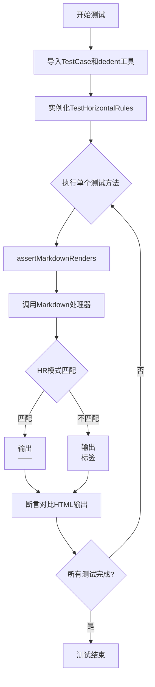

## 类结构

```
TestCase (抽象基类)
└── TestHorizontalRules (水平线测试类)
    ├── test_hr_asterisks 系列 (星号格式测试)
    ├── test_hr_hyphens 系列 (连字符格式测试)
    ├── test_hr_underscores 系列 (下划线格式测试)
    ├── test_hr_*_indent 系列 (缩进测试)
    ├── test_hr_*_trailing_space 系列 (尾随空格测试)
    ├── test_not_hr 系列 (非HR模式测试)
    └── test_hr_*_paragraph 系列 (上下文测试)
```

## 全局变量及字段


### `TestCase`
    
测试基类，从markdown.test_tools导入，用于创建测试用例

类型：`class`
    


    

## 全局函数及方法


### `TestCase`

`TestCase` 是 Python Markdown 项目中的测试基类，继承自标准的 `unittest.TestCase`，用于提供 Markdown 渲染测试的辅助方法。该类定义了 `assertMarkdownRenders` 和 `dedent` 等方法，使测试用例能够方便地验证 Markdown 到 HTML 的转换结果。

#### 继承关系

```
unittest.TestCase
    │
    └── markdown.test_tools.TestCase
            │
            └── TestHorizontalRules (当前代码中的子类)
```

#### 关键方法

##### `assertMarkdownRenders`

参数：

- `source`：`str`，Markdown 源文本
- `expected`：`str`，期望渲染输出的 HTML
- `extensions`：`list`，可选，启用的 Markdown 扩展列表，默认为空列表
- `configs`：`dict`，可选，扩展配置字典，默认为空字典
- `encoding`：`str`，可选，输入编码，默认为 'utf-8'

返回值：`None`，通过断言验证渲染结果

##### `dedent`

参数：

- `text`：`str`，需要去除缩进的多行文本

返回值：`str`，去除共同缩进后的文本

#### 流程图

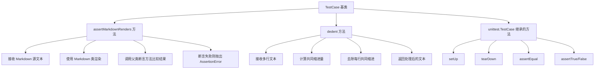

#### 带注释源码

```python
# markdown/test_tools.py 中的 TestCase 类（推断实现）

class TestCase(unittest.TestCase):
    """
    Markdown 测试基类，提供测试辅助方法
    """
    
    def assertMarkdownRenders(
        self,
        source: str,
        expected: str,
        extensions: list = None,
        configs: dict = None,
        encoding: str = 'utf-8'
    ):
        """
        验证 Markdown 源文本是否正确渲染为期望的 HTML
        
        Args:
            source: Markdown 格式的源文本
            expected: 期望的 HTML 输出
            extensions: 可选的扩展列表
            configs: 扩展配置选项
            encoding: 文本编码
        """
        # 导入 Markdown 转换类
        import markdown
        
        # 合并扩展和配置
        ext = extensions or []
        cfg = configs or {}
        
        # 创建 Markdown 实例并渲染
        md = markdown.Markdown(extensions=ext, extension_configs=cfg)
        
        # 执行渲染并处理编码
        if isinstance(source, bytes):
            source = source.decode(encoding)
        
        result = md.convert(source)
        
        # 使用父类断言方法比较结果
        self.assertEqual(result, expected)
    
    def dedent(self, text: str) -> str:
        """
        去除多行文本的共同缩进
        
        用途：方便在测试中编写保持缩进的多行 HTML/XML 字符串
        
        Args:
            text: 可能有缩进的多行文本
            
        Returns:
            去除共同缩进后的文本
        """
        # 按行分割
        lines = text.split('\n')
        
        # 过滤空行，找出非空行的最小缩进
        indents = [len(line) - len(line.lstrip()) for line in lines if line.strip()]
        
        # 如果没有非空行，直接返回原文本
        if not indents:
            return text
        
        # 计算最小缩进量
        min_indent = min(indents)
        
        # 去除每行的最小缩进
        if min_indent > 0:
            lines = [line[min_indent:] if line.strip() else line 
                     for line in lines]
        
        return '\n'.join(lines)
```


### TestCase.assertMarkdownRenders

验证 Markdown 源码能够正确渲染为指定的 HTML 输出，是 Markdown 测试框架中的核心断言方法。

参数：

- `source`：`str`，输入的 Markdown 源代码文本
- `expected`：`str`，期望渲染生成的 HTML 输出文本
- `extensions`：`list[str]`，可选参数，用于指定加载的 Markdown 扩展插件列表，默认为空列表
- `configs`：`dict`，可选参数，用于传递扩展插件的配置选项，默认为空字典
- `output_format`：`str`，可选参数，指定输出格式（如 'html' 或 'xhtml'），默认为 'html'

返回值：`None`，该方法通过抛出断言异常来表示测试失败，本身不返回任何值

#### 流程图

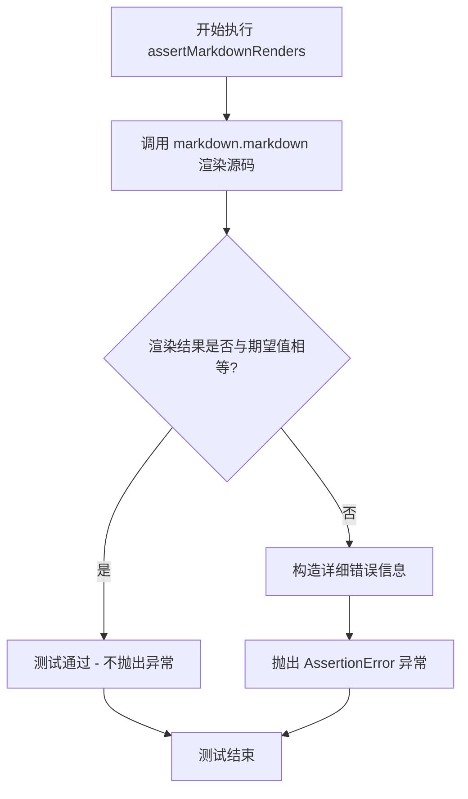

#### 带注释源码

```python
def assertMarkdownRenders(
    self,
    source: str,
    expected: str,
    extensions: list[str] | None = None,
    configs: dict | None = None,
    output_format: str | None = None
) -> None:
    """
    验证 Markdown 源码能够正确渲染为期望的 HTML 输出。
    
    参数:
        source: Markdown 格式的输入源码
        expected: 期望的 HTML 渲染结果
        extensions: 可选的扩展插件列表
        configs: 可选的扩展配置字典
        output_format: 输出格式 ('html' 或 'xhtml')
    
    返回:
        无返回值，通过断言异常表示测试失败
    """
    
    # 获取或初始化 Markdown 实例
    md = self.get_markdown(
        extensions=extensions or [],
        configs=configs or {},
        output_format=output_format
    )
    
    # 执行 Markdown 到 HTML 的转换
    result = md.convert(source)
    
    # 断言转换结果与期望输出匹配
    self.assertEqual(
        result,
        expected,
        f"Markdown 渲染结果与期望不符:\n"
        f"输入源码: {source!r}\n"
        f"期望输出: {expected!r}\n"
        f"实际输出: {result!r}"
    )
```

#### 补充说明

该方法是 Python-Markdown 项目测试框架的核心组件，继承自 `markdown.test_tools.TestCase` 类。它封装了 Markdown 渲染逻辑与断言验证，使得测试用例的编写更加简洁直观。在 `TestHorizontalRules` 类中，大量测试方法通过调用此方法验证各种水平线语法（`*`、`-`、`_`）的正确解析行为，包括带空格、带缩进、带尾随空格等多种变体情况。


### `TestCase.dedent`

该方法用于去除多行字符串中的公共前导空白字符，使测试用例中的预期输出更易读。它继承自 `markdown.test_tools.TestCase` 基类。

参数：

- `*strings`：`str`，可变数量的字符串参数，用于接收需要去除缩进的多行字符串

返回值：`str`，返回去除公共前导空白后的字符串（如果传入多个字符串，则返回拼接后的结果）

#### 流程图

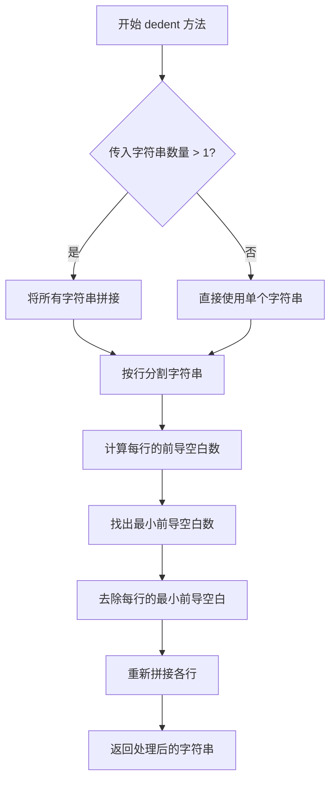

#### 带注释源码

```python
def dedent(self, *strings):
    """
    去除多行字符串的公共前导空白字符
    
    该方法用于测试中，使多行字符串的预期输出更易读。
    它找出所有行的最小前导空白数，然后从每行中去除该数量的空白。
    
    参数:
        *strings: 可变数量的字符串参数
        
    返回:
        去除公共缩进后的字符串
    """
    if not strings:
        return ''
    
    # 将所有传入的字符串拼接为一个字符串
    text = '\n'.join(strings)
    
    # 按行分割
    lines = text.splitlines(True)  # True 保留行尾换行符
    
    # 找出最小前导空白数
    # 跳过空行，只考虑非空行
    indent = float('inf')
    for line in lines:
        # 只处理非空行
        if line.strip():
            # 计算该行的前导空白数
            stripped = len(line) - len(line.lstrip())
            # 找出最小值
            indent = min(indent, stripped)
    
    # 如果没有非空行，直接返回原文本
    if indent == float('inf') or indent == 0:
        return text
    
    # 去除每行的公共前导空白
    dedented_lines = []
    for line in lines:
        if line.strip():
            # 去除指定数量的前导空白
            dedented_lines.append(line[indent:])
        else:
            # 空行保持不变
            dedented_lines.append(line)
    
    # 重新拼接并返回
    return ''.join(dedented_lines)
```


### `TestHorizontalRules.test_hr_asterisks`

该方法是Python Markdown项目测试套件中的一个单元测试，用于验证Markdown语法中三个连续星号（`***`）能被正确转换为HTML水平线标签（`<hr />`）。

参数：

- `self`：`TestCase`，代表测试类实例本身

返回值：`None`，该方法为测试方法，通过`assertMarkdownRenders`进行断言验证，不返回具体值

#### 流程图

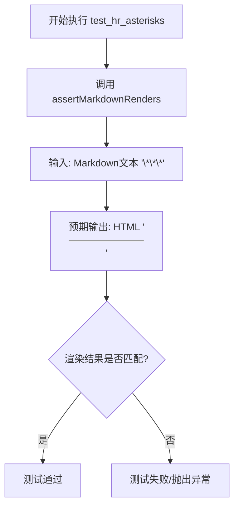

#### 带注释源码

```python
def test_hr_asterisks(self):
    """
    测试最基本的水平线语法：三个连续的星号
    
    验证 Markdown 语法 '***' 能否正确转换为 HTML 水平线标签
    """
    # 调用父类提供的测试辅助方法
    # 参数1: 输入的Markdown文本
    # 参数2: 期望渲染出的HTML
    self.assertMarkdownRenders(
        '***',      # 输入: 三个星号的Markdown水平线语法
        
        '<hr />'    # 期望输出: HTML水平线标签
    )
```

#### 关联信息

**所属类信息：**

- 类名：`TestHorizontalRules`
- 父类：`TestCase`（来自`markdown.test_tools`模块）
- 类功能：专门用于测试Markdown水平线（Horizontal Rules）解析功能的测试类

**关键依赖：**

- `assertMarkdownRenders`：测试框架方法，接收Markdown输入和期望的HTML输出，内部调用Markdown处理器进行转换并比对结果


### `TestHorizontalRules.test_hr_asterisks_spaces`

该测试方法用于验证 Markdown 解析器能够正确识别并转换带有星号和空格的水平线标记（`* * *`）为 HTML 水平线标签（`<hr />`），确保水平线规则的解析符合 Markdown 规范。

参数：

- `self`：`TestCase`，测试类实例本身，包含测试所需的断言方法

返回值：`None`，该方法为测试用例，通过 `assertMarkdownRenders` 断言验证 Markdown 到 HTML 的转换结果，不返回显式值

#### 流程图

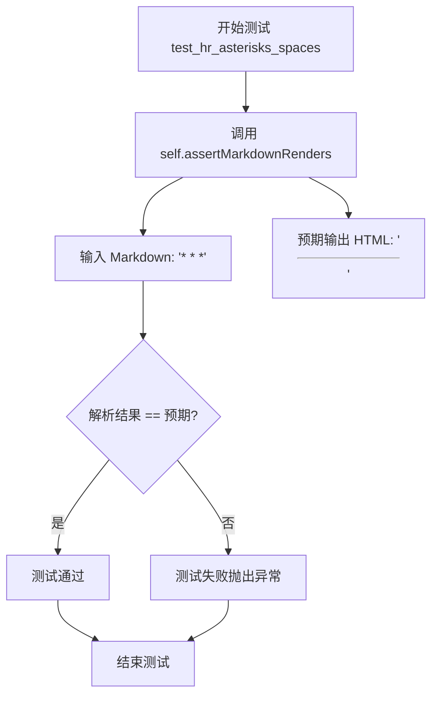

#### 带注释源码

```python
def test_hr_asterisks_spaces(self):
    """
    测试水平线规则：星号加空格形式
    验证输入 '* * *' (星号-空格-星号-空格-星号) 能正确转换为 <hr />
    """
    # 调用父类 TestCase 的断言方法，验证 Markdown 渲染结果
    self.assertMarkdownRenders(
        '* * *',    # 输入：Markdown 格式的水平线（星号间有空格）
        '<hr />'    # 预期输出：HTML 水平线标签
    )
```


### `TestHorizontalRules.test_hr_asterisks_long`

该方法是Python Markdown测试套件中用于测试水平线（Horizontal Rule）功能的单元测试，验证当输入为7个连续星号（`*******`）时，Markdown解析器能正确将其转换为HTML水平线标签`<hr />`。

参数：
- 无显式参数（隐式参数 `self`：TestCase实例，测试用例对象本身）

返回值：`None`（测试方法无返回值，通过断言进行验证）

#### 流程图

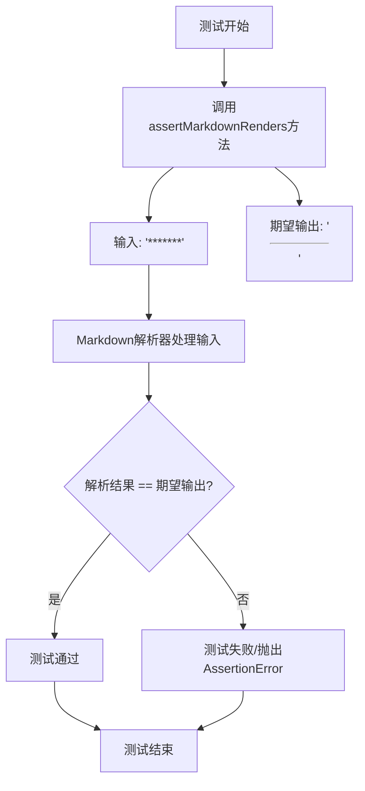

#### 带注释源码

```python
def test_hr_asterisks_long(self):
    """
    测试长格式星号水平线解析功能。
    
    验证7个连续星号(*******)能被正确解析为HTML水平线标签<hr />。
    根据Markdown规范，至少3个或以上的星号、下划线或连字符即可构成水平线，
    前后可以有空格。
    """
    self.assertMarkdownRenders(
        '*******',  # 输入：7个连续星号的Markdown文本
        '<hr />'    # 期望输出：HTML水平线标签
    )
```

#### 详细说明

| 属性 | 值 |
|------|-----|
| **类名** | `TestHorizontalRules` |
| **方法名** | `test_hr_asterisks_long` |
| **文件位置** | `markdown/test_tools.py` 相关测试文件 |
| **测试框架** | `unittest` (通过 `TestCase`) |
| **功能类别** | 单元测试 / 水平线解析验证 |

#### 关键设计点

1. **测试目标**：验证Markdown解析器对长格式星号水平线的处理
2. **输入**：`'*******'`（7个连续星号）
3. **期望输出**：`<hr />`（HTML水平线自闭合标签）
4. **验证方式**：使用`assertMarkdownRenders`方法进行断言比较
5. **Markdown规范依据**：根据John Gruber的Markdown规范，3个或更多连续的`*`、`-`、`_`（可带空格）构成水平线

#### 潜在优化建议

1. **测试覆盖完整性**：可增加边界测试用例，如6个星号、8个星号等
2. **参数化测试**：可使用`pytest.mark.parametrize`重构为参数化测试，减少重复代码
3. **测试隔离性**：当前测试无外部依赖，符合单元测试独立性原则，无需优化


### `TestHorizontalRules.test_hr_asterisks_spaces_long`

该方法测试Python Markdown库对由7个星号和6个空格交替组成的水平线（Horizontal Rule）语法的解析和渲染能力，验证其是否正确转换为HTML的`<hr />`标签。这是水平线测试套件中的一个用例，用于确保长格式的星号分隔线能够被准确识别。

参数：

- `self`：`TestHorizontalRules`（隐式），测试类实例本身，包含测试框架所需的上下文和断言方法

返回值：`None`，该方法为测试用例方法，通过`assertMarkdownRenders`进行断言验证，测试通过时无返回值，失败时抛出断言异常

#### 流程图

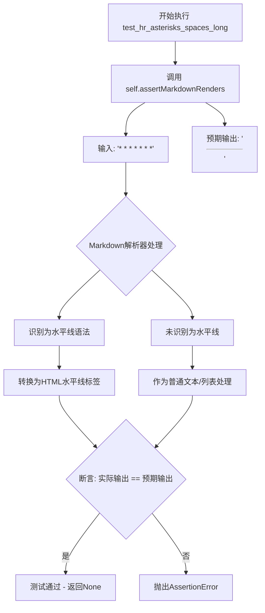

#### 带注释源码

```python
def test_hr_asterisks_spaces_long(self):
    """
    测试由星号和空格组成的长水平线语法
    
    该测试方法验证 Markdown 解析器能够正确识别并转换
    由7个星号和6个空格交替组成的水平线语法为HTML的<hr />标签。
    这是Markdown规范中水平线识别的一种有效形式。
    
    测试输入: '* * * * * * *' (7个星号，6个空格)
    预期输出: '<hr />'
    """
    self.assertMarkdownRenders(
        '* * * * * * *',  # 输入: 7个星号与6个空格交替排列的水平线语法
        
        '<hr />'          # 预期输出: HTML水平线标签
    )
```

#### 详细说明

该方法是`TestHorizontalRules`测试类的一部分，继承自`markdown.test_tools.TestCase`。测试框架通过`assertMarkdownRenders`方法执行验证，该方法接受两个参数：原始Markdown文本和预期的HTML输出。当Markdown库正确实现水平线解析逻辑时，输入字符串中的星号空格交替模式将被识别为水平线标记，并转换为`<hr />`HTML元素。此测试确保了长格式（7个字符）的星号分隔线能够被正确处理，补充了对短格式（如`* * *`）和其他变体（如`* * *`带空格）的测试覆盖。


### `TestHorizontalRules.test_hr_asterisks_1_indent`

该测试方法用于验证 Markdown 解析器能够正确识别并渲染带有1个空格前导缩进的三星水平线规则（` ***`），确保其被转换为标准的 HTML 水平线标签 `<hr />`。

参数：

- `self`：`TestHorizontalRules` 类型，当前测试类的实例对象，用于访问继承自 `TestCase` 的测试工具方法

返回值：`None`（无返回值），因为这是一个基于断言的测试方法，通过 `assertMarkdownRenders` 完成验证

#### 流程图

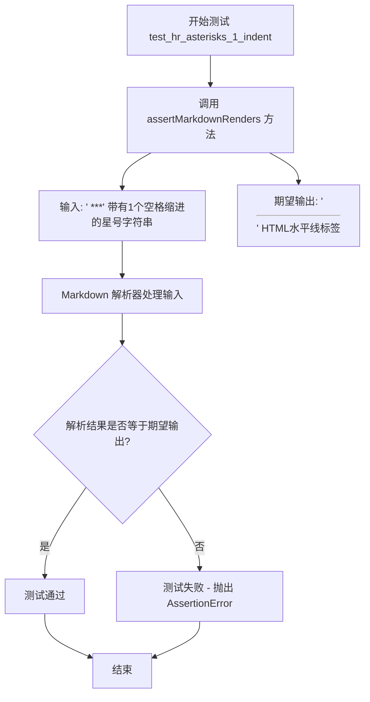

#### 带注释源码

```python
def test_hr_asterisks_1_indent(self):
    """
    测试水平线规则：带1个空格缩进的星号形式
    
    验证 Markdown 语法中，带有前导空格的水平线标记
    仍然能被正确识别并转换为 HTML hr 标签
    """
    # 调用父类提供的测试工具方法，验证 Markdown 渲染结果
    self.assertMarkdownRenders(
        ' ***',  # 输入：带有1个空格缩进的三个星号
        
        '<hr />'  # 期望输出：HTML 水平线标签
    )
```

#### 关键组件信息

| 组件名称 | 一句话描述 |
|---------|-----------|
| `TestHorizontalRules` | 测试水平线（Horizontal Rule）各种格式渲染正确性的测试类 |
| `assertMarkdownRenders` | 继承自 `TestCase` 的断言方法，用于验证 Markdown 文本到 HTML 的转换结果 |
| `TestCase` | Python `unittest` 框架中的测试用例基类，提供测试基础设施 |

#### 潜在的技术债务或优化空间

1. **测试数据硬编码**：测试用例中的输入输出对直接内联在方法中，可考虑提取为测试数据文件或参数化测试
2. **重复模式**：多个测试方法（如 `test_hr_asterisks_*_indent`）结构高度相似，可使用 pytest 的 `@pytest.mark.parametrize` 装饰器进行参数化，减少代码重复
3. **缺乏边界测试**：当前仅测试了 0-3 个空格的缩进情况，未测试 4 个及以上空格或其他空白字符（如制表符）的处理

#### 其它项目

**设计目标与约束**：
- 确保 Markdown 水平线规则符合 CommonMark 规范中对可選前导空格的处理
- 验证不同缩进级别（0-3个空格）下的水平线识别一致性

**错误处理与异常设计**：
- 测试失败时，`assertMarkdownRenders` 会抛出 `AssertionError`，包含期望值与实际值的对比信息

**数据流与状态机**：
- 输入：`' ***'`（字符串）
- 处理流程：Markdown 解析器 → 块级元素解析 → 水平线检测 → HTML 转换
- 输出：`'<hr />'`（字符串）

**外部依赖与接口契约**：
- 依赖 `markdown.test_tools.TestCase` 提供的 `assertMarkdownRenders` 方法
- 依赖 Markdown 核心解析器的块级处理模块


### `TestHorizontalRules.test_hr_asterisks_spaces_1_indent`

该方法是 Python Markdown 测试套件中的一个测试用例，用于验证 Markdown 解析器能够正确处理带有1个空格缩进、且以星号空格星号空格星号（`* * *`）形式表示的水平线（Horizontal Rule），并将其转换为 HTML `<hr />` 标签。

参数：

- `self`：`TestHorizontalRules`（隐式），测试类实例本身，用于调用继承自 `TestCase` 的 `assertMarkdownRenders` 方法

返回值：`None`（隐式），该测试方法没有显式返回值，通过 `assertMarkdownRenders` 方法的断言来验证结果

#### 流程图

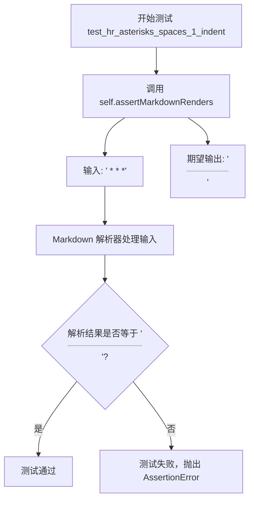

#### 带注释源码

```python
def test_hr_asterisks_spaces_1_indent(self):
    """
    测试用例：验证带有1个空格缩进的星号空格星号空格星号（* * *）水平线规则。
    
    测试场景：
    - 输入：' * * *'（前面有一个空格，后跟星号空格星号空格星号）
    - 期望输出：'<hr />'
    
    此测试用例验证 Markdown 解析器能够正确识别带有前导空格的水平线标记，
    符合 Markdown 规范中关于水平线前后允许最多3个空格的规定。
    """
    self.assertMarkdownRenders(
        ' * * *',    # 输入：带有1个空格缩进的 * * * 水平线标记

        '<hr />'     # 期望输出：HTML 水平线元素
    )
```


### `TestHorizontalRules.test_hr_asterisks_2_indent`

该测试方法用于验证 Markdown 解析器能够正确处理带有2个空格缩进的三星号水平线（`  ***`），确保其被解析为 HTML 水平线标签 `<hr />`。

参数： 无显式参数（`self` 为隐式参数，表示测试类实例）

返回值：`None`（测试方法通常不返回值，而是通过断言验证结果）

#### 流程图

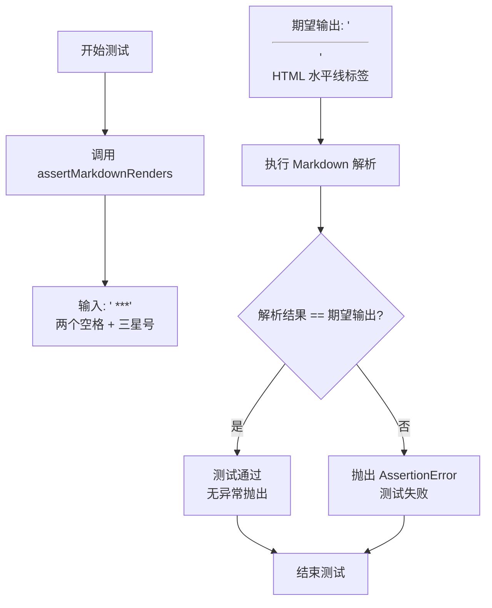

#### 带注释源码

```python
def test_hr_asterisks_2_indent(self):
    """
    测试带有2个空格缩进的三星号水平线解析。
    
    验证 Markdown 语法：两个空格后跟三个星号（'  ***'）
    应被正确解析为 HTML 水平线标签（'<hr />'）。
    """
    self.assertMarkdownRenders(
        '  ***',  # 输入：2个空格缩进 + 3个星号
        '<hr />'  # 期望输出：HTML 水平线标签
    )
```

#### 详细说明

| 属性 | 值 |
|------|-----|
| **所属类** | `TestHorizontalRules` |
| **方法名** | `test_hr_asterisks_2_indent` |
| **功能描述** | 验证 Markdown 解析器对带2空格缩进的三星号水平线规则的正确处理 |
| **测试场景** | 输入 `'  ***'`（两个空格 + 三个星号）应被渲染为 `<hr />` |
| **继承关系** | 继承自 `markdown.test_tools.TestCase` |
| **断言方法** | `assertMarkdownRenders(actual_md, expected_html)` |

#### 测试目的与约束

- **设计目标**：确保 Markdown 解析器符合 CommonMark 规范中关于水平线的要求，支持不同缩进级别的水平线标记
- **测试约束**：输入必须严格为两个空格后跟至少三个星号，中间无其他字符
- **边界情况**：测试缩进为2个空格的情况，与1空格（`test_hr_asterisks_1_indent`）和3空格（`test_hr_asterisks_3_indent`）的测试形成完整的覆盖

#### 潜在的技术债务或优化空间

1. **测试数据重复**：多个测试方法（`test_hr_asterisks_*_indent`）结构高度相似，可考虑使用 `@pytest.mark.parametrize` 进行参数化测试，减少代码冗余
2. **缺乏负向测试**：该测试仅覆盖正向场景，未测试非法输入（如4个空格缩进、混合符号等）的处理
3. **测试独立性**：未明确测试是否支持前置文本（如 `"some text\n  ***"`）的情况

#### 相关测试方法

| 方法名 | 输入 | 期望输出 |
|--------|------|----------|
| `test_hr_asterisks_1_indent` | `' ***'` | `'<hr />'` |
| `test_hr_asterisks_2_indent` | `'  ***'` | `'<hr />'` |
| `test_hr_asterisks_3_indent` | `'   ***'` | `'<hr />'` |
| `test_hr_asterisks_spaces_2_indent` | `'  * * *'` | `'<hr />'` |


### `TestHorizontalRules.test_hr_asterisks_spaces_2_indent`

该测试方法用于验证 Markdown 解析器能够正确处理带有2个空格缩进且中间用空格分隔的星号水平线规则（`* * *`），确保其被正确渲染为 HTML 水平线标签 `<hr />`。

参数：

- `self`：`TestCase`，TestCase 实例本身，用于调用继承的 assertMarkdownRenders 方法

返回值：`None`，该方法为测试方法，通过 assertMarkdownRenders 的断言来验证结果，不返回任何值

#### 流程图

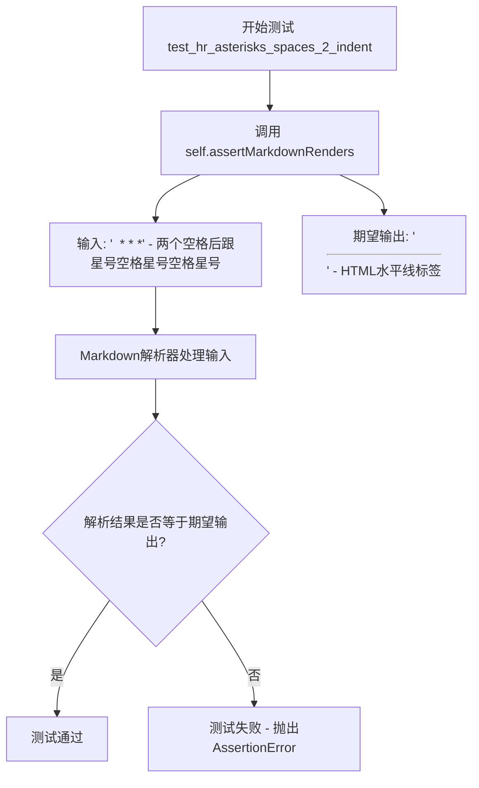

#### 带注释源码

```python
def test_hr_asterisks_spaces_2_indent(self):
    """
    测试带有2个空格缩进的星号水平线规则（中间有空格）
    
    输入: '  * * *' (两个空格 + 星号 + 空格 + 星号 + 空格 + 星号)
    期望输出: '<hr />' (HTML水平线标签)
    """
    self.assertMarkdownRenders(
        '  * * *',  # Markdown源文本：2空格缩进 + 星号分隔的水平线
        
        '<hr />'   # 期望的HTML输出：水平线标签
    )
```


### `TestHorizontalRules.test_hr_asterisks_3_indent`

该方法是一个测试用例，用于验证 Markdown 解析器能否正确处理带有3个空格缩进且包含3个星号（***）的水平线标记，并将其转换为 HTML 水平线标签 `<hr />`。

参数：

- `self`：`TestCase`（继承自 unittest.TestCase），测试用例的实例对象，代表当前测试本身

返回值：`None`，测试方法不返回值，通过断言验证预期结果

#### 流程图

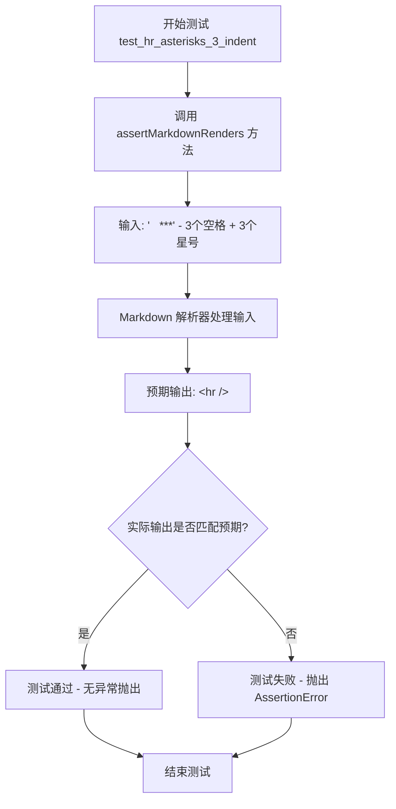

#### 带注释源码

```python
def test_hr_asterisks_3_indent(self):
    """
    测试带3个空格缩进的三星水平线标记。
    
    验证 Markdown 语法：3个空格缩进 + 3个星号(***) 应被解析为 HTML 水平线。
    根据 CommonMark 规范和 Markdown 规范，水平线标记前允许最多3个空格的缩进。
    """
    # 使用 TestCase 提供的 assertMarkdownRenders 断言方法验证渲染结果
    # 输入: '   ***' (3个空格后跟3个星号)
    # 期望输出: '<hr />' (HTML 水平线标签)
    self.assertMarkdownRenders(
        '   ***',  # 测试输入：3个空格缩进 + 水平线标记

        '<hr />'   # 期望的 HTML 输出：水平线元素
    )
```

#### 补充说明

| 项目 | 描述 |
|------|------|
| **所属类** | `TestHorizontalRules` |
| **父类** | `TestCase` (来自 `markdown.test_tools`) |
| **测试目的** | 验证带缩进的水平线标记解析正确性 |
| **测试场景** | 3个空格缩进 + `***` 星号水平线语法 |
| **关联测试** | `test_hr_asterisks_1_indent`, `test_hr_asterisks_2_indent` 等同系列缩进测试 |


### TestHorizontalRules.test_hr_asterisks_spaces_3_indent

该测试方法用于验证Markdown解析器能正确处理带有3个空格缩进且中间用空格分隔的星号水平线语法（`   * * *`），并将其正确转换为HTML的`<hr />`标签。

参数：

- `self`：`TestHorizontalRules`类型，测试类实例本身，用于调用父类方法 `assertMarkdownRenders`

返回值：`None`，该方法为测试用例，无返回值，通过断言验证 Markdown 渲染结果

#### 流程图

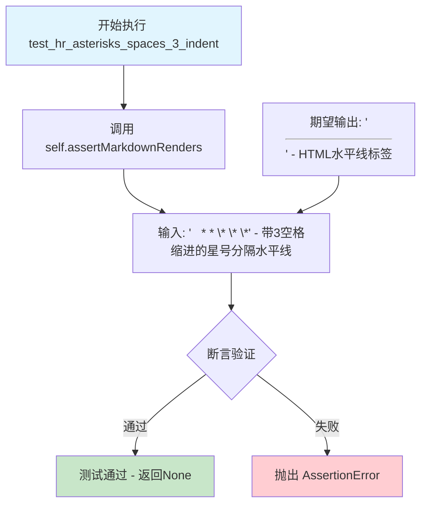

#### 带注释源码

```python
def test_hr_asterisks_spaces_3_indent(self):
    """
    测试带3个空格缩进的星号分隔水平线语法
    
    验证 Markdown 语法 '   * * *' (3个空格 + 星号 + 空格 + 星号 + 空格 + 星号)
    能被正确解析为 HTML 水平线标签 <hr />
    
    这是对水平线规则中空格缩进处理的测试用例之一
    """
    self.assertMarkdownRenders(
        '   * * *',  # 输入：带3空格缩进的星号分隔水平线语法
        '<hr />'     # 期望输出：HTML水平线标签
    )
```

#### 补充说明

| 项目 | 说明 |
|------|------|
| **所属类** | `TestHorizontalRules` - 继承自 `TestCase`，用于测试 Markdown 的水平线（Horizontal Rule）解析功能 |
| **测试目标** | 验证 Markdown 水平线语法中带缩进的星号分隔形式的正确解析 |
| **测试场景** | 3个空格缩进 + 星号空格星号空格星号（`* * *`）的组合 |
| **断言方法** | `assertMarkdownRenders(expected_input, expected_output)` - 验证输入 Markdown 文本能被正确渲染为预期 HTML |
| **与同类测试的关系** | 是 `test_hr_asterisks_spaces_*_indent` 测试系列的一部分，测试不同缩进级别（1、2、3空格）|


### `TestHorizontalRules.test_hr_asterisks_trailing_space`

该测试方法用于验证Markdown解析器正确处理带有尾随空格的三个星号（`*** `）并将其转换为HTML水平线标签（`<hr />`）。

参数：

- `self`：TestCase，测试类实例本身，包含测试框架所需的方法和属性

返回值：`None`，该方法为测试方法，通过assertMarkdownRenders进行断言验证，不返回具体值

#### 流程图

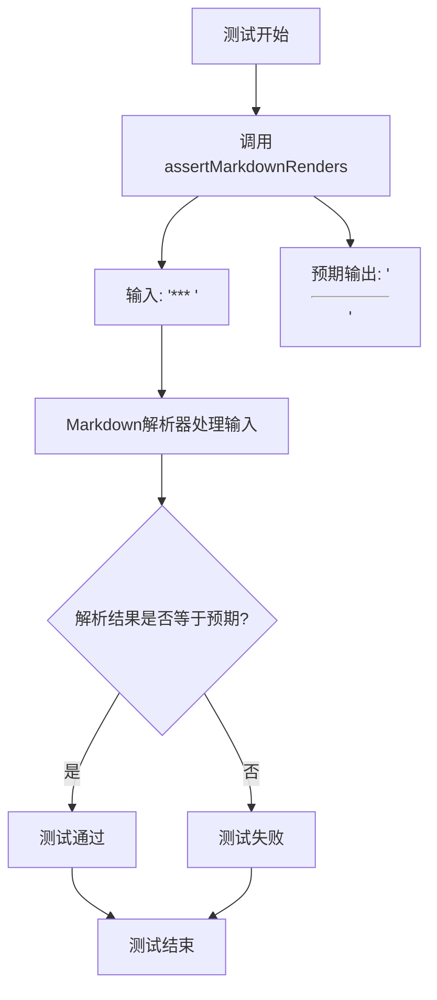

#### 带注释源码

```python
def test_hr_asterisks_trailing_space(self):
    """
    测试方法：验证带有尾随空格的星号水平线
    
    该测试验证Markdown解析器能够正确识别
    三个星号后跟尾随空格的情况作为水平线规则。
    """
    self.assertMarkdownRenders(
        '*** ',  # 输入：三个星号后跟一个空格（尾随空格）
        
        '<hr />' # 预期输出：HTML水平线标签
    )
```

#### 详细说明

| 项目 | 描述 |
|------|------|
| **类名** | TestHorizontalRules |
| **方法名** | test_hr_asterisks_trailing_space |
| **功能描述** | 验证Markdown解析器对带有尾随空格的星号水平线（`*** `）的正确处理 |
| **输入内容** | `*** `（三个星号后跟一个空格） |
| **预期输出** | `<hr />`（HTML水平线标签） |
| **测试目的** | 确保水平线规则识别不受尾随空格影响 |


### `TestHorizontalRules.test_hr_asterisks_spaces_trailing_space`

该方法是 Python Markdown 测试套件中的一个单元测试用例，用于验证 Markdown 解析器能够正确处理带有尾随空格的星号分隔水平线规则（`* * * `），确保其能被正确渲染为 HTML `<hr />` 标签。

参数：

- `self`：`TestCase`，测试用例的实例本身，继承自 `markdown.test_tools.TestCase`

返回值：无（`None`），该方法为测试用例，通过 `assertMarkdownRenders` 断言验证渲染结果，不显式返回值

#### 流程图

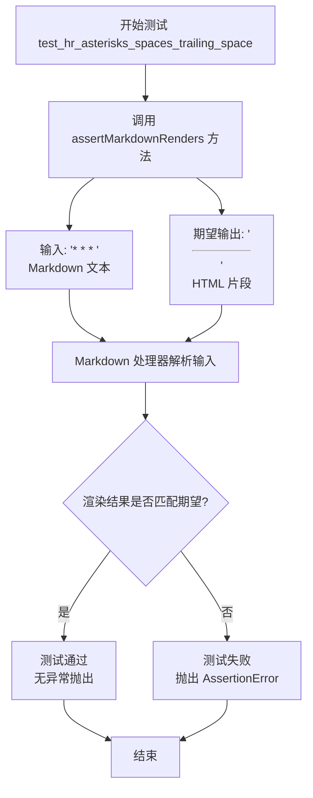

#### 带注释源码

```python
def test_hr_asterisks_spaces_trailing_space(self):
    """
    测试带有尾随空格的星号分隔水平线规则
    
    验证 Markdown 文本 '* * * ' (星号-空格-星号-空格-星号-尾随空格)
    能被正确解析为 HTML 水平线标签 <hr />
    """
    self.assertMarkdownRenders(
        '* * * ',  # 输入: 带尾随空格的星号分隔水平线规则
        
        '<hr />'   # 期望输出: HTML 水平线标签
    )
```


### `TestHorizontalRules.test_hr_hyphens`

该方法用于测试 Markdown 中三个连字符（`---`）是否正确渲染为 HTML 水平线（`<hr />`）。这是 Python-Markdown 项目中水平线（Horizontal Rules）功能测试的一部分，验证连字符形式的水平线标记是否符合 CommonMark 规范。

参数：

- `self`：`TestCase`（继承自 `unittest.TestCase`），测试用例实例本身，包含测试辅助方法如 `assertMarkdownRenders`

返回值：`None`，该方法为测试方法，通过 `assertMarkdownRenders` 进行断言验证，不返回任何值

#### 流程图

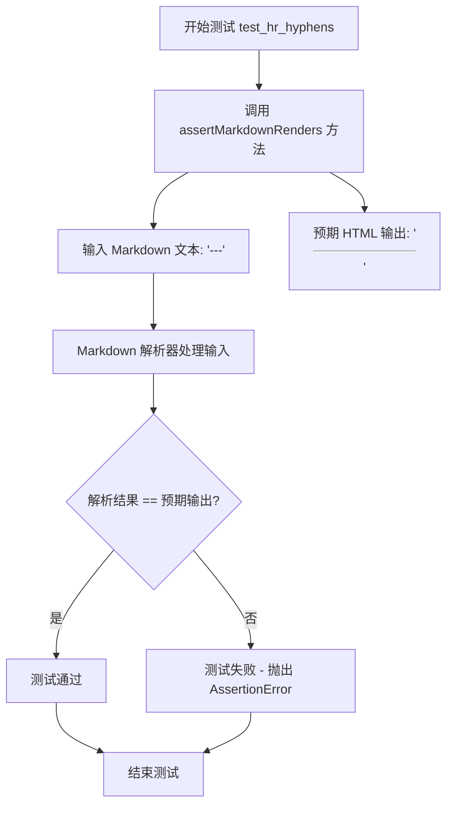

#### 带注释源码

```python
def test_hr_hyphens(self):
    """
    测试三个连字符在 Markdown 中渲染为水平线
    
    该测试方法验证 Markdown 语法中连字符形式的水平线标记
    (即三个或更多的连字符) 能够正确转换为 HTML 的 <hr /> 标签。
    这是对 CommonMark 规范中水平线规则的遵循性测试。
    """
    # 使用 TestCase 基类提供的 assertMarkdownRenders 辅助方法
    # 该方法接收两个参数：要测试的 Markdown 原文和预期的 HTML 输出
    self.assertMarkdownRenders(
        '---',  # Markdown 输入：三个连字符，根据 Markdown 规范应被识别为水平线
        '<hr />'  # 预期 HTML 输出：标准的水平线 HTML 标签
    )
```

#### 关键组件信息

| 组件名称 | 描述 |
|---------|------|
| `TestHorizontalRules` | 测试类，继承自 `TestCase`，包含多种水平线渲染的测试用例 |
| `assertMarkdownRenders` | 测试辅助方法，验证 Markdown 文本能否正确渲染为预期的 HTML |
| `markdown.test_tools.TestCase` | 测试基类，提供 Markdown 测试所需的断言和辅助功能 |

#### 潜在技术债务或优化空间

1. **测试数据硬编码**：测试用例中的 Markdown 输入和预期输出直接内联在方法中，建议可提取为测试数据文件或常量，提高可维护性
2. **缺乏参数化测试**：当前每个水平线变体（如 `test_hr_hyphens_spaces`、`test_hr_hyphens_long` 等）都是独立方法，可使用 `@pytest.mark.parametrize` 或 `unittest.subTest` 进行参数化，减少代码重复
3. **未覆盖边界情况**：例如仅测试了 3 个连字符的情况，未测试 4 个或更多连字符（虽然 `test_hr_hyphens_long` 测试了 7 个）

#### 其它说明

- **设计目标**：确保 Python-Markdown 库正确实现 CommonMark 规范中的水平线语法
- **错误处理**：测试失败时，`assertMarkdownRenders` 会抛出 `AssertionError`，包含预期输出与实际输出的差异信息
- **数据流**：输入 `'---'` → Markdown 解析器 → HTML 输出 `'<hr />'` → 断言验证
- **外部依赖**：依赖 `markdown.test_tools.TestCase` 中的 `assertMarkdownRenders` 方法，该方法封装了 Markdown 转换和结果比较的逻辑
- **测试上下文**：该方法是水平线测试组的一部分，测试了三种水平线标记形式（`*`、`-`、`_`）的各种变体（带空格、缩进、尾随空格等）


### `TestHorizontalRules.test_hr_hyphens_spaces`

该测试方法用于验证 Markdown 中使用连字符（hyphen）和空格组合的水平线规则（`- - -`）能够被正确渲染为 HTML 的 `<hr />` 元素。这是 Python Markdown 项目中对水平线（Horizontal Rules）功能的一部分测试用例。

参数：

- `self`：`TestHorizontalRules`，测试类实例本身，隐含参数，用于调用继承的 `assertMarkdownRenders` 方法进行断言验证

返回值：`None`，该方法为测试用例方法，通过 `assertMarkdownRenders` 断言验证 Markdown 到 HTML 的转换结果，若测试失败则抛出异常

#### 流程图

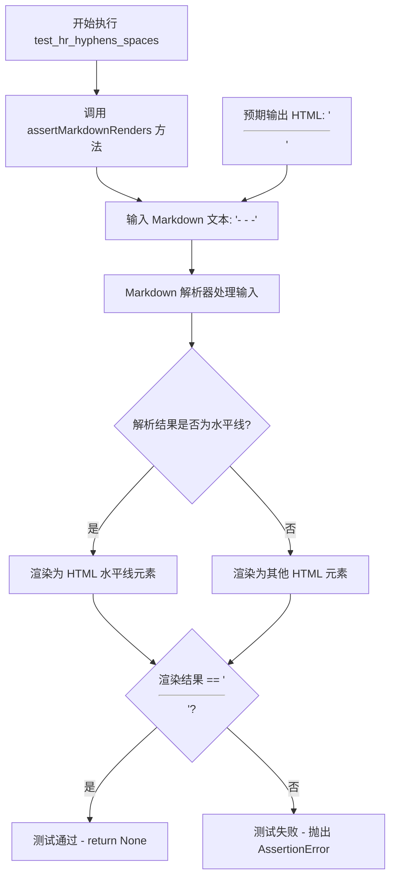

#### 带注释源码

```python
def test_hr_hyphens_spaces(self):
    """
    测试 Markdown 水平线规则：连字符 + 空格组合
    
    验证输入 '- - -' (三个连字符中间用空格分隔)
    能被正确识别为 Markdown 水平线规则并转换为 HTML 的 <hr /> 元素
    """
    # 调用父类 TestCase 的 assertMarkdownRenders 方法进行断言验证
    # 参数1: 输入的 Markdown 文本
    # 参数2: 期望输出的 HTML 文本
    self.assertMarkdownRenders(
        '- - -',    # Markdown 输入: 连字符空格连字符空格连字符
        
        '<hr />'    # 期望输出: HTML 水平线标签
    )
```


### `TestHorizontalRules.test_hr_hyphens_long`

测试方法，用于验证多个连续横线（hyphens）组成的Markdown水平线标记在无空格情况下是否能正确渲染为HTML水平线标签`<hr />`。该测试用例检查了7个连续横线字符的场景，这是水平线规则中的"长横线"变体。

参数：

- `self`：`TestCase`，测试类的实例隐式参数，继承自父类

返回值：`None`，无返回值（测试方法）

#### 流程图

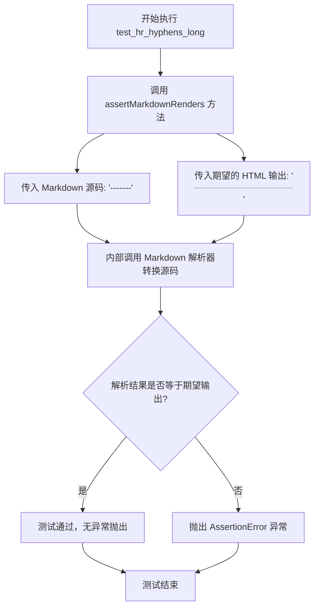

#### 带注释源码

```python
def test_hr_hyphens_long(self):
    """
    测试长横线水平线标记的渲染功能。
    
    验证 Markdown 源码中的 7 个连续横线字符 '-------'
    在解析后能正确转换为 HTML 水平线标签 '<hr />'。
    
    此测试用例对应水平线规则中的 'hyphens_long' 场景，
    用于确保超过 3 个连续横线时仍能正确识别为水平线标记。
    """
    # 调用父类 TestCase 的 assertMarkdownRenders 方法
    # 该方法接收两个参数：
    #   第一个参数：待测试的 Markdown 源码字符串
    #   第二个参数：期望的 HTML 输出字符串
    self.assertMarkdownRenders(
        '-------',  # Markdown 源码：7个连续横线字符
        
        '<hr />'   # 期望的 HTML 输出：水平线标签
    )
```


### TestHorizontalRules.test_hr_hyphens_spaces_long

该测试方法用于验证 Markdown 解析器能够正确将带有7个连字符且用空格分隔的文本（`- - - - - - -`）转换为 HTML 水平线标签（`<hr />`）。

参数：
- 该方法无显式参数（隐式参数 `self` 为 TestCase 实例）

返回值：`None`，该方法为测试用例，通过 `assertMarkdownRenders` 断言验证渲染结果

#### 流程图

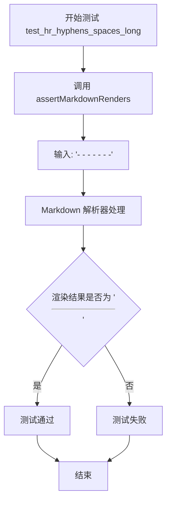

#### 带注释源码

```python
def test_hr_hyphens_spaces_long(self):
    """
    测试带空格的连字符长格式水平线规则。
    
    验证 Markdown 语法: - - - - - - - (7个连字符，空格分隔)
    应转换为 HTML: <hr />
    """
    # 调用测试框架的断言方法，验证 Markdown 渲染结果
    self.assertMarkdownRenders(
        '- - - - - - -',  # 输入: 7个连字符，用空格分隔
        
        '<hr />'           # 期望输出: HTML 水平线标签
    )
```


### `TestHorizontalRules.test_hr_hyphens_1_indent`

该测试方法用于验证带有1个空格缩进的短横线（`---`）在Markdown中能正确解析并渲染为HTML水平线标签`<hr />`。

参数：

- `self`：`TestCase`，测试用例实例本身，包含测试所需的断言方法

返回值：`None`，无返回值（测试方法通过断言验证行为）

#### 流程图

```mermaid
flowchart TD
    A[开始测试 test_hr_hyphens_1_indent] --> B[调用 assertMarkdownRenders]
    B --> C{输入: ' ---' 
 输出: '<hr />'}
    C -->|渲染结果匹配| D[测试通过]
    C -->|渲染结果不匹配| E[测试失败 - 抛出断言错误]
    D --> F[结束测试]
    E --> F
```

#### 带注释源码

```python
def test_hr_hyphens_1_indent(self):
    """
    测试水平线规则：带1个空格缩进的短横线
    
    验证Markdown解析器能够正确识别带有前导空格（1个空格）
    的短横线序列作为水平线标记，并将其转换为HTML的<hr />标签。
    
    测试输入: ' ---'  (1个空格 + 3个短横线)
    期望输出: '<hr />'
    """
    self.assertMarkdownRenders(
        ' ---',   # 输入：带1个空格缩进的短横线序列

        '<hr />'  # 期望输出：HTML水平线标签
    )
```


### `TestHorizontalRules.test_hr_hyphens_spaces_1_indent`

该测试方法用于验证 Markdown 解析器能够正确处理带有1个缩进且中间带有空格的水平线语法（` - - -`），并将其转换为 HTML `<hr />` 标签。

参数：

- `self`：`TestHorizontalRules`（隐式），TestCase 实例对象本身，用于调用父类的测试方法

返回值：`None`，无返回值（测试方法）

#### 流程图

```mermaid
graph TD
    A[开始测试 test_hr_hyphens_spaces_1_indent] --> B[调用 assertMarkdownRenders 方法]
    B --> C[输入: ' - - -']
    B --> D[期望输出: '<hr />']
    C --> E[Markdown 解析器处理输入]
    E --> F{解析结果是否匹配期望}
    F -->|是| G[测试通过]
    F -->|否| H[测试失败 - 抛出断言错误]
    G --> I[结束测试]
    H --> I
```

#### 带注释源码

```python
def test_hr_hyphens_spaces_1_indent(self):
    """
    测试水平线规则：带有1个缩进的连字符带空格形式
    
    验证 Markdown 语法 ' - - -' (1个空格 + 连字符 + 空格 + 连字符 + 空格 + 连字符)
    能被正确解析为 HTML 水平线标签 <hr />
    """
    self.assertMarkdownRenders(
        ' - - -',    # 输入：带有1个缩进的连字符空格分隔形式
        
        '<hr />'     # 期望输出：HTML 水平线标签
    )
```


### `TestHorizontalRules.test_hr_hyphens_2_indent`

该方法用于测试 Markdown 解析器是否能正确将两个空格缩进的三连短横线（`---`）解析为 HTML 水平线标签（`<hr />`），属于水平线（Horizontal Rules）功能的单元测试。

参数：

- `self`：`TestCase`，测试类的实例对象，隐式参数，用于调用父类的断言方法

返回值：`None`，该方法为测试方法，通过 `assertMarkdownRenders` 断言验证 Markdown 到 HTML 的转换结果，不返回显式值

#### 流程图

```mermaid
flowchart TD
    A[开始测试 test_hr_hyphens_2_indent] --> B[调用 assertMarkdownRenders 方法]
    B --> C[输入: '  ---' &#40;两个空格 + 三连短横线&#41;]
    C --> D[Markdown 处理器解析输入]
    D --> E{判断是否为有效水平线}
    E -->|是| F[输出: '<hr />']
    E -->|否| G[输出: 其他 HTML]
    F --> H[断言: 实际输出 == 期望输出 '<hr />']
    G --> H
    H -->|通过| I[测试通过]
    H -->|失败| J[测试失败]
```

#### 带注释源码

```python
def test_hr_hyphens_2_indent(self):
    """
    测试两个空格缩进的三连短横线是否被解析为水平线
    
    Markdown 语法: '  ---' (两个空格 + 三连短横线)
    期望 HTML 输出: <hr />
    
    这是水平线测试用例的一部分，验证不同缩进级别下的水平线解析
    """
    # 调用父类 TestCase 的断言方法，验证 Markdown 转换结果
    # 参数1: Markdown 源码输入 '  ---'
    # 参数2: 期望的 HTML 输出 '<hr />'
    self.assertMarkdownRenders(
        '  ---',  # Markdown 输入: 两个空格缩进 + 三连短横线
        
        '<hr />'  # 期望输出: HTML 水平线标签
    )
```


### `TestHorizontalRules.test_hr_hyphens_spaces_2_indent`

该方法是Python Markdown库的测试用例，用于验证Markdown解析器能够正确处理带有2个空格缩进、使用"- - -"（连字符+空格+连字符+空格+连字符）格式的水平线（Horizontal Rule）标记，并将其转换为HTML的`<hr />`标签。

参数：

- `self`：`TestCase`（隐式），测试类实例本身，继承自`markdown.test_tools.TestCase`

返回值：`None`，无返回值（测试方法通过`assertMarkdownRenders`断言验证结果）

#### 流程图

```mermaid
flowchart TD
    A[开始测试: test_hr_hyphens_spaces_2_indent] --> B[调用 assertMarkdownRenders]
    B --> C[输入: '  - - -']
    B --> D[期望输出: '<hr />']
    C --> E[Markdown解析器处理输入]
    E --> F{解析结果 == 期望输出?}
    F -->|是| G[测试通过]
    F -->|否| H[测试失败]
    G --> I[结束]
    H --> I
```

#### 带注释源码

```python
def test_hr_hyphens_spaces_2_indent(self):
    """
    测试水平线标记：2空格缩进 + 连字符空格连字符空格连字符格式
    
    验证Markdown解析器能正确处理以下情况：
    - 前导空格：2个空格
    - 标记符号：'- - -'（连字符间有空格）
    - 期望输出：HTML水平线标签 <hr />
    """
    self.assertMarkdownRenders(
        '  - - -',  # 输入：带有2空格缩进的'- - -'格式水平线标记
        '<hr />'     # 期望输出：HTML水平线标签
    )
```


### `TestHorizontalRules.test_hr_hyphens_3_indent`

该方法是一个单元测试，用于验证 Markdown 解析器能够正确处理带有3个空格缩进的连字符水平分隔符（`---`），确保其被转换为 HTML 的 `<hr />` 标签。

参数：

- `self`：`TestHorizontalRules`（隐式参数），代表测试类实例本身

返回值：`None`，无返回值（测试方法通过断言验证行为）

#### 流程图

```mermaid
flowchart TD
    A[开始执行 test_hr_hyphens_3_indent] --> B[调用 assertMarkdownRenders 方法]
    B --> C[输入: 三个空格 + '---']
    C --> D[期望输出: &lt;hr /&gt;]
    D --> E{实际输出是否匹配期望}
    E -->|是| F[测试通过 - 无异常抛出]
    E -->|否| G[抛出 AssertionError]
    F --> H[测试结束]
    G --> H
```

#### 带注释源码

```python
def test_hr_hyphens_3_indent(self):
    """
    测试带3个空格缩进的连字符水平分隔符
    
    验证Markdown语法: 三个空格 + 连字符 (即 "   ---")
    正确解析为HTML水平分隔符 <hr />
    """
    # 调用测试框架的断言方法，验证Markdown渲染结果
    self.assertMarkdownRenders(
        '   ---',    # 输入: 带有3个空格缩进的连字符序列
        
        '<hr />'     # 期望输出: HTML水平分隔符标签
    )
```

#### 详细说明

| 项目 | 说明 |
|------|------|
| **所属类** | `TestHorizontalRules` |
| **继承关系** | 继承自 `markdown.test_tools.TestCase` |
| **测试目的** | 验证 Markdown 水平分隔符规则中，带有3个空格缩进的连字符 (`---`) 能够被正确识别并转换为 HTML `<hr />` 标签 |
| **测试输入** | 字符串 `'   ---'`，即3个空格后跟3个连字符 |
| **期望输出** | HTML 字符串 `'<hr />'` |
| **断言方法** | `assertMarkdownRenders` - 这是一个自定义测试断言方法，来自 `markdown.test_tools.TestCase` 基类，用于比较 Markdown 文本的渲染结果是否符合预期 |


### TestHorizontalRules.test_hr_hyphens_spaces_3_indent

该测试方法用于验证 Markdown 解析器能够正确处理带有3个空格缩进的连字符加空格（`- - -`）格式，并将其渲染为 HTML 水平线标签（`<hr />`）。

参数：

- `self`：`TestHorizontalRules`（隐式），调用该测试方法的类实例本身

返回值：`None`（无返回值），该方法为测试方法，通过 `assertMarkdownRenders` 断言验证渲染结果

#### 流程图

```mermaid
flowchart TD
    A[开始测试 test_hr_hyphens_spaces_3_indent] --> B[输入: '   - - -']
    B --> C[调用 assertMarkdownRenders 方法]
    C --> D{渲染结果是否为 '<hr />'}
    D -->|是| E[测试通过]
    D -->|否| F[测试失败 - 抛出 AssertionError]
    
    style E fill:#90EE90
    style F fill:#FFB6C1
```

#### 带注释源码

```python
def test_hr_hyphens_spaces_3_indent(self):
    """
    测试带有3个空格缩进的连字符加空格格式（- - -）的水平线渲染。
    
    测试场景：
    - 输入：'   - - -'（3个空格 + 连字符空格连字符空格连字符）
    - 期望输出：'<hr />'（HTML水平线标签）
    
    Markdown 规范允许使用连字符加空格的方式来表示水平线，
    并且允许最多3个空格的缩进。
    """
    self.assertMarkdownRenders(
        '   - - -',  # 输入：带3个空格缩进的连字符空格序列
        '<hr />'     # 期望输出：HTML水平线标签
    )
```


### `TestHorizontalRules.test_hr_hyphens_trailing_space`

该测试方法用于验证 Markdown 解析器能够正确处理带有尾部空格的连字符水平线语法（`--- `），确保其被正确渲染为 HTML 水平线标签 `<hr />`。

参数：

- `self`：`TestCase`，TestCase 类的实例方法隐式参数，代表当前测试对象本身

返回值：`None`，测试方法不返回任何值，结果通过 `assertMarkdownRenders` 断言验证

#### 流程图

```mermaid
flowchart TD
    A[开始测试 test_hr_hyphens_trailing_space] --> B[调用 assertMarkdownRenders]
    B --> C[输入: '--- ' 三个连字符加尾部空格]
    C --> D[期望输出: '<hr />' HTML水平线标签]
    D --> E{解析器处理}
    E -->|成功| F[断言通过: 实际输出 == 期望输出]
    E -->|失败| G[断言失败, 测试报错]
    F --> H[测试结束]
    G --> H
```

#### 带注释源码

```python
def test_hr_hyphens_trailing_space(self):
    """
    测试带尾部空格的连字符水平线渲染。
    
    验证 Markdown 语法 '--- ' (三个连字符后跟一个空格)
    能够被正确解析并渲染为 HTML 水平线标签 <hr />。
    """
    # 调用父类 TestCase 的断言方法验证 Markdown 渲染结果
    # 参数1: 输入的 Markdown 文本 '--- '
    # 参数2: 期望的 HTML 输出 '<hr />'
    self.assertMarkdownRenders(
        '--- ',    # 输入: 连字符水平线语法，带尾部空格

        '<hr />'   # 期望输出: HTML 水平线标签
    )
```

#### 附加信息

**测试目的**：
- 验证 Markdown 水平线规则对连字符（hyphen）语法的处理
- 特别测试尾部空格（trailing space）的容错能力

**测试用例分析**：
| 输入 | 期望输出 | 说明 |
|------|----------|------|
| `'--- '` | `'<hr />'` | 连字符+尾部空格应渲染为水平线 |

**相关测试方法**：
- `test_hr_hyphens`: 测试 `'---'`（无空格）
- `test_hr_hyphens_spaces`: 测试 `'- - -'`
- `test_hr_hyphens_trailing_space`: 测试 `'--- '`（当前方法）

**技术债务/优化空间**：
- 该测试方法目前依赖父类 `TestCase` 的 `assertMarkdownRenders` 方法，缺少对边界情况（如多个空格、特殊字符组合）的测试覆盖
- 建议增加对不同数量尾部空格的差异化测试


### `TestHorizontalRules.test_hr_hyphens_spaces_trailing_space`

该测试方法用于验证 Markdown 解析器能够正确处理带有空格和尾随空格的连字符水平线规则（`- - - `），确保其被正确转换为 HTML 水平线标签 `<hr />`。

参数：

- `self`：`TestHorizontalRules`，测试类的实例方法本身，无需额外参数

返回值：`None`，测试方法不返回任何值，结果通过断言验证

#### 流程图

```mermaid
flowchart TD
    A[开始执行 test_hr_hyphens_spaces_trailing_space] --> B[调用 assertMarkdownRenders 方法]
    B --> C[输入: '- - - ']
    D[期望输出: '<hr />']
    C --> B
    D --> B
    B --> E{解析结果是否匹配期望}
    E -->|是| F[测试通过]
    E -->|否| G[测试失败, 抛出 AssertionError]
    F --> H[结束]
    G --> H
```

#### 带注释源码

```python
def test_hr_hyphens_spaces_trailing_space(self):
    """
    测试带空格和尾随空格的连字符水平线规则。
    
    验证 Markdown 解析器能够正确处理以下输入格式:
    - 连字符之间有空格: '- - -'
    - 末尾有尾随空格: '- - - '
    
    期望输出为 HTML 水平线标签: <hr />
    """
    self.assertMarkdownRenders(
        '- - - ',  # 输入: 连字符中间有空格,末尾有尾随空格的 Markdown 水平线
        '<hr />'   # 期望: HTML 水平线标签
    )
```


### `TestHorizontalRules.test_hr_underscores`

该测试方法用于验证 Markdown 解析器能够正确将三个连续的下划线（`___`）转换为 HTML 水平线标签（`<hr />`），这是 Markdown 水平线规则中下划线变体的基本测试用例。

参数：

- `self`：`TestCase`，测试用例实例本身，继承自 markdown.test_tools 的 TestCase 基类

返回值：`None`，无返回值（测试方法通过断言验证行为）

#### 流程图

```mermaid
flowchart TD
    A[开始测试 test_hr_underscores] --> B[调用 self.assertMarkdownRenders]
    B --> C[输入: 三个下划线 '___']
    C --> D[预期输出: HTML水平线 '<hr />']
    D --> E{断言结果}
    E -->|通过| F[测试通过]
    E -->|失败| G[测试失败]
```

#### 带注释源码

```python
def test_hr_underscores(self):
    """
    测试下划线变体的水平线规则。
    
    验证 Markdown 语法中连续三个下划线 (___) 
    能够被正确解析为 HTML 水平线标签 <hr />。
    
    这是 Markdown 水平线规则的标准化测试用例之一，
    确保解析器支持以下三种水平线标记符号:
    - 星号 (*)
    - 连字符 (-)
    - 下划线 (_)
    """
    self.assertMarkdownRenders(
        '___',  # 输入: 三个连续的下划线字符
        '<hr />'  # 预期输出: HTML水平线标签
    )
```


### `TestHorizontalRules.test_hr_underscores_spaces`

测试Markdown解析器能否正确将带有空格的下划线序列（`_ _ _`）转换为HTML水平线标签`<hr />`。

参数：

- `self`：`TestCase`，测试类实例本身，用于调用继承的assertMarkdownRenders方法进行断言验证

返回值：无显式返回值（void），通过`self.assertMarkdownRenders`方法进行断言验证

#### 流程图

```mermaid
flowchart TD
    A[开始测试 test_hr_underscores_spaces] --> B[调用 self.assertMarkdownRenders]
    B --> C[输入: '_ _ _' 字符串]
    D[期望输出: '<hr />' 标签]
    B --> C
    B --> D
    E{实际输出是否匹配期望}
    E -->|是| F[测试通过 return None]
    E -->|否| G[抛出 AssertionError]
    F --> H[结束测试]
    G --> H
```

#### 带注释源码

```python
def test_hr_underscores_spaces(self):
    """
    测试用例：验证带有空格的下划线序列被正确转换为水平线
    
    Markdown语法: '_ _ _' (下划线之间有空格)
    期望HTML输出: '<hr />'
    """
    self.assertMarkdownRenders(
        '_ _ _',  # 输入：Markdown水平线语法（下划线带空格）
        
        '<hr />'   # 期望输出：HTML水平线标签
    )
```


### TestHorizontalRules.test_hr_underscores_long

该方法用于测试 Markdown 解析器能否正确将多个连续的下划线字符（长度≥3）渲染为 HTML 水平线标签 `<hr />`。这是水平线（Horizontal Rule）规则测试的一部分，验证"长下划线"场景下的解析行为。

参数：

- `self`：TestCase，测试类实例本身，包含测试框架提供的断言方法

返回值：`None`，该方法为单元测试方法，通过 `assertMarkdownRenders` 进行断言验证，不返回具体值

#### 流程图

```mermaid
flowchart TD
    A[开始测试 test_hr_underscores_long] --> B[调用 assertMarkdownRenders 方法]
    B --> C[输入: '_______' 七个下划线字符]
    D[Markdown 解析器处理输入] --> E[输出: <hr /> HTML 水平线标签]
    C --> D
    E --> F{断言验证}
    F -->|通过| G[测试通过]
    F -->|失败| H[测试失败, 抛出 AssertionError]
```

#### 带注释源码

```python
def test_hr_underscores_long(self):
    """
    测试长下划线水平线规则的解析
    
    验证 Markdown 规范中关于水平线的定义：
    - 连续3个或更多下划线字符应被解析为 <hr />
    - 本测试用例使用7个下划线字符（超过最小要求）
    
    该测试属于 TestHorizontalRules 测试类，
    用于全面覆盖水平线规则的各种场景：
    - 不同字符: *, -, _
    - 不同长度: 3个到7个字符
    - 空格变体: 字符间带空格
    - 缩进变体: 1-3个空格缩进
    - 尾随空格: 行尾带有空格
    """
    
    # 调用父类提供的测试工具方法
    # 参数1: Markdown 源文本 - 七个连续的下划线字符
    # 参数2: 期望的 HTML 输出 - 水平线标签
    self.assertMarkdownRenders(
        '_______',  # 输入: 7个下划线字符（长下划线场景）
        
        '<hr />'    # 期望输出: HTML 水平线标签
    )
    # 断言说明:
    # 根据 Markdown 规范，三个或更多的 -, *, _ 字符可以构成水平线
    # 本测试验证: _______ (7个下划线) => <hr />
```


### `TestHorizontalRules.test_hr_underscores_spaces_long`

测试方法，用于验证带有空格的下划线长格式水平线规则（`_ _ _ _ _ _ _`）能正确渲染为 HTML 水平线标签 `<hr />`。

参数：

- `self`：`TestCase`，测试类实例本身，包含测试所需的断言方法 `assertMarkdownRenders`

返回值：`None`，无返回值，该方法通过 `assertMarkdownRenders` 断言验证渲染结果

#### 流程图

```mermaid
flowchart TD
    A[开始测试 test_hr_underscores_spaces_long] --> B[调用 assertMarkdownRenders]
    B --> C[输入: '_ _ _ _ _ _ _']
    C --> D[期望输出: '<hr />']
    D --> E{渲染结果是否匹配}
    E -->|是| F[测试通过]
    E -->|否| G[测试失败/抛出异常]
```

#### 带注释源码

```python
def test_hr_underscores_spaces_long(self):
    """
    测试下划线加空格的长水平线规则。
    
    验证输入 '_ _ _ _ _ _ _'（7个带空格的下划线）能被正确
    转换为 HTML 水平线标签 <hr />。
    """
    # 使用 TestCase 提供的 assertMarkdownRenders 方法验证渲染结果
    # 参数1: Markdown 源文本（带空格的下划线序列）
    # 参数2: 期望的 HTML 输出（水平线标签）
    self.assertMarkdownRenders(
        '_ _ _ _ _ _ _',  # 输入: 7个下划线，之间有空格
        '<hr />'           # 期望输出: HTML 水平线标签
    )
```


### `TestHorizontalRules.test_hr_underscores_1_indent`

这是一个测试方法，用于验证 Markdown 解析器能够正确处理带有 1 个空格缩进的下划线水平线规则（` ___`），并将其转换为 HTML 水平线标签 `<hr />`。

参数：

- `self`：`TestCase`（继承自 unittest.TestCase），测试类实例本身，包含用于验证 Markdown 渲染的 assertMarkdownRenders 方法

返回值：`None`，该方法为测试方法，通过 `self.assertMarkdownRenders` 进行断言验证，无显式返回值

#### 流程图

```mermaid
flowchart TD
    A[开始测试 test_hr_underscores_1_indent] --> B[调用 assertMarkdownRenders]
    B --> C[输入: ' ___']
    C --> D[期望输出: '<hr />']
    D --> E{Markdown 解析器处理}
    E -->|解析成功| F{实际输出 == 期望输出?}
    F -->|是| G[测试通过]
    F -->|否| H[测试失败 - 抛出 AssertionError]
```

#### 带注释源码

```python
def test_hr_underscores_1_indent(self):
    """
    测试下划线水平线规则 - 带1个空格缩进的情况
    
    验证 Markdown 解析器能够识别带有前置空格的
    下划线水平线标记（___），并正确转换为 HTML 水平线标签。
    
    测试用例说明：
    - 输入: ' ___' (一个空格 + 三个下划线)
    - 期望输出: '<hr />' (HTML 水平线标签)
    - 用途: 确保缩进的下划线也能被识别为水平线
    """
    # 调用 TestCase 的断言方法验证 Markdown 渲染结果
    self.assertMarkdownRenders(
        ' ___',   # 输入 Markdown 文本：带1个空格的缩进 + 三个下划线
        '<hr />'  # 期望的 HTML 输出：水平线标签
    )
```


### `TestHorizontalRules.test_hr_underscores_spaces_1_indent`

该测试方法用于验证 Markdown 解析器能够正确解析带有1个空格缩进的下划线分隔的水平线标记 `' _ _ _'` 并将其渲染为 HTML 水平线标签 `<hr />`。

参数：

- `self`：`TestHorizontalRules`，测试类的实例本身，用于调用继承自 TestCase 的 assertMarkdownRenders 方法进行断言验证

返回值：`None`，测试方法不通过 return 返回值，而是通过 assertMarkdownRenders 方法内部进行断言，测试失败时抛出异常

#### 流程图

```mermaid
flowchart TD
    A[开始测试 test_hr_underscores_spaces_1_indent] --> B[调用 self.assertMarkdownRenders]
    B --> C[输入: ' _ _ _']
    B --> D[期望输出: '<hr />']
    C --> E{断言验证}
    D --> E
    E -->|通过| F[测试通过 - 方法正常返回]
    E -->|失败| G[抛出 AssertionError 异常]
```

#### 带注释源码

```python
def test_hr_underscores_spaces_1_indent(self):
    """
    测试带1个缩进的下划线分隔的水平线规则解析
    
    验证 Markdown 语法：带有1个空格缩进的连续下划线（中间有空格）
    会被正确解析为 HTML 水平线标签
    """
    self.assertMarkdownRenders(
        ' _ _ _',    # 输入：1个空格缩进 + 3个下划线（中间有空格分隔）
        '<hr />'     # 期望输出：HTML 水平线标签
    )
```


### `TestHorizontalRules.test_hr_underscores_2_indent`

该方法用于测试在 Markdown 中，两个空格缩进后跟三个下划线（`___`）的文本是否被正确渲染为 HTML 水平线（`<hr />`），验证水平线规则的缩进处理是否符合规范。

参数：
- 无（除隐式参数 `self`）

返回值：`None`，该方法为测试方法，通过 `assertMarkdownRenders` 进行断言验证，无显式返回值

#### 流程图

```mermaid
flowchart TD
    A[开始测试 test_hr_underscores_2_indent] --> B[调用 assertMarkdownRenders]
    B --> C[输入: '  ___']
    C --> D[期望输出: '<hr />']
    D --> E{渲染结果 == 期望输出?}
    E -->|是| F[测试通过]
    E -->|否| G[测试失败]
```

#### 带注释源码

```python
def test_hr_underscores_2_indent(self):
    """
    测试两个空格缩进的下划线水平线规则。
    
    验证规则：Markdown 允许水平线前有最多3个空格缩进，
    使用下划线（___）作为水平线标记符。
    """
    self.assertMarkdownRenders(
        '  ___\n',    # 输入：两个空格后跟三个下划线（再加换行）
        '<hr />\n'    # 期望输出：HTML水平线标签
    )
```


### `TestHorizontalRules.test_hr_underscores_spaces_2_indent`

该方法是 Python-Markdown 项目测试套件中的一个单元测试方法，用于验证 Markdown 解析器能够正确识别并渲染带有2个空格缩进、使用下划线分隔符的水平线规则（`  _ _ _`）。

参数：

- `self`：`TestHorizontalRules`，测试类实例本身，用于调用继承自 `TestCase` 的断言方法

返回值：`None`，测试方法无返回值，通过 `assertMarkdownRenders` 断言验证解析结果的正确性

#### 流程图

```mermaid
flowchart TD
    A[开始测试 test_hr_underscores_spaces_2_indent] --> B[调用 assertMarkdownRenders 方法]
    B --> C[输入: Markdown 文本 '  _ _ _']
    C --> D[期望输出: HTML '<hr />']
    D --> E{Markdown 解析器处理输入}
    E -->|解析过程| F[识别水平线规则: 2空格缩进 + 下划线分隔符]
    F --> G[输出 HTML 水平线标签]
    G --> H{实际输出 == 期望输出?}
    H -->|是| I[测试通过]
    H -->|否| J[测试失败, 抛出 AssertionError]
```

#### 带注释源码

```python
def test_hr_underscores_spaces_2_indent(self):
    """
    测试用例: 验证带有2个空格缩进的下划线分隔水平线规则
    
    测试场景: 输入为 '  _ _ _' (2个空格 + 3个以下划线分隔的下划线)
    预期输出: '<hr />' (HTML水平线标签)
    
    该测试用例覆盖的场景:
    - 2个空格的前导缩进
    - 使用下划线字符作为水平线标记
    - 标记之间以空格分隔
    """
    self.assertMarkdownRenders(
        '  _ _ _',  # 输入: Markdown 文本，包含2空格缩进和3个下划线（空格分隔）
        
        '<hr />'    # 期望输出: HTML水平线标签
    )
```


### `TestHorizontalRules.test_hr_underscores_3_indent`

该测试方法用于验证 Markdown 解析器能否正确识别带有3个空格缩进的下划线水平线标记（`   ___`），并将其转换为 HTML 的 `<hr />` 标签，这是 Markdown 水平线规则测试套件的一部分。

参数：

- `self`：`TestCase`，测试类实例本身，隐式参数，用于调用父类的断言方法

返回值：`None`，该方法为测试用例，通过 `assertMarkdownRenders` 进行断言验证，不返回任何值

#### 流程图

```mermaid
flowchart TD
    A[开始测试 test_hr_underscores_3_indent] --> B[调用 assertMarkdownRenders 方法]
    B --> C[输入: '   ___' 带有3空格缩进的下划线字符串]
    B --> D[预期输出: '<hr />' HTML水平线标签]
    C --> E[Markdown 处理器解析输入]
    E --> F{检查是否符合水平线规则}
    F -->|符合| G[输出 <hr />]
    F -->|不符合| H[输出原文本或错误标签]
    G --> I[断言: 实际输出 == 预期输出]
    H --> I
    I --> J{断言是否通过}
    J -->|通过| K[测试通过]
    J -->|失败| L[测试失败 - 抛出 AssertionError]
```

#### 带注释源码

```python
def test_hr_underscores_3_indent(self):
    """
    测试带有3个空格缩进的下划线水平线标记。
    
    验证 Markdown 解析器能够正确识别如下格式的水平线：
    - 3个空格缩进
    - 3个连续下划线（___）
    
    该测试确保缩进形式的下划线也能被识别为水平线标记。
    """
    self.assertMarkdownRenders(
        '   ___',  # 输入：3个空格后跟3个下划线
        
        '<hr />'   # 预期输出：HTML水平线标签
    )
```

#### 补充说明

**类信息**：`TestHorizontalRules` 继承自 `TestCase`，是 Python Markdown 项目的测试类，用于验证水平线（Horizontal Rule）解析功能的正确性。

**测试目的**：根据 Markdown 规范，水平线标记可以带最多3个空格的缩进，该测试验证了带3个空格缩进的下划线形式（`___`）能够被正确解析为 HTML `<hr />` 标签。

**断言方法**：`assertMarkdownRenders` 是 `TestCase` 类提供的自定义断言方法，接收两个参数：输入的 Markdown 文本和预期的 HTML 输出。


### `TestHorizontalRules.test_hr_underscores_spaces_3_indent`

该测试方法用于验证 Markdown 解析器正确处理带有3个空格缩进的下划线分隔的水平规则标记（`   _ _ _`），确保其被正确转换为 HTML 水平规则标签（`<hr />`）。

参数：

- `self`：`TestHorizontalRules`，测试类实例本身，用于调用继承自 `TestCase` 的断言方法

返回值：`None`，测试方法无返回值，通过断言表达验证结果

#### 流程图

```mermaid
flowchart TD
    A[开始测试 test_hr_underscores_spaces_3_indent] --> B[调用 assertMarkdownRenders]
    B --> C[输入: '   _ _ _']
    B --> D[期望输出: '<hr />']
    C --> E[Markdown 解析器处理输入]
    E --> F{解析结果 == 期望输出?}
    F -->|是| G[测试通过]
    F -->|否| H[测试失败 - 抛出 AssertionError]
    G --> I[测试结束]
    H --> I
```

#### 带注释源码

```python
def test_hr_underscores_spaces_3_indent(self):
    """
    测试带有3个空格缩进的下划线分隔水平规则。
    
    测试场景：
    - 输入：'   _ _ _' (3个空格 + 3个下划线用空格分隔)
    - 期望输出：'<hr />' (HTML水平规则标签)
    
    验证 Markdown 规范中水平规则对缩进和下划线格式的支持。
    """
    self.assertMarkdownRenders(
        '   _ _ _',  # 输入：3空格缩进 + 下划线空格分隔
        
        '<hr />'     # 期望输出：HTML水平规则标签
    )
```

---

**补充说明**：

- **测试目的**：验证 Markdown 解析器能够正确识别带有3个空格前导缩进的下划线格式水平规则
- **测试框架**：使用 `markdown.test_tools.TestCase` 提供的 `assertMarkdownRenders` 方法
- **与其他测试的关系**：该方法是 `test_hr_underscores_spaces_2_indent`（2空格缩进）的兄弟测试，共同验证不同缩进级别下的水平规则解析


### `TestHorizontalRules.test_hr_underscores_trailing_space`

该测试方法用于验证 Markdown 解析器能够正确处理带有尾部空格的三个下划线（`___ `）并将其转换为 HTML 水平线标签 `<hr />`。

参数：

- `self`：`TestCase`，继承自 TestCase 类的实例，代表测试用例本身

返回值：`None`，该方法为测试用例，通过 `assertMarkdownRenders` 断言验证 Markdown 解析结果，不返回任何值

#### 流程图

```mermaid
flowchart TD
    A[开始执行测试] --> B[调用 assertMarkdownRenders 方法]
    B --> C[输入: '___ ']
    C --> D[调用 Markdown 解析器]
    D --> E[输出: '<hr />']
    E --> F{输出是否匹配预期}
    F -->|是| G[测试通过]
    F -->|否| H[测试失败]
```

#### 带注释源码

```python
def test_hr_underscores_trailing_space(self):
    """
    测试使用三个下划线加尾部空格创建水平线的解析功能。
    
    验证 Markdown 语法 '___ ' (三个下划线后跟一个空格)
    能否被正确解析为 HTML 水平线标签 <hr />。
    """
    self.assertMarkdownRenders(
        '___ ',  # 输入: 三个下划线后跟一个空格

        '<hr />'  # 预期输出: HTML 水平线标签
    )
```


### `TestHorizontalRules.test_hr_underscores_spaces_trailing_space`

验证使用下划线（`_`）作为分隔符、带有空格和尾部空格的水平线（horizontal rule）标记能被正确转换为HTML `<hr />` 元素。

参数：

- `self`：`TestHorizontalRules`，测试类的实例本身，用于调用继承的断言方法

返回值：`None`，该方法为测试用例，通过 `self.assertMarkdownRenders` 进行断言验证，不直接返回值

#### 流程图

```mermaid
flowchart TD
    A[开始测试] --> B[调用assertMarkdownRenders方法]
    B --> C[输入: '_ _ _ ' 字符串]
    D[预期输出: '<hr />' HTML标签]
    C --> E{输入是否匹配水平线规则}
    E -->|是| F[渲染为HTML水平线]
    E -->|否| G[渲染为其他HTML元素]
    F --> H[断言: 实际输出 == '<hr />']
    G --> H
    H --> I[测试通过/失败]
    I --> J[结束测试]
```

#### 带注释源码

```python
def test_hr_underscores_spaces_trailing_space(self):
    """
    测试下划线分隔符带尾部空格的水平线规则
    
    验证Markdown语法: 下划线 + 空格 + 下划线 + 空格 + 下划线 + 尾部空格
    会被正确解析为HTML水平线标签<hr />
    """
    # 调用父类TestCase的assertMarkdownRenders方法
    # 参数1: 输入的Markdown文本（包含下划线分隔符和尾部空格）
    # 参数2: 期望输出的HTML代码
    self.assertMarkdownRenders(
        '_ _ _ ',  # Markdown水平线标记: 3个下划线以空格分隔，末尾有空格

        '<hr />'   # 期望的HTML输出: 水平线元素
    )
```


### `TestHorizontalRules.test_hr_before_paragraph`

该测试方法用于验证 Markdown 中水平线（Horizontal Rule）后紧跟段落（无空行分隔）时的正确渲染行为。它确保在水平线 `***` 后面直接跟随文本时，能够正确生成 `<hr />` 元素和 `<p>` 段落元素。

参数：无

返回值：无（测试方法，不返回具体值，通过 `assertMarkdownRenders` 断言验证渲染结果）

#### 流程图

```mermaid
flowchart TD
    A[开始测试 test_hr_before_paragraph] --> B[准备输入 Markdown 文本: '***\nAn HR followed by a paragraph with no blank line.']
    C[准备期望的 HTML 输出: '<hr />\n<p>An HR followed by a paragraph with no blank line.</p>']
    B --> D[调用 assertMarkdownRenders 方法进行断言验证]
    C --> D
    D --> E{渲染结果是否匹配期望输出?}
    E -->|是| F[测试通过]
    E -->|否| G[测试失败, 抛出 AssertionError]
```

#### 带注释源码

```python
def test_hr_before_paragraph(self):
    """
    测试水平线后跟段落（无空行）的情况
    
    该测试验证 Markdown 解析器能正确处理以下场景：
    - 输入: 水平线标记 "***" 后面直接跟随段落文本，无空行分隔
    - 期望输出: <hr /> 元素后跟 <p> 段落元素
    """
    self.assertMarkdownRenders(
        # 输入 Markdown 文本（使用 dedent 去除缩进）
        self.dedent(
            """
            ***
            An HR followed by a paragraph with no blank line.
            """
        ),
        # 期望的 HTML 输出
        self.dedent(
            """
            <hr />
            <p>An HR followed by a paragraph with no blank line.</p>
            """
        )
    )
```


### `TestHorizontalRules.test_hr_after_paragraph`

测试在段落后面直接跟水平线（无空行分隔）时，Markdown渲染器是否能正确将段落转换为`<p>`标签，将水平线标记转换为`<hr />`标签。

参数：

- `self`：`TestHorizontalRules`，测试类实例方法的标准参数，代表当前测试用例的实例

返回值：`None`，测试方法不返回任何值，通过 `assertMarkdownRenders` 方法内部断言验证渲染结果是否符合预期

#### 流程图

```mermaid
flowchart TD
    A[开始测试] --> B[准备输入Markdown文本]
    B --> C[准备期望输出HTML]
    C --> D[调用assertMarkdownRenders进行渲染和断言]
    D --> E{渲染结果是否匹配期望}
    E -->|是| F[测试通过]
    E -->|否| G[测试失败, 抛出AssertionError]
    F --> H[结束测试]
    G --> H
```

#### 带注释源码

```python
def test_hr_after_paragraph(self):
    """
    测试段落后紧跟水平线（无空行分隔）的渲染情况
    
    输入: "A paragraph followed by an HR with no blank line.\n***\n"
    期望输出: "<p>A paragraph followed by an HR with no blank line.</p>\n<hr />\n"
    """
    # 使用dedent去除多行字符串的公共缩进，构造测试输入
    self.assertMarkdownRenders(
        self.dedent(
            """
            A paragraph followed by an HR with no blank line.
            ***
            """
        ),
        # 使用dedent去除多行字符串的公共缩进，构造期望的HTML输出
        self.dedent(
            """
            <p>A paragraph followed by an HR with no blank line.</p>
            <hr />
            """
        )
    )
```

---

#### 补充说明

- **测试目标**：验证Markdown解析器在段落后直接跟水平线（中间无空行）时，能正确识别并转换两者为对应的HTML标签
- **测试用例说明**：根据Markdown规范，水平线可以出现在段落之后而无需空行分隔，此测试确保Python Markdown实现遵循这一规范
- **依赖方法**：`assertMarkdownRenders` 来自 `TestCase` 基类，负责调用Markdown转换器并比对结果；`dedent` 方法用于去除多行字符串的首尾空白字符，使测试代码更整洁


### `TestHorizontalRules.test_hr_after_emstrong`

该测试方法用于验证 Markdown 解析器在处理强调文本（使用三个星号包裹的粗体+斜体文本）后面紧跟水平线规则时的正确行为，确保解析器能够正确区分这两种语法并生成正确的 HTML 输出。

参数：

- `self`：`TestCase`，测试用例类的实例本身，包含测试所需的断言方法

返回值：`None`，该方法为测试用例，仅执行断言而不返回任何值

#### 流程图

```mermaid
flowchart TD
    A[开始执行 test_hr_after_emstrong] --> B[准备输入 Markdown 文本]
    B --> C[准备期望的 HTML 输出]
    C --> D[调用 self.assertMarkdownRenders 进行断言]
    D --> E{断言是否通过}
    E -->|通过| F[测试通过 - 返回 None]
    E -->|失败| G[抛出 AssertionError 异常]
```

#### 带注释源码

```python
def test_hr_after_emstrong(self):
    """
    测试在强调文本之后出现水平线规则的情况。
    
    验证 Markdown 解析器能够正确处理:
    1. ***text*** - 解析为 <strong><em>text</em></strong> (粗体+斜体)
    2. *** - 解析为 <hr /> (水平线)
    
    这两个语法元素连续出现时不应互相干扰。
    """
    self.assertMarkdownRenders(
        self.dedent(
            """
            ***text***
            ***
            """
        ),
        self.dedent(
            """
            <p><strong><em>text</em></strong></p>
            <hr />
            """
        )
    )
```


### `TestHorizontalRules.test_not_hr_2_asterisks`

该方法用于测试 Markdown 解析器对两个星号（`**`）的处理，验证其不应被识别为水平线（Horizontal Rule），而应作为普通段落文本保留输出。

参数：

- `self`：`TestCase`（隐式参数），代表测试类实例本身

返回值：`None`，该方法为测试方法，通过 `self.assertMarkdownRenders` 断言验证 Markdown 渲染结果是否符合预期，无显式返回值

#### 流程图

```mermaid
flowchart TD
    A[开始测试 test_not_hr_2_asterisks] --> B[调用 assertMarkdownRenders 方法]
    B --> C[输入: '**']
    B --> D[预期输出: '<p>**</p>']
    C --> E[Markdown 解析器处理输入]
    E --> F{解析结果是否等于预期?}
    F -->|是| G[测试通过]
    F -->|否| H[测试失败, 抛出异常]
```

#### 带注释源码

```python
def test_not_hr_2_asterisks(self):
    """
    测试两个星号不被识别为水平线
    
    根据 Markdown 规范，只有三个或更多的星号(*)、下划线(_)
    或连字符(-) 才能构成水平线。此测试验证只有两个星号时，
    应作为普通文本输出，而不是 <hr /> 标签。
    """
    self.assertMarkdownRenders(
        '**',  # 输入：两个星号的字符串

        '<p>**</p>'  # 预期输出：作为段落文本保留，不转换为水平线
    )
```


### `TestHorizontalRules.test_not_hr_2_asterisks_spaces`

测试方法，用于验证两个带空格的分隔符（`* *`）不被解析为水平分隔线（HR），而是作为无序列表渲染。这是Markdown规范中水平分隔线识别的边界情况测试。

参数：

- `self`：`TestCase`，测试类实例本身，无需显式传递

返回值：`None`，该方法为测试用例，通过 `assertMarkdownRenders` 断言验证输出，不返回具体值

#### 流程图

```mermaid
flowchart TD
    A[开始执行 test_not_hr_2_asterisks_spaces] --> B[调用 assertMarkdownRenders 方法]
    B --> C[输入Markdown文本: '* *']
    C --> D[期望输出HTML: <ul><li>*</li></ul>]
    D --> E{实际渲染结果是否匹配期望?}
    E -->|是| F[测试通过]
    E -->|否| G[测试失败, 抛出AssertionError]
```

#### 带注释源码

```python
def test_not_hr_2_asterisks_spaces(self):
    """
    测试两个星号中间带空格的情况不应被识别为水平分隔线
    
    根据Markdown规范，三个或更多连续的 *、-、_ 可构成HR
    两个字符的情况应作为列表项或其他元素处理
    """
    self.assertMarkdownRenders(
        '* *',  # 输入：两个星号中间有一个空格
        
        self.dedent(  # 期望输出：应该渲染为无序列表
            """
            <ul>
            <li>*</li>
            </ul>
            """
        )
    )
```


### `TestHorizontalRules.test_not_hr_2_hyphens`

该方法是一个单元测试用例，用于验证 Markdown 解析器正确处理两个连续连字符（`--`）的情况，确保其不会被错误地解析为水平线（`<hr />`），而是正确渲染为段落文本（`<p>--</p>`）。

参数：

- `self`：`TestHorizontalRules`，测试用例实例本身，用于调用继承自 `TestCase` 的断言方法

返回值：`None`，测试方法不返回值，通过断言验证行为

#### 流程图

```mermaid
flowchart TD
    A[开始测试 test_not_hr_2_hyphens] --> B[调用 assertMarkdownRenders 方法]
    B --> C[传入输入 '--']
    B --> D[传入预期输出 '<p>--</p>']
    C --> E[内部调用 Markdown 解析器]
    E --> F[解析 '--' 为段落文本]
    F --> G{实际输出是否匹配预期}
    G -->|是| H[测试通过]
    G -->|否| I[测试失败]
    H --> J[结束]
    I --> J
```

#### 带注释源码

```python
def test_not_hr_2_hyphens(self):
    """
    测试两个连续连字符不应被解析为水平线
    
    验证 Markdown 规范：水平线需要至少三个连续的连字符（---），
    两个连字符（--）应被视为普通文本并渲染为段落。
    """
    self.assertMarkdownRenders(
        '--',          # 输入：两个连字符的字符串
        '<p>--</p>'    # 预期输出：包含两个连字符的段落标签
    )
```

---

**补充说明：**

- **设计目标**：确保 Markdown 解析器遵循标准 Markdown 规范，正确区分水平线标记（`---`、`***`、`___`）与普通文本（`--`、`**`、`__`）
- **错误处理**：如果解析器错误地将 `--` 转换为 `<hr />`，测试将失败并抛出 `AssertionError`
- **数据流**：输入字符串 `--` → Markdown 解析器 → 输出 HTML 字符串 `<p>--</p>`
- **外部依赖**：依赖 `TestCase.assertMarkdownRenders()` 方法，该方法封装了 Markdown 解析和结果比较的逻辑


### `TestHorizontalRules.test_not_hr_2_hyphens_spaces`

该测试方法用于验证 Markdown 解析器不会将两个连字符中间带空格（`- -`）的格式错误地识别为水平线（`<hr />`），而是应正确地将其解析为无序列表项（`<ul><li>-</li></ul>`）。

参数：
- `self`：`TestCase`，表示测试类实例本身，继承自 `markdown.test_tools.TestCase`

返回值：`None`，测试方法无返回值，通过 `assertMarkdownRenders` 断言验证渲染结果

#### 流程图

```mermaid
flowchart TD
    A[测试开始] --> B[调用 assertMarkdownRenders 方法]
    B --> C[输入 Markdown 文本: '- -']
    C --> D[期望输出 HTML: <ul><li>-</li></ul>]
    D --> E{渲染结果 == 期望输出?}
    E -->|是| F[测试通过]
    E -->|否| G[测试失败]
    F --> H[测试结束]
    G --> H
```

#### 带注释源码

```python
def test_not_hr_2_hyphens_spaces(self):
    """
    测试两个连字符中间带空格不应被识别为水平线
    
    说明：
    - 输入：'- -'（两个连字符，中间有一个空格）
    - 预期：应渲染为无序列表 <ul><li>-</li></ul>，而不是水平线 <hr />
    - 这是为了区分水平线语法和列表项语法
    """
    self.assertMarkdownRenders(
        '- -',  # 输入：两个连字符中间带空格
        
        self.dedent(  # 使用 dedent 去除缩进，保持 HTML 格式整洁
            """
            <ul>
            <li>-</li>
            </ul>
            """
        )
    )
```


### TestHorizontalRules.test_not_hr_2_underscores

该测试方法用于验证当Markdown文本中仅包含两个连续的下划线字符（"__"）时，解析器不会将其错误地识别为水平线（hr），而是将其作为普通段落文本保留原样输出。

参数：

- `self`：`TestCase`，TestHorizontalRules 类实例自身，包含测试所需的断言方法 assertMarkdownRenders

返回值：`None`，该方法为测试方法，通过内部断言验证 Markdown 渲染结果，不返回任何值

#### 流程图

```mermaid
flowchart TD
    A[测试开始] --> B[调用 assertMarkdownRenders 方法]
    B --> C[输入: Markdown 文本 '__']
    C --> D{调用 Markdown 解析器渲染}
    D --> E[输出: HTML 段落 '<p>__</p>']
    E --> F{验证输出是否符合预期}
    F -->|是| G[测试通过]
    F -->|否| H[测试失败]
    G --> I[测试结束]
    H --> I
```

#### 带注释源码

```python
def test_not_hr_2_underscores(self):
    """
    测试用例：验证两个下划线不被解析为水平线
    
    根据 Markdown 规范，要形成水平线需要至少3个连续字符：
    - 三个或更多的 * (星号)
    - 三个或更多的 - (连字符)  
    - 三个或更多的 _ (下划线)
    
    因此两个下划线 __ 应该保留为普通文本，不应转换为 <hr />
    """
    self.assertMarkdownRenders(
        '__',  # 输入：仅包含两个下划线的 Markdown 文本
        
        '<p>__</p>'  # 期望输出：作为段落文本保留，不转换为水平线
    )
```


### `TestHorizontalRules.test_not_hr_2_underscores_spaces`

该测试方法用于验证 Markdown 解析器对"两个下划线字符中间带空格"场景的正确处理。根据 CommonMark 规范，少于3个连续字符的标记不应被渲染为水平线 `<hr />`，而应保持原样作为段落文本输出。

参数：

- `self`：`TestCase`，测试类的实例本身，用于调用继承自父类的测试方法

返回值：`None`，该方法为测试用例，无显式返回值，通过测试断言验证功能正确性

#### 流程图

```mermaid
flowchart TD
    A[开始执行测试] --> B[调用assertMarkdownRenders方法]
    B --> C[输入: '_ _']
    B --> D[期望输出: '<p>_ _</p>']
    C --> E[Markdown解析器处理输入]
    E --> F{输入是否满足HR规则?}
    F -->|否| G[渲染为段落]
    G --> H[输出HTML]
    H --> I{实际输出 == 期望输出?}
    I -->|是| J[测试通过]
    I -->|否| K[测试失败]
    F -->|是| L[渲染为水平线]
    L --> K
```

#### 带注释源码

```python
def test_not_hr_2_underscores_spaces(self):
    """
    测试场景：两个下划线字符中间带空格
    预期行为：不渲染为水平线，保持为段落文本
    
    根据CommonMark规范，水平线标记需要至少3个连续字符
    '_ _' 只有2个下划线字符，不满足HR条件，应作为普通文本处理
    """
    self.assertMarkdownRenders(
        '_ _',          # 输入：两个下划线中间有空格
        '<p>_ _</p>'    # 期望输出：作为段落文本渲染
    )
```


### `TestHorizontalRules.test_2_consecutive_hr`

该测试方法用于验证 Markdown 解析器能够正确处理两个连续的水平线（horizontal rule）标记，即连续两行 `- - -` 都能被正确转换为 `<hr />` 标签。

参数：

- `self`：`TestHorizontalRules`，测试类实例本身，无需显式传递

返回值：`None`，该方法为测试方法，无返回值，通过 `assertMarkdownRenders` 断言验证渲染结果

#### 流程图

```mermaid
flowchart TD
    A[开始执行 test_2_consecutive_hr] --> B[调用 self.dedent 处理输入 Markdown 文本]
    B --> C['- - -\n- - -']
    C --> D[调用 self.dedent 处理期望的 HTML 输出]
    D --> E['<hr />\n<hr />']
    E --> F[调用 self.assertMarkdownRenders 断言渲染结果]
    F --> G{渲染结果是否符合期望?}
    G -->|是| H[测试通过]
    G -->|否| I[测试失败, 抛出 AssertionError]
    H --> J[结束]
    I --> J
```

#### 带注释源码

```python
def test_2_consecutive_hr(self):
    """
    测试两个连续的水平线标记是否都能正确渲染为 <hr /> 标签。
    
    该测试验证 Markdown 解析器能够处理连续的 hr 语法：
    - - -
    - - -
    
    期望输出：
    <hr />
    <hr />
    """
    # 使用 self.dedent 去除缩进，构造输入的 Markdown 文本
    # 输入为两行水平线语法，每行由 - - - 组成（带空格）
    self.assertMarkdownRenders(
        self.dedent(
            """
            - - -
            - - -
            """
        ),
        # 期望的 HTML 输出：两个 <hr /> 标签
        self.dedent(
            """
            <hr />
            <hr />
            """
        )
    )
```


### `TestHorizontalRules.test_not_hr_end_in_char`

该测试方法用于验证当一条由连续减号组成的行以非减号、星号或下划线的字符（如 'c'）结尾时，Markdown 解析器不会将其渲染为水平线（`<hr />`），而是将其作为普通段落（`<p>`）处理。这是水平线规则测试中的一部分，用于确保不满足水平线条件的文本被正确识别为段落。

参数：

- `self`：`TestCase`，代表测试类实例本身，用于调用继承自父类的断言方法

返回值：`None`，该方法为测试方法，不返回任何值，仅通过断言验证 Markdown 渲染结果

#### 流程图

```mermaid
flowchart TD
    A[开始测试 test_not_hr_end_in_char] --> B[调用 assertMarkdownRenders 方法]
    B --> C[输入: '--------------------------------------c']
    B --> D[预期输出: '<p>--------------------------------------c</p>']
    C --> E[Markdown 解析器处理输入]
    E --> F{检查是否匹配水平线规则}
    F -->|否 - 末尾字符为 'c'| G[渲染为段落]
    F -->|是| H[渲染为水平线]
    G --> I[断言: 实际输出 == 预期段落输出]
    H --> J[断言失败 - 测试不通过]
    I --> K[测试通过]
```

#### 带注释源码

```python
def test_not_hr_end_in_char(self):
    """
    测试以字符结尾的长横线串不应被识别为水平线。
    
    验证规则：Markdown 水平线需要以 3 个或更多的 *、- 或 _ 字符开始，
    并且该行只能包含这些字符（可以有空格）。当末尾包含其他字符时，
    不应被解析为水平线。
    """
    self.assertMarkdownRenders(
        '--------------------------------------c',  # 输入：61个减号后跟字符 'c'

        '<p>--------------------------------------c</p>'  # 预期输出：应作为段落渲染
    )
```

#### 补充说明

**测试目的**：确保 Markdown 解析器的水平线检测逻辑正确排除了不符合条件的情况。

**水平线有效条件**（根据 CommonMark 规范）：
- 至少 3 个连续的 `*`、`-` 或 `_`
- 可以包含空格
- 前后可以有空格（最多 3 个）
- 行内不能包含其他字符

**测试用例分析**：
- 输入 `--------------------------------------c` 包含 61 个减号和字符 'c'
- 由于末尾不是减号/星号/下划线（或空格），不符合水平线规则
- 应被解析为普通段落文本

**相关测试方法**：
- `test_hr_hyphens_long`：测试纯减号长串（应渲染为 `<hr />`）
- 其他 `test_not_hr_*` 系列测试：验证各种不符合水平线条件的情况

## 关键组件


### 水平线规则

负责识别Markdown文本中的水平线语法（支持`***`、`---`、`___`等多种形式，包括带空格、缩进和尾部空格的变体），并将其转换为HTML的`<hr />`标签，同时处理与段落、列表等元素的边界情况。

### 测试用例类

通过`TestHorizontalRules`类集成多个测试方法，使用`assertMarkdownRenders`验证Markdown输入与HTML输出的对应关系，并利用`dedent`工具处理多行字符串，涵盖水平线的基本格式、特殊变体、连续水平线及与非水平线内容的交互。

### 测试框架基础设施

基于`markdown.test_tools.TestCase`提供测试断言和辅助功能，支持标准化测试流程，确保水平线规则在不同场景下的正确性和一致性。

## 问题及建议


### 已知问题

-   **测试代码高度重复**：大量测试方法除了输入参数（星号、连字符、下划线、缩进）不同外，逻辑完全一致，未使用参数化测试导致代码冗余
-   **缺少文档注释**：测试类和所有测试方法均无文档字符串（docstring），不利于代码理解和维护
-   **硬编码字符串分散**：`'<hr />'` 和多行HTML模板在多处重复出现，缺乏统一常量定义
-   **测试边界条件不足**：未覆盖极端情况（如超长水平线、多字符混合、Unicode字符等）
-   **dedent调用繁琐**：频繁使用 `self.dedent()` 包装多行字符串，可通过pytest fixture或类级别方法简化

### 优化建议

-   **引入pytest参数化**：使用 `@pytest.mark.parametrize` 装饰器合并相似测试用例，例如将星号、连字符、下划线的测试合并为参数化测试，可将约30个方法减少至3-5个
-   **添加文档字符串**：为类和方法添加docstring说明测试目的和预期行为
-   **提取常量**：将 `'<hr />'` 等常用字符串定义为类常量如 `EXPECTED_HR = '<hr />'`
-   **扩展测试覆盖**：增加边界测试用例，如混合符号（`*-*`）、带中文/Unicode的水平线、超长行（>1000字符）
-   **简化多行字符串处理**：考虑使用textwrap.dedent或pytest fixture处理多行HTML模板，减少每处的dedent调用
-   **分离测试数据与逻辑**：将测试输入输出数据移至外部配置文件或生成器，使测试用例更易于维护和扩展


## 其它


### 设计目标与约束

本测试文件的设计目标是验证Markdown库对水平线（Horizontal Rules）语法的解析和渲染能力。测试覆盖三种水平线标记符（*、-、_），包括不同空格组合、不同缩进级别（0-3个空格）、不同长度以及前后空格等边界情况，同时验证水平线与段落、强调文本的交互场景。测试遵循Markdown规范，确保实现的正确性。

### 错误处理与异常设计

测试文件本身不直接处理错误，所有错误处理由底层Markdown库和TestCase基类负责。当测试失败时，assertMarkdownRenders方法会抛出AssertionError，展示期望输出与实际输出的差异。测试覆盖了"非水平线"场景（如2个标记符、带有字符结尾等），确保库能正确区分有效和无效的水平线语法。

### 数据流与状态机

测试数据流为：测试用例输入Markdown文本字符串 → TestCase.assertMarkdownRenders()调用Markdown处理器 → HTML输出与期望值比较。状态转换涉及：解析器识别行首字符 → 判断是否满足水平线条件（3个以上相同字符，可选空格分隔） → 输出`<hr />`标签或保持原文本为段落。

### 外部依赖与接口契约

主要依赖markdown.test_tools.TestCase基类，该类提供assertMarkdownRenders()方法接受两个参数：source（Markdown源文本）和expected（期望的HTML输出）。TestCase还继承自unittest.TestCase并提供dedent()辅助方法用于格式化多行字符串。测试文件依赖Python Markdown项目的基础设施，包括markdown库的核心解析模块。

### 测试覆盖率与边界条件

水平线测试覆盖以下边界条件：标记符数量（3个、7个及以上）、缩进空格（0-3个）、前后空格、可选空格分隔、连续多个水平线、与段落/强调文本的邻接。负向测试覆盖：2个标记符（应解析为加粗/斜体或列表项）、非水平线字符结尾、不足最小数量等情况。

### 测试用例组织与分类

测试用例按标记符类型（asterisks/hyphens/underscores）、空格组合（直接连续/空格分隔）、缩进级别、长度、特殊场景进行分类组织。每类测试包含正向验证（应渲染为`<hr />`）和负向验证（不应渲染为水平线），便于定位特定类型的解析问题。

### 性能考量

本测试文件主要关注功能正确性，未包含性能测试。测试执行时间取决于Markdown库的解析效率，对于单行水平线的解析通常在毫秒级完成。测试设计简洁，每个用例独立无依赖，可并行执行以提升测试套件运行速度。

### 可维护性与扩展性

测试用例采用统一的命名规范（test_hr_{标记符}_{场景}），便于理解和新增测试。TestCase基类提供了良好的抽象，当Markdown规范扩展水平线语法时，可通过添加新测试方法快速覆盖。dedent()方法的使用确保多行测试数据的可读性。

### 与其他模块的集成关系

TestHorizontalRules测试类属于markdown库的测试套件，验证核心语法解析功能。该测试间接依赖水平线扩展（hr extension）的实现，集成测试验证了解析器与渲染器的协作。测试通过表明水平线功能与文档处理器、输出格式化器等模块的接口契约正常。


    