# `markdown\tests\test_syntax\blocks\test_html_blocks.py` 详细设计文档

该文件是Python Markdown项目的HTML块处理测试套件，专门用于测试Markdown解析器如何正确处理各种原始HTML块、HTML标签、注释、处理指令、CDATA、实体引用等边界情况，确保在Markdown文档中嵌入HTML内容时的正确性和兼容性。

## 整体流程

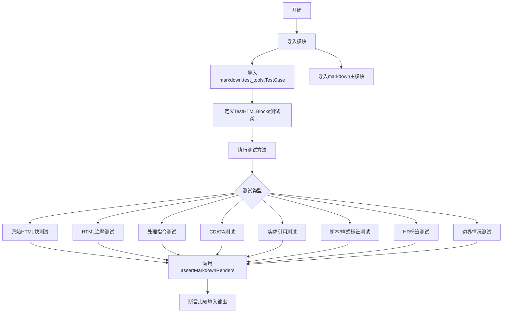

## 类结构

```
object (Python base)
└── unittest.TestCase
    └── markdown.test_tools.TestCase
        └── TestHTMLBlocks
```

## 全局变量及字段


### `markdown`
    
Python Markdown库的模块对象，提供Markdown到HTML的转换功能

类型：`module`
    


### `TestCase.assertMarkdownRenders`
    
继承自TestCase的测试方法，用于验证Markdown源码渲染后的HTML输出是否符合预期

类型：`method`
    


### `TestCase.dedent`
    
继承自TestCase的辅助方法，用于移除字符串的公共前导空白

类型：`method`
    
    

## 全局函数及方法


根据您的要求，我将从代码中提取指定的函数或方法。由于代码中`TestCase`是一个从`markdown.test_tools`导入的类，而实际的测试实现是`TestHTMLBlocks`类，我将以该类中最简单的方法`test_raw_paragraph`为例进行提取。如果您需要分析其他具体方法，请告知。

### TestHTMLBlocks.test_raw_paragraph

这是一个测试方法，用于验证Markdown对原始HTML段落 `<p>A raw paragraph.</p>` 的渲染是否符合预期。

参数：

- `self`：`TestHTMLBlocks` 实例，表示测试类本身

返回值：`None`，因为该方法使用 `assertMarkdownRenders` 进行断言测试，不返回任何值

#### 流程图

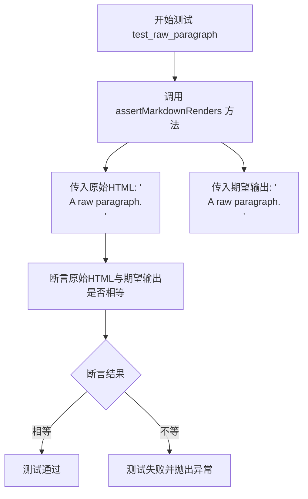

#### 带注释源码

```python
def test_raw_paragraph(self):
    # 这是一个测试方法，用于测试Markdown渲染器如何处理原始HTML段落
    # self.assertMarkdownRenders 是从 TestCase 继承来的自定义断言方法
    # 第一个参数是Markdown源码（这里直接是HTML，因为HTML块在源码中）
    # 第二个参数是期望渲染出的HTML输出
    self.assertMarkdownRenders(
        '<p>A raw paragraph.</p>',  # 原始Markdown/HTML输入
        '<p>A raw paragraph.</p>'    # 期望的渲染结果
    )
```

---

**注意**：该代码片段来自Python-Markdown项目的测试文件。由于`TestCase`类是从外部模块导入的，如果您需要`TestCase`类的详细信息，建议查看`markdown.test_tools`模块的源码。如果需要分析`TestHTMLBlocks`类中的其他具体测试方法，请告诉我。


我需要先明确要提取的具体函数或方法。请问您希望我针对哪个函数或方法生成详细设计文档？

从提供的代码来看，这是一个测试类 `TestHTMLBlocks`，包含约80多个测试方法，例如：
- `test_raw_paragraph`
- `test_raw_comment_one_line`
- `test_raw_html5`
- `test_script_tags`
- 等等

请告诉我您想要分析的**具体函数或方法名称**（例如：`TestHTMLBlocks.test_raw_paragraph` 或直接提供函数名），我将为您生成对应的详细设计文档。


### TestHTMLBlocks.test_raw_paragraph

该方法是 Python Markdown 测试套件中的一个单元测试，用于验证 Markdown 解析器能够正确处理和保留原始 HTML 块（raw HTML blocks）。具体测试当输入为完整的 HTML 段落标签 `<p>A raw paragraph.</p>` 时，解析器应原样输出相同的 HTML，不进行任何 Markdown 语法转换。

参数：

- `self`：`TestCase`，TestCase 实例本身，用于调用继承的 assertMarkdownRenders 方法进行断言验证

返回值：`None`，该方法为测试方法，无显式返回值，通过 assertMarkdownRenders 进行结果验证

#### 流程图

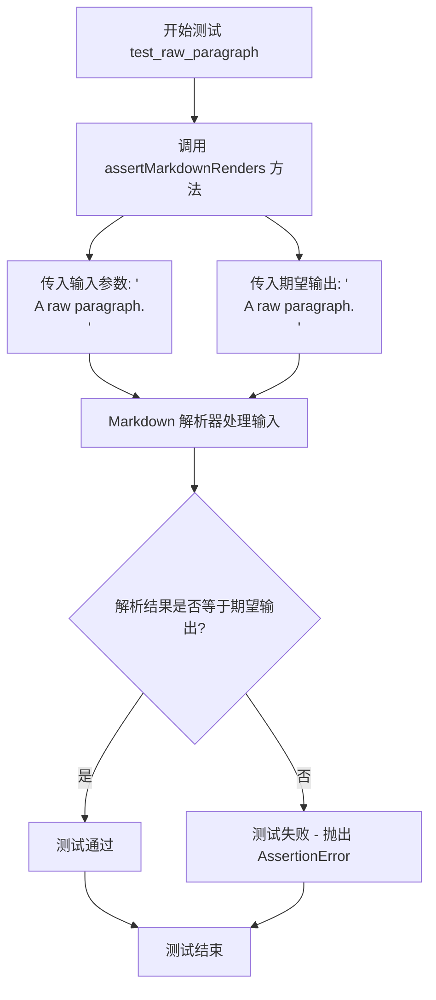

#### 带注释源码

```python
def test_raw_paragraph(self):
    """
    测试 Markdown 解析器对原始 HTML 段落标签的处理能力。
    
    验证规则：
    - 当输入为完整的 HTML 块元素（如 <p>...</p>）时
    - 解析器应原样保留该 HTML，不进行 Markdown 语法转换
    - 这是 Markdown 规范中"原始 HTML"处理的核心要求
    """
    # 使用继承自 TestCase 的 assertMarkdownRenders 方法进行验证
    # 参数1: 原始 Markdown/HTML 输入
    # 参数2: 期望的解析输出
    self.assertMarkdownRenders(
        '<p>A raw paragraph.</p>',  # 输入: 原始 HTML 段落
        '<p>A raw paragraph.</p>'     # 期望输出: 相同内容，应被保留
    )
```


### `TestHTMLBlocks.test_raw_skip_inline_markdown`

该测试方法用于验证Python Markdown在处理包含内联Markdown语法的原始HTML块时，能够正确跳过内联Markdown解析，确保原始HTML中的内容（如`*raw*`）不会被转换为Markdown强调标签。

参数：

- `self`：`TestHTMLBlocks`，测试类实例本身，用于调用继承的测试辅助方法

返回值：`None`，该方法为测试方法，通过`assertMarkdownRenders`断言验证输入输出，不返回具体值

#### 流程图

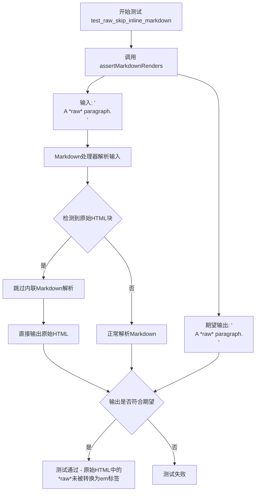

#### 带注释源码

```python
def test_raw_skip_inline_markdown(self):
    """
    测试原始HTML块中的内联Markdown语法应被跳过。
    
    验证当输入为原始HTML（如<p>...</p>）时，
    其中的Markdown语法（如*text*）不应被解析为强调标签。
    """
    # 调用测试框架的断言方法，验证Markdown渲染结果
    # 输入：原始HTML字符串，包含内联Markdown语法*raw*
    # 期望输出：HTML应保持原样，*raw*不应被转换为<em>raw</em>
    self.assertMarkdownRenders(
        '<p>A *raw* paragraph.</p>',  # 输入：包含内联Markdown语法的原始HTML
        '<p>A *raw* paragraph.</p>'     # 期望输出：原始HTML中的*raw*不被解析
    )
```


### `TestHTMLBlocks.test_raw_indent_one_space`

该测试方法验证了当 HTML 块被一个空格缩进时，Python-Markdown 能够正确识别并将其作为原始 HTML 段落输出，移除前导空格而不解析其中的 Markdown 语法。

#### 参数

- `self`：`TestCase`，测试类的实例对象，包含用于验证 Markdown 渲染结果的 `assertMarkdownRenders` 方法

#### 返回值

`None`，该方法为测试用例，通过断言验证渲染结果，不返回任何值

#### 流程图

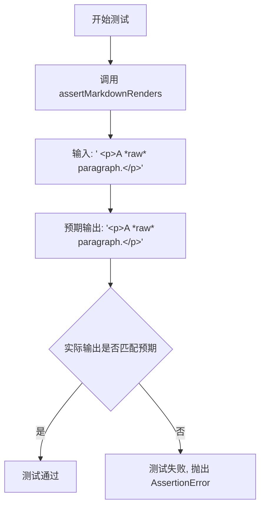

#### 带注释源码

```python
def test_raw_indent_one_space(self):
    """
    测试一个空格缩进的原始 HTML 块。
    
    验证行为：
    - 前导的一个空格会被忽略/移除
    - HTML 标签内的 Markdown 语法（*raw*）不会被解析
    - 完整的原始 HTML 段落被保留并输出
    """
    self.assertMarkdownRenders(
        ' <p>A *raw* paragraph.</p>',      # 输入: 带一个空格缩进的 HTML 块
        '<p>A *raw* paragraph.</p>'         # 期望输出: 空格被移除,Markdown 不解析
    )
```


### `TestHTMLBlocks.test_raw_indent_two_spaces`

该测试方法用于验证当HTML块前有两个空格的缩进时，Python Markdown解析器能够正确将其视为原始HTML段落，而不是代码块或其他Markdown元素。测试检查带有两个空格缩进的`<p>A *raw* paragraph.</p>`应被保留为原始HTML输出，其中内部的`*raw*`不应被转换为斜体。

参数：

- `self`：`TestCase`，测试类的实例本身，用于调用继承的`assertMarkdownRenders`方法

返回值：`None`，该方法为测试用例，无返回值，通过`assertMarkdownRenders`内部断言验证结果

#### 流程图

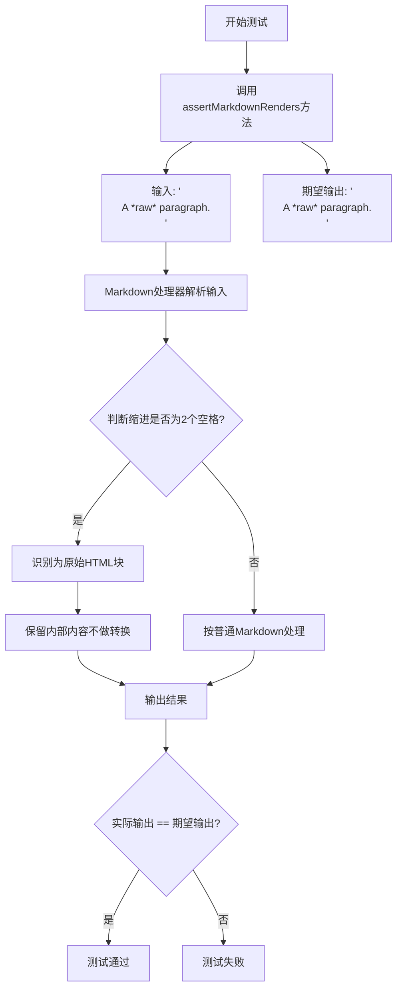

#### 带注释源码

```python
def test_raw_indent_two_spaces(self):
    """
    测试两个空格缩进的HTML块处理。
    
    验证规则：
    - 1个空格缩进：视为普通段落前的空格，会被去除
    - 2个空格缩进：视为原始HTML块，保留内部内容不做Markdown转换
    - 4个空格缩进：视为代码块
    """
    self.assertMarkdownRenders(
        '  <p>A *raw* paragraph.</p>',  # 输入：两个空格 + HTML段落
        '<p>A *raw* paragraph.</p>'      # 期望输出：原始HTML，内部*raw*不转换
    )
```


### `TestHTMLBlocks.test_raw_indent_three_spaces`

该方法是一个测试用例，用于验证 Markdown 解析器在处理前面带有三个空格缩进的 HTML 块时的行为。根据 Markdown 规范，三个空格的缩进不足以将内容转换为代码块，因此 HTML 块应被保留。

参数：无（类方法通过 `self` 访问测试工具）

返回值：`None`（测试方法不返回值，通过 `assertMarkdownRenders` 断言验证）

#### 流程图

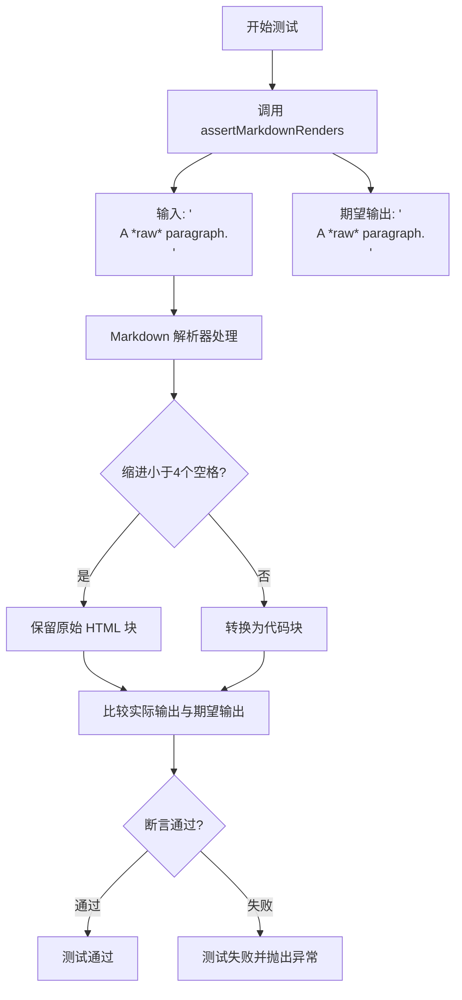

#### 带注释源码

```python
def test_raw_indent_three_spaces(self):
    """
    测试当 HTML 块前面有三个空格缩进时的处理行为。
    
    根据 Markdown 规范：
    - 四个或更多空格/制表符表示代码块
    - 少于四个空格应保留原始 HTML 块
    """
    self.assertMarkdownRenders(
        '   <p>A *raw* paragraph.</p>',  # 输入：三个空格后跟原始 HTML
        '<p>A *raw* paragraph.</p>'       # 期望输出：保留原始 HTML，不进行 Markdown 转换
    )
```


### `TestHTMLBlocks.test_raw_indent_four_spaces`

该测试方法验证了当HTML块前导有四个空格时，Markdown解析器会将其识别为代码块而非原始HTML段落，并将HTML标签进行转义处理。

参数：

- `self`：`TestCase`，测试类实例本身，隐式参数

返回值：`None`，该方法为测试用例，通过`assertMarkdownRenders`断言验证Markdown渲染结果

#### 流程图

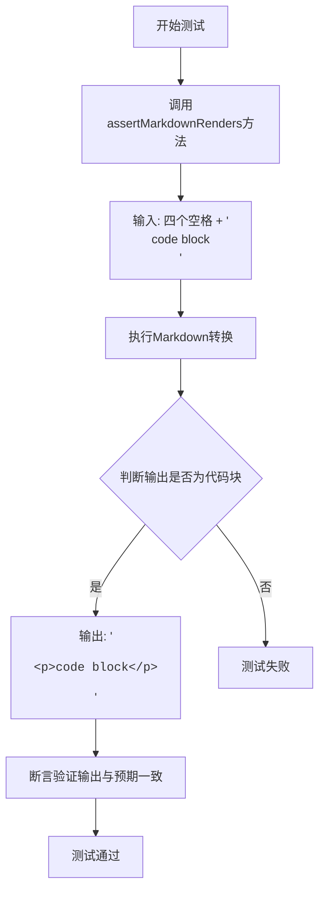

#### 带注释源码

```python
def test_raw_indent_four_spaces(self):
    """
    测试当HTML块前导有四个空格时的行为。
    四个空格的缩进在Markdown中被视为代码块的标记，
    因此内部的HTML标签应该被转义而不是被解析为原始HTML。
    """
    # 调用父类的assertMarkdownRenders方法进行渲染验证
    # 第一个参数为Markdown输入源
    # 第二个参数为期望的HTML输出
    self.assertMarkdownRenders(
        # 输入：四个空格前缀 + HTML段落标签
        '    <p>code block</p>',
        # 期望输出：使用self.dedent()去除多余缩进
        # 由于四个空格触发代码块，HTML标签被转义为实体
        self.dedent(
            """
            <pre><code>&lt;p&gt;code block&lt;/p&gt;
            </code></pre>
            """
        )
    )
```

#### 额外说明

| 项目 | 说明 |
|------|------|
| **测试目的** | 验证Markdown解析器正确区分原始HTML块与代码块 |
| **输入文本** | 四个空格 + `<p>code block</p>` |
| **预期行为** | 四个空格缩进触发代码块，HTML标签被转义 |
| **HTML转义** | `<` → `&lt;`, `>` → `&gt;` |
| **测试框架** | 使用`markdown.test_tools.TestCase`中的`assertMarkdownRenders` |


### `TestHTMLBlocks.test_raw_span`

该方法用于测试在内联 HTML `<span>` 标签中的 Markdown 语法（如 `*inline*`）是否被正确解析为 Markdown 强调（emphasis）格式。

参数：

- 无显式参数（`self` 为隐式参数）

返回值：无显式返回值（通过 `assertMarkdownRenders` 断言进行测试验证）

#### 流程图

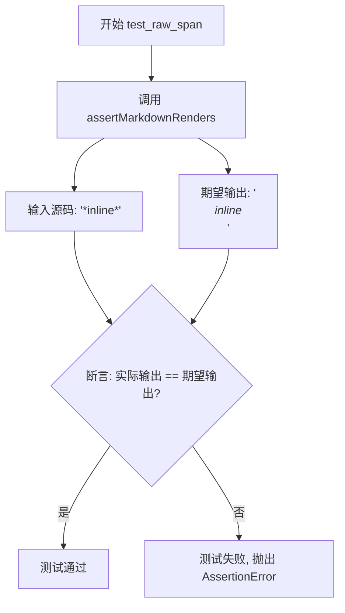

#### 带注释源码

```python
def test_raw_span(self):
    """
    测试内联 HTML span 标签中的 Markdown 语法是否被正确解析为强调。
    
    说明：
    - 输入: '<span>*inline*</span>'
    - 期望输出: '<p><span><em>inline</em></span></p>'
    - span 标签本身保留，但内部的 *inline* 被解析为 Markdown 强调语法
    """
    self.assertMarkdownRenders(
        '<span>*inline*</span>',          # 源码输入：包含内联 span 标签和 Markdown 语法
        '<p><span><em>inline</em></span></p>'  # 期望的 HTML 输出
    )
```


### `TestHTMLBlocks.test_code_span`

该方法是 Python-Markdown 测试套件中的一个测试用例，用于验证 Markdown 解析器正确处理包含 HTML 标签的内联代码 span（反引号包裹的内容）。具体来说，它测试当代码 span 中包含 HTML 段落标签 `<p>` 和 `</p>` 时，这些标签是否被正确转义为 HTML 实体 `&lt;p&gt;` 和 `&gt;p&gt;`，以防止它们被解析为实际的 HTML 元素。

参数：

- `self`：`TestCase`，测试用例实例本身，继承自 `markdown.test_tools.TestCase`

返回值：`None`，无返回值（测试方法通过断言验证，不返回结果）

#### 流程图

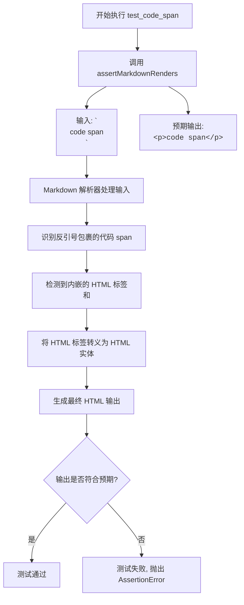

#### 带注释源码

```python
def test_code_span(self):
    """
    测试包含 HTML 标签的内联代码 span 的渲染行为。
    
    此测试用例验证以下场景:
    - 输入: `<p>code span</p>` (反引号包裹的代码文本)
    - 预期输出: `<p><code>&lt;p&gt;code span&lt;/p&gt;</code></p>`
    
    关键验证点:
    1. 反引号内的内容被识别为内联代码 span
    2. 代码 span 内的 HTML 标签 <p> 和 </p> 被转义为 &lt;p&gt; 和 &gt;p&gt;
    3. 转义后的内容被包裹在 <code> 标签中
    4. 最终代码 span 被包裹在 <p> 段落标签中
    """
    self.assertMarkdownRenders(
        '`<p>code span</p>`',  # Markdown 源文本，包含 HTML 标签的代码 span
        '<p><code>&lt;p&gt;code span&lt;/p&gt;</code></p>'  # 期望的 HTML 输出
    )
```


### TestHTMLBlocks.test_code_span_open_gt

该测试方法用于验证Markdown解析器在处理包含左尖括号（<）的内联代码 span 时的正确性，确保 `<` 字符被正确转义为 `&lt;` 而不会被误解析为HTML标签的开始。

参数：

- `self`：`TestHTMLBlocks`，测试类实例本身，用于调用继承自 TestCase 的断言方法

返回值：`None`，测试方法不返回值，通过断言表达验证结果

#### 流程图

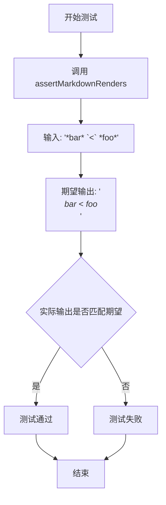

#### 带注释源码

```python
def test_code_span_open_gt(self):
    """
    测试内联代码span中左尖括号的转义处理。
    
    验证当 '<' 字符出现在代码span内部时，会被正确转义为 '&lt;'。
    这确保了Markdown解析器不会将 '<' 误识别为HTML标签的开始。
    """
    self.assertMarkdownRenders(
        '*bar* `<` *foo*',  # Markdown源文本，包含内联代码span
        '<p><em>bar</em> <code>&lt;</code> <em>foo</em></p>'  # 期望的HTML输出
    )
```


### `TestHTMLBlocks.test_raw_empty`

该方法是一个测试用例，用于验证 Python Markdown 对空 HTML 段落标签 `<p></p>` 的处理是否正确。测试确保空段落标签在转换过程中保持不变。

参数： 无

返回值： 无（测试方法，通过 `assertMarkdownRenders` 进行断言验证）

#### 流程图

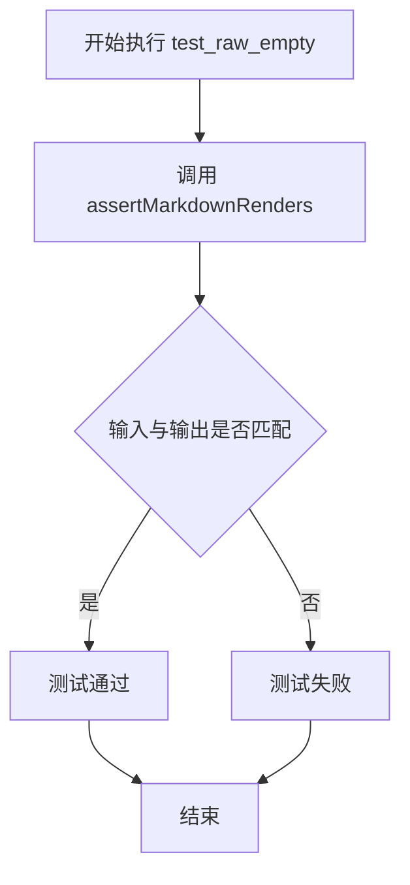

#### 带注释源码

```python
def test_raw_empty(self):
    """测试空 HTML 段落标签的处理。
    
    该测试用例验证 Python Markdown 能够正确处理空的 HTML 段落标签 <p></p>，
    确保输入的原始 HTML 在输出时保持不变。
    """
    self.assertMarkdownRenders(
        '<p></p>',    # 输入：原始的空 HTML 段落标签
        '<p></p>'     # 期望输出：与输入相同的空 HTML 段落标签
    )
```

#### 备注

- **测试目的**：验证空 HTML 块元素（如 `<p></p>`）在 Markdown 转换过程中被保留为原始 HTML，不会被修改或删除。
- **测试框架**：使用 `markdown.test_tools.TestCase` 中的 `assertMarkdownRenders` 方法进行测试。
- **相关测试**：同类型的测试还包括 `test_raw_empty_space`（带空格）、`test_raw_empty_newline`（带换行）、`test_raw_empty_blank_line`（带空行）等，用于测试不同形式的空 HTML 元素。


### `TestHTMLBlocks.test_raw_empty_space`

该方法用于测试 Markdown 解析器对包含单个空格的原始 HTML 块的处理是否正确。它验证了带有空格的空段落 `<p> </p>` 能够被正确保留并渲染为相同的输出，确保 HTML 块中的空白字符不会被忽略或处理不当。

参数：

- `self`：`TestHTMLBlocks`，代表测试类实例本身，用于访问继承自 `TestCase` 的测试方法

返回值：`None`，该方法为测试用例，通过 `assertMarkdownRenders` 断言验证渲染结果，不返回具体值

#### 流程图

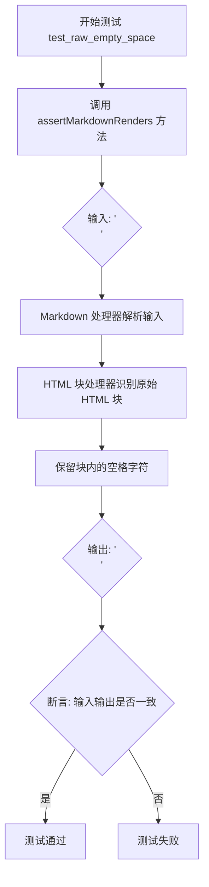

#### 带注释源码

```python
def test_raw_empty_space(self):
    """
    测试包含单个空格的原始 HTML 段落块是否被正确渲染。
    
    该测试验证了 Markdown 解析器在处理原始 HTML 块时，
    能够正确保留元素内部的空白字符（包括空格）。
    """
    # 使用 assertMarkdownRenders 验证 Markdown 渲染结果
    # 第一个参数为输入的 Markdown/HTML 源文本
    # 第二个参数为期望的输出 HTML
    self.assertMarkdownRenders(
        '<p> </p>',  # 输入：包含单个空格的 HTML 段落标签
        '<p> </p>'   # 期望输出：应保持一致，保留内部空格
    )
```

#### 补充说明

该测试用例属于 Python-Markdown 项目的 HTML 块处理测试套件，专门用于验证原始 HTML（Raw HTML）在 Markdown 文档中的处理行为。测试的核心目标是确保：

1. **空白保留**：HTML 标签内的空格字符不会被 Markdown 处理器修改或移除
2. **块级标签处理**：`<p>` 标签作为块级 HTML 元素，在 Markdown 中应被原样保留
3. **边界情况**：即使是只有空格的"空"元素，也应正确处理

此测试对应于 Markdown 规范中关于"原始 HTML"部分的规定，确保 Python-Markdown 的实现与规范保持一致，同时验证了处理器的健壮性。


### TestHTMLBlocks.test_raw_empty_newline

该方法用于测试 Markdown 解析器对包含单个换行符的空 HTML 段落元素的处理能力，验证输入的空段落（含换行符）能够被正确保留并渲染为相同的 HTML 输出。

参数：

- `self`：`TestHTMLBlocks`，测试类实例本身

返回值：`None`，该方法为测试方法，通过 `assertMarkdownRenders` 进行断言验证，若测试失败会抛出异常

#### 流程图

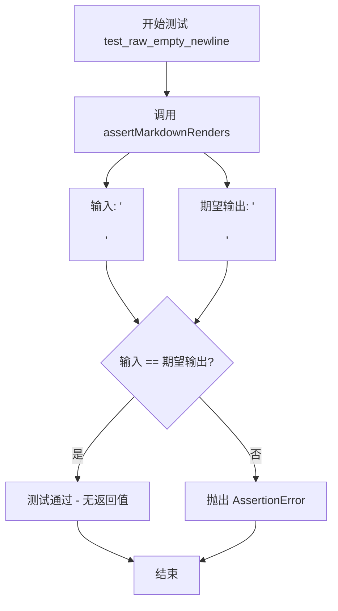

#### 带注释源码

```python
def test_raw_empty_newline(self):
    """
    测试包含单个换行符的空段落元素的渲染行为。
    
    该测试用例验证 Markdown 解析器能够正确处理：
    1. 完整的 HTML 段落标签 <p>...</p>
    2. 段落内包含单个换行符 \n 的情况
    3. 保持输入的原始格式（包括换行符）不变
    
    期望行为：输入 '<p>\n</p>' 应渲染为相同的输出 '<p>\n</p>'
    """
    self.assertMarkdownRenders(
        '<p>\n</p>',  # 输入：包含换行符的空段落
        '<p>\n</p>'   # 期望输出：与输入完全一致
    )
```


### `TestHTMLBlocks.test_raw_empty_blank_line`

该方法是一个测试用例，用于验证 Markdown 解析器在处理包含空白的原始 HTML 段落时的行为是否符合预期。具体来说，它测试当输入为 `<p>\n\n</p>`（包含空白的 HTML 段落）时，输出应该保持不变。

参数：

- `self`：`TestCase`，测试类的实例隐式参数

返回值：`None`，该方法为测试用例，无返回值

#### 流程图

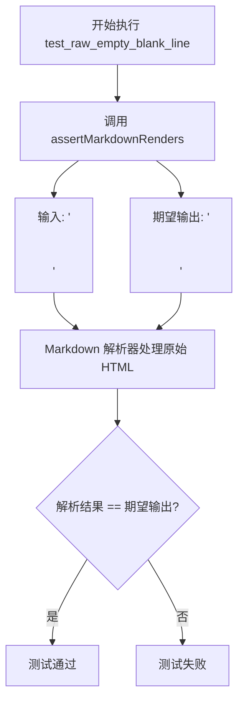

#### 带注释源码

```python
def test_raw_empty_blank_line(self):
    """
    测试 Markdown 解析器处理带有空白的原始 HTML 段落的行为。
    
    该测试用例验证：
    - 当原始 HTML 段落包含空白行时（\n\n）
    - Markdown 解析器应该保持这些空白不变
    - 输入和输出应该完全一致
    """
    self.assertMarkdownRenders(
        '<p>\n\n</p>',  # 源码输入：包含空白的 HTML 段落标签
        '<p>\n\n</p>'   # 期望输出：应该保持不变
    )
```


### `TestHTMLBlocks.test_raw_uppercase`

该测试方法用于验证 Python-Markdown 对大写 HTML 标签（如 `<DIV>`）的原始 HTML 块处理能力，确保大写标签被正确识别为原始 HTML 而非 Markdown 语法。

参数：

- `self`：`TestHTMLBlocks` 实例，Python 测试用例标准参数，无需显式传递

返回值：`None`，该方法为测试用例，通过 `assertMarkdownRenders` 断言验证 Markdown 解析结果，不返回任何值

#### 流程图

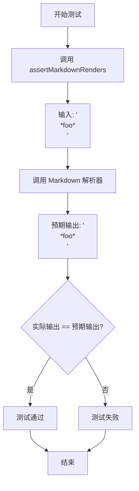

#### 带注释源码

```python
def test_raw_uppercase(self):
    """
    测试大写 HTML 标签的原始 HTML 处理能力。
    
    验证大写标签如 <DIV> 被正确识别为原始 HTML 块，
    内部的 *foo* 不会被解析为 Markdown 强调语法。
    """
    self.assertMarkdownRenders(
        '<DIV>*foo*</DIV>',  # 输入：包含大写 DIV 标签和 Markdown 强调符的字符串
        '<DIV>*foo*</DIV>'   # 期望输出：大写 DIV 标签及其内容保持不变
    )
```


### `TestHTMLBlocks.test_raw_uppercase_multiline`

该测试方法用于验证大写HTML块级标签（如`<DIV>`）的多行内容能够被正确保留为原始HTML，而不被Markdown解析器处理。

参数：

- `self`：隐式参数，`TestCase`类型，测试用例的实例本身

返回值：`None`，该方法为测试方法，使用断言验证行为，不返回任何值

#### 流程图

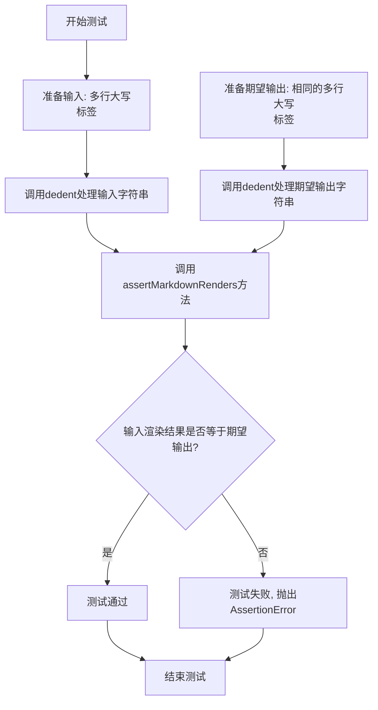

#### 带注释源码

```python
def test_raw_uppercase_multiline(self):
    """
    测试大写HTML块标签的多行内容是否被保留为原始HTML。
    
    该测试验证了Python Markdown能够正确处理包含多行内容的大写HTML块级标签，
    确保标签内部的内容不被Markdown解析器处理，保持原始格式。
    """
    # 使用assertMarkdownRenders方法验证Markdown渲染结果
    # 第一个参数是Markdown源文本，第二个参数是期望的HTML输出
    self.assertMarkdownRenders(
        # 输入: 包含大写<DIV>标签的多行文本
        # dedent用于去除字符串的公共前缀缩进
        self.dedent(
            """
            <DIV>
            *foo*
            </DIV>
            """
        ),
        # 期望输出: 与输入相同，大写标签及其内容应被保留为原始HTML
        self.dedent(
            """
            <DIV>
            *foo*
            </DIV>
            """
        )
    )
```

#### 补充说明

- **测试目的**：验证大写HTML标签（如`<DIV>`、`<SPAN>`等）即使包含多行内容，也应作为原始HTML保留，不会被转换为Markdown解析
- **测试场景**：输入和输出都包含多行的大写HTML块标签，标签内部的`*foo*`不应被转换为 `<em>foo</em>`
- **相关测试**：同类的测试方法还包括`test_raw_uppercase`（单行版本）、`test_raw_span`（小写span标签）等
- **设计约束**：该测试确保Python Markdown的行为与CommonMark规范一致，正确处理HTML块级元素的原始内容


### `TestHTMLBlocks.test_multiple_raw_single_line`

该方法用于测试当多个原始HTML块元素位于同一行时的渲染行为，验证Markdown解析器能够正确处理连续的无换行的HTML块标签，并将它们正确拆分为独立的块元素。

参数：

- `self`：`TestHTMLBlocks`，测试类的实例本身，包含测试所需的断言方法和辅助功能

返回值：`None`，该方法为测试用例，无返回值，通过断言验证预期结果

#### 流程图

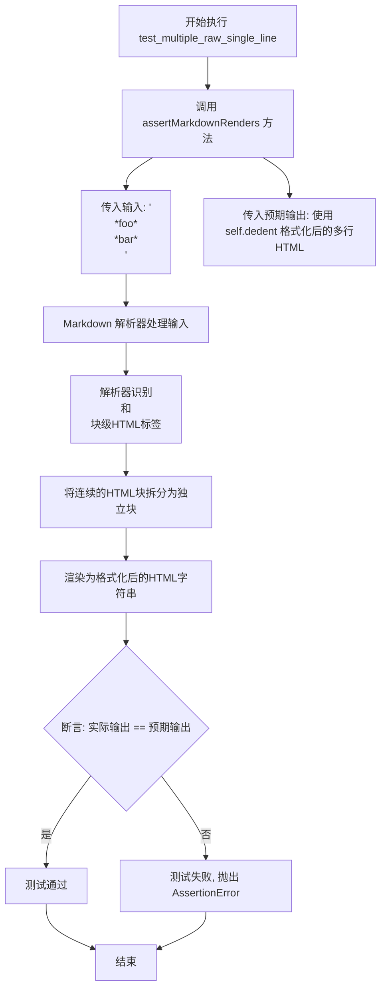

#### 带注释源码

```python
def test_multiple_raw_single_line(self):
    """
    测试多个原始HTML块在同一行的渲染行为。
    
    验证当输入包含连续的块级HTML标签（如 <p> 和 <div>）时，
    Markdown解析器能够正确处理并输出为独立换行的HTML块。
    """
    # 调用测试基类的 assertMarkdownRenders 方法进行渲染验证
    self.assertMarkdownRenders(
        # 输入：两个块级HTML标签在同一行，*foo* 和 *bar* 不应被解析为Markdown强调
        '<p>*foo*</p><div>*bar*</div>',
        
        # 预期输出：使用 self.dedent 去除缩进，得到两个独立换行的HTML块
        self.dedent(
            """
            <p>*foo*</p>
            <div>*bar*</div>
            """
        )
    )
```

#### 相关信息

**测试目的**：验证Python-Markdown对连续块级HTML元素的处理逻辑，确保同一行中的多个HTML块标签能被正确解析为独立的块元素。

**测试场景**：
- 输入：`'<p>*foo*</p><div>*bar*</div>'`
- 预期：`'<p>*foo*</p>\n<div>*bar*</div>'`

**关键点**：
1. 两个HTML块级元素（`<p>`和`<div>`）位于同一行
2. 内部的`*foo*`和`*bar*`应保持原始形式，不被Markdown解释器处理为强调标签
3. 输出时两个元素应正确换行分隔


### `TestHTMLBlocks.test_multiple_raw_single_line_with_pi`

该测试方法用于验证 Markdown 解析器能够正确处理包含多个单行原始 HTML 块以及 PHP 处理指令（Processing Instruction）的场景，确保渲染结果保持原始 HTML 和处理指令的结构完整性。

#### 参数

- `self`：`TestHTMLBlocks`（类实例本身），代表测试类实例，用于调用继承的 `assertMarkdownRenders` 和 `dedent` 方法

#### 返回值

- `None`（无显式返回值），该方法为测试用例，通过 `assertMarkdownRenders` 断言验证 Markdown 解析结果是否符合预期

#### 流程图

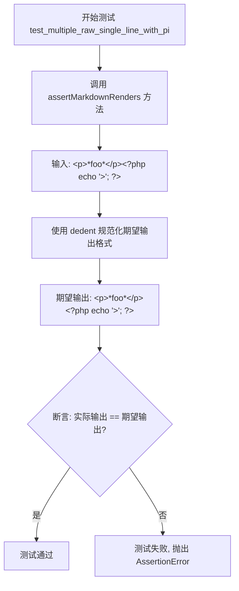

#### 带注释源码

```python
def test_multiple_raw_single_line_with_pi(self):
    """
    测试多个单行原始 HTML 块（包含 PHP 处理指令）的渲染行为。
    
    验证场景：
    - 输入包含一个 <p> 标签和一个 PHP 处理指令（<?php ... ?>）
    - 两者在同一行但应被渲染为独立的块级元素
    - PHP 处理指令中的 '>' 字符应被正确保留
    """
    self.assertMarkdownRenders(
        # 输入：原始 Markdown 字符串，包含 <p> 标签和 PHP 处理指令
        "<p>*foo*</p><?php echo '>'; ?>",
        # 期望输出：使用 dedent 规范化后的多行字符串
        self.dedent(
            """
            <p>*foo*</p>
            <?php echo '>'; ?>
            """
        )
    )
```

---

#### 关键组件信息

| 组件名称 | 一句话描述 |
|---------|-----------|
| `TestCase` | Python Markdown 测试框架基类，提供 `assertMarkdownRenders` 等断言方法 |
| `dedent` | 文本格式化工具函数，用于移除多行字符串的公共前导空白 |
| `assertMarkdownRenders` | 核心断言方法，验证 Markdown 输入的渲染结果是否与期望输出匹配 |
| `markdown.Markdown` | Markdown 解析器主类，测试 indirectly 验证其 HTML 块处理逻辑 |

---

#### 潜在的技术债务或优化空间

1. **测试覆盖局限性**：该测试无法验证输入和输出是否真正在"同一行"，因为 `assertMarkdownRenders` 内部会将输入按行分割处理。建议增加更细粒度的测试用例来验证行内原始 HTML 块的边界行为。

2. **测试方法可读性**：`dedent` 的使用虽然规范了期望输出的格式，但对于不熟悉该工具的开发者来说增加了理解成本。建议在测试类中添加文档注释说明 `dedent` 的用途。

3. **缺少对异常输入的测试**：该测试仅覆盖了"happy path"，未测试如 `<?php` 后换行、多个连续处理指令等边界情况。

---

#### 其它项目

**设计目标与约束：**
- 测试遵循 Python Markdown 项目的测试规范，继承自 `TestCase` 类
- 验证原始 HTML 块（raw HTML blocks）在 Markdown 解析过程中的保留行为
- 确保 PHP 处理指令（Processing Instruction）作为块级元素正确处理

**错误处理与异常设计：**
- 测试失败时，`assertMarkdownRenders` 会自动展示期望值与实际值的差异
- 无需显式的异常处理，依赖 pytest/unittest 框架的断言机制

**数据流与状态机：**
- 输入数据流：原始 Markdown 字符串 → Markdown 解析器 → HTML 输出
- 该测试验证的是解析器的"原始 HTML 保留"状态，即不将原始 HTML 内容转换为 Markdown 解析后的格式

**外部依赖与接口契约：**
- 依赖 `markdown.test_tools.TestCase` 提供的测试接口
- 依赖 `markdown` 模块本身的解析逻辑
- `dedent` 函数来自 `markdown.test_tools` 或 Python 标准库 (`textwrap.dedent`)


### `TestHTMLBlocks.test_multiline_raw`

该测试方法用于验证Python-Markdown对多行原始HTML块（特别是包含多行内容的`<p>`标签）的处理是否正确，确保原始HTML内容在转换过程中被完整保留而不会被Markdown语法解析。

参数：

- `self`：`TestCase`（或`TestHTMLBlocks`实例），Python unittest测试框架的测试用例实例，用于调用继承自父类的`assertMarkdownRenders`和`dedent`方法

返回值：无返回值（`None`），该方法为测试用例，通过`assertMarkdownRenders`进行断言验证

#### 流程图

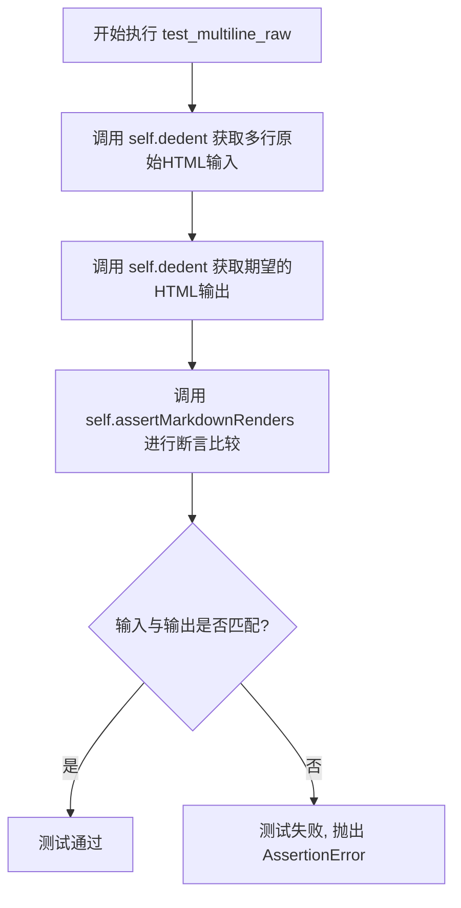

#### 带注释源码

```python
def test_multiline_raw(self):
    """
    测试多行原始HTML块的处理。
    
    验证包含多行文本的<p>标签能够被正确识别为原始HTML，
    而不会被Markdown解析器处理其中的内容。
    """
    # 使用self.dedent方法去除字符串的共同缩进，提取原始HTML输入
    self.assertMarkdownRenders(
        self.dedent(
            """
            <p>
                A raw paragraph
                with multiple lines.
            </p>
            """
        ),
        # 期望的输出HTML，应该与输入完全一致（保留原始格式）
        self.dedent(
            """
            <p>
                A raw paragraph
                with multiple lines.
            </p>
            """
        )
    )
```


### `TestHTMLBlocks.test_blank_lines_in_raw`

该方法用于测试 Markdown 解析器在处理包含多个空行的原始 HTML 块时能否正确保留这些空行。它验证了原始 HTML 段落中的空白行在转换过程中被完整保留。

参数：

- `self`：`TestCase`，TestCase 实例本身，用于调用父类的测试方法

返回值：`None`，无返回值（测试方法）

#### 流程图

```mermaid
flowchart TD
    A[开始测试 test_blank_lines_in_raw] --> B[调用 dedent 处理输入字符串]
    B --> C[调用 dedent 处理期望输出字符串]
    C --> D[调用 assertMarkdownRenders 进行断言验证]
    D --> E{验证结果}
    E -->|通过| F[测试通过]
    E -->|失败| G[抛出 AssertionError]
    F --> H[结束测试]
    G --> H
```

#### 带注释源码

```python
def test_blank_lines_in_raw(self):
    """
    测试包含多个空行的原始 HTML 块是否能正确保留空白行。
    
    该测试验证了以下场景：
    - 原始 HTML <p> 标签内包含多个空行
    - 这些空行应该在转换后被完整保留
    """
    # 使用 dedent 移除公共缩进，获取包含空行的原始 HTML 输入
    self.assertMarkdownRenders(
        self.dedent(
            """
            <p>

                A raw paragraph...

                with many blank lines.

            </p>
            """
        ),
        # 期望的输出应该与输入完全相同，因为这是原始 HTML 块
        self.dedent(
            """
            <p>

                A raw paragraph...

                with many blank lines.

            </p>
            """
        )
    )
```


### `TestHTMLBlocks.test_raw_surrounded_by_Markdown`

该测试方法用于验证 Markdown 解析器能够正确处理被 Markdown 文本包围的原始 HTML 块。它确保原始 HTML 内容（如 `<p>*Raw* HTML.</p>`）在渲染时保持不变，而周围的 Markdown 文本（如 `*Markdown*`）仍会被解析为 HTML 标签（如 `<em>`）。

参数：

-  `self`：`TestHTMLBlocks`，测试类的实例方法，用于访问测试框架的断言方法

返回值：`None`，该方法为测试方法，通过 `assertMarkdownRenders` 断言验证 Markdown 渲染结果，不返回具体值

#### 流程图

```mermaid
flowchart TD
    A[开始测试 test_raw_surrounded_by_Markdown] --> B[定义输入 Markdown 文本]
    B --> C[定义期望的 HTML 输出]
    C --> D[调用 self.assertMarkdownRenders 方法]
    D --> E{实际输出是否等于期望输出?}
    E -->|是| F[测试通过]
    E -->|否| G[测试失败, 抛出 AssertionError]
    
    style B fill:#e1f5fe
    style C fill:#e1f5fe
    style F fill:#c8e6c9
    style G fill:#ffcdd2
```

#### 带注释源码

```python
def test_raw_surrounded_by_Markdown(self):
    """
    测试被 Markdown 文本包围的原始 HTML 块的渲染行为。
    
    验证内容:
    1. 原始 HTML 块（如 <p>*Raw* HTML.</p>）在输出中保持不变
    2. 周围的 Markdown 文本（如 *Markdown*）被正确解析为 HTML 标签（如 <em>）
    3. 段落分隔正确处理
    """
    # 输入：包含 Markdown 文本和原始 HTML 的混合内容
    self.assertMarkdownRenders(
        self.dedent(
            """
            Some *Markdown* text.

            <p>*Raw* HTML.</p>

            More *Markdown* text.
            """
        ),
        # 期望输出：Markdown 被解析为 HTML，原始 HTML 保持不变
        self.dedent(
            """
            <p>Some <em>Markdown</em> text.</p>
            <p>*Raw* HTML.</p>

            <p>More <em>Markdown</em> text.</p>
            """
        )
    )
```


### `TestHTMLBlocks.test_raw_surrounded_by_text_without_blank_lines`

该测试方法用于验证当原始HTML块被Markdown文本包围（且中间没有空白行）时的解析行为。测试确保在连续的文本行中，Markdown文本和原始HTML块都能被正确处理并转换为适当的HTML段落。

参数：

- `self`：TestCase，当前测试用例实例，用于调用继承的`assertMarkdownRenders`方法进行断言验证

返回值：`None`，该方法为测试用例，无返回值，通过`assertMarkdownRenders`内部断言验证Markdown解析结果是否符合预期

#### 流程图

```mermaid
flowchart TD
    A[开始测试] --> B[准备输入Markdown文本]
    B --> C[准备期望输出的HTML]
    C --> D[调用assertMarkdownRenders方法]
    D --> E{解析结果是否匹配期望?}
    E -->|是| F[测试通过]
    E -->|否| G[测试失败抛出AssertionError]
    
    subgraph 输入输出
    H[输入: Some *Markdown* text.<br/>&lt;p&gt;*Raw* HTML.&lt;/p&gt;<br/>More *Markdown* text.]
    I[期望输出: &lt;p&gt;Some &lt;em&gt;Markdown&lt;/em&gt; text.&lt;/p&gt;<br/>&lt;p&gt;*Raw* HTML.&lt;/p&gt;<br/>&lt;p&gt;More &lt;em&gt;Markdown&lt;/em&gt; text.&lt;/p&gt;]
    end
    
    B --> H
    I --> C
```

#### 带注释源码

```python
def test_raw_surrounded_by_text_without_blank_lines(self):
    """
    测试当原始HTML块被Markdown文本包围但没有空白行时的解析行为。
    
    此测试验证以下场景：
    1. 行首的Markdown文本应被解析为Markdown（斜体标记生效）
    2. 独立的HTML块标签应保持为原始HTML
    3. 每行文本（无论是Markdown还是原始HTML）都应被包裹在<p>标签中
    
    输入中三行文本连续没有空白行分隔，这种情况下Markdown解析器
    会将每一行视为独立的块级元素进行处理。
    """
    # 使用dedent方法去除缩进，构造输入的Markdown源码
    # 输入：Some *Markdown* text. (会被解析为Markdown)
    #      <p>*Raw* HTML.</p>    (保持为原始HTML)
    #      More *Markdown* text. (会被解析为Markdown)
    self.assertMarkdownRenders(
        self.dedent(
            """
            Some *Markdown* text.
            <p>*Raw* HTML.</p>
            More *Markdown* text.
            """
        ),
        # 期望的HTML输出
        # Markdown行会被解析：*text* 变为 <em>text</em>
        # 原始HTML行保持不变：<p>*Raw* HTML.</p>
        self.dedent(
            """
            <p>Some <em>Markdown</em> text.</p>
            <p>*Raw* HTML.</p>
            <p>More <em>Markdown</em> text.</p>
            """
        )
    )
```


### `TestHTMLBlocks.test_multiline_markdown_with_code_span`

该测试方法用于验证 Python Markdown 库在处理多行 Markdown 文本时，能够正确识别并转换位于行首的代码片段（code span），确保其中的 HTML 标签被正确转义。

参数：

- `self`：`TestCase`，测试类实例本身，用于调用继承的断言方法

返回值：`None`，测试方法不返回任何值，仅通过断言验证 Markdown 转换结果

#### 流程图

```mermaid
flowchart TD
    A[开始执行测试] --> B[调用 self.dedent 处理输入 Markdown 文本]
    B --> C[调用 self.dedent 处理期望的 HTML 输出]
    C --> D[调用 self.assertMarkdownRenders 进行断言验证]
    D --> E{断言结果}
    E -->|通过| F[测试通过]
    E -->|失败| G[抛出 AssertionError]
    
    subgraph 内部处理流程
    H[Markdown 解析器处理输入]
    H --> I[识别多行段落]
    I --> J[识别行首的代码片段 `<p>code span</p>`]
    J --> K[将代码片段内容转义为 HTML 实体]
    K --> L[生成最终 HTML 输出]
    end
    
    D -.-> H
    L -.-> D
```

#### 带注释源码

```python
def test_multiline_markdown_with_code_span(self):
    """
    测试多行 Markdown 中包含代码片段的情况。
    验证位于行首的代码片段能够被正确识别和转义。
    
    测试场景：
    - 输入：包含多行文本，其中一行以 `<p>code span</p>` 开头
    - 期望：代码片段中的 < 和 > 被转义为 &lt; 和 &gt;
    """
    self.assertMarkdownRenders(
        # 输入的 Markdown 文本（使用 self.dedent 去除缩进）
        self.dedent(
            """
            A paragraph with a block-level
            `<p>code span</p>`, which is
            at the start of a line.
            """
        ),
        # 期望输出的 HTML（代码片段被转义）
        self.dedent(
            """
            <p>A paragraph with a block-level
            <code>&lt;p&gt;code span&lt;/p&gt;</code>, which is
            at the start of a line.</p>
            """
        )
    )
```


### `TestHTMLBlocks.test_raw_block_preceded_by_markdown_code_span_with_unclosed_block_tag`

这是一个测试方法，用于验证 Markdown 解析器在处理以下场景时的正确性：当 Markdown 文本中包含一个行内代码 span（包含类似块级标签如 `<div>`），随后紧跟一个原始 HTML 块（`<p>*not markdown*</p>`），然后再跟随着普通 Markdown 文本。该测试确保代码 span 中的内容被正确转义为 HTML 实体，同时原始 HTML 块保持不变，而后续的 Markdown 文本被正确解析。

参数：

- `self`：`TestCase`（继承自 `unittest.TestCase`），表示测试用例实例本身，无需显式传递

返回值：`None`，该方法为测试用例，通过 `assertMarkdownRenders` 方法内部断言验证结果，不返回任何值

#### 流程图

```mermaid
flowchart TD
    A[开始测试] --> B[输入Markdown源码]
    B --> C[调用Markdown解析器]
    C --> D{解析过程}
    D -->|步骤1| E[解析第一行: 'A paragraph with a block-level code span: `<div>`.']
    E --> F[识别行内代码span `<div>`]
    F --> G[将`<div>`转义为`&lt;div&gt;`]
    G --> H[输出段落: `<p>A paragraph with a block-level code span: <code>&lt;div&gt;</code>.</p>`]
    
    D -->|步骤2| I[遇到空行分隔]
    I --> J[识别原始HTML块: `<p>*not markdown*</p>`]
    J --> K[保持HTML原始内容不变]
    K --> L[输出原始HTML块]
    
    D -->|步骤3| M[解析后续Markdown文本: 'This is *markdown*']
    M --> N[识别强调: *markdown*]
    N --> O[转换为`<em>markdown</em>`]
    O --> P[输出段落: `<p>This is <em>markdown</em></p>`]
    
    H --> Q[合并所有输出结果]
    L --> Q
    P --> Q
    
    Q --> R{验证输出}
    R -->|通过| S[测试通过]
    R -->|失败| T[抛出AssertionError]
```

#### 带注释源码

```python
def test_raw_block_preceded_by_markdown_code_span_with_unclosed_block_tag(self):
    """
    测试 Markdown 解析器处理以下场景：
    1. 包含未闭合块级标签的代码 span（`<div>`）
    2. 后面紧跟原始 HTML 块
    3. 最后是普通 Markdown 文本
    
    预期行为：
    - 代码 span 中的 `<div>` 应被转义为 &lt;div&gt;
    - 原始 HTML 块 (<p>) 应保持不变
    - 后续的 Markdown 文本 (*markdown*) 应被正确解析
    """
    # 调用父类的 assertMarkdownRenders 方法进行断言验证
    # 第一个参数：输入的 Markdown 源码
    # 第二个参数：期望的 HTML 输出
    self.assertMarkdownRenders(
        # 使用 self.dedent() 移除公共缩进，保持字符串格式
        self.dedent(
            """
            A paragraph with a block-level code span: `<div>`.

            <p>*not markdown*</p>

            This is *markdown*
            """
        ),
        self.dedent(
            """
            <p>A paragraph with a block-level code span: <code>&lt;div&gt;</code>.</p>
            <p>*not markdown*</p>

            <p>This is <em>markdown</em></p>
            """
        )
    )
```


### TestHTMLBlocks.test_raw_one_line_followed_by_text

该测试方法用于验证 Python-Markdown 在处理原始 HTML 块后紧跟 Markdown 文本时的行为。具体来说，它测试当一个原始 HTML 段落标签 `<p>*foo*</p>` 后面跟着 Markdown 格式的文本 `*bar*` 时，HTML 块应保持原样，而后续的 Markdown 文本应被正确解析为强调并包裹在 `<p>` 标签中。

参数：

- `self`：`TestHTMLBlocks`（隐式参数），测试类的实例本身

返回值：`None`，该方法为测试方法，通过 `assertMarkdownRenders` 断言验证 Markdown 转换结果是否符合预期，无显式返回值

#### 流程图

```mermaid
flowchart TD
    A[开始执行 test_raw_one_line_followed_by_text] --> B[调用 assertMarkdownRenders 方法]
    B --> C[输入源文本: '<p>*foo*</p>*bar*']
    C --> D[Markdown 解析器处理输入]
    D --> E{识别原始 HTML 块}
    E -->|是| F[保留 '<p>*foo*</p>' 为原始 HTML]
    E -->|否| G[解析为 Markdown]
    F --> H{识别后续 Markdown 文本}
    H -->|是| I[将 '*bar*' 解析为 <em>bar</em>]
    I --> J[包裹在 <p> 标签中: <p><em>bar</em></p>]
    H -->|否| K[保持原样]
    J --> L[拼接输出结果]
    K --> L
    L --> M[断言: 输出 == 预期 '<p>*foo*</p>\n<p><em>bar</em></p>']
    M --> N{断言通过?}
    N -->|是| O[测试通过]
    N -->|否| P[测试失败, 抛出 AssertionError]
    O --> Q[结束]
    P --> Q
```

#### 带注释源码

```python
def test_raw_one_line_followed_by_text(self):
    """
    测试原始 HTML 块后跟 Markdown 文本的处理行为。
    
    验证场景：
    - 输入: '<p>*foo*</p>*bar*'
    - 预期: '<p>*foo*</p>\n<p><em>bar</em></p>'
    
    预期行为：
    1. <p>*foo*</p> 被识别为原始 HTML 块，保留原样输出
    2. *bar* 被识别为 Markdown 文本，解析为 <em>bar</em>
    3. 解析后的 Markdown 包裹在 <p> 标签中
    """
    self.assertMarkdownRenders(
        '<p>*foo*</p>*bar*',  # 源文本: 原始 HTML 块后跟 Markdown 文本
        self.dedent(           # 使用 dedent 去除缩进, 保留内部换行
            """
            <p>*foo*</p>
            <p><em>bar</em></p>
            """
        )
    )
    # 断言说明:
    # - 第一部分 <p>*foo*</p> 保持不变, 因为它是合法的 HTML 块
    # - 第二部分 *bar* 被 Markdown 解析器处理, *foo* -> <em>foo</em>
    # - 解析结果包裹在 <p> 标签中形成独立的段落
```


### `TestHTMLBlocks.test_raw_one_line_followed_by_span`

该测试方法验证了 Markdown 解析器在处理包含原始 HTML 块级元素（`<p>`）后跟内联 HTML 元素（`<span>`）时的正确行为。测试确保块级原始 HTML 被完整保留，而内联 HTML 中的 Markdown 语法（如 `*bar*`）被正确解析为强调标签。

参数：

- 无参数（测试类方法，使用 `self`）

返回值：`None`（测试方法，通过断言验证结果）

#### 流程图

```mermaid
flowchart TD
    A[开始测试] --> B[调用 assertMarkdownRenders 方法]
    B --> C[输入: &lt;p&gt;*foo*&lt;/p&gt;&lt;span&gt;*bar*&lt;/span&gt;]
    C --> D[解析过程]
    D --> E[识别 &lt;p&gt;*foo*&lt;/p&gt; 为原始块级 HTML]
    E --> F[保留原始 HTML 不变]
    D --> G[识别 &lt;span&gt;*bar*&lt;/span&gt; 为内联 HTML]
    G --> H[处理内联 HTML 中的 Markdown *bar*]
    H --> I[转换为 &lt;em&gt;bar&lt;/em&gt;]
    F --> J[输出结果]
    I --> J
    J --> K[验证输出: &lt;p&gt;*foo*&lt;/p&gt;\n&lt;p&gt;&lt;span&gt;&lt;em&gt;bar&lt;/em&gt;&lt;/span&gt;&lt;/p&gt;]
    K --> L{断言通过?}
    L -->|是| M[测试通过]
    L -->|否| N[测试失败]
```

#### 带注释源码

```python
def test_raw_one_line_followed_by_span(self):
    """
    测试：当原始块级 HTML 后跟内联 HTML 时的处理行为
    
    输入: <p>*foo*</p><span>*bar*</span>
    预期输出: <p>*foo*</p> 作为原始 HTML 保留
             <span>*bar*</span> 中的 *bar* 被解析为 <em>bar</em>
    """
    self.assertMarkdownRenders(
        # 第一个参数：Markdown/HTML 输入源
        "<p>*foo*</p><span>*bar*</span>",
        
        # 第二个参数：期望的渲染输出
        self.dedent(
            """
            <p>*foo*</p>
            <p><span><em>bar</em></span></p>
            """
        )
    )
    
    # 关键点说明：
    # 1. <p>*foo*</p> 是块级 HTML 标签，其中的 *foo* 保持原样不被解析
    # 2. <span>*bar*</span> 是内联 HTML 标签，其中的 *bar* 被解析为 Markdown 强调
    # 3. 解析器自动为内联 HTML 后的内容创建了新的 <p> 标签包裹
```

---

### 补充信息

| 项目 | 说明 |
|------|------|
| **测试类** | `TestHTMLBlocks` |
| **测试目的** | 验证块级原始 HTML 与内联 Markdown 的混合处理 |
| **测试场景** | 行内无换行的原始 HTML 后跟内联元素 |
| **预期行为** | 块级元素保持原始，内联元素中的 Markdown 被解析 |


### `TestHTMLBlocks.test_raw_with_markdown_blocks`

该测试方法用于验证当原始HTML块内部包含Markdown语法元素（如列表、强调等）时，这些Markdown语法不会被解析，而是作为纯文本保留在HTML块内部。这是Markdown规范中关于HTML块与Markdown语法交互的重要测试场景。

参数：
- 该方法无显式参数（继承自TestCase类，隐式接收self参数）

返回值：
- 该方法无返回值（测试方法，通过断言验证行为）

#### 流程图

```mermaid
flowchart TD
    A[开始测试] --> B[定义测试输入HTML]
    B --> C[调用assertMarkdownRenders方法]
    C --> D{渲染结果是否符合预期}
    D -->|是| E[测试通过]
    D -->|否| F[测试失败/抛出断言错误]
    
    subgraph 测试输入
    B1[<div>块包含Markdown语法]
    B2[* Not a list item.列表标记]
    B3[Another non-Markdown paragraph.普通文本]
    end
    
    subgraph 预期输出
    C1[HTML块保持不变]
    C2[内部Markdown不被解析]
    end
```

#### 带注释源码

```python
def test_raw_with_markdown_blocks(self):
    """
    测试方法：验证HTML块内的Markdown语法不被解析
    
    该测试确保当HTML块（<div>）内部包含看似Markdown语法
    的内容（如列表标记*、强调*等）时，这些内容不会被当作
    Markdown解析，而是作为纯文本保留在HTML块内部。
    
    这是Markdown规范的重要边界情况测试。
    """
    # 使用self.dedent去除字符串的缩进前缀，使多行HTML字符串更清晰
    # 第一个参数：Markdown输入源
    # 第二个参数：预期渲染的HTML输出
    self.assertMarkdownRenders(
        self.dedent(
            """
            <div>
                Not a Markdown paragraph.

                * Not a list item.
                * Another non-list item.

                Another non-Markdown paragraph.
            </div>
            """
        ),
        self.dedent(
            """
            <div>
                Not a Markdown paragraph.

                * Not a list item.
                * Another non-list item.

                Another non-Markdown paragraph.
            </div>
            """
        )
    )
    # 断言说明：
    # 输入的<div>块内的内容应该原样输出
    # 列表标记*不应该被解析为列表项
    # 整个<div>块作为原始HTML保留
```


### TestHTMLBlocks.test_adjacent_raw_blocks

该方法用于测试Python Markdown库处理两个相邻的原始HTML块（`<p>`标签）的能力，验证当输入包含多个连续的原始HTML块时，解析器能否正确保留其原始内容而不进行Markdown转换。

参数：

- `self`：`TestCase`，测试用例实例本身，继承自`markdown.test_tools.TestCase`

返回值：`None`，此方法为测试方法，通过`assertMarkdownRenders`断言验证结果，不返回具体值

#### 流程图

```mermaid
flowchart TD
    A[开始执行 test_adjacent_raw_blocks] --> B[调用 self.dedent 整理输入HTML]
    B --> C[调用 self.dedent 整理期望输出HTML]
    C --> D[调用 self.assertMarkdownRenders 对比输入输出]
    D --> E{输入输出是否完全一致?}
    E -->|是| F[测试通过 - 断言成功]
    E -->|否| G[测试失败 - 抛出 AssertionError]
    F --> H[结束]
    G --> H
```

#### 带注释源码

```python
def test_adjacent_raw_blocks(self):
    """
    测试两个相邻的原始HTML块的处理能力。
    
    验证内容：
    - 多个连续的原始HTML块（如<p>标签）能被正确保留
    - 原始HTML块内部的文本不会被Markdown解释器转换
    - 块之间的空行也会被正确保留（对应test_adjacent_raw_blocks_with_blank_lines）
    """
    # 第一个参数：原始输入Markdown文本，包含两个相邻的<p>标签
    self.assertMarkdownRenders(
        self.dedent(
            """
            <p>A raw paragraph.</p>
            <p>A second raw paragraph.</p>
            """
        ),
        # 第二个参数：期望的输出HTML，应该与输入完全一致
        # 因为原始HTML块应该保持不变，不经过Markdown转换
        self.dedent(
            """
            <p>A raw paragraph.</p>
            <p>A second raw paragraph.</p>
            """
        )
    )
```

---

### 补充说明

**设计目标与约束：**

- 验证Python Markdown的HTML块解析器能正确处理多个连续的原始HTML标签
- 确保原始HTML内容不会被误解析为Markdown语法元素

**测试逻辑：**

- `self.dedent()`：移除字符串前缀空白，用于格式化多行HTML内容
- `self.assertMarkdownRenders(expected, source)`：核心断言方法，验证Markdown转换结果
  - 第一个参数：期望的HTML输出
  - 第二个参数：输入的Markdown源文本

**相关测试用例：**

- `test_adjacent_raw_blocks_with_blank_lines`：测试带空行的相邻原始块
- `test_multiple_raw_single_line`：测试单行多个HTML块
- `test_raw_surrounded_by_Markdown`：测试原始HTML与Markdown混合内容


### `TestHTMLBlocks.test_adjacent_raw_blocks_with_blank_lines`

这是一个单元测试方法，用于验证 Markdown 解析器在处理相邻的原始 HTML 块（之间包含空白行）时能否正确保留 HTML 内容和空白行。

参数：

- `self`：`TestHTMLBlocks`（类实例），调用该测试方法的类实例本身

返回值：`None`，测试方法无返回值，通过 `assertMarkdownRenders` 断言验证 Markdown 转换结果

#### 流程图

```mermaid
flowchart TD
    A[开始测试] --> B[调用 self.dedent 格式化输入 Markdown 源码]
    B --> C[调用 self.dedent 格式化期望的 HTML 输出]
    C --> D[调用 self.assertMarkdownRenders 进行断言对比]
    D --> E{源码与期望输出是否匹配}
    E -->|是| F[测试通过]
    E -->|否| G[测试失败, 抛出 AssertionError]
    F --> H[结束测试]
    G --> H
```

#### 带注释源码

```python
def test_adjacent_raw_blocks_with_blank_lines(self):
    """
    测试相邻原始 HTML 块之间包含空白行的情况。
    
    验证 Markdown 解析器能够正确处理：
    1. 多个相邻的原始 HTML 块（如 <p> 标签）
    2. HTML 块之间的空白行
    3. 保持原始 HTML 内容不被转换
    """
    # 第一个参数：原始 Markdown 源码，包含两个 <p> 标签，中间有一个空白行
    self.assertMarkdownRenders(
        self.dedent(
            """
            <p>A raw paragraph.</p>

            <p>A second raw paragraph.</p>
            """
        ),
        # 第二个参数：期望的 HTML 输出，应该与源码一致（原始 HTML 块被保留）
        self.dedent(
            """
            <p>A raw paragraph.</p>

            <p>A second raw paragraph.</p>
            """
        )
    )
```


### `TestHTMLBlocks.test_nested_raw_one_line`

该方法是一个测试用例，用于验证 Markdown 解析器能正确处理嵌套的单行原始 HTML 块。具体来说，它测试了 `<div><p>*foo*</p></div>` 这样的嵌套 HTML 标签在单行情况下会被完整保留，不会对其中的内容进行 Markdown 解析处理。

参数：

- `self`：`TestCase`，Python 类方法的标准参数，表示类的实例本身

返回值：`None`，该方法为测试用例，无返回值（通过 `assertMarkdownRenders` 进行断言验证）

#### 流程图

```mermaid
graph TD
    A[开始测试 test_nested_raw_one_line] --> B[调用 assertMarkdownRenders]
    B --> C[输入: '<div><p>*foo*</p></div>']
    C --> D[期望输出: '<div><p>*foo*</p></div>']
    D --> E{断言: 输入输出是否一致}
    E -->|一致| F[测试通过]
    E -->|不一致| G[测试失败]
```

#### 带注释源码

```python
def test_nested_raw_one_line(self):
    """
    测试单行嵌套原始 HTML 块的解析行为。
    
    该测试用例验证了当原始 HTML 以单行形式出现时，
    即使存在嵌套标签（如 <div><p>...</p></div>），
    HTML 内容也应该被完整保留，不会对其中的 Markdown 语法
    （如 *foo*）进行转换处理。
    """
    self.assertMarkdownRenders(
        '<div><p>*foo*</p></div>',  # 输入：包含嵌套 HTML 标签的单行原始 HTML
        '<div><p>*foo*</p></div>'   # 期望输出：HTML 保持不变，*foo* 不被转换为 <em>foo</em>
    )
```


### `TestHTMLBlocks.test_nested_raw_block`

该测试方法用于验证嵌套的原始HTML块（如 `<div>` 标签内包含 `<p>` 标签）能够被正确保留和渲染，而不会被Markdown解析器处理。

参数： 无（继承自 TestCase 类，使用 self）

返回值：`None`，该方法为测试用例，通过 `assertMarkdownRenders` 断言验证渲染结果

#### 流程图

```mermaid
flowchart TD
    A[开始测试] --> B[定义输入HTML: &lt;div&gt;&lt;p&gt;A raw paragraph.&lt;/p&gt;&lt;/div&gt;]
    B --> C[调用 self.dedent 整理输入格式]
    C --> D[调用 markdown 渲染器处理输入]
    D --> E[获取预期输出HTML]
    E --> F[调用 self.dedent 整理输出格式]
    F --> G[调用 self.assertMarkdownRenders 断言比较]
    G --> H{渲染结果是否匹配?}
    H -->|是| I[测试通过]
    H -->|否| J[测试失败]
```

#### 带注释源码

```python
def test_nested_raw_block(self):
    """
    测试嵌套的原始HTML块能够正确渲染。
    
    验证场景：
    - 输入：包含 <div> 包裹 <p> 的HTML片段
    - 期望：输出与输入一致，原始HTML块被完整保留
    """
    # 使用 self.dedent 去除首行缩进，构造测试输入
    self.assertMarkdownRenders(
        self.dedent(
            """
            <div>
            <p>A raw paragraph.</p>
            </div>
            """
        ),
        # 期望的输出应该与输入完全一致
        self.dedent(
            """
            <div>
            <p>A raw paragraph.</p>
            </div>
            """
        )
    )
```


### `TestHTMLBlocks.test_nested_indented_raw_block`

该方法是Python Markdown测试套件中的一个测试用例，用于验证Markdown解析器能正确处理嵌套且带有缩进的原始HTML块。它测试当HTML元素（如`<div>`）内部包含缩进的子元素（如`<p>`）时，Markdown解析器能够保持原始HTML结构不变，而不是将其解释为Markdown语法。

参数：

- `self`：`TestCase`实例，代表测试类本身，包含测试所需的断言方法`assertMarkdownRenders`和辅助方法`dedent`

返回值：`None`，该方法为测试方法，通过`assertMarkdownRenders`进行断言验证，不返回任何值

#### 流程图

```mermaid
flowchart TD
    A[开始执行 test_nested_indented_raw_block] --> B[调用 dedent 处理输入HTML字符串]
    B --> C[调用 dedent 处理期望输出HTML字符串]
    C --> D[调用 assertMarkdownRenders 对比输入输出]
    D --> E{输入与期望输出是否匹配}
    E -->|是| F[测试通过 - 无返回值]
    E -->|否| G[测试失败 - 抛出 AssertionError]
```

#### 带注释源码

```python
def test_nested_indented_raw_block(self):
    """
    测试嵌套且带缩进的原始HTML块的处理。
    
    验证当HTML块内部元素带有缩进时，Markdown解析器
    能正确保留原始HTML结构而不将其转换为Markdown。
    """
    # 使用 assertMarkdownRenders 验证渲染结果
    # 第一个参数：带有缩进的嵌套HTML输入
    # 第二个参数：期望的输出（应与输入相同）
    self.assertMarkdownRenders(
        # 使用 dedent 去除字符串缩进，保留内部原始缩进
        self.dedent(
            """
            <div>
                <p>A raw paragraph.</p>
            </div>
            """
        ),
        self.dedent(
            """
            <div>
                <p>A raw paragraph.</p>
            </div>
            """
        )
    )
```


### `TestHTMLBlocks.test_nested_raw_blocks`

该测试方法用于验证 Markdown 解析器能够正确处理嵌套在父级 HTML 元素（如 `<div>`）内的多个原始 HTML 块，确保这些原始 HTML 内容在解析过程中保持不变，不会被错误地转换为 Markdown 语法处理。

参数：

- `self`：`TestCase`，TestCase 类的实例方法标准参数，代表当前测试对象

返回值：`None`，测试方法不返回值，通过断言表达实验结果

#### 流程图

```mermaid
flowchart TD
    A[开始测试 test_nested_raw_blocks] --> B[调用 self.dedent 构建输入 Markdown 字符串]
    B --> C[调用 self.dedent 构建期望输出 HTML 字符串]
    C --> D[调用 self.assertMarkdownRenders 进行断言对比]
    D --> E{输入与期望输出是否完全匹配}
    E -->|是| F[测试通过 - 返回 None]
    E -->|否| G[测试失败 - 抛出 AssertionError]
```

#### 带注释源码

```python
def test_nested_raw_blocks(self):
    """
    测试嵌套的原始 HTML 块处理。
    验证多个 <p> 标签被包裹在 <div> 中时，原始 HTML 内容保持不变。
    """
    self.assertMarkdownRenders(
        # 输入：包含嵌套原始 HTML 块的 Markdown 源码
        self.dedent(
            """
            <div>
            <p>A raw paragraph.</p>
            <p>A second raw paragraph.</p>
            </div>
            """
        ),
        # 期望输出：解析后的 HTML，应该与输入相同（原始 HTML 块保持原样）
        self.dedent(
            """
            <div>
            <p>A raw paragraph.</p>
            <p>A second raw paragraph.</p>
            </div>
            """
        )
    )
```


### `TestHTMLBlocks.test_nested_raw_blocks_with_blank_lines`

该测试方法用于验证 Python Markdown 在处理嵌套的原始 HTML 块（包含多个空白行）时能够正确保留其结构和空白内容，确保原始 HTML 块内的空白行不被错误解析或合并。

参数：

- `self`：TestCase，当前测试类实例，用于调用继承自 TestCase 的 assertMarkdownRenders 方法进行断言验证

返回值：`None`，该方法为测试用例，不返回任何值，仅通过断言验证 Markdown 解析结果是否符合预期

#### 流程图

```mermaid
flowchart TD
    A[开始执行 test_nested_raw_blocks_with_blank_lines] --> B[调用 self.dedent 处理输入 Markdown 文本]
    B --> C[调用 self.dedent 处理期望输出 HTML 文本]
    C --> D[调用 self.assertMarkdownRenders 进行断言比较]
    D --> E{输入与期望输出是否匹配}
    E -->|是| F[测试通过]
    E -->|否| G[测试失败 - 抛出 AssertionError]
    F --> H[结束]
    G --> H
```

#### 带注释源码

```python
def test_nested_raw_blocks_with_blank_lines(self):
    """
    测试嵌套的原始 HTML 块（包含空白行）的渲染是否正确。
    
    该测试验证以下场景：
    1. 外层 <div> 标签包裹多个内部元素
    2. 内部包含两个独立的 <p> 段落
    3. 各元素之间存在多个空白行
    4. 期望输出与输入完全一致，保留所有空白和换行
    """
    # 第一个参数：原始 Markdown 输入（包含空白行的嵌套 HTML 结构）
    self.assertMarkdownRenders(
        self.dedent(
            """
            <div>

            <p>A raw paragraph.</p>

            <p>A second raw paragraph.</p>

            </div>
            """
        ),
        # 第二个参数：期望的 HTML 输出（应与输入完全一致）
        self.dedent(
            """
            <div>

            <p>A raw paragraph.</p>

            <p>A second raw paragraph.</p>

            </div>
            """
        )
    )
```


### TestHTMLBlocks.test_nested_inline_one_line

该测试方法用于验证 Markdown 解析器能正确处理嵌套的内联 HTML 元素（`<p><em>foo</em><br></p>`），确保这类内联元素在单行中渲染时保持原始形态，不被转换为 Markdown 语法。

参数：

- `self`：TestCase，表示测试类的实例本身，由 Python 测试框架 unittest.TestCase 传入

返回值：`None`，该方法为测试方法，使用 `assertMarkdownRenders` 进行断言验证，不返回任何值

#### 流程图

```mermaid
flowchart TD
    A[开始执行测试] --> B[调用 assertMarkdownRenders 方法]
    B --> C[输入: &lt;p&gt;&lt;em&gt;foo&lt;/em&gt;&lt;br&gt;&lt;/p&gt;]
    C --> D[Markdown 处理器渲染输入]
    D --> E[预期输出: &lt;p&gt;&lt;em&gt;foo&lt;/em&gt;&lt;br&gt;&lt;/p&gt;]
    E --> F{渲染结果 == 预期输出?}
    F -->|是| G[测试通过]
    F -->|否| H[测试失败, 抛出 AssertionError]
```

#### 带注释源码

```python
def test_nested_inline_one_line(self):
    """
    测试嵌套的内联HTML元素在单行中的渲染。
    
    验证内容：
    - p标签内的em标签（强调）应保持原样
    - p标签内的br标签（换行）应保持原样
    - 整个结构作为原始HTML保留，不进行Markdown转换
    """
    self.assertMarkdownRenders(
        '<p><em>foo</em><br></p>',  # 输入：原始HTML字符串
        '<p><em>foo</em><br></p>'   # 预期输出：应与输入完全一致
    )
```


### `TestHTMLBlocks.test_raw_nested_inline`

该测试方法用于验证Python Markdown解析器在处理嵌套的内联HTML块时的正确性。具体来说，它测试当HTML结构中包含嵌套元素（如`<div>`内的`<p>`和`<span>`），且`<span>`内包含 Markdown 强调语法（`*text*`）时，解析器能够正确保持原始输入，不对内联 Markdown 进行转换。

参数：

- `self`：`TestHTMLBlocks`，测试类的实例引用

返回值：`None`，该方法为测试方法，通过 `assertMarkdownRenders` 断言验证输入与输出的HTML是否一致，若不一致则抛出 `AssertionError`

#### 流程图

```mermaid
flowchart TD
    A[开始执行 test_raw_nested_inline] --> B[调用 self.dedent 处理输入HTML字符串]
    B --> C[调用 self.dedent 处理期望输出HTML字符串]
    C --> D[调用 self.assertMarkdownRenders 进行断言验证]
    D --> E{输入与输出是否一致}
    E -->|一致| F[测试通过 - 返回 None]
    E -->|不一致| G[抛出 AssertionError]
    F --> H[结束]
    G --> H
```

#### 带注释源码

```python
def test_raw_nested_inline(self):
    """
    测试嵌套的内联HTML块处理。
    
    验证当HTML结构为 <div><p><span>*text*</span></p></div> 时，
    解析器能够正确保留原始内容，不将 *text* 作为 Markdown 强调处理。
    """
    self.assertMarkdownRenders(
        # 输入：包含嵌套HTML和Markdown语法的原始文本
        self.dedent(
            """
            <div>
                <p>
                    <span>*text*</span>
                </p>
            </div>
            """
        ),
        # 期望输出：与输入完全一致，因为内容在原始HTML中不应被转换
        self.dedent(
            """
            <div>
                <p>
                    <span>*text*</span>
                </p>
            </div>
            """
        )
    )
```


### `TestHTMLBlocks.test_raw_nested_inline_with_blank_lines`

该方法是一个测试用例，用于验证 Markdown 解析器能够正确保留嵌套的原始 HTML 块中的空白行。测试验证了包含 `<div>`、`<p>` 和 `<span>` 标签的多层嵌套结构，且各层之间存在空行时，解析后的输出与输入保持一致。

参数：

- `self`：实例方法隐式参数，类型为 `TestHTMLBlocks` 实例，表示测试类本身

返回值：`None`，该方法为测试用例，通过 `assertMarkdownRenders` 断言验证 Markdown 解析结果

#### 流程图

```mermaid
graph TD
    A[开始执行 test_raw_nested_inline_with_blank_lines] --> B[调用 assertMarkdownRenders 方法]
    B --> C[输入: 嵌套HTML带空白行]
    C --> D{使用 dedent 格式化输入}
    D --> E[期望输出: 与输入相同的嵌套HTML]
    E --> F{使用 dedent 格式化期望输出}
    F --> G[调用 Markdown 解析器处理输入]
    G --> H[比较解析结果与期望输出]
    H --> I{结果是否一致?}
    I -->|是| J[测试通过]
    I -->|否| K[测试失败 - 抛出 AssertionError]
```

#### 带注释源码

```python
def test_raw_nested_inline_with_blank_lines(self):
    """
    测试嵌套的原始HTML块中包含空白行的情况。
    验证Python-Markdown能够正确保留HTML标签内部的空白行。
    """
    # 使用assertMarkdownRenders验证Markdown解析行为
    # 第一个参数是原始Markdown/HTML输入
    # 第二个参数是期望的解析输出
    self.assertMarkdownRenders(
        # 定义包含嵌套HTML和空白的输入字符串
        self.dedent(
            """
            <div>

                <p>

                    <span>*text*</span>

                </p>

            </div>
            """
        ),
        # 期望的输出应该与输入完全一致
        # 因为这些是原始HTML块，应该被保留而不被解析
        self.dedent(
            """
            <div>

                <p>

                    <span>*text*</span>

                </p>

            </div>
            """
        )
    )
```

**补充说明**：

- **测试目的**：确保 Markdown 解析器在处理嵌套的原始 HTML 块时，能够完整保留 HTML 标签内部的空白行（包括空行）
- **设计目标**：验证 Python-Markdown 对原始 HTML 的处理符合 CommonMark 规范中关于 HTML 块级元素的规定
- **关键验证点**：`<span>*text*</span>` 中的 `*text*` 不会被解析为 Markdown 强调语法，而是作为原始文本保留
- **空白行处理**：多层嵌套元素之间的空行（`\n\n`）应被完整保留，这是该测试用例的核心关注点


### TestHTMLBlocks.test_raw_html5

该测试方法用于验证 Markdown 解析器能够正确处理 HTML5 块级标签（如 `<section>`、`<header>`、`<hgroup>`、`<figure>`、`<figcaption>`、`<footer>` 等），确保这些嵌套的 HTML5 结构在解析过程中被完整保留而不被转换。

参数：

- `self`：`TestCase`，测试类实例本身，包含 `assertMarkdownRenders` 方法用于验证 Markdown 解析结果

返回值：`None`，测试方法无返回值，通过 `assertMarkdownRenders` 内部的断言来验证正确性

#### 流程图

```mermaid
flowchart TD
    A[开始执行 test_raw_html5] --> B[调用 self.dedent 获取输入 HTML5 源码]
    B --> C[调用 self.dedent 获取期望输出的 HTML5 源码]
    C --> D[调用 self.assertMarkdownRenders 进行验证]
    D --> E{解析结果是否与期望输出匹配?}
    E -->|是| F[测试通过 - 无异常抛出]
    E -->|否| G[测试失败 - 抛出 AssertionError]
    F --> H[结束]
    G --> H
```

#### 带注释源码

```python
def test_raw_html5(self):
    """
    测试 HTML5 块级标签的原始 HTML 处理能力。
    
    验证 Markdown 解析器能正确保留以下 HTML5 元素：
    - <section>: 文档章节
    - <header>: 章节头部
    - <hgroup>: 标题组
    - <figure>: 媒体内容容器
    - <figcaption>: 媒体内容标题
    - <footer>: 章节底部
    """
    # 使用 self.dedent 去除源代码中的缩进空白，获取原始 HTML5 输入
    self.assertMarkdownRenders(
        self.dedent(
            """
            <section>
                <header>
                    <hgroup>
                        <h1>Hello :-)</h1>
                    </hgroup>
                </header>
                <figure>
                    
                    <figcaption>Caption</figcaption>
                </figure>
                <footer>
                    <p>Some footer</p>
                </footer>
            </section>
            """
        ),
        # 期望的输出应该与输入完全一致，因为这是原始 HTML 块
        self.dedent(
            """
            <section>
                <header>
                    <hgroup>
                        <h1>Hello :-)</h1>
                    </hgroup>
                </header>
                <figure>
                    
                    <figcaption>Caption</figcaption>
                </figure>
                <footer>
                    <p>Some footer</p>
                </footer>
            </section>
            """
        )
    )
```


### `TestHTMLBlocks.test_raw_pre_tag`

该方法是一个测试用例，用于验证 Markdown 解析器能够正确保留原始 HTML `<pre>` 标签内的空白字符（包括缩进和换行），确保 Python 代码等格式化内容在转换后保持原有结构。

参数：

- `self`：`TestCase`（隐式参数），测试类的实例本身，用于调用继承的 `assertMarkdownRenders` 和 `dedent` 方法

返回值：`None`，该方法为测试方法，通过断言验证功能，不返回任何值

#### 流程图

```mermaid
flowchart TD
    A[开始执行 test_raw_pre_tag] --> B[调用 self.dedent 格式化输入 Markdown 源码]
    B --> C[调用 self.dedent 格式化期望输出的 HTML]
    C --> D[调用 self.assertMarkdownRenders 对比输入输出]
    D --> E{输出是否匹配期望结果}
    E -->|匹配| F[测试通过 - 返回 None]
    E -->|不匹配| G[测试失败 - 抛出 AssertionError]
```

#### 带注释源码

```python
def test_raw_pre_tag(self):
    """
    测试 Markdown 解析器保留 <pre> 标签内的空白字符
    
    验证场景：
    - 输入包含 <pre> 标签的原始 HTML
    - <pre> 标签内包含多行 Python 代码
    - 代码具有不同的缩进层级（0/4空格）
    - 代码中间有空行
    
    期望行为：
    - <pre> 标签外的文本被转换为 <p> 标签
    - <pre> 标签内的内容保持原始空白格式不变
    """
    # 模拟输入：原始 Markdown 文本，包含原始 HTML <pre> 块
    input_text = self.dedent(
        """
        Preserve whitespace in raw html

        <pre>
        class Foo():
            bar = 'bar'

            @property
            def baz(self):
                return self.bar
        </pre>
        """
    )
    
    # 期望输出：第一行变为 <p> 标签，<pre> 块内容完全保留
    expected_output = self.dedent(
        """
        <p>Preserve whitespace in raw html</p>
        <pre>
        class Foo():
            bar = 'bar'

            @property
            def baz(self):
                return self.bar
        </pre>
        """
    )
    
    # 执行断言比较：验证 Markdown 转换结果是否符合预期
    self.assertMarkdownRenders(
        input_text,
        expected_output
    )
```


### `TestHTMLBlocks.test_raw_pre_tag_nested_escaped_html`

该测试方法用于验证 Python Markdown 在处理包含嵌套转义 HTML（如 `<pre>` 标签内的 `&lt;p&gt;foo&lt;/p&gt;`）时，能够正确保留原始 HTML 内容和转义字符，确保转义的 HTML 标签不被解析为 Markdown 语法。

参数：

- `self`：`TestCase`（隐式参数），表示测试类实例本身，用于调用继承的 `assertMarkdownRenders` 和 `dedent` 方法

返回值：`None`，该方法为测试用例，无显式返回值，通过 `assertMarkdownRenders` 方法内部断言验证结果

#### 流程图

```mermaid
flowchart TD
    A[开始执行 test_raw_pre_tag_nested_escaped_html] --> B[调用 self.dedent 获取输入 Markdown 源码]
    B --> C[调用 self.dedent 获取期望输出的 HTML]
    C --> D[调用 self.assertMarkdownRenders 进行断言比较]
    D --> E{输入与期望输出是否匹配}
    E -->|是| F[测试通过 - 返回 None]
    E -->|否| G[测试失败 - 抛出 AssertionError]
    
    style F fill:#90EE90
    style G fill:#FFB6C1
```

#### 带注释源码

```python
def test_raw_pre_tag_nested_escaped_html(self):
    """
    测试在 <pre> 标签内嵌套转义 HTML 的处理。
    
    该测试用例验证以下场景：
    - 输入：<pre> 块包含转义的 HTML 内容 &lt;p&gt;foo&lt;/p&gt;
    - 期望：输出保持原始转义形式，不进行 Markdown 解析
    """
    self.assertMarkdownRenders(
        # 使用 self.dedent 移除源代码中的缩进空白，获取输入的 Markdown 源码
        self.dedent(
            """
            <pre>
            &lt;p&gt;foo&lt;/p&gt;
            </pre>
            """
        ),
        # 期望的输出 HTML，应该与输入完全一致
        self.dedent(
            """
            <pre>
            &lt;p&gt;foo&lt;/p&gt;
            </pre>
            """
        )
    )
```


### `TestHTMLBlocks.test_raw_p_no_end_tag`

该测试方法验证 Python Markdown 在处理未闭合的 `<p>` 标签时能够正确保留原始 HTML，标签内的 Markdown 语法（如 `*text*`）不应被解析为强调标签，而应保持原样输出。

参数：

- `self`：`TestHTMLBlocks`（类实例本身），表示测试类的实例对象

返回值：`None`，该方法为测试方法，无返回值；通过 `assertMarkdownRenders` 断言验证 Markdown 转换结果

#### 流程图

```mermaid
flowchart TD
    A[测试开始] --> B[调用 assertMarkdownRenders]
    B --> C[输入: '<p>*text*']
    C --> D[调用 Markdown 转换器处理输入]
    D --> E{检查输出是否匹配预期}
    E -->|是| F[测试通过 - 输出: '<p>*text*']
    E -->|否| G[测试失败]
    F --> H[测试结束]
    G --> H
```

#### 带注释源码

```python
def test_raw_p_no_end_tag(self):
    """
    测试未闭合的 <p> 标签处理行为。
    
    验证要点：
    1. 未闭合的 <p> 标签应作为原始 HTML 保留
    2. 标签内的内容 '*text*' 不应被解析为 Markdown 强调语法
    3. 输出应完全保持输入的原始形态
    """
    self.assertMarkdownRenders(
        '<p>*text*',      # 输入：未闭合的 p 标签，内部包含 Markdown 强调语法
        '<p>*text*'       # 预期输出：原始 HTML 保留，*text* 不被解析
    )
```

#### 关联信息

| 项目 | 说明 |
|------|------|
| **测试类** | `TestHTMLBlocks` |
| **父类** | `TestCase` (来自 `markdown.test_tools`) |
| **核心验证** | 原始 HTML 块处理机制 |
| **相关测试** | `test_raw_multiple_p_no_end_tag`、`test_raw_nested_p_no_end_tag` |
| **设计约束** | 未闭合的块级 HTML 标签应被视为原始 HTML，其内容不参与 Markdown 解析 |


### `TestHTMLBlocks.test_raw_multiple_p_no_end_tag`

该测试方法用于验证 Markdown 解析器在处理多个连续的无结束标签的原始 HTML `<p>` 标签时的行为，确保这些未闭合的块级 HTML 标签被正确保留为原始 HTML 而不被 Markdown 语法解析或自动闭合。

参数：

- `self`：`TestHTMLBlocks` 实例对象，Python 测试用例标准实例参数

返回值：`None`，测试方法无返回值，通过断言进行验证

#### 流程图

```mermaid
flowchart TD
    A[开始执行 test_raw_multiple_p_no_end_tag] --> B[调用 self.dedent 构建输入 Markdown 源码]
    B --> C[调用 self.dedent 构建期望输出 HTML]
    C --> D[调用 self.assertMarkdownRenders 进行断言验证]
    D --> E{输入与期望输出是否匹配}
    E -->|是| F[测试通过 - 无返回值]
    E -->|否| G[测试失败 - 抛出 AssertionError]
```

#### 带注释源码

```python
def test_raw_multiple_p_no_end_tag(self):
    """
    测试多个连续的无结束标签 <p> 标签的原始 HTML 处理。
    
    验证内容：
    1. 多个 <p> 标签可以没有结束标签
    2. 标签之间的空白行会被保留
    3. 标签内的 Markdown 语法（如 *text*）不会被解析，保持原始状态
    """
    # 使用 self.dedent 移除源码中的共同缩进，构造测试输入
    # 输入包含两个未闭合的 <p> 标签，中间有空行
    self.assertMarkdownRenders(
        self.dedent(
            """
            <p>*text*'

            <p>more *text*
            """
        ),
        # 期望输出：原始 HTML 块应被完整保留
        self.dedent(
            """
            <p>*text*'

            <p>more *text*
            """
        )
    )
```


### `TestHTMLBlocks.test_raw_p_no_end_tag_followed_by_blank_line`

该测试方法用于验证 Markdown 解析器在处理未闭合的 `<p>` 标签（没有结束标签 `</p>`）后面跟着空行和更多文本的场景时，能够正确地将这些内容作为原始 HTML 保留，而不会错误地将其转换为 Markdown 渲染。

参数：

- `self`：`TestHTMLBlocks`，测试类的实例隐式参数

返回值：`None`，测试方法无返回值

#### 流程图

```mermaid
graph TD
    A[开始测试 test_raw_p_no_end_tag_followed_by_blank_line] --> B[调用 assertMarkdownRenders 方法]
    B --> C[准备输入源码: &lt;p&gt;*raw text*' 空行 Still part of *raw* text.]
    C --> D[准备预期输出: 与输入相同]
    D --> E[执行 Markdown 转换]
    E --> F{实际输出 == 预期输出?}
    F -->|是| G[测试通过 - 所有内容作为原始HTML保留]
    F -->|否| H[测试失败 - 抛出 AssertionError]
    
    style G fill:#90EE90
    style H fill:#FFB6C1
```

#### 带注释源码

```python
def test_raw_p_no_end_tag_followed_by_blank_line(self):
    """
    测试场景：<p>标签没有结束标签，后面跟着空行，然后是更多文本。
    
    验证行为：
    - 未闭合的<p>标签后面的内容应该作为原始HTML保留
    - 即使后面有空行，raw HTML块应该继续直到遇到新的块级元素
    - 内部的Markdown语法（如*raw*）不应被渲染
    """
    # 调用父类的 assertMarkdownRenders 方法进行测试
    # 第一个参数是输入的 Markdown 源码
    # 第二个参数是预期的 HTML 输出
    self.assertMarkdownRenders(
        # 使用 self.dedent() 移除左侧公共缩进
        self.dedent(
            """
            <p>*raw text*'

            Still part of *raw* text.
            """
        ),
        # 预期输出与输入相同，因为整个内容应该作为原始HTML保留
        self.dedent(
            """
            <p>*raw text*'

            Still part of *raw* text.
            """
        )
    )
```


### `TestHTMLBlocks.test_raw_nested_p_no_end_tag`

该测试方法用于验证 Markdown 解析器在处理嵌套的 HTML 块（包含未闭合的 `<p>` 标签）时的行为，确保原始 HTML 内容被正确保留而不被解析为 Markdown 语法。

参数：

- `self`：TestCase 实例，表示测试类本身

返回值：`None`，该方法为测试用例，通过断言验证功能，不返回任何值

#### 流程图

```mermaid
flowchart TD
    A[开始执行 test_raw_nested_p_no_end_tag] --> B[调用 assertMarkdownRenders 方法]
    B --> C[传入原始 Markdown 输入: '<div><p>\*text\*</div>']
    B --> D[传入期望的 HTML 输出: '<div><p>\*text\*</div>']
    C --> E[内部调用 Markdown 转换器]
    D --> E
    E --> F[解析器识别 <div> 为原始 HTML 块]
    F --> G[解析器识别内部 <p> 为嵌套原始 HTML]
    G --> H[保留原始内容不进行 Markdown 解析]
    H --> I[输出转换后的 HTML]
    I --> J{输出结果是否匹配期望}
    J -->|是| K[测试通过]
    J -->|否| L[测试失败, 抛出 AssertionError]
```

#### 带注释源码

```python
def test_raw_nested_p_no_end_tag(self):
    """
    测试嵌套的 HTML 块中包含未闭合的 <p> 标签的情况。
    
    该测试用例验证：
    1. 嵌套在 <div> 内的 <p> 标签即使没有结束标签也能被正确处理
    2. 原始 HTML 内容（<p>*text*</p>）中的 Markdown 语法（*text*）不会被解析
    3. HTML 内容被完整保留为原始形式
    """
    # 调用测试框架的断言方法，验证 Markdown 解析行为
    # 参数1: 原始 Markdown 输入（实际是原始 HTML）
    # 参数2: 期望的 HTML 输出
    self.assertMarkdownRenders(
        '<div><p>*text*</div>',  # 输入: 包含未闭合<p>标签的嵌套HTML
        '<div><p>*text*</div>'   # 期望: 原始HTML被完整保留
    )
```


### TestHTMLBlocks.test_raw_open_bracket_only

验证当Markdown输入仅包含一个开括号`<`时，系统能够正确将其转义为HTML实体`&lt;`并包裹在`<p>`标签中。这是一个边界情况测试，确保不完整的HTML标签被正确处理而不导致解析错误。

参数：

- `self`：`TestCase`，测试类的实例，继承自`unittest.TestCase`

返回值：`None`，测试方法无返回值，通过`assertMarkdownRenders`断言验证行为

#### 流程图

```mermaid
flowchart TD
    A[开始测试] --> B[调用 assertMarkdownRenders]
    B --> C[输入: '<']
    C --> D[预期输出: '<p>&lt;</p>']
    D --> E{实际输出是否匹配?}
    E -->|是| F[测试通过]
    E -->|否| G[测试失败]
    F --> H[结束]
    G --> H
```

#### 带注释源码

```python
def test_raw_open_bracket_only(self):
    """
    测试仅包含开括号 '<' 时的HTML转义行为
    
    当输入仅为一个开括号而非完整标签时，Markdown解析器应将其
    视为普通文本并转义为HTML实体 &lt;，以防止潜在的XSS攻击
    或意外的HTML标签注入。
    """
    self.assertMarkdownRenders(
        '<',              # 输入：仅包含一个开括号
        '<p>&lt;</p>'     # 期望输出：转义后的实体被包裹在p标签中
    )
```


### TestHTMLBlocks.test_raw_open_bracket_followed_by_space

该方法用于测试当Markdown输入以`< `（左尖括号后跟空格）开头时的解析行为，验证Python-Markdown能正确将其识别为普通文本而非HTML标签，并将左尖括号转义为HTML实体`&lt;`。

参数：

- `self`：无显式参数，TestCase实例本身，包含测试所需的断言方法`assertMarkdownRenders`

返回值：`None`，无返回值（测试方法）

#### 流程图

```mermaid
flowchart TD
    A[开始测试] --> B[调用assertMarkdownRenders方法]
    B --> C[输入: '< foo']
    C --> D[Markdown解析器处理]
    D --> E{识别为普通文本}
    E -->|是| F[转义<为&lt;]
    F --> G[输出: <p>&lt; foo</p>]
    E -->|否| H[测试失败]
    G --> I[断言输出匹配]
    I --> J[测试通过]
```

#### 带注释源码

```python
def test_raw_open_bracket_followed_by_space(self):
    """
    测试左尖括号后跟空格的处理行为。
    
    目的：
    - 验证'< foo'（非法的HTML起始标签）被正确处理为普通文本
    - 确认左尖括号被HTML转义为&lt;
    - 确保输出包装在<p>标签中
    
    测试场景：
    - 输入：'< foo'（左尖括号后直接跟空格，无有效标签名）
    - 预期输出：'<p>&lt; foo</p>'
    
    逻辑说明：
    1. '< foo'不符合任何有效的HTML标签格式
    2. 因此作为普通文本处理
    3. '<'字符需要转义为HTML实体&amp;lt;以防止在浏览器中显示为标签
    4. 最终结果应该是正常的段落文本
    """
    self.assertMarkdownRenders(
        '< foo',          # 第一个参数：Markdown源文本输入
        '<p>&lt; foo</p>' # 第二个参数：期望的HTML输出
    )
```

---

#### 补充说明

**设计目标与约束：**
- 遵循CommonMark规范中关于HTML块级元素和行内元素的处理规则
- 确保非法的HTML起始标签（如`< `后跟空格）不被误解析为HTML块

**错误处理与异常设计：**
- 本测试方法本身不处理异常，异常由`assertMarkdownRenders`方法捕获并报告
- 测试失败时会显示期望值与实际值的差异

**数据流与状态机：**
- 输入：`'< foo'`（字符串）
- 处理流程：Markdown解析器 → HTML转义处理 → 段落包装
- 输出：`'<p>&lt; foo</p>'`（字符串）

**外部依赖与接口契约：**
- 依赖`TestCase`类的`assertMarkdownRenders`方法
- 该方法接收两个字符串参数：源文本和期望的HTML输出


### `TestHTMLBlocks.test_raw_missing_close_bracket`

测试当HTML标签缺少闭合括号（例如 `<foo`）时的Markdown渲染行为，验证不完整的标签被正确转义为普通文本而不是被识别为HTML块。

参数：

- `self`：`TestHTMLBlocks`（隐式），调用该方法的实例对象本身

返回值：`None`，该方法为测试方法，无返回值（pytest通过断言判断测试是否通过）

#### 流程图

```mermaid
flowchart TD
    A[开始测试] --> B[调用 assertMarkdownRenders]
    B --> C[输入: '<foo']
    C --> D[期望输出: '<p>&lt;foo</p>']
    D --> E{实际输出 == 期望输出?}
    E -->|是| F[测试通过]
    E -->|否| G[断言失败, 抛出异常]
    F --> H[结束测试]
    G --> H
```

#### 带注释源码

```python
def test_raw_missing_close_bracket(self):
    """
    测试缺少闭合括号的HTML标签的处理行为。
    
    当输入为不完整的HTML标签（如 <foo 缺少 > 符号）时，
    该标签不应被识别为有效的HTML块，而应作为普通文本处理，
    并对特殊字符进行HTML转义。
    """
    # 调用父类的 assertMarkdownRenders 方法验证渲染结果
    # 第一个参数为输入的Markdown文本
    # 第二个参数为期望的HTML输出
    self.assertMarkdownRenders(
        '<foo',              # 输入: 不完整的HTML开始标签，缺少闭合括号
        '<p>&lt;foo</p>'     # 期望输出: 标签被转义为文本并包裹在p标签中
    )
```


### `TestHTMLBlocks.test_raw_unclosed_tag_in_code_span`

该测试方法用于验证Markdown解析器在处理代码片段（code span）中包含未闭合HTML标签时的行为。当输入中包含类似`<div`.（缺少闭合的`>`符号）的文本时，应将其转义为HTML实体，同时后续的块级HTML元素（如`<div>hello</div>`）应保持原样输出。

参数：

- `self`：`TestHTMLBlocks`，测试类实例本身，无需显式传递

返回值：`None`，该方法为测试用例，通过`self.assertMarkdownRenders`进行断言验证，无显式返回值

#### 流程图

```mermaid
flowchart TD
    A[开始测试] --> B[准备输入Markdown文本]
    B --> C[调用assertMarkdownRenders方法]
    C --> D[解析输入: `<div`. + 块级<div>元素]
    E[内部执行Markdown转换] --> F[生成预期HTML输出]
    F --> G{输出是否符合预期?}
    G -->|是| H[测试通过]
    G -->|否| I[测试失败 - 抛出断言错误]
    
    style A fill:#f9f,color:#000
    style H fill:#9f9,color:#000
    style I fill:#f99,color:#000
```

#### 带注释源码

```python
def test_raw_unclosed_tag_in_code_span(self):
    """
    测试代码片段中未闭合HTML标签的处理。
    
    验证场景：
    1. 输入包含一个代码片段 `<div`.（包含未闭合的标签语法）
    2. 代码片段中的 < 符号应被转义为 &lt;
    3. 后续的块级 <div> 元素应保持原始HTML输出
    """
    # 调用测试框架的断言方法，验证Markdown渲染结果
    self.assertMarkdownRenders(
        # 输入Markdown文本（使用dedent去除缩进）
        self.dedent(
            """
            `<div`.

            <div>
            hello
            </div>
            """
        ),
        # 预期输出的HTML（使用dedent去除缩进）
        self.dedent(
            """
            <p><code>&lt;div</code>.</p>
            <div>
            hello
            </div>
            """
        )
    )
    # 断言说明：
    # - 输入: `<div`. 作为内联代码片段，后面跟一个块级<div>元素
    # - 输出: <p><code>&lt;div</code>.</p> 表示代码片段中的 < 被转义
    # - 输出: <div>hello</div> 表示块级HTML保持原样
```


### `TestHTMLBlocks.test_raw_unclosed_tag_in_code_span_space`

该测试方法用于验证 Python Markdown 在处理代码片段（code span）内包含未闭合 HTML 标签且标签前有空格时的解析行为是否符合预期。具体来说，当输入为 `` ` <div ` `` 时，代码片段内的 `<div` 应该被转义为 `&lt;div`，并且后续的块级 HTML `<div>hello</div>` 应被正确保留为原始 HTML。

参数：

- `self`：`TestHTMLBlocks`，测试类的实例对象，用于访问继承自 `TestCase` 的断言方法

返回值：`None`，该方法为测试用例，无显式返回值，通过 `assertMarkdownRenders` 断言验证解析结果

#### 流程图

```mermaid
flowchart TD
    A[开始执行 test_raw_unclosed_tag_in_code_span_space] --> B[调用 self.dedent 获取输入 Markdown 文本]
    B --> C[调用 self.dedent 获取期望输出 HTML 文本]
    C --> D[调用 self.assertMarkdownRenders 进行断言验证]
    D --> E{输入解析结果是否匹配期望输出}
    E -->|是| F[测试通过 - 返回 None]
    E -->|否| G[测试失败 - 抛出 AssertionError]
    
    subgraph 内部处理流程
    H[Markdown 解析器处理输入: ` <div `.<br/>/n/n/n<div>hello</div>]
    I[识别代码片段边界 backtick]
    J[代码片段内容: ' <div ']
    K[转义代码片段内的 '<' 为 '&lt;']
    L[处理代码片段后的文本 '.'] 
    M[解析块级 HTML <div>hello</div> 为原始 HTML]
    end
    
    H --> I --> J --> K --> L --> M --> D
```

#### 带注释源码

```python
def test_raw_unclosed_tag_in_code_span_space(self):
    """
    测试代码片段中包含未闭合 HTML 标签且标签前有空格的情况。
    
    测试场景：
    - 输入包含一个代码片段 ` <div `（注意 <div 前有一个空格）
    - 代码片段后面跟随块级 HTML <div>hello</div>
    
    预期行为：
    - 代码片段内的 <div 应该被转义为 &lt;div（因为在代码片段内不应解析为 HTML）
    - 标签前的空格应保留在代码片段内容中
    - 后续的块级 HTML <div>hello</div> 应作为原始 HTML 保留
    """
    self.assertMarkdownRenders(
        # 使用 self.dedent 去除缩进，获取原始输入 Markdown 文本
        self.dedent(
            """
            ` <div `.

            <div>
            hello
            </div>
            """
        ),
        # 使用 self.dedent 去除缩进，获取期望的输出 HTML 文本
        self.dedent(
            """
            <p><code>&lt;div</code>.</p>
            <div>
            hello
            </div>
            """
        )
    )
```


### `TestHTMLBlocks.test_raw_attributes`

该方法用于测试 Python Markdown 库在处理带有 HTML 属性（如 `id`、`class`、`style`）的原始 HTML 块时是否能正确保留这些属性而不进行 Markdown 解析。

参数：

- `self`：`TestHTMLBlocks`，测试类的实例本身，包含测试所需的断言方法

返回值：`None`，该方法为测试方法，通过 `assertMarkdownRenders` 断言验证渲染结果，不返回任何值

#### 流程图

```mermaid
flowchart TD
    A[开始测试 test_raw_attributes] --> B[调用 assertMarkdownRenders 方法]
    B --> C[传入带属性的输入HTML]
    C --> D['<p id="foo", class="bar baz", style="margin: 15px; line-height: 1.5; text-align: center;">text</p>']
    D --> E[传入期望的输出HTML]
    E --> F['<p id="foo", class="bar baz", style="margin: 15px; line-height: 1.5; text-align: center;">text</p>']
    F --> G{断言验证}
    G -->|通过| H[测试通过]
    G -->|失败| I[抛出 AssertionError]
    H --> J[结束测试]
    I --> J
```

#### 带注释源码

```python
def test_raw_attributes(self):
    """测试带有HTML属性的原始HTML块是否正确保留属性不被解析."""
    
    # 调用继承自 TestCase 的断言方法，验证 Markdown 渲染结果
    # 参数1: 源文本（输入），包含带有 id、class、style 属性的 <p> 标签
    # 参数2: 期望的输出，应该与输入相同，因为这是原始 HTML 应被保留
    self.assertMarkdownRenders(
        # 输入: 带有多个HTML属性的段落标签
        '<p id="foo", class="bar baz", style="margin: 15px; line-height: 1.5; text-align: center;">text</p>',
        # 期望输出: 属性应被完整保留，不进行Markdown解析
        '<p id="foo", class="bar baz", style="margin: 15px; line-height: 1.5; text-align: center;">text</p>'
    )
```


### `TestHTMLBlocks.test_raw_attributes_nested`

该方法是Python Markdown测试套件中的一部分，用于验证Markdown解析器能正确处理嵌套的HTML块中的属性（包含id、class、style等属性），确保原始HTML属性在转换过程中被完整保留而不被Markdown语法影响。

参数：

- `self`：`TestCase`，表示测试类实例本身，用于调用继承的`assertMarkdownRenders`和`dedent`方法

返回值：无（`None`），该方法为测试用例，通过`assertMarkdownRenders`方法内部断言验证结果

#### 流程图

```mermaid
flowchart TD
    A[开始测试 test_raw_attributes_nested] --> B[准备嵌套HTML输入字符串]
    B --> C[调用 self.dedent 格式化输入字符串]
    C --> D[调用 self.dedent 格式化期望输出字符串]
    D --> E[调用 self.assertMarkdownRenders 进行断言验证]
    E --> F{输入与输出是否匹配?}
    F -->|是| G[测试通过 - 返回None]
    F -->|否| H[测试失败 - 抛出AssertionError]
```

#### 带注释源码

```python
def test_raw_attributes_nested(self):
    """
    测试嵌套HTML块中的属性处理。
    
    验证包含多个属性的嵌套HTML元素（如div>p>img）
    在Markdown转换过程中能正确保留所有属性，
    包括id、class、style、title以及特殊字符等。
    """
    # 使用self.assertMarkdownRenders验证输入的原始HTML
    # 经过Markdown转换后与期望输出完全一致
    self.assertMarkdownRenders(
        # 将多行HTML字符串去除缩进后作为输入源
        self.dedent(
            """
            <div id="foo, class="bar", style="background: #ffe7e8; border: 2px solid #e66465;">
                <p id="baz", style="margin: 15px; line-height: 1.5; text-align: center;">
                    foo</i>" />
                </p>
            </div>
            """
        ),
        # 期望的输出应该与输入完全相同，因为这是原始HTML块
        self.dedent(
            """
            <div id="foo, class="bar", style="background: #ffe7e8; border: 2px solid #e66465;">
                <p id="baz", style="margin: 15px; line-height: 1.5; text-align: center;">
                    foo</i>" />
                </p>
            </div>
            """
        )
    )
```


### `TestHTMLBlocks.test_raw_comment_one_line`

该测试方法用于验证单行 HTML 注释在 Markdown 中被正确渲染为原始 HTML，注释内容（如 `*foo*`）不会被解析为 Markdown 格式。

参数：

- `self`：`TestHTMLBlocks`，测试类的实例，继承自 `TestCase`，用于调用断言方法 `assertMarkdownRenders`

返回值：`None`，测试方法无返回值，通过断言判断测试是否通过

#### 流程图

```mermaid
graph TD
    A[开始执行 test_raw_comment_one_line] --> B[调用 assertMarkdownRenders]
    B --> C[输入: '<!-- *foo* -->']
    B --> D[期望输出: '<!-- *foo* -->']
    C --> E[Markdown 处理器解析输入]
    E --> F{是否为单行 HTML 注释?}
    F -->|是| G[保留原始注释内容, 不解析 Markdown]
    F -->|否| H[按普通 Markdown 处理]
    G --> I[输出结果与期望比较]
    H --> I
    I --> J{断言是否相等?}
    J -->|是| K[测试通过 - 返回 None]
    J -->|否| L[抛出 AssertionError]
```

#### 带注释源码

```python
def test_raw_comment_one_line(self):
    """
    测试单行 HTML 注释的原始渲染.
    
    验证内容: <!-- *foo* -->
    期望行为: 整个注释作为原始 HTML 保留, 不解析内部的 *foo* 为 Markdown 强调
    """
    # 调用父类方法 assertMarkdownRenders 进行测试
    # 参数1: 输入的 Markdown 源码
    # 参数2: 期望渲染的 HTML 输出
    self.assertMarkdownRenders(
        '<!-- *foo* -->',  # 输入: 包含 Markdown 语法糖的单行注释
        '<!-- *foo* -->'   # 输出: 注释内容保持原样, *foo* 不被解析为 <em>foo</em>
    )
```


### `TestHTMLBlocks.test_raw_comment_one_line_with_tag`

该方法是一个单元测试，用于验证 Markdown 解析器能够正确处理包含 HTML 标签的单行 HTML 注释，并将其作为原始 HTML 输出而不会进行 Markdown 解析。

参数：

- `self`：TestCase 测试类实例，隐式参数，表示测试类本身

返回值：`None`，该方法为测试方法，无返回值，通过 `assertMarkdownRenders` 断言验证结果

#### 流程图

```mermaid
flowchart TD
    A[开始测试 test_raw_comment_one_line_with_tag] --> B[调用 assertMarkdownRenders 方法]
    B --> C[输入: '<!-- <tag> -->']
    D[期望输出: '<!-- <tag> -->']
    C --> E[执行 Markdown 转换]
    D --> E
    E --> F{实际输出 == 期望输出?}
    F -->|是| G[测试通过]
    F -->|否| H[测试失败 - 抛出 AssertionError]
    G --> I[结束测试]
    H --> I
```

#### 带注释源码

```python
def test_raw_comment_one_line_with_tag(self):
    """
    测试单行 HTML 注释中包含 HTML 标签时的处理。
    
    验证内容：
    - HTML 注释 <!-- --> 应被识别为原始 HTML
    - 注释内部的 <tag> 标签应作为文本保留，不进行解析
    - 整个注释应作为原始 HTML 块输出
    """
    self.assertMarkdownRenders(
        '<!-- <tag> -->',  # 输入：包含标签的单行 HTML 注释
        '<!-- <tag> -->'   # 期望输出：原样保留为原始 HTML
    )
```


### `TestHTMLBlocks.test_comment_in_code_span`

该测试方法验证了在代码片段（code span）中包含 HTML 注释时，Markdown 解析器的处理是否正确。代码片段内的 HTML 注释标签应被转义，而不是被解析为实际的 HTML 注释。

参数：

- `self`：`TestCase`，测试类实例本身，用于调用继承的 `assertMarkdownRenders` 方法

返回值：`None`，测试方法无返回值，通过断言验证结果

#### 流程图

```mermaid
flowchart TD
    A[开始测试] --> B[调用 assertMarkdownRenders 方法]
    B --> C[输入: `<!-- *foo* -->`
    D[期望输出: <p><code>&lt;!-- *foo* --&gt;</code></p>]
    C --> E{断言实际输出是否匹配期望}
    E -->|匹配| F[测试通过]
    E -->|不匹配| G[测试失败]
    F --> H[结束]
    G --> H
```

#### 带注释源码

```python
def test_comment_in_code_span(self):
    """
    测试代码片段中的 HTML 注释处理。
    
    验证当 HTML 注释被包裹在反引号代码片段中时，
    注释标签（<!-- 和 -->）应该被转义为 HTML 实体，
    而不是被解析为实际的 HTML 注释。
    """
    # 调用父类的断言方法，验证 Markdown 渲染结果
    # 输入：`<-- *foo* -->` （反引号包裹的 HTML 注释）
    # 期望输出：`<p><code>&lt;!-- *foo* --&gt;</code></p>`
    # 说明：代码片段内的内容会被转义，< 变为 &lt;，> 变为 &gt;
    self.assertMarkdownRenders(
        '`<!-- *foo* -->`',  # Markdown 输入：包含 HTML 注释的代码片段
        '<p><code>&lt;!-- *foo* --&gt;</code></p>'  # 期望的 HTML 输出
    )
```


### `TestHTMLBlocks.test_raw_comment_one_line_followed_by_text`

该方法用于测试 Markdown 解析器处理单行 HTML 注释后跟随普通文本的场景，验证注释被正确保留，而后续的 Markdown 语法（如 `*bar*`）被正确解析为强调标签。

参数：

- `self`：`TestCase`，测试类实例本身，继承自 `markdown.test_tools.TestCase`

返回值：`None`，该方法为测试方法，无返回值，通过 `assertMarkdownRenders` 断言验证解析结果

#### 流程图

```mermaid
flowchart TD
    A[开始测试] --> B[调用 assertMarkdownRenders]
    B --> C[输入: '<!-- *foo* -->*bar*']
    D[预期输出] --> C
    C --> E[Markdown 解析器处理输入]
    E --> F[HTML 注释 '<!-- *foo* -->' 被保留为原始 HTML]
    E --> G[后续文本 '*bar*' 被解析为 Markdown 强调]
    F --> H[输出结果]
    G --> H
    H --> I[断言: 输出 == 预期]
    I --> J{断言是否通过?}
    J -->|是| K[测试通过]
    J -->|否| L[测试失败]
```

#### 带注释源码

```python
def test_raw_comment_one_line_followed_by_text(self):
    """
    测试单行 HTML 注释后跟文本的解析行为。
    
    验证：
    1. HTML 注释 <!-- *foo* --> 作为原始 HTML 保留
    2. 后续的 *bar* 作为 Markdown 强调语法解析为 <em>bar</em>
    """
    # 使用 assertMarkdownRenders 验证 Markdown 解析结果
    # 第一个参数为输入 Markdown 源文本
    # 第二个参数为预期输出的 HTML
    self.assertMarkdownRenders(
        '<!-- *foo* -->*bar*',  # 输入: HTML注释后紧跟Markdown强调语法
        self.dedent(
            """
            <!-- *foo* -->
            <p><em>bar</em></p>
            """
        )
    )
```


### TestHTMLBlocks.test_raw_comment_one_line_followed_by_html

该方法用于测试当一个单行HTML注释后面直接跟着一个HTML块级标签（如`<p>`）时，Markdown解析器的渲染行为是否符合预期。验证注释和HTML标签都能被正确保留且不被Markdown语法解析。

参数：

- `self`：`TestHTMLBlocks`，测试类实例本身，用于调用继承的`assertMarkdownRenders`方法进行断言验证

返回值：`None`，测试方法无返回值，通过断言验证渲染结果

#### 流程图

```mermaid
flowchart TD
    A[开始执行 test_raw_comment_one_line_followed_by_html] --> B[调用 assertMarkdownRenders 方法]
    B --> C[输入: '<!-- *foo* --><p>*bar*</p>']
    C --> D[预期输出: '<!-- *foo* -->\n<p>*bar*</p>']
    D --> E{实际输出 == 预期输出?}
    E -->|是| F[测试通过]
    E -->|否| G[测试失败, 抛出断言错误]
```

#### 带注释源码

```python
def test_raw_comment_one_line_followed_by_html(self):
    """
    测试单行HTML注释后跟HTML块级标签的渲染行为。
    
    测试场景：
    - 输入: '<!-- *foo* --><p>*bar*</p>'
    - 预期输出: HTML注释保持原样，<p>标签内的*bar*不被解析为斜体
    
    验证点：
    1. HTML注释 <!-- *foo* --> 应作为原始HTML保留
    2. 后跟的 <p>*bar*</p> 也应作为原始HTML保留
    3. <p>标签内的*bar*不应被Markdown解析为<em>标签
    """
    self.assertMarkdownRenders(
        '<!-- *foo* --><p>*bar*</p>',  # 输入：单行注释紧跟HTML块标签
        self.dedent(
            """
            <!-- *foo* -->
            <p>*bar*</p>
            """
        )
    )
```


### TestHTMLBlocks.test_raw_comment_trailing_whitespace

测试当HTML注释后跟尾随空格时，Markdown解析器是否正确处理尾随空格（应被忽略），并确保注释内容被保留。

参数：

- `self`：`TestHTMLBlocks`，测试类实例，用于调用继承的assertMarkdownRenders方法

返回值：`None`，测试方法不返回值，通过断言验证行为

#### 流程图

```mermaid
graph TD
    A[开始] --> B[调用assertMarkdownRenders方法]
    B --> C{传入参数}
    C --> D[输入: '<!-- *foo* --> ']
    C --> E[预期输出: '<!-- *foo* -->']
    D --> F[验证解析结果与预期是否一致]
    E --> F
    F --> G[结束]
```

#### 带注释源码

```python
# Note: Trailing (insignificant) whitespace is not preserved, which does not match the
# reference implementation. However, it is not a change in behavior for Python-Markdown.
def test_raw_comment_trailing_whitespace(self):
    self.assertMarkdownRenders(
        '<!-- *foo* --> ',
        '<!-- *foo* -->'
    )
```


### `TestHTMLBlocks.test_bogus_comment`

该测试方法用于验证 Markdown 解析器对无效 HTML 注释（bogus comment）的处理能力。测试用例 `<!invalid>` 是一个无效的 HTML 注释（缺少 `-->` 结束标记），解析器应将其视为普通文本并将尖括号转义为 HTML 实体，最终输出为 `<p>&lt;!invalid&gt;</p>`。

参数：

- 无显式参数（`self` 为隐式参数，表示测试类实例）

返回值：`None`，测试方法不返回值，通过 `assertMarkdownRenders` 断言验证解析结果的正确性

#### 流程图

```mermaid
flowchart TD
    A[开始测试] --> B[调用 assertMarkdownRenders]
    B --> C[输入: '<!invalid>']
    D[Markdown 解析器处理]
    C --> D
    D --> E{是否为有效 HTML 注释?}
    E -->|否| F[转义尖括号: &lt;!invalid&gt;]
    E -->|是| G[保留为原始注释]
    F --> H[包装为段落: <p>&lt;!invalid&gt;</p>]
    G --> I[保持原始注释格式]
    H --> J[与期望输出比较]
    I --> J
    J --> K{是否匹配?}
    K -->|是| L[测试通过]
    K -->|否| M[测试失败]
    L --> N[结束]
    M --> N
```

#### 带注释源码

```python
def test_bogus_comment(self):
    """
    测试无效的 HTML 注释（bogus comment）的处理。
    
    无效注释指以 '<!' 开头但不以 '-->' 结尾的注释标记。
    解析器应将其视为普通文本并转义尖括号。
    """
    # 调用测试框架的断言方法，验证 Markdown 解析行为
    # 参数1: 输入的 Markdown 文本
    # 参数2: 期望的 HTML 输出
    self.assertMarkdownRenders(
        '<!invalid>',                      # 输入: 无效的 HTML 注释（缺少 --> 结尾）
        '<p>&lt;!invalid&gt;</p>'         # 期望输出: 尖括号被转义的段落
    )
```


### `TestHTMLBlocks.test_bogus_comment_endtag`

该测试方法用于验证 Markdown 解析器对无效的 HTML 注释结束标签（如 `</#invalid>`）的处理是否正确。当遇到此类非法标签时，解析器应将其视为普通文本，并将 `<` 和 `>` 转换为 HTML 实体。

参数：

- `self`：`TestHTMLBlocks`，表示测试类实例本身

返回值：`None`，测试方法不返回任何值

#### 流程图

```mermaid
flowchart TD
    A[开始执行 test_bogus_comment_endtag] --> B[调用 assertMarkdownRenders 方法]
    B --> C[输入: '</#invalid>']
    B --> D[期望输出: '<p>&lt;/#invalid&gt;</p>']
    C --> E[Markdown 解析器处理输入]
    E --> F{检测到无效的结束标签}
    F -->|是| G[将 < 转换为 &lt;]
    G --> H[将 > 转换为 &gt;]
    H --> I[包裹在 <p> 标签中]
    I --> J[获取实际输出]
    J --> K{实际输出 == 期望输出?}
    K -->|是| L[测试通过]
    K -->|否| M[测试失败, 抛出 AssertionError]
```

#### 带注释源码

```python
def test_bogus_comment_endtag(self):
    """
    测试无效的HTML注释结束标签的处理。
    
    验证当输入包含形如 '</#invalid>' 的无效结束标签时，
    Markdown解析器能正确将其转换为HTML实体并包裹在段落标签中。
    """
    # 使用 assertMarkdownRenders 验证输入到输出的转换
    # 输入: '</#invalid>' - 一个无效的HTML结束标签（包含非法字符 #）
    # 期望输出: '<p>&lt;/#invalid&gt;</p>' - < 和 > 被转换为HTML实体
    self.assertMarkdownRenders(
        '</#invalid>',
        '<p>&lt;/#invalid&gt;</p>'
    )
```

#### 相关说明

**设计目标**：确保 Markdown 解析器能够正确处理各种边缘情况，包括无效的 HTML 标签，并将它们作为普通文本输出而不是尝试解析为有效的 HTML。

**错误处理**：该测试验证了解析器不会因为遇到格式错误的 HTML 标签而崩溃，而是将其转换为安全的 HTML 实体。

**测试逻辑**：通过对比输入 `</#invalid>` 和期望的输出 `<p>&lt;/#invalid&gt;</p>`，确认解析器正确地将 `<` 转换为 `&lt;`，将 `>` 转换为 `&gt;`，并保持原始文本内容不变。


### TestHTMLBlocks.test_raw_multiline_comment

该测试方法用于验证 Markdown 解析器能够正确处理多行 HTML 注释，确保注释内容被完整保留为原始 HTML 而不进行 Markdown 解析。

参数：

- `self`：`TestCase`，TestCase 类的实例本身，包含测试框架提供的断言方法

返回值：`None`，无返回值（测试方法）

#### 流程图

```mermaid
flowchart TD
    A[开始测试] --> B[准备输入: 多行HTML注释<br/>&lt;!--<br/>*foo*<br/>--&gt;]
    B --> C[调用 assertMarkdownRenders 方法]
    C --> D[执行 Markdown 转换]
    D --> E{转换结果是否与预期一致?}
    E -->|是| F[测试通过: 返回 None]
    E -->|否| G[测试失败: 抛出 AssertionError]
    
    style B fill:#e1f5fe
    style C fill:#fff3e0
    style D fill:#f3e5f5
    style F fill:#e8f5e9
    style G fill:#ffebee
```

#### 带注释源码

```python
def test_raw_multiline_comment(self):
    """
    测试多行HTML注释的原始呈现功能。
    
    此测试验证：
    1. 多行HTML注释（<!-- ... -->）能够被正确识别为原始HTML块
    2. 注释内的内容（如 *foo*）不会被Markdown解析为强调语法
    3. 注释的格式（换行、缩进）被完整保留
    """
    # 使用 assertMarkdownRenders 进行双参数验证
    # 第一个参数：输入的 Markdown 源代码（包含多行HTML注释）
    # 第二个参数：期望的 HTML 输出（应该与输入一致，因为是原始HTML）
    self.assertMarkdownRenders(
        self.dedent(
            """
            <!--
            *foo*
            -->
            """
        ),
        self.dedent(
            """
            <!--
            *foo*
            -->
            """
        )
    )
```


### `TestHTMLBlocks.test_raw_multiline_comment_with_tag`

这是一个测试方法，用于验证Python Markdown解析器能够正确处理包含HTML标签的多行HTML注释，并将其原样保留在输出中而不进行Markdown解析。

参数：

- `self`：`TestHTMLBlocks`，测试类实例本身，包含测试所需的上下文和方法

返回值：`None`（无显式返回值），通过`assertMarkdownRenders`方法的断言来验证Markdown转换的正确性

#### 流程图

```mermaid
flowchart TD
    A[开始测试] --> B[准备输入: 多行HTML注释包含&lt;tag&gt;]
    C[准备期望输出: 与输入相同的多行HTML注释]
    B --> D[调用self.assertMarkdownRenders进行断言验证]
    C --> D
    D --> E{断言是否通过}
    E -->|通过| F[测试通过 - 注释被正确保留]
    E -->|失败| G[测试失败 - 抛出AssertionError]
    F --> H[结束]
    G --> H
```

#### 带注释源码

```python
def test_raw_multiline_comment_with_tag(self):
    """
    测试多行HTML注释中包含标签时的处理。
    
    验证内容：
    1. 多行HTML注释（<!-- ... -->）能够被正确识别为原始HTML
    2. 注释内部的HTML标签（如<tag>）不会被解析为Markdown
    3. 注释内容被完整保留，包括换行和标签
    """
    # 准备测试输入：包含<tag>的多行HTML注释
    self.assertMarkdownRenders(
        self.dedent(
            """
            <!--
            <tag>
            -->
            """
        ),
        # 期望的输出应该与输入完全一致
        self.dedent(
            """
            <!--
            <tag>
            -->
            """
        )
    )
```


### `TestHTMLBlocks.test_raw_multiline_comment_first_line`

该方法是 Python-Markdown 测试套件中的一个单元测试，用于验证 Markdown 解析器在处理多行 HTML 注释（且注释开始和结束不在同一行）时的行为是否符合预期。具体来说，它测试当注释的第一行包含内容（如 `*foo*`）但结束标记 `-->` 在后续行时的解析正确性。

参数：
- `self`：`TestHTMLBlocks` 实例对象，隐式参数，表示测试用例本身

返回值：`None`，该方法为测试方法，通过 `assertMarkdownRenders` 断言验证结果，不返回任何值

#### 流程图

```mermaid
flowchart TD
    A[开始执行 test_raw_multiline_comment_first_line] --> B[调用 self.dedent 获取输入 Markdown 文本]
    B --> C[调用 self.dedent 获取期望输出的 HTML 文本]
    C --> D[调用 self.assertMarkdownRenders 方法]
    D --> E{输入与期望输出是否匹配}
    E -->|是| F[测试通过, 返回 None]
    E -->|否| G[测试失败, 抛出 AssertionError]
```

#### 带注释源码

```python
def test_raw_multiline_comment_first_line(self):
    """
    测试多行 HTML 注释的第一行包含内容时的解析行为。
    
    输入: <!-- *foo*（第一行）后跟 -->（第二行）
    期望: 注释应被完整保留，不进行 Markdown 解析
    """
    # 定义输入的 Markdown 源码，包含一个多行注释
    # 第一行是 "<!-- *foo*"（注释开始标记后跟斜体文本）
    # 第二行是 "-->"（注释结束标记）
    self.assertMarkdownRenders(
        self.dedent(
            """
            <!-- *foo*
            -->
            """
        ),
        # 定义期望的输出 HTML，注释应保持原样输出
        # 因为 HTML 注释属于原始 HTML，应被保留而不进行 Markdown 解析
        self.dedent(
            """
            <!-- *foo*
            -->
            """
        )
    )
```


### `TestHTMLBlocks.test_raw_multiline_comment_last_line`

测试多行HTML注释的最后一行包含内容的情况。当HTML注释的开始标签`<!--`在第一行，结束标签`-->`在最后一行且前面有内容时，验证该注释能被正确保留为原始HTML而不被Markdown解析。

参数：

- `self`：`TestHTMLBlocks`（隐式参数），测试类实例本身

返回值：`None`，测试方法无返回值，通过`assertMarkdownRenders`执行断言来验证结果

#### 流程图

```mermaid
graph TD
    A[开始测试] --> B[调用dedent处理输入字符串<br>'&lt;!--<br>*foo* -->']
    C[调用dedent处理期望输出<br>'&lt;!--<br>*foo* -->']
    B --> D[调用assertMarkdownRenders方法]
    C --> D
    D --> E{渲染结果 == 期望结果?}
    E -->|是| F[测试通过]
    E -->|否| G[测试失败<br>抛出AssertionError]
```

#### 带注释源码

```python
def test_raw_multiline_comment_last_line(self):
    """
    测试多行HTML注释的最后一行包含内容的情况。
    
    此测试验证当HTML注释的结束标签 '-->' 与内容在同一行时，
    注释能被正确保留为原始HTML，不被Markdown解析。
    
    例如：
    <!--       -> 注释开始
    *foo* -->  -> 内容 + 注释结束（在同一行）
    """
    self.assertMarkdownRenders(
        # 输入：带有结束标签在同一行的多行注释
        self.dedent(
            """
            <!--
            *foo* -->
            """
        ),
        # 期望输出：保持原样，不解析内部的Markdown语法
        self.dedent(
            """
            <!--
            *foo* -->
            """
        )
    )
```


### `TestHTMLBlocks.test_raw_comment_with_blank_lines`

该测试方法用于验证Python Markdown在处理包含空行的多行HTML注释时，能够正确保留注释的原始格式（包括空行），不被解析为Markdown语法。

参数：

- `self`：`TestHTMLBlocks` 实例，测试类实例本身

返回值：`None`，测试方法无返回值，通过 `assertMarkdownRenders` 断言验证渲染结果

#### 流程图

```mermaid
flowchart TD
    A[开始执行 test_raw_comment_with_blank_lines] --> B[调用 self.dedent 格式化输入HTML注释]
    B --> C[调用 self.dedent 格式化期望输出HTML注释]
    C --> D[调用 self.assertMarkdownRenders 对比输入与输出]
    D --> E{输入是否等于期望输出}
    E -->|是| F[测试通过 - HTML注释及其空行被正确保留]
    E -->|否| G[测试失败 - 抛出 AssertionError]
```

#### 带注释源码

```python
def test_raw_comment_with_blank_lines(self):
    """
    测试HTML注释中包含空行时的渲染行为。
    验证多行HTML注释及其内部的空行能够被完整保留为原始HTML，
    不会被Markdown解析器处理。
    """
    # 输入：包含空行的多行HTML注释
    # 注释结构：<!-- 开头，随后是空行，中间是 *foo*，然后是空行，最后是 -->
    self.assertMarkdownRenders(
        self.dedent(
            """
            <!--

            *foo*

            -->
            """
        ),
        # 期望输出：输入的HTML注释应该被完整保留
        # 包括注释符号、空行以及注释内容 *foo*（未解析为强调）
        self.dedent(
            """
            <!--

            *foo*

            -->
            """
        )
    )
```


### `TestHTMLBlocks.test_raw_comment_with_blank_lines_with_tag`

该方法用于测试包含空行和HTML标签的原始HTML注释块是否能被正确保留渲染。在Markdown解析过程中，包含空行的多行HTML注释应当保持原样输出，不进行Markdown语法解析。

参数：

- `self`：`TestCase`，测试类实例本身，继承自unittest.TestCase，用于调用断言方法

返回值：`None`，该方法为测试方法，通过`assertMarkdownRenders`进行断言验证，不返回具体值

#### 流程图

```mermaid
flowchart TD
    A[开始执行测试] --> B[调用self.dedent构造输入HTML注释<br/>'<!--<br/><tag><br/>-->']
    B --> C[调用self.dedent构造期望输出HTML注释<br/>'<!--<br/><tag><br/>-->']
    C --> D[调用self.assertMarkdownRenders方法]
    D --> E{输入与期望输出是否匹配}
    E -->|是| F[测试通过<br/>return None]
    E -->|否| G[抛出AssertionError<br/>测试失败]
```

#### 带注释源码

```python
def test_raw_comment_with_blank_lines_with_tag(self):
    """
    测试包含空行和标签的原始HTML注释块渲染
    
    该测试验证Markdown解析器能够正确处理:
    1. 多行HTML注释 <!-- ... -->
    2. 注释内部包含空行
    3. 注释内部包含HTML标签 <tag>
    
    这些内容应当作为原始HTML保留，不进行Markdown语法解析
    """
    # 第一个参数：Markdown源文本输入
    # 使用self.dedent移除左侧公共缩进，保留内部空格结构
    # 输入包含: 注释开始符、空白行、<tag>标签、空白行、注释结束符
    self.assertMarkdownRenders(
        self.dedent(
            """
            <!--

            <tag>

            -->
            """
        ),
        # 第二个参数：期望的HTML输出
        # 对于原始HTML块，输入与输出应当一致（保留原始格式）
        self.dedent(
            """
            <!--

            <tag>

            -->
            """
        )
    )
```


### `TestHTMLBlocks.test_raw_comment_with_blank_lines_first_line`

该测试方法用于验证当HTML注释的第一行（`<!-- *foo*`）之后存在空白行时，Markdown解析器能够正确保留原始HTML注释的结构，包括注释内部的空白行。

参数：

- `self`：TestCase对象，测试类的实例本身

返回值：`None`（测试方法无返回值，通过`assertMarkdownRenders`断言验证）

#### 流程图

```mermaid
flowchart TD
    A[开始执行测试] --> B[调用self.dedent构造带空白行的HTML注释输入]
    B --> C[调用self.dedent构造期望的HTML注释输出]
    C --> D[调用self.assertMarkdownRenders比较输入与输出]
    D --> E{渲染结果是否一致?}
    E -->|是| F[测试通过]
    E -->|否| G[测试失败]
```

#### 带注释源码

```python
def test_raw_comment_with_blank_lines_first_line(self):
    """
    测试带有空白行的HTML注释，且空白行出现在第一行内容之后的情况。
    
    输入: <!-- *foo*\n\n-->
    期望: 保留注释内的空白行，原样输出
    """
    self.assertMarkdownRenders(
        self.dedent(
            """
            <!-- *foo*

            -->
            """
        ),
        self.dedent(
            """
            <!-- *foo*

            -->
            """
        )
    )
```


### `TestHTMLBlocks.test_raw_comment_with_blank_lines_last_line`

这是一个测试方法，用于验证 Markdown 解析器能够正确处理带有空行且最后一行包含内容的 HTML 注释（`<!-- ... -->`）。测试确保解析器保持注释内容不变，包括内部的空行和最后一行上的标记。

参数：

- `self`：`TestHTMLBlocks`，测试类的实例，代表测试上下文

返回值：`None`，该方法为测试用例，不返回任何值

#### 流程图

```mermaid
flowchart TD
    A[开始执行 test_raw_comment_with_blank_lines_last_line] --> B[调用 self.dedent 构建输入字符串]
    B --> C[调用 self.dedent 构建期望输出字符串]
    C --> D[调用 self.assertMarkdownRenders 方法]
    D --> E{输入与输出是否匹配}
    E -->|是| F[测试通过 - 验证解析器正确处理带空行的注释]
    E -->|否| G[测试失败 - 抛出 AssertionError]
    F --> H[结束]
    G --> H
```

#### 带注释源码

```python
def test_raw_comment_with_blank_lines_last_line(self):
    """
    测试 Markdown 解析器处理带有空行且最后一行包含内容的 HTML 注释。
    
    测试场景：
    - 输入：包含空行的多行 HTML 注释，最后一行有内容（*foo* -->）
    - 期望：输出与输入完全一致，保留注释格式和空行
    """
    # 使用 self.dedent 构建输入字符串，去除左侧缩进
    # 输入包含：<!-- 开头，换行，空行，*foo*，然后 --> 在最后一行
    self.assertMarkdownRenders(
        self.dedent(
            """
            <!--

            *foo* -->
            """
        ),
        # 期望输出与输入相同，解析器应保持注释原样
        self.dedent(
            """
            <!--

            *foo* -->
            """
        )
    )
```


### `TestHTMLBlocks.test_raw_comment_indented`

该测试方法用于验证带缩进的多行HTML注释在Markdown转换过程中被正确识别为原始HTML并保留其格式，包括注释内部的空格和星号等字符。

参数：

- `self`：TestCase，Python unittest测试框架的实例，表示测试类本身

返回值：`None`，测试方法不返回值，通过断言验证行为

#### 流程图

```mermaid
flowchart TD
    A[开始测试] --> B[准备输入: 带缩进的多行HTML注释]
    --> C[调用Markdown转换器处理输入]
    --> D{断言: 输出是否等于预期}
    D -->|是| E[测试通过]
    D -->|否| F[测试失败]
    E --> G[结束]
    F --> G
```

#### 带注释源码

```python
def test_raw_comment_indented(self):
    """
    测试带缩进的多行HTML注释是否被正确处理为原始HTML。
    
    此测试验证：
    1. HTML注释<!--...-->被识别为原始HTML块
    2. 注释内部的缩进和内容被完整保留
    3. 注释内部的Markdown语法（如*foo*）不会被解析
    """
    # 使用assertMarkdownRenders验证Markdown转换行为
    # 第一个参数是输入的Markdown文本
    # 第二个参数是期望的HTML输出
    self.assertMarkdownRenders(
        # 输入：带缩进的多行HTML注释
        self.dedent(
            """
            <!--

                *foo*

            -->
            """
        ),
        # 期望输出：与输入相同的原始HTML注释
        self.dedent(
            """
            <!--

                *foo*

            -->
            """
        )
    )
```


### `TestHTMLBlocks.test_raw_comment_indented_with_tag`

该测试方法验证 Python Markdown 能够正确保留带有 HTML 标签的缩进 HTML 注释块，将其作为原始 HTML 输出而不进行 Markdown 解析。

#### 参数

- `self`：测试类实例本身，由测试框架自动传入，无需显式传递

#### 返回值

- `None`，该方法为单元测试方法，通过 `assertMarkdownRenders` 断言验证 Markdown 转换结果是否符合预期

#### 流程图

```mermaid
flowchart TD
    A[测试开始] --> B[准备缩进的HTML注释输入]
    B --> C[调用dedent移除共同前缀空白]
    C --> D[执行Markdown转换]
    D --> E[调用assertMarkdownRenders断言]
    E --> F{转换结果是否匹配预期}
    F -->|是| G[测试通过]
    F -->|否| H[测试失败]
```

#### 带注释源码

```python
def test_raw_comment_indented_with_tag(self):
    """
    测试缩进的HTML注释块（包含标签）是否被正确保留为原始HTML。
    
    验证点：
    1. HTML注释 <!-- --> 内部的内容不应被Markdown解析
    2. 缩进（4个空格）不应影响原始HTML的保留
    3. 注释内的 <tag> 标签应保持原样输出
    """
    # 使用dedent方法格式化多行字符串输入
    # 输入：带有缩进的HTML注释，包含<tag>标签
    self.assertMarkdownRenders(
        self.dedent(
            """
            <!--

                <tag>

            -->
            """
        ),
        # 期望输出：与输入完全相同（原始HTML保留）
        self.dedent(
            """
            <!--

                <tag>

            -->
            """
        )
    )
```

---

### 关键组件信息

| 组件名称 | 一句话描述 |
|---------|-----------|
| `TestHTMLBlocks` | 测试 HTML 块级元素在 Markdown 中处理的测试类 |
| `TestCase` | 基础测试类，提供 `assertMarkdownRenders` 和 `dedent` 方法 |
| `markdown.Markdown` | Markdown 解析器主类（被测试的实际功能） |
| `assertMarkdownRenders` | 验证 Markdown 输入输出是否匹配的工具方法 |
| `dedent` | 移除多行字符串共同前缀空白的辅助方法 |

---

### 潜在技术债务或优化空间

1. **测试数据重复**：多个测试方法使用相似的 `dedent` 模式，可考虑提取为测试数据 fixtures
2. **断言信息不够详细**：测试失败时仅显示布尔结果，缺乏具体差异对比
3. **文档注释不足**：部分测试方法缺少对测试目的的清晰说明

---

### 其它项目

#### 设计目标与约束

- **目标**：确保 Python Markdown 正确处理 HTML 注释块的原始输出
- **约束**：遵循 CommonMark 规范中关于 HTML 块级元素的规定

#### 错误处理与异常设计

- 测试本身不涉及异常处理，通过断言验证正确行为
- 若 Markdown 解析器对缩进 HTML 注释处理异常，测试将失败并报告差异

#### 数据流与状态机

1. 输入字符串 → `dedent()` 格式化 → Markdown 解析器处理 → 输出比较
2. 解析器内部状态：识别 HTML 注释 → 进入原始 HTML 模式 → 遇到结束标记 → 退出

#### 外部依赖与接口契约

- **依赖**：`markdown.test_tools.TestCase` 提供测试基础设施
- **接口**：使用 `assertMarkdownRenders(input, expected_output)` 契约进行测试验证


### `TestHTMLBlocks.test_raw_comment_nested`

这是一个测试方法，用于验证在HTML块元素（`<div>`）内部嵌套的HTML注释（`<!-- *foo* -->`）能够被正确地保留和渲染，而不进行Markdown解析。

参数：

- `self`：`TestCase`，表示当前测试类的实例

返回值：`None`，测试方法无返回值，通过断言验证Markdown渲染结果

#### 流程图

```mermaid
flowchart TD
    A[开始测试] --> B[准备输入字符串: &lt;div&gt;&lt;!-- *foo* --&gt;&lt;/div&gt;]
    B --> C[调用dedent方法格式化输入]
    C --> D[调用dedent方法格式化期望输出]
    D --> E[调用assertMarkdownRenders方法]
    E --> F{Markdown渲染结果是否匹配?}
    F -->|是| G[测试通过]
    F -->|否| H[测试失败]
    G --> I[结束]
    H --> I
```

#### 带注释源码

```python
def test_raw_comment_nested(self):
    """
    测试方法：验证嵌套在HTML块元素内的HTML注释能够被正确保留
    
    测试场景：
    - 输入：<div>块内包含HTML注释<!-- *foo* -->
    - 期望：HTML注释应作为原始HTML保留，不进行Markdown语法转换
    """
    self.assertMarkdownRenders(
        # 使用dedent方法移除缩进，定义输入的Markdown源码
        self.dedent(
            """
            <div>
            <!-- *foo* -->
            </div>
            """
        ),
        # 使用dedent方法定义期望的HTML输出
        self.dedent(
            """
            <div>
            <!-- *foo* -->
            </div>
            """
        )
    )
```


### `TestHTMLBlocks.test_comment_in_code_block`

该方法用于测试在代码块内的HTML注释是否被正确处理。当Markdown文档中存在带有4个空格缩进（表示代码块）的HTML注释时，应将其视为原始HTML代码块内容，而非注释。

参数：

- `self`：`TestCase`，测试类的实例对象，包含`assertMarkdownRenders`和`dedent`等测试辅助方法

返回值：`None`，该方法为测试方法，通过断言验证Markdown渲染结果，不返回值

#### 流程图

```mermaid
flowchart TD
    A[开始执行测试] --> B[调用assertMarkdownRenders方法]
    B --> C[输入: 4空格缩进的注释'&lt;!-- *foo* --&gt;']
    C --> D{调用Markdown转换器}
    D --> E[输出: pre标签包裹的代码块]
    E --> F{断言验证}
    F -->|匹配期望| G[测试通过]
    F -->|不匹配| H[测试失败抛出AssertionError]
```

#### 带注释源码

```python
def test_comment_in_code_block(self):
    """
    测试代码块内的HTML注释处理。
    
    当HTML注释位于代码块中（4个空格缩进）时，应作为原始HTML代码内容保留，
    而不会被识别为HTML注释。注释内容需要进行HTML转义。
    """
    self.assertMarkdownRenders(
        '    <!-- *foo* -->',  # 输入：4空格缩进的HTML注释，表示代码块
        self.dedent(
            """
            <pre><code>&lt;!-- *foo* --&gt;
            </code></pre>
            """
        )
    )
```


### TestHTMLBlocks.test_unclosed_comment

这是一个测试未闭合HTML注释的处理行为的测试方法。该测试验证当Markdown解析器遇到未闭合的HTML注释（如`<!-- unclosed comment`后没有`-->`）时，能够正确将其视为普通文本而不是注释内容，并将注释标记转换为HTML实体。

参数：

- `self`：TestCase，Python unittest框架的测试用例实例，表示当前测试对象

返回值：`None`，无返回值（测试方法通过assert断言进行验证）

#### 流程图

```mermaid
flowchart TD
    A[开始测试] --> B[定义输入: 未闭合的HTML注释<br/>'&lt;!-- unclosed comment<br/><br/>*not* a comment']
    B --> C[调用Markdown解析器处理输入]
    C --> D{解析结果是否正确?}
    D -->|是| E[断言通过: 输出为<br/>'&lt;p&gt;&lt;!-- unclosed comment&lt;/p&gt;<br/>&lt;p&gt;&lt;em&gt;not&lt;/em&gt; a comment&lt;/p&gt;']
    D -->|否| F[测试失败]
    E --> G[结束测试]
```

#### 带注释源码

```python
def test_unclosed_comment(self):
    """
    测试未闭合HTML注释的处理行为。
    
    此测试验证Markdown解析器能够正确处理未闭合的HTML注释。
    当注释开始标记<!--后没有闭合标记-->时，解析器应将其视为
    普通文本，并将HTML特殊字符转换为实体。
    """
    # 使用assertMarkdownRenders验证Markdown渲染结果
    # 第一个参数是输入的Markdown文本（包含未闭合的注释）
    # 第二个参数是期望的HTML输出
    self.assertMarkdownRenders(
        # 输入：包含未闭合注释的Markdown文本
        self.dedent(
            """
            <!-- unclosed comment

            *not* a comment
            """
        ),
        # 期望输出：注释开始标记被转换为HTML实体，
        # 后续的*not*被正确解析为Markdown强调标签
        self.dedent(
            """
            <p>&lt;!-- unclosed comment</p>
            <p><em>not</em> a comment</p>
            """
        )
    )
```


### `TestHTMLBlocks.test_invalid_comment_end`

该测试方法用于验证 Python-Markdown 对无效 HTML 注释结束标记的处理能力。测试用例包含一个畸形的 HTML 注释（`-- >` 中间存在空格，而非标准的 `-->`），验证当注释未正确关闭时，解析器是否能够将其作为普通文本处理，并正确渲染后续内容。

参数：

- `self`：`TestHTMLBlocks`（隐式参数），表示测试类的实例本身

返回值：`None`，无返回值（测试方法）

#### 流程图

```mermaid
flowchart TD
    A[开始执行 test_invalid_comment_end] --> B[调用 dedent 处理输入 Markdown 文本]
    B --> C[调用 dedent 处理期望输出的 HTML 文本]
    C --> D[调用 assertMarkdownRenders 进行断言验证]
    D --> E{渲染结果是否匹配期望输出}
    E -->|是| F[测试通过 - 返回 None]
    E -->|否| G[测试失败 - 抛出 AssertionError]
```

#### 带注释源码

```python
def test_invalid_comment_end(self):
    """
    测试无效的 HTML 注释结束标记的处理。
    
    验证场景：
    - 输入包含畸形的 HTML 注释结束标记（<!-- ... -- >）
    - 期望该注释被识别为无效注释，作为普通文本处理
    - 后续内容应作为段落正常渲染
    """
    # 使用 dedent 格式化输入的 Markdown 源码
    # 输入: <!-- This comment is malformed and never closes -- >
    #       Some content after the bad comment.
    self.assertMarkdownRenders(
        self.dedent(
            """
            <!-- This comment is malformed and never closes -- >
            Some content after the bad comment.
            """
        ),
        # 使用 dedent 格式化期望输出的 HTML
        # 期望：注释被转义为普通文本，视为一个段落
        self.dedent(
            """
            <p>&lt;!-- This comment is malformed and never closes -- &gt;
            Some content after the bad comment.</p>
            """
        )
    )
```


### `TestHTMLBlocks.test_raw_processing_instruction_one_line`

该方法用于测试 Markdown 解析器对单行 PHP 处理指令（processing instruction）的处理能力，验证包含 PHP 代码 `<?php echo '>'; ?>` 的原始 HTML 块能够被正确保留而不被解析或转义。

参数：

- `self`：继承自 `TestCase` 的测试实例对象，隐含参数，无需显式传递

返回值：`None`，该方法为测试用例，通过 `assertMarkdownRenders` 断言验证 Markdown 解析结果的正确性，无显式返回值。

#### 流程图

```mermaid
flowchart TD
    A[开始测试] --> B[调用 assertMarkdownRenders 方法]
    B --> C[输入: "<?php echo '>'; ?>"]
    B --> D[期望输出: "<?php echo '>'; ?>"]
    C --> E[Markdown 解析器处理输入]
    E --> F{解析结果是否匹配期望输出}
    F -->|是| G[测试通过]
    F -->|否| H[测试失败]
    G --> I[结束]
    H --> I
```

#### 带注释源码

```python
def test_raw_processing_instruction_one_line(self):
    """
    测试单行处理指令（Processing Instruction）的原始 HTML 保留功能。
    
    处理指令（PI）如 <?php ... ?> 在 Markdown 中应作为原始 HTML 块保留，
    不进行任何解析或转义处理。此测试用例验证了这一行为。
    """
    self.assertMarkdownRenders(
        "<?php echo '>'; ?>",  # 输入：包含 PHP 处理指令的 Markdown 源文本
        "<?php echo '>'; ?>"   # 期望输出：处理指令应原样保留在 HTML 中
    )
```


### `TestHTMLBlocks.test_raw_processing_instruction_one_line_followed_by_text`

该方法测试 Markdown 解析器处理单行处理指令（Processing Instruction）后跟文本的情况，验证 PHP 风格的处理指令 `<?php echo '>'; ?>` 后面跟随 Markdown 文本 `*bar*` 时的正确渲染行为。

参数：

- `self`：`TestCase`，测试类的实例本身，包含测试所需的断言方法 `assertMarkdownRenders`

返回值：`None`，该方法为测试方法，通过 `assertMarkdownRenders` 断言验证 Markdown 转换结果，不返回任何值

#### 流程图

```mermaid
flowchart TD
    A[开始测试] --> B[调用 assertMarkdownRenders]
    B --> C[输入: <?php echo '>'; ?>*bar*]
    C --> D[执行 Markdown 转换]
    D --> E[期望输出: <?php echo '>'; ?>\n<p><em>bar</em></p>]
    E --> F[断言: 实际输出 == 期望输出]
    F --> G{断言结果}
    G -->|通过| H[测试通过]
    G -->|失败| I[测试失败]
    H --> J[结束]
    I --> J
```

#### 带注释源码

```python
def test_raw_processing_instruction_one_line_followed_by_text(self):
    # 测试单行处理指令后跟文本的处理行为
    # 这是一个行为变更，与参考实现不完全匹配
    # 原因：无法确定文本是否在同一行上，因此产生当前输出
    # TODO: 重新评估此行为
    
    self.assertMarkdownRenders(
        # 第一个参数：Markdown 输入源
        # 包含一个 PHP 处理指令后直接跟随 Markdown 强调文本
        "<?php echo '>'; ?>*bar*",
        
        # 第二个参数：期望的 HTML 输出
        # 处理指令保持原样，文本被渲染为独立的段落
        self.dedent(
            """
            <?php echo '>'; ?>
            <p><em>bar</em></p>
            """
        )
    )
```


### `TestHTMLBlocks.test_raw_multiline_processing_instruction`

该测试方法用于验证 Markdown 解析器能正确处理多行 PHP 处理指令（Processing Instruction），确保多行处理指令作为原始 HTML 块被完整保留而不被解析或转换。

参数：

- `self`：`TestCase`，测试用例的实例本身

返回值：无返回值，该方法为测试方法，通过 `assertMarkdownRenders` 断言验证渲染结果

#### 流程图

```mermaid
flowchart TD
    A[开始测试] --> B[定义输入: 多行PHP处理指令<br/><?php<br/>echo '>';<br/>?>]
    --> C[调用 self.dedent 规范化输入格式]
    --> D[定义预期输出: 与输入相同的多行PHP处理指令]
    --> E[调用 self.dedent 规范化预期输出格式]
    --> F[调用 self.assertMarkdownRenders 执行渲染]
    --> G{渲染结果是否匹配预期?}
    -->|是| H[测试通过]
    --> I[结束测试]
    G|否| J[测试失败 - 抛出AssertionError]
```

#### 带注释源码

```python
def test_raw_multiline_processing_instruction(self):
    """
    测试多行处理指令（Processing Instruction）的原始 HTML 渲染。
    
    处理指令格式: <?php ... ?>，用于嵌入 PHP 代码或其他服务器端指令。
    该测试确保多行处理指令作为原始 HTML 块被完整保留。
    """
    # 第一个参数：Markdown 输入源，包含多行 PHP 处理指令
    self.assertMarkdownRenders(
        self.dedent(
            """
            <?php
            echo '>';
            ?>
            """
        ),
        # 第二个参数：期望的 HTML 输出，应该与输入保持一致
        self.dedent(
            """
            <?php
            echo '>';
            ?>
            """
        )
    )
```


### `TestHTMLBlocks.test_raw_processing_instruction_with_blank_lines`

该测试方法用于验证 Markdown 解析器能够正确处理包含空行的原始 PHP 处理指令（Processing Instruction），确保在转换过程中保留处理指令及其内部空行的原始格式。

参数：

- `self`：`TestHTMLBlocks` 类型，测试类实例本身，用于调用继承的 `assertMarkdownRenders` 方法进行断言验证

返回值：`None`，测试方法无返回值，通过 `assertMarkdownRenders` 内部断言判断测试是否通过

#### 流程图

```mermaid
flowchart TD
    A[开始测试] --> B[调用 self.dedent 格式化输入文本]
    B --> C[包含空行的 PHP 处理指令: '<?php\n\necho \">\";\n\n?>']
    C --> D[调用 self.assertMarkdownRenders 进行断言]
    D --> E{输入输出是否相等}
    E -->|是| F[测试通过]
    E -->|否| G[测试失败]
```

#### 带注释源码

```python
def test_raw_processing_instruction_with_blank_lines(self):
    """
    测试带有空行的原始处理指令（Processing Instruction）的解析。
    
    该测试验证 Markdown 解析器能够正确保留 PHP 处理指令
    <?php ... ?> 中的空行，包括指令开始标签后的空行、
    指令内容中的空行，以及指令结束标签前的空行。
    """
    # 定义带有空行的 PHP 处理指令作为输入源
    self.assertMarkdownRenders(
        self.dedent(
            """
            <?php

            echo '>';

            ?>
            """
        ),
        # 期望的输出应该与输入完全一致，保持原始格式
        self.dedent(
            """
            <?php

            echo '>';

            ?>
            """
        )
    )
```


### `TestHTMLBlocks.test_raw_processing_instruction_indented`

该测试方法用于验证Markdown解析器能正确处理带有缩进的多行PHP处理指令（Processing Instruction），确保缩进的处理指令被原样保留而不被解析为Markdown语法。

参数：

- `self`：隐式参数，`TestCase`实例，测试框架传入的测试类实例

返回值：`None`，该方法为测试方法，通过`assertMarkdownRenders`进行断言验证，不返回任何值

#### 流程图

```mermaid
flowchart TD
    A[开始执行测试] --> B[定义输入: 带缩进的PHP处理指令]
    B --> C[定义期望输出: 与输入相同的处理指令]
    C --> D[调用 assertMarkdownRenders 方法]
    D --> E{输入与期望输出是否匹配?}
    E -->|是| F[测试通过]
    E -->|否| G[测试失败, 抛出 AssertionError]
```

#### 带注释源码

```python
def test_raw_processing_instruction_indented(self):
    """
    测试带缩进的处理指令(Processing Instruction)是否被正确保留。
    
    处理指令格式: <?php ... ?>
    本测试用例验证带有缩进空白的处理指令能够原样输出，
    不被Markdown解析器错误处理。
    """
    # 使用 self.dedent 移除字符串的共同前缀缩进
    # 输入: 带有缩进的PHP处理指令
    # <?php
    #
    #     echo '>';
    #
    # ?>
    self.assertMarkdownRenders(
        self.dedent(
            """
            <?php

                echo '>';

            ?>
            """
        ),
        # 期望输出: 与输入完全相同的处理指令
        # 缩进内容应被完整保留
        self.dedent(
            """
            <?php

                echo '>';

            ?>
            """
        )
    )
```


### `TestHTMLBlocks.test_raw_processing_instruction_code_span`

该测试方法用于验证当处理指令（Processing Instruction，如 `<?php`）出现在代码_span_（反引号内）中时，随后跟随块级HTML元素（如 `<div>`）时的渲染行为是否符合预期。

参数：

- `self`：`TestHTMLBlocks`（隐式参数），测试类的实例本身

返回值：`None`，无返回值（测试方法使用断言验证结果）

#### 流程图

```mermaid
flowchart TD
    A[开始测试] --> B[准备输入Markdown字符串<br/>`<?php` 在代码span中<br/>后跟 `<div>foo</div>`]
    B --> C[调用 assertMarkdownRenders 方法]
    C --> D{断言验证}
    D -->|通过| E[测试通过<br/>验证代码span内的处理指令被正确转义为 `&lt;?php`<br/>验证后续的 div 块被保留为原始HTML]
    D -->|失败| F[抛出 AssertionError]
    E --> G[结束测试]
    F --> G
```

#### 带注释源码

```python
def test_raw_processing_instruction_code_span(self):
    """
    测试处理指令在代码span中时的渲染行为。
    
    验证点：
    1. 代码span内的内容应该被转义（<?php -> &lt;?php）
    2. 代码span后面的块级HTML元素应该被保留为原始HTML
    """
    # 输入：代码span包裹的处理指令，后跟一个div块
    self.assertMarkdownRenders(
        self.dedent(
            """
            `<?php`

            <div>
            foo
            </div>
            """
        ),
        # 期望输出：处理指令被转义，div块保持原始HTML
        self.dedent(
            """
            <p><code>&lt;?php</code></p>
            <div>
            foo
            </div>
            """
        )
    )
```


### `TestHTMLBlocks.test_raw_declaration_one_line`

这是一个测试方法，用于验证 Markdown 处理器能够正确处理单行 HTML 声明（如 `<!DOCTYPE html>`），确保这些声明在转换过程中被完整保留为原始 HTML，而不进行任何 Markdown 解析。

参数：
- 无

返回值：
- 无（测试方法，使用 `assertMarkdownRenders` 进行断言）

#### 流程图

```mermaid
flowchart TD
    A[开始测试] --> B[调用 assertMarkdownRenders]
    B --> C[输入: '<!DOCTYPE html>']
    C --> D[期望输出: '<!DOCTYPE html>']
    D --> E[执行 Markdown 转换]
    E --> F{实际输出 == 期望输出?}
    F -->|是| G[测试通过]
    F -->|否| H[测试失败]
    G --> I[结束]
    H --> I
```

#### 带注释源码

```python
def test_raw_declaration_one_line(self):
    """
    测试单行HTML声明的处理。
    
    验证<!DOCTYPE html>这样的HTML声明标签能够被
    Markdown处理器正确识别为原始HTML并完整保留，
    不会被当作普通文本或进行任何Markdown解析。
    """
    self.assertMarkdownRenders(
        '<!DOCTYPE html>',  # 输入：单行HTML声明
        '<!DOCTYPE html>'  # 期望输出：保持不变
    )
```


### `TestHTMLBlocks.test_raw_declaration_one_line_followed_by_text`

该测试方法用于验证当一个单行HTML声明（如`<!DOCTYPE html>`）后面跟随普通Markdown文本时，解析器能够正确处理：HTML声明保持为原始HTML，而后续的文本`*bar*`被正确转换为Markdown段落`<p><em>bar</em></p>`。

参数：

- `self`：`TestCase`，测试类的实例方法本身

返回值：`None`，该方法为测试用例，通过`assertMarkdownRenders`进行断言验证，无显式返回值

#### 流程图

```mermaid
flowchart TD
    A[开始测试] --> B[调用assertMarkdownRenders方法]
    B --> C[输入: '<!DOCTYPE html>*bar*']
    D[预期输出: '<!DOCTYPE html>\n<p><em>bar</em></p>']
    C --> E[Markdown解析器处理输入]
    E --> F[识别<!DOCTYPE html>为原始HTML声明]
    F --> G[将*bar*作为Markdown文本处理]
    G --> H[生成<p><em>bar</em></p>]
    H --> I{比较实际输出与预期输出}
    I -->|相等| J[测试通过]
    I -->|不等| K[测试失败]
```

#### 带注释源码

```python
# This is a change in behavior and does not match the reference implementation.
# We have no way to determine if text is on the same line, so we get this. TODO: reevaluate!
def test_raw_declaration_one_line_followed_by_text(self):
    """
    测试单行HTML声明后面跟随文本的情况。
    
    测试场景：
    - 输入: '<!DOCTYPE html>*bar*'
    - 预期输出: '<!DOCTYPE html>' 后跟 '<p><em>bar</em></p>'
    
    注意：此行为与参考实现不同，无法确定文本是否在同一行上。
    """
    self.assertMarkdownRenders(
        '<!DOCTYPE html>*bar*',  # 输入：DOCTYPE声明后紧跟Markdown文本
        self.dedent(              # 使用dedent去除缩进，保持字符串格式
            """
            <!DOCTYPE html>
            <p><em>bar</em></p>
            """
        )
    )
```


### `TestHTMLBlocks.test_raw_multiline_declaration`

这是一个测试方法，用于验证 Markdown 解析器能够正确处理多行 DOCTYPE 声明的原始 HTML 保留功能。该测试确保多行声明在转换过程中保持不变。

参数： 无（继承自 TestCase 的 self 参数不计入）

返回值：`None`，因为这是一个测试方法，通过 `assertMarkdownRenders` 进行断言验证

#### 流程图

```mermaid
flowchart TD
    A[开始执行 test_raw_multiline_declaration] --> B[调用 self.dedent 处理输入 HTML]
    B --> C[调用 self.dedent 处理期望输出 HTML]
    C --> D[调用 self.assertMarkdownRenders 进行断言]
    D --> E{断言是否通过}
    E -->|通过| F[测试通过]
    E -->|失败| G[抛出 AssertionError]
```

#### 带注释源码

```python
def test_raw_multiline_declaration(self):
    """
    测试多行 DOCTYPE 声明的原始 HTML 保留功能。
    验证 Markdown 解析器能够正确处理跨越多行的 DOCTYPE 声明，
    并在转换过程中保持其完整性。
    """
    # 使用 self.dedent 移除字符串的左侧缩进，获取多行 DOCTYPE 声明的输入
    self.assertMarkdownRenders(
        self.dedent(
            """
            <!DOCTYPE html PUBLIC
              "-//W3C//DTD XHTML 1.1//EN"
              "http://www.w3.org/TR/xhtml11/DTD/xhtml11.dtd">
            """
        ),
        # 期望的输出应该与输入完全一致，因为这是原始 HTML 应被保留
        self.dedent(
            """
            <!DOCTYPE html PUBLIC
              "-//W3C//DTD XHTML 1.1//EN"
              "http://www.w3.org/TR/xhtml11/DTD/xhtml11.dtd">
            """
        )
    )
```


### `TestHTMLBlocks.test_raw_declaration_code_span`

该测试方法用于验证当HTML声明（如`<!`）被包含在代码 span（反引号`` ` ``中时，Markdown解析器能够正确将其处理为转义的HTML实体，并正确处理后续的原始HTML块。

参数：

- `self`：`TestCase`，测试用例实例本身，包含 `assertMarkdownRenders` 和 `dedent` 方法

返回值：`None`，该方法为测试用例，执行断言验证，不返回具体值

#### 流程图

```mermaid
flowchart TD
    A[开始执行 test_raw_declaration_code_span] --> B[调用 dedent 处理输入markdown源码]
    B --> C[调用 dedent 处理期望的HTML输出]
    C --> D[调用 assertMarkdownRenders 进行断言验证]
    D --> E{验证结果}
    E -->|通过| F[测试通过]
    E -->|失败| G[抛出 AssertionError]
    
    subgraph 输入输出
    H[输入: `<!` + div块]
    I[输出: <p><code>&lt;!</code></p> + div块]
    end
    
    H --> B
    C --> I
```

#### 带注释源码

```python
def test_raw_declaration_code_span(self):
    """
    测试HTML声明在代码span中的处理
    
    场景：当HTML声明<!出现在代码span（反引号）中时，
    应该被转义为HTML实体&lt;!，而不是被解析为原始HTML。
    同时，后续的原始HTML块（<div>...</div>）应该保持不变。
    """
    # 第一个参数：原始Markdown输入
    self.assertMarkdownRenders(
        self.dedent(
            """
            `<!`

            <div>
            foo
            </div>
            """
        ),
        # 第二个参数：期望的HTML输出
        self.dedent(
            """
            <p><code>&lt;!</code></p>
            <div>
            foo
            </div>
            """
        )
    )
```


### TestHTMLBlocks.test_raw_cdata_one_line

该测试方法用于验证单行 CDATA（Character Data）块在 Markdown 转换过程中被正确保留为原始 HTML，不会被解析或修改。

参数：

- `self`：`TestCase`，测试类的实例对象，包含测试所需的断言方法和工具函数

返回值：`None`（无返回值），该方法为测试方法，通过 `assertMarkdownRenders` 进行断言验证

#### 流程图

```mermaid
graph TD
    A[开始执行 test_raw_cdata_one_line] --> B[调用 assertMarkdownRenders 方法]
    B --> C[输入: '<![CDATA[ document.write>&#34;>&#34;; ]]>']
    D[期望输出: '<![CDATA[ document.write>&#34;>&#34;; ]]>']
    C --> E[Markdown 处理器解析输入]
    E --> F[识别 CDATA 块为原始 HTML]
    F --> G[保留 CDATA 内容不变]
    G --> H[输出转换后的结果]
    H --> I{断言: 输出 == 期望?}
    I -->|是| J[测试通过]
    I -->|否| K[测试失败, 抛出 AssertionError]
```

#### 带注释源码

```python
def test_raw_cdata_one_line(self):
    """测试单行 CDATA 块被正确保留为原始 HTML"""
    # 调用父类的 assertMarkdownRenders 方法进行测试
    # 第一个参数为 Markdown 输入源文本
    # 第二个参数为期望的 HTML 输出结果
    self.assertMarkdownRenders(
        '<![CDATA[ document.write(">"); ]]>',  # 输入: 包含 CDATA 的 Markdown 源文本
        '<![CDATA[ document.write(">"); ]]>'   # 期望: CDATA 块应原样保留在输出中
    )
```

#### 详细说明

该测试方法验证了 Python Markdown 项目对 CDATA 语法的处理能力：

1. **测试目的**：确保 CDATA 块（如 `<![CDATA[ ... ]]>`）在 Markdown 转换过程中被识别为原始 HTML 块，并完整保留其内容不被解析
2. **输入输出相同**：由于 CDATA 块内的内容应被视为原始文本，因此输入的 CDATA 块应原样出现在输出中
3. **测试场景**：这是一个单行 CDATA 块的简单用例，用于验证基本的 CDATA 识别和保留功能

该测试属于 `TestHTMLBlocks` 测试类，该类专门用于测试 HTML 块级元素在 Markdown 中的处理行为，包括原始 HTML 块、注释、处理指令、CDATA 等各种 HTML 语法结构。


### `TestHTMLBlocks.test_raw_cdata_one_line_followed_by_text`

这是一个测试方法，用于验证 Python-Markdown 解析器在处理单行 CDATA（XML 的一种脱敏数据块）后跟随普通 Markdown 文本时的行为是否符合预期。该测试确保 CDATA 块被正确识别为原始 HTML，同时后续的 Markdown 文本（`*bar*`）被正确解析为强调标签（`<em>bar</em>`）。

参数：

- `self`：`TestHTMLBlocks`（类实例本身），代表测试类的实例对象，用于调用父类方法 `assertMarkdownRenders` 和 `dedent`

返回值：`None`（无显式返回值），该方法是一个测试用例，通过 `assertMarkdownRenders` 方法内部进行断言验证

#### 流程图

```mermaid
flowchart TD
    A[开始执行 test_raw_cdata_one_line_followed_by_text] --> B[调用 assertMarkdownRenders 方法]
    B --> C[传入输入: '<![CDATA[ document.write&#40;&quot;&gt;&quot; ]]>*bar*']
    C --> D[预期输出: '<![CDATA[ document.write&#40;&quot;&gt;&quot; ]]>\n<p><em>bar</em></p>']
    D --> E{Markdown 解析器处理}
    E --> F[识别 <![CDATA[...]]> 为原始 HTML 块]
    F --> G[保留 CDATA 内容不进行转换]
    E --> H[识别 *bar* 为 Markdown 强调语法]
    H --> I[将 *bar* 转换为 <em>bar</em>]
    I --> J[合并输出结果]
    J --> K{断言: 实际输出 == 预期输出?}
    K -->|是| L[测试通过 - return None]
    K -->|否| M[测试失败 - 抛出 AssertionError]
```

#### 带注释源码

```python
def test_raw_cdata_one_line_followed_by_text(self):
    """
    测试单行 CDATA 块后跟随 Markdown 文本的处理行为。
    
    CDATA (Character Data) 用于包含不应被解析的原始文本，
    在本测试中验证：
    1. CDATA 块内容被完整保留为原始 HTML
    2. CDATA 块后的 Markdown 文本(*bar*)被正确解析为强调(<em>bar</em>)
    """
    # 调用父类测试方法 assertMarkdownRenders，验证 Markdown 转换结果
    # 参数1: 输入的 Markdown 原文
    # 参数2: 期望的 HTML 输出
    self.assertMarkdownRenders(
        '<![CDATA[ document.write(">"); ]]>*bar*',  # 输入: CDATA 块 + Markdown 文本
        self.dedent(
            """
            <![CDATA[ document.write(">"); ]]>
            <p><em>bar</em></p>
            """
        )
    )
```


### `TestHTMLBlocks.test_raw_multiline_cdata`

该方法是一个测试用例，用于验证 Markdown 解析器能够正确处理多行 CDATA 块（`<![CDATA[...]]>`），确保 CDATA 内容在解析过程中保持不变。

参数：
- `self`：`TestHTMLBlocks` 实例，代表测试类本身

返回值：`None`，该方法为测试用例，通过 `assertMarkdownRenders` 断言验证解析结果

#### 流程图

```mermaid
graph TD
    A[开始测试 test_raw_multiline_cdata] --> B[准备输入: 多行CDATA块]
    B --> C[调用 self.dedent 格式化输入字符串]
    C --> D[调用 self.assertMarkdownRenders]
    D --> E{解析结果是否匹配预期}
    E -->|是| F[测试通过 - return None]
    E -->|否| G[测试失败 - 抛出 AssertionError]
    
    style A fill:#f9f,stroke:#333
    style F fill:#9f9,stroke:#333
    style G fill:#f99,stroke:#333
```

#### 带注释源码

```python
def test_raw_multiline_cdata(self):
    """
    测试多行 CDATA 块的原始 HTML 保留功能。
    
    验证 Markdown 解析器能够正确识别和处理跨越多行的 CDATA 块，
    确保 CDATA 内容（包括内部换行和特殊字符）被完整保留而不被解析。
    """
    # 使用 self.dedent 移除字符串开头的公共缩进，提取干净的测试输入
    # 输入包含：CDATA 开始标签、文档内容、CDATA 结束标签
    self.assertMarkdownRenders(
        self.dedent(
            """
            <![CDATA[
            document.write(">");
            ]]>
            """
        ),
        # 期望的输出应该与输入完全一致，因为 CDATA 内容应保持为原始 HTML
        self.dedent(
            """
            <![CDATA[
            document.write(">");
            ]]>
            """
        )
    )
```


### `TestHTMLBlocks.test_raw_cdata_with_blank_lines`

该方法用于测试 Python Markdown 库在处理包含空行的原始 CDATA 块时的正确性，验证带有空行的 CDATA 块内容能够被完整保留而不被 Markdown 解析器处理。

参数：

- `self`：`TestHTMLBlocks`（隐式参数），测试类的实例自身

返回值：`None`，无返回值（测试方法）

#### 流程图

```mermaid
flowchart TD
    A[开始测试] --> B[准备输入: 带空行的CDATA块]
    --> C[调用dedent格式化输入]
    --> D[调用dedent格式化期望输出]
    --> E[调用assertMarkdownRenders进行断言]
    --> F{输入输出是否相等}
    F -->|是| G[测试通过]
    F -->|否| H[测试失败]
```

#### 带注释源码

```python
def test_raw_cdata_with_blank_lines(self):
    """
    测试带有空行的原始CDATA块能否正确渲染。
    
    该测试验证:
    1. CDATA块中的内容应被视为原始HTML，不会被Markdown解析
    2. CDATA块内的空行应被完整保留
    3. 输入和输出应该完全一致
    """
    # 使用dedent方法格式化多行字符串，去除左侧统一缩进
    self.assertMarkdownRenders(
        self.dedent(
            """
            <![CDATA[

            document.write(">");

            ]]>
            """
        ),
        self.dedent(
            """
            <![CDATA[

            document.write(">");

            ]]>
            """
        )
    )
```


### `TestHTMLBlocks.test_raw_cdata_indented`

该方法用于测试带缩进的CDATA块在Markdown解析过程中是否被正确保留为原始HTML，不进行任何Markdown语法转换。

参数：

- `self`：`TestHTMLBlocks`（隐式），测试类的实例本身

返回值：`None`，该方法为测试用例，通过断言验证行为，不返回任何值

#### 流程图

```mermaid
graph TD
    A[开始测试] --> B[构建带缩进的CDATA输入]
    B --> C[调用self.dedent 格式化输入]
    C --> D[调用self.assertMarkdownRenders]
    D --> E{断言结果是否匹配}
    E -->|是| F[测试通过]
    E -->|否| G[测试失败]
```

#### 带注释源码

```python
def test_raw_cdata_indented(self):
    """
    测试带缩进的CDATA块是否被正确处理为原始HTML输出。
    
    验证场景：
    - CDATA块内容带有缩进（4个空格）
    - CDATA块包含多行内容
    - 解析器应保留CDATA块的原始格式，包括缩进
    """
    # 第一个参数：Markdown源文本，包含带缩进的CDATA块
    # 使用self.dedent去除多余缩进，保留内部缩进
    self.assertMarkdownRenders(
        self.dedent(
            """
            <![CDATA[

                document.write(">");

            ]]>
            """
        ),
        # 第二个参数：期望的HTML输出
        # CDATA块应原样保留，包括内部的缩进空格
        self.dedent(
            """
            <![CDATA[

                document.write(">");

            ]]>
            """
        )
    )
```


### `TestHTMLBlocks.test_not_actually_cdata`

验证当输入 `<![` 这样不符合 CDATA 格式的字符串时，Markdown 解析器能够正确将其转义为 HTML 实体，而不是错误地将其视为 CDATA 内容，从而避免 bug #1534 中描述的问题。

参数：

- `self`：`TestHTMLBlocks`，测试类实例本身，用于调用父类的断言方法

返回值：`None`，测试方法不返回值，通过断言表达验证结果

#### 流程图

```mermaid
flowchart TD
    A[开始测试] --> B[调用 assertMarkdownRenders]
    B --> C[输入: '<![']
    C --> D[期望输出: '<p>&lt;![</p>']
    D --> E{实际输出是否匹配期望}
    E -->|是| F[测试通过]
    E -->|否| G[测试失败]
    F --> H[结束]
    G --> H
```

#### 带注释源码

```python
def test_not_actually_cdata(self):
    """
    测试非法的 CDATA 语法不会被错误解析。
    
    此测试确保 bug #1534 被修复：当输入 '<![' 这样不是真正 CDATA 的内容时，
    解析器不会尝试将其作为 CDATA 处理，而是正确地将其转义为 HTML 实体。
    """
    # 调用父类的 assertMarkdownRenders 方法进行验证
    # 第一个参数是输入的 Markdown 源文本
    # 第二个参数是期望的 HTML 输出
    self.assertMarkdownRenders(
        '<![',                      # 输入: 不完整的 CDATA 开始标签
        '<p>&lt;![</p>'             # 期望输出: < 字符被转义为 &lt;!
    )
```


### `TestHTMLBlocks.test_raw_cdata_code_span`

该测试方法用于验证 Markdown 解析器在处理代码Span（用反引号包裹）中包含 CDATA 起始标记 `<![` 时的正确行为。测试确保代码Span内的 `<![` 被正确转义为 HTML 实体，而后续的原始 HTML 块（如 `<div>`）则保持不变。

参数：

- `self`：`TestCase`（隐式参数），TestHTMLBlocks 测试类的实例方法引用

返回值：`None`，该方法为测试用例，无返回值

#### 流程图

```mermaid
flowchart TD
    A[开始测试 test_raw_cdata_code_span] --> B[调用 assertMarkdownRenders 方法]
    B --> C[准备输入: `&lt;![` + 原始HTML div块]
    B --> D[准备期望输出: 转义的code标签 + 原始HTML div块]
    C --> E[Markdown 解析流程]
    E --> F[代码Span处理: 检测到反引号包裹的 &lt;![]
    F --> G[将 < 转义为 &lt;]
    E --> H[原始HTML块处理: 识别 <div> 标签]
    H --> I[保持 <div> 原始格式不变]
    G --> J[合并渲染结果]
    I --> J
    J --> K{实际输出 == 期望输出?}
    K -->|是| L[测试通过]
    K -->|否| M[测试失败, 抛出AssertionError]
```

#### 带注释源码

```python
def test_raw_cdata_code_span(self):
    """
    测试代码Span中包含CDATA起始标记的处理逻辑。
    
    验证点:
    1. 代码Span内的 <![ 会被转义为 &lt;![
    2. 后续的原始HTML块保持不变
    """
    self.assertMarkdownRenders(
        self.dedent(
            """
            `<![`

            <div>
            foo
            </div>
            """
        ),
        self.dedent(
            """
            <p><code>&lt;![</code></p>
            <div>
            foo
            </div>
            """
        )
    )
```


### `TestHTMLBlocks.test_charref`

该测试方法用于验证 Markdown 解析器能正确处理字符引用（character reference），确保输入的字符引用 `&sect;` 在转换后保持不变并被包裹在段落标签中。

参数： 无（仅包含隐式参数 `self`）

返回值：`None`（测试方法无返回值，通过 `assertMarkdownRenders` 断言验证）

#### 流程图

```mermaid
graph TD
    A[开始测试 test_charref] --> B[调用 assertMarkdownRenders 方法]
    B --> C[输入: '&sect;']
    B --> D[期望输出: '<p>&sect;</p>']
    C --> E[Markdown 处理器解析输入]
    E --> F[验证输出与期望是否匹配]
    D --> F
    F --> G{输出是否正确?}
    G -->|是| H[测试通过]
    G -->|否| I[测试失败, 抛出 AssertionError]
```

#### 带注释源码

```python
def test_charref(self):
    """
    测试字符引用（character reference）的处理。
    
    该测试方法验证 Markdown 解析器能够正确处理字符引用，
    并将其包含在 <p> 标签中输出。
    
    测试用例:
    - 输入: '&sect;' (字符引用的分号符号)
    - 期望输出: '<p>&sect;</p>'
    """
    self.assertMarkdownRenders(
        '&sect;',           # 输入的 Markdown 文本，包含字符引用
        '<p>&sect;</p>'    # 期望输出的 HTML 内容
    )
```


### `TestHTMLBlocks.test_nested_charref`

该方法用于测试 Markdown 解析器对嵌套在 HTML 段落标签中的字符引用（character reference）的处理能力。它验证当输入为 `<p>&sect;</p>` 时，输出应保持不变，确保字符引用在原始 HTML 块内被正确保留而不被转换。

参数：

- `self`：TestCase，表示测试类的实例本身，用于调用继承的 `assertMarkdownRenders` 方法进行断言验证。

返回值：`None`，因为这是一个测试方法，不返回任何值，仅通过断言验证行为。

#### 流程图

```mermaid
flowchart TD
    A[开始测试 test_nested_charref] --> B[调用 assertMarkdownRenders]
    B --> C[输入: '<p>&sect;</p>']
    B --> D[期望输出: '<p>&sect;</p>']
    C --> E[Markdown 解析器处理输入]
    E --> F[检测到原始 HTML 块 <p>...</p>]
    F --> G[保留内部字符引用 &sect;]
    G --> H[生成输出 HTML]
    H --> I{输出 == 期望?}
    I -->|是| J[测试通过]
    I -->|否| K[测试失败]
    J --> L[结束]
    K --> L
```

#### 带注释源码

```python
def test_nested_charref(self):
    """
    测试嵌套在 HTML 标签中的字符引用是否被正确保留。
    
    字符引用（Character Reference）是 HTML 中用于表示特殊字符的机制，
    例如 &sect; 表示段落符号 (§)。
    
    此测试验证当字符引用嵌套在块级 HTML 标签（如 <p>）内部时，
    Markdown 解析器不会对其进行处理或转换，保持原样输出。
    """
    self.assertMarkdownRenders(
        '<p>&sect;</p>',  # 输入：包含字符引用的原始 HTML 段落
        '<p>&sect;</p>'   # 期望输出：应保持不变，字符引用不被转换
    )
```


### `TestHTMLBlocks.test_entityref`

该测试方法用于验证 Markdown 对 HTML 实体引用（entity reference）的处理是否正确，确保实体引用在渲染过程中保持不变。

参数：

- `self`：`TestHTMLBlocks` 实例，隐含的测试类实例参数

返回值：`None`，该方法为测试方法，通过 `assertMarkdownRenders` 断言验证渲染结果，不返回任何值

#### 流程图

```mermaid
flowchart TD
    A[开始测试] --> B[调用 assertMarkdownRenders 方法]
    B --> C[输入: '&#167;']
    D[调用 Markdown 渲染器] --> E[输出: '<p>&#167;</p>']
    C --> D
    E --> F[断言: 实际输出与期望输出比较]
    F --> G{是否相等?}
    G -->|是| H[测试通过]
    G -->|否| I[测试失败]
    H --> J[结束]
    I --> J
```

#### 带注释源码

```python
def test_entityref(self):
    """
    测试 HTML 实体引用的渲染。
    
    该测试方法验证 Markdown 处理器能够正确处理
    HTML 实体引用 &#167;（即分节符号 §），
    确保其在输出中保持不变。
    
    输入: '&#167;' - 一个 HTML 数字实体引用
    期望输出: '<p>&#167;</p>' - 实体引用应被包裹在 <p> 标签中
    """
    # 使用 assertMarkdownRenders 验证 Markdown 渲染结果
    # 参数1: 输入的 Markdown 文本（此处为原始 HTML 实体）
    # 参数2: 期望输出的 HTML
    self.assertMarkdownRenders(
        '&#167;',          # 输入: HTML 实体引用（数字形式）
        '<p>&#167;</p>'   # 期望输出: 实体引用被保留在段落中
    )
```


### `TestHTMLBlocks.test_nested_entityref`

该测试方法用于验证 Markdown 解析器能正确处理嵌套在 HTML 段落标签中的数字字符引用（numeric character reference）&#167;（即分号符号 §）。测试确保此类实体引用在原始 HTML 输入和最终渲染输出中保持不变，不被错误转义或修改。

参数：

- `self`：`TestCase`，测试类实例本身，包含测试框架提供的断言方法 `assertMarkdownRenders`

返回值：`None`，该方法为测试用例，通过 `assertMarkdownRenders` 断言验证渲染结果，无显式返回值

#### 流程图

```mermaid
flowchart TD
    A[开始执行 test_nested_entityref] --> B[调用 assertMarkdownRenders 方法]
    B --> C[输入: 原始 Markdown '&lt;p&gt;#167;&lt;/p&gt;']
    C --> D[期望输出: 渲染后 HTML '&lt;p&gt;#167;&lt;/p&gt;']
    D --> E{实际渲染结果是否匹配期望}
    E -->|是| F[测试通过 - 无异常抛出]
    E -->|否| G[测试失败 - 抛出 AssertionError]
    F --> H[结束]
    G --> H
```

#### 带注释源码

```python
def test_nested_entityref(self):
    """
    测试嵌套在 HTML 标签中的数字字符引用（entity reference）处理。
    
    验证 &#167;（对应 § 符号）在 <p> 标签内被正确保留，
    既不会被转义为 &amp;#167; 也不会被错误解析。
    """
    # 调用父类提供的断言方法，验证 Markdown 渲染行为
    # 参数1: 输入的原始 Markdown/HTML 内容
    # 参数2: 期望渲染输出的 HTML 内容
    # 在此测试中，输入和输出相同，说明实体引用应被保留
    self.assertMarkdownRenders(
        '<p>&#167;</p>',  # 原始输入：包含数字字符引用的 HTML 段落
        '<p>&#167;</p>'   # 期望输出：实体引用应保持不变
    )
```


### `TestHTMLBlocks.test_amperstand`

该方法是一个单元测试用例，用于验证 Markdown 解析器在处理 HTML 实体（特别是 & 符号）时的正确性。测试确保原始文本中的 `&` 符号被正确转换为 `&amp;`，而已经转义的 `&amp;T` 则保持不变。

参数：无（仅使用 `self` 调用父类方法）

返回值：`None`，该方法为测试用例，无返回值

#### 流程图

```mermaid
flowchart TD
    A[开始测试 test_amperstand] --> B[调用 assertMarkdownRenders 方法]
    B --> C[输入: 'AT&T & AT&amp;T']
    D[期望输出: '<p>AT&amp;T &amp; AT&amp;T</p>']
    C --> E[Markdown 解析器处理输入]
    E --> F[验证解析结果是否匹配期望输出]
    F --> G{验证结果}
    G -->|通过| H[测试通过]
    G -->|失败| I[测试失败 - 抛出 AssertionError]
    H --> J[结束测试]
    I --> J
```

#### 带注释源码

```python
def test_amperstand(self):
    """
    测试 Markdown 解析器对 & 符号（与号）的处理。
    
    验证逻辑：
    1. 原始文本中的 '&' (非转义) 应当被转换为 '&amp;'
    2. 已经转义的 '&amp;' 应当保持不变
    
    输入文本: 'AT&T & AT&amp;T'
    期望输出: '<p>AT&amp;T &amp; AT&amp;T</p>'
    
    说明:
    - 'AT&T' 中的 '&' 被转义为 '&amp;T'
    - '& AT&amp;T' 中的 '&' 被转义为 '&amp;'，而原有的 '&amp;T' 保持不变
    """
    self.assertMarkdownRenders(
        'AT&T & AT&amp;T',           # 输入：包含未转义和已转义 & 符号的 Markdown 源文本
        '<p>AT&amp;T &amp; AT&amp;T</p>'  # 期望输出：HTML 段落，所有 & 符号都被正确转义
    )
```

---

**备注：** 该方法是 `TestHTMLBlocks` 测试类的一部分，继承自 `TestCase` 基类。`assertMarkdownRenders` 是从 `markdown.test_tools` 导入的测试辅助方法，用于验证 Markdown 源文本经过解析后是否生成期望的 HTML 输出。


### `TestHTMLBlocks.test_startendtag`

该测试方法用于验证 Python Markdown 能够正确处理 HTML 自闭合标签（如 `<hr>`），确保这类标签在解析过程中能够保持原样，不被错误地转义或修改。

参数：

- `self`：`TestCase`，隐含的实例参数，表示测试类的实例本身

返回值：`None`，测试方法无显式返回值，通过 `assertMarkdownRenders` 进行断言验证

#### 流程图

```mermaid
graph TD
    A[开始测试] --> B[调用 assertMarkdownRenders]
    B --> C[输入: '<hr>']
    B --> D[期望输出: '<hr>']
    C --> E{输入与输出是否匹配}
    D --> E
    E -->|是| F[测试通过]
    E -->|否| G[测试失败]
```

#### 带注释源码

```python
def test_startendtag(self):
    """
    测试方法：验证自闭合 HTML 标签的处理
    
    该测试确保像 <hr> 这样的自闭合标签能够被正确保留，
    不会被 Markdown 解析器错误地转义或修改。
    """
    # 使用 assertMarkdownRenders 验证 Markdown 渲染结果
    # 第一个参数是 Markdown 输入，第二个参数是期望的 HTML 输出
    self.assertMarkdownRenders(
        '<hr>',  # 输入：原始的 HTML 自闭合标签
        '<hr>'   # 期望输出：应该保持不变
    )
```


### `TestHTMLBlocks.test_startendtag_with_attrs`

该测试方法用于验证Python Markdown解析器能够正确渲染带有属性（如`id`和`class`）的自闭合HTML开始/结束标签（如`<hr id="foo" class="bar">`）。

参数：

- `self`：`TestCase`，调用该测试方法的类实例本身

返回值：`None`，该方法通过`assertMarkdownRenders`断言验证渲染结果，不返回任何值

#### 流程图

```mermaid
flowchart TD
    A[开始测试 test_startendtag_with_attrs] --> B[调用 assertMarkdownRenders]
    B --> C[输入: '<hr id="foo" class="bar">']
    C --> D[Markdown解析器处理HTML标签]
    D --> E[期望输出: '<hr id="foo" class="bar">']
    E --> F{实际输出 == 期望输出?}
    F -->|是| G[测试通过]
    F -->|否| H[测试失败]
    G --> I[返回 None]
    H --> I
```

#### 带注释源码

```python
def test_startendtag_with_attrs(self):
    """
    测试带有属性的自闭合HTML标签的渲染。
    
    验证Markdown解析器能够正确处理带有属性（如id、class）的
    自闭合标签（如<hr id="foo" class="bar">），并保持属性不变地输出。
    """
    # 调用父类的断言方法，验证输入的HTML标签能够被正确渲染
    # 第一个参数是Markdown源文本（包含原始HTML）
    # 第二个参数是期望的HTML输出
    self.assertMarkdownRenders(
        '<hr id="foo" class="bar">',  # 输入: 带属性的hr标签
        '<hr id="foo" class="bar">'    # 期望输出: 保持属性不变
    )
```


### `TestHTMLBlocks.test_startendtag_with_space`

该测试方法用于验证 Markdown 解析器能正确处理带有尾部空白的 HTML 起始/结束标签（如 `<hr >`），确保这类标签被原样保留而不进行转换。

参数：

- `self`：`TestCase`，Python unittest 测试用例的标准实例参数，表示测试类的当前实例

返回值：`None`，该方法为测试方法，通过 `assertMarkdownRenders` 断言验证渲染结果，不返回任何值

#### 流程图

```mermaid
flowchart TD
    A[开始执行 test_startendtag_with_space] --> B[调用 assertMarkdownRenders]
    B --> C[输入: '<hr >']
    D[期望输出: '<hr >']
    C --> E{输入与输出是否一致}
    D --> E
    E -->|是| F[测试通过]
    E -->|否| G[测试失败, 抛出 AssertionError]
    F --> H[结束]
    G --> H
```

#### 带注释源码

```python
def test_startendtag_with_space(self):
    """测试带有尾部空格的起始/结束标签是否被正确保留"""
    self.assertMarkdownRenders(
        '<hr >',      # 输入: Markdown 源文本，包含带尾部空格的 hr 标签
        '<hr >'       # 期望输出: HTML 渲染结果，应保持原样
    )
```

**代码说明：**

- `test_startendtag_with_space` 是 `TestHTMLBlocks` 测试类中的一个测试方法
- 该测试用例验证 Python-Markdown 能够正确处理 HTML 空白符处理规则中的边界情况
- `<hr >` 是一个自闭合标签（start-end tag），在 HTML 中 `hr` 元素可以不需要闭合斜杠
- 测试确保解析器不会错误地去除或修改标签末尾的空格字符
- 类似的测试还包括 `test_startendtag`（无空格）、`test_closed_startendtag`（带斜杠）等，用于全面覆盖各种 HTML 标签格式


### `TestHTMLBlocks.test_closed_startendtag`

该测试方法用于验证自关闭的HTML开始结束标签（如`<hr />`）在Markdown解析过程中能够被正确保留，不被转换为其他形式。

参数：
- 无（继承自TestCase的self参数隐含）

返回值：`None`，该方法为测试用例，无返回值

#### 流程图

```mermaid
flowchart TD
    A[开始执行test_closed_startendtag] --> B[调用assertMarkdownRenders方法]
    B --> C[输入: '<hr />']
    D[期望输出: '<hr />']
    C --> E{markdown处理器解析输入}
    E -->|成功解析| F[获取实际输出]
    F --> G{实际输出 == 期望输出?}
    G -->|是| H[测试通过 - 无异常抛出]
    G -->|否| I[抛出AssertionError]
    D --> G
    
    style H fill:#90EE90
    style I fill:#FFB6C1
```

#### 带注释源码

```python
def test_closed_startendtag(self):
    """
    测试自关闭的HTML开始结束标签在Markdown中的处理。
    
    验证场景：
    - 输入: '<hr />' (HTML水平线自关闭标签，带空格和斜杠)
    - 期望输出: '<hr />' (保持原样不变)
    
    此测试确保Python-Markdown正确处理自关闭标签语法，
    包括带有空格和右斜杠的标准XHTML自关闭标签形式。
    """
    self.assertMarkdownRenders(
        '<hr />',  # 输入：Markdown源文本中的自关闭HTML标签
        '<hr />'   # 期望：解析后保持完全一致的输出
    )
```


### `TestHTMLBlocks.test_closed_startendtag_without_space`

该测试方法用于验证 Python Markdown 对闭合起始/结束标签（不带空格）的处理是否正确。具体来说，它测试 `<hr/>` 这种形式的自闭合标签是否能被正确保留并输出为 HTML。

参数：
- 无（仅包含 `self` 参数）

返回值：`None`，该方法为测试方法，通过 `assertMarkdownRenders` 断言验证渲染结果，不返回任何值

#### 流程图

```mermaid
flowchart TD
    A[开始测试] --> B[调用 assertMarkdownRenders]
    B --> C[输入: '<hr/>']
    C --> D[期望输出: '<hr/>']
    D --> E{实际输出 == 期望输出?}
    E -->|是| F[测试通过]
    E -->|否| G[测试失败]
    F --> H[结束]
    G --> H
```

#### 带注释源码

```python
def test_closed_startendtag_without_space(self):
    """测试闭合的起始/结束标签（不带空格）的渲染"""
    # 断言：输入 '<hr/>' 应渲染为 '<hr/>'
    # 该测试确保自闭合标签 <hr/> 在没有空格的情况下被正确处理
    # hr 是 HTML 中的水平线标签，/ 表示自闭合
    self.assertMarkdownRenders(
        '<hr/>',  # 输入：Markdown 源文本（包含自闭合的水平线标签）
        '<hr/>'   # 期望输出：HTML（应保持不变）
    )
```


### `TestHTMLBlocks.test_closed_startendtag_with_attrs`

验证带有属性的闭合自结束标签（如 `<hr id="foo" class="bar" />`）在 Markdown 转换过程中能正确保留属性并输出相同的 HTML。

参数：

- `self`：`TestCase`，测试类的实例对象，继承自 `unittest.TestCase`，用于调用继承的 `assertMarkdownRenders` 方法进行断言验证

返回值：`None`，无显式返回值，该测试方法通过 `assertMarkdownRenders` 内部断言验证 Markdown 的渲染结果

#### 流程图

```mermaid
flowchart TD
    A[开始测试] --> B[调用 assertMarkdownRenders]
    B --> C[输入: '<hr id="foo" class="bar" />']
    D[期望输出: '<hr id="foo" class="bar" />']
    C --> E[Markdown 处理器解析]
    E --> F[raw_html 后处理器处理]
    F --> G[验证输出与期望是否一致]
    G --> H{一致?}
    H -->|是| I[测试通过]
    H -->|否| J[测试失败]
```

#### 带注释源码

```python
def test_closed_startendtag_with_attrs(self):
    """
    测试带有属性的闭合自结束标签（self-closing tag）的渲染。
    
    验证场景：
    - 输入: <hr id="foo" class="bar" />
    - 输出: <hr id="foo" class="bar" />
    
    该测试确保：
    1. 自结束标签（带 / ）能正确识别
    2. 标签属性（id, class）能正确保留
    3. 空格处理（标签末尾的空格）能正确保留
    """
    self.assertMarkdownRenders(
        '<hr id="foo" class="bar" />',  # 输入 Markdown 源码
        '<hr id="foo" class="bar" />'    # 期望渲染的 HTML 输出
    )
```


### `TestHTMLBlocks.test_nested_startendtag`

该测试方法用于验证 Markdown 解析器在处理嵌套的自闭合标签（Start-end tags，如 `<hr>`）时的正确性。具体来说，它确保当自闭合标签位于块级 HTML 标签（如 `<div>`）内部时，整个内容会被视为原始 HTML 保留，而不会受到 Markdown 语法解析的影响（例如内部的 `*` 不会被解析为强调）。

参数：
-  `self`：`TestCase`，表示测试类实例本身，无需显式传递。

返回值：`None`，该方法没有返回值，通常通过 `unittest` 框架的断言方法判断测试成功或失败。

#### 流程图

```mermaid
flowchart TD
    A([开始测试 test_nested_startendtag]) --> B{调用 self.assertMarkdownRenders}
    B --> C[输入 Markdown: '<div><hr></div>']
    B --> D[期望输出 HTML: '<div><hr></div>']
    C --> E{解析 Markdown}
    E --> F[块级 HTML 解析]
    F --> G[输出结果]
    D --> H{实际输出 == 期望输出?}
    G --> H
    H -- 是 --> I([测试通过])
    H -- 否 --> J([测试失败 / 抛出 AssertionError])
```

#### 带注释源码

```python
def test_nested_startendtag(self):
    """
    测试嵌套的自闭合标签（start-end tag）在块级 HTML 中是否被正确保留。
    
    验证场景：
    输入是一个包含 <div> 的字符串，<div> 内部包含一个 <hr> 标签。
    预期行为是 <div> 及其内部的所有内容都被视为原始 HTML 块，
    因此 <hr> 不会被转换为 Markdown 语法或其他形式。
    """
    self.assertMarkdownRenders(
        '<div><hr></div>',  # Markdown 源码输入
        '<div><hr></div>'   # 期望生成的 HTML 输出
    )
```

#### 类详情 (`TestHTMLBlocks`)

**类字段与全局变量：**

- `self.dedent`：函数（继承自 TestCase 或 helper），用于去除字符串前的统一缩进，方便编写多行测试字符串。
- `markdown`：模块（全局导入），Python Markdown 的核心库。
- `TestCase`：类（全局导入），`unittest` 标准库中的测试用例基类。

**类方法概述：**
`TestHTMLBlocks` 类包含了大量针对 HTML 块（Raw HTML）处理的测试用例，涵盖了单行、多行、嵌套、属性、空标签等多种场景。

#### 关键组件信息

- **assertMarkdownRenders**：这是核心的测试辅助方法（来自 `markdown.test_tools`）。它接受 Markdown 源码和期望的 HTML 输出，先将源码转换为 HTML，然后与期望值进行比对。如果不匹配，会抛出详细的差异信息。

#### 潜在的技术债务或优化空间

1.  **测试数据硬编码**：大量的测试用例将期望输出的 HTML 字符串直接硬编码在测试方法中。如果 Markdown 的渲染逻辑发生细微变化（例如增加了额外的属性或微调了格式），需要手动更新所有相关的测试用例，维护成本较高。
2.  **断言信息可读性**：虽然 `assertMarkdownRenders` 提供了对比功能，但对于极其复杂的 HTML 结构，调试时定位具体的 DOM 差异仍然比较困难。

#### 其它项目

- **设计目标**：确保 Python Markdown 在处理混合内容（Markdown 文本与原始 HTML）时的互操作性和兼容性，特别是在处理 HTML5 新标签和自闭合标签（如 `<hr>`, `<br>`）时的行为符合预期。
- **错误处理**：该测试用例本身不涉及显式的错误处理逻辑。如果解析结果与预期不符，`unittest` 框架会捕获 `AssertionError` 并标记为测试失败。


### `TestHTMLBlocks.test_nested_closed_startendtag`

该方法用于测试嵌套的闭合自闭合标签（如 `<div><hr /></div>`）在 Markdown 解析后是否能正确保留原始 HTML 结构。

参数：

- `self`：`TestHTMLBlocks` 类型，当前测试类实例

返回值：`None`，该方法为测试方法，无返回值，通过断言验证渲染结果

#### 流程图

```mermaid
flowchart TD
    A[开始测试] --> B[调用 assertMarkdownRenders]
    B --> C[输入: '<div><hr /></div>']
    B --> D[期望输出: '<div><hr /></div>']
    C --> E[Markdown 解析器处理输入]
    E --> F[获取实际输出]
    F --> G{实际输出 == 期望输出?}
    G -->|是| H[测试通过]
    G -->|否| I[测试失败, 抛出 AssertionError]
    H --> J[结束测试]
    I --> J
```

#### 带注释源码

```python
def test_nested_closed_startendtag(self):
    """
    测试嵌套的闭合自闭合标签（如 <div><hr /></div>）的 Markdown 渲染。
    
    验证场景：
    - 嵌套在块级元素中的自闭合标签（如 <hr />）应该被正确保留
    - 整个 HTML 结构应该保持不变
    """
    # 使用测试框架的 assertMarkdownRenders 方法验证渲染结果
    # 参数1: 原始 Markdown 输入（包含嵌套的自闭合标签）
    # 参数2: 期望的 HTML 输出（应与输入相同，因为是原始 HTML）
    self.assertMarkdownRenders(
        '<div><hr /></div>',  # 输入: 嵌套的自闭合 hr 标签
        '<div><hr /></div>'   # 期望输出: 保持不变
    )
```


### `TestHTMLBlocks.test_multiline_attributes`

该测试方法用于验证 Markdown 解析器能够正确处理包含多行属性的 HTML 块标签，确保跨越多行的属性（如 `id`、`class` 等）被完整保留并正确渲染。

参数：
- `self`：TestCase 对象，测试用例的实例本身

返回值：`None`，测试方法不返回任何值

#### 流程图

```mermaid
graph TD
    A[开始执行 test_multiline_attributes] --> B[准备测试输入字符串]
    B --> C[使用 self.dedent 格式化多行HTML输入]
    C --> D[调用 self.assertMarkdownRenders]
    D --> E[将输入传递给 Markdown 解析器]
    E --> F[获取解析后的HTML输出]
    F --> G{输出是否匹配期望结果}
    G -->|是| H[测试通过]
    G -->|否| I[测试失败 - 抛出 AssertionError]
    H --> J[结束]
    I --> J
```

#### 带注释源码

```python
def test_multiline_attributes(self):
    """测试多行属性的HTML块是否被正确渲染"""
    # 使用 assertMarkdownRenders 验证 Markdown 到 HTML 的转换
    # 第一个参数是 Markdown/HTML 输入，第二个是期望的 HTML 输出
    self.assertMarkdownRenders(
        # 输入：包含多行属性的 HTML div 标签和 hr 标签
        self.dedent(
            """
            <div id="foo"
                 class="bar">
                text
            </div>

            <hr class="foo"
                id="bar" >
            """
        ),
        # 期望输出：多行属性应被完整保留
        self.dedent(
            """
            <div id="foo"
                 class="bar">
                text
            </div>

            <hr class="foo"
                id="bar" >
            """
        )
    )
```


### `TestHTMLBlocks.test_auto_links_dont_break_parser`

该测试方法用于验证 Markdown 解析器能正确处理自动链接（Auto Links）语法，即尖括号包裹的 URL（如 `<https://example.com>`）和电子邮件地址（如 `<email@example.com>`），确保这些自动链接不会破坏解析器的正常工作。

参数：

- `self`：`TestHTMLBlocks` 实例，测试类的实例本身

返回值：`None`，该方法为测试方法，无返回值，通过 `assertMarkdownRenders` 断言验证解析结果

#### 流程图

```mermaid
flowchart TD
    A[开始测试] --> B[准备输入 Markdown 文本]
    B --> C[包含自动链接语法<br/>&lt;https://example.com&gt;<br/>&lt;email@example.com&gt;]
    C --> D[调用 Markdown 解析器]
    D --> E{解析是否成功}
    E -->|成功| F[获取解析后的 HTML 输出]
    E -->|失败| G[测试失败]
    F --> H[验证输出是否符合预期]
    H --> I{输出匹配}
    I -->|匹配| J[测试通过]
    I -->|不匹配| K[测试失败]
    
    style A fill:#f9f,color:#000
    style J fill:#9f9,color:#000
    style G fill:#f99,color:#000
    style K fill:#f99,color:#000
```

#### 带注释源码

```python
def test_auto_links_dont_break_parser(self):
    """测试自动链接语法不会破坏 Markdown 解析器"""
    # 使用 assertMarkdownRenders 验证 Markdown 解析结果
    # 第一个参数为输入的 Markdown 源码
    # 第二个参数为期望的 HTML 输出
    self.assertMarkdownRenders(
        # 使用 self.dedent() 去除字符串的前导空白
        self.dedent(
            """
            <https://example.com>

            <email@example.com>
            """
        ),
        # 期望的 HTML 输出
        # 尖括号 URL 被转换为 <a> 标签
        '<p><a href="https://example.com">https://example.com</a></p>\n'
        # 邮件地址被转换为 mailto 链接
        # 并且邮件地址被转换为数字字符引用（HTML 实体编码）
        '<p><a href="&#109;&#97;&#105;&#108;&#116;&#111;&#58;&#101;&#109;'
        '&#97;&#105;&#108;&#64;&#101;&#120;&#97;&#109;&#112;&#108;&#101;'
        '&#46;&#99;&#111;&#109;">&#101;&#109;&#97;&#105;&#108;&#64;&#101;'
        '&#120;&#97;&#109;&#112;&#108;&#101;&#46;&#99;&#111;&#109;</a></p>'
    )
```


### `TestHTMLBlocks.test_text_links_ignored`

该测试方法用于验证 Markdown 解析器在处理纯文本形式的 URL（如 `https://example.com`）和电子邮件地址（如 `email@example.com`）时，不会错误地将它们转换为可点击的链接标签，而是将其作为普通文本保持原样输出。

参数：

- `self`：`TestCase`，TestCase 类的实例，包含了测试框架所需的断言方法和辅助工具方法（如 `dedent`）

返回值：`None`，测试方法不返回任何值，主要通过 `assertMarkdownRenders` 方法进行断言验证

#### 流程图

```mermaid
graph TD
    A[开始测试 test_text_links_ignored] --> B[准备输入 Markdown 文本]
    B --> C[使用 dedent 格式化输入: https://example.com 和 email@example.com]
    D[准备期望的 HTML 输出]
    D --> E[使用 dedent 格式化期望输出: p 标签包裹的纯文本]
    E --> F[调用 assertMarkdownRenders 进行断言]
    F --> G{实际输出是否匹配期望输出?}
    G -->|是| H[测试通过]
    G -->|否| I[测试失败, 抛出 AssertionError]
    H --> J[结束测试]
    I --> J
```

#### 带注释源码

```python
def test_text_links_ignored(self):
    """
    测试纯文本形式的 URL 和电子邮件地址不会被转换为链接。
    
    验证场景：
    - 输入包含纯文本 URL (https://example.com)
    - 输入包含纯文本电子邮件地址 (email@example.com)
    - 期望输出应为普通段落文本，而不是 <a> 链接标签
    """
    # 调用 assertMarkdownRenders 方法进行渲染测试
    # 第一个参数：输入的 Markdown 源代码（使用 dedent 去除缩进）
    # 第二个参数：期望输出的 HTML 代码
    self.assertMarkdownRenders(
        self.dedent(
            """
            https://example.com

            email@example.com
            """
        ),
        self.dedent(
            """
            <p>https://example.com</p>
            <p>email@example.com</p>
            """
        ),
    )
```


### `TestHTMLBlocks.text_invalid_tags`

这是一个测试方法，用于验证 Markdown 解析器如何处理无效的 HTML 标签和包含奇怪字符（如方括号、花括号）的标签内容。

参数：

- `self`：`TestHTMLBlocks`，测试类的实例

返回值：`None`，该方法为测试方法，使用 `assertMarkdownRenders` 断言进行验证

#### 流程图

```mermaid
graph TD
    A[开始] --> B[调用 assertMarkdownRenders]
    B --> C[输入: <some [weird](http://example.com) stuff>]
    B --> D[输入: <some>> <<unbalanced>> <<brackets>]
    C --> E[期望输出: <p><some <a href="http://example.com">weird</a> stuff></p>]
    D --> F[期望输出: <p><some>&gt; &lt;<unbalanced>&gt; &lt;<brackets></p>]
    E --> G[结束: 断言验证通过]
    F --> G
```

#### 带注释源码

```python
def text_invalid_tags(self):
    """
    测试 Markdown 解析器处理无效标签和奇怪标签内容的行为。
    
    测试场景：
    1. 包含 Markdown 链接语法 [weird](http://example.com) 的 HTML 标签
    2. 包含不平衡尖括号和不合法字符的 HTML 标签
    
    期望结果：
    - Markdown 链接语法应被解析为 HTML 链接
    - 不平衡的尖括号应被转义为 HTML 实体
    """
    self.assertMarkdownRenders(
        self.dedent(
            """
            <some [weird](http://example.com) stuff>

            <some>> <<unbalanced>> <<brackets>
            """
        ),
        self.dedent(
            """
            <p><some <a href="http://example.com">weird</a> stuff></p>
            <p><some>&gt; &lt;<unbalanced>&gt; &lt;<brackets></p>
            """
        )
    )
```


### `TestHTMLBlocks.test_script_tags`

该测试方法用于验证 Markdown 解析器能够正确处理 `<script>` 和 `<style>` 标签及其内部的内容，确保这些块级HTML标签中的特殊字符（如 `*`、`&`）不会被错误地解析为 Markdown 语法。

参数：

- `self`：测试类的实例对象（TestCase），无需显式传递，由测试框架自动传入

返回值：`None`，该方法为测试方法，通过 `assertMarkdownRenders` 断言验证 Markdown 渲染结果是否符合预期，无显式返回值

#### 流程图

```mermaid
graph TD
    A[开始测试 test_script_tags] --> B[准备输入: 包含script和style标签的Markdown文本]
    B --> C[使用 dedent 格式化输入文本]
    C --> D[使用 dedent 格式化期望输出文本]
    D --> E[调用 self.assertMarkdownRenders]
    E --> F{实际输出是否匹配期望输出}
    F -->|是| G[测试通过 - 无异常抛出]
    F -->|否| H[测试失败 - 抛出 AssertionError]
    G --> I[测试结束]
    H --> I
```

#### 带注释源码

```python
def test_script_tags(self):
    """
    测试script和style标签的处理。
    验证这些块级HTML标签内的内容不会被Markdown解析器错误处理。
    例如：*random stuff* 应该在script标签内保持原样，而不是被解析为斜体。
    """
    self.assertMarkdownRenders(
        # 输入的Markdown文本（未渲染）
        self.dedent(
            """
            <script>
            *random stuff* <div> &amp;
            </script>

            <style>
            **more stuff**
            </style>
            """
        ),
        # 期望的HTML输出（渲染后）
        self.dedent(
            """
            <script>
            *random stuff* <div> &amp;
            </script>

            <style>
            **more stuff**
            </style>
            """
        )
    )
```


### `TestHTMLBlocks.test_unclosed_script_tag`

该测试方法用于验证 Markdown 解析器能够正确处理未闭合的 `<script>` 标签，确保脚本标签内的原始 HTML 内容（包括 Markdown 语法字符）被完整保留而不被解析。这是针对 Python Markdown 项目中 issue 41989 的回归测试。

参数：

- `self`：`TestCase`，测试用例实例本身，继承自 `unittest.TestCase`，用于调用继承的 `assertMarkdownRenders` 和 `dedent` 方法

返回值：`None`，该方法为测试方法，通过断言验证功能，不返回任何值

#### 流程图

```mermaid
flowchart TD
    A[开始测试] --> B[准备未闭合script标签的Markdown输入]
    --> C[调用assertMarkdownRenders方法]
    --> D{输入与输出是否匹配?}
    -->|是| E[测试通过]
    --> F[结束]
    -->|否| G[测试失败抛出AssertionError]
    --> F
```

#### 带注释源码

```python
def test_unclosed_script_tag(self):
    # Ensure we have a working fix for https://bugs.python.org/issue41989
    # 此测试用于验证 issue 41989 的修复：处理未闭合的 script 标签
    
    # 调用 assertMarkdownRenders 方法进行双参数验证：
    # 参数1: 原始 Markdown 输入（包含未闭合的 script 标签）
    # 参数2: 期望的 HTML 输出（script 标签内容应保持原样）
    self.assertMarkdownRenders(
        self.dedent(
            """
            <script>
            *random stuff* <div> &amp;

            Still part of the *script* tag
            """
        ),
        self.dedent(
            """
            <script>
            *random stuff* <div> &amp;

            Still part of the *script* tag
            """
        )
    )
```


### `TestHTMLBlocks.test_inline_script_tags`

该测试方法用于验证内联脚本标签（如 `<script>` 和 `</script>`）不会导致 Markdown 解析器错误地吞掉内容（对应 issue #1036）。测试确保在行内代码片段中的脚本标签被正确转义为 HTML 实体，同时 HTML 块（如 `<div>`）被完整保留。

参数：

- `self`：`TestCase`，测试类的实例本身，包含 `assertMarkdownRenders` 等测试工具方法

返回值：无返回值（`None`），该方法为测试用例方法，通过 `assertMarkdownRenders` 断言验证 Markdown 解析结果是否符合预期

#### 流程图

```mermaid
flowchart TD
    A[开始执行 test_inline_script_tags] --> B[调用 assertMarkdownRenders 方法]
    B --> C[输入 Markdown 源码]
    C --> D{解析 Markdown}
    D --> E[处理行内代码片段 `<script>` 和 `</script>`]
    D --> F[处理 HTML 块 <div>...</div>]
    E --> G[输出 HTML]
    F --> G
    G --> H{断言输出与期望是否匹配}
    H -->|是| I[测试通过]
    H -->|否| J[测试失败]
    
    C -.-> C1["Text `<script>` more *text*."]
    C -.-> C2["<div>*foo*</div>"]
    C -.-> C3["A new paragraph with a closing `</script>` tag."]
    
    G -.-> G1["<p>Text <code>&lt;script&gt;</code> more <em>text</em>.</p>"]
    G -.-> G2["<div>*foo*</div>"]
    G -.-> G3["<p>A new paragraph with a closing <code>&lt;/script&gt;</code> tag.</p>"]
```

#### 带注释源码

```python
def test_inline_script_tags(self):
    # 确保内联脚本标签不会导致解析器吞掉内容（对应 issue #1036）
    # 该测试验证：
    # 1. 行内代码片段中的 <script> 和 </script> 会被转义为 HTML 实体
    # 2. HTML 块元素（如 <div>）会被完整保留为原始 HTML
    # 3. 块级 HTML 内的 Markdown 语法不会被解析
    self.assertMarkdownRenders(
        self.dedent(
            """
            Text `<script>` more *text*.

            <div>
            *foo*
            </div>

            <div>

            bar

            </div>

            A new paragraph with a closing `</script>` tag.
            """
        ),
        self.dedent(
            """
            <p>Text <code>&lt;script&gt;</code> more <em>text</em>.</p>
            <div>
            *foo*
            </div>

            <div>

            bar

            </div>

            <p>A new paragraph with a closing <code>&lt;/script&gt;</code> tag.</p>
            """
        )
    )
```


### `TestHTMLBlocks.test_hr_only_start`

该测试方法用于验证 Markdown 解析器能正确处理包含 `<hr>`（水平分隔线）标签的文档，确保 `<hr>` 标签被正确保留，同时其前后的 Markdown 强调语法被正确转换为 HTML `<em>` 标签。

参数：

- `self`：`TestCase`（或 self），TestCase 实例本身，用于调用继承的 `assertMarkdownRenders` 方法

返回值：`None`，该方法为测试方法，通过 `assertMarkdownRenders` 断言验证渲染结果，若失败则抛出异常

#### 流程图

```mermaid
flowchart TD
    A[开始执行 test_hr_only_start] --> B[调用 self.assertMarkdownRenders]
    B --> C[输入: *emphasis1*<br>&lt;hr&gt;<br>*emphasis2*]
    C --> D[Markdown 解析器处理]
    D --> E[输出: &lt;p&gt;&lt;em&gt;emphasis1&lt;/em&gt;&lt;/p&gt;<br>&lt;hr&gt;<br>&lt;p&gt;&lt;em&gt;emphasis2&lt;/em&gt;&lt;/p&gt;]
    E --> F{输出是否匹配预期?}
    F -->|是| G[测试通过]
    F -->|否| H[抛出 AssertionError]
```

#### 带注释源码

```python
def test_hr_only_start(self):
    """
    测试水平分隔线 <hr> 单独出现（无闭合标签）时的渲染行为。
    
    验证点：
    1. <hr> 标签作为块级元素被保留
    2. <hr> 前后的 Markdown 强调语法 *emphasis* 被转换为 <em>emphasis</em>
    3. 强调内容被包裹在 <p> 段落标签中
    """
    self.assertMarkdownRenders(
        self.dedent(
            """
            *emphasis1*
            <hr>
            *emphasis2*
            """
        ),
        self.dedent(
            """
            <p><em>emphasis1</em></p>
            <hr>
            <p><em>emphasis2</em></p>
            """
        )
    )
```


### TestHTMLBlocks.test_hr_self_close

该方法是 Python Markdown 项目测试套件中的一部分，用于验证 Markdown 解析器对自闭合水平线标签（`<hr/>`）的正确处理。测试确保在 Markdown 文本中使用 `<hr/>` 标签时，能够正确保留并在 HTML 输出中生成自闭合的水平线元素，同时正确处理其前后的 Markdown 格式文本（如 emphasis）。

参数：

- `self`：TestCase 实例，代表测试类本身，用于调用继承自 TestCase 的辅助方法（如 assertMarkdownRenders、dedent）

返回值：`None`，该方法为测试方法，通过断言验证 Markdown 渲染结果是否符合预期，若测试失败会抛出 AssertionError

#### 流程图

```mermaid
flowchart TD
    A[开始测试 test_hr_self_close] --> B[准备输入 Markdown 源码<br/>*emphasis1*<br/>&lt;hr/&gt;<br/>*emphasis2*]
    B --> C[准备期望的 HTML 输出<br/>&lt;p&gt;&lt;em&gt;emphasis1&lt;/em&gt;&lt;/p&gt;<br/>&lt;hr/&gt;<br/>&lt;p&gt;&lt;em&gt;emphasis2&lt;/em&gt;&lt;/p&gt;]
    C --> D[调用 assertMarkdownRenders<br/>验证源码渲染结果与期望输出一致]
    D --> E{渲染结果是否匹配期望}
    E -->|是| F[测试通过<br/>返回 None]
    E -->|否| G[抛出 AssertionError<br/>测试失败]
```

#### 带注释源码

```python
def test_hr_self_close(self):
    """
    测试 Markdown 中自闭合水平线标签 <hr/> 的渲染处理。
    
    验证要点：
    1. <hr/> 标签在 Markdown 中作为原始 HTML 块保留
    2. 自闭合形式（<hr/>）与普通形式（<hr>）处理一致
    3. 标签前后的 Markdown 格式文本（emphasis）正确转换为 HTML
    """
    self.assertMarkdownRenders(
        # 使用 dedent 规范化多行输入字符串，移除左侧公共缩进
        self.dedent(
            """
            *emphasis1*
            <hr/>
            *emphasis2*
            """
        ),
        # 期望的 HTML 输出结果
        self.dedent(
            """
            <p><em>emphasis1</em></p>
            <hr/>
            <p><em>emphasis2</em></p>
            """
        )
    )
```


### TestHTMLBlocks.test_hr_start_and_end

这是一个测试方法，用于验证在Markdown中包含开始和结束标签的`<hr>`元素的渲染行为。测试表明浏览器会忽略结束的hr标签，因此转换器不尝试特殊处理它们。

参数：

- `self`：TestCase，测试用例的实例方法，包含assertMarkdownRenders等断言方法

返回值：`None`，该方法为测试方法，不返回任何值，仅通过断言验证Markdown渲染结果

#### 流程图

```mermaid
flowchart TD
    A[开始执行 test_hr_start_and_end] --> B[调用 self.dedent 处理输入Markdown]
    B --> C[调用 self.dedent 处理期望的HTML输出]
    C --> D[调用 self.assertMarkdownRenders 进行断言对比]
    D --> E{渲染结果是否匹配期望?}
    E -->|是| F[测试通过]
    E -->|否| G[测试失败]
    F --> H[结束]
    G --> H
```

#### 带注释源码

```python
def test_hr_start_and_end(self):
    # 注释说明：浏览器会忽略结束的hr标签，所以不会尝试特殊处理它们
    # 调用 self.assertMarkdownRenders 验证 Markdown 到 HTML 的转换
    self.assertMarkdownRenders(
        # 输入的 Markdown 文本：包含强调文本和带闭合标签的 hr 元素
        self.dedent(
            """
            *emphasis1*
            <hr></hr>
            *emphasis2*
            """
        ),
        # 期望输出的 HTML：hr 标签被保留，结束标签被处理
        self.dedent(
            """
            <p><em>emphasis1</em></p>
            <hr>
            <p></hr>
            <em>emphasis2</em></p>
            """
        )
    )
```


### `TestHTMLBlocks.test_hr_only_end`

该方法用于测试当Markdown源代码中仅包含`</hr>`（hr元素的结束标签）时的渲染行为。根据HTML规范，浏览 ignore ending hr tags，因此Python-Markdown也不会对其进行特殊处理，而是将其视为普通文本内容。

参数：

- `self`：`TestHTMLBlocks`，测试类实例本身，包含用于测试Markdown渲染的辅助方法

返回值：`None`，该方法为测试方法，通过`assertMarkdownRenders`断言验证渲染结果，不返回任何值

#### 流程图

```mermaid
flowchart TD
    A[开始执行 test_hr_only_end] --> B[调用 assertMarkdownRenders 方法]
    B --> C[输入: *emphasis1*\n</hr>\n*emphasis2*]
    C --> D[预期输出: <p><em>emphasis1</em>\n</hr>\n<em>emphasis2</em></p>]
    D --> E{Markdown 解析器处理}
    E -->|处理 emphasis1| F[渲染为 <em>emphasis1</em>]
    E -->|处理 </hr>| G[作为普通文本保留]
    E -->|处理 emphasis2| H[渲染为 <em>emphasis2</em>]
    F --> I[包装在 <p> 标签中]
    G --> I
    H --> I
    I --> J[断言实际输出与预期匹配]
    J --> K[测试通过/失败]
```

#### 带注释源码

```python
def test_hr_only_end(self):
    """
    测试仅包含 hr 结束标签 (</hr>) 时的渲染行为。
    
    说明：
    - 根据 HTML 规范，浏览器会忽略 hr 的结束标签
    - Python-Markdown 也不对其进行特殊处理
    - </hr> 标签会被视为普通文本内容保留在输出中
    """
    # 使用 self.dedent 去除缩进，得到原始 Markdown 格式的输入
    self.assertMarkdownRenders(
        self.dedent(
            """
            *emphasis1*
            </hr>
            *emphasis2*
            """
        ),
        # 第一个参数：Markdown 源代码输入
        # 第二个参数：期望的 HTML 输出
        
        # 预期行为：
        # - *emphasis1* 被渲染为 <em>emphasis1</em>
        # - </hr> 被视为普通文本保留
        # - *emphasis2* 被渲染为 <em>emphasis2</em>
        # - 所有内容被包裹在同一个 <p> 标签中（因为没有空行分隔）
        self.dedent(
            """
            <p><em>emphasis1</em>
            </hr>
            <em>emphasis2</em></p>
            """
        )
    )
```


### `TestHTMLBlocks.test_hr_with_content`

这是一个测试方法，用于验证 Markdown 解析器在处理带有内容的 `<hr>`（水平线）标签时的行为。该测试确保解析器正确处理不符合 HTML 规范的 `<hr>` 标签组合（开始标签、内容、结束标签），并按照浏览器的方式忽略结束标签，同时将内容作为普通段落处理。

参数：

- `self`：`TestCase`，表示测试类实例本身，用于调用父类的断言方法

返回值：`None`，测试方法不返回任何值，仅通过断言验证 Markdown 解析结果

#### 流程图

```mermaid
flowchart TD
    A[开始测试 test_hr_with_content] --> B[准备输入 Markdown 文本]
    B --> C[准备期望的 HTML 输出]
    C --> D[调用 assertMarkdownRenders 方法]
    D --> E{解析结果是否匹配期望输出?}
    E -->|是| F[测试通过]
    E -->|否| G[测试失败, 抛出 AssertionError]
    F --> H[结束测试]
    G --> H
    
    B -.-> B1[包含: *emphasis1*<br/>&lt;hr&gt;<br/>**content**<br/>&lt;/hr&gt;<br/>*emphasis2*]
    C -.-> C1[包含: &lt;p&gt;&lt;em&gt;emphasis1&lt;/em&gt;&lt;/p&gt;<br/>&lt;hr&gt;<br/>&lt;p&gt;&lt;strong&gt;content&lt;/strong&gt;...]

    style B1 fill:#f9f,stroke:#333
    style C1 fill:#9f9,stroke:#333
```

#### 带注释源码

```python
def test_hr_with_content(self):
    """
    测试带有内容的 hr 标签的处理行为。
    
    浏览器会忽略结束的 hr 标签，因此内容不会被特殊处理，
    而是作为两个 hr 标签之间的普通内容处理。
    
    测试场景:
    输入: *emphasis1* <hr> **content** </hr> *emphasis2*
    期望: <p><em>emphasis1</em></p> <hr> <p><strong>content</strong> </hr> <em>emphasis2</em></p>
    """
    # 注释说明: 浏览器忽略结束的 hr 标签，所以我们不尝试特殊处理它们
    # 内容不允许在 hr 标签中，会被当作两个 hr 标签之间的普通内容处理
    self.assertMarkdownRenders(
        # 使用 self.dedent 去除字符串的缩进前缀，统一格式
        self.dedent(
            """
            *emphasis1*
            <hr>
            **content**
            </hr>
            *emphasis2*
            """
        ),
        # 期望的 HTML 输出
        self.dedent(
            """
            <p><em>emphasis1</em></p>
            <hr>
            <p><strong>content</strong>
            </hr>
            <em>emphasis2</em></p>
            """
        )
    )
```


### `TestHTMLBlocks.test_placeholder_in_source`

该测试方法用于验证 Markdown 库在处理不在 HTML 存储中的占位符时的行为，确保 `raw_html` 后处理器能够正确处理这类边缘情况。

参数：

- `self`：`TestHTMLBlocks`，测试类实例本身，用于调用继承自 TestCase 的断言方法

返回值：`None`，该方法为测试方法，使用 `assertEqual` 进行断言验证，不返回具体值

#### 流程图

```mermaid
flowchart TD
    A[开始] --> B[创建 markdown.Markdown 实例 md]
    B --> C[调用 md.htmlStash.store存储 HTML 片段 'foo']
    C --> D[获取占位符: md.htmlStash.get_placeholdermd.htmlStash.html_counter + 1]
    D --> E[调用 md.postprocessors['raw_html'].run处理占位符]
    E --> F[使用 self.assertEqual验证返回结果与占位符相等]
    F --> G[结束]
```

#### 带注释源码

```python
def test_placeholder_in_source(self):
    # This should never occur, but third party extensions could create weird edge cases.
    # 创建一个 Markdown 实例用于测试
    md = markdown.Markdown()
    
    # Ensure there is an `htmlstash` so relevant code (nested in `if replacements`) is run.
    # 先存储一个 HTML 片段到 htmlStash，以确保相关的替换代码逻辑会被执行
    md.htmlStash.store('foo')
    
    # Run with a placeholder which is not in the stash
    # 获取一个不存在的占位符（html_counter + 1 的位置尚未存储任何内容）
    placeholder = md.htmlStash.get_placeholder(md.htmlStash.html_counter + 1)
    
    # 使用 raw_html 后处理器运行该占位符
    result = md.postprocessors['raw_html'].run(placeholder)
    
    # 验证占位符经过处理后保持不变（因为该占位符不在 stash 中）
    self.assertEqual(placeholder, result)
```


### `TestHTMLBlocks.test_noname_tag`

该方法用于测试 Markdown 解析器如何处理无效的 HTML 结束标签（空结束标签 `</>`），验证此类标签在原始 HTML 块内能够被正确保留并输出。

参数：

- `self`：`TestHTMLBlocks`，测试用例类实例，继承自 `TestCase`，用于调用断言方法进行验证

返回值：`None`，该方法为测试用例，通过断言验证 Markdown 渲染结果，不返回任何值

#### 流程图

```mermaid
flowchart TD
    A[开始测试] --> B[调用 assertMarkdownRenders 方法]
    B --> C[输入: <div>\n</>\n</div>]
    C --> D[期望输出: <div>\n</>\n</div>]
    D --> E{实际输出是否匹配期望}
    E -->|是| F[测试通过 - 无异常抛出]
    E -->|否| G[测试失败 - 抛出 AssertionError]
```

#### 带注释源码

```python
def test_noname_tag(self):
    """
    测试处理无效的空结束标签 </>。
    
    验证内容：
    - 空结束标签 </> 在原始 HTML 块内应被保留
    - 不应引发解析错误或异常
    - 输入和输出应保持一致（原始 HTML 被保留）
    """
    # 使用 assertMarkdownRenders 验证 Markdown 到 HTML 的转换
    # 第一个参数为输入 Markdown/HTML 源码
    # 第二个参数为期望输出的 HTML
    self.assertMarkdownRenders(
        # 输入：包含无效空结束标签的 div 块
        self.dedent(
            """
            <div>
            </>
            </div>
            """
        ),
        # 期望输出：原始 HTML 应被完整保留
        self.dedent(
            """
            <div>
            </>
            </div>
            """
        )
    )
```


### `TestHTMLBlocks.test_multiple_bogus_comments_no_hang`

该测试方法用于验证 Markdown 解析器在处理多个包含虚假结束标签模式（`</`）的代码片段时，不会陷入无限循环或产生错误行为。

参数：

- `self`：TestCase 对象，测试类的实例本身

返回值：`None`，无返回值（测试方法）

#### 流程图

```mermaid
flowchart TD
    A[开始测试] --> B[调用 assertMarkdownRenders]
    B --> C[输入: <code>&lt;/</code> and <code>&lt;/</code>]
    B --> D[预期输出: <p><code>&lt;/</code> and <code>&lt;/</code></p>]
    C --> E[Markdown 解析器处理]
    E --> F{检查是否无限循环}
    F -->|是| G[测试失败]
    F -->|否| H[验证输出结果]
    H --> I{输出是否匹配预期}
    I -->|是| J[测试通过]
    I -->|否| K[测试失败]
```

#### 带注释源码

```python
def test_multiple_bogus_comments_no_hang(self):
    """Test that multiple bogus comments (</` patterns) don't cause infinite loop."""
    # 使用 assertMarkdownRenders 验证 Markdown 解析行为
    # 第一个参数是输入的 Markdown 文本
    # 第二个参数是期望的 HTML 输出
    self.assertMarkdownRenders(
        '`</` and `</`',  # 输入: 两个包含 </ 的代码 span
        '<p><code>&lt;/</code> and <code>&lt;/</code></p>'  # 期望输出: HTML 实体转义后的代码元素
    )
```

---

**附加信息：**

- **测试目的**：确保解析器能够正确处理代码片段（code span）中的 `<` 字符，而不会被误认为是 HTML 结束标签或评论的开始，从而避免无限循环。
- **测试场景**：当输入包含多个带有 `<` 字符的代码片段时（如 `` `</` ``），解析器应将 `<` 转换为 HTML 实体 `&lt;`，而不是尝试解析为 HTML 标签。
- **相关测试方法**：`test_multiple_unclosed_comments_no_hang`、`test_no_hang_issue_1586`、`test_stress_comment_handling` 等也属于同类无挂起（no-hang）测试。


### `TestHTMLBlocks.test_multiple_unclosed_comments_no_hang`

测试方法，用于验证当输入包含多个未闭合的HTML注释标记时，Markdown解析器不会进入无限循环或挂起。

参数：

- `self`：`TestCase`，测试用例实例本身（继承自 `markdown.test_tools.TestCase`）

返回值：`None`，该方法为测试方法，无返回值，通过断言验证结果

#### 流程图

```mermaid
flowchart TD
    A[开始测试 test_multiple_unclosed_comments_no_hang] --> B[调用 assertMarkdownRenders]
    B --> C[输入: '<!-- and <!--']
    C --> D[Markdown 解析器处理输入]
    D --> E[预期输出: '<p>&lt;!-- and &lt;!--</p>']
    E --> F{实际输出 == 预期输出?}
    F -->|是| G[测试通过]
    F -->|否| H[测试失败]
    G --> I[结束]
    H --> I
```

#### 带注释源码

```python
def test_multiple_unclosed_comments_no_hang(self):
    """
    测试多个未闭合的注释不会导致无限循环。
    
    此测试用例验证 Markdown 解析器能够正确处理
    包含多个未闭合 HTML 注释标记（<!--）的输入，而不会挂起。
    """
    # 使用 assertMarkdownRenders 验证 Markdown 渲染结果
    # 参数1: 输入的 Markdown 文本
    # 参数2: 期望的 HTML 输出
    self.assertMarkdownRenders(
        '<!-- and <!--',          # 输入: 包含两个未闭合注释标记的文本
        '<p>&lt;!-- and &lt;!--</p>'  # 期望: 注释标记被转义为 HTML 实体
    )
```


### `TestHTMLBlocks.test_no_hang_issue_1586`

该测试方法用于验证 Issue #1586 中的无挂起条件，确保带有特殊注释语法 `<!--[if mso]>` 和 `<!--[if !mso]>` 的代码片段在 Markdown 解析时不会导致解析器挂起或进入无限循环，并能正确将其转义为 HTML 实体。

参数：

- `self`：`TestHTMLBlocks`，测试类的实例，代表测试本身

返回值：`None`，无返回值（测试方法）

#### 流程图

```mermaid
flowchart TD
    A[开始执行 test_no_hang_issue_1586] --> B[调用 assertMarkdownRenders 方法]
    B --> C[输入: Test `&lt;!--[if mso]&gt;` and `&lt;!--[if !mso]&gt;`]
    C --> D[预期输出: &lt;p&gt;Test &lt;code&gt;&amp;lt;!--[if mso]&amp;gt;&lt;/code&gt; and &lt;code&gt;&amp;lt;!--[if !mso]&amp;gt;&lt;/code&gt;&lt;/p&gt;]
    D --> E{验证渲染结果是否符合预期}
    E -->|是| F[测试通过]
    E -->|否| G[测试失败, 抛出断言错误]
```

#### 带注释源码

```python
def test_no_hang_issue_1586(self):
    """Test no hang condition for issue #1586."""

    # 调用父类的 assertMarkdownRenders 方法验证 Markdown 渲染结果
    # 输入: 带条件的 HTML 注释语法 <!--[if mso]> 和 <!--[if !mso]> 的代码片段
    # 预期输出: 这些特殊语法应被转义为 HTML 实体，不导致解析器挂起
    self.assertMarkdownRenders(
        'Test `<!--[if mso]>` and `<!--[if !mso]>`',  # Markdown 源码输入
        '<p>Test <code>&lt;!--[if mso]&gt;</code> and <code>&lt;!--[if !mso]&gt;</code></p>'  # 预期 HTML 输出
    )
```


### `TestHTMLBlocks.test_issue_1590`

测试在表格中使用注释的情况，特别是针对 issue #1590（处理表格内的条件注释）。

参数：

-  `self`：`TestHTMLBlocks`，测试类实例本身

返回值：`None`，无返回值（测试方法）

#### 流程图

```mermaid
flowchart TD
    A[开始执行 test_issue_1590] --> B[调用 self.dedent 处理输入 Markdown]
    B --> C[调用 self.dedent 处理期望输出 HTML]
    C --> D[调用 self.assertMarkdownRenders 进行断言验证]
    D --> E{验证结果}
    E -->|通过| F[测试通过]
    E -->|失败| G[抛出 AssertionError 异常]
```

#### 带注释源码

```python
def test_issue_1590(self):
    """Test case with comments in table for issue #1590."""

    # 使用 self.dedent 去除字符串缩进，获取输入的 Markdown/HTML 源码
    self.assertMarkdownRenders(
        self.dedent(
            '''
            <table>
            <!--[if mso]>-->
            <td>foo</td>
            <!--<!endif]-->
            <td>bar</td>
            </table>
            '''
        ),
        # 期望输出的 HTML（与输入相同，因为是原始 HTML 块）
        self.dedent(
            '''
            <table>
            <!--[if mso]>-->
            <td>foo</td>
            <!--<!endif]-->
            <td>bar</td>
            </table>
            '''
        )
    )
```


### `TestHTMLBlocks.test_stress_comment_handling`

这是一个压力测试函数，用于验证 Markdown 解析器在处理复杂注释场景时的正确性，特别是测试代码_span中的HTML注释、嵌套注释和特殊字符的处理。

参数：

- `self`：`TestHTMLBlocks`（隐式self参数），测试类实例本身

返回值：`None`，该方法为测试方法，通过 `assertMarkdownRenders` 断言验证 Markdown 到 HTML 的转换结果是否符合预期

#### 流程图

```mermaid
flowchart TD
    A[开始执行 test_stress_comment_handling] --> B[调用 self.dedent 处理输入 Markdown 文本]
    B --> C[调用 self.dedent 处理期望输出的 HTML 文本]
    C --> D[调用 self.assertMarkdownRenders 进行断言验证]
    D --> E{输入解析是否正确}
    E -->|是| F[测试通过 - 所有注释和代码_span正确处理]
    E -->|否| G[测试失败 - 抛出 AssertionError]
    F --> H[结束]
    G --> H
```

#### 带注释源码

```python
def test_stress_comment_handling(self):
    """Stress test the comment handling."""

    # 定义输入的 Markdown 文本，包含各种复杂的注释和代码_span组合
    # 测试场景包括：
    # 1. 代码_span内的 `</` 和 `<!--[if mso]>`
    # 2. 真实的 HTML 注释 <!-- Real comment -->
    # 3. 未闭合的注释标记
    # 4. 各种混合排列组合
    self.assertMarkdownRenders(
        self.dedent(
            '''
            `</` <!-- `<!--[if mso]>` and <!-- </> and `<!--[if mso]>`

            <!-- and <!-- `<!--[if mso]>` and </> `</` and `<!--[if mso]>`

            <!-- Real comment -->

            `<!--[if mso]>` `</` `<!--[if mso]>` and </> <!-- and <!--

            </> `<!--[if mso]>` `</` <!--  and <!--  and `<!--[if mso]>`
            '''
        ),
        # 期望输出的 HTML 文本
        # 代码_span内容被转义为 HTML 实体
        # 有效的 HTML 注释被保留
        # 无效的注释起始标记被转义
        self.dedent(
            '''
            <p><code>&lt;/</code> &lt;!-- <code>&lt;!--[if mso]&gt;</code> and &lt;!-- &lt;/&gt; and <code>&lt;!--[if mso]&gt;</code></p>
            <p>&lt;!-- and &lt;!-- <code>&lt;!--[if mso]&gt;</code> and &lt;/&gt; <code>&lt;/</code> and <code>&lt;!--[if mso]&gt;</code></p>
            <!-- Real comment -->
            <p><code>&lt;!--[if mso]&gt;</code> <code>&lt;/</code> <code>&lt;!--[if mso]&gt;</code> and &lt;/&gt; &lt;!-- and &lt;!--</p>
            <p>&lt;/&gt; <code>&lt;!--[if mso]&gt;</code> <code>&lt;/</code> &lt;!--  and &lt;!--  and <code>&lt;!--[if mso]&gt;</code></p>
            '''  # noqa: E501
        )
    )
```


### `TestHTMLBlocks.test_unclosed_endtag`

该方法是Python Markdown项目中的测试用例，用于验证未闭合的结束标签（如`</>`）在Markdown解析过程中不会产生副作用，确保其被正确转义为HTML实体，同时周围的其他HTML内容（如条件注释）保持不变。

参数：

- `self`：TestCase，隐式参数，表示测试类实例本身

返回值：`None`，无返回值（测试方法）

#### 流程图

```mermaid
graph TD
    A[开始测试 test_unclosed_endtag] --> B[准备输入Markdown文本<br>`</>` + HTML条件注释块]
    B --> C[调用 self.assertMarkdownRenders]
    C --> D[执行Markdown渲染]
    D --> E{渲染结果是否匹配预期?}
    E -->|是| F[测试通过]
    E -->|否| G[测试失败]
    F --> H[结束]
    G --> H
```

#### 带注释源码

```python
def test_unclosed_endtag(self):
    """Ensure unclosed end tag does not have side effects."""
    
    # 测试未闭合的结束标签 `</>` 不会影响周围HTML内容的处理
    # 验证HTML条件注释 <!--[if mso]>--> 和 <!--<!endif]--> 被正确保留
    
    self.assertMarkdownRenders(
        # 输入：包含未闭合结束标签和HTML条件注释的Markdown文本
        self.dedent(
            '''
            `</>`

            <div>
            <!--[if mso]>-->
            <p>foo</p>
            <!--<!endif]-->
            </div>
            '''
        ),
        # 预期输出：未闭合标签被转义为HTML实体，其他HTML内容保持不变
        self.dedent(
            '''
            <p><code>&lt;/</code></p>
            <div>
            <!--[if mso]>-->
            <p>foo</p>
            <!--<!endif]-->
            </div>
            '''
        )
    )
```

## 关键组件


### TestHTMLBlocks 测试类

该类是Python Markdown的HTML块级元素测试套件，验证Markdown解析器对各类HTML结构（块级标签、注释、声明、CData、处理指令、实体引用等）的处理正确性。

### 原始HTML块处理

支持在Markdown文档中嵌入原始HTML块级元素（如`<div>`、`<p>`、`<section>`等），包括嵌套、缩进、多行、空行等多种场景，同时处理无结束标签的不完整HTML。

### HTML注释处理

全面支持HTML注释的解析，包括单行注释、多行注释、嵌套注释、带标签的注释、带空行的注释、缩进注释以及注释中的Markdown转义处理。

### HTML标签处理

处理各种HTML标签形式：开始标签、结束标签、自闭合标签（如`<hr>`、`<hr/>`）、带属性的标签、多行属性、嵌套标签以及无效或畸形标签的容错处理。

### HTML属性处理

支持HTML元素的各种属性格式，包括带引号属性、逗号分隔属性、多行属性、特殊字符属性值以及不合法属性名的容错处理。

### 声明与CData处理

支持HTML文档类型声明（DOCTYPE）、处理指令（<?php ?>）、CDATA节等XML/HTML结构的原始保留处理。

### 实体引用与字符引用

处理HTML实体引用（如`&amp;`）和字符引用（如`&#167;`）的正确解析与输出。

### 脚本与样式标签处理

保留`<script>`和`<style>`标签内的原始内容（包括Markdown语法字符），支持多行内容、空行处理以及未闭合标签的边界情况处理。

### Markdown与HTML混合场景

处理HTML与Markdown混排的情况，包括HTML前后的Markdown文本、HTML内的非Markdown内容、无空行分隔的混合内容、以及代码Span中的HTML处理。

### 边界情况与容错处理

处理各种边界情况：未闭合标签、畸形注释、无效标签、悬空括号、多个连续注释、特殊字符转义等，确保解析器不会无限循环或崩溃。

### 特殊元素处理

处理`<hr>`水平线标签的各种形式（单独开始、单独结束、自闭合）以及自动链接和邮件地址的识别，同时保持解析器的稳定性。


## 问题及建议


### 已知问题

- `text_invalid_tags` 方法缺少 `test_` 前缀，导致该测试方法不会被测试框架执行，是一个隐藏的bug
- 存在多个 TODO 注释，表明某些实现不完善或行为不符合参考实现（如处理指令后的文本、声明后的文本等）
- 测试用例使用大量重复的 `self.dedent()` 和 `self.assertMarkdownRenders()` 调用，代码冗余度高
- 部分测试用例的期望输出与注释描述的行为变化相关联，缺乏对边界条件的系统性测试

### 优化建议

- 将 `text_invalid_tags` 重命名为 `test_text_invalid_tags` 以确保该测试被正确执行
- 将重复的 dedent 和 assert 调用提取为辅助方法，减少代码重复
- 针对 TODO 注释中提到的问题进行修复，使行为与参考实现一致
- 添加更多参数化测试以覆盖边界情况，减少重复测试代码
- 为所有测试方法添加统一的文档字符串，说明测试目的和预期行为

## 其它


### 设计目标与约束

本测试文件旨在验证 Python Markdown 库对原始 HTML 块的正确处理能力，确保 Markdown 语法与 HTML 标签交互时的行为符合预期。设计约束包括：遵循 CommonMark 规范和参考实现的行为、保持与浏览器解析的一致性、处理各种 HTML 元素变体（注释、脚本、样式声明等）、以及确保解析器不会因特殊输入而陷入无限循环。

### 错误处理与异常设计

测试文件本身不直接处理异常，但通过 `assertMarkdownRenders` 方法验证输入输出映射。对于无效的 HTML 结构（如未闭合的标签、格式错误的注释），系统将其视为普通文本进行转义处理。测试覆盖了边界情况如 `<!invalid>` 伪注释、`</#invalid>` 伪结束标签等无效输入的预期输出。

### 数据流与状态机

测试数据流遵循以下路径：原始 Markdown/HTML 输入 → Markdown 解析器 → HTML 输出。解析器在处理 HTML 块时维护内部状态，包括：块级 HTML 识别、HTML 标签栈管理、原始 HTML 暂存区（htmlStash）、以及内联元素处理状态。状态转换发生在遇到块级 HTML 标签、Markdown 语法元素、或需要暂存 HTML 的场景。

### 外部依赖与接口契约

主要依赖包括：`markdown` 核心库（`markdown.Markdown` 类）、`markdown.test_tools.TestCase` 测试基类、以及 Python 标准库的 `unittest` 框架。接口契约方面，`assertMarkdownRenders` 方法接受两个字符串参数：第一个为输入的 Markdown/HTML 混合文本，第二个为期望输出的 HTML 字符串。该方法内部调用 `self.dedent()` 处理多行字符串的缩进。

### 配置与扩展性

测试文件通过 Markdown 实例的 `htmlStash` 组件验证内部占位符机制。扩展性体现在：测试用例覆盖了可配置的安全策略（如是否允许原始 HTML）、验证了第三方扩展可能创建的边界情况（`test_placeholder_in_source`），以及测试了自定义属性的处理能力。

### 性能考量

测试重点关注解析器的效率而非性能基准。关键性能相关测试包括：验证大量连续无效注释不会导致无限循环（`test_multiple_bogus_comments_no_hang`、`test_multiple_unclosed_comments_no_hang`）、处理长文本和复杂嵌套结构的能力，以及压力测试注释处理逻辑（`test_stress_comment_handling`）。

### 安全性考虑

安全测试覆盖了潜在的安全风险：防止通过恶意构造的 HTML 输入进行解析器攻击、验证脚本标签和样式标签的正确处理（`test_script_tags`、`test_unclosed_script_tag`）、测试内联脚本标签不会导致内容被错误吞噬（`test_inline_script_tags`），以及验证占位符机制的安全性（`test_placeholder_in_source`）。

### 测试策略

采用黑盒测试方法，通过输入输出对验证功能正确性。测试策略包括：边界条件测试（空标签、单标签、嵌套标签）、兼容性测试（与参考实现和浏览器的行为对比）、回归测试（确保修复的问题不会重现）、以及压力测试（极端输入场景）。每个测试方法对应一个具体的 HTML 处理场景。

### 版本兼容性

测试文件头部的版权声明表明代码支持 Python Markdown 项目的多个版本分支：2007-2023 年的 v.1.7+ 版本、2004-2006 年的 v.0.2-1.6b 版本，以及 2004 年的原始版本。测试中包含多处注释说明行为变更，如 `test_unclosed_comment` 的注释明确指出与浏览器行为差异以及与参考实现对齐的改动。

### 编码规范与约定

遵循 Python Markdown 项目的编码规范：使用 UTF-8 编码、采用标准的 unittest 测试框架、测试方法命名遵循 `test_<功能描述>` 格式、使用 `self.dedent()` 辅助方法处理多行字符串缩进以保持代码可读性、并在关键行为变更处添加注释说明原因和参考依据。


    