# `markdown\tests\test_syntax\blocks\test_paragraphs.py` 详细设计文档

这是Python Markdown项目的测试文件，继承自TestCase类，用于测试Markdown解析器对各种段落格式的处理能力，包括简单段落、多行段落、连续段落、前导空格、尾部空格、不同换行符（CR/LF/CRLF）等场景的渲染结果是否符合预期。

## 整体流程

```mermaid
graph TD
    A[开始] --> B[加载TestCase基类]
B --> C[定义TestParagraphBlocks测试类]
C --> D[执行test_simple_paragraph - 测试简单段落]
C --> E[执行test_blank_line_before_paragraph - 测试空白行前的段落]
C --> F[执行test_multiline_paragraph - 测试多行段落]
C --> G[执行test_paragraph_long_line - 测试长段落]
C --> H[执行test_2_paragraphs_long_line - 测试两个长段落]
C --> I[执行test_consecutive_paragraphs - 测试连续段落]
C --> J[执行test_consecutive_paragraphs_tab - 测试Tab分隔的连续段落]
C --> K[执行test_consecutive_paragraphs_space - 测试空格分隔的连续段落]
C --> L[执行test_consecutive_multiline_paragraphs - 测试连续多行段落]
C --> M[执行test_paragraph_leading_space - 测试1个前导空格]
C --> N[执行test_paragraph_2_leading_spaces - 测试2个前导空格]
C --> O[执行test_paragraph_3_leading_spaces - 测试3个前导空格]
C --> P[test_paragraph_trailing_leading_space - 测试首尾空格]
C --> Q[执行test_paragraph_trailing_tab - 测试尾部Tab]
C --> R[执行test_paragraphs_CR - 测试CR换行符]
C --> S[执行test_paragraphs_LF - 测试LF换行符]
C --> T[执行test_paragraphs_CR_LF - 测试CRLF换行符]
C --> U[执行test_paragraphs_no_list - 测试非列表段落]
D --> V[调用assertMarkdownRenders验证渲染结果]
E --> V
F --> V
G --> V
H --> V
I --> V
J --> V
K --> V
L --> V
M --> V
N --> V
O --> V
P --> V
Q --> V
R --> V
S --> V
T --> V
U --> V
```

## 类结构

```
TestCase (markdown.test_tools基类)
└── TestParagraphBlocks (测试段落块)
```

## 全局变量及字段


### `TestCase`
    
从markdown.test_tools导入的测试用例基类，提供assertMarkdownRenders和dedent等测试辅助方法

类型：`class`
    


### `TestParagraphBlocks`
    
测试Markdown段落块渲染功能的测试类

类型：`class`
    


### `TestParagraphBlocks.test_simple_paragraph`
    
测试简单段落的渲染

类型：`method`
    


### `TestParagraphBlocks.test_blank_line_before_paragraph`
    
测试段落前有空白行的情况

类型：`method`
    


### `TestParagraphBlocks.test_multiline_paragraph`
    
测试多行段落的渲染

类型：`method`
    


### `TestParagraphBlocks.test_paragraph_long_line`
    
测试超长单行段落

类型：`method`
    


### `TestParagraphBlocks.test_2_paragraphs_long_line`
    
测试两个超长段落

类型：`method`
    


### `TestParagraphBlocks.test_consecutive_paragraphs`
    
测试连续段落

类型：`method`
    


### `TestParagraphBlocks.test_consecutive_paragraphs_tab`
    
测试含制表符的连续段落

类型：`method`
    


### `TestParagraphBlocks.test_consecutive_paragraphs_space`
    
测试含空格的连续段落

类型：`method`
    


### `TestParagraphBlocks.test_consecutive_multiline_paragraphs`
    
测试连续多行段落

类型：`method`
    


### `TestParagraphBlocks.test_paragraph_leading_space`
    
测试1个前导空格的段落

类型：`method`
    


### `TestParagraphBlocks.test_paragraph_2_leading_spaces`
    
测试2个前导空格的段落

类型：`method`
    


### `TestParagraphBlocks.test_paragraph_3_leading_spaces`
    
测试3个前导空格的段落

类型：`method`
    


### `TestParagraphBlocks.test_paragraph_trailing_leading_space`
    
测试首尾有空格的段落

类型：`method`
    


### `TestParagraphBlocks.test_paragraph_trailing_tab`
    
测试尾随制表符的段落

类型：`method`
    


### `TestParagraphBlocks.test_paragraphs_CR`
    
测试回车符(CR)换行的段落

类型：`method`
    


### `TestParagraphBlocks.test_paragraphs_LF`
    
测试换行符(LF)换行的段落

类型：`method`
    


### `TestParagraphBlocks.test_paragraphs_CR_LF`
    
测试回车换行符(CRLF)换行的段落

类型：`method`
    


### `TestParagraphBlocks.test_paragraphs_no_list`
    
测试不被识别为列表的段落（星号开头但不符合列表语法）

类型：`method`
    
    

## 全局函数及方法


### `TestParagraphBlocks.test_simple_paragraph`

该方法是一个测试用例，用于验证 Markdown 库能够正确将简单的段落文本转换为对应的 HTML 段落标签。

参数：

- `self`：`TestCase`，测试用例实例本身，包含测试所需的方法和属性

返回值：`None`，测试方法不返回任何值，通过断言验证 Markdown 渲染结果

#### 流程图

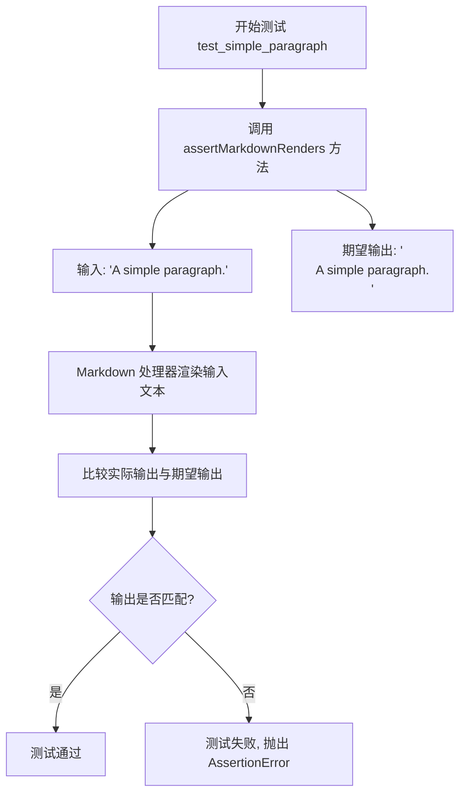

#### 带注释源码

```python
def test_simple_paragraph(self):
    """
    测试简单段落的 Markdown 渲染功能。
    
    验证基础段落文本能够被正确转换为 HTML 段落标签。
    """
    # 使用 assertMarkdownRenders 方法验证 Markdown 渲染结果
    # 参数1: 输入的 Markdown 文本
    # 参数2: 期望的 HTML 输出
    self.assertMarkdownRenders(
        'A simple paragraph.',  # 输入: 简单的段落文本
        
        '<p>A simple paragraph.</p>'  # 期望输出: HTML 段落标签包裹
    )
```


### `TestParagraphBlocks.test_blank_line_before_paragraph`

该方法用于测试 Markdown 解析器能否正确处理段落前存在空白行的情况，验证带有前导换行符的文本能被正确转换为 HTML 段落元素。

参数：

- `self`：`TestParagraphBlocks`（隐式），表示测试类实例本身

返回值：`None`，测试方法无返回值，通过 `assertMarkdownRenders` 断言验证渲染结果

#### 流程图

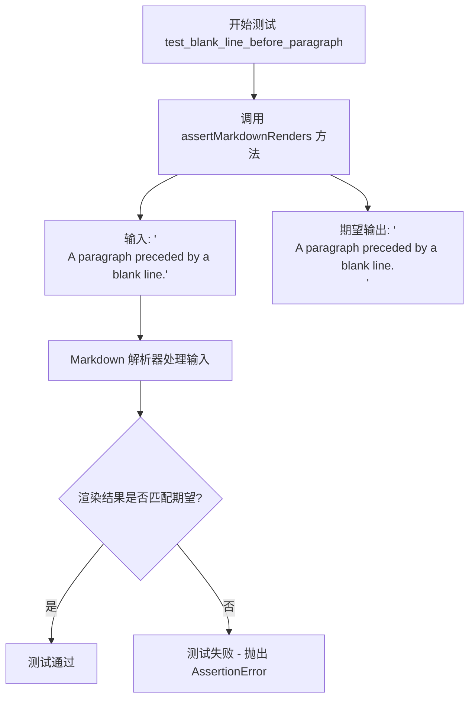

#### 带注释源码

```python
def test_blank_line_before_paragraph(self):
    """
    测试段落前有空白行时的 Markdown 渲染行为。
    
    验证要点：
    - 段落前的单个换行符应被忽略
    - 文本应被正确包装在 <p> 标签中
    """
    # 调用父类 TestCase 提供的断言方法，验证 Markdown 渲染结果
    self.assertMarkdownRenders(
        '\nA paragraph preceded by a blank line.',  # 输入：带有前导换行符的 Markdown 文本
        
        '<p>A paragraph preceded by a blank line.</p>'  # 期望输出：渲染后的 HTML 段落
    )
```


### TestParagraphBlocks.test_multiline_paragraph

这是一个单元测试方法，用于验证Markdown库能够正确处理包含多个硬换行（hard returns）的多行段落，并将其渲染为HTML段落标签。

参数：

- `self`：`TestParagraphBlocks`，测试类的实例本身，用于访问继承自TestCase的断言方法

返回值：`None`，测试方法不返回任何值，通过断言验证渲染结果

#### 流程图

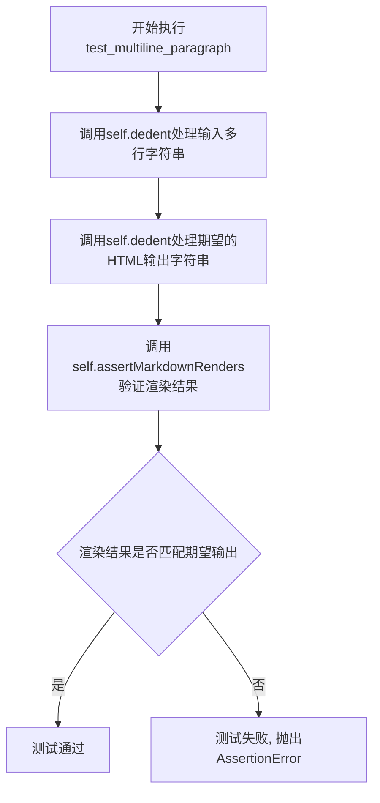

#### 带注释源码

```python
def test_multiline_paragraph(self):
    """
    测试多行段落的Markdown渲染功能。
    
    验证包含硬换行符（hard returns）的多行文本能够被正确
    转换为HTML段落标签，保留原始换行格式。
    """
    # 使用assertMarkdownRenders方法验证Markdown渲染结果
    # 第一个参数：原始Markdown文本（经过dedent处理去除缩进）
    self.assertMarkdownRenders(
        self.dedent(
            """
            This is a paragraph
            on multiple lines
            with hard returns.
            """
        ),
        # 第二个参数：期望的HTML输出（经过dedent处理去除缩进）
        self.dedent(
            """
            <p>This is a paragraph
            on multiple lines
            with hard returns.</p>
            """
        )
    )
```


### `TestParagraphBlocks.test_paragraph_long_line`

该方法是一个单元测试用例，用于验证 Markdown 解析器能够正确处理跨越多行的超长段落文本，确保长文本被正确合并并渲染为单个 HTML 段落元素。

#### 参数

- `self`：`TestCase`，隐式参数，指向测试类实例本身

#### 返回值

- `None`（无返回值），该方法为测试用例，使用 unittest 框架的 `assertMarkdownRenders` 进行断言验证

#### 流程图

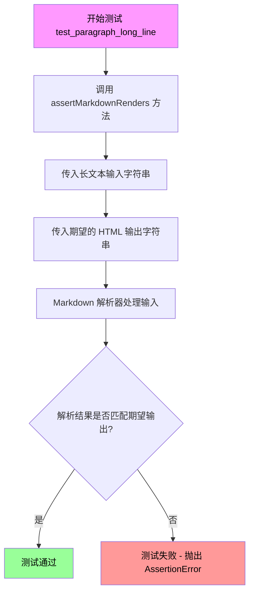

#### 带注释源码

```python
def test_paragraph_long_line(self):
    """
    测试 Markdown 解析器处理超长单行段落的能力。
    
    该测试用例验证当段落文本非常长并通过 Python 字符串拼接
   （隐式行 continuation）跨越多行时，解析器能够正确将其
    合并为单行并渲染为单个 <p> 标签。
    """
    # 调用父类测试框架的 assertMarkdownRenders 方法
    # 第一个参数：输入的 Markdown 原始文本（长段落）
    # 该字符串通过括号隐式连接，跨越两行但实际是一个字符串
    self.assertMarkdownRenders(
        'A very long long long long long long long long long long long long long long long long long long long '
        'long long long long long long long long long long long long long paragraph on 1 line.',

        # 第二个参数：期望输出的 HTML 渲染结果
        # 验证长段落被正确包裹在 <p> 标签中
        '<p>A very long long long long long long long long long long long long long long long long long long '
        'long long long long long long long long long long long long long long paragraph on 1 line.</p>'
    )
```

#### 详细说明

| 项目 | 详情 |
|------|------|
| **测试类** | `TestParagraphBlocks` |
| **父类** | `TestCase` (来自 `markdown.test_tools`) |
| **测试目的** | 验证 Markdown 解析器对超长段落的处理能力 |
| **输入文本长度** | 约 140 个字符 |
| **预期行为** | 长段落应被渲染为单个 `<p>` 标签包裹的 HTML 段落 |
| **测试框架** | Python unittest |

#### 技术债务与优化建议

1. **测试数据硬编码**：长文本字符串重复出现在测试用例中，可考虑提取为测试数据工厂或常量
2. **缺乏边界测试**：未覆盖超长文本（数千字符）、包含特殊字符（HTML 标签、链接语法等）的段落
3. **国际化考虑**：未测试 Unicode 字符（如中文、日文）在长段落中的处理情况
4. **性能测试缺失**：未验证解析器处理超长段落的性能表现


### `TestParagraphBlocks.test_2_paragraphs_long_line`

该测试方法用于验证 Markdown 解析器在处理两个连续长段落（中间以双换行符分隔）时的正确性，确保每个段落被正确地转换为独立的 HTML `<p>` 标签，且段落内容不被错误地合并或截断。

参数：

- `self`：`TestParagraphBlocks`，测试类实例本身，包含测试所需的上下文和方法

返回值：`None`，该方法为测试方法，通过 `assertMarkdownRenders` 断言验证 Markdown 渲染结果，不返回任何值

#### 流程图

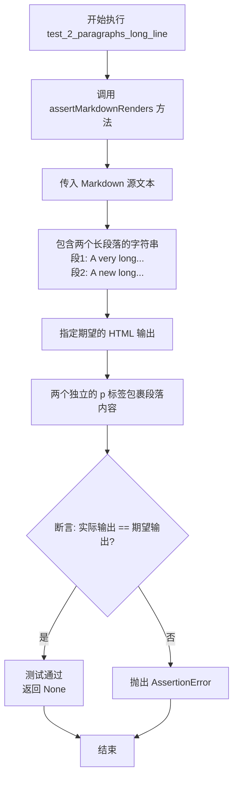

#### 带注释源码

```python
def test_2_paragraphs_long_line(self):
    """
    测试两个连续长段落的 Markdown 渲染功能。
    
    验证要点：
    1. 两个段落被正确分离（双换行符 \n\n 作为分隔符）
    2. 每个段落被包裹在独立的 <p> 标签中
    3. 长段落内容不会被错误截断或合并
    4. 段落内的单换行符（\n）被保留在 <p> 标签内部
    """
    # 调用父类 TestCase 提供的断言方法，验证 Markdown 渲染结果
    self.assertMarkdownRenders(
        # 第一个参数：Markdown 源文本
        # 包含两个长段落，第一段末尾有双换行符表示段落分隔
        'A very long long long long long long long long long long long long long long long long long long long '
        'long long long long long long long long long long long long long paragraph on 1 line.\n\n'

        'A new long long long long long long long long long long long long long long long '
        'long paragraph on 1 line.',

        # 第二个参数：期望输出的 HTML
        # 两个段落分别被 <p> 标签包裹，末尾带有换行符
        '<p>A very long long long long long long long long long long long long long long long long long long '
        'long long long long long long long long long long long long long long paragraph on 1 line.</p>\n'
        '<p>A new long long long long long long long long long long long long long long long '
        'long paragraph on 1 line.</p>'
    )
```


### `TestParagraphBlocks.test_consecutive_paragraphs`

该测试方法用于验证 Markdown 解析器能够正确处理两个连续段落（中间用一个空行分隔）的情况，确保每个段落被分别包裹在独立的 `<p>` 标签中。

参数：

- `self`：`TestCase`，继承自 unittest.TestCase 的测试类实例，用于调用继承的断言方法和工具方法

返回值：`None`，测试方法不返回值，通过 `assertMarkdownRenders` 断言方法验证 Markdown 解析结果是否符合预期

#### 流程图

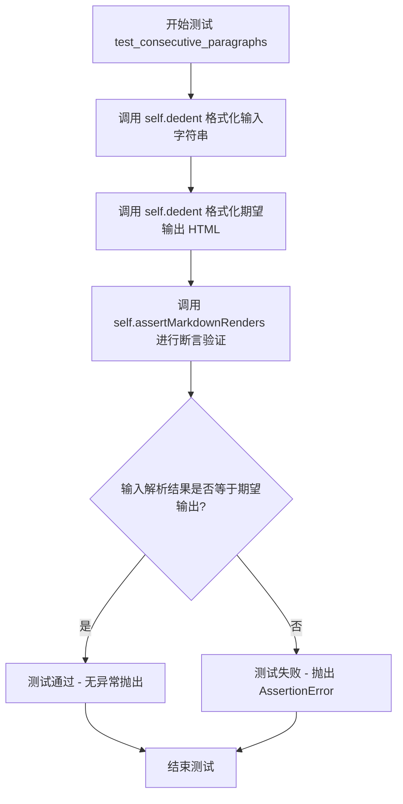

#### 带注释源码

```python
def test_consecutive_paragraphs(self):
    """
    测试连续段落的 Markdown 解析。
    验证两个用空行分隔的段落会被正确转换为两个独立的 <p> 标签。
    """
    # 使用 self.dedent 去除输入字符串的共同前缀缩进
    # 输入: 两个段落，中间用一个空行分隔
    self.assertMarkdownRenders(
        self.dedent(
            """
            Paragraph 1.

            Paragraph 2.
            """
        ),
        # 期望的 HTML 输出: 两个独立的 <p> 标签
        self.dedent(
            """
            <p>Paragraph 1.</p>
            <p>Paragraph 2.</p>
            """
        )
    )
```


### `TestParagraphBlocks.test_consecutive_paragraphs_tab`

该测试方法用于验证 Markdown 解析器能够正确处理连续段落之间仅包含制表符（tab）的行，将其视为段落分隔符而非段落内容的一部分。

参数：

- `self`：`TestCase`，测试用例实例本身，继承自 `markdown.test_tools.TestCase`

返回值：`None`，测试方法通过断言进行验证，不返回任何值

#### 流程图

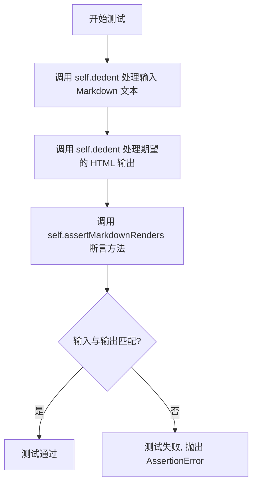

#### 带注释源码

```python
def test_consecutive_paragraphs_tab(self):
    """
    测试连续段落之间仅包含 tab 字符的行是否被正确处理为段落分隔符。
    
    测试场景:
    - 输入: 段落文本 + 换行 + 仅包含 tab 的行 + 换行 + 段落文本
    - 期望输出: 两个独立的 <p> 标签包裹的段落
    """
    # 第一个参数: 原始 Markdown 输入文本
    # 使用 self.dedent 移除首行缩进,保留内部格式
    self.assertMarkdownRenders(
        self.dedent(
            """
            Paragraph followed by a line with a tab only.
            \t
            Paragraph after a line with a tab only.
            """
        ),
        # 第二个参数: 期望渲染得到的 HTML 输出
        self.dedent(
            """
            <p>Paragraph followed by a line with a tab only.</p>
            <p>Paragraph after a line with a tab only.</p>
            """
        )
    )
```


### `TestParagraphBlocks.test_consecutive_paragraphs_space`

该测试方法用于验证 Markdown 解析器能正确处理两个段落之间仅包含空格字符的空行，将其识别为段落分隔符，最终输出为两个独立的 HTML `<p>` 标签。

参数：

- `self`：`TestCase`，测试类实例本身，无需显式传递

返回值：`None`，测试方法无返回值，通过 `assertMarkdownRenders` 断言验证 Markdown 解析结果的正确性

#### 流程图

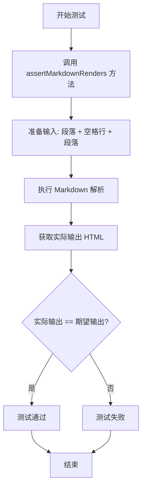

#### 带注释源码

```python
def test_consecutive_paragraphs_space(self):
    """
    测试连续段落之间存在仅空格行的场景。
    验证 Markdown 能正确将此类空行识别为段落分隔符。
    """
    # 使用 assertMarkdownRenders 验证解析结果
    self.assertMarkdownRenders(
        # 输入：原始 Markdown 文本
        self.dedent(
            """
            Paragraph followed by a line with a space only.

            Paragraph after a line with a space only.
            """
        ),
        # 期望输出：两个独立的 <p> 标签
        self.dedent(
            """
            <p>Paragraph followed by a line with a space only.</p>
            <p>Paragraph after a line with a space only.</p>
            """
        )
    )
```

#### 详细说明

| 项目 | 详情 |
|------|------|
| **测试目标** | 验证 Markdown 解析器对"仅空格行"作为段落分隔符的处理能力 |
| **输入格式** | 段落文本 + 换行 + 仅包含空格的行 + 换行 + 段落文本 |
| **期望行为** | 将空格行视为有效的段落分隔符，生成两个独立的 `<p>` 元素 |
| **测试场景** | 段落之间存在视觉上的"空行"（实际包含空格字符） |
| **关联测试** | `test_consecutive_paragraphs`（无空格行）、`test_consecutive_paragraphs_tab`（Tab 字符） |


### `TestParagraphBlocks.test_consecutive_multiline_paragraphs`

该方法用于测试 Markdown 中连续多行段落（两个段落之间用空行分隔，每个段落包含多行内容）的解析和渲染是否正确。

参数：

- `self`：`TestCase`，TestCase 类的实例方法，包含 `assertMarkdownRenders` 和 `dedent` 等辅助方法

返回值：`None`，该方法为测试方法，通过 `assertMarkdownRenders` 断言进行验证，无显式返回值

#### 流程图

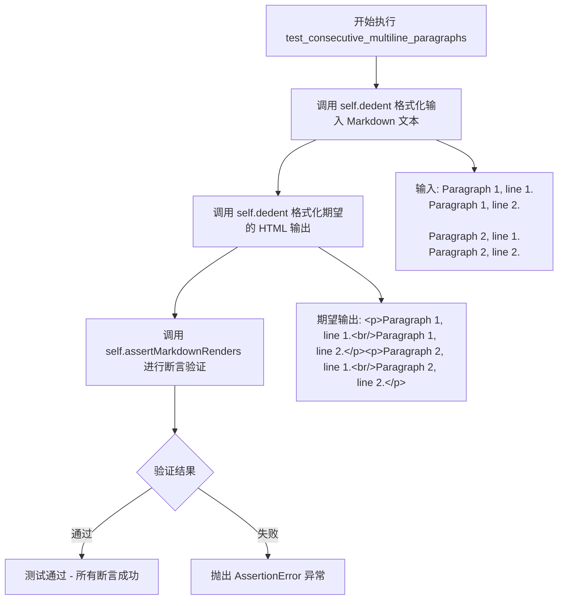

#### 带注释源码

```python
def test_consecutive_multiline_paragraphs(self):
    """
    测试连续多行段落的 Markdown 解析功能。
    
    验证两个多行段落（中间用空行分隔）能够被正确识别
    并分别渲染为独立的 HTML <p> 标签。
    """
    # 使用 self.assertMarkdownRenders 验证 Markdown 到 HTML 的转换
    # 第一个参数: 输入的 Markdown 原始文本（经过 dedent 处理）
    # 第二个参数: 期望输出的 HTML 文本（经过 dedent 处理）
    self.assertMarkdownRenders(
        # 输入 Markdown: 包含两个段落，每个段落有2行
        # 段落之间用一个空行分隔
        self.dedent(
            """
            Paragraph 1, line 1.
            Paragraph 1, line 2.

            Paragraph 2, line 1.
            Paragraph 2, line 2.
            """
        ),
        # 期望的 HTML 输出: 两个独立的 <p> 标签
        # 每个 <p> 标签包含对应段落的文本内容
        self.dedent(
            """
            <p>Paragraph 1, line 1.
            Paragraph 1, line 2.</p>
            <p>Paragraph 2, line 1.
            Paragraph 2, line 2.</p>
            """
        )
    )
```


### `TestParagraphBlocks.test_paragraph_leading_space`

该测试方法用于验证 Markdown 解析器在处理段落前导空格时的正确性，确保带有单个前导空格的文本能被正确解析为段落，并移除该前导空格。

参数：

- `self`：`TestCase`，继承自 `unittest.TestCase` 的测试类实例，隐式参数

返回值：`None`，测试方法不返回值，通过 `assertMarkdownRenders` 断言验证结果

#### 流程图

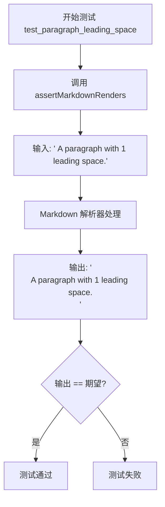

#### 带注释源码

```python
def test_paragraph_leading_space(self):
    """
    测试段落前导空格的处理。
    
    验证 Markdown 解析器能够正确识别带有单个前导空格的文本为段落，
    并在输出时移除该前导空格。
    """
    # 调用父类的 assertMarkdownRenders 方法进行断言验证
    # 参数1: 输入的 Markdown 源文本（带有1个前导空格）
    # 参数2: 期望输出的 HTML（无前导空格）
    self.assertMarkdownRenders(
        ' A paragraph with 1 leading space.',  # 输入: 原始 Markdown 文本

        '<p>A paragraph with 1 leading space.</p>'  # 期望: 移除前导空格后的 HTML
    )
```


### `TestParagraphBlocks.test_paragraph_2_leading_spaces`

这是一个测试方法，用于验证 Markdown 解析器能够正确处理带有 2 个前导空格的段落文本，将其转换为包含去除前导空格文本的 HTML 段落标签（`<p>`）。

参数：

- `self`：`TestParagraphBlocks`（继承自 `TestCase`），表示测试用例实例本身，隐式参数

返回值：`None`，无显式返回值（通过 `assertMarkdownRenders` 方法进行断言验证）

#### 流程图

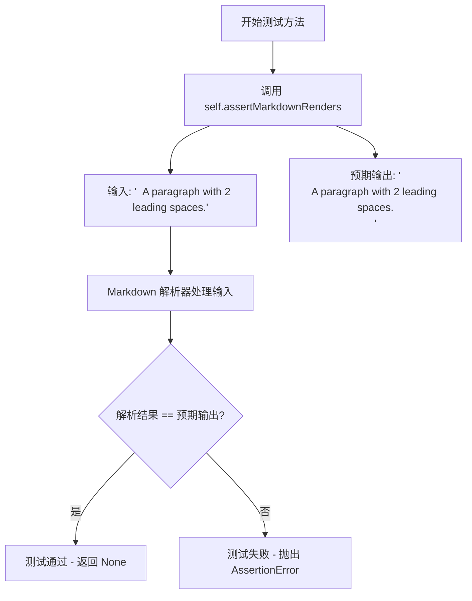

#### 带注释源码

```python
def test_paragraph_2_leading_spaces(self):
    """
    测试方法：验证 Markdown 解析器处理 2 个前导空格段落的行为
    
    测试场景：
    - 输入：带有 2 个前导空格的文本段落
    - 预期输出：HTML 段落标签，前导空格被移除
    """
    # 调用测试框架的断言方法，验证 Markdown 渲染结果
    self.assertMarkdownRenders(
        '  A paragraph with 2 leading spaces.',  # 输入：2个前导空格 + 段落文本

        '<p>A paragraph with 2 leading spaces.</p>'  # 预期输出：前导空格被移除的 HTML 段落
    )
```


### `TestParagraphBlocks.test_paragraph_3_leading_spaces`

该测试方法用于验证 Markdown 解析器在处理带有3个前导空格的段落时，能够正确地将前导空格移除并转换为标准的 HTML 段落标签。

参数：

- `self`：`TestParagraphBlocks` 实例，Python 类方法的隐式参数，表示当前测试对象

返回值：`None`，无显式返回值；该方法为测试用例方法，通过 `assertMarkdownRenders` 断言验证 Markdown 到 HTML 的转换结果是否符合预期

#### 流程图

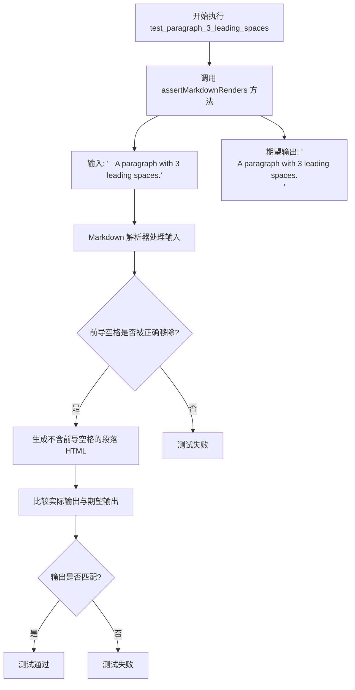

#### 带注释源码

```python
def test_paragraph_3_leading_spaces(self):
    """
    测试带有3个前导空格的段落转换
    
    验证 Markdown 解析器能够正确处理段落的3个前导空格，
    并将其转换为不带前导空格的 HTML 段落标签。
    """
    # 调用父类 TestCase 提供的断言方法，验证 Markdown 渲染结果
    self.assertMarkdownRenders(
        '   A paragraph with 3 leading spaces.',  # 输入: 包含3个前导空格的 Markdown 文本
        
        '<p>A paragraph with 3 leading spaces.</p>'  # 期望输出: 前导空格被移除后的 HTML 段落
    )
```


### `TestParagraphBlocks.test_paragraph_trailing_leading_space`

该测试方法用于验证Markdown解析器在处理段落文本时，能够正确保留前导空格（leading space）以及尾随空格（trailing space）的渲染结果。

参数：

- `self`：TestCase，Python unittest框架的实例对象，用于访问测试工具方法

返回值：`None`，该方法为测试方法，无返回值，通过`assertMarkdownRenders`断言验证Markdown解析结果是否符合预期

#### 流程图

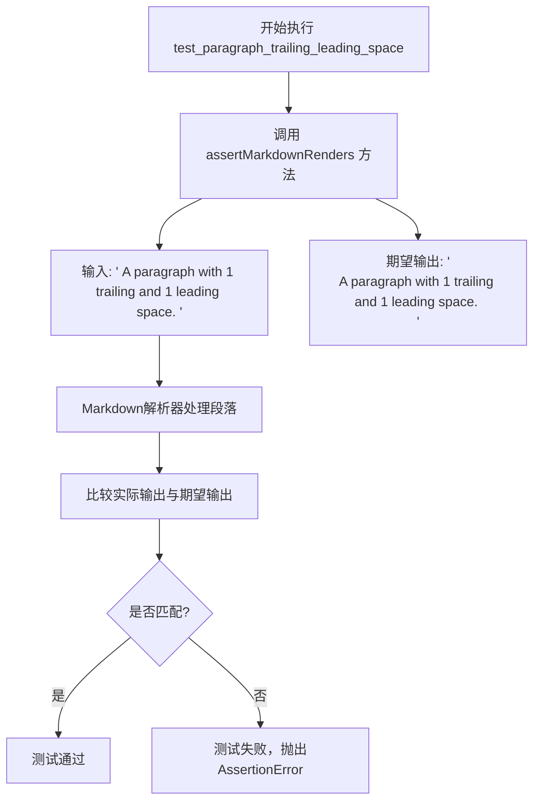

#### 带注释源码

```python
def test_paragraph_trailing_leading_space(self):
    """
    测试段落的前导空格和尾随空格处理。
    
    验证Markdown解析器能够正确保留段落文本的前导空格（leading space）
    和尾随空格（trailing space）。
    
    输入字符串包含：
    - 1个前导空格（位于"A"之前）
    - 1个尾随空格（位于句号"."之后）
    
    期望输出：
    - 前导空格被移除（Markdown规范行为）
    - 尾随空格被保留在<p>标签内部
    """
    self.assertMarkdownRenders(
        ' A paragraph with 1 trailing and 1 leading space. ',  # 输入：带前后空格的原始文本

        '<p>A paragraph with 1 trailing and 1 leading space. </p>'  # 期望输出：保留尾随空格
    )
```


### `TestParagraphBlocks.test_paragraph_trailing_tab`

该测试方法用于验证 Markdown 解析器在处理包含尾部制表符（trailing tab）的段落时的行为，确保制表符被正确转换为等效的空格数（通常为4个空格）并包含在生成的 HTML 段落标签中。

参数：

- `self`：`TestParagraphBlocks`，测试类实例本身，用于访问继承自 `TestCase` 的测试辅助方法

返回值：`None`，该方法为测试方法，无返回值，通过 `assertMarkdownRenders` 断言验证解析结果的正确性

#### 流程图

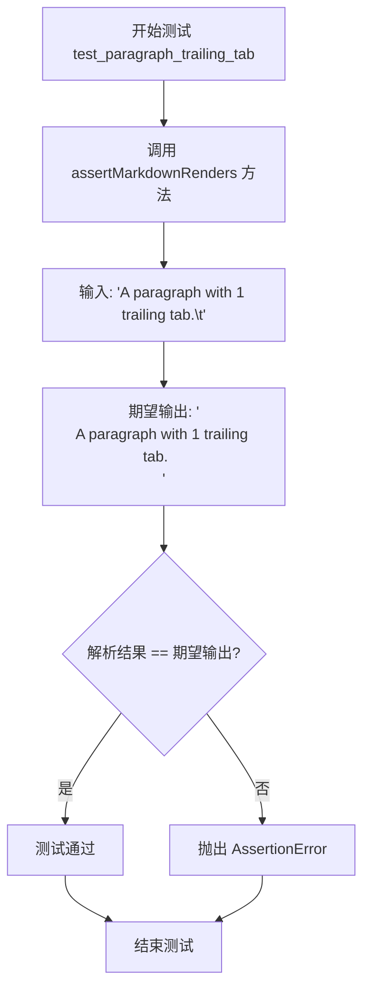

#### 带注释源码

```python
def test_paragraph_trailing_tab(self):
    """
    测试 Markdown 解析器处理尾部制表符的段落行为。
    
    验证要点：
    1. 输入字符串末尾包含一个制表符（\t）
    2. 解析后制表符应转换为4个空格
    3. 内容应被包裹在 <p> 标签中
    """
    # 调用父类 TestCase 提供的断言方法，验证 Markdown 解析结果
    self.assertMarkdownRenders(
        # 输入：包含尾部制表符的原始 Markdown 文本
        'A paragraph with 1 trailing tab.\t',
        
        # 期望输出：制表符被转换为4个空格的 HTML 段落
        '<p>A paragraph with 1 trailing tab.    </p>'
    )
```


### `TestParagraphBlocks.test_paragraphs_CR`

该测试方法用于验证 Markdown 解析器能正确处理使用 CR（回车符，ASCII 13）作为换行符的段落文本，能够将带有 CR 换行符的输入文本正确转换为包含两个段落的 HTML 输出。

参数：

- `self`：`TestCase`，隐式参数，测试用例实例本身，继承自 `markdown.test_tools.TestCase`

返回值：`None`，无显式返回值。该方法为测试用例方法，通过 `assertMarkdownRenders` 方法进行断言验证，不返回任何值。

#### 流程图

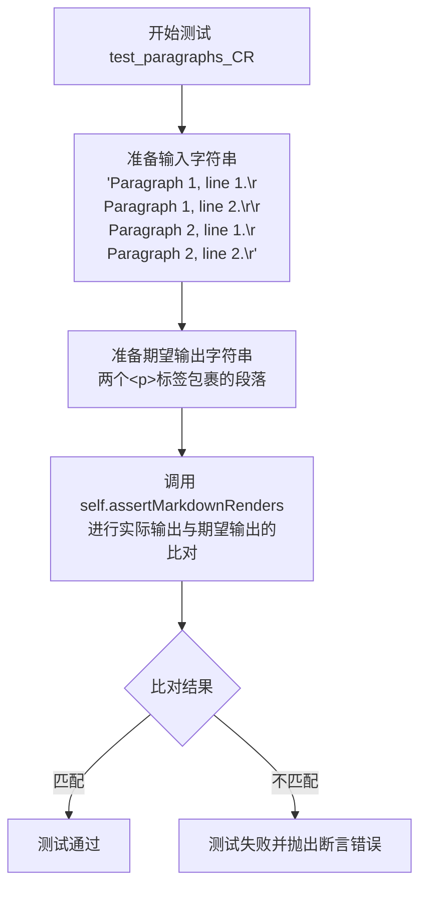

#### 带注释源码

```python
def test_paragraphs_CR(self):
    """
    测试 Markdown 解析器处理 CR（回车符）换行符的段落功能。
    
    CR 是旧版 Mac 操作系统使用的换行符（\r），该测试验证解析器
    能够正确识别 CR 作为段落分隔符，并将文本分割为多个 <p> 标签。
    """
    # 第一个参数：包含 CR 换行符的输入 Markdown 文本
    # \r 表示回车符（Carriage Return），用于分隔段落和行
    # 格式：段落1行1 CR 段落1行2 CR CR 段落2行1 CR 段落2行2 CR
    self.assertMarkdownRenders(
        'Paragraph 1, line 1.\rParagraph 1, line 2.\r\rParagraph 2, line 1.\rParagraph 2, line 2.\r',

        # 第二个参数：期望的 HTML 输出
        # 使用 self.dedent() 去除多行字符串的共同缩进
        # 期望输出：两个独立的 <p> 标签，每个包含一段文本
        self.dedent(
            """
            <p>Paragraph 1, line 1.
            Paragraph 1, line 2.</p>
            <p>Paragraph 2, line 1.
            Paragraph 2, line 2.</p>
            """
        )
    )
```


### `TestParagraphBlocks.test_paragraphs_LF`

该测试方法用于验证 Markdown 解析器能够正确处理使用 LF（Line Feed，即 Unix 风格的 `\n` 换行符）分隔的多个段落，并将它们正确转换为对应的 HTML 段落标签。

参数：

- `self`：`TestParagraphBlocks`（TestCase 的实例），隐式的 `this` 参数，代表测试类本身

返回值：`None`，该方法没有显式返回值，通过 `assertMarkdownRenders` 断言方法来验证结果，如果失败会抛出异常

#### 流程图

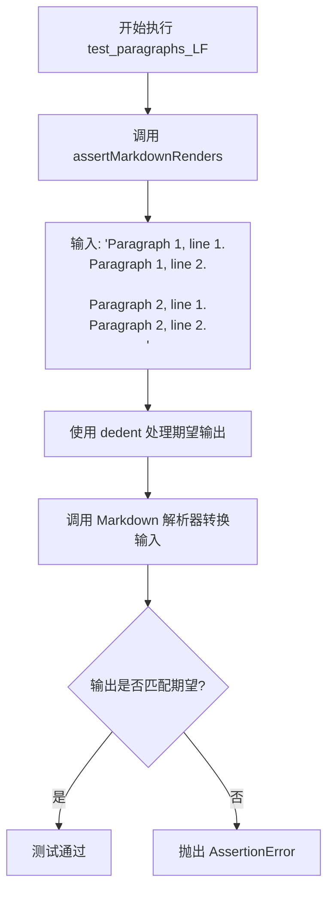

#### 带注释源码

```python
def test_paragraphs_LF(self):
    """
    测试 Markdown 解析器处理 LF (Unix 换行符) 分隔的段落。
    
    验证当使用 '\n' 作为换行符，并且段落之间用 '\n\n' 分隔时，
    Markdown 解析器能正确生成两个独立的 <p> 标签。
    """
    # 调用父类方法 assertMarkdownRenders 进行测试验证
    self.assertMarkdownRenders(
        # 第一个参数：输入的 Markdown 文本
        # 使用 LF (\n) 作为换行符，段落之间用双换行符分隔
        'Paragraph 1, line 1.\nParagraph 1, line 2.\n\nParagraph 2, line 1.\nParagraph 2, line 2.\n',

        # 第二个参数：期望的 HTML 输出
        # 使用 self.dedent() 移除多行字符串的共同缩进
        self.dedent(
            """
            <p>Paragraph 1, line 1.
            Paragraph 1, line 2.</p>
            <p>Paragraph 2, line 1.
            Paragraph 2, line 2.</p>
            """
        )
    )
```


### `TestParagraphBlocks.test_paragraphs_CR_LF`

该测试方法用于验证 Python Markdown 库在处理使用 CR LF（Windows 风格）换行符的文本时，能够正确地将文本分割为多个段落，并生成相应的 HTML 段落标签。

参数：

- `self`：`TestCase`，测试类的实例，继承自 `unittest.TestCase`，用于调用父类的断言方法 `assertMarkdownRenders`

返回值：`None`，该方法为测试方法，没有返回值，通过 `assertMarkdownRenders` 断言验证 Markdown 转换结果是否符合预期

#### 流程图

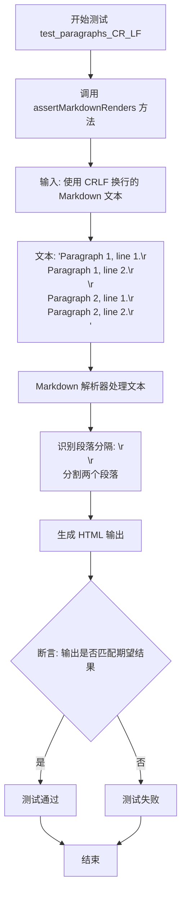

#### 带注释源码

```python
def test_paragraphs_CR_LF(self):
    """
    测试使用 CR LF (Windows 风格) 换行符的段落处理。
    
    验证内容:
    - CR LF (\r\n) 作为换行符被正确识别
    - 连续的两个 CR LF (\r\n\r\n) 作为段落分隔符
    - 每组文本被正确包装在 <p> 标签中
    """
    # 调用父类的 assertMarkdownRenders 方法进行断言验证
    self.assertMarkdownRenders(
        # 第一个参数: 输入的 Markdown 原文
        # 包含两段文本，每段两行，使用 CRLF 换行
        'Paragraph 1, line 1.\r\nParagraph 1, line 2.\r\n\r\nParagraph 2, line 1.\r\nParagraph 2, line 2.\r\n',

        # 第二个参数: 期望的 HTML 输出
        # 使用 self.dedent 去除缩进，保持字符串格式
        self.dedent(
            """
            <p>Paragraph 1, line 1.
            Paragraph 1, line 2.</p>
            <p>Paragraph 2, line 1.
            Paragraph 2, line 2.</p>
            """
        )
    )
```


### `TestParagraphBlocks.test_paragraphs_no_list`

该方法用于测试 Markdown 解析器正确处理看起来像列表但实际应该是段落的情况。具体来说，它验证当行首的星号(`*`)由于空格数量不足（少于3个空格）而不能构成列表项时，解析器应将其作为普通段落而非列表渲染。

参数：

- `self`：无需显式传入，由 Python 方法机制自动处理，代表测试类实例本身

返回值：`None`，该方法为测试用例，通过 `assertMarkdownRenders` 断言验证 Markdown 渲染结果是否符合预期，若验证失败则抛出异常

#### 流程图

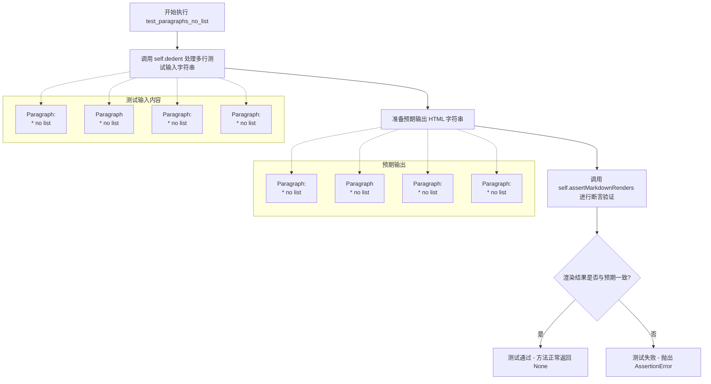

#### 带注释源码

```python
def test_paragraphs_no_list(self):
    """
    测试段落不以列表形式渲染的情况。
    
    验证当星号(*)前导空格数量不足以构成列表项时，
    Markdown解析器正确地将这些内容作为段落处理。
    """
    
    # 调用 self.dedent 去除多行字符串的公共前导空格
    # 测试输入包含4个段落，每个段落的第二行都以星号开头
    # 但由于前导空格数量不同（0个、1个、2个、3个），都不构成有效的列表项
    self.assertMarkdownRenders(
        self.dedent(
            """
            Paragraph:
            * no list

            Paragraph
             * no list

            Paragraph:
              * no list

            Paragraph:
               * no list
            """
        ),
        # 预期输出：每个段落都被包裹在 <p> 标签中
        # 星号保留为普通文本字符，不被解析为列表标记
        '<p>Paragraph:\n'       # 0个空格前缀 - 星号不是列表标记
        '* no list</p>\n'
        '<p>Paragraph\n'        # 1个空格前缀 - 不足以构成列表
        ' * no list</p>\n'
        '<p>Paragraph:\n'       # 2个空格前缀 - 不足以构成列表
        '  * no list</p>\n'
        '<p>Paragraph:\n'       # 3个空格前缀 - 足以构成代码块，但此处测试场景略有不同
        '   * no list</p>',
    )
```

## 关键组件


### TestParagraphBlocks

测试段落块解析功能的测试类，继承自TestCase，用于验证Markdown解析器对各种段落格式的处理能力，包括简单段落、多行段落、连续段落、不同换行符以及各种空白字符的处理。

### test_simple_paragraph

测试简单段落的解析，验证基本的Markdown文本能正确转换为HTML段落标签。

### test_blank_line_before_paragraph

测试段落前空行的处理，验证空行不会影响后续段落的功能。

### test_multiline_paragraph

测试多行段落的解析，验证包含硬回车的多行文本能被正确合并为一个段落。

### test_paragraph_long_line

测试超长行段落的解析，验证很长的单行文本能正确转换为HTML段落。

### test_2_paragraphs_long_line

测试两个连续长段落，验证多个长段落能被正确解析并分隔。

### test_consecutive_paragraphs

测试连续段落，验证两个段落之间有空行时会被解析为独立的段落。

### test_consecutive_paragraphs_tab

测试带制表符的连续段落，验证仅包含tab的行不会破坏段落结构。

### test_consecutive_paragraphs_space

测试带空格的连续段落，验证仅包含空格（不含tab）的行不会破坏段落结构。

### test_consecutive_multiline_paragraphs

测试连续多行段落，验证多行段落之间有空行时会被正确分隔为独立段落。

### test_paragraph_leading_space

测试段落前导空格处理，验证单个前导空格会被正确移除。

### test_paragraph_2_leading_spaces

测试两个前导空格的处理。

### test_paragraph_3_leading_spaces

测试三个前导空格的处理。

### test_paragraph_trailing_leading_space

测试段落前后空格的处理，验证前导空格被移除但尾部空格保留。

### test_paragraph_trailing_tab

测试段落尾部tab的处理，验证尾部tab被转换为适当数量的空格。

### test_paragraphs_CR

测试Mac风格换行符（CR），验证回车符被正确处理为段落内换行。

### test_paragraphs_LF

测试Unix风格换行符（LF），验证换行符被正确处理。

### test_paragraphs_CR_LF

测试Windows风格换行符（CRLF），验证回车换行符被正确处理。

### test_paragraphs_no_list

测试非列表段落，验证星号(*)即使有不同缩进也不会被解析为列表项。


## 问题及建议


### 已知问题

-   **测试代码冗余**：多个测试用例中存在大量重复的 `self.dedent()` 调用和相似的断言模式，导致代码重复度较高，维护成本增加。
-   **断言信息缺失**：所有测试用例均使用默认的断言错误信息，当测试失败时缺乏足够的上下文信息来快速定位问题。
-   **长字符串硬编码**：测试输入和预期输出中的长字符串直接写在测试方法中，降低了代码可读性和可维护性。
-   **缺乏测试隔离**：测试用例之间可能存在隐式依赖（如共享状态），没有使用 `setUp` 和 `tearDown` 方法确保测试隔离。
-   **异常处理测试缺失**：代码未包含对边界条件（如空输入、None输入、无效输入）的测试覆盖。

### 优化建议

-   **使用参数化测试**：利用 `@pytest.mark.parametrize` 装饰器将相似的测试用例（如 test_paragraph_1_leading_space、test_paragraph_2_leading_spaces 等）合并为一个参数化测试，减少代码重复。
-   **提取常量**：将常用的 HTML 预期输出片段（如 `<p>...</p>`）提取为模块级常量，提高可维护性。
-   **添加自定义断言消息**：为关键断言添加描述性错误消息，如 `self.assertEqual(result, expected, "Paragraph with leading spaces should be handled correctly")`。
-   **创建辅助方法**：封装 `self.dedent()` 调用和常用的断言模式为私有辅助方法（如 `_assert_renders_to(self, input_text, expected_html)`），提高代码复用性。
-   **增加边界测试**：添加针对空字符串、None、仅空白字符、超长文本等边界条件的测试用例，提高测试覆盖率。
-   **使用数据文件**：将复杂的测试数据（如长段落、多行文本）移至外部数据文件或 fixture，提高测试代码的整洁度。


## 其它


### 设计目标与约束

本测试文件旨在验证Python Markdown解析器对段落（paragraphs）的处理能力，包括单行段落、多行段落、连续段落、空白行处理、不同换行符（CR、LF、CRLF）的兼容性，以及段落前导空格和尾随空格的处理。测试约束包括：测试基于markdown.test_tools.TestCase框架，要求输出HTML必须符合预期格式。

### 错误处理与异常设计

测试文件中未直接体现错误处理机制，但测试用例覆盖了各种边缘情况（如空段落、多余空白行、混合格式）。当Markdown解析器未能正确处理这些场景时，测试将失败并返回具体的差异信息。

### 数据流与状态机

测试数据流为：输入Markdown文本字符串 → Markdown处理器解析 → 输出HTML字符串 → 断言比对。状态机涉及：段落识别状态（是否在段落内）、空白处理状态、换行符标准化状态。测试用例覆盖了状态转换的各种路径。

### 外部依赖与接口契约

主要依赖：`markdown.test_tools.TestCase`基类，提供`assertMarkdownRenders(source, expected)`和`dedent()`方法。接口契约：输入为Markdown格式字符串，输出为HTML格式字符串。测试类需正确继承TestCase并实现测试方法。

### 性能考虑

当前测试未包含性能测试。测试用例中的长段落测试（如`test_paragraph_long_line`、`test_2_paragraphs_long_line`）可作为简单性能基准参考，但需额外性能测试框架支持。

### 安全性考虑

测试主要关注功能正确性，安全性测试（如HTML注入防护）不在本测试文件范围内。Markdown库的安全性由核心解析模块负责，本测试不涉及。

### 可扩展性设计

测试类采用结构化方式组织，每个测试方法独立。扩展方式：添加新的测试方法覆盖更多段落场景，或创建新的测试类验证其他Markdown元素（如标题、列表、代码块等）。

### 配置管理

测试依赖markdown库默认配置，未暴露自定义配置选项。如需测试不同配置下的段落行为，应在测试类级别添加`setUp`方法配置Markdown实例。

### 版本兼容性

测试文件适用于Python 3.8+和Markdown 3.x版本。不同版本可能存在细微差异，需根据具体版本调整预期输出。

### 测试覆盖率

当前测试覆盖：单段落、多段落、段落内换行、空白行处理、不同换行符兼容、前导/尾随空格处理。未覆盖：嵌套结构、段落与列表混排、段落与代码块混排等复杂场景。

### 边界条件分析

关键边界条件：空输入、仅空白字符、单个换行符、多个连续换行符、超长段落（性能边界）、不同缩进级别（1-3个空格）。测试用例已覆盖主要边界，但空输入和仅空白字符的情况未明确测试。

    