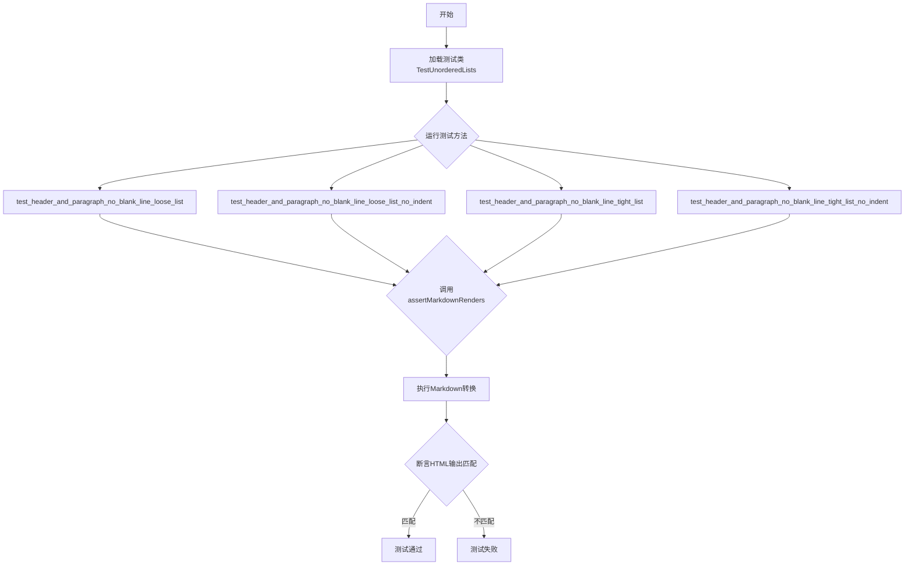
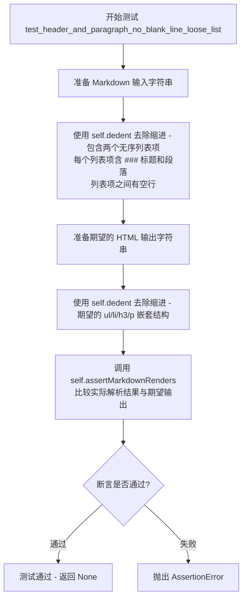
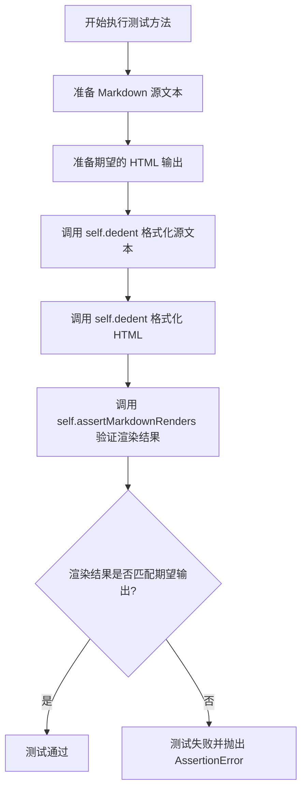
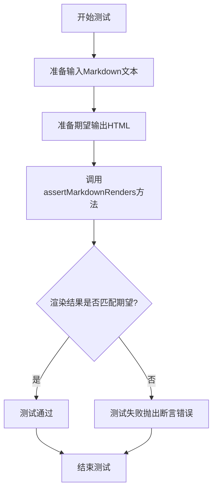
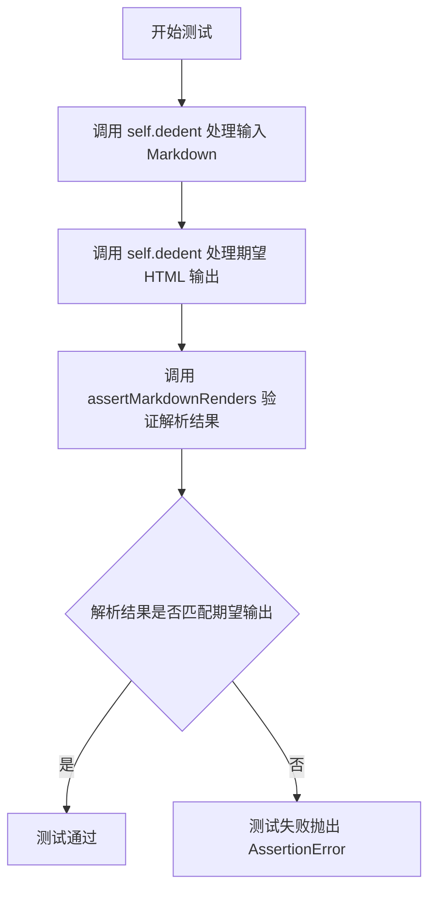
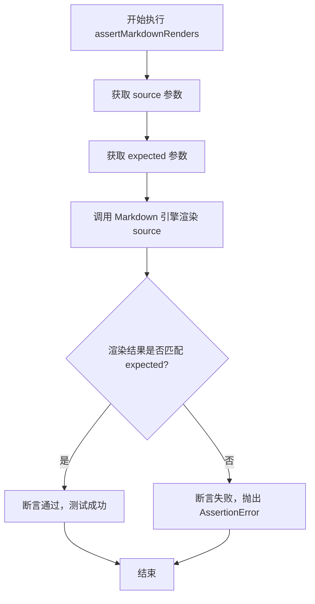
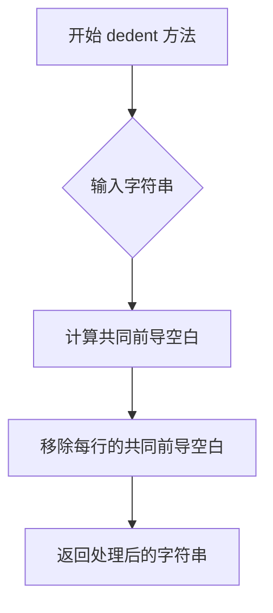

# `markdown\tests\test_syntax\blocks\test_ul.py` 详细设计文档

这是一个Python Markdown项目的测试文件，用于测试无序列表中包含标题和段落时的渲染行为，特别是验证在没有空行的情况下，松散列表和紧凑列表的HTML输出是否符合预期。

## 整体流程



## 类结构

```
TestCase (markdown.test_tools.TestCase)
└── TestUnorderedLists
```

## 全局变量及字段


    

## 全局函数及方法


### `TestUnorderedLists.test_header_and_paragraph_no_blank_line_loose_list`

该测试方法用于验证 Markdown 解析器能够正确处理无序列表中包含标题（`###`）和段落、且列表项之间没有空行的"宽松列表"（loose list）场景。测试用例包含两个列表项，每个列表项都有一个三级标题和一段文本，预期输出为正确的 HTML `<ul>/<li>/<h3>/<p>` 嵌套结构。

参数：
- 该方法无显式参数（`self` 为 Python 实例方法的隐式参数，无需列出）

返回值：`None`，测试方法通过 `self.assertMarkdownRenders` 进行断言验证，不返回具体值

#### 流程图



#### 带注释源码

```python
def test_header_and_paragraph_no_blank_line_loose_list(self):
    """
    测试 Markdown 解析器处理无序列表中包含标题和段落的能力。
    
    测试场景：
    - 无序列表项以 "- " 开头
    - 列表项内容为三级标题 ### List N
    - 标题后跟段落文本 Entry N.N
    - 列表项之间有空行（构成 loose list）
    
    验证解析结果生成正确的 HTML 结构：
    - <ul> 根元素
    - <li> 列表项元素包裹内容
    - <h3> 标题元素
    - <p> 段落元素
    """
    # 调用 assertMarkdownRenders 验证解析功能
    # 第一个参数：输入的 Markdown 文本
    # 第二个参数：期望输出的 HTML 文本
    self.assertMarkdownRenders(
        # 使用 self.dedent 规范化 Markdown 输入字符串的缩进
        self.dedent(
            """
            - ### List 1
                Entry 1.1

            - ### List 2
                Entry 2.1
            """
        ),
        # 使用 self.dedent 规范化期望的 HTML 输出字符串的缩进
        self.dedent(
            """
            <ul>
            <li>
            <h3>List 1</h3>
            <p>Entry 1.1</p>
            </li>
            <li>
            <h3>List 2</h3>
            <p>Entry 2.1</p>
            </li>
            </ul>
            """
        )
    )
    # 测试方法无显式返回值，默认返回 None
```


### `TestUnorderedLists.test_header_and_paragraph_no_blank_line_loose_list_no_indent`

该方法是 Python Markdown 库的单元测试用例，用于测试无序列表中标题和段落在无缩进且无空行情况下的松散列表渲染行为，验证 Markdown 解析器能否正确将包含标题的列表项转换为 HTML 结构。

参数：

- `self`：`TestUnorderedLists`，测试类实例本身，包含测试所需的上下文和方法

返回值：`None`，该方法为测试用例，通过 `assertMarkdownRenders` 断言验证渲染结果，不返回具体值

#### 流程图



#### 带注释源码

```python
def test_header_and_paragraph_no_blank_line_loose_list_no_indent(self):
    """
    测试无序列表中标题和段落在无缩进、无空行情况下的松散列表渲染。
    
    此测试用例验证以下 Markdown 源码的渲染行为：
    - ### List 1
    Entry 1.1

    - ### List 2
    Entry 2.1
    
    期望输出为包含标题 h3 和段落 p 的 HTML 无序列表结构。
    """
    # 使用 assertMarkdownRenders 方法验证 Markdown 到 HTML 的转换
    self.assertMarkdownRenders(
        # 第一个参数：原始 Markdown 源码（经过 self.dedent 格式化去除缩进）
        self.dedent(
            """
            - ### List 1
            Entry 1.1

            - ### List 2
            Entry 2.1
            """
        ),
        # 第二个参数：期望的 HTML 输出（经过 self.dedent 格式化）
        self.dedent(
            """
            <ul>
            <li>
            <h3>List 1</h3>
            <p>Entry 1.1</p>
            </li>
            <li>
            <h3>List 2</h3>
            <p>Entry 2.1</p>
            </li>
            </ul>
            """
        )
    )
```


### `TestUnorderedLists.test_header_and_paragraph_no_blank_line_tight_list`

该测试方法用于验证在无空行的情况下，带有标题和段子的紧密列表（tight list）的 Markdown 渲染行为是否符合预期。测试检查当列表项中包含标题（`###`）后直接跟段落内容且列表项之间无空行分隔时，生成的 HTML 输出是否正确。

参数：

- `self`：`TestCase`，继承的测试用例实例，用于调用断言方法和工具函数

返回值：`None`，测试方法无返回值，通过 `self.assertMarkdownRenders` 进行断言验证

#### 流程图



#### 带注释源码

```python
# 使用@unittest.skip装饰器跳过此测试
# 原因：当前Python-Markdown的行为与宽松列表行为相同
@unittest.skip('This behaves as a loose list in Python-Markdown')
def test_header_and_paragraph_no_blank_line_tight_list(self):
    """
    测试无空行的紧密列表（标题+段落）的渲染
    
    场景描述：
    - 列表项以"- ### List 1"开头（标题）
    - 下一行是段落内容"Entry 1.1"（有缩进）
    - 列表项之间没有空行分隔
    - 期望渲染为紧密列表（<li>内容不包裹<p>标签）
    """
    # 调用assertMarkdownRenders进行渲染验证
    self.assertMarkdownRenders(
        # 输入：去空白后的Markdown源码
        self.dedent(
            """
            - ### List 1
                Entry 1.1
            - ### List 2
                Entry 2.1
            """
        ),
        # 期望输出：去空白后的HTML渲染结果
        self.dedent(
            """
            <ul>
            <li>### List 1
            Entry 1.1</li>
            <li>### List 2
            Entry 2.1</li>
            </ul>
            """
        )
    )
```


### `TestUnorderedLists.test_header_and_paragraph_no_blank_line_tight_list_no_indent`

该测试方法用于验证 Markdown 解析器在处理无序列表时，当列表项包含标题和段落、列表项之间无空行且无缩进时的输出是否符合预期。该测试当前被跳过，因为实际行为与宽松列表（loose list）行为相同。

参数：

- `self`：`TestCase`，测试类实例本身，包含测试所需的辅助方法

返回值：`None`，无返回值（测试方法）

#### 流程图



#### 带注释源码

```python
@unittest.skip('This behaves as a loose list in Python-Markdown')
def test_header_and_paragraph_no_blank_line_tight_list_no_indent(self):
    """
    测试无序列表中标题和段落在无空行且无缩进时的渲染行为。
    该测试被跳过，因为实际行为与宽松列表行为相同。
    """
    # 定义输入的 Markdown 源代码，包含两个无序列表项
    # 每个列表项包含一个三级标题和一段文本，列表项之间无空行
    self.assertMarkdownRenders(
        self.dedent(
            """
            - ### List 1
            Entry 1.1
            - ### List 2
            Entry 2.1
            """
        ),
        # 定义期望输出的 HTML 代码
        # 应渲染为包含标题和段落的列表项
        self.dedent(
            """
            <ul>
            <li>### List 1
            Entry 1.1</li>
            <li>### List 2
            Entry 2.1</li>
            </ul>
            """
        )
    )
```


### `TestCase.assertMarkdownRenders`

这是从父类 `TestCase` 继承的方法，用于验证 Markdown 源代码能否正确渲染为期望的 HTML 输出。

参数：

-  `source`：`str`，Markdown 格式的源代码字符串
-  `expected`：`str`，期望渲染得到的 HTML 输出字符串

返回值：`None`，该方法通过断言验证渲染结果，若不匹配则抛出异常

#### 流程图



#### 带注释源码

```python
def assertMarkdownRenders(self, source, expected):
    """
    验证 Markdown 源代码能正确渲染为期望的 HTML 输出。
    
    参数:
        source: Markdown 格式的输入字符串
        expected: 期望得到的 HTML 输出字符串
        
    返回:
        None
        
     Raises:
        AssertionError: 当渲染结果与期望不匹配时
    """
    # 1. 使用 Markdown 引擎渲染源代码
    #    source 参数是原始 Markdown 文本
    #    通过 self.dedent() 处理去除缩进
    actual = self.markdown(source)
    
    # 2. 比较渲染结果与期望输出
    #    expected 参数是期望的 HTML 结果
    #    使用 assertEqual 进行深度比较
    self.assertEqual(actual, expected)
```

> **注意**：该方法定义在 `markdown.test_tools.TestCase` 基类中，当前文件只是继承并使用它。方法内部调用 `self.markdown()` 进行实际渲染，并通过 `self.assertEqual()` 验证结果是否符合预期。


### `TestUnorderedLists.dedent`

该方法是 `TestUnorderedLists` 类从父类 `TestCase`（来自 `markdown.test_tools`）继承的实用方法，用于去除多行字符串的共同前导空白缩进，使代码格式更整洁。

参数：

-  `text`：`str`，需要去除缩进的多行字符串

返回值：`str`，去除共同前导空白后的字符串

#### 流程图



#### 带注释源码

```python
def dedent(self, text):
    """
    去除多行字符串的共同前导缩进
    
    该方法继承自 markdown.test_tools.TestCase
    内部实现可能基于 Python 标准库的 textwrap.dedent
    
    参数:
        text: str - 输入的多行字符串，可能包含前导空白
        
    返回:
        str - 去除共同前导空白后的字符串
    """
    # 去除每行的公共前导空白
    return textwrap.dedent(text)
    
    # 在 TestCase 中的典型实现类似:
    # import textwrap
    # return textwrap.dedent(text)
```

**注意**：由于 `dedent` 方法定义在 `markdown.test_tools.TestCase` 父类中，而非当前 `TestUnorderedLists` 类中，以上源码是基于 Python 标准库 `textwrap.dedent` 和使用方式的合理推断。实际实现请参考 `markdown/test_tools.py` 中的 `TestCase` 类定义。

## 关键组件


### TestUnorderedLists

测试无序列表渲染行为的测试类，继承自TestCase，用于验证Markdown中无序列表与标题、段落组合时的HTML输出是否正确。

### assertMarkdownRenders

测试框架的断言方法，用于验证Markdown源码渲染后的HTML输出是否符合预期结果。

### dedent

字符串处理方法，用于移除多行字符串的统一缩进，便于测试代码的编写和阅读。

### 松散列表(Loose List)渲染

测试组件，验证在无序列表项中包含标题(###)和段落(Entry)且没有空行时的渲染行为，输出为包含`<li>`、`<h3>`、`<p>`标签的HTML。

### 紧促列表(Tight List)渲染

测试组件（但被跳过），用于测试无空行的列表项紧凑排列时的渲染行为，当前实现表现为松散列表的行为。

### TestCase基类

来自markdown.test_tools的测试基类，提供测试框架和辅助方法支持。


## 问题及建议


### 已知问题

- **遗留测试迁移未完成**：代码中存在TODO注释"Move legacy tests here"，表明有遗留测试需要迁移但尚未完成。
- **跳过测试导致覆盖缺失**：两个测试方法使用`@unittest.skip`装饰器跳过（`test_header_and_paragraph_no_blank_line_tight_list`和`test_header_and_paragraph_no_blank_line_tight_list_no_indent`），导致紧凑列表与标题/段落组合的场景缺乏测试覆盖。
- **行为不一致问题**：注释中明确提到"This is strange"和"it is likely surprising to most users"，表明当前实现的行为可能与用户预期不一致，且与原始`markdown.pl`行为保持一致但可能不符合直觉。
- **TODO功能改进计划未实现**：多处TODO注释提到"Possibly change this behavior"，说明有计划改进的行为但尚未实现。

### 优化建议

- **移除或实现跳过的测试**：对于被skip的测试，应决定是删除（如果不再需要）还是实现对应功能后取消skip，确保测试覆盖完整。
- **解决TODO项**：优先处理标记为TODO的遗留测试迁移和行为改进计划，提升代码完整性。
- **补充边界情况测试**：当前测试主要覆盖基本场景，建议补充更多边界情况如嵌套列表、多级标题、列表与代码块组合等。
- **改进代码注释**：将"This is strange"等非正式注释改为更专业的技术说明，便于后续维护人员理解设计决策。

## 其它


### 设计目标与约束

本测试文件旨在验证Python Markdown库对无序列表的处理能力，确保列表项中包含标题和段落时的HTML渲染符合预期。设计约束包括：保持与markdown.pl原始实现的兼容性，同时考虑用户期望的行为一致性。

### 错误处理与异常设计

测试类使用unittest框架的标准断言机制，通过assertMarkdownRenders方法验证输入与输出的一致性。当渲染结果与预期不符时，unittest会自动捕获并报告差异。测试中的TODO注释表明存在潜在的行为不一致问题，可能需要在未来版本中进行修复或优化。

### 数据流与状态机

测试数据流遵循以下路径：原始Markdown文本（包含无序列表、标题、段落）→ Markdown解析器处理→ HTML输出→ 断言验证。状态转换涉及：列表项开始 → 标题解析 → 段落内容解析 → 列表项结束。loose list和tight list两种状态会影响渲染结果。

### 外部依赖与接口契约

主要依赖包括：markdown核心库（markdown包）、unittest测试框架。接口契约方面，TestCase类提供dedent方法用于格式化多行字符串，提供assertMarkdownRenders方法进行渲染验证。测试文件位于markdown/test_tools模块中。

### 性能要求

测试代码本身不涉及性能测试，但Markdown解析性能应在单元测试覆盖范围之外进行基准测试。当前测试重点在于功能正确性验证。

### 安全性考虑

测试用例使用静态字符串输入，不涉及用户输入或外部数据，因此不存在明显的安全风险。HTML输出应通过后续 sanitizer 处理以防止XSS攻击。

### 可扩展性设计

测试类结构支持添加新的测试用例。当前已有TODO注释标记的待迁移legacy tests，表明测试框架设计支持扩展。可以通过继承TestCase类或创建新的测试方法添加更多场景。

### 测试策略

采用功能测试策略，验证Markdown到HTML的转换逻辑。使用具体的输入输出对比，确保渲染结果的准确性。部分测试被skip标记，表明存在已知的行为差异或待决策的设计问题。

### 版本兼容性

测试文件维护了Python Markdown项目的版本历史兼容性。skip装饰器表明某些测试行为与markdown.pl保持一致，但可能与用户预期不符，需要在未来版本中考虑是否调整。

### 国际化/本地化

测试内容不涉及国际化问题，因为测试验证的是Markdown语法到HTML的结构转换，不包含用户可见的文本内容。

### 配置管理

测试使用默认配置进行渲染验证。如需测试不同配置下的行为，应在测试方法中创建Markdown实例并传入相应配置选项。

### 日志与监控

测试框架自动提供测试执行日志，包括每个测试方法的开始/结束状态和成功/失败结果。失败时提供详细的差异信息。

### 部署考虑

此测试文件作为项目单元测试的一部分，通过标准Python测试发现机制（unittest）自动执行。应在持续集成环境中定期运行以确保代码质量。


    