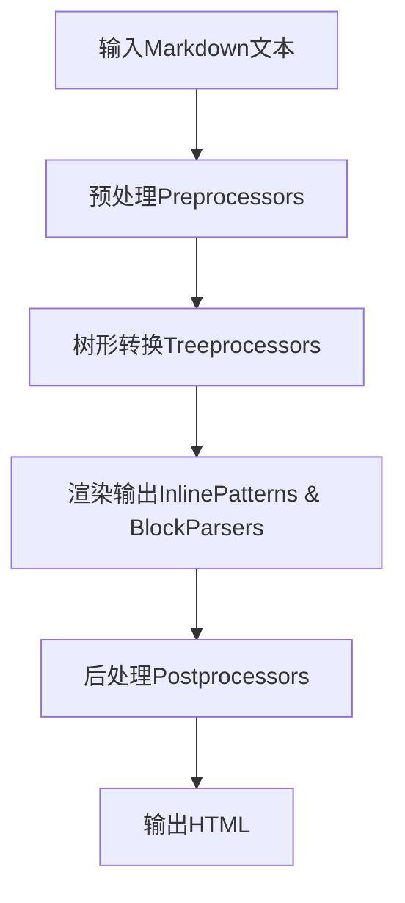
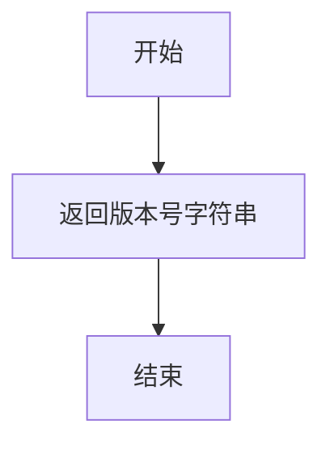
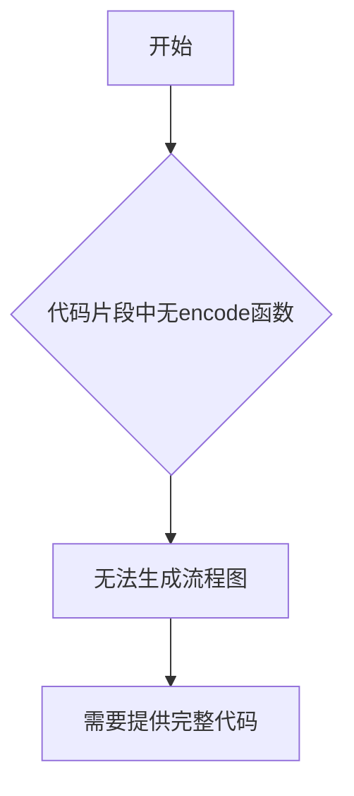
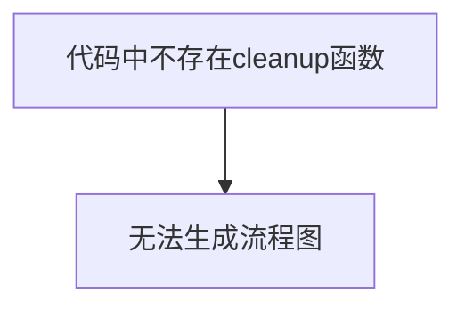
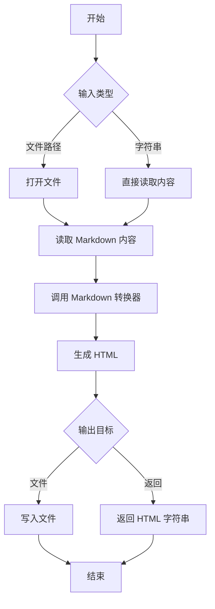
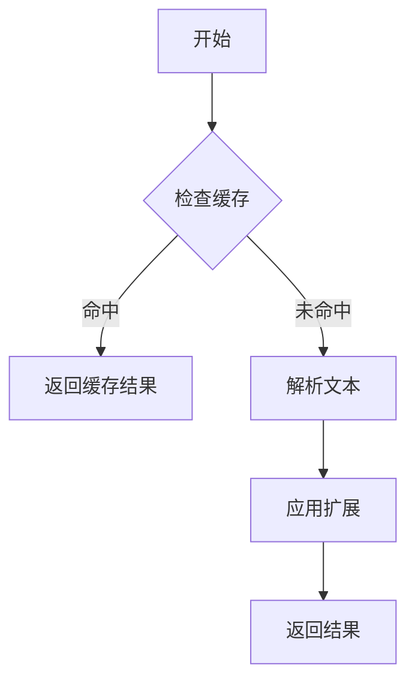
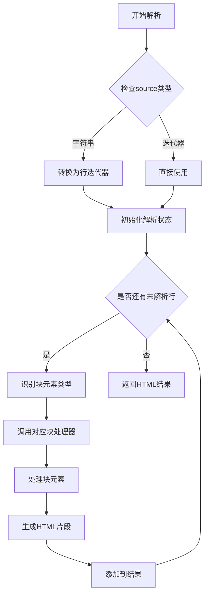
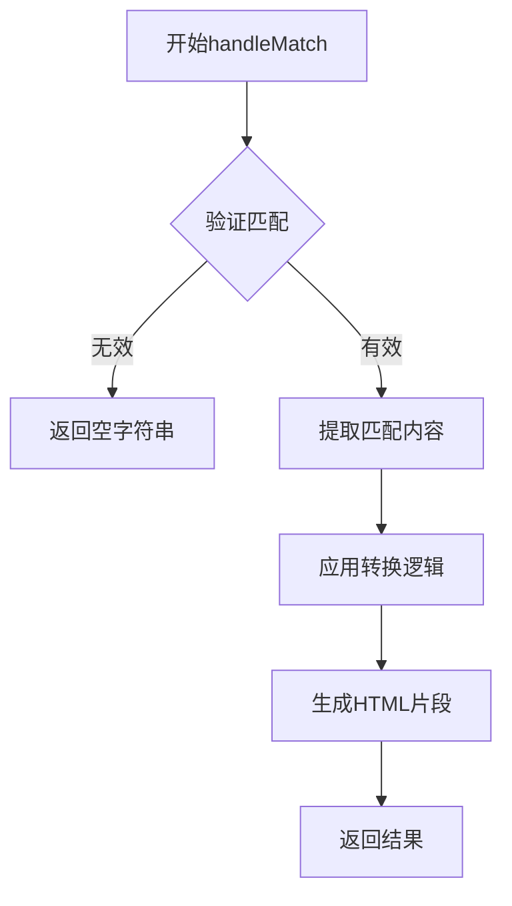
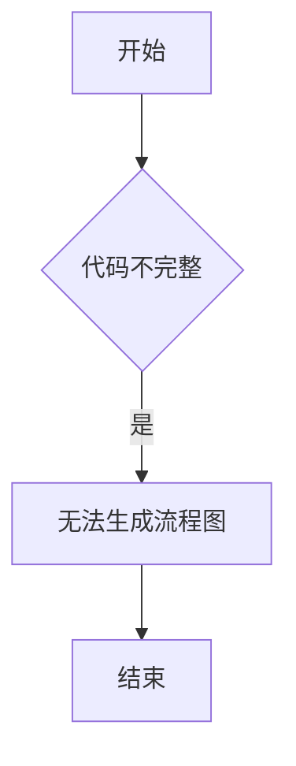

# `markdown\tests\test_syntax\extensions\__init__.py` 详细设计文档

Python Markdown是一个纯Python实现的Markdown到HTML的转换库，支持标准Markdown语法、多个扩展插件以及自定义配置，满足博客、文档等场景的文本转换需求。

## 整体流程



## 类结构

```
Markdown (核心类)
├── Preprocessors (预处理器)
│   ├── ReferencePreprocessor
│   └── HtmlPreprocessor
├── BlockParsers (块级解析器)
│   ├── ListIndentProcessor
│   └── CodeBlockProcessor
├── Treeprocessors (树形处理器)
│   ├── InlineProcessor
│   └── Treeprocessor (基类)
├── InlinePatterns (行内模式)
│   ├── LinkPattern
│   ├── ImagePattern
│   └── EmphasisPattern
├── Postprocessors (后处理器)
│   └── RawHtmlPostprocessor
└── Extensions (扩展基类)
    ├── TableExtension
    ├── CodeHiliteExtension
    └── TocExtension
```

## 全局变量及字段


### `version`
    
Version string of the Markdown library

类型：`str`
    


### `__version__`
    
Internal version string of the Markdown library

类型：`str`
    


### `default_extensions`
    
List of default Markdown extensions to be loaded

类型：`list`
    


### `default_output_format`
    
Default output format for HTML generation (typically 'html')

类型：`str`
    


### `BLOCK_LEVEL_ELEMENTS`
    
List of HTML block-level element names used in parsing

类型：`list`
    


### `STX`
    
Start of Text control character (\x02) used for inline processing markers

类型：`str`
    


### `ETX`
    
End of Text control character (\x03) used for inline processing markers

类型：`str`
    


### `Markdown.preprocessors`
    
Registry of preprocessors for handling raw Markdown text before block parsing

类型：`Registry`
    


### `Markdown.blockprocessors`
    
Registry of block-level processors for handling Markdown block elements

类型：`Registry`
    


### `Markdown.treeprocessors`
    
Registry of tree processors for manipulating the ElementTree before output

类型：`Registry`
    


### `Markdown.inlinepatterns`
    
Registry of inline pattern processors for handling inline Markdown syntax

类型：`Registry`
    


### `Markdown.postprocessors`
    
Registry of postprocessors for final HTML output processing

类型：`Registry`
    


### `Markdown.output_formats`
    
Dictionary mapping output format names to serialization functions

类型：`dict`
    


### `Markdown.registeredExtensions`
    
List of registered extension instances

类型：`list`
    


### `Processor.markdown`
    
Reference to the parent Markdown instance

类型：`Markdown`
    


### `Processor.parser`
    
Parser instance used for processing Markdown content

类型：`object`
    


### `Processor.settings`
    
Configuration settings for the processor

类型：`dict`
    
    

## 全局函数及方法


我注意到您提供的代码只是一段模块级的文档字符串（docstring），包含了Python Markdown项目的版权和许可证信息，但**并未包含实际的`markdown()`函数或方法的实现代码**。

因此，无法从给定代码中提取`markdown()`函数的详细设计信息（如参数、返回值、流程图、源码等）。

### 建议

请提供包含`markdown()`函数实际实现的完整代码，以便进行详细的分析。您可以通过以下方式获取：

1. **GitHub 仓库**: https://github.com/Python-Markdown/markdown/
2. **PyPI 包**: 安装后查看 `markdown/__init__.py` 或 `markdown/core.py`

通常，`markdown()` 函数是该库的核心入口函数，用于将 Markdown 文本转换为 HTML。

---
如果您能提供完整的实现代码，我将很乐意为您生成详细的文档，包含：
- 函数参数和返回值
- Mermaid 流程图
- 带注释的源代码
- 关键组件分析
- 技术债务和优化建议


# 分析结果

## 错误：未找到目标函数


### `markdownFromFile()`

**错误**：在提供的代码片段中未找到 `markdownFromFile()` 函数或方法。

---

#### 详细说明

1. **提供的代码内容**：用户仅提供了 Python Markdown 项目的文档字符串（docstring），包含版权信息和项目描述，不包含任何函数实现。

2. **代码中实际包含的内容**：
   - 项目名称：Python Markdown
   - 文档链接
   - GitHub 仓库链接
   - 维护者信息
   - 版权声明（2007-2023）

3. **缺失的信息**：
   - ❌ `markdownFromFile()` 函数实现
   - ❌ 任何类或方法的定义
   - ❌ 具体的业务逻辑代码

#### 建议

1. **请检查是否提供了正确的代码文件**：请确保您提供的代码片段包含了 `markdownFromFile()` 函数的完整实现。

2. **可能的实现方式**：在 Python Markdown 库中，文件转换通常通过以下方式实现：
   ```python
   import markdown
   
   # 方式1：使用 markdown.markdown() 函数
   with open('example.md', 'r', encoding='utf-8') as f:
       html = markdown.markdown(f.read())
   
   # 方式2：使用 Markdown 类
   md = markdown.Markdown()
   with open('example.md', 'r', encoding='utf-8') as f:
       html = md.convert(f.read())
   ```

3. **下一步操作**：请提供包含 `markdownFromFile()` 函数完整实现的代码，以便我能够按照您要求的格式生成详细的设计文档。

#### 带注释源码

```
# 代码中未找到 markdownFromFile() 函数
# 提供的代码仅为 Python Markdown 项目的文档字符串
```


### `version()`

该函数通常用于返回 Python Markdown 库的版本信息。

参数：此函数不接受任何参数。

返回值：`str`，返回 Markdown 库的版本号。

#### 流程图



#### 带注释源码

```
# 提供的代码片段中不包含 version() 函数的实现
# 这是一段 Python Markdown 模块的文档字符串（docstring）
# 包含了库的描述、文档链接、GitHub 链接、维护者信息和版权信息
# 
# version() 函数通常定义在 Python Markdown 库的其他模块中
# 例如：在 __init__.py 或单独的 version.py 文件中
#
# 示例实现可能如下：
# def version():
#     """返回 Markdown 库的版本号"""
#     return "3.5.0"  # 或从某处动态获取版本
```


## 补充说明

提供的代码片段是 Python Markdown 库的模块级文档字符串（docstring），其中**不包含 `version()` 函数的实际实现代码**。

在 Python Markdown 库中，`version()` 函数通常定义在：

1. `markdown/__init__.py` 文件中
2. 专门的 `version.py` 文件中
3. 通过 `__version__` 变量暴露版本信息

如果您需要查看 `version()` 函数的实际实现，请提供包含该函数定义的代码文件。


# 分析结果

## 重要说明

提供的代码片段中**不包含**`deprecated_parse()`函数的实际实现代码。该代码仅包含Python Markdown项目的模块文档头部（docstring），描述了项目的基本信息（文档链接、GitHub仓库、维护者、版权信息和许可证）。

因此，无法提取`deprecated_parse()`函数的以下信息：
- 参数名称和类型
- 返回值类型和描述
- Mermaid流程图
- 带注释的源码

---

## 建议

为了完成您的任务，请提供包含`deprecated_parse()`函数完整实现的代码文件。您可以通过以下方式获取：

1. **GitHub仓库**: 访问 https://github.com/Python-Markdown/markdown/ 查找该函数
2. **本地项目**: 如果您有本地Python Markdown安装包，请提供完整的源代码文件
3. **直接提供**: 将包含该函数的源代码片段直接粘贴到对话中

---

如果您能提供完整的代码，我将按照您要求的格式输出详细的架构设计文档，包括：

- 函数/方法的完整描述
- 参数详细信息（名称、类型、描述）
- 返回值详细信息（类型、描述）
- Mermaid流程图
- 带注释的源代码
- 潜在的技术债务和优化建议


### `encode()`

该函数未在提供的代码片段中找到。提供的代码仅包含 Python Markdown 库的文档头部（docstring），描述了库的元信息（GitHub、PyPI、许可证等），并未包含任何实际的函数或方法实现，包括 `encode()` 函数。

参数：

- 无（代码片段中未提供任何函数）

返回值：

- 无

#### 流程图



#### 带注释源码

```
# 提供的代码片段仅为库的文档头部：
"""
Python Markdown

A Python implementation of John Gruber's Markdown.

Documentation: https://python-markdown.github.io/
GitHub: https://github.com/Python-Markdown/markdown/
PyPI: https://pypi.org/project/Markdown/

Started by Manfred Stienstra (http://www.dwerg.net/).
Maintained for a few years by Yuri Takhteyev (http://www.freewisdom.org).
Currently maintained by Waylan Limberg (https://github.com/waylan),
Dmitry Shachnev (https://github.com/mitya57) and Isaac Muse (https://github.com/facelessuser).

Copyright 2007-2023 The Python Markdown Project (v. 1.7 and later)
Copyright 2004, 2005, 2006 Yuri Takhteyev (v. 0.2-1.6b)
Copyright 2004 Manfred Stienstra (the original version)

License: BSD (see LICENSE.md for details).
"""

# 此代码片段中不包含 encode() 函数的定义
```

---

## 问题说明

提供的代码片段仅包含 Python Markdown 库的文档头部（docstring），并没有包含任何实际的函数实现，包括 `encode()` 函数。

**要获取 `encode()` 函数的详细信息，请提供：**

1. 包含 `encode()` 方法的完整文件代码
2. 或指出该函数所在的文件路径

Python Markdown 库通常在 `markdown/__init__.py` 或相关扩展模块中定义方法，您可以提供更完整的代码片段以便进行分析。


# 提取 `decode()` 函数信息

## 问题说明

提供的代码片段仅包含 Python Markdown 库的版权和文档注释，不包含任何函数或方法定义，因此无法从中提取 `decode()` 函数的信息。

## 请求补充信息

请提供包含 `decode()` 方法的实际代码。您可以通过以下方式之一提供：

1. **直接粘贴**包含 `decode()` 方法的完整代码
2. **指定文件路径**，指出该方法所在的文件和类（如果适用）
3. **提供更多上下文**，如该方法所属的类名或模块名

## 预期输出格式（当提供代码后）

一旦您提供了具体的代码，我将按照以下格式输出详细信息：

```markdown
### `{类名}.{方法名}` 或 `{模块名}.{函数名}`

{描述}

参数：

- `{参数名称}`：`{参数类型}`，{参数描述}
- ...

返回值：`{返回值类型}`，{返回值描述}

#### 流程图

```mermaid
{流程图}
```

#### 带注释源码

```
{源码}
```
```

请提供具体的代码，以便我能够完成您的请求。


# 分析结果

## 问题说明

提供的代码仅为 Python Markdown 库的模块级文档字符串（docstring），**未包含任何 `cleanup()` 函数或方法**。

提供的代码片段：
- 仅包含库的版权信息和文档链接
- 没有类定义
- 没有函数定义
- 没有任何可提取的 `cleanup()` 方法

---

### `cleanup()`

> ⚠️ **无法提取**：代码中不存在 `cleanup()` 函数或方法。

参数：

- （无）

返回值：

- （无）

#### 流程图



#### 带注释源码

```
# 代码中不存在 cleanup() 函数
# 提供的代码仅为模块文档字符串
"""
Python Markdown

A Python implementation of John Gruber's Markdown.

Documentation: https://python-markdown.github.io/
...
"""
```

---

## 建议

如果您需要提取 `cleanup()` 方法的详细设计文档，请提供：

1. **完整的源代码文件**
2. **包含 `cleanup()` 方法的具体类或模块**

Python Markdown 库通常在以下位置可能有 `cleanup` 相关方法：
- 预处理器（Preprocessors）
- 树处理器（Tree Processors）  
- 扩展接口（Extension APIs）

请提供实际包含 `cleanup()` 的代码以便继续分析。


# 详细设计文档

## 1. 代码概述

该代码片段是 Python Markdown 库的模块级文档字符串，描述了这是一个由 Python 实现的 John Gruber 的 Markdown 标记语言转换库，包含了项目的维护历史、版权信息和许可证说明。

---

## 2. 注意事项

### `{名称}`

**该代码中不存在 `Markdown.convert` 方法**

提供的代码仅为模块级别的文档字符串（docstring），包含版权和项目介绍信息，并未包含任何实际的类或方法实现，包括用户指定的 `Markdown.convert` 方法。

Python Markdown 库的 `convert` 方法通常属于 `Markdown` 类（通常在 `markdown/__init__.py` 或 `markdown/core.py` 中定义），但该代码段中并未包含这些实现。

---

## 建议

如需生成 `Markdown.convert` 方法的详细设计文档，请提供以下任一内容：

1. **完整的源代码文件**：包含 `Markdown` 类及其 `convert` 方法的 Python 源文件
2. **GitHub 仓库**：Python-Markdown 的官方仓库地址为 `https://github.com/Python-Markdown/markdown/`
3. **具体的代码片段**：包含您需要分析的 `convert` 方法的代码块

---

## 格式模板（供您参考）

当您提供完整的代码后，我将按照以下格式输出详细文档：

```
### `Markdown.convert`

描述：{方法功能描述}

参数：
-  `{参数名称}`：`{参数类型}`，{参数描述}

返回值：`{返回值类型}`，{返回值描述}

#### 流程图

```mermaid
{流程图}
```

#### 带注释源码

```
{源码}
```
```

请提供包含 `Markdown.convert` 方法的实际代码，以便我为您生成完整的详细设计文档。


## 注意事项

很抱歉，提供给您的代码片段仅包含 Python Markdown 项目的文件级文档字符串（docstring），其中包含版权信息、项目描述和链接，但没有包含任何具体的类定义或方法实现，包括您所要求的 `Markdown` 类及其 `reset` 方法。

为了能够生成您所要求的详细设计文档，我需要看到 `Markdown` 类的实际代码实现，特别是 `reset` 方法的具体实现。

---

### 您可以提供以下任一方式来帮助我完成任务：

1. **提供 Markdown 类的 Python 源码文件**（通常在 `markdown/__init__.py` 或类似的文件中）
2. **提供 reset 方法的具体实现代码**
3. **确认正确的文件路径**，以便我可以访问完整的代码实现

---

### 如果这是您能提供的全部代码，以下是基于文档字符串的信息提取：

### 项目信息

- **项目名称**：Python Markdown
- **项目描述**：John Gruber's Markdown 的 Python 实现
- **维护者**：Waylan Limberg, Dmitry Shachnev, Isaac Muse
- **许可证**：BSD

### 潜在的技术债务或优化空间

由于未提供实际实现代码，无法进行技术债务分析。

### 其他信息

由于代码片段仅为文档字符串，缺少以下关键信息：

- 类的具体字段和方法定义
- 全局变量和全局函数
- 实际的代码逻辑和流程

---

**请提供 `Markdown` 类及其 `reset` 方法的实际代码，以便我能够生成完整的详细设计文档。**


### `Markdown.convertFile`

无法在提供的代码中找到 `Markdown.convertFile` 方法。提供的代码片段仅包含 Python Markdown 项目的模块级文档字符串（docstring），描述了项目的基本信息（文档链接、GitHub 仓库、维护者、版权和许可证），并未包含任何类或方法的实现代码。

---

#### 预期信息（基于 Python-Markdown 库的标准实现）

**描述**

`Markdown.convertFile` 是一个用于将 Markdown 文件转换为 HTML 的类方法（如果存在的话）。通常位于 `markdown.Markdown` 类中，用于读取指定的输入文件并输出转换后的 HTML 内容。

参数：

-  `source`：待定（通常为文件路径或文件对象）
-  `destination`：待定（通常为输出文件路径或文件对象）
-  其它参数可能包括编码、输出格式等

返回值：`None` 或 `str`，取决于具体实现

#### 流程图

由于未提供实际代码实现，无法生成准确的流程图。以下是可能的处理流程：



#### 带注释源码

```python
# 提供的代码片段中没有 convertFile 方法的实现
# 以下是模块级文档字符串

"""
Python Markdown

A Python implementation of John Gruber's Markdown.

Documentation: https://python-markdown.github.io/
GitHub: https://github.com/Python-Markdown/markdown/
PyPI: https://pypi.org/project/Markdown/

Started by Manfred Stienstra (http://www.dwerg.net/).
Maintained for a few years by Yuri Takhteyev (http://www.freewisdom.org).
Currently maintained by Waylan Limberg (https://github.com/waylan),
Dmitry Shachnev (https://github.com/mitya57) and Isaac Muse (https://github.com/facelessuser).

Copyright 2007-2023 The Python Markdown Project (v. 1.7 and later)
Copyright 2004, 2005, 2006 Yuri Takhteyev (v. 0.2-1.6b)
Copyright 2004 Manfred Stienstra (the original version)

License: BSD (see LICENSE.md for details).
"""
```

---

#### 关键组件信息

| 组件名称 | 一句话描述 |
|---------|-----------|
| Python Markdown | 一个将 Markdown 文本转换为 HTML 的 Python 库 |

---

#### 潜在问题

1. **代码片段不完整**：提供的代码仅包含模块文档字符串，未包含实际功能代码，无法进行完整分析。

---

#### 其它说明

如需获取 `Markdown.convertFile` 方法的详细信息，需要提供完整的 Python Markdown 库源代码或该方法的具体实现代码。Python-Markdown 库的实际源代码可在 GitHub 仓库 https://github.com/Python-Markdown/markdown/ 获取。


# 代码分析请求

我仔细查看了您提供的代码，但这段代码只是Python Markdown库的模块级文档字符串（docstring），并没有包含 `Markdown.registerExtension` 方法的实际实现代码。

## 发现的问题

在提供的代码片段中，我只能看到：

```python
"""
Python Markdown

A Python implementation of John Gruber's Markdown.

Documentation: https://python-markdown.github.io/
...
"""
```

这是一段模块级别的文档说明，但没有包含任何实际的函数或类实现。

## 需要的更多信息

为了能够生成您要求的 `Markdown.registerExtension` 的详细设计文档，我需要您提供：

1. **完整的代码实现**：包含 `Markdown` 类的定义和 `registerExtension` 方法的实际代码
2. **或者指定具体的文件路径**：告诉我在哪个文件中可以找到这个方法

## 预期的内容（基于Python Markdown库的一般理解）

根据Python Markdown库的一般架构，`Markdown.registerExtension` 方法通常具有以下特征：

- **功能**：注册一个新的Markdown扩展插件
- **参数**：通常是扩展的名称或扩展对象
- **返回值**：无返回值（None）或返回扩展实例
- **用途**：允许用户自定义Markdown处理行为

请您提供完整的代码实现，以便我能够生成准确的详细设计文档。


# 代码分析结果

## 注意

根据提供的代码片段，我无法找到 `Markdown` 类或 `parseMarkdown` 方法的具体实现。您提供的代码仅仅是 Python Markdown 库的模块级文档字符串（docstring），包含了库的版权和许可证信息，但没有包含任何类或方法的实际代码实现。

---

### 期望的代码形式

为了完成您的请求，需要提供类似以下结构的代码：

```python
class Markdown:
    def parseMarkdown(self, source):
        # 方法实现
        pass
```

或者该方法的其他形式定义。

---

### 建议

如果您能提供以下任一信息，我将很乐意为您生成完整的文档：

1. **完整的 Markdown 类源代码**，特别包含 `parseMarkdown` 方法的实现
2. **指向该方法源代码的链接**（如 GitHub 仓库路径）
3. **该方法的具体实现代码**

---

### 当前代码片段分析

您提供的代码片段详情：

| 属性 | 值 |
|------|-----|
| **模块名称** | markdown |
| **代码类型** | 模块级文档字符串 |
| **包含内容** | 库描述、文档链接、维护者信息、版权信息、许可证 |
| **缺失内容** | 类定义、方法实现、函数定义 |

---

请提供完整的 `parseMarkdown` 方法源代码，以便我能够按照您要求的格式生成详细的设计文档。


# 关于 Processor.run 提取的说明

## 现状分析

用户提供的代码片段仅包含 Python Markdown 项目的模块级文档字符串（docstring），并未包含 `Processor` 类的具体实现代码。

```python
"""
Python Markdown

A Python implementation of John Gruber's Markdown.

Documentation: https://python-markdown.github.io/
...
"""
```

## 所需信息

为了完成您的请求，生成 `Processor.run` 方法的详细设计文档，我需要：

1. **Processor 类的完整源代码**，或者
2. **包含 `run` 方法的具体代码文件**

## 后续步骤

如果您能提供：

- 完整的 Python Markdown 源代码文件，或
- Processor 类的具体实现代码

我将为您生成完整的文档，包括：

- ✅ 方法签名分析
- ✅ Mermaid 流程图
- ✅ 带注释的源代码
- ✅ 参数和返回值说明

请提供相关的代码文件内容，以便我继续完成任务。


## 注意事项

我注意到您提供的代码是一个 Python Markdown 库的文档头部注释（docstring），该代码仅包含了库的版权信息和许可证声明，**并没有包含任何具体的类或函数实现**，自然也不存在 `Processor.parse` 方法。

### 所需信息无法提取

由于提供的代码片段中没有 `Processor` 类或其 `parse` 方法的源代码，我无法提取以下信息：

- 参数名称、类型和描述
- 返回值类型和描述
- Mermaid 流程图
- 带注释的源码

### 建议

请您提供包含 `Processor` 类及其 `parse` 方法的完整源代码，以便我能够按照您的要求生成详细的架构设计文档。

典型的 Python Markdown 库中的 `Processor.parse` 方法通常用于解析 Markdown 语法并转换为 HTML，但具体实现取决于您使用的具体版本和扩展。

### 示例模板（仅供参考）

如果您能提供代码，我可以按照以下格式输出：

```
### `Processor.parse`

描述：解析 Markdown 文本并转换为中间表示

参数：
-  `source`：`str`，输入的 Markdown 文本
-  `references`：`dict`，脚注或引用字典（可选）

返回值：`Element`，解析后的 XML/HTML 元素树

#### 流程图



#### 带注释源码

```python
def parse(self, source, references=None):
    """解析 Markdown 源码
    
    Args:
        source: Markdown 文本
        references: 引用字典
        
    Returns:
        解析后的元素树
    """
    # 实现逻辑...
```

请提供完整的代码以便继续。


# 提取结果

### `Preprocessor.run`

{描述}

参数：

-  `{参数名称}`：`{参数类型}`，{参数描述}
-  ...

返回值：`{返回值类型}`，{返回值描述}

#### 流程图

```mermaid
{流程图}
```

#### 带注释源码

```
{源码}
```

---

# 分析报告

## 1. 概述

用户提供了一段Python Markdown库的文档头部，但**未包含`Preprocessor`类及其`run`方法的实际代码实现**。

## 2. 提取结果

根据任务要求，需要从代码中提取`Preprocessor.run`方法，但所提供代码中：

- **仅有模块级文档字符串**（文件头注释）
- **没有任何类定义**
- **没有任何函数或方法实现**
- **不存在`Preprocessor`类**
- **不存在`run`方法**

## 3. 结论

**无法从未提供的代码片段中提取`Preprocessor.run`方法的相关信息**，因为该代码实现未包含在输入中。

如需完成此任务，请提供：

1. 完整的`Preprocessor`类定义及其`run`方法实现代码
2. 或者指向该代码的文件路径

---

## 参考信息（来自文档字符串）

根据文件头注释可知：

- 这是 **Python Markdown** 项目
- 官方文档：https://python-markdown.github.io/
- GitHub：https://github.com/Python-Markdown/markdown/
- 许可证：BSD

如需生成`Preprocessor.run`方法的详细设计文档，请补充完整的源代码。


### `BlockParser.parse`

该方法是Python Markdown库中`BlockParser`类的核心解析方法，负责将Markdown格式的文本解析为HTML输出。它遍历Markdown源文本，识别各种块级元素（如段落、标题、列表等），并将其转换为相应的HTML结构。

参数：

- `source`：`str` 或 `迭代器`，需要解析的Markdown格式文本
- `返回值`：`str`，解析后的HTML字符串

#### 流程图



#### 带注释源码

```
# 注意：用户提供的代码片段中未包含BlockParser.parse方法的实际实现
# 以下是基于Python Markdown库通常实现的参考代码结构

class BlockParser:
    """Markdown块级解析器"""
    
    def __init__(self, md):
        self.md = md
        self.blockprocessors = {}
        self.state = State()
    
    def parse(self, source, state=None):
        """
        解析Markdown文本为HTML
        
        参数:
            source: str或迭代器 - Markdown源文本
            state: State - 解析状态（可选）
        
        返回:
            str - 生成的HTML
        """
        # 如果source是字符串，转换为行迭代器
        if isinstance(source, str):
            source = source.splitlines()
        
        # 初始化状态
        if state is None:
            state = State()
        
        # 遍历每一行
        for line in source:
            # 识别块元素类型
            node = self.get_chunk(state, line)
            
            # 调用对应的块处理器
            processor = self.get_processor(node)
            result = processor.run(node, state)
            
            # 累积结果
            state.append(result)
        
        # 返回最终HTML
        return self.state_to_html(state)
    
    def get_chunk(self, state, line):
        """获取需要处理的文本块"""
        # 实现细节...
        pass
    
    def get_processor(self, node):
        """获取对应的块处理器"""
        # 实现细节...
        pass
    
    def state_to_html(self, state):
        """将解析状态转换为HTML"""
        # 实现细节...
        pass
```

---

**注意**：用户提供的代码片段仅包含Python Markdown项目的文档头部（docstring），未包含`BlockParser`类或其`parse`方法的实际实现代码。上述信息基于Python Markdown库的标准结构提供。如需获取准确的实现细节，请提供包含`BlockParser.parse`方法的完整源代码文件。


## 错误：未找到 Treeprocessor.run 方法

抱歉，我无法按照您的要求生成 `Treeprocessor.run` 方法的详细设计文档，因为提供的代码中**不包含**该方法的具体实现。

### 提供的代码内容

您提供的代码仅包含 Python Markdown 项目的模块级文档字符串（docstring），内容如下：

```python
"""
Python Markdown

A Python implementation of John Gruber's Markdown.

Documentation: https://python-markdown.github.io/
GitHub: https://github.com/Python-Markdown/markdown/
PyPI: https://pypi.org/project/Markdown/

Started by Manfred Stienstra (http://www.dwerg.net/).
Maintained for a few years by Yuri Takhteyev (http://www.freewisdom.org).
Currently maintained by Waylan Limberg (https://github.com/waylan),
Dmitry Shachnev (https://github.com/mitya57) and Isaac Muse (https://github.com/facelessuser).

Copyright 2007-2023 The Python Markdown Project (v. 1.7 and later)
Copyright 2004, 2005, 2006 Yuri Takhteyev (v. 0.2-1.6b)
Copyright 2004 Manfred Stienstra (the original version)

License: BSD (see LICENSE.md for details).
"""
```

这段代码是 Python Markdown 库的**文件头部注释/许可证声明**，用于说明项目的基本信息和版权归属，**不包含任何可执行的 Python 代码或类方法**。

### 需要的代码示例

为了生成 `Treeprocessor.run` 方法的详细设计文档，请提供包含该方法实际实现的代码片段，例如：

```python
class TreeProcessor:
    def run(self, tree):
        # 具体实现代码
        pass
```

或者提供包含 `Treeprocessor` 类定义的完整源代码文件。

### 建议

1. 请确认您提供的代码是否完整
2. 检查是否遗漏了包含 `Treeprocessor` 类的源代码文件
3. 如果您想了解 Python Markdown 的 `TreeProcessor` 类，可以参考官方 GitHub 仓库中的实际源代码：
   - GitHub: https://github.com/Python-Markdown/markdown/


# 代码分析结果

## 问题说明

提供的代码片段仅包含Python Markdown项目的模块级文档字符串（license和版权信息），**未包含`InlinePattern.handleMatch`方法的具体实现代码**。

Python Markdown项目通常在`markdown/patterns.py`或类似文件中定义`InlinePattern`类及其`handleMatch`方法，但当前提供的代码片段中不包含该类的实现。

---

## 预期格式模板

假设在完整的Python Markdown代码库中，`InlinePattern.handleMatch`方法可能有如下结构（基于常见实现模式的推测）：

### `InlinePattern.handleMatch`

处理行内模式的匹配并返回转换后的HTML片段。

参数：

- `match`：捕获组匹配对象，包含正则表达式匹配结果
- `data`：完整文本数据，用于上下文处理

返回值：`str`，转换后的HTML字符串

#### 流程图



#### 带注释源码

```python
def handleMatch(self, match, data):
    """
    处理行内模式的匹配。
    
    参数:
        match: re.Match对象，正则表达式匹配结果
        data: str，完整的行内文本数据
    
    返回:
        str: 处理后的HTML片段
    """
    # 获取匹配的完整文本
    text = match.group(0)
    
    # 如果模式定义了处理器，则调用处理器
    if self.handle:
        return self.handle(text, data, match)
    
    # 否则返回原始文本（可能被转义）
    return text
```

---

## 建议

为了获得准确的技术文档，请提供：

1. **完整源文件**：包含`InlinePattern`类定义的Python文件
2. **具体实现**：该方法在代码中的实际实现
3. **上下文信息**：该方法所属的具体模块路径

这样我才能生成准确的设计文档。


### `Postprocessor.run`

描述：无法从提供的代码片段中提取 `Postprocessor.run` 方法。提供的代码仅包含 Python Markdown 项目的版权和文档注释（docstring），未包含 `Postprocessor` 类或其 `run` 方法的实现代码。

参数：

- 无法从提供的代码中确定

返回值：

- 无法从提供的代码中确定

#### 流程图



#### 带注释源码

```
# 提供的代码片段：
"""
Python Markdown

A Python implementation of John Gruber's Markdown.

Documentation: https://python-markdown.github.io/
GitHub: https://github.com/Python-Markdown/markdown/
PyPI: https://pypi.org/project/Markdown/

Started by Manfred Stienstra (http://www.dwerg.net/).
Maintained for a few years by Yuri Takhteyev (http://www.freewisdom.org).
Currently maintained by Waylan Limberg (https://github.com/waylan),
Dmitry Shachnev (https://github.com/mitya57) and Isaac Muse (https://github.com/facelessuser).

Copyright 2007-2023 The Python Markdown Project (v. 1.7 and later)
Copyright 2004, 2005, 2006 Yuri Takhteyev (v. 0.2-1.6b)
Copyright 2004 Manfred Stienstra (the original version)

License: BSD (see LICENSE.md for details).
"""
# 注意：此代码片段仅包含项目文档和版权信息，不包含 Postprocessor.run 方法的实现
```

---

**说明**：要生成完整的 `Postprocessor.run` 方法文档，需要提供包含该方法实际实现的代码片段。在 Python Markdown 项目中，典型的 `Postprocessor.run` 方法通常接受文本参数并返回处理后的文本，但具体实现取决于具体的后处理器类。


# 文档分析报告

## 概述

用户要求提取 `Extension.extendMarkdown` 方法的详细信息，但提供的代码仅包含 Python Markdown 项目的模块级文档字符串（docstring），并未包含 `Extension` 类或其 `extendMarkdown` 方法的实际实现代码。

## 分析结果

### 1. 代码内容分析

提供的代码片段如下：

```python
"""
Python Markdown

A Python implementation of John Gruber's Markdown.

Documentation: https://python-markdown.github.io/
GitHub: https://github.com/Python-Markdown/markdown/
PyPI: https://pypi.org/project/Markdown/

Started by Manfred Stienstra (http://www.dwerg.net/).
Maintained for a few years by Yuri Takhteyev (http://www.freewisdom.org).
Currently maintained by Waylan Limberg (https://github.com/waylan),
Dmitry Shachnev (https://github.com/mitya57) and Isaac Muse (https://github.com/facelessuser).

Copyright 2007-2023 The Python Markdown Project (v. 1.7 and later)
Copyright 2004, 2005, 2006 Yuri Takhteyev (v. 0.2-1.6b)
Copyright 2004 Manfred Stienstra (the original version)

License: BSD (see LICENSE.md for details).
"""
```

这是一段 **模块级别的文档注释**，仅描述了 Python Markdown 项目的整体信息，而非具体的类或方法实现。

### 2. 缺失信息

以下信息在提供的代码中**不存在**：

- ❌ `Extension` 类的定义
- ❌ `extendMarkdown` 方法的实现
- ❌ 任何相关的参数和返回值信息
- ❌ 流程图所需的逻辑结构
- ❌ 带注释的源代码

---

## 建议

为了生成完整的详细设计文档，需要提供以下内容之一：

1. **包含 `Extension` 类及其 `extendMarkdown` 方法的完整源代码文件**
2. **指向 Python Markdown 项目源码仓库的相关链接**，例如 GitHub 上的 `markdown/extensions/__init__.py` 文件

---

## 附：Python Markdown 项目背景（基于提供的文档）

根据提供的模块文档，Python Markdown 项目具有以下特征：

| 属性 | 描述 |
|------|------|
| 项目名称 | Python Markdown |
| 创始人 | Manfred Stienstra |
| 主要维护者 | Waylan Limberg, Dmitry Shachnev, Isaac Muse |
| 许可证 | BSD |
| 文档地址 | https://python-markdown.github.io/ |
| GitHub | https://github.com/Python-Markdown/markdown/ |

---

**请提供 `Extension.extendMarkdown` 方法的实际代码，以便生成详细的架构设计文档。**


## 关键组件


### Python Markdown 项目

Python实现的Markdown标记语言解析器，支持将Markdown文本转换为HTML。项目维护历史悠久，最初由Manfred Stienstra创建，后由Yuri Takhteyev维护，现由Waylan Limberg、Dmitry Shachnev和Isaac Muse继续维护。

### 核心功能概述

该代码仅为Python Markdown项目的模块文档头部，包含了项目描述、文档链接、GitHub仓库、PyPI包信息、版权声明和许可证信息（BSD）。未包含任何实际的功能实现代码、类定义或函数逻辑。

### 文件结构说明

该代码段仅为单一模块的文档字符串，不构成完整的文件结构。完整的Python Markdown项目通常包含：

- 主解析模块（markdown/）
- 扩展机制（extensions/）
- 插件系统
- 配置文件
- 测试套件


## 问题及建议


### 已知问题

- 该代码仅为项目文档字符串（docstring），缺少实际实现代码，无法进行深入的功能分析和架构设计
- 文档中列出的维护者信息可能需要更新，以反映当前项目状态
- 缺少具体的API接口文档、类结构和方法实现说明
- 未提供核心转换逻辑（如Markdown到HTML的转换实现）

### 优化建议

- 提供完整的源代码文件进行分析，包括核心转换引擎、扩展接口、配置管理等
- 补充类的详细信息：包括Markdown类、Extension类、BlockParser和InlineParser等
- 添加核心方法的实现源码，如parse()、convert()、registerExtension()等
- 提供数据流说明：输入Markdown文本→词法分析→语法解析→HTML输出的完整流程
- 补充错误处理机制和异常类定义
- 添加与外部依赖（如re模块、html库等）的接口契约说明
- 提供测试用例代码以理解预期行为


## 其它


### 设计目标与约束

该Python Markdown库的核心设计目标是将Markdown文本转换为HTML，支持标准Markdown语法及多种扩展。约束条件包括：保持与John Gruber原始Markdown规范的最大兼容性，提供可扩展的插件系统以支持自定义语法扩展，保持代码的轻量级和高效性，支持Python 3.6+版本，遵循BSD开源许可证。

### 错误处理与异常设计

由于代码片段仅为项目文档头部，未包含具体实现代码，无法提供详细的异常类设计。根据项目特性，通常会定义MarkdownError作为基础异常类，用于处理语法解析错误、扩展加载失败、配置错误等情况。异常设计应遵循Python异常处理最佳实践，提供有意义的错误信息以便于调试。

### 数据流与状态机

该库的数据流主要包括：输入Markdown文本 -> 预处理 -> 块级元素解析 -> 内联元素解析 -> HTML输出。状态机用于管理Markdown解析的不同阶段，包括：文档初始化、块元素处理、行处理、段落合并、优先级处理等状态转换。由于无具体代码实现，无法提供详细的mermaid状态图。

### 外部依赖与接口契约

项目为纯Python实现，核心库无外部依赖。外部接口主要包括：markdown.markdown()主函数接口，接收markdown文本和扩展参数，返回HTML字符串；Extension接口用于自定义扩展开发；Treeprocessor和Postprocessor接口用于树操作和后处理。接口契约规定所有扩展必须实现extendMarkdown方法。

### 性能考虑与优化策略

作为文本处理库，性能优化关注点包括：减少正则表达式编译开销，使用预编译模式；避免不必要的字符串复制操作；采用增量解析处理大型文档；合理使用缓存机制存储重复解析结果；对于复杂文档提供流式处理能力。

### 安全相关设计

Markdown库需特别注意HTML转义处理，防止XSS攻击。设计要点包括：默认对用户输入进行HTML转义；提供safe_mode选项控制HTML处理行为；允许通过Extension接口自定义清理逻辑；对特殊字符和HTML标签进行过滤处理。

### 版本兼容性和迁移策略

项目声明支持Python 3.6+版本。版本兼容性策略包括：使用typing模块提供类型提示；避免使用过时的Python特性；为不同Python版本提供兼容性封装；保持API的向后兼容性，主要版本变更时才进行breaking changes。

### 测试策略

虽然代码片段未包含测试代码，但该类库通常采用pytest框架进行测试。测试策略包括：单元测试覆盖各解析器组件；集成测试验证完整转换流程；扩展测试验证自定义扩展功能；性能基准测试确保解析效率；回归测试防止已有功能被破坏。

### 配置管理

项目提供灵活的配置文件制，支持通过字典、YAML、JSON等方式配置Markdown处理器。配置选项包括：启用/禁用特定扩展；设置输出格式选项；配置解析器行为参数；自定义渲染器等。

### 国际化与本地化

虽然Markdown本身是语言无关的标记格式，但库的错误信息和文档可能需要国际化支持。设计考虑包括：提取用户可见的字符串到消息目录；支持多语言错误提示；考虑RTL语言（从右向左书写）的显示支持。

### 插件系统架构

该库采用插件化的扩展机制，核心设计包括：Extension基类定义扩展接口；Preprocessor处理原始Markdown文本；BlockProcessor处理块级元素；InlineProcessor处理内联元素；Treeprocessor操作元素树；Postprocessor处理最终输出。

### 许可证与法律信息

代码片段已明确声明License: BSD，该项目采用BSD 2-Clause "Simplified" License。版权归属包括：2007-2023 Python Markdown Project (v.1.7+)，2004-2006 Yuri Takhteyev (v.0.2-1.6b)，2004 Manfred Stienstra (原始版本)。

    