# `markdown\tests\test_syntax\extensions\test_abbr.py` 详细设计文档

这是Python Markdown库的缩写(abbr)扩展功能测试文件，通过TestCase类验证缩写定义、嵌套、覆盖、词汇表加载等多种场景的正确性。

## 整体流程

```mermaid
graph TD
    A[开始] --> B[导入模块]
B --> C[创建TestAbbr测试类]
C --> D[设置default_kwargs]
D --> E{执行测试方法}
E --> F[test_ignore_atomic]
E --> G[test_abbr_upper]
E --> H[test_abbr_lower]
E --> I[test_abbr_multiple_in_text]
E --> J[test_abbr_multiple_in_tail]
E --> K[test_abbr_multiple_nested]
E --> L[test_abbr_override]
E --> M[test_abbr_glossary]
E --> N[test_abbr_glossary_2]
E --> O[test_abbr_nested]
E --> P[test_abbr_no_blank_lines]
E --> Q[test_abbr_no_space]
E --> R[test_abbr_extra_space]
E --> S[test_abbr_line_break]
E --> T[test_abbr_ignore_unmatched_case]
E --> U[test_abbr_partial_word]
E --> V[test_abbr_unused]
E --> W[test_abbr_double_quoted]
E --> X[test_abbr_single_quoted]
E --> Y[test_abbr_ignore_backslash]
E --> Z[test_abbr_hyphen]
E --> AA[test_abbr_carrot]
E --> AB[test_abbr_bracket]
E --> AC[test_abbr_with_attr_list]
E --> AD[test_abbr_superset_vs_subset]
E --> AE[test_abbr_empty]
E --> AF[test_abbr_clear]
E --> AG[test_abbr_reset]
F --> AH[assertMarkdownRenders验证输出]
G --> AH
H --> AH
I --> AH
J --> AH
K --> AH
L --> AH
M --> AH
N --> AH
O --> AH
P --> AH
Q --> AH
R --> AH
S --> AH
T --> AH
U --> AH
V --> AH
W --> AH
X --> AH
Y --> AH
Z --> AH
AA --> AH
AB --> AH
AC --> AH
AD --> AH
AE --> AH
AF --> AH
AG --> AH
```

## 类结构

```
TestCase (unittest基类)
└── TestAbbr (缩写扩展测试类)
```

## 全局变量及字段


### `glossary`
    
字典变量，存储缩写定义，键为缩写词，值为全称

类型：`dict`
    


### `glossary_2`
    
字典变量，用于测试加载额外的缩写定义

类型：`dict`
    


### `abbr_ext`
    
AbbrExtension类的实例，用于测试扩展的加载词汇表功能

类型：`AbbrExtension`
    


### `TestAbbr.maxDiff`
    
设置为None，禁用测试差异限制，允许完整比较

类型：`NoneType`
    


### `TestAbbr.default_kwargs`
    
包含默认测试参数的字典，默认启用abbr扩展

类型：`dict`
    
    

## 全局函数及方法


### TestCase.dedent

该方法继承自 `markdown.test_tools.TestCase` 基类，用于处理测试用例中的多行字符串，去除每行的公共缩进，使字符串格式更加整洁。

参数：

- `text`：`str`，需要处理的多行字符串

返回值：`str`，去除公共缩进后的字符串

#### 流程图

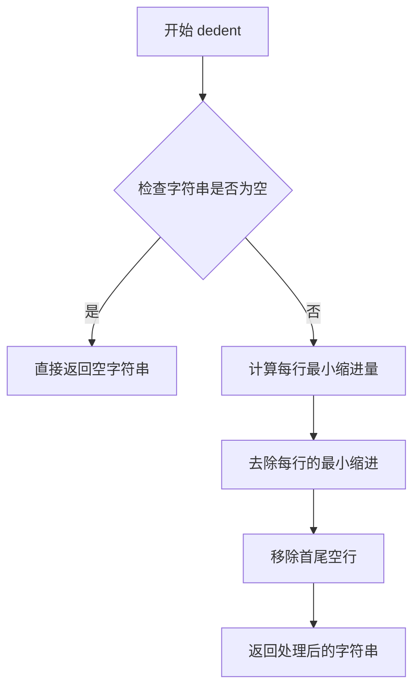

#### 带注释源码

```python
# TestCase.dedent 方法定义（位于 markdown.test_tools 模块中）
# 以下是基于 Python textwrap 模块的标准实现

def dedent(self, text):
    """
    去除多行字符串的公共缩进。
    
    该方法类似于 Python 标准库的 textwrap.dedent()，
    用于处理测试用例中定义的多行期望输出字符串。
    
    参数:
        text: 需要去除缩进的多行字符串
        
    返回值:
        去除公共缩进后的字符串
    """
    # 1. 将字符串按行分割
    lines = text.splitlines()
    
    # 2. 计算每行的缩进（不包括空行）
    indents = []
    for line in lines:
        # 跳过空行，不计算其缩进
        if line.strip():
            # 计算前导空格数量
            indent = len(line) - len(line.lstrip())
            indents.append(indent)
    
    # 3. 找出最小缩进量
    if indents:
        min_indent = min(indents)
    else:
        min_indent = 0
    
    # 4. 去除每行的最小缩进
    if min_indent > 0:
        dedented_lines = []
        for line in lines:
            if line.strip():
                # 去除前导空格
                dedented_lines.append(line[min_indent:])
            else:
                # 保留空行
                dedented_lines.append('')
        return '\n'.join(dedented_lines)
    
    return text
```

#### 实际使用示例

在 `TestAbbr` 类中的典型调用方式：

```python
# 输入的多行字符串（带有缩进）
raw_string = """
                ABBR

                *[ABBR]: Abbreviation
                """

# 调用 dedent 后的输出（去除公共缩进）
processed = """ABBR

*[ABBR]: Abbreviation"""
```


### `TestCase.assertMarkdownRenders`

该方法用于测试 Markdown 到 HTML 的渲染结果，验证给定的 Markdown 源代码经过指定扩展和配置转换后，是否能生成期望的 HTML 输出。

参数：

-  `source`：`str`，要转换的 Markdown 源代码文本
-  `expected`：`str`，期望生成的 HTML 输出
-  `extensions`：`list`，可选，用于指定要加载的 Markdown 扩展列表
-  `kwargs`：可选，关键字参数，用于传递给 Markdown 类的配置选项

返回值：`None`，如果测试失败则抛出断言异常

#### 流程图

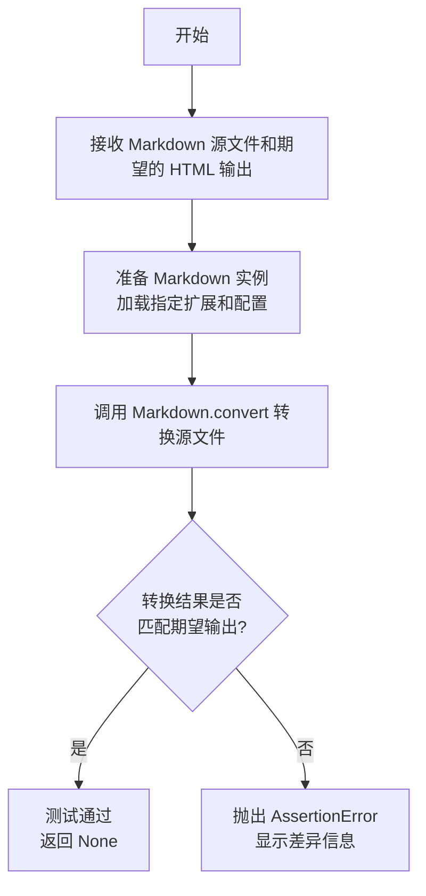

#### 带注释源码

```python
def assertMarkdownRenders(self, source, expected, extensions=None, **kwargs):
    """
    验证 Markdown 渲染结果的测试方法。
    
    参数:
        source: Markdown 格式的输入文本
        expected: 期望的 HTML 输出结果
        extensions: 可选的扩展名列表或扩展对象
        **kwargs: 传递给 Markdown 类的其他配置参数
    """
    # 如果没有指定扩展，使用默认扩展
    if extensions is None:
        extensions = self.default_kwargs.get('extensions', [])
    
    # 合并默认配置和传入的配置
    md_kwargs = {**self.default_kwargs, **kwargs}
    md_kwargs['extensions'] = extensions
    
    # 创建 Markdown 实例
    md = Markdown(**md_kwargs)
    
    # 执行转换
    result = md.convert(source)
    
    # 验证结果是否匹配期望输出
    self.assertEqual(result, expected)
```


### `TestAbbr.test_ignore_atomic`

该测试方法用于验证 Markdown 缩写扩展（abbr）在处理"原子性"内容时的正确性。具体来说，它测试当 URL 链接（如 `<https://example.com/{YAFR}>`）中包含类似缩写定义的模式（`{YAFR}`）时，缩写扩展应该忽略这些内容，不进行替换，从而保持 URL 的完整性。

参数：无（仅使用 `self`）

返回值：无（测试方法无返回值，通过 `assertMarkdownRenders` 进行断言验证）

#### 流程图

```mermaid
flowchart TD
    A[开始测试 test_ignore_atomic] --> B[准备测试输入: This &lt;https://example.com/{YAFR}&gt;]
    B --> C[定义缩写: \*[YAFR]: Yet Another Feature Request]
    C --> D[调用 assertMarkdownRenders 进行渲染测试]
    D --> E{渲染结果是否匹配预期?}
    E -->|是| F[测试通过 PASSED]
    E -->|否| G[测试失败 FAILED]
    
    F --> H[结束]
    G --> H
    
    style F fill:#90EE90
    style G fill:#FFB6C1
```

#### 带注释源码

```python
def test_ignore_atomic(self):
    """
    测试缩写扩展在处理'原子性'内容时的行为。
    
    验证当 URL 中包含类似缩写定义的模式（如 {YAFR}）时，
    缩写功能应该忽略这些内容，不进行替换操作。
    
    这是为了确保像 <https://example.com/{YAFR}> 这样的 URL
    不会被错误地将 {YAFR} 部分转换为缩写。
    """
    # 使用 assertMarkdownRenders 验证 Markdown 到 HTML 的转换
    # 参数1: 原始 Markdown 文本（输入）
    # 参数2: 期望的 HTML 输出
    self.assertMarkdownRenders(
        # 使用 self.dedent 去除缩进，得到纯净的 Markdown 文本
        self.dedent(
            """
            This <https://example.com/{YAFR}>

            *[YAFR]: Yet Another Feature Request
            """
        ),
        # 期望的 HTML 输出：URL 应该保持完整，不进行缩写替换
        '<p>This <a href="https://example.com/{YAFR}">https://example.com/{YAFR}</a></p>'
    )
```

#### 关键设计意图

| 特性 | 描述 |
|------|------|
| **测试目标** | 验证缩写扩展不会错误地处理 URL 中的"原子"文本 |
| **输入场景** | URL 包含类似缩写定义的模式 `{YAFR}` |
| **预期行为** | 保持 URL 完整性，不进行缩写替换 |
| **验证重点** | `{YAFR}` 应保留在 URL 中，而非被替换为缩写定义 |


### `TestAbbr.test_abbr_upper`

该方法是一个单元测试，用于验证 Markdown 的 abbreviation（缩写）扩展是否正确处理大写字母的缩写词。它测试当 Markdown 文本中包含大写缩写词 "ABBR" 并在文档底部定义其含义时，能够正确转换为 HTML 的 `<abbr>` 标签。

参数：

- `self`：`TestCase`，Python 类的实例方法标准参数，代表测试类本身的实例

返回值：`None`，该方法为测试用例，通过 `assertMarkdownRenders` 进行断言验证，不返回任何值

#### 流程图

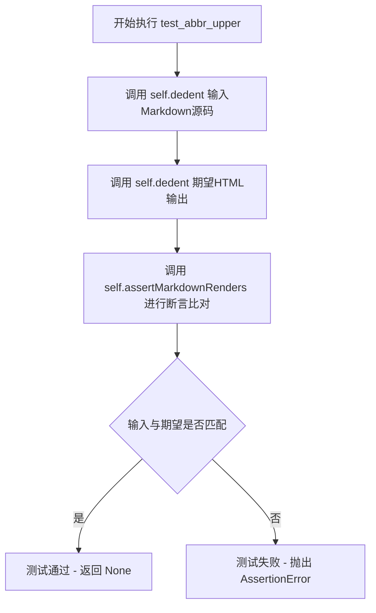

#### 带注释源码

```python
def test_abbr_upper(self):
    """
    测试大写缩写词的处理功能
    
    该测试方法验证 abbreviation 扩展能够正确识别和转换
    大写形式的缩写词（ABBR），将其转换为带有 title 属性的
    HTML <abbr> 标签。
    """
    # 使用 self.assertMarkdownRenders 验证 Markdown 到 HTML 的转换
    # 第一个参数：输入的 Markdown 源码（包含大写缩写词 ABBR）
    # 第二个参数：期望输出的 HTML 源码
    self.assertMarkdownRenders(
        # 输入：包含大写缩写词 ABBR 的 Markdown 文本
        # 定义格式：*[缩写词]: 描述
        self.dedent(
            """
            ABBR

            *[ABBR]: Abbreviation
            """
        ),
        # 期望输出：HTML 格式的 <abbr> 标签
        # <abbr> 标签的 title 属性包含缩写词的完整描述
        self.dedent(
            """
            <p><abbr title="Abbreviation">ABBR</abbr></p>
            """
        )
    )
```


### `TestAbbr.test_abbr_lower`

该方法是 Python Markdown 测试套件中用于验证缩写扩展（abbr）功能的单元测试，具体测试小写缩写词（如 "abbr"）在 Markdown 文本中能否正确转换为 HTML 的 `<abbr>` 标签，并保留其定义中的 title 属性。

参数：

- `self`：`TestCase`，测试类实例本身，继承自 `unittest.TestCase`

返回值：`None`，该方法为测试方法，通过 `assertMarkdownRenders` 断言验证 Markdown 渲染结果是否符合预期，无显式返回值

#### 流程图

```mermaid
flowchart TD
    A[开始测试 test_abbr_lower] --> B[准备 Markdown 输入文本: 'abbr<br><br>*[abbr]: Abbreviation']
    C[准备期望的 HTML 输出: '<p><abbr title=\"Abbreviation\">abbr</abbr></p>']
    B --> D[调用 self.assertMarkdownRenders]
    C --> D
    D --> E{输入渲染结果是否等于期望输出?}
    E -->|是| F[测试通过 - 断言成功]
    E -->|否| G[测试失败 - 抛出 AssertionError]
    F --> H[结束测试]
    G --> H
```

#### 带注释源码

```python
def test_abbr_lower(self):
    """
    测试小写缩写词的渲染功能。
    
    验证当 Markdown 文本中包含小写缩写词（如 'abbr'）时，
    该缩写词能被正确转换为 HTML 的 <abbr> 标签，
    并且 title 属性设置为定义中的描述文本。
    """
    self.assertMarkdownRenders(
        # 第一个参数：输入的 Markdown 源代码
        self.dedent(
            """
            abbr

            *[abbr]: Abbreviation
            """
        ),
        # 第二个参数：期望输出的 HTML
        self.dedent(
            """
            <p><abbr title="Abbreviation">abbr</abbr></p>
            """
        )
    )
```


### `TestAbbr.test_abbr_multiple_in_text`

该测试方法用于验证 Markdown 解析器能够正确处理文本中出现的多个缩写词（abbreviation），并将它们转换为对应的 HTML `<abbr>` 标签，同时从文档末尾的定义中获取每个缩写的完整描述。

参数：

- `self`：`TestCase`，测试类实例本身，继承自 `unittest.TestCase`，用于调用父类的测试辅助方法（如 `assertMarkdownRenders` 和 `dedent`）

返回值：`None`，该方法为测试用例，通过 `assertMarkdownRenders` 内部断言验证 Markdown 转换结果是否符合预期，无显式返回值

#### 流程图

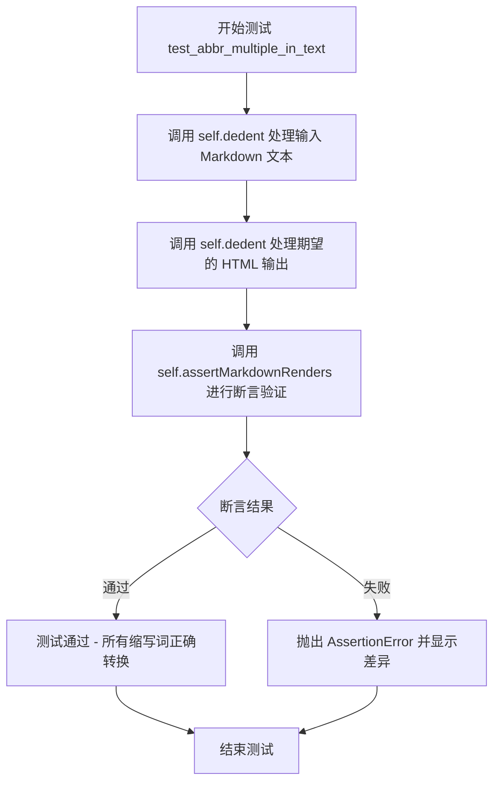

#### 带注释源码

```python
def test_abbr_multiple_in_text(self):
    """
    测试在文本中同时出现多个缩写词时的处理情况。
    
    测试场景：
    - Markdown 文本包含 'HTML' 和 'W3C' 两个缩写词
    - 在文档末尾通过 *[缩写]: 扩展名 语法定义这两个缩写的全称
    - 期望输出：将两个缩写词转换为带有 title 属性的 <abbr> HTML 标签
    """
    # 使用 assertMarkdownRenders 验证 Markdown 到 HTML 的转换
    # 第一个参数：输入的 Markdown 源码（经过 dedent 处理去除多余缩进）
    # 第二个参数：期望输出的 HTML（经过 dedent 处理）
    self.assertMarkdownRenders(
        # 输入 Markdown：包含两个缩写词 HTML 和 W3C
        self.dedent(
            """
            The HTML specification
            is maintained by the W3C.

            *[HTML]: Hyper Text Markup Language
            *[W3C]:  World Wide Web Consortium
            """
        ),
        # 期望输出：将 HTML 转换为 <abbr title="Hyper Text Markup Language">HTML</abbr>
        #         将 W3C 转换为 <abbr title="World Wide Web Consortium">W3C</abbr>
        self.dedent(
            """
            <p>The <abbr title="Hyper Text Markup Language">HTML</abbr> specification
            is maintained by the <abbr title="World Wide Web Consortium">W3C</abbr>.</p>
            """
        )
    )
```


### TestAbbr.test_abbr_multiple_in_tail

该测试方法用于验证当Markdown文本中包含多个缩写词定义，且这些定义出现在文档末尾（tail）时，缩写词能够正确转换为HTML的`<abbr>`标签。测试特别关注文本中间包含其他格式化元素（如强调标签`*The*`）时的处理情况。

参数：
- `self`：TestCase，测试类实例本身

返回值：`None`，该方法为测试方法，通过`assertMarkdownRenders`进行断言验证，无显式返回值

#### 流程图

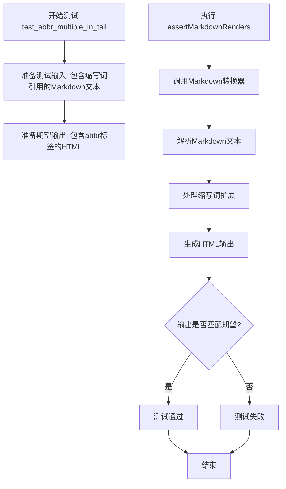

#### 带注释源码

```python
def test_abbr_multiple_in_tail(self):
    """
    测试当缩写词定义出现在文档末尾时，
    文本中包含多个缩写词的扩展功能。
    特别关注文本中间有其他元素（如强调）的情况。
    """
    # 调用assertMarkdownRenders方法进行测试
    # 第一个参数: 输入的Markdown文本
    # 第二个参数: 期望输出的HTML文本
    self.assertMarkdownRenders(
        # 使用dedent去除公共前缀空白
        self.dedent(
            """
            *The* HTML specification
            is maintained by the W3C.

            *[HTML]: Hyper Text Markup Language
            *[W3C]:  World Wide Web Consortium
            """
        ),
        # 期望的HTML输出
        self.dedent(
            """
            <p><em>The</em> <abbr title="Hyper Text Markup Language">HTML</abbr> specification
            is maintained by the <abbr title="World Wide Web Consortium">W3C</abbr>.</p>
            """
        )
    )
```


### `TestAbbr.test_abbr_multiple_nested`

该方法是一个测试用例，用于验证 Markdown 扩展在处理嵌套标记时的正确性。具体来说，它测试了当缩写（abbr）标记被包含在强调（emphasis）标记内部时，abbr 扩展是否能正确生成 HTML 输出，即生成嵌套的 `<em><abbr>...</abbr></em>` 结构。

参数：

- `self`：隐式的 `TestCase` 实例，表示测试类本身，无需显式传递

返回值：`None`，该方法为测试用例，通过 `assertMarkdownRenders` 断言验证渲染结果，不返回任何值

#### 流程图

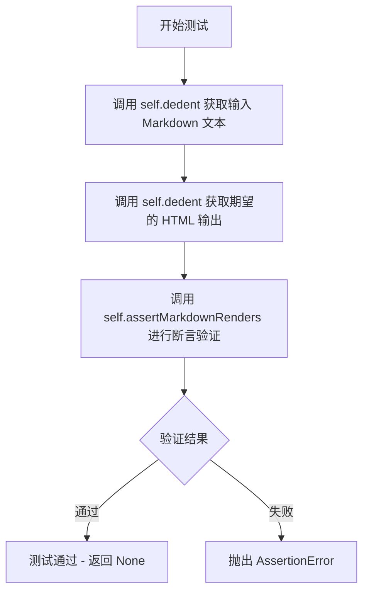

#### 带注释源码

```python
def test_abbr_multiple_nested(self):
    """
    测试缩写标记在嵌套强调标签内的处理能力。
    
    验证当 Markdown 文本中的缩写被包裹在强调标记（*...*）中时，
    abbr 扩展能够正确生成嵌套的 HTML 结构：<em><abbr>...</abbr></em>
    """
    # 使用 self.dedent 去除每行的公共缩进，还原原始 Markdown 格式
    self.assertMarkdownRenders(
        self.dedent(
            """
            The *HTML* specification
            is maintained by the *W3C*.

            *[HTML]: Hyper Text Markup Language
            *[W3C]:  World Wide Web Consortium
            """
        ),
        # 期望的 HTML 输出：缩写标签被包裹在强调标签内部
        self.dedent(
            """
            <p>The <em><abbr title="Hyper Text Markup Language">HTML</abbr></em> specification
            is maintained by the <em><abbr title="World Wide Web Consortium">W3C</abbr></em>.</p>
            """
        )
    )
```


### `TestAbbr.test_abbr_override`

该测试方法用于验证缩写词（Abbreviation）功能的定义覆盖行为。当同一个缩写词在文档中出现多次定义时，后续的定义应覆盖之前的定义。

参数：

- `self`：`TestCase`，测试类的实例本身

返回值：无返回值（`None`），该方法为测试方法，使用断言验证功能正确性

#### 流程图

```mermaid
flowchart TD
    A[开始执行 test_abbr_override] --> B[准备Markdown输入文本]
    B --> C[定义第一个缩写词: *[ABBR]: Ignored]
    C --> D[定义第二个缩写词: *[ABBR]: The override]
    D --> E[定义期望的HTML输出]
    E --> F[调用 assertMarkdownRenders 进行断言验证]
    F --> G{验证结果是否匹配}
    G -->|匹配| H[测试通过]
    G -->|不匹配| I[测试失败]
    H --> J[结束]
    I --> J
```

#### 带注释源码

```python
def test_abbr_override(self):
    """
    测试缩写词定义覆盖功能
    
    当同一个缩写词在文档中多次定义时，后面的定义应覆盖之前的定义。
    此测试验证了AbbrExtension能够正确处理重复的缩写词定义。
    """
    # 使用assertMarkdownRenders验证Markdown渲染结果
    self.assertMarkdownRenders(
        # 输入的Markdown文本，包含两个ABBR定义
        self.dedent(
            """
            ABBR

            *[ABBR]: Ignored
            *[ABBR]: The override
            """
        ),
        # 期望输出的HTML，title属性应为"The override"而非"Ignored"
        self.dedent(
            """
            <p><abbr title="The override">ABBR</abbr></p>
            """
        )
    )
```


### `TestAbbr.test_abbr_glossary`

该测试方法用于验证 AbbrExtension 扩展在接收外部传入的术语表（glossary）参数时，能够正确将 Markdown 文本中的缩写词转换为带有 title 属性的 HTML `<abbr>` 标签。

参数： 无（仅包含 `self` 参数）

返回值：`None`，该方法为测试方法，通过 `assertMarkdownRenders` 断言验证输出结果

#### 流程图

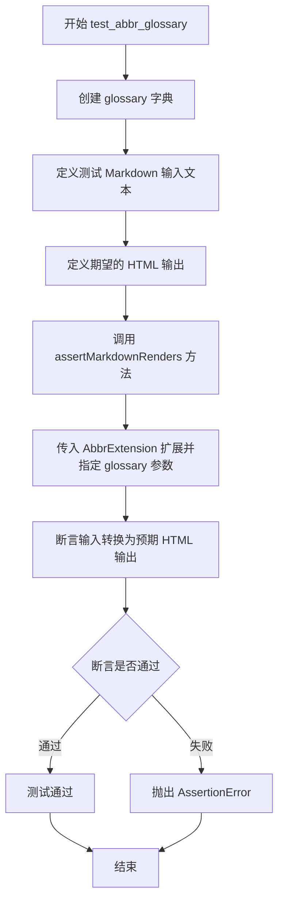

#### 带注释源码

```python
def test_abbr_glossary(self):
    """
    测试 AbbrExtension 扩展在接收外部 glossary 参数时
    能否正确将缩写词转换为 HTML abbr 标签
    """
    
    # 定义术语表字典，键为缩写词，值为全称
    glossary = {
        "ABBR": "Abbreviation",           # 大写缩写词
        "abbr": "小写缩写词",             # 小写缩写词
        "HTML": "Hyper Text Markup Language",  # HTML 标准
        "W3C": "World Wide Web Consortium"     # W3C 组织
    }

    # 调用断言方法验证 Markdown 转换结果
    self.assertMarkdownRenders(
        # 输入的 Markdown 文本（待转换的缩写词）
        self.dedent(
            """
            ABBR
            abbr

            HTML
            W3C
            """
        ),
        # 期望输出的 HTML 文本
        self.dedent(
            """
            <p><abbr title="Abbreviation">ABBR</abbr>
            <abbr title="Abbreviation">abbr</abbr></p>
            <p><abbr title="Hyper Text Markup Language">HTML</abbr>
            <abbr title="World Wide Web Consortium">W3C</abbr></p>
            """
        ),
        # 指定使用 AbbrExtension 扩展，并传入 glossary 参数
        extensions=[AbbrExtension(glossary=glossary)]
    )
```


### `TestAbbr.test_abbr_glossary_2`

该测试方法用于验证 Markdown 缩略语（AbbrExtension）的**词汇表动态加载与覆盖功能**。它首先创建一个包含多个缩略语定义的初始词汇表，然后通过 `load_glossary` 方法动态加载第二个词汇表（其中包含冲突的键），并断言渲染结果正确反映了后加载词汇表中的定义，同时保留了初始词汇表中未冲突的定义。

参数：
-  `self`：`TestCase`，Python `unittest` 测试框架的基类实例，提供了 `assertMarkdownRenders` 等断言方法及 `dedent` 辅助工具。

返回值：`None`，该方法为测试用例，无返回值，仅通过断言验证逻辑。

#### 流程图

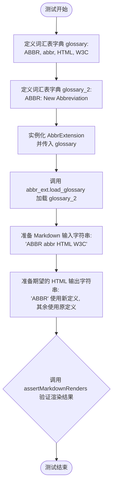

#### 带注释源码

```python
def test_abbr_glossary_2(self):
    """
    测试AbbrExtension的词汇表动态合并功能。
    验证后加载的词汇表可以覆盖先前的同名缩略语定义。
    """

    # 1. 定义基础词汇表，包含多个缩略语及其解释
    glossary = {
        "ABBR": "Abbreviation",
        "abbr": "Abbreviation",
        "HTML": "Hyper Text Markup Language",
        "W3C": "World Wide Web Consortium"
    }

    # 2. 定义第二个词汇表，仅包含一个冲突的键 'ABBR'
    glossary_2 = {
        "ABBR": "New Abbreviation"
    }

    # 3. 使用第一个词汇表初始化缩略语扩展
    abbr_ext = AbbrExtension(glossary=glossary)

    # 4. 动态加载第二个词汇表，预期会覆盖 'ABBR' 的定义
    abbr_ext.load_glossary(glossary_2)

    # 5. 定义 Markdown 源码输入
    input_text = self.dedent(
        """
        ABBR abbr HTML W3C
        """
    )

    # 6. 定义期望的 HTML 输出
    # 注意：'ABBR' 的 title 应该是 'New Abbreviation'，而 'abbr', 'HTML', 'W3C' 保持原样
    expected_html = self.dedent(
        """
        <p><abbr title="New Abbreviation">ABBR</abbr> """
        + """<abbr title="Abbreviation">abbr</abbr> """
        + """<abbr title="Hyper Text Markup Language">HTML</abbr> """
        + """<abbr title="World Wide Web Consortium">W3C</abbr></p>
        """
    )

    # 7. 调用父类测试框架的方法进行渲染和断言
    self.assertMarkdownRenders(
        input_text,
        expected_html,
        extensions=[abbr_ext]
    )
```


### `TestAbbr.test_abbr_nested`

该测试方法用于验证缩写（Abbreviation）功能在嵌套场景下的正确性，即当缩写词出现在链接或强调等 Markdown 元素内部时，AbbrExtension 扩展能够正确处理并生成对应的 HTML 输出。

参数：

- `self`：`TestCase`，测试类实例本身

返回值：`None`，该方法为测试用例，无返回值，通过 `assertMarkdownRenders` 断言验证转换结果

#### 流程图

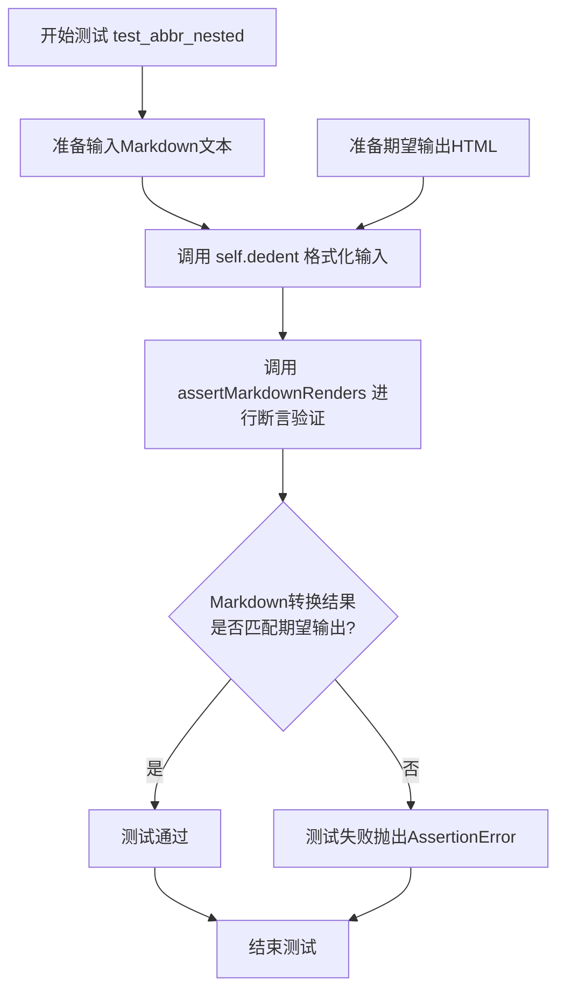

#### 带注释源码

```python
def test_abbr_nested(self):
    """
    测试缩写在嵌套结构中的处理能力。
    
    验证缩写词可以正确地嵌套在以下 Markdown 元素中：
    1. 链接 [text](url) 内部
    2. 强调 _text_ 内部
    
    同时验证缩写定义 [*ABBR]: Abbreviation 能够被正确识别和应用。
    """
    self.assertMarkdownRenders(
        # 输入的 Markdown 源代码
        self.dedent(
            """
            [ABBR](/foo)

            _ABBR_

            *[ABBR]: Abbreviation
            """
        ),
        # 期望输出的 HTML
        self.dedent(
            """
            <p><a href="/foo"><abbr title="Abbreviation">ABBR</abbr></a></p>
            <p><em><abbr title="Abbreviation">ABBR</abbr></em></p>
            """
        )
    )
```


### `TestAbbr.test_abbr_no_blank_Lines`

该测试方法用于验证当缩写定义（`*[ABBR]: Abbreviation`）位于段落中间且前面没有空行时，Markdown 解析器仍能正确处理，将文本中的缩写词转换为 HTML `<abbr>` 标签，并保持段落分隔。

参数：

- `self`：`TestCase`，测试类实例本身

返回值：`None`，无返回值（测试方法）

#### 流程图

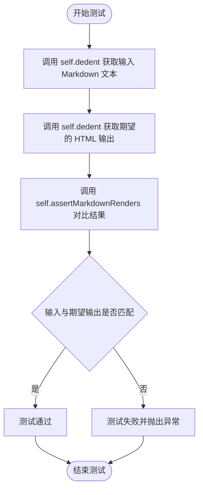

#### 带注释源码

```python
def test_abbr_no_blank_Lines(self):
    """
    测试缩写定义在段落中间且前面没有空行时的情况。
    
    测试场景：
    - 第一行：ABBR（需要被转换的缩写词）
    - 第二行：*[ABBR]: Abbreviation（缩写定义，没有空行分隔）
    - 第三行：ABBR（另一个需要被转换的缩写词）
    
    期望输出：
    - 两个独立的 <p> 段落
    - 每个段落中的 ABBR 都被转换为 <abbr> 标签
    """
    self.assertMarkdownRenders(
        self.dedent(
            """
            ABBR
            *[ABBR]: Abbreviation
            ABBR
            """
        ),
        self.dedent(
            """
            <p><abbr title="Abbreviation">ABBR</abbr></p>
            <p><abbr title="Abbreviation">ABBR</abbr></p>
            """
        )
    )
```


### `TestAbbr.test_abbr_no_space`

该测试方法用于验证 Markdown 解析器在缩写定义行中缺少空格的情况下（例如 `*[ABBR]:Abbreviation`），仍能正确识别缩写定义并生成对应的 HTML 缩写标签（`<abbr title="Abbreviation">ABBR</abbr>`）。

参数：

- `self`：`TestCase`，unittest 测试用例实例本身，用于调用继承自 TestCase 的辅助方法（如 `assertMarkdownRenders` 和 `dedent`）

返回值：`None`，该方法为测试方法，通过内部断言验证功能，不返回任何值

#### 流程图

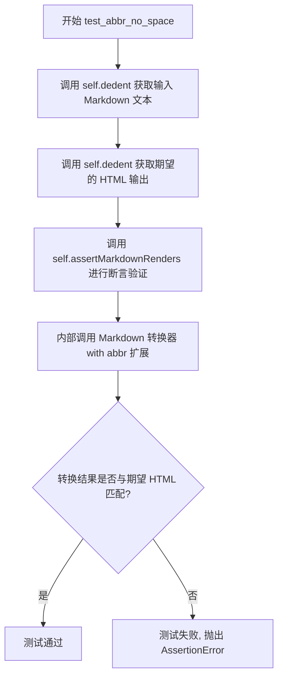

#### 带注释源码

```python
def test_abbr_no_space(self):
    """
    测试当缩写定义中没有空格时的情况。
    
    测试用例: * [ABBR]:Abbreviation (定义行中冒号后无空格)
    预期行为: 解析器仍能正确提取 'ABBR' 作为键,
             'Abbreviation' 作为值,并生成 <abbr> 标签
    """
    # 使用 dedent 方法规范化输入的 Markdown 源码
    # 输入: "ABBR\n\n*[ABBR]:Abbreviation"
    # 其中 *[ABBR]:Abbreviation 定义了缩写,即使冒号后无空格
    self.assertMarkdownRenders(
        self.dedent(
            """
            ABBR

            *[ABBR]:Abbreviation
            """
        ),
        # 期望输出的 HTML
        # 应该生成 <abbr> 标签包裹 "ABBR",title 属性为 "Abbreviation"
        self.dedent(
            """
            <p><abbr title="Abbreviation">ABBR</abbr></p>
            """
        )
    )
```


### `TestAbbr.test_abbr_extra_space`

该测试方法用于验证 Markdown 解析器在处理缩写定义时，能够正确识别在缩写名称方括号与冒号之间、以及冒号后存在多余空格的写法，并将文本中的缩写转换为带有 title 属性的 HTML `<abbr>` 标签。

参数：

- `self`：`TestCase`，测试类实例本身，包含测试所需的方法和属性

返回值：`None`，该方法为测试用例，通过 `assertMarkdownRenders` 断言验证 Markdown 转换结果，不返回任何值

#### 流程图

```mermaid
flowchart TD
    A[开始测试 test_abbr_extra_space] --> B[准备输入 Markdown 文本]
    B --> C[包含缩写文本 'ABBR' 和定义 '\*[ABBR] :      Abbreviation']
    C --> D[调用 self.assertMarkdownRenders 方法]
    D --> E[执行 Markdown 转换]
    E --> F[验证输出 HTML]
    F --> G{输出是否为预期结果}
    G -->|是| H[测试通过]
    G -->|否| I[测试失败, 抛出 AssertionError]
    H --> J[结束测试]
    I --> J
```

#### 带注释源码

```python
def test_abbr_extra_space(self):
    """
    测试缩写定义中包含额外空格的情况
    
    测试场景：
    - 缩写文本：ABBR
    - 缩写定义：*[ABBR] :      Abbreviation
      * 在 [ABBR] 后有一个空格
      * 在 : 后面有多个空格
    
    预期行为：
    - 即使定义格式中有额外空格，解析器仍应正确识别
    - 输出应将 ABBR 转换为 <abbr> 标签，title 为 'Abbreviation'
    """
    self.assertMarkdownRenders(
        self.dedent(
            """
            ABBR

            *[ABBR] :      Abbreviation
            """
        ),
        self.dedent(
            """
            <p><abbr title="Abbreviation">ABBR</abbr></p>
            """
        )
    )
```

---

### 关联的缩写扩展解析逻辑

`test_abbr_extra_space` 测试的是 AbbrExtension 的解析能力。该方法验证了当用户在定义缩写时在 `[ABBR]` 和 `:` 之间以及 `:` 后面添加额外空格时，Markdown 解析器仍然能够正确处理这种情况。

**关键点：**

1. **输入格式容错性**：测试用例在 `[ABBR]` 和 `:` 之间以及 `:` 后面添加了空格，验证解析器的容错能力
2. **输出预期**：无论定义格式如何，只要能成功解析，最终输出的 HTML 都应该一致
3. **测试目的**：确保用户编写 Markdown 时的微小格式差异（如多余空格）不会导致功能失效


### `TestAbbr.test_abbr_line_break`

该测试方法用于验证 Markdown 缩写（Abbr）扩展能够正确处理定义文本跨越多行的情况。当缩写定义（如 `*[ABBR]:`）后面跟随多行缩进文本时，系统应正确提取完整定义内容。

参数：

- `self`：`TestCase`，测试类的实例（隐式参数），包含测试所需的辅助方法

返回值：`None`，测试方法无返回值，通过 `assertMarkdownRenders` 断言验证行为

#### 流程图

```mermaid
flowchart TD
    A[开始测试] --> B[准备Markdown输入: 'ABBR\n\n*[ABBR]:\n    Abbreviation']
    B --> C[准备期望HTML输出: '<p><abbr title="Abbreviation">ABBR</abbr></p>']
    C --> D[调用self.assertMarkdownRenders进行断言]
    D --> E{断言是否通过}
    E -->|通过| F[测试通过]
    E -->|失败| G[测试失败, 抛出AssertionError]
```

#### 带注释源码

```python
def test_abbr_line_break(self):
    """
    测试缩写定义跨越多行时的解析行为。
    
    验证当缩写定义形式为:
    *[ABBR]:
        Abbreviation
    
    时，系统能正确提取"Abbreviation"作为title属性值。
    """
    # 调用dedent方法去除左侧多余缩进，构造Markdown源文本
    # 输入: "ABBR\n\n*[ABBR]:\n    Abbreviation"
    self.assertMarkdownRenders(
        self.dedent(
            """
            ABBR

            *[ABBR]:
                Abbreviation
            """
        ),
        # 期望的HTML输出结果
        # abbr标签的title属性应包含完整的定义文本
        self.dedent(
            """
            <p><abbr title="Abbreviation">ABBR</abbr></p>
            """
        )
    )
```


### `TestAbbr.test_abbr_ignore_unmatched_case`

该测试方法用于验证 Markdown 缩写扩展（abbr 插件）在处理大小写不匹配文本时的行为。测试确保当定义了某个大写的缩写（如 `ABBR`）时，文档中只有完全匹配（区分大小写）的文本才会被转换为 `<abbr>` 标签，而小写的变体（如 `abbr`）将保持不变。

参数：

- `self`：`TestCase`，测试实例本身，用于调用继承的 `assertMarkdownRenders` 和 `dedent` 方法

返回值：`None`，测试方法无返回值，通过断言验证预期结果

#### 流程图

```mermaid
flowchart TD
    A[开始测试] --> B[输入Markdown文本: 'ABBR abbr']
    B --> C[定义缩写: *[ABBR]: Abbreviation]
    C --> D[调用 Markdown 转换]
    D --> E{检查 'ABBR' 是否匹配定义?}
    E -->|是| F[转换为 <abbr title='Abbreviation'>ABBR</abbr>]
    E -->|否| G[保持原样 'ABBR']
    D --> H{检查 'abbr' 是否匹配定义?}
    H -->|是| I[转换为缩写标签]
    H -->|否| J[保持原样 'abbr']
    F --> K[生成最终HTML输出]
    J --> K
    K --> L[断言输出是否等于预期: '<p><abbr title='Abbreviation'>ABBR</abbr> abbr</p>']
    L --> M[测试通过]
```

#### 带注释源码

```python
def test_abbr_ignore_unmatched_case(self):
    """
    测试缩写扩展忽略大小写不匹配的情况
    
    验证规则：缩写匹配是区分大小写的
    - 'ABBR' 匹配定义 *[ABBR]: Abbreviation -> 转换为 <abbr> 标签
    - 'abbr' 不匹配定义 *[ABBR]: Abbreviation -> 保持原样
    """
    # 使用 assertMarkdownRenders 验证输入到输出的转换
    self.assertMarkdownRenders(
        # 输入的 Markdown 源代码（去除缩进）
        self.dedent(
            """
            ABBR abbr

            *[ABBR]: Abbreviation
            """
        ),
        # 期望输出的 HTML
        self.dedent(
            """
            <p><abbr title="Abbreviation">ABBR</abbr> abbr</p>
            """
        )
    )
```


### `TestAbbr.test_abbr_partial_word`

测试缩写词不会匹配部分单词，例如当文本中同时存在 "ABBR" 和 "ABBREVIATION" 时，"ABBR" 应该被转换为 `<abbr>` 标签，但 "ABBREVIATION" 保持原样不被转换。

参数：

- `self`：`TestCase`，测试类的实例对象，隐含的 `self` 参数

返回值：`None`，无返回值（测试方法通过 `assertMarkdownRenders` 进行断言验证）

#### 流程图

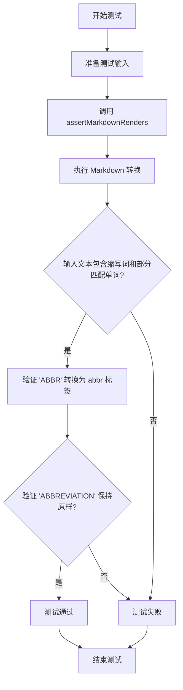

#### 带注释源码

```python
def test_abbr_partial_word(self):
    """
    测试缩写词不会匹配部分单词
    
    场景：文本中同时包含已定义的缩写词 'ABBR' 和包含该缩写词的完整单词 'ABBREVIATION'
    预期：'ABBR' 应被转换为 <abbr> 标签，而 'ABBREVIATION' 保持原样不被转换
    """
    self.assertMarkdownRenders(
        # 输入 Markdown 文本
        self.dedent(
            """
            ABBR ABBREVIATION

            *[ABBR]: Abbreviation
            """
        ),
        # 期望的 HTML 输出
        self.dedent(
            """
            <p><abbr title="Abbreviation">ABBR</abbr> ABBREVIATION</p>
            """
        )
    )
```


### `TestAbbr.test_abbr_unused`

该测试方法用于验证当 abbreviation 定义在 Markdown 中声明但未在实际文本使用时，该定义不会被渲染到输出中。

参数：

- `self`：`TestCase`，测试类实例本身

返回值：`None`，该方法为测试用例，通过 `assertMarkdownRenders` 断言验证渲染结果

#### 流程图

```mermaid
flowchart TD
    A[开始测试 test_abbr_unused] --> B[准备输入 Markdown 文本: 'foo bar\n\n*[ABBR]: Abbreviation']
    B --> C[准备期望输出 HTML: '<p>foo bar</p>']
    C --> D[调用 assertMarkdownRenders 验证渲染结果]
    D --> E{渲染结果是否匹配期望?}
    E -->|是| F[测试通过 - 返回 None]
    E -->|否| G[测试失败 - 抛出 AssertionError]
```

#### 带注释源码

```python
def test_abbr_unused(self):
    """
    测试未使用的缩写定义不会被渲染。
    
    验证场景：
    - 输入文本包含 'foo bar'（不含任何缩写）
    - 定义了 *[ABBR]: Abbreviation（缩写定义但未使用）
    - 期望输出仅为 '<p>foo bar</p>'，缩写定义不应出现在输出中
    """
    self.assertMarkdownRenders(
        # 使用 self.dedent 规范化输入 Markdown 文本
        self.dedent(
            """
            foo bar

            *[ABBR]: Abbreviation
            """
        ),
        # 期望的 HTML 输出（缩写未被使用，不应渲染）
        self.dedent(
            """
            <p>foo bar</p>
            """
        )
    )
```


### `TestAbbr.test_abbr_double_quoted`

该测试方法用于验证 Markdown 的缩写（abbr）扩展能够正确处理双引号括起来的缩写定义，并确保输出时双引号被正确 HTML 转义为 `&quot;`。

参数：

- `self`：`TestCase`（测试类实例本身），调用测试方法的类实例

返回值：`None`（无返回值，测试方法通过断言验证）

#### 流程图

```mermaid
flowchart TD
    A[开始测试 test_abbr_double_quoted] --> B[准备输入 Markdown 文本<br/>ABBR<br/>*[ABBR]: &quot;Abbreviation&quot;]
    B --> C[准备期望输出 HTML<br/>&lt;p&gt;&lt;abbr title=&quot;&amp;quot;Abbreviation&amp;quot;&quot;&gt;ABBR&lt;/abbr&gt;&lt;/p&gt;]
    C --> D[调用 assertMarkdownRenders 方法]
    D --> E[创建 Markdown 实例<br/>加载 abbr 扩展]
    E --> F[执行 Markdown.convert<br/>处理缩写定义和文本]
    F --> G{输出是否匹配<br/>期望的 HTML?}
    G -->|是| H[测试通过]
    G -->|否| I[测试失败<br/>抛出 AssertionError]
```

#### 带注释源码

```python
def test_abbr_double_quoted(self):
    """
    测试双引号括起来的缩写定义能被正确处理。
    
    验证当缩写定义使用双引号（如 "Abbreviation"）时，
    输出的 title 属性中双引号会被 HTML 转义为 &quot;。
    """
    # 调用 assertMarkdownRenders 方法进行测试
    # 第一个参数：输入的 Markdown 文本
    # 第二个参数：期望的 HTML 输出
    self.assertMarkdownRenders(
        # 使用 self.dedent 去除缩进，得到原始 Markdown 格式
        self.dedent(
            """
            ABBR

            *[ABBR]: "Abbreviation"
            """
        ),
        # 期望的 HTML 输出，双引号被转义为 &quot;
        self.dedent(
            """
            <p><abbr title="&quot;Abbreviation&quot;">ABBR</abbr></p>
            """
        )
    )
```

#### 详细说明

此测试方法验证了缩写扩展对双引号字符的正确处理：

1. **输入**：包含缩写词 `ABBR` 和其定义 `*[ABBR]: "Abbreviation"`
2. **处理过程**：Markdown 处理器解析缩写定义，提取双引号内的文本作为缩写说明
3. **输出**：在生成的 HTML 中，双引号字符被转义为 `&quot;`，以确保在 HTML 属性中正确显示
4. **验证**：期望输出为 `<p><abbr title="&quot;Abbreviation&quot;">ABBR</abbr></p>`

这确保了缩写定义中包含的双引号不会破坏 HTML 文档结构。


### `TestAbbr.test_abbr_single_quoted`

该测试方法用于验证 Markdown 缩写（Abbreviation）扩展在定义中使用单引号时能否正确解析和转换。它测试当缩写定义使用单引号包围时（如 `'Abbreviation'`），解析器能否正确识别并将其转换为 HTML 中的 `<abbr>` 标签，同时保持单引号在 title 属性中。

#### 参数

- `self`：TestCase，测试类实例本身，包含测试所需的断言方法和工具方法

#### 返回值

- `None`，该方法为测试用例方法，无返回值；通过 `assertMarkdownRenders` 断言验证 Markdown 转换结果是否符合预期

#### 流程图

```mermaid
flowchart TD
    A[开始测试 test_abbr_single_quoted] --> B[调用 self.dedent 获取输入 Markdown 文本]
    B --> C[输入: ABBR + 定义 *['ABBR']: 'Abbreviation']
    D[调用 self.dedent 获取期望 HTML 输出]
    D --> E[期望: &lt;p&gt;&lt;abbr title=&quot;'Abbreviation'&quot;&gt;ABBR&lt;/abbr&gt;&lt;/p&gt;]
    C --> F[调用 self.assertMarkdownRenders 执行转换验证]
    E --> F
    F --> G{转换结果是否匹配期望?}
    G -->|是| H[测试通过 - 无返回值/断言成功]
    G -->|否| I[测试失败 - 抛出 AssertionError]
```

#### 带注释源码

```python
def test_abbr_single_quoted(self):
    """
    测试缩写定义中使用单引号时的解析和转换功能。
    
    验证要点：
    1. 单引号可以用于包围缩写定义的标题（title）
    2. 转换后的 HTML 应保留单引号在 title 属性中
    """
    # 使用 assertMarkdownRenders 验证 Markdown 到 HTML 的转换
    # 第一个参数：输入的 Markdown 源码
    self.assertMarkdownRenders(
        self.dedent(
            """
            ABBR

            *[ABBR]: 'Abbreviation'
            """
        ),
        # 第二个参数：期望输出的 HTML 源码
        self.dedent(
            """
            <p><abbr title="'Abbreviation'">ABBR</abbr></p>
            """
        )
    )
```


### `TestAbbr.test_abbr_ignore_backslash`

该测试方法用于验证 Markdown 扩展在处理包含反斜杠的文本时，能够正确忽略反斜杠转义，不将带有反斜杠的内容识别为缩写。

参数：

- `self`：`TestCase`，测试用例实例方法，隐含的 `self` 参数

返回值：`None`，该方法是测试方法，无返回值，通过 `self.assertMarkdownRenders` 断言验证 Markdown 转换结果是否符合预期。

#### 流程图

```mermaid
graph TD
    A[开始测试 test_abbr_ignore_backslash] --> B[准备输入 Markdown 文本: \\\\foo 和定义 *[\\\\foo]: Not an abbreviation]
    B --> C[调用 self.dedent 去除缩进]
    C --> D[调用 Markdown 转换器处理文本]
    D --> E[获取实际输出的 HTML]
    E --> F[准备期望的 HTML: <p>\\foo</p> 和 <p>*[\\foo]: Not an abbreviation</p>]
    F --> G{实际输出 == 期望输出?}
    G -->|是| H[测试通过]
    G -->|否| I[测试失败, 抛出 AssertionError]
```

#### 带注释源码

```python
def test_abbr_ignore_backslash(self):
    """
    测试当文本中包含反斜杠时，缩写扩展应该忽略反斜杠转义。
    
    测试场景：
    - 输入包含 \\foo（反斜杠转义）
    - 输入包含 *[\\foo]: Not an abbreviation（定义但带有反斜杠）
    - 期望输出：反斜杠被保留，缩写定义不被识别为缩写
    """
    self.assertMarkdownRenders(
        self.dedent(
            r"""
            \\foo

            *[\\foo]: Not an abbreviation
            """
        ),
        self.dedent(
            r"""
            <p>\foo</p>
            <p>*[\foo]: Not an abbreviation</p>
            """
        )
    )
```


### `TestAbbr.test_abbr_hyphen`

这是一个测试方法，用于验证 Markdown 缩写扩展能够正确处理包含连字符（hyphen）的缩写词。测试定义了一个缩写 "*[ABBR-abbr]: Abbreviation"，然后验证文本 "ABBR-abbr" 是否被正确转换为带有 title 属性的 HTML `<abbr>` 标签。

参数：

- `self`：TestCase，测试用例的实例本身（隐式参数）

返回值：`None`，无返回值（测试方法，通过 assert 语句进行断言验证）

#### 流程图

```mermaid
flowchart TD
    A[开始执行 test_abbr_hyphen] --> B[调用 self.dedent 处理输入 Markdown 文本]
    B --> C[获取输入: 'ABBR-abbr<br><br>*[ABBR-abbr]: Abbreviation']
    C --> D[调用 self.dedent 处理期望的 HTML 输出]
    D --> E[获取期望输出: '<p><abbr title="Abbreviation">ABBR-abbr</abbr></p>']
    E --> F[调用 self.assertMarkdownRenders 进行断言验证]
    F --> G{断言结果}
    G -->|通过| H[测试通过]
    G -->|失败| I[测试失败, 抛出 AssertionError]
```

#### 带注释源码

```python
def test_abbr_hyphen(self):
    """
    测试带有连字符的缩写词是否能被正确处理。
    
    测试场景：
    - 输入文本包含缩写词 "ABBR-abbr"
    - 定义缩写的定义块 "*[ABBR-abbr]: Abbreviation"
    - 期望输出为带 title 属性的 <abbr> 标签
    """
    self.assertMarkdownRenders(
        # 输入的 Markdown 文本（经过 dedent 处理去除缩进）
        self.dedent(
            """
            ABBR-abbr

            *[ABBR-abbr]: Abbreviation
            """
        ),
        # 期望的 HTML 输出（经过 dedent 处理去除缩进）
        self.dedent(
            """
            <p><abbr title="Abbreviation">ABBR-abbr</abbr></p>
            """
        )
    )
```


### `TestAbbr.test_abbr_carrot`

该测试方法用于验证 Markdown 缩写（abbr）扩展能够正确处理包含脱字符（^）的缩写词。测试用例验证了当缩写定义中使用脱字符时，解析器能够正确识别并渲染为 HTML 的 `<abbr>` 标签。

参数：

- `self`：`TestCase`，测试类的实例对象，包含了 `assertMarkdownRenders` 等测试辅助方法

返回值：`None`，该方法为测试方法，通过 `assertMarkdownRenders` 断言验证渲染结果，不直接返回值

#### 流程图

```mermaid
flowchart TD
    A[开始测试 test_abbr_carrot] --> B[调用 self.dedent 处理输入 Markdown 文本]
    B --> C[调用 self.dedent 处理期望输出 HTML]
    C --> D[调用 self.assertMarkdownRenders 进行断言验证]
    D --> E{断言结果}
    E -->|通过| F[测试通过]
    E -->|失败| G[测试失败并抛出异常]
    
    subgraph 输入处理
    B1[输入: ABBR^abbr]
    B2[定义: *[ABBR^abbr]: Abbreviation]
    end
    
    subgraph 输出验证
    D1[期望: &lt;p&gt;&lt;abbr title=&quot;Abbreviation&quot;&gt;ABBR^abbr&lt;/abbr&gt;&lt;/p&gt;]
    end
```

#### 带注释源码

```python
def test_abbr_carrot(self):
    """
    测试缩写扩展对包含脱字符(^)的缩写词的处理能力。
    
    验证场景：
    - 缩写词本身包含特殊字符（脱字符^）
    - 定义格式：*[ABBR^abbr]: Abbreviation
    - 预期将ABB R^abbr整体作为一个缩写进行匹配和渲染
    """
    # 使用 assertMarkdownRenders 验证 Markdown 到 HTML 的转换
    # 第一个参数：输入的 Markdown 文本（经过 dedent 处理去除缩进）
    # 第二个参数：期望输出的 HTML 文本（经过 dedent 处理）
    self.assertMarkdownRenders(
        # 输入 Markdown：包含缩写词 ABBR^abbr 及其定义
        self.dedent(
            """
            ABBR^abbr

            *[ABBR^abbr]: Abbreviation
            """
        ),
        # 期望输出：HTML 中包含带有 title 属性的 abbr 标签
        self.dedent(
            """
            <p><abbr title="Abbreviation">ABBR^abbr</abbr></p>
            """
        )
    )
```


### `TestAbbr.test_abbr_bracket`

该测试方法用于验证Markdown缩写（abbr）扩展能够正确处理在缩写定义中包含方括号（]）字符的特殊情况。具体来说，它测试当缩写定义如`*[ABBR]abbr]: Abbreviation`中在缩写词内部包含右方括号时，解析器能否正确识别并转换文本中的缩写。

参数：

- `self`：`TestCase`，测试类的实例，继承自markdown.test_tools.TestCase

返回值：无（测试方法通过断言验证，不返回任何值）

#### 流程图

```mermaid
graph TD
    A[开始测试 test_abbr_bracket] --> B[调用 self.dedent 输入文本]
    B --> C[构建包含]字符的缩写定义: *&#91;ABBR]abbr]: Abbreviation]
    C --> D[调用 self.dedent 期望输出HTML]
    D --> E[调用 self.assertMarkdownRenders 对比输入输出]
    E --> F{输入匹配期望输出?}
    F -->|是| G[测试通过]
    F -->|否| H[测试失败, 抛出AssertionError]
    G --> I[结束]
    H --> I
```

#### 带注释源码

```python
def test_abbr_bracket(self):
    """
    测试缩写扩展处理定义中包含方括号的缩写词。
    
    此测试验证当缩写定义中包含"]"字符时（例如*[ABBR]abbr]: ...），
    缩写扩展能够正确解析并转换文本中的缩写，而不会将"]"误认为是
    定义块的结束标记。
    """
    # 使用assertMarkdownRenders方法验证Markdown转换结果
    self.assertMarkdownRenders(
        # 输入的Markdown文本，包含缩写词和定义
        self.dedent(
            """
            ABBR]abbr

            *[ABBR]abbr]: Abbreviation
            """
        ),
        # 期望的HTML输出，缩写词应被转换为<abbr>标签
        self.dedent(
            """
            <p><abbr title="Abbreviation">ABBR]abbr</abbr></p>
            """
        )
    )
```


### `TestAbbr.test_abbr_with_attr_list`

该测试方法验证缩写（abbr）扩展与属性列表（attr_list）扩展的兼容性，确保在使用属性列表时，缩写定义不会干扰图像的属性设置。

参数：

- `self`：`TestCase`，测试类实例本身

返回值：`None`，该方法为测试方法，通过断言验证结果，不返回具体值

#### 流程图

```mermaid
flowchart TD
    A[测试开始] --> B[准备Markdown输入: 定义缩写abbr和带属性的图像]
    B --> C[调用assertMarkdownRenders进行渲染验证]
    C --> D[使用abbr和attr_list扩展转换Markdown]
    D --> E{转换结果是否匹配预期HTML?}
    E -->|是| F[测试通过]
    E -->|否| G[测试失败 - 抛出AssertionError]
    
    subgraph "输入"
        B1[*[abbr]: Abbreviation Definition]
        B2[{title=...}]
    end
    
    subgraph "预期输出"
        D1[]
    end
    
    B --> B1
    B --> B2
    C --> D
```

#### 带注释源码

```python
def test_abbr_with_attr_list(self):
    """
    测试缩写扩展与属性列表扩展的兼容性
    
    验证当同时使用abbr和attr_list扩展时：
    1. 缩写定义 *[abbr]: Abbreviation Definition 会被正确解析
    2. 图像的attr_list属性 {title="Image with abbr in title"} 不会被缩写定义干扰
    3. 最终输出的HTML中图像标签包含正确的title属性
    """
    # 使用assertMarkdownRenders验证Markdown到HTML的转换
    self.assertMarkdownRenders(
        # 第一个参数: 输入的Markdown源码
        self.dedent(
            """
            *[abbr]: Abbreviation Definition

            {title="Image with abbr in title"}
            """
        ),
        # 第二个参数: 期望输出的HTML
        self.dedent(
            """
            <p></p>
            """
        ),
        # 第三个参数: 启用的扩展列表
        extensions=['abbr', 'attr_list']
    )
```


### `TestAbbr.test_abbr_superset_vs_subset`

该方法是 Python Markdown 测试套件中的一个测试用例，用于验证缩写扩展（AbbrExtension）能够正确区分和渲染具有包含关系的不同缩写词。具体来说，它测试了当文档中同时存在 "abbr"、"SS" 和 "abbr-SS" 三个不同的缩写定义时，每个缩写词都能正确匹配到其对应的定义，而不是发生混淆（例如将 "abbr-SS" 错误地拆分为 "abbr" 和 "SS"）。

参数：

- `self`：隐式参数，`TestCase` 实例，代表测试类本身

返回值：`None`，该方法为测试方法，通过 `assertMarkdownRenders` 断言验证渲染结果是否符合预期，无显式返回值

#### 流程图

```mermaid
flowchart TD
    A[开始测试 test_abbr_superset_vs_subset] --> B[准备 Markdown 源文本]
    B --> C[定义三个缩写: abbr, SS, abbr-SS]
    C --> D[调用 assertMarkdownRenders 进行断言验证]
    D --> E{验证结果是否正确}
    E -->|是| F[测试通过]
    E -->|否| G[测试失败, 抛出断言错误]
    
    subgraph "预期渲染结果"
    H[abbr → 'Abbreviation Definition']
    I[SS → 'Superset Definition']
    J[abbr-SS → 'Abbreviation Superset Definition']
    end
    
    F --> H
    F --> I
    F --> J
```

#### 带注释源码

```python
def test_abbr_superset_vs_subset(self):
    """
    测试缩写扩展能正确区分具有包含关系的缩写词。
    
    验证场景：
    - "abbr" 应匹配到 "Abbreviation Definition"
    - "SS" 应匹配到 "Superset Definition"  
    - "abbr-SS" 应匹配到 "Abbreviation Superset Definition"（而非被错误拆分）
    
    目的：确保当存在 'abbr' 和 'abbr-SS' 两个定义时，
    'abbr-SS' 不会被错误地识别为 'abbr' + 后续文本
    """
    self.assertMarkdownRenders(
        # 输入的 Markdown 源文本
        self.dedent(
            """
            abbr, SS, and abbr-SS should have different definitions.

            *[abbr]: Abbreviation Definition
            *[abbr-SS]: Abbreviation Superset Definition
            *[SS]: Superset Definition
            """
        ),
        # 期望的 HTML 输出
        self.dedent(
            """
            <p><abbr title="Abbreviation Definition">abbr</abbr>, """
            + """<abbr title="Superset Definition">SS</abbr>, """
            + """and <abbr title="Abbreviation Superset Definition">abbr-SS</abbr> """
            + """should have different definitions.</p>
            """
        )
    )
```


### `TestAbbr.test_abbr_empty`

该测试方法用于验证 Markdown 缩写扩展在处理空定义值时的行为，包括空括号、仅包含空格的括号、重复缩写定义等边界情况的正确处理。

参数：

- `self`：`TestCase`，测试类实例本身

返回值：`None`，该方法为测试方法，通过 `assertMarkdownRenders` 进行断言验证

#### 流程图

```mermaid
flowchart TD
    A[开始测试 test_abbr_empty] --> B[准备测试 Markdown 输入]
    B --> C[包含多种空定义场景]
    C --> D[定义缩写: *[abbr]: 后跟定义文本]
    C --> E[空定义: *[]: Empty]
    C --> F[空格定义: *[ ]: Empty]
    C --> G[重复缩写: *[abbr]: 和 *[ABBR]:]
    D --> H{调用 assertMarkdownRenders 验证输出}
    E --> H
    F --> H
    G --> H
    H --> I{输出是否符合预期}
    I -->|是| J[测试通过]
    I -->|否| K[测试失败]
    J --> L[结束]
    K --> L
```

#### 带注释源码

```python
def test_abbr_empty(self):
    """
    测试缩写扩展处理空定义值的边界情况。
    
    测试场景：
    1. 正常的缩写定义（*[abbr]: 后跟定义文本）
    2. 空缩写名称（*[]: Empty）
    3. 仅包含空格的缩写名称（*[ ]: Empty）
    4. 空的定义值（*[abbr]:）
    5. 大小写不同的重复缩写（*[ABBR]:）
    """
    self.assertMarkdownRenders(
        # 输入 Markdown 文本
        self.dedent(
            """
            *[abbr]:
            Abbreviation Definition

            abbr

            *[]: Empty

            *[ ]: Empty

            *[abbr]:

            *[ABBR]:

            Testing document text.
            """
        ),
        # 期望的 HTML 输出
        self.dedent(
            """
            <p><abbr title="Abbreviation Definition">abbr</abbr></p>\n"""
            + """<p>*[]: Empty</p>\n"""
            + """<p>*[ ]: Empty</p>\n"""
            + """<p>*[<abbr title="Abbreviation Definition">abbr</abbr>]:</p>\n"""
            + """<p>*[ABBR]:</p>\n"""
            + """<p>Testing document text.</p>
            """
        )
    )
```

---

### 测试场景详解

| 输入 | 期望输出 | 说明 |
|------|----------|------|
| `*[abbr]:\nAbbreviation Definition` | `<abbr title="Abbreviation Definition">abbr</abbr>` | 正常缩写定义 |
| `*[]: Empty` | `<p>*[]: Empty</p>` | 空缩写名称不被解析 |
| `*[ ]: Empty` | `<p>*[ ]: Empty</p>` | 空格缩写名称不被解析 |
| `*[abbr]:` | `*[abbr]:` | 空定义值不被解析为缩写 |
| `*[ABBR]:` | `*[ABBR]:` | 空定义值不被解析为缩写 |


### `TestAbbr.test_abbr_clear`

该测试方法用于验证 abbreviation 扩展的清除（clear）功能。测试首先定义两个缩写词（abbr 和 ABBR），然后在文档中使用它们，接着将这两个缩写词重新定义为空字符串，最后验证这些缩写词不再被渲染为 `<abbr>` 标签。

参数：

- `self`：`TestCase`，测试类的实例本身

返回值：`None`，该方法为测试方法，无返回值，通过断言验证逻辑正确性

#### 流程图

```mermaid
flowchart TD
    A[开始测试 test_abbr_clear] --> B[定义 abbr 和 ABBR 的缩写]
    B --> C[在文档中使用 abbr ABBR]
    C --> D[清空 abbr 和 ABBR 的定义 - 设为空字符串]
    D --> E[执行 Markdown 转换]
    E --> F{断言结果是否为 'abbr ABBR'}
    F -->|是| G[测试通过]
    F -->|否| H[测试失败]
    G --> I[结束]
    H --> I
```

#### 带注释源码

```python
def test_abbr_clear(self):
    """
    测试 abbreviation 的清除功能。
    
    测试流程：
    1. 首先定义两个缩写词: abbr 和 ABBR
    2. 在文档中使用这两个缩写词
    3. 将缩写词重新定义为空字符串（清空操作）
    4. 验证清空后缩写词不再被渲染为 abbr 标签
    """
    self.assertMarkdownRenders(
        self.dedent(
            """
            *[abbr]: Abbreviation Definition
            *[ABBR]: Abbreviation Definition

            abbr ABBR

            *[abbr]: ""
            *[ABBR]: ''
            """
        ),
        self.dedent(
            """
            <p>abbr ABBR</p>
            """
        )
    )
```


### `TestAbbr.test_abbr_reset`

该测试方法用于验证 Markdown 的 AbbrExtension（缩写扩展）在调用 `reset()` 方法后能够正确清空已注册的缩写定义列表，并确保后续转换时能够重新注册新的缩写。

参数：此方法无显式参数（`self` 为 Python 实例方法隐含参数）

返回值：`None`，该方法为测试用例，通过 `assertEqual` 断言验证功能，不返回具体值

#### 流程图

```mermaid
flowchart TD
    A[开始测试 test_abbr_reset] --> B[创建 AbbrExtension 实例 ext]
    B --> C[创建 Markdown 实例 md, 加载 ext 扩展]
    C --> D[第一次转换: md.convert '*[abbr]: Abbreviation Definition']
    D --> E{验证 ext.abbrs == {'abbr': 'Abbreviation Definition'}?}
    E -->|是| F[第二次转换: md.convert '*[ABBR]: Capitalised Abbreviation']
    E -->|否| Z[测试失败]
    F --> G{验证 ext.abbrs 包含两个缩写?}
    G -->|是| H[调用 md.reset 方法重置]
    G -->|否| Z
    H --> I{验证 ext.abbrs == {}?}
    I -->|是| J[第三次转换: md.convert '*[foo]: Foo Definition']
    I -->|否| Z
    J --> K{验证 ext.abbrs == {'foo': 'Foo Definition'}?}
    K -->|是| L[测试通过]
    K -->|否| Z
```

#### 带注释源码

```python
def test_abbr_reset(self):
    """
    测试 AbbrExtension 在 Markdown 实例重置后能否清空缩写定义列表。
    
    测试流程：
    1. 创建 AbbrExtension 实例并加载到 Markdown
    2. 第一次转换注册第一个缩写定义
    3. 验证第一个缩写已正确注册
    4. 第二次转换注册第二个缩写定义
    5. 验证两个缩写都已正确注册
    6. 调用 Markdown 的 reset() 方法
    7. 验证缩写定义列表已被清空
    8. 第三次转换注册新的缩写定义
    9. 验证新缩写能正确注册（重置后功能正常）
    """
    # 步骤1: 创建缩写扩展实例
    ext = AbbrExtension()
    
    # 步骤2: 创建 Markdown 实例并加载缩写扩展
    md = Markdown(extensions=[ext])
    
    # 步骤3: 执行第一次转换，注册缩写 'abbr'
    md.convert('*[abbr]: Abbreviation Definition')
    
    # 步骤4: 验证缩写 'abbr' 已正确注册到扩展中
    self.assertEqual(ext.abbrs, {'abbr': 'Abbreviation Definition'})
    
    # 步骤5: 执行第二次转换，注册缩写 'ABBR'（大写）
    md.convert('*[ABBR]: Capitalised Abbreviation')
    
    # 步骤6: 验证两个缩写（大写和小写）都已正确注册
    self.assertEqual(ext.abbrs, {'abbr': 'Abbreviation Definition', 'ABBR': 'Capitalised Abbreviation'})
    
    # 步骤7: 调用 Markdown 实例的 reset() 方法重置状态
    md.reset()
    
    # 步骤8: 验证缩写定义列表已被完全清空
    self.assertEqual(ext.abbrs, {})
    
    # 步骤9: 执行第三次转换，测试重置后能否注册新缩写
    md.convert('*[foo]: Foo Definition')
    
    # 步骤10: 验证新缩写 'foo' 已正确注册（确认 reset 后扩展功能正常）
    self.assertEqual(ext.abbrs, {'foo': 'Foo Definition'})
```

## 关键组件


### 核心功能概述

该代码是Python Markdown库中缩写(Abbr)扩展的测试套件，验证缩写定义、匹配、渲染以及与其它Markdown语法（链接、强调等）的嵌套处理能力，同时支持通过glossary自定义词汇表进行缩写扩展。

### 文件整体运行流程

测试文件通过`TestCase`基类构建，定义`default_kwargs`指定默认加载`abbr`扩展。每个测试方法使用`assertMarkdownRenders`验证Markdown源码经过转换后的HTML输出是否符合预期。测试覆盖缩写定义语法解析、文本匹配替换、嵌套元素处理、glossary加载与覆盖、重置机制等场景。

### 类详细信息

#### TestAbbr类

**类字段：**
- `maxDiff`: `int` - 设置测试差异显示无限制
- `default_kwargs`: `dict` - 默认扩展配置`{'extensions': ['abbr']}`

**类方法：**
- `test_ignore_atomic`: 测试URL中包含缩写模式时不替换
- `test_abbr_upper`: 测试大写缩写渲染
- `test_abbr_lower`: 测试小写缩写渲染
- `test_abbr_multiple_in_text`: 测试文本中多个缩写
- `test_abbr_multiple_in_tail`: 测试尾部多个缩写
- `test_abbr_multiple_nested`: 测试缩写与强调嵌套
- `test_abbr_override`: 测试缩写重复定义后者覆盖前者
- `test_abbr_glossary`: 测试通过glossary参数传入词汇表
- `test_abbr_glossary_2`: 测试glossary的load_glossary方法
- `test_abbr_nested`: 测试缩写在链接和强调中嵌套
- `test_abbr_no_blank_Lines`: 测试无空行时缩写定义有效
- `test_abbr_no_space`: 测试定义行无空格情况
- `test_abbr_extra_space`: 测试定义行多余空格容错
- `test_abbr_line_break`: 测试多行定义内容
- `test_abbr_ignore_unmatched_case`: 测试大小写不匹配时不替换
- `test_abbr_partial_word`: 测试部分单词不匹配
- `test_abbr_unused`: 测试未使用的缩写定义不渲染
- `test_abbr_double_quoted`: 测试双引号包围的定义
- `test_abbr_single_quoted`: 测试单引号包围的定义
- `test_abbr_ignore_backslash`: 测试反斜杠转义处理
- `test_abbr_hyphen`: 测试带连字符的缩写
- `test_abbr_carrot`: 测试插入符在缩写中的处理
- `test_abbr_bracket`: 测试方括号在缩写中的处理
- `test_abbr_with_attr_list`: 测试缩写与属性列表扩展结合
- `test_abbr_superset_vs_subset`: 测试超集与子集缩写的优先级
- `test_abbr_empty`: 测试空定义和特殊边界情况
- `test_abbr_clear`: 测试通过空字符串清除缩写
- `test_abbr_reset`: 测试Markdown实例reset方法清空缩写

### 关键组件信息

#### AbbrExtension缩写扩展组件

负责解析Markdown文档中的缩写定义语法`*[ABBR]: Definition`，并在文档中匹配已定义缩写并替换为`<abbr>`HTML标签。

#### Glossary词汇表组件

支持通过构造函数传入字典或`load_glossary`方法动态加载额外词汇表，实现缩写的批量定义和运行时扩展。

#### 大小写处理组件

区分大小写的缩写匹配机制，验证`ABBR`和`abbr`为不同缩写，支持定义大小写变体。

#### 嵌套渲染组件

处理缩写与其它Markdown语法（链接`[text](url)`、强调`*text*`等）的嵌套关系，确保正确包裹HTML结构。

#### 边界情况处理组件

处理URL中的模式匹配、连字符缩写、部分单词匹配、引号包围定义、多行定义、空定义清除等边界场景。

### 潜在技术债务或优化空间

1. **测试覆盖重复模式**：多个测试方法使用相似的输入输出模式，可提取为参数化测试减少代码冗余
2. **断言消息缺失**：测试未提供自定义断言失败消息，调试时缺乏上下文信息
3. **硬编码测试数据**：大量硬编码的HTML字符串，可考虑 fixtures 或测试数据文件管理

### 其它项目

#### 设计目标与约束

- 遵循Markdown缩写语法规范
- 支持大小写敏感的缩写匹配
- 与其它Markdown扩展兼容共存

#### 错误处理与异常设计

- 无效缩写定义（如空名称）应忽略而非抛出异常
- 重置后缩写字典应为空状态

#### 数据流与状态机

1. 初始化：加载abbr扩展，创建AbbrExtension实例
2. 解析阶段：扫描文档识别缩写定义语法，存储至abbrs字典
3. 渲染阶段：遍历文档文本，正则匹配已定义缩写，替换为`<abbr>`标签
4. 重置阶段：清空abbrs字典，支持同一Markdown实例处理多文档

#### 外部依赖与接口契约

- 依赖`markdown.test_tools.TestCase`基类
- 依赖`markdown.Markdown`主类
- 依赖`markdown.extensions.abbr.AbbrExtension`扩展类
- `AbbrExtension`提供`glossary`参数构造和`load_glossary`方法用于动态加载词汇表


## 问题及建议


### 已知问题

-   **测试方法缺乏文档字符串**：所有测试方法均无docstring说明其测试意图和预期行为，不利于后期维护和理解测试目的。
-   **maxDiff = None的风险**：设置`maxDiff = None`可能导致测试失败时输出极长的差异信息，反而增加调试难度。
-   **重复的代码模式**：大量测试方法中使用`self.dedent()`包装HTML预期结果，造成代码冗余，可通过pytest参数化或fixture重构。
-   **硬编码的扩展配置**：`default_kwargs`类属性仅用于部分测试，部分测试方法内联定义extensions参数，不一致可能导致维护困难。
-   **测试隔离性问题**：测试方法`test_abbr_glossary_2`修改了已有扩展实例的状态（调用`load_glossary`），可能影响其他测试的执行顺序和结果。
-   **魔法字符串缺乏常量定义**：缩写定义的关键模式（如`*[abbr]:`、`<abbr>`）以字符串形式散落各处，无常量统一管理。

### 优化建议

-   为每个测试方法添加详细的docstring，说明测试的Markdown输入、预期输出及测试目的。
-   移除`maxDiff = None`或设置合理的限制，避免过多输出干扰调试。
-   使用pytest的`@pytest.mark.parametrize`装饰器重构相似测试用例，减少重复代码。
-   统一扩展配置方式，避免在部分测试方法中内联定义extensions，建议使用pytest fixture统一管理Markdown实例和扩展。
-   将测试方法`test_abbr_glossary_2`改为创建新的扩展实例而非修改现有实例，确保测试间无状态共享。
-   提取正则表达式模式、HTML标签等为模块级常量，提高代码可读性和可维护性。

## 其它


### 设计目标与约束

本测试文件旨在验证Markdown库的缩写(Abbr)扩展功能的核心行为，包括大小写敏感性、嵌套支持、多重缩写、缩写覆盖、空白行处理等场景。设计约束要求保持与现有Markdown语法的一致性，确保缩写定义在文档中以星号定义的行形式出现，且支持通过glossary参数动态加载缩写字典。测试覆盖了缩写在不同上下文（链接、强调、属性列表等）中的表现，同时验证了大小写不匹配、部分匹配、连字符分隔等边界情况。

### 错误处理与异常设计

测试文件主要采用assertMarkdownRenders方法进行验证，该方法内部处理输入输出对比，当测试失败时展示完整的差异信息（通过maxDiff=None设置）。对于缩写扩展的异常情况，如空定义(*[]: Empty)、仅空格定义(*[ ]: Empty)等，测试验证系统能够正确处理而非抛出异常。测试还覆盖了缩写清除(*[abbr]: """)和重置(reset)场景，验证扩展状态的正确管理。

### 数据流与状态机

缩写处理流程遵循以下状态机：初始化阶段加载glossary或从文档解析缩写定义；转换阶段在预处理器中识别缩写标记模式(\*\[abbr\]: definition)，将缩写存入内部字典；渲染阶段通过TreeProcessor遍历文本节点，使用正则表达式匹配已定义缩写并替换为\<abbr\>HTML标签。关键状态转换包括：定义解析→字典存储→文本匹配→标签替换→HTML输出。

### 外部依赖与接口契约

本测试依赖于markdown核心库(Markdown类)和abbr扩展(AbbrExtension类)。AbbrExtension构造函数接受可选的glossary参数用于预定义缩写映射。扩展提供load_glossary方法允许动态加载额外缩写定义，abbrs属性暴露当前所有已定义缩写的字典。测试通过extensions参数将扩展实例注入Markdown转换器，验证接口契约的完整性。

### 性能考虑

测试用例中包含大量重复文本和多重缩写的场景，用于评估扩展在处理大型文档时的性能表现。缩写匹配使用正则表达式，测试了部分匹配和完整匹配的边界情况，确保不会因贪婪匹配导致性能问题或语义错误。

### 安全性考虑

测试覆盖了特殊字符处理场景，包括双引号、单引号、转义反斜杠等，验证HTML转义的正确性。对于用户提供的glossary内容，测试确保即使包含恶意构造的缩写定义也能被安全处理，不会导致XSS或其他注入问题。

### 测试策略

采用基于属性的测试方法，通过assertMarkdownRenders统一接口验证输入Markdown文本经过指定扩展转换后的HTML输出。测试参数通过default_kwargs设置默认扩展配置，dedent方法标准化多行字符串格式。测试类继承自TestCase支持pytest的发现和执行机制。

### 版本兼容性

测试文件头部标注版权信息显示支持Python Markdown v.1.7及以后版本，同时保持对早期版本(v.0.2-1.6b)的兼容性接口。测试用例涵盖新版本特性如属性列表扩展与缩写的组合使用，以及早期版本的行为兼容性验证。

### 配置管理

测试通过default_kwargs类属性提供默认配置集中管理，支持在单个测试方法级别通过kwargs参数覆盖。AbbrExtension的glossary参数支持从外部传入字典配置，实现配置与测试逻辑的分离。测试数据与测试逻辑的分离便于维护和扩展。

### 边界条件与极端场景

测试覆盖了丰富的边界条件：大小写混合(ABBR vs abbr)、空定义与空白定义、缩写覆盖与累加、缩写与普通文本的混合、缩写在链接/强调等嵌套元素中的行为、连字符和特殊字符(^*])在缩写中的处理、部分匹配与完整匹配的区分、文档重置后缩写的清除等。

    