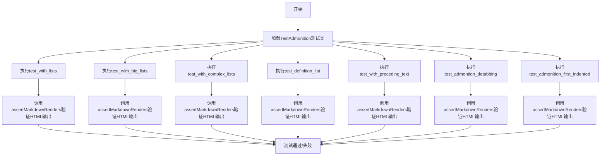
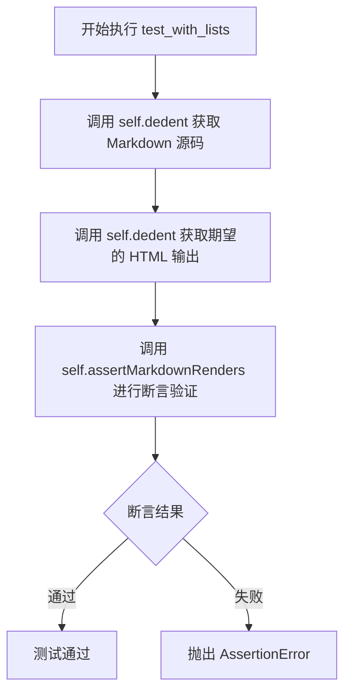
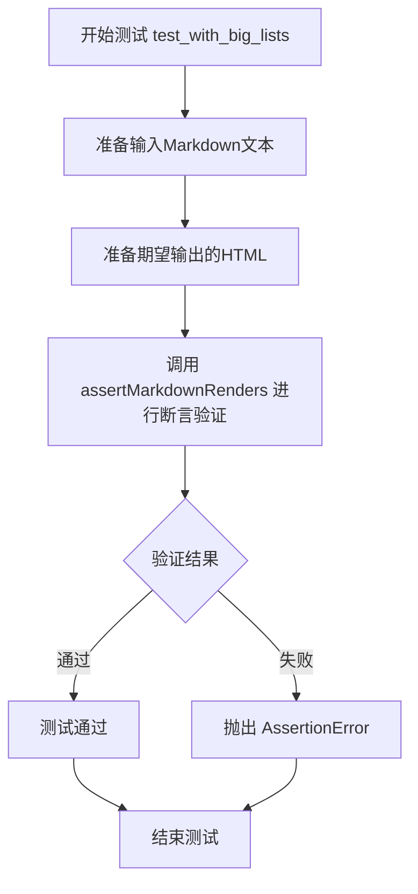
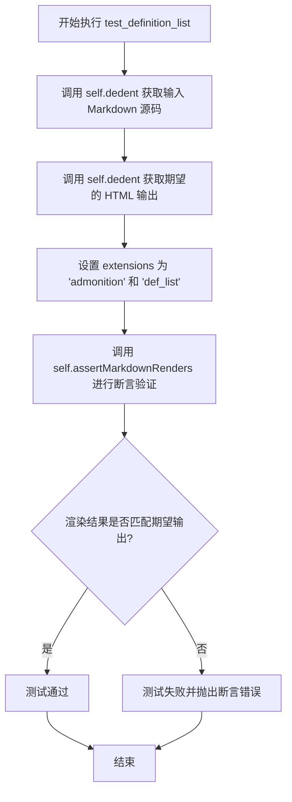
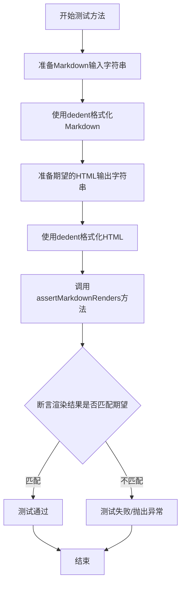

# `markdown\tests\test_syntax\extensions\test_admonition.py` 详细设计文档

这是Python Markdown项目的测试文件，用于测试admonition扩展在不同场景下（包括列表、嵌套列表、定义列表等）将Markdown语法转换为HTML的行为是否符合预期

## 整体流程



## 类结构

```
TestCase (基类)
└── TestAdmonition (测试类)
```

## 全局变量及字段


### `TestAdmonition.dedent`
    
继承自TestCase的工具方法，用于去除多行字符串的公共前缀缩进

类型：`method`
    


### `TestAdmonition.assertMarkdownRenders`
    
继承自TestCase的断言方法，用于验证Markdown源码是否正确渲染为预期的HTML输出

类型：`method`
    
    

## 全局函数及方法


### `TestAdmonition.test_with_lists`

该测试方法用于验证 Python Markdown 库的 admonition 扩展在处理列表（ul/li）时的正确性，确保带有列表的警告框（admonition）能够被正确渲染为 HTML。

参数：

- `self`：`TestCase`，隐式参数，表示测试类实例本身

返回值：`None`，该方法为测试用例，通过 `assertMarkdownRenders` 断言验证渲染结果，无显式返回值

#### 流程图



#### 带注释源码

```python
def test_with_lists(self):
    """
    测试 admonition 扩展在处理列表时的渲染正确性
    
    测试场景：
    1. 包含一个无序列表项
    2. 列表项内部包含一个 admonition（类型为 note，标题为 Admontion）
    3. admonition 内部又包含一个无序列表
    4. 列表项内部包含段落文本
    """
    # 使用 self.dedent 移除源代码的共同缩进，获取测试用的 Markdown 源码
    self.assertMarkdownRenders(
        self.dedent(
            '''
            - List

                !!! note "Admontion"

                    - Paragraph

                        Paragraph
            '''
        ),
        # 使用 self.dedent 获取期望的 HTML 输出
        self.dedent(
            '''
            <ul>
            <li>
            <p>List</p>
            <div class="admonition note">
            <p class="admonition-title">Admontion</p>
            <ul>
            <li>
            <p>Paragraph</p>
            <p>Paragraph</p>
            </li>
            </ul>
            </div>
            </li>
            </ul>
            '''
        ),
        # 指定使用的扩展：admonition
        extensions=['admonition']
    )
```


### `TestAdmonition.test_with_big_lists`

该测试方法用于验证Python Markdown库的admonition扩展在处理包含多个列表项的admonition块时能否正确将Markdown转换为HTML，确保嵌套在admonition中的多个列表项被正确渲染为HTML的`<ul>`和`<li>`元素。

参数：
- 无（除self外无显式参数）

返回值：`None`，测试方法通过断言验证输出，不返回具体值

#### 流程图



#### 带注释源码

```python
def test_with_big_lists(self):
    """
    测试admonition扩展处理多个列表项的能力
    
    验证当admonition块内包含多个列表项（- Paragraph）时，
    Markdown解析器能否正确生成包含多个<li>元素的HTML结构
    """
    # 准备输入的Markdown源代码
    # 包含一个无序列表，列表项内嵌套admonition，admonition内又包含两个列表项
    self.assertMarkdownRenders(
        self.dedent(
            '''
            - List

                !!! note "Admontion"

                    - Paragraph

                        Paragraph

                    - Paragraph

                        paragraph
            '''
        ),
        # 期望输出的HTML
        # admonition内部应包含一个<ul>，该<ul>包含两个<li>元素
        self.dedent(
            '''
            <ul>
            <li>
            <p>List</p>
            <div class="admonition note">
            <p class="admonition-title">Admontion</p>
            <ul>
            <li>
            <p>Paragraph</p>
            <p>Paragraph</p>
            </li>
            <li>
            <p>Paragraph</p>
            <p>paragraph</p>
            </li>
            </ul>
            </div>
            </li>
            </ul>
            '''
        ),
        # 使用admonition扩展进行解析
        extensions=['admonition']
    )
```


### `TestAdmonition.test_with_complex_lists`

该方法是一个单元测试，用于验证 Markdown 库的 admonition 扩展能够正确处理复杂嵌套场景：一个无序列表项中包含 admonition 警告框，警告框内又包含另一个无序列表，该列表项内再次包含嵌套的 admonition 和有序列表。

参数：

- `self`：`TestCase`，测试用例实例，隐式参数，继承自 TestCase 类

返回值：`None`，无返回值（测试方法通过 assertMarkdownRenders 断言验证）

#### 流程图

```mermaid
flowchart TD
    A[开始测试 test_with_complex_lists] --> B[准备输入 Markdown 源码]
    B --> C[使用 self.dedent 去除缩进]
    C --> D[准备期望输出的 HTML 源码]
    D --> E[使用 self.dedent 去除缩进]
    E --> F[调用 assertMarkdownRenders 进行断言验证]
    F --> G[传入输入源码、期望源码、extensions=['admonition']]
    G --> H{断言结果}
    H -->|通过| I[测试通过 - 返回 None]
    H -->|失败| J[抛出 AssertionError]
    
    style A fill:#f9f,stroke:#333
    style I fill:#9f9,stroke:#333
    style J fill:#f99,stroke:#333
```

#### 带注释源码

```python
def test_with_complex_lists(self):
    """
    测试复杂嵌套列表场景下的 admonition 扩展功能。
    验证场景：ul > li > admonition > ul > li > admonition > ol > li
    """
    # 第一步：定义输入的 Markdown 源码（去除缩进）
    # 包含三层嵌套结构：
    # 1. 外层无序列表
    # 2. 第一层 admonition（note类型，标题为"Admontion"）
    # 3. 第一层无序列表中的第二层 admonition
    # 4. 第二层 admonition 内的有序列表
    self.assertMarkdownRenders(
        self.dedent(
            '''
            - List

                !!! note "Admontion"

                    - Paragraph

                        !!! note "Admontion"

                            1. Paragraph

                                Paragraph
            '''
        ),
        # 第二步：定义期望输出的 HTML 源码
        self.dedent(
            '''
            <ul>
            <li>
            <p>List</p>
            <div class="admonition note">
            <p class="admonition-title">Admontion</p>
            <ul>
            <li>
            <p>Paragraph</p>
            <div class="admonition note">
            <p class="admontion-title">Admontion</p>
            <ol>
            <li>
            <p>Paragraph</p>
            <p>Paragraph</p>
            </li>
            </ol>
            </div>
            </li>
            </ul>
            </div>
            </li>
            </ul>
            '''
        ),
        # 第三步：指定使用的 Markdown 扩展
        extensions=['admonition']
    )
```


### `TestAdmonition.test_definition_list`

该测试方法用于验证 Markdown 在 admonition（警告框）扩展中正确渲染定义列表（definition list）的能力。它测试定义列表（包含术语 `Term` 和多个定义 `:   Definition` 和 `:   Another definition`）嵌套在 admonition 内部时的 HTML 输出是否符合预期。

参数： 无（仅使用 `self`）

返回值： 无（`None`），该方法为测试用例，通过 `assertMarkdownRenders` 断言验证渲染结果

#### 流程图



#### 带注释源码

```python
def test_definition_list(self):
    """
    测试在 admonition 内部渲染定义列表的功能
    
    该测试验证：
    1. 定义列表（dl, dt, dd 标签）能够在 admonition 内部正确渲染
    2. 多个定义项（:   Definition 和 :   Another definition）能正确处理
    3. 定义项内部可以包含段落和其他块级元素
    """
    # 调用 assertMarkdownRenders 验证 Markdown 到 HTML 的转换
    self.assertMarkdownRenders(
        # 输入的 Markdown 源码（使用 self.dedent 去除缩进）
        self.dedent(
            '''
            - List

                !!! note "Admontion"

                    Term

                    :   Definition

                        More text

                    :   Another
                        definition

                        Even more text
            '''
        ),
        # 期望输出的 HTML 源码
        self.dedent(
            '''
            <ul>
            <li>
            <p>List</p>
            <div class="admonition note">
            <p class="admonition-title">Admontion</p>
            <dl>
            <dt>Term</dt>
            <dd>
            <p>Definition</p>
            <p>More text</p>
            </dd>
            <dd>
            <p>Another
            definition</p>
            <p>Even more text</p>
            </dd>
            </dl>
            </div>
            </li>
            </ul>
            '''
        ),
        # 启用的 Markdown 扩展：admonition（警告框）和 def_list（定义列表）
        extensions=['admonition', 'def_list']
    )
```


### `TestAdmonition.test_with_preceding_text`

该测试方法用于验证 Markdown 在包含前导文本的情况下正确渲染警告框（Admonition），确保前导的段落文本与后续的警告框能够被正确解析为独立的 HTML 元素。

参数：

- `self`：`TestCase`，测试类的实例本身，隐含参数

返回值：`None`，该方法为测试方法，无返回值，通过 `assertMarkdownRenders` 断言验证渲染结果

#### 流程图

```mermaid
flowchart TD
    A[开始测试] --> B[准备 Markdown 源码: foo\n**foo**\n!!! note "Admonition"]
    B --> C[准备期望的 HTML 输出]
    C --> D[调用 assertMarkdownRenders 验证渲染结果]
    D --> E{断言是否通过}
    E -->|通过| F[测试通过]
    E -->|失败| G[测试失败]
```

#### 带注释源码

```python
def test_with_preceding_text(self):
    """
    测试 Markdown 在警告框前存在普通文本时的渲染行为。
    
    验证包含前导文本的警告框能够正确解析：
    - 前导的普通文本和格式化文本被渲染为 <p> 标签
    - 警告框被正确渲染为带有标题的 <div> 元素
    """
    # 第一个参数：输入的 Markdown 源码，包含前导文本和警告框声明
    self.assertMarkdownRenders(
        self.dedent(
            '''
            foo
            **foo**
            !!! note "Admonition"
            '''
        ),
        # 第二个参数：期望输出的 HTML 源码
        self.dedent(
            '''
            <p>foo
            <strong>foo</strong></p>
            <div class="admonition note">
            <p class="admonition-title">Admonition</p>
            </div>
            '''
        ),
        # 第三个参数：启用的 Markdown 扩展列表
        extensions=['admonition']
    )
```


### `TestAdmonition.test_admontion_detabbing`

这是一个测试方法，用于验证admonition扩展在处理嵌套列表时的正确渲染行为，特别是测试子列表项的缩进处理（detabbing）。

参数：

- 无显式参数（隐含参数`self`：测试类实例）

返回值：`None`，无返回值（测试方法）

#### 流程图



#### 带注释源码

```python
def test_admontion_detabbing(self):
    """
    测试admonition扩展处理嵌套列表的渲染功能。
    验证当admonition内部包含嵌套列表时，能够正确处理缩进（detabbing）。
    """
    # 调用assertMarkdownRenders进行断言验证
    self.assertMarkdownRenders(
        # 第一个参数：原始Markdown输入
        self.dedent(
            '''
            !!! note "Admonition"
                - Parent 1

                    - Child 1
                    - Child 2
            '''
        ),
        # 第二个参数：期望的HTML输出
        self.dedent(
            '''
            <div class="admonition note">
            <p class="admonition-title">Admonition</p>
            <ul>
            <li>
            <p>Parent 1</p>
            <ul>
            <li>Child 1</li>
            <li>Child 2</li>
            </ul>
            </li>
            </ul>
            </div>
            '''
        ),
        # 第三个参数：使用的扩展列表
        extensions=['admonition']
    )
```


### `TestAdmonition.test_admonition_first_indented`

该测试方法用于验证 Markdown 解析器在处理警告框（admonition）时，当标题内容跨越多行且第一行已缩进的情况下，能否正确将其解析为带有 `<pre><code>` 标签的代码块内容，而不是将整个多行标题合并为单一的警告框标题。

参数：

- `self`：`TestCase`，代表测试类实例本身，用于访问继承的断言方法和工具方法

返回值：`None`，该方法为测试用例，通过 `assertMarkdownRenders` 断言验证 Markdown 到 HTML 的转换结果是否符合预期，若不符合则抛出异常

#### 流程图

```mermaid
flowchart TD
    A[开始测试] --> B[准备输入 Markdown 源码]
    B --> C[使用 dedent 移除源源码缩进]
    C --> D[准备期望输出的 HTML]
    D --> E[使用 dedent 移除期望输出缩进]
    E --> F[调用 assertMarkdownRenders 进行断言验证]
    F --> G{验证结果}
    G -->|通过| H[测试通过 - 返回 None]
    G -->|失败| I[抛出 AssertionError 异常]
    
    B1[输入源码: !!! danger<br/>"This is not"<br/>one long admonition title]:::input
    D1[期望HTML: div.admonition.danger<br/>p.admonition-title: This is not<br/>pre>code: one long admonition title]:::expected
    
    B --> B1
    D --> D1
    
    classDef input fill:#e1f5fe,stroke:#0277bd
    classDef expected fill:#e8f5e9,stroke:#2e7d32
    classDef pass fill:#fff3e0,stroke:#ef6c00
    classDef fail fill:#ffebee,stroke:#c62828
```

#### 带注释源码

```python
def test_admonition_first_indented(self):
    """
    测试警告框标题第一行已缩进时的解析行为。
    
    当警告框标记（!!!）后面紧跟一个标题，
    而标题内容在下一行且有缩进时，应将后续行
    作为代码块内容而非标题的一部分。
    """
    # 调用 assertMarkdownRenders 进行渲染验证
    # 该方法继承自 TestCase，接收三个参数：
    # 1. source: 原始 Markdown 源码
    # 2. expected: 期望的 HTML 输出
    # 3. extensions: 启用的 Markdown 扩展列表
    self.assertMarkdownRenders(
        # 使用 dedent 工具方法移除源码中的公共缩进
        self.dedent(
            '''
            !!! danger "This is not"
                        one long admonition title
            '''
        ),
        # 期望的 HTML 输出
        # 注意：第二行的"one long admonition title"
        # 应被渲染为 <pre><code> 而非标题文本
        self.dedent(
            '''
            <div class="admonition danger">
            <p class="admonition-title">This is not</p>
            <pre><code>one long admonition title
            </code></pre>
            </div>
            '''
        ),
        # 启用 admonition 扩展来处理警告框语法
        extensions=['admonition']
    )
```

## 关键组件


### TestAdmonition 类

用于测试 Markdown 的 admonition（警告提示）扩展功能的测试类，验证不同场景下 admonition 块的正确渲染。

### assertMarkdownRenders 方法

从 TestCase 继承的断言方法，用于验证 Markdown 源码能够正确渲染为预期的 HTML 输出。

### dedent 方法

从 TestCase 继承的辅助方法，用于移除多行字符串的公共前导空白字符，保持代码格式整洁。

### admonition 扩展

Markdown 扩展模块，用于解析 !!! note "标题" 语法并渲染为带样式的警告提示 HTML 块。

### 列表嵌套测试场景

测试 admonition 块内部包含无序列表、有序列表时的渲染正确性，包括嵌套列表的处理。

### 定义列表测试场景

测试 admonition 与 def_list 扩展结合使用时，定义列表（dl/dt/dd 元素）的正确渲染。

### 缩进处理测试

测试 admonition 内容缩进的正确处理，包括子列表的去标签化（detabbing）逻辑。

### 边缘情况测试

测试长标题、前置文本等边缘场景下 admonition 的渲染行为。


## 问题及建议


### 已知问题

-   **测试数据硬编码**：所有测试输入和期望输出直接嵌入在测试方法中，导致测试数据无法复用，维护成本高。
-   **大量重复代码**：多个测试方法使用相同的 `self.dedent()` 模式和类似的 HTML 结构，代码冗余度高。
-   **魔法字符串散落**：扩展名称如 `'admonition'`、`'def_list'` 在多个测试方法中重复出现，缺乏统一管理。
-   **拼写变体**："Admontion"（非标准拼写）在测试数据中大量使用，虽然可能是为了测试容错性，但容易造成维护困惑。
-   **缺少参数化测试**：相似逻辑的测试（如 `test_with_lists`、`test_with_big_lists`、`test_with_complex_lists`）未使用 pytest 参数化功能，导致代码膨胀。
-   **测试方法命名不够描述性**：部分方法名如 `test_admontion_detabbing` 和 `test_admonition_first_indented` 未清晰表达测试意图。
-   **缺乏测试隔离保障**：未发现显式的 `setUp`/`tearDown` 或 fixture 清理机制，可能存在测试间状态污染风险。

### 优化建议

-   **提取测试数据到类级常量或 pytest fixtures**：将重复的 Markdown 片段和 HTML 预期输出定义为模块级或类级常量，或使用 `@pytest.fixture` 实现复用。
-   **使用 `@pytest.mark.parametrize` 重构相似测试**：将列表相关的测试（普通列表、大列表、复杂列表）合并为参数化测试，减少代码行数。
-   **封装辅助方法**：将通用的 `dedent()` 调用、扩展配置构建逻辑封装为类方法或 fixtures。
-   **创建测试数据工厂**：为不同场景（列表、定义列表、嵌套警告等）创建工厂方法，生成测试用例的输入输出对。
-   **统一管理扩展配置**：定义类级字典或枚举存储扩展名称，避免魔法字符串散落。
-   **补充测试文档**：为每个测试方法添加 docstring，说明测试场景、预期行为和边界条件。
-   **考虑添加测试隔离机制**：如果底层 Markdown 转换器有状态，考虑使用 pytest 的 `setup_method` 或 fixtures 确保每个测试独立运行。

## 其它


### 设计目标与约束

**设计目标**：验证Python Markdown库的admonition扩展在不同列表场景、定义列表、前导文本等复杂上下文中的HTML渲染正确性，确保警告框（admonition）能够正确嵌套、缩进和转换。

**约束条件**：
- 测试仅覆盖admonition扩展，不涉及其他Markdown语法
- 测试环境要求Python 3.x和markdown库v3.0+
- 测试用例使用UTF-8编码
- 所有测试方法必须通过才能认为admonition扩展功能正常

### 错误处理与异常设计

**断言失败处理**：当渲染结果与预期HTML不匹配时，assertMarkdownRenders方法会抛出AssertionError，并显示预期输出与实际输出的差异，便于快速定位问题。

**测试隔离**：每个测试方法相互独立，使用self.dedent()清理缩进，确保测试间无状态共享。

### 数据流与状态机

**测试数据流**：
1. 输入：Markdown格式字符串（包含列表、admonition标记）
2. 处理：markdown.convert()方法处理输入，启用admonition和def_list扩展
3. 输出：HTML字符串
4. 验证：assertMarkdownRenders对比预期HTML与实际输出

**状态转换**：
- 初始状态：原始Markdown文本
- 解析状态：Markdown解析器处理语法树
- 渲染状态：HTML生成
- 验证状态：断言比较

### 外部依赖与接口契约

**核心依赖**：
- markdown库：核心转换引擎
- markdown.test_tools.TestCase：测试基类，提供assertMarkdownRenders和dedent方法
- admonition扩展：处理!!! note/danger等语法
- def_list扩展：处理定义列表（test_definition_list使用）

**接口契约**：
- assertMarkdownRenders(input_markdown, expected_html, extensions)：核心验证接口
- dedent(text)：文本缩进清理工具
- extensions参数：支持字符串列表，动态加载扩展

### 性能考量

**测试执行性能**：
- 单个测试方法执行时间预计<100ms
- 建议在CI环境中批量执行，避免逐个运行
- 复杂嵌套场景（test_with_complex_lists）可能耗时较长

### 安全性考虑

**输入验证**：
- 测试输入为受控的Markdown文本，无用户直接输入
- HTML输出在生产环境需另行处理，防止XSS（Markdown库本身提供基本防护）

### 测试覆盖策略

**覆盖范围**：
- 基础admonition渲染（test_with_preceding_text）
- 列表内admonition（test_with_lists）
- 多段落列表（test_with_big_lists）
- 嵌套admonition（test_with_complex_lists）
- 定义列表支持（test_definition_list）
- 缩进处理（test_admontion_detabbing）
- 多行标题（test_admonition_first_indented）

**未覆盖场景**：
- 空admonition内容
- 自定义admonition类型
- 多语言标题
- HTML内嵌admonition

### 版本兼容性

**Python版本**：支持Python 3.6+

**Markdown库版本**：建议v3.2+，部分特性需v3.0+

### 配置文件格式

**测试配置**：
- 无独立配置文件
- 扩展配置通过extensions参数传递
- 可通过pytest.ini配置测试发现规则

### 日志设计

**日志级别**：测试框架默认使用pytest标准输出

**调试信息**：
- 断言失败时自动显示预期vs实际HTML差异
- 可通过pytest -v查看详细测试名称

### 扩展性设计

**扩展点**：
- 可通过添加新测试方法扩展覆盖范围
- 可继承TestAdmonition创建子类测试特定场景
- assertMarkdownRenders接口支持任意扩展组合

### 代码风格指南

**遵循规范**：
- PEP 8代码风格
- 测试方法使用snake_case
- 测试类使用CamelCase
- docstring描述测试意图

### 审核标准

**代码审查要点**：
- 验证预期HTML输出与Markdown语法对应关系
- 检查缩进处理逻辑（dedent方法）
- 确认扩展参数正确配置
- 验证HTML结构符合W3C规范


    