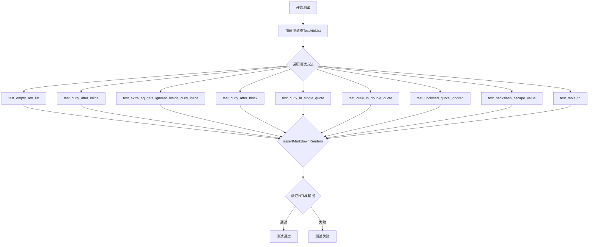
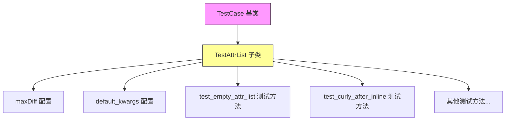
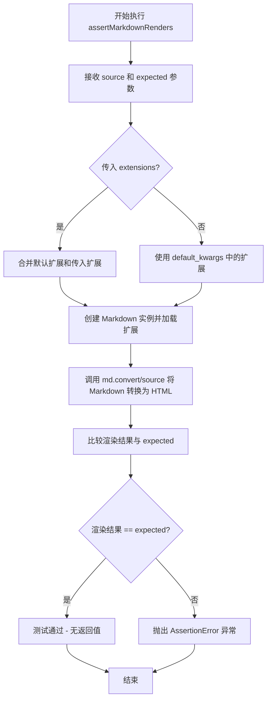
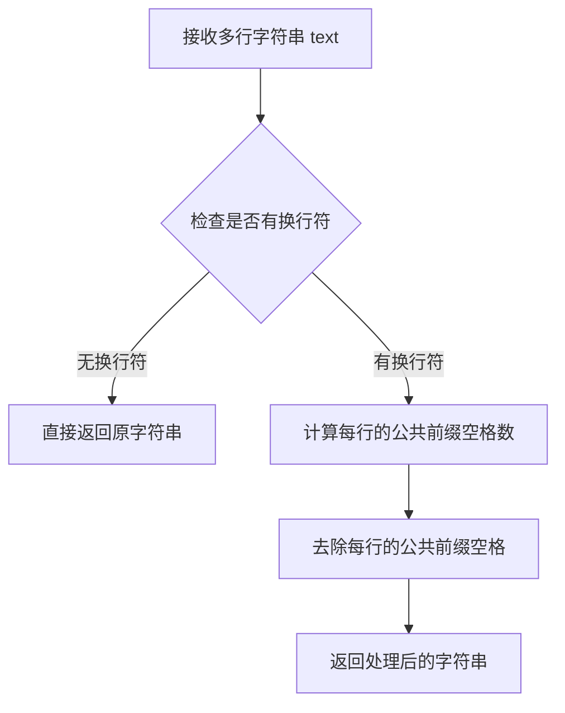
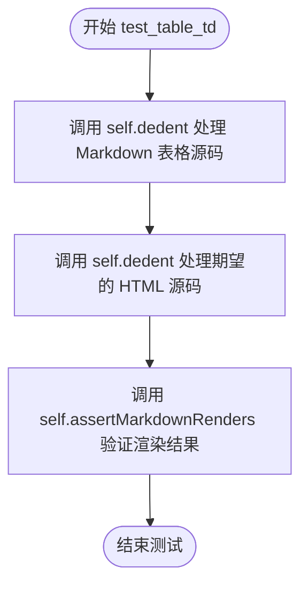

# `markdown\tests\test_syntax\extensions\test_attr_list.py` 详细设计文档

这是一个Python Markdown库的测试文件，专门用于测试attr_list（属性列表）扩展的各种功能，包括内联属性、块级属性、引号内的大括号处理、转义字符等场景，确保Markdown文本中的属性语法能正确转换为HTML属性。

## 整体流程



## 类结构

```
TestCase (markdown.test_tools中的基类)
└── TestAttrList (测试类)
    ├── maxDiff (类属性)
    ├── default_kwargs (类属性)
    ├── test_empty_attr_list (测试方法)
    ├── test_curly_after_inline (测试方法)
    ├── test_extra_eq_gets_ignored_inside_curly_inline (测试方法)
    ├── test_curly_after_block (测试方法)
    ├── test_curly_in_single_quote (测试方法)
    ├── test_curly_in_double_quote (测试方法)
    ├── test_unclosed_quote_ignored (测试方法)
    ├── test_backslash_escape_value (测试方法)
    └── test_table_td (测试方法)
```

## 全局变量及字段


### `TestAttrList.maxDiff`
    
控制测试失败时显示的差异量，None表示无限制

类型：`Optional[int]`
    


### `TestAttrList.default_kwargs`
    
测试用例的默认参数，包含默认启用的Markdown扩展列表

类型：`Dict[str, List[str]]`
    
    

## 全局函数及方法


### TestCase

`TestCase` 是从 `markdown.test_tools` 模块导入的测试基类，用于为 Markdown 项目的测试提供基础设施。注意：在给定的代码中只显示了 `TestCase` 的导入语句和其子类 `TestAttrList` 的实现，并未包含 `TestCase` 基类的具体源代码。以下信息基于代码中可见的 `TestAttrList` 子类对 `TestCase` 的使用方式来推断。

**描述**：这是一个测试框架基类，提供了 Markdown 测试所需的断言方法（如 `assertMarkdownRenders`）和测试配置功能（如 `default_kwargs`、`maxDiff` 等），被 `TestAttrList` 等测试类继承以实现具体的测试用例。

参数：

-  无（该信息基于导入语句推断，原始基类定义未在代码中提供）

返回值：

-  无（该信息基于导入语句推断，原始基类定义未在代码中提供）

#### 流程图



#### 带注释源码

```python
# markdown/test_tools 模块中 TestCase 基类的使用示例
# （注意：以下为 TestAttrList 子类代码，用于展示 TestCase 的实际使用方式）

from markdown.test_tools import TestCase  # 从 markdown.test_tools 导入 TestCase 基类


class TestAttrList(TestCase):
    """
    测试属性列表扩展的测试类，继承自 TestCase 基类
    """
    
    maxDiff = None  # 设置测试比较无限制（显示完整差异）
    
    default_kwargs = {'extensions': ['attr_list']}  # 默认参数：加载 attr_list 扩展
    
    # TODO: Move the rest of the `attr_list` tests here.
    
    def test_empty_attr_list(self):
        """测试空的属性列表"""
        self.assertMarkdownRenders(
            '*foo*{ }',  # 输入：带有空属性列表的 Markdown
            '<p><em>foo</em>{ }</p>'  # 期望输出：HTML
        )
    
    # 其他测试方法...
```

---

### TestAttrList.test_empty_attr_list

**描述**：这是 `TestAttrList` 类中的一个测试方法，用于测试空的属性列表 `{ }` 在 Markdown 到 HTML 的转换中是否被正确处理（在此场景下，空属性列表被保留而非解析）。

参数：

-  无（该方法无显式参数，使用类继承的 `assertMarkdownRenders` 方法进行测试）

返回值：

-  无（该方法为测试方法，使用断言进行验证，不返回具体值）

#### 流程图

```mermaid
flowchart TD
    A[开始 test_empty_attr_list] --> B[调用 assertMarkdownRenders]
    B --> C[输入: '*foo*{ }']
    B --> D[期望输出: '<p><em>foo</em>{ }</p>']
    C --> E[Markdown 解析器处理]
    D --> E
    E --> F{输出 == 期望?}
    F -->|是| G[测试通过]
    F -->|否| H[测试失败]
    
    style A fill:#9f9,stroke:#333
    style G fill:#9f9,stroke:#333
    style H fill:#f99,stroke:#333
```

#### 带注释源码

```python
def test_empty_attr_list(self):
    """
    测试属性列表扩展处理空属性列表的情况
    
    该测试验证当属性列表为空（仅包含空格）时，
    Markdown 解析器会将其保留为普通文本而非解析为 HTML 属性。
    """
    # 调用继承自 TestCase 的 assertMarkdownRenders 方法进行渲染验证
    self.assertMarkdownRenders(
        '*foo*{ }',  # 参数1: 输入的 Markdown 文本（斜体文本后跟空属性列表）
        '<p><em>foo</em>{ }</p>'  # 参数2: 期望的 HTML 输出（空属性列表被保留）
    )
```

---

### 补充说明

1. **TestCase 基类信息不完整**：由于给定的代码片段中仅包含 `TestCase` 的导入语句和其子类 `TestAttrList` 的实现，未包含 `TestCase` 基类的完整源代码（如 `assertMarkdownRenders`、`dedent` 等方法的实现），因此无法提供 `TestCase` 基类的完整详细信息。

2. **从代码中可推断的信息**：
   - `TestCase` 提供了 `assertMarkdownRenders()` 方法用于验证 Markdown 到 HTML 的转换结果
   - `TestCase` 提供了 `dedent()` 方法用于处理多行字符串的缩进
   - `TestCase` 支持通过 `default_kwargs` 类属性设置默认的 Markdown 转换参数
   - `TestCase` 支持通过 `maxDiff` 类属性设置测试差异显示方式


### `TestCase.assertMarkdownRenders`

该方法继承自 `markdown.test_tools.TestCase` 类，用于验证 Markdown 源码能够正确渲染为预期的 HTML 输出。它是测试框架的核心断言方法，通过比较实际渲染结果与期望结果来判断测试是否通过。

参数：

- `source`：`str`，Markdown 格式的源码输入
- `expected`：`str`，期望渲染生成的 HTML 输出
- `extensions`：`list[str]`，可选参数，用于指定要加载的 Markdown 扩展插件列表
- `**kwargs`：可选关键字参数，用于传递额外的配置选项（如 `default_kwargs` 中定义的参数）

返回值：`None`，无返回值（该方法为断言方法，测试失败时抛出异常，成功时无返回值）

#### 流程图



#### 带注释源码

```python
def assertMarkdownRenders(self, source, expected, extensions=None, **kwargs):
    """
    断言 Markdown 源码能够渲染为期望的 HTML 输出。
    
    参数:
        source: Markdown 格式的输入文本
        expected: 期望的 HTML 输出结果
        extensions: 可选的扩展名列表,例如 ['attr_list', 'tables']
        **kwargs: 额外的关键字参数,传递给 Markdown 处理器
    
    返回:
        None - 本方法为断言方法,不返回任何值
        
    工作流程:
        1. 合并 default_kwargs 与传入的 kwargs
        2. 如果指定了 extensions,则合并到配置中
        3. 创建 Markdown 实例并加载所需扩展
        4. 将 source 转换为 HTML
        5. 比较转换结果与 expected
        6. 不匹配时抛出 AssertionError
    """
    # 从类属性获取默认配置
    default_kwargs = getattr(self, 'default_kwargs', {})
    
    # 合并默认参数与传入参数
    kwargs = {**default_kwargs, **kwargs}
    
    # 处理扩展参数
    if extensions:
        if 'extensions' in kwargs:
            # 合并扩展列表
            kwargs['extensions'] = list(kwargs['extensions']) + list(extensions)
        else:
            kwargs['extensions'] = extensions
    
    # 创建 Markdown 实例
    md = Markdown(**kwargs)
    
    # 执行转换
    result = md.convert(source)
    
    # 断言结果匹配
    self.assertEqual(result, expected)
```


### `TestCase.dedent`

`dedent` 是一个继承自 `TestCase` 的辅助方法，用于去除多行字符串的公共前缀缩进，使多行字符串字面量在源代码中保持缩进格式的同时，输出时没有多余的前导空格。

参数：

-  `text`：`str`，需要进行去缩进处理的多行字符串

返回值：`str`，返回去除了公共前缀缩进后的字符串

#### 流程图



#### 带注释源码

```python
def dedent(self, text):
    """
    去除多行字符串的公共前缀缩进。
    
    该方法通常用于测试中，使多行字符串字面量在源代码中保持缩进格式，
    而在实际使用时（字符串比较等）没有多余的前导空格。
    
    参数:
        text: 需要进行去缩进处理的多行字符串
        
    返回值:
        去除公共前缀缩进后的字符串
    """
    # 由于 dedent 方法定义在 TestCase 基类中（来自 markdown.test_tools）
    # 而基类源码未在此代码文件中提供，此处为方法签名的展示
    # 该方法通常使用 textwrap.dedent() 实现类似功能
    pass
```


### TestAttrList.test_empty_attr_list

该测试方法用于验证 Markdown 的 attr_list 扩展在处理空属性列表 `{ }` 时的行为，确保空的属性列表不被解析为 HTML 属性，而是作为普通文本原样保留在输出中。

参数：

- `self`：`TestCase`，继承自 unittest.TestCase 的测试类实例，包含测试所需的断言方法和配置

返回值：`None`，该方法无返回值，通过 `assertMarkdownRenders` 断言方法验证 Markdown 到 HTML 的转换结果

#### 流程图

```mermaid
flowchart TD
    A[开始测试 test_empty_attr_list] --> B[设置测试输入]
    B --> C[输入: '*foo*{ }']
    C --> D[执行 Markdown 渲染]
    D --> E[期望输出: '<p><em>foo</em>{ }</p>']
    E --> F{实际输出是否符合期望}
    F -->|是| G[测试通过]
    F -->|否| H[测试失败 - 抛出 AssertionError]
    G --> I[测试结束]
    H --> I
```

#### 带注释源码

```python
def test_empty_attr_list(self):
    """
    测试空属性列表的处理行为。
    
    验证当 Markdown 中包含空的属性列表标记 { } 时，
    该标记不会被解析为 HTML 属性，而是作为普通文本保留。
    
    输入: '*foo*{ }'  (斜体文本后跟空属性列表标记)
    期望输出: '<p><em>foo</em>{ }</p>'  (空属性列表作为文本显示)
    """
    # 调用父类提供的断言方法验证 Markdown 渲染结果
    # 参数1: 输入的 Markdown 文本
    # 参数2: 期望的 HTML 输出
    # 继承的 default_kwargs 已设置 extensions=['attr_list']
    self.assertMarkdownRenders(
        '*foo*{ }',           # Markdown 输入: 斜体文本 + 空属性列表
        '<p><em>foo</em>{ }</p>'  # 期望 HTML: 斜体标签包裹 foo，空属性列表作为文本
    )
```


### `TestAttrList.test_curly_after_inline`

该测试方法用于验证 Markdown 的 `attr_list` 扩展在处理行内元素（如 emphasis）后面跟随花括号属性时的正确性，特别是当输入中存在空格和多余右花括号时的解析行为。

参数：

- `self`：`TestCase`（隐式参数），测试类的实例本身

返回值：`None`，无返回值（测试方法不返回值，通过断言验证行为）

#### 流程图

```mermaid
flowchart TD
    A[开始执行 test_curly_after_inline] --> B[调用 assertMarkdownRenders 方法]
    B --> C[传入 Markdown 源码: '*inline*{.a} } *text*{.a }}']
    B --> D[传入期望 HTML: '<p><em class="a">inline</em> } <em class="a">text</em>}</p>']
    B --> E[传入默认参数: extensions=['attr_list']]
    C --> F[Markdown 处理器解析源码]
    D --> F
    E --> F
    F --> G{渲染结果 == 期望值?}
    G -->|是| H[测试通过]
    G -->|否| I[测试失败, 抛出 AssertionError]
    H --> J[结束]
    I --> J
```

#### 带注释源码

```python
def test_curly_after_inline(self):
    """
    测试行内元素后面跟随花括号属性的解析行为。
    
    验证要点：
    1. *inline*{.a} 会被渲染为 <em class="a">inline</em>
    2. 后面的空格和单右花括号 } 会被视为普通文本
    3. *text*{.a }} 会被渲染为 <em class="a">text</em>，多余的 } 视为普通文本
    """
    self.assertMarkdownRenders(
        '*inline*{.a} } *text*{.a }}',  # Markdown 源码输入
        '<p><em class="a">inline</em> } <em class="a">text</em>}</p>'  # 期望的 HTML 输出
    )
```


### `TestAttrList.test_extra_eq_gets_ignored_inside_curly_inline`

该测试方法用于验证在行内元素的属性列表（花括号语法）中，额外的等号会被忽略的历史兼容性行为。例如，输入 `*inline*{data-test="x" =a} *text*` 中，等号及其后的值 `=a` 会被忽略，只保留有效的属性 `data-test="x"`。

参数：
- `self`：实例方法隐含参数，无需显式传递

返回值：`None`，该方法为测试用例，通过 `self.assertMarkdownRenders` 断言验证 Markdown 渲染结果，不返回任何值

#### 流程图

```mermaid
flowchart TD
    A[开始测试] --> B[调用 assertMarkdownRenders]
    B --> C[输入: '*inline\*{data-test=\"x\" =a} \*text\*']
    C --> D[期望输出: '<p><em data-test=\"x\">inline</em> <em>text</em></p>']
    D --> E{断言渲染结果是否匹配}
    E -->|匹配| F[测试通过]
    E -->|不匹配| G[测试失败]
```

#### 带注释源码

```python
def test_extra_eq_gets_ignored_inside_curly_inline(self):
    # Undesired behavior but kept for historic compatibility.
    # 注释说明：这是一个不受欢迎的行为，但为了保持历史兼容性而被保留
    # 测试场景：验证在行内元素的属性列表中，额外的等号（=a）会被忽略
    self.assertMarkdownRenders(
        '*inline*{data-test="x" =a} *text*',  # 输入：带有额外等号的行内元素属性
        '<p><em data-test="x">inline</em> <em>text</em></p>'  # 期望输出：只保留有效的属性 data-test="x"
    )
```


### `TestAttrList.test_curly_after_block`

该测试方法用于验证 Markdown 解析器在处理块级元素（如标题）后面跟随花括号属性列表时的行为。当标题后紧跟 `{ .a} }` 时，解析器应将其视为普通文本而非属性列表，以确保向后兼容性。

参数：

- `self`：`TestCase`，测试类实例本身

返回值：`None`，该方法为测试方法，通过 `assertMarkdownRenders` 验证渲染结果，不返回任何值

#### 流程图

```mermaid
graph TD
    A[开始测试 test_curly_after_block] --> B[调用 assertMarkdownRenders]
    B --> C[输入: '# Heading {.a} }']
    C --> D[期望输出: '<h1>Heading {.a} }</h1>']
    D --> E[验证属性列表扩展不应用于块级元素后的花括号]
    E --> F[测试通过]
    F --> G[结束]
```

#### 带注释源码

```python
def test_curly_after_block(self):
    """
    测试块级元素后的花括号属性列表行为。
    
    验证在标题（# Heading）后面跟随的 { .a} } 不会被解析为属性列表，
    而是作为普通文本保留。这是由于属性列表扩展主要设计用于行内元素，
    对于块级元素后的花括号保持向后兼容性。
    """
    # 调用父类的 assertMarkdownRenders 方法验证渲染结果
    self.assertMarkdownRenders(
        '# Heading {.a} }',  # Markdown 源代码输入
        '<h1>Heading {.a} }</h1>'  # 期望的 HTML 输出
    )
```


### `TestAttrList.test_curly_in_single_quote`

该测试方法验证 Markdown 属性列表扩展在处理单引号内包含花括号（`{}`）的属性值时能够正确解析，并将单引号转换为双引号，最终生成正确的 HTML 输出。

参数：

- `self`：`TestCase`，测试类实例本身，无需显式传递

返回值：`None`，无返回值（测试方法通过 `assertMarkdownRenders` 进行断言验证）

#### 流程图

```mermaid
flowchart TD
    A[开始测试 test_curly_in_single_quote] --> B[调用 assertMarkdownRenders 方法]
    B --> C[输入: # Heading {data-test='{}'}]
    D[期望输出: &lt;h1 data-test=&quot;{}&quot;&gt;Heading&lt;/h1&gt;]
    C --> E[Markdown 解析器处理属性列表]
    E --> F[提取属性 data-test='{}']
    F --> G[将单引号转换为双引号]
    G --> H[生成 HTML: &lt;h1 data-test=&quot;{}&quot;&gt;Heading&lt;/h1&gt;]
    H --> I{实际输出 == 期望输出?}
    I -->|是| J[测试通过]
    I -->|否| K[测试失败]
```

#### 带注释源码

```python
def test_curly_in_single_quote(self):
    """
    测试属性列表中单引号内的花括号能否正确处理。
    
    验证要点：
    1. 单引号包裹的属性值能被正确识别
    2. 花括号 {} 在单引号内应作为普通字符保留
    3. 单引号在最终输出中应转换为双引号
    """
    # 调用父类的 assertMarkdownRenders 方法进行渲染验证
    # 参数1: Markdown 源码，包含属性列表 {data-test='{}'}
    # 参数2: 期望的 HTML 输出，属性值使用双引号
    self.assertMarkdownRenders(
        "# Heading {data-test='{}'}",  # 输入: Markdown 标题 + 属性列表（单引号）
        '<h1 data-test="{}">Heading</h1>'  # 输出: 带属性的 HTML h1 标签
    )
```


### `TestAttrList.test_curly_in_double_quote`

该方法是一个单元测试，用于验证 Markdown 属性列表扩展在处理双引号内包含花括号（如 `{data-test="{}"}`）时的解析行为是否符合预期，确保双引号内的花括号被正确识别为属性值的一部分而非属性定义语法。

参数：

- `self`：`TestAttrList`（隐式参数），测试类实例本身

返回值：`None`（无返回值），该方法为测试用例，通过 `assertMarkdownRenders` 断言验证渲染结果

#### 流程图

```mermaid
flowchart TD
    A[开始测试 test_curly_in_double_quote] --> B[调用 assertMarkdownRenders 方法]
    B --> C[输入 Markdown: # Heading {data-test=&quot;{}&quot;}]
    C --> D[期望输出 HTML: &lt;h1 data-test=&quot;{}&quot;&gt;Heading&lt;/h1&gt;]
    D --> E{渲染结果是否匹配期望}
    E -->|是| F[测试通过]
    E -->|否| G[测试失败并抛出 AssertionError]
```

#### 带注释源码

```python
def test_curly_in_double_quote(self):
    """
    测试属性列表中双引号内包含花括号的解析行为。
    
    验证当属性值使用双引号包裹，且引号内包含花括号时，
    花括号应被识别为属性值的一部分，而非属性列表的结束标记。
    """
    # 调用父类测试框架的渲染验证方法
    # 参数1: 输入的 Markdown 文本，包含带属性的标题
    # 参数2: 期望渲染输出的 HTML 文本
    self.assertMarkdownRenders(
        '# Heading {data-test="{}"}',  # Markdown: 标题 + 属性列表，属性值双引号内含花括号
        '<h1 data-test="{}">Heading</h1>'  # HTML: 属性值中的花括号应被保留
    )
```


### `TestAttrList.test_unclosed_quote_ignored`

这是一个测试方法，用于验证 Markdown 属性列表扩展在处理未闭合引号时的行为。该测试确保当属性值包含未闭合的引号（如 `{foo="bar}`）时，系统能够正确处理并保留原始文本，同时将未闭合的引号进行 HTML 转义。

参数：

- `self`：`TestCase`，表示测试类实例本身

返回值：`None`，该方法为测试方法，无返回值，通过断言验证渲染结果

#### 流程图

```mermaid
flowchart TD
    A[开始测试] --> B[调用 assertMarkdownRenders 方法]
    B --> C[传入 Markdown 源码: '# Heading {foo=&quot;bar}']
    B --> D[传入期望的 HTML 输出: '<h1 foo=&quot;&amp;quot;bar&quot;>Heading</h1>']
    C --> E[Markdown 解析器处理属性列表]
    E --> F{检测引号是否闭合}
    F -->|未闭合| G[保留未闭合引号在属性值中]
    F -->|已闭合| H[正常处理属性]
    G --> I[对未闭合引号进行 HTML 转义]
    I --> J[生成最终 HTML]
    D --> K{断言: 实际输出 == 期望输出}
    K -->|是| L[测试通过]
    K -->|否| M[测试失败]
    L --> N[结束]
    M --> N
```

#### 带注释源码

```python
def test_unclosed_quote_ignored(self):
    """测试未闭合引号在属性列表中的处理行为。
    
    这是一个历史兼容性测试，用于验证以下场景：
    - Markdown 源码: '# Heading {foo="bar}'
    - 期望输出: '<h1 foo="&quot;bar">Heading</h1>'
    
    关键行为：
    1. 属性值中的未闭合引号 "bar 被保留
    2. 引号字符 " 被转义为 &quot;
    3. 这是不符合预期但为保持历史兼容性而保留的行为
    """
    # Undesired behavior but kept for historic compatibility.
    # 注释说明：这是不符合预期设计的行为，但为了保持与历史版本的兼容性而保留
    self.assertMarkdownRenders(
        '# Heading {foo="bar}',  # 输入: 带有未闭合引号的属性列表
        '<h1 foo="&quot;bar">Heading</h1>'  # 期望输出: 引号被转义为 &quot;
    )
```


### `TestAttrList.test_backslash_escape_value`

该方法用于测试属性列表中反斜杠转义功能是否正常工作。具体来说，它验证在属性值中使用反斜杠转义的星号（如 `\*`）能够正确地被处理为普通字符，最终在生成的HTML中显示为不带反斜杠的值。

参数： 无（除 `self` 外）

返回值： 无（测试方法，无返回值）

#### 流程图

```mermaid
flowchart TD
    A[开始执行 test_backslash_escape_value] --> B[调用 assertMarkdownRenders 方法]
    B --> C[传入 Markdown 源码: '# `*Foo*` { id=\"\\*Foo\\*\" }']
    B --> D[传入期望的 HTML: '<h1 id=\"*Foo*\"><code>*Foo*</code></h1>']
    B --> E[使用默认参数: extensions=['attr_list']]
    C --> F[执行 Markdown 转换]
    D --> F
    E --> F
    F --> G{转换结果是否匹配期望}
    G -->|是| H[测试通过]
    G -->|否| I[测试失败 - 抛出 AssertionError]
    H --> J[结束]
    I --> J
```

#### 带注释源码

```python
def test_backslash_escape_value(self):
    """
    测试属性列表中反斜杠转义值的处理功能。
    
    该测试方法验证以下场景:
    - 输入: Markdown 源码中包含使用反斜杠转义的属性值
      '# `*Foo*` { id="\\*Foo\\*" }'
    - 期望输出: HTML 中 id 属性值为 "*Foo*"（反斜杠被移除）
      '<h1 id="*Foo*"><code>*Foo*</code></h1>'
    
    反斜杠转义的作用是将字面字符转换为普通字符，
    使得属性值中可以包含特殊字符（如 *）而不被解释为分隔符。
    """
    self.assertMarkdownRenders(
        '# `*Foo*` { id="\\*Foo\\*" }',  # Markdown 源码输入
        '<h1 id="*Foo*"><code>*Foo*</code></h1>',  # 期望的 HTML 输出
        # 使用默认参数，这里显式指定扩展以确保 attr_list 扩展已加载
        # default_kwargs = {'extensions': ['attr_list']} 已默认设置
    )
```

#### 详细说明

| 项目 | 详情 |
|------|------|
| **所属类** | `TestAttrList` |
| **继承自** | `TestCase` (来自 `markdown.test_tools`) |
| **方法类型** | 测试方法 (Test Case) |
| **测试目的** | 验证属性列表扩展（attr_list）正确处理反斜杠转义的值 |
| **测试场景** | 检查 `id="\\*Foo\\*"` 在属性列表中被转换为 `id="*Foo*"` |
| **断言方法** | `self.assertMarkdownRenders(md_source, html_output, **kwargs)` |


### `TestAttrList.test_table_td`

该测试方法用于验证 Markdown 表格中表头（`<th>`）和表体（`<td>`）单元格正确应用属性列表扩展（attr_list）的功能，包括处理属性紧跟内容、空属性列表、属性缺少空格等边界情况。

参数：

- `self`：`TestAttrList`，测试类实例本身，用于调用父类方法 `assertMarkdownRenders` 和 `dedent`。

返回值：`None`，测试方法不返回任何值，仅通过断言验证 Markdown 渲染结果是否符合预期。

#### 流程图



#### 带注释源码

```python
def test_table_td(self):
    """
    测试表格单元格中属性列表的正确渲染。
    
    验证在 Markdown 表格的表头和表体中，属性（如 class）是否能够正确附加到
    单元格内容上，并处理各种边界情况：
    - 属性列表紧接内容（如 | A { .foo } |）
    - 空属性列表（如 | C { } |）
    - 属性列表缺少前导空格（如 | D{ .foo } |）
    - 属性列表不在单元格末尾（如 | E { .foo } F |）
    """
    # 使用 self.dedent 规范化 Markdown 表格源码，去除多余缩进
    md_source = self.dedent(
        """
        | A { .foo }  | *B*{ .foo } | C { } | D{ .foo }     | E { .foo } F |
        |-------------|-------------|-------|---------------|--------------|
        | a { .foo }  | *b*{ .foo } | c { } | d{ .foo }     | e { .foo } f |
        | valid on td | inline      | empty | missing space | not at end   |
        """
    )
    
    # 使用 self.dedent 规范化期望的 HTML 输出
    expected_html = self.dedent(
        """
        <table>
        <thead>
        <tr>
        <th class="foo">A</th>
        <th><em class="foo">B</em></th>
        <th>C { }</th>
        <th>D{ .foo }</th>
        <th>E { .foo } F</th>
        </tr>
        </thead>
        <tbody>
        <tr>
        <td class="foo">a</td>
        <td><em class="foo">b</em></td>
        <td>c { }</td>
        <td>d{ .foo }</td>
        <td>e { .foo } f</td>
        </tr>
        <tr>
        <td>valid on td</td>
        <td>inline</td>
        <td>empty</td>
        <td>missing space</td>
        <td>not at end</td>
        </tr>
        </tbody>
        </table>
        """
    )
    
    # 调用父类方法 assertMarkdownRenders，传入源码、期望输出和扩展列表
    # 扩展 'attr_list'：解析属性列表语法 { .class } 或 { #id }
    # 扩展 'tables'：解析 Markdown 表格语法
    self.assertMarkdownRenders(
        md_source,
        expected_html,
        extensions=['attr_list', 'tables']
    )
```

## 关键组件


### 一段话描述

该代码是Python Markdown项目的测试文件，通过TestCase类对`attr_list`扩展进行功能测试，验证属性列表（Attribute List）在不同上下文（行内元素、块级元素、表格单元格）中的解析行为，包括空属性、引号嵌套、转义字符等边界情况的处理。

### 文件的整体运行流程

1. 导入`markdown.test_tools`模块的`TestCase`基类
2. 定义`TestAttrList`测试类，继承自`TestCase`
3. 设置类级别配置：`maxDiff = None`用于完整显示断言差异，`default_kwargs`指定默认使用`attr_list`扩展
4. 定义多个测试方法，每个方法调用`assertMarkdownRenders`验证Markdown源码与预期HTML输出的对应关系
5. 使用`self.dedent`辅助方法格式化多行测试字符串，去除缩进

### 类的详细信息

#### TestAttrList 类

**类字段：**

| 名称 | 类型 | 描述 |
|------|------|------|
| maxDiff | int | 设置为None，表示断言失败时显示完整的差异内容 |
| default_kwargs | dict | 包含默认扩展配置的字典，默认启用'attr_list'扩展 |

**类方法：**

##### test_empty_attr_list

- **参数**: 无
- **返回值**: 无（测试方法）
- **描述**: 测试空属性列表的处理，验证`*foo*{ }`被正确渲染为`<p><em>foo</em>{ }</p>`
- **mermaid流程图**:
```mermaid
graph TD
    A[输入: '*foo*{ }'] --> B[attr_list扩展解析]
    B --> C{属性列表是否为空}
    C -->|是| D[忽略属性,保留原花括号]
    C -->|否| E[应用属性到元素]
    D --> F[输出: '<p><em>foo</em>{ }</p>']
    E --> F
```
- **源码**:
```python
def test_empty_attr_list(self):
    self.assertMarkdownRenders(
        '*foo*{ }',
        '<p><em>foo</em>{ }</p>'
    )
```

##### test_curly_after_inline

- **参数**: 无
- **返回值**: 无（测试方法）
- **描述**: 测试行内元素后紧跟花括号时的处理，包括属性后空格和额外花括号的情况
- **mermaid流程图**:
```mermaid
graph TD
    A[输入: '*inline*{.a} } *text*{.a }}'] --> B[解析第一个行内元素]
    B --> C[应用属性{.a}]
    C --> D[处理剩余字符} ]
    D --> E[解析第二个行内元素]
    E --> F[应用属性{.a}]
    F --> G[处理剩余字符}}]
    G --> H[输出HTML]
```
- **源码**:
```python
def test_curly_after_inline(self):
    self.assertMarkdownRenders(
        '*inline*{.a} } *text*{.a }}',
        '<p><em class="a">inline</em> } <em class="a">text</em>}</p>'
    )
```

##### test_extra_eq_gets_ignored_inside_curly_inline

- **参数**: 无
- **返回值**: 无（测试方法）
- **描述**: 测试行内元素属性中多余等号的历史兼容性处理
- **mermaid流程图**:
```mermaid
graph TD
    A[输入: '*inline*{data-test="x" =a} *text*'] --> B[解析data-test属性]
    B --> C{检测到等号}
    C -->|是| D[忽略多余的等号和值]
    D --> E[仅保留引号内属性]
    C -->|否| E
    E --> F[输出: '<p><em data-test="x">inline</em> <em>text</em></p>']
```
- **源码**:
```python
def test_extra_eq_gets_ignored_inside_curly_inline(self):
    # Undesired behavior but kept for historic compatibility.
    self.assertMarkdownRenders(
        '*inline*{data-test="x" =a} *text*',
        '<p><em data-test="x">inline</em> <em>text</em></p>'
    )
```

##### test_curly_after_block

- **参数**: 无
- **返回值**: 无（测试方法）
- **描述**: 测试块级元素（如标题）后的花括号不被误解为属性列表
- **mermaid流程图**:
```mermaid
graph TD
    A[输入: '# Heading {.a} }'] --> B[解析h1标题]
    B --> C[尝试解析属性列表]
    C --> D{属性后是否有其他内容}
    D -->|是| E[整个作为标题内容]
    D -->|否| F[应用属性]
    E --> G[输出: '<h1>Heading {.a} }</h1>']
    F --> H[输出带属性的标题]
```
- **源码**:
```python
def test_curly_after_block(self):
    self.assertMarkdownRenders(
        '# Heading {.a} }',
        '<h1>Heading {.a} }</h1>'
    )
```

##### test_curly_in_single_quote

- **参数**: 无
- **返回值**: 无（测试方法）
- **描述**: 测试单引号内包含花括号时的属性解析
- **mermaid流程图**:
```mermaid
graph TD
    A[输入: "# Heading {data-test='{}'}"] --> B[解析属性名data-test]
    B --> C[解析属性值]
    C --> D{引号类型}
    D -->|单引号| E[保留内部花括号]
    E --> F[输出: '<h1 data-test="{}">Heading</h1>']
```
- **源码**:
```python
def test_curly_in_single_quote(self):
    self.assertMarkdownRenders(
        "# Heading {data-test='{}'}",
        '<h1 data-test="{}">Heading</h1>'
    )
```

##### test_curly_in_double_quote

- **参数**: 无
- **返回值**: 无（测试方法）
- **描述**: 测试双引号内包含花括号时的属性解析
- **mermaid流程图**:
```mermaid
graph TD
    A[输入: '# Heading {data-test="{}"}'] --> B[解析属性名data-test]
    B --> C[解析属性值]
    C --> D{引号类型}
    D -->|双引号| E[保留内部花括号]
    E --> F[输出: '<h1 data-test="{}">Heading</h1>']
```
- **源码**:
```python
def test_curly_in_double_quote(self):
    self.assertMarkdownRenders(
        '# Heading {data-test="{}"}',
        '<h1 data-test="{}">Heading</h1>'
    )
```

##### test_unclosed_quote_ignored

- **参数**: 无
- **返回值**: 无（测试方法）
- **描述**: 测试未闭合引号的处理策略及历史兼容性
- **mermaid流程图**:
```mermaid
graph TD
    A[输入: '# Heading {foo="bar}'] --> B[解析属性foo]
    B --> C{引号是否闭合}
    C -->|否| D[保留未闭合内容但进行HTML转义]
    D --> E[输出: '<h1 foo="&quot;bar">Heading</h1>']
```
- **源码**:
```python
def test_unclosed_quote_ignored(self):
    # Undesired behavior but kept for historic compatibility.
    self.assertMarkdownRenders(
        '# Heading {foo="bar}',
        '<h1 foo="&quot;bar">Heading</h1>'
    )
```

##### test_backslash_escape_value

- **参数**: 无
- **返回值**: 无（测试方法）
- **描述**: 测试属性值中反斜杠转义字符的处理
- **mermaid流程图**:
```mermaid
graph TD
    A[输入: '# `*Foo*` { id="\\*Foo\\*" }'] --> B[解析id属性]
    B --> C{检测到转义字符}
    C -->|是| D[移除反斜杠,保留后续字符]
    D --> E[输出: '<h1 id="*Foo*"><code>*Foo*</code></h1>']
```
- **源码**:
```python
def test_backslash_escape_value(self):
    self.assertMarkdownRenders(
        '# `*Foo*` { id="\\*Foo\\*" }',
        '<h1 id="*Foo*"><code>*Foo*</code></h1>'
    )
```

##### test_table_td

- **参数**: 无
- **返回值**: 无（测试方法）
- **描述**: 测试表格单元格中属性列表的多种场景：表头单元格、行内元素、空属性、缺失空格、属性不在末尾等
- **mermaid流程图**:
```mermaid
graph TD
    A[输入: 表格Markdown源码] --> B[解析表格结构]
    B --> C[遍历每个单元格]
    C --> D{单元格类型}
    D -->|表头th| E[应用属性到th元素]
    D -->|表格td| F[应用属性到td元素]
    D -->|无属性| G[保持原样]
    E --> H[输出完整表格HTML]
    F --> H
    G --> H
```
- **源码**:
```python
def test_table_td(self):
    self.assertMarkdownRenders(
        self.dedent(
            """
            | A { .foo }  | *B*{ .foo } | C { } | D{ .foo }     | E { .foo } F |
            |-------------|-------------|-------|---------------|--------------|
            | a { .foo }  | *b*{ .foo } | c { } | d{ .foo }     | e { .foo } f |
            | valid on td | inline      | empty | missing space | not at end   |
            """
        ),
        self.dedent(
            """
            <table>
            <thead>
            <tr>
            <th class="foo">A</th>
            <th><em class="foo">B</em></th>
            <th>C { }</th>
            <th>D{ .foo }</th>
            <th>E { .foo } F</th>
            </tr>
            </thead>
            <tbody>
            <tr>
            <td class="foo">a</td>
            <td><em class="foo">b</em></td>
            <td>c { }</td>
            <td>d{ .foo }</td>
            <td>e { .foo } f</td>
            </tr>
            <tr>
            <td>valid on td</td>
            <td>inline</td>
            <td>empty</td>
            <td>missing space</td>
            <td>not at end</td>
            </tr>
            </tbody>
            </table>
            """
        ),
        extensions=['attr_list', 'tables']
    )
```

### 关键组件信息

#### TestAttrList 测试类

用于验证attr_list扩展在各种Markdown语法元素上的属性附加功能

#### attr_list 扩展

允许在Markdown元素后使用花括号语法附加HTML属性（如class、id、data-*等）

#### TestCase 基类

提供`assertMarkdownRenders`和`self.dedent`辅助方法，用于简化Markdown到HTML的测试验证

#### 边界情况处理机制

处理空属性、引号嵌套、转义字符、未闭合引号等异常场景的解析逻辑

### 潜在的技术债务或优化空间

1. **测试覆盖不完整**: 代码注释`# TODO: Move the rest of the `attr_list` tests here.`表明存在待迁移的其他测试用例
2. **历史兼容性问题**: 多个测试用例标记了"Undesired behavior but kept for historic compatibility"，说明当前实现存在非预期行为但为保持向后兼容而保留
3. **缺少参数化测试**: 相似模式的测试可以合并为参数化测试，减少代码重复
4. **缺少错误情况测试**: 未测试解析失败的错误处理路径

### 其它项目

#### 设计目标与约束

- 保持与历史版本的行为兼容性
- 支持在行内元素和块级元素后使用属性语法
- 属性值支持单引号、双引号及无引号形式

#### 错误处理与异常设计

- 未闭合的引号会被转义处理而非抛出异常
- 空的属性列表被忽略而非报错
- 多余的等号字符被静默忽略

#### 数据流与状态机

- 解析流程：Markdown源码 → 属性列表识别 → 属性解析 → 属性应用到对应HTML元素 → HTML输出
- 状态转换：初始态 → 识别元素 → 识别属性开始符 → 解析属性名/值 → 应用属性

#### 外部依赖与接口契约

- 依赖`markdown.test_tools.TestCase`基类
- 依赖`attr_list`扩展插件
- 依赖`tables`扩展（用于表格测试场景）
- `assertMarkdownRenders(markdown源码, html输出, extensions列表)`接口约定


## 问题及建议


### 已知问题

-   **TODO未完成**：代码中存在TODO注释 "Move the rest of the `attr_list` tests here."，表明测试用例未完全迁移，存在测试覆盖不完整的问题
-   **Magic Strings缺乏文档**：大量硬编码的HTML输出字符串散落在测试方法中，缺乏对预期输出结构的说明，影响代码可维护性
-   **测试数据说明不足**：test_table_td中的注释（如"valid on td", "inline", "empty", "missing space", "not at end"）未在代码中明确其用途和测试意图
-   **重复的测试数据**：test_table_td中多次调用self.dedent()，测试数据可提取为类级常量以提高可读性和可维护性
-   **maxDiff = None的潜在问题**：设置maxDiff=None可能在测试失败时输出过长的差异信息，影响调试效率
-   **隐式测试假设**：测试用例依赖attr_list和tables扩展的内部实现细节，缺乏对测试意图的明确说明
-   **向后兼容的 undesired behavior**：多个测试注释提到"Undesired behavior but kept for historic compatibility"，这些行为缺乏版本记录和迁移计划

### 优化建议

-   **补充TODO任务**：完成attr_list测试的迁移工作，确保测试覆盖完整
-   **提取测试数据**：将test_table_td中的测试数据提取为类级常量或独立的测试fixture
-   **添加测试文档**：为每个测试方法添加docstring，说明测试目的、输入输出及边界条件
-   **重构Magic Strings**：将重复的HTML输出片段定义为常量或使用测试数据生成器
-   **记录技术债务**：为每个"historic compatibility"行为创建issue或文档，说明预期修复版本
-   **优化断言信息**：考虑为assertMarkdownRenders添加自定义错误消息，明确指出测试失败的具体原因
-   **添加边界测试**：补充更多边界情况测试，如空属性、特殊字符、嵌套场景等


## 其它


### 设计目标与约束

该测试类旨在验证 Python Markdown 库的 attr_list 扩展功能，确保属性语法在各种场景下（内联、块级、表格单元格等）能正确解析并生成对应的 HTML 属性。约束条件包括：保持历史兼容性（即使存在不理想的行为）、支持数据属性、ID、类名等多种属性格式、兼容单双引号和花括号语法。

### 错误处理与异常设计

测试类未显式测试错误处理，主要关注正确场景。attr_list 扩展在解析失败时应忽略无效属性而非抛出异常，例如未闭合的引号会被忽略并保留原始文本。对于转义字符（如 `\{` `\}`），扩展应正确处理并输出转义后的字符。

### 数据流与状态机

数据流：测试输入（Markdown 文本）→ Markdown 解析器 → attr_list 扩展预处理 → 属性提取 → HTML 生成 → 断言比较。状态机涉及属性解析状态：初始状态 → 读取左花括号 → 解析属性名 → 读取等号 → 读取属性值 → 读取右花括号 → 完成或异常终止。

### 外部依赖与接口契约

主要依赖：markdown.core（Markdown 类）、markdown.extensions.attr_list（属性列表扩展）、markdown.extensions.tables（表格扩展）、markdown.test_tools.TestCase（测试基类）。接口契约：assertMarkdownRenders 方法接收三个参数：源码字符串、期望的 HTML 输出字符串、可选的扩展名列表。

### 性能考虑

测试类本身无性能测试。attr_list 扩展应为线性时间复杂度 O(n)，其中 n 为输入文本长度。表格属性解析需遍历所有单元格，建议在大文档中使用缓存机制。

### 安全性考虑

测试验证了属性值的转义处理，防止 XSS 攻击。attr_list 扩展应对用户输入进行 HTML 转义，避免直接插入未转义的属性值。测试用例中 `foo="&quot;bar"` 显示了引号的正确转义处理。

### 测试策略

采用单元测试框架 unittest，使用 TestCase 基类。每个测试方法对应一个功能场景，使用 assertMarkdownRenders 断言方法验证解析结果。default_kwargs 提供了默认的扩展配置，避免重复声明。

### 版本兼容性

测试代码兼容 Python 3.8+ 和 Markdown 库 3.x 系列。attr_list 扩展保持历史兼容性，即使某些行为不理想（如 test_extra_eq_gets_ignored_inside_curly_inline 和 test_unclosed_quote_ignored 测试用例）。

### 配置管理

default_kwargs 类属性提供了默认配置 {'extensions': ['attr_list']}，允许测试方法覆盖或扩展配置。测试可通过传入 extensions 参数组合多个扩展（如表格测试）。

### 国际化/本地化

测试用例主要针对英文 Markdown 语法，暂不涉及国际化。HTML 输出中的属性值应为 UTF-8 编码，支持多语言文本作为属性内容。

### 文档和注释规范

代码包含详细的模块文档字符串，说明版权和项目维护信息。TODO 注释标注了待迁移的测试用例。测试方法命名遵循 snake_case 规范，清晰描述测试场景。


    