# `markdown\tests\test_syntax\extensions\test_code_hilite.py` 详细设计文档

这是Python Markdown项目的代码高亮(CodeHilite)扩展的测试文件，测试了CodeHilite类和CodeHiliteExtension扩展的各种配置选项和行为，包括语言检测、行号显示、样式定制、Pygments集成等功能。

## 整体流程

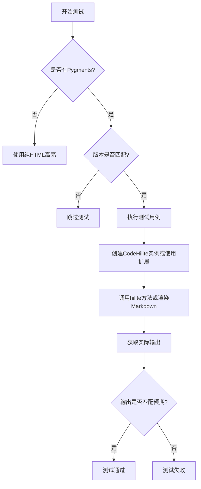

## 类结构

```
TestCase (unittest base)
├── TestCodeHiliteClass
│   └── 测试CodeHilite类的各种方法
└── TestCodeHiliteExtension
    ├── _ExtensionThatAddsAnEmptyCodeTag
    │   └── _AddCodeTagTreeprocessor
    └── CustomAddLangHtmlFormatter (内部类)
```

## 全局变量及字段


### `has_pygments`
    
Boolean flag indicating whether the Pygments syntax highlighting library is installed and available for use

类型：`bool`
    


### `required_pygments_version`
    
String containing the required Pygments version specified by the PYGMENTS_VERSION environment variable, used to skip tests if version mismatches

类型：`str`
    


### `TestCodeHiliteClass.maxDiff`
    
 unittest.TestCase attribute set to None to enable full diff output when assertions fail, allowing complete visibility into expected vs actual differences

类型：`NoneType`
    


### `TestCodeHiliteExtension.maxDiff`
    
unittest.TestCase attribute set to None to enable full diff output when assertions fail, allowing complete visibility into expected vs actual differences

类型：`NoneType`
    


### `TestCodeHiliteExtension.custom_pygments_formatter`
    
Custom Pygments HTML formatter class that adds language information to code tags, defined in setUp when Pygments is available, otherwise None

类型：`type[CustomAddLangHtmlFormatter] | None`
    
    

## 全局函数及方法


### `TestCodeHiliteClass.setUp`

该方法是 `TestCodeHiliteClass` 类的初始化方法（setUp 方法），用于在每个测试方法执行前进行环境检查。如果 Pygments 已安装但版本与测试要求的版本不一致，则跳过当前测试。

参数：

- `self`：`TestCodeHiliteClass`，隐式参数，表示类的实例本身

返回值：`None`，无返回值（方法执行副作用操作，不返回数据）

#### 流程图

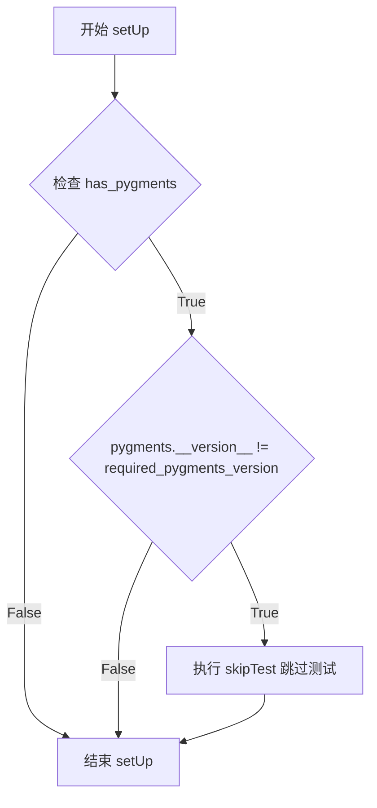

#### 带注释源码

```python
def setUp(self):
    """
    测试前准备工作：检查 Pygments 版本是否满足测试要求。
    如果 Pygments 已安装但版本不匹配，则跳过当前测试。
    """
    # 检查 Pygments 是否已安装，以及版本是否符合要求
    if has_pygments and pygments.__version__ != required_pygments_version:
        # 版本不匹配时，跳过该测试用例
        self.skipTest(f'Pygments=={required_pygments_version} is required')
```


### `TestCodeHiliteClass.assertOutputEquals`

该方法用于测试 CodeHilite 类在给定选项下是否能正确地将源代码块高亮并产生预期的 HTML 输出。

参数：

- `source`：`str`，源代码块内容
- `expected`：`str`，期望的 HTML 输出
- `**options`：`dict`，传递给 CodeHilite 构造函数的额外选项（如 lang、linenos、use_pygments 等）

返回值：`None`，该方法通过 `assertMultiLineEqual` 断言来验证输出是否符合预期

#### 流程图

```mermaid
flowchart TD
    A[开始 assertOutputEquals] --> B[接收 source, expected, **options]
    B --> C[创建 CodeHilite 实例: CodeHilite(source, **options)]
    C --> D[调用 hilite 方法进行高亮处理]
    D --> E[获取输出并 strip 空白字符]
    E --> F{输出 == expected?}
    F -->|是| G[测试通过]
    F -->|否| H[测试失败并显示差异]
    G --> I[结束]
    H --> I
```

#### 带注释源码

```python
def assertOutputEquals(self, source, expected, **options):
    """
    Test that source code block results in the expected output with given options.
    
    Args:
        source: 源代码块内容
        expected: 期望的 HTML 输出
        **options: 传递给 CodeHilite 的额外选项
    """
    
    # 使用传入的 source 和 options 创建 CodeHilite 实例
    # 然后调用 hilite() 方法进行代码高亮处理
    output = CodeHilite(source, **options).hilite()
    
    # 去除输出两端的空白字符，然后与期望输出进行多行字符串比较
    # 使用 assertMultiLineEqual 可以更清晰地显示差异
    self.assertMultiLineEqual(output.strip(), expected)
```


### `TestCodeHiliteClass.test_codehilite_defaults`

该测试方法用于验证 CodeHilite 类在默认参数配置下对代码注释进行语法高亮处理的功能。它会根据 Pygments 库是否可用，验证不同的 HTML 输出格式。

参数：

- `self`：TestCase 实例，表示测试类本身（Python 隐含参数，无须显式传递）

返回值：无返回值（测试方法，仅执行断言验证）

#### 流程图

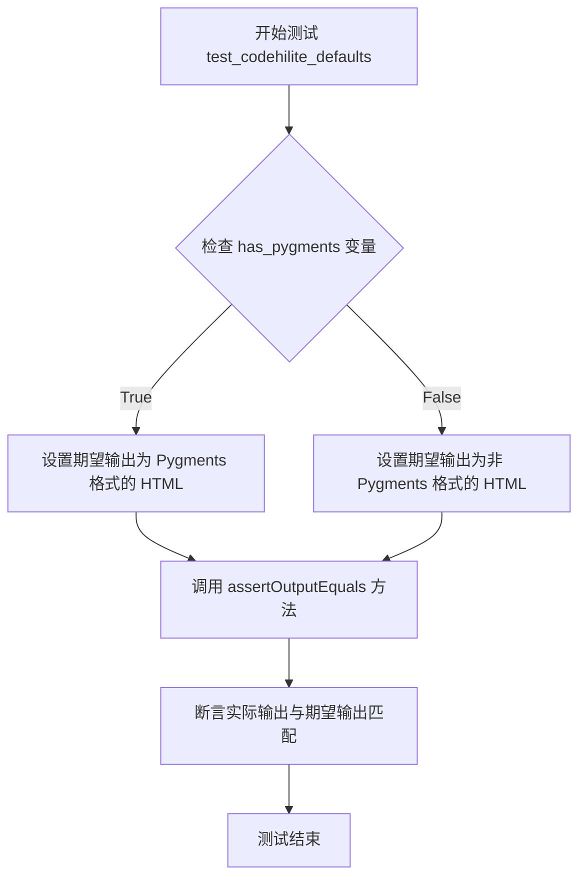

#### 带注释源码

```python
def test_codehilite_defaults(self):
    """
    测试 CodeHilite 类在默认参数下的行为。
    验证当未指定语言且代码仅为单行注释时的 HTML 输出。
    """
    # 根据 Pygments 是否安装选择不同的期望输出
    if has_pygments:
        # Pygments 可用时的期望输出
        # 注意：由于未指定语言且仅有单行注释，无法准确推断语言
        # 因此显示为错误标记 (class="err")
        expected = (
            '<div class="codehilite"><pre><span></span><code><span class="err"># A Code Comment</span>\n'
            '</code></pre></div>'
        )
    else:
        # Pygments 不可用时的期望输出
        # 使用基本的 pre 和 code 标签包裹
        expected = (
            '<pre class="codehilite"><code># A Code Comment\n'
            '</code></pre>'
        )
    # 验证 CodeHilite 类的 hilite 方法输出
    self.assertOutputEquals('# A Code Comment', expected)
```


### `TestCodeHiliteClass.test_codehilite_guess_lang`

该方法是 `TestCodeHiliteClass` 测试类中的一个测试用例，用于验证 CodeHilite 扩展能否通过代码内容自动推断编程语言（语言猜测功能）。

参数：

- `self`：`TestCodeHiliteClass` 实例，代表测试类本身，无显式描述

返回值：`None`，测试方法无返回值，通过断言验证预期输出

#### 流程图

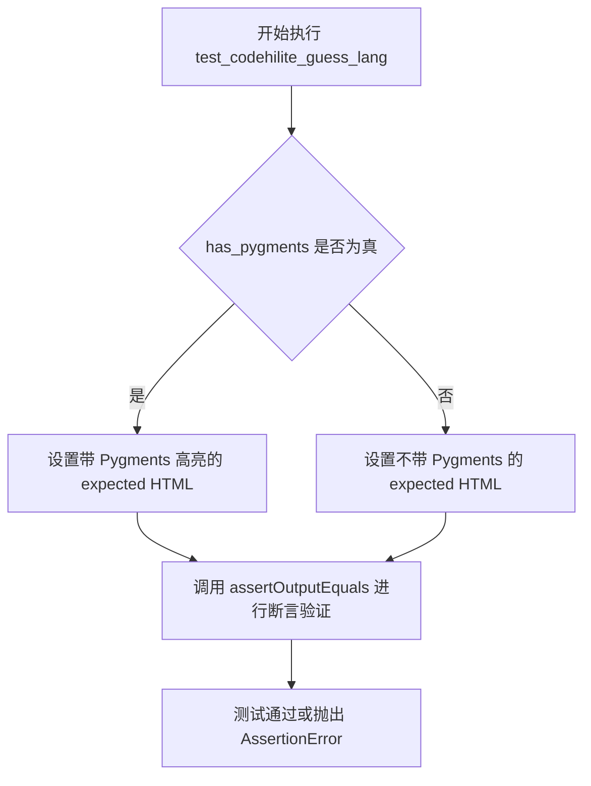

#### 带注释源码

```python
def test_codehilite_guess_lang(self):
    """
    测试 CodeHilite 扩展的语言猜测功能。
    通过 PHP 代码的起始标签 <?php 来验证能否正确识别语言类型。
    """
    # 检查 Pygments 是否可用
    if has_pygments:
        # 期望的输出：使用 Pygments 进行语法高亮
        # 包含 <span class="cp"> 表示 PHP 标签, <span class="k"> 表示关键字, 
        # <span class="p"> 表示标点符号, <span class="s2"> 表示字符串
        expected = (
            '<div class="codehilite"><pre><span></span><code><span class="cp">&lt;?php</span> '
            '<span class="k">print</span><span class="p">(</span><span class="s2">&quot;Hello World&quot;</span>'
            '<span class="p">);</span> <span class="cp">?&gt;</span>\n'
            '</code></pre></div>'
        )
    else:
        # Pygments 不可用时的期望输出：简单的 HTML 包裹，无语法高亮
        expected = (
            '<pre class="codehilite"><code>&lt;?php print(&quot;Hello World&quot;); ?&gt;\n'
            '</code></pre>'
        )
    # 使用 PHP 作为测试语言，因为起始标签 <?php 能够确保准确的语言识别
    # 传入 guess_lang=True 参数启用语言自动猜测功能
    self.assertOutputEquals('<?php print("Hello World"); ?>', expected, guess_lang=True)
```


### `TestCodeHiliteClass.test_codehilite_guess_lang_plain_text`

该测试方法用于验证当代码块内容为纯文本且启用语言自动猜测功能（`guess_lang=True`）时的代码高亮输出是否符合预期。由于纯文本缺乏明显的语言特征，这通常是一个较难准确猜测语言特性的测试场景。

参数：

- `self`：`TestCodeHiliteClass`，测试类的实例自身，无需显式传递

返回值：`None`，该方法为测试方法，通过 `assertOutputEquals` 断言验证输出，不返回具体值

#### 流程图

```mermaid
flowchart TD
    A[开始执行 test_codehilite_guess_lang_plain_text] --> B{检查 has_pygments 是否为 True}
    B -->|True| C[设置期望输出为 Pygments 渲染的 HTML]
    B -->|False| D[设置期望输出为非 Pygments 渲染的 HTML]
    C --> E[调用 assertOutputEquals 方法]
    D --> E
    E --> F[source='plain text']
    E --> G[expected=预期HTML字符串]
    E --> H[options={'guess_lang': True}]
    F --> I[创建 CodeHilite 实例并调用 hilite 方法]
    G --> I
    H --> I
    I --> J[获取实际输出]
    J --> K[断言实际输出与期望输出匹配]
    K --> L[测试结束]
```

#### 带注释源码

```python
def test_codehilite_guess_lang_plain_text(self):
    """
    测试当代码内容为纯文本且启用语言自动猜测时的输出。
    
    该测试用例用于验证 CodeHilite 扩展在面对难以识别语言特征
    的纯文本内容时的行为是否符合预期。由于纯文本缺乏明显的
    语言标识（如 PHP 的 <?php 标签或 Python 的 # 注释），
    语言自动猜测功能可能无法准确识别具体语言。
    """
    # 判断当前测试环境是否安装了 Pygments 库
    if has_pygments:
        # 当 Pygments 可用时的期望输出
        # 纯文本在 Pygments 中会被标记为错误类 (err)
        expected = (
            '<div class="codehilite"><pre><span></span><code><span class="err">plain text</span>\n'
            '</code></pre></div>'
        )
    else:
        # 当 Pygments 不可用时的期望输出
        # 不使用 Pygments 时，仅生成基本的 codehilite 标签
        expected = (
            '<pre class="codehilite"><code>plain text\n'
            '</code></pre>'
        )
    # 执行断言测试，传入源代码、期望输出和选项参数
    # guess_lang=True 表示启用语言自动猜测功能
    self.assertOutputEquals('plain text', expected, guess_lang=True)
```


### `TestCodeHiliteClass.test_codehilite_set_lang`

该方法是一个测试用例，用于验证当显式设置代码语言（lang='php'）时，CodeHilite类的语法高亮功能是否正确工作。测试会检查带有PHP代码的代码块在指定语言后的HTML输出是否符合预期。

参数：

- `self`：隐式参数，TestCase实例，表示测试类本身

返回值：无（void），该方法为测试用例，使用断言验证输出，不返回任何值

#### 流程图

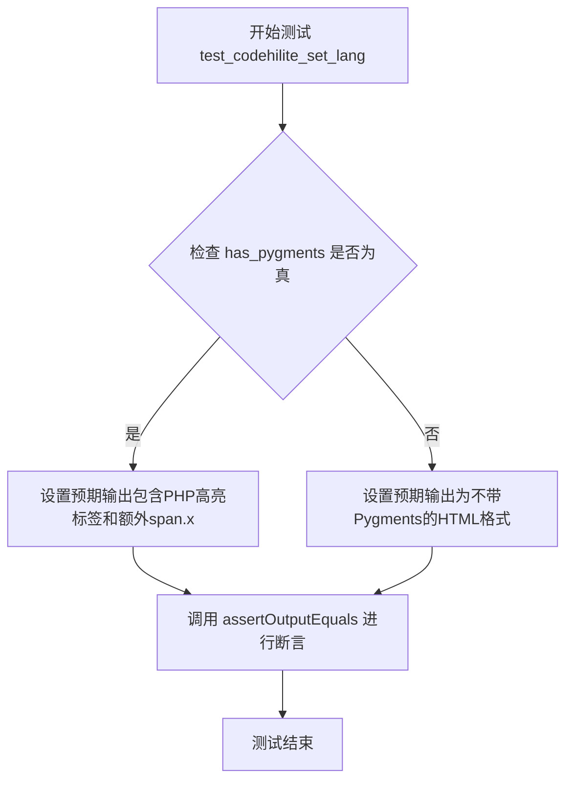

#### 带注释源码

```python
def test_codehilite_set_lang(self):
    """
    测试显式设置代码语言时的语法高亮输出。
    验证当通过 lang 参数明确指定语言为 'php' 时，
    CodeHilite 类能否正确生成对应的 HTML 高亮代码块。
    """
    
    # 检查是否安装了 Pygments 库
    if has_pygments:
        # 当使用 Pygments 时的预期输出
        # 注意：当显式设置 lang 时，代码块末尾会添加额外的 <span class="x"></span>
        # 这与 test_codehilite_guess_lang 的输出不同，原因不详
        expected = (
            '<div class="codehilite"><pre><span></span><code><span class="cp">&lt;?php</span> '
            '<span class="k">print</span><span class="p">(</span><span class="s2">&quot;Hello World&quot;</span>'
            '<span class="p">);</span> <span class="cp">?&gt;</span><span class="x"></span>\n'
            '</code></pre></div>'
        )
    else:
        # 当未安装 Pygments 时的预期输出
        # 使用 class="language-php" 标记语言
        expected = (
            '<pre class="codehilite"><code class="language-php">&lt;?php print(&quot;Hello World&quot;); ?&gt;\n'
            '</code></pre>'
        )
    
    # 调用 assertOutputEquals 验证输出
    # 参数：源代码, 期望输出, 选项字典（lang='php'）
    self.assertOutputEquals('<?php print("Hello World"); ?>', expected, lang='php')
```


### `TestCodeHiliteClass.test_codehilite_bad_lang`

测试当使用无效的语言名称（如 'unkown'）时，代码高亮扩展的处理行为。验证即使语言名称错误，也能正确渲染代码块，同时确保在有Pygments和无Pygments两种情况下的输出符合预期。

参数：

- `self`：`TestCodeHiliteClass`，测试类实例本身

返回值：`None`，无返回值（测试方法）

#### 流程图

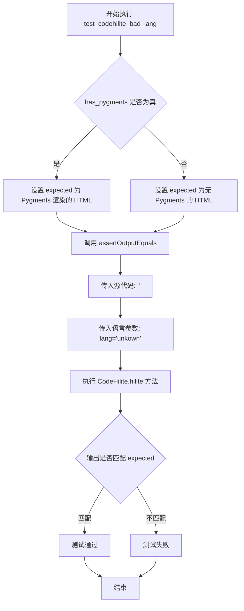

#### 带注释源码

```python
def test_codehilite_bad_lang(self):
    """
    测试当使用无效/错误语言名称时的代码高亮行为。
    验证扩展能正确处理未知语言名称的情况。
    """
    if has_pygments:
        # 当 Pygments 可用时，即使语言名称无效（unkown），
        # Pygments 仍会基于代码内容进行语法高亮
        # 注意：这里由于 lang='unkown'，但代码中有 <?php 标签，
        # Pygments 可能会尝试检测实际语言
        expected = (
            '<div class="codehilite"><pre><span></span><code><span class="cp">&lt;?php</span> '
            '<span class="k">print</span><span class="p">(</span><span class="s2">'
            '&quot;Hello World&quot;</span><span class="p">);</span> <span class="cp">?&gt;</span>\n'
            '</code></pre></div>'
        )
    else:
        # 当 Pygments 不可用时，无法验证语言名称是否有效
        # 此时直接在 code 标签的 class 属性中使用传入的无效语言名
        # 注意：这里拼写错误 'unkown' 会被直接使用
        expected = (
            '<pre class="codehilite"><code class="language-unkown">'
            '&lt;?php print(&quot;Hello World&quot;); ?&gt;\n'
            '</code></pre>'
        )
    # 使用 PHP 代码作为输入，因为 <?php 标签可以确保准确的语言检测
    # 同时传入 lang='unkown'（故意拼写错误）来测试无效语言名的处理
    self.assertOutputEquals('<?php print("Hello World"); ?>', expected, lang='unkown')
```


### TestCodeHiliteClass.test_codehilite_use_pygments_false

这是一个测试方法，用于验证 CodeHilite 类在 `use_pygments=False` 参数下的代码高亮功能是否正常工作。该测试确保当禁用 Pygments 语法高亮时，系统能够正确生成带有语言标记的 HTML 代码块。

参数：

- `self`：`TestCodeHiliteClass`，测试类的实例隐式参数

返回值：`None`，测试方法不返回任何值，仅执行断言验证

#### 流程图

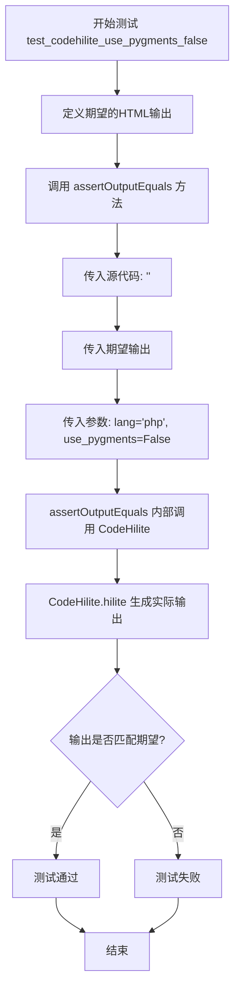

#### 带注释源码

```python
def test_codehilite_use_pygments_false(self):
    """
    测试当 use_pygments=False 时，CodeHilite 类的代码高亮功能。
    
    该测试验证禁用 Pygments 语法高亮引擎后，系统能够正确地将源代码
    包装在带有语言标记的 HTML <pre> 和 <code> 标签中。
    """
    
    # 定义期望的 HTML 输出结果
    # 预期输出包含:
    # - <pre class="codehilite"> 外层容器，带有 codehilite 样式类
    # - <code class="language-php"> 代码容器，带有语言标记
    # - 源代码中的 HTML 特殊字符被转义: < 变为 &lt; > 变为 &gt;
    expected = (
        '<pre class="codehilite"><code class="language-php">'
        '&lt;?php print(&quot;Hello World&quot;); ?&gt;\n'
        '</code></pre>'
    )
    
    # 调用继承自 TestCase 的辅助方法进行输出验证
    # 参数说明:
    # - 第一个参数: 要进行高亮的源代码
    # - 第二个参数: 期望的 HTML 输出
    # - lang='php': 指定代码语言为 PHP
    # - use_pygments=False: 禁用 Pygments，使用简单的高亮方式
    self.assertOutputEquals(
        '<?php print("Hello World"); ?>',  # 源代码输入
        expected,                            # 期望的 HTML 输出
        lang='php',                          # 代码语言为 PHP
        use_pygments=False                   # 不使用 Pygments 进行高亮
    )
```


### `TestCodeHiliteClass.test_codehilite_lang_prefix_empty`

该测试方法用于验证当 `lang_prefix` 参数设置为空字符串时，代码高亮扩展能够正确生成不包含语言前缀的 HTML 输出（例如 `<code class="php">` 而非 `<code class="lang-php">`）。

参数：

- `self`：`TestCodeHiliteClass`，测试类实例本身

返回值：`None`，测试方法不返回任何值

#### 流程图

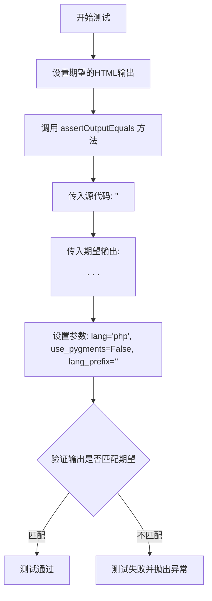

#### 带注释源码

```python
def test_codehilite_lang_prefix_empty(self):
    """
    测试当 lang_prefix 为空字符串时的代码高亮行为。
    期望输出中 <code> 标签的 class 属性应为 'php' 而非 'lang-php'。
    """
    # 定义期望的HTML输出
    # 注意：class 属性直接使用语言名 'php'，没有前缀
    expected = (
        '<pre class="codehilite"><code class="php">&lt;?php print(&quot;Hello World&quot;); ?&gt;\n'
        '</code></pre>'
    )
    
    # 调用 assertOutputEquals 进行验证
    # 参数说明：
    #   - 第一个参数：源代码
    #   - 第二个参数：期望的HTML输出
    #   - lang='php': 指定代码语言为 PHP
    #   - use_pygments=False: 不使用 Pygments 进行高亮
    #   - lang_prefix='': 语言前缀设置为空字符串
    self.assertOutputEquals(
        '<?php print("Hello World"); ?>', expected, lang='php', use_pygments=False, lang_prefix=''
    )
```


### `TestCodeHiliteClass.test_codehilite_lang_prefix`

该测试方法用于验证代码高亮扩展（CodeHilite）在不使用 Pygments 的情况下，能够正确处理 `lang_prefix` 参数，将语言标记前缀（如 `lang-`）添加到生成的 HTML `<code>` 标签的 class 属性中。

参数：

- `self`：`TestCodeHiliteClass`，测试类实例隐含参数

返回值：`None`，测试方法无返回值，通过 `assertOutputEquals` 断言验证输出

#### 流程图

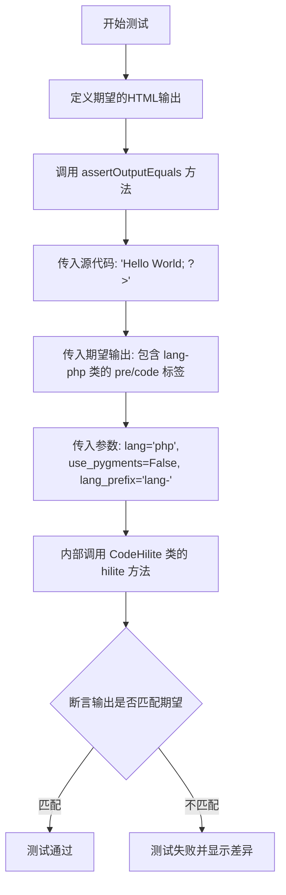

#### 带注释源码

```python
def test_codehilite_lang_prefix(self):
    """
    测试 lang_prefix 参数功能。
    验证当 use_pygments=False 时，能够自定义语言标记的前缀。
    例如：lang_prefix='lang-' 会生成 class="lang-php"
    """
    # 定义期望的 HTML 输出
    # 预期生成 <pre class="codehilite"><code class="lang-php">...</code></pre>
    expected = (
        '<pre class="codehilite"><code class="lang-php">&lt;?php print("Hello World"); ?&gt;\n'
        '</code></pre>'
    )
    
    # 调用 assertOutputEquals 进行验证
    # 参数说明：
    #   - 源代码: '<?php print("Hello World"); ?>'
    #   - 期望输出: expected
    #   - lang='php': 指定语言为 PHP
    #   - use_pygments=False: 不使用 Pygments 进行语法高亮
    #   - lang_prefix='lang-': 自定义语言标记前缀
    self.assertOutputEquals(
        '<?php print("Hello World"); ?>', expected, lang='php', use_pygments=False, lang_prefix='lang-'
    )
```


### `TestCodeHiliteClass.test_codehilite_linenos_true`

该方法是 `TestCodeHiliteClass` 测试类中的一个测试用例，用于验证 Markdown 代码高亮扩展在启用行号显示（`linenos=True`）时的输出是否正确。测试会检查当使用 Pygments 库时，代码块是否以表格形式包含行号；而不使用 Pygments 时，是否正确添加 `linenums` CSS 类。

参数：

- `self`：`TestCodeHiliteClass`，测试类实例本身，包含测试所需的上下文和方法

返回值：`None`，该方法为测试用例，无返回值，通过断言验证输出

#### 流程图

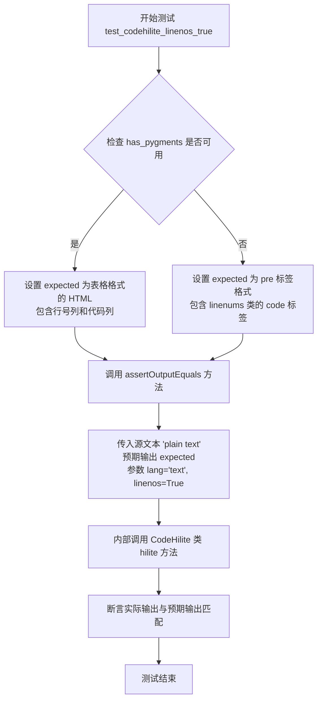

#### 带注释源码

```python
def test_codehilite_linenos_true(self):
    """
    测试当 linenos=True 时代码高亮的输出。
    验证行号显示功能在不同环境下的表现。
    """
    # 检查 Pygments 是否可用
    if has_pygments:
        # Pygments 可用时期望的输出格式：
        # 表格形式，左侧为行号列，右侧为代码列
        expected = (
            '<table class="codehilitetable"><tr><td class="linenos"><div class="linenodiv"><pre>1</pre></div>'
            '</td><td class="code"><div class="codehilite"><pre><span></span><code>plain text\n'
            '</code></pre></div>\n'
            '</td></tr></table>'
        )
    else:
        # Pygments 不可用时的输出格式：
        # 简单的 pre 和 code 标签，code 标签带有 linenums 类
        expected = (
            '<pre class="codehilite"><code class="language-text linenums">plain text\n'
            '</code></pre>'
        )
    # 调用 assertOutputEquals 进行断言验证
    # 传入源文本、预期输出、以及 CodeHilite 的选项参数
    self.assertOutputEquals('plain text', expected, lang='text', linenos=True)
```


### TestCodeHiliteClass.test_codehilite_linenos_false

该方法是一个单元测试，用于验证 CodeHilite 类在 `linenos=False` 参数下的行为是否符合预期。测试会检查当不显示行号时，代码高亮输出的 HTML 结构是否正确。

参数：

- `self`：`TestCase`，测试类实例本身，继承自 unittest.TestCase

返回值：无（`None`），该方法为测试方法，没有返回值，通过断言验证输出

#### 流程图

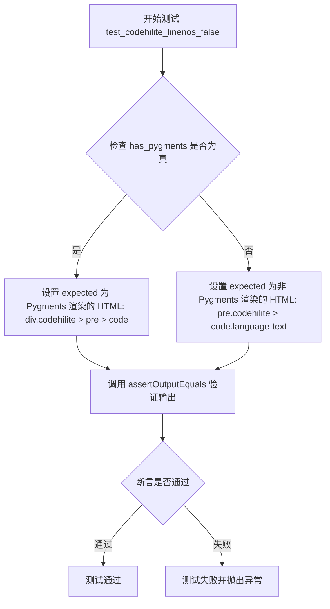

#### 带注释源码

```python
def test_codehilite_linenos_false(self):
    """
    测试 CodeHilite 类在 linenos=False 时的输出。
    
    该测试验证当不显示代码行号时，生成的 HTML 结构是否正确。
    分为两种情况：
    1. 有 Pygments 库：生成带样化的 span 标签
    2. 无 Pygments 库：生成简单的 language- 前缀类名
    """
    # 检查是否有 Pygments 库可用
    if has_pygments:
        # 有 Pygments 时的期望输出
        # 使用 div 包裹，codehilite 作为类名，包含空的 span 标签
        expected = (
            '<div class="codehilite"><pre><span></span><code>plain text\n'
            '</code></pre></div>'
        )
    else:
        # 无 Pygments 时的期望输出
        # 使用 pre 包裹，codehilite 作为类名，code 使用 language- 前缀
        expected = (
            '<pre class="codehilite"><code class="language-text">plain text\n'
            '</code></pre>'
        )
    
    # 调用辅助方法验证 CodeHilite 的输出是否符合预期
    # 参数：源代码='plain text'，期望输出=expected，语言='text'，行号显示=False
    self.assertOutputEquals('plain text', expected, lang='text', linenos=False)
```


### `TestCodeHiliteClass.test_codehilite_linenos_none`

描述：该测试方法用于验证当 `CodeHilite` 的 `linenos` 参数设为 `None` 时的输出行为，即不生成行号标记，无论是否启用 Pygments。

#### 参数

- `self`：`TestCodeHiliteClass`，测试类实例，用来访问测试框架的断言方法。

#### 返回值

- `None`：测试方法本身不返回值，仅通过断言判断是否符合预期。

#### 流程图

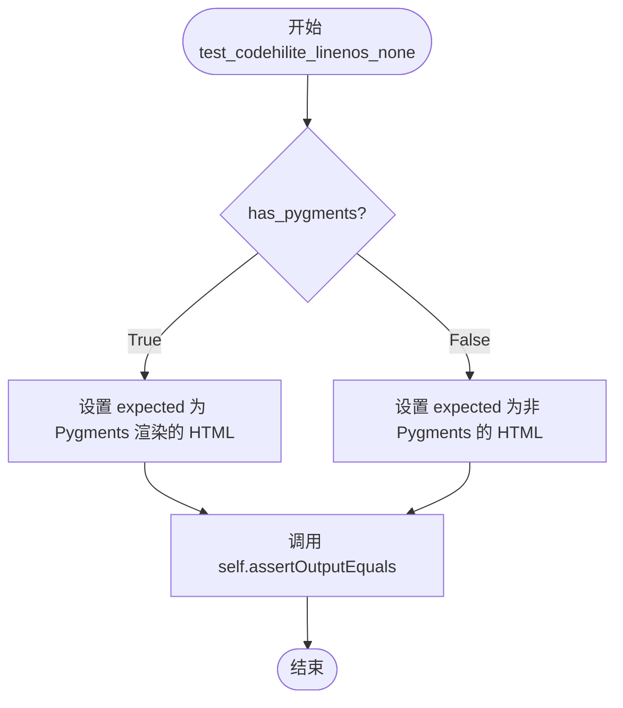

#### 带注释源码

```python
def test_codehilite_linenos_none(self):
    """
    测试当 linenos 参数为 None 时的 CodeHilite 输出。
    该情形下不应生成行号标记。
    """
    # 根据是否安装了 Pygments 来构造不同的期望 HTML
    if has_pygments:
        # Pygments 启用时生成的 HTML
        expected = (
            '<div class="codehilite"><pre><span></span><code>plain text\n'
            '</code></pre></div>'
        )
    else:
        # 未使用 Pygments 时的简化 HTML
        expected = (
            '<pre class="codehilite"><code class="language-text">plain text\n'
            '</code></pre>'
        )
    # 调用父类提供的辅助方法，验证实际输出是否与期望一致
    self.assertOutputEquals('plain text', expected, lang='text', linenos=None)
```

#### 潜在的技术债务或优化空间

- **重复的期望字符串**：多个测试用例（如 `test_codehilite_linenos_false`、`test_codehilite_linenos_true`）中出现了相似的 HTML 片段，建议抽取为公共常量或 fixtures，以提升可维护性。
- **全局状态依赖**：`has_pygments` 为模块级变量，测试结果会随环境变化而变化。若在 CI 中需要严格控制 Pygments 版本，需确保 `required_pygments_version` 的检查更加细致，避免因版本不匹配导致意外跳过。 
- **测试覆盖**：当前仅验证了 `linenos=None` 时的默认输出，若后续扩展更多选项（如 `linenums`、`linenostep`），建议使用参数化测试（`pytest.mark.parametrize`）来降低重复代码。


### TestCodeHiliteClass.test_codehilite_linenos_table

该方法是 `TestCodeHiliteClass` 测试类中的一个测试方法，用于验证 CodeHilite 扩展在 `linenos='table'` 参数下的代码高亮功能是否正确生成包含行号表格的 HTML 输出。

参数：

- `self`：测试类实例本身，无需显式传递

返回值：`None`，该方法为测试方法，不返回任何值，仅执行断言验证

#### 流程图

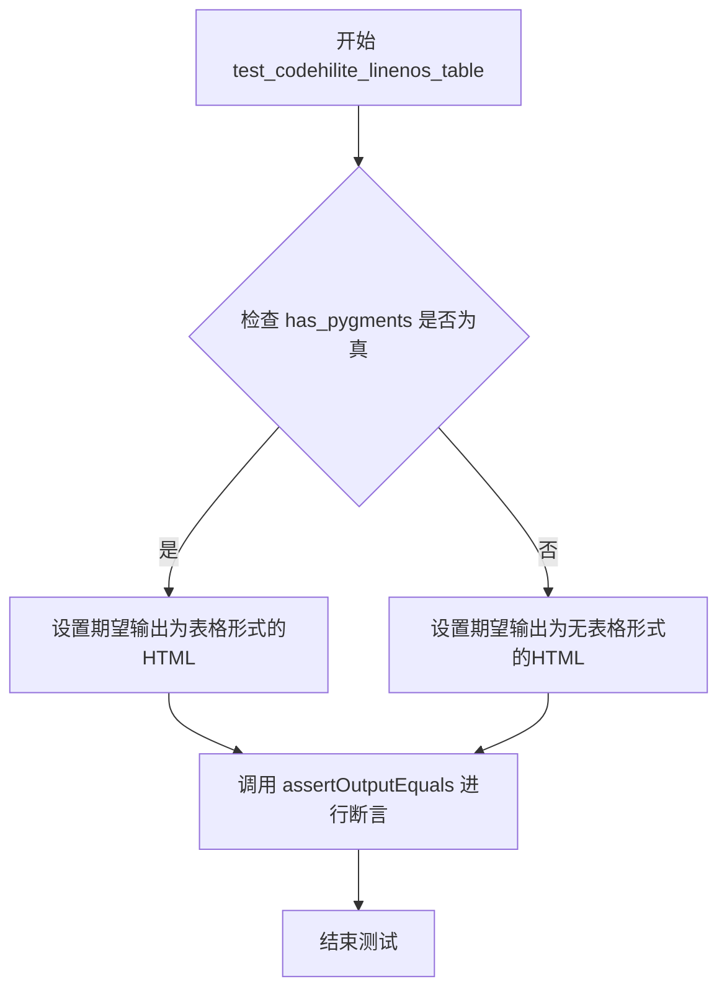

#### 带注释源码

```python
def test_codehilite_linenos_table(self):
    """
    测试当 linenos 参数设置为 'table' 时的代码高亮输出。
    验证行号以表格形式显示（包含 linenos 列）。
    """
    # 检查 Pygments 是否可用
    if has_pygments:
        # 期望的输出：使用表格布局显示行号
        # 表格结构：table > tr > td.linenos + td.code
        expected = (
            '<table class="codehilitetable"><tr><td class="linenos"><div class="linenodiv"><pre>1</pre></div>'
            '</td><td class="code"><div class="codehilite"><pre><span></span><code>plain text\n'
            '</code></pre></div>\n'
            '</td></tr></table>'
        )
    else:
        # Pygments 不可用时的期望输出
        # 使用 class="linenums" 标记行号
        expected = (
            '<pre class="codehilite"><code class="language-text linenums">plain text\n'
            '</code></pre>'
        )
    
    # 调用父类测试框架的断言方法验证输出
    # 参数：源代码, 期望输出, 语言, linenos='table'
    self.assertOutputEquals('plain text', expected, lang='text', linenos='table')
```


### `TestCodeHiliteClass.test_codehilite_linenos_inline`

该测试方法用于验证 CodeHilite 扩展在 `linenos='inline'` 模式下能否正确为代码块生成内联行号（即将行号作为 `<span class="linenos">` 元素插入到代码行中）。

参数：
- `self`：`TestCodeHiliteClass`，测试类实例本身，无需显式传递

返回值：`None`，测试方法无返回值，通过 `assertOutputEquals` 断言验证输出

#### 流程图

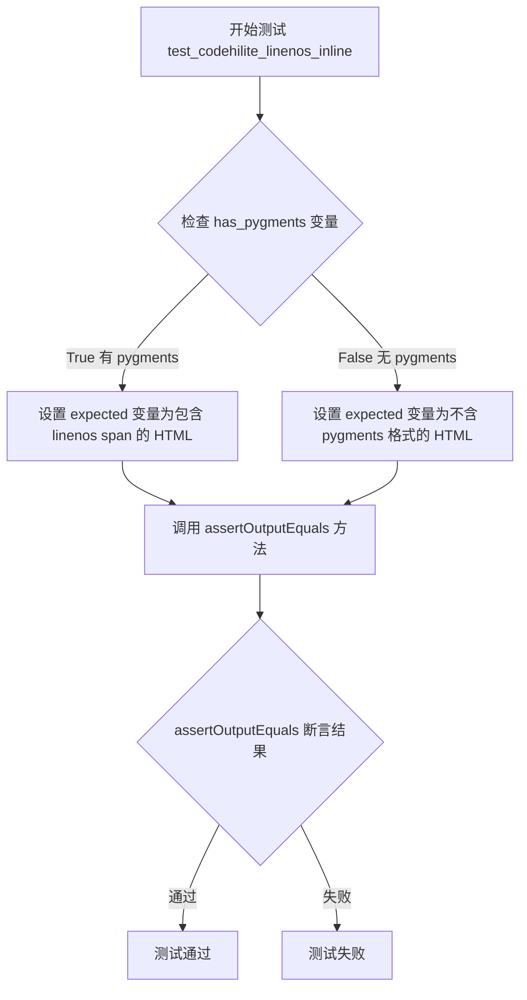

#### 带注释源码

```python
def test_codehilite_linenos_inline(self):
    """
    测试 CodeHilite 扩展在 linenos='inline' 模式下的输出。
    
    该测试验证当 linenos 参数设置为 'inline' 时，
    行号是否以 <span class="linenos"> 元素的形式内联到代码中。
    """
    
    # 检查是否有 pygments 库可用
    if has_pygments:
        # 有 pygments 时的期望输出
        # 行号 '1' 被包装在 <span class="linenos"> 标签中
        expected = (
            '<div class="codehilite"><pre><span></span><code><span class="linenos">1</span>plain text\n'
            '</code></pre></div>'
        )
    else:
        # 无 pygments 时的期望输出（降级处理）
        # 使用 linenums class 标记行号
        expected = (
            '<pre class="codehilite"><code class="language-text linenums">plain text\n'
            '</code></pre>'
        )
    
    # 调用辅助方法验证 CodeHilite 类的输出
    # 参数说明：
    #   第一个参数：源代码内容
    #   第二个参数：期望的 HTML 输出
    #   lang='text'：指定语言为纯文本
    #   linenos='inline'：要求行号以内联方式显示
    self.assertOutputEquals('plain text', expected, lang='text', linenos='inline')
```


### `TestCodeHiliteClass.test_codehilite_linenums_true`

该方法是 `TestCodeHiliteClass` 测试类中的一个测试用例，用于验证 CodeHilite 扩展在启用 `linenums=True` 选项时的输出是否符合预期。该测试通过对比源码在高亮处理后的 HTML 输出与期望值，确保行号功能（linenums）能够正确生成包含行号的表格或带有 `linenums` 类的代码块。

参数：

- 该方法无显式参数（`self` 为隐含的实例参数）

返回值：`None`，该方法为测试用例，执行断言验证，不返回任何值

#### 流程图

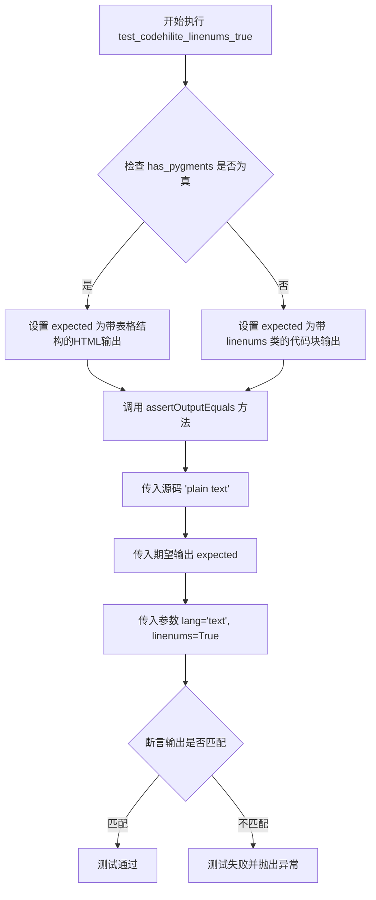

#### 带注释源码

```python
def test_codehilite_linenums_true(self):
    """
    测试当 linenums 参数设置为 True 时的代码高亮输出。
    验证在启用行号显示的情况下，生成的 HTML 结构是否符合预期。
    """
    # 判断当前环境是否安装了 Pygments 库
    if has_pygments:
        # Pygments 可用时的期望输出
        # 包含一个表格结构，左侧为行号列，右侧为代码内容
        expected = (
            '<table class="codehilitetable"><tr><td class="linenos"><div class="linenodiv"><pre>1</pre></div>'
            '</td><td class="code"><div class="codehilite"><pre><span></span><code>plain text\n'
            '</code></pre></div>\n'
            '</td></tr></table>'
        )
    else:
        # Pygments 不可用时的期望输出
        # 使用带有 linenums 类的 pre 和 code 标签
        expected = (
            '<pre class="codehilite"><code class="language-text linenums">plain text\n'
            '</code></pre>'
        )
    # 调用继承自 TestCase 的辅助方法进行输出验证
    # 参数：源码内容、期望输出、传递给 CodeHilite 的选项
    self.assertOutputEquals('plain text', expected, lang='text', linenums=True)
```


### `TestCodeHiliteClass.test_codehilite_set_cssclass`

该测试方法用于验证 CodeHilite 扩展在设置自定义 CSS 类名（cssclass 参数）时的输出是否符合预期。它通过调用 `assertOutputEquals` 方法，传入源代码、期望输出以及相关参数，来检测代码高亮功能是否能正确应用用户指定的 CSS 类名。

参数：

- `self`：`TestCase`，测试类实例本身

返回值：`None`，该方法为测试方法，不返回任何值

#### 流程图

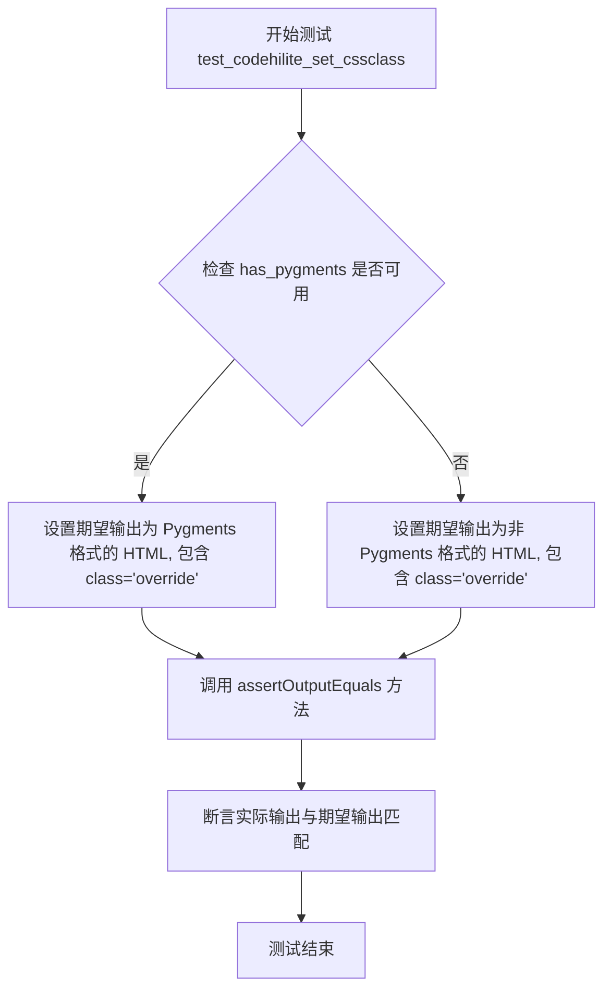

#### 带注释源码

```python
def test_codehilite_set_cssclass(self):
    """
    测试 CodeHilite 扩展的 cssclass 参数功能。
    验证当用户通过 cssclass 参数指定自定义 CSS 类名时，
    生成的 HTML 中应包含该自定义类名。
    """
    if has_pygments:
        # 当 Pygments 可用时的期望输出
        # 自定义类名 'override' 应出现在 <div class="override"> 中
        expected = (
            '<div class="override"><pre><span></span><code>plain text\n'
            '</code></pre></div>'
        )
    else:
        # 当 Pygments 不可用时的期望输出
        # 自定义类名 'override' 应出现在 <pre class="override"> 中
        expected = (
            '<pre class="override"><code class="language-text">plain text\n'
            '</code></pre>'
        )
    # 调用 assertOutputEquals 进行测试验证
    # 参数：源代码为 'plain text'，语言为 'text'，自定义 CSS 类名为 'override'
    self.assertOutputEquals('plain text', expected, lang='text', cssclass='override')
```


### `TestCodeHiliteClass.test_codehilite_set_css_class`

该方法是 `TestCodeHiliteClass` 测试类中的一个测试用例，用于验证 CodeHilite 扩展能够正确地将自定义 CSS 类（`css_class`）应用到代码高亮结果中。该测试通过对比预期输出与实际输出的 HTML 内容，确保 `css_class` 参数在有无 Pygments 库两种情况下都能正常工作。

参数：

- `self`：测试类实例方法的标准参数，表示当前测试用例的实例对象。

返回值：`None`，该方法为测试用例方法，通过 `assertOutputEquals` 断言验证功能，不返回任何值。

#### 流程图

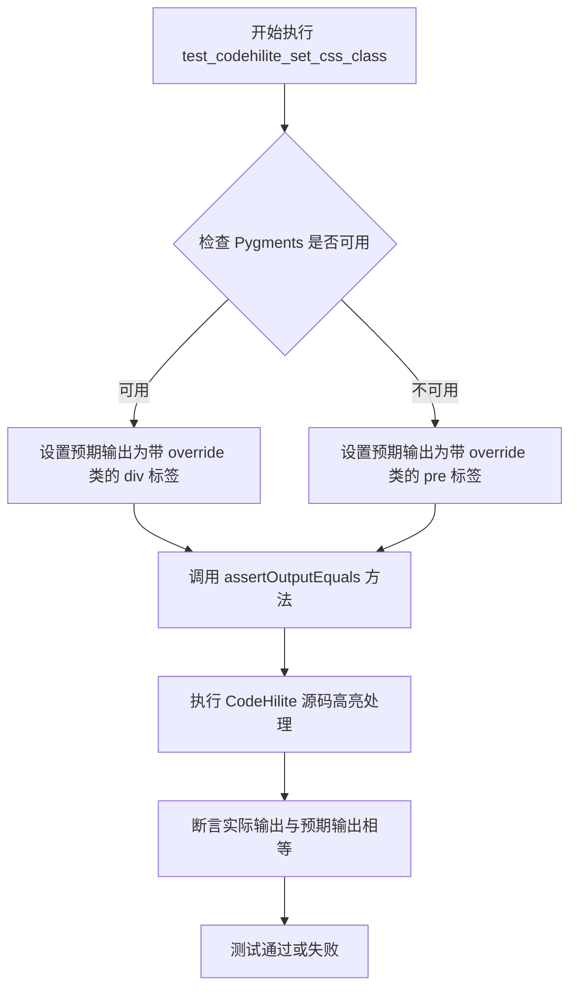

#### 带注释源码

```python
def test_codehilite_set_css_class(self):
    """
    测试设置自定义 CSS 类名功能 (css_class 参数)。

    该测试用例验证 CodeHilite 扩展在处理代码块时，
    能够正确地将用户指定的 css_class 参数应用到生成的 HTML 中，
    覆盖默认的 'codehilite' 类名。
    """
    # 检查 Pygments 是否可用，以确定预期的 HTML 输出格式
    if has_pygments:
        # 当 Pygments 可用时，预期输出为 div 包裹的代码块
        # 使用了自定义 CSS 类 'override' 而非默认的 'codehilite'
        expected = (
            '<div class="override"><pre><span></span><code>plain text\n'
            '</code></pre></div>'
        )
    else:
        # 当 Pygments 不可用时，使用简化格式
        # 在 pre 标签上应用自定义 CSS 类 'override'
        expected = (
            '<pre class="override"><code class="language-text">plain text\n'
            '</code></pre>'
        )
    
    # 调用测试工具方法，传入源码、预期输出和选项参数
    # lang='text' 指定语言为纯文本
    # css_class='override' 指定自定义 CSS 类名
    self.assertOutputEquals('plain text', expected, lang='text', css_class='override')
```


### `TestCodeHiliteClass.test_codehilite_linenostart`

该测试方法用于验证 CodeHilite 类的 `linenostart` 参数功能，确保代码高亮显示时行号能够从指定的数字开始编号。

参数：

- `self`：`TestCodeHiliteClass`，测试类实例本身，无需显式传递

返回值：`None`，该方法为测试方法，通过 `assertOutputEquals` 断言验证输出，不返回任何值

#### 流程图

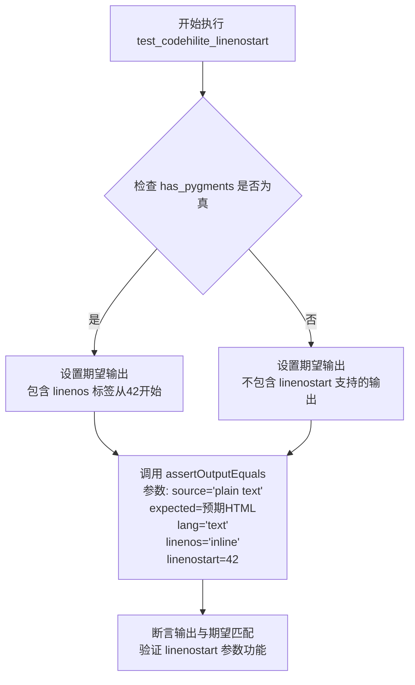

#### 带注释源码

```python
def test_codehilite_linenostart(self):
    """
    测试 CodeHilite 类的 linenostart 参数功能。
    
    该测试验证当 linenos='inline' 时，行号能够从指定的 linenostart 值开始编号。
    测试使用 lang='text' 来避免语言特定的高亮干扰，聚焦于行号功能本身。
    """
    
    # 检查 Pygments 是否可用
    if has_pygments:
        # 当 Pygments 可用时期望的输出：
        # - 外层使用 <div class="codehilite"> 包裹
        # - 行号使用 <span class="linenos">42</span> 格式，从42开始编号
        # - 代码内容 'plain text' 紧跟在行号标签后面
        expected = (
            '<div class="codehilite"><pre><span></span><code><span class="linenos">42</span>plain text\n'
            '</code></pre></div>'
        )
    else:
        # TODO: 当 Pygments 不可用时，需要实现 linenostart 支持
        # 目前只是输出基本的代码块格式，linenums 类表示显示行号
        # 但实际的起始行号功能尚未实现
        expected = (
            '<pre class="codehilite"><code class="language-text linenums">plain text\n'
            '</code></pre>'
        )
    
    # 断言验证：
    # - 源代码：'plain text'
    # - 语言：'text'
    # - 行号模式：'inline'（内联行号）
    # - 起始行号：42
    # 将调用 CodeHilite(source, lang='text', linenos='inline', linenostart=42).hilite()
    # 并将结果与 expected 进行比较
    self.assertOutputEquals('plain text', expected, lang='text', linenos='inline', linenostart=42)
```


### `TestCodeHiliteClass.test_codehilite_linenos_hl_lines`

该测试方法用于验证代码高亮扩展（CodeHilite）在使用内联行号（linenos='inline'）时，正确高亮指定行（hl_lines=[1, 3]）的功能。测试会检查输出HTML中是否包含行号元素（`<span class="linenos">`）以及高亮行元素（`<span class="hll">`）。

参数：

- `self`：`TestCodeHiliteClass`，测试类实例本身，用于调用父类或自身的测试辅助方法

返回值：`None`，该方法为测试方法，无返回值，通过 `assertOutputEquals` 断言验证输出正确性

#### 流程图

```mermaid
flowchart TD
    A[开始测试 test_codehilite_linenos_hl_lines] --> B{检查 has_pygments 是否可用}
    B -->|是| C[构建包含 hl_lines 预期的 HTML 输出]
    B -->|否| D[构建不含 Pygments 的预期 HTML 输出]
    C --> E[调用 assertOutputEquals 进行断言验证]
    D --> E
    E --> F[测试通过/失败]
```

#### 带注释源码

```python
def test_codehilite_linenos_hl_lines(self):
    """
    测试代码高亮扩展在启用内联行号时，正确高亮指定行的功能。
    
    测试场景：
    - 输入源码：'line 1\nline 2\nline 3'（三行文本）
    - 参数：lang='text', linenos='inline', hl_lines=[1, 3]
    - 预期：第1行和第3行被高亮（添加 <span class="hll"> 包裹）
    """
    
    # 如果 Pygments 可用，验证带有行号和高亮行的完整 HTML 输出
    if has_pygments:
        expected = (
            '<div class="codehilite"><pre><span></span><code>'
            '<span class="linenos">1</span><span class="hll">line 1\n'   # 第1行：行号 + 高亮
            '</span><span class="linenos">2</span>line 2\n'            # 第2行：行号，无高亮
            '<span class="linenos">3</span><span class="hll">line 3\n'   # 第3行：行号 + 高亮
            '</span></code></pre></div>'
        )
    else:
        # Pygments 不可用时的降级输出（无行号和高亮）
        expected = (
            '<pre class="codehilite"><code class="language-text linenums">line 1\n'
            'line 2\n'
            'line 3\n'
            '</code></pre>'
        )
    
    # 调用测试框架的辅助方法进行断言验证
    # 参数：源码, 预期输出, lang='text', linenos='inline', hl_lines=[1, 3]
    self.assertOutputEquals('line 1\nline 2\nline 3', expected, lang='text', linenos='inline', hl_lines=[1, 3])
```


# 详细设计文档

## 1. 一段话描述

`TestCodeHiliteClass.test_codehilite_linenos_linenostep` 是一个单元测试方法，用于验证 Python Markdown 库中 CodeHilite 扩展的 `linenostep` 参数功能，该参数控制行号的显示间隔（例如设置为2时只显示偶数行号）。

---

## 2. 文件的整体运行流程

```
┌─────────────────────────────────────────────────────────────────┐
│                     测试文件加载阶段                             │
├─────────────────────────────────────────────────────────────────┤
│  1. 导入依赖模块 (markdown, pygments, unittest)                  │
│  2. 检查 Pygments 是否可用及版本匹配                             │
│  3. 定义测试类 TestCodeHiliteClass                               │
│  4. 执行 setUp 初始化方法                                        │
└─────────────────────────────────────────────────────────────────┘
                              │
                              ▼
┌─────────────────────────────────────────────────────────────────┐
│                     测试执行流程                                 │
├─────────────────────────────────────────────────────────────────┤
│  1. setUp() - 初始化测试环境，检查 Pygments 版本                 │
│  2. 调用 test_codehilite_linenos_linenostep()                   │
│     ├── 构造测试源码: "line 1\nline 2\nline 3"                  │
│     ├── 设置参数: lang='text', linenos='inline', linenostep=2   │
│     ├── 调用 CodeHilite().hilite() 进行高亮处理                 │
│     └── 断言输出与预期结果匹配                                   │
└─────────────────────────────────────────────────────────────────┘
```

---

## 3. 类的详细信息

### 3.1 类 `TestCodeHiliteClass`

| 属性 | 类型 | 描述 |
|------|------|------|
| `maxDiff` | `None` (类属性) | 设置 assertMultiLineEqual 的最大差异显示为无限 |
| `skipTest` | 方法 | 跳过测试的条件检查 |

#### 类方法

| 方法名称 | 功能描述 |
|----------|----------|
| `setUp` | 初始化测试环境，检查 Pygments 版本是否匹配 |
| `assertOutputEquals` | 辅助方法，用于测试代码高亮输出是否符合预期 |
| `test_codehilite_linenos_linenostep` | 测试 linenostep 参数功能 |

---

## 4. 函数/方法详细信息

### `TestCodeHiliteClass.test_codehilite_linenos_linenostep`

**描述**：  
验证 `linenostep` 参数的功能，该参数控制行号的显示间隔。当设置为 2 时，只在偶数行显示行号，奇数行显示空格。

**参数**：  
- 此方法无显式参数，测试参数通过 `assertOutputEquals` 隐式传递：
  - `source`: `str`，待高亮的源代码文本 `"line 1\nline 2\nline 3"`
  - `expected`: `str`，期望的 HTML 输出
  - `lang`: `str`，语言类型 `"text"`
  - `linenos`: `str`，行号显示模式 `"inline"`
  - `linenostep`: `int`，行号间隔 `2`

**返回值**：  
- `None`（测试方法无返回值，通过断言验证）

#### 流程图

```mermaid
flowchart TD
    A[开始测试 test_codehilite_linenos_linenostep] --> B{has_pygments?}
    B -->|True| C[构建 Pygments 期望输出]
    B -->|False| D[构建非 Pygments 期望输出]
    C --> E[调用 assertOutputEquals]
    D --> E
    E --> F[source: 'line 1\nline 2\nline 3']
    E --> G[lang: 'text']
    E --> H[linenos: 'inline']
    E --> I[linenostep: 2]
    F --> J[CodeHilite.hilite]
    G --> J
    H --> J
    I --> J
    J --> K[获取实际输出]
    K --> L{输出 == 期望?}
    L -->|True| M[测试通过]
    L -->|False| N[测试失败]
```

#### 带注释源码

```python
def test_codehilite_linenos_linenostep(self):
    """
    测试 linenostep 参数功能：控制行号的显示间隔。
    当 linenostep=2 时，只在偶数行显示行号，奇数行显示空格。
    """
    
    # 检查 Pygments 是否可用
    if has_pygments:
        # 期望输出：使用 Pygments 进行语法高亮
        # 行号显示逻辑：
        #   第1行（奇数）：显示空格 ' '
        #   第2行（偶数）：显示行号 '2'
        #   第3行（奇数）：显示空格 ' '
        expected = (
            '<div class="codehilite"><pre><span></span><code><span class="linenos"> </span>line 1\n'
            '<span class="linenos">2</span>line 2\n'
            '<span class="linenos"> </span>line 3\n'
            '</code></pre></div>'
        )
    else:
        # 非 Pygments 模式：使用基础 HTML 标签
        expected = (
            '<pre class="codehilite"><code class="language-text linenums">line 1\n'
            'line 2\n'
            'line 3\n'
            '</code></pre>'
        )
    
    # 调用辅助方法进行断言验证
    # 参数：source, expected, lang='text', linenos='inline', linenostep=2
    self.assertOutputEquals('line 1\nline 2\nline 3', expected, lang='text', linenos='inline', linenostep=2)
```

---

## 5. 关键组件信息

| 组件名称 | 描述 |
|----------|------|
| `CodeHilite` | Python Markdown 的代码高亮核心类，负责处理代码块的语法高亮 |
| `CodeHiliteExtension` | Markdown 扩展类，将 CodeHilite 集成到 Markdown 处理流程 |
| `pygments` | 第三方语法高亮库，提供 300+ 种语言的高亮支持 |
| `linenostep` | 行号间隔参数，控制每N行显示一个行号 |

---

## 6. 潜在的技术债务或优化空间

1. **Pygments 版本兼容性**：测试依赖特定的 Pygments 版本 (`required_pygments_version`)，环境配置复杂
2. **测试覆盖不完整**：未测试 `linenostep=1`、`linenostep=3` 等其他值的边界情况
3. **非 Pygments 模式简化**：当 Pygments 不可用时，`linenostep` 参数的实际效果未被测试验证
4. **缺少错误处理测试**：未测试 `linenostep` 为负数、0 或非整数时的行为

---

## 7. 其它项目

### 7.1 设计目标与约束
- **目标**：验证 `linenostep` 参数能正确控制行号显示间隔
- **约束**：依赖 Pygments 库，版本必须匹配 `PYGMENTS_VERSION` 环境变量

### 7.2 错误处理与异常设计
- 当 Pygments 版本不匹配时，使用 `self.skipTest()` 跳过测试
- 无显式的参数校验，由底层 `CodeHilite` 类处理

### 7.3 数据流与状态机

```
输入数据流：
┌────────────────┐     ┌─────────────────┐     ┌────────────────┐
│ source code    │ ──► │ CodeHilite      │ ──► │ HTML output    │
│ "line 1\n..."  │     │ (hilite method) │     │ <div class=... │
└────────────────┘     └─────────────────┘     └────────────────┘
        │                      │                       │
        ▼                      ▼                       ▼
   原始源代码            解析选项参数            高亮后的HTML
   (str)                (lang, linenos,         (包含行号span)
                        linenostep)
```

### 7.4 外部依赖与接口契约

| 依赖项 | 版本要求 | 用途 |
|--------|----------|------|
| `markdown` | 最新版 | Markdown 处理框架 |
| `pygments` | 与 `PYGMENTS_VERSION` 匹配 | 语法高亮引擎 |
| `unittest` | Python 标准库 | 单元测试框架 |

### 7.5 断言逻辑说明

```python
# assertOutputEquals 内部实现逻辑
def assertOutputEquals(self, source, expected, **options):
    output = CodeHilite(source, **options).hilite()  # 实际输出
    self.assertMultiLineEqual(output.strip(), expected.strip())  # 断言比较
```


### TestCodeHiliteClass.test_codehilite_linenos_linenospecial

该方法用于测试 CodeHilite 扩展在 `linenos='inline'` 模式下，`linenospecial` 参数的功能。`linenospecial` 用于指定每隔 N 行添加特殊样式的行号标记（例如每 2 行有特殊样式的行号）。

参数：

- `self`：TestCase，表示测试类实例本身，无额外参数描述

返回值：无（`None`），测试方法不返回任何值，仅通过断言验证输出

#### 流程图

```mermaid
flowchart TD
    A[开始测试] --> B{检查 has_pygments 是否为真}
    B -->|是| C[构建包含 special 样式的期望 HTML]
    B -->|否| D[构建无 Pygments 的期望 HTML]
    C --> E[调用 assertOutputEquals 验证输出]
    D --> E
    E --> F[断言比较实际输出与期望输出]
    F --> G[结束测试]
```

#### 带注释源码

```python
def test_codehilite_linenos_linenospecial(self):
    """
    测试 linenos='inline' 模式下 linenospecial 参数的功能。
    linenospecial=2 表示每隔 2 行的行号会有特殊的 CSS 类 'special'。
    """
    if has_pygments:
        # 当 Pygments 可用时，期望输出包含带有 special 类的行号 span
        # 第 2 行的行号会有 class="linenos special"，其余行为 class="linenos"
        expected = (
            '<div class="codehilite"><pre><span></span><code><span class="linenos">1</span>line 1\n'
            '<span class="linenos special">2</span>line 2\n'
            '<span class="linenos">3</span>line 3\n'
            '</code></pre></div>'
        )
    else:
        # 当 Pygments 不可用时，使用简化格式
        expected = (
            '<pre class="codehilite"><code class="language-text linenums">line 1\n'
            'line 2\n'
            'line 3\n'
            '</code></pre>'
        )
    # 验证代码高亮输出：源码为三行文本，使用 text 语言，linenos 为 inline 模式，
    # linenospecial 为 2（表示每隔 2 行添加特殊样式）
    self.assertOutputEquals('line 1\nline 2\nline 3', expected, lang='text', linenos='inline', linenospecial=2)
```


### `TestCodeHiliteClass.test_codehilite_startinline`

这是一个单元测试方法，用于测试 Markdown 扩展中 `CodeHilite` 类的 `startinline` 参数功能。该测试验证当使用 Pygments 进行语法高亮且指定 `lang='php'` 和 `startinline=True` 时，PHP 代码能够正确渲染为带有语法高亮的 HTML。

参数：

- `self`：`TestCodeHiliteClass`，测试类的实例对象，包含测试所需的上下文和方法

返回值：`None`，该方法为测试方法，通过 `assertOutputEquals` 断言验证输出，不返回任何值

#### 流程图

```mermaid
flowchart TD
    A[开始测试 test_codehilite_startinline] --> B{检查 Pygments 是否可用}
    B -->|可用| C[设置 Pygments 期望的 HTML 输出]
    B -->|不可用| D[设置非 Pygments 期望的 HTML 输出]
    C --> E[调用 assertOutputEquals 验证输出]
    D --> E
    E --> F[断言成功: 测试通过]
    E --> G[断言失败: 测试不通过]
```

#### 带注释源码

```python
def test_codehilite_startinline(self):
    """
    测试 CodeHilite 类的 startinline 参数功能。
    
    该测试验证当使用 PHP 语言且 startinline=True 时，
    代码块能够正确进行语法高亮渲染。
    """
    # 检查 Pygments 是否可用
    if has_pygments:
        # 当 Pygments 可用时期望的输出
        # 包含完整的语法高亮 HTML 标签和样式类
        expected = (
            '<div class="codehilite"><pre><span></span><code><span class="k">print</span><span class="p">(</span>'
            '<span class="s2">&quot;Hello World&quot;</span><span class="p">);</span>\n'
            '</code></pre></div>'
        )
    else:
        # 当 Pygments 不可用时期望的输出
        # 仅包含基本的 HTML 结构，语言类名通过属性指定
        expected = (
            '<pre class="codehilite"><code class="language-php">print(&quot;Hello World&quot;);\n'
            '</code></pre>'
        )
    
    # 验证 CodeHilite 类的 hilite 方法输出是否符合预期
    # 参数:
    #   - source: 要高亮的源代码 'print("Hello World");'
    #   - expected: 期望的 HTML 输出
    #   - lang='php': 指定语言为 PHP
    #   - startinline=True: 允许内联代码高亮
    self.assertOutputEquals('print("Hello World");', expected, lang='php', startinline=True)
```


### `TestCodeHiliteExtension.setUp`

该方法用于在每个测试方法运行前进行初始化设置，检查 Pygments 版本是否满足要求，并定义一个自定义的 Pygments HTML 格式化器供后续测试使用。

参数：

- `self`：实例方法隐含的 `TestCase` 实例，无需显式传递

返回值：`None`，该方法仅执行初始化逻辑，不返回任何值

#### 流程图

```mermaid
flowchart TD
    A[开始 setUp] --> B{has_pygments 为真且版本不匹配?}
    B -->|是| C[跳过测试并显示版本要求]
    B -->|否| D{has_pygments 为真?}
    D -->|是| E[定义 CustomAddLangHtmlFormatter 类]
    E --> F[初始化 lang_str 属性]
    E --> G[定义 _wrap_code 方法]
    D -->|否| H[设置 CustomAddLangHtmlFormatter 为 None]
    G --> I[保存到 self.custom_pygments_formatter]
    H --> I
    C --> I
    I[结束 setUp]
```

#### 带注释源码

```python
def setUp(self):
    """
    测试初始化方法，在每个测试方法执行前调用。
    用于检查 Pygments 版本并定义自定义格式化器。
    """
    # 检查 Pygments 是否安装且版本是否符合要求
    # 如果版本不匹配，则跳过该测试
    if has_pygments and pygments.__version__ != required_pygments_version:
        self.skipTest(f'Pygments=={required_pygments_version} is required')

    # 当 Pygments 可用时，定义一个自定义的 HTML 格式化器
    # 该格式化器用于测试自定义语言字符串功能
    if has_pygments:
        class CustomAddLangHtmlFormatter(pygments.formatters.HtmlFormatter):
            """自定义 Pygments HTML 格式化器，添加语言类名"""
            
            def __init__(self, lang_str='', **options):
                """
                初始化格式化器
                
                Args:
                    lang_str: 语言字符串，默认为空字符串
                    **options: 传递给父类的其他选项
                """
                super().__init__(**options)
                self.lang_str = lang_str

            def _wrap_code(self, source):
                """
                包装代码输出，添加语言类名到 code 标签
                
                Args:
                    source: 代码标记生成器
                    
                Yields:
                    元组 (行号, HTML 字符串)
                """
                yield 0, f'<code class="{self.lang_str}">'
                yield from source
                yield 0, '</code>'
    else:
        # 如果没有 Pygments，将格式化器设为 None
        CustomAddLangHtmlFormatter = None

    # 将自定义格式化器保存为实例属性，供测试方法使用
    self.custom_pygments_formatter = CustomAddLangHtmlFormatter
```


### TestCodeHiliteExtension.testBasicCodeHilite

该测试方法用于验证 Markdown 的 codehilite（代码高亮）扩展的基本功能。它测试当输入一个带有注释的代码块时，codehilite 扩展是否能正确将其渲染为带语法高亮 HTML 的代码块。

参数：

- 该方法无显式参数（继承自 TestCase 的测试方法）

返回值：`None`，测试方法无返回值，通过 self.assertMarkdownRenders 断言验证渲染结果

#### 流程图

```mermaid
flowchart TD
    A[开始测试 testBasicCodeHilite] --> B{检查 has_pygments 是否为真}
    B -->|是| C[设置 expected 变量为 Pygments 高亮的 HTML 字符串]
    B -->|否| D[设置 expected 变量为非 Pygments 简单高亮的 HTML 字符串]
    C --> E[调用 self.assertMarkdownRenders]
    D --> E
    E --> F["验证 Markdown 源码 '\t# A Code Comment' 使用 'codehilite' 扩展渲染后等于 expected"]
    F --> G[测试通过/失败]
```

#### 带注释源码

```python
def testBasicCodeHilite(self):
    """
    测试 codehilite 扩展的基本代码高亮功能。
    验证一个简单的代码注释（以 # 开头）能否被正确高亮。
    """
    # 检查 Pygments 库是否可用
    if has_pygments:
        # Pygments 可用时的期望输出
        # 注意：由于没有指定语言（lang），且只有单行注释，
        # 语法检测会失败，将整行标记为错误（err）类
        expected = (
            '<div class="codehilite"><pre><span></span><code><span class="err"># A Code Comment</span>\n'
            '</code></pre></div>'
        )
    else:
        # Pygments 不可用时的期望输出（降级方案）
        # 简单包装在 codehilite 类的 pre 和 code 标签中
        expected = (
            '<pre class="codehilite"><code># A Code Comment\n'
            '</code></pre>'
        )
    
    # 使用 assertMarkdownRenders 验证 Markdown 渲染结果
    # 源码：\t# A Code Comment（一个缩进加注释，表示代码块）
    # 扩展：codehilite（启用代码高亮扩展）
    self.assertMarkdownRenders(
        '\t# A Code Comment',  # 源码：制表符缩进的代码块
        expected,              # 期望的 HTML 输出
        extensions=['codehilite']  # 启用的扩展列表
    )
```


### `TestCodeHiliteExtension.testLinenumsTrue`

该方法用于测试 Markdown 的 codehilite 扩展在启用行号（linenums=True）时的渲染功能，验证代码块是否能正确生成带行号的 HTML 输出。

参数：

- `self`：隐式参数，表示测试类实例本身，无需显式传递

返回值：无（`None`），该方法为测试方法，通过 `self.assertMarkdownRenders` 断言验证渲染结果是否符合预期

#### 流程图

```mermaid
flowchart TD
    A[开始 testLinenumsTrue] --> B{has_pygments?}
    B -->|是| C[构建带表格的行号HTML期望输出]
    B -->|否| D[构建不带Pygments的行号HTML期望输出]
    C --> E[调用 assertMarkdownRenders 验证渲染结果]
    D --> E
    E --> F[测试通过/失败]
```

#### 带注释源码

```python
def testLinenumsTrue(self):
    """
    测试 codehilite 扩展在 linenums=True 时的渲染行为。
    验证代码块是否能正确生成带行号的 HTML 输出。
    """
    if has_pygments:
        # 当 Pygments 可用时，期望输出包含表格结构的行号标记
        # 表格包含两列：linenos 列显示行号，code 列显示代码内容
        expected = (
            '<table class="codehilitetable"><tr>'
            '<td class="linenos"><div class="linenodiv"><pre>1</pre></div></td>'
            '<td class="code"><div class="codehilite"><pre><span></span>'
            '<code><span class="err"># A Code Comment</span>\n'
            '</code></pre></div>\n'
            '</td></tr></table>'
        )
    else:
        # 当 Pygments 不可用时，期望输出简单的 pre/code 结构
        # 使用 linenums class 标记行号
        expected = (
            '<pre class="codehilite"><code class="linenums"># A Code Comment\n'
            '</code></pre>'
        )
    
    # 调用父类方法验证 Markdown 渲染结果
    # 源文本：带有缩进的注释行
    # 期望输出：根据 Pygments 可用性不同的 HTML
    # 扩展：CodeHiliteExtension(linenums=True) 启用行号
    self.assertMarkdownRenders(
        '\t# A Code Comment',
        expected,
        extensions=[CodeHiliteExtension(linenums=True)]
    )
```


### `TestCodeHiliteExtension.testLinenumsFalse`

该测试方法用于验证 Markdown 的 codehilite 扩展在 `linenums=False` 参数下的行为，确保当禁用行号时，代码块能正确渲染且不包含行号标记。

参数：

- `self`：`TestCase`，测试用例实例本身

返回值：`None`，该方法为测试方法，通过 `assertMarkdownRenders` 断言验证 Markdown 渲染结果，不返回具体值

#### 流程图

```mermaid
flowchart TD
    A[开始执行 testLinenumsFalse] --> B{检查 has_pygments}
    B -->|有 Pygments| C[设置预期 HTML: 包含 codehilite 类的 div]
    B -->|无 Pygments| D[设置预期 HTML: 包含 language-python 的 pre]
    C --> E[调用 assertMarkdownRenders]
    D --> E
    E --> F[传入源码: #!Python 和 # A Code Comment]
    F --> G[使用 CodeHiliteExtension 扩展, linenums=False]
    G --> H[断言渲染结果与预期一致]
    H --> I[测试结束]
```

#### 带注释源码

```python
def testLinenumsFalse(self):
    """
    测试当 linenums=False 时，codehilite 扩展渲染代码块的行为。
    验证禁用行号后，代码块不包含行号标记。
    """
    if has_pygments:
        # 有 Pygments 时的预期输出
        # 包含 codehilite 类的 div，代码被标记为注释（c1 类）
        expected = (
            '<div class="codehilite"><pre><span></span><code><span class="c1"># A Code Comment</span>\n'
            '</code></pre></div>'
        )
    else:
        # 无 Pygments 时的预期输出
        # 使用 language-python 类的 pre 和 code 标签，无行号
        expected = (
            '<pre class="codehilite"><code class="language-python"># A Code Comment\n'
            '</code></pre>'
        )
    
    # 调用 assertMarkdownRenders 进行断言验证
    # 源码包含 shebang #!Python 用于指定语言
    self.assertMarkdownRenders(
        (
            '\t#!Python\n'      # Shebang 指定语言为 Python
            '\t# A Code Comment'  # 代码注释内容
        ),
        expected,                    # 预期渲染的 HTML
        extensions=[CodeHiliteExtension(linenums=False)]  # 使用 codehilite 扩展，禁用行号
    )
```


### `TestCodeHiliteExtension.testLinenumsNone`

该测试方法用于验证当CodeHiliteExtension的linenums参数设置为None时，Markdown代码块能够正确渲染为HTML，且不包含行号。它测试了两种情况：安装Pygments时的输出和不安装Pygments时的输出。

参数：

- `self`：TestCase，Python单元测试框架的测试用例基类实例，代表当前测试对象本身

返回值：`None`，测试方法无返回值，通过assertMarkdownRenders进行断言验证

#### 流程图

```mermaid
flowchart TD
    A[开始测试 testLinenumsNone] --> B{检查 has_pygments}
    B -->|有 Pygments| C[设置 expected 变量为Pygments格式HTML]
    B -->|无 Pygments| D[设置 expected 变量为普通格式HTML]
    C --> E[调用 assertMarkdownRenders]
    D --> E
    E --> F[验证渲染结果与期望一致]
    F --> G[测试结束]
```

#### 带注释源码

```python
def testLinenumsNone(self):
    """
    测试当linenums参数为None时的代码高亮行为。
    当linenums=None时，应该不显示行号。
    """
    # 检查是否安装了Pygments库
    if has_pygments:
        # Pygments安装时的期望输出
        # 包含codehilite类的div包裹的pre和code标签
        # 错误标记span class="err"表示代码高亮
        expected = (
            '<div class="codehilite"><pre><span></span><code><span class="err"># A Code Comment</span>\n'
            '</code></pre></div>'
        )
    else:
        # Pygments未安装时的期望输出
        # 简单的pre和code标签，无语法高亮
        expected = (
            '<pre class="codehilite"><code># A Code Comment\n'
            '</code></pre>'
        )
    # 使用assertMarkdownRenders验证Markdown渲染结果
    # 源代码为一个包含制表符缩进的代码注释
    # 使用CodeHiliteExtension扩展，linenums参数设为None
    self.assertMarkdownRenders(
        '\t# A Code Comment',  # 待渲染的Markdown源代码
        expected,               # 期望的HTML输出
        extensions=[CodeHiliteExtension(linenums=None)]  # 使用的扩展及配置
    )
```


### `TestCodeHiliteExtension.testLinenumsNoneWithShebang`

这是一个测试方法，用于验证当代码块包含 Shebang（如 `#!Python`）且 `linenums` 参数设置为 `None` 时，CodeHilite 扩展能够正确根据 Shebang 自动启用行号显示功能。

参数：

- `self`：`TestCase`，隐含的测试类实例引用

返回值：`None`，无返回值（测试方法）

#### 流程图

```mermaid
flowchart TD
    A[开始测试 testLinenumsNoneWithShebang] --> B{has_pygments?}
    B -->|是| C[设置带表格行号的预期HTML输出]
    B -->|否| D[设置不带Pygments的预期HTML输出]
    C --> E[构造包含#!Python shebang的Markdown源码]
    D --> E
    E --> F[调用assertMarkdownRenders方法]
    F --> G[使用CodeHiliteExtension linens=None扩展]
    G --> H[验证渲染结果是否符合预期]
    H --> I[测试结束]
```

#### 带注释源码

```python
def testLinenumsNoneWithShebang(self):
    """
    测试当代码块包含Shebang标记且linenums=None时的行为。
    预期行为：Shebang会触发自动启用行号显示。
    """
    if has_pygments:
        # 当Pygments可用时，预期输出包含HTML表格格式的行号
        expected = (
            '<table class="codehilitetable"><tr>'
            '<td class="linenos"><div class="linenodiv"><pre>1</pre></div></td>'
            '<td class="code"><div class="codehilite"><pre><span></span>'
            '<code><span class="c1"># A Code Comment</span>\n'
            '</code></pre></div>\n'
            '</td></tr></table>'
        )
    else:
        # 当Pygments不可用时，使用简化格式
        expected = (
            '<pre class="codehilite"><code class="language-python linenums"># A Code Comment\n'
            '</code></pre>'
        )
    # 使用assertMarkdownRenders验证Markdown渲染结果
    self.assertMarkdownRenders(
        # 输入：包含#!Python shebang的代码块
        (
            '\t#!Python\n'
            '\t# A Code Comment'
        ),
        expected,
        extensions=[CodeHiliteExtension(linenums=None)]
    )
```


### `TestCodeHiliteExtension.testLinenumsNoneWithColon`

该测试方法用于验证当代码块使用`:::`语法（冒号指定语言）且`linenums`参数设置为`None`时，Markdown代码高亮扩展的正确行为。特别测试了当指定语言但行号设置为None时的输出格式。

参数：

- `self`：无显式参数（TestCase实例）

返回值：`None`，该方法为测试方法，无显式返回值（隐式返回None）

#### 流程图

```mermaid
flowchart TD
    A[开始测试] --> B{检查Pygments是否可用}
    B -->|可用| C[设置预期HTML输出含Pygments格式]
    B -->|不可用| D[设置预期HTML输出不含Pygments格式]
    C --> E[调用assertMarkdownRenders方法]
    D --> E
    E --> F[传入Markdown源码: '\t:::Python\n\t# A Code Comment']
    F --> G[传入预期HTML输出]
    G --> H[传入扩展参数: CodeHiliteExtension(linenums=None)]
    H --> I{断言渲染结果是否匹配预期}
    I -->|匹配| J[测试通过]
    I -->|不匹配| K[测试失败, 抛出AssertionError]
    J --> L[结束测试]
    K --> L
```

#### 带注释源码

```python
def testLinenumsNoneWithColon(self):
    """
    测试当使用:::语法指定语言且linenums=None时的代码高亮行为。
    
    测试场景：
    - 代码块使用:::Python语法指定语言
    - linenums参数显式设置为None
    - 预期不显示行号
    """
    
    # 检查Pygments是否可用，根据可用性设置不同的预期输出
    if has_pygments:
        # 当Pygments可用时的预期输出
        # 包含Pygments生成的span标签和语法高亮
        expected = (
            '<div class="codehilite"><pre><span></span><code><span class="c1"># A Code Comment</span>\n'
            '</code></pre></div>'
        )
    else:
        # 当Pygments不可用时的预期输出
        # 仅包含基本的HTML结构和language类
        expected = (
            '<pre class="codehilite"><code class="language-python"># A Code Comment\n'
            '</code></pre>'
        )
    
    # 调用TestCase的assertMarkdownRenders方法进行断言验证
    # 验证Markdown源码经过codehilite扩展处理后是否产生预期HTML
    self.assertMarkdownRenders(
        # Markdown源码：使用:::Python语法指定语言，不显示行号
        (
            '\t:::Python\n'
            '\t# A Code Comment'
        ),
        # 预期输出的HTML
        expected,
        # 使用的扩展配置：linenums=None明确指定不显示行号
        extensions=[CodeHiliteExtension(linenums=None)]
    )
```


### `TestCodeHiliteExtension.testHighlightLinesWithColon`

该测试方法用于验证 CodeHilite 扩展在处理使用冒号语法（`:::Python`）标记的代码块时，能否正确解析和处理 `hl_lines` 参数来高亮指定的代码行。测试同时覆盖了双引号和单引号两种引号风格的 `hl_lines` 属性值。

参数：

- `self`：当前测试类实例，无需显式传递

返回值：无（`None`），测试方法不返回值，通过断言验证行为

#### 流程图

```mermaid
flowchart TD
    A[开始执行 testHighlightLinesWithColon] --> B{has_pygments 是否为真}
    B -->|是| C[设置带 Pygments 高亮的期望输出]
    B -->|否| D[设置不带 Pygments 的期望输出]
    C --> E[使用双引号格式 hl_lines=&quot;1&quot; 调用 assertMarkdownRenders]
    D --> E
    E --> F[验证代码块渲染结果]
    F --> G[使用单引号格式 hl_lines='1' 调用 assertMarkdownRenders]
    G --> H[再次验证代码块渲染结果]
    H --> I[测试结束]
```

#### 带注释源码

```python
def testHighlightLinesWithColon(self):
    """
    测试 CodeHilite 扩展在冒号语法下正确处理 hl_lines 参数。
    验证双引号和单引号两种格式的 hl_lines 属性。
    """
    # 根据 Pygments 是否可用设置不同的期望输出
    if has_pygments:
        # Pygments 可用时，期望输出包含 <span class="hll"> 标记用于高亮行
        expected = (
            '<div class="codehilite"><pre><span></span><code><span class="hll"><span class="c1">#line 1</span>\n'
            '</span><span class="c1">#line 2</span>\n'
            '<span class="c1">#line 3</span>\n'
            '</code></pre></div>'
        )
    else:
        # Pygments 不可用时，简单包装在 codehilite 样式中
        expected = (
            '<pre class="codehilite"><code class="language-python">#line 1\n'
            '#line 2\n'
            '#line 3\n'
            '</code></pre>'
        )
    
    # 测试 1: 双引号格式的 hl_lines 属性
    # 输入使用 :::Python hl_lines="1" 语法，表示高亮第 1 行
    self.assertMarkdownRenders(
        (
            '\t:::Python hl_lines="1"\n'  # 冒号语法指定语言和高亮行
            '\t#line 1\n'                # 第一行，会被高亮
            '\t#line 2\n'                # 第二行
            '\t#line 3\n'                # 第三行
        ),
        expected,
        extensions=['codehilite']  # 启用 codehilite 扩展
    )
    
    # 测试 2: 单引号格式的 hl_lines 属性
    # 验证单引号也能正确解析
    self.assertMarkdownRenders(
        (
            "\t:::Python hl_lines='1'\n"  # 单引号格式
            '\t#line 1\n'
            '\t#line 2\n'
            '\t#line 3'
        ),
        expected,
        extensions=['codehilite']
    )
```


### `TestCodeHiliteExtension.testUsePygmentsFalse`

该测试方法用于验证当 `CodeHiliteExtension` 的 `use_pygments` 参数设置为 `False` 时，Markdown 代码块能够正确渲染为不依赖 Pygments 语法高亮的 HTML 输出。

参数：

- `self`：测试类实例，无需显式传入

返回值：无（`None`），该方法为测试用例，通过断言验证输出，不返回具体值

#### 流程图

```mermaid
flowchart TD
    A[开始执行 testUsePygmentsFalse] --> B[定义输入Markdown源码]
    B --> C[定义期望的HTML输出]
    C --> D[创建CodeHiliteExtension实例<br/>use_pygments=False]
    D --> E[调用assertMarkdownRenders方法]
    E --> F{实际输出是否匹配期望输出?}
    F -->|是| G[测试通过]
    F -->|否| H[测试失败]
    G --> I[结束]
    H --> I
```

#### 带注释源码

```python
def testUsePygmentsFalse(self):
    """
    测试当 use_pygments=False 时，代码高亮扩展的渲染行为。
    
    验证在不使用 Pygments 语法高亮的情况下，
    代码块能够正确添加语言类名并渲染为基本 HTML。
    """
    # 定义输入的 Markdown 源码
    # :::Python 指定代码语言为 Python
    # \t 表示缩进（Markdown 代码块标记）
    source = (
        '\t:::Python\n'
        '\t# A Code Comment'
    )
    
    # 定义期望的 HTML 输出
    # 使用 <pre class="codehilite"> 包裹代码块
    # 使用 <code class="language-python"> 标注语言类名
    # 不包含任何 Pygments 生成的语法高亮标签（如 <span class="...">）
    expected = (
        '<pre class="codehilite"><code class="language-python"># A Code Comment\n'
        '</code></pre>'
    )
    
    # 使用 CodeHiliteExtension 扩展
    # 设置 use_pygments=False 禁用 Pygments 语法高亮
    # 调用 assertMarkdownRenders 验证渲染结果
    self.assertMarkdownRenders(
        source,
        expected,
        extensions=[CodeHiliteExtension(use_pygments=False)]
    )
```


### `TestCodeHiliteExtension.testLangPrefixEmpty`

该方法用于测试 CodeHilite 扩展在 `lang_prefix` 参数设置为空字符串时的行为，验证生成的 HTML 中代码块的 class 属性不包含任何语言前缀（即直接为语言名称，如 `<code class="python">`）。

参数：

- `self`：`TestCase`，测试用例实例本身

返回值：`None`，该方法为测试方法，无返回值，通过断言验证结果

#### 流程图

```mermaid
flowchart TD
    A[开始测试 testLangPrefixEmpty] --> B[调用 assertMarkdownRenders 方法]
    B --> C[传入源代码: '\t:::Python\n\t# A Code Comment']
    B --> D[传入期望输出: '<pre class=\"codehilite\"><code class=\"python\"># A Code Comment\n</code></pre>']
    B --> E[传入扩展配置: CodeHiliteExtension&#40;use_pygments=False, lang_prefix=''&#41;]
    C --> F[Markdown 处理器执行]
    D --> F
    E --> F
    F --> G[CodeHiliteExtension 处理代码块]
    G --> H[use_pygments=False, 不使用 Pygments 高亮]
    H --> I[lang_prefix='' 导致不添加前缀]
    I --> J[生成 HTML: code class=\"python\"]
    J --> K[断言输出与期望匹配]
    K --> L{匹配?}
    L -->|是| M[测试通过]
    L -->|否| N[测试失败]
    M --> O[结束]
    N --> O
```

#### 带注释源码

```python
def testLangPrefixEmpty(self):
    """
    测试当 lang_prefix 参数设置为空字符串时的行为。
    期望生成的 HTML 中 code 标签的 class 属性直接为语言名称，不带前缀。
    
    例如: <code class="python"> 而不是 <code class="lang-python">
    """
    # 调用父类的 assertMarkdownRenders 方法进行 Markdown 渲染测试
    self.assertMarkdownRenders(
        # 源代码：包含 Python 语言标记和代码注释
        (
            '\t:::Python\n'    # 缩进 + 语言指定 + 换行
            '\t# A Code Comment'  # 缩进 + 代码内容
        ),
        # 期望的 HTML 输出
        # 注意：class="python" 而不是 class="lang-python"，因为 lang_prefix=''
        (
            '<pre class="codehilite"><code class="python"># A Code Comment\n'
            '</code></pre>'
        ),
        # 使用 CodeHiliteExtension 扩展，配置 use_pygments=False（不使用 Pygments），
        # lang_prefix=''（空字符串，不添加语言前缀）
        extensions=[CodeHiliteExtension(use_pygments=False, lang_prefix='')]
    )
```


### `TestCodeHiliteExtension.testLangPrefix`

该测试方法用于验证代码高亮扩展在 `use_pygments=False` 时，`lang_prefix` 参数能够正确地为代码块的语言类名添加指定的前缀（如 `lang-`），从而生成正确的 HTML 输出。

参数：

- `self`：无（测试类实例方法，隐式传递），代表测试类 `TestCodeHiliteExtension` 的实例本身

返回值：`None`，该方法为测试方法，通过 `assertMarkdownRenders` 断言验证输出，不返回任何值

#### 流程图

```mermaid
flowchart TD
    A[开始测试 testLangPrefix] --> B[定义测试输入: Python 代码块]
    B --> C[定义预期输出: 带有 lang-python 类的 code 标签]
    C --> D[调用 assertMarkdownRenders 验证渲染结果]
    D --> E{输出是否匹配预期?}
    E -->|是| F[测试通过]
    E -->|否| G[测试失败]
    F --> H[结束]
    G --> H
```

#### 带注释源码

```python
def testLangPrefix(self):
    """
    测试 lang_prefix 选项功能。
    
    验证当 use_pygments=False 且 lang_prefix='lang-' 时，
    代码块的 <code> 标签会添加 'lang-{language}' 形式的类名。
    """
    # 定义 Markdown 源代码：包含 Python 代码块，使用 :::Python 语法
    self.assertMarkdownRenders(
        (
            '\t:::Python\n'      # 带有缩进的 Python 代码块标记
            '\t# A Code Comment' # 代码注释内容
        ),
        # 预期输出的 HTML：code 标签的 class 属性为 'lang-python'
        (
            '<pre class="codehilite"><code class="lang-python"># A Code Comment\n'
            '</code></pre>'
        ),
        # 使用 CodeHiliteExtension 扩展，禁用 Pygments，设置 lang_prefix 为 'lang-'
        extensions=[CodeHiliteExtension(use_pygments=False, lang_prefix='lang-')]
    )
```


### `TestCodeHiliteExtension.testDoubleEscape`

该测试方法用于验证 Markdown 代码高亮扩展在处理包含 HTML 实体（如 `&amp;`）的代码块时，是否正确处理双转义问题。当输入代码包含 `<span>This&amp;That</span>` 时，测试会检查输出中 `&` 是否被正确转换为 `&amp;amp;`。

参数：
- 无（仅包含 `self` 参数）

返回值：`None`，该方法为测试方法，无返回值

#### 流程图

```mermaid
flowchart TD
    A[开始执行 testDoubleEscape] --> B{检查 has_pygments 是否为真}
    B -->|是| C[设置预期输出包含 Pygments 格式化后的 HTML]
    B -->|否| D[设置预期输出为非 Pygments 格式的 HTML]
    C --> E[调用 assertMarkdownRenders 方法]
    D --> E
    E --> F[验证 Markdown 渲染结果与预期一致]
    F --> G[测试结束]
```

#### 带注释源码

```python
def testDoubleEscape(self):
    """
    测试代码高亮扩展在处理双转义字符时的行为。
    验证 HTML 实体 &amp; 在代码块中被正确处理。
    """
    if has_pygments:
        # 当 Pygments 可用时的预期输出
        # 原始输入: <span>This&amp;That</span>
        # & 会被转义为 &amp;amp; 以在 HTML 中正确显示
        expected = (
            '<div class="codehilite"><pre>'
            '<span></span>'
            '<code><span class="p">&lt;</span><span class="nt">span</span><span class="p">&gt;</span>'
            'This<span class="ni">&amp;amp;</span>That'
            '<span class="p">&lt;/</span><span class="nt">span</span><span class="p">&gt;</span>'
            '\n</code></pre></div>'
        )
    else:
        # 当 Pygments 不可用时的预期输出
        expected = (
            '<pre class="codehilite"><code class="language-html">'
            '&lt;span&gt;This&amp;amp;That&lt;/span&gt;\n'
            '</code></pre>'
        )
    
    # 验证 Markdown 渲染结果
    # 输入: 以 :::html 标记的代码块，内容为 <span>This&amp;That</span>
    self.assertMarkdownRenders(
        (
            '\t:::html\n'
            '\t<span>This&amp;That</span>'
        ),
        expected,
        extensions=['codehilite']
    )
```


### `TestCodeHiliteExtension.testEntitiesIntact`

这是一个测试方法，用于验证代码高亮扩展在处理HTML实体（如`<`、`>`、`&`）时能够正确保留这些实体，而不是对其进行转义。

参数：

- `self`：`TestCodeHiliteExtension`，Python类方法的默认参数，表示类的实例本身

返回值：`None`，该方法为测试方法，通过 `assertMarkdownRenders` 断言验证渲染结果，无显式返回值

#### 流程图

```mermaid
flowchart TD
    A[开始执行 testEntitiesIntact] --> B{检查 has_pygments 变量}
    B -->|True 有Pygments| C[构建包含HTML实体的期望输出]
    B -->|False 无Pygments| D[构建不含Pygments的期望输出]
    C --> E[调用 assertMarkdownRenders 方法]
    D --> E
    E --> F[验证 Markdown 渲染结果是否与期望匹配]
    F --> G[测试通过/失败]
```

#### 带注释源码

```python
def testEntitiesIntact(self):
    """
    测试代码高亮扩展在处理HTML实体时能够保持实体完整性。
    验证 < 和 > 等字符在代码块中被正确保留而不被转义。
    """
    # 根据是否有 Pygments 库构建不同的期望输出
    if has_pygments:
        # 当使用 Pygments 时，HTML 实体应该被保留为 &lt; 和 &gt;
        expected = (
            '<div class="codehilite"><pre>'
            '<span></span>'
            '<code>&lt; &amp;lt; and &gt; &amp;gt;'
            '\n</code></pre></div>'
        )
    else:
        # 当不使用 Pygments 时，同样需要保持实体
        expected = (
            '<pre class="codehilite"><code class="language-text">'
            '&lt; &amp;lt; and &gt; &amp;gt;\n'
            '</code></pre>'
        )
    
    # 使用 assertMarkdownRenders 验证 Markdown 渲染结果
    # 输入的 Markdown 代码包含文本语言指定和 HTML 实体字符
    self.assertMarkdownRenders(
        (
            '\t:::text\n'      # 指定语言为 text
            '\t< &lt; and > &gt;'  # 包含 HTML 实体的代码内容
        ),
        expected,               # 期望的渲染输出
        extensions=['codehilite']  # 使用 codehilite 扩展
    )
```


### `TestCodeHiliteExtension.testHighlightAmps`

该测试方法用于验证代码高亮扩展（CodeHiliteExtension）在处理 HTML 实体（特别是与符号 `&` 相关的实体）时的正确性。测试检查 Markdown 代码块中的 `&`、`&amp;` 和 `&amp;amp;` 是否被正确转义为 `&amp;`、`&amp;amp;` 和 `&amp;amp;amp;`。

参数：

- `self`：`TestCodeHiliteExtension`，测试类的实例本身，无需显式传递

返回值：`None`，无返回值（测试方法通过断言验证行为）

#### 流程图

```mermaid
flowchart TD
    A[开始测试 testHighlightAmps] --> B{检查 has_pygments 是否可用}
    B -- 是 --> C[设置带 Pygments 高亮的期望输出]
    B -- 否 --> D[设置不带 Pygments 的期望输出]
    C --> E[调用 assertMarkdownRenders 验证渲染结果]
    D --> E
    E --> F[传入 Markdown 源代码]
    F --> G[传入期望的 HTML 输出]
    G --> H[指定使用 codehilite 扩展]
    H --> I[执行断言比较]
    I --> J{断言是否通过}
    J -- 通过 --> K[测试通过]
    J -- 失败 --> L[抛出断言错误]
```

#### 带注释源码

```python
def testHighlightAmps(self):
    """
    测试代码高亮扩展对 HTML 实体（尤其是 & 符号）的正确处理。
    验证 &, &amp;, &amp;amp; 在代码块中被正确转义。
    """
    if has_pygments:
        # 当 Pygments 可用时的期望输出
        # 原始 & 转义为 &amp;
        # 原始 &amp; 转义为 &amp;amp;
        # 原始 &amp;amp; 转义为 &amp;amp;amp;
        expected = (
            '<div class="codehilite"><pre><span></span><code>&\n'
            '&amp;amp;\n'
            '&amp;amp;amp;\n'
            '</code></pre></div>'
        )
    else:
        # 当 Pygments 不可用时的期望输出（简单 HTML 包装）
        expected = (
            '<pre class="codehilite"><code class="language-text">&\n'
            '&amp;amp;\n'
            '&amp;amp;amp;\n'
            '</code></pre>'
        )
    # 使用 assertMarkdownRenders 验证 Markdown 渲染结果
    self.assertMarkdownRenders(
        (
            '\t:::text\n'      # 指定语言为 text
            '\t&\n'            # 原始 &
            '\t&amp;\n'        # 原始 &amp;
            '\t&amp;amp;'       # 原始 &amp;amp;
        ),
        expected,               # 期望的 HTML 输出
        extensions=['codehilite']  # 使用 codehilite 扩展
    )
```


### `TestCodeHiliteExtension.testUnknownOption`

该测试方法用于验证当向 `CodeHiliteExtension` 传递未知选项（如 `unknown='some value'`）时，扩展能否正确处理并生成预期的代码高亮 HTML 输出，而不会因未知选项导致错误。

参数：

- `self`：TestCase 测试用例实例本身

返回值：`None`，测试方法无返回值，通过 `assertMarkdownRenders` 断言验证渲染结果

#### 流程图

```mermaid
flowchart TD
    A[开始执行 testUnknownOption] --> B{检查 has_pygments 是否可用}
    B -->|True| C[构建包含 Pygments 高亮的 expected HTML]
    B -->|False| D[构建不含 Pygments 的 expected HTML]
    C --> E[调用 assertMarkdownRenders 验证渲染结果]
    D --> E
    E --> F[测试通过/失败]
```

#### 带注释源码

```python
def testUnknownOption(self):
    """
    测试当 CodeHiliteExtension 接收未知选项时的行为。
    验证扩展能够容忍未知选项而不崩溃，并正确渲染代码块。
    """
    if has_pygments:
        # 当 Pygments 可用时，期望输出包含 Pygments 生成的 HTML 结构
        # 由于没有指定语言且只有一个注释，得到的语言检测结果可能不太准确
        expected = (
            '<div class="codehilite"><pre><span></span><code><span class="err"># A Code Comment</span>\n'
            '</code></pre></div>'
        )
    else:
        # 当 Pygments 不可用时，使用简化的 HTML 输出格式
        expected = (
            '<pre class="codehilite"><code># A Code Comment\n'
            '</code></pre>'
        )
    
    # 调用测试框架的 assertMarkdownRenders 方法验证 Markdown 渲染结果
    # 传入一个制表符缩进的代码注释块，以及包含未知选项的 CodeHiliteExtension
    self.assertMarkdownRenders(
        '\t# A Code Comment',  # 输入：制表符缩进的 Markdown 代码块
        expected,               # 期望的 HTML 输出
        extensions=[CodeHiliteExtension(unknown='some value')],  # 使用带有未知选项的扩展
    )
```


### `TestCodeHiliteExtension.testMultipleBlocksSameStyle`

该测试方法用于验证当 Markdown 文档中存在多个使用相同样式配置的代码块时，CodeHilite 扩展能够正确渲染每个代码块，确保样式一致且不会相互干扰。

参数：

- `self`：隐式参数，类型为 `TestCodeHiliteExtension`（测试类的实例），代表测试方法所属的测试类实例本身，无需显式传递

返回值：无返回值（`None`），该方法为测试方法，通过 `self.assertMarkdownRenders` 断言验证 Markdown 渲染结果是否符合预期

#### 流程图

```mermaid
flowchart TD
    A[开始测试 testMultipleBlocksSameStyle] --> B{检查 Pygments 是否可用}
    B -- 是 --> C[设置带样式的 HTML 预期输出<br/>包含两个代码块和中间段落]
    B -- 否 --> D[设置无 Pygments 时的 HTML 预期输出<br/>使用默认 class 属性]
    C --> E[准备 Markdown 源码<br/>包含两个 Python 代码块和普通段落]
    D --> E
    E --> F[调用 assertMarkdownRenders 方法<br/>传入源码、预期输出和扩展配置]
    F --> G{断言结果是否匹配}
    G -- 是 --> H[测试通过]
    G -- 否 --> I[测试失败]
```

#### 带注释源码

```python
def testMultipleBlocksSameStyle(self):
    """
    测试当文档中存在多个代码块时，每个代码块都能正确应用相同的样式配置。
    该测试针对 GitHub issue #1240 中提到的问题进行验证。
    """
    
    # 判断当前测试环境是否安装了 Pygments
    if has_pygments:
        # 如果安装了 Pygments，设置预期的 HTML 输出
        # 输出包含两个代码块，均应用了 native 样式（背景色 #202020）
        expected = (
            '<div class="codehilite" style="background: #202020"><pre style="line-height: 125%; margin: 0;">'
            '<span></span><code><span style="color: #999999; font-style: italic"># First Code Block</span>\n'
            '</code></pre></div>\n\n'
            '<p>Normal paragraph</p>\n'
            '<div class="codehilite" style="background: #202020"><pre style="line-height: 125%; margin: 0;">'
            '<span></span><code><span style="color: #999999; font-style: italic"># Second Code Block</span>\n'
            '</code></pre></div>'
        )
    else:
        # 如果没有安装 Pygments，设置不使用高亮时的预期输出
        expected = (
            '<pre class="codehilite"><code class="language-python"># First Code Block\n'
            '</code></pre>\n\n'
            '<p>Normal paragraph</p>\n'
            '<pre class="codehilite"><code class="language-python"># Second Code Block\n'
            '</code></pre>'
        )
    
    # 使用 assertMarkdownRenders 验证 Markdown 渲染结果
    # Markdown 源码包含：两个 Python 代码块（使用 :::Python 标记）和一个普通段落
    self.assertMarkdownRenders(
        (
            '\t:::Python\n'          # 第一个代码块的开始标记
            '\t# First Code Block\n\n'  # 第一个代码块内容
            'Normal paragraph\n\n'   # 普通段落
            '\t:::Python\n'          # 第二个代码块的开始标记
            '\t# Second Code Block' # 第二个代码块内容
        ),
        expected,  # 预期的 HTML 输出
        # 使用 CodeHiliteExtension，配置使用 native 样式且不使用 CSS 类
        extensions=[CodeHiliteExtension(pygments_style="native", noclasses=True)]
    )
```


### `TestCodeHiliteExtension.testFormatterLangStr`

该测试方法用于验证在使用自定义 Pygments HTML 格式化器时，能够正确地将语言字符串添加到生成的 HTML 代码标签的 class 属性中。

参数：

- `self`：无显式参数，这是 Python 类方法的隐式参数

返回值：无返回值（`None`），因为这是一个单元测试方法，使用 `assertMarkdownRenders` 进行断言验证

#### 流程图

```mermaid
flowchart TD
    A[开始执行 testFormatterLangStr] --> B{has_pygments 是否可用?}
    B -- 是 --> C[设置预期输出为包含 Pygments 高亮的 HTML]
    B -- 否 --> D[设置预期输出为不包含 Pygments 高亮的 HTML]
    C --> E[调用 assertMarkdownRenders 验证渲染结果]
    D --> E
    E --> F[使用 CodeHiliteExtension 配置自定义格式化器]
    F --> G[传入源码 ':::Python\\n# A Code Comment']
    G --> H{断言通过?}
    H -- 是 --> I[测试通过]
    H -- 否 --> J[测试失败]
```

#### 带注释源码

```python
def testFormatterLangStr(self):
    """
    测试当使用自定义 Pygments formatter 时，
    语言字符串是否能正确添加到 <code> 标签的 class 属性中。
    """
    if has_pygments:
        # 当 Pygments 可用时的预期输出
        # 关键点：<code> 标签包含 class="language-python"
        expected = (
            '<div class="codehilite"><pre><span></span><code class="language-python">'
            '<span class="c1"># A Code Comment</span>\n'
            '</code></pre></div>'
        )
    else:
        # 当 Pygments 不可用时的预期输出
        expected = (
            '<pre class="codehilite"><code class="language-python"># A Code Comment\n'
            '</code></pre>'
        )

    # 验证 Markdown 渲染结果是否符合预期
    self.assertMarkdownRenders(
        '\t:::Python\n'       # 代码块标记，指定语言为 Python
        '\t# A Code Comment',  # 待高亮的源代码
        expected,              # 期望的 HTML 输出
        extensions=[
            CodeHiliteExtension(
                guess_lang=False,              # 不自动推断语言
                pygments_formatter=self.custom_pygments_formatter  # 使用自定义格式化器
            )
        ]
    )
```

#### 相关自定义格式化器代码（在 setUp 中定义）

```python
# 在 setUp 方法中定义的内部类
class CustomAddLangHtmlFormatter(pygments.formatters.HtmlFormatter):
    def __init__(self, lang_str='', **options):
        super().__init__(**options)
        self.lang_str = lang_str

    def _wrap_code(self, source):
        """包装代码内容，添加语言类名到 <code> 标签"""
        yield 0, f'<code class="{self.lang_str}">'
        yield from source
        yield 0, '</code>'
```


### `TestCodeHiliteExtension.testFormatterLangStrGuessLang`

该方法是 `TestCodeHiliteExtension` 类中的一个测试用例，用于验证在使用自定义 Pygments 格式化器时，代码高亮扩展能否正确猜测语言并生成包含语言类名的 HTML 输出。

参数：
- `self`：隐式参数，表示测试用例实例本身，无需显式传递

返回值：无（`None`），该方法为测试方法，通过 `assertMarkdownRenders` 验证 Markdown 渲染结果是否符合预期

#### 流程图

```mermaid
flowchart TD
    A[开始测试 testFormatterLangStrGuessLang] --> B{检查 has_pygments 是否为真}
    B -->|是| C[设置期望的 HTML 输出<br/>包含 language-js+php 类名]
    B -->|否| D[设置备选的期望 HTML 输出<br/>无 Pygments 格式]
    C --> E[调用 assertMarkdownRenders<br/>渲染 PHP 代码片段<br/>使用自定义格式化器<br/>启用语言猜测]
    D --> E
    E --> F[验证输出与期望是否匹配]
    F --> G[测试结束]
```

#### 带注释源码

```python
def testFormatterLangStrGuessLang(self):
    """
    测试使用自定义 Pygments 格式化器时，CodeHilite 扩展能否在 guess_lang 模式下
    正确猜测语言并生成包含语言类名的 HTML。
    
    该测试使用 PHP 的开始标签 <?php 作为语言猜测的依据，
    期望输出中包含 'language-js+php' 类名（因为自定义格式化器会将语言字符串添加到 code 标签）。
    """
    if has_pygments:
        # 当 Pygments 可用时的期望输出
        # 注意：即使输入是 PHP，输出中的语言类名是 'language-js+php'
        # 这是因为自定义格式化器的 lang_str 特性
        expected = (
            '<div class="codehilite"><pre><span></span>'
            '<code class="language-js+php"><span class="cp">&lt;?php</span> '
            '<span class="k">print</span><span class="p">(</span>'
            '<span class="s2">&quot;Hello World&quot;</span>'
            '<span class="p">);</span> <span class="cp">?&gt;</span>\n'
            '</code></pre></div>'
        )
    else:
        # 当 Pygments 不可用时的期望输出（简单输出）
        expected = (
            '<pre class="codehilite"><code>&lt;?php print(&quot;Hello World&quot;); ?&gt;\n'
            '</code></pre>'
        )
    
    # 使用 PHP 代码片段进行测试
    # <?php 标签的存在使得语言可以被准确猜测
    # 关键：传入自定义的 pygments_formatter，不显式设置 lang
    # 这样会触发 guess_lang 行为
    self.assertMarkdownRenders(
        '\t<?php print("Hello World"); ?>',
        expected,
        extensions=[CodeHiliteExtension(pygments_formatter=self.custom_pygments_formatter)]
    )
```


### `TestCodeHiliteExtension.testFormatterLangStrEmptyLang`

该测试方法验证了当使用自定义 Pygments 格式化器且未指定语言（lang）时，代码高亮扩展能够正确处理空语言字符串的情况。测试确保在 `guess_lang=False` 且没有提供语言标识的情况下，自定义格式化器能够正确地将默认语言设置为 "text" 并生成相应的 HTML 输出。

参数：

- `self`：`TestCodeHiliteExtension`，测试类实例本身

返回值：`None`，该方法为测试方法，通过 `assertMarkdownRenders` 断言验证输出，不返回任何值

#### 流程图

```mermaid
flowchart TD
    A[开始测试 testFormatterLangStrEmptyLang] --> B{has_pygments 是否可用}
    B -- 是 --> C[设置预期输出包含 language-text 类]
    B -- 否 --> D[设置预期输出无语言类]
    C --> E[调用 assertMarkdownRenders]
    D --> E
    E --> F[传入源代码 '# A Code Comment']
    F --> G[使用 CodeHiliteExtension guess_lang=False]
    G --> H[使用自定义 pygments_formatter]
    H --> I[渲染 Markdown 并比对输出]
    I --> J{输出是否匹配预期}
    J -- 是 --> K[测试通过]
    J -- 否 --> L[测试失败]
    K --> M[结束]
    L --> M
```

#### 带注释源码

```python
def testFormatterLangStrEmptyLang(self):
    """
    测试当使用自定义 Pygments 格式化器且未指定语言时的行为。
    验证 guess_lang=False 时，即使没有提供语言标识符，
    自定义格式化器也能正确处理并生成默认的 language-text 类。
    """
    
    # 根据 Pygments 是否可用设置不同的预期输出
    if has_pygments:
        # 当 Pygments 可用时期望的 HTML 输出
        # 代码标签应包含 class="language-text" 属性
        expected = (
            '<div class="codehilite"><pre><span></span>'
            '<code class="language-text"># A Code Comment\n'
            '</code></pre></div>'
        )
    else:
        # 当 Pygments 不可用时的预期 HTML 输出
        expected = (
            '<pre class="codehilite"><code># A Code Comment\n'
            '</code></pre>'
        )
    
    # 调用父类的 assertMarkdownRenders 方法进行 Markdown 渲染测试
    self.assertMarkdownRenders(
        '\t# A Code Comment',  # 源代码：带有缩进的代码注释，无语言标识
        expected,              # 期望的 HTML 输出
        extensions=[
            CodeHiliteExtension(
                guess_lang=False,                           # 不自动猜测语言
                pygments_formatter=self.custom_pygments_formatter,  # 使用自定义格式化器
            )
        ]
    )
```


### `TestCodeHiliteExtension.testDoesntCrashWithEmptyCodeTag`

该测试方法验证当 Markdown 解析器在处理过程中产生空的 `<code></code>` 标签时，CodeHilite 扩展不会崩溃。它通过注册一个自定义扩展 `_ExtensionThatAddsAnEmptyCodeTag` 来人为创建一个空的代码标签，然后验证最终的 HTML 输出是否符合预期。

参数：

- `self`：隐式参数，`TestCase` 实例，表示测试类本身

返回值：`None`，该方法为测试方法，无返回值（执行断言验证）

#### 流程图

```mermaid
flowchart TD
    A[开始测试] --> B[定义期望输出: Hello标题和空代码块]
    --> C[调用assertMarkdownRenders方法]
    --> D[传入源码'# Hello']
    --> E[使用CodeHiliteExtension和自定义扩展]
    --> F[执行Markdown渲染]
    --> G{渲染过程中是否产生空code标签}
    -->|是| H[CodeHilite处理空标签]
    --> I{是否崩溃}
    --> J[断言输出是否符合期望]
    --> K[测试通过]
    I -->|否| J
    G -->|否| J
```

#### 带注释源码

```python
def testDoesntCrashWithEmptyCodeTag(self):
    """
    测试当代码块为空时不会崩溃
    
    该测试验证CodeHiliteExtension能够正确处理由其他扩展
    产生的空<code></code>标签，而不会引发异常。
    """
    
    # 定义期望的HTML输出：包含h1标题和空的pre/code标签
    expected = '<h1>Hello</h1>\n<pre><code></code></pre>'
    
    # 使用assertMarkdownRenders方法验证Markdown渲染结果
    # 参数1: 源码 - 一个简单的H1标题
    # 参数2: 期望的HTML输出
    # 参数3: 扩展列表 - CodeHiliteExtension + 自定义扩展
    self.assertMarkdownRenders(
        '# Hello',                                          # 待渲染的Markdown源码
        expected,                                           # 期望的HTML输出
        extensions=[CodeHiliteExtension(), _ExtensionThatAddsAnEmptyCodeTag()]  # 使用的扩展
    )
```


### `_ExtensionThatAddsAnEmptyCodeTag.extendMarkdown`

该方法是 `_ExtensionThatAddsAnEmptyCodeTag` 类的核心方法，用于扩展 Markdown 解析器的功能。它接收一个 Markdown 实例，并将自定义的代码标签添加工树处理器注册到该实例的树处理器列表中，以便在 Markdown 转换为 HTML 时为文档添加空的 `<pre><code></code></pre>` 标签结构。

参数：

-  `self`：`_ExtensionThatAddsAnEmptyCodeTag`，表示类的实例本身
-  `md`：`markdown.Markdown`，Markdown 核心对象，用于注册扩展的树处理器

返回值：`None`，该方法不返回任何值，仅执行副作用（注册树处理器）

#### 流程图

```mermaid
flowchart TD
    A[开始 extendMarkdown 方法] --> B{接收 md 参数}
    B --> C[调用 md.treeprocessors.register]
    C --> D[注册 _AddCodeTagTreeprocessor]
    D --> E[设置处理器名称为 'add-code-tag']
    E --> F[设置处理器优先级为 40]
    F --> G[方法结束]
```

#### 带注释源码

```python
class _ExtensionThatAddsAnEmptyCodeTag(extensions.Extension):
    """一个用于测试的 Markdown 扩展类，用于添加空的代码标签。"""

    def extendMarkdown(self, md):
        """
        扩展 Markdown 解析器，注册自定义的树处理器。

        该方法是 Markdown 扩展的入口点，当 Markdown 实例加载此扩展时
        会被调用。它的作用是将自定义的树处理器注册到 Markdown 的处理
        管道中，以便在文档树处理阶段添加额外的元素。

        参数：
            md (markdown.Markdown): Markdown 核心对象，包含解析器的配置
                                    和各种处理器（块级元素、树处理器等）。

        返回值：
            None: 此方法不返回值，仅通过副作用注册处理器。

        示例：
            >>> md = Markdown()
            >>> ext = _ExtensionThatAddsAnEmptyCodeTag()
            >>> ext.extendMarkdown(md)
            # 之后 md.treeprocessors 中将包含 'add-code-tag' 处理器
        """
        # 使用 Markdown 实例的 treeprocessors 注册表来注册自定义处理器
        # register 方法接受三个参数：
        #   1. processor: 要注册的树处理器实例
        #   2. name: 处理器的唯一名称标识符
        #   3. priority: 处理器的优先级，数值越小越先执行（40 为默认优先级）
        md.treeprocessors.register(_AddCodeTagTreeprocessor(), 'add-code-tag', 40)
```


### `_AddCodeTagTreeprocessor.run`

该方法是一个 Markdown 树处理器（Treeprocessor），用于在 Markdown 解析后的文档树中插入一个空的 `<pre><code></code></pre>` 结构。它是 `_ExtensionThatAddsAnEmptyCodeTag` 扩展的一部分，用于测试代码高亮扩展在处理空代码标签时不会崩溃。

参数：

- `root`：`etree.Element`，表示 Markdown 文档解析后的 ElementTree 根元素

返回值：`None`，该方法直接修改传入的 ElementTree 结构，不返回任何值

#### 流程图

```mermaid
flowchart TD
    A[接收 root 元素] --> B[在 root 下创建 pre 子元素]
    B --> C[在 pre 下创建 code 子元素]
    C --> D[方法结束]
```

#### 带注释源码

```python
class _AddCodeTagTreeprocessor(treeprocessors.Treeprocessor):
    """ 
    用于测试的空代码标签添加器
    
    该 Treeprocessor 专门用于测试场景，
    会在文档中添加一个空的 pre/code 结构
    """
    
    def run(self, root: etree.Element):
        """
        在文档树中插入空的代码标签结构
        
        Args:
            root: Markdown 解析后的 ElementTree 根元素
            
        Returns:
            None: 直接修改传入的 ElementTree 对象
        """
        # 创建一个新的 <pre> 元素作为 root 的子元素
        pre = etree.SubElement(root, 'pre')
        # 在 <pre> 元素下创建一个空的 <code> 元素
        etree.SubElement(pre, 'code')
```

## 关键组件


### CodeHilite 类

Python Markdown 代码高亮的核心类，负责对代码块进行语法高亮处理。支持 Pygments 和非 Pygments 两种模式，支持多种配置选项如语言识别、行号显示、代码样式等。

### CodeHiliteExtension 扩展类

Markdown 扩展类，用于将 CodeHilite 功能集成到 Markdown 解析流程中。负责解析代码块的元信息（如语言指定、行号设置、高亮行等）并传递给 CodeHilite 类处理。

### TestCodeHiliteClass 测试类

专门测试 CodeHilite 类的功能，验证代码高亮的各种配置选项（默认设置、语言猜测、错误语言处理、行号显示、高亮行等）的正确性。

### TestCodeHiliteExtension 测试类

专门测试 CodeHiliteExtension 扩展的功能，验证扩展在完整 Markdown 解析流程中的正确性，包括自定义 Pygments 格式化器、多种语法声明方式等。

### _ExtensionThatAddsAnEmptyCodeTag 测试扩展类

用于测试目的的临时扩展类，用于验证 CodeHilite 在处理空代码标签时的鲁棒性。

### _AddCodeTagTreeprocessor 树处理器

Tree processor 实现类，用于在 Markdown 解析过程中添加空的 code 标签到 pre 元素中，辅助测试空代码标签场景。

### has_pygments 全局变量

布尔类型标志，指示当前环境是否安装了 Pygments 库。用于条件性地运行依赖 Pygments 的测试用例。

### required_pygments_version 全局变量

字符串类型，存储测试所需的 Pygments 版本要求。从环境变量 `PYGMENTS_VERSION` 读取，用于版本匹配验证。

### Pygments 集成

代码高亮依赖的核心库，提供语法分析和高亮渲染功能。测试中包含版本校验逻辑，确保测试环境与指定版本一致。

### 自定义格式化器支持

在测试中定义的 `CustomAddLangHtmlFormatter` 类，演示了如何创建自定义的 Pygments HTML 格式化器，以满足特定的代码标签包装需求。


## 问题及建议


### 已知问题

- **代码重复**：多个测试方法中存在大量重复的 HTML 期望字符串（如 `<div class="codehilite">...</div>`），未提取为共享的测试常量或辅助方法，导致维护成本高。
- **条件分支冗余**：大量测试方法内部使用 `if has_pygments:` 分支来区分期望输出，相同逻辑重复多次，可通过参数化测试或测试数据分离来简化。
- **测试辅助类定义位置不当**：`CustomAddLangHtmlFormatter` 在 `setUp` 方法内部定义，每次测试运行时都会重新创建，且 `_ExtensionThatAddsAnEmptyCodeTag` 和 `_AddCodeTagTreeprocessor` 定义在文件末尾，缺乏组织性。
- **版本检查逻辑重复**：`has_pygments` 和 `required_pygments_version` 的检查逻辑在 `TestCodeHiliteClass` 和 `TestCodeHiliteExtension` 两个类的 `setUp` 方法中完全重复。
- **测试方法命名不一致**：部分方法使用驼峰命名（如 `testBasicCodeHilite`），部分使用下划线命名（如 `test_codehilite_defaults`），不符合项目统一的命名规范。
- **魔法字符串和硬编码**：测试中的 HTML 输出断言包含大量硬编码的字符串，脆弱性强，任何格式微调都可能导致大量测试失败。
- **TODO 遗留**：`test_codehilite_linenostart` 测试中包含 TODO 注释，说明非 Pygments 模式的 `linenostart` 功能尚未实现，但长期未完成。
- **测试隔离性问题**：`self.custom_pygments_formatter` 作为实例变量被多个测试共享，可能存在潜在的测试顺序依赖和状态污染风险。

### 优化建议

- **提取测试常量**：将重复的 HTML 期望字符串提取为模块级或类级常量，例如 `DEFAULT_CODEHILITE_OUTPUT_PYGMENTS` 和 `DEFAULT_CODEHILITE_OUTPUT_NO_PYGMENTS`。
- **使用参数化测试**：利用 `unittest.parameterized` 或 `pytest.mark.parametrize` 来简化 `has_pygments` 的条件分支，合并重复测试逻辑。
- **重构测试辅助类**：将 `CustomAddLangHtmlFormatter` 提升到类级别或模块级别定义；将 `_ExtensionThatAddsAnEmptyCodeTag` 等测试工具类集中放置在文件顶部并添加文档注释。
- **抽取公共设置逻辑**：将版本检查和 `has_pygments` 的判断封装到测试基类或测试工具函数中，避免在多个 `setUp` 方法中重复。
- **统一命名规范**：将所有测试方法重命名为下划线风格（遵循 Python PEP8 规范），如 `test_basic_code_hilite`。
- **完成 TODO 项**：实现非 Pygments 模式下的 `linenostart` 功能，消除 TODO 注释。
- **改进断言可读性**：考虑使用快照测试或更抽象的断言辅助函数，减少对精确 HTML 字符串的依赖。
- **增强测试独立性**：避免在测试间共享可变实例变量，或在 `tearDown` 中进行必要的清理。

## 其它


### 设计目标与约束

本测试代码的设计目标是验证Markdown的codehilite扩展在不同配置选项下的正确行为，包括语法高亮、行号显示、语言识别等核心功能。约束条件包括：1）必须依赖markdown库的核心框架；2）当pygments不可用时需要降级到基础HTML渲染；3）部分测试用例依赖特定版本的pygments库。

### 错误处理与异常设计

测试代码采用了条件跳过机制处理依赖问题：通过检查has_pygments标志和pygments.__version__与required_pygments_version的匹配情况，使用self.skipTest()跳过不满足条件的测试。CodeHilite类本身包含try-except处理pygments导入失败的情况，返回降级的HTML输出。测试还验证了扩展在接收未知选项时的容错行为。

### 数据流与状态机

测试数据流主要分为两条路径：当pygments可用时，代码经过CodeHilite.hilite()方法进行语法高亮处理，生成带有span标签的HTML；当pygments不可用时，降级到简单的pre/code标签包装。行号生成逻辑根据linenos参数（True/False/None/'table'/'inline'）和linenums参数决定输出格式。语言识别流程支持显式设置lang、通过shebang（#!Python）或伪代码标记（:::Python）指定、以及启用guess_lang时的自动推测。

### 外部依赖与接口契约

主要外部依赖包括：1）markdown库（核心框架）；2）pygments库（可选，用于语法高亮）；3）markdown.test_tools.TestCase（测试基类）。接口契约方面，CodeHilite类接受source、lang、guess_lang、use_pygments、linenos、linenums、hl_lines、cssclass、css_class、lang_prefix、pygments_formatter等参数。CodeHiliteExtension扩展类接受相同名称的配置参数，并通过extendMarkdown方法注册到Markdown处理器。

### 边界条件与特殊场景

测试覆盖了多个边界条件：1）空代码标签场景（testDoesntCrashWithEmptyCodeTag）；2）非法语言名称处理（test_codehilite_bad_lang）；3）实体字符转义（testEntitiesIntact、testDoubleEscape）；4）高亮行与行号样式的组合（test_codehilite_linenos_hl_lines）；5）自定义Pygments格式化器集成（testFormatterLangStr系列）。她还验证了多个代码块使用相同样式时的隔离性（testMultipleBlocksSameStyle）。

### 配置选项矩阵

| 参数名 | 类型 | 默认值 | 说明 |
|--------|------|--------|------|
| lang | str | '' | 代码语言 |
| guess_lang | bool | True | 是否自动猜测语言 |
| use_pygments | bool | True | 是否使用pygments高亮 |
| linenos | bool/str | None | 行号显示方式 |
| linenums | bool | None | 行号显示（与linenos功能相同） |
| linenostart | int | 1 | 起始行号 |
| hl_lines | list | [] | 需要高亮的行 |
| linenostep | int | 1 | 行号步长 |
| linenospecial | int | 0 | 特殊行号高亮间隔 |
| cssclass | str | 'codehilite' | CSS类名 |
| lang_prefix | str | 'language-' | 语言CSS类前缀 |
| pygments_style | str | 'default' | pygments配色方案 |
| noclasses | bool | False | 是否使用内联样式 |
| startinline | bool | False | 是否从行首开始解析 |

### 版本兼容性考虑

测试代码通过required_pygments_version环境变量控制pygments版本依赖，确保测试环境与CI/CD环境的一致性。对于不支持的功能（如非pygments模式下的linenostart），测试中标记了TODO待实现。代码同时兼容pygments 2.x和3.x版本的不同输出格式。


    