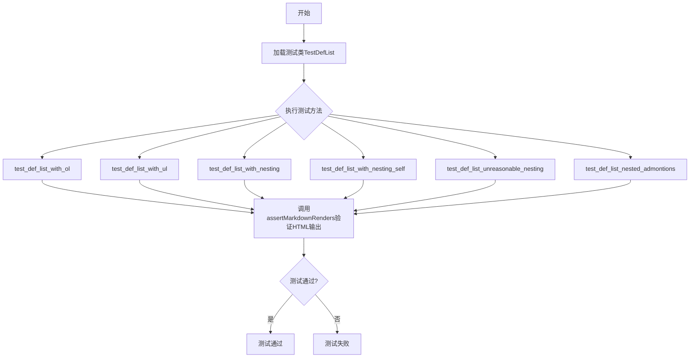
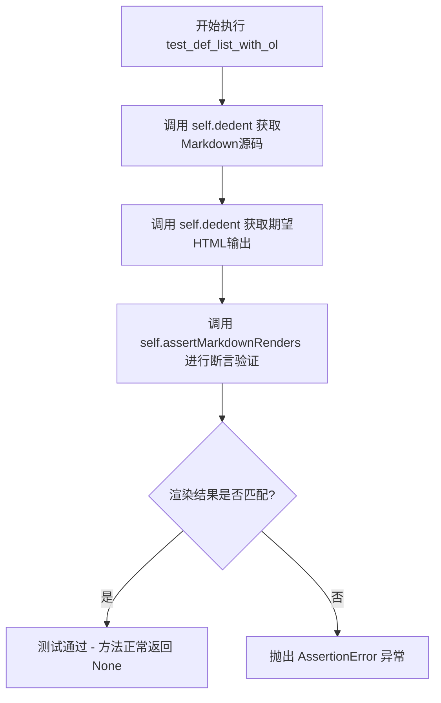
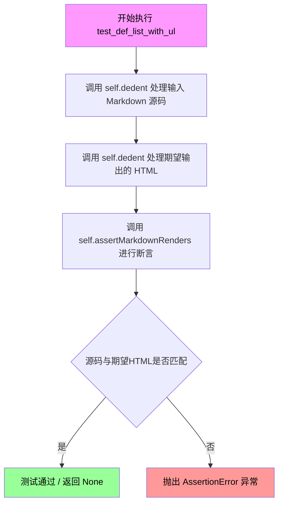
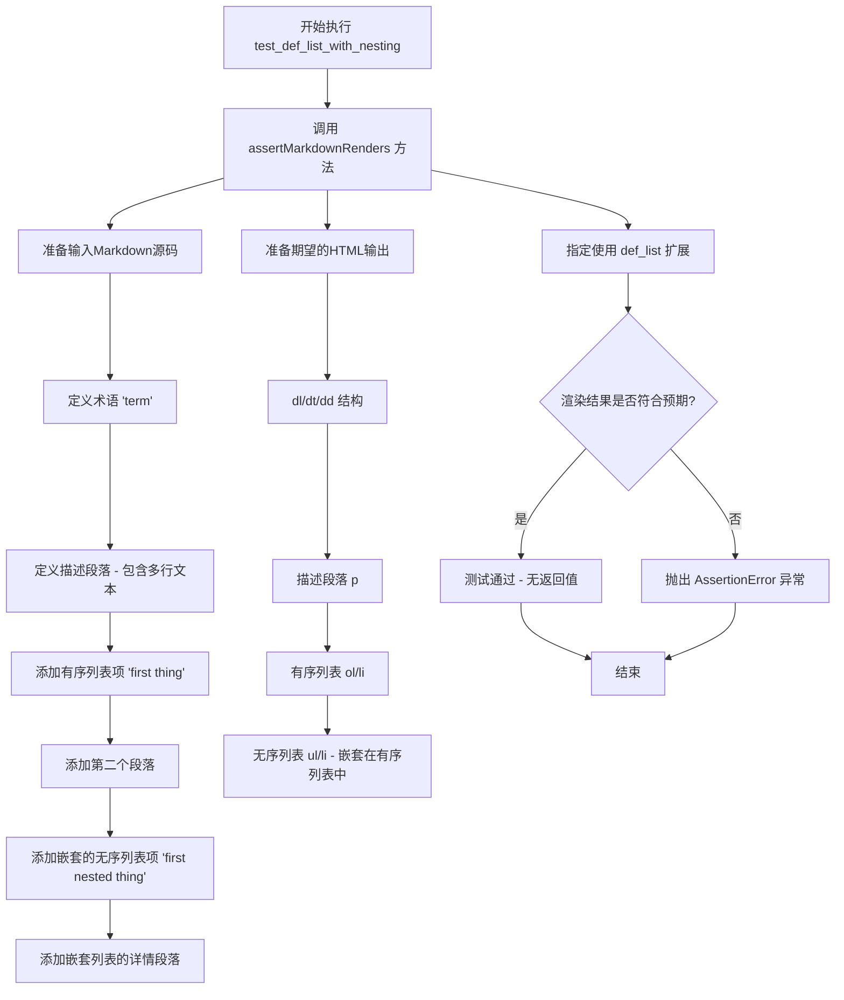
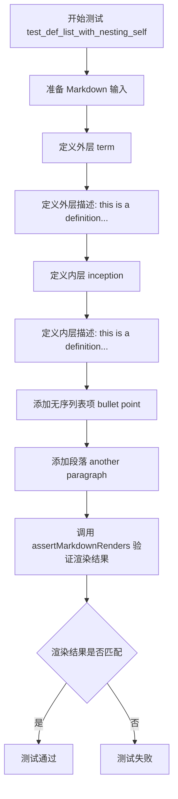
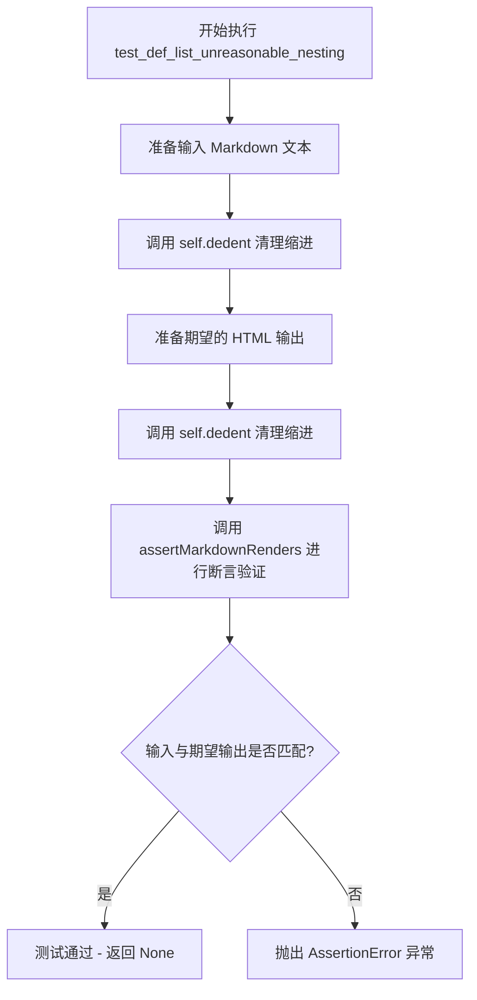
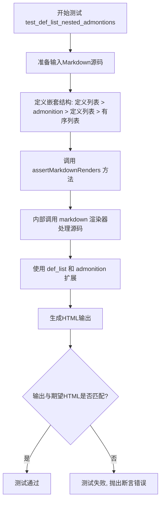

# `markdown\tests\test_syntax\extensions\test_def_list.py` 详细设计文档

这是Python Markdown库的测试文件，专门用于测试定义列表（definition list）扩展功能，验证定义列表与有序列表、无序列表、嵌套结构以及警告框（admonition）的组合渲染是否正确。

## 整体流程



## 类结构

```
TestCase (markdown.test_tools)
└── TestDefList (测试类)
```

## 全局变量及字段


    

## 全局函数及方法


### `TestDefList.test_def_list_with_ol`

该测试方法用于验证Python Markdown库的`def_list`（定义列表）扩展在处理包含有序列表（ordered list）的定义项时的正确渲染功能。

参数：
- `self`：实例方法隐式参数，类型为`TestDefList`（继承自`TestCase`），表示测试用例实例本身

返回值：`None`，无显式返回值（测试方法通过断言验证，失败时抛出异常）

#### 流程图



#### 带注释源码

```python
def test_def_list_with_ol(self):
    """
    测试定义列表扩展在包含有序列表时的渲染功能。
    
    验证场景：
    - 定义列表术语（term）后的定义（definition）包含有序列表
    - 有序列表项可以包含多个段落
    """
    # 使用 assertMarkdownRenders 验证 Markdown 到 HTML 的转换
    self.assertMarkdownRenders(
        # 第一个参数：输入的 Markdown 源码（经过 dedent 处理去除缩进）
        self.dedent(
            '''

            term

            :   this is a definition for term. it has
                multiple lines in the first paragraph.

                1.  first thing

                    first thing details in a second paragraph.

                1.  second thing

                    second thing details in a second paragraph.

                1.  third thing

                    third thing details in a second paragraph.
            '''
        ),
        # 第二个参数：期望输出的 HTML（经过 dedent 处理去除缩进）
        self.dedent(
            '''
            <dl>
            <dt>term</dt>
            <dd>
            <p>this is a definition for term. it has
            multiple lines in the first paragraph.</p>
            <ol>
            <li>
            <p>first thing</p>
            <p>first thing details in a second paragraph.</p>
            </li>
            <li>
            <p>second thing</p>
            <p>second thing details in a second paragraph.</p>
            </li>
            <li>
            <p>third thing</p>
            <p>third thing details in a second paragraph.</p>
            </li>
            </ol>
            </dd>
            </dl>
            '''
        ),
        # 第三个参数：使用的扩展列表
        extensions=['def_list']
    )
```


### `TestDefList.test_def_list_with_ul`

该方法是 Python Markdown 项目的测试用例，用于验证定义列表（Definition List）在包含无序列表（Unordered List）时能否正确渲染为 HTML。它通过 `assertMarkdownRenders` 断言方法，将 Markdown 格式的输入转换为 HTML，并比对期望的输出结果。

参数：

- `self`：隐式参数，`TestCase` 实例本身，无需显式传递

返回值：`None`，测试方法无返回值，通过断言表达测试结果

#### 流程图



#### 带注释源码

```python
def test_def_list_with_ul(self):
    """
    测试定义列表中包含无序列表时的渲染功能。
    
    该测试用例验证以下 Markdown 语法:
    1. 定义术语 "term"
    2. 定义描述包含多个段落
    3. 描述中包含无序列表 (-)
    
    期望输出为 dl/dt/dd 标签包裹的 HTML，其中 dd 中包含 ul/li 列表。
    """
    # 使用 assertMarkdownRenders 验证 Markdown 到 HTML 的转换
    self.assertMarkdownRenders(
        # 第一个参数: 输入的 Markdown 源码
        # 经过 self.dedent 处理，去除缩进，保持字符串格式
        self.dedent(
            '''

            term

            :   this is a definition for term. it has
                multiple lines in the first paragraph.

                -   first thing

                    first thing details in a second paragraph.

                -   second thing

                    second thing details in a second paragraph.

                -   third thing

                    third thing details in a second paragraph.
            '''
        ),
        # 第二个参数: 期望输出的 HTML 源码
        # 同样经过 self.dedent 处理
        self.dedent(
            '''
            <dl>
            <dt>term</dt>
            <dd>
            <p>this is a definition for term. it has
            multiple lines in the first paragraph.</p>
            <ul>
            <li>
            <p>first thing</p>
            <p>first thing details in a second paragraph.</p>
            </li>
            <li>
            <p>second thing</p>
            <p>second thing details in a second paragraph.</p>
            </li>
            <li>
            <p>third thing</p>
            <p>third thing details in a second paragraph.</p>
            </li>
            </ul>
            </dd>
            </dl>
            '''
        ),
        # 第三个参数: 使用的 Markdown 扩展
        # def_list 扩展提供定义列表的支持
        extensions=['def_list']
    )
```


### `TestDefList.test_def_list_with_nesting`

这是一个测试方法，用于验证Markdown解析器在定义列表（definition list）中正确嵌套有序列表（ol）和无序列表（ul）时的渲染行为。

参数： 无（仅包含`self`参数，这是Python实例方法的隐式参数）

返回值：`None`，该方法为测试用例，通过`assertMarkdownRenders`断言验证渲染结果，不返回任何值

#### 流程图



#### 带注释源码

```python
def test_def_list_with_nesting(self):
    """
    测试定义列表中嵌套有序列表和无序列表的渲染功能。
    
    该测试方法验证Markdown解析器能够正确处理以下复杂嵌套结构：
    1. 定义列表（dl/dt/dd）
    2. 定义列表中嵌套有序列表（ol/li）
    3. 有序列表项中嵌套无序列表（ul/li）
    """
    
    # 调用assertMarkdownRenders方法进行渲染验证
    # 第一个参数：输入的Markdown源码（经过dedent处理去除缩进）
    self.assertMarkdownRenders(
        # 去除多余空白后的Markdown源码
        self.dedent(
            '''
            term

            :   this is a definition for term. it has
                multiple lines in the first paragraph.

                1.  first thing

                    first thing details in a second paragraph.

                    -   first nested thing

                        second nested thing details
            '''
        ),
        
        # 第二个参数：期望渲染输出的HTML源码
        self.dedent(
            '''
            <dl>
            <dt>term</dt>
            <dd>
            <p>this is a definition for term. it has
            multiple lines in the first paragraph.</p>
            <ol>
            <li>
            <p>first thing</p>
            <p>first thing details in a second paragraph.</p>
            <ul>
            <li>
            <p>first nested thing</p>
            <p>second nested thing details</p>
            </li>
            </ul>
            </li>
            </ol>
            </dd>
            </dl>
            '''
        ),
        
        # 第三个参数：指定使用的Markdown扩展
        # def_list扩展提供了定义列表的解析功能
        extensions=['def_list']
    )
```

---

### 附加信息

#### 关键组件信息

| 组件名称 | 描述 |
|---------|------|
| `TestDefList` | 测试类，继承自`TestCase`，用于测试Markdown的定义列表扩展功能 |
| `assertMarkdownRenders` | 测试工具方法，用于验证Markdown源码是否正确渲染为指定的HTML |
| `self.dedent()` | 工具方法，用于去除字符串的多余缩进空白 |
| `def_list` | Markdown扩展，提供定义列表（`<dl>`, `<dt>`, `<dd>`）的解析支持 |

#### 潜在技术债务或优化空间

1. **测试数据内联**：测试的输入输出HTML源码直接内联在测试方法中，可考虑提取为测试数据文件以提高可维护性
2. **缺少参数化测试**：多个`test_def_list_*`方法结构相似，可考虑使用`unittest.parameterized`进行参数化重构
3. **断言信息不够详细**：`assertMarkdownRenders`失败时可能难以快速定位问题，可添加更详细的错误上下文信息

#### 错误处理与异常设计

- 该测试方法依赖于`assertMarkdownRenders`的内部错误处理
- 如果渲染结果与期望不符，该方法会抛出`AssertionError`并显示具体的差异信息
- 测试使用`dedent`方法处理多行字符串，确保不同缩进风格的Markdown源码都能被正确处理


### `TestDefList.test_def_list_with_nesting_self`

这是一个测试方法，用于验证 Markdown 定义列表扩展能够正确处理自嵌套的定义列表场景。该测试确保在定义列表内部嵌套另一个定义列表时，HTML 输出结构正确，包括多层 `<dl>`、`<dt>`、`<dd>` 标签以及其中的段落和列表元素。

参数：

- `self`：`TestDefList`，测试类实例本身，无需显式传递

返回值：`None`，测试方法无返回值，通过 `assertMarkdownRenders` 断言验证渲染结果

#### 流程图



#### 带注释源码

```python
def test_def_list_with_nesting_self(self):
    """
    测试定义列表扩展处理自嵌套场景的能力。
    验证在定义列表的 dd 内部再嵌套一个定义列表时的渲染正确性。
    """
    # 第一个参数：Markdown 源文本，包含嵌套的定义列表结构
    self.assertMarkdownRenders(
        self.dedent(
            '''

            term

            :   this is a definition for term. it has
                multiple lines in the first paragraph.

                inception

                :   this is a definition for term. it has
                    multiple lines in the first paragraph.

                    - bullet point

                      another paragraph
            '''
        ),
        # 第二个参数：期望的 HTML 输出
        self.dedent(
            '''
            <dl>
            <dt>term</dt>
            <dd>
            <p>this is a definition for term. it has
            multiple lines in the first paragraph.</p>
            <dl>
            <dt>inception</dt>
            <dd>
            <p>this is a definition for term. it has
            multiple lines in the first paragraph.</p>
            <ul>
            <li>bullet point</li>
            </ul>
            <p>another paragraph</p>
            </dd>
            </dl>
            </dd>
            </dl>
            '''
        ),
        # 第三个参数：启用的扩展列表
        extensions=['def_list']
    )
```


### TestDefList.test_def_list_unreasonable_nesting

该方法是一个测试用例，用于验证 Python Markdown 库在处理复杂的"不合理嵌套"场景时的正确性。该测试覆盖了定义列表中嵌套有序列表、进一步嵌套无序列表、再嵌套定义列表、最后再嵌套无序列表的多层嵌套结构，验证 markdown 转换引擎能否正确解析并生成符合规范的 HTML 输出。

参数：

- `self`：TestCase，测试用例类实例本身，继承自 TestCase 基类

返回值：`None`，该方法为测试方法，通过 `assertMarkdownRenders` 断言进行验证，无显式返回值

#### 流程图



#### 带注释源码

```python
def test_def_list_unreasonable_nesting(self):
    """
    测试定义列表的不合理嵌套场景
    
    该测试验证多层嵌套的 Markdown 结构:
    1. 定义列表 (dl > dt + dd)
    2. 嵌套有序列表 (ol > li)
    3. 嵌套无序列表 (ul > li)
    4. 嵌套定义列表 (dl > dt + dd)
    5. 嵌套无序列表 (ul > li > p)
    
    这种嵌套结构被称为 'turducken' (一种将鸭子塞进鸡里再塞进火鸡里的料理)
    """
    # 调用 assertMarkdownRenders 验证 Markdown 到 HTML 的转换
    self.assertMarkdownRenders(
        # 第一个参数: 输入的 Markdown 源代码
        self.dedent(
            '''
            turducken

            :   this is a definition for term. it has
                multiple lines in the first paragraph.

                1.  ordered list

                    - nested list

                        term

                        :   definition

                            -   item 1 paragraph 1

                                item 1 paragraph 2
            '''
        ),
        # 第二个参数: 期望输出的 HTML
        self.dedent(
            '''
            <dl>
            <dt>turducken</dt>
            <dd>
            <p>this is a definition for term. it has
            multiple lines in the first paragraph.</p>
            <ol>
            <li>
            <p>ordered list</p>
            <ul>
            <li>
            <p>nested list</p>
            <dl>
            <dt>term</dt>
            <dd>
            <p>definition</p>
            <ul>
            <li>
            <p>item 1 paragraph 1</p>
            <p>item 1 paragraph 2</p>
            </li>
            </ul>
            </dd>
            </dl>
            </li>
            </ul>
            </li>
            </ol>
            </dd>
            </dl>
            '''
        ),
        # 第三个参数: 使用的 Markdown 扩展
        extensions=['def_list']
    )
```


### `TestDefList.test_def_list_nested_admontions`

该方法是一个测试用例，用于验证Markdown解析器在处理定义列表（definition list）与admonition（警告框）嵌套时的正确性。它通过比较输入的Markdown源码与期望输出的HTML代码，确保解析器能正确处理在admonition内部嵌套定义列表并在定义列表中包含有序列表的复杂场景。

参数：

- `self`：`TestCase`，测试类实例本身，无需显式传递

返回值：`None`，该方法为测试用例，通过 `assertMarkdownRenders` 断言验证Markdown渲染结果，不返回任何值

#### 流程图



#### 带注释源码

```python
def test_def_list_nested_admontions(self):
    """
    测试定义列表与admonition的嵌套功能。
    
    该测试验证以下嵌套结构能被正确解析：
    1. 外层定义列表 (dl > dt + dd)
    2. admonition警告框 (div.admonition)
    3. 内层定义列表 (dl > dt + dd)
    4. 有序列表 (ol > li)
    """
    # 第一个参数: 输入的Markdown源码
    self.assertMarkdownRenders(
        self.dedent(
            '''
            term

            :   definition

                !!! note "Admontion"

                    term

                    :   definition

                        1.  list

                            continue
            '''
        ),
        # 第二个参数: 期望输出的HTML源码
        self.dedent(
            '''
            <dl>
            <dt>term</dt>
            <dd>
            <p>definition</p>
            <div class="admonition note">
            <p class="admonition-title">Admontion</p>
            <dl>
            <dt>term</dt>
            <dd>
            <p>definition</p>
            <ol>
            <li>
            <p>list</p>
            <p>continue</p>
            </li>
            </ol>
            </dd>
            </dl>
            </div>
            </dd>
            </dl>
            '''
        ),
        # 第三个参数: 启用的Markdown扩展
        extensions=['def_list', 'admonition']
    )
```

## 关键组件


### TestDefList

测试类，用于验证Markdown定义列表（definition list）扩展的功能，包含多个测试用例覆盖定义列表与有序列表、无序列表、嵌套以及admonition的组合。

### assertMarkdownRenders

测试断言方法，接收三个参数：输入Markdown源码、期望输出的HTML、以及要启用的扩展列表，验证渲染结果是否匹配。

### dedent

测试辅助方法，用于去除多行字符串的公共前导空白，使测试用例中的文本更容易阅读和维护。

### def_list扩展

Markdown扩展插件，实现定义列表的解析和渲染，将`term\n: definition`格式转换为`<dl><dt>term</dt><dd>definition</dd></dl>`的HTML结构。

### admonition扩展

Markdown扩展插件，实现警告提示块（admonition）的解析和渲染，支持`!!! note "标题"`等语法，生成带有样式的提示框。

### 定义列表与有序列表组合

测试场景：验证定义列表内部可以包含有序列表（`<ol>`），测试多层嵌套的HTML结构是否正确生成。

### 定义列表与无序列表组合

测试场景：验证定义列表内部可以包含无序列表（`<ul>`），确保列表类型混用时HTML结构正确。

### 定义列表嵌套

测试场景：验证定义列表可以嵌套定义列表（自引用），测试深层嵌套时的HTML结构正确性。

### 定义列表与admonition嵌套

测试场景：验证定义列表可以包含admonition块，且admonition内部又包含定义列表，测试复杂嵌套场景下的解析正确性。

### 深层嵌套（turducken）

测试场景：验证定义列表、有序列表、无序列表、定义列表的多层深度嵌套（4层以上）的处理能力。


## 问题及建议


### 已知问题

- **拼写错误**：`test_def_list_nested_admontions` 方法名中 "Admontion" 应为 "Admonition"，这是一个潜在的命名不一致问题
- **测试数据硬编码**：大量的 HTML 期望输出以硬编码字符串形式直接写在测试方法中，导致测试代码冗长且难以维护
- **代码重复**：多个测试方法中使用了相同的 `self.dedent()` 调用模式来处理 markdown 和 HTML 字符串，相同的 HTML 结构（如 `<dl><dt>term</dt><dd>...`）在多个测试中重复出现
- **测试参数未参数化**：extensions 参数（`['def_list']` 或 `['def_list', 'admonition']`）在每个测试中重复指定，可以提取为类级别的配置或使用参数化测试
- **缺少负向测试**：仅包含正常场景的测试用例，缺少对格式错误输入、边界情况和异常处理的测试

### 优化建议

- 修正拼写错误，将 `test_def_list_nested_admontions` 重命名为 `test_def_list_nested_admonition`
- 使用 pytest 的 `@pytest.mark.parametrize` 或 unittest 的参数化方法重构重复的测试场景，减少代码冗余
- 将通用的 HTML 模板片段提取为类常量或辅助方法，避免在每个测试方法中重复定义相同的结构
- 添加 setUp 方法集中初始化 extensions 配置，简化单个测试方法
- 引入负向测试用例，验证非法输入（如缺少冒号、缩进错误、嵌套层级过深等）时的错误处理行为

## 其它


### 设计目标与约束

本测试类旨在验证Python Markdown库中定义列表（definition list）扩展的正确性，特别是处理嵌套场景的能力。测试覆盖有序列表、无序列表、深度嵌套以及与admonition扩展的组合使用。测试遵循Markdown规范，确保HTML输出的正确性和一致性。

### 错误处理与异常设计

测试类使用unittest框架的assertMarkdownRenders方法进行验证，当实际输出与预期不符时抛出AssertionError。测试不直接处理异常，而是依赖测试框架捕获并报告不匹配情况。测试数据经过dedent处理以确保格式一致性。

### 数据流与状态机

测试数据流：输入Markdown源码 → Markdown处理器（应用def_list和admonition扩展） → 输出HTML源码 → 与预期HTML比对。状态转换涉及：解析term → 解析definition → 检测嵌套列表类型（ol/ul/dl） → 递归处理嵌套内容 → 生成完整HTML结构。

### 外部依赖与接口契约

依赖markdown.test_tools.TestCase基类提供assertMarkdownRenders()方法进行渲染验证。依赖markdown扩展：def_list（定义列表）、admonition（警告提示）。输入为字符串格式Markdown文本，输出为字符串格式HTML片段。

### 测试策略

采用黑盒测试方法，通过输入Markdown文本验证HTML输出。测试覆盖边界情况：多行定义、多层嵌套、混合列表类型。使用dedent方法标准化缩进以提高可读性。

### 性能考虑

测试仅关注功能正确性，未包含性能基准测试。嵌套深度测试（如turducken）可能影响大量递归调用的性能。建议对复杂嵌套场景进行性能回归测试。

### 安全性考虑

测试输入为静态字符串，无外部输入处理。不涉及用户生成内容的解析，无需XSS防护测试。但输出的HTML应遵循安全编码实践，防止注入攻击。

### 版本兼容性

测试代码适用于Python 3.x环境。依赖的markdown库版本需支持def_list和admonition扩展。测试格式与unittest框架兼容。

    