# `markdown\tests\test_syntax\extensions\test_fenced_code.py` 详细设计文档

该文件是Python-Markdown项目的围栏代码块（Fenced Code Blocks）功能测试套件，测试了带语法高亮和不带语法高亮的围栏代码块的各种场景，包括基本语法、嵌套、语言标识、属性设置、代码高亮等。

## 整体流程

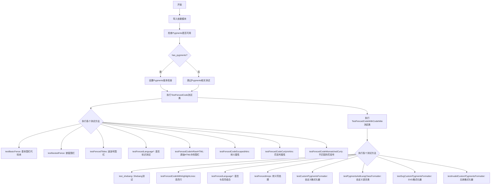

## 类结构

```
TestCase (基类)
├── TestFencedCode
│   ├── testBasicFence
│   ├── testNestedFence
│   ├── testFencedTildes
│   ├── testFencedLanguageNoDot
│   ├── testFencedLanguageWithDot
│   ├── test_fenced_code_in_raw_html
│   ├── testFencedLanguageInAttr
│   ├── testFencedMultipleClassesInAttr
│   ├── testFencedIdInAttr
│   ├── testFencedIdAndLangInAttr
│   ├── testFencedIdAndLangAndClassInAttr
│   ├── testFencedLanguageIdAndPygmentsDisabledInAttrNoCodehilite
│   ├── testFencedLanguageIdAndPygmentsEnabledInAttrNoCodehilite
│   ├── testFencedLanguageNoCodehiliteWithAttrList
│   ├── testFencedLanguagePygmentsDisabledInAttrNoCodehiliteWithAttrList
│   ├── testFencedLanguagePygmentsEnabledInAttrNoCodehiliteWithAttrList
│   ├── testFencedLanguageNoPrefix
│   ├── testFencedLanguageAltPrefix
│   ├── testFencedCodeEscapedAttrs
│   ├── testFencedCodeCurlyInAttrs
│   └── testFencedCodeMismatchedCurlyInAttrs
└── TestFencedCodeWithCodehilite
    ├── setUp
    ├── test_shebang
    ├── testFencedCodeWithHighlightLines
    ├── testFencedLanguageAndHighlightLines
    ├── testFencedLanguageAndPygmentsDisabled
    ├── testFencedLanguageDoubleEscape
    ├── testFencedAmps
    ├── testFencedCodeWithHighlightLinesInAttr
    ├── testFencedLanguageAndHighlightLinesInAttr
    ├── testFencedLanguageIdInAttrAndPygmentsDisabled
    ├── testFencedLanguageIdAndPygmentsDisabledInAttr
    ├── testFencedLanguageAttrCssclass
    ├── testFencedLanguageAttrLinenums
    ├── testFencedLanguageAttrGuesslang
    ├── testFencedLanguageAttrNoclasses
    ├── testFencedMultipleBlocksSameStyle
    ├── testCustomPygmentsFormatter
    ├── testPygmentsAddLangClassFormatter
    ├── testSvgCustomPygmentsFormatter
    └── testInvalidCustomPygmentsFormatter
```

## 全局变量及字段


### `has_pygments`
    
布尔标志，指示Pygments库是否已安装并可用

类型：`bool`
    


### `required_pygments_version`
    
从环境变量PYGMENTS_VERSION获取的Pygments版本要求字符串，如果未设置则为空字符串

类型：`str`
    


    

## 全局函数及方法


# TestCase 提取与详细设计文档

## 概述

本代码文件是 Python Markdown 项目的 fenced code（围栏代码）扩展的测试套件，包含了两个测试类 `TestFencedCode` 和 `TestFencedCodeWithCodehilite`，用于验证 Markdown 解析器对围栏代码块的正确处理能力。

---

### `TestFencedCode`

描述：测试类，用于验证 fenced_code 扩展对各种围栏代码块语法（反引号和波浪号）的解析能力，包括基本语法、嵌套、属性、ID 等功能。

参数：无（该类继承自 `TestCase`，通过 `setUp` 方法继承父类功能）

返回值：无（测试类不返回值）

#### 流程图

```mermaid
flowchart TD
    A[开始测试] --> B{执行单个测试方法}
    B -->|testBasicFence| C[测试基本反引号围栏]
    B -->|testNestedFence| D[测试嵌套围栏]
    B -->|testFencedTildes| E[测试波浪号围栏]
    B -->|testFencedLanguageNoDot| F[测试语言标识无点号]
    B -->|testFencedLanguageWithDot| G[测试语言标识有点号]
    B -->|test_fenced_code_in_raw_html| H[测试原始HTML中的围栏]
    B -->|testFencedLanguageInAttr| I[测试属性中的语言标识]
    B -->|testFencedMultipleClassesInAttr| J[测试多类属性]
    B -->|testFencedIdInAttr| K[测试ID属性]
    B -->|testFencedIdAndLangInAttr| L[测试ID和语言组合]
    B -->|testFencedIdAndLangAndClassInAttr| M[测试ID语言类组合]
    B -->|testFencedLanguageIdAndPygmentsDisabledInAttrNoCodehilite| N[测试禁用Pygments]
    B -->|testFencedLanguageIdAndPygmentsEnabledInAttrNoCodehilite| O[测试启用Pygments]
    B -->|testFencedLanguageNoCodehiliteWithAttrList| P[测试无Codehilite有AttrList]
    B -->|testFencedLanguagePygmentsDisabledInAttrNoCodehiliteWithAttrList| Q[测试禁用Pygments有AttrList]
    B -->|testFencedLanguagePygmentsEnabledInAttrNoCodehiliteWithAttrList| R[测试启用Pygments有AttrList]
    B -->|testFencedLanguageNoPrefix| S[测试无前缀]
    B -->|testFencedLanguageAltPrefix| S1[测试自定义前缀]
    B -->|testFencedCodeEscapedAttrs| T[测试转义属性]
    B -->|testFencedCodeCurlyInAttrs| U[测试属性中的花括号]
    B -->|testFencedCodeMismatchedCurlyInAttrs| V[测试不匹配的花括号]
    C --> W[断言渲染结果]
    D --> W
    E --> W
    F --> W
    G --> W
    H --> W
    I --> W
    J --> W
    K --> W
    L --> W
    M --> W
    N --> W
    O --> W
    P --> W
    Q --> W
    R --> W
    S --> W
    S1 --> W
    T --> W
    U --> W
    V --> W
    W --> X[测试完成]
```

#### 带注释源码

```python
class TestFencedCode(TestCase):
    """
    测试 fenced_code 扩展的各种功能
    继承自 markdown.test_tools.TestCase 基类
    """
    
    def testBasicFence(self):
        """测试基本的反引号围栏代码块"""
        self.assertMarkdownRenders(
            self.dedent(
                '''
                A paragraph before a fenced code block:

                ```
                Fenced code block
                ```
                '''
            ),
            self.dedent(
                '''
                <p>A paragraph before a fenced code block:</p>
                <pre><code>Fenced code block
                </code></pre>
                '''
            ),
            extensions=['fenced_code']
        )

    def testNestedFence(self):
        """测试嵌套的围栏代码块"""
        # 使用四个反引号包围三个反引号
        self.assertMarkdownRenders(
            self.dedent(
                '''
                ````

                ```
                ````
                '''
            ),
            self.dedent(
                '''
                <pre><code>
                ```
                </code></pre>
                '''
            ),
            extensions=['fenced_code']
        )

    def testFencedTildes(self):
        """测试波浪号(~)围栏代码块"""
        # 波浪号围栏中可以包含反引号不会关闭围栏
        self.assertMarkdownRenders(
            self.dedent(
                '''
                ~~~
                # Arbitrary code
                ``` # these backticks will not close the block
                ~~~
                '''
            ),
            self.dedent(
                '''
                <pre><code># Arbitrary code
                ``` # these backticks will not close the block
                </code></pre>
                '''
            ),
            extensions=['fenced_code']
        )

    def testFencedLanguageNoDot(self):
        """测试语言标识（无点号）"""
        self.assertMarkdownRenders(
            self.dedent(
                '''
                ``` python
                # Some python code
                ```
                '''
            ),
            self.dedent(
                '''
                <pre><code class="language-python"># Some python code
                </code></pre>
                '''
            ),
            extensions=['fenced_code']
        )

    def testFencedLanguageWithDot(self):
        """测试语言标识（有点号）"""
        self.assertMarkdownRenders(
            self.dedent(
                '''
                ``` .python
                # Some python code
                ```
                '''
            ),
            self.dedent(
                '''
                <pre><code class="language-python"># Some python code
                </code></pre>
                '''
            ),
            extensions=['fenced_code']
        )

    def test_fenced_code_in_raw_html(self):
        """测试在原始HTML中的围栏代码块"""
        self.assertMarkdownRenders(
            self.dedent(
                """
                <details>
                ```
                Begone placeholders!
                ```
                </details>
                """
            ),
            self.dedent(
                """
                <details>

                <pre><code>Begone placeholders!
                </code></pre>

                </details>
                """
            ),
            extensions=['fenced_code']
        )

    def testFencedLanguageInAttr(self):
        """测试在属性中的语言标识"""
        self.assertMarkdownRenders(
            self.dedent(
                '''
                ``` {.python}
                # Some python code
                ```
                '''
            ),
            self.dedent(
                '''
                <pre><code class="language-python"># Some python code
                </code></pre>
                '''
            ),
            extensions=['fenced_code']
        )

    def testFencedMultipleClassesInAttr(self):
        """测试属性中的多个类"""
        self.assertMarkdownRenders(
            self.dedent(
                '''
                ``` {.python .foo .bar}
                # Some python code
                ```
                '''
            ),
            self.dedent(
                '''
                <pre class="foo bar"><code class="language-python"># Some python code
                </code></pre>
                '''
            ),
            extensions=['fenced_code']
        )

    def testFencedIdInAttr(self):
        """测试属性中的ID"""
        self.assertMarkdownRenders(
            self.dedent(
                '''
                ``` { #foo }
                # Some python code
                ```
                '''
            ),
            self.dedent(
                '''
                <pre id="foo"><code># Some python code
                </code></pre>
                '''
            ),
            extensions=['fenced_code']
        )

    def testFencedIdAndLangInAttr(self):
        """测试属性中的ID和语言组合"""
        self.assertMarkdownRenders(
            self.dedent(
                '''
                ``` { .python #foo }
                # Some python code
                ```
                '''
            ),
            self.dedent(
                '''
                <pre id="foo"><code class="language-python"># Some python code
                </code></pre>
                '''
            ),
            extensions=['fenced_code']
        )

    def testFencedIdAndLangAndClassInAttr(self):
        """测试属性中的ID、语言和类组合"""
        self.assertMarkdownRenders(
            self.dedent(
                '''
                ``` { .python #foo .bar }
                # Some python code
                ```
                '''
            ),
            self.dedent(
                '''
                <pre id="foo" class="bar"><code class="language-python"># Some python code
                </code></pre>
                '''
            ),
            extensions=['fenced_code']
        )

    def testFencedLanguageIdAndPygmentsDisabledInAttrNoCodehilite(self):
        """测试禁用Pygments的语言和ID属性"""
        self.assertMarkdownRenders(
            self.dedent(
                '''
                ``` { .python #foo use_pygments=False }
                # Some python code
                ```
                '''
            ),
            self.dedent(
                '''
                <pre id="foo"><code class="language-python"># Some python code
                </code></pre>
                '''
            ),
            extensions=['fenced_code']
        )

    def testFencedLanguageIdAndPygmentsEnabledInAttrNoCodehilite(self):
        """测试启用Pygments的语言和ID属性（无Codehilite）"""
        self.assertMarkdownRenders(
            self.dedent(
                '''
                ``` { .python #foo use_pygments=True }
                # Some python code
                ```
                '''
            ),
            self.dedent(
                '''
                <pre id="foo"><code class="language-python"># Some python code
                </code></pre>
                '''
            ),
            extensions=['fenced_code']
        )

    def testFencedLanguageNoCodehiliteWithAttrList(self):
        """测试无Codehilite但有AttrList的语言标识"""
        self.assertMarkdownRenders(
            self.dedent(
                '''
                ``` { .python foo=bar }
                # Some python code
                ```
                '''
            ),
            self.dedent(
                '''
                <pre><code class="language-python" foo="bar"># Some python code
                </code></pre>
                '''
            ),
            extensions=['fenced_code', 'attr_list']
        )

    def testFencedLanguagePygmentsDisabledInAttrNoCodehiliteWithAttrList(self):
        """测试禁用Pygments的语言属性和AttrList"""
        self.assertMarkdownRenders(
            self.dedent(
                '''
                ``` { .python foo=bar use_pygments=False }
                # Some python code
                ```
                '''
            ),
            self.dedent(
                '''
                <pre><code class="language-python" foo="bar"># Some python code
                </code></pre>
                '''
            ),
            extensions=['fenced_code', 'attr_list']
        )

    def testFencedLanguagePygmentsEnabledInAttrNoCodehiliteWithAttrList(self):
        """测试启用Pygments的语言属性和AttrList"""
        self.assertMarkdownRenders(
            self.dedent(
                '''
                ``` { .python foo=bar use_pygments=True }
                # Some python code
                ```
                '''
            ),
            self.dedent(
                '''
                <pre><code class="language-python"># Some python code
                </code></pre>
                '''
            ),
            extensions=['fenced_code', 'attr_list']
        )

    def testFencedLanguageNoPrefix(self):
        """测试无语言前缀"""
        self.assertMarkdownRenders(
            self.dedent(
                '''
                ``` python
                # Some python code
                ```
                '''
            ),
            self.dedent(
                '''
                <pre><code class="python"># Some python code
                </code></pre>
                '''
            ),
            extensions=[markdown.extensions.fenced_code.FencedCodeExtension(lang_prefix='')]
        )

    def testFencedLanguageAltPrefix(self):
        """测试自定义语言前缀"""
        self.assertMarkdownRenders(
            self.dedent(
                '''
                ``` python
                # Some python code
                ```
                '''
            ),
            self.dedent(
                '''
                <pre><code class="lang-python"># Some python code
                </code></pre>
                '''
            ),
            extensions=[markdown.extensions.fenced_code.FencedCodeExtension(lang_prefix='lang-')]
        )

    def testFencedCodeEscapedAttrs(self):
        """测试转义字符处理"""
        self.assertMarkdownRenders(
            self.dedent(
                '''
                ``` { ."weird #"foo bar=">baz }
                # Some python code
                ```
                '''
            ),
            self.dedent(
                '''
                <pre id="&quot;foo"><code class="language-&quot;weird" bar="&quot;&gt;baz"># Some python code
                </code></pre>
                '''
            ),
            extensions=['fenced_code', 'attr_list']
        )

    def testFencedCodeCurlyInAttrs(self):
        """测试属性中包含花括号"""
        self.assertMarkdownRenders(
            self.dedent(
                '''
                ``` { data-test="{}" }
                # Some python code
                ```
                '''
            ),
            self.dedent(
                '''
                <pre><code data-test="{}"># Some python code
                </code></pre>
                '''
            ),
            extensions=['fenced_code', 'attr_list']
        )

    def testFencedCodeMismatchedCurlyInAttrs(self):
        """测试不匹配的花括号（语法错误情况）"""
        self.assertMarkdownRenders(
            self.dedent(
                '''
                ``` { data-test="{}" } }
                # Some python code
                ```
                ```
                test
                ```
                '''
            ),
            self.dedent(
                '''
                <p>``` { data-test="{}" } }</p>
                <h1>Some python code</h1>
                <pre><code></code></pre>
                <p>test
                ```</p>
                '''
            ),
            extensions=['fenced_code', 'attr_list']
        )
```

---

### `TestFencedCodeWithCodehilite`

描述：测试类，用于验证 fenced_code 扩展与 codehilite 扩展（语法高亮）组合使用时的功能，包括 shebang、代码高亮行、多语言支持、自定义格式化器等。

参数：无（该类继承自 `TestCase`，通过 `setUp` 方法继承父类功能）

返回值：无（测试类不返回值）

#### 流程图

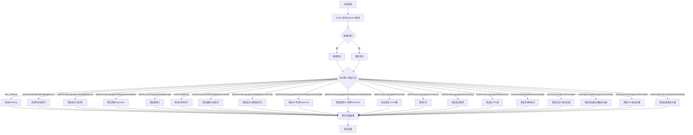

#### 带注释源码

```python
class TestFencedCodeWithCodehilite(TestCase):
    """
    测试 fenced_code 与 codehilite 扩展的组合功能
    继承自 markdown.test_tools.TestCase 基类
    """

    def setUp(self):
        """
        测试前准备：检查 Pygments 版本
        如果版本不匹配则跳过测试
        """
        if has_pygments and pygments.__version__ != required_pygments_version:
            self.skipTest(f'Pygments=={required_pygments_version} is required')

    def test_shebang(self):
        """测试 Shebang 行处理"""
        if has_pygments:
            expected = '''
            <div class="codehilite"><pre><span></span><code>#!test
            </code></pre></div>
            '''
        else:
            expected = '''
            <pre class="codehilite"><code>#!test
            </code></pre>
            '''
        self.assertMarkdownRenders(
            self.dedent(
                '''
                ```
                #!test
                ```
                '''
            ),
            self.dedent(
                expected
            ),
            extensions=[
                markdown.extensions.codehilite.CodeHiliteExtension(linenums=None, guess_lang=False),
                'fenced_code'
            ]
        )

    def testFencedCodeWithHighlightLines(self):
        """测试代码高亮行功能"""
        if has_pygments:
            expected = self.dedent(
                '''
                <div class="codehilite"><pre><span></span><code><span class="hll">line 1
                </span>line 2
                <span class="hll">line 3
                </span></code></pre></div>
                '''
            )
        else:
            expected = self.dedent(
                    '''
                    <pre class="codehilite"><code>line 1
                    line 2
                    line 3
                    </code></pre>
                    '''
                )
        self.assertMarkdownRenders(
            self.dedent(
                '''
                ```hl_lines="1 3"
                line 1
                line 2
                line 3
                ```
                '''
            ),
            expected,
            extensions=[
                markdown.extensions.codehilite.CodeHiliteExtension(linenums=None, guess_lang=False),
                'fenced_code'
            ]
        )

    def testFencedLanguageAndHighlightLines(self):
        """测试语言标识与高亮行组合"""
        if has_pygments:
            expected = (
                '<div class="codehilite"><pre><span></span><code>'
                '<span class="hll"><span class="n">line</span> <span class="mi">1</span>\n'
                '</span><span class="n">line</span> <span class="mi">2</span>\n'
                '<span class="hll"><span class="n">line</span> <span class="mi">3</span>\n'
                '</span></code></pre></div>'
            )
        else:
            expected = self.dedent(
                    '''
                    <pre class="codehilite"><code class="language-python">line 1
                    line 2
                    line 3
                    </code></pre>
                    '''
                )
        self.assertMarkdownRenders(
            self.dedent(
                '''
                ``` .python hl_lines="1 3"
                line 1
                line 2
                line 3
                ```
                '''
            ),
            expected,
            extensions=[
                markdown.extensions.codehilite.CodeHiliteExtension(linenums=None, guess_lang=False),
                'fenced_code'
            ]
        )

    def testFencedLanguageAndPygmentsDisabled(self):
        """测试禁用 Pygments 的语言标识"""
        self.assertMarkdownRenders(
            self.dedent(
                '''
                ``` .python
                # Some python code
                ```
                '''
            ),
            self.dedent(
                '''
                <pre><code class="language-python"># Some python code
                </code></pre>
                '''
            ),
            extensions=[
                markdown.extensions.codehilite.CodeHiliteExtension(use_pygments=False),
                'fenced_code'
            ]
        )

    def testFencedLanguageDoubleEscape(self):
        """测试双重转义字符处理"""
        if has_pygments:
            expected = (
                '<div class="codehilite"><pre><span></span><code>'
                '<span class="p">&lt;</span><span class="nt">span</span>'
                '<span class="p">&gt;</span>This<span class="ni">&amp;amp;</span>'
                'That<span class="p">&lt;/</span><span class="nt">span</span>'
                '<span class="p">&gt;</span>\n'
                '</code></pre></div>'
            )
        else:
            expected = (
                '<pre class="codehilite"><code class="language-html">'
                '&lt;span&gt;This&amp;amp;That&lt;/span&gt;\n'
                '</code></pre>'
            )
        self.assertMarkdownRenders(
            self.dedent(
                '''
                ```html
                <span>This&amp;That</span>
                ```
                '''
            ),
            expected,
            extensions=[
                markdown.extensions.codeHiliteExtension(),
                'fenced_code'
            ]
        )

    def testFencedAmps(self):
        """测试 & 符号的正确转义"""
        if has_pygments:
            expected = self.dedent(
                '''
                <div class="codehilite"><pre><span></span><code>&amp;
                &amp;amp;
                &amp;amp;amp;
                </code></pre></div>
                '''
            )
        else:
            expected = self.dedent(
                '''
                <pre class="codehilite"><code class="language-text">&amp;
                &amp;amp;
                &amp;amp;amp;
                </code></pre>
                '''
            )
        self.assertMarkdownRenders(
            self.dedent(
                '''
                ```text
                &
                &amp;
                &amp;amp;
                ```
                '''
            ),
            expected,
            extensions=[
                markdown.extensions.codehilite.CodeHiliteExtension(),
                'fenced_code'
            ]
        )

    def testFencedCodeWithHighlightLinesInAttr(self):
        """测试属性中的高亮行"""
        if has_pygments:
            expected = self.dedent(
                '''
                <div class="codehilite"><pre><span></span><code><span class="hll">line 1
                </span>line 2
                <span class="hll">line 3
                </span></code></pre></div>
                '''
            )
        else:
            expected = self.dedent(
                    '''
                    <pre class="codehilite"><code>line 1
                    line 2
                    line 3
                    </code></pre>
                    '''
                )
        self.assertMarkdownRenders(
            self.dedent(
                '''
                ```{ hl_lines="1 3" }
                line 1
                line 2
                line 3
                ```
                '''
            ),
            expected,
            extensions=[
                markdown.extensions.codehilite.CodeHiliteExtension(linenums=None, guess_lang=False),
                'fenced_code'
            ]
        )

    def testFencedLanguageAndHighlightLinesInAttr(self):
        """测试属性中的语言标识与高亮行"""
        if has_pygments:
            expected = (
                '<div class="codehilite"><pre><span></span><code>'
                '<span class="hll"><span class="n">line</span> <span class="mi">1</span>\n'
                '</span><span class="n">line</span> <span class="mi">2</span>\n'
                '<span class="hll"><span class="n">line</span> <span class="mi">3</span>\n'
                '</span></code></pre></div>'
            )
        else:
            expected = self.dedent(
                    '''
                    <pre class="codehilite"><code class="language-python">line 1
                    line 2
                    line 3
                    </code></pre>
                    '''
                )
        self.assertMarkdownRenders(
            self.dedent(
                '''
                ``` { .python hl_lines="1 3" }
                line 1
                line 2
                line 3
                ```
                '''
            ),
            expected,
            extensions=[
                markdown.extensions.codehilite.CodeHiliteExtension(linenums=None, guess_lang=False),
                'fenced_code'
            ]
        )

    def testFencedLanguageIdInAttrAndPygmentsDisabled(self):
        """测试属性中的ID与禁用Pygments"""
        self.assertMarkdownRenders(
            self.dedent(
                '''
                ``` { .python #foo }
                # Some python code
                ```
                '''
            ),
            self.dedent(
                '''
                <pre id="foo"><code class="language-python"># Some python code
                </code></pre>
                '''
            ),
            extensions=[
                markdown.extensions.codehilite.CodeHiliteExtension(use_pygments=False),
                'fenced_code'
            ]
        )

    def testFencedLanguageIdAndPygmentsDisabledInAttr(self):
        """测试属性中禁用Pygments"""
        self.assertMarkdownRenders(
            self.dedent(
                '''
                ``` { .python #foo use_pygments=False }
                # Some python code
                ```
                '''
            ),
            self.dedent(
                '''
                <pre id="foo"><code class="language-python"># Some python code
                </code></pre>
                '''
            ),
            extensions=['codehilite', 'fenced_code']
        )

    def testFencedLanguageAttrCssclass(self):
        """测试自定义CSS类"""
        if has_pygments:
            expected = self.dedent(
                '''
                <div class="pygments"><pre><span></span><code><span class="c1"># Some python code</span>
                </code></pre></div>
                '''
            )
        else:
            expected = (
                '<pre class="pygments"><code class="language-python"># Some python code\n'
                '</code></pre>'
            )
        self.assertMarkdownRenders(
            self.dedent(
                '''
                ``` { .python css_class='pygments' }
                # Some python code
                ```
                '''
            ),
            expected,
            extensions=['codehilite', 'fenced_code']
        )

    def testFencedLanguageAttrLinenums(self):
        """测试行号显示"""
        if has_pygments:
            expected = (
                '<table class="codehilitetable"><tr>'
                '<td class="linenos"><div class="linenodiv"><pre>1</pre></div></td>'
                '<td class="code"><div class="codehilite"><pre><span></span>'
                '<code><span class="c1"># Some python code</span>\n'
                '</code></pre></div>\n'
                '</td></tr></table>'
            )
        else:
            expected = (
                '<pre class="codehilite"><code class="language-python linenums"># Some python code\n'
                '</code></pre>'
            )
        self.assertMarkdownRenders(
            self.dedent(
                '''
                ``` { .python linenums=True }
                # Some python code
                ```
                '''
            ),
            expected,
            extensions=['codehilite', 'fenced_code']
        )

    def testFencedLanguageAttrGuesslang(self):
        """测试语言自动猜测"""
        if has_pygments:
            expected = self.dedent(
                '''
                <div class="codehilite"><pre><span></span><code># Some python code
                </code></pre></div>
                '''
            )
        else:
            expected = (
                '<pre class="codehilite"><code># Some python code\n'
                '</code></pre>'
            )
        self.assertMarkdownRenders(
            self.dedent(
                '''
                ``` { guess_lang=False }
                # Some python code
                ```
                '''
            ),
            expected,
            extensions=['codehilite', 'fenced_code']
        )

    def testFencedLanguageAttrNoclasses(self):
        """测试无CSS类模式（内联样式）"""
        if has_pygments:
            expected = (
                '<div class="codehilite" style="background: #f8f8f8">'
                '<pre style="line-height: 125%; margin: 0;"><span></span><code>'
                '<span style="color: #408080; font-style: italic"># Some python code</span>\n'
                '</code></pre></div>'
            )
        else:
            expected = (
                '<pre class="codehilite"><code class="language-python"># Some python code\n'
                '</code></pre>'
            )
        self.assertMarkdownRenders(
            self.dedent(
                '''
                ``` { .python noclasses=True }
                # Some python code
                ```
                '''
            ),
            expected,
            extensions=['codehilite', 'fenced_code']
        )

    def testFencedMultipleBlocksSameStyle(self):
        """测试多个代码块使用相同样式"""
        if has_pygments:
            expected = (
                '<div class="codehilite" style="background: #202020"><pre style="line-height: 125%; margin: 0;">'
                '<span></span><code><span style="color: #999999; font-style: italic"># First Code Block</span>\n'
                '</code></pre></div>\n\n'
                '<p>Normal paragraph</p>\n'
                '<div class="codehilite" style="background: #202020"><pre style="line-height: 125%; margin: 0;">'
                '<span></span><code><span style="color: #999999; font-style: italic"># Second Code Block</span>\n'
                '</code></pre></div>'
            )
        else:
            expected = '''
            <pre class="codehilite"><code class="language-python"># First Code Block
            </code></pre>

            <p>Normal paragraph</p>
            <pre class="codehilite"><code class="language-python"># Second Code Block
            </code></pre>
            '''
        self.assertMarkdownRenders(
            self.dedent(
                '''
                ``` { .python }
                # First Code Block
                ```

                Normal paragraph

                ``` { .python }
                # Second Code Block
                ```
                '''
            ),
            self.dedent(
                expected
            ),
            extensions=[
                markdown.extensions.codehilite.CodeHiliteExtension(pygments_style="native", noclasses=True),
                'fenced_code'
            ]
        )

    def testCustomPygmentsFormatter(self):
        """测试自定义 Pygments 格式化器"""
        if has_pygments:
            class CustomFormatter(pygments.formatters.HtmlFormatter):
                """自定义格式化器：在代码间添加<br>标签"""
                def wrap(self, source, outfile):
                    return self._wrap_div(self._wrap_code(source))

                def _wrap_code(self, source):
                    yield 0, '<code>'
                    for i, t in source:
                        if i == 1:
                            t += '<br>'
                        yield i, t
                    yield 0, '</code>'

            expected = '''
            <div class="codehilite"><code>hello world
            <br>hello another world
            <br></code></div>
            '''

        else:
            CustomFormatter = None
            expected = '''
            <pre class="codehilite"><code>hello world
            hello another world
            </code></pre>
            '''

        self.assertMarkdownRenders(
            self.dedent(
                '''
                ```
                hello world
                hello another world
                ```
                '''
            ),
            self.dedent(
                expected
            ),
            extensions=[
                markdown.extensions.codehilite.CodeHiliteExtension(
                    pygments_formatter=CustomFormatter,
                    guess_lang=False,
                ),
                'fenced_code'
            ]
        )

    def testPygmentsAddLangClassFormatter(self):
        """测试添加语言类的自定义格式化器"""
        if has_pygments:
            class CustomAddLangHtmlFormatter(pygments.formatters.HtmlFormatter):
                """在code标签中添加语言类"""
                def __init__(self, lang_str='', **options):
                    super().__init__(**options)
                    self.lang_str = lang_str

                def _wrap_code(self, source):
                    yield 0, f'<code class="{self.lang_str}">'
                    yield from source
                    yield 0, '</code>'

            expected = '''
                <div class="codehilite"><pre><span></span><code class="language-text">hello world
                hello another world
                </code></pre></div>
                '''
        else:
            CustomAddLangHtmlFormatter = None
            expected = '''
                <pre class="codehilite"><code class="language-text">hello world
                hello another world
                </code></pre>
                '''

        self.assertMarkdownRenders(
            self.dedent(
                '''
                ```text
                hello world
                hello another world
                ```
                '''
            ),
            self.dedent(
                expected
            ),
            extensions=[
                markdown.extensions.codehilite.CodeHiliteExtension(
                    guess_lang=False,
                    pygments_formatter=CustomAddLangHtmlFormatter,
                ),
                'fenced_code'
            ]
        )

    def testSvgCustomPygmentsFormatter(self):
        """测试 SVG 格式化器"""
        if has_pygments:
            expected = '''
            <?xml version="1.0"?>
            <!DOCTYPE svg PUBLIC "-//W3C//DTD SVG 1.0//EN" "http://www.w3.org/TR/2001/REC-SVG-20010904/DTD/svg10.dtd">
            <svg xmlns="http://www.w3.org/2000/svg">
            <g font-family="monospace" font-size="14px">
            <text x="0" y="14" xml:space="preserve">hello&#160;world</text>
            <text x="0" y="33" xml:space="preserve">hello&#160;another&#160;world</text>
            <text x="0" y="52" xml:space="preserve"></text></g></svg>
            '''

        else:
            expected = '''
            <pre class="codehilite"><code>hello world
            hello another world
            </code></pre>
            '''

        self.assertMarkdownRenders(
            self.dedent(
                '''
                ```
                hello world
                hello another world
                ```
                '''
            ),
            self.dedent(
                expected
            ),
            extensions=[
                markdown.extensions.codehilite.CodeHiliteExtension(
                    pygments_formatter='svg',
                    linenos=False,
                    guess_lang=False,
                ),
                'fenced_code'
            ]
        )

    def testInvalidCustomPygmentsFormatter(self):
        """测试无效的自定义格式化器（应回退到默认）"""
        if has_pygments:
            expected = '''
            <div class="codehilite"><pre><span></span><code>hello world
            hello another world
            </code></pre></div>
            '''

        else:
            expected = '''
            <pre class="codehilite"><code>hello world
            hello another world
            </code></pre>
            '''

        self.assertMarkdownRenders(
            self.dedent(
                '''
                ```
                hello world
                hello another world
                ```
                '''
            ),
            self.dedent(
                expected
            ),
            extensions=[
                markdown.extensions.codehilite.CodeHiliteExtension(
                    pygments_formatter='invalid',
                    guess_lang=False,
                ),
                'fenced_code'
            ]
        )
```

---

## 关键组件信息

| 组件名称 | 描述 |
|---------|------|
| `TestCase` | 基类，提供 `assertMarkdownRenders` 和 `dedent` 测试工具方法 |
| `fenced_code` 扩展 | Markdown 扩展，处理围栏代码块语法 |
| `codehilite` 扩展 | Markdown 扩展，提供语法高亮功能 |
| `pygments` | 语法高亮库，用于代码着色 |
| `FencedCodeExtension` | 围栏代码扩展的配置类 |
| `CodeHiliteExtension` | 代码高亮扩展的配置类 |

---

## 潜在的技术债务与优化空间

1. **测试重复代码**：大量测试方法中存在重复的模式（`self.dedent()`、`extensions=['fenced_code']`），可以考虑使用测试参数化（`pytest.mark.parametrize`）来减少重复代码。

2. **版本兼容性检查**：`setUp` 方法中硬编码了 Pygments 版本检查逻辑，可以通过配置化的方式管理。

3. **测试覆盖**：部分边界情况（如极端嵌套、未关闭的围栏）测试覆盖不足。

4. **测试性能**：每个测试都重新创建 Markdown 实例，可以考虑使用测试类级别的共享 fixture。

---

## 其它项目

### 设计目标与约束
- **目标**：验证 Markdown 解析器对围栏代码块的正确处理，包括基本语法、属性、ID、类、语言标识等
- **约束**：依赖 `markdown.test_tools.TestCase` 基类，依赖 `pygments` 库（可选）

### 错误处理与异常设计
- 使用 `skipTest` 跳过 Pygments 版本不匹配的测试
- 使用 `assertMarkdownRenders` 验证渲染结果是否符合预期
- 语法错误时，代码块退化为普通段落或标题

### 数据流与状态机
- **输入**：Markdown 文本（包含围栏代码块）
- **处理流程**：解析围栏 → 提取语言/属性 → 应用语法高亮 → 生成 HTML
- **输出**：HTML 代码块（带或不带高亮）

### 外部依赖与接口契约
- `markdown.test_tools.TestCase`：提供测试工具方法
- `markdown.extensions.fenced_code`：围栏代码扩展
- `markdown.extensions.codehilite`：代码高亮扩展
- `pygments`：语法高亮库（可选）


### TestFencedCode

这是一个用于测试Markdown围栏代码块（Fenced Code Blocks）功能的测试类，继承自`TestCase`，包含多个测试方法验证不同场景下围栏代码块的解析和渲染是否符合预期。

参数：

- 无（该类为测试类，通过继承的`self`上下文调用测试方法）

返回值：

- 无返回值（测试类方法通过断言验证功能）

#### 流程图

```mermaid
flowchart TD
    A[TestFencedCode 测试类] --> B[testBasicFence: 基本围栏代码块]
    A --> C[testNestedFence: 嵌套围栏]
    A --> D[testFencedTildes: 波浪号围栏]
    A --> E[testFencedLanguageNoDot: 语言标识无点号]
    A --> F[testFencedLanguageWithDot: 语言标识有点号]
    A --> G[test_fenced_code_in_raw_html: 原始HTML中围栏代码]
    A --> H[testFencedLanguageInAttr: 属性中语言标识]
    A --> I[testFencedMultipleClassesInAttr: 属性多类名]
    A --> J[testFencedIdInAttr: 属性中ID]
    A --> K[testFencedIdAndLangInAttr: ID和语言组合]
    A --> L[testFencedIdAndLangAndClassInAttr: ID语言类名组合]
    A --> M[testFencedLanguageIdAndPygmentsDisabledInAttrNoCodehilite: 禁用Pygments]
    A --> N[testFencedLanguageIdAndPygmentsEnabledInAttrNoCodehilite: 启用Pygments]
    A --> O[testFencedLanguageNoCodehiliteWithAttrList: 无Codehilite带属性列表]
    A --> P[testFencedLanguagePygmentsDisabledInAttrNoCodehiliteWithAttrList: 禁用Pygments带属性列表]
    A --> Q[testFencedLanguagePygmentsEnabledInAttrNoCodehiliteWithAttrList: 启用Pygments带属性列表]
    A --> R[testFencedLanguageNoPrefix: 无前缀语言标识]
    A --> S[testFencedLanguageAltPrefix: 替代前缀]
    A --> T[testFencedCodeEscapedAttrs: 转义属性]
    A --> U[testFencedCodeCurlyInAttrs: 花括号属性]
    A --> V[testFencedCodeMismatchedCurlyInAttrs: 不匹配花括号]
```

#### 带注释源码

```python
from markdown.test_tools import TestCase  # 导入测试基类
import markdown  # 导入markdown主模块
import markdown.extensions.codehilite  # 导入代码高亮扩展
import os

# 尝试导入Pygments库用于语法高亮
try:
    import pygments  # noqa
    import pygments.formatters  # noqa
    has_pygments = True  # 标记Pygments是否可用
except ImportError:
    has_pygments = False

# 获取环境变量中指定的Pygments版本要求
required_pygments_version = os.environ.get('PYGMENTS_VERSION', '')


class TestFencedCode(TestCase):
    """测试Markdown围栏代码块功能的测试类"""
    
    def testBasicFence(self):
        """测试最基本的围栏代码块解析"""
        # 验证带有前后段落的围栏代码块能正确渲染为<pre><code>标签
    
    def testNestedFence(self):
        """测试嵌套的围栏代码块"""
        # 验证外层4个反引号包含内层3个反引号的处理
    
    def testFencedTildes(self):
        """测试使用波浪号~~~作为围栏标记"""
        # 验证波浪号围栏能正确处理内部包含反引号的情况
    
    def testFencedLanguageNoDot(self):
        """测试语言标识符不带点号的写法"""
        # 验证``` python能生成class="language-python"
    
    def testFencedLanguageWithDot(self):
        """测试语言标识符带点号的写法"""
        # 验证``` .python也能生成class="language-python"
    
    def test_fenced_code_in_raw_html(self):
        """测试在原始HTML标签内的围栏代码块"""
        # 验证<details>标签内的围栏代码块能正确解析
    
    def testFencedLanguageInAttr(self):
        """测试使用花括号属性语法指定语言"""
        # 验证```{.python}语法能正确提取语言标识
    
    def testFencedMultipleClassesInAttr(self):
        """测试花括号语法中的多个类名"""
        # 验证```{.python .foo .bar}能正确处理多个类
    
    def testFencedIdInAttr(self):
        """测试花括号语法中的ID属性"""
        # 验证```{#foo}能生成id="foo"属性
    
    def testFencedIdAndLangInAttr(self):
        """测试同时指定语言和ID"""
        # 验证```{.python #foo}的组合使用
    
    def testFencedIdAndLangAndClassInAttr(self):
        """测试同时指定语言、ID和类名"""
        # 验证```{.python #foo .bar}的完整组合
    
    def testFencedLanguageIdAndPygmentsDisabledInAttrNoCodehilite(self):
        """测试禁用Pygments但不使用codehilite扩展"""
        # 验证use_pygments=False属性在无codehilite时的效果
    
    def testFencedLanguageIdAndPygmentsEnabledInAttrNoCodehilite(self):
        """测试启用Pygments但不使用codehilite扩展"""
        # 验证use_pygments=True属性在无codehilite时的效果
    
    def testFencedLanguageNoCodehiliteWithAttrList(self):
        """测试无codehilite但有attr_list扩展"""
        # 验证自定义属性foo=bar的传递
    
    def testFencedLanguagePygmentsDisabledInAttrNoCodehiliteWithAttrList(self):
        """测试禁用Pygments且有attr_list扩展"""
        # 验证组合使用时的属性处理
    
    def testFencedLanguagePygmentsEnabledInAttrNoCodehiliteWithAttrList(self):
        """测试启用Pygments且有attr_list扩展"""
        # 验证启用高亮时的组合效果
    
    def testFencedLanguageNoPrefix(self):
        """测试无语言前缀的配置"""
        # 验证lang_prefix=''能生成class="python"而非class="language-python"
    
    def testFencedLanguageAltPrefix(self):
        """测试自定义语言前缀"""
        # 验证lang_prefix='lang-'能生成class="lang-python"
    
    def testFencedCodeEscapedAttrs(self):
        """测试属性值中的转义字符"""
        # 验证特殊字符如引号、#、>在属性中能被正确转义
    
    def testFencedCodeCurlyInAttrs(self):
        """测试属性值中的花括号"""
        # 验证data-test="{}"能正确处理花括号
    
    def testFencedCodeMismatchedCurlyInAttrs(self):
        """测试不匹配的花括号情况"""
        # 验证错误的花括号语法会触发降级处理
```


### TestFencedCodeWithCodehilite

这是一个测试类，用于验证Markdown的fenced code块与codehilite扩展（语法高亮）结合使用时的各种功能场景，包括代码高亮、行号显示、自定义Pygments格式化器等。

参数：
- `self`：隐式参数，代表类的实例本身

返回值：该类为测试类，无返回值

#### 流程图

```mermaid
flowchart TD
    A[TestFencedCodeWithCodehilite] --> B[setUp]
    B --> C{检查Pygments版本}
    C -->|版本不匹配| D[跳过测试]
    C -->|版本匹配| E[执行各个测试方法]
    
    E --> F[test_shebang]
    E --> G[testFencedCodeWithHighlightLines]
    E --> H[testFencedLanguageAndHighlightLines]
    E --> I[testFencedLanguageAndPygmentsDisabled]
    E --> J[testFencedLanguageDoubleEscape]
    E --> K[testFencedAmps]
    E --> L[testFencedCodeWithHighlightLinesInAttr]
    E --> M[testFencedLanguageAndHighlightLinesInAttr]
    E --> N[testFencedLanguageIdInAttrAndPygmentsDisabled]
    E --> O[testFencedLanguageIdAndPygmentsDisabledInAttr]
    E --> P[testFencedLanguageAttrCssclass]
    E --> Q[testFencedLanguageAttrLinenums]
    E --> R[testFencedLanguageAttrGuesslang]
    E --> S[testFencedLanguageAttrNoclasses]
    E --> T[testFencedMultipleBlocksSameStyle]
    E --> U[testCustomPygmentsFormatter]
    E --> V[testPygmentsAddLangClassFormatter]
    E --> W[testSvgCustomPygmentsFormatter]
    E --> X[testInvalidCustomPygmentsFormatter]
```

#### 带注释源码

```python
class TestFencedCodeWithCodehilite(TestCase):
    """
    测试类：验证Markdown的fenced code块与codehilite扩展结合使用的功能
    继承自TestCase，用于单元测试
    """
    
    def setUp(self):
        """
        测试前准备工作：检查Pygments版本是否匹配
        如果不匹配则跳过测试
        """
        if has_pygments and pygments.__version__ != required_pygments_version:
            self.skipTest(f'Pygments=={required_pygments_version} is required')

    def test_shebang(self):
        """
        测试带有shebang（#!）的fenced code块的高亮处理
        """
        if has_pygments:
            expected = '''
            <div class="codehilite"><pre><span></span><code>#!test
            </code></pre></div>
            '''
        else:
            expected = '''
            <pre class="codehilite"><code>#!test
            </code></pre>
            '''

        self.assertMarkdownRenders(
            self.dedent(
                '''
                ```
                #!test
                ```
                '''
            ),
            self.dedent(
                expected
            ),
            extensions=[
                markdown.extensions.codehilite.CodeHiliteExtension(linenums=None, guess_lang=False),
                'fenced_code'
            ]
        )

    def testFencedCodeWithHighlightLines(self):
        """
        测试fenced code块中指定行高亮功能（通过hl_lines属性）
        """
        if has_pygments:
            expected = self.dedent(
                '''
                <div class="codehilite"><pre><span></span><code><span class="hll">line 1
                </span>line 2
                <span class="hll">line 3
                </span></code></pre></div>
                '''
            )
        else:
            expected = self.dedent(
                    '''
                    <pre class="codehilite"><code>line 1
                    line 2
                    line 3
                    </code></pre>
                    '''
                )
        self.assertMarkdownRenders(
            self.dedent(
                '''
                ```hl_lines="1 3"
                line 1
                line 2
                line 3
                ```
                '''
            ),
            expected,
            extensions=[
                markdown.extensions.codehilite.CodeHiliteExtension(linenums=None, guess_lang=False),
                'fenced_code'
            ]
        )

    def testFencedLanguageAndHighlightLines(self):
        """
        测试fenced code块同时指定语言和行高亮
        """
        if has_pygments:
            expected = (
                '<div class="codehilite"><pre><span></span><code>'
                '<span class="hll"><span class="n">line</span> <span class="mi">1</span>\n'
                '</span><span class="n">line</span> <span class="mi">2</span>\n'
                '<span class="hll"><span class="n">line</span> <span class="mi">3</span>\n'
                '</span></code></pre></div>'
            )
        else:
            expected = self.dedent(
                    '''
                    <pre class="codehilite"><code class="language-python">line 1
                    line 2
                    line 3
                    </code></pre>
                    '''
                )
        self.assertMarkdownRenders(
            self.dedent(
                '''
                ``` .python hl_lines="1 3"
                line 1
                line 2
                line 3
                ```
                '''
            ),
            expected,
            extensions=[
                markdown.extensions.codehilite.CodeHiliteExtension(linenums=None, guess_lang=False),
                'fenced_code'
            ]
        )

    def testFencedLanguageAndPygmentsDisabled(self):
        """
        测试禁用Pygments时的fenced code块渲染
        """
        self.assertMarkdownRenders(
            self.dedent(
                '''
                ``` .python
                # Some python code
                ```
                '''
            ),
            self.dedent(
                '''
                <pre><code class="language-python"># Some python code
                </code></pre>
                '''
            ),
            extensions=[
                markdown.extensions.codehilite.CodeHiliteExtension(use_pygments=False),
                'fenced_code'
            ]
        )

    def testFencedLanguageDoubleEscape(self):
        """
        测试HTML特殊字符的双重转义处理
        """
        if has_pygments:
            expected = (
                '<div class="codehilite"><pre><span></span><code>'
                '<span class="p">&lt;</span><span class="nt">span</span>'
                '<span class="p">&gt;</span>This<span class="ni">&amp;amp;</span>'
                'That<span class="p">&lt;/</span><span class="nt">span</span>'
                '<span class="p">&gt;</span>\n'
                '</code></pre></div>'
            )
        else:
            expected = (
                '<pre class="codehilite"><code class="language-html">'
                '&lt;span&gt;This&amp;amp;That&lt;/span&gt;\n'
                '</code></pre>'
            )
        self.assertMarkdownRenders(
            self.dedent(
                '''
                ```html
                <span>This&amp;That</span>
                ```
                '''
            ),
            expected,
            extensions=[
                markdown.extensions.codehilite.CodeHiliteExtension(),
                'fenced_code'
            ]
        )

    def testFencedAmps(self):
        """
        测试fenced code块中&符号的转义处理
        """
        if has_pygments:
            expected = self.dedent(
                '''
                <div class="codehilite"><pre><span></span><code>&amp;
                &amp;amp;
                &amp;amp;amp;
                </code></pre></div>
                '''
            )
        else:
            expected = self.dedent(
                '''
                <pre class="codehilite"><code class="language-text">&amp;
                &amp;amp;
                &amp;amp;amp;
                </code></pre>
                '''
            )
        self.assertMarkdownRenders(
            self.dedent(
                '''
                ```text
                &
                &amp;
                &amp;amp;
                ```
                '''
            ),
            expected,
            extensions=[
                markdown.extensions.codehilite.CodeHiliteExtension(),
                'fenced_code'
            ]
        )

    def testFencedCodeWithHighlightLinesInAttr(self):
        """
        测试在属性中指定hl_lines行高亮
        """
        if has_pygments:
            expected = self.dedent(
                '''
                <div class="codehilite"><pre><span></span><code><span class="hll">line 1
                </span>line 2
                <span class="hll">line 3
                </span></code></pre></div>
                '''
            )
        else:
            expected = self.dedent(
                    '''
                    <pre class="codehilite"><code>line 1
                    line 2
                    line 3
                    </code></pre>
                    '''
                )
        self.assertMarkdownRenders(
            self.dedent(
                '''
                ```{ hl_lines="1 3" }
                line 1
                line 2
                line 3
                ```
                '''
            ),
            expected,
            extensions=[
                markdown.extensions.codehilite.CodeHiliteExtension(linenums=None, guess_lang=False),
                'fenced_code'
            ]
        )

    def testFencedLanguageAndHighlightLinesInAttr(self):
        """
        测试同时在属性中指定语言和行高亮
        """
        if has_pygments:
            expected = (
                '<div class="codehilite"><pre><span></span><code>'
                '<span class="hll"><span class="n">line</span> <span class="mi">1</span>\n'
                '</span><span class="n">line</span> <span class="mi">2</span>\n'
                '<span class="hll"><span class="n">line</span> <span class="mi">3</span>\n'
                '</span></code></pre></div>'
            )
        else:
            expected = self.dedent(
                    '''
                    <pre class="codehilite"><code class="language-python">line 1
                    line 2
                    line 3
                    </code></pre>
                    '''
                )
        self.assertMarkdownRenders(
            self.dedent(
                '''
                ``` { .python hl_lines="1 3" }
                line 1
                line 2
                line 3
                ```
                '''
            ),
            expected,
            extensions=[
                markdown.extensions.codehilite.CodeHiliteExtension(linenums=None, guess_lang=False),
                'fenced_code'
            ]
        )

    def testFencedLanguageIdInAttrAndPygmentsDisabled(self):
        """
        测试带有ID属性且禁用Pygments的fenced code块
        """
        self.assertMarkdownRenders(
            self.dedent(
                '''
                ``` { .python #foo }
                # Some python code
                ```
                '''
            ),
            self.dedent(
                '''
                <pre id="foo"><code class="language-python"># Some python code
                </code></pre>
                '''
            ),
            extensions=[
                markdown.extensions.codehilite.CodeHiliteExtension(use_pygments=False),
                'fenced_code'
            ]
        )

    def testFencedLanguageIdAndPygmentsDisabledInAttr(self):
        """
        测试在属性中同时指定语言、ID和禁用Pygments
        """
        self.assertMarkdownRenders(
            self.dedent(
                '''
                ``` { .python #foo use_pygments=False }
                # Some python code
                ```
                '''
            ),
            self.dedent(
                '''
                <pre id="foo"><code class="language-python"># Some python code
                </code></pre>
                '''
            ),
            extensions=['codehilite', 'fenced_code']
        )

    def testFencedLanguageAttrCssclass(self):
        """
        测试自定义CSS类名的设置
        """
        if has_pygments:
            expected = self.dedent(
                '''
                <div class="pygments"><pre><span></span><code><span class="c1"># Some python code</span>
                </code></pre></div>
                '''
            )
        else:
            expected = (
                '<pre class="pygments"><code class="language-python"># Some python code\n'
                '</code></pre>'
            )
        self.assertMarkdownRenders(
            self.dedent(
                '''
                ``` { .python css_class='pygments' }
                # Some python code
                ```
                '''
            ),
            expected,
            extensions=['codehilite', 'fenced_code']
        )

    def testFencedLanguageAttrLinenums(self):
        """
        测试行号显示功能
        """
        if has_pygments:
            expected = (
                '<table class="codehilitetable"><tr>'
                '<td class="linenos"><div class="linenodiv"><pre>1</pre></div></td>'
                '<td class="code"><div class="codehilite"><pre><span></span>'
                '<code><span class="c1"># Some python code</span>\n'
                '</code></pre></div>\n'
                '</td></tr></table>'
            )
        else:
            expected = (
                '<pre class="codehilite"><code class="language-python linenums"># Some python code\n'
                '</code></pre>'
            )
        self.assertMarkdownRenders(
            self.dedent(
                '''
                ``` { .python linenums=True }
                # Some python code
                ```
                '''
            ),
            expected,
            extensions=['codehilite', 'fenced_code']
        )

    def testFencedLanguageAttrGuesslang(self):
        """
        测试语言自动检测功能（guess_lang参数）
        """
        if has_pygments:
            expected = self.dedent(
                '''
                <div class="codehilite"><pre><span></span><code># Some python code
                </code></pre></div>
                '''
            )
        else:
            expected = (
                '<pre class="codehilite"><code># Some python code\n'
                '</code></pre>'
            )
        self.assertMarkdownRenders(
            self.dedent(
                '''
                ``` { guess_lang=False }
                # Some python code
                ```
                '''
            ),
            expected,
            extensions=['codehilite', 'fenced_code']
        )

    def testFencedLanguageAttrNoclasses(self):
        """
        测试不使用CSS类而使用内联样式（noclasses=True）
        """
        if has_pygments:
            expected = (
                '<div class="codehilite" style="background: #f8f8f8">'
                '<pre style="line-height: 125%; margin: 0;"><span></span><code>'
                '<span style="color: #408080; font-style: italic"># Some python code</span>\n'
                '</code></pre></div>'
            )
        else:
            expected = (
                '<pre class="codehilite"><code class="language-python"># Some python code\n'
                '</code></pre>'
            )
        self.assertMarkdownRenders(
            self.dedent(
                '''
                ``` { .python noclasses=True }
                # Some python code
                ```
                '''
            ),
            expected,
            extensions=['codehilite', 'fenced_code']
        )

    def testFencedMultipleBlocksSameStyle(self):
        """
        测试多个fenced code块使用相同样式的情况
        验证修复了https://github.com/Python-Markdown/markdown/issues/1240
        """
        if has_pygments:
            # See also: https://github.com/Python-Markdown/markdown/issues/1240
            expected = (
                '<div class="codehilite" style="background: #202020"><pre style="line-height: 125%; margin: 0;">'
                '<span></span><code><span style="color: #999999; font-style: italic"># First Code Block</span>\n'
                '</code></pre></div>\n\n'
                '<p>Normal paragraph</p>\n'
                '<div class="codehilite" style="background: #202020"><pre style="line-height: 125%; margin: 0;">'
                '<span></span><code><span style="color: #999999; font-style: italic"># Second Code Block</span>\n'
                '</code></pre></div>'
            )
        else:
            expected = '''
            <pre class="codehilite"><code class="language-python"># First Code Block
            </code></pre>

            <p>Normal paragraph</p>
            <pre class="codehilite"><code class="language-python"># Second Code Block
            </code></pre>
            '''

        self.assertMarkdownRenders(
            self.dedent(
                '''
                ``` { .python }
                # First Code Block
                ```

                Normal paragraph

                ``` { .python }
                # Second Code Block
                ```
                '''
            ),
            self.dedent(
                expected
            ),
            extensions=[
                markdown.extensions.codehilite.CodeHiliteExtension(pygments_style="native", noclasses=True),
                'fenced_code'
            ]
        )

    def testCustomPygmentsFormatter(self):
        """
        测试自定义Pygments格式化器的使用
        """
        if has_pygments:
            class CustomFormatter(pygments.formatters.HtmlFormatter):
                def wrap(self, source, outfile):
                    return self._wrap_div(self._wrap_code(source))

                def _wrap_code(self, source):
                    yield 0, '<code>'
                    for i, t in source:
                        if i == 1:
                            t += '<br>'
                        yield i, t
                    yield 0, '</code>'

            expected = '''
            <div class="codehilite"><code>hello world
            <br>hello another world
            <br></code></div>
            '''

        else:
            CustomFormatter = None
            expected = '''
            <pre class="codehilite"><code>hello world
            hello another world
            </code></pre>
            '''

        self.assertMarkdownRenders(
            self.dedent(
                '''
                ```
                hello world
                hello another world
                ```
                '''
            ),
            self.dedent(
                expected
            ),
            extensions=[
                markdown.extensions.codehilite.CodeHiliteExtension(
                    pygments_formatter=CustomFormatter,
                    guess_lang=False,
                ),
                'fenced_code'
            ]
        )

    def testPygmentsAddLangClassFormatter(self):
        """
        测试自定义Pygments格式化器添加语言类名
        """
        if has_pygments:
            class CustomAddLangHtmlFormatter(pygments.formatters.HtmlFormatter):
                def __init__(self, lang_str='', **options):
                    super().__init__(**options)
                    self.lang_str = lang_str

                def _wrap_code(self, source):
                    yield 0, f'<code class="{self.lang_str}">'
                    yield from source
                    yield 0, '</code>'

            expected = '''
                <div class="codehilite"><pre><span></span><code class="language-text">hello world
                hello another world
                </code></pre></div>
                '''
        else:
            CustomAddLangHtmlFormatter = None
            expected = '''
                <pre class="codehilite"><code class="language-text">hello world
                hello another world
                </code></pre>
                '''

        self.assertMarkdownRenders(
            self.dedent(
                '''
                ```text
                hello world
                hello another world
                ```
                '''
            ),
            self.dedent(
                expected
            ),
            extensions=[
                markdown.extensions.codehilite.CodeHiliteExtension(
                    guess_lang=False,
                    pygments_formatter=CustomAddLangHtmlFormatter,
                ),
                'fenced_code'
            ]
        )

    def testSvgCustomPygmentsFormatter(self):
        """
        测试使用SVG格式的Pygments格式化器
        """
        if has_pygments:
            expected = '''
            <?xml version="1.0"?>
            <!DOCTYPE svg PUBLIC "-//W3C//DTD SVG 1.0//EN" "http://www.w3.org/TR/2001/REC-SVG-20010904/DTD/svg10.dtd">
            <svg xmlns="http://www.w3.org/2000/svg">
            <g font-family="monospace" font-size="14px">
            <text x="0" y="14" xml:space="preserve">hello&#160;world</text>
            <text x="0" y="33" xml:space="preserve">hello&#160;another&#160;world</text>
            <text x="0" y="52" xml:space="preserve"></text></g></svg>
            '''

        else:
            expected = '''
            <pre class="codehilite"><code>hello world
            hello another world
            </code></pre>
            '''

        self.assertMarkdownRenders(
            self.dedent(
                '''
                ```
                hello world
                hello another world
                ```
                '''
            ),
            self.dedent(
                expected
            ),
            extensions=[
                markdown.extensions.codehilite.CodeHiliteExtension(
                    pygments_formatter='svg',
                    linenos=False,
                    guess_lang=False,
                ),
                'fenced_code'
            ]
        )

    def testInvalidCustomPygmentsFormatter(self):
        """
        测试无效的Pygments格式化器名称的处理
        """
        if has_pygments:
            expected = '''
            <div class="codehilite"><pre><span></span><code>hello world
            hello another world
            </code></pre></div>
            '''

        else:
            expected = '''
            <pre class="codehilite"><code>hello world
            hello another world
            </code></pre>
            '''

        self.assertMarkdownRenders(
            self.dedent(
                '''
                ```
                hello world
                hello another world
                ```
                '''
            ),
            self.dedent(
                expected
            ),
            extensions=[
                markdown.extensions.codehilite.CodeHiliteExtension(
                    pygments_formatter='invalid',
                    guess_lang=False,
                ),
                'fenced_code'
            ]
        )
```


### `TestFencedCode.testBasicFence`

这是一个测试方法，用于验证 Markdown 的基本围栏代码块（fenced code block）功能是否正确工作。它测试在段落后面使用三个反引号包围的代码块能否正确转换为 HTML 的 `<pre><code>` 标签。

参数：

- `self`：`TestCase`，隐式参数，表示测试类实例本身

返回值：`None`，因为这是一个测试方法，不返回任何值

#### 流程图

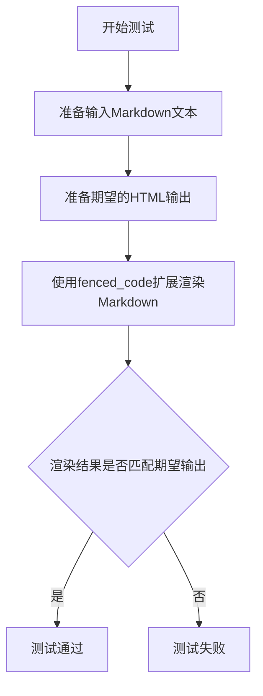

#### 带注释源码

```python
def testBasicFence(self):
    """
    测试基本的围栏代码块功能。
    
    验证包含在三个反引号中的文本能够正确转换为
    HTML 的 <pre><code> 标签。
    """
    # 调用 assertMarkdownRenders 方法进行测试
    # 参数1: 输入的 Markdown 文本（已去除缩进）
    self.assertMarkdownRenders(
        self.dedent(
            '''
            A paragraph before a fenced code block:

            ```
            Fenced code block
            ```
            '''
        ),
        # 参数2: 期望的 HTML 输出（已去除缩进）
        self.dedent(
            '''
            <p>A paragraph before a fenced code block:</p>
            <pre><code>Fenced code block
            </code></pre>
            '''
        ),
        # 参数3: 使用的 Markdown 扩展列表
        extensions=['fenced_code']
    )
```


### `TestFencedCode.testNestedFence`

该方法用于测试 Markdown 中嵌套 fenced code block 的处理能力。具体来说，它验证当使用 4 个反引号作为外层 fences 包含 3 个反引号时，内层的 3 个反引号应被视为普通文本内容而非关闭 fences。

参数：

- `self`：`TestFencedCode`，测试类的实例方法隐式参数

返回值：`None`，测试方法无返回值，通过 `assertMarkdownRenders` 进行断言验证

#### 流程图

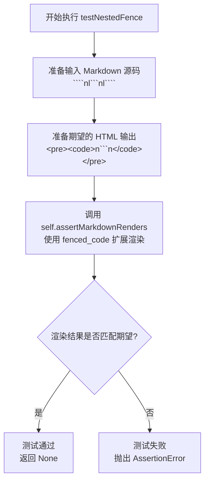

#### 带注释源码

```python
def testNestedFence(self):
    """
    测试嵌套 fenced code block 的处理。
    
    当使用 4 个反引号作为外层 fences，内部包含 3 个反引号时，
    内层 3 个反引号应被识别为普通文本内容，而不是关闭 fences。
    """
    # 定义输入的 Markdown 源码：使用 4 个反引号开头和结尾
    # 中间包含 3 个反引号作为普通文本
    self.assertMarkdownRenders(
        self.dedent(
            '''
            ````

            ```
            ````
            '''
        ),
        # 定义期望输出的 HTML：外层 fences 被解析为 <pre><code>
        # 内层的 3 个反引号作为普通文本内容输出
        self.dedent(
            '''
            <pre><code>
            ```
            </code></pre>
            '''
        ),
        # 指定使用的 Markdown 扩展
        extensions=['fenced_code']
    )
```


### `TestFencedCode.testFencedTildes`

该测试方法验证使用波浪号（`~~~`）作为栅栏的代码块能够正确渲染，特别是确保内部的反引号不会提前关闭代码块。

参数：

- `self`：`TestCase`，测试用例实例本身

返回值：`None`，无返回值（测试方法）

#### 流程图

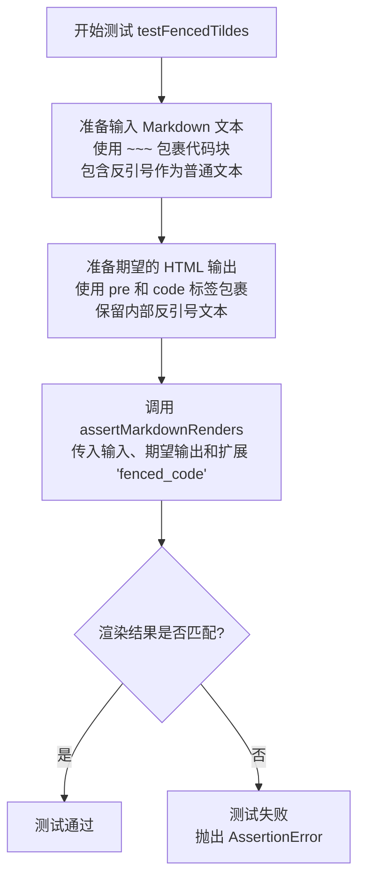

#### 带注释源码

```python
def testFencedTildes(self):
    """
    测试使用波浪号（~~~）作为栅栏的代码块能够正确处理内部的反引号。
    
    验证要点：
    1. 波浪号（~~~）可以作为代码块的开始和结束标记
    2. 代码块内部的反引号（```）应被视为普通文本，而非代码块结束标记
    """
    # 调用父类的 assertMarkdownRenders 方法验证 Markdown 渲染结果
    self.assertMarkdownRenders(
        # 输入：使用 ~~~ 包裹的代码块，包含反引号文本
        self.dedent(
            '''
            ~~~
            # Arbitrary code
            ``` # these backticks will not close the block
            ~~~
            '''
        ),
        # 期望输出：HTML 格式的预格式化代码块
        self.dedent(
            '''
            <pre><code># Arbitrary code
            ``` # these backticks will not close the block
            </code></pre>
            '''
        ),
        # 启用 fenced_code 扩展来处理栅栏代码块
        extensions=['fenced_code']
    )
```


### `TestFencedCode.testFencedLanguageNoDot`

该测试方法用于验证当 Markdown 中的 fenced code（围栏代码块）使用 ` ``` python ` 语法（在语言标识符前有空格）时，能够正确解析语言标识符并将其转换为 HTML 中 code 标签的 class 属性（`language-python`）。

参数：

- `self`：`TestFencedCode`，测试类的实例对象，隐式参数

返回值：`None`，测试方法无返回值，通过 `assertMarkdownRenders` 进行断言验证

#### 流程图

```mermaid
flowchart TD
    A[开始测试 testFencedLanguageNoDot] --> B[准备 Markdown 输入<br/>``` python<br/># Some python code<br/>```]
    B --> C[调用 self.dedent 格式化输入]
    D[准备期望的 HTML 输出<br/><pre><code class="language-python"><br/># Some python code<br/></code></pre>]
    D --> E[调用 self.dedent 格式化期望输出]
    C --> F[调用 assertMarkdownRenders<br/>传入格式化输入、期望输出<br/>和 extensions=['fenced_code']]
    E --> F
    F --> G{断言: 输入转换为期望输出}
    G -->|通过| H[测试通过]
    G -->|失败| I[测试失败/抛出异常]
    H --> J[结束]
    I --> J
```

#### 带注释源码

```python
def testFencedLanguageNoDot(self):
    """
    测试 fenced code 块语言标识符前有空格时的渲染行为。
    
    验证当使用 ``` python 语法（语言标识符前有空格）时，
    Markdown 解析器能正确识别语言并生成正确的 HTML 输出。
    """
    # 调用 assertMarkdownRenders 方法进行测试断言
    # 该方法接收三个参数：输入 Markdown、期望 HTML 输出、使用的扩展
    
    self.assertMarkdownRenders(
        # 使用 self.dedent 去除字符串的共同缩进前缀
        # 输入: ``` python 后跟代码内容
        self.dedent(
            '''
            ``` python
            # Some python code
            ```
            '''
        ),
        # 期望的 HTML 输出
        # 应生成带有 class="language-python" 的 <code> 标签
        self.dedent(
            '''
            <pre><code class="language-python"># Some python code
            </code></pre>
            '''
        ),
        # 启用 fenced_code 扩展来处理围栏代码块
        extensions=['fenced_code']
    )
```


### `TestFencedCode.testFencedLanguageWithDot`

该方法用于测试 Markdown 解析器能否正确处理带点的前缀语言标识符（如 ` ``` .python `），验证即使语言标识符前有点号，也应正确提取语言名称并生成相应的 HTML 输出。

参数：

- `self`：无（TestCase 实例方法），包含测试框架传入的隐式参数

返回值：`None`，无返回值（测试方法）

#### 流程图

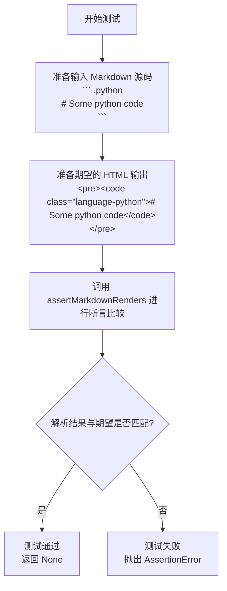

#### 带注释源码

```python
def testFencedLanguageWithDot(self):
    """
    测试带点前缀的语言标识符解析。
    
    当 fenced code block 的语言标识符前有点号时（如 ``` .python），
    解析器应该能够正确识别语言为 'python' 并生成相应的 class 属性。
    """
    # 调用 assertMarkdownRenders 方法验证 Markdown 解析结果
    self.assertMarkdownRenders(
        # 第一个参数：输入的 Markdown 源码（去除缩进）
        self.dedent(
            '''
            ``` .python
            # Some python code
            ```
            '''
        ),
        # 第二个参数：期望的 HTML 输出（去除缩进）
        self.dedent(
            '''
            <pre><code class="language-python"># Some python code
            </code></pre>
            '''
        ),
        # 第三个参数：使用的 Markdown 扩展列表
        extensions=['fenced_code']
    )
```


### `TestFencedCode.test_fenced_code_in_raw_html`

该方法用于测试在原始HTML标签（如`<details>`）内部使用围栏代码块时，`fenced_code`扩展是否能正确处理。它验证Markdown解析器能够识别并转换位于原始HTML内部的围栏代码块。

参数：

- `self`：`TestFencedCode`（TestCase的子类实例），表示测试类实例本身

返回值：`None`，无返回值（测试方法通过断言验证，不返回任何值）

#### 流程图

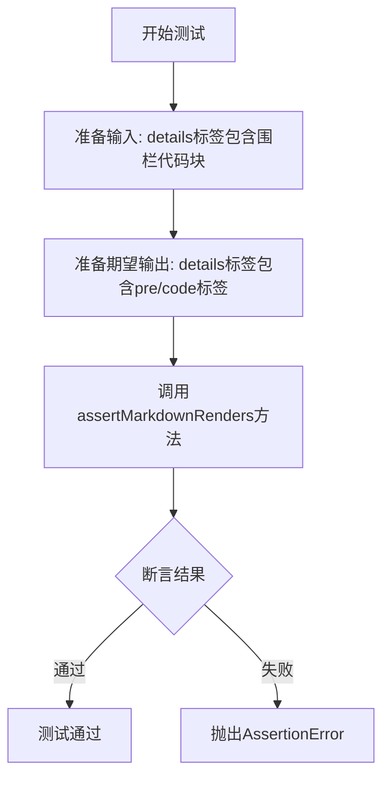

#### 带注释源码

```python
def test_fenced_code_in_raw_html(self):
    """
    测试围栏代码块在原始HTML内部的处理能力。
    
    验证 fenced_code 扩展能够正确处理位于原始HTML标签
    （如 <details>）内部的围栏代码块，并输出正确的HTML结构。
    """
    # 使用 assertMarkdownRenders 方法验证 Markdown 渲染结果
    # 第一个参数：输入的 Markdown 文本（包含原始HTML和围栏代码块）
    self.assertMarkdownRenders(
        self.dedent(
            """
            <details>
            ```
            Begone placeholders!
            ```
            </details>
            """
        ),
        # 第二个参数：期望的 HTML 输出
        self.dedent(
            """
            <details>

            <pre><code>Begone placeholders!
            </code></pre>

            </details>
            """
        ),
        # 第三个参数：使用的扩展列表
        extensions=['fenced_code']
    )
```


### `TestFencedCode.testFencedLanguageInAttr`

该测试方法用于验证在 fenced code 块的属性语法中使用语言标识符（如 `{ .python }`）时，能够正确解析并生成带有 `language-` 前缀的 HTML 代码标签。

参数：

- `self`：`TestFencedCode`，测试类实例本身

返回值：`None`，该方法为测试用例，无返回值

#### 流程图

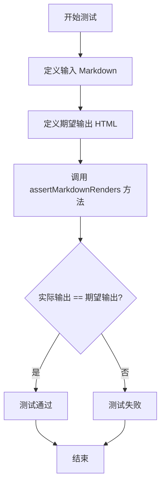

#### 带注释源码

```python
def testFencedLanguageInAttr(self):
    """
    测试在 fenced code 块的属性语法中使用语言标识符。
    
    验证以下输入:
    ``` {.python}
    # Some python code
    ```
    
    能够正确生成带有 language- 前缀的 HTML 代码标签:
    <pre><code class="language-python"># Some python code
    </code></pre>
    """
    # 使用 self.dedent 整理输入的 Markdown 源码，去除左侧多余缩进
    self.assertMarkdownRenders(
        self.dedent(
            '''
            ``` {.python}
            # Some python code
            ```
            '''
        ),
        # 期望输出的 HTML
        self.dedent(
            '''
            <pre><code class="language-python"># Some python code
            </code></pre>
            '''
        ),
        # 指定使用的 Markdown 扩展：fenced_code
        extensions=['fenced_code']
    )
```


### `TestFencedCode.testFencedMultipleClassesInAttr`

该方法用于测试在 Markdown  fenced code 块属性中指定多个 CSS 类名的场景，验证语言类名被正确应用到 `<code>` 元素，而其他类名被正确应用到 `<pre>` 元素。

参数：

- `self`：继承自 `TestCase` 的测试类实例，无需显式传递

返回值：`None`，该方法为测试用例，执行断言验证，不返回任何值

#### 流程图

```mermaid
flowchart TD
    A[开始执行 testFencedMultipleClassesInAttr] --> B[调用 self.dedent 处理输入 Markdown]
    B --> C[构建 fenced code block: ``` {.python .foo .bar}]
    C --> D[调用 self.dedent 处理期望输出 HTML]
    D --> E[构建期望 HTML: <pre class="foo bar"><code class="language-python">]
    E --> F[调用 assertMarkdownRenders 断言方法]
    F --> G{实际输出是否匹配期望}
    G -->|是| H[测试通过]
    G -->|否| I[测试失败]
```

#### 带注释源码

```python
def testFencedMultipleClassesInAttr(self):
    """
    测试在 fenced code 块的属性中指定多个类名的场景。
    
    验证：
    - 语言类名 (.python) 被应用到 <code> 元素的 class 属性，格式为 language-python
    - 其他类名 (.foo, .bar) 被应用到 <pre> 元素的 class 属性
    """
    # 第一个参数：输入的 Markdown 源代码，包含带有多个类名的 fenced code 块
    # {.python .foo .bar} 表示语言为 python，额外类名为 foo 和 bar
    self.assertMarkdownRenders(
        self.dedent(
            '''
            ``` {.python .foo .bar}
            # Some python code
            ```
            '''
        ),
        # 第二个参数：期望的 HTML 输出
        # 注意：language-python 类在 <code> 标签中，foo 和 bar 类在 <pre> 标签中
        self.dedent(
            '''
            <pre class="foo bar"><code class="language-python"># Some python code
            </code></pre>
            '''
        ),
        # 第三个参数：使用的 Markdown 扩展
        # fenced_code 扩展负责处理 fenced code 块
        extensions=['fenced_code']
    )
```


### `TestFencedCode.testFencedIdInAttr`

该方法用于测试 Markdown 中带属性的围栏代码块（fenced code block）能否正确解析并渲染带有 ID 属性的 HTML `<pre>` 标签。具体来说，它验证了围栏代码块语法 ```` ``` { #foo } ```` 能够被正确转换为 `<pre id="foo"><code>...</code></pre>` 的 HTML 输出。

参数：

- `self`：TestCase 对象，测试类的实例本身，由 Python 自动传递

返回值：`None`，该方法为测试方法，通过 `assertMarkdownRenders` 断言验证 Markdown 渲染结果是否符合预期，若不符合则抛出异常

#### 流程图

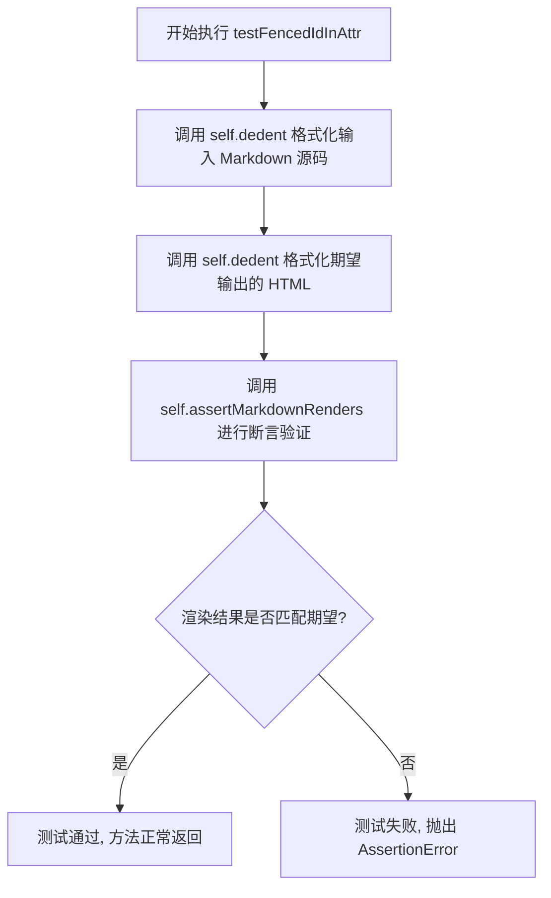

#### 带注释源码

```python
def testFencedIdInAttr(self):
    """
    测试带 ID 属性的围栏代码块渲染功能
    
    验证 Markdown 语法:
    ``` { #foo }
    # Some python code
    ```
    
    能否正确转换为 HTML:
    <pre id="foo"><code># Some python code
    </code></pre>
    """
    # 使用 self.dedent 去除缩进, 构造带 ID 属性的围栏代码块输入
    self.assertMarkdownRenders(
        self.dedent(
            '''
            ``` { #foo }
            # Some python code
            ```
            '''
        ),
        # 期望的 HTML 输出, id 属性应出现在 <pre> 标签上
        self.dedent(
            '''
            <pre id="foo"><code># Some python code
            </code></pre>
            '''
        ),
        # 启用 fenced_code 扩展来解析围栏代码块
        extensions=['fenced_code']
    )
```


### `TestFencedCode.testFencedIdAndLangInAttr`

该方法用于测试当 fenced code block（围栏代码块）的属性中同时包含语言标识（`.python`）和 ID（`#foo`）时，Markdown 解析器能否正确将语言信息渲染为 `<code>` 标签的 `class="language-python"` 属性，并将 ID 渲染为 `<pre>` 标签的 `id="foo"` 属性。

参数：无（测试方法，仅包含 `self` 参数）

返回值：无（测试方法，通过 `assertMarkdownRenders` 断言验证渲染结果）

#### 流程图

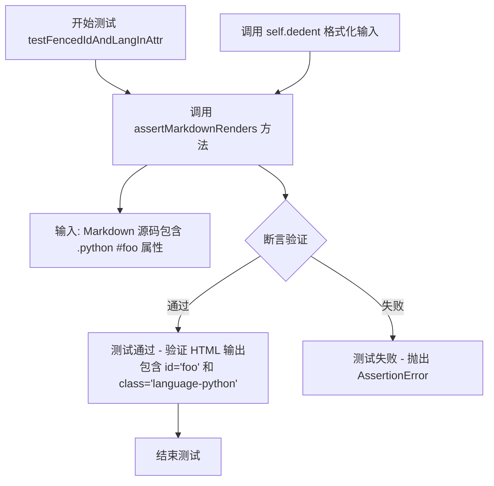

#### 带注释源码

```python
def testFencedIdAndLangInAttr(self):
    """
    测试 fenced code block 同时包含语言标识和 ID 属性的渲染功能。
    
    输入 Markdown 格式:
    ``` { .python #foo }
    # Some python code
    ```
    
    期望输出的 HTML:
    <pre id="foo"><code class="language-python"># Some python code
    </code></pre>
    """
    # 使用 assertMarkdownRenders 验证 Markdown 到 HTML 的转换
    self.assertMarkdownRenders(
        # 第一个参数: 原始 Markdown 源码
        self.dedent(
            '''
            ``` { .python #foo }
            # Some python code
            ```
            '''
        ),
        # 第二个参数: 期望渲染的 HTML 输出
        self.dedent(
            '''
            <pre id="foo"><code class="language-python"># Some python code
            </code></pre>
            '''
        ),
        # 第三个参数: 启用的 Markdown 扩展
        extensions=['fenced_code']
    )
```

---

## 补充信息

### 1. 一段话描述

`TestFencedCode.testFencedIdAndLangInAttr` 是 Python Markdown 项目中的一个单元测试用例，用于验证当 fenced code block（围栏代码块）的属性同时指定语言标识（`.python`）和 HTML ID（`#foo`）时，解析器能够正确生成包含 `id="foo"` 属性的 `<pre>` 标签和包含 `class="language-python"` 属性的 `<code>` 标签。

### 2. 文件整体运行流程

本测试文件 `TestFencedCode` 类包含多个测试方法，整体运行流程如下：

1. **测试框架初始化**：`TestCase` 基类初始化测试环境
2. **测试方法执行**：按顺序执行各个 `test*` 方法
3. **Markdown 转换**：通过 `markdown.markdown()` 函数配合 `fenced_code` 扩展进行转换
4. **断言验证**：使用 `assertMarkdownRenders` 比对实际输出与期望输出

### 3. 类详细信息

#### 类：`TestFencedCode`

| 字段/方法 | 类型 | 描述 |
|-----------|------|------|
| `testBasicFence` | 方法 | 测试基本围栏代码块功能 |
| `testNestedFence` | 方法 | 测试嵌套围栏代码块 |
| `testFencedTildes` | 方法 | 测试使用波浪号作为围栏标记 |
| `testFencedLanguageNoDot` | 方法 | 测试语言标识不带点号的写法 |
| `testFencedLanguageWithDot` | 方法 | 测试语言标识带点号的写法 |
| `testFencedIdInAttr` | 方法 | 测试仅包含 ID 属性的围栏代码块 |
| `testFencedIdAndLangInAttr` | 方法 | 测试同时包含 ID 和语言标识的围栏代码块 |
| `assertMarkdownRenders` | 方法 | 继承自 TestCase 的断言方法，用于验证 Markdown 渲染结果 |
| `dedent` | 方法 | 继承自 TestCase 的辅助方法，用于去除字符串公共前缀空白 |

### 4. 全局变量和函数

| 名称 | 类型 | 描述 |
|------|------|------|
| `has_pygments` | 布尔变量 | 标识 Pygments 库是否可用 |
| `required_pygments_version` | 字符串变量 | 测试所需的 Pygments 版本（从环境变量读取） |

### 5. 关键组件信息

| 组件名称 | 描述 |
|----------|------|
| `fenced_code` 扩展 | Python Markdown 的围栏代码块扩展，支持 ``` 或 ~~~ 语法 |
| `TestCase` | markdown.test_tools 中的测试基类，提供 assertMarkdownRenders 和 dedent 方法 |
| `markdown.markdown()` | 核心 Markdown 解析函数 |

### 6. 潜在的技术债务或优化空间

1. **测试用例重复**：多个测试方法中存在重复的 `self.dedent()` 调用模式，可考虑提取公共 fixtures
2. **硬编码期望值**：HTML 期望输出硬编码在测试方法中，可考虑使用模板或配置文件管理
3. **条件跳过逻辑**：`TestFencedCodeWithCodehilite` 类中多处使用 `if has_pygments` 判断，可通过 pytest 参数化减少重复代码

### 7. 其它项目

#### 设计目标与约束
- 验证围栏代码块的属性解析功能正确性
- 确保 `fenced_code` 扩展与 `attr_list` 扩展的正确协作

#### 错误处理与异常设计
- 使用 `assertMarkdownRenders` 自动捕获并报告渲染差异
- 当 Pygments 版本不匹配时，使用 `self.skipTest` 跳过相关测试

#### 数据流与状态机
- 输入：Markdown 源码（字符串）→ `markdown.markdown()` 处理 → 输出：HTML 字符串
- 状态转换：解析围栏标记 → 提取属性（语言类、ID、其他属性）→ 生成 HTML 标签

#### 外部依赖与接口契约
- 依赖 `markdown` 核心库
- 依赖 `markdown.extensions.fenced_code` 扩展
- 依赖 `pygments` 库（可选，用于代码高亮测试）


### `TestFencedCode.testFencedIdAndLangAndClassInAttr`

该方法用于测试 Markdown 中带围栏代码块在同时指定语言类（.python）、ID属性（#foo）和额外类（.bar）时的渲染功能，验证生成的 HTML 是否正确包含 id="foo"、class="bar" 和 class="language-python"。

参数：

- `self`：`TestCase`，TestFencedCode 类的实例方法参数，表示测试用例本身

返回值：`None`，该方法为测试用例，无返回值，通过 `assertMarkdownRenders` 断言验证渲染结果

#### 流程图

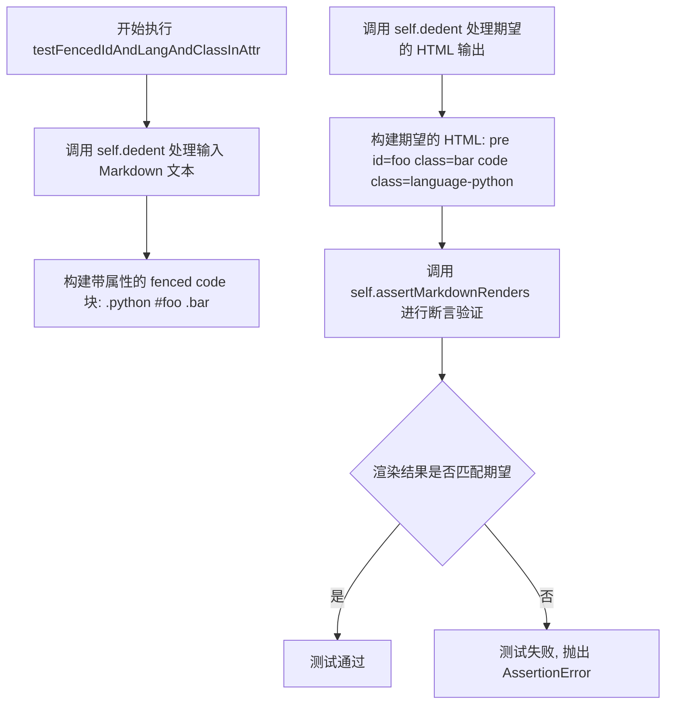

#### 带注释源码

```python
def testFencedIdAndLangAndClassInAttr(self):
    """
    测试带围栏代码块同时指定语言、ID和多个类属性时的渲染功能。
    
    测试场景：
    - 语言类: .python (应转换为 class="language-python")
    - ID属性: #foo (应转换为 id="foo")
    - 额外类: .bar (应转换为 class="bar")
    
    期望输出: <pre id="foo" class="bar"><code class="language-python">...</code></pre>
    """
    self.assertMarkdownRenders(
        # 输入: Markdown 格式的带属性围栏代码块
        self.dedent(
            '''
            ``` { .python #foo .bar }
            # Some python code
            ```
            '''
        ),
        # 期望输出: HTML 格式的渲染结果
        self.dedent(
            '''
            <pre id="foo" class="bar"><code class="language-python"># Some python code
            </code></pre>
            '''
        ),
        # 启用的 Markdown 扩展: fenced_code
        extensions=['fenced_code']
    )
```


### `TestFencedCode.testFencedLanguageIdAndPygmentsDisabledInAttrNoCodehilite`

该测试方法用于验证当在fenced code block的属性中指定语言（`.python`）、ID（`#foo`）以及`use_pygments=False`时，在没有启用codehilite扩展的情况下，Markdown渲染器能够正确生成HTML，保留语言类名和ID属性，但不应用Pygments语法高亮。

参数：

- `self`：隐式参数，`TestCase`实例，测试类本身

返回值：`None`，无返回值（测试方法通过断言验证行为）

#### 流程图

```mermaid
flowchart TD
    A[开始测试] --> B[构建Markdown输入]
    B --> C[调用assertMarkdownRenders方法]
    C --> D[执行Markdown转换<br/>使用fenced_code扩展]
    D --> E{解析fenced code block属性}
    E -->|提取语言: .python| F[设置class="language-python"]
    E -->|提取ID: #foo| G[设置id="foo"]
    E -->|提取use_pygments=False| H[禁用Pygments高亮]
    F --> I[生成HTML输出]
    G --> I
    H --> I
    I --> J{断言: 实际输出 == 期望输出}
    J -->|匹配| K[测试通过]
    J -->|不匹配| L[测试失败<br/>抛出AssertionError]
```

#### 带注释源码

```python
def testFencedLanguageIdAndPygmentsDisabledInAttrNoCodehilite(self):
    """
    测试在属性中指定语言、ID和use_pygments=False时
    在没有codehilite扩展的情况下的渲染行为
    """
    # 准备Markdown输入：fenced code block包含属性
    self.assertMarkdownRenders(
        self.dedent(
            '''
            ``` { .python #foo use_pygments=False }
            # Some python code
            ```
            '''
        ),
        # 期望的HTML输出
        self.dedent(
            '''
            <pre id="foo"><code class="language-python"># Some python code
            </code></pre>
            '''
        ),
        # 只使用fenced_code扩展，不使用codehilite
        extensions=['fenced_code']
    )
```

---

**相关上下文信息：**

- **所属类**：`TestFencedCode` - 测试fenced code blocks功能的测试类
- **测试目标**：验证fenced code block属性解析与渲染逻辑
- **关键验证点**：
  - 语言标识（`.python`）应转换为`class="language-python"`
  - ID属性（`#foo`）应转换为`id="foo"`
  - `use_pygments=False`在无codehilite扩展时应被忽略（因为没有高亮器）
  - 代码内容应保持原始格式，不进行语法高亮处理


### `TestFencedCode.testFencedLanguageIdAndPygmentsEnabledInAttrNoCodehilite`

该测试方法用于验证 Markdown 中带有语言标识、ID 属性和 `use_pygments=True` 属性的 fenced code（围栏代码块）在不使用 codehilite 扩展的情况下能正确渲染为 HTML。

参数：

- `self`：TestCase 实例，测试框架自动传入

返回值：`None`，该方法为测试用例，通过 `assertMarkdownRenders` 验证渲染结果

#### 流程图

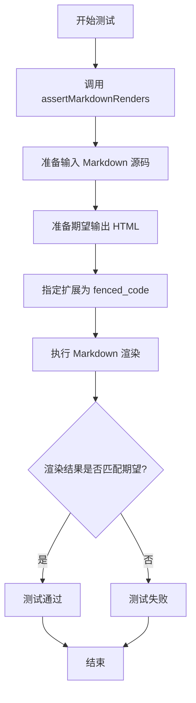

#### 带注释源码

```python
def testFencedLanguageIdAndPygmentsEnabledInAttrNoCodehilite(self):
    """
    测试带语言标识、ID属性和use_pygments=True属性的fenced code块
    在不使用codehilite扩展时的渲染结果
    """
    # 调用父类的assertMarkdownRenders方法进行渲染验证
    self.assertMarkdownRenders(
        # 输入：带有属性的fenced code块
        # 语法：``` { .python #foo use_pygments=True }
        # 说明：.python指定语言为python，#foo指定ID为foo，use_pygments=True启用Pygments
        self.dedent(
            '''
            ``` { .python #foo use_pygments=True }
            # Some python code
            ```
            '''
        ),
        # 期望输出：不使用codehilite时，直接输出pre和code标签
        # id属性应用到pre标签，language-前缀的class应用到code标签
        self.dedent(
            '''
            <pre id="foo"><code class="language-python"># Some python code
            </code></pre>
            '''
        ),
        # 仅使用fenced_code扩展，不使用codehilite
        extensions=['fenced_code']
    )
```


### `TestFencedCode.testFencedLanguageNoCodehiliteWithAttrList`

该方法用于测试在启用 `fenced_code` 和 `attr_list` 扩展时，带有属性列表的 fenced code 块能否正确渲染，特别是验证自定义属性（如 `foo="bar"`）能够正确添加到 `<code>` 标签中，同时语言类名（如 `language-python`）也能正确添加，且不依赖 codehilite 扩展。

参数：

- `self`：TestCase，测试类实例本身

返回值：`None`，该方法为测试方法，通过 `assertMarkdownRenders` 断言验证 Markdown 渲染结果是否符合预期

#### 流程图

```mermaid
flowchart TD
    A[测试方法开始] --> B[准备 Markdown 源码<br/>``` { .python foo=bar }<br/># Some python code<br/>```]
    B --> C[准备期望的 HTML 输出<br/><pre><code class="language-python" foo="bar"><br/># Some python code<br/></code></pre>]
    C --> D[调用 assertMarkdownRenders 进行断言验证]
    D --> E{渲染结果是否符合预期?}
    E -->|是| F[测试通过]
    E -->|否| G[测试失败抛出 AssertionError]
```

#### 带注释源码

```python
def testFencedLanguageNoCodehiliteWithAttrList(self):
    """
    测试带有属性列表的 fenced code 块，在未启用 codehilite 扩展时的渲染行为。
    验证自定义属性（如 foo="bar"）能够正确添加到 <code> 标签中，
    同时语言类名也能正确添加。
    """
    # 使用 self.dedent 格式化 Markdown 源码，去除左侧多余缩进
    self.assertMarkdownRenders(
        self.dedent(
            '''
            ``` { .python foo=bar }
            # Some python code
            ```
            '''
        ),
        # 期望的 HTML 输出
        self.dedent(
            '''
            <pre><code class="language-python" foo="bar"># Some python code
            </code></pre>
            '''
        ),
        # 启用的扩展：fenced_code 和 attr_list
        extensions=['fenced_code', 'attr_list']
    )
```


### `TestFencedCode.testFencedLanguagePygmentsDisabledInAttrNoCodehiliteWithAttrList`

该测试方法验证了在未启用 codehilite 扩展的情况下，fenced code 块中通过属性列表指定的 `use_pygments=False` 能够正确禁用 Pygments 语法高亮，同时保留语言类和其他自定义属性（如 `foo="bar"`）。

参数：

- `self`：`TestFencedCode`，测试类的实例本身

返回值：`None`，该方法为测试方法，不返回任何值，仅执行断言验证

#### 流程图

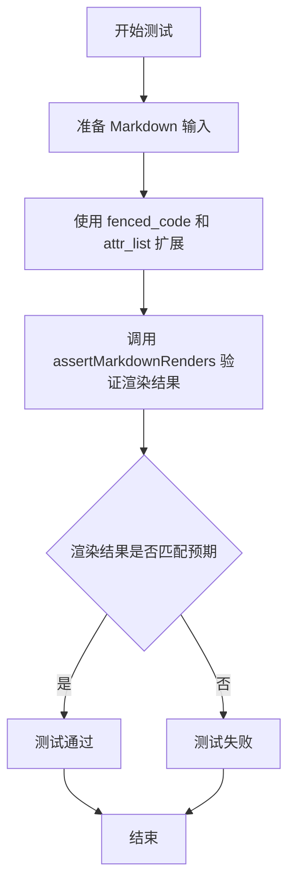

#### 带注释源码

```python
def testFencedLanguagePygmentsDisabledInAttrNoCodehiliteWithAttrList(self):
    """
    测试在未启用 codehilite 扩展时，通过属性列表禁用 Pygments 的功能。
    
    验证点：
    1. 使用 attr_list 扩展解析 fenced code 块的属性
    2. use_pygments=False 属性被正确识别
    3. 自定义属性 foo="bar" 被正确添加到 code 元素
    4. 语言类 language-python 被正确添加
    """
    self.assertMarkdownRenders(
        self.dedent(
            '''
            ``` { .python foo=bar use_pygments=False }
            # Some python code
            ```
            '''
        ),
        self.dedent(
            '''
            <pre><code class="language-python" foo="bar"># Some python code
            </code></pre>
            '''
        ),
        extensions=['fenced_code', 'attr_list']
    )
```


### `TestFencedCode.testFencedLanguagePygmentsEnabledInAttrNoCodehiliteWithAttrList`

该方法用于测试在启用 `attr_list` 扩展但未启用 `codehilite` 扩展的情况下，带有 `use_pygments=True` 属性的 fenced code 块的渲染行为。验证当在代码块属性中设置语言为 `.python`、自定义属性 `foo=bar` 和 `use_pygments=True` 时，输出应只包含语言类而不包含自定义属性。

#### 参数

- 无参数（`self` 为隐式参数）

#### 返回值

无返回值（`None`），该方法为测试方法，通过 `assertMarkdownRenders` 进行断言验证

#### 流程图

```mermaid
flowchart TD
    A[开始测试] --> B[准备 Markdown 输入]
    B --> C[设置扩展为 'fenced_code' 和 'attr_list']
    C --> D[调用 assertMarkdownRenders 断言方法]
    D --> E{渲染结果是否符合预期?}
    E -->|是| F[测试通过]
    E -->|否| G[测试失败]
    
    subgraph 输入输出
    H[输入: ``` { .python foo=bar use_pygments=True }<br/># Some python code<br/>```]
    I[输出预期: <pre><code class="language-python"># Some python code<br/></code></pre>]
    end
    
    H --> B
    D --> I
```

#### 带注释源码

```python
def testFencedLanguagePygmentsEnabledInAttrNoCodehiliteWithAttrList(self):
    """
    测试在未启用 codehilite 扩展但启用 attr_list 扩展的情况下，
    带 use_pygments=True 属性的 fenced code 块的渲染行为。
    
    验证点：
    1. 使用 fenced_code 和 attr_list 扩展（不包含 codehilite）
    2. 代码块属性包含语言(.python)、自定义属性(foo=bar)和use_pygments=True
    3. 期望输出只包含language-python类，自定义属性foo=bar被忽略
    """
    # 调用 assertMarkdownRenders 进行渲染结果验证
    self.assertMarkdownRenders(
        # 使用 self.dedent 去除缩进的 Markdown 源代码输入
        self.dedent(
            '''
            ``` { .python foo=bar use_pygments=True }
            # Some python code
            ```
            '''
        ),
        # 期望的 HTML 输出结果
        self.dedent(
            '''
            <pre><code class="language-python"># Some python code
            </code></pre>
            '''
        ),
        # 指定使用的扩展：fenced_code 和 attr_list（注意：未包含 codehilite）
        extensions=['fenced_code', 'attr_list']
    )
```


### `TestFencedCode.testFencedLanguageNoPrefix`

该方法用于测试当 `FencedCodeExtension` 的 `lang_prefix` 参数设置为空字符串时，Markdown 渲染器能够正确地将代码语言标识符（如 `python`）直接添加到生成的 HTML `<code>` 标签的 `class` 属性中，而不添加任何前缀（例如默认的 `language-` 前缀）。

参数：

- `self`：隐式参数，`TestCase` 类的实例，代表测试用例本身。

返回值：`None`，该方法为测试方法，通过 `assertMarkdownRenders` 断言 Markdown 输入与预期 HTML 输出相匹配，若不匹配则抛出异常。

#### 流程图

```mermaid
flowchart TD
    A[开始执行 testFencedLanguageNoPrefix] --> B[调用 self.dedent 处理 Markdown 源码]
    B --> C[调用 self.dedent 处理预期 HTML 输出]
    C --> D[创建 FencedCodeExtension 实例, lang_prefix='']
    D --> E[调用 self.assertMarkdownRenders 进行断言验证]
    E --> F{断言是否通过?}
    F -->|是| G[测试通过, 方法结束]
    F -->|否| H[抛出 AssertionError 异常]
```

#### 带注释源码

```python
def testFencedLanguageNoPrefix(self):
    """
    测试当 lang_prefix 为空字符串时，代码语言标识符直接作为 class 属性值。
    
    验证点：
    1. 输入的 Markdown 包含 ``` python 代码块
    2. 使用的扩展是 FencedCodeExtension 且 lang_prefix=''（空字符串）
    3. 期望输出的 HTML 中 <code> 标签的 class 属性为 "python"（无前缀）
    """
    self.assertMarkdownRenders(
        # 去除缩进的 Markdown 输入源码
        self.dedent(
            '''
            ``` python
            # Some python code
            ```
            '''
        ),
        # 去除缩空的预期 HTML 输出
        self.dedent(
            '''
            <pre><code class="python"># Some python code
            </code></pre>
            '''
        ),
        # 使用 lang_prefix='' 的 FencedCodeExtension 扩展
        extensions=[markdown.extensions.fenced_code.FencedCodeExtension(lang_prefix='')]
    )
```


### `TestFencedCode.testFencedLanguageAltPrefix`

该测试方法用于验证在使用自定义语言前缀（`lang_prefix='lang-'`）时，Markdown 的 fenced code 扩展能够正确生成带有指定前缀的语言类名（如 `lang-python`）。

参数：

- `self`：`TestCase`（隐式参数），TestCase 类的实例方法，包含测试所需的辅助方法如 `assertMarkdownRenders` 和 `dedent`

返回值：`None`，该方法为测试用例，通过 `assertMarkdownRenders` 断言进行验证，不返回任何值

#### 流程图

```mermaid
flowchart TD
    A[开始测试] --> B[准备输入: Markdown源代码<br/>``` python<br/># Some python code<br/>```]
    B --> C[准备期望输出: HTML<br/>&lt;pre&gt;&lt;code class="lang-python"&gt;# Some python code<br/>&lt;/code&gt;&lt;/pre&gt;]
    C --> D[配置扩展: FencedCodeExtension<br/>lang_prefix='lang-']
    D --> E[调用 assertMarkdownRenders<br/>验证渲染结果是否符合期望]
    E --> F{验证结果}
    F -->|通过| G[测试通过]
    F -->|失败| H[测试失败]
```

#### 带注释源码

```python
def testFencedLanguageAltPrefix(self):
    """
    测试自定义语言前缀功能。
    验证当设置 lang_prefix='lang-' 时，代码块的语言类名
    会生成如 'lang-python' 而非默认的 'language-python'
    """
    # 使用 assertMarkdownRenders 方法验证 Markdown 到 HTML 的转换
    self.assertMarkdownRenders(
        # 第一个参数：输入的 Markdown 源代码
        self.dedent(
            '''
            ``` python
            # Some python code
            ```
            '''
        ),
        # 第二个参数：期望输出的 HTML
        self.dedent(
            '''
            <pre><code class="lang-python"># Some python code
            </code></pre>
            '''
        ),
        # 第三个参数：使用的扩展配置
        # 创建 FencedCodeExtension 实例并设置 lang_prefix 为 'lang-'
        extensions=[markdown.extensions.fenced_code.FencedCodeExtension(lang_prefix='lang-')]
    )
```


### `TestFencedCode.testFencedCodeEscapedAttrs`

该方法用于测试 Markdown 解析器能否正确处理围栏代码块中包含特殊字符（如引号、井号、大于号）的属性，并将其正确转义为 HTML 实体。

参数：

- `self`：`TestCase`，测试用例的实例对象，继承自 `unittest.TestCase`

返回值：`None`，该方法为测试方法，通过 `assertMarkdownRenders` 断言验证 Markdown 渲染结果，不显式返回值。

#### 流程图

```mermaid
flowchart TD
    A[开始测试] --> B[定义输入Markdown字符串<br/>``` { .&quot;weird #&quot;foo bar=&quot;>baz }<br/># Some python code<br/>```]
    B --> C[定义期望输出HTML字符串<br/>&lt;pre id=&quot;&quot;foo&quot;&quot;&gt;&lt;code class=&quot;language-&quot;weird&quot; bar=&quot;&quot;&quot;&gt;baz&quot;&gt;# Some python code<br/>&lt;/code&gt;&lt;/pre&gt;]
    C --> D[调用assertMarkdownRenders方法<br/>参数: 输入, 期望输出, extensions=['fenced_code', 'attr_list']]
    D --> E{渲染结果与期望是否匹配?}
    E -->|是| F[测试通过]
    E -->|否| G[测试失败<br/>抛出AssertionError]
```

#### 带注释源码

```python
def testFencedCodeEscapedAttrs(self):
    """
    测试围栏代码块的属性中包含特殊字符时的转义处理。
    
    验证当属性值包含引号(#")、大于号(>)等特殊字符时，
    Markdown解析器能够正确将其转义为HTML实体。
    """
    # 使用self.dedent移除字符串中的多余缩进
    # 输入Markdown: 包含特殊字符属性的围栏代码块
    # 属性包括: 类名."weird #", ID #foo, 属性bar=">baz
    self.assertMarkdownRenders(
        self.dedent(
            '''
            ``` { ."weird #"foo bar=">baz }
            # Some python code
            ```
            '''
        ),
        # 期望的HTML输出
        # 注意: 属性值中的特殊字符被转义为HTML实体
        # " -> &quot;  (> -> &gt;
        self.dedent(
            '''
            <pre id="&quot;foo"><code class="language-&quot;weird" bar="&quot;&gt;baz"># Some python code
            </code></pre>
            '''
        ),
        # 启用的扩展: fenced_code和attr_list
        extensions=['fenced_code', 'attr_list']
    )
```


### `TestFencedCode.testFencedCodeCurlyInAttrs`

该测试方法用于验证 Markdown 解析器能够正确处理包含花括号 `{}` 的属性值。当 fenced code block 使用 `attr_list` 扩展时，属性值中的花括号应该被正确保留而不被错误解析。

参数：

- `self`：`TestCase` 实例，测试类实例本身

返回值：`None`，该方法为测试方法，通过 `assertMarkdownRenders` 断言验证渲染结果，不返回任何值

#### 流程图

```mermaid
flowchart TD
    A[开始测试] --> B[准备输入Markdown]
    B --> C[使用dedent格式化 fenced code块<br/>包含属性 data-test=&quot;{}&quot;]
    C --> D[准备期望的HTML输出]
    D --> E[调用assertMarkdownRenders<br/>传入输入、期望输出和扩展]
    E --> F[执行Markdown渲染<br/>使用fenced_code和attr_list扩展]
    F --> G{渲染结果是否匹配期望?}
    G -->|是| H[测试通过]
    G -->|否| I[测试失败<br/>抛出AssertionError]
    H --> J[结束]
    I --> J
```

#### 带注释源码

```python
def testFencedCodeCurlyInAttrs(self):
    """
    测试处理属性值中包含花括号的情况。
    
    验证当 fenced code block 的属性值包含 {} 时，
    attr_list 扩展能够正确解析并保留这些字符。
    
    例如：``` { data-test="{}" } 应该渲染为
    <pre><code data-test="{}"> 而不是被错误处理
    """
    # 使用 self.dedent() 规范化输入的 Markdown 文本
    # 输入是一个带有属性 data-test="{}" 的 fenced code block
    self.assertMarkdownRenders(
        self.dedent(
            '''
            ``` { data-test="{}" }
            # Some python code
            ```
            '''
        ),
        # 期望的 HTML 输出
        # 属性 data-test="{}" 应该被正确保留
        self.dedent(
            '''
            <pre><code data-test="{}"># Some python code
            </code></pre>
            '''
        ),
        # 指定使用的扩展：fenced_code 和 attr_list
        # attr_list 扩展负责解析 {...} 形式的属性
        extensions=['fenced_code', 'attr_list']
    )
```


### `TestFencedCode.testFencedCodeMismatchedCurlyInAttrs`

这是一个测试方法，用于验证 Markdown 解析器在处理带有不匹配花括号的属性时（如 `{ data-test="{}" } }`）的边界情况。该测试确保当 fenced code block 的属性中存在未闭合的花括号时，解析器能够正确地将整个代码块降级为普通段落，而不是产生错误的解析结果。

参数：

- `self`：测试类实例，无需显式传递

返回值：`None`，该方法通过 `assertMarkdownRenders` 断言验证 Markdown 渲染结果

#### 流程图

```mermaid
flowchart TD
    A[开始执行 testFencedCodeMismatchedCurlyInAttrs] --> B[调用 assertMarkdownRenders 方法]
    B --> C[输入 Markdown 源码: ``` { data-test=&quot;{}&quot; } } ...]
    C --> D[指定扩展: fenced_code 和 attr_list]
    D --> E[Markdown 解析器处理输入]
    E --> F{检测到不匹配的花括号?}
    F -->|是| G[将代码块降级为普通段落]
    G --> H[渲染剩余内容为标题和普通代码块]
    F -->|否| I[正常解析 fenced code block]
    H --> J[输出期望的 HTML: &lt;p&gt;``` { data-test=&quot;{}&quot; } }&lt;/p&gt;...]
    I --> K[输出正常解析的 HTML]
    J --> L[断言: 实际输出 == 期望输出]
    K --> L
    L --> M[测试通过或失败]
```

#### 带注释源码

```python
def testFencedCodeMismatchedCurlyInAttrs(self):
    """
    测试处理不匹配花括号的属性情况。
    
    当 fenced code block 的属性中存在未闭合的花括号时，
    解析器应正确地将整个代码块降级为普通段落。
    """
    # 使用 assertMarkdownRenders 验证 Markdown 渲染结果
    self.assertMarkdownRenders(
        # 输入的 Markdown 源码（使用 self.dedent 去除缩进）
        self.dedent(
            '''
            ``` { data-test="{}" } }
            # Some python code
            ```
            ```
            test
            ```
            '''
        ),
        # 期望输出的 HTML（属性中的花括号不匹配导致代码块无法正确解析）
        self.dedent(
            '''
            <p>``` { data-test="{}" } }</p>
            <h1>Some python code</h1>
            <pre><code></code></pre>
            <p>test
            ```</p>
            '''
        ),
        # 启用的扩展：fenced_code 支持 ``` 代码块，attr_list 支持属性语法
        extensions=['fenced_code', 'attr_list']
    )
```


### `TestFencedCodeWithCodehilite.setUp`

该方法为测试类的初始化方法，在每个测试方法执行前被调用，用于检查 Pygments 版本是否符合要求，若版本不匹配则跳过相关测试。

参数：

- `self`：实例方法隐式参数，表示测试类实例本身，无额外描述

返回值：`None`，该方法不返回任何值，仅执行测试前置条件检查

#### 流程图

```mermaid
flowchart TD
    A[开始 setUp] --> B{has_pygments == True?}
    B -- 是 --> C{pygments.__version__ == required_pygments_version?}
    B -- 否 --> D[结束, 不跳过测试]
    C -- 是 --> D
    C -- 否 --> E[调用 self.skipTest 跳过测试]
    E --> F[结束]
```

#### 带注释源码

```python
def setUp(self):
    """
    测试前置设置方法，在每个测试方法执行前调用。
    用于验证 Pygments 版本是否符合测试要求。
    """
    # 检查 Pygments 是否已安装，且版本是否与要求版本匹配
    if has_pygments and pygments.__version__ != required_pygments_version:
        # 如果版本不匹配，跳过当前测试并显示提示信息
        self.skipTest(f'Pygments=={required_pygments_version} is required')
```


### `TestFencedCodeWithCodehilite.test_shebang`

该方法是一个测试用例，用于验证 Markdown 解析器在处理包含 shebang（`#!`）的围栏代码块时的正确性。它测试了 codehilite 扩展与 fenced_code 扩展结合使用时的渲染输出，根据是否安装 Pygments 来验证不同的 HTML 输出格式。

参数：

- `self`：实例方法隐式参数，类型为 `TestFencedCodeWithCodehilite`，表示测试类的实例本身

返回值：`None`，该方法为测试用例，通过 `assertMarkdownRenders` 方法执行断言验证，不返回任何值

#### 流程图

```mermaid
flowchart TD
    A[开始执行 test_shebang] --> B{检查 has_pygments 是否为真}
    B -->|是| C[构建包含 Pygments 格式的 expected HTML]
    B -->|否| D[构建不含 Pygments 格式的 expected HTML]
    C --> E[调用 assertMarkdownRenders 进行断言验证]
    D --> E
    E --> F[结束测试]
    
    subgraph 输入数据
    G[输入 Markdown: ```<br>#!test<br>```]
    end
    
    subgraph 配置
    H[extensions: CodeHiliteExtension + fenced_code]
    end
    
    G --> E
    H --> E
```

#### 带注释源码

```python
def test_shebang(self):
    """
    测试带有 shebang (#!) 的围栏代码块在启用 codehilite 扩展时的渲染行为。
    
    该测试验证了当代码块的第一行是 shebang 时，codehilite 扩展能够正确处理，
    而不会将其作为语言标识符错误解析。
    """
    
    # 根据 Pygments 是否可用，定义不同的期望输出
    if has_pygments:
        # 当 Pygments 可用时，使用 <div class="codehilite"> 包裹的完整格式
        expected = '''
        <div class="codehilite"><pre><span></span><code>#!test
        </code></pre></div>
        '''
    else:
        # 当 Pygments 不可用时，使用 <pre class="codehilite"> 格式
        expected = '''
        <pre class="codehilite"><code>#!test
        </code></pre>
        '''

    # 使用 assertMarkdownRenders 验证 Markdown 到 HTML 的转换结果
    self.assertMarkdownRenders(
        # 输入：包含 shebang 的围栏代码块
        self.dedent(
            '''
            ```
            #!test
            ```
            '''
        ),
        # 期望输出：根据 Pygments 可用性的预期 HTML
        self.dedent(
            expected
        ),
        # 测试配置：启用 codehilite 和 fenced_code 扩展
        # linenums=None 表示不显示行号
        # guess_lang=False 表示不自动猜测语言
        extensions=[
            markdown.extensions.codehilite.CodeHiliteExtension(linenums=None, guess_lang=False),
            'fenced_code'
        ]
    )
```


### `TestFencedCodeWithCodehilite.testFencedCodeWithHighlightLines`

该方法用于测试带有行高亮功能的 fenced code block（围栏代码块）与 CodeHilite 扩展的集成。它验证当在 Markdown 中使用 `hl_lines` 属性指定要高亮的行号时，CodeHilite 扩展能够正确渲染带有 `<span class="hll">` 标记的高亮行 HTML。

参数：

- `self`：TestCase 实例，代表测试类本身

返回值：`None`（测试方法无返回值，通过 `assertMarkdownRenders` 断言验证行为）

#### 流程图

```mermaid
flowchart TD
    A[开始测试 testFencedCodeWithHighlightLines] --> B{has_pygments 为真?}
    B -->|是| C[构建带高亮的期望HTML]
    B -->|否| D[构建不带高亮的期望HTML]
    C --> E[构建测试用Markdown输入]
    D --> E
    E --> F[调用 assertMarkdownRenders 验证渲染结果]
    F --> G[测试通过/失败]
```

#### 带注释源码

```python
def testFencedCodeWithHighlightLines(self):
    """
    测试 fenced code block 与 CodeHilite 扩展的行高亮功能。
    验证 hl_lines 属性能够正确高亮指定行。
    """
    # 检查 Pygments 是否可用
    if has_pygments:
        # Pygments 可用时，期望输出包含高亮标记
        expected = self.dedent(
            '''
            <div class="codehilite"><pre><span></span><code><span class="hll">line 1
            </span>line 2
            <span class="hll">line 3
            </span></code></pre></div>
            '''
        )
    else:
        # Pygments 不可用时，期望输出不包含高亮标记
        expected = self.dedent(
                '''
                <pre class="codehilite"><code>line 1
                line 2
                line 3
                </code></pre>
                '''
            )
    
    # 调用父类方法验证 Markdown 渲染结果
    self.assertMarkdownRenders(
        # 测试输入：带有 hl_lines 属性的 fenced code block
        self.dedent(
            '''
            ```hl_lines="1 3"
            line 1
            line 2
            line 3
            ```
            '''
        ),
        # 期望的 HTML 输出
        expected,
        # 使用的扩展：CodeHilite 和 fenced_code
        extensions=[
            markdown.extensions.codehilite.CodeHiliteExtension(linenums=None, guess_lang=False),
            'fenced_code'
        ]
    )
```


### `TestFencedCodeWithCodehilite.testFencedLanguageAndHighlightLines`

该测试方法用于验证Markdown解析器能够正确处理带有语言标识（.python）和行高亮属性（hl_lines="1 3"）的fenced code代码块，并确保语法高亮和行高亮功能正常工作。

参数：

- `self`：无参数，TestCase实例本身

返回值：`无返回值`，该方法通过`assertMarkdownRenders`进行断言验证，测试失败时抛出异常

#### 流程图

```mermaid
flowchart TD
    A[开始测试] --> B{检查Pygments是否可用}
    B -->|可用| C[构建带Pygments高亮的期望HTML]
    B -->|不可用| D[构建普通期望HTML]
    C --> E[准备Markdown输入源<br/>``` .python hl_lines="1 3"<br/>line 1<br/>line 2<br/>line 3<br/>```]
    D --> E
    E --> F[配置Markdown扩展<br/>CodeHiliteExtension和fenced_code]
    F --> G[调用assertMarkdownRenders<br/>执行Markdown到HTML转换]
    G --> H{转换结果是否匹配期望}
    H -->|是| I[测试通过]
    H -->|否| J[测试失败<br/>抛出AssertionError]
```

#### 带注释源码

```python
def testFencedLanguageAndHighlightLines(self):
    """
    测试带语言标识和行高亮的fenced code块渲染功能。
    验证Python代码块中指定行（1和3）能被正确高亮显示。
    """
    
    # 检查Pygments库是否可用
    if has_pygments:
        # 构建期望的HTML输出（带Pygments语法高亮）
        # 包含<span class="hll">标签用于标记高亮行
        expected = (
            '<div class="codehilite"><pre><span></span><code>'
            '<span class="hll"><span class="n">line</span> <span class="mi">1</span>\n'
            '</span><span class="n">line</span> <span class="mi">2</span>\n'
            '<span class="hll"><span class="n">line</span> <span class="mi">3</span>\n'
            '</span></code></pre></div>'
        )
    else:
        # Pygments不可用时的期望输出（无语法高亮）
        expected = self.dedent(
                '''
                <pre class="codehilite"><code class="language-python">line 1
                line 2
                line 3
                </code></pre>
                '''
            )
    
    # 调用父类的断言方法验证Markdown渲染结果
    self.assertMarkdownRenders(
        # 输入的Markdown源码（使用dedent去除缩进）
        self.dedent(
            '''
            ``` .python hl_lines="1 3"
            line 1
            line 2
            line 3
            ```
            '''
        ),
        # 期望的HTML输出
        expected,
        # 启用的Markdown扩展
        extensions=[
            # CodeHilite扩展：提供代码高亮功能
            # linenums=None: 不显示行号
            # guess_lang=False: 不自动猜测语言
            markdown.extensions.codehilite.CodeHiliteExtension(linenums=None, guess_lang=False),
            # fenced_code扩展：支持fenced代码块
            'fenced_code'
        ]
    )
```


### `TestFencedCodeWithCodehilite.testFencedLanguageAndPygmentsDisabled`

该测试方法用于验证当 CodeHilite 扩展禁用 Pygments 高亮渲染时，带有语言标识（如 `.python`）的围栏代码块能够正确渲染为标准的 HTML `<pre><code>` 元素，而不包含任何 Pygments 生成的语法高亮标签。

参数：

- `self`：`TestCase`，测试类的实例自身，用于调用继承的测试方法

返回值：`None`，无返回值（测试方法通过断言验证）

#### 流程图

```mermaid
flowchart TD
    A[开始测试] --> B[准备Markdown输入]
    B --> C[使用dedent格式化输入]
    C --> D[准备期望HTML输出]
    D --> E[使用dedent格式化期望输出]
    E --> F[创建CodeHiliteExtension<br/>use_pygments=False]
    F --> G[配置fenced_code扩展]
    G --> H[调用assertMarkdownRenders<br/>验证渲染结果]
    H --> I{测试通过?}
    I -->|是| J[测试通过]
    I -->|否| K[抛出断言错误]
    J --> L[结束]
    K --> L
```

#### 带注释源码

```python
def testFencedLanguageAndPygmentsDisabled(self):
    """
    测试当CodeHilite扩展禁用Pygments时，带语言标识的围栏代码块渲染。
    
    验证点：
    1. 围栏代码块使用 .python 语言标识
    2. CodeHiliteExtension 配置 use_pygments=False
    3. 渲染结果为标准HTML，不包含Pygments语法高亮标签
    """
    # 定义测试用的Markdown输入：带语言标识 .python 的围栏代码块
    self.assertMarkdownRenders(
        self.dedent(
            '''
            ``` .python
            # Some python code
            ```
            '''
        ),
        # 定义期望的HTML输出：不包含Pygments高亮，仅有标准的pre/code标签
        self.dedent(
            '''
            <pre><code class="language-python"># Some python code
            </code></pre>
            '''
        ),
        # 配置扩展：禁用Pygments的CodeHilite + fenced_code
        extensions=[
            # 创建CodeHiliteExtension实例，use_pygments=False 禁用Pygments高亮
            markdown.extensions.codehilite.CodeHiliteExtension(use_pygments=False),
            # 启用fenced_code扩展以支持围栏代码块语法
            'fenced_code'
        ]
    )
```


### `TestFencedCodeWithCodehilite.testFencedLanguageDoubleEscape`

该测试方法用于验证在使用codehilite扩展时，fenced代码块中的HTML特殊字符（`<`, `>`, `&`）能够被正确双重转义处理，确保HTML标签和实体在代码高亮后仍能安全显示。

参数：

- `self`：无参数，TestCase实例本身

返回值：无返回值（测试方法，通过`assertMarkdownRenders`进行断言验证）

#### 流程图

```mermaid
flowchart TD
    A[开始测试] --> B{检查 has_pygments 是否可用}
    B -->|是| C[设置预期HTML输出<br/>包含双重转义的span标签和&amp;amp;]
    B -->|否| D[设置预期HTML输出<br/>简单转义的codehilite]
    C --> E[调用 assertMarkdownRenders]
    D --> E
    E --> F[定义输入Markdown:<br/>```html<br/>&lt;span&gt;This&amp;amp;That&lt;/span&gt;<br/>```]
    F --> G[配置扩展:<br/>CodeHiliteExtension + fenced_code]
    G --> H{断言结果是否匹配预期}
    H -->|匹配| I[测试通过]
    H -->|不匹配| J[测试失败]
```

#### 带注释源码

```python
def testFencedLanguageDoubleEscape(self):
    """
    测试codehilite扩展对fenced代码块中HTML特殊字符的双重转义处理。
    当代码块中包含HTML标签（如<span>）和HTML实体（如&amp;）时，
    codehilite需要对它们进行双重转义以确保在HTML上下文中正确显示。
    """
    
    # 根据是否有pygments库设置不同的预期输出
    if has_pygments:
        # 有pygments时，HTML标签会被解析为span元素
        # < 转换为 &lt; (进一步转换为&lt;)
        # > 转换为 &gt; (进一步转换为&gt;)
        # &amp; 转换为 &amp;amp; (即 &amp;amp;)
        expected = (
            '<div class="codehilite"><pre><span></span><code>'
            '<span class="p">&lt;</span><span class="nt">span</span>'   # p类表示标点, nt类表示标签名
            '<span class="p">&gt;</span>This<span class="ni">&amp;amp;</span>'  # ni类表示名称实体
            'That<span class="p">&lt;/</span><span class="nt">span</span>'  # 闭标签
            '<span class="p">&gt;</span>\n'
            '</code></pre></div>'
        )
    else:
        # 无pygments时，直接进行HTML实体转义
        expected = (
            '<pre class="codehilite"><code class="language-html">'
            '&lt;span&gt;This&amp;amp;That&lt;/span&gt;\n'  # &lt; &gt;保持转义, &amp;保持转义
            '</code></pre>'
        )
    
    # 使用assertMarkdownRenders验证markdown解析结果
    self.assertMarkdownRenders(
        # 输入的markdown源代码（fenced代码块）
        self.dedent(
            '''
            ```html
            <span>This&amp;That</span>
            ```
            '''
        ),
        # 预期的HTML输出
        expected,
        # 使用的扩展：codehilite用于代码高亮，fenced_code用于解析fenced代码块
        extensions=[
            markdown.extensions.codehilite.CodeHiliteExtension(),
            'fenced_code'
        ]
    )
```


### `TestFencedCodeWithCodehilite.testFencedAmps`

该测试方法用于验证 Markdown 解析器在处理包含 & 符号的 fenced code block 时，能够正确处理 HTML 实体编码（特别是 & 符号的转义），分别测试了 Pygments 可用与不可用两种场景下的渲染结果。

参数：

- `self`：TestCase 实例，表示测试类本身（隐式参数，无类型描述）

返回值：`None`，该方法为测试用例，执行后通过 `assertMarkdownRenders` 进行断言验证

#### 流程图

```mermaid
flowchart TD
    A[开始执行 testFencedAmps] --> B{has_pygments 为真?}
    B -->|是| C[构建包含Pygments高亮的expected HTML]
    B -->|否| D[构建不含Pygments的expected HTML]
    C --> E[准备测试用Markdown源码<br/>```text<br/>&<br/>&amp;<br/>&amp;amp;<br/>```]
    D --> E
    E --> F[调用 assertMarkdownRenders<br/>验证渲染结果与expected一致]
    F --> G[测试通过/失败]
```

#### 带注释源码

```python
def testFencedAmps(self):
    """
    测试 fenced code block 中 & 符号的 HTML 实体编码处理
    
    该测试验证当代码块内容包含 &、&amp;、&amp;amp; 等不同数量的
    & 符号时，Markdown 渲染器能正确进行 HTML 转义
    """
    
    # 检查 Pygments 是否可用且版本匹配
    if has_pygments:
        # Pygments 可用时：构建包含语法高亮 span 标签的期望 HTML
        expected = self.dedent(
            '''
            <div class="codehilite"><pre><span></span><code>&amp;
            &amp;amp;
            &amp;amp;amp;
            </code></pre></div>
            '''
        )
    else:
        # Pygments 不可用时：构建不含语法高亮的简化 HTML
        expected = self.dedent(
            '''
            <pre class="codehilite"><code class="language-text">&amp;
            &amp;amp;
            &amp;amp;amp;
            </code></pre>
            '''
        )
    
    # 执行渲染测试：验证 Markdown 源码被正确渲染为预期 HTML
    self.assertMarkdownRenders(
        # 输入：包含 & 符号的 fenced code block
        self.dedent(
            '''
            ```text
            &
            &amp;
            &amp;amp;
            ```
            '''
        ),
        # 期望输出：根据 Pygments 可用性动态确定
        expected,
        # 启用的扩展：codehilite 代码高亮 + fenced_code 围栏代码块
        extensions=[
            markdown.extensions.codehilite.CodeHiliteExtension(),
            'fenced_code'
        ]
    )
```


### `TestFencedCodeWithCodehilite.testFencedCodeWithHighlightLinesInAttr`

该方法用于测试在 Markdown fence 代码块的属性（attr）中通过 `hl_lines` 属性指定高亮行的功能，验证代码块渲染时是否正确对指定行进行高亮显示。

参数：

- `self`：实例方法隐式参数，无需显式传递

返回值：`None`，该方法为测试用例，通过 `assertMarkdownRenders` 断言验证渲染结果是否符合预期

#### 流程图

```mermaid
flowchart TD
    A[开始执行 testFencedCodeWithHighlightLinesInAttr] --> B{检查 has_pygments 是否为 True}
    B -->|True| C[构建包含 hl_lines 高亮 span 的期望 HTML]
    B -->|False| D[构建无 Pygments 时的期望 HTML]
    C --> E[准备输入 Markdown 源码<br/>``` hl_lines="1 3"<br/>line 1<br/>line 2<br/>line 3<br/>```]
    D --> E
    E --> F[调用 assertMarkdownRenders<br/>验证渲染结果]
    F --> G[结束测试]
```

#### 带注释源码

```python
def testFencedCodeWithHighlightLinesInAttr(self):
    """
    测试在 fence 代码块的属性中使用 hl_lines 属性来指定需要高亮的行。
    例如：```{ hl_lines="1 3" } 表示高亮第1行和第3行
    """
    # 根据是否有 Pygments 库来构建不同的期望输出
    if has_pygments:
        # Pygments 可用时，期望输出包含 <span class="hll"> 标签用于高亮
        expected = self.dedent(
            '''
            <div class="codehilite"><pre><span></span><code><span class="hll">line 1
            </span>line 2
            <span class="hll">line 3
            </span></code></pre></div>
            '''
        )
    else:
        # Pygments 不可用时，期望输出不包含高亮标签
        expected = self.dedent(
                '''
                <pre class="codehilite"><code>line 1
                line 2
                line 3
                </code></pre>
                '''
            )
    
    # 调用测试框架的断言方法，验证 Markdown 渲染结果
    # 输入：在 fence 代码块的属性中指定 hl_lines="1 3"
    self.assertMarkdownRenders(
        self.dedent(
            '''
            ```{ hl_lines="1 3" }
            line 1
            line 2
            line 3
            ```
            '''
        ),
        expected,
        extensions=[
            # 配置 CodeHilite 扩展，不使用行号，不猜测语言
            markdown.extensions.codehilite.CodeHiliteExtension(linenums=None, guess_lang=False),
            # 启用 fenced_code 扩展支持 ``` 代码块语法
            'fenced_code'
        ]
    )
```


### `TestFencedCodeWithCodehilite.testFencedLanguageAndHighlightLinesInAttr`

该测试方法用于验证 Markdown 中带有语言标识（`.python`）和高亮行属性（`hl_lines="1 3"`）的围栏代码块能否正确渲染为带有语法高亮和行高亮的 HTML。

参数：

- `self`：`TestCase`，测试用例实例本身

返回值：`None`，该方法为测试方法，不返回任何值，仅通过断言验证渲染结果

#### 流程图

```mermaid
flowchart TD
    A[开始测试 testFencedLanguageAndHighlightLinesInAttr] --> B{检查 has_pygments 是否可用}
    B -->|True 有Pygments| C[构建带Pygments高亮的expected HTML字符串]
    B -->|False 无Pygments| D[构建普通expected HTML字符串]
    C --> E[准备输入Markdown源码<br/>``` { .python hl_lines="1 3" }<br/>line 1<br/>line 2<br/>line 3<br/>```]
    D --> E
    E --> F[准备扩展配置<br/>CodeHiliteExtension和fenced_code]
    F --> G[调用self.assertMarkdownRenders<br/>验证输入与expected是否匹配]
    G --> H{断言结果}
    H -->|通过| I[测试通过]
    H -->|失败| J[测试失败抛出AssertionError]
    I --> K[结束测试]
    J --> K
```

#### 带注释源码

```python
def testFencedLanguageAndHighlightLinesInAttr(self):
    """
    测试带有语言标识和高亮行属性的围栏代码块渲染
    
    验证Markdown中类似 ``` { .python hl_lines="1 3" } 的语法
    能够正确识别语言为python并高亮指定行（1和3行）
    """
    # 检查是否安装了Pygments库
    if has_pygments:
        # 有Pygments时：期望输出包含完整的HTML格式化标签
        # hl_lines="1 3" 表示高亮第1行和第3行
        # 输出使用 <span class="hll"> 包裹高亮行
        expected = (
            '<div class="codehilite"><pre><span></span><code>'
            '<span class="hll"><span class="n">line</span> <span class="mi">1</span>\n'
            '</span><span class="n">line</span> <span class="mi">2</span>\n'
            '<span class="hll"><span class="n">line</span> <span class="mi">3</span>\n'
            '</span></code></pre></div>'
        )
    else:
        # 无Pygments时：期望输出不包含Pygments生成的格式化标签
        # 仅保留语言标识 class="language-python"
        expected = self.dedent(
                '''
                <pre class="codehilite"><code class="language-python">line 1
                line 2
                line 3
                </code></pre>
                '''
        )
    
    # 使用assertMarkdownRenders验证渲染结果
    # 输入：带有语言标识(.python)和高亮行属性(hl_lines="1 3")的围栏代码块
    self.assertMarkdownRenders(
        self.dedent(
            '''
            ``` { .python hl_lines="1 3" }
            line 1
            line 2
            line 3
            ```
            '''
        ),
        expected,
        extensions=[
            # CodeHiliteExtension: 提供代码高亮功能
            # linenums=None: 不显示行号
            # guess_lang=False: 不自动猜测语言
            markdown.extensions.codehilite.CodeHiliteExtension(linenums=None, guess_lang=False),
            # fenced_code: 提供围栏代码块支持
            'fenced_code'
        ]
    )
```


### `TestFencedCodeWithCodehilite.testFencedLanguageIdInAttrAndPygmentsDisabled`

该测试方法验证了在禁用 Pygments 的情况下，使用属性列表语法（在 fenced code 块的第一行中指定语言和自定义属性）时，Markdown 渲染器能够正确生成包含语言类（如 `language-python`）和自定义属性（如 `id="foo"`）的 HTML 代码块。

参数：

- `self`：`TestCase`，测试类的实例对象本身

返回值：`None`，该方法为测试方法，通过 `assertMarkdownRenders` 断言验证渲染结果，不返回任何值

#### 流程图

```mermaid
flowchart TD
    A[开始执行 testFencedLanguageIdInAttrAndPygmentsDisabled] --> B[准备输入 Markdown 源代码]
    B --> C[使用 self.dedent 格式化多行字符串]
    C --> D[准备期望的 HTML 输出]
    D --> E[配置扩展: CodeHiliteExtension use_pygments=False + fenced_code]
    E --> F[调用 self.assertMarkdownRenders 进行断言验证]
    F --> G{断言结果}
    G -->|通过| H[测试通过]
    G -->|失败| I[测试失败抛出 AssertionError]
```

#### 带注释源码

```python
def testFencedLanguageIdInAttrAndPygmentsDisabled(self):
    """
    测试在禁用 Pygments 时，属性列表中的语言 ID 和自定义属性能否正确渲染。
    
    输入 Markdown:
    ``` { .python #foo }
    # Some python code
    ```
    
    期望输出 HTML:
    <pre id="foo"><code class="language-python"># Some python code
    </code></pre>
    """
    self.assertMarkdownRenders(
        self.dedent(
            '''
            ``` { .python #foo }
            # Some python code
            ```
            '''
        ),
        self.dedent(
            '''
            <pre id="foo"><code class="language-python"># Some python code
            </code></pre>
            '''
        ),
        extensions=[
            markdown.extensions.codehilite.CodeHiliteExtension(use_pygments=False),
            'fenced_code'
        ]
    )
```


### `TestFencedCodeWithCodehilite.testFencedLanguageIdAndPygmentsDisabledInAttr`

该测试方法用于验证当在 fenced code 块的属性中同时指定语言（.python）、ID（#foo）和 use_pygments=False 时，Markdown 渲染器能够正确生成包含指定 ID 和语言类的 HTML 代码块，且不进行 Pygments 语法高亮处理。

参数：

- `self`：TestCase，表示测试类实例本身，无需额外描述

返回值：`None`，该方法为测试方法，通过 `assertMarkdownRenders` 验证渲染结果，不返回具体值

#### 流程图

```mermaid
flowchart TD
    A[开始测试] --> B[定义测试Markdown输入]
    B --> C[定义期望的HTML输出]
    C --> D[调用assertMarkdownRenders进行渲染验证]
    D --> E{渲染结果是否匹配期望}
    E -->|是| F[测试通过]
    E -->|否| G[测试失败]
```

#### 带注释源码

```python
def testFencedLanguageIdAndPygmentsDisabledInAttr(self):
    """
    测试当fenced code块属性中包含语言、ID和use_pygments=False时的渲染行为
    
    该测试验证：
    1. 语言标识 .python 被正确转换为 class="language-python"
    2. ID属性 #foo 被正确转换为 id="foo"
    3. use_pygments=False 禁用了Pygments语法高亮
    """
    self.assertMarkdownRenders(
        # 定义Markdown输入源
        self.dedent(
            '''
            ``` { .python #foo use_pygments=False }
            # Some python code
            ```
            '''
        ),
        # 定义期望的HTML输出
        self.dedent(
            '''
            <pre id="foo"><code class="language-python"># Some python code
            </code></pre>
            '''
        ),
        # 启用的扩展：codehilite和fenced_code
        extensions=['codehilite', 'fenced_code']
    )
```


### `TestFencedCodeWithCodehilite.testFencedLanguageAttrCssclass`

该测试方法用于验证在使用 codehilite 扩展和 fenced_code 扩展时，能够通过属性语法为代码块设置自定义的 CSS 类名（如 `css_class='pygments'`）。

参数：

- `self`：隐藏的 `TestCase` 实例参数，表示测试类的实例本身

返回值：`None`，该方法是一个测试用例，不返回任何值，测试结果通过断言验证

#### 流程图

```mermaid
flowchart TD
    A[开始测试] --> B{检查 has_pygments 是否可用}
    B -- 是 --> C[构建包含 pygments 样式的预期 HTML]
    B -- 否 --> D[构建不含 pygments 的基础 HTML 预期]
    C --> E[调用 assertMarkdownRenders 验证渲染结果]
    D --> E
    E --> F{断言是否通过}
    F -- 通过 --> G[测试通过]
    F -- 失败 --> H[测试失败并抛出异常]
    
    style A fill:#f9f,color:#333
    style G fill:#9f9,color:#333
    style H fill:#f99,color:#333
```

#### 带注释源码

```python
def testFencedLanguageAttrCssclass(self):
    """
    测试通过属性语法为 fenced code 块设置自定义 CSS 类名。
    
    验证当使用 { .python css_class='pygments' } 属性时，
    生成的 HTML 应该包含指定的自定义类名 'pygments'。
    """
    
    # 检查 Pygments 是否可用
    if has_pygments:
        # 如果 Pygments 可用，构造期望的 HTML 输出（包含语法高亮）
        expected = self.dedent(
            '''
            <div class="pygments"><pre><span></span><code><span class="c1"># Some python code</span>
            </code></pre></div>
            '''
        )
    else:
        # 如果 Pygments 不可用，构造不含语法高亮的期望 HTML
        expected = (
            '<pre class="pygments"><code class="language-python"># Some python code\n'
            '</code></pre>'
        )
    
    # 使用 assertMarkdownRenders 验证 Markdown 渲染结果
    self.assertMarkdownRenders(
        # 输入的 Markdown 源码：带有 css_class 属性的 fenced code 块
        self.dedent(
            '''
            ``` { .python css_class='pygments' }
            # Some python code
            ```
            '''
        ),
        # 期望输出的 HTML
        expected,
        # 使用的扩展：codehilite（代码高亮）+ fenced_code（围栏代码块）
        extensions=['codehilite', 'fenced_code']
    )
```


### `TestFencedCodeWithCodehilite.testFencedLanguageAttrLinenums`

该测试方法用于验证 Markdown 代码块在使用 `codehilite` 和 `fenced_code` 扩展时，能够正确处理 `linenums` 属性并生成带行号的 HTML 输出。

参数：

- `self`：`TestFencedCodeWithCodehilite`，测试类的实例，隐式参数

返回值：`None`，测试方法无返回值，通过断言验证渲染结果

#### 流程图

```mermaid
flowchart TD
    A[开始测试] --> B{检查 has_pygments}
    B -->|True| C[构建带行号的 Pygments 期望输出]
    B -->|False| D[构建无 Pygments 的期望输出]
    C --> E[调用 assertMarkdownRenders]
    D --> E
    E --> F[验证 Markdown 渲染结果]
    F --> G[测试结束]
```

#### 带注释源码

```python
def testFencedLanguageAttrLinenums(self):
    """
    测试 fenced code block 中通过属性指定 linenums=True 时的渲染结果。
    验证 codehilite 扩展能够正确处理行号属性。
    """
    # 根据 Pygments 是否可用来构建不同的期望输出
    if has_pygments:
        # 有 Pygments 时，生成带行号表格的 HTML
        expected = (
            '<table class="codehilitetable"><tr>'
            '<td class="linenos"><div class="linenodiv"><pre>1</pre></div></td>'
            '<td class="code"><div class="codehilite"><pre><span></span>'
            '<code><span class="c1"># Some python code</span>\n'
            '</code></pre></div>\n'
            '</td></tr></table>'
        )
    else:
        # 无 Pygments 时，生成带 linenums 类的代码块
        expected = (
            '<pre class="codehilite"><code class="language-python linenums"># Some python code\n'
            '</code></pre>'
        )
    
    # 使用 assertMarkdownRenders 验证渲染结果
    self.assertMarkdownRenders(
        # 输入：带有 linenums=True 属性的 fenced code block
        self.dedent(
            '''
            ``` { .python linenums=True }
            # Some python code
            ```
            '''
        ),
        expected,  # 期望的 HTML 输出
        extensions=['codehilite', 'fenced_code']  # 使用的扩展
    )
```


### `TestFencedCodeWithCodehilite.testFencedLanguageAttrGuesslang`

该测试方法用于验证在fenced code块中通过属性列表设置`guess_lang=False`时，代码高亮扩展能够正确处理语言识别行为，即使代码中没有明确指定语言也能正确渲染（当Pygments可用时应用高亮，否则使用默认样式）。

参数：

- `self`：`TestFencedCodeWithCodehilite`，测试类实例本身，用于调用继承的`assertMarkdownRenders`和`dedent`方法

返回值：`None`，该方法为测试用例，无返回值，通过`assertMarkdownRenders`断言验证渲染结果

#### 流程图

```mermaid
flowchart TD
    A[开始执行 testFencedLanguageAttrGuesslang] --> B{检查 has_pygments 是否可用}
    B -->|是| C[构建期望的HTML: 包含codehilite类的div包装]
    B -->|否| D[构建期望的HTML: 简单的pre和code标签]
    C --> E[调用 assertMarkdownRenders 验证渲染结果]
    D --> E
    E --> F[传入markdown源码: ``` { guess_lang=False }\n# Some python code\n```]
    F --> G[指定扩展: codehilite 和 fenced_code]
    G --> H[断言失败则抛出异常]
    H --> I[测试结束]
```

#### 带注释源码

```python
def testFencedLanguageAttrGuesslang(self):
    """
    测试fenced code块中使用guess_lang=False属性的行为。
    验证当在代码块属性中明确设置guess_lang=False时，
    即使没有指定语言，代码高亮扩展也能正确处理。
    """
    
    # 根据Pygments是否可用构建不同的期望输出
    if has_pygments:
        # Pygments可用时，生成带有语法高亮的HTML
        # 包含codehilite类的div包装器，span标签用于高亮
        expected = self.dedent(
            '''
            <div class="codehilite"><pre><span></span><code># Some python code
            </code></pre></div>
            '''
        )
    else:
        # Pygments不可用时，生成简单的pre和code标签
        # 不包含语言类，因为没有指定语言且guess_lang=False
        expected = (
            '<pre class="codehilite"><code># Some python code\n'
            '</code></pre>'
        )
    
    # 调用父类方法验证Markdown渲染结果
    self.assertMarkdownRenders(
        # 使用dedent规范化输入的Markdown源码
        self.dedent(
            '''
            ``` { guess_lang=False }
            # Some python code
            ```
            '''
        ),
        # 期望生成的HTML输出
        expected,
        # 使用的Markdown扩展：codehilite代码高亮 + fenced_code fenced代码块
        extensions=['codehilite', 'fenced_code']
    )
```


### `TestFencedCodeWithCodehilite.testFencedLanguageAttrNoclasses`

该测试方法用于验证 Markdown 中带代码高亮功能的代码块在设置 `noclasses=True` 属性时的渲染行为。当 `noclasses=True` 时，Pygments 会使用内联样式（style 属性）而不是 CSS 类来着色代码。

参数：无（除 `self` 外无显式参数）

返回值：无（测试方法无返回值）

#### 流程图

```mermaid
flowchart TD
    A[开始测试 testFencedLanguageAttrNoclasses] --> B{检查 has_pygments}
    B -->|有 Pygments| C[设置期望输出为内联样式HTML]
    B -->|无 Pygments| D[设置期望输出为class属性HTML]
    C --> E[调用 assertMarkdownRenders]
    D --> E
    E --> F[验证渲染结果是否匹配期望]
    F --> G[结束测试]
```

#### 带注释源码

```python
def testFencedLanguageAttrNoclasses(self):
    """
    测试当代码块属性中设置 noclasses=True 时，
    Pygments 使用内联样式而不是 CSS 类进行代码高亮
    """
    # 检查是否有 Pygments 库可用
    if has_pygments:
        # 有 Pygments 时：期望输出包含内联样式
        # 使用 style 属性定义背景色和代码颜色
        expected = (
            '<div class="codehilite" style="background: #f8f8f8">'
            '<pre style="line-height: 125%; margin: 0;"><span></span><code>'
            '<span style="color: #408080; font-style: italic"># Some python code</span>\n'
            '</code></pre></div>'
        )
    else:
        # 无 Pygments 时：期望输出包含 class 属性
        expected = (
            '<pre class="codehilite"><code class="language-python"># Some python code\n'
            '</code></pre>'
        )
    
    # 使用 assertMarkdownRenders 验证 Markdown 渲染结果
    # 输入：带语言属性和 noclasses=True 的 fenced code block
    self.assertMarkdownRenders(
        self.dedent(
            '''
            ``` { .python noclasses=True }
            # Some python code
            ```
            '''
        ),
        # 期望的 HTML 输出
        expected,
        # 使用的扩展：codehilite 和 fenced_code
        extensions=['codehilite', 'fenced_code']
    )
```


### `TestFencedCodeWithCodehilite.testFencedMultipleBlocksSameStyle`

该方法用于测试当Markdown文档中存在多个使用相同样式（相同语言、相同属性）的围栏代码块时，代码高亮扩展能否正确渲染每个代码块。

参数：

- `self`：TestCase，当前测试用例实例

返回值：`None`，该方法为测试用例，通过 `assertMarkdownRenders` 验证 Markdown 渲染结果是否符合预期

#### 流程图

```mermaid
flowchart TD
    A[开始测试] --> B{检查 has_pygments 是否可用}
    B -->|可用| C[构建带Pygments高亮的expected HTML]
    B -->|不可用| D[构建不带Pygments的expected HTML]
    C --> E[调用 self.dedent 处理输入Markdown]
    D --> E
    E --> F[调用 self.dedent 处理期望HTML]
    F --> G[调用 assertMarkdownRenders 验证渲染结果]
    G --> H{验证通过?}
    H -->|是| I[测试通过]
    H -->|否| J[测试失败]
    I --> K[结束]
    J --> K
```

#### 带注释源码

```python
def testFencedMultipleBlocksSameStyle(self):
    """
    测试多个相同样式的围栏代码块是否能正确渲染。
    验证问题：https://github.com/Python-Markdown/markdown/issues/1240
    """
    
    # 根据Pygments是否可用构建不同的期望输出
    if has_pygments:
        # 有Pygments时，使用带样式的div包裹代码块
        expected = (
            '<div class="codehilite" style="background: #202020"><pre style="line-height: 125%; margin: 0;">'
            '<span></span><code><span style="color: #999999; font-style: italic"># First Code Block</span>\n'
            '</code></pre></div>\n\n'
            '<p>Normal paragraph</p>\n'
            '<div class="codehilite" style="background: #202020"><pre style="line-height: 125%; margin: 0;">'
            '<span></span><code><span style="color: #999999; font-style: italic"># Second Code Block</span>\n'
            '</code></pre></div>'
        )
    else:
        # 无Pygments时，使用简单的pre和code标签
        expected = '''
        <pre class="codehilite"><code class="language-python"># First Code Block
        </code></pre>

        <p>Normal paragraph</p>
        <pre class="codehilite"><code class="language-python"># Second Code Block
        </code></pre>
        '''

    # 验证Markdown渲染结果
    self.assertMarkdownRenders(
        # 输入：包含两个Python代码块和一段普通段落
        self.dedent(
            '''
            ``` { .python }
            # First Code Block
            ```

            Normal paragraph

            ``` { .python }
            # Second Code Block
            ```
            '''
        ),
        # 期望输出
        self.dedent(
            expected
        ),
        # 使用的扩展：CodeHilite（使用native样式，禁用CSS类）+ Fenced Code
        extensions=[
            markdown.extensions.codehilite.CodeHiliteExtension(pygments_style="native", noclasses=True),
            'fenced_code'
        ]
    )
```


### `TestFencedCodeWithCodehilite.testCustomPygmentsFormatter`

该方法用于测试自定义 Pygments 格式化器（Formatter）在 Markdown 代码高亮中的功能。它定义了一个继承自 `pygments.formatters.HtmlFormatter` 的自定义格式化器类 `CustomFormatter`，该格式化器重写了 `wrap` 和 `_wrap_code` 方法，以在代码的每一行末尾添加 `<br>` 标签，从而实现自定义的 HTML 输出格式。

参数： 无（测试方法，仅包含 `self` 隐式参数）

返回值：`None`，该方法为测试方法，通过 `assertMarkdownRenders` 断言验证 Markdown 渲染结果是否符合预期

#### 流程图

```mermaid
flowchart TD
    A[开始测试 testCustomPygmentsFormatter] --> B{检查 has_pygments 是否为 True}
    B -->|True| C[定义 CustomFormatter 内部类]
    C --> D[继承 pygments.formatters.HtmlFormatter]
    D --> E[重写 wrap 方法]
    E --> F[调用 _wrap_div 和 _wrap_code]
    F --> G[重写 _wrap_code 方法]
    G --> H[在每行代码末尾添加 <br> 标签]
    H --> I[设置 expected 变量为带有 <br> 的 HTML]
    B -->|False| J[设置 CustomFormatter = None]
    J --> K[设置 expected 变量为不带高亮的 HTML]
    I --> L[调用 assertMarkdownRenders 验证渲染结果]
    K --> L
    L --> M[结束测试]
```

#### 带注释源码

```python
def testCustomPygmentsFormatter(self):
    """
    测试自定义 Pygments 格式化器功能
    验证代码高亮扩展能够使用用户自定义的格式化器类
    """
    # 检查 Pygments 库是否可用
    if has_pygments:
        # 定义一个内部类 CustomFormatter，继承自 Pygments 的 HtmlFormatter
        class CustomFormatter(pygments.formatters.HtmlFormatter):
            def wrap(self, source, outfile):
                """
                重写 wrap 方法，用于包装源代码
                调用 _wrap_div 和 _wrap_code 进行包装
                """
                return self._wrap_div(self._wrap_code(source))

            def _wrap_code(self, source):
                """
                重写 _wrap_code 方法，自定义代码格式化
                在每一行（i==1）末尾添加 <br> 标签
                """
                yield 0, '<code>'  # 生成起始 <code> 标签
                for i, t in source:  # 遍历源代码的每一行
                    if i == 1:  # 如果是实际代码行（非空白行）
                        t += '<br>'  # 在行尾添加 <br> 标签
                    yield i, t  # 输出处理后的行
                yield 0, '</code>'  # 生成结束 </code> 标签

        # 期望的输出 HTML（使用自定义格式化器，包含 <br> 标签）
        expected = '''
        <div class="codehilite"><code>hello world
        <br>hello another world
        <br></code></div>
        '''

    else:
        # Pygments 不可用时，设置 CustomFormatter 为 None
        CustomFormatter = None
        # 期望的输出 HTML（不使用 Pygments 高亮）
        expected = '''
        <pre class="codehilite"><code>hello world
        hello another world
        </code></pre>
        '''

    # 调用父类的 assertMarkdownRenders 方法验证渲染结果
    self.assertMarkdownRenders(
        # 输入的 Markdown 源代码（使用 fenced code 块）
        self.dedent(
            '''
            ```
            hello world
            hello another world
            ```
            '''
        ),
        # 期望的 HTML 输出
        self.dedent(
            expected
        ),
        # 使用的扩展：CodeHiliteExtension 和 fenced_code
        extensions=[
            markdown.extensions.codehilite.CodeHiliteExtension(
                pygments_formatter=CustomFormatter,  # 传入自定义格式化器
                guess_lang=False,  # 不自动检测语言
            ),
            'fenced_code'  # 启用 fenced code 块支持
        ]
    )
```


### `TestFencedCodeWithCodehilite.testPygmentsAddLangClassFormatter`

该测试方法用于验证自定义 Pygments 格式化器（CustomAddLangHtmlFormatter）能够正确地将语言类（language class）添加到 `<code>` 标签中。它测试当使用支持 Pygments 的自定义 HTML 格式化器时，代码块会被正确渲染为包含 `class="language-text"` 属性的 `<code>` 标签。

参数：无需显式参数（`self` 为隐式参数）

返回值：`None`，该方法为测试方法，不返回任何值

#### 流程图

```mermaid
flowchart TD
    A[开始测试] --> B{has_pygments 是否为真}
    B -->|是| C[定义 CustomAddLangHtmlFormatter 类]
    B -->|否| D[设置 CustomAddLangHtmlFormatter 为 None]
    C --> E[构建期望的 HTML 输出<br/>包含 class='language-text']
    D --> E
    E --> F[调用 assertMarkdownRenders<br/>验证 Markdown 渲染结果]
    F --> G[测试结束]
```

#### 带注释源码

```python
def testPygmentsAddLangClassFormatter(self):
    """
    测试自定义 Pygments 格式化器能够正确添加语言类到 code 标签
    """
    # 检查 Pygments 是否可用
    if has_pygments:
        # 定义自定义 HTML 格式化器类，继承自 pygments.formatters.HtmlFormatter
        class CustomAddLangHtmlFormatter(pygments.formatters.HtmlFormatter):
            def __init__(self, lang_str='', **options):
                # 调用父类构造函数
                super().__init__(**options)
                # 存储语言字符串
                self.lang_str = lang_str

            def _wrap_code(self, source):
                # 生成带有语言类的开始 code 标签
                yield 0, f'<code class="{self.lang_str}">'
                # 继续处理源代码流
                yield from source
                # 生成结束 code 标签
                yield 0, '</code>'

        # 期望的 HTML 输出（使用 Pygments 时）
        expected = '''
            <div class="codehilite"><pre><span></span><code class="language-text">hello world
            hello another world
            </code></pre></div>
            '''
    else:
        # Pygments 不可用时，自定义格式化器设为 None
        CustomAddLangHtmlFormatter = None
        # 期望的 HTML 输出（不使用 Pygments 时）
        expected = '''
            <pre class="codehilite"><code class="language-text">hello world
            hello another world
            </code></pre>
            '''

    # 调用测试框架的 assertMarkdownRenders 方法验证渲染结果
    self.assertMarkdownRenders(
        # 输入的 Markdown 源码（使用 text 语言标记的 fenced code）
        self.dedent(
            '''
            ```text
            hello world
            hello another world
            ```
            '''
        ),
        # 期望的 HTML 输出
        self.dedent(
            expected
        ),
        # 使用的扩展：CodeHilite 扩展（带自定义格式化器）和 fenced_code 扩展
        extensions=[
            markdown.extensions.codehilite.CodeHiliteExtension(
                guess_lang=False,  # 不自动猜测语言
                pygments_formatter=CustomAddLangHtmlFormatter,  # 使用自定义格式化器
            ),
            'fenced_code'
        ]
    )
```


### `TestFencedCodeWithCodehilite.testSvgCustomPygmentsFormatter`

该测试方法用于验证 Markdown 解析器在使用 SVG 格式的 Pygments 格式化器时，能够正确地将 fenced code block（围栏代码块）渲染为 SVG 格式的语法高亮输出。

参数：
- 无显式参数（self 为隐式参数）

返回值：`None`，该方法为测试方法，通过 `assertMarkdownRenders` 断言验证渲染结果

#### 流程图

```mermaid
flowchart TD
    A[开始测试 testSvgCustomPygmentsFormatter] --> B{检查 has_pygments 是否为真}
    B -->|是| C[构建预期 SVG 输出]
    B -->|否| D[构建预期 HTML pre/code 输出]
    C --> E[调用 self.dedent 规范化测试 Markdown 输入]
    D --> E
    E --> F[调用 self.dedent 规范化预期输出]
    F --> G[配置 CodeHiliteExtension: pygments_formatter='svg', linenos=False, guess_lang=False]
    G --> H[添加 fenced_code 扩展]
    H --> I[调用 self.assertMarkdownRenders 验证渲染结果]
    I --> J[测试通过/失败]
```

#### 带注释源码

```python
def testSvgCustomPygmentsFormatter(self):
    """
    测试使用 SVG 格式化器渲染 fenced code block
    """
    # 检查 Pygments 是否可用
    if has_pygments:
        # 定义预期的 SVG 输出（包含 SVG 标签和 text 元素）
        expected = '''
        <?xml version="1.0"?>
        <!DOCTYPE svg PUBLIC "-//W3C//DTD SVG 1.0//EN" "http://www.w3.org/TR/2001/REC-SVG-20010904/DTD/svg10.dtd">
        <svg xmlns="http://www.w3.org/2000/svg">
        <g font-family="monospace" font-size="14px">
        <text x="0" y="14" xml:space="preserve">hello&#160;world</text>
        <text x="0" y="33" xml:space="preserve">hello&#160;another&#160;world</text>
        <text x="0" y="52" xml:space="preserve"></text></g></svg>
        '''

    else:
        # Pygments 不可用时的预期输出（普通 HTML pre/code）
        expected = '''
        <pre class="codehilite"><code>hello world
        hello another world
        </code></pre>
        '''

    # 使用 self.assertMarkdownRenders 验证 Markdown 渲染结果
    self.assertMarkdownRenders(
        # 输入 Markdown 源码（使用 fenced code block）
        self.dedent(
            '''
            ```
            hello world
            hello another world
            ```
            '''
        ),
        # 预期的 HTML 输出
        self.dedent(
            expected
        ),
        # 使用的 Markdown 扩展：
        # 1. CodeHiliteExtension: 使用 SVG 格式化器，禁用行号，禁用语言自动检测
        # 2. fenced_code: 支持围栏代码块
        extensions=[
            markdown.extensions.codehilite.CodeHiliteExtension(
                pygments_formatter='svg',  # 指定使用 SVG 格式化器
                linenos=False,             # 不显示行号
                guess_lang=False,          # 不自动检测语言
            ),
            'fenced_code'
        ]
    )
```


### `TestFencedCodeWithCodehilite.testInvalidCustomPygmentsFormatter`

该测试方法用于验证当在 CodeHilite 扩展中传入无效的自定义 Pygments 格式化器时，系统能够正确处理并fallback到默认行为。

参数：

- `self`：`TestCase`，测试类实例本身

返回值：`None`，该方法为测试方法，无返回值，通过 `self.assertMarkdownRenders` 断言验证 Markdown 渲染结果

#### 流程图

```mermaid
flowchart TD
    A[开始执行 testInvalidCustomPygmentsFormatter] --> B{has_pygments 为真?}
    B -->|是| C[设置 expected 为包含 pygments 样式的 HTML]
    B -->|否| D[设置 expected 为不含 pygments 样式的 HTML]
    C --> E[调用 assertMarkdownRenders 验证渲染结果]
    D --> E
    E --> F[使用 CodeHiliteExtension 配置: pygments_formatter='invalid', guess_lang=False]
    F --> G[使用 fenced_code 扩展]
    G --> H[断言 Markdown 源码与期望 HTML 匹配]
    H --> I[测试结束]
```

#### 带注释源码

```python
def testInvalidCustomPygmentsFormatter(self):
    """
    测试当传入无效的 Pygments 格式化器时的行为。
    应该 fallback 到默认的 HTML 格式化器。
    """
    # 检查是否安装了 pygments
    if has_pygments:
        # 如果安装了 pygments，期望输出包含 pygments 样式的 HTML
        # 注意：即使指定了无效的 'invalid' 格式化器，也会使用默认的 HtmlFormatter
        expected = '''
        <div class="codehilite"><pre><span></span><code>hello world
        hello another world
        </code></pre></div>
        '''

    else:
        # 如果没有安装 pygments，期望输出不包含 pygments 样式的 HTML
        expected = '''
        <pre class="codehilite"><code>hello world
        hello another world
        </code></pre>
        '''

    # 使用 assertMarkdownRenders 验证 Markdown 渲染结果
    self.assertMarkdownRenders(
        # 输入的 Markdown 源码：包含一个 fenced code block
        self.dedent(
            '''
            ```
            hello world
            hello another world
            ```
            '''
        ),
        # 期望的 HTML 输出
        self.dedent(
            expected
        ),
        # 使用的扩展配置
        extensions=[
            # CodeHiliteExtension 配置了无效的 pygments_formatter='invalid'
            # guess_lang=False 表示不自动猜测语言
            markdown.extensions.codehilite.CodeHiliteExtension(
                pygments_formatter='invalid',  # 无效的格式化器名称
                guess_lang=False,
            ),
            'fenced_code'  # 支持 fenced code block
        ]
    )
```

## 关键组件


# Python Markdown Fenced Code 测试文档

## 1. 核心功能概述

该代码是Python Markdown库的测试套件，专门用于测试**围栏代码块（Fenced Code Blocks）**解析功能及其与**代码高亮扩展（Codehilite）**的集成，验证从Markdown源码到HTML输出的转换是否正确支持语言标注、属性列表、行号显示、语法高亮等特性。

---

## 2. 文件整体运行流程

```mermaid
flowchart TD
    A[测试文件加载] --> B[导入依赖模块]
    B --> C[检查Pygments可用性]
    C --> D[定义TestFencedCode测试类]
    D --> E[定义TestFencedCodeWithCodehilite测试类]
    E --> F[执行各测试方法]
    F --> G{断言渲染结果}
    G -->|通过| H[测试通过]
    G -->|失败| I[报告错误]
```

---

## 3. 类详细信息

### 3.1 全局变量

| 名称 | 类型 | 描述 |
|------|------|------|
| `has_pygments` | `bool` | 标识Pygments库是否已安装可用 |
| `required_pygments_version` | `str` | 从环境变量`PYGMENTS_VERSION`读取的测试所需Pygments版本 |

### 3.2 TestFencedCode 类

**基类**: `TestCase` (来自 `markdown.test_tools`)

**描述**: 测试围栏代码块的基本解析功能，不涉及代码高亮。

#### 类方法

| 方法名称 | 参数 | 返回类型 | 描述 |
|----------|------|----------|------|
| `testBasicFence` | `self` | `None` | 测试最基本的三个反引号围栏代码块 |
| `testNestedFence` | `self` | `None` | 测试嵌套的围栏代码块（四个反引号包含三个反引号） |
| `testFencedTildes` | `self` | `None` | 测试使用波浪号`~`作为围栏标记 |
| `testFencedLanguageNoDot` | `self` | `None` | 测试语言标注不带前导点号的情况 |
| `testFencedLanguageWithDot` | `self` | `None` | 测试语言标注带前导点号的情况 |
| `test_fenced_code_in_raw_html` | `self` | `None` | 测试在原始HTML标签`<details>`内的围栏代码块 |
| `testFencedLanguageInAttr` | `self` | `None` | 测试使用属性列表语法`{.python}`指定语言 |
| `testFencedMultipleClassesInAttr` | `self` | `None` | 测试多个CSS类名的属性指定 |
| `testFencedIdInAttr` | `self` | `None` | 测试元素ID属性`{#foo}` |
| `testFencedIdAndLangInAttr` | `self` | `None` | 测试ID与语言同时指定 |
| `testFencedIdAndLangAndClassInAttr` | `self` | `None` | 测试ID、语言、CSS类同时指定 |
| `testFencedLanguageIdAndPygmentsDisabledInAttrNoCodehilite` | `self` | `None` | 测试在无codehilite时禁用Pygments属性 |
| `testFencedLanguageIdAndPygmentsEnabledInAttrNoCodehilite` | `self` | `None` | 测试在无codehilite时启用Pygments属性 |
| `testFencedLanguageNoCodehiliteWithAttrList` | `self` | `None` | 测试结合attr_list扩展 |
| `testFencedLanguagePygmentsDisabledInAttrNoCodehiliteWithAttrList` | `self` | `None` | 测试attr_list扩展中禁用Pygments |
| `testFencedLanguagePygmentsEnabledInAttrNoCodehiliteWithAttrList` | `self` | `None` | 测试attr_list扩展中启用Pygments |
| `testFencedLanguageNoPrefix` | `self` | `None` | 测试自定义语言前缀为空字符串 |
| `testFencedLanguageAltPrefix` | `self` | `None` | 测试自定义语言前缀为`lang-` |
| `testFencedCodeEscapedAttrs` | `self` | `None` | 测试属性中的转义字符处理 |
| `testFencedCodeCurlyInAttrs` | `self` | `None` | 测试属性值中包含花括号 |
| `testFencedCodeMismatchedCurlyInAttrs` | `self` | `None` | 测试不匹配的括号导致的解析回退 |

```python
class TestFencedCode(TestCase):
    """测试围栏代码块的基本解析功能"""
    
    def testBasicFence(self):
        """验证最基本的三个反引号围栏代码块"""
        self.assertMarkdownRenders(
            self.dedent(
                '''
                A paragraph before a fenced code block:

                ```
                Fenced code block
                ```
                '''
            ),
            self.dedent(
                '''
                <p>A paragraph before a fenced code block:</p>
                <pre><code>Fenced code block
                </code></pre>
                '''
            ),
            extensions=['fenced_code']
        )
```

### 3.3 TestFencedCodeWithCodehilite 类

**基类**: `TestCase` (来自 `markdown.test_tools`)

**描述**: 测试围栏代码块与代码高亮扩展的集成功能，包括Pygments集成、行号显示、自定义格式化器等。

#### 类字段

| 字段名称 | 类型 | 描述 |
|----------|------|------|
| `has_pygments` | `bool` | 继承自模块级变量，标识Pygments是否可用 |

#### 类方法

| 方法名称 | 参数 | 返回类型 | 描述 |
|----------|------|----------|------|
| `setUp` | `self` | `None` | 测试前置设置，检查Pygments版本匹配 |
| `test_shebang` | `self` | `None` | 测试shebang行`#!`的处理 |
| `testFencedCodeWithHighlightLines` | `self` | `None` | 测试使用`hl_lines`属性高亮指定行 |
| `testFencedLanguageAndHighlightLines` | `self` | `None` | 测试语言标注与行高亮的组合 |
| `testFencedLanguageAndPygmentsDisabled` | `self` | `None` | 测试禁用Pygments时的输出 |
| `testFencedLanguageDoubleEscape` | `self` | `None` | 测试HTML实体双重转义 |
| `testFencedAmps` | `self` | `None` | 测试HTML实体`&`的正确转义 |
| `testFencedCodeWithHighlightLinesInAttr` | `self` | `None` | 测试在属性列表中使用hl_lines |
| `testFencedLanguageAndHighlightLinesInAttr` | `self` | `None` | 测试属性列表中语言与行高亮组合 |
| `testFencedLanguageIdInAttrAndPygmentsDisabled` | `self` | `None` | 测试ID属性与禁用Pygments |
| `testFencedLanguageIdAndPygmentsDisabledInAttr` | `self` | `None` | 测试在属性中禁用Pygments |
| `testFencedLanguageAttrCssclass` | `self` | `None` | 测试自定义CSS类名 |
| `testFencedLanguageAttrLinenums` | `self` | `None` | 测试行号显示功能 |
| `testFencedLanguageAttrGuesslang` | `self` | `None` | 测试语言自动检测设置 |
| `testFencedLanguageAttrNoclasses` | `self` | `None` | 测试禁用CSS类使用内联样式 |
| `testFencedMultipleBlocksSameStyle` | `self` | `None` | 测试多个代码块保持相同样式 |
| `testCustomPygmentsFormatter` | `self` | `None` | 测试自定义Pygments格式化器 |
| `testPygmentsAddLangClassFormatter` | `self` | `None` | 测试添加语言类的自定义格式化器 |
| `testSvgCustomPygmentsFormatter` | `self` | `None` | 测试SVG格式的Pygments输出 |
| `testInvalidCustomPygmentsFormatter` | `self` | `None` | 测试无效格式化器的错误处理 |

```python
class TestFencedCodeWithCodehilite(TestCase):
    """测试围栏代码块与代码高亮扩展的集成"""
    
    def setUp(self):
        """测试前检查Pygments版本是否满足要求"""
        if has_pygments and pygments.__version__ != required_pygments_version:
            self.skipTest(f'Pygments=={required_pygments_version} is required')

    def testCustomPygmentsFormatter(self):
        """测试自定义Pygments HTML格式化器"""
        if has_pygments:
            class CustomFormatter(pygments.formatters.HtmlFormatter):
                def wrap(self, source, outfile):
                    return self._wrap_div(self._wrap_code(source))

                def _wrap_code(self, source):
                    yield 0, '<code>'
                    for i, t in source:
                        if i == 1:
                            t += '<br>'
                        yield i, t
                    yield 0, '</code>'
            # ... 测试代码
```

---

## 4. 关键组件信息

### 组件1: 围栏代码块解析器 (Fenced Code Parser)

负责识别Markdown中的围栏代码块标记（``` 或 ~~~），提取语言标识、属性列表，并转换为HTML `<pre><code>` 结构。

### 组件2: 代码高亮扩展 (Codehilite Extension)

集成Pygments库实现语法高亮，支持行号显示、行高亮、自定义格式化器、多种输出格式（HTML/SVG）。

### 组件3: 属性列表处理器 (Attribute List Processor)

解析围栏代码块后的花括号属性 `{ .python #foo .bar }`，提取语言、ID、类名、自定义属性。

### 组件4: Pygments版本管理器

管理Pygments库的版本兼容性检查，确保测试环境与生产环境的Pygments版本一致。

---

## 5. 潜在技术债务与优化空间

1. **测试环境依赖性强**: 测试严重依赖特定版本的Pygments (`required_pygments_version`)，在不同环境下可能跳过大量测试用例

2. **重复代码模式**: 多个测试方法中存在相似的HTML预期输出结构，可以提取为共享的测试辅助方法

3. **版本检查逻辑分散**: `has_pygments` 检查在多个测试方法中重复出现，可以集中到测试基类或装饰器中

4. **缺少边界条件测试**: 未覆盖超长代码块、特殊Unicode字符、嵌套异常结构等边界情况

5. **自定义格式化器测试复杂度**: `testCustomPygmentsFormatter` 等方法中内联定义类，增加了代码阅读难度

---

## 6. 其它项目

### 设计目标与约束

- **最小化依赖**: 基础功能不强制要求Pygments，但高亮功能需要
- **向后兼容**: 支持多种属性语法（行内、属性列表）
- **灵活配置**: 通过扩展参数支持自定义格式化器、前缀、样式

### 错误处理与异常设计

- 使用 `skipTest` 跳过版本不匹配的Pygments测试
- 无Pygments时降级到简单HTML输出，不抛出异常
- 解析错误时回退为普通段落处理

### 数据流与状态机

```
Markdown源码 
    → Tokenizer识别围栏标记 
    → 属性解析器提取元数据 
    → 代码高亮处理器（如启用） 
    → HTML生成器输出最终结果
```

### 外部依赖与接口契约

| 依赖模块 | 版本要求 | 作用 |
|----------|----------|------|
| `markdown` | ≥3.0 | 核心库 |
| `pygments` | 与环境变量匹配 | 语法高亮 |
| `pygments.formatters` | 与pygments匹配 | HTML格式化 |

---

## 7. Mermaid流程图：完整测试执行流程

```mermaid
flowchart TD
    A[开始测试] --> B{has_pygments?}
    B -->|是| C{Pygments版本匹配?}
    B -->|否| D[跳过Pygments相关测试]
    C -->|是| E[执行测试用例]
    C -->|否| F[跳过测试并报告]
    E --> G{断言结果}
    G -->|通过| H[记录通过]
    G -->|失败| I[记录失败详情]
    D --> H
    F --> H
    I --> J[生成测试报告]
    H --> K{更多测试?}
    K -->|是| E
    K -->|否| L[测试结束]
```

## 问题及建议


### 已知问题

- **环境依赖检测逻辑不清晰**：`required_pygments_version`默认为空字符串，当环境变量未设置时会导致`pygments.__version__ != ''`条件恒为真，测试会被不必要地跳过，应提供明确的默认值或更清晰的跳过逻辑。
- **测试代码重复**：大量测试方法内部使用`if has_pygments`分支导致相同逻辑重复编写两次（如`testFencedCodeWithHighlightLines`、`testFencedLanguageAndHighlightLines`等），增加了维护成本且容易出现不一致。
- **测试方法命名不统一**：混合使用驼峰命名（`testBasicFence`、`testNestedFence`）和下划线命名（`test_fenced_code_in_raw_html`），不符合PEP 8命名规范。
- **自定义类定义在方法内部**：`CustomFormatter`和`CustomAddLangHtmlFormatter`在测试方法内部定义，每次调用都会重新创建类对象，可提取为类属性或模块级定义。
- **硬编码的版本比较**：在`setUp`中直接比较`pygments.__version__`与`required_pygments_version`，如果版本号格式不同时可能产生意外行为。
- **Magic String和Magic Number**：多个测试中重复出现`hl_lines="1 3"`、语言名称如`python`、`text`等字符串常量，应提取为常量定义。

### 优化建议

- **使用pytest参数化**：将具有相似结构的测试方法合并为参数化测试，例如将各种属性组合的测试合并为一个，减少重复代码。
- **统一命名规范**：将所有测试方法重命名为下划线分隔的snake_case风格。
- **提取公共逻辑**：将`if has_pygments`的分支逻辑提取到辅助方法中，或使用pytest fixture来处理Pygments可用性的差异。
- **定义常量类**：创建测试常量类或模块级常量来存储重复使用的字符串，如语言名称、属性名称等。
- **改进版本检查**：使用更健壮的版本比较方法（如`packaging.version`）来处理版本字符串比较。
- **自定义Formatter外置**：将自定义Formatter类定义移到测试类外部作为辅助类，提高代码复用性和可读性。


## 其它


### 设计目标与约束

本测试文件的设计目标是验证Python Markdown库对围栏代码块（Fenced Code Blocks）的解析和渲染功能，确保fenced_code扩展和codehilite扩展能够正确处理各种代码块场景。设计约束包括：测试必须覆盖标准围栏代码语法、嵌套围栏、不同数量和类型的定界符、属性语法（包括语言指定、ID、类、CSS类、行号、语法高亮选项等）、以及与Pygments库的集成（当可用时）。测试还需处理边界情况，如原始HTML中的围栏代码、属性中的特殊字符和转义、属性中的花括号等。

### 错误处理与异常设计

测试文件中主要通过assertMarkdownRenders方法进行断言验证，当测试失败时会抛出AssertionError。setUp方法中包含skipTest调用，用于在Pygments版本不匹配时跳过相关测试，避免因环境差异导致的测试失败。对于无效的Pygments格式化器，测试验证系统能够优雅降级到默认行为，而不是抛出异常。测试用例testFencedCodeMismatchedCurlyInAttrs验证了属性语法不匹配时的错误处理，确保系统能够正确识别并回退到普通段落渲染。

### 数据流与状态机

测试数据流主要分为两类场景：基本围栏代码块渲染和带语法高亮的代码块渲染。基本流程为：输入Markdown文本（含围栏代码块）→ Markdown解析器处理 → 输出HTML（含pre和code标签）。带codehilite扩展的流程为：输入Markdown → 解析围栏代码块 → 检测语言和属性 → 调用Pygments进行语法高亮（如可用）→ 生成带样式的HTML。状态转换包括：空闲状态→代码块开始检测→代码内容收集→代码块结束检测→属性解析→HTML生成。

### 外部依赖与接口契约

本测试文件依赖以下外部组件：1) markdown库主包，提供核心解析功能和TestCase基类；2) markdown.extensions.codehighlight模块，提供语法高亮功能；3) markdown.extensions.fenced_code扩展，提供围栏代码块解析；4) pygments库（可选），用于代码语法高亮，当不可用时系统应优雅降级；5) pygments.formatters模块，提供HTML格式化器。接口契约方面：assertMarkdownRenders接受三个参数（输入Markdown、期望HTML、扩展列表）；CodeHiliteExtension和FencedCodeExtension接受配置参数如linenums、guess_lang、use_pygments、pygments_style、css_class等。

### 性能考虑

测试文件本身不涉及性能测试，但测试用例覆盖了多个代码块连续处理、复杂属性解析、大量高亮行等可能影响性能的场景。当Pygments可用时，语法高亮操作是性能的关键因素；测试通过skipTest机制避免在版本不匹配时执行高开销操作。建议在生产环境中对大量代码块的文档使用缓存机制，并考虑延迟加载Pygments。

### 安全性考虑

测试验证了属性值的正确转义处理，包括testFencedCodeEscapedAttrs测试用例验证了对特殊字符（引号、大于号等）的HTML转义，防止XSS攻击。testFencedCodeCurlyInAttrs验证了花括号在属性值中的正确处理。测试还覆盖了代码内容中的HTML实体（如&amp;）的正确处理，确保用户输入不会被误解释为HTML标签。

### 可扩展性设计

测试框架设计支持扩展新的测试场景。CustomPygmentsFormatter和CustomAddLangHtmlFormatter测试用例展示了如何通过自定义Pygments格式化器扩展功能，这表明系统具有良好的可扩展性。属性系统支持任意键值对（testFencedLanguageNoCodehiliteWithAttrList），允许用户通过attr_list扩展添加自定义属性。测试还验证了不同语言前缀的支持（lang_prefix参数），便于适配不同的HTML类名规范。

### 版本兼容性

required_pygments_version变量通过环境变量PYGMENTS_VERSION指定，确保测试环境与预期版本一致。has_pygments标志用于检测Pygments是否可用，并在不可用时提供降级方案。测试覆盖了Pygments可用和不可用两种情况，确保代码在两种环境下都能正常工作。不同版本的Pygments可能产生不同的输出格式，测试通过条件判断处理这些差异。

### 测试策略

本文件采用基于案例的测试策略，涵盖正常场景、边界场景和错误恢复场景。正常场景包括标准语法、不同定界符、不同属性组合；边界场景包括嵌套定界符、原始HTML中的代码块、特殊字符处理；错误恢复场景包括属性语法错误、不匹配的定界符。每个测试方法聚焦于单一功能点，便于定位问题。测试使用self.dedent()辅助方法规范化输入输出的缩进，提高可读性。

### 配置管理

测试通过直接实例化扩展类（如FencedCodeExtension和CodeHiliteExtension）传递配置参数，实现细粒度的配置测试。配置项包括：lang_prefix（语言类名前缀）、linenums（行号显示）、guess_lang（自动语言检测）、use_pygments（是否使用Pygments）、pygments_style（Pygments主题）、css_class（自定义CSS类）、pygments_formatter（自定义格式化器）等。环境变量PYGMENTS_VERSION用于控制测试执行的Pygments版本要求。

### 并发与线程安全

测试文件为单线程执行，不涉及并发测试。fenced_code和codehilite扩展在正常使用中应为无状态或线程安全的，因为它们基于输入文本生成输出，不共享可变状态。如需在多线程环境下使用Markdown库，应确保每个线程使用独立的Markdown实例或正确配置共享状态。

### 日志与调试

测试失败时，assertMarkdownRenders会显示期望输出与实际输出的差异，便于调试。测试中的条件分支（如if has_pygments）允许在不同的Pygments安装状态下运行测试。可以通过添加详细的断言消息或使用Python的logging模块进一步增强调试能力。


    