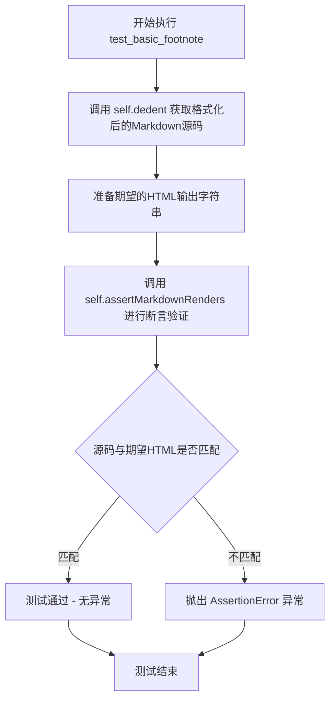
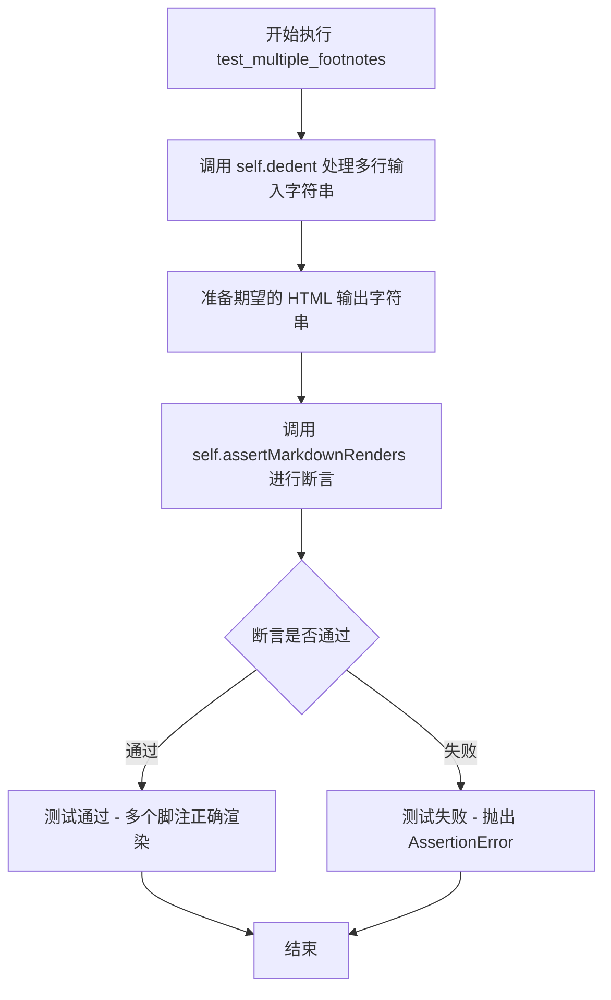
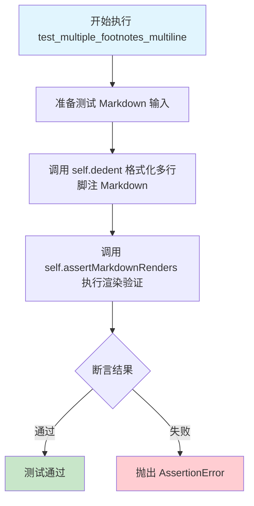
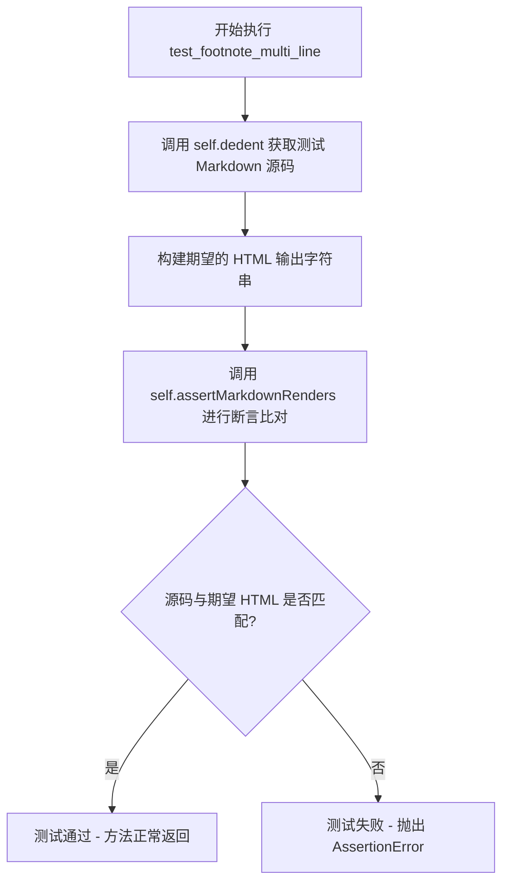
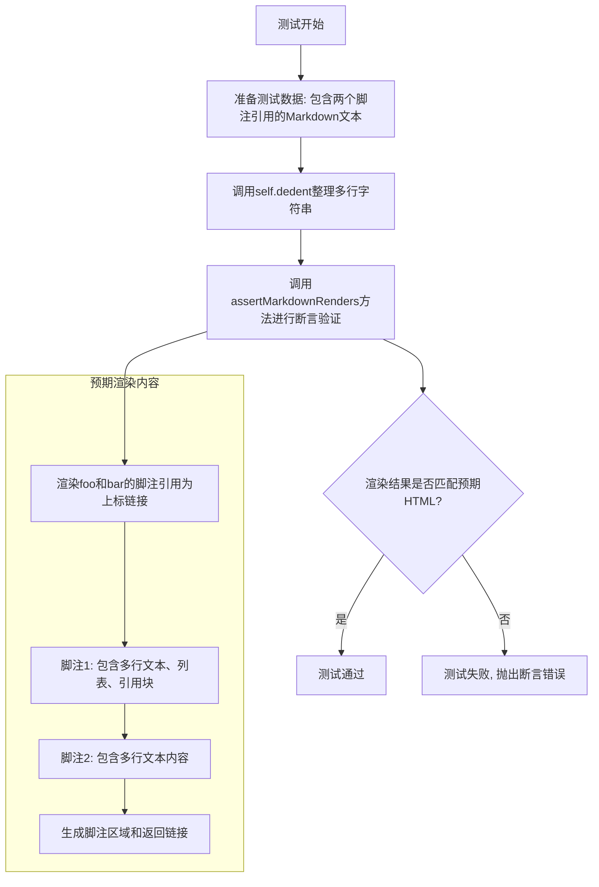
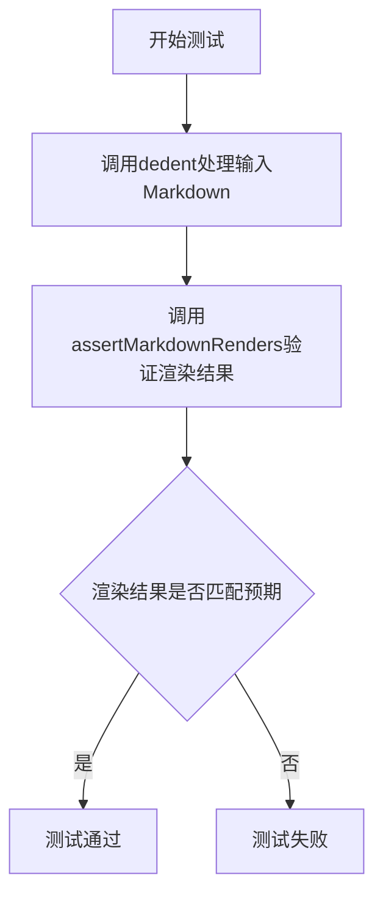
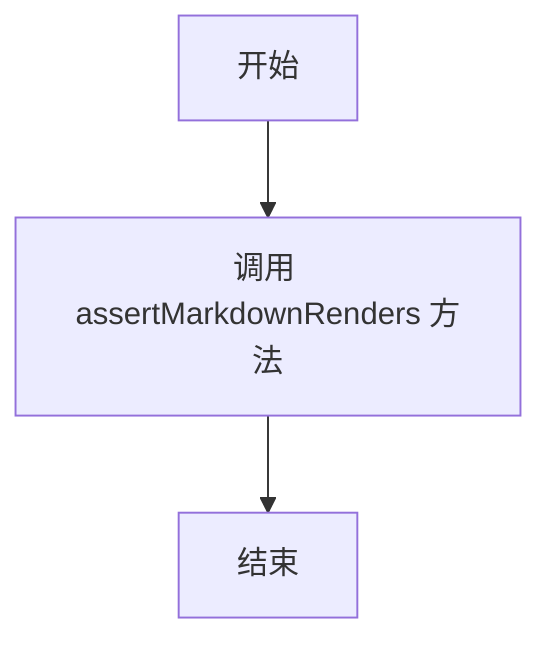
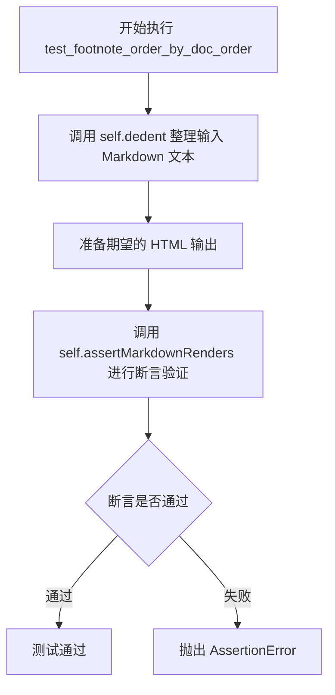
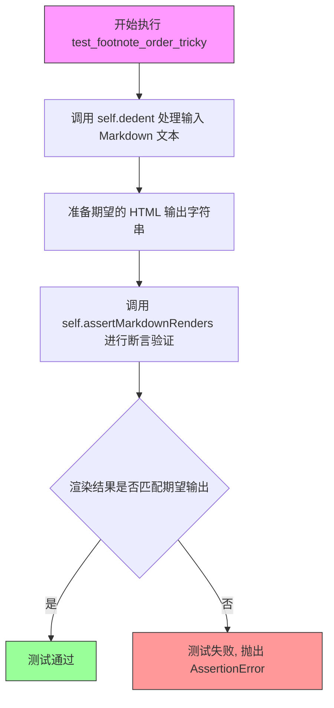
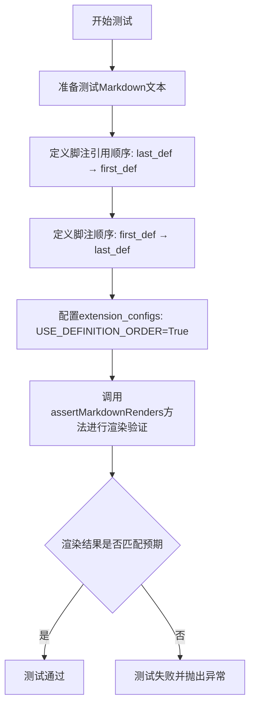

# `markdown\tests\test_syntax\extensions\test_footnotes.py` 详细设计文档

该文件是Python Markdown项目的测试文件，定义了一个名为TestFootnotes的测试类，继承自TestCase，用于对Markdown的footnotes（脚注）扩展功能进行全面的单元测试，涵盖基本引用、多行定义、复杂嵌套结构、配置选项（如下划线文本、分隔符、排序规则）以及在不同上下文（代码块、链接、列表、HTML）中的解析行为。

## 整体流程

```mermaid
graph TD
    A[输入: Markdown源码] --> B[调用Markdown处理器]
    B --> C{解析脚注扩展}
    C --> D[识别引用标记 [^x]]
    C --> E[识别定义标记 [^x]: ...]
    D --> F{处理上下文}
    E --> F
    F --> G{配置选项检查}
    G --> H[生成HTML引用 <sup>]
    G --> I[生成HTML定义 <div>]
    H --> J[输出: HTML结果]
    I --> J
    J --> K[断言: assertMarkdownRenders]
```

## 类结构

```
TestCase (markdown.test_tools)
└── TestFootnotes
```

## 全局变量及字段


### `default_kwargs`
    
测试默认配置，包含扩展名 'footnotes'

类型：`dict`
    


### `maxDiff`
    
设置断言比较无限制，用于显示完整的diff

类型：`NoneType`
    


### `TestFootnotes.default_kwargs`
    
测试默认配置，包含扩展名 'footnotes'

类型：`dict`
    


### `TestFootnotes.maxDiff`
    
设置断言比较无限制，用于显示完整的diff

类型：`NoneType`
    
    

## 全局函数及方法


### `TestFootnotes.test_basic_footnote`

这是一个基础的脚注功能测试用例，验证Markdown解析器能够正确处理基本的脚注语法（包括脚注引用和脚注定义），并生成符合预期的HTML输出。

参数：

- `self`：TestCase，测试类实例本身

返回值：`None`，该测试方法通过`assertMarkdownRenders`执行断言，不返回任何值

#### 流程图



#### 带注释源码

```python
def test_basic_footnote(self):
    """
    测试基本的脚注功能。
    验证Markdown脚注语法能够正确转换为HTML。
    
    测试场景：
    - 源码包含一个段落中的脚注引用[^1]
    - 源码包含脚注定义[^1]: A Footnote
    - 期望输出包含脚注引用标记<sup>和链接
    - 期望输出包含脚注区域<div class="footnote">
    """
    # 使用dedent方法格式化源码字符串，去除左侧多余缩进
    # 输入: paragraph[^1] 作为脚注引用
    #       [^1]: A Footnote 作为脚注定义
    self.assertMarkdownRenders(
        self.dedent(
            """
            paragraph[^1]

            [^1]: A Footnote
            """
        ),
        # 期望的HTML输出
        # 1. 段落中的脚注引用转换为<sup>标签，包含指向脚注的链接
        # 2. 脚注定义出现在页面底部的<div class="footnote">区域
        # 3. 脚注包含返回引用位置的链接（↩符号）
        '<p>paragraph<sup id="fnref:1"><a class="footnote-ref" href="#fn:1">1</a></sup></p>\n'
        '<div class="footnote">\n'
        '<hr />\n'
        '<ol>\n'
        '<li id="fn:1">\n'
        '<p>A Footnote&#160;<a class="footnote-backref" href="#fnref:1"'
        ' title="Jump back to footnote 1 in the text">&#8617;</a></p>\n'
        '</li>\n'
        '</ol>\n'
        '</div>'
    )
```


### `TestFootnotes.test_multiple_footnotes`

该方法用于测试 Markdown 解析器在处理包含多个脚注引用的文档时的正确性。它验证当文档中存在多个不同的脚注（如 `[^1]` 和 `[^2]`）时，解析器能够正确生成对应的脚注引用标记和脚注定义列表。

参数：

- `self`：`TestFootnotes`，测试类的实例本身，包含测试所需的配置和方法

返回值：`None`，该方法为测试用例，通过 `assertMarkdownRenders` 断言验证输出，不返回任何值

#### 流程图



#### 带注释源码

```python
def test_multiple_footnotes(self):
    """
    测试多个脚注的渲染功能。
    
    验证包含两个独立脚注引用的 Markdown 文档能够正确转换为 HTML，
    包括脚注引用标记和脚注定义区域。
    """
    # 使用 self.dedent 去除多行字符串的公共缩进，整理输入格式
    # 输入包含两个段落，每个段落引用一个不同的脚注
    self.assertMarkdownRenders(
        self.dedent(
            """
            foo[^1]

            bar[^2]

            [^1]: Footnote 1
            [^2]: Footnote 2
            """
        ),
        # 期望的 HTML 输出：包含两个脚注引用和对应的脚注定义列表
        '<p>foo<sup id="fnref:1"><a class="footnote-ref" href="#fn:1">1</a></sup></p>\n'
        '<p>bar<sup id="fnref:2"><a class="footnote-ref" href="#fn:2">2</a></sup></p>\n'
        '<div class="footnote">\n'
        '<hr />\n'
        '<ol>\n'
        '<li id="fn:1">\n'
        '<p>Footnote 1&#160;<a class="footnote-backref" href="#fnref:1"'
        ' title="Jump back to footnote 1 in the text">&#8617;</a></p>\n'
        '</li>\n'
        '<li id="fn:2">\n'
        '<p>Footnote 2&#160;<a class="footnote-backref" href="#fnref:2"'
        ' title="Jump back to footnote 2 in the text">&#8617;</a></p>\n'
        '</li>\n'
        '</ol>\n'
        '</div>'
    )
```


### `TestFootnotes.test_multiple_footnotes_multiline`

该方法用于测试 Markdown 脚注扩展处理多行脚注定义的功能，验证当脚注定义包含缩进的续行（如 `[^1]: Footnote 1\n    line 2`）时，能够正确地将续行内容合并到脚注段落中，并与多个脚注引用一起正确渲染为 HTML。

参数：

- `self`：`TestFootnotes` 实例，测试类的实例对象

返回值：`None`，无返回值（测试方法，通过断言验证结果）

#### 流程图



#### 带注释源码

```python
def test_multiple_footnotes_multiline(self):
    """
    测试多行脚注的渲染功能。
    
    验证当脚注定义包含缩进的多行内容时，Markdown 扩展
    能够正确处理并生成预期的 HTML 输出。
    """
    # 使用 self.dedent 去除缩进，获取格式化的输入 Markdown 文本
    # 输入包含两个脚注引用和两个脚注定义
    # 第一个脚注定义包含续行 "line 2"（缩进在 "Footnote 1" 之后）
    self.assertMarkdownRenders(
        self.dedent(
            """
            foo[^1]

            bar[^2]

            [^1]: Footnote 1
                line 2
            [^2]: Footnote 2
            """
        ),
        # 期望的 HTML 输出：
        # 1. 两个段落分别包含脚注引用 superscript 链接
        # 2. 脚注区域 div 包含水平线和有序列表
        # 3. 第一个脚注内容合并了续行 "Footnote 1\nline 2"
        # 4. 第二个脚注内容为单行 "Footnote 2"
        # 5. 每个脚注都有返回引用链接
        '<p>foo<sup id="fnref:1"><a class="footnote-ref" href="#fn:1">1</a></sup></p>\n'
        '<p>bar<sup id="fnref:2"><a class="footnote-ref" href="#fn:2">2</a></sup></p>\n'
        '<div class="footnote">\n'
        '<hr />\n'
        '<ol>\n'
        '<li id="fn:1">\n'
        '<p>Footnote 1\nline 2&#160;<a class="footnote-backref" href="#fnref:1"'
        ' title="Jump back to footnote 1 in the text">&#8617;</a></p>\n'
        '</li>\n'
        '<li id="fn:2">\n'
        '<p>Footnote 2&#160;<a class="footnote-backref" href="#fnref:2"'
        ' title="Jump back to footnote 2 in the text">&#8617;</a></p>\n'
        '</li>\n'
        '</ol>\n'
        '</div>'
    )
```


### `TestFootnotes.test_footnote_multi_line`

该方法用于测试 Python Markdown footnotes 扩展对多行脚注定义的处理能力。测试用例验证当脚注定义跨多行（第一行后带有缩进的续行）时，Markdown 解析器能正确将其合并为单一的脚注内容，并生成符合预期的 HTML 输出。

参数：

- `self`：`TestCase`，Python unittest 测试框架的实例对象，代表测试类本身

返回值：`None`，该方法为测试方法，无返回值，通过断言验证 Markdown 渲染结果

#### 流程图



#### 带注释源码

```python
def test_footnote_multi_line(self):
    """
    测试多行脚注定义的渲染功能。
    
    测试场景：
    - Markdown 源码包含一个段落，段落中有脚注引用 [^1]
    - 脚注定义 [^1] 跨越两行，第二行带有缩进（4个空格）
    - 验证脚注内容 'A Footnote\nline 2' 能被正确合并渲染
    """
    # 使用 self.dedent 去除源代码中的缩进空白，获取干净的 Markdown 文本
    self.assertMarkdownRenders(
        self.dedent(
            """
            paragraph[^1]
            [^1]: A Footnote
                line 2
            """
        ),
        # 期望渲染生成的 HTML 输出
        '<p>paragraph<sup id="fnref:1"><a class="footnote-ref" href="#fn:1">1</a></sup></p>\n'
        '<div class="footnote">\n'
        '<hr />\n'
        '<ol>\n'
        '<li id="fn:1">\n'
        # 脚注内容中的换行符 \n 被保留，两行内容合并为一个 <p> 标签
        '<p>A Footnote\nline 2&#160;<a class="footnote-backref" href="#fnref:1"'
        ' title="Jump back to footnote 1 in the text">&#8617;</a></p>\n'
        '</li>\n'
        '</ol>\n'
        '</div>'
    )
```


### `TestFootnotes.test_footnote_multi_line_lazy_indent`

该测试方法用于验证 Markdown 的 footnotes 扩展在处理"懒缩进"（lazy indent）多行脚注时的正确性。当脚注定义后的第二行没有使用标准缩进（4个空格）时，系统仍应正确将其合并到脚注内容中，而不是作为独立段落处理。

参数：

- `self`：无参数，TestCase 实例本身

返回值：无返回值（`None`），该方法为测试用例，通过 `assertMarkdownRenders` 验证 Markdown 渲染结果是否符合预期

#### 流程图

```mermaid
flowchart TD
    A[开始测试 test_footnote_multi_line_lazy_indent] --> B[准备 Markdown 源文本]
    B --> C[使用 dedent 格式化多行字符串]
    C --> D[调用 Markdown 转换器处理源文本]
    D --> E{渲染结果是否匹配预期 HTML?}
    E -->|是| F[测试通过]
    E -->|否| G[抛出 AssertionError]
    
    B --> B1[源文本: paragraph[^1]<br/>[^1]: A Footnote<br/>line 2]
    B1 --> C
    
    D --> D1[预期 HTML: 包含脚注引用和脚注定义<br/>'A Footnote\nline 2' 在同一段落内]
    D1 --> E
```

#### 带注释源码

```python
def test_footnote_multi_line_lazy_indent(self):
    """
    测试脚注定义中使用"懒缩进"（lazy indent）的多行脚注内容。
    
    懒缩进指脚注定义后的后续行没有使用标准4空格缩进，
    但仍然应该被视为脚注内容的一部分。
    
    预期行为：'line 2' 不会被渲染为独立的段落，
    而是作为脚注第一行 'A Footnote' 的延续。
    """
    self.assertMarkdownRenders(
        # 使用 self.dedent 去除多行字符串的公共前缀缩进
        self.dedent(
            """
            paragraph[^1]
            [^1]: A Footnote
            line 2
            """
        ),
        # 预期的 HTML 输出
        '<p>paragraph<sup id="fnref:1"><a class="footnote-ref" href="#fn:1">1</a></sup></p>\n'
        '<div class="footnote">\n'
        '<hr />\n'
        '<ol>\n'
        '<li id="fn:1">\n'
        '<p>A Footnote\nline 2&#160;<a class="footnote-backref" href="#fnref:1"'
        ' title="Jump back to footnote 1 in the text">&#8617;</a></p>\n'
        '</li>\n'
        '</ol>\n'
        '</div>'
    )
```


### `TestFootnotes.test_footnote_multi_line_complex`

该测试方法验证 Python Markdown 扩展对复杂多行脚注的处理能力，包括脚注定义中包含多行文本、列表项和引用块的情况。

参数：

- `self`：`TestCase`，测试用例实例本身

返回值：`None`，无返回值（测试方法通过断言验证功能）

#### 流程图

```mermaid
flowchart TD
    A[开始执行 test_footnote_multi_line_complex] --> B[调用 self.dedent 格式化输入 Markdown]
    B --> C[准备测试输入: paragraph[^1]<br/>[^1]:<br/>A Footnote<br/>line 2<br/>* list item<br/>> blockquote]
    C --> D[调用 self.assertMarkdownRenders 对比实际输出与期望输出]
    D --> E{输出是否匹配?}
    E -->|是| F[测试通过 - 断言成功]
    E -->|否| G[测试失败 - 抛出 AssertionError]
    F --> H[结束]
    G --> H
```

#### 带注释源码

```python
def test_footnote_multi_line_complex(self):
    """
    测试复杂多行脚注的处理能力。
    验证脚注定义包含多行文本、列表项和引用块时的正确渲染。
    """
    # 使用 self.dedent 移除输入字符串的公共前导空白
    # 输入格式：脚注定义以 [^1]: 开头，后面跟随多行内容
    self.assertMarkdownRenders(
        self.dedent(
            """
            paragraph[^1]

            [^1]:

                A Footnote
                line 2

                * list item

                > blockquote
            """
        ),
        # 期望的 HTML 输出
        # 1. 段落中的脚注引用显示为上标链接
        # 2. 脚注区域包含：
        #    - 多行文本 "A Footnote\nline 2"
        #    - 无序列表项
        #    - 引用块
        #    - 返回链接（脚注回链）
        '<p>paragraph<sup id="fnref:1"><a class="footnote-ref" href="#fn:1">1</a></sup></p>\n'
        '<div class="footnote">\n'
        '<hr />\n'
        '<ol>\n'
        '<li id="fn:1">\n'
        '<p>A Footnote\nline 2</p>\n'
        '<ul>\n<li>list item</li>\n</ul>\n'
        '<blockquote>\n<p>blockquote</p>\n</blockquote>\n'
        '<p><a class="footnote-backref" href="#fnref:1"'
        ' title="Jump back to footnote 1 in the text">&#8617;</a></p>\n'
        '</li>\n'
        '</ol>\n'
        '</div>'
    )
```


### `TestFootnotes.test_footnote_multple_complex`

这是一个测试方法，用于验证 Markdown  footnotes 扩展在处理多个复杂脚注（包含多行内容、列表、引用块）时的渲染结果是否符合预期。

参数：

- `self`：`TestFootnotes`，测试类实例本身

返回值：`None`，该方法为测试用例，通过 `assertMarkdownRenders` 断言验证渲染结果

#### 流程图



#### 带注释源码

```python
def test_footnote_multple_complex(self):
    """
    测试多个复杂脚注的渲染功能。
    
    此测试验证footnotes扩展能够正确处理：
    1. 多个脚注引用
    2. 每个脚注定义包含多行内容
    3. 脚注内容中包含Markdown元素（列表、引用块）
    4. 脚注之间有正常的空行分隔
    """
    # 使用assertMarkdownRenders方法验证Markdown到HTML的转换
    # 第一个参数：输入的Markdown源码（经过dedent处理去除缩进）
    # 第二个参数：期望输出的HTML源码
    self.assertMarkdownRenders(
        # 输入的Markdown文本，包含两个脚注引用[^1]和[^2]
        self.dedent(
            """
            foo[^1]

            bar[^2]

            [^1]:

                A Footnote
                line 2

                * list item

                > blockquote

            [^2]: Second footnote

                paragraph 2
            """
        ),
        # 期望的HTML输出
        '<p>foo<sup id="fnref:1"><a class="footnote-ref" href="#fn:1">1</a></sup></p>\n'
        '<p>bar<sup id="fnref:2"><a class="footnote-ref" href="#fn:2">2</a></sup></p>\n'
        '<div class="footnote">\n'
        '<hr />\n'
        '<ol>\n'
        # 第一个脚注的HTML结构
        '<li id="fn:1">\n'
        '<p>A Footnote\nline 2</p>\n'  # 脚注的段落内容
        '<ul>\n<li>list item</li>\n</ul>\n'  # 脚注中的无序列表
        '<blockquote>\n<p>blockquote</p>\n</blockquote>\n'  # 脚注中的引用块
        '<p><a class="footnote-backref" href="#fnref:1"'  # 返回到正文的链接
        ' title="Jump back to footnote 1 in the text">&#8617;</a></p>\n'
        '</li>\n'
        # 第二个脚注的HTML结构
        '<li id="fn:2">\n'
        '<p>Second footnote</p>\n'
        '<p>paragraph 2&#160;<a class="footnote-backref" href="#fnref:2"'  # 多行脚注内容
        ' title="Jump back to footnote 2 in the text">&#8617;</a></p>\n'
        '</li>\n'
        '</ol>\n'
        '</div>'
    )
```


### `TestFootnotes.test_footnote_multple_complex_no_blank_line_between`

该测试方法用于验证当多个复杂的脚注定义之间没有空行时，Markdown解析器能否正确渲染脚注内容，包括脚注引用、列表项和引用块等复杂结构。

参数：
- `self`：`TestFootnotes`（隐式参数），测试类的实例本身

返回值：`None`，测试方法不返回任何值，通过断言验证渲染结果

#### 流程图



#### 带注释源码

```python
def test_footnote_multple_complex_no_blank_line_between(self):
    """测试多个复杂脚注之间没有空行时的渲染"""
    # 使用assertMarkdownRenders方法验证Markdown渲染结果
    self.assertMarkdownRenders(
        # 输入的Markdown源码，使用dedent去除缩进
        self.dedent(
            """
            foo[^1]

            bar[^2]

            [^1]:

                A Footnote
                line 2

                * list item

                > blockquote
            [^2]: Second footnote

                paragraph 2
            """
        ),
        # 期望的HTML输出
        '<p>foo<sup id="fnref:1"><a class="footnote-ref" href="#fn:1">1</a></sup></p>\n'
        '<p>bar<sup id="fnref:2"><a class="footnote-ref" href="#fn:2">2</a></sup></p>\n'
        '<div class="footnote">\n'
        '<hr />\n'
        '<ol>\n'
        '<li id="fn:1">\n'
        '<p>A Footnote\nline 2</p>\n'
        '<ul>\n<li>list item</li>\n</ul>\n'
        '<blockquote>\n<p>blockquote</p>\n</blockquote>\n'
        '<p><a class="footnote-backref" href="#fnref:1"'
        ' title="Jump back to footnote 1 in the text">&#8617;</a></p>\n'
        '</li>\n'
        '<li id="fn:2">\n'
        '<p>Second footnote</p>\n'
        '<p>paragraph 2&#160;<a class="footnote-backref" href="#fnref:2"'
        ' title="Jump back to footnote 2 in the text">&#8617;</a></p>\n'
        '</li>\n'
        '</ol>\n'
        '</div>'
    )
```


### TestFootnotes.test_backlink_text

测试脚注链接文本的配置功能，验证当设置`BACKLINK_TEXT`为`'back'`时，生成的HTML中脚注返回链接文本为`'back'`。

参数：
- `self`：`TestFootnotes`，隐式参数，表示测试类实例本身

返回值：`None`，此方法没有返回值，仅用于执行测试断言

#### 流程图



#### 带注释源码

```python
def test_backlink_text(self):
    """Test back-link configuration."""
    # 调用 assertMarkdownRenders 验证 Markdown 渲染结果
    # 参数1：输入的 Markdown 文本，包含脚注引用
    # 参数2：期望输出的 HTML 字符串
    # 参数3：扩展配置，指定脚注的 BACKLINK_TEXT 为 'back'
    self.assertMarkdownRenders(
        'paragraph[^1]\n\n[^1]: A Footnote',  # Markdown 输入：段落中使用脚注引用 [^1]
        '<p>paragraph<sup id="fnref:1"><a class="footnote-ref" href="#fn:1">1</a></sup></p>\n'  # 期望 HTML：段落中的脚注引用
        '<div class="footnote">\n'
        '<hr />\n'
        '<ol>\n'
        '<li id="fn:1">\n'
        '<p>A Footnote&#160;<a class="footnote-backref" href="#fnref:1"'  # 脚注定义区域
        ' title="Jump back to footnote 1 in the text">back</a></p>\n'  # 返回链接文本为 'back'，通过 BACKLINK_TEXT 配置
        '</li>\n'
        '</ol>\n'
        '</div>',
        extension_configs={'footnotes': {'BACKLINK_TEXT': 'back'}}  # 配置 footnotes 扩展的 BACKLINK_TEXT 选项为 'back'
    )
```


### `TestFootnotes.test_footnote_separator`

该方法用于测试 Markdown  footnotes 扩展中的分隔符（SEPARATOR）配置功能。当设置 `SEPARATOR` 为 `-` 时，footnote 的 ID 将使用连字符替代默认的冒号。

参数：

- `self`：`TestCase`，测试类实例本身

返回值：`None`，测试方法无返回值

#### 流程图

```mermaid
flowchart TD
    A[开始执行 test_footnote_separator] --> B[调用 assertMarkdownRenders 方法]
    B --> C[传入 Markdown 源文本: paragraph[^1]\n\n[^1]: A Footnote]
    C --> D[传入期望的 HTML 输出<br/>注意 ID 使用连字符: fnref-1, fn-1]
    C --> E[传入扩展配置: {'footnotes': {'SEPARATOR': '-'}}]
    D --> F{断言渲染结果是否匹配期望}
    E --> F
    F -->|匹配| G[测试通过]
    F -->|不匹配| H[测试失败]
```

#### 带注释源码

```python
def test_footnote_separator(self):
    """Test separator configuration."""
    # 使用 assertMarkdownRenders 验证 Markdown 渲染结果
    # 参数1: 输入的 Markdown 文本，包含一个段落和一个脚注引用
    self.assertMarkdownRenders(
        'paragraph[^1]\n\n[^1]: A Footnote',  # 输入: Markdown 源文本
        
        # 参数2: 期望的 HTML 输出
        # 关键点: 当 SEPARATOR='-' 时，ID 使用连字符而非冒号
        # - fnref-1 (替代默认的 fnref:1)
        # - fn-1 (替代默认的 fn:1)
        '<p>paragraph<sup id="fnref-1"><a class="footnote-ref" href="#fn-1">1</a></sup></p>\n'
        '<div class="footnote">\n'
        '<hr />\n'
        '<ol>\n'
        '<li id="fn-1">\n'
        '<p>A Footnote&#160;<a class="footnote-backref" href="#fnref-1"'
        ' title="Jump back to footnote 1 in the text">&#8617;</a></p>\n'
        '</li>\n'
        '</ol>\n'
        '</div>',
        
        # 参数3: 扩展配置，设置 SEPARATOR 为 '-'
        # 这会将脚注 ID 中的冒号替换为连字符
        extension_configs={'footnotes': {'SEPARATOR': '-'}}
    )
```


### `TestFootnotes.test_backlink_title`

该方法用于测试footnotes扩展中回链标题（BACKLINK_TITLE）的配置功能，验证当用户自定义回链的title属性时，系统能否正确生成对应的HTML属性而不包含占位符。

参数：

- `self`：TestCase实例，测试类实例本身，无需显式传递

返回值：`None`，该方法为测试方法，通过`assertMarkdownRenders`进行断言验证，若测试失败则抛出异常

#### 流程图

```mermaid
flowchart TD
    A[开始测试 test_backlink_title] --> B[调用 assertMarkdownRenders]
    B --> C[传入Markdown源码: paragraph[^1]\n\n[^1]: A Footnote]
    B --> D[传入期望HTML输出: 包含自定义title的footnote-backref链接]
    B --> E[传入扩展配置: {'footnotes': {'BACKLINK_TITLE': 'Jump back to footnote'}}]
    E --> F{断言结果}
    F -->|通过| G[测试通过]
    F -->|失败| H[抛出 AssertionError 异常]
```

#### 带注释源码

```python
def test_backlink_title(self):
    """
    测试回链标题配置（不含占位符）。
    
    验证当用户通过 BACKLINK_TITLE 配置项设置回链的 title 属性时，
    生成的 HTML 中 footnote-backref 链接的 title 属性正确使用用户自定义值，
    而不包含默认的占位符（如 "Jump back to footnote 1 in the text"）。
    """
    
    # 调用父类测试框架的断言方法，验证 Markdown 渲染结果
    self.assertMarkdownRenders(
        # 输入：包含脚注引用的 Markdown 源码
        'paragraph[^1]\n\n[^1]: A Footnote',
        
        # 期望输出：HTML 中回链链接的 title 属性为 "Jump back to footnote"（不含编号占位符）
        '<p>paragraph<sup id="fnref:1"><a class="footnote-ref" href="#fn:1">1</a></sup></p>\n'
        '<div class="footnote">\n'
        '<hr />\n'
        '<ol>\n'
        '<li id="fn:1">\n'
        '<p>A Footnote&#160;<a class="footnote-backref" href="#fnref:1"'
        ' title="Jump back to footnote">&#8617;</a></p>\n'
        '</li>\n'
        '</ol>\n'
        '</div>',
        
        # 扩展配置：设置 BACKLINK_TITLE 为自定义字符串
        extension_configs={'footnotes': {'BACKLINK_TITLE': 'Jump back to footnote'}}
    )
```


### `TestFootnotes.test_superscript_text`

该方法是一个测试用例，用于验证 Markdown 脚注扩展的 `SUPERSCRIPT_TEXT` 配置功能。该测试通过设置自定义的上标文本格式（如 `[{}]`），验证脚注引用是否能够正确渲染为指定格式（如 `[1]`）而非默认格式。

参数：

- `self`：`TestFootnotes`，表示该测试方法所属的测试类实例

返回值：`None`，该方法为测试用例，通过 `assertMarkdownRenders` 断言进行验证，无显式返回值

#### 流程图

```mermaid
flowchart TD
    A[开始测试方法] --> B[调用 assertMarkdownRenders 方法]
    B --> C[输入 Markdown 文本: paragraph[^1]<br/>[^1]: A Footnote]
    B --> D[期望输出 HTML: 包含 [1] 上标格式的脚注]
    B --> E[配置扩展选项:footnotes: {'SUPERSCRIPT_TEXT': '[{}]'}]
    C --> F[执行 Markdown 转换]
    E --> F
    F --> G{实际输出是否匹配期望输出}
    G -->|是| H[测试通过]
    G -->|否| I[测试失败并抛出 AssertionError]
```

#### 带注释源码

```python
def test_superscript_text(self):
    """Test superscript text configuration."""

    # 使用 assertMarkdownRenders 方法验证 Markdown 渲染结果
    # 参数1: 输入的 Markdown 文本，包含一个脚注引用
    # 参数2: 期望输出的 HTML，注意到上标内容为 [1] 而非默认的 1
    # 参数3: 扩展配置，设置 SUPERSCRIPT_TEXT 为 '[{}]'，用于自定义上标文本格式
    self.assertMarkdownRenders(
        'paragraph[^1]\n\n[^1]: A Footnote',  # Markdown 输入
        '<p>paragraph<sup id="fnref:1"><a class="footnote-ref" href="#fn:1">[1]</a></sup></p>\n'  # 期望 HTML 输出
        '<div class="footnote">\n'
        '<hr />\n'
        '<ol>\n'
        '<li id="fn:1">\n'
        '<p>A Footnote&#160;<a class="footnote-backref" href="#fnref:1"'
        ' title="Jump back to footnote 1 in the text">&#8617;</a></p>\n'
        '</li>\n'
        '</ol>\n'
        '</div>',
        extension_configs={'footnotes': {'SUPERSCRIPT_TEXT': '[{}]'}}  # 自定义配置
    )
```


### `TestFootnotes.test_footnote_order_by_doc_order`

验证当配置 `USE_DEFINITION_ORDER: False` 时，脚注按照文档中引用出现的顺序进行排序，而非按照定义顺序。

参数：

- `self`：`TestFootnotes`，测试类实例本身

返回值：`None`，测试方法无返回值，通过 `self.assertMarkdownRenders` 断言验证输出

#### 流程图



#### 带注释源码

```python
def test_footnote_order_by_doc_order(self):
    """Test that footnotes occur in order of reference appearance when so configured."""
    # 使用 self.dedent 清理并规范化多行输入 Markdown 文本
    # 输入包含两个脚注引用：[^first] 和 [^last]
    # 定义顺序是 [^last] 在前，[^first] 在后
    self.assertMarkdownRenders(
        self.dedent(
            """
            First footnote reference[^first]. Second footnote reference[^last].

            [^last]: Second footnote.
            [^first]: First footnote.
            """
        ),
        # 期望的 HTML 输出
        # 注意：脚注顺序是 First footnote 在前，Second footnote 在后
        # 因为引用出现顺序是 [^first] 先出现，然后是 [^last]
        '<p>First footnote reference<sup id="fnref:first"><a class="footnote-ref" '
        'href="#fn:first">1</a></sup>. Second footnote reference<sup id="fnref:last">'
        '<a class="footnote-ref" href="#fn:last">2</a></sup>.</p>\n'
        '<div class="footnote">\n'
        '<hr />\n'
        '<ol>\n'
        '<li id="fn:first">\n'
        '<p>First footnote.&#160;<a class="footnote-backref" href="#fnref:first" '
        'title="Jump back to footnote 1 in the text">&#8617;</a></p>\n'
        '</li>\n'
        '<li id="fn:last">\n'
        '<p>Second footnote.&#160;<a class="footnote-backref" href="#fnref:last" '
        'title="Jump back to footnote 2 in the text">&#8617;</a></p>\n'
        '</li>\n'
        '</ol>\n'
        '</div>',
        # 关键配置：USE_DEFINITION_ORDER=False 表示按引用顺序排序
        extension_configs={'footnotes': {'USE_DEFINITION_ORDER': False}}
    )
```


### `TestFootnotes.test_footnote_order_tricky`

测试一个复杂的脚注引用序列，验证代码跨度（code span）中的脚注引用应被忽略，而普通脚注引用应按文档中出现顺序进行编号。

参数：

- `self`：`TestFootnotes`（隐式参数），测试类实例本身

返回值：`None`，该方法为测试方法，无返回值，通过 `assertMarkdownRenders` 断言验证渲染结果

#### 流程图



#### 带注释源码

```python
def test_footnote_order_tricky(self):
    """
    Test a tricky sequence of footnote references.
    
    此测试方法验证以下关键行为：
    1. 代码跨度（code span）中的脚注引用应被忽略
    2. 普通脚注引用应按文档中首次出现的顺序编号
    3. 脚注定义按引用顺序而非定义顺序排列
    """
    
    # 使用 self.dedent 去除字符串缩进，获取规范的 Markdown 源码
    # 输入包含三个引用：一个在代码跨度中（应被忽略），两个在普通文本中
    input_md = self.dedent(
        """
        `Footnote reference in code spans should be ignored[^tricky]`.
        A footnote reference[^ordinary].
        Another footnote reference[^tricky].

        [^ordinary]: This should be the first footnote.
        [^tricky]: This should be the second footnote.
        """
    )
    
    # 期望的 HTML 输出
    # 关键点：
    # 1. 代码跨度中的 [^tricky] 被原样保留，不转换为脚注链接
    # 2. ordinary 和 tricky 按出现顺序编号为 1 和 2
    # 3. 脚注定义部分按引用顺序排列
    expected_html = (
        '<p><code>Footnote reference in code spans should be ignored[^tricky]</code>.\n'
        'A footnote reference<sup id="fnref:ordinary">'
        '<a class="footnote-ref" href="#fn:ordinary">1</a></sup>.\n'
        'Another footnote reference<sup id="fnref:tricky">'
        '<a class="footnote-ref" href="#fn:tricky">2</a></sup>.</p>\n'
        '<div class="footnote">\n'
        '<hr />\n'
        '<ol>\n'
        '<li id="fn:ordinary">\n'
        '<p>This should be the first footnote.&#160;<a class="footnote-backref" '
        'href="#fnref:ordinary" title="Jump back to footnote 1 in the text">&#8617;</a></p>\n'
        '</li>\n'
        '<li id="fn:tricky">\n'
        '<p>This should be the second footnote.&#160;<a class="footnote-backref" '
        'href="#fnref:tricky" title="Jump back to footnote 2 in the text">&#8617;</a></p>\n'
        '</li>\n'
        '</ol>\n'
        '</div>'
    )
    
    # 执行断言验证：调用父类 TestCase 的 assertMarkdownRenders 方法
    # 该方法会：
    # 1. 使用 markdown 模块将 input_md 转换为 HTML
    # 2. 应用 'footnotes' 扩展处理脚注
    # 3. 将渲染结果与 expected_html 进行精确比较
    self.assertMarkdownRenders(input_md, expected_html)
```


### `TestFootnotes.test_footnote_order_by_definition`

该测试方法验证当配置 `USE_DEFINITION_ORDER` 为 `True` 时，脚注按照定义顺序（Definition Order）而非引用顺序（Document Order）进行排序。

参数：

- `self`：`TestFootnotes`，隐式参数，表示测试类实例本身

返回值：`None`，该方法为测试方法，通过 `assertMarkdownRenders` 验证 Markdown 渲染结果

#### 流程图



#### 带注释源码

```python
def test_footnote_order_by_definition(self):
    """Test that footnotes occur in order of definition occurrence when so configured."""

    # 使用self.dedent整理多行字符串,移除共同缩进
    # 测试Markdown文本:
    # First footnote reference[^last_def]. Second footnote reference[^first_def].
    #
    # [^first_def]: First footnote.
    # [^last_def]: Second footnote.
    self.assertMarkdownRenders(
        self.dedent(
            """
            First footnote reference[^last_def]. Second footnote reference[^first_def].

            [^first_def]: First footnote.
            [^last_def]: Second footnote.
            """
        ),
        # 预期渲染的HTML输出
        # 注意:虽然引用顺序是last_def在前,但定义顺序是first_def在前
        # 所以first_def显示为1,last_def显示为2
        '<p>First footnote reference<sup id="fnref:last_def"><a class="footnote-ref" '
        'href="#fn:last_def">2</a></sup>. Second footnote reference<sup id="fnref:first_def">'
        '<a class="footnote-ref" href="#fn:first_def">1</a></sup>.</p>\n'
        '<div class="footnote">\n'
        '<hr />\n'
        '<ol>\n'
        '<li id="fn:first_def">\n'
        '<p>First footnote.&#160;<a class="footnote-backref" href="#fnref:first_def" '
        'title="Jump back to footnote 1 in the text">&#8617;</a></p>\n'
        '</li>\n'
        '<li id="fn:last_def">\n'
        '<p>Second footnote.&#160;<a class="footnote-backref" href="#fnref:last_def" '
        'title="Jump back to footnote 2 in the text">&#8617;</a></p>\n'
        '</li>\n'
        '</ol>\n'
        '</div>',
        # 关键配置:设置USE_DEFINITION_ORDER为True
        # 这使得脚注按定义顺序排序,而非文档中引用顺序
        extension_configs={'footnotes': {'USE_DEFINITION_ORDER': True}}
    )
```


### `TestFootnotes.test_footnote_reference_within_code_span`

该方法用于测试 Markdown 中脚注引用（footnote reference）是否能在代码_span（代码片段）内被正确忽略。当脚注引用出现在代码_span中时，应当作为普通文本处理而不转换为脚注链接。

参数：

- `self`：`TestFootnotes`，测试类实例本身，用于调用父类方法 `assertMarkdownRenders` 进行断言验证

返回值：`None`，无返回值。该方法为一个测试用例方法，通过 `assertMarkdownRenders` 进行断言验证，不返回任何值

#### 流程图

```mermaid
flowchart TD
    A[开始执行 test_footnote_reference_within_code_span] --> B[调用 assertMarkdownRenders 方法]
    B --> C[输入 Markdown 文本: 'A `code span with a footnote[^1] reference`.']
    C --> D[期望输出的 HTML: '<p>A <code>code span with a footnote[^1] reference</code>.</p>']
    D --> E{断言实际输出与期望输出是否匹配}
    E -->|匹配| F[测试通过]
    E -->|不匹配| G[测试失败, 抛出 AssertionError]
    F --> H[结束]
    G --> H
```

#### 带注释源码

```python
def test_footnote_reference_within_code_span(self):
    """Test footnote reference within a code span."""
    # 调用父类 TestCase 的 assertMarkdownRenders 方法验证 Markdown 渲染结果
    # 输入: 包含代码 span 的 Markdown 文本,代码 span 内有脚注引用 [^1]
    # 期望: 脚注引用在代码 span 内被忽略,保持原样输出为普通文本 [^1]
    self.assertMarkdownRenders(
        'A `code span with a footnote[^1] reference`.',  # 输入 Markdown 源码
        '<p>A <code>code span with a footnote[^1] reference</code>.</p>'  # 期望的 HTML 输出
    )
```


### `TestFootnotes.test_footnote_reference_within_link`

测试footnote引用在Markdown链接内部的行为，验证链接文本中的脚注引用（如`[^1]`）被视为普通文本而不是转换为脚注链接。

参数：

- `self`：`TestCase`，测试类实例，隐式参数

返回值：`None`，测试方法无返回值，通过 `assertMarkdownRenders` 断言验证渲染结果

#### 流程图

```mermaid
flowchart TD
    A[开始测试] --> B[准备测试输入]
    B --> C[调用markdown渲染器]
    C --> D{验证渲染结果}
    D -->|通过| E[测试通过]
    D -->|失败| F[抛出断言错误]
    E --> G[结束测试]
    F --> G
    
    subgraph 输入输出
    B -.->|'A [link with a footnote[^1] reference](http://example.com).'| C
    C -.->|'<p>A <a href="http://example.com">link with a footnote[^1] reference</a>.</p>'| D
    end
```

#### 带注释源码

```python
def test_footnote_reference_within_link(self):
    """Test footnote reference within a link."""
    # 使用assertMarkdownRenders方法验证Markdown渲染结果
    # 第一个参数：输入的Markdown文本
    # 第二个参数：期望的HTML输出
    self.assertMarkdownRenders(
        # 测试输入：包含footnote引用在链接文本中的Markdown
        'A [link with a footnote[^1] reference](http://example.com).',
        # 期望输出：链接文本中的[^1]保持为普通文本，不转换为脚注链接
        '<p>A <a href="http://example.com">link with a footnote[^1] reference</a>.</p>'
    )
```


### `TestFootnotes.test_footnote_reference_within_footnote_definition`

该方法是 Python Markdown 测试套件中的一个测试用例，用于验证脚注定义（footnote definition）中包含另一个脚注引用（footnote reference）时的正确处理行为。

参数：

- `self`：`TestCase`，测试用例实例本身，包含测试所需的断言方法和工具

返回值：`None`，该方法为测试用例，通过断言验证输出，不返回具体值

#### 流程图

```mermaid
flowchart TD
    A[开始执行 test_footnote_reference_within_footnote_definition] --> B[准备测试输入: Markdown文本包含主脚注[^main]和嵌套脚注[^nested]]
    B --> C[调用 self.dedent 格式化多行测试字符串]
    D[调用 self.assertMarkdownRenders 验证渲染结果]
    D --> E{断言是否通过}
    E -->|通过| F[测试通过 - 返回 None]
    E -->|失败| G[抛出 AssertionError]
    
    style A fill:#f9f,color:#000
    style D fill:#bbf,color:#000
    style F fill:#bfb,color:#000
    style G fill:#fbb,color:#000
```

#### 带注释源码

```python
def test_footnote_reference_within_footnote_definition(self):
    """Test footnote definition containing another footnote reference."""
    # 定义测试输入：主脚注定义中包含对另一个脚注的引用
    # 输入结构：
    # - 主文本包含 [^main] 引用
    # - [^main] 定义中包含 [^nested] 引用
    # - [^nested] 是独立的脚注定义
    self.assertMarkdownRenders(
        self.dedent(
            """
            Main footnote[^main].

            [^main]: This footnote references another[^nested].
            [^nested]: Nested footnote.
            """
        ),
        # 期望的 HTML 输出
        # 主脚注引用显示为上标sup链接，指向#fn:main
        # 主脚注定义内部包含对嵌套脚注的引用，也显示为上标sup
        '<p>Main footnote<sup id="fnref:main"><a class="footnote-ref" href="#fn:main">1</a></sup>.</p>\n'
        '<div class="footnote">\n'
        '<hr />\n'
        '<ol>\n'
        '<li id="fn:main">\n'
        '<p>This footnote references another<sup id="fnref:nested"><a class="footnote-ref" '
        'href="#fn:nested">2</a></sup>.&#160;<a class="footnote-backref" href="#fnref:main" '
        'title="Jump back to footnote 1 in the text">&#8617;</a></p>\n'
        '</li>\n'
        '<li id="fn:nested">\n'
        '<p>Nested footnote.&#160;<a class="footnote-backref" href="#fnref:nested" '
        'title="Jump back to footnote 2 in the text">&#8617;</a></p>\n'
        '</li>\n'
        '</ol>\n'
        '</div>'
    )
```


### `TestFootnotes.test_footnote_reference_within_blockquote`

该测试方法用于验证 Markdown 脚注引用在块引用（blockquote）元素中的渲染功能是否正确。它测试当脚注引用 `[^quote]` 出现在块引用内部时，解析器能否正确生成带有脚注链接的 HTML 块引用，以及对应的脚注定义区域。

参数：

- `self`：`TestCase`，测试类实例本身，继承自 `unittest.TestCase`

返回值：`None`（无返回值），该方法为测试方法，使用 `self.assertMarkdownRenders` 断言验证渲染结果

#### 流程图

```mermaid
flowchart TD
    A[开始测试] --> B[准备Markdown输入: 块引用包含脚注引用[^quote]]
    B --> C[定义脚注[^quote]: Quote footnote]
    C --> D[调用Markdown解析器渲染]
    D --> E{验证HTML输出}
    E -->|通过| F[测试通过]
    E -->|失败| G[抛出AssertionError]
    F --> H[结束]
    G --> H
    
    subgraph 验证内容
    E1[检查blockquote标签存在]
    E2[检查sup标签和footnote-ref类]
    E3[检查脚注定义区域footnote类]
    E4[检查返回链接footnote-backref类]
    end
    
    E --> E1
    E1 --> E2
    E2 --> E3
    E3 --> E4
```

#### 带注释源码

```python
def test_footnote_reference_within_blockquote(self):
    """Test footnote reference within a blockquote."""
    # 使用assertMarkdownRenders方法验证Markdown渲染结果
    # 第一个参数：输入的Markdown文本（包含块引用中的脚注引用）
    # 第二个参数：期望的HTML输出
    
    self.assertMarkdownRenders(
        # 使用self.dedent移除缩进前缀，构造测试用的Markdown输入
        self.dedent(
            """
            > This is a quote with a footnote[^quote].

            [^quote]: Quote footnote.
            """
        ),
        # 期望的HTML输出包含：
        # 1. blockquote标签包裹的段落
        # 2. sup标签包含脚注引用（id为fnref:quote）
        # 3. a标签链接到脚注定义（class为footnote-ref）
        # 4. 脚注定义区域（class为footnote）
        # 5. 脚注列表项（id为fn:quote）
        # 6. 返回链接（class为footnote-backref）
        '<blockquote>\n'
        '<p>This is a quote with a footnote<sup id="fnref:quote">'
        '<a class="footnote-ref" href="#fn:quote">1</a></sup>.</p>\n'
        '</blockquote>\n'
        '<div class="footnote">\n'
        '<hr />\n'
        '<ol>\n'
        '<li id="fn:quote">\n'
        '<p>Quote footnote.&#160;<a class="footnote-backref" href="#fnref:quote" '
        'title="Jump back to footnote 1 in the text">&#8617;</a></p>\n'
        '</li>\n'
        '</ol>\n'
        '</div>'
    )
```


### `TestFootnotes.test_footnote_reference_within_list`

该方法用于测试 Markdown 解析器在处理列表项中的脚注引用时的正确性，验证包含脚注的列表项能被正确转换为 HTML，并生成对应的脚注定义块。

参数：

- `self`：TestCase 实例本身，无需显式传递

返回值：`None`，该方法为测试用例，通过 `assertMarkdownRenders` 断言验证 Markdown 到 HTML 的转换结果是否符合预期。

#### 流程图

```mermaid
flowchart TD
    A[开始执行 test_footnote_reference_within_list] --> B[定义测试输入: 带脚注引用的有序列表]
    B --> C[定义预期输出: 转换后的 HTML 字符串]
    C --> D[调用 assertMarkdownRenders 验证解析结果]
    D --> E{解析结果是否匹配预期?}
    E -->|是| F[测试通过]
    E -->|否| G[测试失败并抛出 AssertionError]
```

#### 带注释源码

```python
def test_footnote_reference_within_list(self):
    """Test footnote reference within a list item."""
    # 使用 assertMarkdownRenders 验证 Markdown 解析器的输出
    # 第一个参数: 输入的 Markdown 文本
    # 第二个参数: 期望的 HTML 输出
    self.assertMarkdownRenders(
        # 使用 self.dedent 移除字符串的公共前缀缩进
        self.dedent(
            """
            1. First item with footnote[^note]
            1. Second item

            [^note]: List footnote.
            """
        ),
        # 期望的 HTML 输出: 包含脚注引用的有序列表和脚注定义块
        '<ol>\n'
        '<li>First item with footnote<sup id="fnref:note">'
        '<a class="footnote-ref" href="#fn:note">1</a></sup></li>\n'
        '<li>Second item</li>\n'
        '</ol>\n'
        '<div class="footnote">\n'
        '<hr />\n'
        '<ol>\n'
        '<li id="fn:note">\n'
        '<p>List footnote.&#160;<a class="footnote-backref" href="#fnref:note" '
        'title="Jump back to footnote 1 in the text">&#8617;</a></p>\n'
        '</li>\n'
        '</ol>\n'
        '</div>'
    )
```


### `TestFootnotes.test_footnote_references_within_loose_list`

该方法用于测试在松散列表（loose list）中脚注引用的渲染功能。松散列表是指列表项之间有空行的无序列表，每个列表项会被渲染为独立的`<p>`段落标签。测试验证脚注引用在松散列表环境中能够正确转换为上标引用链接，并与脚注定义区域正确关联。

参数：

- `self`：`TestFootnotes`（隐式），测试类实例本身

返回值：`None`，该方法为测试用例，通过 `assertMarkdownRenders` 进行断言验证，无显式返回值

#### 流程图

```mermaid
flowchart TD
    A[开始测试] --> B[准备松散列表Markdown输入]
    B --> C[定义第一个脚注引用[^first]]
    C --> D[定义第二个脚注引用[^second]]
    D --> E[定义脚注内容]
    E --> F[调用assertMarkdownRenders方法]
    F --> G{渲染结果是否匹配期望?}
    G -->|是| H[测试通过]
    G -->|否| I[测试失败 - 抛出AssertionError]
    H --> J[结束]
    I --> J
```

#### 带注释源码

```python
def test_footnote_references_within_loose_list(self):
    """Test footnote references within loose list items."""
    # 使用self.dedent处理多行字符串，去除左侧公共缩进
    # 松散列表使用*号，列表项之间有空行分隔
    self.assertMarkdownRenders(
        self.dedent(
            '''
            * Reference to [^first]

            * Reference to [^second]

            [^first]: First footnote definition
            [^second]: Second footnote definition
            '''
        ),
        # 期望的HTML输出
        '<ul>\n'
        '<li>\n'
        '<p>Reference to <sup id="fnref:first"><a class="footnote-ref" href="#fn:first">1</a></sup></p>\n'
        '</li>\n'
        '<li>\n'
        '<p>Reference to <sup id="fnref:second"><a class="footnote-ref" href="#fn:second">2</a></sup></p>\n'
        '</li>\n'
        '</ul>\n'
        '<div class="footnote">\n'
        '<hr />\n'
        '<ol>\n'
        '<li id="fn:first">\n'
        '<p>First footnote definition&#160;<a class="footnote-backref" href="#fnref:first" '
        'title="Jump back to footnote 1 in the text">&#8617;</a></p>\n'
        '</li>\n'
        '<li id="fn:second">\n'
        '<p>Second footnote definition&#160;<a class="footnote-backref" href="#fnref:second" '
        'title="Jump back to footnote 2 in the text">&#8617;</a></p>\n'
        '</li>\n'
        '</ol>\n'
        '</div>'
    )
```


### `TestFootnotes.test_footnote_reference_within_html`

测试在HTML标签（如`<span>`）内的脚注引用是否能够正确解析和渲染

参数：

- `self`：`TestFootnotes`，测试类实例本身，包含测试所需的环境和方法

返回值：`None`，该方法为测试用例，通过`assertMarkdownRenders`断言验证Markdown渲染结果是否符合预期

#### 流程图

```mermaid
flowchart TD
    A[开始测试] --> B[准备测试输入]
    B --> C[定义包含HTML标签的脚注引用]
    C --> D[定义脚注内容]
    D --> E[调用assertMarkdownRenders验证渲染结果]
    E --> F{渲染结果是否匹配预期HTML}
    F -->|是| G[测试通过]
    F -->|否| H[测试失败抛出异常]
    G --> I[测试结束]
    H --> I
```

#### 带注释源码

```python
def test_footnote_reference_within_html(self):
    """Test footnote reference within HTML tags."""
    
    # 使用assertMarkdownRenders方法验证Markdown到HTML的转换
    # 参数1: 输入的Markdown文本
    # 参数2: 期望输出的HTML
    self.assertMarkdownRenders(
        # 使用self.dedent去除多余缩进
        self.dedent(
            """
            A <span>footnote reference[^1] within a span element</span>.

            [^1]: The footnote.
            """
        ),
        # 期望的HTML输出结果
        '<p>A <span>footnote reference<sup id="fnref:1">'
        '<a class="footnote-ref" href="#fn:1">1</a>'
        '</sup> within a span element</span>.</p>\n'
        '<div class="footnote">\n'
        '<hr />\n'
        '<ol>\n'
        '<li id="fn:1">\n'
        '<p>The footnote.&#160;<a class="footnote-backref" href="#fnref:1" '
        'title="Jump back to footnote 1 in the text">&#8617;</a></p>\n'
        '</li>\n'
        '</ol>\n'
        '</div>'
    )
```


### `TestFootnotes.test_duplicate_footnote_references`

该测试方法用于验证当Markdown文档中存在多个对同一脚注的引用时，系统能够正确处理并为每个引用分配唯一的标识符，同时在脚注定义处生成多个返回链接。

参数：

- `self`：`TestCase`，测试类的实例方法隐含参数

返回值：`None`，测试方法不返回任何值，通过断言验证渲染结果

#### 流程图

```mermaid
flowchart TD
    A[开始执行 test_duplicate_footnote_references] --> B[准备Markdown输入文本]
    B --> C[使用dedent格式化输入字符串]
    C --> D[调用assertMarkdownRenders方法]
    D --> E{断言输入与期望输出匹配}
    E -->|匹配| F[测试通过]
    E -->|不匹配| G[测试失败抛出AssertionError]
    
    subgraph 输入数据
        H[First[^dup] and second[^dup] reference.]
        I[[^dup]: Duplicate footnote.]
    end
    
    subgraph 期望HTML输出
        J[第一个引用: id="fnref:dup"]
        K[第二个引用: id="fnref2:dup"]
        L[脚注定义: 两个返回链接]
    end
    
    H --> B
    I --> B
    J --> E
    K --> E
    L --> E
```

#### 带注释源码

```python
def test_duplicate_footnote_references(self):
    """Test multiple references to the same footnote."""
    # 使用dedent方法规范化多行字符串输入，移除共同的缩进
    self.assertMarkdownRenders(
        self.dedent(
            """
            First[^dup] and second[^dup] reference.

            [^dup]: Duplicate footnote.
            """
        ),
        # 期望的HTML输出：
        # 第一个脚注引用使用 id="fnref:dup"
        '<p>First<sup id="fnref:dup">'
        '<a class="footnote-ref" href="#fn:dup">1</a></sup> and second<sup id="fnref2:dup">'
        '<a class="footnote-ref" href="#fn:dup">1</a></sup> reference.</p>\n'
        # 脚注区域开始
        '<div class="footnote">\n'
        '<hr />\n'
        '<ol>\n'
        # 脚注定义包含两个返回链接，分别对应两个引用
        '<li id="fn:dup">\n'
        '<p>Duplicate footnote.&#160;'
        '<a class="footnote-backref" href="#fnref:dup" '
        'title="Jump back to footnote 1 in the text">&#8617;</a>'
        '<a class="footnote-backref" href="#fnref2:dup" '
        'title="Jump back to footnote 1 in the text">&#8617;</a></p>\n'
        '</li>\n'
        '</ol>\n'
        '</div>'
    )
```


### `TestFootnotes.test_footnote_reference_without_definition`

测试方法，用于验证当 Markdown 文档中存在脚注引用但没有对应定义时的处理行为。预期行为是保持脚注引用为普通文本，不进行任何转换。

参数：

- `self`：`TestCase`，测试类实例，隐式参数

返回值：`None`，测试方法不返回任何值，通过断言验证行为

#### 流程图

```mermaid
flowchart TD
    A[开始测试] --> B[调用 assertMarkdownRenders]
    B --> C[输入: 'This has a missing footnote[^missing].']
    D[预期输出: '<p>This has a missing footnote[^missing].</p>']
    B --> D
    E{断言通过?}
    D --> E
    E -->|是| F[测试通过]
    E -->|否| G[测试失败]
```

#### 带注释源码

```python
def test_footnote_reference_without_definition(self):
    """Test footnote reference without corresponding definition."""

    self.assertMarkdownRenders(
        'This has a missing footnote[^missing].',  # 输入：包含未定义脚注引用的 Markdown 文本
        '<p>This has a missing footnote[^missing].</p>'  # 期望输出：脚注引用保持为普通文本
    )
```

**说明：**

- 该测试用例验证footnotes扩展在遇到没有对应定义的脚注引用时的容错处理
- 输入中的 `[^missing]` 是一个脚注引用格式，但由于没有对应的 `[^missing]: ...` 定义
- 正确处理方式是将该引用作为普通文本输出，不进行脚注转换
- 这是对Markdownfootnotes规范中可选功能的边界情况测试


### `TestFootnotes.test_footnote_definition_without_reference`

该测试方法用于验证当 Markdown 文档中存在脚注定义但没有任何引用时，Markdown 处理器能够正确渲染孤立的脚注定义。

参数：

- `self`：测试类实例，无需显式传递

返回值：`None`，测试方法无返回值，通过 `assertMarkdownRenders` 方法进行断言验证

#### 流程图

```mermaid
graph TD
    A[开始测试] --> B[调用 dedent 方法处理多行字符串]
    B --> C[构建预期 HTML 输出]
    C --> D[调用 assertMarkdownRenders 方法]
    D --> E{实际输出是否匹配预期}
    E -->|是| F[测试通过 - 返回 None]
    E -->|否| G[测试失败 - 抛出 AssertionError]
```

#### 带注释源码

```python
def test_footnote_definition_without_reference(self):
    """Test footnote definition without corresponding reference."""
    # 1. 准备测试输入：一个包含孤立脚注定义的 Markdown 文本
    #    脚注 [^orphan] 被定义但从未在正文中被引用
    input_text = self.dedent(
        """
        No reference here.

        [^orphan]: Orphaned footnote.
        """
    )
    # 2. 定义期望的 HTML 输出
    #    即使没有引用，脚注定义仍应被渲染为脚注区域
    expected_html = (
        '<p>No reference here.</p>\n'
        '<div class="footnote">\n'
        '<hr />\n'
        '<ol>\n'
        '<li id="fn:orphan">\n'
        '<p>Orphaned footnote.&#160;<a class="footnote-backref" href="#fnref:orphan" '
        'title="Jump back to footnote 1 in the text">&#8617;</a></p>\n'
        '</li>\n'
        '</ol>\n'
        '</div>'
    )
    # 3. 调用父类 TestCase 的 assertMarkdownRenders 方法进行断言验证
    #    该方法会调用 Markdown 处理器渲染输入文本，并与期望输出比对
    self.assertMarkdownRenders(input_text, expected_html)
```


### `TestFootnotes.test_footnote_id_with_special_chars`

测试脚注ID包含特殊字符和Unicode字符时的渲染功能。该测试用例验证Markdown解析器能够正确处理包含特殊符号（如!#¤%/()=?+}{§øé等）的脚注标识符，并生成符合预期的HTML输出。

参数：

- `self`：TestCase实例，测试类实例本身，包含测试所需的断言方法和工具函数

返回值：`None`（void），该方法为测试用例，通过断言验证功能，不返回具体值

#### 流程图

```mermaid
flowchart TD
    A[开始测试] --> B[准备Markdown输入文本]
    B --> C[包含特殊字符的脚注引用: [^!#¤%/()=?+}{§øé]]
    C --> D[定义脚注内容: [^!#¤%/()=?+}{§øé]: The footnote.]
    D --> E{调用 assertMarkdownRenders 验证输出}
    E -->|通过| F[测试通过]
    E -->|失败| G[抛出 AssertionError]
    F --> H[结束测试]
    G --> H
```

#### 带注释源码

```python
def test_footnote_id_with_special_chars(self):
    """Test footnote id containing special and Unicode characters."""
    # 使用 assertMarkdownRenders 方法验证 Markdown 到 HTML 的转换
    # 第一个参数: 输入的 Markdown 文本，包含特殊字符的脚注ID
    # 第二个参数: 期望输出的 HTML 字符串
    # 脚注引用语法: [^!#¤%/()=?+}{§øé] 在正文中创建上标引用
    # 脚注定义: [^!#¤%/()=?+}{§øé]: The footnote. 定义脚注内容
    self.assertMarkdownRenders(
        self.dedent(
            """
            Special footnote id[^!#¤%/()=?+}{§øé].

            [^!#¤%/()=?+}{§øé]: The footnote.
            """
        ),
        # 期望的 HTML 输出
        # 脚注引用转换为带 id 的 sup 元素
        # 脚注定义转换为带 id 的 li 元素在 footnote div 中
        '<p>Special footnote id<sup id="fnref:!#¤%/()=?+}{§øé">'
        '<a class="footnote-ref" href="#fn:!#¤%/()=?+}{§øé">1</a></sup>.</p>\n'
        '<div class="footnote">\n'
        '<hr />\n'
        '<ol>\n'
        '<li id="fn:!#¤%/()=?+}{§øé">\n'
        '<p>The footnote.&#160;<a class="footnote-backref" href="#fnref:!#¤%/()=?+}{§øé" '
        'title="Jump back to footnote 1 in the text">&#8617;</a></p>\n'
        '</li>\n'
        '</ol>\n'
        '</div>'
    )
```

## 关键组件


### 脚注引用（Footnote Reference）

在正文中使用 `[^1]` 格式标记脚注引用，渲染为上标链接，指向脚注定义位置。

### 脚注定义（Footnote Definition）

使用 `[^1]: 脚注内容` 格式定义脚注，支持多行内容、列表、引用等复杂结构。

### 脚注返回链接（Backlink）

脚注底部提供的返回链接，支持自定义文本（如 "back"）和标题，用于返回到正文引用处。

### 脚注顺序控制（Footnote Order）

支持按文档中引用出现顺序（`USE_DEFINITION_ORDER: False`）或定义出现顺序（`USE_DEFINITION_ORDER: True`）排序脚注。

### 脚注分隔符配置（Separator）

通过 `SEPARATOR` 配置项自定义脚注ID中的分隔符（如 `-` 替换 `:`）。

### 上标文本配置（Superscript Text）

通过 `SUPERSCRIPT_TEXT` 配置项自定义脚注引用的显示格式（如 `[{}]` 替换默认数字）。

### 多行脚注支持（Multi-line Footnote）

脚注定义支持多行内容，通过缩进或空行延续内容，支持复杂格式如列表和引用块。

### 脚注ID特殊字符处理

脚注ID支持特殊字符和Unicode字符，包含完整字符集验证和渲染。

### 嵌套脚注支持（Nested Footnotes）

脚注定义内部可以包含其他脚注引用，形成脚注嵌套结构。

### 孤儿脚注处理（Orphan Footnote）

未在正文中引用的脚注定义仍会被渲染为孤儿脚注。

### 重复脚注引用处理

同一脚注的多次引用会生成多个引用标记，但共享同一个脚注定义和返回链接。

### 脚注范围限制

脚注引用在代码块、代码 span、链接等特定上下文中会被忽略，不解析为脚注。

## 问题及建议


### 已知问题

-   **拼写错误**：方法命名存在拼写错误，如 `test_footnote_multple_complex` 和 `test_footnote_multple_complex_no_blank_line_between` 中的 "multple" 应为 "multiple"。
-   **测试代码重复**：多个测试方法中包含大量重复的 HTML 输出字符串构建，例如脚注的 `<div class="footnote">...</div>` 结构在每个测试中重复出现。
-   **魔法字符串硬编码**：期望输出字符串直接硬编码在测试代码中，若 footnotes 扩展实现细节变化，需大量修改测试用例。
-   **缺少测试隔离性注释**：虽然设置了 `default_kwargs`，但未明确说明哪些测试需要特殊配置，导致维护者可能忽略测试间的隐含依赖。
-   **断言信息不够友好**：依赖 `maxDiff = None` 显示完整差异，但缺少自定义错误消息，调试时定位问题不够直观。
-   **字符串拼接方式低效**：使用 `+` 操作符拼接大量 HTML 字符串，代码冗长且易出错，可考虑使用 f-string 或模板方式简化。

### 优化建议

-   **修正拼写错误**：将 `test_footnote_multple_complex` 和 `test_footnote_multple_complex_no_blank_line_between` 重命名为 `test_footnote_multiple_complex` 和 `test_footnote_multiple_complex_no_blank_line_between`。
-   **提取公共模板**：将重复的 HTML 脚注结构提取为类级别的常量或辅助方法，减少代码重复并提高可维护性。
-   **使用参数化测试**：利用 pytest 的 `@pytest.mark.parametrize` 装饰器重构相似测试用例（如配置选项测试），减少重复代码。
-   **增加文档注释**：为每个测试方法添加详细的功能说明，明确测试目的和预期行为。
-   **改进断言信息**：使用 `self.assertEqual` 的 `msg` 参数提供更友好的错误提示，例如说明是哪个配置导致失败。
-   **增强边界测试**：添加对空脚注、无效 ID、循环引用等异常情况的测试覆盖。
-   **优化字符串构建**：使用 f-string 或多行字符串格式化替代 `+` 拼接，提升可读性和开发体验。


## 其它


### 设计目标与约束

本测试模块旨在验证Python Markdown库中footnotes扩展功能的正确性。设计目标包括：确保脚注引用（`[^1]`）能被正确解析为superscript HTML元素；确保脚注定义（`[^1]: content`）能被正确收集并在文档末尾生成脚注区域；支持单行和多行脚注内容；支持脚注定义中使用列表、块引用等复杂Markdown结构；提供可配置的选项如BACKLINK_TEXT、SEPARATOR、SUPERSCRIPT_TEXT、USE_DEFINITION_ORDER等。约束条件：测试基于Python标准库unittest框架，依赖markdown库本身的扩展机制。

### 错误处理与异常设计

测试用例覆盖了多种边界情况和错误场景。对于缺失脚注定义的情况（如`test_footnote_reference_without_definition`），系统应保持原文不变，脚注标记作为普通文本输出。对于孤立脚注定义（无引用，如`test_footnote_definition_without_reference`），系统仍会生成脚注区域但引用链接不会出现在正文中。代码块内、链接文本内、HTML标签内的脚注引用应被忽略（`test_footnote_reference_within_code_span`、`test_footnote_reference_within_link`、`test_footnote_reference_within_html`）。重复脚注引用应生成多个返回链接（`test_duplicate_footnote_references`）。

### 数据流与状态机

脚注处理流程主要分为三个阶段：第一阶段为引用识别阶段，扫描文档正文识别脚注引用标记`[^id]`格式，将其转换为superscript元素并记录引用位置；第二阶段为定义收集阶段，扫描文档查找脚注定义块（通常在文档末尾），收集所有脚注内容和元数据；第三阶段为渲染输出阶段，将收集到的脚注定义按引用顺序或定义顺序（取决于USE_DEFINITION_ORDER配置）渲染为HTML脚注区域，并为每个引用生成返回链接。状态转换：初始状态→解析引用→收集定义→排序处理→渲染输出→完成。

### 外部依赖与接口契约

本测试模块依赖以下外部组件：markdown.test_tools.TestCase基类提供assertMarkdownRenders方法用于验证Markdown到HTML的转换结果；markdown.extensions.footnotes脚注扩展模块实现核心功能；Python re模块用于正则表达式匹配脚注语法。接口契约方面：调用markdown.markdown(text, extensions=['footnotes'])应返回HTML字符串；通过extension_configs字典可传递脚注扩展的配置选项如BACKLINK_TEXT（字符串）、SEPARATOR（字符串）、SUPERSCRIPT_TEXT（字符串模板）、USE_DEFINITION_ORDER（布尔值）。

### 性能考虑

当前测试未包含性能基准测试。潜在性能关注点：大规模文档中脚注的正则匹配和收集可能影响速度；复杂脚注内容（包含列表、块引用）的递归解析增加了处理开销；重复引用同一脚注时需要生成多个返回链接元素。建议在生产环境中对包含数百个脚注的文档进行性能测试。

### 安全性考虑

测试用例验证了脚注ID中特殊字符的处理（`test_footnote_id_with_special_chars`），确保包含`!#¤%/()=?+}{§øé`等字符的ID能被正确转义并嵌入HTML属性。脚注内容经过Markdown解析器处理后输出，防止注入攻击。返回链接的title属性使用预定义文本而非用户输入。

### 可扩展性设计

脚注扩展支持自定义配置项，便于扩展新功能。现有配置项包括：BACKLINK_TEXT自定义返回链接文本；SEPARATOR自定义ID中的分隔符；SUPERSCRIPT_TEXT自定义上标格式模板；USE_DEFINITION_ORDER控制脚注排序方式。未来可扩展方向：支持脚注位置（文末/章节末尾）；支持脚注样式主题；支持脚注编号样式（数字/字母/罗马数字）。

### 配置管理

测试通过extension_configs参数传递配置字典至脚注扩展。配置项在footnotes扩展的makeExtension()或Extension类中初始化，默认值定义于扩展的Configurator中。配置验证在扩展加载时执行，不合法配置值应抛出异常或使用默认值。

### 版本兼容性

代码头部标注版权2007-2023，表明支持Python 2.7至3.x的迁移历史。测试用例使用Python 3语法（类型注解风格的参数描述、print函数）。需确保与markdown库主版本兼容性，当前测试基于markdown 3.x系列。

### 测试策略

采用黑盒功能测试方法，通过assertMarkdownRenders验证给定Markdown输入产生预期HTML输出。测试覆盖范围：基本功能（单/多脚注）、复杂内容（多行、列表、块引用）、配置选项、边界情况（缺失定义/孤立定义）、特殊场景（代码span内、链接内、HTML标签内）、特殊字符处理。测试数据使用self.dedent()辅助方法规范化多行字符串格式，maxDiff=None允许完整差异显示便于调试。


    