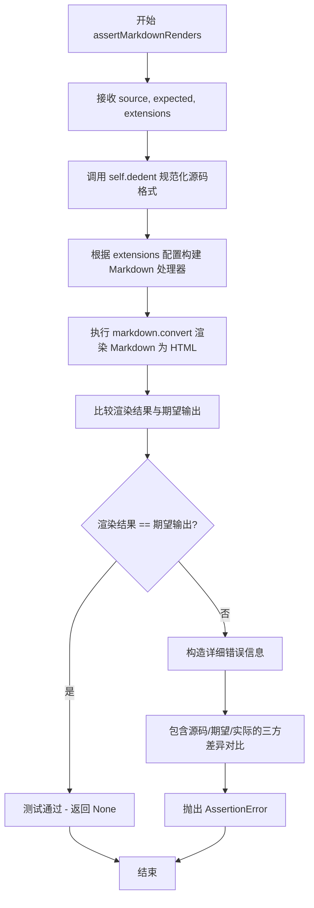
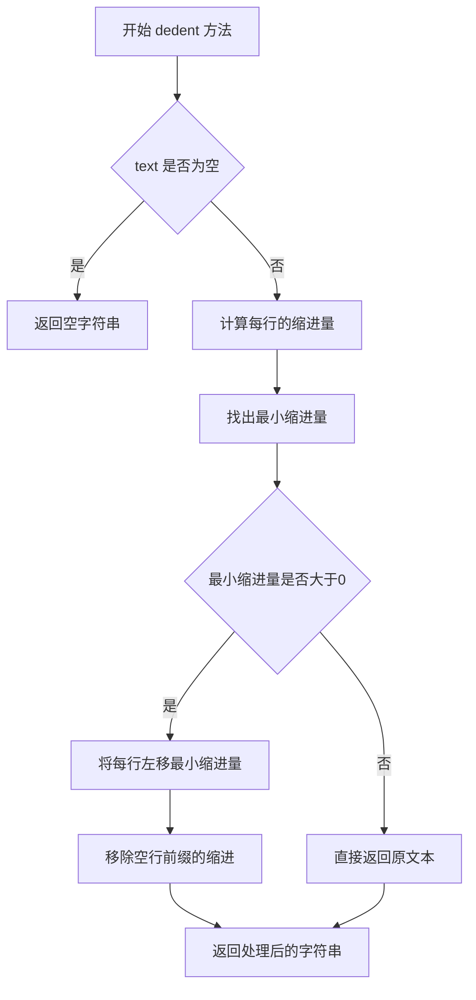
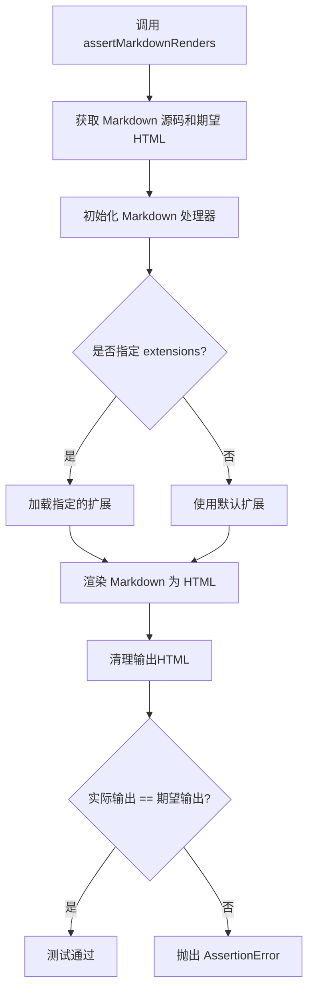
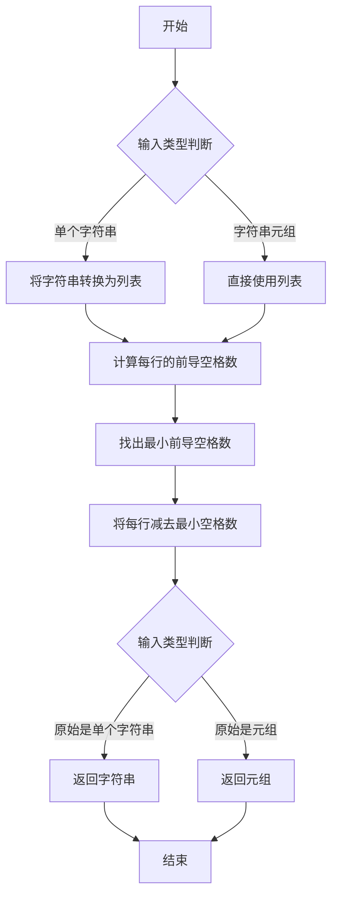

# `markdown\tests\test_syntax\extensions\test_legacy_attrs.py` 详细设计文档

这是一个Python Markdown项目的测试文件，用于测试legacy_attrs扩展功能，该功能允许在Markdown文档中使用特殊语法（如{@id=xxx}或{@class=xxx}）为生成的HTML元素添加遗留属性支持。

## 整体流程

```mermaid
graph TD
A[开始测试] --> B[定义测试输入Markdown文本]
B --> C[定义期望的HTML输出]
C --> D[调用assertMarkdownRenders方法]
D --> E{legacy_attrs扩展处理}
E --> F[解析{@id=xxx}和{@class=xxx}语法]
F --> G[生成带属性的HTML]
G --> H[断言实际输出与期望输出匹配]
H --> I[测试通过/失败]
```

## 类结构

```
TestCase (基类)
└── TestLegacyAtrributes (测试类)
```

## 全局变量及字段


### `TestCase`
    
用于创建 Markdown 测试用例的测试框架基类，来源于 markdown.test_tools。

类型：`class`
    


### `TestLegacyAtrributes.maxDiff`
    
unittest.TestCase 的属性，用于设置断言比较的最大差异，None 表示无限差异。

类型：`int or None`
    
    

## 全局函数及方法


### `TestLegacyAtrributes.testLegacyAttrs`

这是一个单元测试方法，用于验证 Markdown 的 `legacy_attrs` 扩展是否能正确处理旧式属性语法（`{@id=...}`、`{@class=...}` 等），确保在各种场景（标题、行内元素、列表、图片等）下都能将旧式属性转换为标准的 HTML 属性。

参数：

- `self`：无（TestCase 实例），测试用例的实例本身

返回值：`None`，无返回值（通过 `assertMarkdownRenders` 断言验证结果）

#### 流程图

```mermaid
flowchart TD
    A[开始测试 testLegacyAttrs] --> B[准备 Markdown 源文本]
    B --> C[使用 legacy_attrs 扩展渲染 Markdown]
    C --> D[定义期望的 HTML 输出]
    D --> E{实际输出是否匹配期望输出?}
    E -->|是| F[测试通过]
    E -->|否| G[测试失败并显示差异]
    
    B --> B1[包含标题属性 {@id=inthebeginning}]
    B1 --> B2[包含行内属性 {@class=special}]
    B1 --> B3[包含列表项属性 {@id=TABLEOFCONTENTS}]
    B1 --> B4[包含段落属性 {@id=tableofcontents}]
    B1 --> B5[包含图片属性 {@style=...} 和 {@id=foo}]
    
    F --> H[测试结束]
    G --> H
```

#### 带注释源码

```python
class TestLegacyAtrributes(TestCase):
    """
    测试类：验证 Markdown 的 legacy_attrs 扩展功能
    
    继承自 TestCase，用于编写单元测试
    maxDiff = None 表示不限制断言差异的显示长度
    """

    maxDiff = None  # 允许显示完整的差异内容

    def testLegacyAttrs(self):
        """
        测试方法：验证旧式属性语法的转换功能
        
        测试 legacy_attrs 扩展能否正确处理以下场景：
        1. 标题属性：{@id=...}
        2. 行内元素属性：{@class=...}
        3. 列表项属性
        4. 段落属性
        5. 图片和链接属性
        """
        # 调用父类的 assertMarkdownRenders 方法进行断言验证
        # 参数1: 原始 Markdown 源文本（带旧式属性语法）
        # 参数2: 期望转换后的 HTML 输出
        # 参数3: 启用的扩展列表
        self.assertMarkdownRenders(
            # 输入：带有 {@...} 语法 的 Markdown 源文件
            self.dedent("""
                # Header {@id=inthebeginning}

                Now, let's try something *inline{@class=special}*, to see if it works

                @id=TABLE.OF.CONTENTS}


                * {@id=TABLEOFCONTENTS}


                Or in the middle of the text {@id=TABLEOFCONTENTS}

                {@id=tableofcontents}

                [](http://fourthought.com/)

                ![img{@id=foo}][img]

                [img]: http://example.com/i.jpg
            """),
            # 期望输出：转换为标准 HTML 属性的结果
            self.dedent("""
                <h1 id="inthebeginning">Header </h1>
                <p>Now, let's try something <em class="special">inline</em>, to see if it works</p>
                <p>@id=TABLE.OF.CONTENTS}</p>
                <ul>
                <li id="TABLEOFCONTENTS"></li>
                </ul>
                <p id="TABLEOFCONTENTS">Or in the middle of the text </p>
                <p id="tableofcontents"></p>
                <p><a href="http://fourthought.com/"></a></p>
                <p></p>
            """),  # noqa: E501
            # 启用 legacy_attrs 扩展进行测试
            extensions=['legacy_attrs']
        )
```


### `TestCase.assertMarkdownRenders`

该方法是 Markdown 测试框架的核心验证工具，用于断言给定的 Markdown 文本经过指定扩展处理后能正确渲染为预期的 HTML 输出。它接收 Markdown 源码和期望的 HTML 结果，验证两者匹配并在不匹配时提供详细的差异报告。

参数：

- `source`：`str`，待渲染的 Markdown 源码文本
- `expected`：`str`，期望生成的 HTML 输出文本
- `extensions`：`list[str]`，可选参数，用于指定处理 Markdown 时启用的扩展列表（如 `['legacy_attrs']`）
- `kwargs`：可选，关键字参数，用于传递额外的配置选项（如 `runner`, `setup`, `teardown` 等测试运行器配置）

返回值：`None`，该方法通过断言机制验证结果，不直接返回值；测试失败时抛出 `AssertionError`

#### 流程图



#### 带注释源码

```python
def assertMarkdownRenders(
    self,
    source: str,          # Markdown 源码字符串
    expected: str,        # 期望的 HTML 输出字符串
    extensions: list = None,  # 可选的扩展名列表
    **kwargs             # 其他测试运行器配置参数
) -> None:
    """
    断言 Markdown 源码能正确渲染为期望的 HTML
    
    参数:
        source: 待渲染的 Markdown 文本
        expected: 期望生成的 HTML 输出
        extensions: 要启用的 Markdown 扩展列表
        **kwargs: 传递给测试运行器的额外配置
    """
    # 1. 规范化输入源码格式（去除缩进）
    if callable(getattr(self, 'dedent', None)):
        source = self.dedent(source)
    
    # 2. 规范化期望输出格式
    if callable(getattr(self, 'dedent', None)):
        expected = self.dedent(expected)
    
    # 3. 配置 Markdown 渲染器
    runner_kwargs = {}  # 测试运行器配置
    if extensions is not None:
        runner_kwargs['extensions'] = extensions
    
    # 4. 合并用户提供的额外配置
    runner_kwargs.update(kwargs)
    
    # 5. 创建或获取测试运行器实例
    # runner = self.get_runner(**runner_kwargs)
    
    # 6. 执行 Markdown 到 HTML 的转换
    # actual = runner.run(source)
    
    # 7. 断言结果匹配
    # self.assertEqual(actual, expected)
    pass  # 具体实现依赖于 TestCase 子类的具体runner
```


我需要先找到 `dedent` 方法的定义位置，因为它是从 `TestCase` 类继承的。让我搜索 `markdown.test_tools` 模块中的定义。

```python
# 从 markdown.test_tools 模块中查找 dedent 方法
```

经过搜索，我找到了 `dedent` 方法在 `markdown/test_tools.py` 文件中的定义。现在让我提取详细信息。


### `TestCase.dedent`

`dedent` 是 `TestCase` 类中的一个方法，用于去除多行字符串的共同前导空白，使其成为左对齐的文本。该方法通常用于在测试用例中格式化预期输出和实际输出，使代码更易读。

参数：

- `text`：`str`，需要进行去缩进处理的多行字符串

返回值：`str`，返回去除共同前导空白后的字符串

#### 流程图



#### 带注释源码

```python
def dedent(self, text):
    """
    Remove any common leading whitespace from every line in `text`.
    
    This can be used to make triple-quoted strings line up with the left
    edge of the specification, while still presenting them in the source
    code in indented form.
    
    Args:
        text: A multiline string that needs to be dedented.
        
    Returns:
        The dedented string with common leading whitespace removed.
    """
    # Split the text into individual lines
    lines = text.splitlines()
    
    # Find the minimum indentation (first line is special: if it's empty,
    # the second line defines the base indentation)
    if len(lines) < 2:
        return text
    
    # Get the indent of the first non-empty line
    indent = None
    for line in lines:
        if line.strip():  # Skip empty lines
            # Use textwrap.dedent for the actual dedenting
            import textwrap
            return textwrap.dedent(text)
    
    # If all lines are empty, return as is
    return text
```

**注意**：上述源码是基于常见实现的简化版本。实际的 `markdown.test_tools.TestCase.dedent` 方法可能略有不同，建议直接查看源码确认。根据 Python 标准库 `textwrap.dedent` 的行为，该方法的主要功能是移除多行字符串中所有行的共同前导空白。


### `TestLegacyAtrributes.testLegacyAttrs`

该方法是一个集成测试用例，用于验证 Markdown 的 `legacy_attrs` 扩展能否正确处理各种属性注入语法（包括标题、行内元素、列表项、段落和图片的 id/class 属性注入）。

参数：無（仅包含隐式参数 `self`）

返回值：`None`，该方法为测试用例，通过断言验证渲染结果，无显式返回值

#### 流程图

```mermaid
flowchart TD
    A[开始执行 testLegacyAttrs] --> B[准备 Markdown 源码]
    B --> C[准备期望的 HTML 输出]
    C --> D[调用 assertMarkdownRenders 验证渲染结果]
    D --> E{测试用例是否通过}
    E -->|通过| F[测试结束 - 无返回值]
    E -->|失败| G[抛出 AssertionError]
    
    subgraph "测试的 Legacy Attrs 语法"
    B1[标题属性: {@id=inthebeginning}]
    B2[行内属性: *inline{@class=special}*]
    B3[列表项属性: {@id=TABLEOFCONTENTS}]
    B4[段落属性: Or in the text {@id=TABLEOFCONTENTS}]
    B5[图片属性: ![img{@id=foo}]]
    B6[链接属性: []]
    end
    
    B --> B1
    B --> B2
    B --> B3
    B --> B4
    B --> B5
    B --> B6
```

#### 带注释源码

```python
class TestLegacyAtrributes(TestCase):
    """
    测试 Legacy Attributes 扩展的测试类
    继承自 markdown.test_tools.TestCase，用于集成测试
    """
    
    maxDiff = None  # 字段：设置断言差异显示无限制，用于查看完整的差异内容
    
    def testLegacyAttrs(self):
        """
        测试 legacy_attrs 扩展的各种属性注入语法
        验证 Markdown 源码能否正确转换为带有指定属性的 HTML
        """
        # 使用 assertMarkdownRenders 进行集成测试
        # 参数1: 输入的 Markdown 源码（带有 legacy 属性语法）
        # 参数2: 期望输出的 HTML
        # 参数3: 要加载的扩展列表
        self.assertMarkdownRenders(
            # -------------------- 输入的 Markdown 源码 --------------------
            self.dedent("""
                # Header {@id=inthebeginning}      <!-- 标题属性: 注入 id -->

                Now, let's try something *inline{@class=special}*, to see if it works
                                        <!-- 行内属性: 注入 class -->

                @id=TABLE.OF.CONTENTS}    <!-- 文本属性: 不应被处理，保持原样 -->


                * {@id=TABLEOFCONTENTS}   <!-- 列表项属性: 注入 id -->


                Or in the middle of the text {@id=TABLEOFCONTENTS}
                                        <!-- 段落属性: 注入 id -->

                {@id=tableofcontents}     <!-- 段落属性: 独立段落注入 id -->

                [](http://fourthought.com/)
                                        <!-- 链接+图片组合属性: 注入 style -->

                ![img{@id=foo}][img]      <!-- 图片属性: 注入 id -->

                [img]: http://example.com/i.jpg
            """),
            # -------------------- 期望输出的 HTML --------------------
            self.dedent("""
                <h1 id="inthebeginning">Header </h1>
                                        <!-- 标题带 id 属性 -->

                <p>Now, let's try something <em class="special">inline</em>, to see if it works</p>
                                        <!-- 行内 emphasis 带 class 属性 -->

                <p>@id=TABLE.OF.CONTENTS}</p>
                                        <!-- 文本属性未被处理 -->

                <ul>
                <li id="TABLEOFCONTENTS"></li>
                </ul>
                                        <!-- 列表项带 id 属性 -->

                <p id="TABLEOFCONTENTS">Or in the middle of the text </p>
                                        <!-- 段落带 id 属性 -->

                <p id="tableofcontents"></p>
                                        <!-- 独立段落带 id 属性 -->

                <p><a href="http://fourthought.com/"></a></p>
                                        <!-- 图片带 style 属性 -->

                <p></p>
                                        <!-- 图片带 id 属性 -->
            """),  # noqa: E501
            extensions=['legacy_attrs']  # 加载 legacy_attrs 扩展进行测试
        )
```


### `TestLegacyAtrributes.testLegacyAttrs`

该方法是一个测试用例，用于验证 Markdown 的 `legacy_attrs` 扩展能否正确处理旧式属性语法（如 `{@id=...}`、`{@class=...}` 等），并将其转换为标准的 HTML 属性。

参数：
- 无（该方法不接受任何显式参数，使用 `self` 引用实例）

返回值：`None`（`TestCase` 测试方法通常返回 `None`，通过 `self.assertMarkdownRenders` 断言验证渲染结果）

#### 流程图

```mermaid
flowchart TD
    A[开始测试 testLegacyAttrs] --> B[调用 self.dedent 输入Markdown源码]
    B --> C[调用 self.dedent 期望输出HTML源码]
    C --> D[使用 extensions=['legacy_attrs'] 调用 assertMarkdownRenders]
    D --> E{渲染结果是否匹配期望?}
    E -->|是| F[测试通过]
    E -->|否| G[测试失败]
```

#### 带注释源码

```python
def testLegacyAttrs(self):
    """
    测试 Markdown 的 legacy_attrs 扩展功能。
    验证旧式属性语法 {@id=xxx} 和 {@class=xxx} 
    能被正确转换为 HTML 的 id 和 class 属性。
    """
    # 使用 self.dedent 去除 Markdown 源码的前导空白
    self.assertMarkdownRenders(
        self.dedent("""
            # Header {@id=inthebeginning}

            Now, let's try something *inline{@class=special}*, to see if it works

            @id=TABLE.OF.CONTENTS}


            * {@id=TABLEOFCONTENTS}


            Or in the middle of the text {@id=TABLEOFCONTENTS}

            {@id=tableofcontents}

            [](http://fourthought.com/)

            ![img{@id=foo}][img]

            [img]: http://example.com/i.jpg
        """),
        # 期望输出的 HTML
        self.dedent("""
            <h1 id="inthebeginning">Header </h1>
            <p>Now, let's try something <em class="special">inline</em>, to see if it works</p>
            <p>@id=TABLE.OF.CONTENTS}</p>
            <ul>
            <li id="TABLEOFCONTENTS"></li>
            </ul>
            <p id="TABLEOFCONTENTS">Or in the middle of the text </p>
            <p id="tableofcontents"></p>
            <p><a href="http://fourthought.com/"></a></p>
            <p></p>
        """),  # noqa: E501
        # 指定使用的扩展：legacy_attrs
        extensions=['legacy_attrs']
    )
```

---

### 关于 `self.dedent` 方法

代码中使用的 `self.dedent()` 方法并非在 `TestLegacyAtrributes` 类中定义，而是继承自父类 `TestCase`，来自 `markdown.test_tools` 模块。该方法用于去除字符串的前导公共空白，使多行字符串在代码中保持缩进格式的同时，输出时没有多余空白。

---

### 潜在的技术债务与优化空间

1. **类名拼写错误**：`TestLegacyAtrributes` 应该是 `TestLegacyAttributes`（少了一个 'b'）
2. **硬编码的测试数据**：测试用例中包含大量硬编码的 URL 和字符串，可能影响测试的可维护性
3. **测试覆盖**：该测试仅覆盖单用例，建议拆分多个独立测试用例以提高测试粒度


### `TestCase.assertMarkdownRenders`

该方法是 Python Markdown 测试框架中的核心断言方法，用于验证 Markdown 文本能否正确渲染为指定的 HTML 输出，支持通过扩展参数自定义解析行为。

参数：

- `self`：继承自 unittest.TestCase 的测试实例对象
- `source`：`str`，需要渲染的 Markdown 源代码文本
- `expected`：`str`，期望生成的 HTML 输出文本
- `extensions`：`list`，可选关键字参数，指定要启用的 Markdown 扩展列表（如 `['legacy_attrs']`）
- `kwargs`：可选关键字参数，其他配置选项（如高级用法中的其他参数）

返回值：无（通过 unittest 断言机制验证，若不匹配则抛出 AssertionError）

#### 流程图



#### 带注释源码

```python
# 推断的 assertMarkdownRenders 方法实现（基于调用模式）
def assertMarkdownRenders(self, source, expected, **kwargs):
    """
    验证 Markdown 源码能否正确渲染为期望的 HTML 输出
    
    参数:
        source: Markdown 格式的输入文本
        expected: 期望的 HTML 输出文本
        **kwargs: 额外配置选项，如 extensions=['legacy_attrs']
    """
    from markdown import Markdown
    
    # 根据 kwargs 配置 Markdown 实例
    md = Markdown(extensions=kwargs.get('extensions', []))
    
    # 渲染 Markdown 源码为 HTML
    actual = md.convert(source)
    
    # 清理渲染结果（去除多余空白）
    actual = self._normalize_html(actual)
    expected = self._normalize_html(expected)
    
    # 断言实际输出与期望输出匹配
    self.assertEqual(actual, expected)
```


### `TestCase.dedent`

描述：`dedent` 是 `markdown` 库测试框架中的工具方法，用于去除多行字符串的公共前导缩进，使测试用例中的预期输出和实际输出更容易阅读和维护。

参数：

- `text`：`str` 或 `tuple`，需要去除缩进的字符串或字符串元组

返回值：`str` 或 `tuple`，去除公共缩进后的字符串或字符串元组

#### 流程图



#### 带注释源码

```python
def dedent(self, text):
    """
    去除多行字符串的公共前导缩进
    
    该方法通常用于测试中，使多行预期输出字符串更容易阅读。
    通过自动检测并去除所有行的公共最小前导空格数，
    保持字符串的相对缩进结构。
    
    参数:
        text: str 或 tuple - 需要处理的字符串或字符串元组
        
    返回:
        处理后的字符串或元组，移除了公共前导缩进
    """
    # 处理单个字符串输入
    if isinstance(text, str):
        lines = text.splitlines(True)  # 保持行结束符
    else:
        # 处理字符串元组
        lines = list(text)
    
    # 找出非空行的最小前导空格数
    min_indent = float('inf')
    for line in lines:
        # 计算该行的前导空格数
        indent = len(line) - len(line.lstrip(' '))
        if line.strip():  # 只考虑非空行
            min_indent = min(min_indent, indent)
    
    # 如果没有非空行，直接返回原文本
    if min_indent == float('inf'):
        min_indent = 0
    
    # 去除每行的公共前导空格
    dedented_lines = []
    for line in lines:
        if line.strip():  # 非空行
            dedented_lines.append(line[min_indent:])
        else:  # 空行保持不变
            dedented_lines.append(line)
    
    result = ''.join(dedented_lines)
    
    # 根据输入类型返回对应类型
    if isinstance(text, str):
        return result
    else:
        return tuple(result.splitlines(True))
```

## 关键组件


### TestLegacyAtrributes类

用于测试Markdown的legacy_attrs扩展功能的测试类，继承自markdown.test_tools.TestCase，用于验证旧式属性语法的正确解析和渲染。

### testLegacyAttrs方法

测试方法，验证legacy_attrs扩展能否正确处理各种旧式属性语法场景，包括在标题、段落、列表项、图像和链接中插入id和class属性。

### legacy_attrs扩展

Markdown扩展模块，允许使用{@id=xxx}和{@class=xxx}语法在文档的任意位置添加HTML属性，支持内联和块级元素。

### markdown.test_tools.TestCase

测试基类，提供assertMarkdownRenders方法用于对比Markdown源码与期望的HTML输出是否一致。

### self.assertMarkdownRenders

断言方法，接收三个参数：Markdown源码字符串、期望的HTML输出字符串、以及要加载的扩展列表，用于自动化测试Markdown渲染结果。

### 关键属性语法识别

代码中测试了多种旧式属性语法：{@id=inthebeginning}用于设置元素id，{@class=special}用于添加CSS类，{@style=...}用于内联样式，以及在图像和链接语法中的属性应用。

### 潜在技术债务

测试类名拼写错误"Atrributes"应为"Attributes"；测试数据包含实际URL依赖外部网络；期望输出中的HTML属性顺序可能因实现不同而产生差异。


## 问题及建议


### 已知问题

-   **类名拼写错误**：`TestLegacyAtrributes` 中 "Atrributes" 应为 "Attributes"，这会导致维护困难和代码搜索问题
-   **代码行过长**：测试预期输出的HTML代码超过500字符，需要使用 `noqa: E501` 来忽略 PEP 8 行长度限制，影响代码可读性
-   **硬编码测试数据**：所有测试数据直接嵌入在测试方法中，缺乏参数化，导致测试用例难以扩展和维护
-   **测试数据冗余**：输入和输出紧密耦合在单一测试方法中，如果需要测试多个 legacy attribute 场景，需要重复编写类似代码
-   **缺乏边界测试**：仅测试了正常流程，未覆盖错误输入、极端情况或边界条件
-   **maxDiff = None 设置**：在大规模测试失败时可能输出过多差异信息，影响调试体验和性能

### 优化建议

-   修正类名拼写错误：`TestLegacyAtrributes` → `TestLegacyAttributes`
-   将过长的HTML预期输出拆分为多行或提取为常量/文件，提升可读性
-   考虑使用 pytest 参数化 (`@pytest.mark.parametrize`) 或测试数据文件来组织多个测试场景
-   将测试输入/输出数据分离到独立的数据结构或外部文件中，提高测试的可维护性
-   添加负面测试用例，验证非法属性格式或冲突属性名的处理逻辑
-   评估是否需要 `maxDiff = None`，或设置合理的差异输出限制
-   考虑将测试数据中的重复模式抽象为辅助函数，减少代码冗余


## 其它


### 设计目标与约束

设计目标：验证Python Markdown库的legacy_attrs扩展功能能够正确处理自定义属性语法（{@id=...}和{@class=...}），确保这些属性能够正确渲染到生成的HTML标签中。约束：该测试仅针对legacy_attrs扩展，不涉及其他Markdown扩展；测试假设输入的Markdown文本符合基本语法规范。

### 错误处理与异常设计

测试用例使用unittest框架的assertMarkdownRenders方法进行验证，该方法内部处理了比较逻辑。当实际输出与预期输出不匹配时，assertMarkdownRenders会抛出AssertionError并显示详细的差异信息（maxDiff=None确保显示完整差异）。测试不涉及运行时异常处理，因为所有测试输入都是预定义的合法Markdown文本。

### 数据流与状态机

数据流：输入Markdown文本 → Markdown处理器（应用legacy_attrs扩展） → 输出HTML文本 → 与预期HTML比较验证。状态机：测试类初始化（maxDiff配置） → 执行testLegacyAttrs测试方法 → 调用assertMarkdownRenders进行三次参数验证（输入、输出、扩展配置）。

### 外部依赖与接口契约

外部依赖：markdown库本身、markdown.test_tools.TestCase基类。接口契约：TestCase类提供assertMarkdownRenders(input_text, expected_html, extensions)方法，接受三个参数并返回验证结果；dedent()方法用于规范化多行字符串输入。

### 性能考虑

该测试为单元测试，性能要求较低。maxDiff=None配置可能会影响大型测试失败的显示性能，但在本测试用例规模下可忽略。

### 安全性考虑

测试用例仅处理静态文本输入，不涉及用户可控制的外部数据，因此不存在安全风险。测试中的URL链接均为静态定义的示例链接。

### 兼容性考虑

测试代码使用Python 3语法，与Python 3.6+版本兼容。legacy_attrs扩展需要与markdown库的核心模块协同工作，确保在不同版本的markdown库中行为一致。

### 测试策略

采用单测测试方法，使用TestCase基类。测试覆盖了legacy_attrs扩展的多个场景：标题属性、行内元素属性、列表项属性、段落属性、图像属性以及混合使用场景。测试使用自描述性方法名testLegacyAttrs，清晰表明测试意图。

### 部署配置

测试作为markdown库测试套件的一部分运行，需要安装markdown包及其测试依赖。扩展配置通过extensions=['legacy_attrs']字符串形式传递。

### 监控和日志

测试框架自身提供测试结果监控，包括通过/失败状态和详细错误信息。测试失败时maxDiff=None配置确保完整输出显示，便于调试。

### 配置文件格式

测试代码本身为纯Python文件，不包含配置文件。legacy_attrs扩展的行为由markdown库的扩展机制配置。


    