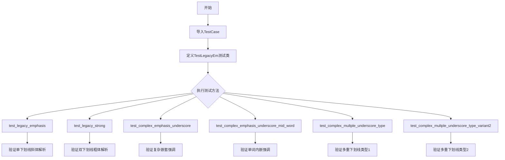
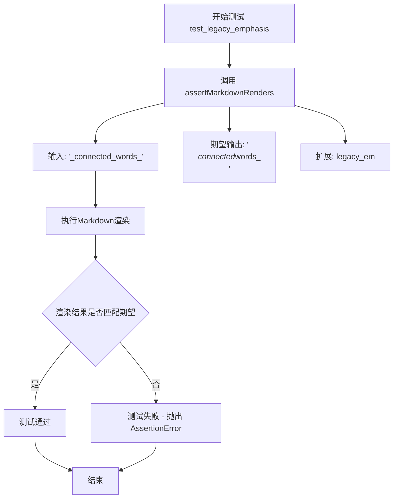
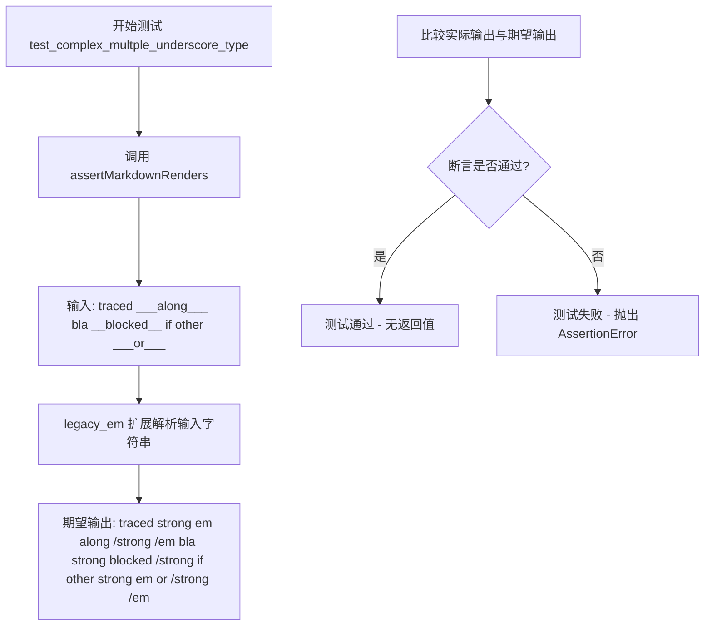
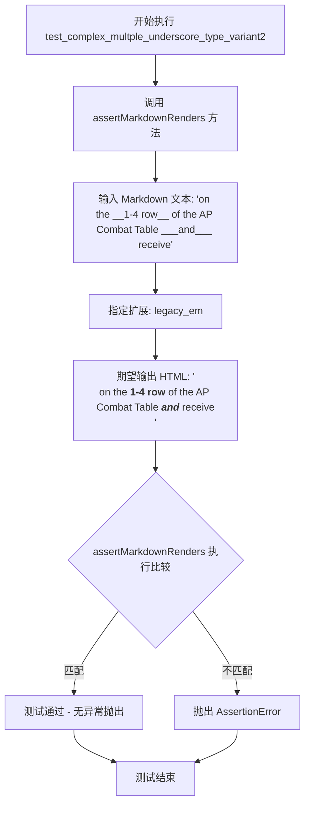

# `markdown\tests\test_syntax\extensions\test_legacy_em.py` 详细设计文档

这是一个Python Markdown库的测试文件，用于测试legacy emphasis（传统强调）扩展功能，验证不同场景下下划线字符在表示斜体和粗体时的解析行为是否符合预期。

## 整体流程



## 类结构

```
TestCase (markdown.test_tools)
└── TestLegacyEm
    ├── test_legacy_emphasis
    ├── test_legacy_strong
    ├── test_complex_emphasis_underscore
    ├── test_complex_emphasis_underscore_mid_word
    ├── test_complex_multple_underscore_type
    └── test_complex_multple_underscore_type_variant2
```

## 全局变量及字段


### `TestCase`
    
从markdown.test_tools导入的测试基类，提供assertMarkdownRenders等测试辅助方法

类型：`class`
    


    

## 全局函数及方法


### `TestLegacyEm.test_legacy_emphasis`

该测试方法用于验证Markdown的legacy_em扩展能否正确处理下划线（underscore）强调语法，特别是针对连续单词之间的下划线是否被正确解析为强调标签。

参数：

- `self`：`TestCase`，测试类实例本身

返回值：`None`，无返回值（测试方法）

#### 流程图



#### 带注释源码

```python
def test_legacy_emphasis(self):
    """
    测试 legacy_em 扩展对下划线强调语法的处理。
    
    验证规则：
    - 连续的单词之间的下划线应被解析为 <em> 标签的开始
    - 但由于是连续单词，第二个下划线不会被识别为结束标签
    - 因此只有第一个单词被包裹在 <em> 中，保留未闭合的下划线
    """
    self.assertMarkdownRenders(
        '_connected_words_',  # 输入：带下划线的连续单词
        '<p><em>connected</em>words_</p>',  # 期望输出：只有connected被强调
        extensions=['legacy_em']  # 使用 legacy_em 扩展进行测试
    )
```


### `TestLegacyEm.test_legacy_strong`

该方法是 Python Markdown 项目中的一个单元测试，用于验证 `legacy_em` 扩展在处理双下划线（`__`）时的遗留行为。具体来说，它测试当输入包含双下划线时，是否能正确渲染为 `<strong>` 标签，同时保留后续的下划线字符。

#### 参数

- `self`：`TestLegacyEm`（隐式参数），测试类实例本身，无需显式传递

#### 返回值

- `None`，该方法为测试用例，通过 `assertMarkdownRenders` 执行断言，测试失败时抛出异常

#### 流程图

```mermaid
flowchart TD
    A[开始执行 test_legacy_strong] --> B[调用 assertMarkdownRenders 方法]
    B --> C[传入参数: 输入字符串 '__connected__words__']
    B --> D[传入参数: 期望输出 '<p><strong>connected</strong>words__</p>']
    B --> E[传入参数: 扩展列表 ['legacy_em']]
    E --> F[执行 Markdown 渲染]
    F --> G{渲染结果 == 期望输出?}
    G -->|是| H[测试通过]
    G -->|否| I[抛出 AssertionError 异常]
```

#### 带注释源码

```python
def test_legacy_strong(self):
    """
    测试 legacy_em 扩展处理双下划线 __ 的行为
    
    验证规则:
    - 双下划线 __text__ 应被渲染为 <strong>text</strong>
    - 但连续的双下划线（如 __text__words__）中，第二组 __ 不应被渲染
    - 这符合 legacy（遗留）行为：只在特定条件下匹配
    """
    # 使用 assertMarkdownRenders 验证 Markdown 渲染结果
    self.assertMarkdownRenders(
        '__connected__words__',           # 输入: Markdown 源文本，包含双下划线
        '<p><strong>connected</strong>words__</p>',  # 期望输出: HTML 片段
        extensions=['legacy_em']          # 启用 legacy_em 扩展进行测试
    )
```


### `TestLegacyEm.test_complex_emphasis_underscore`

该测试方法用于验证 Markdown 库的 `legacy_em` 扩展在处理复杂下划线强调（嵌套的 `<strong>` 和 `<em>` 标签）时的正确性，确保带有下划线的文本能正确渲染为 HTML 强调标签。

参数：

- `self`：`TestCase`，测试类的实例本身，用于调用继承自父类的测试方法

返回值：`None`，该方法为测试方法，无返回值，通过 `assertMarkdownRenders` 断言验证渲染结果

#### 流程图

```mermaid
flowchart TD
    A[开始测试 test_complex_emphasis_underscore] --> B[调用 assertMarkdownRenders 方法]
    B --> C[传入参数: 输入文本 'This is text __bold _italic bold___ with more text']
    B --> D[传入参数: 期望输出 '<p>This is text <strong>bold <em>italic bold</em></strong> with more text</p>']
    B --> E[传入参数: 扩展列表 ['legacy_em'] assertMarkdownRenders 方法内部]
    E --> F[创建 Markdown 实例并加载 legacy_em 扩展]
    F --> G[执行 Markdown 转换]
    G --> H{转换结果是否匹配期望输出?}
    H -->|是| I[测试通过 - 断言成功]
    H -->|否| J[测试失败 - 抛出 AssertionError]
    I --> K[结束测试]
    J --> K
```

#### 带注释源码

```python
def test_complex_emphasis_underscore(self):
    """
    测试 legacy_em 扩展处理复杂下划线强调的能力。
    
    验证嵌套的 __bold _italic bold___ 模式能正确渲染为：
    <strong>bold <em>italic bold</em></strong>
    """
    # 调用父类方法 assertMarkdownRenders 验证 Markdown 渲染结果
    # 参数1: 输入的 Markdown 原始文本
    # 参数2: 期望渲染的 HTML 输出
    # 参数3: extensions 关键字参数，指定使用的扩展列表
    self.assertMarkdownRenders(
        'This is text __bold _italic bold___ with more text',  # 输入: 包含复杂嵌套强调的文本
        '<p>This is text <strong>bold <em>italic bold</em></strong> with more text</p>',  # 期望: 正确的HTML输出
        extensions=['legacy_em']  # 使用 legacy_em 扩展处理下划线强调
    )
```


### `TestLegacyEm.test_complex_emphasis_underscore_mid_word`

该测试方法用于验证 Markdown 的 legacy_em 扩展在处理单词中间出现的复杂下划线强调语法时的正确性。具体测试场景为：当文本中存在 `__bold_italic bold___` 这种混合双下划线和单下划线的强调标记时，legacy_em 扩展能否正确将其解析为嵌套的 `<strong>` 和 `<em>` 标签。

参数：

- `self`：`TestCase`，TestLegacyEm 类实例本身，包含测试所需的上下文和断言方法

返回值：`None`，该方法为测试方法，通过 assertMarkdownRenders 进行断言验证，不显式返回值

#### 流程图

```mermaid
flowchart TD
    A[开始测试] --> B[调用assertMarkdownRenders方法]
    B --> C[传入源文本: 'This is text __bold_italic bold___ with more text']
    B --> D[传入期望HTML: '<p>This is text <strong>bold<em>italic bold</em></strong> with more text</p>']
    B --> E[传入扩展参数: extensions=['legacy_em']]
    C --> F{执行Markdown转换}
    D --> F
    E --> F
    F --> G[使用legacy_em扩展解析文本]
    G --> H[将__bold_italic bold___转换为<strong>bold<em>italic bold</em></strong>]
    H --> I{实际输出 == 期望输出?}
    I -->|是| J[测试通过]
    I -->|否| K[抛出AssertionError]
    J --> L[测试结束]
    K --> L
```

#### 带注释源码

```python
def test_complex_emphasis_underscore_mid_word(self):
    """
    测试 legacy_em 扩展处理单词中间复杂下划线强调的能力。
    
    测试场景：输入包含 '__bold_italic bold___' 这样的混合下划线语法
    - __ 开头表示 strong 强调的开始
    - _ 在 __ 内部且位于 bold 后面，表示 em 强调
    - ___ 表示 strong 和 em 强调的结束
    """
    # 调用父类 TestCase 的 assertMarkdownRenders 方法进行断言验证
    self.assertMarkdownRenders(
        # 第一个参数：源 Markdown 文本，包含复杂的下划线强调语法
        'This is text __bold_italic bold___ with more text',
        
        # 第二个参数：期望渲染输出的 HTML 内容
        # 解析规则：__bold_italic bold___ 被解析为：
        # - <strong> 包裹整个 'bold<em>italic bold</em>'
        # - <em> 包裹 'italic bold'（位于 bold 之后）
        '<p>This is text <strong>bold<em>italic bold</em></strong> with more text</p>',
        
        # 第三个参数：使用的扩展列表
        # legacy_em 扩展支持旧的下划线强调语法
        extensions=['legacy_em']
    )
```


### `TestLegacyEm.test_complex_multple_underscore_type`

该测试方法用于验证 `legacy_em` 扩展在处理多重下划线组合（如下划线与双下划线混合）时的渲染正确性，确保 `___along___`、`__blocked__`、`___or___` 等模式能被正确解析为 `<strong><em>`、`<strong>`、`<strong><em>` 等 HTML 标签组合。

参数：

- `self`：`TestCase`，隐式参数，测试类实例本身，用于访问继承自 `TestCase` 的断言方法

返回值：`None`，该方法为测试方法，不返回任何值，通过 `self.assertMarkdownRenders` 执行断言验证

#### 流程图



#### 带注释源码

```python
def test_complex_multple_underscore_type(self):
    """
    测试 legacy_em 扩展处理多重下划线类型组合的渲染结果。
    
    验证场景：
    - '___along___' 应被解析为 <strong><em>along</em></strong>
    - '__blocked__' 应被解析为 <strong>blocked</strong>
    - '___or___' 应被解析为 <strong><em>or</em></strong>
    """
    # 使用 assertMarkdownRenders 验证 Markdown 渲染结果
    # 参数1: 输入的 Markdown 文本（包含多重下划线组合）
    # 参数2: 期望的 HTML 输出
    # extensions=['legacy_em']: 启用 legacy_em 扩展处理下划线优先级
    self.assertMarkdownRenders(
        'traced ___along___ bla __blocked__ if other ___or___',
        '<p>traced <strong><em>along</em></strong> bla <strong>blocked</strong> if other <strong><em>or</em></strong></p>'  # noqa: E501
    )
```


### `TestLegacyEm.test_complex_multple_underscore_type_variant2`

该方法是 `TestLegacyEm` 测试类中的一个测试用例，用于验证 Markdown 库的 `legacy_em` 扩展在处理复杂的多下划线组合时的渲染正确性。具体测试场景为：输入包含单下划线双下划线和三下划线混合的文本，验证其能否正确转换为对应的 HTML 强调标签（`<em>` 和 `<strong>`）的嵌套结构。

参数：

- `self`：TestCase 实例，代表测试类本身，无额外参数描述

返回值：`None`，无返回值（unittest TestCase 测试方法的默认返回值）

#### 流程图



#### 带注释源码

```python
def test_complex_multple_underscore_type_variant2(self):
    """
    测试 legacy_em 扩展处理复杂多下划线组合的渲染能力。
    
    测试场景说明:
    - '__1-4 row__': 双下划线，渲染为 <strong>1-4 row</strong>
    - '___and___': 三下划线，渲染为 <strong><em>and</em></strong>（外层强强调+内层强调）
    
    这种组合测试了 legacy_em 扩展对不同下划线数量的处理优先级和嵌套逻辑。
    """

    # 调用父类 TestCase 的 assertMarkdownRenders 方法进行渲染验证
    # 参数1: 待渲染的 Markdown 文本
    # 参数2: 期望的 HTML 输出
    # 参数3: extensions 参数，指定使用的扩展列表（legacy_em 处理遗留的下划线强调语法）
    self.assertMarkdownRenders(
        'on the __1-4 row__ of the AP Combat Table ___and___ receive',  # 输入 Markdown
        '<p>on the <strong>1-4 row</strong> of the AP Combat Table <strong><em>and</em></strong> receive</p>',  # 期望 HTML 输出
        extensions=['legacy_em']  # 使用 legacy_em 扩展
    )
```

## 关键组件


### TestLegacyEm

测试类，用于验证 Markdown 的 legacy_em 扩展功能，测试各种下划线（_）和双下划线（__）在文本中的强调（italic）和粗体（strong）渲染行为。

### legacy_em 扩展

Markdown 扩展模块，处理传统的下划线强调语法，支持在单词中间或特定位置使用单下划线或双下划线进行斜体和粗体标记。

### assertMarkdownRenders

测试工具方法，来自 markdown.test_tools.TestCase，用于验证 Markdown 源码经过指定扩展处理后能正确渲染为预期的 HTML 输出。

### test_legacy_emphasis

测试方法，验证单下划线在连续单词中的传统强调行为，测试如 `_connected_words_` 的渲染结果。

### test_legacy_strong

测试方法，验证双下划线的传统粗体行为，测试如 `__connected__words__` 的渲染结果。

### test_complex_emphasis_underscore

测试方法，验证嵌套的强调标签（粗体包含斜体）的复杂渲染场景，处理 `__bold _italic bold___` 类型的混合语法。

### test_complex_emphasis_underscore_mid_word

测试方法，验证单词内部的强调语法，处理 `__bold_italic bold___` 这样在单词中间使用下划线的场景。

### test_complex_multple_underscore_type

测试方法，验证多个连续下划线的解析，测试多个独立的 `___along___` 和 `__blocked__` 组合的渲染结果。

### test_complex_multple_underscore_type_variant2

测试方法，验证混合数字和文字的下划线表达式，测试 `__1-4 row__` 和 `___and___` 等组合的渲染行为。


## 问题及建议


### 已知问题

-   **测试方法命名拼写错误**：方法名`test_complex_multple_underscore_type`和`test_complex_multple_underscore_type_variant2`中"multple"应为"multiple"，影响代码可读性和可维护性
-   **缺少文档注释**：所有测试方法均无docstring，无法快速了解各测试用例的验证目的和预期行为
-   **硬编码测试数据**：测试输入输出均以字符串字面量形式硬编码，缺乏参数化测试设计，导致扩展新测试用例时需新增方法，代码重复度高
-   **边界情况覆盖不足**：未覆盖空字符串、仅下划线字符、混合使用星号(*)与下划线(_)、连续多个分隔符等边界场景
-   **断言信息不够详细**：`assertMarkdownRenders`调用时未提供自定义错误消息，测试失败时定位问题不够直观
-   **缺少测试分组**：大量相似测试用例未进行逻辑分组或使用测试套件组织，不便于测试管理

### 优化建议

-   修复方法命名拼写错误，使用清晰的描述性命名如`test_multiple_underscores_in_text`
-   为每个测试方法添加docstring，说明测试的下划线组合场景和预期Markdown渲染结果
-   考虑使用pytest的`@pytest.mark.parametrize`装饰器实现参数化测试，将相似的测试用例合并为单一数据驱动的方法
-   补充边界测试用例：空输入、纯下划线字符串、"*_混用"场景、连续分隔符（如"____"）等
-   在断言中添加自定义错误消息，如`self.assertMarkdownRenders(..., msg="Legacy emphasis failed for input: ...")`
-   使用测试类或测试模块级别的setUp方法集中管理公共测试数据和配置，提高代码DRY原则

## 其它


### 设计目标与约束

本测试文件的设计目标是验证Python Markdown库的"legacy_em"扩展能够正确处理各种边缘情况的下划线强调语法，包括简单的下划线连接词、单词内嵌下划线、多重下划线组合以及与数字和单词的混合使用。约束条件包括：必须使用markdown.test_tools.TestCase基类、测试用例必须使用assertMarkdownRenders方法进行断言、必须加载legacy_em扩展。

### 错误处理与异常设计

测试用例主要通过assertMarkdownRenders方法验证Markdown到HTML的转换结果。当测试失败时，unittest框架会自动捕获AssertionError并提供详细的差异报告。测试文件中不涉及显式的异常捕获或错误处理逻辑，所有错误都交由测试框架统一管理。

### 数据流与状态机

测试数据流为：输入Markdown文本字符串 → Markdown处理器（加载legacy_em扩展）→ 输出HTML字符串 → 与预期结果比对。状态机转换包括：解析下划线标记 → 判断是否为强调开始/结束 → 嵌套处理 → 生成HTML标签。无显式状态机实现，状态转换由Markdown核心库处理。

### 外部依赖与接口契约

主要外部依赖包括：markdown库（核心转换引擎）、markdown.test_tools模块（提供TestCase基类和assertMarkdownRenders方法）、legacy_em扩展（待测试的扩展模块）。接口契约方面：TestCase类需实现assertMarkdownRenders(source, expected, extensions=None)方法；legacy_em扩展需实现Markdown转换接口。

### 性能要求与基准

由于这是单元测试文件，性能要求相对宽松。单个测试方法执行时间应在秒级以内，整体测试套件执行时间应在分钟级以内。暂无明确的性能基准测试需求。

### 兼容性考虑

测试文件需要兼容Python 3.x版本（具体版本范围需参考Python Markdown项目要求）。legacy_em扩展需与Python Markdown的不同版本兼容。测试用例验证的是标准Markdown语法在不同上下文中的表现。

### 配置与扩展性

测试配置通过extensions参数指定，当前仅使用legacy_em扩展。扩展性方面：可以轻松添加新的测试用例到TestLegacyEm类中；可以添加新的扩展测试类继承TestCase；可以通过参数化测试减少重复代码。

### 测试策略与覆盖率

测试策略采用单元测试方式，针对legacy_em扩展的特定功能进行验证。覆盖率包括：简单下划线连接词、单词内嵌下划线、多重下划线组合、与数字混合使用、嵌套强调等场景。当前测试覆盖了常见的边缘情况，但可能未覆盖极端情况如非常长的下划线序列、特殊Unicode字符等。

### 部署与运维注意事项

测试文件通常通过pytest或unittest框架执行。持续集成环境需要安装markdown库及其依赖项。测试执行顺序由测试框架决定，测试用例之间相互独立无状态共享。

### 版本历史与变更记录

该测试文件作为Python Markdown项目的一部分，其版本历史与项目整体版本同步。Copyright声明显示版本涵盖2007-2023年，具体变更记录需查看Git提交历史。

### 文档与注释规范

文件头部包含详细的版权和项目信息文档字符串。测试方法包含清晰的文档字符串说明测试目的。代码中使用# noqa: E501注释处理行长度检查警告。


    