# `markdown\tests\test_syntax\extensions\test_md_in_html.py` 详细设计文档

该文件是Python Markdown项目的测试套件，专门用于测试'md_in_html'扩展功能。该扩展允许在HTML标签内使用markdown属性（markdown="1"、markdown="block"、markdown="span"）来启用Markdown解析，测试覆盖了各种嵌套、混合、边界情况下的Markdown处理逻辑。

## 整体流程

```mermaid
graph TD
    A[开始测试] --> B[加载测试套件]
    B --> C{执行测试类}
    C --> D[TestMarkdownInHTMLPostProcessor]
    C --> E[TestDefaultwMdInHTML]
    C --> F[TestMdInHTML]
    D --> D1[test_stash_to_string: 测试Element转字符串]
    E --> E1[继承TestHTMLBlocks测试默认行为]
    F --> F1[执行70+个测试用例]
    F1 --> F2[测试markdown="1"属性]
    F1 --> F3[测试markdown="block"属性]
    F1 --> F4[测试markdown="span"属性]
    F1 --> F5[测试嵌套场景]
    F1 --> F6[测试混合HTML和Markdown]
    F1 --> F7[测试特殊标签处理]
    F1 --> F8[测试边界情况和错误恢复]
```

## 类结构

```
TestCase (unittest基类)
├── TestMarkdownInHTMLPostProcessor
│   └── test_stash_to_string
├── TestDefaultwMdInHTML
│   └── 继承TestHTMLBlocks的测试用例
└── TestMdInHTML
    └── 70+个test_md1_*和test_*测试方法
```

## 全局变量及字段


### `load_tests`
    
A test loader function that builds a TestSuite from the defined test classes, ensuring TestHTMLBlocks is not executed twice.

类型：`function`
    


### `TestDefaultwMdInHTML.default_kwargs`
    
A class-level dictionary specifying the default keyword arguments for the test, containing the 'extensions' list set to ['md_in_html'].

类型：`dict`
    


### `TestMdInHTML.default_kwargs`
    
A class-level dictionary specifying the default keyword arguments for the test, containing the 'extensions' list set to ['md_in_html'].

类型：`dict`
    
    

## 全局函数及方法


### `load_tests`

该函数是 `unittest` 框架的测试加载钩子，用于自定义测试套件的构建。它显式地加载 `TestDefaultwMdInHTML`、`TestMdInHTML` 和 `TestMarkdownInHTMLPostProcessor` 三个测试类，以组合成一个测试套件返回，从而确保父类 `TestHTMLBlocks` 不会因继承关系被重复执行。

参数：

- `loader`：`unittest.TestLoader`，Python unittest 框架提供的测试加载器，用于实例化测试类。
- `tests`：`unittest.TestSuite`，默认收集的测试用例集合（在此函数实现中未使用，设为忽略状态）。
- `pattern`：`str`，用于匹配测试文件名的正则表达式模式（在此函数实现中未使用）。

返回值：`unittest.TestSuite`，返回包含指定测试用例的测试套件对象。

#### 流程图

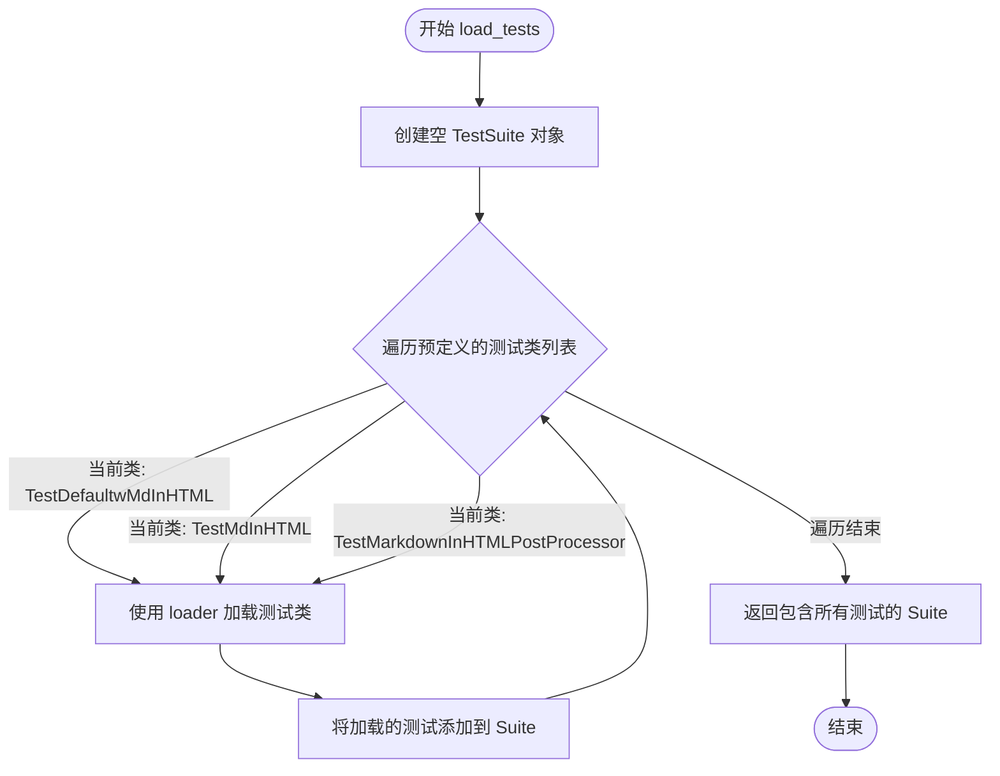

#### 带注释源码

```python
def load_tests(loader, tests, pattern):
    """
    自定义测试加载逻辑。
    目的：确保 TestHTMLBlocks 不会因为被继承而被重复执行两次。
    """
    # 创建一个空的测试套件
    suite = TestSuite()
    
    # 定义需要加载的测试类列表
    # 包含: 默认md_in_html测试, md_in_html功能测试, HTML后处理器测试
    test_classes = [TestDefaultwMdInHTML, TestMdInHTML, TestMarkdownInHTMLPostProcessor]
    
    # 遍历列表，依次加载每个测试类
    for test_class in test_classes:
        # 使用 loader 从测试类中加载测试用例
        loaded_tests = loader.loadTestsFromTestCase(test_class)
        # 将加载到的测试用例添加到套件中
        suite.addTests(loaded_tests)
        
    # 返回组装好的测试套件
    return suite
```


### `TestMarkdownInHTMLPostProcessor.test_stash_to_string`

该测试方法用于验证 Markdown 扩展中 `raw_html` 后处理器的 `stash_to_string` 方法能否正确将 `etree` 的 `Element` 对象序列化为 HTML 字符串。它通过创建测试用的 Element 对象并检查序列化结果是否符合预期来确保该方法的正确性。

参数：
- 无显式参数（隐式参数 `self` 是 TestCase 实例）

返回值：`None`（测试方法无返回值，通过 `self.assertEqual` 验证结果）

#### 流程图

```mermaid
flowchart TD
    A[开始测试] --> B[创建 Element 对象: div 元素, 文本 'Foo bar.']
    B --> C[创建 Markdown 实例, 启用 'md_in_html' 扩展]
    C --> D[调用 postprocessors['raw_html'].stash_to_string 方法]
    D --> E{返回值是否等于 '<div>Foo bar.</div>'}
    E -->|是| F[测试通过]
    E -->|否| G[测试失败]
```

#### 带注释源码

```python
def test_stash_to_string(self):
    # 创建一个用于测试的 etree Element 对象
    # 模拟在 HTML stash 中存储的 HTML 元素
    element = Element('div')
    element.text = 'Foo bar.'
    
    # 创建 Markdown 实例并启用 md_in_html 扩展
    # 该扩展允许在 HTML 标签内使用 Markdown 语法
    md = Markdown(extensions=['md_in_html'])
    
    # 调用 raw_html postprocessor 的 stash_to_string 方法
    # 将 Element 对象转换为字符串形式
    result = md.postprocessors['raw_html'].stash_to_string(element)
    
    # 验证序列化结果是否符合预期
    # 应该输出: '<div>Foo bar.</div>'
    self.assertEqual(result, '<div>Foo bar.</div>')
```


### `TestMdInHTML.test_md1_paragraph`

该测试方法用于验证 Markdown 扩展中 `md_in_html` 的基本功能，即带有 `markdown="1"` 属性的 HTML 元素能够正确解析其内部的 Markdown 语法（如 `*foo*` 会被转换为 `<em>foo</em>`）。

参数：无（除隐式 `self` 参数外）

返回值：`None`，该方法为测试用例，通过 `assertMarkdownRenders` 断言验证渲染结果，不返回具体值。

#### 流程图

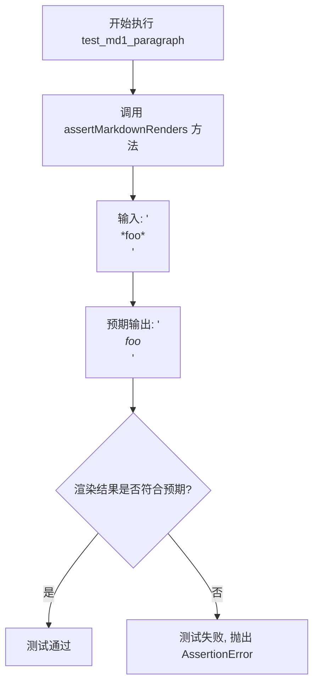

#### 带注释源码

```python
def test_md1_paragraph(self):
    """
    测试 md_in_html 扩展的基本段落解析功能。
    
    验证带有 markdown="1" 属性的 <p> 标签能够正确解析
    其内部包含的 Markdown 语法（本例中为强调 *foo*）。
    """
    # 调用父类 TestCase 的 assertMarkdownRenders 方法进行渲染验证
    # 参数1: 输入的 Markdown/HTML 混合内容
    # 参数2: 期望的渲染输出结果
    self.assertMarkdownRenders(
        '<p markdown="1">*foo*</p>',  # 输入: 带有 markdown 属性的 HTML 段落
        '<p><em>foo</em></p>'          # 期望输出: *foo* 被转换为 <em>foo</em>
    )
```


### `TestMdInHTML.test_md1_p_linebreaks`

该方法用于测试在 HTML 段落标签 `<p>` 上添加 `markdown="1"` 属性后，即使段落内部存在换行符，Markdown 解析器也能正确将其内容（此处为 `*foo*`）解析为斜体 emphasis（`<em>foo</em>`），确保多行内容的 Markdown 处理正常工作。

参数：

- 无显式参数（`self` 为隐式参数，表示测试类实例）

返回值：`None`，该方法为测试用例，通过 `assertMarkdownRenders` 断言验证 Markdown 解析结果的正确性，无显式返回值。

#### 流程图

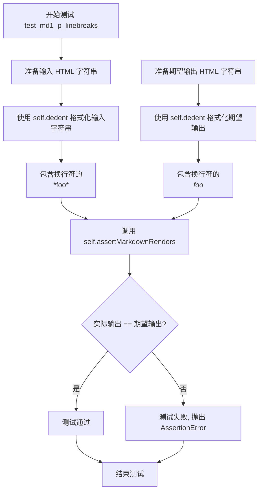

#### 带注释源码

```python
def test_md1_p_linebreaks(self):
    """
    测试带有 markdown='1' 属性的段落标签内部包含换行符时的解析行为。
    
    该测试用例验证以下场景:
    - 输入: 带有 markdown='1' 属性的 <p> 标签，内部包含换行符和 Markdown 文本 *foo*
    - 期望输出: <p> 标签内的 Markdown 文本 *foo* 被正确解析为 <em>foo</em>
    """
    # 使用 assertMarkdownRenders 验证 Markdown 解析结果
    self.assertMarkdownRenders(
        # 输入: 带有换行符的 Markdown 段落
        self.dedent(
            """
            <p markdown="1">
            *foo*
            </p>
            """
        ),
        # 期望输出: 换行符被保留，*foo* 被解析为 <em>foo</em>
        self.dedent(
            """
            <p>
            <em>foo</em>
            </p>
            """
        )
    )
```


### TestMdInHTML.test_md1_p_blank_lines

该测试方法用于验证当HTML段落元素（`<p>`）具有`markdown="1"`属性且内部包含空白行时，Markdown解析器能够正确保留空白行并正常渲染其中的Markdown语法（如星号包围的斜体）。

参数：

- `self`：`TestCase`，测试用例实例本身，用于调用继承的`assertMarkdownRenders`和`dedent`方法

返回值：`None`，测试方法不返回值，通过`assertMarkdownRenders`断言验证渲染结果是否符合预期

#### 流程图

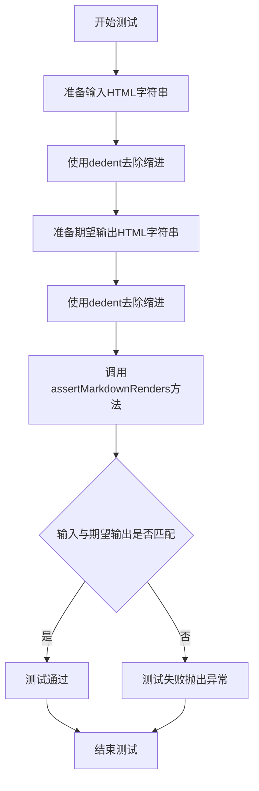

#### 带注释源码

```python
def test_md1_p_blank_lines(self):
    """
    测试markdown属性在p标签中且包含空白行时的渲染行为。
    
    验证点：
    1. p标签的markdown="1"属性使内部内容被解析为Markdown
    2. 保留原始的空白行结构
    3. *foo* 被正确渲染为 <em>foo</em>
    """
    # 调用assertMarkdownRenders验证渲染结果
    # 第一个参数是输入的Markdown/HTML混合内容
    self.assertMarkdownRenders(
        # 使用dedent去除多行字符串的公共缩进
        self.dedent(
            """
            <p markdown="1">

            *foo*

            </p>
            """
        ),
        # 第二个参数是期望的渲染输出
        self.dedent(
            """
            <p>

            <em>foo</em>

            </p>
            """
        )
    )
```


### `TestMdInHTML.test_md1_div`

该方法是 `TestMdInHTML` 测试类中的一个测试用例，用于验证 Markdown 在 HTML 中的基本功能。具体来说，它测试了带有 `markdown="1"` 属性的 `<div>` 元素内的 Markdown 内容（`*foo*`）能否被正确渲染为 HTML（`<em>foo</em>`），并包裹在 `<p>` 标签中。

参数：

- 该方法无显式参数（使用 `self` 调用继承的 `assertMarkdownRenders` 方法）

返回值：`None`（该方法为测试用例，通过断言验证结果，不返回具体值）

#### 流程图

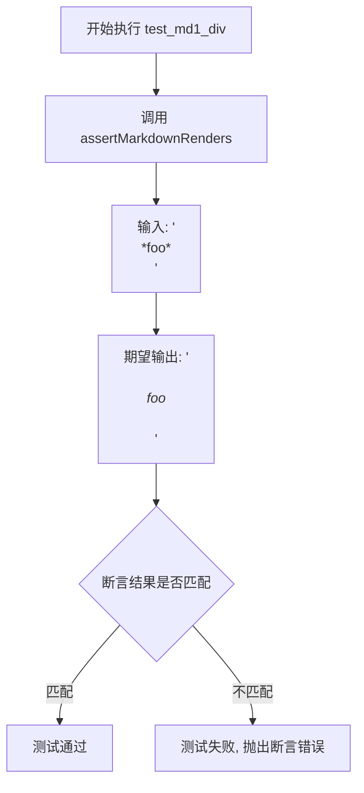

#### 带注释源码

```python
def test_md1_div(self):
    """
    测试 Markdown 在 div 元素中的基本渲染功能。
    
    验证带有 markdown="1" 属性的 div 元素内的 Markdown 内容
    (如 *foo*) 能被正确解析为 HTML 强调标签 (<em>foo</em>)，
    并包裹在 <p> 标签中。
    """
    # 调用继承自 TestCase 的 assertMarkdownRenders 方法
    # 第一个参数: 输入的 Markdown 源代码 (包含 HTML 和 markdown 属性)
    # 第二个参数: 期望渲染后的 HTML 输出
    self.assertMarkdownRenders(
        # 输入: 带 markdown="1" 属性的 div 元素，内部包含 Markdown 强调语法
        '<div markdown="1">*foo*</div>',
        # 使用 self.dedent() 去除多余缩进，得到期望的输出格式
        self.dedent(
            """
            <div>
            <p><em>foo</em></p>
            </div>
            """
        )
    )
    # 断言说明:
    # - markdown="1" 属性告诉 Markdown 解析器处理该元素内部的内容
    # - *foo* 被解析为 <em>foo</em> (Markdown 强调语法)
    # - 由于是块级内容，自动被包裹在 <p> 标签中
    # - 最终结果: <div><p><em>foo</em></p></div>
```


### `TestMdInHTML.test_md1_div_linebreaks`

该测试方法用于验证当 `<div>` 元素带有 `markdown="1"` 属性且内部包含换行符时，Markdown 内容能够被正确解析渲染为 HTML。测试确保在 div 内部有换行的情况下，Markdown 语法（如 `*foo*`）仍能被正确转换为相应的 HTML 标签（`<p><em>foo</em></p>`）。

参数：

- `self`：`TestCase`，测试用例实例本身，无需显式传递

返回值：`None`，该方法为测试方法，通过 `assertMarkdownRenders` 进行断言验证，不返回任何值

#### 流程图

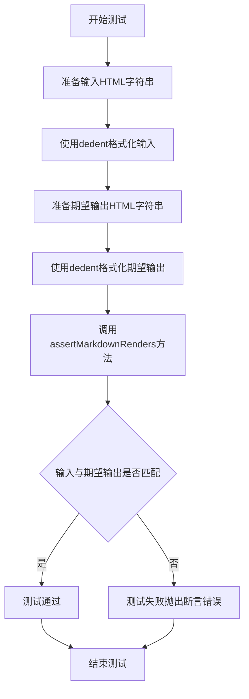

#### 带注释源码

```python
def test_md1_div_linebreaks(self):
    """
    测试 Markdown 在带有 markdown=\"1\" 属性的 div 元素中，
    且元素内部存在换行符时的渲染行为。
    
    输入: <div markdown=\"1\">\n*foo*\n</div>
    期望输出: <div>\n<p><em>foo</em></p>\n</div>
    """
    # 调用 assertMarkdownRenders 方法验证 Markdown 渲染结果
    self.assertMarkdownRenders(
        # 使用 self.dedent() 去除每行公共缩进，得到原始输入格式
        self.dedent(
            """
            <div markdown="1">
            *foo*
            </div>
            """
        ),
        # 期望的渲染输出
        self.dedent(
            """
            <div>
            <p><em>foo</em></p>
            </div>
            """
        )
    )
```


### `TestMdInHTML.test_md1_code_span`

该测试方法用于验证在带有 `markdown="1"` 属性的 HTML 元素（`<div>`）内，包含代码 span（反引号包围的内容）时的 Markdown 渲染行为。测试确保代码 span 中的 HTML 标签被正确转义为 HTML 实体。

参数：

- `self`：`TestCase`，测试类实例本身

返回值：`None`，测试方法无返回值，通过断言验证渲染结果

#### 流程图

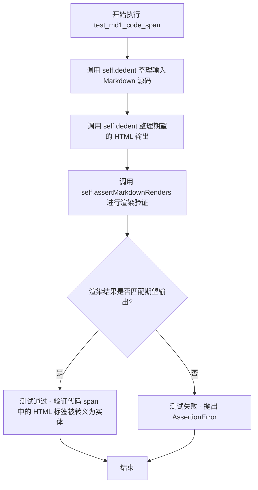

#### 带注释源码

```python
def test_md1_code_span(self):
    """
    测试 md_in_html 扩展处理代码 span 的能力
    
    验证在 <div markdown="1"> 内部的 `<h1>code span</h1>`
    会被正确渲染为转义后的 HTML 实体
    """
    # 输入：带有 markdown="1" 属性的 div，其中包含代码 span
    self.assertMarkdownRenders(
        self.dedent(
            """
            <div markdown="1">
            `<h1>code span</h1>`
            </div>
            """
        ),
        # 期望输出：代码 span 内容被转义
        # <h1> 转为 &lt;h1&gt;
        # </h1> 转为 &lt;/h1&gt;
        self.dedent(
            """
            <div>
            <p><code>&lt;h1&gt;code span&lt;/h1&gt;</code></p>
            </div>
            """
        )
    )
```


### `TestMdInHTML.test_md1_code_span_oneline`

该测试方法用于验证在HTML元素中使用`markdown="1"`属性时，单行内联代码span的处理是否正确，特别是确保代码span内的HTML标签被正确转义为HTML实体。

参数：

- `self`：无显式参数（Python实例方法的隐式参数），代表测试类`TestMdInHTML`的实例对象

返回值：`None`，无返回值（测试方法的返回类型为`None`）

#### 流程图

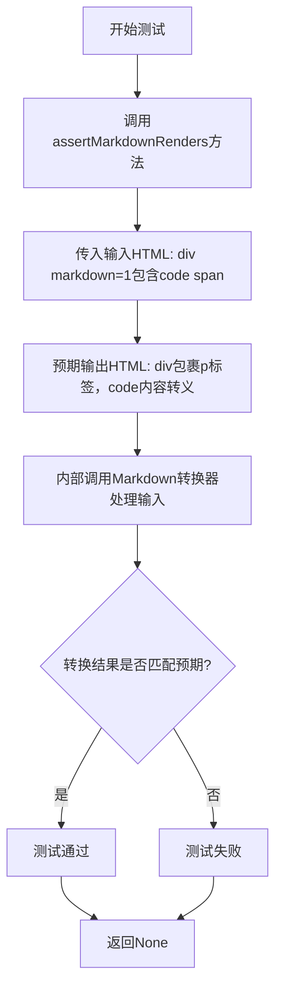

#### 带注释源码

```python
def test_md1_code_span_oneline(self):
    """
    测试单行代码span在markdown="1"元素中的处理。
    
    验证内容：
    - 输入: <div markdown="1">`<h1>code span</h1>`</div>
    - 输出: <div><p><code>&lt;h1&gt;code span&lt;/h1&gt;</code></p></div>
    
    关键点：单行代码span（无换行）应该被正确处理，
    并且内部的HTML标签<h1>应该被转义为&lt;h1&gt;
    """
    # 使用assertMarkdownRenders方法验证markdown渲染结果
    # 参数1: 输入的Markdown/HTML混合内容
    # 参数2: 期望的输出HTML内容
    self.assertMarkdownRenders(
        # 输入: div元素带有markdown="1"属性，内部包含单行代码span
        '<div markdown="1">`<h1>code span</h1>`</div>',
        # 使用dedent方法格式化期望输出，去除左侧空白
        self.dedent(
            """
            <div>
            <p><code>&lt;h1&gt;code span&lt;/h1&gt;</code></p>
            </div>
            """
        )
    )
```


### `TestMdInHTML.test_md1_code_span_unclosed`

该测试方法用于验证在启用 `md_in_html` 扩展时，包含未闭合 HTML 标签（如 `<p>`）的代码 span 元素能够被正确处理和转义。测试确保代码 span 内部的内容不会被解析为 HTML 标签，而是被转义为安全的 HTML 实体。

参数：

- `self`：继承自 `TestCase` 类的实例，代表测试用例本身

返回值：`None`，该方法为测试用例，通过断言验证功能，不返回具体值

#### 流程图

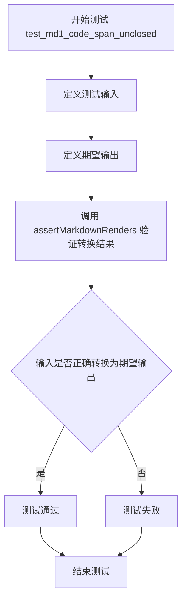

#### 带注释源码

```python
def test_md1_code_span_unclosed(self):
    """
    测试在 md_in_html 扩展中，未闭合的代码span内的HTML标签被正确转义。
    
    验证点：
    - 输入: <div markdown="1">`<p>`</div>
    - 输出: <div><p><code>&lt;p&gt;</code></p></div>
    - 期望: 代码span内的 `<p>` 标签被转义为 &lt;p&gt;
    """
    # 调用父类的 assertMarkdownRenders 方法进行断言验证
    self.assertMarkdownRenders(
        # 测试输入：包含未闭合<p>标签的代码span
        self.dedent(
            """
            <div markdown="1">
            `<p>`
            </div>
            """
        ),
        # 期望输出：<p>被转义为&lt;p&gt;
        self.dedent(
            """
            <div>
            <p><code>&lt;p&gt;</code></p>
            </div>
            """
        )
    )
```


### `TestMdInHTML.test_md1_code_span_script_tag`

该测试方法用于验证在启用 `md_in_html` 扩展时，包含 `<script>` 标签的代码 span（内联代码）能够被正确处理，将 HTML 标签转换为 HTML 实体，从而避免 XSS 等安全问题。

参数：

- `self`：TestCase 实例，测试类的隐式参数

返回值：`None`，该方法为测试方法，无返回值，通过 `assertMarkdownRenders` 断言验证 Markdown 解析结果的正确性

#### 流程图

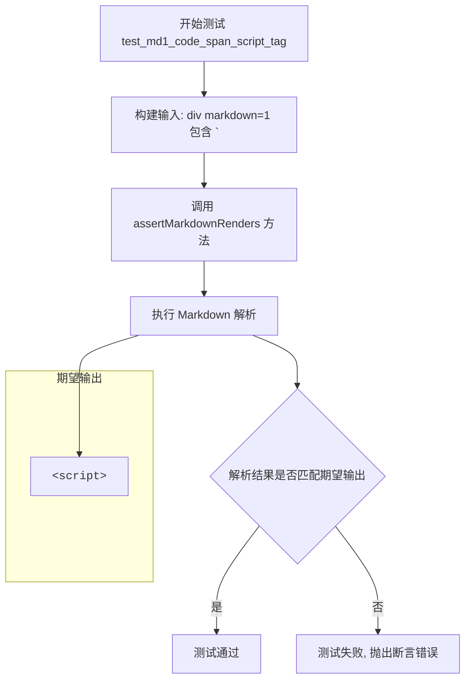

#### 带注释源码

```python
def test_md1_code_span_script_tag(self):
    """
    测试在 markdown='1' 的 HTML 元素中，包含 <script> 标签的代码 span 是否被正确处理。
    
    验证点：
    1. <script> 标签被转换为 HTML 实体 &lt;script&gt;
    2. 代码内容被包裹在 <code> 标签内
    3. 外层 <div> 正确渲染，包含 <p> 段落
    """
    # 调用父类方法 assertMarkdownRenders 验证 Markdown 解析结果
    # 参数1: 输入的 Markdown/HTML 源码
    # 参数2: 期望输出的 HTML 源码
    self.assertMarkdownRenders(
        # 使用 self.dedent 移除字符串的共同缩进
        self.dedent(
            """
            <div markdown="1">
            `<script>`
            </div>
            """
        ),
        self.dedent(
            """
            <div>
            <p><code>&lt;script&gt;</code></p>
            </div>
            """
        )
    )
```


### `TestMdInHTML.test_md1_div_blank_lines`

该测试方法用于验证当 `<div>` 元素带有 `markdown="1"` 属性且内部包含空白行时，Markdown 文本能够被正确解析和渲染为 HTML。

参数：

- `self`：`TestMdInHTML`（类实例），Python 测试类的实例方法必需参数

返回值：`None`，测试方法通过 `self.assertMarkdownRenders` 进行断言验证，若测试失败则抛出 `AssertionError`

#### 流程图

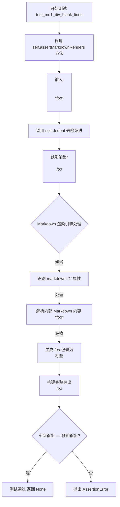

#### 带注释源码

```python
def test_md1_div_blank_lines(self):
    """
    测试带 markdown="1" 属性的 div 元素内部包含空白行时的渲染行为。
    验证空白行不会破坏 Markdown 解析，*foo* 仍被正确转换为 <em>foo</em> 并包裹在 <p> 标签中。
    """
    # 使用 assertMarkdownRenders 方法验证输入 HTML 到输出 HTML 的转换
    self.assertMarkdownRenders(
        # 输入：带有 markdown="1" 属性的 div，内部包含空行和 Markdown 斜体语法 *foo*
        self.dedent(
            """
            <div markdown="1">

            *foo*

            </div>
            """
        ),
        # 预期输出：div 内部应包含一个 <p> 标签，<em> 标签包裹 foo
        self.dedent(
            """
            <div>
            <p><em>foo</em></p>
            </div>
            """
        )
    )
```


### `TestMdInHTML.test_md1_div_multi`

该测试方法用于验证在 `<div>` 元素中使用 `markdown="1"` 属性时，能够正确处理多个独立的 Markdown 块（如强调和粗体文本），并将它们分别渲染为独立的段落。

参数： 无显式参数（继承自 `TestCase` 类的实例方法）

返回值：`None`，该方法为测试用例，仅执行断言验证，无返回值

#### 流程图

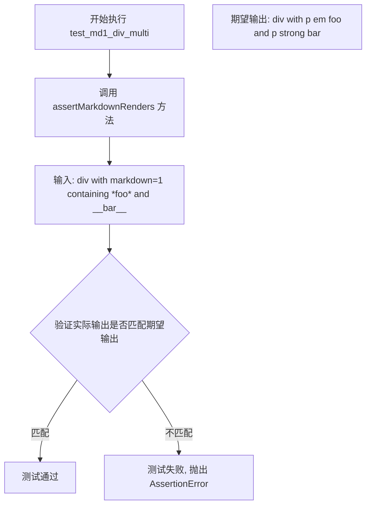

#### 带注释源码

```python
def test_md1_div_multi(self):
    """
    测试方法: test_md1_div_multi
    验证功能: 在带有 markdown='1' 属性的 div 元素中,
             能够正确解析和渲染多个独立的 Markdown 块元素
    """
    # 调用继承自 TestCase 的 assertMarkdownRenders 方法进行验证
    # 第一个参数: 输入的 Markdown/HTML 混合源代码
    # 第二个参数: 期望的渲染输出结果
    self.assertMarkdownRenders(
        # 使用 self.dedent() 方法去除每行的共同缩进, 规范化输入字符串
        self.dedent(
            """
            <div markdown="1">

            *foo*

            __bar__

            </div>
            """
        ),
        # 期望的输出: div 容器内包含两个独立的段落
        # 第一个段落包含斜体文本 *foo*
        # 第二个段落包含粗体文本 __bar__
        self.dedent(
            """
            <div>
            <p><em>foo</em></p>
            <p><strong>bar</strong></p>
            </div>
            """
        )
    )
```


### `TestMdInHTML.test_md1_div_nested`

该方法用于测试在 HTML 中启用 Markdown（通过 `markdown="1"` 属性）的嵌套 `<div>` 元素能否正确解析内部 Markdown 语法（如 `*foo*` 转换为 `<em>foo</em>`），验证 md_in_html 扩展对多层嵌套 Markdown 块的处理能力。

#### 参数

- `self`：`TestCase`，测试类实例本身，继承自 `unittest.TestCase`

#### 返回值

- 无返回值，该方法为测试用例，使用 `assertMarkdownRenders` 断言验证解析结果

#### 流程图

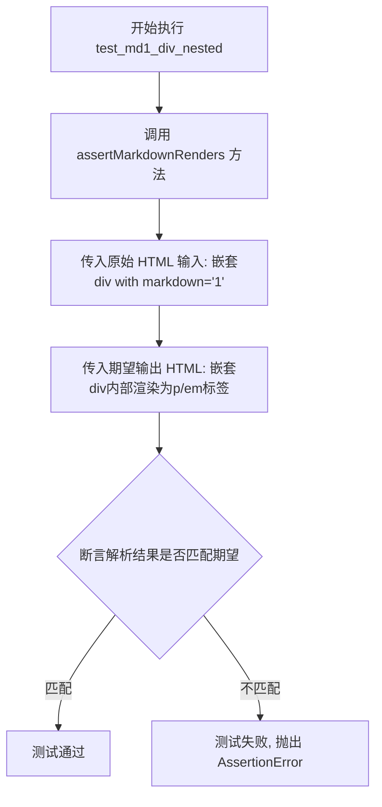

#### 带注释源码

```python
def test_md1_div_nested(self):
    """
    测试嵌套的 div 元素都启用 markdown="1" 时的解析行为。
    验证内层 div 中的 Markdown 语法(*foo*)能被正确转换为 HTML。
    """
    # 调用继承的 assertMarkdownRenders 方法进行断言验证
    self.assertMarkdownRenders(
        # 原始 Markdown/HTML 输入：两个嵌套的 <div>，都标记了 markdown="1"
        self.dedent(
            """
            <div markdown="1">

            <div markdown="1">
            *foo*
            </div>

            </div>
            """
        ),
        # 期望的解析输出：外层 div 保持不变，内层 div 内容被转换为 p/em 标签
        self.dedent(
            """
            <div>
            <div>
            <p><em>foo</em></p>
            </div>
            </div>
            """
        )
    )
```

#### 详细说明

| 项目 | 描述 |
|------|------|
| **测试目标** | 验证 md_in_html 扩展处理嵌套的 Markdown 块的能力 |
| **输入内容** | 两个嵌套的 `<div>` 元素，均带有 `markdown="1"` 属性，内层包含 Markdown 强调语法 `*foo*` |
| **期望输出** | 外层 div 包裹内层 div，内层 div 中的 Markdown 内容被解析为 `<p><em>foo</em></p>` |
| **测试类型** | 功能测试 - 验证 Markdown 解析器对嵌套块级元素的处理 |
| **依赖项** | md_in_html 扩展、`assertMarkdownRenders` 方法（来自 `markdown.test_tools.TestCase`） |


### `TestMdInHTML.test_md1_div_multi_nest`

该测试方法用于验证多层嵌套的 `markdown="1"` 属性在 HTML 元素中的正确处理。具体来说，它测试了在外部 `<div>` 元素（带有 `markdown="1"` 属性）内部包含另一个 `<div>` 元素（也带有 `markdown="1"` 属性），而内部 `<div>` 中又包含一个带有 `markdown="1"` 属性的 `<p>` 元素的情况。测试确保星号（`*foo*`）被正确转换为 HTML 强调标签（`<em>foo</em>`）。

参数：

- `self`：`TestCase`，测试用例的实例对象，继承自 unittest.TestCase，用于调用继承的断言方法

返回值：`None`，测试方法不返回任何值，主要通过断言来验证功能

#### 流程图

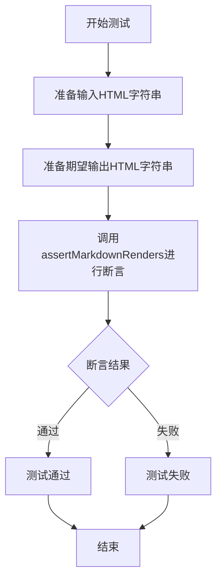

#### 带注释源码

```python
def test_md1_div_multi_nest(self):
    """
    测试多层嵌套的markdown属性在HTML元素中的处理。
    
    该测试验证了以下嵌套结构：
    1. 外部<div>带有markdown="1"属性
    2. 内部<div>也带有markdown="1"属性
    3. 最内层的<p>带有markdown="1"属性
    
    期望结果是将Markdown语法*foo*转换为HTML<em>foo</em>
    """
    # 调用assertMarkdownRenders方法，传入输入和期望输出
    # 第一个参数是带有markdown属性的输入HTML
    # 第二个参数是期望的渲染结果
    self.assertMarkdownRenders(
        # 使用self.dedent()方法去除字符串的缩进，使代码更整洁
        self.dedent(
            """
            <div markdown="1">

            <div markdown="1">
            <p markdown="1">*foo*</p>
            </div>

            </div>
            """
        ),
        # 期望的输出：星号被转换为<em>标签
        self.dedent(
            """
            <div>
            <div>
            <p><em>foo</em></p>
            </div>
            </div>
            """
        )
    )
```


### `TestMdInHTML.text_md1_details`

该方法用于测试在 HTML `<details>` 元素中使用 `markdown="1"` 属性时的渲染行为，验证 Markdown 内容（如 emphasis）能在 `<details>` 元素内部被正确解析为 HTML。

参数：
- 无（仅包含 `self` 参数）

返回值：`None`，该方法为测试方法，不返回任何值

#### 流程图

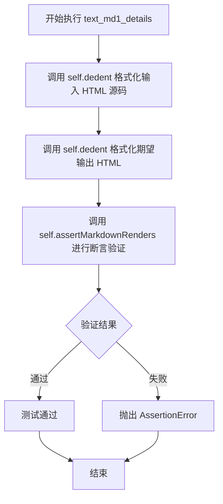

#### 带注释源码

```python
def text_md1_details(self):
    """
    测试在 HTML <details> 元素中使用 markdown="1" 属性时的渲染行为。
    
    该测试方法验证：
    1. <details> 元素带有 markdown="1" 属性时，内部内容会被解析为 Markdown
    2. <summary> 元素保持原样（不解析其中的 Markdown）
    3. <details> 元素内部的 Markdown 内容（如 *foo*）会被正确转换为 HTML（<em>foo</em>）
    """
    # 使用 self.dedent 去除字符串的共同缩进，格式化输入的 Markdown 源码
    # 输入：<details markdown="1"> 标记该元素内部需要解析 Markdown
    # <summary> 元素内容保持不变
    # *foo* 是 Markdown emphasis 语法
    self.assertMarkdownRenders(
        self.dedent(
            """
            <details markdown="1">
            <summary>Click to expand</summary>
            *foo*
            </details>
            """
        ),
        # 期望的输出：
        # <details> 元素不再有 markdown 属性
        # <summary> 保持不变
        # *foo* 被转换为 <em>foo</em> 并包裹在 <p> 标签中
        self.dedent(
            """
            <details>
            <summary>Click to expand</summary>
            <p><em>foo</em></p>
            </details>
            """
        )
    )
```


### TestMdInHTML.test_md1_mix

该方法是测试类TestMdInHTML中的一个测试用例，用于验证md_in_html扩展在处理混合Markdown和原始HTML内容时的正确性。具体来说，它测试了一个包含Markdown文本和带有markdown="1"属性的原始HTML子元素的div容器，确保Markdown解析器能够正确处理容器内的Markdown内容、原始子元素以及尾随的Markdown文本。

参数：

- `self`：隐式参数，TestCase实例，表示测试用例的当前实例

返回值：`None`，该方法是一个测试用例，通过assertMarkdownRenders断言验证Markdown渲染结果，不返回任何值

#### 流程图

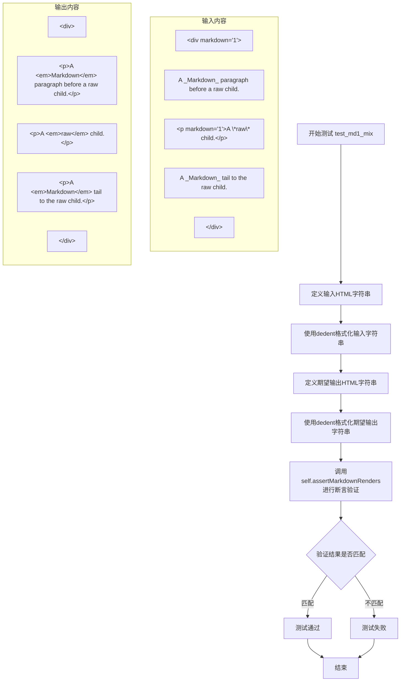

#### 带注释源码

```python
def test_md1_mix(self):
    """
    测试混合使用Markdown和原始HTML的场景。
    
    该测试验证md_in_html扩展能够正确处理以下场景：
    1. div容器带有markdown="1"属性，其内部内容应被解析为Markdown
    2. div内部包含一个带有markdown="1"属性的<p>子元素，这是一个"原始"子元素
    3. 原始子元素之后的文本应该继续作为Markdown解析（tail部分）
    
    输入HTML结构：
    <div markdown="1">                      # 容器启用Markdown解析
        A _Markdown_ paragraph...         # Markdown文本（斜体）
        <p markdown="1">A *raw* child.</p>  # 原始子元素，不解析内部Markdown
        A _Markdown_ tail...              # 原始元素后的Markdown文本
    </div>
    
    期望输出：
    <div>
        <p>A <em>Markdown</em> paragraph before a raw child.</p>  # 容器内Markdown解析为斜体
        <p>A <em>raw</em> child.</p>  # 原始子元素被保留，内部*raw*被解析为斜体
        <p>A <em>Markdown</em> tail to the raw child.</p>  # tail部分也被解析为Markdown
    </div>
    """
    # 调用assertMarkdownRenders方法验证Markdown渲染结果
    # 参数1: 输入的Markdown/HTML混合内容
    # 参数2: 期望的输出HTML内容
    self.assertMarkdownRenders(
        # 使用dedent去除多余缩进，保持字符串格式清晰
        self.dedent(
            """
            <div markdown="1">
            A _Markdown_ paragraph before a raw child.

            <p markdown="1">A *raw* child.</p>

            A _Markdown_ tail to the raw child.
            </div>
            """
        ),
        self.dedent(
            """
            <div>
            <p>A <em>Markdown</em> paragraph before a raw child.</p>
            <p>A <em>raw</em> child.</p>
            <p>A <em>Markdown</em> tail to the raw child.</p>
            </div>
            """
        )
    )
```


### `TestMdInHTML.test_md1_deep_mix`

该方法是一个测试用例，用于验证 Markdown 解析器在处理深度嵌套的 HTML 元素与 Markdown 混合使用时的正确性。测试包含多层嵌套的 `div` 元素，其中同时包含 Markdown 内容和原始 HTML 子元素，以及各种文本节点和属性，用于确保解析器能正确区分和处理混合内容。

参数：
- 该方法无显式参数（继承自 `TestCase` 的 `self` 为实例自身）

返回值：
- `None`，该方法为测试用例，通过 `assertMarkdownRenders` 断言验证 Markdown 解析结果是否符合预期

#### 流程图

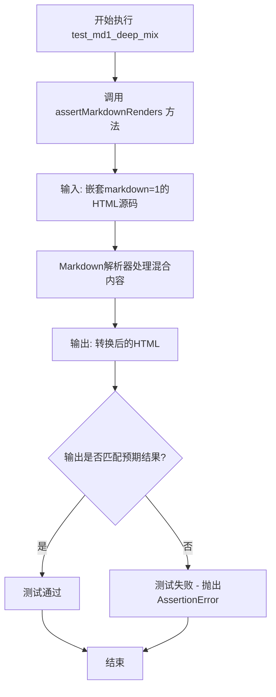

#### 带注释源码

```python
def test_md1_deep_mix(self):
    """
    测试深度混合的Markdown和HTML嵌套场景。
    
    该测试验证以下复杂情况：
    1. 外层<div>标记markdown="1"，内部包含Markdown文本
    2. 嵌套的<div>也标记markdown="1"，包含原始HTML子元素
    3. 原始HTML子元素<p>也标记markdown="1"
    4. 混合的文本节点：Markdown格式文本和原始HTML文本
    5. 多行Markdown段落
    6. 尾部文本的处理
    """
    self.assertMarkdownRenders(
        # 输入：待转换的Markdown/HTML混合源码
        self.dedent(
            """
            <div markdown="1">

            A _Markdown_ paragraph before a raw child.

            A second Markdown paragraph
            with two lines.

            <div markdown="1">

            A *raw* child.

            <p markdown="1">*foo*</p>

            Raw child tail.

            </div>

            A _Markdown_ tail to the raw child.

            A second tail item
            with two lines.

            <p markdown="1">More raw.</p>

            </div>
            """
        ),
        # 预期输出：转换后的纯HTML
        self.dedent(
            """
            <div>
            <p>A <em>Markdown</em> paragraph before a raw child.</p>
            <p>A second Markdown paragraph
            with two lines.</p>
            <div>
            <p>A <em>raw</em> child.</p>
            <p><em>foo</em></p>
            <p>Raw child tail.</p>
            </div>
            <p>A <em>Markdown</em> tail to the raw child.</p>
            <p>A second tail item
            with two lines.</p>
            <p>More raw.</p>
            </div>
            """
        )
    )
```


### `TestMdInHTML.test_md1_div_raw_inline`

验证在带有 `markdown="1"` 属性的 `<div>` 元素中，包含原始内联 HTML 元素（如 `<em>foo</em>`）时，Markdown 处理能够正确将其转换为段落中的元素。

参数：

- `self`：`TestMdInHTML`，测试类实例本身，用于调用继承的 `assertMarkdownRenders` 等方法

返回值：`None`，测试方法不返回值，通过断言验证渲染结果

#### 流程图

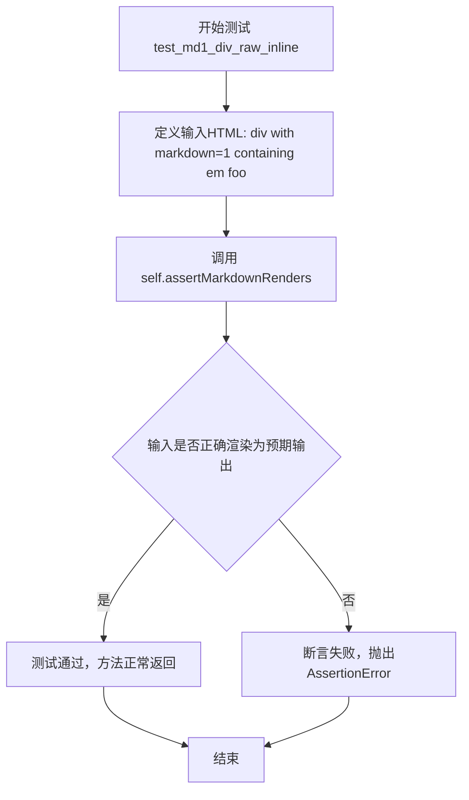

#### 带注释源码

```python
def test_md1_div_raw_inline(self):
    """
    测试当 div 元素标记了 markdown="1" 时，
    其内部包含的原始内联 HTML 元素（如 <em>）能被正确处理。
    
    期望行为：
    - 输入中的原始 HTML 元素 <em>foo</em> 应被保留
    - 由于在块级元素内部，应外层被 <p> 标签包裹
    """
    self.assertMarkdownRenders(
        # 输入：带有 markdown="1" 属性的 div，内部包含原始 HTML <em>foo</em>
        self.dedent(
            """
            <div markdown="1">

            <em>foo</em>

            </div>
            """
        ),
        # 期望输出：原始 HTML 元素被包裹在 <p> 标签中
        self.dedent(
            """
            <div>
            <p><em>foo</em></p>
            </div>
            """
        )
    )
```


### `TestMdInHTML.test_no_md1_paragraph`

该测试方法验证了当 HTML 段落元素（`<p>`）没有 `markdown="1"` 属性时，Markdown 语法不应被解析，原始内容应保持不变输出。

参数：

- `self`：`TestCase`，测试用例实例本身

返回值：`None`，该测试方法无显式返回值，通过 `assertMarkdownRenders` 断言验证 Markdown 处理结果

#### 流程图

```mermaid
flowchart TD
    A[开始测试 test_no_md1_paragraph] --> B[调用 assertMarkdownRenders 方法]
    B --> C[输入: '<p>*foo*</p>']
    C --> D[预期输出: '<p>*foo*</p>']
    D --> E{验证结果}
    E -->|通过| F[测试通过]
    E -->|失败| G[测试失败]
```

#### 带注释源码

```python
def test_no_md1_paragraph(self):
    """
    测试没有 markdown 属性的段落标签不应解析内嵌 Markdown 语法。
    
    该测试用例验证了当 <p> 标签没有 markdown="1" 属性时，
    其内部的 Markdown 语法（如 *foo*）应该被当作普通文本输出，
    而不会被转换为 HTML 标签（如 <em>foo</em>）。
    """
    # 调用父类的 assertMarkdownRenders 方法进行验证
    # 参数1: 输入的 Markdown/HTML 字符串
    # 参数2: 期望输出的 HTML 字符串
    self.assertMarkdownRenders(
        '<p>*foo*</p>',    # 输入: 包含 Markdown 强调语法的段落
        '<p>*foo*</p>'     # 输出: 保持原样，不进行 Markdown 解析
    )
```


### `TestMdInHTML.test_no_md1_nest`

该测试方法用于验证当在带有 `markdown="1"` 属性的HTML容器内部存在一个不带markdown属性的原生HTML `<p>` 元素时，Markdown处理器的行为。测试确保容器内的Markdown内容被正确解析，而原生HTML子元素保持不变。

参数：

-  `self`：隐式参数，`TestCase` 类型，测试类实例本身

返回值： 无（`None`），该方法为测试用例，通过 `assertMarkdownRenders` 断言验证 Markdown 解析结果是否符合预期

#### 流程图

```mermaid
flowchart TD
    A[开始执行 test_no_md1_nest] --> B[调用 assertMarkdownRenders 方法]
    B --> C[传入输入HTML字符串和期望输出HTML字符串]
    C --> D[使用 dedent 格式化输入]
    D --> E[输入: div带markdown=1,内部包含_Markdown_文本和原生p标签]
    E --> F[调用Markdown处理器转换输入]
    F --> G[验证输出结果]
    G --> H{输出是否符合预期}
    H -->|是| I[测试通过]
    H -->|否| J[测试失败, 抛出AssertionError]
```

#### 带注释源码

```python
def test_no_md1_nest(self):
    """
    测试当div元素带有markdown='1'属性，但内部子元素p不带markdown属性时的行为。
    
    预期行为：
    - div容器内的Markdown文本（_Markdown_）应被解析为em标签
    - 内部不带markdown属性的原生<p>标签及其内容应保持原样不被解析
    """
    self.assertMarkdownRenders(
        self.dedent(
            """
            <div markdown="1">
            A _Markdown_ paragraph before a raw child.

            <p>A *raw* child.</p>

            A _Markdown_ tail to the raw child.
            </div>
            """
        ),
        self.dedent(
            """
            <div>
            <p>A <em>Markdown</em> paragraph before a raw child.</p>
            <p>A *raw* child.</p>
            <p>A <em>Markdown</em> tail to the raw child.</p>
            </div>
            """
        )
    )
```

#### 详细说明

**测试目的：**
验证 `md_in_html` 扩展在处理嵌套HTML时的正确性，特别是当父容器启用Markdown但子元素为原生HTML（无markdown属性）时的处理逻辑。

**输入分析：**
- 外层 `<div markdown="1">` - 启用Markdown解析
- `<p>A *raw* child.</p>` - 原生HTML段落，不应解析其中的 `*raw*`

**期望输出：**
- 外部div保留
- Markdown文本 `_Markdown_` 被转换为 `<em>Markdown</em>`
- 原生 `<p>A *raw* child.</p>` 保持不变，其中的 `*raw*` 不被解析


### `TestMdInHTML.test_md1_nested_empty`

该测试方法用于验证 Markdown 在 HTML 中的扩展（md_in_html）能够正确处理包含空标签（如 ``）的嵌套 Markdown 块，确保空标签前后的 Markdown 文本被正确解析为段落，同时空标签本身保持不变。

参数：

- `self`：测试类实例，无需额外参数

返回值：`None`，该方法为测试方法，不返回任何值，通过 `assertMarkdownRenders` 断言验证渲染结果

#### 流程图

```mermaid
flowchart TD
    A[开始测试] --> B[定义输入HTML字符串<br/>包含markdown='1'的div<br/>内有Markdown文本和空img标签]
    B --> C[定义期望输出HTML字符串<br/>div内三个段落<br/>中间段落包含img标签]
    C --> D[调用self.assertMarkdownRenders<br/>对比输入与期望输出]
    D --> E{渲染结果是否匹配?}
    E -->|是| F[测试通过<br/>返回None]
    E -->|否| G[测试失败<br/>抛出AssertionError]
```

#### 带注释源码

```python
def test_md1_nested_empty(self):
    """
    测试 md_in_html 扩展处理空标签的能力。
    
    验证场景：
    - 外层div带有markdown="1"属性
    - div内部包含三部分：Markdown文本、空img标签、Markdown文本
    - 空标签应该被保留，同时前后文本被转换为段落
    """
    # 输入：带有markdown="1"的div，内部包含em强调文本和空img标签
    self.assertMarkdownRenders(
        self.dedent(
            """
            <div markdown="1">
            A _Markdown_ paragraph before a raw empty tag.

            

            A _Markdown_ tail to the raw empty tag.
            </div>
            """
        ),
        # 期望输出：div内三个独立段落，中间为img标签
        self.dedent(
            """
            <div>
            <p>A <em>Markdown</em> paragraph before a raw empty tag.</p>
            <p></p>
            <p>A <em>Markdown</em> tail to the raw empty tag.</p>
            </div>
            """
        )
    )
```


### TestMdInHTML.test_md1_nested_empty_block

该测试方法用于验证 `md_in_html` 扩展在处理包含块级空标签（如 `<hr />`）的 Markdown 容器时的行为。它确保容器内的 Markdown 文本被正确转换为段落（`<p>` 标签），而原始的块级空标签被保留不动。

参数：

- `self`：`TestMdInHTML`，调用此方法的测试类实例本身。

返回值：`None`，无返回值（测试方法执行断言）。

#### 流程图

```mermaid
graph TD
    A([开始 test_md1_nested_empty_block]) --> B[准备输入: Markdown 源码 <div markdown="1">...<hr />...</div>]
    B --> C[准备期望: HTML 目标结构 <div><p>...</p><hr /><p>...</p></div>]
    C --> D{调用 self.assertMarkdownRenders}
    D --> E[Markdown 处理器运行 md_in_html 扩展]
    E --> F{断言: 实际输出 == 期望输出}
    F --> |成功| G([测试通过])
    F --> |失败| H([测试失败/抛出 AssertionError])
```

#### 带注释源码

```python
    def test_md1_nested_empty_block(self):
        # 测试场景：验证 md_in_html 扩展对块级空标签 (<hr />) 的处理
        # 输入：一个带有 markdown="1" 属性的 div，包含普通文本和一个 <hr /> 标签
        # 期望：文本被包裹在 <p> 标签中，<hr /> 标签保持原样
        self.assertMarkdownRenders(
            self.dedent(
                """
                <div markdown="1">
                A _Markdown_ paragraph before a raw empty tag.

                <hr />

                A _Markdown_ tail to the raw empty tag.
                </div>
                """
            ),
            self.dedent(
                """
                <div>
                <p>A <em>Markdown</em> paragraph before a raw empty tag.</p>
                <hr />
                <p>A <em>Markdown</em> tail to the raw empty tag.</p>
                </div>
                """
            )
        )
```


### `TestMdInHTML.test_empty_tags`

该测试方法用于验证在带有 `markdown="1"` 属性的 HTML 块中，空的 HTML 标签（如 `<div></div>`）能够被正确处理，不会导致解析错误或内容丢失。

参数：无

返回值：无（测试方法不返回任何值，通过 `assertMarkdownRenders` 断言验证结果）

#### 流程图

```mermaid
flowchart TD
    A[开始执行 test_empty_tags] --> B[定义输入 HTML: div markdown='1' 包含空 div 标签]
    --> C[定义期望输出 HTML: div 包含空 div 标签]
    --> D[调用 self.assertMarkdownRenders 进行断言验证]
    --> E{验证结果是否匹配}
    E -->|匹配| F[测试通过]
    E -->|不匹配| G[测试失败, 抛出 AssertionError]
```

#### 带注释源码

```python
def test_empty_tags(self):
    """
    测试空标签在 markdown='1' 属性元素中的处理情况。
    
    验证空的自闭合标签（如 <div></div>）在 md_in_html 扩展中
    能够被正确保留，不会因为解析逻辑导致内容丢失或格式错误。
    """
    # 使用 self.dedent 去除多余缩进，定义输入的 Markdown/HTML 源码
    self.assertMarkdownRenders(
        self.dedent(
            """
            <div markdown="1">
            <div></div>
            </div>
            """
        ),
        # 期望输出的 HTML 结果
        # 空标签应该被原样保留在输出中
        self.dedent(
            """
            <div>
            <div></div>
            </div>
            """
        )
    )
```


### `TestMdInHTML.test_orphan_end_tag_in_raw_html`

该测试方法用于验证在 `markdown="1"` 属性标记的 HTML 块元素中，当包含孤立的结束标签（如 `</pre>`）时，Markdown 解析器能够正确处理并将其保留在输出中，而不会导致解析错误或内容丢失。

参数：

- `self`：`TestCase`，测试用例的实例本身，继承自 `unittest.TestCase`

返回值：`None`，测试方法不返回任何值，通过 `assertMarkdownRenders` 方法进行断言验证

#### 流程图

```mermaid
flowchart TD
    A[开始执行 test_orphan_end_tag_in_raw_html] --> B[定义输入HTML源码]
    B --> C[使用 self.dedent 格式化输入字符串]
    C --> D[定义期望的输出HTML源码]
    D --> E[使用 self.dedent 格式化期望输出字符串]
    E --> F[调用 self.assertMarkdownRenders 进行断言]
    F --> G{输入与期望输出是否匹配}
    G -->|是| H[测试通过]
    G -->|否| I[测试失败, 抛出 AssertionError]
```

#### 带注释源码

```python
def test_orphan_end_tag_in_raw_html(self):
    """
    测试在 markdown="1" 的 HTML 块中包含孤立结束标签时的行为。
    
    场景：在一个嵌套的 <div> 中包含一个孤立的 </pre> 结束标签，
    该标签没有对应的开始标签。验证 Markdown 解析器能够正确处理
    这种边缘情况，并按原样保留在输出中。
    """
    # 定义输入：包含 markdown="1" 属性的外层 div，内部有嵌套 div 和孤立的 </pre> 标签
    self.assertMarkdownRenders(
        self.dedent(
            """
            <div markdown="1">
            <div>
            Test

            </pre>

            Test
            </div>
            </div>
            """
        ),
        # 期望输出：输入的 HTML 结构应该被完整保留，包括孤立的 </pre> 标签
        self.dedent(
            """
            <div>
            <div>
            Test

            </pre>

            Test
            </div>
            </div>
            """
        )
    )
```


### `TestMdInHTML.test_complex_nested_case`

该方法用于测试`md_in_html`扩展在复杂嵌套场景下的处理能力，验证外层带有`markdown="1"`属性的HTML元素内的Markdown语法能被正确转换，而内层不包含该属性的HTML元素保持原始状态。

参数：

- `self`：无参数，TestCase实例本身

返回值：`None`，无返回值（测试方法）

#### 流程图

```mermaid
graph TD
    A[开始测试] --> B[准备输入HTML字符串]
    B --> C[调用dedent格式化输入]
    D[准备期望输出HTML字符串]
    D --> C
    C --> E[调用assertMarkdownRenders比较结果]
    E --> F{输入与期望输出是否匹配}
    F -->|是| G[测试通过]
    F -->|否| H[测试失败抛出断言错误]
```

#### 带注释源码

```python
def test_complex_nested_case(self):
    """
    测试复杂嵌套情况下md_in_html扩展的行为。
    
    验证内容：
    - 外层<div markdown="1">内的Markdown语法**test**被转换为<strong>test</strong>
    - 内层普通<div>内的内容保持原始形式，不进行Markdown转换
    - 混合嵌套HTML标签时的正确处理
    """
    # 第一个参数：输入的Markdown/HTML混合内容
    self.assertMarkdownRenders(
        self.dedent(
            """
            <div markdown="1">
            **test**
            <div>
            **test**
            
            <code>Test</code>
            <span>**test**</span>
            <p>Test 2</p>
            </div>
            </div>
            """
        ),
        # 第二个参数：期望的输出HTML内容
        self.dedent(
            """
            <div>
            <p><strong>test</strong></p>
            <div>
            **test**
            
            <code>Test</code>
            <span>**test**</span>
            <p>Test 2</p>
            </div>
            </div>
            """
        )
    )
```


### `TestMdInHTML.test_complex_nested_case_whitespace`

该方法用于测试 markdown-in-HTML 扩展在处理包含复杂嵌套和空白字符（空格、制表符）时的行为，验证 Markdown 解析器能够正确处理带有各种空白字符的嵌套 HTML 结构。

参数：

- 无（仅包含 `self` 参数）

返回值：`None`，该方法为测试方法，使用 `assertMarkdownRenders` 进行断言验证，不返回任何值。

#### 流程图

```mermaid
flowchart TD
    A[开始测试 test_complex_nested_case_whitespace] --> B[调用 assertMarkdownRenders 方法]
    B --> C[输入预处理: 使用 dedent 格式化包含空白字符的输入 Markdown]
    C --> D[调用 Markdown 解析器处理输入]
    D --> E{解析是否成功}
    E -->|是| F[获取预期输出]
    F --> G{实际输出是否匹配预期}
    E -->|否| H[测试失败]
    G -->|是| I[测试通过]
    G -->|否| J[测试失败 - 输出不匹配]
    H --> K[结束]
    I --> K
    J --> K
```

#### 带注释源码

```python
def test_complex_nested_case_whitespace(self):
    """
    测试复杂嵌套情况下的空白字符处理。
    
    该测试用例验证以下场景：
    1. 包含空格和制表符的文本
    2. 带 markdown="1" 属性的 div 元素
    3. 多层嵌套的 HTML 元素
    4. 混合的 Markdown 和 HTML 内容
    """
    self.assertMarkdownRenders(
        # 输入：包含各种空白字符的 Markdown 源代码
        self.dedent(
            """
            Text with space\t
            <div markdown="1">\t
            \t
             <div>
            **test**
            
            <code>Test</code>
            <span>**test**</span>
              <div>With whitespace</div>
            <p>Test 2</p>
            </div>
            **test**
            </div>
            """
        ),
        # 预期输出：解析后的 HTML
        self.dedent(
            """
            <p>Text with space </p>
            <div>
            <div>
            **test**
            
            <code>Test</code>
            <span>**test**</span>
              <div>With whitespace</div>
            <p>Test 2</p>
            </div>
            <p><strong>test</strong></p>
            </div>
            """
        )
    )
    # 断言说明：
    # - "Text with space\t" 转换为 <p>Text with space </p>
    # - <div markdown="1"> 内的内容被作为 Markdown 处理
    # - **test** 在 div 外部被转换为 <strong>test</strong>
    # - <div>...</div> 内部未标记 markdown 的内容保持原始 Markdown 格式
```


### `TestMdInHTML.test_md1_intail_md1`

该测试方法验证两个相邻的 `<div>` 元素都带有 `markdown="1"` 属性时，能够正确地将每个元素内的 Markdown 内容转换为 HTML，并确保它们作为独立的块级元素输出。

参数：

- `self`：隐式参数，`TestCase` 类的实例方法必需参数，表示测试用例对象本身

返回值：`None`，该方法为测试方法，通过 `assertMarkdownRenders` 断言验证输出，不直接返回值

#### 流程图

```mermaid
flowchart TD
    A[开始测试 test_md1_intail_md1] --> B[调用 assertMarkdownRenders 方法]
    B --> C[输入: '<div markdown="1">*foo*</div><div markdown="1">*bar*</div>']
    C --> D[期望输出: 两个独立的div,每个包含一个p标签包裹的em标签]
    D --> E{实际输出是否匹配期望}
    E -->|是| F[测试通过]
    E -->|否| G[测试失败, 抛出AssertionError]
    F --> H[结束测试]
    G --> H
```

#### 带注释源码

```python
def test_md1_intail_md1(self):
    """
    测试两个相邻的带有 markdown=\"1\" 属性的 div 元素都能正确渲染 Markdown。
    
    验证场景：
    - 输入：两个连续的 <div markdown=\"1\"> 元素
    - 输出：两个独立的 div 块，每个块内的 Markdown 都被正确转换为 HTML
    """
    self.assertMarkdownRenders(
        # 输入：两个相邻的 div，都标记为支持 Markdown 处理
        '<div markdown="1">*foo*</div><div markdown="1">*bar*</div>',
        # 使用 self.dedent 去除多余缩进，定义期望的输出格式
        self.dedent(
            """
            <div>
            <p><em>foo</em></p>
            </div>
            <div>
            <p><em>bar</em></p>
            </div>
            """
        )
    )
```


### `TestMdInHTML.test_md1_no_blank_line_before`

该方法用于测试当Markdown段落后面没有空行时，HTML块中的Markdown是否仍能正确渲染。这是`md_in_html`扩展的一个重要测试场景，验证了在没有空行分隔的情况下，HTML块能否正确解析其中的Markdown内容。

参数：

- `self`：隐式参数，`TestMdInHTML`类的实例，表示测试用例本身

返回值：`None`，该方法为一个测试方法，通过`assertMarkdownRenders`断言进行验证，不返回任何值

#### 流程图

```mermaid
flowchart TD
    A[开始执行test_md1_no_blank_line_before] --> B[调用self.dedent处理输入Markdown文本]
    B --> C[调用self.dedent处理期望输出HTML文本]
    C --> D[调用self.assertMarkdownRenders进行断言验证]
    D --> E{输入与期望输出是否匹配}
    E -->|是| F[测试通过]
    E -->|否| G[测试失败, 抛出AssertionError]
```

#### 带注释源码

```python
def test_md1_no_blank_line_before(self):
    """
    测试当Markdown段落后面没有空行时，HTML块中的Markdown渲染是否正确。
    验证md_in_html扩展能够正确处理没有空行分隔的HTML块。
    """
    # 使用self.dedent处理输入的Markdown源代码
    # 输入包含一个普通Markdown段落，后面直接跟着一个带有markdown="1"属性的div
    # 注意：段落和div之间没有空行分隔
    self.assertMarkdownRenders(
        self.dedent(
            """
            A _Markdown_ paragraph with no blank line after.
            <div markdown="1">
            A _Markdown_ paragraph in an HTML block with no blank line before.
            </div>
            """
        ),
        # 使用self.dedent处理期望的HTML输出
        # 期望普通段落被转换为<p>标签，div内的Markdown也被正确解析
        self.dedent(
            """
            <p>A <em>Markdown</em> paragraph with no blank line after.</p>
            <div>
            <p>A <em>Markdown</em> paragraph in an HTML block with no blank line before.</p>
            </div>
            """
        )
    )
```


### TestMdInHTML.test_md1_no_line_break

测试方法，用于验证当带有 `markdown="1"` 属性的 `<div>` 元素在 Markdown 段落中没有换行符时的处理行为。该测试确保在此情况下 `<div>` 被正确解析为行内元素而非块级元素。

参数： 无

返回值： `None`，测试方法无返回值，通过 `assertMarkdownRenders` 断言验证渲染结果

#### 流程图

```mermaid
flowchart TD
    A[开始测试] --> B[准备输入字符串]
    B --> C[准备预期输出字符串]
    C --> D[调用 assertMarkdownRenders 进行渲染验证]
    D --> E{渲染结果是否匹配预期}
    E -->|是| F[测试通过]
    E -->|否| G[测试失败]
    F --> H[结束]
    G --> H
    
    B -.-> B1[输入: A _Markdown_ paragraph with<br/>&lt;div markdown=&quot;1&quot;&gt;no _line break_.&lt;/div&gt;]
    C -.-> C1[预期输出: &lt;p&gt;A &lt;em&gt;Markdown&lt;/em&gt; paragraph with<br/>&lt;div markdown=&quot;1&quot;&gt;no &lt;em&gt;line break&lt;/em&gt;.&lt;/div&gt;&lt;/p&gt;]
```

#### 带注释源码

```python
def test_md1_no_line_break(self):
    """
    测试带有 markdown='1' 属性的 div 元素在没有换行符时的处理行为。
    
    注释说明：
    - 当 div 元素出现在 Markdown 段落内部且没有前置空行时，
      它会被解析为行内元素而非块级元素
    - 这种情况属于边界输入处理，输出结果可能不符合用户预期
    """
    # 第一个参数：输入的 Markdown 文本
    # 包含一个标准的 Markdown 段落，后面跟着一个带有 markdown='1' 属性的 div 元素
    # div 前面没有空行，所以它会被视为行内元素处理
    self.assertMarkdownRenders(
        'A _Markdown_ paragraph with <div markdown="1">no _line break_.</div>',
        
        # 第二个参数：期望的输出 HTML
        # div 元素被保留在段落内部，其中的 Markdown 语法也会被转换
        '<p>A <em>Markdown</em> paragraph with <div markdown="1">no <em>line break</em>.</div></p>'
    )
```


### `TestMdInHTML.test_md1_in_tail`

该方法用于测试 Markdown 在 HTML 元素尾部（tail）中的处理能力。具体来说，它验证当一个带有 `markdown="1"` 属性的 HTML 块位于前一个元素的尾部时，Markdown 内容能够被正确解析和渲染。

参数：

- `self`：`TestMdInHTML`，测试类的实例对象，包含了测试所需的辅助方法（如 `assertMarkdownRenders` 和 `dedent`）

返回值：`None`，测试方法不返回值，通过断言验证预期结果

#### 流程图

```mermaid
graph TD
    A[开始测试] --> B[构建输入HTML字符串<br/>包含div和带markdown=1的div在tail位置]
    B --> C[调用dedent格式化输入字符串]
    C --> D[构建期望输出HTML字符串]
    D --> E[调用assertMarkdownRenders方法验证渲染结果]
    E --> F{渲染结果是否符合预期?}
    F -->|是| G[测试通过]
    F -->|否| H[测试失败]
    G --> I[结束]
    H --> I
```

#### 带注释源码

```python
def test_md1_in_tail(self):
    """
    测试 Markdown 在 HTML 元素尾部（tail）中的解析能力。
    
    场景：<div></div> 后面紧跟一个带有 markdown="1" 属性的 <div>，
    该 <div> 位于前一个元素的 tail 位置（尾部内容）。
    预期：tail 中的 Markdown 内容应该被正确解析为 HTML。
    """
    # 使用 assertMarkdownRenders 方法验证输入 Markdown/HTML 字符串
    # 是否能正确渲染为期望的 HTML 输出
    self.assertMarkdownRenders(
        # 输入：原始 Markdown/HTML 混合字符串
        # 第一个 div 为空，第二个 div 带有 markdown="1" 属性
        # 第二个 div 的内容位于前一个 div 的 tail 位置
        self.dedent(
            """
            <div></div><div markdown="1">
            A _Markdown_ paragraph in an HTML block in tail of previous element.
            </div>
            """
        ),
        # 期望输出：渲染后的 HTML 字符串
        # 第一个 div 保持原样
        # 第二个 div 内的 Markdown 内容被解析为 HTML：
        # _Markdown_ -> <em>Markdown</em>
        # 整个内容被包裹在 <p> 标签中
        self.dedent(
            """
            <div></div>
            <div>
            <p>A <em>Markdown</em> paragraph in an HTML block in tail of previous element.</p>
            </div>
            """
        )
    )
```


### `TestMdInHTML.test_md1_PI_oneliner`

这是一个单元测试方法，用于验证 md_in_html 扩展能够正确处理包含 PHP 处理指令（Processing Instruction, PI）的单行 HTML 元素。当 HTML 元素带有 `markdown="1"` 属性时，元素内部的 PHP 代码（如 `<?php print("foo"); ?>`）应被保留而不被解析为 Markdown。

参数：

- `self`：`TestMdInHTML`（隐式参数），测试类的实例对象，继承自 `TestCase`，用于调用继承的 `assertMarkdownRenders` 和 `dedent` 方法

返回值：`None`（无显式返回值），该方法通过 `assertMarkdownRenders` 进行断言测试，如果测试失败会抛出异常

#### 流程图

```mermaid
flowchart TD
    A[开始测试 test_md1_PI_oneliner] --> B[构建输入 HTML 字符串]
    B --> C[使用 dedent 格式化输入]
    C --> D[构建期望输出 HTML 字符串]
    D --> E[使用 dedent 格式化期望输出]
    E --> F[调用 assertMarkdownRenders 验证渲染结果]
    F --> G{渲染结果是否匹配期望?}
    G -->|是| H[测试通过 - 无异常]
    G -->|否| I[测试失败 - 抛出 AssertionError]
    H --> J[结束测试]
    I --> J
```

#### 带注释源码

```python
def test_md1_PI_oneliner(self):
    """
    测试 md_in_html 扩展处理单行 PHP 处理指令(PI)的能力。
    
    此测试验证当 <div> 元素带有 markdown="1" 属性时，
    内部的 PHP 处理指令 <?php ... ?> 应被保留为原始 HTML，
    而不是被当作 Markdown 进行解析。
    """
    # 定义输入：包含 PHP 处理指令的 div 元素
    # markdown="1" 表示启用该元素的 Markdown 解析
    input_html = '<div markdown="1"><?php print("foo"); ?></div>'
    
    # 定义期望输出：PHP 处理指令应保持不变
    # 使用 self.dedent() 去除多余缩进
    expected_output = self.dedent(
        """
        <div>
        <?php print("foo"); ?>
        </div>
        """
    )
    
    # 调用父类 TestCase 的断言方法验证渲染结果
    # 参数1: 输入 Markdown/HTML 字符串
    # 参数2: 期望的输出 HTML 字符串
    # 默认使用 md_in_html 扩展（由 default_kwargs 设定）
    self.assertMarkdownRenders(
        input_html,
        expected_output
    )
```


### `TestMdInHTML.test_md1_PI_multiline`

该方法用于测试在启用 `md_in_html` 扩展时，多行 PHP 处理指令（Processing Instruction, PI）在 HTML 元素内的正确处理和渲染。

参数：

- `self`：`TestMdInHTML`，测试类实例本身，用于调用继承自 `TestCase` 的 `assertMarkdownRenders` 方法进行断言验证

返回值：`None`，该方法为测试方法，通过 `assertMarkdownRenders` 内部进行断言验证，若测试失败则抛出异常

#### 流程图

```mermaid
flowchart TD
    A[开始执行 test_md1_PI_multiline] --> B[构建输入 Markdown 源码]
    B --> C[构建期望输出的 HTML 源码]
    C --> D[调用 assertMarkdownRenders 进行断言验证]
    D --> E{验证结果}
    E -->|通过| F[测试通过]
    E -->|失败| G[抛出 AssertionError]
```

#### 带注释源码

```python
def test_md1_PI_multiline(self):
    """
    测试多行 PHP 处理指令（Processing Instruction）在 md_in_html 扩展中的渲染。
    
    验证在 <div markdown="1"> 标签内包含多行 PHP 代码（<?php ... ?>）时，
    扩展能够正确保留 PHP 处理指令而不进行 Markdown 解析。
    """
    # 使用 self.dedent 清理缩进，构建输入的 Markdown 源码
    # 输入包含一个带有 markdown="1" 属性的 div，内部有多行 PHP 处理指令
    self.assertMarkdownRenders(
        self.dedent(
            """
            <div markdown="1">
            <?php print("foo"); ?>
            </div>
            """
        ),
        # 期望输出的 HTML 源码
        # PHP 处理指令应被保留，不进行 Markdown 解析
        self.dedent(
            """
            <div>
            <?php print("foo"); ?>
            </div>
            """
        )
    )
```


### TestMdInHTML.test_md1_PI_blank_lines

该测试方法验证了在带有 `markdown="1"` 属性的 HTML 元素中，包含多行 PHP 处理指令（Processing Instruction, PI）且周围有空白行时，Markdown 渲染的正确性。

参数：

- `self`：无显式参数，继承自 unittest.TestCase 的测试类实例

返回值：`None`，测试方法无返回值，通过断言验证渲染结果

#### 流程图

```mermaid
flowchart TD
    A[开始测试] --> B[准备输入HTML: div with markdown='1' containing PHP PI with blank lines]
    B --> C[准备期望输出HTML: div containing PHP PI without extra p tags]
    C --> D[调用assertMarkdownRenders方法]
    D --> E{渲染结果是否匹配期望}
    E -->|是| F[测试通过]
    E -->|否| G[测试失败并抛出断言错误]
```

#### 带注释源码

```python
def test_md1_PI_blank_lines(self):
    """
    测试带有markdown="1"属性的div元素中包含多行PHP处理指令(PI)时的渲染行为。
    特别关注周围有空白行的情况，验证PI不会被错误地包裹在<p>标签中。
    """
    # 使用self.assertMarkdownRenders验证Markdown渲染结果
    # 第一个参数是输入的Markdown/HTML源码
    self.assertMarkdownRenders(
        self.dedent(
            """
            <div markdown="1">

            <?php print("foo"); ?>

            </div>
            """
        ),
        # 第二个参数是期望渲染输出的HTML
        self.dedent(
            """
            <div>
            <?php print("foo"); ?>
            </div>
            """
        )
    )
```


### `TestMdInHTML.test_md_span_paragraph`

该方法用于测试 Markdown 在 HTML 中的 span 级别解析功能。当 `<p>` 标签带有 `markdown="span"` 属性时，验证其中的内联 Markdown 语法（如 `*foo*`）能被正确解析为对应的 HTML 标签（如 `<em>foo</em>`）。

参数：

- `self`：`TestCase`（或 `TestMdInHTML` 的实例），表示测试用例对象本身，用于调用继承的 `assertMarkdownRenders` 方法进行断言验证

返回值：`None`，该方法为测试用例，通过 `assertMarkdownRenders` 进行断言，不返回任何值

#### 流程图

```mermaid
graph TD
    A[开始测试 test_md_span_paragraph] --> B[调用 assertMarkdownRenders 方法]
    B --> C[输入: '<p markdown="span">*foo*</p>']
    B --> D[期望输出: '<p><em>foo</em></p>']
    C --> E[Markdown 处理器解析输入]
    E --> F{检查 markdown 属性值}
    F -->|span| G[仅解析内联 Markdown 语法]
    G --> H[将 *foo* 转换为 <em>foo</em>]
    H --> I[验证输出与期望结果]
    I --> J{断言是否通过}
    J -->|通过| K[测试通过]
    J -->|失败| L[抛出 AssertionError]
```

#### 带注释源码

```python
def test_md_span_paragraph(self):
    """
    测试 markdown='span' 属性在 <p> 标签中的行为。
    验证 span 级别的 Markdown 解析能正确工作。
    """
    # 调用父类的 assertMarkdownRenders 方法进行测试
    # 参数1: 输入的 Markdown/HTML 混合内容
    # 参数2: 期望的输出 HTML 内容
    self.assertMarkdownRenders(
        '<p markdown="span">*foo*</p>',  # 输入: 带 markdown="span" 的 p 标签，包含 Markdown 斜体语法
        '<p><em>foo</em></p>'              # 期望输出: p 标签内的 *foo* 被解析为 <em>foo</em>
    )
```


### TestMdInHTML.test_md_block_paragraph

该测试方法用于验证当 `<p>` 标签添加 `markdown="block"` 属性时，内部的 Markdown 语法（如 `*foo*`）会被正确处理为 HTML 元素（如 `<em>foo</em>`），并且外层保留 `<p>` 标签形成嵌套结构。

参数：

- `self`：`TestMdInHTML`，测试类的实例，用于调用继承自 `TestCase` 的 `assertMarkdownRenders` 方法

返回值：`None`，测试方法不返回值，通过 `assertMarkdownRenders` 断言验证渲染结果

#### 流程图

```mermaid
flowchart TD
    A[开始测试 test_md_block_paragraph] --> B[调用 assertMarkdownRenders]
    B --> C[输入: <p markdown=\"block\">*foo*</p>]
    D[预期输出: <p>\n<p><em>foo</em></p>\n</p>]
    B --> D
    C --> E[Markdown 处理器解析]
    E --> F[识别 markdown=\"block\" 属性]
    F --> G[将 *foo* 转换为 <em>foo</em>]
    G --> H[保持外层 <p> 标签]
    H --> I[生成嵌套的 <p> 标签结构]
    I --> J{输出是否符合预期?}
    J -->|是| K[测试通过]
    J -->|否| L[测试失败]
```

#### 带注释源码

```python
def test_md_block_paragraph(self):
    """
    测试 markdown=\"block\" 属性在 <p> 标签中的行为。
    
    验证点：
    1. <p> 标签内的 Markdown 语法 (*foo*) 被正确解析为强调 (<em>foo</em>)
    2. 外层 <p> 标签被保留，形成嵌套的 <p> 结构
    3. 输入: <p markdown=\"block\">*foo*</p>
       输出: <p>\n<p><em>foo</em></p>\n</p>
    """
    self.assertMarkdownRenders(
        '<p markdown="block">*foo*</p>',  # 输入：带有 markdown=\"block\" 属性的 p 标签
        self.dedent(
            """
            <p>
            <p><em>foo</em></p>
            </p>
            """
        )  # 预期输出：嵌套的 p 标签结构，内部的 Markdown 被解析
    )
```


### TestMdInHTML.test_md_span_div

该测试方法用于验证在 `<div>` 元素上使用 `markdown="span"` 属性时，元素内的 Markdown 内容（如强调符号 `*foo*`）会被正确解析为行内 Markdown（`<em>foo</em>`），而不是块级元素。

参数：

- `self`：`TestCase`，测试类的实例对象

返回值：`None`，测试方法不返回任何值，通过 `assertMarkdownRenders` 断言验证结果

#### 流程图

```mermaid
flowchart TD
    A[开始测试 test_md_span_div] --> B[调用 assertMarkdownRenders 方法]
    B --> C[输入: '<div markdown="span">*foo*</div>']
    C --> D[Markdown 处理器解析输入]
    D --> E[识别 markdown="span" 属性]
    E --> F[将 *foo* 作为行内 Markdown 解析]
    F --> G[输出: '<div><em>foo</em></div>']
    G --> H{输出是否匹配预期?}
    H -->|是| I[测试通过]
    H -->|否| J[测试失败]
```

#### 带注释源码

```python
def test_md_span_div(self):
    """
    测试 div 元素使用 markdown="span" 属性时的 Markdown 解析行为。
    
    当 HTML 元素设置 markdown="span" 时，元素内的内容会被当作行内 Markdown 进行解析。
    这里的 *foo* 会被解析为 <em>foo</em>（强调/斜体），而不是创建新的块级段落。
    """
    self.assertMarkdownRenders(
        '<div markdown="span">*foo*</div>',  # 输入：带有 markdown="span" 属性的 div
        '<div><em>foo</em></div>'             # 期望输出：div 内的 *foo* 被解析为强调
    )
```


### `TestMdInHTML.test_md_block_div`

该方法是一个测试用例，用于验证在带有 `markdown="block"` 属性的 HTML div 元素中，Markdown 内容能够被正确解析和渲染。当输入为 `<div markdown="block">*foo*</div>` 时，期望输出为包含斜体文本的段落包装在 div 元素中。

参数：

- `self`：隐式参数，`TestCase` 类的实例方法参数

返回值：无（`None`），测试方法不返回任何值

#### 流程图

```mermaid
flowchart TD
    A[开始测试 test_md_block_div] --> B[调用 assertMarkdownRenders 方法]
    B --> C[输入: '<div markdown="block">*foo*</div>']
    C --> D[期望输出: '<div>\n<p><em>foo</em></p>\n</div>']
    D --> E{实际输出是否匹配期望输出}
    E -->|是| F[测试通过]
    E -->|否| G[测试失败, 抛出 AssertionError]
    F --> H[结束测试]
    G --> H
```

#### 带注释源码

```python
def test_md_block_div(self):
    """
    测试 markdown="block" 属性在 div 元素中的处理。
    
    该测试用例验证了当 div 元素设置 markdown="block" 属性时，
    其内部的 Markdown 内容（如 *foo*）会被解析为块级元素，
    并被包裹在 <p> 标签中。
    """
    # 调用父类的 assertMarkdownRenders 方法进行断言验证
    self.assertMarkdownRenders(
        # 第一个参数：输入的 Markdown/HTML 混合内容
        '<div markdown="block">*foo*</div>',
        # 第二个参数：期望的渲染输出结果
        self.dedent(
            """
            <div>
            <p><em>foo</em></p>
            </div>
            """
        )
    )
```


### TestMdInHTML.test_md_span_nested_in_block

这是一个测试方法，用于验证在 `markdown="block"` 容器内嵌套 `markdown="span"` 元素时的渲染行为。该测试确保当外层 div 使用 block 级别解析，内层 div 使用 span 级别解析时，span 元素不会被额外包裹在 `<p>` 标签中，而是直接渲染为内联元素。

参数：

- `self`：`TestCase`，代表测试用例的实例，继承自 `unittest.TestCase`

返回值：`None`，无显式返回值（测试方法通过断言验证）

#### 流程图

```mermaid
graph TD
    A[开始测试 test_md_span_nested_in_block] --> B[准备输入HTML字符串]
    B --> C[调用self.assertMarkdownRenders方法]
    C --> D[验证markdown渲染结果]
    D --> E{断言结果是否匹配}
    E -->|通过| F[测试通过 - 返回None]
    E -->|失败| G[抛出AssertionError]
    F --> H[结束测试]
    G --> H
```

#### 带注释源码

```python
def test_md_span_nested_in_block(self):
    """
    测试markdown='block'元素内嵌套markdown='span'元素时的渲染行为。
    
    测试场景：
    - 外层<div>具有markdown="block"属性，启用块级Markdown解析
    - 内层<div>具有markdown="span"属性，启用行内Markdown解析
    - 内容*foo*应该被渲染为<em>foo</em>
    
    期望输出：
    - 内层的span元素不会被<p>标签包裹
    - 因为span级别的markdown只解析行内元素，不创建块级段落
    """
    # 调用继承的assertMarkdownRenders方法进行验证
    self.assertMarkdownRenders(
        # 输入HTML：外层block，内层span
        self.dedent(
            """
            <div markdown="block">
            <div markdown="span">*foo*</div>
            </div>
            """
        ),
        # 期望输出：内层div直接包含<em>元素，无<p>包裹
        self.dedent(
            """
            <div>
            <div><em>foo</em></div>
            </div>
            """
        )
    )
```


### `TestMdInHTML.test_md_block_nested_in_span`

该测试方法用于验证在 `markdown="span"`（行内级别）的 HTML 元素内部嵌套 `markdown="block"`（块级）元素时的正确渲染行为。测试确保当块级 Markdown 嵌套在行内级 Markdown 容器中时，内部的块级内容能够被正确转换为 Markdown 渲染结果。

参数：

- `self`：`TestCase`（继承自 `unittest.TestCase`），表示测试类实例本身，无需显式传递

返回值：`None`，该方法为测试方法，通过 `assertMarkdownRenders` 断言验证渲染结果，不返回任何值

#### 流程图

```mermaid
graph TD
    A[开始测试 test_md_block_nested_in_span] --> B[准备输入HTML字符串]
    B --> C[使用 self.dedent 格式化输入]
    D[准备期望输出HTML字符串]
    D --> C
    C --> E[调用 assertMarkdownRenders 进行断言]
    E --> F{渲染结果是否匹配期望}
    F -->|是| G[测试通过]
    F -->|否| H[测试失败并抛出异常]
    G --> I[结束测试]
    H --> I
```

#### 带注释源码

```python
def test_md_block_nested_in_span(self):
    """
    测试块级 Markdown 嵌套在行内级 Markdown 元素中的渲染行为。
    
    测试场景：
    - 外层 <div> 标记为 markdown="span"（行内级别解析）
    - 内层 <div> 标记为 markdown="block"（块级解析）
    - 内容 *foo* 应该被解析为强调并渲染为 <em>foo</em>
    
    预期行为：尽管外层是 span 级别，但内层的 block 级别标记应该
    正确渲染其内部的 Markdown 内容。
    """
    # 调用 assertMarkdownRenders 验证输入 HTML 的渲染结果
    self.assertMarkdownRenders(
        # 使用 self.dedent 去除多余缩进，构造输入 HTML
        self.dedent(
            """
            <div markdown="span">
            <div markdown="block">*foo*</div>
            </div>
            """
        ),
        # 期望的渲染输出结果
        self.dedent(
            """
            <div>
            <div><em>foo</em></div>
            </div>
            """
        )
    )
```


### `TestMdInHTML.test_md_block_after_span_nested_in_block`

该测试方法用于验证在HTML块元素（`markdown="block"`）中，先嵌套Span级Markdown（`markdown="span"`）再嵌套Block级Markdown（`markdown="block"`）时的正确渲染行为。测试确保内联Markdown解析后的内容不会干扰后续块级Markdown的正确处理。

参数：

- `self`：无（Python类方法隐式参数），代表测试类实例本身

返回值：`None`，该方法为测试用例，通过 `assertMarkdownRenders` 断言验证渲染结果，不返回任何值

#### 流程图

```mermaid
flowchart TD
    A[开始测试] --> B[准备输入HTML字符串]
    B --> C[使用dedent格式化输入]
    D[准备期望输出HTML字符串]
    D --> E[使用dedent格式化期望输出]
    C --> F[调用assertMarkdownRenders方法]
    E --> F
    F --> G{渲染结果是否匹配期望?}
    G -->|是| H[测试通过]
    G -->|否| I[测试失败, 抛出断言错误]
    H --> J[结束测试]
    I --> J
```

#### 带注释源码

```python
def test_md_block_after_span_nested_in_block(self):
    """
    测试在markdown='block'容器中，先包含markdown='span'的子元素，
    再包含markdown='block'的子元素时的渲染行为。
    
    验证点:
    1. 外层div标记为markdown='block'，启用块级Markdown解析
    2. 第一个子div标记为markdown='span'，仅解析内联Markdown（*foo* -> <em>foo</em>）
    3. 第二个子div标记为markdown='block'，启用块级Markdown解析（*bar* -> <p><em>bar</em></p>）
    """
    # 输入HTML：外层div启用块级Markdown，内部包含span级和block级子元素
    self.assertMarkdownRenders(
        self.dedent(
            """
            <div markdown="block">
            <div markdown="span">*foo*</div>
            <div markdown="block">*bar*</div>
            </div>
            """
        ),
        # 期望输出：span级div内容直接转换，block级div内容包裹在<p>标签中
        self.dedent(
            """
            <div>
            <div><em>foo</em></div>
            <div>
            <p><em>bar</em></p>
            </div>
            </div>
            """
        )
    )
```


### `TestMdInHTML.test_nomd_nested_in_md1`

该测试方法用于验证在 `md_in_html` 扩展中，当外层 HTML 元素启用了 Markdown 解析（`markdown="1"`），而内层 HTML 元素未启用 Markdown 解析时的正确处理行为。测试确保嵌套的未启用 Markdown 的元素内容保持原始 HTML 格式，不被转换为 Markdown。

参数：

- 该方法无参数（除 `self` 外）

返回值：`None`，该方法为测试方法，无返回值，通过 `assertMarkdownRenders` 断言验证 Markdown 解析结果

#### 流程图

```mermaid
flowchart TD
    A[开始测试 test_nomd_nested_in_md1] --> B[定义输入HTML: 外层div有markdown=1, 内层div无markdown属性]
    B --> C[调用 assertMarkdownRenders 执行Markdown转换]
    C --> D{转换结果是否匹配预期?}
    D -->|是| E[测试通过]
    D -->|否| F[测试失败]
    E --> G[结束]
    F --> G
```

#### 带注释源码

```python
def test_nomd_nested_in_md1(self):
    """
    测试当外层div启用markdown解析时，内层未启用markdown的元素的处理行为。
    
    输入结构:
    <div markdown="1">        <- 外层div启用Markdown解析
        *foo*                 <- 会转换为 <em>foo</em>
        <div>                 <- 内层div未启用Markdown
            *foo*             <- 保持原始 *foo* 不转换
            <p>*bar*</p>      <- 保持原始 *bar* 不转换
            *baz*             <- 保持原始 *baz* 不转换
        </div>
        *bar*                 <- 会转换为 <em>bar</em>
    </div>
    """
    self.assertMarkdownRenders(
        # 输入：带有 markdown 属性的 HTML
        self.dedent(
            """
            <div markdown="1">
            *foo*
            <div>
            *foo*
            <p>*bar*</p>
            *baz*
            </div>
            *bar*
            </div>
            """
        ),
        # 预期输出：外层的内容被解析为 Markdown，内层保持原始 HTML
        self.dedent(
            """
            <div>
            <p><em>foo</em></p>
            <div>
            *foo*
            <p>*bar*</p>
            *baz*
            </div>
            <p><em>bar</em></p>
            </div>
            """
        )
    )
```


### `TestMdInHTML.test_md1_nested_in_nomd`

该测试方法用于验证当一个带有 `markdown="1"` 属性的 HTML 元素嵌套在不带 `markdown` 属性的父元素内部时的处理行为。根据测试用例的输入输出相同，可以推断出在非 Markdown 父元素中的子 Markdown 元素应当保持原始状态，不进行 Markdown 转换。

参数：

- `self`：`TestCase`，隐式的测试类实例参数，代表当前测试对象

返回值：`None`，测试方法不返回任何值

#### 流程图

```mermaid
flowchart TD
    A[开始测试 test_md1_nested_in_nomd] --> B[准备输入HTML: div包含markdown=1的子div]
    B --> C[准备期望输出HTML: 与输入相同]
    C --> D[调用self.dedent处理输入文本]
    E[调用self.dedent处理期望输出]
    D --> F[调用assertMarkdownRenders方法]
    E --> F
    F --> G{断言渲染结果是否匹配期望}
    G -->|匹配| H[测试通过]
    G -->|不匹配| I[测试失败抛出AssertionError]
    H --> J[结束]
    I --> J
```

#### 带注释源码

```python
def test_md1_nested_in_nomd(self):
    """
    测试嵌套场景：markdown=1的元素嵌套在非markdown父元素中。
    预期行为：父元素没有markdown属性时，子元素的markdown属性应被忽略，
    输入输出保持不变。
    """
    # 调用assertMarkdownRenders进行渲染测试
    self.assertMarkdownRenders(
        # 使用dedent方法规范化输入HTML的缩进
        self.dedent(
            """
            <div>
            <div markdown="1">*foo*</div>
            </div>
            """
        ),
        # 期望的输出HTML（与输入相同，因为父元素没有markdown属性）
        self.dedent(
            """
            <div>
            <div markdown="1">*foo*</div>
            </div>
            """
        )
    )
```


### TestMdInHTML.test_md1_single_quotes

该测试方法用于验证 `md_in_html` 扩展能够正确处理使用单引号包裹属性值的 `markdown` 属性，即 `markdown='1'` 语法是否被正确识别并执行 Markdown 解析。

参数：

- `self`：`TestMdInHTML`，测试用例实例本身，用于调用父类方法 `assertMarkdownRenders`

返回值：`None`，该方法为测试方法，不返回任何值，仅通过断言验证 Markdown 渲染结果

#### 流程图

```mermaid
flowchart TD
    A[开始执行 test_md1_single_quotes] --> B[调用 assertMarkdownRenders 方法]
    B --> C[输入: &lt;p markdown='1'&gt;*foo*&lt;/p&gt;]
    B --> D[期望输出: &lt;p&gt;&lt;em&gt;foo&lt;/em&gt;&lt;/p&gt;]
    C --> E[Markdown 处理器处理输入]
    E --> F[识别 markdown='1' 属性]
    F --> G[解析内部 Markdown 内容: *foo*]
    G --> H[转换为 HTML: &lt;em&gt;foo&lt;/em&gt;]
    H --> I[构建完整输出: &lt;p&gt;&lt;em&gt;foo&lt;/em&gt;&lt;/p&gt;]
    I --> J{实际输出 == 期望输出?}
    J -->|是| K[测试通过]
    J -->|否| L[测试失败, 抛出 AssertionError]
```

#### 带注释源码

```python
def test_md1_single_quotes(self):
    """
    测试 md_in_html 扩展对单引号属性值的支持。
    
    验证 markdown='1' (单引号) 与 markdown="1" (双引号) 
    具有相同的处理行为，均能正确解析 HTML 标签内的 Markdown 内容。
    """
    # 使用 assertMarkdownRenders 验证 Markdown 渲染结果
    # 参数1: 输入的 Markdown 文本 (包含使用单引号的 markdown 属性)
    # 参数2: 期望输出的 HTML 文本
    self.assertMarkdownRenders(
        "<p markdown='1'>*foo*</p>",   # 输入: 使用单引号的 markdown 属性
        '<p><em>foo</em></p>'          # 期望: 星号被解析为 <em> 标签
    )
```


### `TestMdInHTML.test_md1_no_quotes`

该测试方法用于验证当HTML元素使用不带引号的markdown属性（如`markdown=1`）时，Markdown解析器能否正确识别并处理这些元素，将其内容转换为Markdown渲染结果。

参数：

- `self`：`TestCase`，隐式的self参数，代表测试类实例本身

返回值：`None`，该方法为测试方法，通过`assertMarkdownRenders`进行断言验证，无显式返回值

#### 流程图

```mermaid
graph TD
    A[开始测试 test_md1_no_quotes] --> B[调用 assertMarkdownRenders 方法]
    B --> C[输入: '<p markdown=1>*foo*</p>']
    D[期望输出: '<p><em>foo</em></p>']
    C --> E[Markdown 处理器解析 markdown=1 属性]
    E --> F[识别为启用 Markdown 的段落]
    F --> G[将 *foo* 渲染为 <em>foo</em>]
    G --> H[输出最终 HTML]
    H --> I{输出是否匹配期望}
    I -->|是| J[测试通过]
    I -->|否| K[测试失败]
```

#### 带注释源码

```python
def test_md1_no_quotes(self):
    """
    测试不带引号的 markdown 属性值处理
    
    验证当 HTML 元素使用 markdown=1（不带引号）属性时，
    Markdown 解析器能够正确识别并渲染其中的 Markdown 语法。
    """
    self.assertMarkdownRenders(
        # 输入：使用不带引号的 markdown=1 属性
        '<p markdown=1>*foo*</p>',
        # 期望输出：Markdown 语法 *foo* 被渲染为 <em>foo</em>
        '<p><em>foo</em></p>'
    )
```


### `TestMdInHTML.test_md_no_value`

测试方法，用于验证当 HTML 元素的 `markdown` 属性没有赋值（如 `<p markdown>`）时，该元素内部的 Markdown 内容仍能被正确解析为 HTML。

参数：

- `self`：无（隐式参数），`TestCase` 实例方法的标准第一个参数

返回值：`None`，该方法为测试用例，使用 `assertMarkdownRenders` 进行断言验证，不返回任何值

#### 流程图

```mermaid
flowchart TD
    A[开始测试] --> B[调用 assertMarkdownRenders]
    B --> C[输入: '<p markdown>*foo*</p>']
    C --> D[期望输出: '<p><em>foo</em></p>']
    D --> E{Markdown 扩展是否正确处理无值属性?}
    E -->|是| F[测试通过]
    E -->|否| G[测试失败]
```

#### 带注释源码

```python
def test_md_no_value(self):
    """
    测试 markdown 属性没有赋值时（如 <p markdown>）的处理行为。
    验证即使属性没有明确的值（如 "1" 或 "span"），HTML 元素内的
    Markdown 内容仍然能被正确解析。
    """
    # 调用父类的 assertMarkdownRenders 方法进行渲染测试
    # 参数1: 输入的 Markdown/HTML 混合文本
    # 参数2: 期望的渲染输出结果
    self.assertMarkdownRenders(
        '<p markdown>*foo*</p>',    # 输入: p 标签带有无值的 markdown 属性
        '<p><em>foo</em></p>'       # 期望: *foo* 被解析为 <em>foo</em>
    )
```


### `TestMdInHTML.test_md1_preserve_attrs`

该测试方法用于验证 `md_in_html` 扩展在处理带有 `markdown="1"` 属性的 HTML 元素时，能够正确保留原始 HTML 元素的属性（如 `id`、`class` 等），同时将 Markdown 语法转换为相应的 HTML 标签。

参数：

- `self`：测试类实例本身，无需显式传递

返回值：`None`，该方法通过 `assertMarkdownRenders` 进行断言验证，无显式返回值

#### 流程图

```mermaid
flowchart TD
    A[开始测试 test_md1_preserve_attrs] --> B[调用 self.dedent 处理输入HTML字符串]
    B --> C[调用 self.dedent 处理期望输出HTML字符串]
    C --> D[调用 self.assertMarkdownRenders 进行断言验证]
    D --> E[内部调用 Markdown 扩展处理 md_in_html]
    E --> F{属性是否正确保留?}
    F -->|是| G[测试通过]
    F -->|否| H[测试失败抛出 AssertionError]
```

#### 带注释源码

```python
def test_md1_preserve_attrs(self):
    """
    测试 md_in_html 扩展是否能正确保留 HTML 元素的属性。
    
    测试场景：
    - 带有 markdown="1" 属性的 div 元素包含 id="parent"
    - 嵌套的 div 元素带有 class="foo"
    - 最内层的 p 元素带有 class="bar baz"
    - 所有元素内的 Markdown 语法 (*foo*) 应被转换为 HTML (<em>foo</em>)
    - 同时保留所有原始 HTML 属性
    """
    # 使用 self.dedent 去除缩进，构造输入的 Markdown/HTML 混合内容
    self.assertMarkdownRenders(
        self.dedent(
            """
            <div markdown="1" id="parent">

            <div markdown="1" class="foo">
            <p markdown="1" class="bar baz">*foo*</p>
            </div>

            </div>
            """
        ),
        # 期望的输出：所有 markdown 属性被移除，Markdown 语法被转换，属性被保留
        self.dedent(
            """
            <div id="parent">
            <div class="foo">
            <p class="bar baz"><em>foo</em></p>
            </div>
            </div>
            """
        )
    )
```


### `TestMdInHTML.test_md1_unclosed_div`

该测试方法用于验证当在带有 `markdown="1"` 属性的外层 div 内部包含一个未闭合的子 div 时，Markdown 处理器的解析行为是否符合预期。测试用例确保内层未闭合的 div 不会被错误地解析为 Markdown 内容，而是保持为原始 HTML。

参数：

- `self`：隐式参数，`TestMdInHTML` 类的实例方法，无需显式传递

返回值：无返回值（`None`），该方法为测试用例，使用 `assertMarkdownRenders` 方法进行断言验证

#### 流程图

```mermaid
flowchart TD
    A[开始测试 test_md1_unclosed_div] --> B[定义带有 markdown=1 的外层 div 输入]
    B --> C[定义期望的输出结果]
    C --> D[调用 self.assertMarkdownRenders 进行断言]
    D --> E{断言是否通过}
    E -->|通过| F[测试通过]
    E -->|失败| G[测试失败并抛出异常]
```

#### 带注释源码

```python
def test_md1_unclosed_div(self):
    """
    测试在 markdown="1" 的 div 内部包含未闭合的子 div 时的处理行为。
    
    该测试用例验证：
    1. 外层 div 的 markdown 内容（_foo_）被正确解析为 Markdown（<em>foo</em>）
    2. 内层未闭合的 div（class="unclosed"）保持为原始 HTML，不被解析为 Markdown
    3. 内层 div 中的 _bar_ 保持原样，不被转换为强调标签
    """
    # 输入：包含一个 markdown="1" 的外层 div，内部有一个未闭合的子 div
    self.assertMarkdownRenders(
        self.dedent(
            """
            <div markdown="1">

            _foo_

            <div class="unclosed">

            _bar_

            </div>
            """
        ),
        # 期望输出：外层的 _foo_ 被解析为 <em>foo</em>，
        # 但内层未闭合 div 中的 _bar_ 保持原样（因为未闭合的标签不应被解析为 Markdown）
        self.dedent(
            """
            <div>
            <p><em>foo</em></p>
            <div class="unclosed">

            _bar_

            </div>
            </div>
            """
        )
    )
```


### TestMdInHTML.test_md1_orphan_endtag

测试方法，用于验证在 `md_in_html` 扩展中处理孤立的 HTML 结束标签（如孤立的 `</p>` 标签）时，能够正确保留这些标签并继续处理后续的 Markdown 内容。

参数： 无

返回值：`None`，这是一个测试方法，不返回任何值

#### 流程图

```mermaid
flowchart TD
    A[开始测试 test_md1_orphan_endtag] --> B[准备测试输入]
    B --> C[调用 assertMarkdownRenders]
    C --> D[执行 Markdown 转换]
    D --> E{输入包含 markdown='1' 的 div}
    E -->|是| F[解析 div 内的 Markdown 内容]
    F --> G{遇到孤立的 </p> 标签}
    G -->|是| H[保留 </p> 标签在输出中]
    H --> I[继续处理后续的 _bar_]
    I --> J[验证输出包含孤立的 </p> 标签]
    E -->|否| K[按普通 HTML 处理]
    J --> L[测试通过]
    K --> L
```

#### 带注释源码

```python
def test_md1_orphan_endtag(self):
    """
    测试孤立结束标签的处理
    
    此测试验证当在 markdown="1" 的容器内遇到孤立的结束标签时，
    该标签应被正确保留在输出中，同时后续的 Markdown 内容仍能被正确处理。
    
    输入示例:
    <div markdown="1">
    _foo_
    </p>
    _bar_
    </div>
    
    期望输出:
    <div>
    <p><em>foo</em></p>
    </p>
    <p><em>bar</em></p>
    </div>
    """
    self.assertMarkdownRenders(
        self.dedent(
            """
            <div markdown="1">

            _foo_

            </p>

            _bar_

            </div>
            """
        ),
        self.dedent(
            """
            <div>
            <p><em>foo</em></p>
            </p>
            <p><em>bar</em></p>
            </div>
            """
        )
    )
```


### `TestMdInHTML.test_md1_unclosed_p`

测试当HTML中存在未闭合的`<p>`标签时，md_in_html扩展是否正确处理Markdown内容。该测试用例验证了在连续两个带有`markdown="1"`属性的`<p>`标签都没有闭合的情况下，解析器能够正确处理并渲染其中的Markdown内容（如强调）。

参数：

- `self`：`TestCase`，测试方法的标准参数，表示当前测试用例实例

返回值：`None`，测试方法不返回任何值，通过断言验证结果

#### 流程图

```mermaid
graph TD
    A[开始: test_md1_unclosed_p] --> B[准备输入: 未闭合的p标签 markdown内容]
    B --> C[调用 self.assertMarkdownRenders]
    C --> D[验证输出HTML: 包含正确渲染的em标签和闭合的p标签]
    D --> E[断言通过 - 测试结束]
```

#### 带注释源码

```python
def test_md1_unclosed_p(self):
    """
    测试当HTML中存在未闭合的<p>标签时，md_in_html扩展的处理行为。
    
    输入包含两个未闭合的<p markdown="1">标签，内部包含Markdown强调语法_foo_和_bar_。
    期望输出能够正确渲染Markdown并处理HTML标签的闭合。
    """
    self.assertMarkdownRenders(
        # 输入: 两个未闭合的<p>标签，带有markdown="1"属性
        self.dedent(
            """
            <p markdown="1">_foo_
            <p markdown="1">_bar_
            """
        ),
        # 期望输出: Markdown被正确渲染为<em>标签，p标签被正确闭合
        self.dedent(
            """
            <p><em>foo</em>
            </p>
            <p><em>bar</em>

            </p>
            """
        )
    )
```


### `TestMdInHTML.test_md1_nested_unclosed_p`

该测试方法用于验证 Markdown 解析器在处理嵌套于 `<div markdown="1">` 块内的未闭合 `<p markdown="1">` 标签时的正确性。测试确保即使 `<p>` 标签未闭合，解析器也能正确解析其中的 Markdown 语法（如 `_foo_` 和 `_bar_` 转换为 `<em>foo</em>` 和 `<em>bar</em>`），并生成符合预期的 HTML 结构。

参数：

- `self`：测试类实例本身，无需显式传递

返回值：`None`，该方法为测试方法，通过 `assertMarkdownRenders` 断言验证结果，不返回任何值

#### 流程图

```mermaid
flowchart TD
    A[开始测试 test_md1_nested_unclosed_p] --> B[构建输入 HTML: div markdown=1 包含两个未闭合的 p markdown=1]
    B --> C[构建期望输出 HTML: div 包含两个已闭合的 p 且内容被转换为 em 标签]
    C --> D[调用 assertMarkdownRenders 对比输入输出]
    D --> E{输出是否匹配期望}
    E -->|是| F[测试通过]
    E -->|否| G[测试失败, 抛出 AssertionError]
    F --> H[结束]
    G --> H
```

#### 带注释源码

```python
def test_md1_nested_unclosed_p(self):
    """
    测试在 md_in_html 扩展中，嵌套于 div 块内的未闭合 p 标签的 Markdown 解析。
    
    输入包含：
    - 一个带 markdown="1" 属性的 div
    - 两个嵌套的带 markdown="1" 属性但未闭合的 p 标签
    - p 标签内的 Markdown 强调语法 _foo_ 和 _bar_
    
    期望输出：
    - div 正确闭合
    - p 标签正确闭合
    - Markdown 强调语法被转换为 em 标签
    """
    self.assertMarkdownRenders(
        self.dedent(
            """
            <div markdown="1">
            <p markdown="1">_foo_
            <p markdown="1">_bar_
            </div>
            """
        ),
        self.dedent(
            """
            <div>
            <p><em>foo</em>
            </p>
            <p><em>bar</em>
            </p>
            </div>
            """
        )
    )
```


### `TestMdInHTML.test_md1_nested_comment`

该测试方法用于验证 Markdown 扩展 (`md_in_html`) 在处理嵌套 HTML 注释时的正确性。测试确保在启用 markdown="1" 的 HTML 元素内，HTML 注释（`<!-- -->`）能够被正确保留，同时周围的 Markdown 文本仍能被正确解析为 HTML。

参数： 无（除 `self` 外）

返回值： 无（测试方法无返回值，通过 `assertMarkdownRenders` 断言验证）

#### 流程图

```mermaid
flowchart TD
    A[开始测试] --> B[构建输入: div with markdown='1' containing Markdown text and HTML comment]
    B --> C[调用 Markdown 转换器]
    C --> D[执行 md_in_html 扩展处理]
    D --> E{解析 Markdown 文本}
    E -->|成功| F[保留 HTML 注释]
    F --> G[生成输出 HTML]
    E -->|失败| H[测试失败]
    G --> I[断言: 输出与期望结果匹配]
    I -->|匹配| J[测试通过]
    I -->|不匹配| H
```

#### 带注释源码

```python
def test_md1_nested_comment(self):
    """
    测试 md_in_html 扩展处理嵌套 HTML 注释的能力。
    
    验证内容：
    1. 在 markdown="1" 的 div 内部，Markdown 文本 (*foo*) 应被转换为 HTML (<em>foo</em>)
    2. HTML 注释 (<!-- foobar -->) 应被完整保留，不被解析或转换
    3. 注释前后的 Markdown 段落应分别被转换为独立的 <p> 标签
    """
    self.assertMarkdownRenders(
        # 输入：带有 markdown="1" 属性的 div，内部包含 Markdown 文本和 HTML 注释
        self.dedent(
            """
            <div markdown="1">
            A *Markdown* paragraph.
            <!-- foobar -->
            A *Markdown* paragraph.
            </div>
            """
        ),
        # 期望输出：Markdown 文本被转换为 HTML，注释被保留
        self.dedent(
            """
            <div>
            <p>A <em>Markdown</em> paragraph.</p>
            <!-- foobar -->
            <p>A <em>Markdown</em> paragraph.</p>
            </div>
            """
        )
    )
```


### `TestMdInHTML.test_md1_nested_link_ref`

这是一个测试方法，用于验证 Markdown 在 HTML 中的嵌套链接引用（link reference）功能是否正常工作。该测试确保在嵌套的 `<div>` 元素中使用 `markdown="1"` 属性时，链接引用定义和引用能够被正确解析和渲染。

参数：
- `self`：TestCase 实例，Python unittest 框架的标准参数，表示测试用例的实例本身

返回值：`None`，该方法为测试方法，通过 `assertMarkdownRenders` 断言验证 Markdown 渲染结果是否符合预期

#### 流程图

```mermaid
flowchart TD
    A[开始执行 test_md1_nested_link_ref] --> B[调用 self.dedent 构建输入 Markdown 文本]
    B --> C[调用 self.dedent 构建期望的 HTML 输出]
    C --> D[调用 self.assertMarkdownRenders 进行断言验证]
    D --> E{渲染结果是否与期望一致?}
    E -->|是| F[测试通过]
    E -->|否| G[测试失败，抛出 AssertionError]
    
    style A fill:#f9f,color:#333
    style F fill:#9f9,color:#333
    style G fill:#f99,color:#333
```

#### 带注释源码

```python
def test_md1_nested_link_ref(self):
    """
    测试 Markdown 在 HTML 中的嵌套链接引用功能。
    
    验证场景：
    1. 外层 <div> 标记为 markdown="1"，允许其中的 Markdown 被解析
    2. 定义链接引用 [link]: http://example.com
    3. 内层 <div> 也标记为 markdown="1"
    4. 在内层 <div> 中使用 [link][link] 引用定义的链接
    
    期望结果：
    - 链接引用被正确解析为 <a href="http://example.com">link</a>
    - 结果包含在嵌套的 <div> 结构中
    """
    # 使用 self.dedent 去除每行共同的缩进，构造输入的 Markdown 源码
    self.assertMarkdownRenders(
        self.dedent(
            """
            <div markdown="1">
            [link]: http://example.com
            <div markdown="1">
            [link][link]
            </div>
            </div>
            """
        ),
        # 使用 self.dedent 构造期望的 HTML 输出
        self.dedent(
            """
            <div>
            <div>
            <p><a href="http://example.com">link</a></p>
            </div>
            </div>
            """
        )
    )
```


### `TestMdInHTML.test_md1_hr_only_start`

该方法是 `TestMdInHTML` 类中的一个测试用例，用于验证在 HTML 中仅带有开始标签的 `<hr markdown="1">` 元素能够正确渲染为 Markdown 格式。具体来说，它测试当 `<hr>` 标签带有 `markdown="1"` 属性但没有闭合标签时，其前后的 Markdown 文本（如 `*emphasis1*` 和 `*emphasis2*`）能够被正确转换为 HTML 强调标签。

参数：

- `self`：隐式参数，测试用例的实例对象本身，无需显式传递。

返回值：无返回值（`None`），该方法为测试用例，通过 `assertMarkdownRenders` 方法验证 Markdown 渲染结果是否符合预期。

#### 流程图

```mermaid
flowchart TD
    A[开始测试 test_md1_hr_only_start] --> B[准备输入 Markdown 源码]
    B --> C[调用 self.dedent 格式化源码]
    C --> D[准备期望的 HTML 输出]
    D --> E[调用 self.assertMarkdownRenders 验证渲染结果]
    E --> F{渲染结果是否匹配期望输出?}
    F -->|是| G[测试通过]
    F -->|否| H[测试失败, 抛出断言错误]
```

#### 带注释源码

```python
def test_md1_hr_only_start(self):
    """
    测试仅带有开始标签的 <hr markdown="1"> 元素是否能正确渲染。
    
    该测试用例验证以下场景：
    - 输入: *emphasis1* <hr markdown="1"> *emphasis2*
    - 期望输出: <p><em>emphasis1</em></p><hr><p><em>emphasis2</em></p>
    
    此测试确保带有 markdown 属性的 hr 标签能正确处理其前后的 Markdown 内容。
    """
    self.assertMarkdownRenders(  # 调用父类 TestCase 的方法，验证 Markdown 渲染结果
        self.dedent(  # 使用 dedent 方法去除每行的公共缩进，保留字符串格式
            """
            *emphasis1*
            <hr markdown="1">
            *emphasis2*
            """
        ),
        self.dedent(  # 期望的 HTML 输出结果
            """
            <p><em>emphasis1</em></p>
            <hr>
            <p><em>emphasis2</em></p>
            """
        )
    )
```


### `TestMdInHTML.test_md1_hr_self_close`

这是一个测试方法，用于验证 Markdown 解析器能正确处理带有 `markdown="1"` 属性的自闭合 `<hr />` 标签。当遇到此类标签时，解析器应将其视为块级元素，并正确处理其前后的 Markdown 内容（如强调文本）。

参数：

- `self`：无显式参数，这是 Python 实例方法的隐式参数，表示对类实例的引用。

返回值：无返回值（`None`），因为这是一个测试方法，通过 `assertMarkdownRenders` 方法进行断言验证。

#### 流程图

```mermaid
flowchart TD
    A[开始执行 test_md1_hr_self_close] --> B[准备测试输入]
    B --> C[调用 self.dedent 处理输入字符串]
    C --> D[准备期望输出]
    D --> E[调用 self.dedent 处理期望输出字符串]
    E --> F[调用 self.assertMarkdownRenders 进行断言验证]
    F --> G{断言是否通过}
    G -->|通过| H[测试通过]
    G -->|失败| I[测试失败, 抛出 AssertionError]
    H --> J[结束]
    I --> J
```

#### 带注释源码

```python
def test_md1_hr_self_close(self):
    """
    测试带有 markdown="1" 属性的自闭合 hr 标签的处理。
    
    验证当 <hr markdown="1" /> 出现在 Markdown 文本中时：
    1. 前后的强调文本 (*emphasis1* 和 *emphasis2*) 被正确解析为 <em> 标签
    2. hr 标签被正确保留为块级元素
    3. 整体结构符合预期
    """
    # 调用 assertMarkdownRenders 方法进行测试验证
    # 第一个参数：输入的 Markdown 文本
    # 第二个参数：期望的 HTML 输出
    self.assertMarkdownRenders(
        # 使用 self.dedent 去除字符串的公共缩进，使代码更整洁
        self.dedent(
            """
            *emphasis1*
            <hr markdown="1" />
            *emphasis2*
            """
        ),
        self.dedent(
            """
            <p><em>emphasis1</em></p>
            <hr>
            <p><em>emphasis2</em></p>
            """
        )
    )
```


### `TestMdInHTML.test_md1_hr_start_and_end`

该测试方法用于验证当 HTML `<hr>` 标签同时存在开始标签和结束标签（`<hr markdown="1"></hr>`）时的 Markdown 渲染行为。根据浏览器忽略结束 `<hr>` 标签的行为，该测试确保 Python Markdown 也不对结束标签做特殊处理，保持与浏览器一致的行为。

参数：

- `self`：`TestCase`，测试类实例本身

返回值：`None`，无返回值（测试方法）

#### 流程图

```mermaid
flowchart TD
    A[开始测试 test_md1_hr_start_and_end] --> B[准备输入: *emphasis1*<br/>&lt;hr markdown=&quot;1&quot;&gt;&lt;/hr&gt;<br/>*emphasis2*]
    B --> C[调用 assertMarkdownRenders 方法]
    C --> D[Markdown 解析器处理输入]
    D --> E[验证输出结果]
    E --> F{输出是否符合预期?}
    F -->|是| G[测试通过]
    F -->|否| H[测试失败]
    G --> I[结束]
    H --> I
```

#### 带注释源码

```python
def test_md1_hr_start_and_end(self):
    # 浏览器会忽略结束的 hr 标签，因此我们也不尝试特别处理它们
    # 使用 assertMarkdownRenders 验证 Markdown 解析结果
    # 参数1: 输入的 Markdown 源码（带 md_in_html 扩展的 HTML）
    # 参数2: 期望的 HTML 输出
    self.assertMarkdownRenders(
        self.dedent(
            """
            *emphasis1*
            <hr markdown="1"></hr>
            *emphasis2*
            """
        ),
        self.dedent(
            """
            <p><em>emphasis1</em></p>
            <hr>
            <p></hr>
            <em>emphasis2</em></p>
            """
        )
    )
```


### `TestMdInHTML.test_md1_hr_only_end`

测试方法，用于验证 Markdown 解析器处理仅有结束标签的 `<hr>` 元素（`</hr>`）时的行为。根据浏览器忽略结束 hr 标签的特性，测试确保 Markdown 解析器不会对此进行特殊处理，而是将其作为普通文本内容处理。

参数：

- `self`：`TestMdInHTML`，测试类实例本身

返回值：`None`，无返回值（测试方法）

#### 流程图

```mermaid
flowchart TD
    A[开始测试] --> B[准备输入: *emphasis1*</hr>*emphasis2*]
    B --> C[调用 assertMarkdownRenders 进行断言]
    C --> D[验证输出: p em emphasis1 /em /hr em emphasis2 /em /p]
    D --> E[测试结束]
```

#### 带注释源码

```python
def test_md1_hr_only_end(self):
    # 浏览器会忽略结束的 hr 标签，所以我们也不尝试特殊处理它们
    # 使用 assertMarkdownRenders 验证 Markdown 到 HTML 的转换结果
    self.assertMarkdownRenders(
        # 输入的 Markdown 文本（使用 dedent 去除缩进）
        self.dedent(
            """
            *emphasis1*
            </hr>
            *emphasis2*
            """
        ),
        # 期望的 HTML 输出
        self.dedent(
            """
            <p><em>emphasis1</em>
            </hr>
            <em>emphasis2</em></p>
            """
        )
    )
```


### `TestMdInHTML.test_md1_hr_with_content`

该测试方法用于验证当`<hr>`标签带有`markdown="1"`属性且包含内容时，Markdown处理器的解析行为是否符合预期，特别是浏览器会忽略结尾的`</hr>`标签，并将内容作为普通文本处理。

参数：

- `self`：实例方法隐式参数，`TestMdInHTML`类的实例，无需显式传递

返回值：无（通过`self.assertMarkdownRenders`进行断言验证）

#### 流程图

```mermaid
flowchart TD
    A[开始测试 test_md1_hr_with_content] --> B[调用 assertMarkdownRenders 方法]
    B --> C[输入: *emphasis1*<br/>&lt;hr markdown=&quot;1&quot;&gt;<br/>**content**<br/>&lt;/hr&gt;<br/>*emphasis2*]
    C --> D[Markdown 解析器处理 md_in_html 扩展]
    D --> E[输出: &lt;p&gt;&lt;em&gt;emphasis1&lt;/em&gt;&lt;/p&gt;<br/>&lt;hr&gt;<br/>&lt;p&gt;&lt;strong&gt;content&lt;/strong&gt;<br/>&lt;/hr&gt;<br/>&lt;em&gt;emphasis2&lt;/em&gt;&lt;/p&gt;]
    E --> F{输出是否符合预期?}
    F -->|是| G[测试通过]
    F -->|否| H[测试失败]
```

#### 带注释源码

```python
def test_md1_hr_with_content(self):
    """
    测试带有 markdown="1" 属性的 hr 标签包含内容时的行为
    
    浏览器会忽略结尾的 </hr> 标签，因此内容不被允许，
    会被当作两个 hr 标签之间的普通内容处理
    """
    # 使用 assertMarkdownRenders 验证输入 Markdown 源码与期望输出的 HTML
    self.assertMarkdownRenders(
        # 输入：带有 markdown="1" 属性的 hr 标签，包含内容
        self.dedent(
            """
            *emphasis1*
            <hr markdown="1">
            **content**
            </hr>
            *emphasis2*
            """
        ),
        # 期望输出：hr 标签被正确处理，内容被转换为段落
        self.dedent(
            """
            <p><em>emphasis1</em></p>
            <hr>
            <p><strong>content</strong>
            </hr>
            <em>emphasis2</em></p>
            """
        )
    )
```


### `TestMdInHTML.test_no_md1_hr_with_content`

该测试方法用于验证在不使用 `markdown` 属性的情况下，HTML 中的 `<hr>` 标签及其后续内容（包括 `</hr>` 结束标签和中间的内容）能够按照预期被正确渲染，确保 Markdown 处理器不会错误地处理这些元素。

参数：

- `self`：`TestCase`，测试类的实例，隐含参数

返回值：`None`，测试方法无返回值，通过 `assertMarkdownRenders` 断言验证渲染结果

#### 流程图

```mermaid
flowchart TD
    A[开始执行 test_no_md1_hr_with_content] --> B[调用 assertMarkdownRenders 方法]
    B --> C[输入: *emphasis1*<br/>&lt;hr&gt;<br/>**content**<br/>&lt;/hr&gt;<br/>*emphasis2*]
    C --> D[Markdown 处理器解析输入]
    D --> E[输出: &lt;p&gt;&lt;em&gt;emphasis1&lt;/em&gt;&lt;/p&gt;<br/>&lt;hr&gt;<br/>&lt;p&gt;&lt;strong&gt;content&lt;/strong&gt;<br/>&lt;/hr&gt;<br/>&lt;em&gt;emphasis2&lt;/em&gt;&lt;/p&gt;]
    E --> F{输出与预期是否匹配}
    F -->|是| G[测试通过]
    F -->|否| H[测试失败]
    G --> I[结束]
    H --> I
```

#### 带注释源码

```python
def test_no_md1_hr_with_content(self):
    """
    测试不启用 markdown 属性时，hr 标签及其内容的渲染行为。
    
    验证点：
    1. <hr> 标签保持不变
    2. </hr> 结束标签被视为普通文本
    3. 标签之间的内容被正确处理为 Markdown
    """
    
    # Browsers ignore ending hr tags, so we don't try to do anything to handle them special.
    # Content is not allowed and will be treated as normal content between two hr tags
    
    # 调用测试框架的断言方法，验证 Markdown 渲染结果
    self.assertMarkdownRenders(
        # 使用 self.dedent 规范化输入字符串的缩进
        self.dedent(
            """
            *emphasis1*
            <hr>
            **content**
            </hr>
            *emphasis2*
            """
        ),
        # 期望的渲染输出
        self.dedent(
            """
            <p><em>emphasis1</em></p>
            <hr>
            <p><strong>content</strong>
            </hr>
            <em>emphasis2</em></p>
            """
        )
    )
```


### `TestMdInHTML.test_md1_nested_abbr_ref`

该方法是一个测试用例，用于验证在HTML中嵌套使用markdown缩写（abbreviation）功能时，缩写定义和引用能够正确解析和渲染。

参数：

- `self`：`TestMdInHTML` 实例对象，测试类的实例本身

返回值：`None`，该方法通过 `assertMarkdownRenders` 断言验证markdown渲染结果，不返回任何值

#### 流程图

```mermaid
flowchart TD
    A[开始执行 test_md1_nested_abbr_ref] --> B[调用 assertMarkdownRenders 方法]
    B --> C[输入HTML源码: div with markdown='1' containing abbr definition and nested div]
    C --> D[指定期望输出: div > div > p > abbr element with title]
    D --> E[指定使用的扩展: md_in_html 和 abbr]
    E --> F{Markdown处理器执行转换}
    F --> G[解析外层div的markdown属性]
    G --> H[处理缩写定义: \*[abbr]: Abbreviation]
    H --> I[处理嵌套div的markdown属性]
    I --> J[解析嵌套div中的缩写引用: abbr]
    J --> K[将缩写引用转换为abbr HTML标签]
    K --> L[比较实际输出与期望输出]
    L --> M{断言是否通过}
    M -->|通过| N[测试通过]
    M -->|失败| O[抛出 AssertionError]
```

#### 带注释源码

```python
def test_md1_nested_abbr_ref(self):
    """
    测试在HTML嵌套元素中使用markdown缩写功能。
    
    验证场景：
    1. 外层div标记markdown="1"，启用markdown解析
    2. 在外层div中定义缩写: *[abbr]: Abbreviation
    3. 在嵌套的div中也标记markdown="1"
    4. 在嵌套div中引用缩写: abbr
    
    期望结果：
    - 嵌套div中的'abbr'文本应被转换为<abbr>标签
    - <abbr>标签应包含title属性，值为"Abbreviation"
    """
    # 使用assertMarkdownRenders验证markdown渲染结果
    # 参数1: 输入的markdown/HTML源码
    # 参数2: 期望的输出HTML
    # 参数3: 使用的扩展列表
    self.assertMarkdownRenders(
        # 输入: 嵌套的HTML div，外层和内层都启用markdown解析
        self.dedent(
            """
            <div markdown="1">
            *[abbr]: Abbreviation
            <div markdown="1">
            abbr
            </div>
            </div>
            """
        ),
        # 期望输出: abbr文本被转换为带title属性的abbr标签
        self.dedent(
            """
            <div>
            <div>
            <p><abbr title="Abbreviation">abbr</abbr></p>
            </div>
            </div>
            """
        ),
        # 启用md_in_html和abbr扩展
        extensions=['md_in_html', 'abbr']
    )
```


### `TestMdInHTML.test_md1_nested_footnote_ref`

该测试方法用于验证在 md_in_html 扩展中，嵌套的 HTML 元素内的脚注引用（footnote reference）能否正确解析和渲染。它测试了双层嵌套的 `<div markdown="1">` 中定义的脚注标记和引用是否能生成正确的脚注内容和链接。

参数：

- 该方法无显式参数（继承自 `TestCase` 基类，使用 `self` 调用 `assertMarkdownRenders`）

返回值：该方法无返回值（`void`），通过 `assertMarkdownRenders` 断言验证渲染结果是否符合预期

#### 流程图

```mermaid
flowchart TD
    A[开始测试 test_md1_nested_footnote_ref] --> B[定义测试输入: 嵌套div中的脚注]
    B --> C[调用 self.dedent 格式化输入 Markdown 源码]
    D[定义期望的 HTML 输出<br/>包含脚注引用和脚注内容]
    C --> E[调用 self.assertMarkdownRenders]
    E --> F{实际输出 == 期望输出?}
    F -->|是| G[测试通过]
    F -->|否| H[测试失败并抛出断言错误]
    G --> I[结束测试]
    H --> I
```

#### 带注释源码

```python
def test_md1_nested_footnote_ref(self):
    """
    测试在 md_in_html 扩展中，嵌套元素内的脚注引用是否正确渲染。
    
    测试场景：
    - 外层 <div markdown="1"> 启用 Markdown 解析
    - 内层 <div markdown="1"> 再次启用 Markdown 解析
    - 脚注定义 [^1] 在外层 div 中
    - 脚注引用 [^1] 在内层 div 的段落中
    - 验证脚注内容和返回链接是否正确生成
    """
    # 调用 assertMarkdownRenders 进行测试
    # 参数1: 输入的 Markdown 源码（经过 dedent 格式化）
    # 参数2: 期望的 HTML 输出
    # 参数3: 启用的扩展列表
    self.assertMarkdownRenders(
        # 输入: 嵌套 div 中的脚注定义和引用
        self.dedent(
            """
            <div markdown="1">
            [^1]: The footnote.
            <div markdown="1">
            Paragraph with a footnote.[^1]
            </div>
            </div>
            """
        ),
        # 期望输出: 包含脚注引用标记和脚注区域的 HTML
        '<div>\n'
        '<div>\n'
        '<p>Paragraph with a footnote.<sup id="fnref:1"><a class="footnote-ref" href="#fn:1">1</a></sup></p>\n'
        '</div>\n'
        '</div>\n'
        '<div class="footnote">\n'
        '<hr />\n'
        '<ol>\n'
        '<li id="fn:1">\n'
        '<p>The footnote.&#160;'
        '<a class="footnote-backref" href="#fnref:1" title="Jump back to footnote 1 in the text">&#8617;</a>'
        '</p>\n'
        '</li>\n'
        '</ol>\n'
        '</div>',
        # 启用 md_in_html 和 footnotes 扩展
        extensions=['md_in_html', 'footnotes']
    )
```


### TestMdInHTML.test_md1_code_void_tag

这是一个测试方法，用于验证 Markdown 在 HTML 中的处理（md_in_html 扩展）能够正确区分代码标记内的自闭合标签（如 `<input/>`）和原始 HTML 中的自闭合标签。代码标记内的标签应被转义为 HTML 实体，而原始 HTML 中的标签应保持不变。

参数： 无

返回值： `None`，无返回值（测试方法）

#### 流程图

```mermaid
graph TD
    A[开始测试] --> B[构建测试输入: 包含代码标记和HTML的div]
    B --> C[调用assertMarkdownRenders方法]
    C --> D[验证代码标记内的input标签被转义为&amp;lt;input/&amp;gt;]
    C --> E[验证原始HTML中的input标签保持不变]
    D --> F{验证结果是否正确}
    E --> F
    F -->|通过| G[测试通过]
    F -->|失败| H[抛出断言错误]
    G --> I[结束测试]
    H --> I
```

#### 带注释源码

```python
def test_md1_code_void_tag(self):
    """
    测试 md_in_html 扩展对代码标记中自闭合标签的处理。
    
    验证当自闭合标签（如 <input/>）出现在代码标记内（反引号）时，
    会被转义为 HTML 实体；而当它们作为原始 HTML 出现时，保持不变。
    
    对应 GitHub issue: https://github.com/Python-Markdown/markdown/issues/1075
    """
    
    # 使用 self.dedent 清理输入文本的缩进
    self.assertMarkdownRenders(
        self.dedent(
            """
            <div class="outer" markdown="1">

            Code: `<label><input/></label>`

            </div>

            <div class="outer" markdown="1">

            HTML: <label><input/></label>

            </div>
            """
        ),
        # 期望的输出：代码标记内的标签被转义，HTML中的标签保持原样
        '<div class="outer">\n'
        '<p>Code: <code>&lt;label&gt;&lt;input/&gt;&lt;/label&gt;</code></p>\n'
        '</div>\n'
        '<div class="outer">\n'
        '<p>HTML: <label><input/></label></p>\n'
        '</div>',
        # 指定使用的扩展
        extensions=['md_in_html']
    )
```


### `TestMdInHTML.test_md1_code_void_tag_multiline`

该测试方法验证了在启用 `md_in_html` 扩展时，带有 `markdown="1"` 属性的 HTML 元素内包含多行代码片段（包含自闭合 void 标签如 `<input/>`）时的渲染行为是否正确，特别是确保代码内容被正确转义而 HTML 内容保持原样。

参数：

- `self`：`TestCase`，Python unittest 测试框架的测试用例实例，指向当前的测试类实例

返回值：`None`，该方法为测试方法，无返回值，通过 `assertMarkdownRenders` 断言验证渲染结果

#### 流程图

```mermaid
flowchart TD
    A[开始执行 test_md1_code_void_tag_multiline] --> B[准备测试输入: 多行代码片段和HTML片段]
    B --> C[调用 assertMarkdownRenders 方法]
    C --> D[渲染第一个div: markdown=1, 包含多行代码]
    D --> E{验证输出}
    E -->|代码被转义| F[输出: <code>&lt;label&gt;...&lt;/label&gt;</code>]
    E -->|HTML保持原样| G[输出: <label><input/></label>]
    F --> H[渲染第二个div: markdown=1, 包含多行HTML]
    H --> I[测试通过: 所有断言成立]
    I --> J[结束]
    
    style A fill:#f9f,stroke:#333
    style I fill:#9f9,stroke:#333
    style J fill:#9f9,stroke:#333
```

#### 带注释源码

```python
def test_md1_code_void_tag_multiline(self):
    """
    测试多行代码片段中 void 标签的处理
    
    关联问题: https://github.com/Python-Markdown/markdown/issues/1075
    验证在 markdown="1" 属性下:
    1. 代码片段中的 HTML 标签应被转义
    2. 原始 HTML 内容应保持不变
    """
    
    # 准备测试数据: 包含多行代码和HTML的div
    # 第一个div: 作为代码处理 (反引号包裹)
    # 第二个div: 作为原始HTML处理
    self.assertMarkdownRenders(
        self.dedent(
            """
            <div class="outer" markdown="1">

            Code: `
            <label>
            <input/>
            </label>
            `

            </div>

            <div class="outer" markdown="1">

            HTML:
            <label>
            <input/>
            </label>

            </div>
            """
        ),
        # 期望的输出结果
        '<div class="outer">\n'
        '<p>Code: <code>&lt;label&gt;\n'
        '&lt;input/&gt;\n'
        '&lt;/label&gt;</code></p>\n'
        '</div>\n'
        '<div class="outer">\n'
        '<p>HTML:\n'
        '<label>\n'
        '<input/>\n'
        '</label></p>\n'
        '</div>',
        extensions=['md_in_html']  # 指定使用的扩展
    )
```


### `TestMdInHTML.test_md1_oneliner_block`

该测试方法用于验证 `md_in_html` 扩展在处理单行块级元素（oneliner block）时的正确性，测试嵌套的带有 `markdown="block"` 属性的 div 元素能否正确将 Markdown 内容渲染为 HTML。

参数：

- `self`：无显式参数，继承自 TestCase 基类

返回值：`None`，该方法为测试用例，执行断言验证，不返回任何值

#### 流程图

```mermaid
flowchart TD
    A[开始执行 test_md1_oneliner_block] --> B[准备测试输入]
    B --> C[调用 self.dedent 格式化输入HTML]
    C --> D[调用 self.assertMarkdownRenders 进行渲染测试]
    D --> E[创建 Markdown 实例并加载 md_in_html 扩展]
    E --> F[渲染输入的 Markdown/HTML 混合内容]
    F --> G{渲染结果是否匹配预期输出?}
    G -->|是| H[测试通过]
    G -->|否| I[测试失败, 抛出 AssertionError]
    H --> J[结束]
    I --> J
```

#### 带注释源码

```python
def test_md1_oneliner_block(self):
    # https://github.com/Python-Markdown/markdown/issues/1074
    # 该测试用例验证 GitHub issue #1074 修复的问题
    # 测试场景：嵌套的 div 元素都标记为 markdown="block"
    # 输入为单行（oneliner）形式的 HTML，输出应正确渲染 Markdown
    
    self.assertMarkdownRenders(
        # 调用 dedent 方法去除多余缩进，构造输入 HTML
        self.dedent(
            '<div class="outer" markdown="block"><div class="inner" markdown="block">*foo*</div></div>'
        ),
        # 预期的正确输出：外层 div 包含内层 div，内层 div 中的 *foo* 被渲染为 <em>foo</em>
        '<div class="outer">\n'
        '<div class="inner">\n'
        '<p><em>foo</em></p>\n'
        '</div>\n'
        '</div>',
        # 指定使用 md_in_html 扩展进行处理
        extensions=['md_in_html']
    )
```


### `TestMdInHTML.test_md1_oneliner_block_mixed`

这是一个测试方法，用于验证在 `md_in_html` 扩展中，多层嵌套且带有空行的块级 Markdown 元素能够正确解析。测试场景为：外层 `<div class="a">` 和 `<div class="b">` 使用 `markdown="block"`，内部又包含 `<div class="c">` 和 `<div class="d">` 也使用 `markdown="block"`，且在 `<div class="b">` 和 `<div class="c">` 之间存在空行，最终验证所有嵌套的块级 div 都被正确处理，内部 Markdown 语法（`*foo*`）被转换为 `<em>foo</em>`。

参数：

-  `self`：隐式参数，`TestCase` 类型，代表测试类实例本身

返回值：`None`，无返回值（测试方法）

#### 流程图

```mermaid
flowchart TD
    A[开始执行 test_md1_oneliner_block_mixed] --> B[定义输入HTML字符串<br/>包含多层嵌套div<br/>markdown=block属性和空行]
    B --> C[调用 self.dedent 格式化输入字符串]
    D[定义期望输出HTML字符串<br/>正确嵌套的div结构<br/>Markdown被转换为em标签]
    D --> E[调用 self.dedent 格式化期望输出]
    E --> F[调用 self.assertMarkdownRenders<br/>传入输入、期望输出和扩展参数]
    F --> G{输入解析结果<br/>是否等于期望输出?}
    G -->|是| H[测试通过]
    G -->|否| I[测试失败<br/>抛出AssertionError]
    H --> J[结束]
    I --> J
```

#### 带注释源码

```python
def test_md1_oneliner_block_mixed(self):
    """
    测试多层嵌套的块级Markdown在HTML中的混合处理。
    
    关联GitHub issue: https://github.com/Python-Markdown/markdown/issues/1074
    
    测试场景：
    - <div class="a"> 和 <div class="b"> 使用 markdown="block"
    - <div class="c"> 和 <div class="d"> 也使用 markdown="block"
    - <div class="b"> 和 <div class="c"> 之间存在空行
    - 验证带有空行的多层嵌套块级元素能正确解析
    """
    # 使用 self.dedent 移除输入字符串的公共缩进
    self.assertMarkdownRenders(
        self.dedent(
            """
            <div class="a" markdown="block"><div class="b" markdown="block">

            <div class="c" markdown="block"><div class="d" markdown="block">
            *foo*
            </div></div>

            </div></div>
            """
        ),
        # 期望的输出：所有嵌套div正确保留
        # *foo* 被转换为 <em>foo</em> 并包裹在 <p> 标签中
        '<div class="a">\n'
        '<div class="b">\n'
        '<div class="c">\n'
        '<div class="d">\n'
        '<p><em>foo</em></p>\n'
        '</div>\n'
        '</div>\n'
        '</div>\n'
        '</div>',
        # 指定使用 md_in_html 扩展进行测试
        extensions=['md_in_html']
    )
```


### `TestMdInHTML.test_md1_oneliner_block_tail`

这是一个测试方法，用于验证 md_in_html 扩展在处理单行块元素尾部时的正确性。该测试确保嵌套的带有 `markdown="block"` 属性的 div 元素能够正确解析其中的 Markdown 内容（如 `**foo**` 和 `*bar*`），并生成正确的 HTML 输出。

参数：

- `self`：无需显式传递，由测试框架自动传入，代表测试用例实例本身

返回值：`None`，该方法为测试用例，无返回值，通过 `assertMarkdownRenders` 断言验证 Markdown 解析结果的正确性

#### 流程图

```mermaid
flowchart TD
    A[开始测试] --> B[准备测试输入: 嵌套div结构<br/>class.a → class.b → **foo**<br/>class.c → class.d → *bar*]
    B --> C[调用assertMarkdownRenders方法]
    C --> D{解析结果是否匹配<br/>预期输出}
    D -->|是| E[测试通过]
    D -->|否| F[测试失败]
```

#### 带注释源码

```python
def test_md1_oneliner_block_tail(self):
    # 测试用例：验证单行块元素尾部（oneliner block tail）的Markdown解析
    # 相关GitHub Issue: https://github.com/Python-Markdown/markdown/issues/1074
    # 
    # 测试场景说明：
    # 1. 外层div class="a" 标记为markdown="block"
    # 2. 内层div class="b" 也标记为markdown="block"，包含**foo**（粗体）
    # 3. 另一个内层div class="c" 标记为markdown="block"
    # 4. 最内层div class="d" 标记为markdown="block"，包含*bar*（斜体）
    # 
    # 预期行为：每个嵌套的markdown块应正确解析其中的Markdown语法
    
    self.assertMarkdownRenders(
        self.dedent(
            """
            <div class="a" markdown="block"><div class="b" markdown="block">
            **foo**
            </div><div class="c" markdown="block"><div class="d" markdown="block">
            *bar*
            </div></div></div>
            """
        ),
        # 预期输出：Markdown内容被正确解析为HTML标签
        '<div class="a">\n'
        '<div class="b">\n'
        '<p><strong>foo</strong></p>\n'
        '</div>\n'
        '<div class="c">\n'
        '<div class="d">\n'
        '<p><em>bar</em></p>\n'
        '</div>\n'
        '</div>\n'
        '</div>',
        # 指定使用的扩展：md_in_html
        extensions=['md_in_html']
    )
```


### `TestMdInHTML.test_md1_oneliner_block_complex_start_tail`

这是一个测试方法，用于验证 Markdown 在 HTML 中的处理（md_in_html 扩展）是否正确处理复杂的单行块元素场景，特别是带有 markdown 属性但没有值的嵌套 div 元素。

参数：

- `self`：TestCase，Python unittest 测试框架的测试用例实例，隐式参数

返回值：`None`，无返回值（测试方法不返回任何值，通过 `assertMarkdownRenders` 方法进行断言验证）

#### 流程图

```mermaid
flowchart TD
    A[开始测试] --> B[准备测试输入HTML字符串]
    B --> C[准备期望输出HTML字符串]
    C --> D[调用 assertMarkdownRenders 方法进行断言验证]
    D --> E{断言是否通过}
    E -->|通过| F[测试通过]
    E -->|失败| G[测试失败并抛出异常]
```

#### 带注释源码

```python
def test_md1_oneliner_block_complex_start_tail(self):
    # GitHub Issue #1074 相关的测试用例
    # 测试场景：div 元素使用 markdown 属性（无值，默认为 block）
    # 嵌套的 div.b 使用 markdown 属性
    # 嵌套的 div.c 使用 markdown 属性
    # 嵌套的 div.d 不使用 markdown 属性（作为对照）
    self.assertMarkdownRenders(
        # 输入：带有 markdown 属性的嵌套 div 结构
        '<div class="a" markdown><div class="b" markdown>**foo**</div>'
        '<div class="c" markdown>*bar*</div><div class="d">*not md*</div></div>',
        # 期望输出：
        # - div.a: 作为外层容器
        # - div.b: 包含被解析的 **foo**（转换为 <p><strong>foo</strong></p>）
        # - div.c: 包含被解析的 *bar*（转换为 <p><em>bar</em></p>）
        # - div.d: 不包含 markdown 内容，*not md* 保持原样
        '<div class="a">\n'
        '<div class="b">\n'
        '<p><strong>foo</strong></p>\n'
        '</div>\n'
        '<div class="c">\n'
        '<p><em>bar</em></p>\n'
        '</div>\n'
        '<div class="d">*not md*</div>\n'
        '</div>',
        # 指定使用的扩展：md_in_html
        extensions=['md_in_html']
    )
```


### TestMdInHTML.test_md1_oneliner_block_complex_fail

该测试方法用于验证 `md_in_html` 扩展在处理嵌套的 Markdown 内联块时的失败场景。根据 GitHub issue #1074，当内联标签前面有文本时，只会在开头考虑 Markdown 解析，因此嵌套的元素会解析失败。

参数：

- `self`：TestCase 对象，测试用例的实例本身

返回值：`None`，无返回值（测试方法，通过 assertMarkdownRenders 断言验证渲染结果）

#### 流程图

```mermaid
flowchart TD
    A[开始测试 test_md1_oneliner_block_complex_fail] --> B[调用 assertMarkdownRenders 方法]
    B --> C[输入: <div class='a' markdown>**strong**<div class='b' markdown>**strong**</div></div>]
    C --> D[预期输出: <div class='a'>\n<p><strong>strong</strong><div class='b' markdown><strong>strong</strong></p>\n</div>\n</div>]
    D --> E[使用 md_in_html 扩展进行渲染]
    E --> F{渲染结果是否匹配预期?}
    F -->|是| G[测试通过]
    F -->|否| H[测试失败]
    G --> I[结束]
    H --> I
```

#### 带注释源码

```python
def test_md1_oneliner_block_complex_fail(self):
    """
    测试嵌套的内联块解析失败场景。
    
    该测试针对 GitHub issue #1074:
    当内联标签前面有文本时,Markdown 只会在开头考虑解析。
    如果不是以文本开头,则内联标签会被视为普通文本处理,
    导致嵌套的元素无法正确解析为 Markdown。
    
    本测试验证以下场景:
    - 外层 <div> 带有 markdown 属性
    - 内层 <div class="b"> 也带有 markdown 属性
    - 在外层 div 中,**strong** 后面紧跟一个嵌套的 div
    - 由于 **strong** 后面有文本内容(嵌套div),内联解析会失败
    """
    # 使用 assertMarkdownRenders 验证 Markdown 渲染结果
    # 参数1: 输入的 Markdown/HTML 混合内容
    # 参数2: 期望的输出 HTML
    # 参数3: 使用的扩展
    self.assertMarkdownRenders(
        # 输入: 带有 markdown 属性的 div,内部包含内联 **strong** 和嵌套的 div
        '<div class="a" markdown>**strong**<div class="b" markdown>**strong**</div></div>',
        # 期望输出: 注意外层的 **strong** 被解析为 <strong>,
        # 但内层嵌套的 div 中的 **strong** 没有被正确解析为块级元素
        '<div class="a">\n'
        '<p><strong>strong</strong><div class="b" markdown><strong>strong</strong></p>\n'
        '</div>\n'
        '</div>',
        # 使用 md_in_html 扩展进行测试
        extensions=['md_in_html']
    )
```


### `TestMdInHTML.test_md1_oneliner_block_start`

这是一个测试方法，用于验证在HTML块元素中使用 `markdown="block"` 属性的情况下，内嵌的div元素能够正确渲染Markdown内容（issue #1074）。

参数：

- `self`：`TestCase`，测试类实例本身

返回值：`None`，无返回值（测试方法）

#### 流程图

```mermaid
flowchart TD
    A[开始测试] --> B[准备输入HTML: div.outer markdown=block包含div.inner markdown=block]
    B --> C[调用assertMarkdownRenders方法]
    C --> D[执行Markdown转换]
    D --> E{输出是否匹配预期}
    E -->|是| F[测试通过]
    E -->|否| G[测试失败]
    F --> H[结束]
    G --> H
```

#### 带注释源码

```python
def test_md1_oneliner_block_start(self):
    # https://github.com/Python-Markdown/markdown/issues/1074
    # 测试场景：验证嵌套的markdown="block"元素（单行形式）能正确解析
    self.assertMarkdownRenders(
        self.dedent(
            """
            <div class="outer" markdown="block"><div class="inner" markdown="block">
            *foo*
            </div></div>
            """
        ),
        # 预期输出：内层的*foo*应被解析为<em>foo</em>并包裹在<p>标签中
        '<div class="outer">\n'
        '<div class="inner">\n'
        '<p><em>foo</em></p>\n'
        '</div>\n'
        '</div>',
        extensions=['md_in_html']  # 使用md_in_html扩展
    )
```


### `TestMdInHTML.test_md1_oneliner_block_span`

该方法是一个测试用例，用于验证在 HTML 块元素（markdown="block"）中嵌套的行内元素（markdown="span"）的 Markdown 渲染是否正确处理单行情况。具体来说，它测试了外层 div 使用块级 Markdown 解析，内层 div 使用行内 Markdown 解析时，强调语法 `*foo*` 应被正确转换为 `<em>foo</em>`。

参数：

- `self`：TestCase 实例方法的标准参数，无需显式传递

返回值：`None`，该方法通过 `assertMarkdownRenders` 断言验证渲染结果，不返回任何值

#### 流程图

```mermaid
flowchart TD
    A[开始测试] --> B[准备测试输入]
    B --> C[调用 assertMarkdownRenders 方法]
    C --> D[验证输入HTML]
    D --> E[验证期望输出HTML]
    E --> F{渲染结果是否匹配?}
    F -->|是| G[测试通过]
    F -->|否| H[测试失败]
    G --> I[结束]
    H --> I
```

#### 带注释源码

```python
def test_md1_oneliner_block_span(self):
    # https://github.com/Python-Markdown/markdown/issues/1074
    # 该测试用例验证 Issue #1074: 单行块级和行内 Markdown 解析的组合
    self.assertMarkdownRenders(
        # 测试输入：外层 div 使用 markdown="block"，内层 div 使用 markdown="span"
        self.dedent(
            '<div class="outer" markdown="block"><div class="inner" markdown="span">*foo*</div></div>'
        ),
        # 期望的渲染输出：外层 div 保持块级结构，内层 div 内容被解析为行内 Markdown
        '<div class="outer">\n'
        '<div class="inner"><em>foo</em></div>\n'
        '</div>',
        # 启用 md_in_html 扩展来处理 HTML 中的 Markdown
        extensions=['md_in_html']
    )
```


### TestMdInHTML.test_md1_oneliner_block_span_start

该测试方法用于验证 Markdown 扩展 `md_in_html` 在处理单行块级元素（block）中嵌套行内元素（span）起始位置时的正确性。具体场景是测试 `<div class="outer" markdown="block"><div class="inner" markdown="span">*foo*</div></div>` 这类嵌套结构，其中外层元素启用 block 级 Markdown，内层元素启用 span 级 Markdown。

参数：

- `self`：继承自 `TestCase`，测试类实例本身，无需显式传递

返回值：`None`，该方法为测试用例，通过断言验证行为，不返回值

#### 流程图

```mermaid
flowchart TD
    A[开始测试 test_md1_oneliner_block_span_start] --> B[准备输入 HTML 字符串]
    B --> C[调用 self.dedent 格式化输入]
    D[准备期望输出 HTML 字符串] --> E[调用 self.dedent 格式化期望输出]
    C --> F[调用 assertMarkdownRenders 执行测试]
    E --> F
    F --> G{渲染结果是否匹配期望}
    G -->|是| H[测试通过 - 返回 None]
    G -->|否| I[测试失败 - 抛出 AssertionError]
```

#### 带注释源码

```python
def test_md1_oneliner_block_span_start(self):
    """
    测试单行块元素中行内元素起始位置的 Markdown 渲染。
    
    Issue: https://github.com/Python-Markdown/markdown/issues/1074
    验证嵌套的 div 元素，外层使用 markdown="block"，内层使用 markdown="span"
    时的正确渲染行为。
    """
    # 使用 assertMarkdownRenders 验证输入 Markdown 渲染后的 HTML
    self.assertMarkdownRenders(
        # 格式化输入：带有 markdown 属性的嵌套 div
        self.dedent(
            """
            <div class="outer" markdown="block"><div class="inner" markdown="span">
            *foo*
            </div></div>
            """
        ),
        # 期望的输出：span 级别的 Markdown 不应该包裹在 <p> 标签中
        '<div class="outer">\n'
        '<div class="inner">\n'
        '<em>foo</em>\n'
        '</div>\n'
        '</div>',
        # 指定使用的扩展
        extensions=['md_in_html']
    )
```


### `TestMdInHTML.test_md1_oneliner_span_block_start`

该方法是 Python Markdown 测试套件中的一个测试用例，用于验证 `md_in_html` 扩展在处理特定嵌套组合时的正确性：外层 `<div>` 使用 `markdown="span"`，内层 `<div>` 使用 `markdown="block"`，并且在内层 `<div>` 结束标签之后、 外层 `<div>` 结束标签之前存在 Markdown 内容。该测试对应 GitHub issue #1074 中关于单行块级/行内嵌套的边界情况。

参数：

- `self`：`TestCase`，Python unittest 的测试用例基类实例，隐含参数

返回值：`None`，该方法为测试用例，通过 `assertMarkdownRenders` 断言验证 Markdown 转换结果，不返回任何值

#### 流程图

```mermaid
flowchart TD
    A[开始测试 test_md1_oneliner_span_block_start] --> B[准备输入HTML字符串]
    B --> C[使用 self.dedent 格式化输入]
    C --> D[定义期望的输出HTML字符串]
    D --> E[调用 self.assertMarkdownRenders 进行断言]
    E --> F{断言是否通过?}
    F -->|通过| G[测试通过]
    F -->|失败| H[测试失败, 抛出AssertionError]
```

#### 带注释源码

```python
def test_md1_oneliner_span_block_start(self):
    """
    测试 md_in_html 扩展处理 span 包裹 block 嵌套且包含尾部内容的场景。
    
    场景说明:
    - 外层 <div class="outer" markdown="span">: 使用 span 级别 Markdown 解析
    - 内层 <div class="inner" markdown="block">: 使用 block 级别 Markdown 解析
    - 内层 div 后面紧跟 *foo* 文本: 这部分应该也被解析为 Markdown
    
    对应 GitHub Issue #1074: https://github.com/Python-Markdown/markdown/issues/1074
    
    测试目标: 验证在 span 容器内的 block 容器结束后, 剩余的文本仍能被正确解析为 Markdown
    """
    # 使用 self.dedent 规范化输入 HTML, 去除左侧公共缩进
    self.assertMarkdownRenders(
        self.dedent(
            """
            <div class="outer" markdown="span"><div class="inner" markdown="block">
            *foo*
            </div>
            *foo*
            </div>
            """
        ),
        # 期望的输出: 内层的 *foo* 被解析为 <em>foo</em>, 外层尾部的 *foo* 也被解析
        '<div class="outer">\n'
        '<div class="inner">\n'
        '<em>foo</em>\n'
        '</div>\n\n'
        '<em>foo</em></div>',
        extensions=['md_in_html']  # 必须启用 md_in_html 扩展
    )
```


### `TestMdInHTML.test_md1_code_comment`

该测试方法用于验证在 `md_in_html` 扩展中，带有 HTML 注释（`<!-- -->`）的代码 span 是否被正确处理。具体来说，测试确保：
- 代码块（code span）中的 HTML 注释会被转义为 HTML 实体
- 原始 HTML 中的 HTML 注释会被保留原样

参数：
- 无显式参数（继承自 `TestCase` 基类，使用 `self`）

返回值：`None`（测试方法无返回值，通过 `assertMarkdownRenders` 断言验证）

#### 流程图

```mermaid
flowchart TD
    A[开始执行 test_md1_code_comment] --> B[调用 assertMarkdownRenders 方法]
    B --> C[输入: 包含代码注释的 Markdown 源码]
    C --> D{解析模式}
    D -->|代码 span| E[将 HTML 注释转义为 &lt;!-- **comment** --&gt;]
    D -->|原始 HTML| F[保留 HTML 注释原文]
    E --> G[生成期望的 HTML 输出]
    F --> G
    G --> H{断言验证}
    H -->|通过| I[测试通过]
    H -->|失败| J[抛出 AssertionError]
```

#### 带注释源码

```python
def test_md1_code_comment(self):
    """
    测试 md_in_html 扩展对代码块中 HTML 注释的处理。
    
    测试场景：
    1. 代码块中的 HTML 注释应该被转义（显示为文本）
    2. 原始 HTML 中的 HTML 注释应该被保留
    """
    
    # 使用 assertMarkdownRenders 验证 Markdown 到 HTML 的转换
    # 第一个参数：输入的 Markdown 源码（带有 markdown="1" 属性的 HTML 元素）
    self.assertMarkdownRenders(
        self.dedent(
            """
            <div class="outer" markdown="1">

            Code: `<label><!-- **comment** --></label>`

            </div>

            <div class="outer" markdown="1">

            HTML: <label><!-- **comment** --></label>

            </div>
            """
        ),
        # 第二个参数：期望输出的 HTML
        '<div class="outer">\n'
        '<p>Code: <code>&lt;label&gt;&lt;!-- **comment** --&gt;&lt;/label&gt;</code></p>\n'
        '</div>\n'
        '<div class="outer">\n'
        '<p>HTML: <label><!-- **comment** --></label></p>\n'
        '</div>',
        # 第三个参数：使用的扩展
        extensions=['md_in_html']
    )
```


### TestMdInHTML.test_md1_code_pi

该测试方法用于验证 PHP 处理指令（PI，如 `<?php ... ?>`）在 `markdown="1"` 块中的正确处理行为。它测试两种情况：当 PI 出现在代码中时应进行转义，当作为原始 HTML 时应被保留。

参数：

- `self`：隐式参数，`TestCase` 类型，测试用例的实例本身

返回值：`None`，无返回值（这是一个测试方法，使用 `assertMarkdownRenders` 进行断言验证）

#### 流程图

```mermaid
flowchart TD
    A[开始执行 test_md1_code_pi] --> B[准备测试输入: markdown=1 块中包含 PHP PI]
    B --> C[调用 assertMarkdownRenders 进行断言]
    C --> D{断言结果}
    D -->|通过| E[测试通过]
    D -->|失败| F[测试失败 - 抛出 AssertionError]
    
    subgraph 验证逻辑
    G[验证代码中的 PI 被转义: &lt;?php ... ?&gt;]
    H[验证原始 HTML 中的 PI 被保留: <?php ... ?>]
    end
    
    C --> G
    G --> H
```

#### 带注释源码

```python
def test_md1_code_pi(self):
    """
    测试 PHP 处理指令 (PI) 在 markdown="1" 块中的处理行为。
    
    测试场景:
    1. 当 PHP PI 出现在代码标记中时，应该被转义
    2. 当 PHP PI 作为原始 HTML 出现时，应该被保留
    """
    
    # 调用 assertMarkdownRenders 进行测试验证
    # 参数1: 输入的 Markdown/HTML 源码
    # 参数2: 期望的输出 HTML
    # 参数3: 使用的扩展
    self.assertMarkdownRenders(
        self.dedent(
            """
            <div class="outer" markdown="1">

            Code: `<label><?php # echo '**simple**';?></label>`

            </div>

            <div class="outer" markdown="1">

            HTML: <label><?php # echo '**simple**';?></label>

            </div>
            """
        ),
        # 期望输出: 代码中的 PI 被转义，原始 HTML 中的 PI 被保留
        '<div class="outer">\n'
        '<p>Code: <code>&lt;label&gt;&lt;?php # echo \'**simple**\';?&gt;&lt;/label&gt;</code></p>\n'
        '</div>\n'
        '<div class="outer">\n'
        '<p>HTML: <label><?php # echo \'**simple**\';?></label></p>\n'
        '</div>',
        extensions=['md_in_html']
    )
```


### `TestMdInHTML.test_md1_code_cdata`

这是一个测试方法，用于验证 Markdown 在 HTML 中的扩展（md_in_html）能正确处理 CDATA 节。在代码上下文中，CDATA 应被转义为 HTML 实体；在原始 HTML 上下文中，CDATA 应保持不变。

参数：

- `self`：隐式参数，TestCase 实例，表示测试用例本身

返回值：`None`，该方法为测试方法，通过 `assertMarkdownRenders` 断言验证 Markdown 渲染结果是否符合预期

#### 流程图

```mermaid
flowchart TD
    A[开始测试 test_md1_code_cdata] --> B[准备测试输入: 包含CDATA的div元素]
    B --> C[调用 assertMarkdownRenders 方法]
    C --> D{断言验证}
    D -->|通过| E[测试通过]
    D -->|失败| F[测试失败, 抛出 AssertionError]
    
    subgraph 输入输出
    G[输入: &lt;div class="outer" markdown="1"&gt;Code: `&lt;label&gt;&lt;![CDATA[some stuff]]&gt;&lt;/label&gt;`&lt;/div&gt;]
    H[期望输出: CDATA在代码上下文中转义为&amp;lt;![CDATA[some stuff]]&amp;gt;]
    I[期望输出: CDATA在HTML上下文中保持原样]
    end
    
    B --> G
    C --> H
    C --> I
```

#### 带注释源码

```python
def test_md1_code_cdata(self):
    """
    测试 md_in_html 扩展处理 CDATA 节的功能。
    
    验证要点:
    1. 在代码上下文（反引号内）中，CDATA 标记应被转义为 HTML 实体
    2. 在原始 HTML 上下文中，CDATA 标记应保持不变
    """
    
    # 使用 assertMarkdownRenders 验证 Markdown 渲染结果
    # 参数1: 输入的 Markdown/HTML 源码
    # 参数2: 期望的渲染输出
    # 参数3: 使用的扩展列表
    self.assertMarkdownRenders(
        # 输入: 包含 CDATA 节的两个 div 元素
        self.dedent(
            """
            <div class="outer" markdown="1">

            Code: `<label><![CDATA[some stuff]]></label>`

            </div>

            <div class="outer" markdown="1">

            HTML: <label><![CDATA[some stuff]]></label>

            </div>
            """
        ),
        # 期望输出:
        # - 第一个 div: CDATA 在代码上下文中被转义为 &lt;![CDATA[some stuff]]&gt;
        # - 第二个 div: CDATA 在 HTML 上下文中保持原样 <![CDATA[some stuff]]>
        '<div class="outer">\n'
        '<p>Code: <code>&lt;label&gt;&lt;![CDATA[some stuff]]&gt;&lt;/label&gt;</code></p>\n'
        '</div>\n'
        '<div class="outer">\n'
        '<p>HTML: <label><![CDATA[some stuff]]></label></p>\n'
        '</div>',
        extensions=['md_in_html']  # 启用 md_in_html 扩展
    )
```


### `TestMdInHTML.test_trailing_content_after_tag_in_md_block`

该测试方法用于验证 Markdown 处理中一个边界情况：即在 markdown 块内的 HTML 标签后面存在尾随内容时，该内容不应该丢失。这是一个非典型的 `md_in_html` 使用场景，专门用于回归测试，确保之前丢失内容的问题不再发生。

参数：

- 无显式参数（继承自 TestCase 类，self 为隐式参数）

返回值：`None`，该方法为测试方法，使用 `assertMarkdownRenders` 断言验证结果，不返回具体值

#### 流程图

```mermaid
flowchart TD
    A[开始测试] --> B[调用 assertMarkdownRenders 方法]
    B --> C[准备源码: div with markdown attribute containing nested divs and text AAAAA]
    D[准备期望输出: div with nested circle divs and paragraph]
    C --> E[传入源码、期望输出和 md_in_html 扩展]
    D --> E
    E --> F[执行 Markdown 渲染]
    F --> G{渲染结果是否匹配期望}
    G -->|是| H[测试通过]
    G -->|否| I[测试失败]
    H --> J[结束]
    I --> J
```

#### 带注释源码

```python
def test_trailing_content_after_tag_in_md_block(self):
    """
    测试 markdown 块中标签后面的尾随内容。
    
    注意：这并非 md_in_html 的预期使用方式。
    此测试专门针对之前内容丢失的边界情况。
    不应发生内容丢失。
    """
    # 使用 assertMarkdownRenders 验证 Markdown 渲染结果
    self.assertMarkdownRenders(
        # 源码：带有 markdown 属性的 div，内部包含嵌套 div 和文本 AAAAA
        self.dedent(
            """
            <div markdown>
            <div class="circle"></div>AAAAA<div class="circle"></div>
            </div>
            """
        ),
        # 期望的 HTML 输出
        '<div>\n'
        '<div class="circle"></div>\n'
        '<p>AAAAA<div class="circle"></p>\n'
        '</div>\n'
        '</div>',
        # 启用 md_in_html 扩展
        extensions=['md_in_html']
    )
```


### `TestMdInHTML.test_noname_tag`

该测试方法用于验证 Markdown 解析器在处理 HTML 块中的无名称结束标签（如 `</>`）时的行为，确保这类非法标签被正确转义为 HTML 实体。

参数：

- `self`：`TestCase`，测试类实例本身，无需显式传递

返回值：`None`，测试方法无返回值，通过 `assertMarkdownRenders` 断言验证渲染结果

#### 流程图

```mermaid
flowchart TD
    A[开始测试 test_noname_tag] --> B[调用 assertMarkdownRenders 方法]
    B --> C[输入: <div markdown>\n</>\n</div>]
    C --> D[预期输出: <div>\n<p>&lt;/&gt;</p>\n</div>]
    D --> E{实际输出是否符合预期}
    E -->|是| F[测试通过]
    E -->|否| G[测试失败]
    F --> H[结束]
    G --> H
```

#### 带注释源码

```python
def test_noname_tag(self):
    """
    测试处理无名称标签的边缘情况。
    
    当在 markdown 块中遇到类似 </> 这样的无名称结束标签时，
    应该将其转义为 HTML 实体 &lt;/&gt;，而不是尝试将其解析为有效标签。
    """
    # 使用 assertMarkdownRenders 验证 Markdown 渲染结果
    self.assertMarkdownRenders(
        # 输入的 Markdown/HTML 源码
        self.dedent(
            """
            <div markdown>
            </>
            </div>
            """
        ),
        # 期望的渲染输出
        self.dedent(
            """
            <div>
            <p>&lt;/&gt;</p>
            </div>
            """
        )
    )
```

## 关键组件


### TestMarkdownInHTMLPostProcessor

测试类，用于确保HTML stash中剩余的元素能够正确序列化。

### TestDefaultwMdInHTML

测试类，确保md_in_html扩展不会破坏默认行为。

### TestMdInHTML

主要测试类，包含大量测试用例，验证md_in_html扩展的各种功能场景，包括：
- markdown="1"、markdown="block"、markdown="span"属性解析
- 嵌套的Markdown/HTML混合内容处理
- 代码块、注释、处理指令、CData等特殊内容
- 边界情况如未闭合标签、孤立结束标签等

## 问题及建议


### 已知问题

- **类名拼写错误**：`TestDefaultwMdInHTML` 类名中 "Defaultw" 应为 "Default"（多余的 'w'）
- **测试方法名缺失前缀**：`text_md1_details` 方法缺少 `test_` 前缀，导致该测试方法不会被测试框架自动执行
- **重复配置**：`default_kwargs = {'extensions': ['md_in_html']}` 在多个测试类中重复定义，应提取为共享的基类或模块级常量
- **大量硬编码HTML**：测试中存在大量硬编码的期望输出字符串，可考虑使用辅助函数或测试数据文件来管理
- **测试方法冗长**：部分测试方法（如 `test_md1_deep_mix`）的文档字符串过长，可简化或提取为测试数据

### 优化建议

- 修正 `TestDefaultwMdInHTML` 类名的拼写错误和 `text_md1_details` 方法的命名
- 创建共享的测试基类或mixin来存放 `default_kwargs`，减少代码重复
- 将大量HTML期望输出抽取为测试数据文件或使用测试辅助函数生成
- 对测试方法进行分组，使用更清晰的测试类结构（如按功能分为行内解析、块级解析、嵌套解析等）
- 考虑添加 `@pytest.mark.parametrize` 或类似的参数化测试来减少重复的测试模式

## 其它


### 设计目标与约束

**设计目标**：验证Python Markdown库的md_in_html扩展功能，确保在HTML标签内使用markdown属性（markdown="1"、markdown="block"、markdown="span"）时能够正确解析和渲染Markdown内容，同时保证HTML属性的正确保留和传递。

**设计约束**：
- 测试用例必须覆盖md_in_html扩展的所有功能场景
- 测试需继承标准测试框架TestCase，确保测试可独立运行
- 兼容不同版本的Python（3.x）和Markdown库版本
- 支持单引号、双引号、无引号等多种markdown属性写法

### 错误处理与异常设计

**测试异常场景**：
- 未闭合的HTML标签处理（如test_md1_unclosed_div、test_md1_unclosed_p）
- 孤立的结束标签处理（如test_md1_orphan_endtag）
- 嵌套的非Markdown内容处理（如test_nomd_nested_in_md1）
- 空标签和自闭合标签处理（如test_empty_tags、test_md1_code_void_tag）

**边界条件**：
- markdown属性无值情况（test_md_no_value）
- 无引号属性值（test_md1_no_quotes）
- 单引号属性值（test_md1_single_quotes）

### 数据流与状态机

**测试数据流**：
1. 输入：包含markdown属性的HTML字符串
2. 处理：Markdown解析器识别markdown属性并启用对应级别的Markdown解析
3. 输出：渲染后的HTML字符串，Markdown内容被转换

**状态转换**：
- HTML解析状态 → Markdown解析状态（遇到markdown="1"或markdown="block"）
- Markdown解析状态 → HTML解析状态（遇到非markdown区域）
- 块级解析 → 行内解析（markdown="block"内嵌套markdown="span"）

### 外部依赖与接口契约

**依赖模块**：
- unittest.TestSuite：测试框架
- markdown.test_tools.TestCase：Markdown测试基类
- markdown.blocks.test_html_blocks.TestHTMLBlocks：HTML块测试基类
- markdown.Markdown：Markdown主类
- xml.etree.ElementTree：XML元素树处理

**接口契约**：
- TestCase.assertMarkdownRenders(input, expected_output)：验证输入Markdown渲染为期望输出
- Markdown.extensions：扩展列表参数
- Markdown.postprocessors['raw_html'].stash_to_string()：HTML暂存转字符串方法

### 性能考虑

**测试性能**：
- 测试用例采用参数化方式减少代码重复
- 使用TestSuite批量加载测试提高执行效率
- 每个测试方法独立运行，避免状态污染

### 安全性考虑

**HTML转义处理**：
- 代码_span测试验证特殊字符转义（如<转换为&lt;）
- 测试script标签、注释、CDATA等特殊内容处理
- 确保用户输入不会被解析为恶意HTML

### 测试策略

**测试覆盖**：
- 功能测试：test_md1_*系列验证各种Markdown in HTML场景
- 边界测试：空标签、未闭合标签、孤立标签
- 嵌套测试：多层嵌套的markdown属性组合
- 扩展集成测试：与abbr、footnotes等扩展的配合

**测试组织**：
- TestMarkdownInHTMLPostProcessor：后处理器测试
- TestDefaultwMdInHTML：默认行为回归测试
- TestMdInHTML：md_in_html功能完整测试

### 版本兼容性

**Python版本**：
- 支持Python 3.x版本
- 使用xml.etree.ElementTree保证跨平台兼容性

**Markdown库版本**：
- 测试基于Markdown 1.7+版本设计
- 兼容社区维护的各版本

### 配置选项

**测试配置**：
- default_kwargs = {'extensions': ['md_in_html']}：默认启用md_in_html扩展
- 支持通过extensions参数添加其他扩展（如'abbr'、'footnotes'）

### 使用示例

**基本用法**：
```python
md = Markdown(extensions=['md_in_html'])
result = md.convert('<div markdown="1">*foo*</div>')
# 输出: <div><p><em>foo</em></p></div>
```

**属性值**：
- markdown="1"：等价于markdown="block"
- markdown="block"：块级Markdown解析
- markdown="span"：行内Markdown解析

    