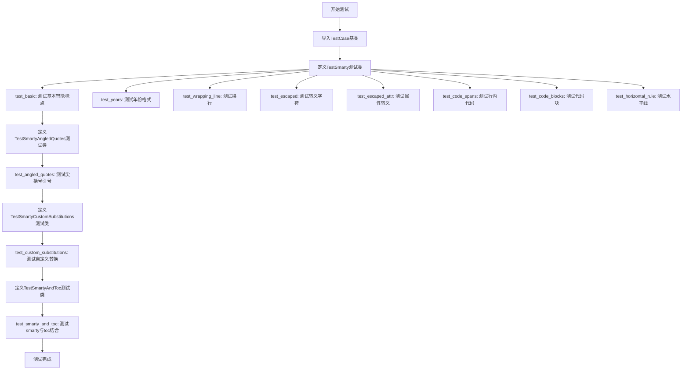
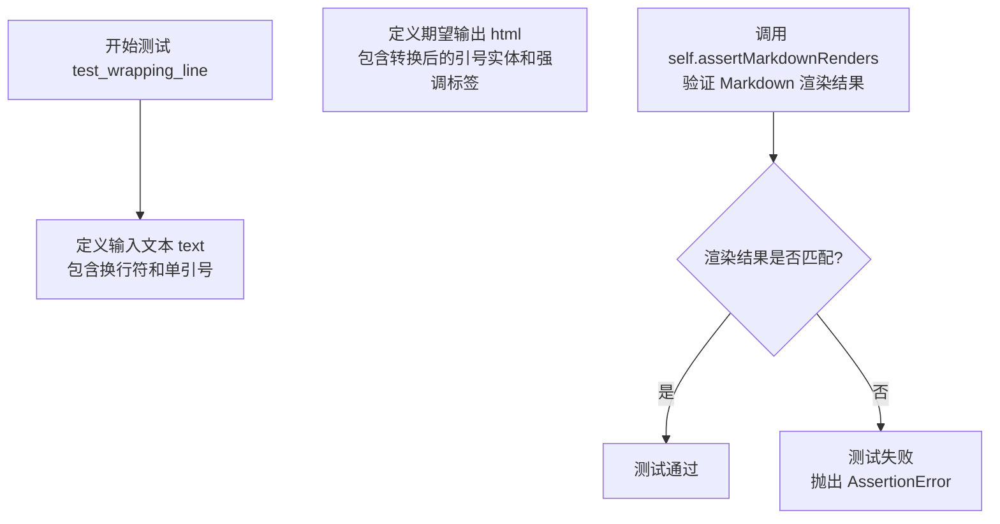
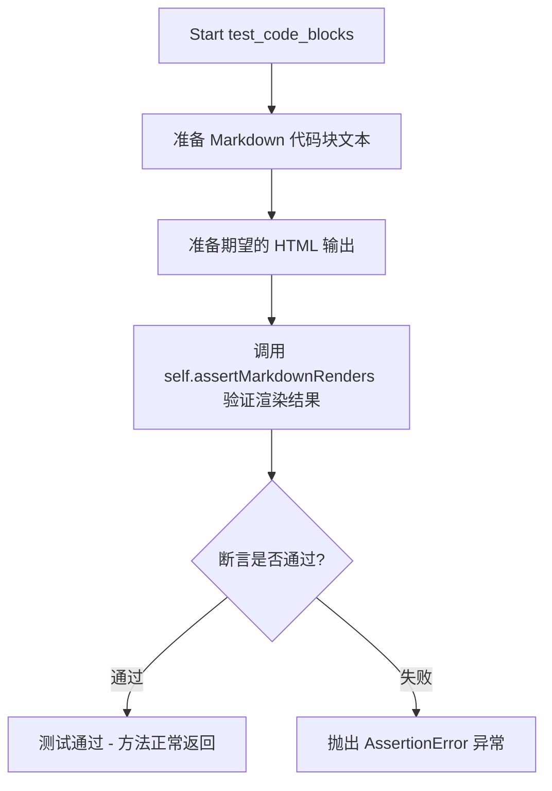
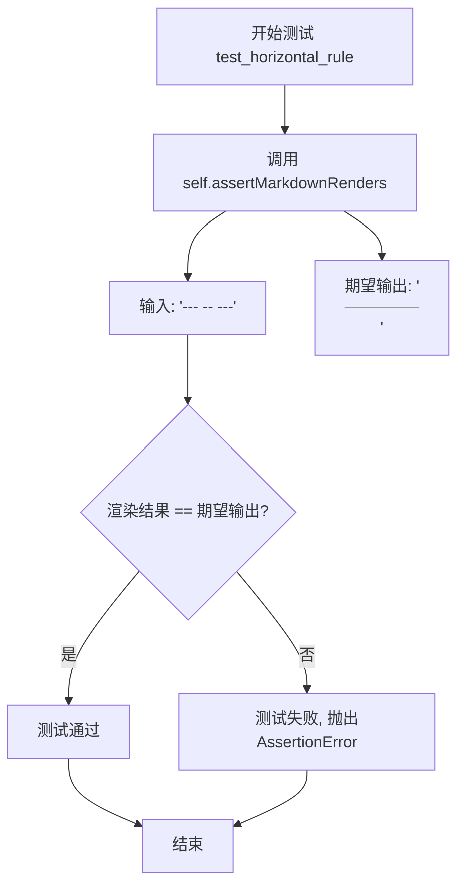
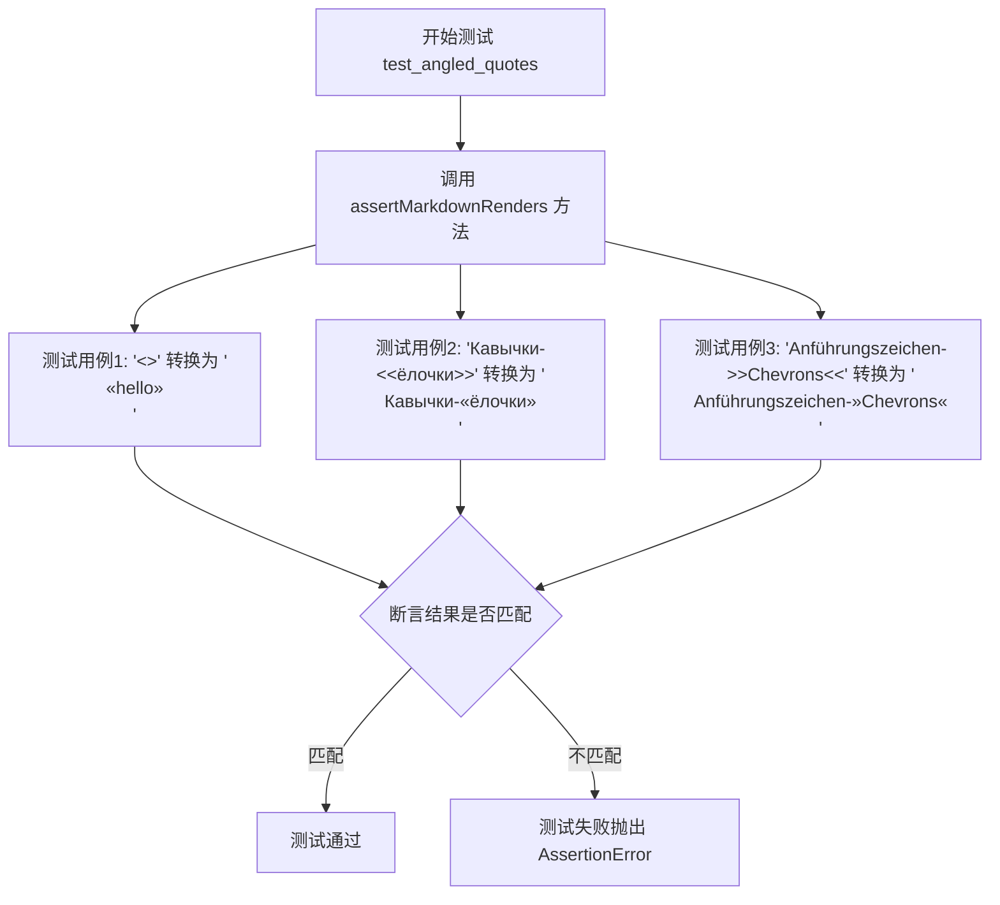
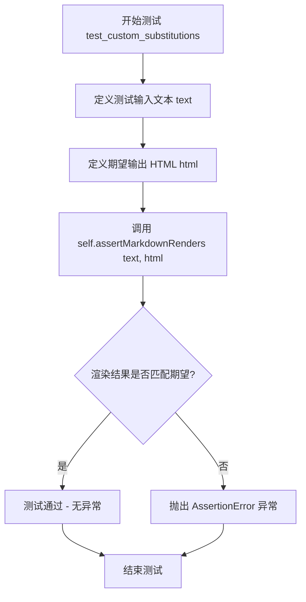

# `markdown\tests\test_syntax\extensions\test_smarty.py` 详细设计文档

该文件是Python Markdown项目的测试文件，专门用于测试smarty扩展的智能标点符号转换功能，包括引号、破折号、省略号、尖括号引号等的正确渲染，以及与toc扩展的兼容性测试。

## 整体流程



## 类结构

```
TestCase (基类)
├── TestSmarty
│   ├── test_basic
│   ├── test_years
│   ├── test_wrapping_line
│   ├── test_escaped
│   ├── test_escaped_attr
│   ├── test_code_spans
│   ├── test_code_blocks
│   └── test_horizontal_rule
├── TestSmartyAngledQuotes
test_angled_quotes
├── TestSmartyCustomSubstitutions
test_custom_substitutions
└── TestSmartyAndToc
    └── test_smarty_and_toc
```

## 全局变量及字段


### `TestSmarty.default_kwargs`
    
默认的测试参数配置，包含smarty扩展

类型：`dict`
    


### `TestSmartyAngledQuotes.default_kwargs`
    
默认的测试参数配置，包含smarty扩展及尖括号引号功能开启

类型：`dict`
    


### `TestSmartyCustomSubstitutions.default_kwargs`
    
默认的测试参数配置，包含smarty扩展、尖括号引号功能及自定义替换映射表

类型：`dict`
    


### `TestSmartyAndToc.default_kwargs`
    
默认的测试参数配置，同时启用smarty和toc两个扩展

类型：`dict`
    
    

## 全局函数及方法


### `TestCase.assertMarkdownRenders`

该方法是 Python-Markdown 测试框架中的核心验证方法，用于断言 Markdown 源码经过指定扩展或配置转换后，生成的 HTML 输出与期望值完全匹配，并可额外验证返回的元数据属性。

参数：

-   `self`：`TestCase` 实例，调用该方法的测试类实例本身
-   `source`：`str`，待转换的 Markdown 格式源码文本
-   `expected`：`str`，期望输出的 HTML 字符串
-   `expected_attrs`：`dict`（可选），期望的额外属性字典，如 `toc_tokens`、`ancestors` 等，用于验证转换器返回的元数据

返回值：`None`，该方法通过抛出断言错误来表示测试失败，否则视为通过

#### 流程图

```mermaid
flowchart TD
    A[调用 assertMarkdownRenders] --> B[调用 convert 将 source 转换为 HTML]
    B --> C{HTML == expected?}
    C -->|是| D{expected_attrs 存在?}
    C -->|否| E[抛出 AssertionError]
    D -->|是| F[遍历 expected_attrs 的键值对]
    D -->|否| G[测试通过]
    F --> H{attrs[key] == value?}
    H -->|是| 继续遍历
    H -->|否| I[抛出 AssertionError]
    G --> J[结束]
    I --> J
    E --> J
```

#### 带注释源码

```python
def assertMarkdownRenders(self, source, expected, expected_attrs=None):
    """
    断言 Markdown 源码转换后的 HTML 与期望值匹配。
    
    参数:
        source: Markdown 格式的输入文本
        expected: 期望的 HTML 输出
        expected_attrs: 可选的期望属性字典，用于验证额外返回的元数据
    """
    # 使用 convert 方法将 Markdown 源码转换为 HTML
    result = self.convert(source)
    
    # 断言 HTML 结果与期望输出相等
    self.assertEqual(result, expected)
    
    # 如果提供了 expected_attrs，则验证返回的属性
    if expected_attrs is not None:
        # 获取实际返回的属性（通常是 convert 方法的第二个返回值）
        # 假设 self.convert() 返回 (html, attrs) 元组
        _, attrs = self.convert(source)
        
        # 遍历期望的属性键值对进行验证
        for key, value in expected_attrs.items():
            self.assertEqual(attrs[key], value)
```


### `TestSmarty.test_basic`

该方法是Python Markdown项目中TestSmarty测试类的核心测试方法，用于验证smarty扩展对英文标点符号的智能转换功能，包括将直引号转换为弯引号、双引号、破折号转换为em-dash、三个点转换为省略号等。

参数：
- `self`：TestCase，Python unittest测试框架的基类实例，表示测试类本身

返回值：`None`，该方法为测试方法，通过assertMarkdownRenders进行断言验证，不返回任何值

#### 流程图

```mermaid
graph TD
    A[开始 test_basic] --> B[调用 assertMarkdownRenders<br/>输入: It's fun. What's fun?<br/>期望输出: <p>It&rsquo;s fun. What&rsquo;s fun?</p>]
    B --> C{断言验证}
    C -->|通过| D[调用 assertMarkdownRenders<br/>输入: "Isn't this fun"? --- she said...<br/>期望输出: <p>&ldquo;Isn&rsquo;t this fun&rdquo;? &mdash; she said&hellip;</p>]
    D --> E{断言验证}
    E -->|通过| F[继续处理剩余13个测试用例...]
    F --> G{遍历完成?}
    G -->|是| H[结束 - 所有测试通过]
    G -->|否| I[执行下一个 assertMarkdownRenders]
    I --> C
    C -->|失败| J[抛出 AssertionError]
```

#### 带注释源码

```python
def test_basic(self):
    """
    测试smarty扩展的基本功能：智能引号、破折号和省略号的转换
    测试14种不同的标点符号转换场景
    """
    # 测试1：基本单引号转换 - 's 转换为 ’s
    self.assertMarkdownRenders(
        "It's fun. What's fun?",
        '<p>It&rsquo;s fun. What&rsquo;s fun?</p>'
    )
    
    # 测试2：双引号、单引号、破折号、省略号综合转换
    # "..." → "..."  --- → —  ... → …
    self.assertMarkdownRenders(
        '"Isn\'t this fun"? --- she said...',
        '<p>&ldquo;Isn&rsquo;t this fun&rdquo;? &mdash; she said&hellip;</p>'
    )
    
    # 测试3：双引号内嵌套单引号
    self.assertMarkdownRenders(
        '"\'Quoted\' words in a larger quote."',
        '<p>&ldquo;&lsquo;Quoted&rsquo; words in a larger quote.&rdquo;</p>'
    )
    
    # 测试4：单引号内嵌套双引号
    self.assertMarkdownRenders(
        '\'Quoted "words" in a larger quote.\'',
        '<p>&lsquo;Quoted &ldquo;words&rdquo; in a larger quote.&rsquo;</p>'
    )
    
    # 测试5：双引号内嵌套单引号（末尾）
    self.assertMarkdownRenders(
        '"Quoted words at the \'end.\'"',
        '<p>&ldquo;Quoted words at the &lsquo;end.&rsquo;&rdquo;</p>'
    )
    
    # 测试6：单引号内嵌套双引号（末尾）
    self.assertMarkdownRenders(
        '\'Quoted words at the "end."\'',
        '<p>&lsquo;Quoted words at the &ldquo;end.&rdquo;&rsquo;</p>'
    )
    
    # 测试7：括号内嵌套双引号和单引号
    self.assertMarkdownRenders(
        '(He replied, "She said \'Hello.\'")',
        '<p>(He replied, &ldquo;She said &lsquo;Hello.&rsquo;&rdquo;)</p>'
    )
    
    # 测试8：HTML标签内嵌套引号（验证smarty不破坏HTML结构）
    self.assertMarkdownRenders(
        '<span>He replied, "She said \'Hello.\'"</span>',
        '<p><span>He replied, &ldquo;She said &lsquo;Hello.&rsquo;&rdquo;</span></p>'
    )
    
    # 测试9：双引号与加粗组合
    self.assertMarkdownRenders(
        '"quoted" text and **bold "quoted" text**',
        '<p>&ldquo;quotedrdquo; text and <strong>bold &ldquo;quotedrdquo; text</strong></p>'
    )
    
    # 测试10：单引号与加粗组合
    self.assertMarkdownRenders(
        "'quoted' text and **bold 'quoted' text**",
        '<p>&lsquo;quoted&rsquo; text and <strong>bold &lsquo;quoted&rsquo; text</strong></p>'
    )
    
    # 测试11：em-dashes和ellipses转换
    # --- → —  ... → …
    self.assertMarkdownRenders(
        'em-dashes (---) and ellipes (...)',
        '<p>em-dashes (&mdash;) and ellipes (&hellip;)</p>'
    )
    
    # 测试12：链接与引号组合
    self.assertMarkdownRenders(
        '"[Link](http://example.com)" --- she said.',
        '<p>&ldquo;<a href="http://example.com">Link</a>&rdquo; &mdash; she said.</p>'
    )
    
    # 测试13：引号内省略号
    self.assertMarkdownRenders(
        '"Ellipsis within quotes..."',
        '<p>&ldquo;Ellipsis within quotes&hellip;&rdquo;</p>'
    )
    
    # 测试14：斜体后接's的转换（测试&rsquo;的使用）
    self.assertMarkdownRenders(
        "*Custer*'s Last Stand",
        "<p><em>Custer</em>&rsquo;s Last Stand</p>"
    )
```


### `TestSmarty.test_years`

该测试方法用于验证 Markdown 智能标点（Smarty）扩展对年份和年代表达式的转换功能，包括将双连字符（--）转换为短横线（&ndash;）、三连字符（---）转换为长破折号（&mdash;），以及将年份后的撇号（'）转换为弯引号（&rsquo;）。

参数： 无显式参数（继承自 TestCase 的测试方法，self 为实例自身）

返回值：`None`，该方法为测试用例，通过 assertMarkdownRenders 断言验证渲染结果，不返回具体值

#### 流程图

```mermaid
flowchart TD
    A[开始 test_years 测试] --> B[调用 assertMarkdownRenders 验证 '1440--80's']
    B --> C[调用 assertMarkdownRenders 验证 "1440--'80s"]
    C --> D[调用 assertMarkdownRenders 验证 "1440---'80s"]
    D --> E[调用 assertMarkdownRenders 验证 "1960's"]
    E --> F[调用 assertMarkdownRenders 验证 "one two '60s"]
    F --> G[调用 assertMarkdownRenders 验证 "'60s"]
    G --> H[所有断言通过，测试结束]
    
    B -.->|失败| I[抛出 AssertionError]
    C -.->|失败| I
    D -.->|失败| I
    E -.->|失败| I
    F -.->|失败| I
    G -.->|失败| I
```

#### 带注释源码

```python
def test_years(self):
    """
    测试年份和年代表达式的智能标点转换功能
    
    验证以下转换规则：
    1. 双连字符（--）转换为短横线（&ndash;）
    2. 三连字符（---）转换为长破折号（&mdash;）
    3. 撇号（'）转换为弯引号（&rsquo;）
    """
    
    # 测试年份范围表示：1440--80's
    # 预期：双连字符转换为 &ndash;，撇号转换为 &rsquo;
    self.assertMarkdownRenders(
        "1440--80's",
        '<p>1440&ndash;80&rsquo;s</p>'
    )
    
    # 测试年份范围：1440--'80s
    # 预期：双连字符转换为 &ndash;，撇号单独出现时也转换
    self.assertMarkdownRenders(
        "1440--'80s",
        '<p>1440&ndash;&rsquo;80s</p>'
    )
    
    # 测试长破折号：1440---'80s
    # 预期：三连字符转换为 &mdash;
    self.assertMarkdownRenders(
        "1440---'80s",
        '<p>1440&mdash;&rsquo;80s</p>'
    )
    
    # 测试普通年份：1960's
    # 预期：年份后的撇号转换为右单引号 &rsquo;
    self.assertMarkdownRenders(
        "1960's",
        '<p>1960&rsquo;s</p>'
    )
    
    # 测试句子中的年代：one two '60s
    # 验证撇号在单词后面时的转换
    self.assertMarkdownRenders(
        "one two '60s",
        '<p>one two &rsquo;60s</p>'
    )
    
    # 测试独立的年代表示：'60s
    # 验证以撇号开头的年代表达式的转换
    self.assertMarkdownRenders(
        "'60s",
        '<p>&rsquo;60s</p>'
    )
```


### `TestSmarty.test_wrapping_line`

该测试方法用于验证 Smarty 扩展在处理跨行文本时的智能引号和强调标记是否正确转换。它测试当 Markdown 文本中存在换行符时，引号和强调标记仍能被正确识别并转换为对应的 HTML 实体。

参数：

- `self`：`TestCase`，测试类实例本身，继承自 `markdown.test_tools.TestCase`，用于调用 `assertMarkdownRenders` 验证渲染结果

返回值：`None`，该方法为测试用例，无返回值，通过断言验证功能

#### 流程图



#### 带注释源码

```python
def test_wrapping_line(self):
    """
    测试 Smarty 扩展处理跨行文本的能力。
    验证换行符不会破坏智能引号和强调标记的转换。
    """
    # 定义输入文本：包含单引号和星号强调标记，以及换行符
    text = (
        "A line that 'wraps' with\n"  # 原始文本中的换行符
        "*emphasis* at the beginning of the next line."
    )
    # 定义期望的 HTML 输出
    html = (
        '<p>A line that &lsquo;wraps&rsquo; with\n'  # 单引号转换为左单引号实体
        '<em>emphasis</em> at the beginning of the next line.</p>'  # 星号转换为 em 标签
    )
    # 调用父类方法验证 Markdown 渲染结果是否与期望一致
    self.assertMarkdownRenders(text, html)
```


### `TestSmarty.test_escaped`

该方法用于测试 Markdown 的 smarty 扩展对转义字符的处理能力，验证各种转义序列（如 `\\--`、`\\\'`、`\\"`、`\\...`）在转换为 HTML 时能正确保留或取消转义。

参数：

- `self`：实例方法隐含参数，TestSmarty 类实例本身

返回值：`None`，无返回值（测试方法）

#### 流程图

```mermaid
flowchart TD
    A[开始测试] --> B[测试转义连字符<br/>'Escaped \\-- ndash' -> '<p>Escaped -- ndash</p>']
    B --> C[测试转义单双引号<br/>'\\\'Escaped\\\' \\"quotes\\"' -> '<p>\'Escaped\' &quot;quotes&quot;</p>']
    C --> D[测试转义省略号<br/>'Escaped ellipsis\\...' -> '<p>Escaped ellipsis...</p>']
    D --> E[测试混合转义：单引号内含转义双引号<br/>'\\'Escaped \\&quot;quotes\\&quot; in real ones\\'' -> '<p>&lsquo;Escaped &quot;quotes&quot; in real ones&rsquo;</p>']
    E --> F[测试混合转义：转义单引号内含真实双引号<br/>'\\\'&quot;Real&quot; quotes in escaped ones\\\'' -> '<p>&rsquo;&ldquo;Realrdquo; quotes in escaped ones&amp;rsquo;</p>']
    F --> G[结束测试]
```

#### 带注释源码

```python
def test_escaped(self):
    """
    测试 smarty 扩展的转义功能
    
    验证 Markdown 中的转义字符（反斜杠）在 smarty 扩展下
    能够正确处理以下场景：
    - 转义连字符（--）和省略号（...）
    - 转义单引号和双引号
    - 嵌套引号的转义（真实引号在转义引号内，或反之）
    """
    
    # 测试1：转义连字符
    # 输入：'Escaped \\-- ndash'（\\转义了连字符前的反斜杠）
    # 期望输出：'<p>Escaped -- ndash</p>'（--被当作普通文本输出）
    self.assertMarkdownRenders(
        'Escaped \\-- ndash',
        '<p>Escaped -- ndash</p>'
    )
    
    # 测试2：转义单引号和双引号
    # 输入：'\\'Escaped\\' \\"quotes\\"'（转义了单双引号）
    # 期望输出：'<p>\'Escaped\' "quotes"</p>'（引号作为普通字符输出）
    self.assertMarkdownRenders(
        '\\\'Escaped\\\' \\"quotes\\"',
        '<p>\'Escaped\' "quotes"</p>'
    )
    
    # 测试3：转义省略号
    # 输入：'Escaped ellipsis\\...'（\\转义了省略号前的反斜杠）
    # 期望输出：'<p>Escaped ellipsis...</p>'（...作为普通文本输出）
    self.assertMarkdownRenders(
        'Escaped ellipsis\\...',
        '<p>Escaped ellipsis...</p>'
    )
    
    # 测试4：单引号包裹转义双引号
    # 输入：'\\'Escaped \\"quotes\\" in real ones\\''（单引号内包含转义双引号）
    # 期望输出：'<p>&lsquo;Escaped "quotes" in real ones&rsquo;</p>'
    # （外部单引号被转换为智能左单引号&lsquo;和右单引号&rsquo;，内部双引号保持原样）
    self.assertMarkdownRenders(
        '\'Escaped \\"quotes\\" in real ones\'',
        '<p>&lsquo;Escaped "quotes" in real ones&rsquo;</p>'
    )
    
    # 测试5：转义单引号包裹真实双引号
    # 输入：'\\\'"Real" quotes in escaped ones\\\''（转义单引号内包含真实双引号）
    # 期望输出：'<p>\'&ldquo;Realrdquo; quotes in escaped ones\'</p>'
    # （外部转义单引号被转换为普通单引号，内部双引号被转换为智能双引号）
    self.assertMarkdownRenders(
        '\\\'"Real" quotes in escaped ones\\\'',
        "<p>'&ldquo;Realrdquo; quotes in escaped ones'</p>"
    )
```


### `TestSmarty.test_escaped_attr`

该测试方法用于验证 Markdown 解析器在处理带有转义字符的图片标签时，能够正确地将转义的双引号转换为 HTML 实体字符。

参数：

- `self`：TestCase 实例，测试框架传入的当前测试对象

返回值：`None`，测试方法不返回任何值，仅通过断言验证结果

#### 流程图

```mermaid
flowchart TD
    A[开始测试 test_escaped_attr] --> B[调用 assertMarkdownRenders 方法]
    B --> C[输入 Markdown: ]
    C --> D[期望输出 HTML: <p></p>]
    D --> E{解析结果是否匹配期望}
    E -->|是| F[测试通过]
    E -->|否| G[测试失败，抛出 AssertionError]
```

#### 带注释源码

```python
def test_escaped_attr(self):
    """
    测试带转义字符的图片属性是否正确处理
    
    验证 Markdown 解析器能够正确处理图片标签中转义的双引号字符，
    并将其转换为 HTML 实体 &quot;
    """
    # 调用父类测试框架的断言方法，验证 Markdown 到 HTML 的转换
    # 输入:  - 图片语法，alt 文本中包含转义的双引号
    # 期望输出: <p></p>
    # 转换规则: Markdown 中的 \" 转换为 HTML 实体 &quot;
    self.assertMarkdownRenders(
        '',
        '<p></p>'
    )
```


### `TestSmarty.test_code_spans`

该方法用于测试 Markdown 的 smarty 扩展是否正确处理代码片段（code spans）中的特殊字符，确保代码片段内的引号、破折号、省略号等字符不被转换为智能标点符号，保持原始形式输出。

参数：

- `self`：`TestSmarty`，测试用例类的实例，继承自 TestCase，用于调用继承的 assertMarkdownRenders 断言方法

返回值：`None`，测试方法无返回值，通过断言判断测试是否通过

#### 流程图

```mermaid
graph TD
    A[开始 test_code_spans] --> B[调用 self.assertMarkdownRenders]
    B --> C[输入Markdown文本:<br/>Skip `"code" -- --- 'spans' ...`.]
    C --> D[期望HTML输出:<br/><p>Skip <code>"code" -- --- 'spans' ...</code>.</p>]
    D --> E{Markdown处理器处理文本}
    E --> F{实际输出 == 期望输出?}
    F -->|是| G[测试通过<br/>返回None]
    F -->|否| H[抛出AssertionError<br/>测试失败]
```

#### 带注释源码

```python
def test_code_spans(self):
    """
    测试代码片段（code spans）中的特殊字符不被转换为智能标点符号。
    
    代码片段使用反引号（`）包裹，其内部的内容应当保持原始字符形式，
    不受smarty扩展的智能引号、破折号、省略号转换规则影响。
    """
    # 调用父类的断言方法，验证Markdown渲染结果
    self.assertMarkdownRenders(
        # 输入：包含代码片段的Markdown文本
        # 代码片段内包含引号、双破折号、三破折号、单引号和省略号
        'Skip `"code" -- --- \'spans\' ...`.',
        
        # 期望输出：HTML渲染结果
        # 代码片段内容保持原始形式，不进行smarty转换
        '<p>Skip <code>"code" -- --- \'spans\' ...</code>.</p>'
    )
```


### `TestSmarty.test_code_blocks`

该方法是 `TestSmarty` 测试类中的一个测试方法，用于验证 Markdown 解析器在处理代码块（code blocks）时能够正确地跳过智能标点符号的转换。测试方法定义了一个包含代码块的 Markdown 文本和期望的 HTML 输出，然后通过 `assertMarkdownRenders` 方法验证解析结果的正确性。

参数：

- `self`：`TestSmarty`，测试类的实例对象，包含测试所需的配置和方法

返回值：`None`，该方法为测试方法，不返回任何值，仅通过断言验证 Markdown 渲染结果

#### 流程图



#### 带注释源码

```python
def test_code_blocks(self):
    """
    测试代码块中的智能标点符号转换是否被正确跳过。
    
    代码块内的内容不应该被 smarty 扩展进行智能标点替换，
    例如引号、短破折号、长破折号和省略号等应保持原样。
    """
    # 定义输入的 Markdown 文本，包含一个缩进的代码块
    text = (
        '    Also skip "code" \'blocks\'\n'  # 四个空格缩进表示代码块
        '    foo -- bar --- baz ...'        # 代码块内的内容不应被转换
    )
    
    # 定义期望的 HTML 输出
    html = (
        '<pre><code>Also skip "code" \'blocks\'\n'  # 代码块保持原始字符
        'foo -- bar --- baz ...\n'                 # 短破折号、长破折号、省略号保持原样
        '</code></pre>'                            # 使用 pre 和 code 标签包裹
    )
    
    # 调用父类的断言方法验证 Markdown 渲染结果
    # 该方法会将 Markdown 解析为 HTML 并与期望输出进行比较
    self.assertMarkdownRenders(text, html)
```


### `TestSmarty.test_horizontal_rule`

该方法是一个单元测试函数，用于测试Markdown解析器在使用smarty扩展时对水平线（horizontal rule）的渲染功能是否正确。它通过调用测试框架的`assertMarkdownRenders`方法，验证输入字符串`--- -- ---`能否正确转换为HTML水平线标签`<hr />`。

参数：

- `self`：`TestSmarty`类实例，隐式参数，表示测试类本身

返回值：`None`，无返回值（测试方法通过断言验证，不返回具体值）

#### 流程图



#### 带注释源码

```python
def test_horizontal_rule(self):
    """
    测试Markdown水平线（horizontal rule）的smarty扩展渲染功能。
    
    验证输入 '--- -- ---' 会被正确转换为HTML水平线标签 '<hr />'。
    其中 '---' 代表em-dash (&#x2014;)，'--' 代表en-dash (&#x2013;)，
    但在smarty扩展的上下文中，多个连续的分隔符会被解析为水平线。
    """
    # 使用assertMarkdownRenders方法验证Markdown到HTML的转换
    # 参数1: 原始Markdown文本
    # 参数2: 期望的HTML输出
    self.assertMarkdownRenders('--- -- ---', '<hr />')
```


### `TestSmartyAngledQuotes.test_angled_quotes`

该方法是一个单元测试，用于验证 Markdown 的 smarty 扩展在启用 smart_angled_quotes 选项后，能够正确地将尖括号 `<<` 和 `>>` 转换为对应的 HTML 实体 `&laquo;`（左尖括号）和 `&raquo;`（右尖括号），支持多种语言的引号转换。

参数：

- `self`：`TestCase`，pytest 测试框架的测试用例基类实例，包含 assertMarkdownRenders 等测试辅助方法

返回值：`None`，测试方法无返回值，通过断言验证 Markdown 渲染结果

#### 流程图



#### 带注释源码

```python
class TestSmartyAngledQuotes(TestCase):
    """测试 smarty 扩展的尖括号引号转换功能"""
    
    # 类属性：定义测试所需的默认参数
    default_kwargs = {
        'extensions': ['smarty'],  # 加载 smarty 扩展
        'extension_configs': {
            'smarty': {
                'smart_angled_quotes': True,  # 启用尖括号引号智能转换
            },
        },
    }

    def test_angled_quotes(self):
        """
        测试尖括号引号的智能转换功能
        
        验证以下转换：
        1.英文双尖括号 <<hello>> -> &laquo;hello&raquo;
        2.俄文单尖括号 Кавычки-<<ёлочки>> -> Кавычки-&laquo;ёлочки&raquo;
        3.德文反序尖括号 Anführungszeichen->>Chevrons<< -> Anführungszeichen-&raquo;Chevrons&laquo;
        """
        
        # 测试英文尖括号转换
        self.assertMarkdownRenders(
            '<<hello>>',  # 输入：带尖括号的文本
            '<p>&laquo;hello&raquo;</p>'  # 期望输出：转换为 HTML 实体
        )
        
        # 测试俄文（西里尔字母）尖括号转换
        self.assertMarkdownRenders(
            'Кавычки-<<ёлочки>>',  # 输入：俄文文本包含尖括号
            '<p>Кавычки-&laquo;ёлочки&raquo;</p>'  # 期望输出：俄文+HTML实体
        )
        
        # 测试反向尖括号（德语风格）转换
        self.assertMarkdownRenders(
            'Anführungszeichen->>Chevrons<<',  # 输入：德文文本，反向尖括号
            '<p>Anführungszeichen-&raquo;Chevrons&laquo;</p>'  # 期望输出：反向转换
        )
```


### `TestSmartyCustomSubstitutions.test_custom_substitutions`

这是一个测试方法，用于验证 Markdown 的 smarty 扩展能够正确处理自定义替换规则，包括自定义的单引号、双引号、短破折号、长破折号、省略号以及尖括号的替换。

参数：

- `self`：无，TestCase 实例方法隐式参数，表示测试类实例本身

返回值：`None`，测试方法无返回值，通过 `assertMarkdownRenders` 断言验证渲染结果

#### 流程图



#### 带注释源码

```python
def test_custom_substitutions(self):
    """
    测试 smarty 扩展的自定义替换功能。
    验证自定义的引号、破折号、省略号和尖括号替换规则是否正确应用。
    """
    # 定义输入的 Markdown 文本
    # 包含尖括号 << >>、双引号、单引号、三个破折号 ---、两个破折号 --、省略号 ...
    text = (
        '<< The "Unicode char of the year 2014"\n'
        "is the 'mdash': ---\n"
        "Must not be confused with 'ndash'  (--) ... >>"
    )
    
    # 定义期望的 HTML 输出
    # 尖括号被替换为方括号 []（自定义替换规则）
    # 双引号被替换为自定义的 &bdquo; 和 &ldquo;
    # 单引号被替换为自定义的 &sbquo; 和 &lsquo;
    # 三个破折号 --- 被替换为长破折号 \u2014（mdash）
    # 两个破折号 -- 被替换为短破折号 \u2013（ndash）
    # 省略号 ... 被替换为省略号字符 \u2026
    html = (
        '<p>[ The &bdquo;Unicode char of the year 2014&ldquo;\n'
        'is the &sbquo;mdash&lsquo;: \u2014\n'
        'Must not be confused with &sbquo;ndash&lsquo;  (\u2013) \u2026 ]</p>'
    )
    
    # 调用父类的断言方法，验证 Markdown 渲染结果是否符合预期
    # 该方法会使用 default_kwargs 中配置的 extensions 和 extension_configs
    # 包括自定义的 substitutions 字典
    self.assertMarkdownRenders(text, html)
```


### `TestSmartyAndToc.test_smarty_and_toc`

该测试方法验证了 Markdown 在同时使用 `smarty`（智能标点符号）和 `toc`（目录）扩展时，对包含强调和代码的标题的渲染是否符合预期，包括生成的 HTML 结构、TOC 标记和元素属性。

参数：
- `self`：无需传入，由测试框架自动传递，代表测试类实例本身

返回值：`None`，该方法为测试用例，执行断言验证，不返回任何值

#### 流程图

```mermaid
flowchart TD
    A[测试开始] --> B[设置测试参数: extensions=['smarty', 'toc']]
    B --> C[调用 assertMarkdownRenders 进行渲染验证]
    C --> D[输入: '# *Foo* --- `bar`']
    D --> E[预期输出 HTML: '<h1 id="foo-bar"><em>Foo</em> &mdash; <code>bar</code></h1>']
    E --> F[预期属性: toc_tokens 包含 level=1, id='foo-bar', name='Foo &mdash; bar']
    F --> G[执行断言验证渲染结果]
    G --> H{验证是否通过}
    H -->|通过| I[测试通过]
    H -->|失败| J[测试失败并抛出 AssertionError]
```

#### 带注释源码

```python
def test_smarty_and_toc(self):
    """
    测试 Markdown 在同时使用 smarty 和 toc 扩展时对标题的渲染。
    
    验证要点：
    1. smarty 扩展将 '---' 转换为 '&mdash;' (em-dash)
    2. toc 扩展为标题生成 id 属性 'foo-bar'
    3. toc 扩展生成正确的 toc_tokens 包含标题信息
    """
    self.assertMarkdownRenders(
        # 输入 Markdown 文本：包含强调(*Foo*)、em-dash(---)和内联代码(`bar`)
        '# *Foo* --- `bar`',
        # 预期渲染的 HTML 输出
        '<h1 id="foo-bar"><em>Foo</em> &mdash; <code>bar</code></h1>',
        # 预期属性字典，包含 TOC 标记信息
        expected_attrs={
            'toc_tokens': [
                {
                    'level': 1,                    # 标题级别为 1
                    'id': 'foo-bar',               # 自动生成的标题 ID
                    'name': 'Foo &mdash; bar',     # TOC 中显示的名称
                    'html': '<em>Foo</em> &mdash; <code>bar</code>',  # 原始 HTML
                    'data-toc-label': '',          # 自定义标签（空）
                    'children': [],                # 无子章节
                },
            ],
        },
    )
```

## 关键组件


### Smarty 扩展

Python Markdown 的智能排版扩展，用于将纯文本标点符号转换为排版友好的 Unicode 字符，包括智能引号、破折号和省略号。

### 智能引号 (Smart Quotes)

将直引号转换为卷曲引号，支持单引号和双引号的互相嵌套，以及与强调、加粗等 Markdown 语法组合时的正确处理。

### 破折号与短横线 (Dashes)

将双短横线 (--) 转换为短破折号 (en-dash –)，三短横线 (---) 转换为长破折号 (em-dash —)，支持年份范围和复数形式的智能转换。

### 省略号 (Ellipsis)

将三个连续的点 (...) 转换为 Unicode 省略号字符 (…)，支持在引号内外的各种场景。

### 尖引号 (Angled Quotes)

通过 `smart_angled_quotes` 配置项启用，可将 `<<hello>>` 转换为尖引号 `«hello»`，支持多语言引号符号。

### 自定义替换 (Custom Substitutions)

通过 `substitutions` 配置项允许用户自定义字符替换映射，可覆盖默认的引号、破折号、省略号等字符的替换规则。

### 转义处理 (Escaping)

正确处理 Markdown 转义字符，确保转义的破折号、引号和省略号不会被转换为智能标点，保持原始字符输出。

### 代码块内智能标点 (Code Span/Block Handling)

在代码片段中保持原始标点字符不变，不对代码区域内的引号、破折号和省略号进行智能转换。

### 与其他扩展的集成 (Extension Integration)

测试与 TOC (目录) 扩展同时启用时的兼容性，确保智能标点转换不影响目录标记的生成和属性设置。


## 问题及建议


### 已知问题

-   **测试代码重复**：多个测试方法中存在大量重复的 `assertMarkdownRenders` 调用，未使用参数化测试（如 `pytest.mark.parametrize`），导致代码冗余且难以维护。
-   **硬编码的 HTML 断言**：测试用例中的预期 HTML 输出（如实体编码 `&rsquo;`、`&ldquo;` 等）均为硬编码字符串，与 smarty 扩展的实现细节紧密耦合。一旦扩展实现调整，测试需大量修改，降低了测试的鲁棒性。
-   **注释与实现不一致**：在 `TestSmartyCustomSubstitutions` 的 substitutions 字典中，注释 `# \`sb\` is not a typo!` 可能引起误解，且配置值与注释说明不够清晰，容易导致未来维护时的困惑。
-   **TOC 测试断言过于严格**：`TestSmartyAndToc` 中对 `toc_tokens` 的验证使用了精确的字典结构匹配，包括 `level`、`id`、`name`、`html`、`data-toc-label`、`children` 等所有字段。若 toc 扩展未来添加新字段或调整输出格式，测试将失败，降低了测试的适应性。
-   **边界条件覆盖不足**：`test_code_spans` 和 `test_code_blocks` 仅覆盖了基本的转义字符处理，未涵盖代码片段中可能出现的智能引号、链接、图像等复杂嵌套场景。

### 优化建议

-   **引入参数化测试**：利用 `pytest.mark.parametrize` 装饰器重构测试类，将相似的输入输出对合并为参数化测试，减少代码重复并提升可读性。
-   **解耦 HTML 断言**：将预期 HTML 输出抽取为常量或配置文件，或使用更灵活的断言方式（如正则匹配关键部分），以减少对实现细节的依赖。
-   **统一配置注释**：清理 `substitutions` 字典的注释，确保其与实际配置值一致，或采用更清晰的文档说明，避免未来维护时的混淆。
-   **放宽 TOC 断言**：对 `toc_tokens` 的验证改为部分匹配或关键字段验证，允许扩展在未来添加额外字段，提高测试的鲁棒性。
-   **增强边界测试**：添加更多复杂场景的测试用例，如代码片段中包含智能引号、多层嵌套标记、链接和图像等，以提高测试覆盖率。

## 其它


### 设计目标与约束

本测试文件旨在验证Python Markdown库的smarty扩展功能，该扩展负责将Markdown文本中的普通引号、破折号和省略号转换为对应的HTML实体（如&quot;&ldquo;&rdquo;、&quot;&rsquo;&rsquo;、&quot;&mdash;&quot;、&quot;&hellip;&quot;等）。测试采用Python标准unittest框架，通过继承TestCase类实现断言验证。测试约束包括：仅测试smarty扩展的核心转换功能，不涉及其他Markdown语法元素的转换；测试用例覆盖单引号、双引号、角引号、破折号、省略号等多种标点符号的智能替换场景。

### 错误处理与异常设计

测试文件中未显式定义异常处理机制，因为测试用例主要验证正确输入下的预期输出。测试框架本身会捕获断言失败（AssertionError）并报告具体的预期值与实际值差异。若Markdown转换过程中出现异常，测试将失败并显示完整的堆栈跟踪信息。测试采用self.assertMarkdownRenders()方法进行渲染结果验证，该方法内部封装了markdown库的调用逻辑和结果比对逻辑。

### 数据流与状态机

测试数据流遵循以下路径：输入Markdown文本字符串 → markdown.markdown()方法配合smarty扩展进行转换 → 输出HTML字符串 → assertMarkdownRenders()方法比对预期HTML与实际HTML。测试不存在显式状态机，因为每次测试方法独立运行且不保存状态。default_kwargs类属性定义了全局测试配置（extensions和extension_configs），各测试类可覆盖或继承该配置。TestSmarty类使用默认配置，TestSmartyAngledQuotes类启用smart_angled_quotes选项，TestSmartyCustomSubstitutions类进一步自定义substitutions替换规则。

### 外部依赖与接口契约

本测试文件依赖以下外部组件：markdown核心库（markdown模块）提供markdown()转换函数；smarty扩展（markdown.extensions.smarty）提供智能标点替换功能；toc扩展（markdown.extensions.toc）在TestSmartyAndToc类中用于测试与目录扩展的兼容性；TestCase基类（markdown.test_tools.TestCase）提供assertMarkdownRenders()辅助测试方法。接口契约方面：markdown.markdown()接受待转换文本字符串和extensions、extension_configs等参数，返回HTML字符串；assertMarkdownRenders()接受input_text、expected_html和可选的expected_attrs参数，内部调用markdown.markdown()并验证结果。

### 配置管理

测试配置通过类属性default_kwargs统一管理，分为三个层级：TestSmarty类使用默认配置仅启用smarty扩展；TestSmartyAngledQuotes类在默认基础上启用smart_angled_quotes选项以支持角引号（&laquo;&raquo;）；TestSmartyCustomSubstitutions类支持完整的substitutions字典自定义替换规则，可覆盖默认的引号、破折号、省略号等字符映射。配置以Python字典形式传递至markdown.markdown()的extension_configs参数。

### 测试覆盖分析

测试用例覆盖以下场景：基本标点转换（单引号、双引号、破折号、省略号）、年份格式处理（1960's、'60s）、行内换行处理、转义字符处理（\\--、\\'...\\'）、代码span和code block内的标点跳过、水平线规则、与TOC扩展的联合测试、自定义替换规则验证、角引号启用选项。每个测试方法聚焦单一功能点，采用明确的输入-输出断言。测试未覆盖的边界情况包括：嵌套多层引号、混合语言字符集、极端长文本性能等。

### 集成测试场景

本测试文件作为Python Markdown项目的单元测试套件一部分，与其他测试文件共同验证各扩展功能的正确性。TestSmartyAndToc类验证smarty扩展与toc扩展的共存兼容性，确保两个扩展的转换规则不会相互干扰。测试文件通过CI/CD流程在每次代码提交时执行，确保smarty扩展的修改不会破坏现有功能或引入回归问题。

### 性能注意事项

测试文件本身不涉及性能基准测试，但smarty扩展的实现需考虑正则表达式匹配效率。substitutions字典的遍历顺序可能影响转换性能，大型文本的转换可能涉及多次字符串替换操作。测试用例中未包含大规模输入的性能验证，若需优化应使用Python的re.compile()预编译正则表达式并使用 functools.lru_cache 缓存替换映射表。

### 版本兼容性

代码文件头部声明Python编码格式为UTF-8。测试框架依赖Python标准库unittest和markdown库自身。Python版本兼容性需参考markdown项目的要求（通常支持Python 3.6+）。测试中使用的HTML实体（如&amp;mdash;、&amp;hellip;、&amp;lsquo;、&amp;ldquo;）符合HTML5标准，现代浏览器均能正确解析。Unicode字符（如\\u2013、\\u2014、\\u2026）确保跨平台一致性。

    