# `markdown\tests\test_syntax\extensions\test_tables.py` 详细设计文档

这是一个Python Markdown库的测试文件，专门用于测试表格扩展（TableExtension）的各种功能，包括空单元格、单边/双边表格、列对齐、样式、代码块、内联代码、特殊字符转义等问题。

## 整体流程

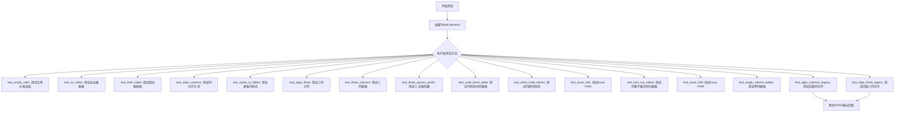

## 类结构

```
TestCase (unittest基类)
└── TestTableBlocks (测试类)
    ├── test_empty_cells
    ├── test_no_sides
    ├── test_both_sides
    ├── test_align_columns
    ├── test_styles_in_tables
    ├── test_align_three
    ├── test_three_columns
    ├── test_three_spaces_prefix
    ├── test_code_block_table
    ├── test_inline_code_blocks
    ├── test_issue_440
    ├── test_lists_not_tables
    ├── test_issue_449
    ├── test_single_column_tables
    ├── test_align_columns_legacy
    └── test_align_three_legacy
```

## 全局变量及字段


### `TestCase`
    
Python unittest测试框架基类，用于创建测试用例

类型：`class`
    


### `TableExtension`
    
Markdown库的表格扩展类，提供表格语法解析和HTML转换功能

类型：`class`
    


### `markdown`
    
Python Markdown库的主模块，实现Markdown到HTML的转换

类型：`module`
    


### `text`
    
测试用例中用于验证的Markdown格式文本输入

类型：`str`
    


### `extensions`
    
Markdown转换器使用的扩展列表，如['tables']或[TableExtension(...)]

类型：`list`
    


### `TestTableBlocks.TestTableBlocks`
    
继承自TestCase的表格功能测试类，用于验证Markdown表格解析的各种场景

类型：`class`
    
    

## 全局函数及方法


### `TestTableBlocks.test_empty_cells`

测试空单元格（使用 non-breaking space，即 `&nbsp;`）的渲染功能，验证 Markdown 表格扩展能够正确处理包含空内容的单元格。

参数：

- `self`：TestCase 实例，测试框架隐式传入的测试类实例

返回值：`None`（无返回值），通过 `assertMarkdownRenders` 方法进行断言验证

#### 流程图

```mermaid
flowchart TD
    A[开始测试 test_empty_cells] --> B[定义包含空单元格的 Markdown 表格文本]
    B --> C[调用 assertMarkdownRenders 方法进行验证]
    C --> D[内部调用 markdown.process_markdown 将 Markdown 转换为 HTML]
    D --> E{转换结果与期望HTML是否匹配}
    E -->|是| F[测试通过]
    E -->|否| G[测试失败，抛出 AssertionError]
    
    subgraph 输入数据
    B1[第一列空<br/>第二列 'Second Header']
    B2[第一行: 空 | Content Cell<br/>第二行: Content Cell | 空]
    end
    
    subgraph 期望输出
    C1[表头: &nbsp; | Second Header]
    C2[行1: &nbsp; | Content Cell]
    C3[行2: Content Cell | &nbsp;]
    end
    
    B --> B1
    B --> B2
    C --> C1
    C --> C2
    C --> C3
```

#### 带注释源码

```python
def test_empty_cells(self):
    """Empty cells (`nbsp`)."""

    # 定义测试用的 Markdown 表格文本
    # 包含空单元格（使用空格和 &nbsp;）
    # 第一列：空单元格 | Content Cell
    # 第二列：Content Cell | 空单元格
    text = """
   | Second Header
------------- | -------------
   | Content Cell
Content Cell  |  
"""

    # 使用 assertMarkdownRenders 验证 Markdown 到 HTML 的转换
    # 参数1: 输入的 Markdown 文本
    # 参数2: 期望输出的 HTML 文本
    # 参数3: 使用的扩展列表（tables 扩展）
    self.assertMarkdownRenders(
        text,
        # 使用 self.dedent 去除每行的前导空白
        self.dedent(
            """
            <table>
            <thead>
            <tr>
            <th> </th>           <!-- 表头第一列：空单元格渲染为 &nbsp; -->
            <th>Second Header</th>  <!-- 表头第二列 -->
            </tr>
            </thead>
            <tbody>
            <tr>
            <td> </td>           <!-- 第一行第一列：空单元格渲染为 &nbsp; -->
            <td>Content Cell</td>   <!-- 第一行第二列：正常内容 -->
            </tr>
            <tr>
            <td>Content Cell</td>   <!-- 第二行第一列：正常内容 -->
            <td> </td>           <!-- 第二行第二列：空单元格渲染为 &nbsp; -->
            </tr>
            </tbody>
            </table>
            """
        ),
        extensions=['tables']  # 启用 tables 扩展来处理 Markdown 表格语法
    )
```


### `TestTableBlocks.test_no_sides`

该方法用于测试 Markdown 表格解析功能，验证当表格文本两侧不包含管道符（|）时，表格扩展能够正确将其转换为 HTML 表格结构。

参数：

- `self`：TestCase，当前测试类实例，无需显式传递

返回值：`None`，无返回值（测试方法）

#### 流程图

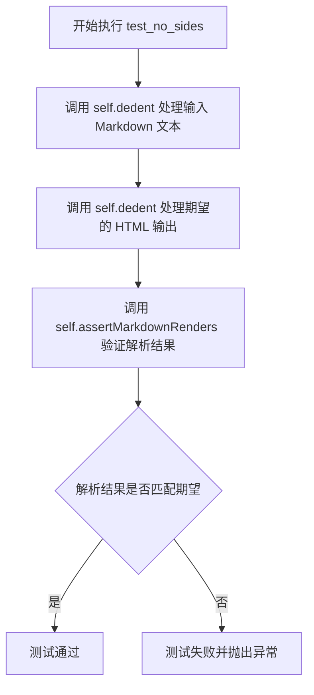

#### 带注释源码

```python
def test_no_sides(self):
    """测试无管道符边框的表格解析"""
    
    # 定义输入的 Markdown 表格文本（不带两侧管道符）
    # 格式：Header1 | Header2
    #       ------- | -------
    #       Cell1   | Cell2
    text = self.dedent(
        """
        First Header  | Second Header
        ------------- | -------------
        Content Cell  | Content Cell
        Content Cell  | Content Cell
        """
    )

    # 定义期望输出的 HTML 表格
    expected_output = self.dedent(
        """
        <table>
        <thead>
        <tr>
        <th>First Header</th>
        <th>Second Header</th>
        </tr>
        </thead>
        <tbody>
        <tr>
        <td>Content Cell</td>
        <td>Content Cell</td>
        </tr>
        <tr>
        <td>Content Cell</td>
        <td>Content Cell</td>
        </tr>
        </tbody>
        </table>
        """
    )

    # 断言 Markdown 文本解析后生成的 HTML 与期望一致
    # extensions=['tables'] 启用表格扩展
    self.assertMarkdownRenders(
        text,
        expected_output,
        extensions=['tables']
    )
```


### `TestTableBlocks.test_both_sides`

该测试方法验证 Markdown 表格扩展能否正确解析和渲染带管道符（|）的表格语法（两侧都有管道符）。

参数：

- `self`：`TestCase`，测试用例实例（隐式参数）

返回值：`None`，测试方法，通过断言验证 Markdown 渲染结果

#### 流程图

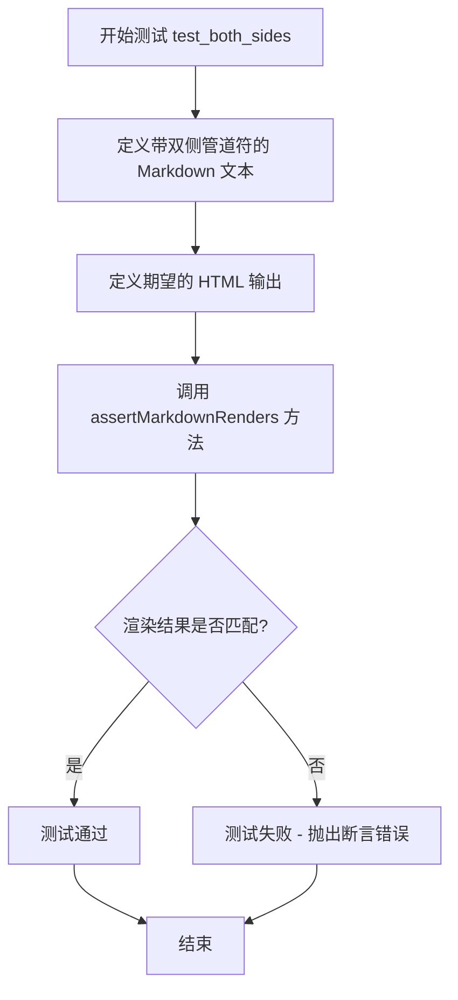

#### 带注释源码

```python
def test_both_sides(self):
    """
    测试表格渲染：双侧管道符语法
    
    验证 Markdown 表格支持在每行开头和结尾使用管道符（|）的语法。
    这种语法提供了更清晰的对齐视觉效果。
    """
    # 定义输入的 Markdown 文本，使用双侧管道符语法
    # | First Header | Second Header |  <- 表头行，两侧有管道符
    # | ------------- | ------------- |  <- 分隔行
    # | Content Cell | Content Cell  |  <- 数据行
    # | Content Cell | Content Cell  |  <- 数据行
    self.assertMarkdownRenders(
        self.dedent(
            """
            | First Header  | Second Header |
            | ------------- | ------------- |
            | Content Cell  | Content Cell  |
            | Content Cell  | Content Cell  |
            """
        ),
        # 定义期望的 HTML 输出
        # 表格应被正确解析为标准的 HTML <table> 结构
        self.dedent(
            """
            <table>
            <thead>
            <tr>
            <th>First Header</th>
            <th>Second Header</th>
            </tr>
            </thead>
            <tbody>
            <tr>
            <td>Content Cell</td>
            <td>Content Cell</td>
            </tr>
            <tr>
            <td>Content Cell</td>
            <td>Content Cell</td>
            </tr>
            </tbody>
            </table>
            """
        ),
        # 指定使用 tables 扩展进行渲染
        extensions=['tables']
    )
```


### `TestTableBlocks.test_align_columns`

该方法是一个测试用例，用于验证 Markdown 表格扩展（TableExtension）在渲染表格时能否正确处理列对齐（左侧对齐、右侧对齐），并生成带有相应 CSS style 属性的 HTML 表格元素。

参数：

- `self`：`TestTableBlocks`（隐式参数），测试类的实例对象本身

返回值：`None`，无返回值（测试方法通过断言验证，失败时抛出异常）

#### 流程图

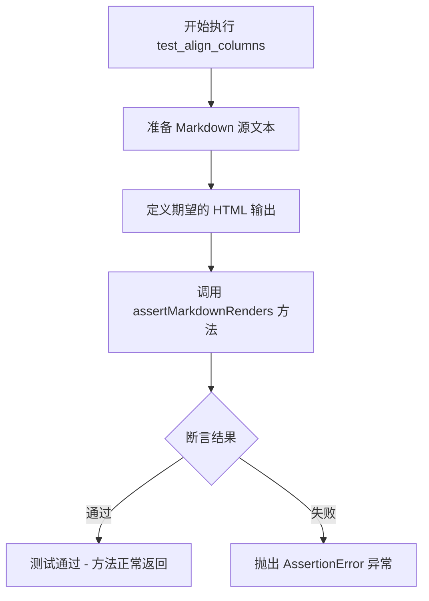

#### 带注释源码

```python
def test_align_columns(self):
    """测试表格列对齐功能：验证 :--、--: 语法生成正确的 CSS style 属性"""
    
    # 第一部分：输入的 Markdown 表格源码
    # 包含两列：Item（默认左对齐）和 Value（右对齐 :-----:）
    self.assertMarkdownRenders(
        self.dedent(
            """
            | Item      | Value |
            | :-------- | -----:|
            | Computer  | $1600 |
            | Phone     |   $12 |
            | Pipe      |    $1 |
            """
        ),
        
        # 第二部分：期望生成的 HTML 输出
        # 验证表格头和数据行的对齐方式
        # Item 列：style="text-align: left;"
        # Value 列：style="text-align: right;"
        self.dedent(
            """
            <table>
            <thead>
            <tr>
            <th style="text-align: left;">Item</th>
            <th style="text-align: right;">Value</th>
            </tr>
            </thead>
            <tbody>
            <tr>
            <td style="text-align: left;">Computer</td>
            <td style="text-align: right;">$1600</td>
            </tr>
            <tr>
            <td style="text-align: left;">Phone</td>
            <td style="text-align: right;">$12</td>
            </tr>
            <tr>
            <td style="text-align: left;">Pipe</td>
            <td style="text-align: right;">$1</td>
            </tr>
            </tbody>
            </table>
            """
        ),
        
        # 第三部分：指定使用的扩展
        # 使用 tables 扩展处理表格语法
        extensions=['tables']
    )
```


### `TestTableBlocks.test_styles_in_tables`

该测试方法用于验证 Markdown 表格中内联样式（如行内代码 `` `code` `` 和粗体 `**bold**`）能够正确渲染为对应的 HTML 标签（`<code>` 和 `<strong>`）。

参数：
- 该方法无显式参数，继承自 TestCase 类的隐式参数 `self` 表示测试用例实例

返回值：`None`，测试方法无返回值，通过 `assertMarkdownRenders` 方法进行断言验证

#### 流程图

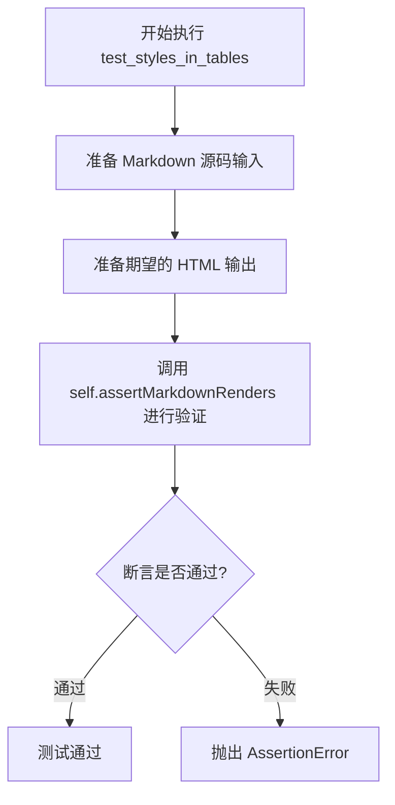

#### 带注释源码

```python
def test_styles_in_tables(self):
    """
    测试 Markdown 表格中的内联样式渲染。
    
    验证以下内联样式在表格单元格中能正确转换：
    1. 行内代码 (`code`) -> <code>code</code>
    2. 粗体 (**bold**) -> <strong>bold</strong>
    """
    
    # 准备 Markdown 表格源码，包含内联代码和粗体样式
    self.assertMarkdownRenders(
        # 输入：Markdown 源码
        self.dedent(
            """
            | Function name | Description                    |
            | ------------- | ------------------------------ |
            | `help()`      | Display the help window.       |
            | `destroy()`   | **Destroy your computer!**     |
            """
        ),
        
        # 期望输出：HTML 源码
        self.dedent(
            """
            <table>
            <thead>
            <tr>
            <th>Function name</th>
            <th>Description</th>
            </tr>
            </thead>
            <tbody>
            <tr>
            <td><code>help()</code></td>
            <td>Display the help window.</td>
            </tr>
            <tr>
            <td><code>destroy()</code></td>
            <td><strong>Destroy your computer!</strong></td>
            </tr>
            </tbody>
            </table>
            """
        ),
        
        # 使用 tables 扩展进行解析
        extensions=['tables']
    )
```


### `TestTableBlocks.test_align_three`

该方法是一个单元测试，用于验证 Markdown 表格扩展在处理三列不同对齐方式（左侧对齐、居中对齐、右侧对齐）时的正确性。测试用例包含了带有 `:` 对齐标记的表头行和数据行，验证生成的 HTML 表格中每个单元格的 `style="text-align: xxx"` 属性是否正确设置。

参数： 无（测试方法，仅包含隐式参数 `self`）

返回值：`None`，该方法为测试方法，通过 `assertMarkdownRenders` 进行断言验证，不返回任何值。

#### 流程图

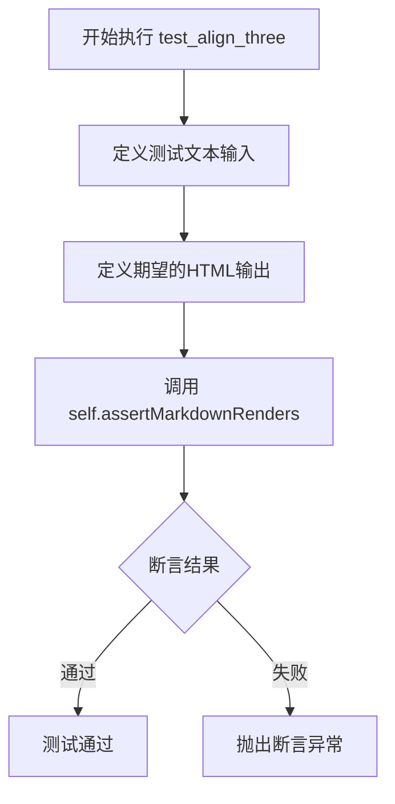

#### 带注释源码

```python
def test_align_three(self):
    """
    测试三列表格的不同对齐方式。
    
    验证 Markdown 表格扩展能够正确解析和渲染：
    - 左侧对齐 (:--)
    - 居中对齐 (:-:)
    - 右侧对齐 (--:)
    
    同时测试包含空单元格和带有内容单元格的表格渲染。
    """
    
    # 定义输入的 Markdown 文本，包含三列和对齐标记
    self.assertMarkdownRenders(
        self.dedent(
            """
            |foo|bar|baz|
            |:--|:-:|--:|
            |   | Q |   |
            |W  |   |  W|
            """
        ),
        # 定义期望的 HTML 输出，包含正确的 text-align 样式
        self.dedent(
            """
            <table>
            <thead>
            <tr>
            <th style="text-align: left;">foo</th>
            <th style="text-align: center;">bar</th>
            <th style="text-align: right;">baz</th>
            </tr>
            </thead>
            <tbody>
            <tr>
            <td style="text-align: left;"></td>
            <td style="text-align: center;">Q</td>
            <td style="text-align: right;"></td>
            </tr>
            <tr>
            <td style="text-align: left;">W</td>
            <td style="text-align: center;"></td>
            <td style="text-align: right;">W</td>
            </tr>
            </tbody>
            </table>
            """
        ),
        # 指定使用的扩展为 'tables'
        extensions=['tables']
    )
```


### `TestTableBlocks.test_three_columns`

该测试方法用于验证 Markdown 表格扩展对三列表格的渲染能力，测试用例包含表头和三列数据行（包括空单元格和部分填充的单元格）。

参数：

- `self`：`TestCase`（或子类）实例，表示测试类本身，包含测试框架提供的断言方法 `assertMarkdownRenders` 和工具方法 `dedent`。

返回值：`None`，测试方法无返回值，通过断言判断测试是否通过。

#### 流程图

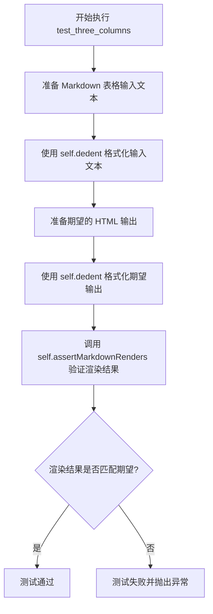

#### 带注释源码

```python
def test_three_columns(self):
    """
    测试三列表格的渲染功能。
    
    该测试验证 Markdown 的 tables 扩展能够正确处理：
    1. 没有竖线分隔符的表格语法（foo|bar|baz）
    2. 短分隔行（---）
    3. 包含空单元格的行（第一行：空|Q|空）
    4. 包含部分填充的单元格（第二行：W||W）
    """
    
    # 调用 assertMarkdownRenders 方法验证 Markdown 到 HTML 的转换
    # 第一个参数：输入的 Markdown 文本
    self.assertMarkdownRenders(
        # 使用 self.dedent 去除每行的公共前导空白
        self.dedent(
            """
            foo|bar|baz      # 表头：三个列名
            ---|---|---      # 分隔行：定义三列
               | Q |         # 数据行1：列1为空，列2为Q，列3为空
             W |   | W       # 数据行2：列1为W，列2为空，列3为W
            """
        ),
        
        # 第二个参数：期望输出的 HTML 文本
        self.dedent(
            """
            <table>
            <thead>
            <tr>
            <th>foo</th>      # 表头单元格
            <th>bar</th>
            <th>baz</th>
            </tr>
            </thead>
            <tbody>
            <tr>
            <td></td>         # 第一个数据行的第一个单元格（空）
            <td>Q</td>        # 第一个数据行的第二个单元格
            <td></td>         # 第一个数据行的第三个单元格（空）
            </tr>
            <tr>
            <td>W</td>        # 第二个数据行的第一个单元格
            <td></td>         # 第二个数据行的第二个单元格（空）
            <td>W</td>        # 第二个数据行的第三个单元格
            </tr>
            </tbody>
            </table>
            """
        ),
        
        # 第三个参数：使用的扩展列表
        extensions=['tables']  # 使用 Markdown 的 tables 扩展进行转换
    )
```


### `TestTableBlocks.test_three_spaces_prefix`

该测试方法验证 Markdown 表格前有三个空格缩进时能被正确解析渲染为 HTML 表格，而非代码块。测试涵盖了两种表格语法格式（无管道符和有管道符），确保三空格缩进的表格都能被正确识别并转换为 HTML 表格元素。

参数：

- `self`：`TestCase`，测试类实例本身

返回值：`None`，测试方法无返回值，通过断言验证渲染结果

#### 流程图

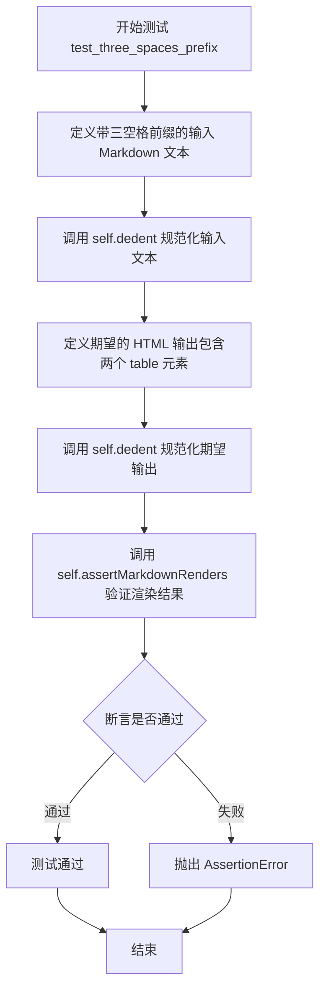

#### 带注释源码

```python
def test_three_spaces_prefix(self):
    """测试三空格前缀表格的渲染功能"""
    
    # 定义输入的 Markdown 文本，包含两个表格：
    # 1. 不带管道符的表格（使用对齐分隔符）
    # 2. 带管道符的表格
    # 两者前面都有三个空格的缩进
    self.assertMarkdownRenders(
        self.dedent(
            """
            Three spaces in front of a table:

               First Header | Second Header
               ------------ | -------------
               Content Cell | Content Cell
               Content Cell | Content Cell

               | First Header | Second Header |
               | ------------ | ------------- |
               | Content Cell | Content Cell  |
               | Content Cell | Content Cell  |
            """),
        
        # 定义期望的 HTML 输出：
        # 1. 一个段落元素包含描述文本
        # 2. 第一个表格（无管道符格式）
        # 3. 第二个表格（有管道符格式）
        self.dedent(
            """
            <p>Three spaces in front of a table:</p>
            <table>
            <thead>
            <tr>
            <th>First Header</th>
            <th>Second Header</th>
            </tr>
            </thead>
            <tbody>
            <tr>
            <td>Content Cell</td>
            <td>Content Cell</td>
            </tr>
            <tr>
            <td>Content Cell</td>
            <td>Content Cell</td>
            </tr>
            </tbody>
            </table>
            <table>
            <thead>
            <tr>
            <th>First Header</th>
            <th>Second Header</th>
            </tr>
            </thead>
            <tbody>
            <tr>
            <td>Content Cell</td>
            <td>Content Cell</td>
            </tr>
            <tr>
            <td>Content Cell</td>
            <td>Content Cell</td>
            </tr>
            </tbody>
            </table>
            """
        ),
        
        # 使用 tables 扩展进行渲染验证
        extensions=['tables']
    )
```


### `TestTableBlocks.test_code_block_table`

该方法用于测试 Markdown 表格扩展在遇到前导四个空格（代码块）时的渲染行为，验证代码块内容不被解析为表格行，同时后续的表格语法仍能正确解析。

参数：

- `self`：`TestTableBlocks`，测试类实例本身，无需显式传递

返回值：`None`，该方法为测试方法，通过 `assertMarkdownRenders` 进行断言验证，不返回具体值

#### 流程图

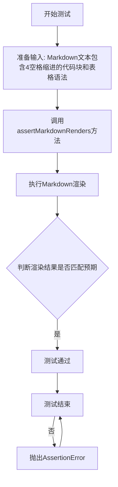

#### 带注释源码

```python
def test_code_block_table(self):
    """
    测试场景：四个空格前导表示代码块，表格扩展应正确处理
    - 前导四个空格的表格语法应被识别为代码块
    - 后续的表格语法（无前导空格）应正常解析为表格
    """
    # 输入Markdown文本：包含4空格缩进的代码块和后续的表格语法
    self.assertMarkdownRenders(
        self.dedent(
            """
            Four spaces is a code block:

                First Header | Second Header
                ------------ | -------------
                Content Cell | Content Cell
                Content Cell | Content Cell

            | First Header | Second Header |
            | ------------ | ------------- |
            """
        ),
        # 期望的HTML输出
        self.dedent(
            """
            <p>Four spaces is a code block:</p>
            <pre><code>First Header | Second Header
            ------------ | -------------
            Content Cell | Content Cell
            Content Cell | Content Cell
            </code></pre>
            <table>
            <thead>
            <tr>
            <th>First Header</th>
            <th>Second Header</th>
            </tr>
            </thead>
            <tbody>
            <tr>
            <td></td>
            <td></td>
            </tr>
            </tbody>
            </table>
            """
        ),
        # 启用的扩展：tables 扩展
        extensions=['tables']
    )
```


### `TestTableBlocks.test_inline_code_blocks`

这是一个测试方法，用于验证 Markdown 表格中内联代码块（inline code blocks）的解析和渲染是否正确。测试涵盖了各种反引号数量、转义字符以及代码块内包含管道符的情况。

参数：

- `self`：`TestCase`，隐式参数，代表测试类实例本身

返回值：`None`，无返回值（测试方法，通过断言验证结果）

#### 流程图

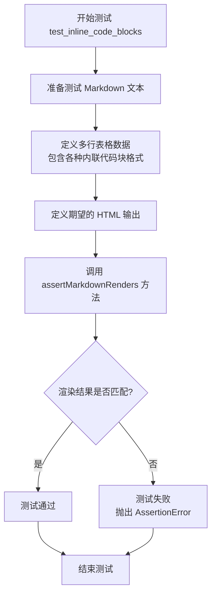

#### 带注释源码

```python
def test_inline_code_blocks(self):
    """
    测试 Markdown 表格中的内联代码块解析。
    验证不同数量的反引号、转义字符等情况下的渲染结果。
    """
    # 准备输入的 Markdown 文本，包含各种内联代码块格式
    self.assertMarkdownRenders(
        self.dedent(
            """
            More inline code block tests

            Column 1 | Column 2 | Column 3
            ---------|----------|---------
            word 1   | word 2   | word 3
            word 1   | `word 2` | word 3
            word 1   | \\`word 2 | word 3
            word 1   | `word 2 | word 3
            word 1   | `word |2` | word 3
            words    |`` some | code `` | more words
            words    |``` some | code ``` | more words
            words    |```` some | code ```` | more words
            words    |`` some ` | ` code `` | more words
            words    |``` some ` | ` code ``` | more words
            words    |```` some ` | ` code ```` | more words
            """
        ),
        # 期望输出的 HTML 渲染结果
        self.dedent(
            """
            <p>More inline code block tests</p>
            <table>
            <thead>
            <tr>
            <th>Column 1</th>
            <th>Column 2</th>
            <th>Column 3</th>
            </tr>
            </thead>
            <tbody>
            <tr>
            <td>word 1</td>
            <td>word 2</td>
            <td>word 3</td>
            </tr>
            <tr>
            <td>word 1</td>
            <td><code>word 2</code></td>
            <td>word 3</td>
            </tr>
            <tr>
            <td>word 1</td>
            <td>`word 2</td>
            <td>word 3</td>
            </tr>
            <tr>
            <td>word 1</td>
            <td>`word 2</td>
            <td>word 3</td>
            </tr>
            <tr>
            <td>word 1</td>
            <td><code>word |2</code></td>
            <td>word 3</td>
            </tr>
            <tr>
            <td>words</td>
            <td><code>some | code</code></td>
            <td>more words</td>
            </tr>
            <tr>
            <td>words</td>
            <td><code>some | code</code></td>
            <td>more words</td>
            </tr>
            <tr>
            <td>words</td>
            <td><code>some | code</code></td>
            <td>more words</td>
            </tr>
            <tr>
            <td>words</td>
            <td><code>some ` | ` code</code></td>
            <td>more words</td>
            </tr>
            <tr>
            <td>words</td>
            <td><code>some ` | ` code</code></td>
            <td>more words</td>
            </tr>
            <tr>
            <td>words</td>
            <td><code>some ` | ` code</code></td>
            <td>more words</td>
            </tr>
            </tbody>
            </table>
            """
        ),
        # 使用的扩展：tables 扩展
        extensions=['tables']
    )
```


### `TestTableBlocks.test_issue_440`

这是一个测试方法，用于验证Markdown表格扩展能够正确处理包含内联代码块（用反引号包围）的单元格内容，特别是处理像"(`bar`) and `baz`."这样混合了括号和反引号的复杂文本。

参数：

- `self`：`TestCase`，隐含的实例参数，代表测试类本身

返回值：`None`，测试方法不返回任何值，仅通过断言验证Markdown渲染结果

#### 流程图

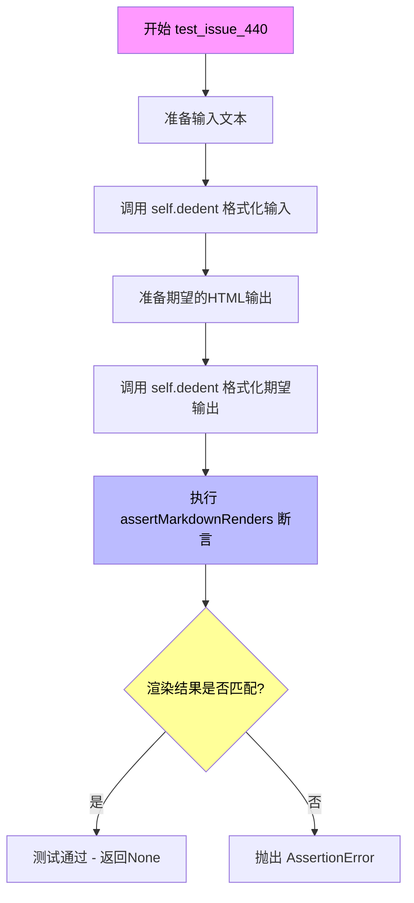

#### 带注释源码

```python
def test_issue_440(self):
    """
    测试 issue #440: 验证表格单元格中混合使用括号和反引号时的渲染正确性。
    
    问题描述：当单元格内容包含类似 (`bar`) and `baz`. 这样的文本时，
    表格扩展需要正确区分普通文本、括号包围的代码块和独立的代码块。
    """
    
    # 定义Markdown表格输入文本
    # 第一行为表头：foo | bar
    # 第二行为分隔线：--- | ---
    # 第三行为数据行：foo | (`bar`) and `baz`.
    self.assertMarkdownRenders(
        self.dedent(
            """
            A test for issue #440:

            foo | bar
            --- | ---
            foo | (`bar`) and `baz`.
            """
        ),
        # 定义期望的HTML输出
        # 文本 "A test for issue #440:" 应渲染为 <p> 段落
        # 表格应正确渲染，包含表头和数据行
        # (`bar`) 应渲染为 (<code>bar</code>)
        # `baz` 应渲染为 <code>baz</code>
        self.dedent(
            """
            <p>A test for issue #440:</p>
            <table>
            <thead>
            <tr>
            <th>foo</th>
            <th>bar</th>
            </tr>
            </thead>
            <tbody>
            <tr>
            <td>foo</td>
            <td>(<code>bar</code>) and <code>baz</code>.</td>
            </tr>
            </tbody>
            </table>
            """
        ),
        # 指定使用的扩展：tables 扩展
        extensions=['tables']
    )
```


### `TestTableBlocks.test_lists_not_tables`

该方法是一个单元测试用例，用于验证 Markdown 解析器在处理包含列表（且列表项中含有管道符 `|`）的文本时，能够正确识别为列表而非表格，确保 `tables` 扩展不会错误地将列表语法转换为表格。

#### 参数

- `self`：`TestTableBlocks`（继承自 `TestCase`），表示测试类实例本身，用于调用继承的断言方法。

#### 返回值

- `None`，该测试方法不返回任何值，仅通过断言验证 Markdown 渲染结果是否符合预期。

#### 流程图

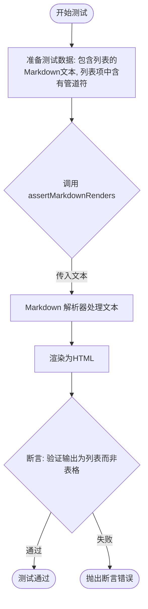

#### 带注释源码

```python
def test_lists_not_tables(self):
    """
    测试列表不会被误解析为表格。
    验证当列表项中包含管道符（|）时，Markdown 解析器仍将其视为列表。
    """
    # 定义输入的 Markdown 文本，包含一个无序列表，列表项中含有管道符
    text = self.dedent(
        """
        Lists are not tables

         - this | should | not
         - be | a | table
        """
    )

    # 定义期望的 HTML 输出，应为无序列表（<ul>），而非表格（<table>）
    expected_html = self.dedent(
        """
        <p>Lists are not tables</p>
        <ul>
        <li>this | should | not</li>
        <li>be | a | table</li>
        </ul>
        """
    )

    # 调用 assertMarkdownRenders 验证渲染结果
    # 传入: Markdown文本, 期望的HTML, 启用的扩展(tables)
    self.assertMarkdownRenders(
        text,
        expected_html,
        extensions=['tables']
    )
```


### `TestTableBlocks.test_issue_449`

该方法是一个测试用例，用于验证 Markdown 表格扩展在处理各种转义字符（特别是反引号和管道符）时的正确性，涵盖了奇数/偶数个反引号、转义的反引号、转义的管道符等多种边界情况。

参数：
- 无

返回值：`None`，该方法为测试用例，通过 `assertMarkdownRenders` 验证 Markdown 渲染结果

#### 流程图

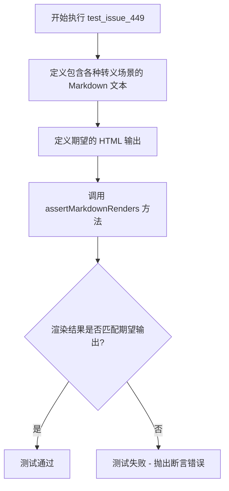

#### 带注释源码

```python
def test_issue_449(self):
    """
    测试 issue #449：验证表格扩展对各种转义字符的处理
    
    测试场景包括：
    1. 奇数/偶数个反引号的处理
    2. 转义的反引号 `\` 的解析
    3. 转义的管道符 \| 的处理
    4. 表头中的转义字符
    5. 表格格式行中的转义管道符
    6. 表格中的转义代码
    """
    # 输入的 Markdown 文本，包含多种转义场景
    self.assertMarkdownRenders(
        self.dedent(
            r"""
            Add tests for issue #449

            Odd backticks | Even backticks
            ------------ | -------------
            ``[!\"\#$%&'()*+,\-./:;<=>?@\[\\\]^_`{|}~]`` | ``[!\"\#$%&'()*+,\-./:;<=>?@\[\\\]^`_`{|}~]``

            Escapes | More Escapes
            ------- | ------
            `` `\`` | `\`

            Only the first backtick can be escaped

            Escaped | Bacticks
            ------- | ------
            \`` \`  | \`\`

            Test escaped pipes

            Column 1 | Column 2
            -------- | --------
            `|` \|   | Pipes are okay in code and escaped. \|

            | Column 1 | Column 2 |
            | -------- | -------- |
            | row1     | row1    \|
            | row2     | row2     |

            Test header escapes

            | `` `\`` \| | `\` \|
            | ---------- | ---- |
            | row1       | row1 |
            | row2       | row2 |

            Escaped pipes in format row should not be a table

            | Column1   | Column2 |
            | ------- \|| ------- |
            | row1      | row1    |
            | row2      | row2    |

            Test escaped code in Table

            Should not be code | Should be code
            ------------------ | --------------
            \`Not code\`       | \\`code`
            \\\`Not code\\\`   | \\\\`code`
            """),
        # 期望输出的 HTML
        self.dedent(
            """
            <p>Add tests for issue #449</p>
            <table>
            <thead>
            <tr>
            <th>Odd backticks</th>
            <th>Even backticks</th>
            </tr>
            </thead>
            <tbody>
            <tr>
            <td><code>[!\\"\\#$%&amp;'()*+,\-./:;&lt;=&gt;?@\\[\\\\\\]^_`{|}~]</code></td>
            <td><code>[!\\"\\#$%&amp;'()*+,\-./:;&lt;=&gt;?@\\[\\\\\\]^`_`{|}~]</code></td>
            </tr>
            </tbody>
            </table>
            <table>
            <thead>
            <tr>
            <th>Escapes</th>
            <th>More Escapes</th>
            </tr>
            </thead>
            <tbody>
            <tr>
            <td><code>`\\</code></td>
            <td><code>\\</code></td>
            </tr>
            </tbody>
            </table>
            <p>Only the first backtick can be escaped</p>
            <table>
            <thead>
            <tr>
            <th>Escaped</th>
            <th>Bacticks</th>
            </tr>
            </thead>
            <tbody>
            <tr>
            <td>`<code>\\</code></td>
            <td>``</td>
            </tr>
            </tbody>
            </table>
            <p>Test escaped pipes</p>
            <table>
            <thead>
            <tr>
            <th>Column 1</th>
            <th>Column 2</th>
            </tr>
            </thead>
            <tbody>
            <tr>
            <td><code>|</code> |</td>
            <td>Pipes are okay in code and escaped. |</td>
            </tr>
            </tbody>
            </table>
            <table>
            <thead>
            <tr>
            <th>Column 1</th>
            <th>Column 2</th>
            </tr>
            </thead>
            <tbody>
            <tr>
            <td>row1</td>
            <td>row1    |</td>
            </tr>
            <tr>
            <td>row2</td>
            <td>row2</td>
            </tr>
            </tbody>
            </table>
            <p>Test header escapes</p>
            <table>
            <thead>
            <tr>
            <th><code>`\\</code> |</th>
            <th><code>\\</code> |</th>
            </tr>
            </thead>
            <tbody>
            <tr>
            <td>row1</td>
            <td>row1</td>
            </tr>
            <tr>
            <td>row2</td>
            <td>row2</td>
            </tr>
            </tbody>
            </table>
            <p>Escaped pipes in format row should not be a table</p>
            <p>| Column1   | Column2 |
            | ------- || ------- |
            | row1      | row1    |
            | row2      | row2    |</p>
            <p>Test escaped code in Table</p>
            <table>
            <thead>
            <tr>
            <th>Should not be code</th>
            <th>Should be code</th>
            </tr>
            </thead>
            <tbody>
            <tr>
            <td>`Not code`</td>
            <td>\\<code>code</code></td>
            </tr>
            <tr>
            <td>\\`Not code\\`</td>
            <td>\\\\<code>code</code></td>
            </tr>
            </tbody>
            </table>
            """
        ),
        # 使用 tables 扩展进行测试
        extensions=['tables']
    )
```


### `TestTableBlocks.test_single_column_tables`

该测试方法用于验证 Markdown 表格扩展（TableExtension）对单列表格的解析和渲染能力。测试覆盖了多种单列表格的格式变体，包括带分隔符行、有数据行和无数据行等情况，并确保非法的单列表格格式（如缺少分隔符行或格式不匹配）不会被错误地解析为表格，而是保留为普通文本或标题。

参数：

- `self`：`TestTableBlocks`，测试类的实例，隐含参数

返回值：`None`，测试方法无返回值，通过 `assertMarkdownRenders` 方法进行断言验证

#### 流程图

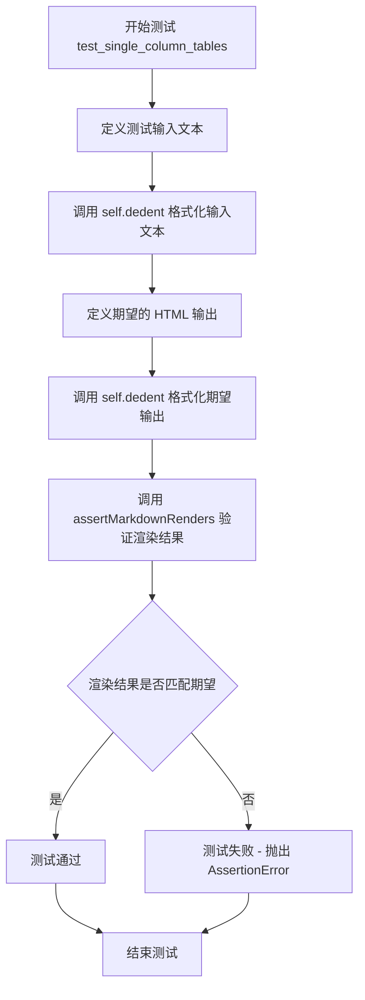

#### 带注释源码

```python
def test_single_column_tables(self):
    """
    测试单列表格的解析和渲染。
    
    该测试验证以下场景：
    1. 带有分隔符行的单列表格（无数据行）
    2. 带有分隔符行的单列表格（有数据行）
    3. 非法格式不应被解析为表格
    """
    
    # 定义测试输入：包含多种单列表格格式
    self.assertMarkdownRenders(
        self.dedent(
            """
            Single column tables

            | Is a Table |
            | ---------- |

            | Is a Table
            | ----------

            Is a Table |
            ---------- |

            | Is a Table |
            | ---------- |
            | row        |

            | Is a Table
            | ----------
            | row

            Is a Table |
            ---------- |
            row        |

            | Is not a Table
            --------------
            | row

            Is not a Table |
            --------------
            row            |

            | Is not a Table
            | --------------
            row

            Is not a Table |
            -------------- |
            row
            """
        ),
        # 期望的 HTML 输出
        self.dedent(
            """
            <p>Single column tables</p>
            <table>
            <thead>
            <tr>
            <th>Is a Table</th>
            </tr>
            </thead>
            <tbody>
            <tr>
            <td></td>
            </tr>
            </tbody>
            </table>
            <table>
            <thead>
            <tr>
            <th>Is a Table</th>
            </tr>
            </thead>
            <tbody>
            <tr>
            <td></td>
            </tr>
            </tbody>
            </table>
            <table>
            <thead>
            <tr>
            <th>Is a Table</th>
            </tr>
            </thead>
            <tbody>
            <tr>
            <td></td>
            </tr>
            </tbody>
            </table>
            <table>
            <thead>
            <tr>
            <th>Is a Table</th>
            </tr>
            </thead>
            <tbody>
            <tr>
            <td>row</td>
            </tr>
            </tbody>
            </table>
            <table>
            <thead>
            <tr>
            <th>Is a Table</th>
            </tr>
            </thead>
            <tbody>
            <tr>
            <td>row</td>
            </tr>
            </tbody>
            </table>
            <table>
            <thead>
            <tr>
            <th>Is a Table</th>
            </tr>
            </thead>
            <tbody>
            <tr>
            <td>row</td>
            </tr>
            </tbody>
            </table>
            <h2>| Is not a Table</h2>
            <p>| row</p>
            <h2>Is not a Table |</h2>
            <p>row            |</p>
            <p>| Is not a Table
            | --------------
            row</p>
            <p>Is not a Table |
            -------------- |
            row</p>
            """
        ),
        # 使用 tables 扩展进行渲染
        extensions=['tables']
    )
```


### `TestTableBlocks.test_align_columns_legacy`

该测试方法用于验证 Markdown 表格扩展在使用旧版 `align` 属性（而非 CSS `style`）时的列对齐功能是否正常工作。它通过比较带对齐标记的 Markdown 表格源码与期望的 HTML 输出（使用 `align` 属性）来确认 TableExtension 的 `use_align_attribute=True` 选项是否正确应用。

参数：

- `self`：`TestCase` 实例，隐式参数，测试类实例本身

返回值：`None`，无返回值（测试方法通过断言验证功能）

#### 流程图

```mermaid
flowchart TD
    A[开始执行 test_align_columns_legacy] --> B[准备 Markdown 表格源码]
    B --> C[包含对齐标记|:--------|-----:|]
    C --> D[准备期望的 HTML 输出]
    D --> E[使用 TableExtension use_align_attribute=True]
    E --> F[调用 self.assertMarkdownRenders]
    F --> G{渲染结果是否匹配?}
    G -->|是| H[测试通过]
    G -->|否| I[测试失败]
    H --> J[结束]
    I --> J
```

#### 带注释源码

```python
def test_align_columns_legacy(self):
    """测试旧版 align 属性的表格列对齐功能。
    
    验证当使用 TableExtension(use_align_attribute=True) 时，
    表格的列对齐通过 HTML align 属性而非 CSS style 实现。
    对齐标记：|:-------- 左对齐, |-----: 右对齐
    """
    # 准备输入：带有对齐标记的 Markdown 表格源码
    # | :-------- 表示左对齐 (冒号在左边)
    # | -----:   表示右对齐 (冒号在右边)
    text = self.dedent(
        """
        | Item      | Value |
        | :-------- | -----:|
        | Computer  | $1600 |
        | Phone     |   $12 |
        | Pipe      |    $1 |
        """
    )

    # 准备期望的 HTML 输出：使用 align 属性而非 style 属性
    # <th align="left">  表示表头左对齐
    # <td align="right"> 表示单元格右对齐
    expected = self.dedent(
        """
        <table>
        <thead>
        <tr>
        <th align="left">Item</th>
        <th align="right">Value</th>
        </tr>
        </thead>
        <tbody>
        <tr>
        <td align="left">Computer</td>
        <td align="right">$1600</td>
        </tr>
        <tr>
        <td align="left">Phone</td>
        <td align="right">$12</td>
        </tr>
        <tr>
        <td align="left">Pipe</td>
        <td align="right">$1</td>
        </tr>
        </tbody>
        </table>
        """
    )

    # 调用断言方法验证 Markdown 表格渲染结果
    # extensions=[TableExtension(use_align_attribute=True)]
    # 启用 align 属性而非 CSS style 的旧版兼容模式
    self.assertMarkdownRenders(
        text,
        expected,
        extensions=[TableExtension(use_align_attribute=True)]
    )
```


### `TestTableBlocks.test_align_three_legacy`

这是一个测试方法，用于验证 Markdown 表格在 legacy 模式下（使用 `align` 属性而非 `style` 属性）的三列对齐功能是否正确渲染。测试用例验证了左对齐、居中对齐和右对齐三种对齐方式。

参数：

- `self`：`TestTableBlocks`，测试类实例本身，无需显式传入

返回值：无（`None`），此方法为测试用例，通过 `assertMarkdownRenders` 断言验证 Markdown 到 HTML 的转换结果，不返回任何值

#### 流程图

```mermaid
flowchart TD
    A[开始测试 test_align_three_legacy] --> B[准备 Markdown 源码<br/>|foo|bar|baz|<br/>|:--|:-:|--:|<br/>|   | Q |   |<br/>|W  |   |  W|]
    B --> C[准备期望的 HTML 输出<br/>使用 align 属性而非 style 属性<br/>left/center/right 三种对齐方式]
    C --> D[调用 TableExtension 并设置<br/>use_align_attribute=True]
    D --> E[调用 assertMarkdownRenders<br/>验证 Markdown 到 HTML 转换]
    E --> F{断言是否通过?}
    F -->|通过| G[测试通过]
    F -->|失败| H[抛出断言错误]
    G --> I[结束]
    H --> I
```

#### 带注释源码

```python
def test_align_three_legacy(self):
    """
    测试 Markdown 表格的三列对齐功能（legacy 模式）。
    
    此测试验证使用 align 属性（而非 style 属性）进行表格对齐的场景。
    测试用例包含三个列，分别采用左对齐、居中对齐和右对齐。
    """
    # 使用 assertMarkdownRenders 验证 Markdown 源码能否正确渲染为 HTML
    self.assertMarkdownRenders(
        # 第一个参数：输入的 Markdown 源码
        # 包含三列表格，表头行使用 :--、:-:、--: 分别表示左、居中、右对齐
        self.dedent(
            """
            |foo|bar|baz|
            |:--|:-:|--:|
            |   | Q |   |
            |W  |   |  W|
            """
        ),
        # 第二个参数：期望的 HTML 输出
        # 注意这里使用 align 属性而非 style 属性，这是 legacy 模式的特征
        self.dedent(
            """
            <table>
            <thead>
            <tr>
            <th align="left">foo</th>
            <th align="center">bar</th>
            <th align="right">baz</th>
            </tr>
            </thead>
            <tbody>
            <tr>
            <td align="left"></td>
            <td align="center">Q</td>
            <td align="right"></td>
            </tr>
            <tr>
            <td align="left">W</td>
            <td align="center"></td>
            <td align="right">W</td>
            </tr>
            </tbody>
            </table>
            """
        ),
        # 第三个参数：扩展列表
        # 使用 TableExtension 并设置 use_align_attribute=True
        # 这使得表格扩展生成 align 属性而非内联 style
        extensions=[TableExtension(use_align_attribute=True)]
    )
```

## 关键组件


### TestTableBlocks

测试类，用于验证Markdown表格扩展的各种功能场景，包括空单元格、列对齐、样式支持、内联代码块处理、转义字符等

### TableExtension

Markdown表格扩展插件，提供将Markdown表格语法转换为HTML表格的解析和渲染功能，支持对齐属性、样式和代码块处理

### assertMarkdownRenders

测试断言方法，验证Markdown文本经过指定扩展处理后能够正确渲染为预期的HTML输出

### dedent

文本格式化工具函数，用于移除多行字符串的行首公共空白字符，便于测试用例的编写和阅读

### 表格对齐解析

识别并处理表格列的对齐方式（左对齐、居中、右对齐），支持通过冒号位置或属性方式指定

### 表格边界检测

识别Markdown表格的起始和结束位置，区分表格与列表、代码块等其他Markdown元素的边界

### 转义字符处理

处理表格中的特殊字符转义，包括反引号、管道符等的正确解析，确保在表格单元格中正确渲染

### 内联代码块解析

在表格单元格内识别和处理内联代码，包括反引号嵌套、转义反引号等复杂场景


## 问题及建议


### 已知问题

- **测试数据重复**：多个测试方法中使用相似的表格结构和HTML输出，`self.dedent()` 调用和HTML模板大量重复，增加维护成本
- **缺少测试断言消息**：所有 `assertMarkdownRenders` 调用均未提供自定义断言消息，测试失败时难以快速定位具体问题
- **文档字符串不完整**：部分测试方法（如 `test_no_sides`、`test_both_sides`）缺少文档字符串，无法清晰说明测试意图
- **硬编码扩展参数**：`extensions=['tables']` 在每个测试中重复出现，未使用类级别的 fixtures 或 setUp 方法统一管理
- **Magic Strings 分散**：HTML标签（如 `<table>`、`<thead>`、`<th>`）和属性（如 `style="text-align: left;"`）直接写在测试代码中，缺乏抽象
- **测试方法命名可读性**：部分方法名（如 `test_no_sides`、`test_both_sides`）含义不明确，不能直观反映测试场景
- **边界情况覆盖不足**：缺少对异常输入（如空表格、格式错误的表格）的负面测试

### 优化建议

- **提取公共测试数据和辅助方法**：创建共享的 HTML 模板常量或辅助方法，减少代码重复
- **添加断言消息**：为每个测试断言提供描述性错误消息，如 `self.assertMarkdownRenders(..., msg="Empty cells should render as non-breaking spaces")`
- **完善文档字符串**：为所有测试方法添加清晰的文档说明，包括测试目的和预期行为
- **使用 pytest fixtures 或 setUp**：统一管理扩展配置，避免在每个测试中重复传递 `extensions=['tables']`
- **考虑使用测试子类**：将不同类型的表格测试拆分为多个测试类，提高代码组织性
- **添加负面测试**：增加对无效输入（如格式错误、缺少分隔符等）的测试覆盖

## 其它


### 设计目标与约束

验证Markdown表格扩展的正确解析和渲染功能，确保各种表格格式（空单元格、单边/双边竖线、对齐方式、样式、代码块等）都能正确转换为HTML表格。

### 测试策略与方法论

使用基于断言的测试方法，通过assertMarkdownRenders方法对比Markdown源码与期望的HTML输出，验证表格扩展的正确性。测试覆盖了表格的多种边界情况和特殊场景。

### 测试数据与边界条件

包含多种测试场景：空单元格（&nbsp;）、单边竖线表格、双边竖线表格、三列表格、对齐方式（左/中/右）、内联代码块、转义字符、嵌套标记、列表与表格的区分、单列表格等。

### 预期输出与验证标准

每个测试方法都定义了明确的输入Markdown文本和期望的HTML输出，通过dedent方法规范化缩进后进行精确比对。

### 测试覆盖率分析

覆盖了表格扩展的核心功能和边界情况，包括：表格检测、单元格解析、行列构建、对齐属性生成（style属性和align属性两种模式）、代码块内竖线处理、转义字符处理等。

### 依赖与环境配置

依赖markdown.test_tools.TestCase基类进行测试框架搭建，使用markdown.extensions.tables.TableExtension作为被测组件，Python标准库dedent函数处理多行字符串缩进。

### 性能基准与考量

测试代码本身关注功能正确性，性能测试不在本文件范围内。表格扩展的性能优化应在主扩展实现代码中考虑。

### 可维护性与扩展性

测试代码按功能场景分组（空单元格、对齐、样式、代码块等），每个测试方法名清晰描述测试内容，便于后续添加新测试用例和定位问题。

### 已知限制与边界情况

部分复杂场景如表格内嵌套列表、多层代码块、转义竖线与真实竖线混合等情况的处理逻辑需参考扩展实现代码确认。

### 与其他模块的集成关系

本测试文件独立运行，仅依赖markdown核心模块和表格扩展模块，不涉及其他扩展的集成测试。

    