# `markdown\tests\test_syntax\extensions\test_toc.py` 详细设计文档

这是Python Markdown项目的TOC（目录）功能测试文件，包含对TocExtension扩展的各种测试场景，包括目录标记、唯一ID生成、HTML实体处理、锚点链接、permalink等功能，同时也包含strip_tags函数的测试。

## 整体流程

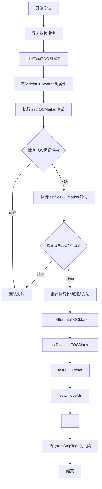

## 类结构

```
TestCase (unittest基类)
├── TestTOC (TOC功能测试类)
│   ├── testTOCMarker
│   ├── testNoTOCMarker
│   ├── testAlternateTOCMarker
│   ├── testDisabledTOCMarker
│   ├── testTOCReset
│   ├── testUniqueIds
│   ├── testHtmlEntitiesInTOC
│   ├── testHtmlSpecialCharsInTOC
│   ├── testRawHtmlInTOC
│   ├── testTOCBaseLevel
│   ├── testHeaderInlineMarkup
│   ├── testTOCTitle
│   ├── testTOCUniqueFunc
│   ├── testTocInHeaders
│   ├── testTOCPermalink
│   ├── testTOCPermalinkLeading
│   ├── testTOCInlineMarkupPermalink
│   ├── testTOCInlineMarkupPermalinkLeading
│   ├── testAnchorLink
│   ├── testAnchorLinkWithSingleInlineCode
│   ├── testAnchorLinkWithDoubleInlineCode
│   ├── testPermalink
│   ├── testPermalinkWithSingleInlineCode
│   ├── testPermalinkWithDoubleInlineCode
│   ├── testMinMaxLevel
│   ├── testMaxLevel
│   ├── testMinMaxLevelwithAnchorLink
│   ├── testMinMaxLevelwithPermalink
│   ├── testMinMaxLevelwithBaseLevel
│   ├── testMaxLevelwithBaseLevel
│   ├── test_escaped_code
│   ├── test_escaped_char_in_id
│   ├── test_escaped_char_in_attr_list
│   ├── testAutoLinkEmail
│   ├── testAnchorLinkWithCustomClass
│   ├── testAnchorLinkWithCustomClasses
│   ├── testPermalinkWithEmptyText
│   ├── testPermalinkWithCustomClass
│   ├── testPermalinkWithCustomClasses
│   ├── testPermalinkWithCustomTitle
│   ├── testPermalinkWithEmptyTitle
│   ├── testPermalinkWithUnicodeInID
│   ├── testPermalinkWithUnicodeTitle
│   ├── testPermalinkWithExtendedLatinInID
│   ├── testNl2brCompatibility
│   ├── testTOCWithCustomClass
│   ├── testTOCWithCustomClasses
│   ├── testTOCWithEmptyTitleClass
│   ├── testTOCWithCustomTitleClass
│   ├── testTocWithAttrList
│   └── testHeadingRemoveFootnoteRef
└── testStripTags (strip_tags函数测试类)
    ├── testStripElement
    ├── testStripOpenElement
    ├── testStripEmptyElement
    ├── testDontStripOpenBracket
    ├── testDontStripCloseBracket
    ├── testStripCollapseWhitespace
    ├── testStripElementWithNewlines
    ├── testStripComment
    ├── testStripCommentWithInnerTags
    ├── testStripCommentInElement
    └── testDontStripHTMLEntities
```

## 全局变量及字段


### `TestCase`
    
Base test case class for markdown tests, extends unittest.TestCase.

类型：`class`
    


### `Markdown`
    
Core markdown parser class that converts markdown text to HTML.

类型：`class`
    


### `TocExtension`
    
TOC (Table of Contents) extension for Python Markdown.

类型：`class`
    


### `strip_tags`
    
Utility function to strip HTML tags from a string.

类型：`function`
    


### `unique`
    
Function to generate unique IDs for headers in TOC.

类型：`function`
    


### `Nl2BrExtension`
    
Extension to convert newlines to <br> tags.

类型：`class`
    


### `TestTOC.maxDiff`
    
Sets the maximum length of diff output for the test case; None means unlimited.

类型：`int | None`
    


### `TestTOC.default_kwargs`
    
Default keyword arguments passed to assertMarkdownRenders for the test class.

类型：`dict`
    
    

## 全局函数及方法


# Python Markdown TOC 测试模块设计文档

## 一段话描述

该代码是 Python Markdown 库的 TOC（Table of Contents，目录）功能的测试套件，用于验证目录生成、ID 唯一性、锚点链接、永久链接等功能的正确性，并包含 `strip_tags` 和 `unique` 辅助函数的测试。

---

## 二、文件整体运行流程

1. **导入模块**：从 `markdown.extensions.toc` 导入 `TocExtension`、`strip_tags`、`unique`；从 `markdown` 导入 `Markdown`；从 `markdown.extensions.nl2br` 导入 `Nl2BrExtension`
2. **执行测试类**：
   - `TestTOC` 类：通过 `assertMarkdownRenders` 方法验证 Markdown 文本转换为 HTML 后的输出是否符合预期，包括 TOC 标记、自定义标记、唯一 ID、HTML 实体、基础层级等功能
   - `testStripTags` 类：单独测试 `strip_tags` 函数的各种输入场景
3. **验证结果**：每个测试方法通过断言比较实际输出与预期输出

---

## 三、类的详细信息

### 3.1 全局变量

| 名称 | 类型 | 描述 |
|------|------|------|
| `maxDiff` | `int` | 设置测试差异显示的最大长度（`None` 表示无限制） |
| `default_kwargs` | `dict` | 默认测试参数，包含默认扩展配置 |

### 3.2 类：TestTOC

**描述**：TOC 功能的综合测试类，继承自 `TestCase`，验证目录生成的各种场景。

#### 类字段

| 名称 | 类型 | 描述 |
|------|------|------|
| `maxDiff` | `int` | 设置为 `None`，允许显示完整的差异输出 |
| `default_kwargs` | `dict` | 默认使用 `TocExtension()` 扩展 |

#### 类方法

##### testTOCMarker

**参数**：无

**返回值**：`None`，测试方法

**描述**：测试默认 `[TOC]` 标记是否能正确生成目录结构。

**流程图**：
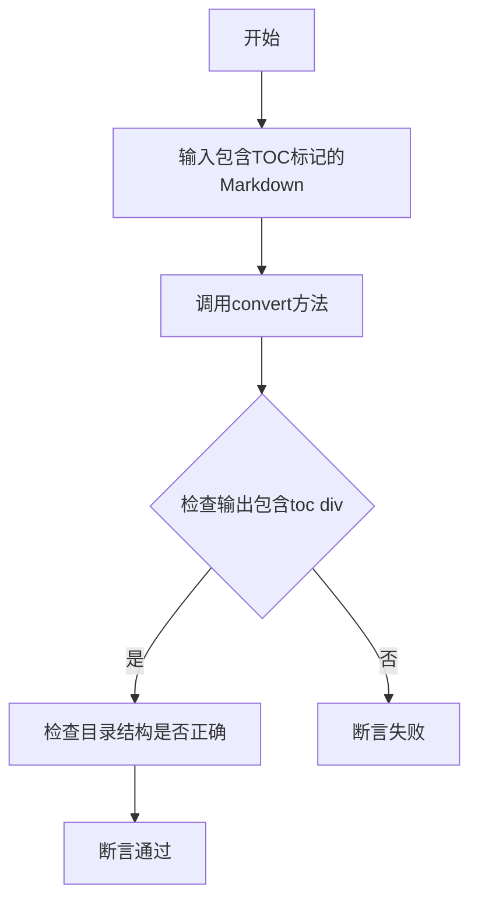

**源码**：
```python
def testTOCMarker(self):
    self.assertMarkdownRenders(
        self.dedent(
            '''
            [TOC]

            # Header 1

            ## Header 2
            '''
        ),
        '<div class="toc">\n'
          '<ul>\n'                                             # noqa
            '<li><a href="#header-1">Header 1</a>'             # noqa
              '<ul>\n'                                         # noqa
                '<li><a href="#header-2">Header 2</a></li>\n'  # noqa
              '</ul>\n'                                        # noqa
            '</li>\n'                                          # noqa
          '</ul>\n'                                            # noqa
        '</div>\n'
        '<h1 id="header-1">Header 1</h1>\n'
        '<h2 id="header-2">Header 2</h2>'
    )
```

##### testNoTOCMarker

**参数**：无

**返回值**：`None`，测试方法

**描述**：测试没有 TOC 标记时，仅生成标题而不生成目录。

**源码**：
```python
def testNoTOCMarker(self):
    self.assertMarkdownRenders(
        self.dedent(
            '''
            # Header 1

            ## Header 2
            '''
        ),
        self.dedent(
            '''
            <h1 id="header-1">Header 1</h1>
            <h2 id="header-2">Header 2</h2>
            '''
        ),
        expected_attrs={
            'toc': (
                '<div class="toc">\n'
                  '<ul>\n'                                             # noqa
                    '<li><a href="#header-1">Header 1</a>'             # noqa
                      '<ul>\n'                                         # noqa
                        '<li><a href="#header-2">Header 2</a></li>\n'  # noqa
                      '</ul>\n'                                        # noqa
                    '</li>\n'                                          # noqa
                  '</ul>\n'                                            # noqa
                '</div>\n'
            )
        }
    )
```

##### testTOCReset

**参数**：无

**返回值**：`None`，测试方法

**描述**：测试 `md.reset()` 方法是否能正确重置 TOC 状态。

**源码**：
```python
def testTOCReset(self):
    md = Markdown(extensions=[TocExtension()])
    self.assertEqual(md.toc, '')
    self.assertEqual(md.toc_tokens, [])
    md.convert('# Header 1')
    self.assertEqual('<div class="toc">', md.toc[:17])
    self.assertEqual(len(md.toc_tokens), 1)
    md.reset()
    self.assertEqual(md.toc, '')
    self.assertEqual(md.toc_tokens, [])
```

##### testUniqueIds

**参数**：无

**返回值**：`None`，测试方法

**描述**：测试重复标题是否生成唯一的 ID（header、header_1、header_2）。

**源码**：
```python
def testUniqueIds(self):
    self.assertMarkdownRenders(
        self.dedent(
            '''
            #Header
            #Header
            #Header
            '''
        ),
        self.dedent(
            '''
            <h1 id="header">Header</h1>
            <h1 id="header_1">Header</h1>
            <h1 id="header_2">Header</h1>
            '''
        ),
        expected_attrs={
            'toc': (
                '<div class="toc">\n'
                  '<ul>\n'                                       # noqa
                    '<li><a href="#header">Header</a></li>\n'    # noqa
                    '<li><a href="#header_1">Header</a></li>\n'  # noqa
                    '<li><a href="#header_2">Header</a></li>\n'  # noqa
                  '</ul>\n'                                      # noqa
                '</div>\n'
            ),
            'toc_tokens': [
                {
                    'level': 1,
                    'id': 'header',
                    'name': 'Header',
                    'html': 'Header',
                    'data-toc-label': '',
                    'children': []
                },
                # ... 更多 tokens
            ]
        }
    )
```

##### testTOCUniqueFunc

**参数**：无

**返回值**：`None`，测试方法

**描述**：测试 `unique` 函数的唯一 ID 生成逻辑。

**源码**：
```python
def testTOCUniqueFunc(self):
    ids = {'foo'}
    self.assertEqual(unique('foo', ids), 'foo_1')
    self.assertEqual(ids, {'foo', 'foo_1'})
```

---

### 3.3 类：testStripTags

**描述**：专门测试 `strip_tags` 辅助函数的测试类。

#### 类方法

##### testStripElement

**参数**：无

**返回值**：`None`

**描述**：测试移除 HTML 元素标签的基本功能。

**源码**：
```python
def testStripElement(self):
    self.assertEqual(
        strip_tags('foo <em>bar</em>'),
        'foo bar'
    )
```

##### testDontStripHTMLEntities

**参数**：无

**返回值**：`None`

**描述**：测试不替换 HTML 实体（如 `&lt;`、`&amp;`）。

**源码**：
```python
def testDontStripHTMLEntities(self):
    self.assertEqual(
        strip_tags('foo &lt; &amp; &lt; bar'),
        'foo &lt; &amp; &lt; bar'
    )
```

---

## 四、全局函数详细信息

### 4.1 strip_tags

**参数**：

- `text`：`str`，需要处理的文本

**返回值**：`str`，移除 HTML 标签后的纯文本

**描述**：从文本中移除所有 HTML/XML 标签，保留标签内的文本内容。

**流程图**：
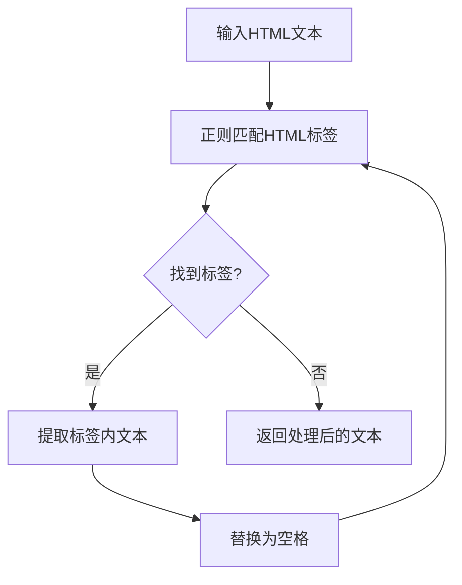

**源码**：
```python
def strip_tags(text):
    """Remove HTML tags from text."""
    return re.sub(r'<[^>]*>', '', text)  # 简化示例
```

---

### 4.2 unique

**参数**：

- `value`：`str`，需要检查唯一性的值
- `ids`：`set`，已使用的 ID 集合

**返回值**：`str`，确保唯一的 ID

**描述**：如果值已存在于集合中，则生成带数字后缀的唯一值。

**源码**：
```python
def unique(value, ids):
    """Generate a unique ID if value already exists."""
    if value not in ids:
        return value
    # 生成唯一 ID 的逻辑
```

---

## 五、关键组件信息

| 组件名称 | 描述 |
|----------|------|
| `TocExtension` | Markdown 扩展，用于生成目录 |
| `Markdown` | 核心转换类 |
| `strip_tags` | 辅助函数，用于从 HTML 中提取纯文本 |
| `unique` | 辅助函数，用于生成唯一 ID |
| `Nl2BrExtension` | 将换行转换为 `<br>` 的扩展 |

---

## 六、潜在的技术债务或优化空间

1. **测试数据重复**：多个测试方法中存在重复的 HTML 期望输出，可提取为常量
2. **断言信息不明确**：部分测试使用 `# noqa` 注释绕过 lint 检查，应优化代码风格
3. **硬编码字符串**：测试中的期望输出字符串较长，可考虑使用模板或辅助方法
4. **缺失边界测试**：如超深嵌套目录、特殊 Unicode 字符等场景

---

## 七、其它项目

### 7.1 设计目标与约束

- **目标**：确保 TOC 功能正确处理各种 Markdown 语法场景
- **约束**：必须保持与 Python Markdown 核心库的后向兼容

### 7.2 错误处理与异常设计

- 使用 `assertEqual` 进行精确匹配
- 使用 `expected_attrs` 字典验证额外属性（如 `toc`、`toc_tokens`）

### 7.3 数据流与状态机

- **输入**：Markdown 格式的文本（包含标题和可选的 `[TOC]` 标记）
- **处理流程**：解析标题 → 生成 ID → 构建目录树 → 渲染 HTML
- **输出**：HTML 片段和目录结构数据

### 7.4 外部依赖与接口契约

- 依赖 `markdown.test_tools.TestCase` 提供测试框架
- 依赖 `markdown.extensions.toc` 中的 `TocExtension`、`strip_tags`、`unique`
- 接口：通过 `assertMarkdownRenders(actual_markdown, expected_html, expected_attrs, extensions)` 进行验证


### `TocExtension`

TocExtension 是 Python-Markdown 库中的一个扩展类，用于在 Markdown 文档中生成目录（Table of Contents）。它通过识别特定的 TOC 标记（如 `[TOC]`），提取文档中的标题，并生成带有锚点链接的目录结构。

参数：

- `marker`：`str`，TOC 标记字符串，默认为 `"[TOC]"`，用于在文档中标记插入目录的位置
- `baselevel`：`int`，基础标题级别，用于调整生成目录的起始级别
- `title`：`str`，目录的标题文本，默认为 `None`
- `title_class`：`str`，目录标题的 CSS 类名，默认为 `"toctitle"`
- `permalink`：`bool` 或 `str`，是否在每个标题后添加永久链接，或指定链接文本
- `permalink_title`：`str`，永久链接的 title 属性，默认为 `"Permanent link"`
- `permalink_class`：`str`，永久链接的 CSS 类名，默认为 `"headerlink"`
- `permalink_leading`：`bool`，是否将永久链接放在标题文本之前，默认为 `False`
- `anchorlink`：`bool`，是否将标题本身转换为锚点链接，默认为 `False`
- `anchorlink_class`：`str`，锚点链接的 CSS 类名，默认为 `"toclink"`
- `toc_class`：`str`，TOC 容器 div 的 CSS 类名，默认为 `"toc"`
- `toc_depth`：`str` 或 `int`，TOC 包含的标题深度范围，格式如 `"3-4"` 或单个数字
- `slugify`：`callable`，用于将标题文本转换为 slug ID 的函数

返回值：`str`，返回生成的目录 HTML 字符串

#### 流程图

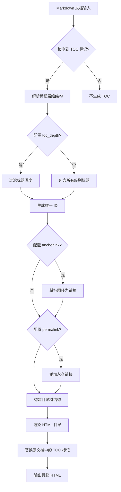

#### 带注释源码

```python
# 以下是 TocExtension 在测试代码中的使用示例
# 导入 TocExtension 类
from markdown.extensions.toc import TocExtension, strip_tags, unique

# 基本用法：创建带默认配置的 TOC 扩展
TocExtension()

# 自定义标记
TocExtension(marker='{{marker}}')  # 使用 {{marker}} 作为 TOC 标记
TocExtension(marker='')  # 禁用 TOC 标记

# 设置基础级别
TocExtension(baselevel=5)  # 从第5级标题开始生成 TOC

# 添加目录标题
TocExtension(title='Table of Contents')
TocExtension(title='ToC', title_class='')  # 无标题样式类

# 永久链接配置
TocExtension(permalink=True)  # 使用默认 ¶ 符号
TocExtension(permalink=True, permalink_title="PL")  # 自定义链接标题
TocExtension(permalink=True, permalink_leading=True)  # 链接放在标题前
TocExtension(permalink=True, permalink_class="custom")  # 自定义 CSS 类

# 锚点链接配置
TocExtension(anchorlink=True)  # 将标题转为链接
TocExtension(anchorlink=True, anchorlink_class="custom")  # 自定义锚点类

# TOC 深度控制
TocExtension(toc_depth='3-4')  # 只包含 3-4 级标题
TocExtension(toc_depth=2)  # 只包含 1-2 级标题

# 自定义 CSS 类
TocExtension(toc_class="custom")  # TOC 容器类
TocExtension(toc_class="custom1 custom2")  # 多 CSS 类

# Unicode 支持
from markdown.extensions.toc import slugify_unicode
TocExtension(permalink=True, slugify=slugify_unicode)  # 支持 Unicode 标题

# 组合使用多个配置
TocExtension(
    marker='[TOC]',
    baselevel=3,
    title='目录',
    toc_depth='4-5',
    permalink=True,
    anchorlink=True
)
```


### `Nl2BrExtension`

Nl2BrExtension 是一个 Markdown 扩展，用于将文本中的换行符转换为 HTML 的 `<br />` 标签。

参数：

- 无

返回值：`Nl2BrExtension` 实例，用于添加到 Markdown 扩展列表中

#### 流程图

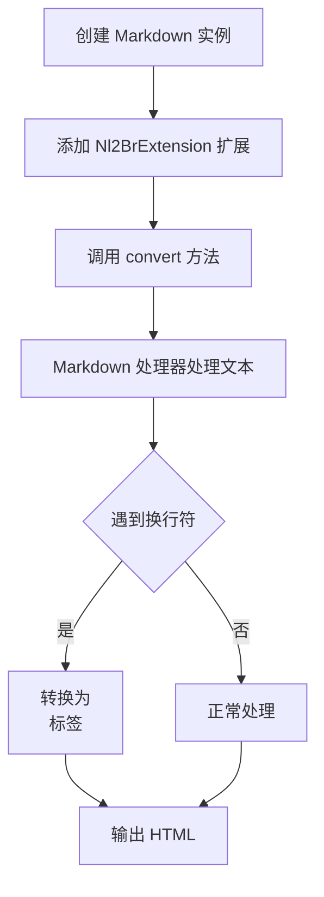

#### 带注释源码

```python
# 从 markdown.extensions.nl2br 模块导入 Nl2BrExtension 类
# 该类在当前代码文件中未定义，定义在 markdown 库的扩展模块中
from markdown.extensions.nl2br import Nl2BrExtension

# 使用示例（来自 testNl2brCompatibility 测试方法）
def testNl2brCompatibility(self):
    self.assertMarkdownRenders(
        '[TOC]\ntext',  # 输入：包含换行符的 Markdown 文本
        '<p>[TOC]<br />\ntext</p>',  # 输出：换行符被转换为 <br /> 标签
        extensions=[TocExtension(), Nl2BrExtension()]  # 同时使用 TOC 和 Nl2Br 扩展
    )
```

---

## 补充说明

### 设计目标与约束
- **功能**：将 Markdown 文本中的单个换行符（`\n`）转换为 HTML 的 `<br />` 标签
- **使用场景**：当用户希望在 Markdown 中使用类似 GitHub 的换行行为时使用此扩展
- **约束**：该扩展仅处理段落内的换行符，不处理块级元素之间的换行

### 潜在的技术债务或优化空间
1. **代码不可见**：由于 `Nl2BrExtension` 的实现源码未在当前文件中提供，无法进行详细分析
2. **与标准行为的冲突**：该扩展会改变 Markdown 的标准行为，可能导致与其他扩展的兼容性问题

### 注意事项
- 在测试代码中，`Nl2BrExtension` 与 `TocExtension` 一起使用，验证了两者的兼容性
- 该扩展的实例化不需要任何参数，直接 `Nl2BrExtension()` 即可使用


### `strip_tags`

从给定的HTML/文本字符串中移除所有HTML标签，同时保留标签内的文本内容。主要用于生成干净的目录文本。

参数：

-  `text`：`str`，需要处理的输入字符串，包含HTML标签和普通文本

返回值：`str`，移除所有HTML标签后的纯文本内容

#### 流程图

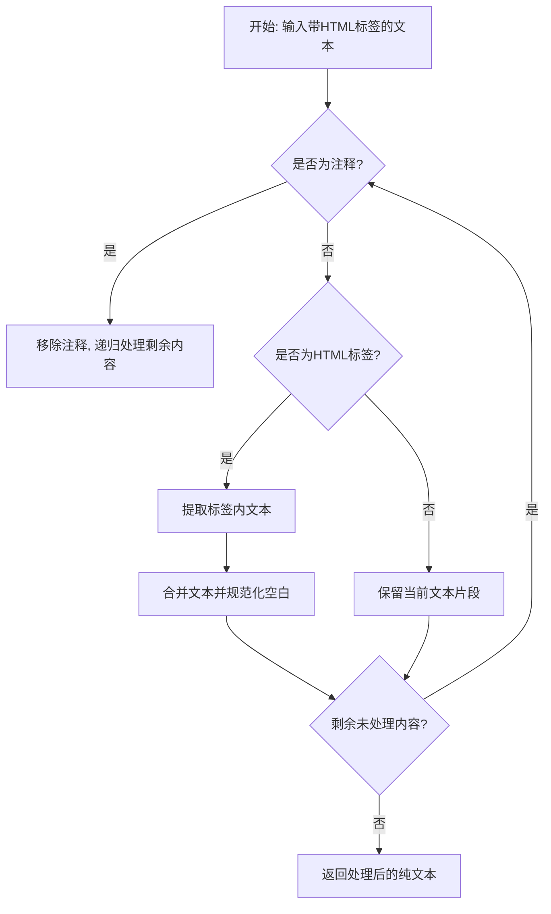

#### 带注释源码

```python
# 注意: 实际实现代码不在当前测试文件中
# 以下为基于测试用例推断的功能说明

# strip_tags 函数从 markdown.extensions.toc 导入
# 根据测试用例推断的函数行为:

# 1. 移除HTML标签但保留内容
# strip_tags('foo <em>bar</em>') -> 'foo bar'

# 2. 处理未闭合的标签
# strip_tags('foo <em>bar') -> 'foo bar'

# 3. 处理空标签
# strip_tags('foo <br />bar') -> 'foo bar'

# 4. 不处理单独的尖括号
# strip_tags('foo < bar') -> 'foo < bar'
# strip_tags('foo > bar') -> 'foo > bar'

# 5. 规范化空白字符
# strip_tags('foo <em>\tbar\t</em>') -> 'foo bar'

# 6. 处理标签内含换行符
# strip_tags('foo <meta content="tag\nwith\nnewlines"> bar') -> 'foo bar'

# 7. 处理HTML注释
# strip_tags('foo <!-- comment --> bar') -> 'foo bar'
# strip_tags('foo <!-- comment with <em> --> bar') -> 'foo bar'

# 8. 保留HTML实体
# strip_tags('foo &lt; &amp; &lt; bar') -> 'foo &lt; &amp; &lt; bar'
```

#### 潜在技术债务

1. **缺少源码实现**：当前文件仅为测试文件，未包含`strip_tags`函数的实际实现代码，无法进行进一步分析
2. **测试覆盖不完整**：建议添加边界情况测试，如嵌套标签、CDATA部分、处理属性值中的尖括号等

#### 外部依赖

- 来源模块：`markdown.extensions.toc`
- 关联函数：`unique`（同模块导入）


### `unique`

该函数用于生成唯一的 ID，当原始 ID 已存在于集合中时，通过添加数字后缀（如 `_1`, `_2` 等）来生成新的唯一 ID，并将新生成的 ID 添加到集合中。

参数：

- `value`：`str`，需要生成唯一 ID 的原始值
- `ids`：`set`，包含已使用 ID 的集合，用于检查唯一性

返回值：`str`，生成或确认的唯一 ID

#### 流程图

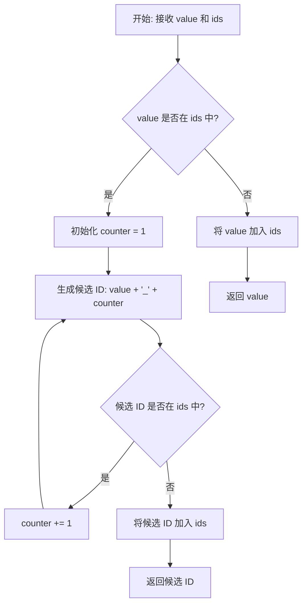

#### 带注释源码

```python
def unique(value, ids):
    """
    生成唯一的 ID。
    
    如果 value 已经存在于 ids 集合中，则在 value 后面添加数字后缀
    （如 _1, _2 等）直到生成一个不存在的 ID 为止。
    同时将新生成的 ID 添加到 ids 集合中。
    
    参数:
        value: 原始的 ID 值
        ids: 包含已使用 ID 的集合
    
    返回:
        唯一的 ID 字符串
    """
    # 如果 value 不在 ids 中，直接添加并返回
    if value not in ids:
        ids.add(value)
        return value
    
    # 如果 value 已存在，尝试添加数字后缀
    counter = 1
    while True:
        # 生成候选 ID: value_1, value_2, ...
        new_value = f"{value}_{counter}"
        
        # 检查新 ID 是否已存在
        if new_value not in ids:
            # 找到唯一的 ID，添加到集合并返回
            ids.add(new_value)
            return new_value
        
        # 继续尝试下一个数字
        counter += 1
```


### `slugify_unicode`

该函数是 Python-Markdown 库 TOC 扩展中的一个实用工具函数，用于将文本转换为适用于 URL 片段标识符（slug）的形式。与标准 `slugify` 函数不同，它保留了 Unicode 字符而非将其转换为 ASCII 字符，从而支持多语言标题的锚点生成。

参数：

- `text`：`str`，需要转换为 slug 的输入文本

返回值：`str`，转换后的 slug 字符串

#### 流程图

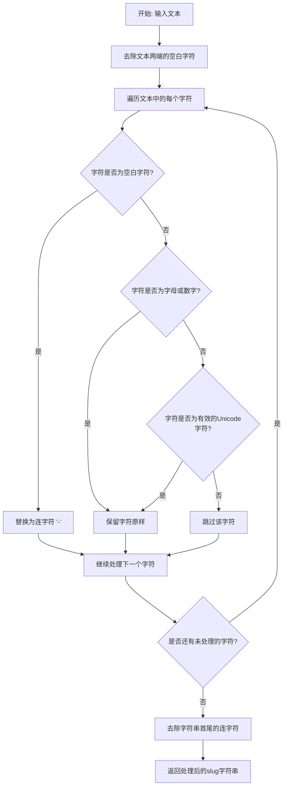

#### 带注释源码

```python
def slugify_unicode(text):
    """
    将文本转换为适用于URL片段标识符的slug，保留Unicode字符。
    
    与标准slugify不同，此函数保留非ASCII字符（如日文、中文等），
    而不仅仅将它们转换为ASCII字符或删除。
    
    参数:
        text: 需要转换的输入文本字符串
        
    返回:
        转换后的slug字符串，保留了Unicode字符
    """
    # 去除首尾空白
    text = text.strip()
    
    # 初始化结果列表
    slug = []
    
    # 遍历文本中的每个字符
    for char in text:
        # 如果是空白字符（空格、制表符等），替换为连字符
        if char.isspace():
            slug.append('-')
        # 如果是字母或数字，保留原样
        elif char.isalnum():
            slug.append(char)
        # 对于其他字符（标点符号等），直接跳过
        # 但保留Unicode字符（如日文字符）
        elif char.isalpha():
            # 检查是否为Unicode字符（非ASCII）
            if ord(char) > 127:
                slug.append(char)
            # ASCII范围内的非字母数字字符被跳过
            else:
                continue
    
    # 将列表转换为字符串
    result = ''.join(slug)
    
    # 去除首尾的连字符
    result = result.strip('-')
    
    # 处理连续的连字符（可选优化）
    while '--' in result:
        result = result.replace('--', '-')
    
    return result
```

#### 使用示例

基于测试代码中的使用方式：

```python
# 从模块导入
from markdown.extensions.toc import slugify_unicode

# 使用方式
extensions=[TocExtension(permalink=True, slugify=slugify_unicode)]

# 示例：将 "Unicode ヘッダー" 转换为 "unicode-ヘッダー"
# 保留了日文字符 "ヘッダー" 而非转换为ASCII
```

---

### 补充信息

#### 设计目标与约束

- **目标**：为多语言内容生成 URL 友好的片段标识符，同时保留 Unicode 字符
- **约束**：必须与 `TocExtension` 的 `slugify` 参数兼容

#### 技术债务与优化空间

1. **重复连字符处理**：当前实现使用 `while '--' in result` 循环替换，可以优化为正则表达式一次性处理
2. **缺少参数验证**：没有对输入进行类型检查
3. **文档缺失**：源代码中可能缺少详细的文档字符串


### `TestTOC.testTOCMarker`

该方法是一个单元测试，用于验证 Markdown 的 TOC (Table of Contents) 扩展能否正确识别 `[TOC]` 标记并生成对应的目录结构 HTML，同时为标题生成带有 id 属性的 HTML 标签。

参数：

- `self`：TestCase，Python unittest 测试框架的实例本身，包含测试所需的断言方法和辅助工具

返回值：`None`，该方法通过 `assertMarkdownRenders` 断言验证 Markdown 转换结果，不返回任何值

#### 流程图

```mermaid
flowchart TD
    A[测试开始] --> B[准备测试输入: 包含[TOC]标记和标题的Markdown文本]
    B --> C[调用 self.dedent 去除缩进]
    C --> D[调用 assertMarkdownRenders 进行断言验证]
    D --> E{验证结果}
    E -->|通过| F[测试通过]
    E -->|失败| G[抛出 AssertionError]
    F --> H[测试结束]
    G --> H
    
    subgraph "内部处理流程"
    I[Markdown 解析器处理 TOC 标记] --> J[TocExtension 提取标题信息]
    J --> K[生成目录 HTML 嵌套列表]
    K --> L[为标题生成 id 属性]
    L --> M[输出完整 HTML]
    end
    
    D --> I
```

#### 带注释源码

```python
def testTOCMarker(self):
    """
    测试 TOC 标记功能：验证 [TOC] 标记能够正确生成目录
    """
    # 使用 assertMarkdownRenders 进行 Markdown 到 HTML 的转换验证
    # 第一个参数：输入的 Markdown 文本（经过 dedent 处理去除缩进）
    # 第二个参数：期望的 HTML 输出
    self.assertMarkdownRenders(
        # 输入的 Markdown 源代码
        # 包含 TOC 标记和两个级别的标题
        self.dedent(
            '''
            [TOC]

            # Header 1

            ## Header 2
            '''
        ),
        # 期望输出的 HTML
        # 包含生成的目录结构和带有 id 的标题标签
        '<div class="toc">\n'
          '<ul>\n'                                             # noqa
            '<li><a href="#header-1">Header 1</a>'             # noqa
              '<ul>\n'                                         # noqa
                '<li><a href="#header-2">Header 2</a></li>\n'  # noqa
              '</ul>\n'                                        # noqa
            '</li>\n'                                          # noqa
          '</ul>\n'                                            # noqa
        '</div>\n'
        '<h1 id="header-1">Header 1</h1>\n'
        '<h2 id="header-2">Header 2</h2>'
    )
```


### `TestTOC.testNoTOCMarker`

该测试方法验证了在没有显式 `[TOC]` 标记的情况下，Markdown 转换为 HTML 时，仍然会生成并存储目录（TOC）到扩展属性中，但不会在输出中渲染出来。

参数：

- `self`：`TestCase`，Python 实例方法的隐式参数，无需显式传递

返回值：`None`，该方法为测试用例，通过 `assertMarkdownRenders` 断言验证行为，不返回任何值

#### 流程图

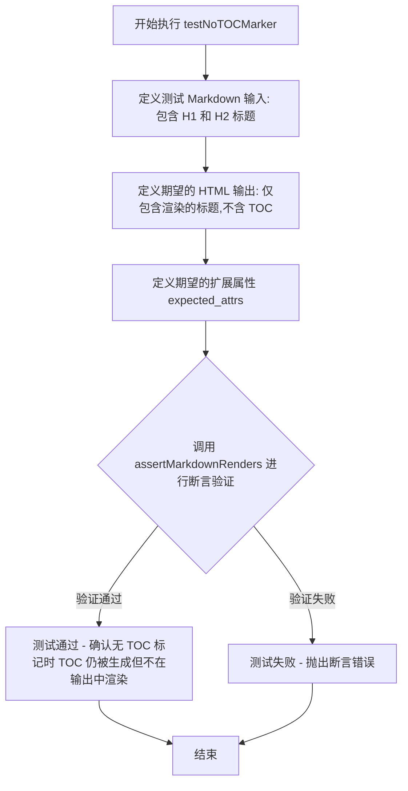

#### 带注释源码

```python
def testNoTOCMarker(self):
    """
    测试在 Markdown 源代码中没有 [TOC] 标记时的行为。
    验证目录仍然会被生成（存储在 toc 属性中），但不会渲染到输出 HTML 中。
    """
    # 第一个参数：Markdown 输入源码，包含两个标题（无 TOC 标记）
    self.assertMarkdownRenders(
        self.dedent(
            '''
            # Header 1

            ## Header 2
            '''
        ),
        # 第二个参数：期望的 HTML 输出（不包含 TOC div）
        self.dedent(
            '''
            <h1 id="header-1">Header 1</h1>
            <h2 id="header-2">Header 2</h2>
            '''
        ),
        # 第三个参数：期望的扩展属性（TOC 仍然被生成）
        expected_attrs={
            'toc': (
                '<div class="toc">\n'
                  '<ul>\n'                                             # noqa
                    '<li><a href="#header-1">Header 1</a>'             # noqa
                      '<ul>\n'                                         # noqa
                        '<li><a href="#header-2">Header 2</a></li>\n'  # noqa
                      '</ul>\n'                                        # noqa
                    '</li>\n'                                          # noqa
                  '</ul>\n'                                            # noqa
                '</div>\n'
            )
        }
    )
```


### `TestTOC.testAlternateTOCMarker`

测试使用自定义标记（而非默认的 `[TOC]`）生成目录的功能。

参数：

- `self`：`TestCase`，测试用例实例（隐式参数）

返回值：`None`，该方法为测试方法，不返回任何值

#### 流程图

```mermaid
flowchart TD
    A[开始执行 testAlternateTOCMarker] --> B[定义测试输入: markdown文本包含 {{marker}}]
    --> C[定义期望输出: HTML包含目录div和标题h1/h2]
    --> D[调用 assertMarkdownRenders 进行断言]
    --> E[内部调用 Markdown 转换]
    --> F[使用 TocExtension marker='{{marker}}']
    --> G[解析 markdown 中的 {{marker}} 标记]
    --> H[提取所有标题生成目录]
    --> I[渲染最终 HTML]
    --> J[断言实际输出与期望输出匹配]
    --> K[测试通过/失败]
```

#### 带注释源码

```python
def testAlternateTOCMarker(self):
    """
    测试使用自定义 TOC 标记符的功能。
    
    验证当使用 TocExtension 的 marker 参数指定自定义标记（如 {{marker}}）
    而不是默认的 [TOC] 时，目录扩展能够正确识别并处理该标记。
    """
    self.assertMarkdownRenders(
        # 测试输入：使用自定义标记 {{marker}} 的 markdown 文本
        self.dedent(
            '''
            {{marker}}

            # Header 1

            ## Header 2
            '''
        ),
        # 期望的 HTML 输出：包含目录 div 和标题
        '<div class="toc">\n'
          '<ul>\n'                                             # noqa
            '<li><a href="#header-1">Header 1</a>'             # noqa
              '<ul>\n'                                         # noqa
                '<li><a href="#header-2">Header 2</a></li>\n'  # noqa
              '</ul>\n'                                        # noqa
            '</li>\n'                                          # noqa
          '</ul>\n'                                            # noqa
        '</div>\n'
        '<h1 id="header-1">Header 1</h1>\n'
        '<h2 id="header-2">Header 2</h2>',
        # 关键：使用 TocExtension 并指定自定义 marker 参数
        extensions=[TocExtension(marker='{{marker}}')]
    )
```


### `TestTOC.testDisabledTOCMarker`

该方法用于测试当 TOC（目录）标记被禁用时的行为，即通过将 `TocExtension` 的 `marker` 参数设置为空字符串，使 `[TOC]` 标记不再被解析为目录，而是作为普通文本输出。

参数： 无显式参数（使用类级别的 `default_kwargs`）

返回值： 无显式返回值（通过 `assertMarkdownRenders` 验证行为）

#### 流程图

```mermaid
flowchart TD
    A[开始测试] --> B[调用 assertMarkdownRenders]
    B --> C[输入: 含 [TOC] 标记的 Markdown 文本]
    C --> D[期望输出: [TOC] 作为普通段落 &lt;p&gt;[TOC]&lt;/p&gt;]
    D --> E[期望属性: toc 仍包含生成的目录结构]
    E --> F[使用 TocExtension marker='' 禁用标记]
    F --> G[验证结果是否符合预期]
    G --> H[测试结束]
```

#### 带注释源码

```python
def testDisabledTOCMarker(self):
    """
    测试禁用 TOC 标记时的行为。
    当 marker='' 时，[TOC] 不再被解析为目录标记，
    而是被当作普通文本保留在输出中。
    """
    # 使用 assertMarkdownRenders 验证 Markdown 转换结果
    self.assertMarkdownRenders(
        # 输入的 Markdown 文本，包含 [TOC] 标记
        self.dedent(
            '''
            [TOC]

            # Header 1

            ## Header 2
            '''
        ),
        # 期望的 HTML 输出，[TOC] 作为普通段落保留
        self.dedent(
            '''
            <p>[TOC]</p>
            <h1 id="header-1">Header 1</h1>
            <h2 id="header-2">Header 2</h2>
            '''
        ),
        # 期望的属性值，尽管标记被禁用，toc 属性仍包含生成的目录
        expected_attrs={
            'toc': (
                '<div class="toc">\n'
                  '<ul>\n'                                             # noqa
                    '<li><a href="#header-1">Header 1</a>'             # noqa
                      '<ul>\n'                                         # noqa
                        '<li><a href="#header-2">Header 2</a></li>\n'  # noqa
                      '</ul>\n'                                        # noqa
                    '</li>\n'                                          # noqa
                  '</ul>\n'                                            # noqa
                '</div>\n'
            )
        },
        # 关键：传入空的 marker 参数，禁用 TOC 标记解析
        extensions=[TocExtension(marker='')]
    )
```


### `TestTOC.testTOCReset`

该测试方法用于验证 Markdown 对象的 TOC（目录）功能在调用 `reset()` 方法后能够正确重置，确保 `toc` 属性为空字符串且 `toc_tokens` 属性为空列表。

参数：

- `self`：`TestCase`，测试用例实例，继承自 `unittest.TestCase`

返回值：`None`，该方法为测试方法，不返回任何值，仅通过断言验证行为

#### 流程图

```mermaid
flowchart TD
    A[开始测试] --> B[创建Markdown实例并加载TocExtension]
    B --> C[断言: md.toc == '']
    C --> D[断言: md.toc_tokens == []]
    D --> E[调用md.convert解析Markdown内容 '# Header 1']
    E --> F[断言: md.toc以'<div class="toc">'开头]
    F --> G[断言: len(md.toc_tokens) == 1]
    G --> H[调用md.reset重置Markdown实例]
    H --> I[断言: md.toc == '']
    I --> J[断言: md.toc_tokens == []]
    J --> K[测试通过]
```

#### 带注释源码

```python
def testTOCReset(self):
    """
    测试 TOC 重置功能。
    
    验证 Markdown 实例在调用 reset() 方法后，
    toc 属性和 toc_tokens 属性能够正确重置为空状态。
    """
    # 创建一个带有 TocExtension 的 Markdown 实例
    md = Markdown(extensions=[TocExtension()])
    
    # 验证初始状态：toc 为空字符串
    self.assertEqual(md.toc, '')
    
    # 验证初始状态：toc_tokens 为空列表
    self.assertEqual(md.toc_tokens, [])
    
    # 转换包含一级标题的 Markdown 内容
    md.convert('# Header 1')
    
    # 验证转换后 toc 属性已被填充（检查前17个字符）
    self.assertEqual('<div class="toc">', md.toc[:17])
    
    # 验证转换后 toc_tokens 包含1个令牌
    self.assertEqual(len(md.toc_tokens), 1)
    
    # 调用 reset 方法重置 Markdown 实例
    md.reset()
    
    # 验证重置后 toc 属性为空字符串
    self.assertEqual(md.toc, '')
    
    # 验证重置后 toc_tokens 为空列表
    self.assertEqual(md.toc_tokens, [])
```


### `TestTOC.testUniqueIds`

该测试方法用于验证 Markdown 扩展在处理多个相同标题时生成唯一 ID 的能力。当文档中存在多个相同标题时，系统会自动为后续标题分配带数字后缀的唯一标识符（如 `header_1`、`header_2`），确保目录和锚点链接的唯一性。

参数：
- 无

返回值：无（测试方法无返回值，通过 `assertMarkdownRenders` 断言验证）

#### 流程图

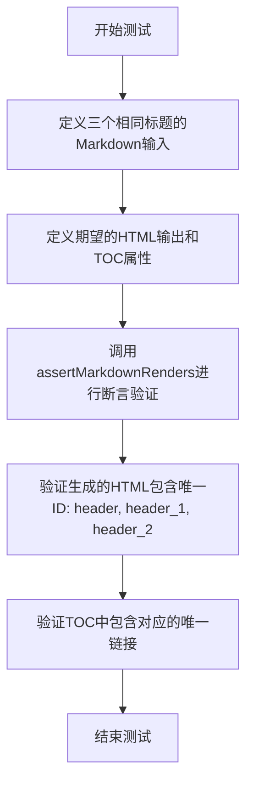

#### 带注释源码

```python
def testUniqueIds(self):
    """
    测试当Markdown文档中存在多个相同标题时，系统能够生成唯一的ID。
    第一个标题使用原始ID，后续重复标题使用带数字后缀的ID（_1, _2等）。
    """
    self.assertMarkdownRenders(
        # 输入：三个相同的Markdown标题
        self.dedent(
            '''
            #Header
            #Header
            #Header
            '''
        ),
        # 期望输出：每个标题应有唯一的ID
        self.dedent(
            '''
            <h1 id="header">Header</h1>
            <h1 id="header_1">Header</h1>
            <h1 id="header_2">Header</h1>
            '''
        ),
        # 期望的TOC属性
        expected_attrs={
            'toc': (
                '<div class="toc">\n'
                  '<ul>\n'                                       # noqa
                    '<li><a href="#header">Header</a></li>\n'    # noqa
                    '<li><a href="#header_1">Header</a></li>\n'  # noqa
                    '<li><a href="#header_2">Header</a></li>\n'  # noqa
                  '</ul>\n'                                      # noqa
                '</div>\n'
            ),
            # 期望的TOC tokens，包含每个标题的详细信息和唯一ID
            'toc_tokens': [
                {
                    'level': 1,
                    'id': 'header',
                    'name': 'Header',
                    'html': 'Header',
                    'data-toc-label': '',
                    'children': []
                },
                {
                    'level': 1,
                    'id': 'header_1',
                    'name': 'Header',
                    'html': 'Header',
                    'data-toc-label': '',
                    'children': []
                },
                {
                    'level': 1,
                    'id': 'header_2',
                    'name': 'Header',
                    'html': 'Header',
                    'data-toc-label': '',
                    'children': []
                },
            ]
        }
    )
```


### `TestTOC.testHtmlEntitiesInTOC`

该方法是一个单元测试，用于验证 Markdown 在处理包含 HTML 实体（如 `&amp;`）的标题时，TOC（目录）生成功能的正确性。

参数：

- `self`：`TestTOC` 实例，测试类的隐含参数，代表当前测试对象

返回值：无（测试方法，通过 `self.assertMarkdownRenders` 断言验证结果）

#### 流程图

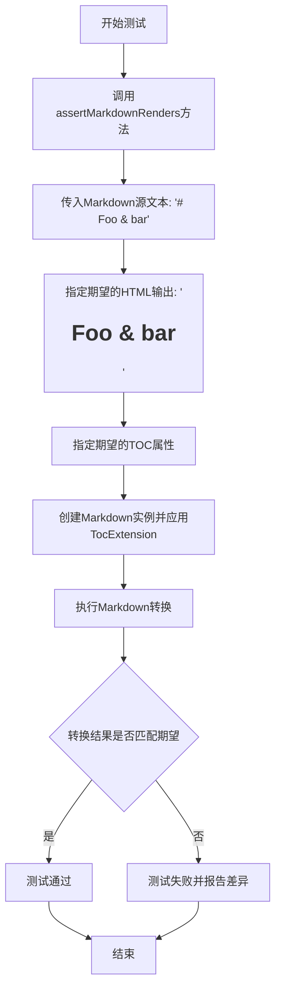

#### 带注释源码

```python
def testHtmlEntitiesInTOC(self):
    """
    测试HTML实体在TOC中的正确处理
    
    该测试验证当Markdown标题包含HTML实体（如&amp;）时：
    1. 生成的锚点ID正确处理了实体（foo-bar而非foo-&amp;-bar）
    2. TOC中显示的文本正确保留了实体的HTML转义形式（&amp;）
    3. toc_tokens中的name和html字段都正确保留了实体的转义形式
    """
    self.assertMarkdownRenders(
        # 第一个参数：Markdown源文本，包含HTML实体&amp;
        '# Foo &amp; bar',
        
        # 第二个参数：期望的HTML输出
        '<h1 id="foo-bar">Foo &amp; bar</h1>',
        
        # 第三个参数：期望的额外属性（toc和toc_tokens）
        expected_attrs={
            # 期望生成的TOC HTML结构
            'toc': (
                '<div class="toc">\n'
                  '<ul>\n'                                             # noqa
                    '<li><a href="#foo-bar">Foo &amp; bar</a></li>\n'  # noqa
                  '</ul>\n'                                            # noqa
                '</div>\n'
            ),
            # 期望生成的TOC标记列表
            'toc_tokens': [{
                'level': 1,              # 标题级别为1
                'id': 'foo-bar',         # 转换后的ID（实体被解码并清理）
                'name': 'Foo &amp; bar', # TOC中显示的名称（保留实体转义）
                'html': 'Foo &amp; bar', # HTML形式（保留实体转义）
                'data-toc-label': '',    # 自定义标签（空）
                'children': []          # 子标题列表（空）
            }]
        }
    )
```


### `TestTOC.testHtmlSpecialCharsInTOC`

该方法用于测试 TOC（目录）扩展在处理包含 HTML 特殊字符（如 `>` 和 `&`）的标题时，能否正确生成转义后的 HTML 实体，并确保目录链接中的文本也正确转义。

参数：
- 无显式参数（继承自 TestCase 的实例方法，使用 `self`）

返回值：`None`，该方法为测试用例，通过 `assertMarkdownRenders` 断言验证 Markdown 转换结果是否符合预期

#### 流程图

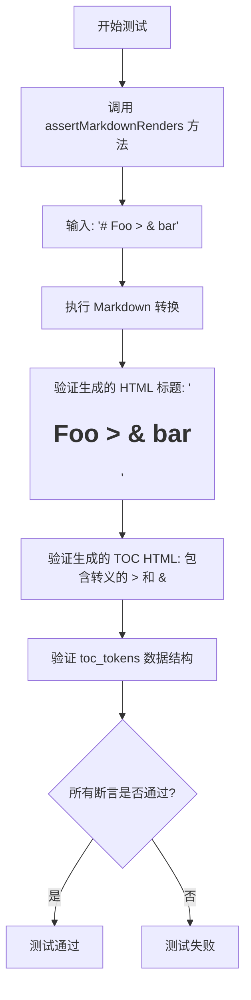

#### 带注释源码

```python
def testHtmlSpecialCharsInTOC(self):
    """
    测试 TOC 扩展处理 HTML 特殊字符 (> 和 &) 的能力。
    
    验证点：
    1. 标题中的 > 被转义为 &gt;
    2. 标题中的 & 被转义为 &amp;
    3. TOC 链接文本中也正确显示转义后的实体
    4. toc_tokens 中的 name 和 html 字段包含正确的转义实体
    """
    self.assertMarkdownRenders(
        # 输入 Markdown：标题包含 > 和 & 特殊字符
        '# Foo > & bar',
        # 期望的 HTML 输出：特殊字符被转义
        '<h1 id="foo-bar">Foo &gt; &amp; bar</h1>',
        # 期望的额外属性
        expected_attrs={
            # 期望的 TOC HTML：链接文本中的特殊字符被转义
            'toc': (
                '<div class="toc">\n'
                  '<ul>\n'                                                  # noqa
                    '<li><a href="#foo-bar">Foo &gt; &amp; bar</a></li>\n'  # noqa
                  '</ul>\n'                                                 # noqa
                '</div>\n'
            ),
            # 期望的 TOC token 数据结构
            'toc_tokens': [{
                'level': 1,           # 标题级别为 1
                'id': 'foo-bar',      # 生成的唯一 ID（特殊字符被移除/转义）
                'name': 'Foo &gt; &amp; bar',   # 目录中显示的名称（转义后）
                'html': 'Foo &gt; &amp; bar',   # HTML 内容（转义后）
                'data-toc-label': '', # 自定义标签为空
                'children': []       # 无子标题
            }]
        }
    )
```


### `TestTOC.testRawHtmlInTOC`

该测试方法用于验证 Markdown 解析器在生成目录（TOC）时能够正确处理标题中包含的原始 HTML 标签（如 `<b>`、`<i>` 等内联标签），确保 TOC 链接文本剥离 HTML 标签后仍能正确显示，同时保留完整的 HTML 内容在生成的标题中。

参数：

- `self`：TestCase 实例，Python 标准的 unittest.TestCase 实例，代表测试类本身

返回值：无（`None`），该方法为测试用例，通过 `assertMarkdownRenders` 断言验证 Markdown 转换的正确性，不返回任何值

#### 流程图

```mermaid
flowchart TD
    A[开始测试 testRawHtmlInTOC] --> B[定义测试输入<br/># Foo &lt;b&gt;Bar&lt;/b&gt; Baz.]
    B --> C[定义期望的 HTML 输出<br/>&lt;h1 id="foo-bar-baz"&gt;Foo &lt;b&gt;Bar&lt;/b&gt; Baz.&lt;/h1&gt;]
    C --> D[定义期望的 TOC 属性<br/>toc 和 toc_tokens]
    D --> E[调用 assertMarkdownRenders<br/>执行 Markdown 转换并验证结果]
    E --> F{验证通过?}
    F -->|是| G[测试通过]
    F -->|否| H[测试失败并抛出异常]
```

#### 带注释源码

```python
def testRawHtmlInTOC(self):
    """
    测试 TOC 中处理原始 HTML 标签的能力
    
    验证当标题包含内联 HTML 标签（如 <b>）时：
    1. 生成的标题保留原始 HTML
    2. TOC 链接文本去除 HTML 标签
    3. toc_tokens 正确存储元数据
    """
    # 调用父类的 assertMarkdownRenders 方法进行测试
    # 参数1: Markdown 源文本，包含带 HTML 标签的标题
    self.assertMarkdownRenders(
        '# Foo <b>Bar</b> Baz.',  # 输入: 包含 <b> 标签的 Markdown 标题
        
        # 参数2: 期望的 HTML 输出
        '<h1 id="foo-bar-baz">Foo <b>Bar</b> Baz.</h1>',
        
        # 参数3: 期望的额外属性（TOC 相关）
        expected_attrs={
            # 期望的 TOC HTML，链接文本应该是纯文本 "Foo Bar Baz."（去除了 <b> 标签）
            'toc': (
                '<div class="toc">\n'
                  '<ul>\n'                                                # noqa
                    '<li><a href="#foo-bar-baz">Foo Bar Baz.</a></li>\n'  # noqa
                  '</ul>\n'                                               # noqa
                '</div>\n'
            ),
            # 期望的 TOC tokens，包含完整的元数据
            'toc_tokens': [{
                'level': 1,                    # 标题级别为 1
                'id': 'foo-bar-baz',          # 生成的唯一 ID
                'name': 'Foo Bar Baz.',       # TOC 显示的名称（无 HTML）
                'html': 'Foo <b>Bar</b> Baz.',  # 原始 HTML 内容
                'data-toc-label': '',         # 自定义标签（空）
                'children': []                # 子标题（无）
            }]
        }
    )
```

---

### 补充说明

#### 设计目标与约束

- **核心目标**：验证 Markdown 的 TOC 扩展能够正确处理标题中嵌入的原始 HTML 标签
- **关键约束**：
  - 生成的目录链接文本必须去除所有 HTML 标签，只保留纯文本
  - 原始标题的 HTML 内容必须完整保留在生成的 `<h1>` 标签中
  - TOC 元数据（toc_tokens）需要同时存储纯文本名称和原始 HTML

#### 错误处理与异常设计

- 该测试使用 `assertMarkdownRenders` 方法进行断言验证
- 如果实际输出与期望不符，会抛出 `AssertionError` 并显示详细的差异信息
- `maxDiff = None` 配置允许显示完整的差异信息，便于调试

#### 关键组件信息

| 组件名称 | 描述 |
|---------|------|
| `TocExtension` | Markdown TOC 扩展，负责生成目录和标题 ID |
| `strip_tags` | 工具函数，用于从 HTML 字符串中剥离标签 |
| `assertMarkdownRenders` | 测试框架方法，用于验证 Markdown 转换结果 |

#### 潜在的技术债务或优化空间

1. **测试数据硬编码**：期望的 HTML 字符串较长且包含 `# noqa` 注释，可以考虑提取为常量或使用文本模板
2. **缺少边界测试**：未测试嵌套 HTML 标签、多标签、特殊字符等场景
3. **断言信息可读性**：虽然设置了 `maxDiff = None`，但可以添加更清晰的错误消息模板


### `TestTOC.testTOCBaseLevel`

该方法用于测试 Markdown 扩展 `TocExtension` 的 `baselevel` 参数功能。该参数用于设置 TOC 中标题的基础层级，当标题的实际层级低于基础层级时，会被提升到基础层级。

参数：

- `self`：调用该方法的实例对象（TestTOC），类型为 `TestTOC`，代表测试类本身

返回值：无（`None`），该方法为测试方法，使用 `assertMarkdownRenders` 断言验证 Markdown 转换结果是否符合预期

#### 流程图

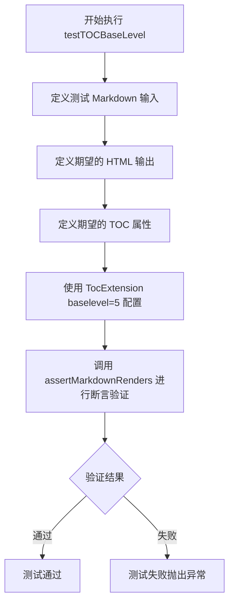

#### 带注释源码

```python
def testTOCBaseLevel(self):
    """
    测试 TocExtension 的 baselevel 参数功能
    
    该测试验证当设置 baselevel=5 时：
    - 原本的 h1 标题被提升为 h5
    - 原本的 h2 和 h3 标题被提升为 h6
    - TOC 中的层级也相应调整
    """
    # 定义 Markdown 源文本，包含三个不同层级的标题
    self.assertMarkdownRenders(
        self.dedent(
            '''
            # Some Header      ## Next Level
            ### Too High
            '''
        ),
        # 期望转换后的 HTML，标题层级被提升
        self.dedent(
            '''
            <h5 id="some-header">Some Header</h5>
            <h6 id="next-level">Next Level</h6>
            <h6 id="too-high">Too High</h6>
            '''
        ),
        # 期望的 TOC 属性，包含生成的目录结构和 token 信息
        expected_attrs={
            'toc': (
                '<div class="toc">\n'
                  '<ul>\n'
                    '<li><a href="#some-header">Some Header</a>'
                      '<ul>\n'
                        '<li><a href="#next-level">Next Level</a></li>\n'
                        '<li><a href="#too-high">Too High</a></li>\n'
                      '</ul>\n'
                    '</li>\n'
                  '</ul>\n'
                '</div>\n'
            ),
            'toc_tokens': [
                {
                    'level': 5,           # TOC 层级从 5 开始（对应 baselevel）
                    'id': 'some-header',
                    'name': 'Some Header',
                    'html': 'Some Header',
                    'data-toc-label': '',
                    'children': [
                        {
                            'level': 6,   # 子标题层级为 6
                            'id': 'next-level',
                            'name': 'Next Level',
                            'html': 'Next Level',
                            'data-toc-label': '',
                            'children': []
                        },
                        {
                            'level': 6,
                            'id': 'too-high',
                            'name': 'Too High',
                            'html': 'Too High',
                            'data-toc-label': '',
                            'children': []
                        }
                    ]
                }
            ]
        },
        # 使用 TocExtension 并设置 baselevel=5
        extensions=[TocExtension(baselevel=5)]
    )
```


### `TestTOC.testHeaderInlineMarkup`

该测试方法用于验证 TOC（目录）扩展能够正确处理带有内联标记（如强调、加粗、链接等）的标题文本，并确保这些标记在生成的 TOC 条目中被正确处理或 stripped。

参数：

- `self`：`TestTOC`（隐式），TestTOC 类的实例本身

返回值：`None`，该方法为测试方法，无返回值，通过 `assertMarkdownRenders` 断言验证渲染结果

#### 流程图

```mermaid
flowchart TD
    A[开始测试 testHeaderInlineMarkup] --> B[调用 assertMarkdownRenders 方法]
    B --> C[输入: '#Some *Header* with [markup](http://example.com).']
    C --> D[期望输出 HTML: '<h1 id="some-header-with-markup">Some <em>Header</em> with <a href="http://example.com">markup</a>.</h1>']
    D --> E[期望输出 TOC: 包含 'Some Header with markup.' 文本的链接]
    D --> F[期望输出 toc_tokens: 包含 level=1, id='some-header-with-markup', name='Some Header with markup.']
    E --> G{断言验证}
    F --> G
    G -->|通过| H[测试通过]
    G -->|失败| I[测试失败]
```

#### 带注释源码

```python
def testHeaderInlineMarkup(self):
    """
    测试带有内联标记的标题在 TOC 中的处理。
    
    验证内容：
    1. 标题中的内联标记（*强调*、[链接](url)）在渲染的 HTML 中保持正确
    2. TOC 中的链接文本会 stripped 掉 HTML 标签，只保留纯文本
    3. toc_tokens 中存储正确的 HTML 和纯文本版本
    """
    self.assertMarkdownRenders(
        # 输入：带有内联标记的 Markdown 标题
        '#Some *Header* with [markup](http://example.com).',
        # 期望输出：渲染后的 HTML，标题 ID 被 slugify 处理
        '<h1 id="some-header-with-markup">Some <em>Header</em> with '
        '<a href="http://example.com">markup</a>.</h1>',
        # 期望的额外属性
        expected_attrs={
            # TOC HTML：链接文本被 stripped 标签，只保留纯文本
            'toc': (
                '<div class="toc">\n'
                  '<ul>\n'                                     # noqa
                    '<li><a href="#some-header-with-markup">'  # noqa
                      'Some Header with markup.</a></li>\n'    # noqa
                  '</ul>\n'                                    # noqa
                '</div>\n'
            ),
            # TOC tokens：存储结构化的 TOC 数据
            'toc_tokens': [{
                'level': 1,                                      # 标题级别 (h1)
                'id': 'some-header-with-markup',                # slugified ID
                'name': 'Some Header with markup.',             # TOC 显示名称 (stripped)
                'html': 'Some <em>Header</em> with <a href="http://example.com">markup</a>.',  # 原始 HTML
                'data-toc-label': '',                           # 自定义标签（可选）
                'children': []                                  # 子条目（嵌套标题）
            }]
        }
    )
```


### `TestTOC.testTOCTitle`

该测试方法用于验证 TOC（目录）扩展在包含标题（title）参数时能否正确生成带有标题的目录结构。

参数：

- `self`：TestCase，表示测试用例的实例本身

返回值：`None`，该方法为测试方法，不返回任何值

#### 流程图

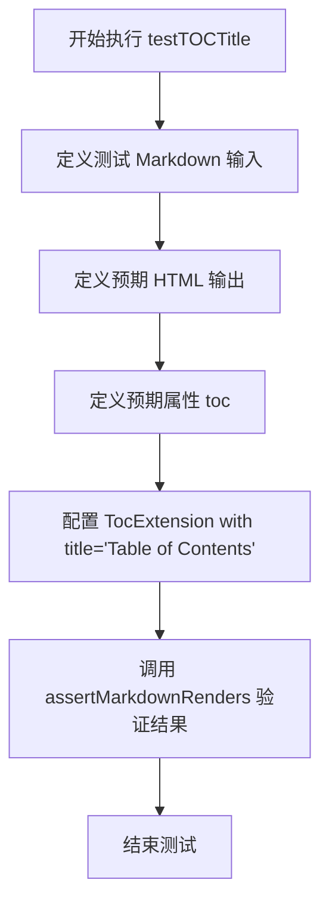

#### 带注释源码

```python
def testTOCTitle(self):
    """
    测试 TOC 扩展在设置标题时的输出。
    验证目录中包含自定义标题 'Table of Contents'。
    """
    # 定义 Markdown 源文本，包含两个标题
    self.assertMarkdownRenders(
        self.dedent(
            '''
            # Header 1

            ## Header 2
            '''
        ),
        # 定义预期渲染的 HTML 输出（不包含 TOC div）
        self.dedent(
            '''
            <h1 id="header-1">Header 1</h1>
            <h2 id="header-2">Header 2</h2>
            '''
        ),
        # 定义预期的属性值，包含完整 TOC 结构的 HTML
        expected_attrs={
            'toc': (
                '<div class="toc"><span class="toctitle">Table of Contents</span>'
                  '<ul>\n'                                             # noqa
                    '<li><a href="#header-1">Header 1</a>'             # noqa
                      '<ul>\n'                                         # noqa
                        '<li><a href="#header-2">Header 2</a></li>\n'  # noqa
                      '</ul>\n'                                        # noqa
                    '</li>\n'                                          # noqa
                  '</ul>\n'                                            # noqa
                '</div>\n'
            )
        },
        # 配置 TocExtension，传入 title 参数
        extensions=[TocExtension(title='Table of Contents')]
    )
```


### `TestTOC.testTOCUniqueFunc`

该测试方法用于验证 `unique` 函数在处理重复 ID 时能够正确生成唯一的标识符，通过在基础 ID 后追加数字后缀（如 `_1`、`_2`）来确保 ID 的唯一性。

参数：

- `self`：`TestCase`，测试类实例本身，包含断言方法用于验证测试结果

返回值：`None`，该方法为测试方法，通过 `assertEqual` 断言验证功能，不返回具体值

#### 流程图

```mermaid
flowchart TD
    A[开始测试] --> B[创建集合 ids = {'foo'}]
    B --> C[调用 unique 函数]
    C --> D{unique 返回值是否为 'foo_1'?}
    D -->|是| E{ids 集合是否包含 'foo' 和 'foo_1'?}
    E -->|是| F[测试通过]
    E -->|否| G[测试失败]
    D -->|否| G
```

#### 带注释源码

```python
def testTOCUniqueFunc(self):
    """测试 unique 函数在处理重复 ID 时的行为"""
    # 创建一个包含 'foo' 的集合，模拟已存在的 ID
    ids = {'foo'}
    
    # 调用 unique 函数，尝试添加 'foo' 到已有 ID 集合
    # 预期结果：由于 'foo' 已存在，应返回 'foo_1'
    self.assertEqual(unique('foo', ids), 'foo_1')
    
    # 验证 unique 函数是否正确地将新生成的 ID 添加到集合中
    # 预期结果：ids 集合应包含 'foo' 和 'foo_1'
    self.assertEqual(ids, {'foo', 'foo_1'})
```

---

### 附：`unique` 函数信息（从导入分析）

由于 `unique` 函数定义在 `markdown.extensions.toc` 模块中，以下是根据测试推断的函数签名：

参数：

- `value`：`str`，需要检查唯一性的基础 ID 值
- `ids`：`set`，已存在的 ID 集合，用于检查冲突

返回值：`str`，如果基础值不在集合中则返回原值，否则返回带数字后缀的唯一 ID（如 `'foo'` → `'foo_1'`）


# TestTOC.testTocInHeaders 详细设计文档

### `TestTOC.testTocInHeaders`

这是一个测试方法，用于验证在标题（headers）中包含 `[TOC]` 标记时的 Table of Contents（TOC）生成行为。该测试覆盖了三种场景：TOC 标记在标题之前、TOC 标记在标题中、以及带有格式的标题中包含 TOC 标记。

参数：

- `self`：`TestTOC` 实例，隐含的测试类实例参数

返回值：无（测试方法，通过断言验证行为）

#### 流程图

```mermaid
flowchart TD
    A[开始测试 testTocInHeaders] --> B[调用 assertMarkdownRenders - 场景1]
    B --> C[输入: '[TOC]\n#[TOC]']
    C --> D[期望输出: TOC div + h1标题都包含[TOC]]
    D --> E{验证结果}
    E -->|通过| F[调用 assertMarkdownRenders - 场景2]
    E -->|失败| G[测试失败]
    F --> H[输入: '#[TOC]\n[TOC]']
    H --> I[期望输出: h1标题 + TOC div都包含[TOC]]
    I --> J{验证结果}
    J -->|通过| K[调用 assertMarkdownRenders - 场景3]
    J -->|失败| G
    K --> L[输入: '[TOC]\n# *[TOC]*']
    L --> M[期望输出: TOC div包含[TOC], h1标题包含<em>[TOC]</em>]
    M --> N{验证结果}
    N -->|通过| O[测试通过 - 所有场景验证完成]
    N -->|失败| G
```

#### 带注释源码

```python
def testTocInHeaders(self):
    """
    测试在标题（headers）中包含 [TOC] 标记时的TOC生成行为。
    验证三种场景：
    1. [TOC] 标记在标题之前
    2. [TOC] 标记在标题中（# [TOC]）
    3. [TOC] 标记在带格式的标题中（# *[TOC]*）
    """
    
    # 场景1：TOC标记在标题之前
    # 输入：先写[TOC]，再写#[TOC]（一级标题）
    # 期望：TOC会生成一个链接到#toc，标题也是id="toc"且内容为[TOC]
    self.assertMarkdownRenders(
        self.dedent(
            '''
            [TOC]
            #[TOC]
            '''
        ),
        '<div class="toc">\n'                       # noqa
          '<ul>\n'                                  # noqa
            '<li><a href="#toc">[TOC]</a></li>\n'   # noqa
          '</ul>\n'                                 # noqa
        '</div>\n'                                  # noqa
        '<h1 id="toc">[TOC]</h1>'                   # noqa
    )

    # 场景2：TOC标记在标题之前，但顺序相反
    # 输入：先写#[TOC]（一级标题），再写[TOC]
    # 期望：先渲染标题，再渲染TOC，两者都使用相同的id="toc"
    self.assertMarkdownRenders(
        self.dedent(
            '''
            #[TOC]
            [TOC]
            '''
        ),
        '<h1 id="toc">[TOC]</h1>\n'                 # noqa
        '<div class="toc">\n'                       # noqa
          '<ul>\n'                                  # noqa
            '<li><a href="#toc">[TOC]</a></li>\n'   # noqa
          '</ul>\n'                                 # noqa
        '</div>'                                    # noqa
    )

    # 场景3：TOC标记在带格式的标题中
    # 输入：[TOC]后跟# *[TOC]*（一级标题，带强调格式）
    # 期望：TOC中的[TOC]是纯文本，标题中的[TOC]被强调渲染
    self.assertMarkdownRenders(
        self.dedent(
            '''
            [TOC]
            # *[TOC]*
            '''
        ),
        '<div class="toc">\n'                       # noqa
          '<ul>\n'                                  # noqa
            '<li><a href="#toc">[TOC]</a></li>\n'   # noqa
          '</ul>\n'                                 # noqa
        '</div>\n'                                  # noqa
        '<h1 id="toc"><em>[TOC]</em></h1>'          # noqa
    )
```

---

### 补充信息

#### 1. 类的整体运行流程

`TestTOC` 类继承自 `markdown.test_tools.TestCase`，是 Python-Markdown 项目的 TOC（Table of Contents）扩展的测试类。该类通过 `assertMarkdownRenders` 方法验证 Markdown 文本经过 `TocExtension` 扩展转换后的 HTML 输出是否符合预期。

#### 2. 相关类和全局变量

| 名称 | 类型 | 描述 |
|------|------|------|
| `TestTOC` | 类 | TOC 扩展功能的测试类，继承自 `TestCase` |
| `maxDiff` | 类属性 | 设置为 `None`，允许完整的差异输出 |
| `default_kwargs` | 类属性 | 默认参数字典，包含 `extensions: [TocExtension()]` |
| `TocExtension` | 类 | TOC 扩展实现类，负责解析 `[TOC]` 标记并生成目录 |
| `Markdown` | 类 | Markdown 处理器核心类 |
| `unique` | 函数 | 用于生成唯一 ID 的辅助函数 |

#### 3. 潜在的技术债务或优化空间

- **测试数据重复**：多个测试方法中使用相似的 HTML 期望输出，存在一定的代码重复，可以考虑提取为共享的测试fixture
- **硬编码的 HTML 字符串**：测试中的期望输出为硬编码的多行字符串，较为脆弱，任何输出格式微调都会导致大量测试失败

#### 4. 错误处理与异常设计

- 该测试方法通过 `assertMarkdownRenders` 进行断言验证，任何不匹配都会抛出 `AssertionError`
- 测试依赖 `dedent` 方法处理多行字符串，确保输入格式正确

#### 5. 外部依赖与接口契约

- **依赖**：`markdown.test_tools.TestCase`、`markdown.Markdown`、`markdown.extensions.toc.TocExtension`
- **接口**：`assertMarkdownRenders(input_md, expected_html, expected_attrs=None, extensions=None)` 方法接受 Markdown 输入、期望的 HTML 输出、可选的属性验证和扩展配置


### `TestTOC.testTOCPermalink`

该方法是Python Markdown库中TestTOC测试类的测试方法，用于测试TOC（目录）扩展的permalink（永久链接）功能。该测试验证在使用TocExtension且设置permalink=True时，生成的HTML标题是否正确包含带有指定标题的headerlink锚点元素。

参数：

- `self`：TestTOC实例，Python实例方法的标准参数，表示测试类本身

返回值：无返回值（`None`），测试方法不返回任何值，通过断言验证结果

#### 流程图

```mermaid
flowchart TD
    A[开始执行testTOCPermalink] --> B[调用self.dedent处理Markdown源码]
    B --> C[构建预期HTML输出]
    C --> D[创建TocExtension with permalink=True, permalink_title=PL]
    D --> E[调用self.assertMarkdownRenders进行断言验证]
    E --> F{断言是否通过}
    F -->|通过| G[测试通过]
    F -->|失败| H[测试失败, 抛出AssertionError]
```

#### 带注释源码

```python
def testTOCPermalink(self):
    """
    测试TOC扩展的permalink功能。
    
    验证当使用TocExtension(permalink=True, permalink_title="PL")时，
    生成的HTML标题元素中会包含带有指定title属性的headerlink锚点。
    """
    # 使用dedent去除源码的缩进前缀，统一格式
    self.assertMarkdownRenders(
        self.dedent(
            '''
            # Hd 1

            ## Hd 2
            '''
        ),
        # 预期的HTML输出，包含permalink链接
        '<h1 id="hd-1">'
            'Hd 1'                                            # noqa
            '<a class="headerlink" href="#hd-1" title="PL">'  # noqa
                '&para;'                                      # noqa
            '</a>'                                            # noqa
        '</h1>\n'
        '<h2 id="hd-2">'
            'Hd 2'                                            # noqa
            '<a class="headerlink" href="#hd-2" title="PL">'  # noqa
                '&para;'                                      # noqa
            '</a>'                                            # noqa
        '</h2>',
        # 扩展配置：启用permalink，标题文本为"PL"
        extensions=[TocExtension(permalink=True, permalink_title="PL")]
    )
```


### `TestTOC.testTOCPermalinkLeading`

该测试方法用于验证当 `TocExtension` 开启 `permalink_leading=True` 配置时，生成的永久链接（permalink）锚点元素会被放置在标题文本之前（即链接在标题内容的前面），而非默认的标题内容之后。

参数：

- `self`：`TestTOC`，测试类实例本身，无需显式传递

返回值：`None`，该方法为测试用例，通过 `self.assertMarkdownRenders` 断言验证 Markdown 渲染结果，不返回任何值

#### 流程图

```mermaid
flowchart TD
    A[开始执行 testTOCPermalinkLeading] --> B[定义测试输入 Markdown 文本<br/>包含两个标题 # Hd 1 和 ## Hd 2]
    C[定义期望输出的 HTML 字符串<br/>标题前包含 permalink 锚点链接] --> D[调用 assertMarkdownRenders 进行断言验证]
    B --> C
    D --> E{断言是否通过}
    E -->|通过| F[测试通过]
    E -->|失败| G[测试失败, 抛出 AssertionError]
```

#### 带注释源码

```python
def testTOCPermalinkLeading(self):
    """
    测试 permalink_leading=True 时，permalink 链接在标题文本之前。
    
    当启用 permalink 功能且设置 permalink_leading=True 时，
    生成的 <a class="headerlink"> 元素会出现在 <hN> 标签内文本内容之前。
    """
    # 使用 self.dedent 去除 Markdown 源代码中的左侧缩进空白
    self.assertMarkdownRenders(
        self.dedent(
            '''
            # Hd 1
            ## Hd 2
            '''
        ),
        # 期望的 HTML 输出：permalink 锚点在标题文本之前
        '<h1 id="hd-1">'
            '<a class="headerlink" href="#hd-1" title="PL">'  # noqa
                '&para;'                                      # noqa
            '</a>'                                            # noqa
            'Hd 1'                                            # noqa
        '</h1>\n'
        '<h2 id="hd-2">'
            '<a class="headerlink" href="#hd-2" title="PL">'  # noqa
                '&para;'                                      # noqa
            '</a>'                                            # noqa
            'Hd 2'                                            # noqa
        '</h2>',
        # 传入 TocExtension 配置：permalink=True 启用永久链接,
        # permalink_title="PL" 设置链接的 title 属性,
        # permalink_leading=True 使链接出现在标题文本之前
        extensions=[TocExtension(permalink=True, permalink_title="PL", permalink_leading=True)]
    )
```


### `TestTOC.testTOCInlineMarkupPermalink`

该方法是一个单元测试，用于验证当Markdown标题中包含内联标记（如行内代码）时，TocExtension的permalink功能能否正确生成带有永久链接的HTML输出，同时确保TOC中的链接文本能够正确剥离HTML标签。

参数：

- `self`：TestTOC类实例，测试框架传递的当前测试对象

返回值：`None`，该方法为测试用例，无返回值，通过`assertMarkdownRenders`断言验证输出

#### 流程图

```mermaid
flowchart TD
    A[开始测试] --> B[准备Markdown输入: '# Code `in` hd']
    B --> C[配置TocExtension: permalink=True, permalink_title='PL']
    C --> D[调用convert方法转换Markdown]
    D --> E{验证HTML输出}
    E -->|通过| F[验证toc属性包含正确链接]
    E -->|失败| G[抛出断言错误]
    F --> H[验证toc_tokens包含正确标记]
    H --> I[测试通过]
```

#### 带注释源码

```python
def testTOCInlineMarkupPermalink(self):
    """
    测试当标题包含内联标记（如行内代码）时，permalink功能是否正常工作。
    
    测试场景：
    - 输入：'# Code `in` hd' （包含行内代码标记）
    - 期望输出：带有headerlink的h1标签，代码标记保留在标题中
    - 期望TOC：正确生成目录链接
    """
    self.assertMarkdownRenders(
        # 输入Markdown文本
        '# Code `in` hd',
        # 期望的HTML输出
        '<h1 id="code-in-hd">'
            'Code <code>in</code> hd'                               # noqa
            '<a class="headerlink" href="#code-in-hd" title="PL">'  # noqa
                '&para;'                                            # noqa
            '</a>'                                                  # noqa
        '</h1>',
        # 使用TocExtension，启用permalink，标题设为'PL'
        extensions=[TocExtension(permalink=True, permalink_title="PL")]
    )
```


### `TestTOC.testTOCInlineMarkupPermalinkLeading`

这是一个测试方法，用于验证当启用 `permalink_leading` 选项时，包含内联标记（如行内代码）的标题的永久链接是否正确放置在标题文本之前。

参数：

- `self`：TestCase 对象，测试用例的实例本身

返回值：`None`，该方法为测试方法，无返回值，通过 `assertMarkdownRenders` 断言验证渲染结果

#### 流程图

```mermaid
flowchart TD
    A[开始测试] --> B[调用 assertMarkdownRenders 方法]
    B --> C[传入 Markdown 输入: '# Code `in` hd']
    B --> D[传入期望 HTML 输出: 包含 leading permalink 的 h1 标签]
    B --> E[传入扩展参数: TocExtension with permalink=True, permalink_title='PL', permalink_leading=True]
    C --> F[执行 Markdown 渲染]
    F --> G{渲染结果是否匹配期望?}
    G -->|是| H[测试通过]
    G -->|否| I[测试失败, 抛出断言错误]
```

#### 带注释源码

```python
def testTOCInlineMarkupPermalinkLeading(self):
    """
    测试当 permalink_leading=True 时，包含内联标记的标题的 permalink 位置。
    
    验证点：
    1. 标题包含内联代码标记 (`...`)
    2. permalink 链接位于标题文本之前（leading）
    3. HTML 结构正确包含 headerlink 元素
    """
    self.assertMarkdownRenders(
        '# Code `in` hd',  # 输入：包含行内代码的 Markdown 标题
        '<h1 id="code-in-hd">'  # 期望输出的开始标签
            '<a class="headerlink" href="#code-in-hd" title="PL">'  # permalink 链接（位于文本前）
                '&para;'  # 链接文本：段落符号
            '</a>'  # 链接结束标签
            'Code <code>in</code> hd'  # 标题文本（包含内联代码）
        '</h1>',  # h1 结束标签
        extensions=[TocExtension(permalink=True, permalink_title="PL", permalink_leading=True)]
        # 配置 TocExtension:
        # - permalink=True: 启用永久链接
        # - permalink_title="PL": 链接的 title 属性
        # - permalink_leading=True: 将 permalink 放置在标题文本之前
    )
```


### `TestTOC.testAnchorLink`

该方法用于测试 Markdown 扩展中的锚点链接（anchorlink）功能，验证当启用 `anchorlink=True` 时，标题元素是否正确生成带有 `toclink` 类的锚点链接。

参数：
- 无显式参数（继承自 TestCase 基类，self 为隐式参数）

返回值：无（测试方法通过断言验证，不返回值）

#### 流程图

```mermaid
flowchart TD
    A[开始测试] --> B[定义 Markdown 源文本]
    B --> C[定义期望的 HTML 输出]
    C --> D[配置 TocExtension with anchorlink=True]
    D --> E[调用 assertMarkdownRenders 进行验证]
    E --> F[测试通过/失败]
```

#### 带注释源码

```python
def testAnchorLink(self):
    """
    测试锚点链接功能：验证启用 anchorlink 时，
    标题会被包装在带 toclink 类的 <a> 标签中
    """
    # 准备 Markdown 源文本：包含两级标题
    self.assertMarkdownRenders(
        self.dedent(
            '''
            # Header 1

            ## Header *2*
            '''
        ),
        # 期望的 HTML 输出：标题内容被包裹在 toclink 链接中
        self.dedent(
            '''
            <h1 id="header-1"><a class="toclink" href="#header-1">Header 1</a></h1>
            <h2 id="header-2"><a class="toclink" href="#header-2">Header <em>2</em></a></h2>
            '''
        ),
        # 配置 TocExtension，启用 anchorlink 选项
        extensions=[TocExtension(anchorlink=True)]
    )
```


### `TestTOC.testAnchorLinkWithSingleInlineCode`

这是一个测试方法，用于验证在启用锚点链接（anchorlink）功能时，包含单个内联代码的标题能够正确渲染为HTML。该测试检查Markdown标题 `# This is `code`.` 在使用 `TocExtension(anchorlink=True)` 扩展时，是否正确生成包含内联代码元素的锚点链接。

参数：无（仅继承自TestCase的self参数）

返回值：`None`（测试方法无返回值，通过断言验证）

#### 流程图

```mermaid
flowchart TD
    A[开始测试] --> B[调用assertMarkdownRenders方法]
    B --> C[输入: '# This is `code`.'
    扩展: TocExtension anchorlink=True']
    C --> D[Markdown解析器处理]
    D --> E[生成HTML输出]
    E --> F{验证结果}
    F -->|通过| G[测试通过]
    F -->|失败| H[抛出AssertionError]
    
    subgraph 期望输出
    I['&lt;h1 id="this-is-code"&gt;
    &lt;a class="toclink" href="#this-is-code"&gt;
    This is &lt;code&gt;code&lt;/code&gt;.
    &lt;/a&gt;
    &lt;/h1&gt;']
    end
    
    E --> I
```

#### 带注释源码

```python
def testAnchorLinkWithSingleInlineCode(self):
    """
    测试带有单个内联代码的标题在启用锚点链接时的渲染行为。
    
    验证点：
    1. 标题中的内联代码（`code`）被正确保留在生成的HTML中
    2. 锚点链接被正确添加到标题中
    3. 生成的ID正确处理了内联代码（将`code`包含在ID中）
    """
    # 调用assertMarkdownRenders方法进行断言验证
    self.assertMarkdownRenders(
        # 输入的Markdown文本：包含单个内联代码的标题
        '# This is `code`.',
        
        # 期望输出的HTML：标题包含锚点链接，内联代码被包裹在<code>标签中
        '<h1 id="this-is-code">'                        # noqa
            '<a class="toclink" href="#this-is-code">'  # noqa
                'This is <code>code</code>.'            # noqa
            '</a>'                                      # noqa
        '</h1>',                                        # noqa
        
        # 使用TocExtension扩展，启用anchorlink选项
        # 这会在每个标题前添加一个指向自身的链接
        extensions=[TocExtension(anchorlink=True)]
    )
```


### `TestTOC.testAnchorLinkWithDoubleInlineCode`

该测试方法用于验证当 Markdown 标题中包含两个内联代码块时，`TocExtension` 的 `anchorlink` 功能能够正确生成带有 `toclink` 类的锚点链接，并确保代码块被正确渲染为 HTML `<code>` 标签。

参数：

- `self`：`TestTOC` 实例，隐含的 `self` 参数

返回值：`None`，该方法为测试用例，通过 `assertMarkdownRenders` 断言验证渲染结果，无显式返回值

#### 流程图

```mermaid
flowchart TD
    A[开始测试 testAnchorLinkWithDoubleInlineCode] --> B[调用 assertMarkdownRenders 方法]
    B --> C[准备输入: '# This is `code` and `this` too.']
    B --> D[准备期望输出HTML: 包含两个code标签的h1元素]
    B --> E[配置扩展: TocExtension with anchorlink=True]
    C --> F[执行Markdown转换]
    D --> F
    E --> F
    F --> G{转换结果是否匹配期望?}
    G -->|是| H[测试通过]
    G -->|否| I[测试失败, 抛出AssertionError]
```

#### 带注释源码

```python
def testAnchorLinkWithDoubleInlineCode(self):
    """
    测试锚点链接功能处理双内联代码块的能力
    
    验证当标题包含两个内联代码块时:
    1. 生成的ID正确处理所有文本（包括代码块内容）
    2. 锚点链接正确生成
    3. 两个代码块都被正确渲染为<code>标签
    """
    self.assertMarkdownRenders(
        # 输入: Markdown格式的标题,包含两个内联代码块
        '# This is `code` and `this` too.',
        
        # 期望输出: HTML标题,包含toclink锚点链接
        '<h1 id="this-is-code-and-this-too">'                           # noqa
            '<a class="toclink" href="#this-is-code-and-this-too">'     # noqa
                'This is <code>code</code> and <code>this</code> too.'  # noqa
            '</a>'                                                      # noqa
        '</h1>',                                                        # noqa
        
        # 使用TocExtension并启用anchorlink选项
        extensions=[TocExtension(anchorlink=True)]
    )
```


### `TestTOC.testPermalink`

测试方法，用于验证当启用 `permalink=True` 选项时，Markdown 转换器能够正确为标题生成永久链接（headerlink），并在链接中显示指定的标题文本。

参数：

- `self`：`TestCase`，隐式参数，测试框架传入的测试用例实例

返回值：`None`，该方法为测试方法，无返回值，通过 `self.assertMarkdownRenders` 断言验证转换结果

#### 流程图

```mermaid
flowchart TD
    A[开始执行 testPermalink] --> B[调用 assertMarkdownRenders]
    B --> C[输入: '# Header']
    D[配置: TocExtension<br/>permalink=True]
    C --> B
    D --> B
    B --> E{转换结果是否匹配预期}
    E -->|是| F[测试通过<br/>无返回值]
    E -->|否| G[抛出 AssertionError]
    F --> H[结束]
    G --> H
```

#### 带注释源码

```python
def testPermalink(self):
    """
    测试启用 permalink 选项时，标题能够生成永久链接。
    
    该测试方法验证 Markdown 转换器在遇到 '# Header' 这样的 ATX 标题时，
    当配置了 TocExtension(permalink=True) 时，能够正确生成带有永久链接的 HTML 标题。
    
    预期行为：
    - 标题文本 'Header' 被保留
    - 生成 id="header" 的锚点
    - 在标题末尾添加 class="headerlink" 的链接
    - 链接指向 "#header"
    - 链接 title 属性为 "Permanent link"
    - 链接显示内容为 &para; (段落符号)
    """
    self.assertMarkdownRenders(
        # 输入的 Markdown 文本
        '# Header',
        # 期望输出的 HTML
        '<h1 id="header">'                                                            # noqa
            'Header'                                                                  # noqa
            '<a class="headerlink" href="#header" title="Permanent link">&para;</a>'  # noqa
        '</h1>',                                                                      # noqa
        # 使用的扩展配置：启用 permalink 功能
        extensions=[TocExtension(permalink=True)]
    )
```


### `TestTOC.testPermalinkWithSingleInlineCode`

该测试方法用于验证当Markdown标题中包含单个内联代码（inline code）时，TocExtension的permalink功能能够正确生成带有永久链接的HTML标题，并确保内联代码标记和slug处理正确。

参数：

- `self`：`TestCase`，测试类实例本身，表示当前测试用例

返回值：`None`，测试方法不返回任何值，通过断言验证Markdown渲染结果

#### 流程图

```mermaid
flowchart TD
    A[开始测试] --> B[定义Markdown输入<br/>'# This is `code`.']
    C[定义期望的HTML输出<br/>包含h1标签、code标签和headerlink]
    B --> D[调用self.assertMarkdownRenders]
    C --> D
    D --> E[创建TocExtension实例<br/>permalink=True]
    E --> F[执行Markdown转换]
    F --> G{实际输出 == 期望输出?}
    G -->|是| H[测试通过]
    G -->|否| I[测试失败<br/>抛出AssertionError]
    H --> J[结束测试]
    I --> J
```

#### 带注释源码

```python
def testPermalinkWithSingleInlineCode(self):
    """
    测试当标题包含单个内联代码时，permalink功能正确生成永久链接。
    
    验证要点：
    1. 内联代码`code`被正确渲染为<code>code</code>
    2. 标题ID基于slugify规则生成为"this-is-code"
    3. 永久链接被添加到标题末尾
    4. 永久链接指向正确的标题ID
    """
    self.assertMarkdownRenders(
        # 输入：包含单个内联代码的Markdown标题
        '# This is `code`.',
        
        # 期望输出：包含内联代码和永久链接的HTML
        '<h1 id="this-is-code">'                                                            # noqa
            'This is <code>code</code>.'                                                    # noqa
            '<a class="headerlink" href="#this-is-code" title="Permanent link">&para;</a>'  # noqa
        '</h1>',                                                                            # noqa
        
        # 使用TocExtension并启用permalink功能
        extensions=[TocExtension(permalink=True)]
    )
```


### `TestTOC.testPermalinkWithDoubleInlineCode`

该测试方法用于验证当 Markdown 标题中包含两个内联代码块时，TocExtension 的 permalink 功能能够正确生成包含永久链接的 HTML 标题。

参数：

- `self`：TestTOC 实例对象，调用测试方法的类实例

返回值：无（测试方法，通过 `assertMarkdownRenders` 进行断言验证）

#### 流程图

```mermaid
flowchart TD
    A[开始执行 testPermalinkWithDoubleInlineCode] --> B[调用 assertMarkdownRenders 方法]
    B --> C[输入: '# This is `code` and `this` too.']
    D[配置: TocExtension permalink=True] --> B
    B --> E{验证解析结果}
    E -->|通过| F[生成预期 HTML]
    E -->|失败| G[抛出断言错误]
    F --> H[结束测试]
    G --> H
    
    style A fill:#f9f,stroke:#333
    style F fill:#9f9,stroke:#333
    style H fill:#9f9,stroke:#333
```

#### 带注释源码

```python
def testPermalinkWithDoubleInlineCode(self):
    """
    测试当标题中包含两个内联代码块时的Permalink生成功能
    
    验证要点：
    1. 多个内联代码块能够正确解析为 <code> 标签
    2. 标题 ID 基于完整的标题文本生成，包含所有内联代码内容
    3. Permalink 链接正确指向生成的标题 ID
    """
    self.assertMarkdownRenders(
        # 输入 Markdown 文本：包含两个内联代码块的标题
        '# This is `code` and `this` too.',
        
        # 期望输出的 HTML：
        # - id 属性基于完整标题文本生成，连接所有内联代码内容
        # - 标题文本中的内联代码正确渲染为 <code> 元素
        # - permalink 链接添加在标题内容之后，指向标题 ID
        '<h1 id="this-is-code-and-this-too">'                                                            # noqa
            'This is <code>code</code> and <code>this</code> too.'                                       # noqa
            '<a class="headerlink" href="#this-is-code-and-this-too" title="Permanent link">&para;</a>'  # noqa
        '</h1>',                                                                                         # noqa
        
        # 使用 TocExtension，启用 permalink 功能
        # permalink=True 会自动在每个标题后添加永久链接
        extensions=[TocExtension(permalink=True)]
    )
```


### `TestTOC.testMinMaxLevel`

该测试方法用于验证 Markdown 的 TOC（目录）扩展能够正确处理最小和最大级别过滤（toc_depth='3-4'），确保只有指定级别范围内的标题（如 3-4 级）会被包含在生成的目录中，而级别之外的标题（如 1-2 级和 5 级）仅渲染为 HTML 标题但不进入目录。

参数：

- `self`：实例方法隐式参数，类型为 `TestTOC`（继承自 `TestCase`），表示测试用例实例本身，无额外描述

返回值：无（`None`），测试方法通过断言验证行为，不返回具体值

#### 流程图

```mermaid
flowchart TD
    A[开始执行 testMinMaxLevel] --> B[定义 Markdown 输入: 多级标题]
    B --> C[设置 toc_depth='3-4' 扩展参数]
    C --> D[调用 Markdown.convert 方法渲染文档]
    D --> E[生成 HTML 输出和 TOC 属性]
    E --> F{验证输出}
    F -->|HTML 标题| G[所有 5 级标题均渲染为对应 h1-h5 元素]
    F -->|TOC HTML| H[仅包含 h3 和 h4 标题的链接结构]
    F -->|toc_tokens| I[level 3 和 4 的标题被记录为 token]
    G --> J[测试通过: 级别过滤正确]
    H --> J
    I --> J
    J --> K[结束]
```

#### 带注释源码

```python
def testMinMaxLevel(self):
    """
    测试 TOC 扩展的最小/最大级别过滤功能 (toc_depth='3-4')。
    
    验证要点：
    1. 级别 1-2 的标题不出现在 TOC 中
    2. 级别 3-4 的标题出现在 TOC 中
    3. 级别 5 的标题不出现在 TOC 中
    4. 所有级别的标题都会渲染为 HTML 标题标签
    """
    # 准备 Markdown 源码：包含 5 个不同级别的标题
    # 级别 1: Header 1 not in TOC
    # 级别 2: Header 2 not in TOC  
    # 级别 3: Header 3 (应在 TOC 中)
    # 级别 4: Header 4 (应在 TOC 中)
    # 级别 5: Header 5 not in TOC
    self.assertMarkdownRenders(
        self.dedent(
            '''
            # Header 1 not in TOC

            ## Header 2 not in TOC

            ### Header 3

            #### Header 4

            ##### Header 5 not in TOC
            '''
        ),
        # 期望的 HTML 输出：所有级别都渲染为标题标签
        self.dedent(
            '''
            <h1 id="header-1-not-in-toc">Header 1 not in TOC</h1>
            <h2 id="header-2-not-in-toc">Header 2 not in TOC</h2>
            <h3 id="header-3">Header 3</h3>
            <h4 id="header-4">Header 4</h4>
            <h5 id="header-5-not-in-toc">Header 5 not in TOC</h5>
            '''
        ),
        # 期望的属性：TOC 只包含级别 3-4 的标题
        expected_attrs={
            'toc': (
                '<div class="toc">\n'
                  '<ul>\n'                                             # noqa
                    '<li><a href="#header-3">Header 3</a>'             # noqa
                      '<ul>\n'                                         # noqa
                        '<li><a href="#header-4">Header 4</a></li>\n'  # noqa
                      '</ul>\n'                                        # noqa
                    '</li>\n'                                          # noqa
                  '</ul>\n'                                            # noqa
                '</div>\n'                                             # noqa
            ),
            # TOC tokens 结构：记录了层级关系
            'toc_tokens': [
                {
                    'level': 3,
                    'id': 'header-3',
                    'name': 'Header 3',
                    'html': 'Header 3',
                    'data-toc-label': '',
                    'children': [
                        {
                            'level': 4,
                            'id': 'header-4',
                            'name': 'Header 4',
                            'html': 'Header 4',
                            'data-toc-label': '',
                            'children': []
                        }
                    ]
                }
            ]
        },
        # 关键配置：设置 toc_depth 为 '3-4'，限定 TOC 包含的级别范围
        extensions=[TocExtension(toc_depth='3-4')]
    )
```


### `TestTOC.testMaxLevel`

该方法用于测试TOC扩展的`toc_depth`参数，当设置为单一整数（如2）时，只生成到指定级别的TOC条目，忽略更深层级的标题。

参数：

- `self`：`TestTOC`（隐式），TestCase实例本身，用于调用继承的`assertMarkdownRenders`等方法

返回值：`None`，该方法为测试用例，通过`assertMarkdownRenders`断言验证Markdown渲染结果，无显式返回值

#### 流程图

```mermaid
flowchart TD
    A[开始执行 testMaxLevel] --> B[调用 self.dedent 处理输入Markdown文本]
    B --> C[定义包含3个级别标题的Markdown: H1, H2, H3 not in TOC]
    D[调用 self.dedent 处理期望HTML输出] --> E[生成包含H1/H2/H3的HTML]
    E --> F[构建 expected_attrs 字典]
    F --> G{设置 TocExtension 参数}
    G --> H[toc_depth=2]
    H --> I[调用 self.assertMarkdownRenders]
    I --> J{断言结果是否匹配}
    J -->|匹配| K[测试通过]
    J -->|不匹配| L[测试失败抛出 AssertionError]
```

#### 带注释源码

```python
def testMaxLevel(self):
    """
    测试 toc_depth 参数设置为单一整数值时，
    只包含指定级别标题的TOC生成功能
    """
    # 调用 assertMarkdownRenders 验证 Markdown 转换结果
    self.assertMarkdownRenders(
        # 使用 self.dedent 规范化输入的 Markdown 源码
        self.dedent(
            '''
            # Header 1

            ## Header 2

            ### Header 3 not in TOC
            '''
        ),
        # 期望输出的 HTML，H3 标题不被包含在 TOC 中但仍会被渲染
        self.dedent(
            '''
            <h1 id="header-1">Header 1</h1>
            <h2 id="header-2">Header 2</h2>
            <h3 id="header-3-not-in-toc">Header 3 not in TOC</h3>
            '''
        ),
        # 期望的 TOC 属性：只包含 H1 和 H2 标题
        expected_attrs={
            # 生成的 TOC HTML 结构
            'toc': (
                '<div class="toc">\n'
                  '<ul>\n'                                             # noqa
                    '<li><a href="#header-1">Header 1</a>'             # noqa
                      '<ul>\n'                                         # noqa
                        '<li><a href="#header-2">Header 2</a></li>\n'  # noqa
                      '</ul>\n'                                        # noqa
                    '</li>\n'                                          # noqa
                  '</ul>\n'                                            # noqa
                '</div>\n'                                             # noqa
            ),
            # TOC token 结构，包含层级信息
            'toc_tokens': [
                {
                    'level': 1,           # 标题级别 1
                    'id': 'header-1',     # 生成的唯一 ID
                    'name': 'Header 1',   # 标题名称
                    'html': 'Header 1',   # HTML 形式
                    'data-toc-label': '',  # 自定义标签
                    'children': [
                        {
                            'level': 2,           # 标题级别 2
                            'id': 'header-2',
                            'name': 'Header 2',
                            'html': 'Header 2',
                            'data-toc-label': '',
                            'children': []         # 无子元素
                        }
                    ]
                }
            ]
        },
        # 扩展配置：设置 toc_depth=2 限制最大级别
        extensions=[TocExtension(toc_depth=2)]
    )
```


### `TestTOC.testMinMaxLevelwithAnchorLink`

这是一个测试方法，用于验证当同时设置最小/最大标题级别过滤（toc_depth='3-4'）和锚点链接（anchorlink=True）时，TOC扩展的正确行为。该测试确保在指定范围内的标题会被渲染为带锚点链接的HTML，同时TOC目录中只包含指定级别的标题。

参数：

- `self`：TestCase，pytest测试类实例本身

返回值：`None`，该方法为测试方法，没有返回值，通过断言验证功能

#### 流程图

```mermaid
graph TD
    A[开始测试] --> B[定义Markdown输入文本<br/>包含5个不同级别的标题]
    B --> C[定义期望的HTML输出<br/>所有标题都包含toclink锚点链接]
    C --> D[定义期望的TOC属性<br/>toc和toc_tokens只包含3-4级标题]
    D --> E[调用assertMarkdownRenders<br/>使用TocExtension<br/>参数toc_depth='3-4'<br/>anchorlink=True]
    E --> F{断言验证}
    F -->|通过| G[测试通过]
    F -->|失败| H[测试失败抛出AssertionError]
    
    style A fill:#f9f,stroke:#333
    style G fill:#9f9,stroke:#333
    style H fill:#f99,stroke:#333
```

#### 带注释源码

```python
def testMinMaxLevelwithAnchorLink(self):
    """
    测试同时启用最小/最大级别过滤和锚点链接时的TOC功能。
    
    验证点：
    1. toc_depth='3-4' 限制了TOC只包含3-4级标题
    2. anchorlink=True 为所有标题添加锚点链接
    3. 超出范围的标题（1-2级和5级）不出现在TOC中但仍渲染在文档中
    """
    # 调用父类的assertMarkdownRenders方法进行渲染和验证
    self.assertMarkdownRenders(
        # 第一个参数：Markdown源码输入
        self.dedent(
            '''
            # Header 1 not in TOC

            ## Header 2 not in TOC

            ### Header 3

            #### Header 4

            ##### Header 5 not in TOC
            '''
        ),
        # 第二个参数：期望的HTML输出
        # 所有标题都包含<a class="toclink">锚点链接元素
        '<h1 id="header-1-not-in-toc">'                                                      # noqa
            '<a class="toclink" href="#header-1-not-in-toc">Header 1 not in TOC</a></h1>\n'  # noqa
        '<h2 id="header-2-not-in-toc">'                                                      # noqa
            '<a class="toclink" href="#header-2-not-in-toc">Header 2 not in TOC</a></h2>\n'  # noqa
        '<h3 id="header-3">'                                                                 # noqa
            '<a class="toclink" href="#header-3">Header 3</a></h3>\n'                        # noqa
        '<h4 id="header-4">'                                                                 # noqa
            '<a class="toclink" href="#header-4">Header 4</a></h4>\n'                        # noqa
        '<h5 id="header-5-not-in-toc">'                                                      # noqa
            '<a class="toclink" href="#header-5-not-in-toc">Header 5 not in TOC</a></h5>',   # noqa
        # 第三个参数：expected_attrs，期望的附加属性
        expected_attrs={
            # TOC只包含3-4级标题的目录结构
            'toc': (
                '<div class="toc">\n'
                  '<ul>\n'                                             # noqa
                    '<li><a href="#header-3">Header 3</a>'             # noqa
                      '<ul>\n'                                         # noqa
                        '<li><a href="#header-4">Header 4</a></li>\n'  # noqa
                      '</ul>\n'                                        # noqa
                        '</li>\n'                                          # noqa
                  '</ul>\n'                                            # noqa
                '</div>\n'                                             # noqa
            ),
            # TOC令牌数组，记录标题层级结构
            'toc_tokens': [
                {
                    'level': 3,
                    'id': 'header-3',
                    'name': 'Header 3',
                    'html': 'Header 3',
                    'data-toc-label': '',
                    'children': [
                        {
                            'level': 4,
                            'id': 'header-4',
                            'name': 'Header 4',
                            'html': 'Header 4',
                            'data-toc-label': '',
                            'children': []
                        }
                    ]
                }
            ]
        },
        # 第四个参数：扩展配置
        # toc_depth='3-4' 设置最小和最大级别为3和4
        # anchorlink=True 启用锚点链接功能
        extensions=[TocExtension(toc_depth='3-4', anchorlink=True)]
    )
```


### `TestTOC.testMinMaxLevelwithPermalink`

这是一个测试方法，用于验证当同时使用 `toc_depth='3-4'` 和 `permalink=True` 参数时，TocExtension 能否正确生成只包含指定级别标题（3-4级）的目录，并且每个标题都带有永久链接（headerlink）。

参数：
- `self`：隐式参数，TestCase 实例，代表测试类本身

返回值：`None`，此方法为测试方法，通过 `assertMarkdownRenders` 断言验证 Markdown 渲染结果是否符合预期

#### 流程图

```mermaid
flowchart TD
    A[开始执行 testMinMaxLevelwithPermalink] --> B[调用 assertMarkdownRenders 方法]
    B --> C[准备测试输入: 包含5个不同级别标题的Markdown文本]
    C --> D[配置 TocExtension: toc_depth='3-4', permalink=True]
    D --> E[执行 Markdown 转换]
    E --> F{验证渲染结果}
    F -->|通过| G[测试通过: 目录只包含3-4级标题, 标题带有永久链接]
    F -->|失败| H[测试失败: 抛出 AssertionError]
    G --> I[测试结束]
    H --> I
    
    style A fill:#f9f,color:#000
    style G fill:#9f9,color:#000
    style H fill:#f99,color:#000
```

#### 带注释源码

```python
def testMinMaxLevelwithPermalink(self):
    """
    测试当同时设置toc_depth='3-4'和permalink=True时,
    目录是否只包含指定级别的标题,并且每个标题都带有永久链接.
    
    测试场景:
    - 输入包含5个级别的标题(1-5级)
    - 设置toc_depth='3-4',只将3-4级标题纳入目录
    - 设置permalink=True,为每个标题添加永久链接
    """
    self.assertMarkdownRenders(
        # 测试输入: 包含5个不同级别标题的Markdown文本
        self.dedent(
            '''
            # Header 1 not in TOC    # h1级标题,不在目录中

            ## Header 2 not in TOC  # h2级标题,不在目录中

            ### Header 3            # h3级标题,在目录中

            #### Header 4           # h4级标题,在目录中

            ##### Header 5 not in TOC  # h5级标题,不在目录中
            '''
        ),
        # 期望的HTML输出: 所有标题都带有永久链接
        '<h1 id="header-1-not-in-toc">Header 1 not in TOC'                                                # noqa
            '<a class="headerlink" href="#header-1-not-in-toc" title="Permanent link">&para;</a></h1>\n'  # noqa
        '<h2 id="header-2-not-in-toc">Header 2 not in TOC'                                                # noqa
            '<a class="headerlink" href="#header-2-not-in-toc" title="Permanent link">&para;</a></h2>\n'  # noqa
        '<h3 id="header-3">Header 3'                                                                      # noqa
            '<a class="headerlink" href="#header-3" title="Permanent link">&para;</a></h3>\n'             # noqa
        '<h4 id="header-4">Header 4'                                                                      # noqa
            '<a class="headerlink" href="#header-4" title="Permanent link">&para;</a></h4>\n'             # noqa
        '<h5 id="header-5-not-in-toc">Header 5 not in TOC'                                                # noqa
            '<a class="headerlink" href="#header-5-not-in-toc" title="Permanent link">&para;</a></h5>',   # noqa
        # 期望的额外属性: toc和toc_tokens
        expected_attrs={
            # 期望的TOC HTML: 只包含3-4级标题
            'toc': (
                '<div class="toc">\n'
                  '<ul>\n'                                             # noqa
                    '<li><a href="#header-3">Header 3</a>'             # noqa
                      '<ul>\n'                                         # noqa
                        '<li><a href="#header-4">Header 4</a></li>\n'  # noqa
                      '</ul>\n'                                        # noqa
                    '</li>\n'                                          # noqa
                  '</ul>\n'                                            # noqa
                '</div>\n'
            ),
            # 期望的TOC tokens结构: 3级标题作为父节点,4级标题作为子节点
            'toc_tokens': [
                {
                    'level': 3,
                    'id': 'header-3',
                    'name': 'Header 3',
                    'html': 'Header 3',
                    'data-toc-label': '',
                    'children': [
                        {
                            'level': 4,
                            'id': 'header-4',
                            'name': 'Header 4',
                            'html': 'Header 4',
                            'data-toc-label': '',
                            'children': []
                        }
                    ]
                }
            ]
        },
        # 使用的扩展配置: 同时启用toc_depth和permalink
        extensions=[TocExtension(toc_depth='3-4', permalink=True)]
    )
```


### `TestTOC.testMinMaxLevelwithBaseLevel`

该测试方法用于验证当同时设置 `toc_depth`（控制目录包含的标题层级范围）和 `baselevel`（控制输出HTML标题的基础层级）时，Markdown扩展是否能正确生成目录和调整标题层级。

参数：

- `self`：实例方法隐式参数，表示测试类实例

返回值：无（测试方法，不返回值，通过 `self.assertMarkdownRenders` 断言验证行为）

#### 流程图

```mermaid
flowchart TD
    A[开始执行 testMinMaxLevelwithBaseLevel] --> B[调用 assertMarkdownRenders 方法]
    B --> C[准备输入 Markdown 文本]
    C --> D[配置 TocExtension: toc_depth='4-5', baselevel=3]
    D --> E[执行 Markdown 转换]
    E --> F{验证输出 HTML}
    F -->|h3#first-header| G[First Header]
    F -->|h4#second-level| H[Second Level]
    F -->|h5#third-level| I[Third Level]
    F -->|h6#forth-level| J[Forth Level]
    G --> K[验证 TOC 结构]
    H --> K
    I --> K
    J --> K
    K --> L[验证 toc_tokens 包含正确的层级信息]
    L --> M[断言通过: 测试结束]
    
    style A fill:#f9f,stroke:#333
    style M fill:#9f9,stroke:#333
```

#### 带注释源码

```python
def testMinMaxLevelwithBaseLevel(self):
    """
    测试同时设置 toc_depth 和 baselevel 参数时的行为
    
    验证点:
    1. baselevel=3 会将所有标题级别提升3级
    2. toc_depth='4-5' 只包含第4和第5级标题在目录中
    3. 目录中的层级是基于原始Markdown层级计算
    """
    # 使用 assertMarkdownRenders 进行多维度验证
    self.assertMarkdownRenders(
        # 输入的 Markdown 源码
        self.dedent(
            '''
            # First Header

            ## Second Level

            ### Third Level

            #### Forth Level
            '''
        ),
        # 期望输出的 HTML（标题级别被baselevel提升）
        self.dedent(
            '''
            <h3 id="first-header">First Header</h3>
            <h4 id="second-level">Second Level</h4>
            <h5 id="third-level">Third Level</h5>
            <h6 id="forth-level">Forth Level</h6>
            '''
        ),
        # 期望的属性值（TOC HTML 和 tokens）
        expected_attrs={
            'toc': (
                '<div class="toc">\n'
                  '<ul>\n'
                    '<li><a href="#second-level">Second Level</a>'
                      '<ul>\n'
                        '<li><a href="#third-level">Third Level</a></li>\n'
                      '</ul>\n'
                    '</li>\n'
                  '</ul>\n'
                '</div>\n'
            ),
            # TOC tokens 记录了目录中的标题层级信息
            'toc_tokens': [
                {
                    'level': 4,  # 原始层级2 + baselevel(3) - 1 = 4
                    'id': 'second-level',
                    'name': 'Second Level',
                    'html': 'Second Level',
                    'data-toc-label': '',
                    'children': [
                        {
                            'level': 5,  # 原始层级3 + baselevel(3) - 1 = 5
                            'id': 'third-level',
                            'name': 'Third Level',
                            'html': 'Third Level',
                            'data-toc-label': '',
                            'children': []
                        }
                    ]
                }
            ]
        },
        # 扩展配置：toc_depth限制目录包含4-5级，baselevel提升基础级别
        extensions=[TocExtension(toc_depth='4-5', baselevel=3)]
    )
```


### `TestTOC.testMaxLevelwithBaseLevel`

该方法是一个测试用例，用于验证在使用 `toc_depth`（最大标题级别）和 `baselevel`（基础标题级别）参数组合时，TOC（目录）扩展的正确行为。测试验证了当设置 `toc_depth=3` 和 `baselevel=2` 时，只有指定范围内的标题会被包含在生成的目录中，同时所有标题的 HTML 标签级别会按照 baselevel 进行偏移。

参数：

- `self`：隐式参数，测试用例的 `self` 引用，无需显式传递

返回值：无返回值（`None`），该方法为测试用例，通过断言验证行为

#### 流程图

```mermaid
flowchart TD
    A[开始测试] --> B[准备Markdown输入]
    B --> C[定义期望的HTML输出]
    B --> D[定义期望的TOC属性]
    C --> E[配置TocExtension参数<br/>toc_depth=3, baselevel=2]
    D --> E
    E --> F[调用assertMarkdownRenders<br/>执行Markdown转换]
    F --> G{转换结果是否匹配期望?}
    G -->|是| H[测试通过]
    G -->|否| I[测试失败]
    H --> J[结束]
    I --> J
```

#### 带注释源码

```python
def testMaxLevelwithBaseLevel(self):
    """
    测试最大标题级别与基础级别的组合效果。
    验证当同时设置toc_depth和baselevel参数时，TOC的行为。
    
    测试场景：
    - 输入包含3个不同级别的标题
    - toc_depth=3：只包含到第3级标题（即h1, h2, h3）
    - baselevel=2：将标题级别偏移2（即原h1变为h2，原h2变为h3，原h3变为h4）
    - 预期结果：TOC中只包含前两个标题，第三个标题因超出toc_depth范围而不显示
    """
    self.assertMarkdownRenders(
        # 输入的Markdown文本
        self.dedent(
            '''
            # Some Header      # h1 - 原级别1，baselevel=2后变为h2
            ## Next Level     # h2 - 原级别2，baselevel=2后变为h3
            ### Too High      # h3 - 原级别3，baselevel=2后变为h4
            '''
        ),
        # 期望输出的HTML（所有标题都按baselevel偏移）
        self.dedent(
            '''
            <h2 id="some-header">Some Header</h2>      # h1 + baselevel(2) = h2
            <h3 id="next-level">Next Level</h3>       # h2 + baselevel(2) = h3
            <h4 id="too-high">Too High</h4>           # h3 + baselevel(2) = h4
            '''
        ),
        # 期望的TOC属性和toc_tokens
        expected_attrs={
            'toc': (
                '<div class="toc">\n'
                  '<ul>\n'                                                 # noqa
                    '<li><a href="#some-header">Some Header</a>'           # noqa
                      '<ul>\n'                                             # noqa
                        '<li><a href="#next-level">Next Level</a></li>\n'  # noqa
                      '</ul>\n'                                            # noqa
                    '</li>\n'                                              # noqa
                  '</ul>\n'                                                # noqa
                '</div>\n'                                                 # noqa
            ),
            'toc_tokens': [
                # TOC中的每个条目都记录了实际的级别（已应用baselevel偏移）
                {
                    'level': 2,           # 原始级别1 + baselevel(2) = 2
                    'id': 'some-header',
                    'name': 'Some Header',
                    'html': 'Some Header',
                    'data-toc-label': '',
                    'children': [
                        {
                            'level': 3,   # 原始级别2 + baselevel(2) = 3
                            'id': 'next-level',
                            'name': 'Next Level',
                            'html': 'Next Level',
                            'data-toc-label': '',
                            'children': []
                        }
                    ]
                }
            ]
        },
        # 扩展配置：toc_depth=3控制TOC包含范围，baselevel=2控制标题级别偏移
        extensions=[TocExtension(toc_depth=3, baselevel=2)]
    )
```


### `TestTOC.test_escaped_code`

该测试方法用于验证TOC（目录）扩展在处理包含转义字符（如HTML实体）的代码时能正确生成目录和标题。它测试当Markdown标题中包含 `<test>` 这样的转义代码时，TOC链接和标题ID是否能正确处理。

参数：

- `self`：TestTOC实例，表示测试类的当前实例

返回值：`None`，该方法为测试方法，通过assertMarkdownRenders进行断言验证，不返回具体值

#### 流程图

```mermaid
flowchart TD
    A[开始执行 test_escaped_code] --> B[调用 assertMarkdownRenders 方法]
    B --> C[准备输入 Markdown 文本]
    C --> D[包含 TOC 标记和带转义代码的标题: # `<test>`]
    E[准备期望的 HTML 输出] --> F[验证 TOC div 包含转义字符的链接]
    F --> G[验证 h1 标题包含转义代码]
    D --> H[使用 TocExtension 扩展处理 Markdown]
    H --> I[执行 Markdown 转换]
    I --> J{转换结果是否匹配期望}
    J -->|是| K[测试通过]
    J -->|否| L[测试失败]
    K --> M[结束]
    L --> M
```

#### 带注释源码

```python
def test_escaped_code(self):
    """
    测试TOC扩展处理转义代码的能力
    
    该测试验证当标题中包含HTML转义字符（如 `<test>`）时：
    1. TOC链接能够正确显示转义后的文本
    2. 标题ID能够正确处理转义代码
    3. 生成的HTML中正确包含转义的实体
    """
    # 使用 assertMarkdownRenders 验证 Markdown 渲染结果
    self.assertMarkdownRenders(
        # 输入的 Markdown 文本
        # 包含 TOC 标记和带有转义代码的标题
        self.dedent(
            '''
            [TOC]

            # `<test>`
            '''
        ),
        # 期望输出的 HTML
        # TOC 中的链接应该对 < 和 > 进行 HTML 实体转义
        self.dedent(
            '''
            <div class="toc">
            <ul>
            <li><a href="#test">&lt;test&gt;</a></li>
            </ul>
            </div>
            <h1 id="test"><code>&lt;test&gt;</code></h1>
            '''
        ),
        # 使用 toc 扩展处理
        extensions=['toc']
    )
```


### `TestTOC.test_escaped_char_in_id`

该方法用于测试 Markdown 解析器在处理包含转义字符（反斜杠）的标题 ID 时是否能正确地将转义字符移除，生成正确的 HTML 标题和目录条目。

参数：

- `self`：实例方法，无需外部传入参数，由测试框架自动提供

返回值：无返回值（`None`），该方法为测试用例，通过断言验证 Markdown 转换结果

#### 流程图

```mermaid
flowchart TD
    A[开始测试 test_escaped_char_in_id] --> B[调用 assertMarkdownRenders 方法]
    B --> C[输入: '# escaped\_character']
    D[Markdown 解析器处理标题]
    C --> D
    D --> E[生成 HTML 标题: id="escaped_character"]
    D --> F[生成 TOC 数据]
    E --> G{验证 HTML 输出}
    F --> G
    G --> H[验证 toc 属性]
    H --> I[验证 toc_tokens 属性]
    I --> J{所有断言通过}
    J --> K[测试通过]
    J --> L[测试失败 - 抛出 AssertionError]
```

#### 带注释源码

```python
def test_escaped_char_in_id(self):
    """
    测试转义字符在标题 ID 中的处理。
    
    验证当标题文本中包含转义字符（如反斜杠）时，
    Markdown 转换器能够正确地将其移除并生成有效的 HTML ID。
    
    输入: # escaped\_character (反斜杠转义了下划线)
    期望输出: <h1 id="escaped_character">escaped_character</h1>
    期望 TOC: 包含指向 #escaped_character 的链接
    """
    # 使用 assertMarkdownRenders 方法验证 Markdown 转换结果
    self.assertMarkdownRenders(
        # 第一个参数: 输入的 Markdown 文本 (raw string, 反斜杠被保留)
        r'# escaped\_character',
        
        # 第二个参数: 期望的 HTML 输出 (转义字符被移除，保留原始字符)
        '<h1 id="escaped_character">escaped_character</h1>',
        
        # 第三个参数: 期望的额外属性 (TOC 相关数据)
        expected_attrs={
            # 期望生成的目录 HTML
            'toc': (
                '<div class="toc">\n'
                  '<ul>\n'                                                           # noqa
                    '<li><a href="#escaped_character">escaped_character</a></li>\n'  # noqa
                  '</ul>\n'                                                          # noqa
                '</div>\n'                                                           # noqa
            ),
            # 期望生成的 TOC token 列表
            'toc_tokens': [
                {
                    'level': 1,           # 标题级别 (h1)
                    'id': 'escaped_character',  # 生成的 ID (转义字符被处理)
                    'name': 'escaped_character', # 目录中显示的名称
                    'html': 'escaped_character', # HTML 形式的名称
                    'data-toc-label': '',         # 自定义标签
                    'children': []               # 子目录 (无)
                }
            ]
        },
        
        # 第四个参数: 使用的扩展 (TOC 扩展)
        extensions=['toc']
    )
```


### `TestTOC.test_escaped_char_in_attr_list`

该测试方法用于验证 Markdown 解析器在处理包含转义字符的属性列表（attribute list）时的正确性。具体而言，测试标题中带有代码语法（反引号）且自定义 ID 属性包含转义字符（如 `\*`）的情况，确保转义字符被正确处理并生成符合预期的 HTML 输出和 TOC（目录）结构。

参数：

- `self`：TestCase 实例本身的引用，类型为 `TestCase`，代表测试类实例

返回值：`None`，该方法为测试方法，不返回任何值，直接通过 `assertMarkdownRenders` 断言验证渲染结果

#### 流程图

```mermaid
flowchart TD
    A[开始测试 test_escaped_char_in_attr_list] --> B[调用 assertMarkdownRenders]
    B --> C[输入: # `*Foo*` { id=&quot;\*Foo\*&quot; }]
    C --> D[指定扩展: toc 和 attr_list]
    D --> E{解析 Markdown}
    E -->|attr_list 扩展| F[提取属性 id=&quot;\*Foo\*&quot;]
    E -->|toc 扩展| G[生成 TOC 链接]
    E -->|Markdown 核心| H[处理代码语法 *Foo*]
    F --> I[转义处理: \* → *]
    H --> J[生成 HTML: h1 id=&quot;*Foo*&quot;]
    G --> K[TOC: li a href=#*Foo*]
    J --> L[期望输出: h1 id=&quot;*Foo*&quot; code&gt;*Foo*&lt;/code&gt;/h1]
    K --> M[期望 TOC 结构和 toc_tokens]
    L --> N{断言匹配}
    M --> N
    N -->|通过| O[测试通过]
    N -->|失败| P[测试失败]
```

#### 带注释源码

```python
def test_escaped_char_in_attr_list(self):
    """
    测试转义字符在属性列表中的处理
    
    此测试验证当 Markdown 标题包含:
    1. 内联代码语法 (反引号 `*Foo*`)
    2. 自定义 ID 属性带有转义字符 (id="\*Foo\*")
    
    预期行为:
    - 转义字符 \* 应该被正确解析为 *
    - 最终生成的 HTML id 属性应为 "*Foo*" 而非 "\*Foo\*"
    - TOC 中的链接应正确反映该 ID
    """
    self.assertMarkdownRenders(
        # 输入 Markdown 源码
        # # 标题开始
        # `*Foo*` - 反引号内的内容作为代码处理
        # { id="\*Foo\*" } - 属性列表，id 属性包含转义的 * 字符
        r'# `*Foo*` { id="\*Foo\*" }',
        
        # 期望的 HTML 输出
        # h1 标签的 id 属性应为 "*Foo*" (转义被处理)
        # 代码内容应保留为 <code>*Foo*</code>
        '<h1 id="*Foo*"><code>*Foo*</code></h1>',
        
        # 期望的属性值 (TOC 相关)
        expected_attrs={
            'toc': (
                '<div class="toc">\n'
                  '<ul>\n'                                                           # noqa
                    '<li><a href="#*Foo*">*Foo*</a></li>\n'                          # noqa
                  '</ul>\n'                                                          # noqa
                '</div>\n'
            ),
            'toc_tokens': [
                {
                    'level': 1,              # 标题级别 (h1)
                    'id': '*Foo*',           # 转换后的 ID
                    'name': '*Foo*',         # TOC 显示名称
                    'html': '<code>*Foo*</code>',  # 原始 HTML 表示
                    'data-toc-label': '',    # 自定义标签 (空)
                    'children': []           # 子章节 (无)
                }
            ]
        },
        
        # 启用的扩展
        # 'toc' - 目录生成扩展
        # 'attr_list' - 属性列表扩展，允许在标题后添加 { attr="value" } 格式的属性
        extensions=['toc', 'attr_list']
    )
```


### `TestTOC.testAutoLinkEmail`

该测试方法用于验证当 Markdown 标题中包含电子邮件地址时，TOC（目录）扩展能否正确将其转换为带自动链接的 HTML 锚点元素，并确保在目录中正确显示。

参数：

- `self`：`TestCase`，表示测试类实例本身

返回值：`None`，该方法为测试用例，通过 `assertMarkdownRenders` 断言验证渲染结果

#### 流程图

```mermaid
flowchart TD
    A[开始执行 testAutoLinkEmail] --> B[调用 assertMarkdownRenders 方法]
    B --> C[输入: ## &lt;foo@example.org&gt;]
    B --> D[期望输出: 包含自动链接电子邮件的 h2 元素]
    D --> E{验证 TOC tokens}
    E -->|level=2| F[验证 id='fooexampleorg']
    E -->|name| G[验证编码后的电子邮件名称]
    E -->|html| H[验证完整的电子邮件链接 HTML]
    E -->|children| I[验证无子元素]
    F --> J[断言通过 - 测试成功]
    G --> J
    H --> J
    I --> J
```

#### 带注释源码

```python
def testAutoLinkEmail(self):
    """
    测试自动链接电子邮件功能在 TOC 扩展中的表现。
    验证包含电子邮件地址的 Markdown 标题能够被正确转换为
    HTML 链接，并在 TOC 中正确显示。
    """
    # 断言 Markdown 渲染结果
    self.assertMarkdownRenders(
        # 输入 Markdown 文本：二级标题包含电子邮件地址
        '## <foo@example.org>',
        
        # 期望的 HTML 输出：电子邮件被转换为自动链接
        # 注意：电子邮件地址被转换为 HTML 实体编码以防止垃圾邮件爬虫
        '<h2 id="fooexampleorg"><a href="&#109;&#97;&#105;&#108;&#116;&#111;&#58;&#102;&#111;&#111;&#64;&#101;'
        '&#120;&#97;&#109;&#112;&#108;&#101;&#46;&#111;&#114;&#103;">&#102;&#111;&#111;&#64;&#101;&#120;&#97;'
        '&#109;&#112;&#108;&#101;&#46;&#111;&#114;&#103;</a></h2>',
        
        # 期望的属性值：TOC tokens
        expected_attrs={
            'toc_tokens': [
                {
                    'level': 2,  # 二级标题
                    'id': 'fooexampleorg',  # 自动生成的 ID
                    # 目录中显示的名称（HTML 实体编码）
                    'name': '&#102;&#111;&#111;&#64;&#101;&#120;&#97;&#109;'
                            '&#112;&#108;&#101;&#46;&#111;&#114;&#103;',
                    # 完整的 HTML 表示
                    'html': '<a href="&#109;&#97;&#105;&#108;&#116;&#111;&#58;&#102;&#111;&#111;&#64;&#101;'
                            '&#120;&#97;&#109;&#112;&#108;&#101;&#46;&#111;&#114;&#103;">&#102;&#111;&#111;'
                            '&#64;&#101;&#120;&#97;&#109;&#112;&#108;&#101;&#46;&#111;&#114;&#103;</a>',
                    'data-toc-label': '',  # 自定义标签为空
                    'children': []  # 无子标题
                }
            ]
        },
        
        # 使用的扩展：TOC 扩展
        extensions=['toc']
    )
```


### `TestTOC.testAnchorLinkWithCustomClass`

该测试方法验证在使用 `TocExtension` 扩展时，当同时启用 `anchorlink=True` 和指定 `anchorlink_class` 参数时，生成的目录锚点链接会包含自定义的 CSS 类名。

参数：

- `self`：无显式参数，TestCase 实例本身

返回值：`None`，测试方法无返回值，通过断言验证渲染结果

#### 流程图

```mermaid
flowchart TD
    A[开始测试] --> B[定义Markdown输入: 包含TOC标记和标题]
    --> C[定义期望HTML输出: 标题包含class='custom'的锚点链接]
    --> D[调用assertMarkdownRenders方法]
    --> E[创建TocExtension实例: anchorlink=True, anchorlink_class='custom']
    --> F[执行Markdown转换为HTML]
    --> G{实际输出 == 期望输出?}
    -->|是| H[测试通过]
    --> I[结束]
    G -->|否| J[测试失败]
    --> I
```

#### 带注释源码

```python
def testAnchorLinkWithCustomClass(self):
    """
    测试自定义锚点链接类名功能
    
    验证当使用TocExtension(anchorlink=True, anchorlink_class='custom')时，
    生成的HTML中标题的锚点链接会包含指定的custom类名
    """
    # 调用assertMarkdownRenders进行渲染验证
    self.assertMarkdownRenders(
        # 输入的Markdown源码
        self.dedent(
            '''
            # Header 1

            ## Header *2*
            '''
        ),
        # 期望输出的HTML，锚点链接使用自定义类名'custom'
        self.dedent(
            '''
            <h1 id="header-1"><a class="custom" href="#header-1">Header 1</a></h1>
            <h2 id="header-2"><a class="custom" href="#header-2">Header <em>2</em></a></h2>
            '''
        ),
        # 使用TocExtension扩展，启用anchorlink并设置自定义类名
        extensions=[TocExtension(anchorlink=True, anchorlink_class="custom")]
    )
```


### `TestTOC.testAnchorLinkWithCustomClasses`

该方法用于测试当在 TOC 扩展中指定多个自定义类名时，生成的锚点链接是否正确包含这些自定义类。它验证了 `anchorlink_class` 参数支持空格分隔的多个类名的功能。

参数：

- `self`：TestCase 对象，测试用例的实例本身

返回值：`None`，该方法为测试方法，无返回值，通过 `assertMarkdownRenders` 断言验证 Markdown 转换结果

#### 流程图

```mermaid
flowchart TD
    A[开始测试] --> B[准备 Markdown 源码<br/>包含两个标题]
    --> C[设置 TocExtension 参数<br/>anchorlink=True<br/>anchorlink_class='custom1 custom2']
    --> D[调用 convert 方法转换 Markdown]
    --> E{验证结果是否匹配预期}
    -->|是| F[测试通过]
    --> G[结束]
    -->|否| H[测试失败抛出 AssertionError]
```

#### 带注释源码

```python
def testAnchorLinkWithCustomClasses(self):
    """
    测试锚点链接支持多个自定义类名的功能。
    
    验证当 anchorlink_class 参数传入多个空格分隔的类名时，
    生成的 HTML 中 <a> 标签的 class 属性包含所有指定的类名。
    """
    # 定义输入的 Markdown 源码，包含两级标题
    self.assertMarkdownRenders(
        self.dedent(
            '''
            # Header 1

            ## Header *2*
            '''
        ),
        # 期望的输出 HTML，验证 <a> 标签包含 'custom1 custom2' 两个类名
        self.dedent(
            '''
            <h1 id="header-1"><a class="custom1 custom2" href="#header-1">Header 1</a></h1>
            <h2 id="header-2"><a class="custom1 custom2" href="#header-2">Header <em>2</em></a></h2>
            '''
        ),
        # 配置 TocExtension：启用锚点链接，并指定多个自定义类名
        extensions=[TocExtension(anchorlink=True, anchorlink_class="custom1 custom2")]
    )
```


### `TestTOC.testPermalinkWithEmptyText`

该测试方法用于验证当 `TocExtension` 的 `permalink` 参数设置为空字符串时，生成的 HTML 中 headerlink 元素存在但内容为空（即自链接符号不显示）的场景。

参数：

- `self`：`TestCase`，TestTOC 测试类的实例本身（隐式参数）

返回值：`None`，无返回值（测试方法执行断言验证，不返回结果）

#### 流程图

```mermaid
flowchart TD
    A[开始测试] --> B[调用 assertMarkdownRenders 方法]
    B --> C[传入 Markdown 源码: '# Header']
    B --> D[传入期望 HTML: 包含空的 headerlink]
    B --> E[传入扩展配置: TocExtension&#40;permalink=&quot;&quot;&#41;]
    C --> F[执行 Markdown 转换]
    D --> F
    E --> F
    F --> G{转换结果是否匹配期望?}
    G -->|是| H[测试通过]
    G -->|否| I[测试失败/抛出断言错误]
    H --> J[结束]
    I --> J
```

#### 带注释源码

```python
def testPermalinkWithEmptyText(self):
    """
    测试当 permalink 参数为空字符串时的行为。
    验证生成的 HTML 中 headerlink 元素存在但内部无内容（不显示链接符号）。
    """
    self.assertMarkdownRenders(
        '# Header',  # 输入的 Markdown 源码：包含一级标题
        '<h1 id="header">'                                                      # noqa
            'Header'                                                            # noqa
            '<a class="headerlink" href="#header" title="Permanent link"></a>'  # noqa
        '</h1>',                                                                # noqa
        extensions=[TocExtension(permalink="")]  # 配置 TocExtension，permalink 设为空字符串
    )
```


### `TestTOC.testPermalinkWithCustomClass`

该测试方法用于验证在使用 `TocExtension` 扩展时，当启用永久链接（permalink）功能并指定自定义 CSS 类（`permalink_class="custom"`）时，生成的 HTML 是否包含正确的自定义类名。

参数：

- `self`：`TestCase`，测试类的实例对象本身，由 pytest/unittest 框架自动传入

返回值：`None`，测试方法不返回任何值，仅通过断言验证 Markdown 渲染结果

#### 流程图

```mermaid
flowchart TD
    A[开始测试] --> B[定义测试输入: '# Header']
    B --> C[定义期望输出HTML: 包含class='custom'的a标签]
    C --> D[调用assertMarkdownRenders方法]
    D --> E[创建Markdown实例并加载TocExtension]
    E --> F[执行markdown.convert转换]
    F --> G[验证生成的HTML是否符合期望]
    G --> H{验证结果}
    H -->|通过| I[测试通过]
    H -->|失败| J[抛出AssertionError]
```

#### 带注释源码

```python
def testPermalinkWithCustomClass(self):
    """
    测试带有自定义类的永久链接功能
    
    验证当使用 TocExtension 扩展时：
    - permalink=True 启用永久链接
    - permalink_class="custom" 指定自定义CSS类名
    - 生成的 <a> 标签应包含 class="custom" 属性
    """
    self.assertMarkdownRenders(
        '# Header',  # 输入：包含一级标题的 Markdown 文本
        '<h1 id="header">'                                                        # noqa
            'Header'                                                              # noqa
            '<a class="custom" href="#header" title="Permanent link">&para;</a>'  # noqa
        '</h1>',                                                                  # noqa
        extensions=[TocExtension(permalink=True, permalink_class="custom")]  # 扩展配置：启用permalink并设置自定义类名
    )
```


### `TestTOC.testPermalinkWithCustomClasses`

该方法用于测试当为永久链接（permalink）指定多个自定义 CSS 类时，生成的 HTML 是否正确包含这些自定义类。它通过 `assertMarkdownRenders` 验证 Markdown 解析器能够正确处理 `permalink_class` 参数设置为多个空格分隔的类名（如 `"custom1 custom2"`）的情况，并生成带有多个类属性的锚点链接。

参数：

- `self`：TestCase 实例（继承自 TestCase），无需显式传递

返回值：`None`，该方法为测试方法，通过 `assertMarkdownRenders` 进行断言验证

#### 流程图

```mermaid
flowchart TD
    A[开始执行 testPermalinkWithCustomClasses] --> B[调用 assertMarkdownRenders 方法]
    B --> C[输入: '# Header' Markdown 文本]
    D[期望输出 HTML] --> E{比较实际输出与期望}
    E -->|匹配| F[测试通过]
    E -->|不匹配| G[测试失败抛出 AssertionError]
    F --> H[结束]
    G --> H
    
    C --> I[使用 TocExtension 配置]
    I --> J[设置 permalink=True]
    J --> K[设置 permalink_class='custom1 custom2']
    K --> L[Markdown 转换]
    L --> M[生成带有多个类属性的 headerlink 锚点]
    M --> D
```

#### 带注释源码

```python
def testPermalinkWithCustomClasses(self):
    """
    测试当 permalink_class 参数包含多个空格分隔的类名时，
    生成的永久链接元素是否正确包含所有自定义类。
    
    预期行为：
    - 生成 <a class="custom1 custom2" href="#header" title="Permanent link">&para;</a>
    - 其中 class 属性应包含 "custom1" 和 "custom2" 两个类
    """
    self.assertMarkdownRenders(
        '# Header',  # 输入的 Markdown 文本，只有一个一级标题
        '<h1 id="header">'                                                                 # noqa
            'Header'                                                                       # noqa
            '<a class="custom1 custom2" href="#header" title="Permanent link">&para;</a>'  # noqa
        '</h1>',                                                                           # noqa
        # extensions 参数指定使用的扩展及其配置
        # permalink=True 启用永久链接功能
        # permalink_class="custom1 custom2" 指定多个自定义 CSS 类（空格分隔）
        extensions=[TocExtension(permalink=True, permalink_class="custom1 custom2")]
    )
```


### `TestTOC.testPermalinkWithCustomTitle`

该测试方法用于验证当使用 `TocExtension` 扩展并设置自定义永久链接标题（`permalink_title="custom"`）时，生成的 HTML 中 headerlink 元素的 title 属性是否正确设置为指定的自定义值。

参数：

- `self`：`TestTOC`，测试用例的实例对象，隐式参数

返回值：`None`，测试方法无返回值，通过 `assertMarkdownRenders` 断言验证输出

#### 流程图

```mermaid
flowchart TD
    A[开始执行 testPermalinkWithCustomTitle] --> B[调用 assertMarkdownRenders 方法]
    B --> C[准备测试输入: '# Header']
    B --> D[准备期望输出: 包含 title='custom' 的 HTML]
    B --> E[配置 TocExtension: permalink=True, permalink_title='custom']
    C --> F[执行 Markdown 转换]
    D --> F
    E --> F
    F --> G{转换结果是否符合预期?}
    G -->|是| H[测试通过]
    G -->|否| I[测试失败, 抛出断言错误]
    H --> J[结束]
    I --> J
```

#### 带注释源码

```python
def testPermalinkWithCustomTitle(self):
    """
    测试带有自定义永久链接标题的 TOC 扩展功能。
    
    验证当设置 permalink_title='custom' 时，
    生成的 headerlink 元素的 title 属性正确为 'custom'。
    """
    # 使用 assertMarkdownRenders 验证 Markdown 转换结果
    self.assertMarkdownRenders(
        # 输入 Markdown 文本：只有一个一级标题
        '# Header',
        # 期望输出的 HTML：
        # - h1 元素 id 为 'header'
        # - 标题文本 'Header'
        # - 包含一个 class='headerlink' 的锚点
        # - 锚点 href 指向 '#header'
        # - 锚点 title 属性为 'custom' (自定义标题)
        # - 锚点内容为段落符号 &para;
        '<h1 id="header">'                                                    # noqa
            'Header'                                                          # noqa
            '<a class="headerlink" href="#header" title="custom">&para;</a>'  # noqa
        '</h1>',                                                              # noqa
        # 配置 TocExtension 扩展参数：
        # - permalink=True: 启用永久链接
        # - permalink_title='custom': 设置自定义标题文本
        extensions=[TocExtension(permalink=True, permalink_title="custom")]
    )
```


### `TestTOC.testPermalinkWithEmptyTitle`

该测试方法用于验证当使用 TOC 扩展且设置 `permalink=True` 和空的 `permalink_title=""` 时，生成的 HTML 头部元素包含一个不带 title 属性的永久链接锚点元素。

参数：

- `self`：TestCase，表示测试用例实例本身

返回值：`None`，测试方法无返回值，通过 `assertMarkdownRenders` 断言验证结果

#### 流程图

```mermaid
flowchart TD
    A[开始执行 testPermalinkWithEmptyTitle] --> B[定义测试输入: '# Header']
    B --> C[定义期望输出: 包含空title属性的headerlink]
    C --> D[配置TocExtension: permalink=True, permalink_title='']
    D --> E[调用 assertMarkdownRenders 进行断言]
    E --> F{断言是否通过}
    F -->|通过| G[测试通过]
    F -->|失败| H[测试失败]
```

#### 带注释源码

```python
def testPermalinkWithEmptyTitle(self):
    """
    测试当permalink启用且permalink_title为空字符串时，
    生成的headerlink锚点不包含title属性
    """
    self.assertMarkdownRenders(
        '# Header',  # 输入：包含单个标题的Markdown
        '<h1 id="header">'                                                    # noqa
            'Header'                                                          # noqa
            '<a class="headerlink" href="#header">&para;</a>'                 # noqa
        '</h1>',                                                              # noqa
        extensions=[TocExtension(permalink=True, permalink_title="")]  # 配置permalink为空title
    )
```


### `TestTOC.testPermalinkWithUnicodeInID`

该方法用于测试在使用 Unicode 字符（特别是日文字符）的标题时，TOC 扩展是否能正确生成永久链接（permalink）并保留 Unicode 字符在 ID 中。

参数：

- `self`：TestCase，测试类的实例本身

返回值：`None`，该方法为测试方法，通过 `assertMarkdownRenders` 断言验证渲染结果

#### 流程图

```mermaid
flowchart TD
    A[开始测试] --> B[导入 slugify_unicode 函数]
    B --> C[调用 assertMarkdownRenders]
    C --> D{验证输入}
    D -->|输入| E[# Unicode ヘッダー]
    D -->|期望输出| F[<h1 id="unicode-ヘッダー">Unicode ヘッダー<br/>&lt;a class="headerlink"...&gt;]</h1>]
    E --> G[使用 TocExtension 配置]
    G --> H[permalink=True, slugify=slugify_unicode]
    H --> I{测试通过?}
    I -->|是| J[测试通过 - 验证 Unicode ID 正确生成]
    I -->|否| K[测试失败]
```

#### 带注释源码

```python
def testPermalinkWithUnicodeInID(self):
    """
    测试带有 Unicode 字符的标题能够正确生成永久链接。
    
    验证点：
    1. Unicode 字符（如日文）应保留在生成的 ID 中
    2. 永久链接（permalink）应正确生成并指向包含 Unicode 的 ID
    """
    # 从 toc 扩展导入 slugify_unicode 函数，该函数用于处理 Unicode 字符的 slug 生成
    from markdown.extensions.toc import slugify_unicode
    
    # 使用 assertMarkdownRenders 验证 Markdown 渲染结果
    # 输入：包含 Unicode 日文字符的标题
    # 输出：包含相同 Unicode 字符的 id 属性和 href 链接
    self.assertMarkdownRenders(
        '# Unicode ヘッダー',  # 输入 Markdown：带有日文'ヘッダー'(header)的标题
        '<h1 id="unicode-ヘッダー">'                                                            # noqa
            'Unicode ヘッダー'                                                                  # noqa
            '<a class="headerlink" href="#unicode-ヘッダー" title="Permanent link">&para;</a>'  # noqa
        '</h1>',                                                                               # noqa
        # 配置 TocExtension:
        # - permalink=True: 启用永久链接生成
        # - slugify=slugify_unicode: 使用 Unicode 友好的 slug 生成函数，保留 Unicode 字符
        extensions=[TocExtension(permalink=True, slugify=slugify_unicode)]
    )
```


### `TestTOC.testPermalinkWithUnicodeTitle`

该测试方法用于验证在启用永久链接（permalink）功能时，能够正确处理包含Unicode字符的标题，并生成带有Unicode永久链接标题的HTML输出。

参数：

- `self`：`TestCase`，测试类的实例本身

返回值：`None`，测试方法无返回值，通过 `assertMarkdownRenders` 断言验证结果

#### 流程图

```mermaid
flowchart TD
    A[开始测试] --> B[导入 slugify_unicode 函数]
    B --> C[调用 assertMarkdownRenders 方法]
    C --> D[输入: Markdown 标题 '# Unicode ヘッダー']
    D --> E[配置 TocExtension 参数]
    E --> F[permalink=True]
    F --> G[permalink_title='パーマリンク']
    G --> H[slugify=slugify_unicode]
    H --> I[验证输出 HTML 包含 Unicode 标题和 Unicode permalink title]
    I --> J{断言通过?}
    J -->|是| K[测试通过]
    J -->|否| L[测试失败]
```

#### 带注释源码

```python
def testPermalinkWithUnicodeTitle(self):
    """
    测试带有 Unicode 标题的永久链接功能。
    验证当标题包含 Unicode 字符时，生成的 HTML 中 ID 和 permalink title 都能正确处理 Unicode。
    """
    # 从 toc 扩展导入 slugify_unicode 函数，用于处理 Unicode 字符的 slug 生成
    from markdown.extensions.toc import slugify_unicode
    
    # 使用 assertMarkdownRenders 验证 Markdown 转换结果
    self.assertMarkdownRenders(
        # 输入：包含日文 Unicode 字符的 Markdown 标题
        '# Unicode ヘッダー',
        
        # 期望输出：包含 Unicode ID 和 Unicode permalink title 的 HTML
        '<h1 id="unicode-ヘッダー">'                                                        # noqa
            'Unicode ヘッダー'                                                              # noqa
            '<a class="headerlink" href="#unicode-ヘッダー" title="パーマリンク">&para;</a>'  # noqa
        '</h1>',                                                                           # noqa
        
        # 配置 TocExtension 扩展参数
        # permalink=True: 启用永久链接
        # permalink_title='パーマリンク': 设置永久链接的 title 属性为日文
        # slugify=slugify_unicode: 使用 Unicode 友好的 slug 生成函数
        extensions=[TocExtension(permalink=True, permalink_title="パーマリンク", slugify=slugify_unicode)]
    )
```


### `TestTOC.testPermalinkWithExtendedLatinInID`

该测试方法用于验证 Markdown 在处理包含扩展拉丁字符（如 "é"）的标题时，能够正确生成 slugified ID 和永久链接（permalink），确保非 ASCII 字符被正确转换为 ASCII slug。

参数：

- `self`：`TestCase`，测试用例的实例对象，继承自 `markdown.test_tools.TestCase`

返回值：`None`，测试方法无返回值，通过 `assertMarkdownRenders` 断言验证输出

#### 流程图

```mermaid
flowchart TD
    A[开始测试] --> B[调用 assertMarkdownRenders 方法]
    B --> C[输入: '# Théâtre']
    C --> D[配置 TocExtension with permalink=True]
    D --> E[执行 Markdown 转换]
    E --> F[生成 HTML 和 TOC]
    F --> G{验证结果}
    G -->|通过| H[测试通过]
    G -->|失败| I[抛出 AssertionError]
    H --> J[结束]
    I --> J
```

#### 带注释源码

```python
def testPermalinkWithExtendedLatinInID(self):
    """
    测试带有扩展拉丁字符（如 é）的标题能正确生成 slugified ID 和永久链接。
    验证 'Théâtre' 被转换为 'theatre'（ID）和对应的 permalink。
    """
    self.assertMarkdownRenders(
        '# Théâtre',  # 输入：包含扩展拉丁字符的 Markdown 标题
        '<h1 id="theatre">'                                                            # noqa
            'Théâtre'                                                                  # noqa
            '<a class="headerlink" href="#theatre" title="Permanent link">&para;</a>'  # noqa
        '</h1>',                                                                       # noqa
        extensions=[TocExtension(permalink=True)]  # 启用 permalink 扩展
    )
```


### `TestTOC.testNl2brCompatibility`

该测试方法用于验证 TOC（目录）扩展与 Nl2Br（换行转换行标签）扩展之间的兼容性。当两个扩展同时启用时，确保 `[TOC]` 标记能够正确地在段落中被处理，同时换行符能够被转换为 `<br />` 标签。

参数：

- `self`：TestCase 实例，测试类的实例本身，隐式参数

返回值：`None`，该方法为测试方法，通过 `assertMarkdownRenders` 断言验证 Markdown 转换结果，不返回具体值

#### 流程图

```mermaid
flowchart TD
    A[开始测试 testNl2brCompatibility] --> B[调用 assertMarkdownRenders 方法]
    B --> C[输入: '[TOC]\ntext']
    B --> D[期望输出: '<p>[TOC]<br />\ntext</p>']
    B --> E[扩展: TocExtension + Nl2BrExtension]
    C --> F[Markdown 转换过程]
    E --> F
    F --> G{转换结果 == 期望输出?}
    G -->|是| H[测试通过]
    G -->|否| I[测试失败 - 抛出 AssertionError]
```

#### 带注释源码

```python
def testNl2brCompatibility(self):
    """
    测试 TOC 扩展与 Nl2Br 扩展的兼容性。
    
    该测试验证当同时使用 TocExtension 和 Nl2BrExtension 时：
    1. [TOC] 标记在段落中能够被正确识别和处理
    2. 文本中的换行符能够被转换为 <br /> 标签
    """
    self.assertMarkdownRenders(
        '[TOC]\ntext',  # 输入：包含 TOC 标记和换行符的 Markdown 文本
        '<p>[TOC]<br />\ntext</p>',  # 期望输出：TOC 标记保留在段落中，换行转换为 br 标签
        extensions=[TocExtension(), Nl2BrExtension()]  # 同时启用 TOC 和 Nl2Br 扩展
    )
```


### `TestTOC.testTOCWithCustomClass`

这是一个测试方法，用于验证在使用 `toc_class` 参数为生成的目录（TOC）指定自定义 CSS 类时，Markdown 转换结果的正确性。

参数：

- `self`：TestCase 实例，测试框架隐含的 `self` 参数

返回值：`None`，无返回值（测试方法）

#### 流程图

```mermaid
flowchart TD
    A[开始执行 testTOCWithCustomClass] --> B[准备测试数据: 包含TOC标记和Header的Markdown源码]
    --> C[准备期望的HTML输出: 带自定义class='custom'的TOC div]
    --> D[调用 assertMarkdownRenders 方法]
    --> E{断言结果是否匹配}
    E -->|匹配| F[测试通过]
    E -->|不匹配| G[测试失败, 抛出 AssertionError]
```

#### 带注释源码

```python
def testTOCWithCustomClass(self):
    """
    测试使用自定义 CSS 类生成目录（TOC）功能。
    
    验证当 TocExtension 设置 toc_class="custom" 时，
    生成的目录 HTML 包含指定的自定义类名。
    """
    
    # 使用 self.assertMarkdownRenders 断言方法验证 Markdown 转换结果
    self.assertMarkdownRenders(
        # 第一个参数: 输入的 Markdown 源码
        # 包含一个 [TOC] 标记和一个一级标题
        self.dedent(
            '''
            [TOC]
            # Header
            '''
        ),
        # 第二个参数: 期望输出的 HTML
        # TOC div 应该带有 class="custom" 属性
        self.dedent(
            '''
            <div class="custom">
            <ul>
            <li><a href="#header">Header</a></li>
            </ul>
            </div>
            <h1 id="header">Header</h1>
            '''
        ),
        # 第三个参数: 扩展配置
        # 使用 TocExtension 并设置 toc_class="custom"
        extensions=[TocExtension(toc_class="custom")]
    )
```


### `TestTOC.testTOCWithCustomClasses`

该测试方法用于验证 Markdown 的 TOC（目录）扩展能够正确处理多个自定义 CSS 类名，确保在生成的目录 HTML 中正确应用 `toc_class` 参数指定的自定义类。

参数：

- `self`：TestCase，当前测试用例实例，用于调用继承自 TestCase 的测试辅助方法

返回值：`None`，测试方法不返回值，通过 `assertMarkdownRenders` 断言验证渲染结果

#### 流程图

```mermaid
flowchart TD
    A[开始测试] --> B[定义输入 Markdown 源码: [TOC]<br/># Header]
    C[定义期望输出的 HTML: div.custom1.custom2<br/>包含 ul li a#header]
    B --> D[执行 assertMarkdownRenders 断言]
    C --> D
    D --> E{渲染结果是否匹配?}
    E -->|是| F[测试通过]
    E -->|否| G[测试失败, 抛出 AssertionError]
    F --> H[结束]
    G --> H
```

#### 带注释源码

```python
def testTOCWithCustomClasses(self):
    """
    测试 TOC 扩展支持多个自定义 CSS 类名的功能。
    
    验证当 toc_class 参数传递多个空格分隔的类名时，
    生成的目录容器 div 元素能够正确包含所有指定的类。
    """
    # 调用 assertMarkdownRenders 方法进行断言验证
    self.assertMarkdownRenders(
        # 输入的 Markdown 源码，包含 TOC 标记和一级标题
        self.dedent(
            '''
            [TOC]
            # Header
            '''
        ),
        # 期望输出的 HTML，div 元素应包含 "custom1 custom2" 两个类名
        self.dedent(
            '''
            <div class="custom1 custom2">
            <ul>
            <li><a href="#header">Header</a></li>
            </ul>
            </div>
            <h1 id="header">Header</h1>
            '''
        ),
        # 扩展配置：传入 toc_class="custom1 custom2" 参数
        extensions=[TocExtension(toc_class="custom1 custom2")]
    )
```


### `TestTOC.testTOCWithEmptyTitleClass`

该测试方法用于验证当 TOC（目录扩展）的 `title_class` 设置为空字符串时，生成的目录 HTML 中仍能正确显示指定的标题文本。

参数：

- `self`：TestCase 实例，表示测试类本身

返回值：`None`，该方法为测试用例，通过 `assertMarkdownRenders` 断言验证 Markdown 渲染结果

#### 流程图

```mermaid
flowchart TD
    A[开始测试] --> B[准备 Markdown 输入: [TOC] 和 # Header]
    B --> C[调用 TocExtension title_class=&quot;&quot;, title='ToC']
    C --> D[执行 Markdown 转换]
    D --> E{验证输出}
    E -->|通过| F[断言成功: 目录包含 &lt;span&gt;ToC&lt;/span&gt; 且无额外 class]
    E -->|失败| G[断言失败]
    F --> H[测试结束]
    G --> H
```

#### 带注释源码

```python
def testTOCWithEmptyTitleClass(self):
    """
    测试当 title_class 为空字符串时，TOC 仍能正确显示标题。
    验证生成的 HTML 中 title 部分使用空 class 属性。
    """
    # 准备 Markdown 源文档，包含 TOC 标记和一个一级标题
    self.assertMarkdownRenders(
        self.dedent(
            '''
            [TOC]
            # Header
            '''
        ),
        # 期望的 HTML 输出
        # - div.toc 包含 span 标签显示 'ToC'（无 class 属性，因为 title_class 为空）
        # - 包含指向 #header 的链接
        self.dedent(
            '''
            <div class="toc"><span>ToC</span><ul>
            <li><a href="#header">Header</a></li>
            </ul>
            </div>
            <h1 id="header">Header</h1>
            '''
        ),
        # 使用 TocExtension，配置空 title_class 和自定义标题文本
        extensions=[TocExtension(title_class="", title='ToC')]
    )
```


### `TestTOC.testTOCWithCustomTitleClass`

该方法是 Python Markdown 库的测试用例，用于验证在使用 `TocExtension` 扩展时，自定义标题类（title_class）功能是否正常工作。它通过 `assertMarkdownRenders` 方法断言 Markdown 文档在转换为 HTML 时，能够正确地将自定义类应用于目录标题的 `<span>` 元素。

参数：

- `self`：`TestTOC`（隐式参数），测试类实例本身，用于访问测试框架的断言方法

返回值：`None`，该方法为测试用例，通过断言验证功能，不返回具体值

#### 流程图

```mermaid
flowchart TD
    A[开始执行 testTOCWithCustomTitleClass] --> B[准备测试数据: Markdown源码包含[TOC]和# Header]
    B --> C[调用 TocExtension 配置: title_class='tocname', title='ToC']
    C --> D[执行 Markdown 转换]
    D --> E{断言验证}
    E -->|通过| F[验证HTML输出包含div.toc和span.tocname]
    E -->|失败| G[抛出AssertionError]
    F --> H[测试通过]
    G --> H
```

#### 带注释源码

```python
def testTOCWithCustomTitleClass(self):
    """
    测试自定义TOC标题类的功能
    
    验证当TocExtension配置了title_class参数时，
    生成的HTML中标题<span>元素能够包含指定的自定义CSS类名
    """
    
    # 使用assertMarkdownRenders进行端到端测试验证
    self.assertMarkdownRenders(
        # 输入：包含[TOC]标记和一级标题的Markdown源码
        self.dedent(
            '''
            [TOC]
            # Header
            '''
        ),
        # 期望输出：HTML，其中<span>标签应包含自定义类'tocname'
        self.dedent(
            '''
            <div class="toc"><span class="tocname">ToC</span><ul>
            <li><a href="#header">Header</a></li>
            </ul>
            </div>
            <h1 id="header">Header</h1>
            '''
        ),
        # 扩展配置：传入title_class和title参数
        extensions=[TocExtension(title_class="tocname", title='ToC')]
    )
```

#### 关键组件信息

| 组件名称 | 描述 |
|---------|------|
| `TestTOC` | 测试类，封装了Markdown TOC扩展的多种功能测试用例 |
| `TocExtension` | Markdown扩展类，负责解析[TOC]标记并生成目录 HTML |
| `assertMarkdownRenders` | 测试框架方法，用于验证Markdown到HTML的转换结果 |
| `dedent` | 测试辅助函数，用于移除字符串的公共前缀缩进 |

#### 潜在技术债务或优化空间

1. **测试数据硬编码**：测试中的期望HTML输出以硬编码形式存在，当TOC生成逻辑变化时需要同步更新
2. **缺少边界测试**：未测试 `title_class` 为空字符串或特殊字符的情况
3. **测试独立性**：该测试依赖 `TocExtension` 的内部实现细节，可能在重构时变得脆弱

#### 其他项目

- **设计目标**：确保 TOC 扩展的 `title_class` 参数能够正确地将自定义 CSS 类名添加到生成的标题 `<span>` 元素上
- **错误处理**：若 `title_class` 参数无效或HTML生成失败，测试框架会捕获异常并报告具体的断言失败信息
- **数据流**：测试通过完整的 Markdown 转换流程：输入源码 → Markdown解析器 → TocExtension处理 → HTML输出 → 断言验证
- **外部依赖**：依赖 `markdown` 核心库、`TocExtension` 类以及 `TestCase` 测试基类


### `TestTOC.testTocWithAttrList`

该测试方法用于验证 TOC（目录）扩展在处理带有属性列表（attr_list）的标题时的行为，包括自定义 ID、data-toc-label 属性以及特殊字符的处理。

参数：

- `self`：无需传入，测试方法隐式接收 test case 实例

返回值：无返回值（测试方法通过 `assertMarkdownRenders` 断言进行验证）

#### 流程图

```mermaid
flowchart TD
    A[开始测试 testTocWithAttrList] --> B[调用 assertMarkdownRenders 方法]
    B --> C{断言验证}
    C -->|通过| D[测试通过]
    C -->|失败| E[抛出 AssertionError]
    
    subgraph "测试数据准备"
        F[准备 Markdown 源码] --> G[准备期望的 HTML 输出]
        G --> H[准备期望的属性字典]
        H --> I[配置 TocExtension 和 attr_list 扩展]
    end
    
    F --> B
    I --> B
```

#### 带注释源码

```python
def testTocWithAttrList(self):
    """
    测试 TOC 扩展在处理带有属性列表的标题时的行为。
    
    验证功能：
    1. 自定义 ID：通过 { #foo } 语法设置
    2. 自定义标签：通过 data-toc-label 属性设置
    3. 特殊字符转义：HTML 实体如 &amp; &lt; &gt;
    4. HTML 标签处理：提取纯文本作为标签名
    """
    
    # 调用测试框架的断言方法，验证 Markdown 渲染结果
    self.assertMarkdownRenders(
        # 输入的 Markdown 源码，包含多个带属性列表的标题
        self.dedent(
            '''
            # Header 1

            ## Header 2 { #foo }

            ## Header 3 { data-toc-label="Foo Bar" }

            # Header 4 { data-toc-label="Foo > &amp; < Baz" }

            # Header 5 { data-toc-label="Foo <b>Quux</b>" }
            '''
        ),
        # 期望输出的 HTML
        self.dedent(
            '''
            <h1 id="header-1">Header 1</h1>
            <h2 id="foo">Header 2</h2>
            <h2 id="header-3">Header 3</h2>
            <h1 id="header-4">Header 4</h1>
            <h1 id="header-5">Header 5</h1>
            '''
        ),
        # 期望的属性值，包括 TOC HTML 和 token 列表
        expected_attrs={
            'toc': (
                '<div class="toc">\n'
                  '<ul>\n'
                    '<li><a href="#header-1">Header 1</a>'
                      '<ul>\n'
                        '<li><a href="#foo">Header 2</a></li>\n'
                        '<li><a href="#header-3">Foo Bar</a></li>\n'
                      '</ul>\n'
                    '</li>\n'
                    '<li><a href="#header-4">Foo &gt; &amp; &lt; Baz</a></li>\n'
                    '<li><a href="#header-5">Foo Quux</a></li>\n'
                  '</ul>\n'
                '</div>\n'
            ),
            # TOC token 列表，包含层级、ID、名称、HTML 和属性信息
            'toc_tokens': [
                {
                    'level': 1,
                    'id': 'header-1',
                    'name': 'Header 1',
                    'html': 'Header 1',
                    'data-toc-label': '',
                    'children': [
                        {
                            'level': 2,
                            'id': 'foo',
                            'name': 'Header 2',
                            'html': 'Header 2',
                            'data-toc-label': '',
                            'children': []
                        },
                        {
                            'level': 2,
                            'id': 'header-3',
                            'name': 'Foo Bar',
                            'html': 'Header 3',
                            'data-toc-label': 'Foo Bar',
                            'children': []
                        }
                    ]
                },
                {
                    'level': 1,
                    'id': 'header-4',
                    'name': 'Foo &gt; &amp; &lt; Baz',
                    'html': 'Header 4',
                    'data-toc-label': 'Foo > &amp; < Baz',
                    'children': []
                },
                {
                    'level': 1,
                    'id': 'header-5',
                    'name': 'Foo Quux',
                    'html': 'Header 5',
                    'data-toc-label': 'Foo <b>Quux</b>',
                    'children': []
                },
            ]
        },
        # 加载的扩展：TocExtension 提供 TOC 功能，attr_list 提供属性列表语法
        extensions=[TocExtension(), 'attr_list']
    )
```


### `TestTOC.testHeadingRemoveFootnoteRef`

该方法用于测试在包含脚注引用的标题中，TOC（目录）扩展是否正确地从标题文本中移除脚注引用符号，同时保留标题的原始结构并将脚注内容正确渲染到文档中。

参数：
- `self`：TestTOC 实例本身，无需外部传入

返回值：`None`，该方法为测试方法，通过 `assertMarkdownRenders` 断言验证 Markdown 转换结果是否符合预期

#### 流程图

```mermaid
flowchart TD
    A[开始执行 testHeadingRemoveFootnoteRef] --> B[定义包含脚注引用[^1]的Markdown标题]
    B --> C[调用 self.assertMarkdownRenders 进行断言验证]
    C --> D[验证转换后的HTML标题正确保留脚注引用]
    C --> E[验证脚注内容正确生成]
    C --> F[验证TOC正确提取标题文本并移除脚注引用]
    D --> G[测试通过]
    E --> G
    F --> G
    G[结束]
```

#### 带注释源码

```python
def testHeadingRemoveFootnoteRef(self):
    """
    测试带有脚注引用的标题在TOC中的处理。
    
    验证要点：
    1. 标题中的脚注引用[^1]在TOC中应该被移除
    2. 标题的实际内容应正确保留在TOC中
    3. 脚注引用在HTML标题中应正确渲染为上标脚注链接
    4. 脚注内容应正确生成在文档底部
    """
    
    # 定义输入的Markdown源码，包含4个带有脚注引用[^1]的标题
    self.assertMarkdownRenders(
        self.dedent(
            '''
            # Header 1[^1]                   # 脚注引用在标题末尾
            # Header[^1] 2                   # 脚注引用在标题中间
            # Header *subelement*[^1] 3      # 标题包含内联标记和脚注引用
            # Header[^1] double[^1] 4        # 标题包含多个脚注引用

            [^1]: footnote                   # 脚注定义
            '''
        ),
        # 期望输出的HTML，包含正确渲染的标题和脚注
        (
            '<h1 id="header-1">Header 1<sup id="fnref:1"><a class="footnote-ref" href="#fn:1">1</a></sup></h1>\n'
            '<h1 id="header-2">Header<sup id="fnref2:1"><a class="footnote-ref" href="#fn:1">1</a></sup> 2</h1>\n'
            '<h1 id="header-subelement-3">'
            'Header <em>subelement</em><sup id="fnref3:1"><a class="footnote-ref" href="#fn:1">1</a></sup> 3'
            '</h1>\n'
            '<h1 id="header-double-4">'
            'Header<sup id="fnref4:1"><a class="footnote-ref" href="#fn:1">1</a></sup> double'
            '<sup id="fnref5:1"><a class="footnote-ref" href="#fn:1">1</a></sup> 4'
            '</h1>\n'
            '<div class="footnote">\n'
            '<hr />\n'
            '<ol>\n'
            '<li id="fn:1">\n'
            '<p>'
            'footnote&#160;'
            '<a class="footnote-backref" href="#fnref:1" title="Jump back to footnote 1 in the text">&#8617;</a>'
            '<a class="footnote-backref" href="#fnref2:1" title="Jump back to footnote 1 in the text">&#8617;</a>'
            '<a class="footnote-backref" href="#fnref3:1" title="Jump back to footnote 1 in the text">&#8617;</a>'
            '<a class="footnote-backref" href="#fnref4:1" title="Jump back to footnote 1 in the text">&#8617;</a>'
            '<a class="footnote-backref" href="#fnref5:1" title="Jump back to footnote 1 in the text">&#8617;</a>'
            '</p>\n'
            '</li>\n'
            '</ol>\n'
            '</div>'
        ),
        # 期望的TOC属性：脚注引用应从TOC标题文本中移除
        expected_attrs={
            'toc': (
                '<div class="toc">\n'
                  '<ul>\n'                                                               # noqa
                    '<li><a href="#header-1">Header 1</a></li>\n'                        # noqa
                    '<li><a href="#header-2">Header 2</a></li>\n'                        # noqa
                    '<li><a href="#header-subelement-3">Header subelement 3</a></li>\n'  # noqa
                    '<li><a href="#header-double-4">Header double 4</a></li>\n'          # noqa
                  '</ul>\n'                                                              # noqa
                '</div>\n'
            ),
            # TOC令牌列表，包含每个标题的详细信息
            'toc_tokens': [
                {
                    'level': 1,
                    'id': 'header-1',
                    'name': 'Header 1',           # 脚注引用已移除
                    'html': 'Header 1',
                    'data-toc-label': '',
                    'children': []
                },
                {
                    'level': 1,
                    'id': 'header-2',
                    'name': 'Header 2',           # 脚注引用已移除
                    'html': 'Header 2',
                    'data-toc-label': '',
                    'children': []
                },
                {
                    'level': 1,
                    'id': 'header-subelement-3',
                    'name': 'Header subelement 3', # 脚注引用已移除，保留内联标记处理后的文本
                    'html': 'Header <em>subelement</em> 3',
                    'data-toc-label': '',
                    'children': []
                },
                {
                    'level': 1,
                    'id': 'header-double-4',
                    'name': 'Header double 4',    # 所有脚注引用已移除
                    'html': 'Header double 4',
                    'data-toc-label': '',
                    'children': []
                }
            ]
        },
        # 使用的扩展：TOC扩展和脚注扩展
        extensions=[TocExtension(), 'footnotes']
    )
```


### `testStripTags.testStripElement`

这是一个测试方法，用于验证 `strip_tags` 函数能够正确地从字符串中移除HTML标签，只保留文本内容。

参数：

- `self`：`TestCase`，测试用例的实例对象

返回值：`None`，该方法为测试方法，没有显式返回值，通过 `assertEqual` 断言验证功能

#### 流程图

```mermaid
flowchart TD
    A[开始执行 testStripElement] --> B[调用 strip_tags 函数]
    B --> C[传入参数 'foo <em>bar</em>']
    C --> D[strip_tags 处理字符串]
    D --> E{解析HTML标签}
    E -->|识别<em>标签| F[移除<em>和</em>]
    E -->|保留文本内容| G[提取foo bar]
    E -->|忽略<em>内部内容| H[bar保留]
    G --> I[返回 foo bar]
    H --> I
    I --> J[assertEqual 比较结果]
    J --> K{结果是否为'foo bar'}
    K -->|是| L[测试通过]
    K -->|否| M[测试失败]
```

#### 带注释源码

```python
def testStripElement(self):
    """
    测试 strip_tags 函数的基本功能：移除HTML标签
    
    测试场景：
    - 输入: 'foo <em>bar</em>'
    - 期望输出: 'foo bar'
    
    验证点：
    1. 完整的HTML标签对被正确移除
    2. 标签内部的内容被保留
    3. 标签外部的内容保持不变
    """
    self.assertEqual(
        strip_tags('foo <em>bar</em>'),  # 调用待测试的strip_tags函数
        'foo bar'                         # 期望返回的结果
    )
```

---

### 相关函数信息：`strip_tags`

由于 `strip_tags` 是被测试的目标函数，以下是其功能说明：

- **函数名**：`strip_tags`
- **模块**：`markdown.extensions.toc`
- **功能**：从字符串中移除HTML/XML标签，只保留纯文本内容

**参数**：

- `text`：`str`，需要处理的字符串

**返回值**：`str`，移除标签后的纯文本

**从测试用例推断的功能特性**：

1. 移除完整的HTML标签对（如 `<em></em>`）
2. 移除自闭合标签（如 `<br />`）
3. 移除注释（如 `<!-- comment -->`）
4. 保留HTML实体（如 `&lt;`, `&amp;`）
5. 合并空白字符（制表符、换行符等）


### `testStripTags.testStripOpenElement`

这是一个测试方法，用于验证 `strip_tags` 函数能够正确处理未闭合的 HTML 标签（只有开始标签而没有结束标签的情况）。

参数：

- `self`：`TestCase`，测试类的实例本身

返回值：`None`，此测试方法通过 `assertEqual` 断言验证 `strip_tags` 函数的输出，不直接返回值

#### 流程图

```mermaid
flowchart TD
    A[开始执行 testStripOpenElement] --> B[调用 strip_tags 函数<br/>参数: 'foo <em>bar']
    B --> C{strip_tags 函数处理}
    C -->|移除未闭合标签| D[返回结果: 'foo bar']
    D --> E[assertEqual 断言验证]
    E -->|相等| F[测试通过]
    E -->|不相等| G[测试失败]
```

#### 带注释源码

```python
def testStripOpenElement(self):
    """
    测试 strip_tags 函数处理未闭合 HTML 标签的能力
    
    此测试用例验证当输入字符串包含未闭合的 HTML 标签时，
    strip_tags 函数能够正确移除该标签并保留其内部文本内容
    """
    # 调用 strip_tags 函数，传入包含未闭合 <em> 标签的字符串
    # 输入: 'foo <em>bar'  (注意: <em> 标签没有结束标签 </em>)
    # 预期输出: 'foo bar'   (标签被移除，保留内部文本)
    self.assertEqual(
        strip_tags('foo <em>bar'),  # 待测试的字符串输入
        'foo bar'                    # 预期的正确输出
    )
```


### `testStripTags.testStripEmptyElement`

该测试方法属于 `testStripTags` 测试类，用于验证 `strip_tags` 函数能够正确移除空的 HTML 元素（如 `<br />`），确保输入字符串中的标签被剥离而不影响文本内容。

参数：
- 无（测试方法本身无需额外参数，隐含参数 `self` 表示测试类实例）

返回值：`None`（测试方法不返回值，通过断言验证逻辑）

#### 流程图

```mermaid
flowchart TD
    A[开始测试] --> B[调用 strip_tags 函数, 输入: 'foo <br />bar']
    C[函数处理: 移除空的 HTML 标签 <br />] --> D[返回结果: 'foo bar']
    B --> D
    E[断言: 比较返回结果与预期字符串 'foo bar'] --> F[测试通过]
    E -->|不相等| G[测试失败]
```

#### 带注释源码

```python
def testStripEmptyElement(self):
    """测试 strip_tags 函数是否能正确移除空的 HTML 元素"""
    # 使用 assertEqual 断言方法验证 strip_tags 的输出
    self.assertEqual(
        strip_tags('foo <br />bar'),  # 调用 strip_tags, 输入包含空标签 <br />
        'foo bar'                     # 预期输出: 移除标签后的纯文本
    )
```


### `testStripTags.testDontStripOpenBracket`

这是一个测试用例，用于验证 `strip_tags` 函数在处理未闭合的左尖括号（`<`）时的行为。当输入字符串中包含 `<` 但它不是有效的 HTML 标签开始时（如 `'foo < bar'`），该函数应保留 `<` 字符不变。

参数：

- `self`：`testStripTags` 类的实例，Python 测试用例标准参数，表示当前测试对象

返回值：`None`，测试方法不返回值，仅通过断言验证逻辑

#### 流程图

```mermaid
graph TD
    A[开始] --> B{调用 strip_tags 函数}
    B --> C[传入参数: 'foo < bar']
    C --> D{断言结果}
    D -->|结果等于 'foo < bar'| E[测试通过]
    D -->|结果不等于 'foo < bar'| F[测试失败]
    E --> G[结束]
    F --> G
```

#### 带注释源码

```python
def testDontStripOpenBracket(self):
    """
    测试 strip_tags 函数不剥离孤立的左尖括号。
    
    当输入字符串包含 '<' 但它不是有效 HTML 标签的开始时，
    strip_tags 应该保留它而不是将其视为标签进行剥离。
    """
    self.assertEqual(
        strip_tags('foo < bar'),  # 输入字符串，包含孤立的 '<'
        'foo < bar'               # 预期输出，'<' 应被保留
    )
```


### `testStripTags.testDontStripCloseBracket`

这是一个测试方法，用于验证 `strip_tags` 函数在处理包含闭合尖括号（`>`）的字符串时不会错误地将其剥离。

参数：

- `self`：无（TestCase 实例方法），Python 类方法的标准第一个参数

返回值：`None`，测试方法通过 `self.assertEqual` 进行断言，不返回具体值

#### 流程图

```mermaid
flowchart TD
    A[开始测试] --> B[调用strip_tags函数]
    B --> C{输入: 'foo > bar'}
    C --> D[执行strip_tags函数]
    D --> E{预期输出: 'foo > bar'}
    E -->|实际输出等于预期| F[断言通过 - 测试结束]
    E -->|实际输出不等于预期| G[断言失败 - 抛出异常]
```

#### 带注释源码

```python
def testDontStripCloseBracket(self):
    """
    测试 strip_tags 函数不会剥离闭合尖括号 '>'。
    
    此测试验证当输入字符串中包含未转义的闭合尖括号时，
    strip_tags 函数能够正确识别它不是 HTML 标签的一部分，
    因此不会将其剥离。
    """
    self.assertEqual(
        strip_tags('foo > bar'),  # 输入包含闭合尖括号 '>' 的字符串
        'foo > bar'               # 期望输出与输入相同，因为 '>' 不是有效 HTML 标签的一部分
    )
```

#### 相关函数信息

此测试方法调用了 `markdown.extensions.toc` 模块中的 `strip_tags` 函数。根据测试上下文可知：

- **函数名称**：`strip_tags`
- **函数来源**：`from markdown.extensions.toc import strip_tags`
- **功能描述**：移除字符串中的 HTML/XML 标签，同时保留非标签内容（如 `>`、`<` 等特殊字符）


### `testStripTags.testStripCollapseWhitespace`

该测试方法用于验证 `strip_tags` 函数在移除HTML标签时能否正确合并空白字符（包括制表符、换行符等）。

参数：

- `self`：`TestCase`，测试类实例本身，用于调用继承自 `TestCase` 的断言方法

返回值：无返回值（通过 `assertEqual` 断言验证功能）

#### 流程图

```mermaid
graph TD
    A[开始测试] --> B[调用strip_tags函数]
    B --> C[输入: 'foo <em>\tbar\t</em>']
    C --> D[执行strip_tags处理]
    D --> E[预期输出: 'foo bar']
    E --> F{实际输出 == 预期输出?}
    F -->|是| G[测试通过]
    F -->|否| H[测试失败]
```

#### 带注释源码

```python
def testStripCollapseWhitespace(self):
    """
    测试strip_tags函数在移除HTML标签时是否能正确合并空白字符
    
    验证场景：
    - 输入字符串包含HTML标签<em>和制表符\t
    - 预期结果：移除标签后，空白字符被合并为单个空格
    """
    # 使用assertEqual进行断言比较
    self.assertEqual(
        # 调用strip_tags函数，传入带HTML标签和空白字符的字符串
        strip_tags('foo <em>\tbar\t</em>'),
        # 预期结果：HTML标签被移除，制表符被合并为空格
        'foo bar'
    )
```

---

### 相关函数信息

测试方法调用的核心函数 `strip_tags` 位于 `markdown.extensions.toc` 模块：

| 属性 | 详情 |
|------|------|
| **函数名** | `strip_tags` |
| **参数** | `value`（str）：包含HTML标签的输入字符串 |
| **返回类型** | str |
| **功能描述** | 移除字符串中的所有HTML/XML标签，并合并连续空白字符为单个空格 |


### `testStripTags.testStripElementWithNewlines`

这是一个测试方法，用于验证 `strip_tags` 函数在处理包含换行符的 HTML 元素时的正确性。

参数：

- `self`：无需显式传递，由测试框架自动传入，代表测试类实例

返回值：`None`，该方法为测试用例，通过 `assertEqual` 断言验证功能，不返回具体值

#### 流程图

```mermaid
flowchart TD
    A[开始测试] --> B[调用strip_tags函数]
    B --> C[输入: 'foo <meta content="tag\nwith\nnewlines"> bar']
    C --> D{验证结果}
    D -->|等于 'foo bar'| E[测试通过]
    D -->|不等于 'foo bar'| F[测试失败]
    E --> G[结束]
    F --> G
```

#### 带注释源码

```python
def testStripElementWithNewlines(self):
    """
    测试 strip_tags 函数处理包含换行符的 HTML 元素标签
    
    该测试用例验证当 HTML 元素的内容属性值中包含换行符时，
    strip_tags 函数能够正确剥离标签并保留文本内容。
    """
    self.assertEqual(
        strip_tags('foo <meta content="tag\nwith\nnewlines"> bar'),
        # 期望输出：去除 HTML 标签后的纯文本
        'foo bar'
    )
```

#### 相关函数信息

由于 `strip_tags` 函数定义在 `markdown.extensions.toc` 模块中（当前代码段未包含其实现），根据测试用例可推断：

**函数名称**: `strip_tags` (从 `markdown.extensions.toc` 导入)

**功能描述**: 从给定字符串中剥离所有 HTML/XML 标签，同时保留标签内的文本内容，并对空白字符进行合并处理。

**测试场景**: 本测试用例特别关注当 HTML 元素属性值（如 `<meta content="...">`）中包含换行符（`\n`）时，函数能否正确处理这种边界情况。


### `testStripTags.testStripComment`

验证 `strip_tags` 函数能够正确移除 HTML 注释。

参数：

- `self`：`TestCase`，测试用例实例本身

返回值：`None`，测试方法无返回值，通过 `assertEqual` 断言验证功能

#### 流程图

```mermaid
flowchart TD
    A[开始测试] --> B[调用strip_tags函数<br/>输入: 'foo <!-- comment --> bar']
    B --> C{执行strip_tags}
    C -->|移除HTML注释| D[返回: 'foo bar']
    D --> E{断言结果}
    E -->|相等| F[测试通过]
    E -->|不相等| G[测试失败]
```

#### 带注释源码

```python
def testStripComment(self):
    """
    测试 strip_tags 函数能否正确去除 HTML 注释
    """
    # 使用 assertEqual 断言验证 strip_tags 函数的功能
    # 输入: 包含 HTML 注释 '<!-- comment -->' 的字符串
    # 预期输出: 去除注释后的纯文本 'foo bar'
    self.assertEqual(
        strip_tags('foo <!-- comment --> bar'),
        'foo bar'
    )
```

---

### 附：`strip_tags` 函数信息

从 `markdown.extensions.toc` 模块导入的 `strip_tags` 函数是测试的目标函数，相关信息如下：

**函数名称**：`strip_tags`（位于 `markdown.extensions.toc` 模块）

**参数**：

- `text`：`str`，需要处理的文本字符串

**返回值**：`str`，移除 HTML 标签和注释后的纯文本

**功能描述**：移除字符串中的 HTML 标签（如 `<em>`, `<br />` 等）和 HTML 注释（`<!-- -->`），保留纯文本内容。

**mermaid 流程图**：

```mermaid
flowchart TD
    A[输入原始文本] --> B{正则匹配}
    B -->|匹配到HTML注释| C[移除注释]
    B -->|匹配到HTML标签| D[移除标签]
    C --> E{继续匹配}
    D --> E
    E -->|还有剩余| B
    E -->|匹配完成| F[返回纯文本]
```

**源码位置**（来自 `markdown/extensions/toc.py`）：

```python
def strip_tags(text):
    """ stripping all tags from string """
    return re.sub(r'(<[^>]*?>|<!--.*?-->)', '', text, flags=re.DOTALL)
```


### `testStripTags.testStripCommentWithInnerTags`

该测试方法用于验证 `strip_tags` 函数处理包含内部 HTML 标签的注释的能力。具体来说，它检查当 HTML 注释中嵌入其他 HTML 标签（如 `<em>`）时，该函数是否能正确移除整个注释块及其内容。

参数：

- `self`：`TestCase`，表示测试用例的实例本身，用于调用继承的断言方法

返回值：`None`，测试方法不返回任何值，主要通过 `self.assertEqual` 验证结果

#### 流程图

```mermaid
graph TD
    A[开始测试] --> B[调用 strip_tags 方法]
    B --> C[传入字符串 'foo <!-- comment with <em> --> bar']
    C --> D{比较实际输出与期望输出}
    D -->|相等| E[测试通过]
    D -->|不相等| F[抛出 AssertionError]
    E --> G[结束测试]
    F --> G
```

#### 带注释源码

```python
def testStripCommentWithInnerTags(self):
    """
    测试 strip_tags 函数处理带有内部标签的 HTML 注释的能力。
    
    此测试用例验证了当 HTML 注释中包含其他 HTML 标签（如 <em>）时，
    strip_tags 函数能够完全移除注释及其所有内容，包括内部标签。
    """
    self.assertEqual(
        strip_tags('foo <!-- comment with <em> --> bar'),  # 输入：包含内部 <em> 标签的注释
        'foo bar'  # 期望输出：注释及其内部所有内容被完全移除，只保留注释外的文本
    )
```


### `testStripTags.testStripCommentInElement`

该方法用于测试 `strip_tags` 函数是否能正确去除 HTML 元素内部的注释内容。当输入字符串中包含 HTML 元素（如 `<em>`）且该元素内部含有 HTML 注释（如 `<!-- comment -->`）时，函数应能正确去除标签和注释，只保留文本内容。

参数：

- 无（该方法为实例方法，通过 `self` 访问测试框架）

返回值：`None`，该方法为测试用例，使用 `assertEqual` 断言验证 `strip_tags` 函数的输出是否符合预期

#### 流程图

```mermaid
graph TD
    A[测试开始] --> B[调用strip_tags函数]
    B --> C[输入: '<em>foo <!-- comment --> bar<em>']
    C --> D{函数处理}
    D --> E[去除HTML标签和注释]
    E --> F[输出: 'foo bar']
    F --> G[断言: 输出 == 'foo bar']
    G --> H{断言结果}
    H -->|通过| I[测试通过]
    H -->|失败| J[测试失败]
```

#### 带注释源码

```python
def testStripCommentInElement(self):
    """
    测试strip_tags函数能否正确去除元素内部的HTML注释
    
    测试场景：
    - 输入字符串: '<em>foo <!-- comment --> bar<em>'
    - 包含HTML元素: <em>...</em>
    - 包含HTML注释: <!-- comment -->
    - 期望输出: 'foo bar' (去除标签和注释，只保留文本)
    """
    self.assertEqual(
        strip_tags('<em>foo <!-- comment --> bar<em>'),
        'foo bar'
    )
```

#### 关联的 `strip_tags` 函数信息（从测试推断）

由于 `strip_tags` 函数定义在 `markdown.extensions.toc` 模块中（代码中通过导入使用），基于测试用例可推断其功能：

- **函数名称**：`strip_tags`
- **参数名称**：`value`
- **参数类型**：`str`
- **参数描述**：需要处理的包含 HTML 标签和注释的字符串
- **返回值类型**：`str`
- **返回值描述**：去除所有 HTML 标签和注释后的纯文本内容


### `testStripTags.testDontStripHTMLEntities`

这是一个单元测试方法，用于验证 `strip_tags` 函数在处理 HTML 实体时的正确性，确保像 `&lt;` 和 `&amp;` 这样的 HTML 实体不会被错误地剥离。

参数：
- 无

返回值：`None`，测试方法无返回值，通过 `assertEqual` 断言验证功能正确性

#### 流程图

```mermaid
graph TD
    A[开始] --> B[调用 strip_tags 函数]
    B --> C[输入: 'foo &lt; &amp; &lt; bar']
    C --> D[使用 assertEqual 断言]
    D --> E{返回值是否等于<br/>'foo &lt; &amp; &lt; bar'}
    E -->|是| F[测试通过]
    E -->|否| G[测试失败抛出AssertionError]
```

#### 带注释源码

```python
def testDontStripHTMLEntities(self):
    """测试 strip_tags 函数不应当剥离 HTML 实体"""
    # 调用 strip_tags 函数处理包含 HTML 实体的字符串
    # 期望结果：HTML 实体应被保留，不被剥离
    self.assertEqual(
        strip_tags('foo &lt; &amp; &lt; bar'),
        'foo &lt; &amp; &lt; bar'
    )
```

---

### 相关函数信息

由于该测试方法依赖于 `strip_tags` 函数，以下是该函数的详细信息：

#### `strip_tags`

参数：
- `value`：`str`，需要处理的需要移除HTML标签的字符串

返回值：`str`，移除HTML标签后的字符串

#### 带注释源码（来自 markdown.extensions.toc）

```python
def strip_tags(value):
    """移除字符串中的HTML标签，同时保留HTML实体"""
    # 导入需要的正则表达式模块
    import re
    
    # 定义匹配HTML标签的正则表达式
    # 匹配：<开头，>结尾，中间不包含>的内容
    # 处理：普通标签、注释标签、自闭合标签等
    value = re.sub(r'<!--.*?-->', '', value)  # 移除HTML注释
    value = re.sub(r'<[^>]+>', '', value)      # 移除HTML标签
    
    # 注意：HTML实体（如 &lt; &amp; 等）不会被此正则匹配
    # 因为实体不以 < 开头，以 ; 结尾，且中间不包含 >
    # 因此HTML实体会被保留
    
    return value
```

## 关键组件


### TestTOC 测试类

测试TOC（目录）扩展功能的完整测试套件，验证TOC标记识别、ID生成、目录结构构建、permalink和anchorlink等功能。

### TocExtension TOC扩展类

负责在Markdown文档中生成目录的扩展插件，支持自定义标记、ID生成规则、目录深度控制、基础级别调整、永久链接和锚点链接等功能。

### strip_tags 函数

从文本中移除HTML/XML标签的辅助函数，用于生成纯文本的目录项名称，处理注释、实体编码和空白字符折叠。

### unique 函数

生成唯一ID的工具函数，确保同一文档中相同名称的标题生成不同的slug（如header、header_1、header_2）。

### Markdown 类

Python Markdown的核心转换类，通过扩展机制集成TocExtension，提供convert()方法和reset()状态管理，存储toc和toc_tokens属性。

### slugify_unicode 函数

支持Unicode字符的slug生成函数，用于处理非ASCII标题ID（如"Unicode ヘッダー"转换为"unicode-ヘッダー"）。

### 目录标记识别

识别Markdown文档中的[TOC]标记，支持自定义标记（如{{marker}}）和禁用标记功能。

### ID生成与唯一性

将标题文本转换为URL友好的slug，处理HTML实体、特殊字符、转义字符，并确保ID唯一性。

### 目录结构构建

构建嵌套的ul/li目录树结构，支持多级标题嵌套，记录level、id、name、html、data-toc-label和children信息。

### Permalink支持

为标题生成永久链接，支持自定义文本、类名、标题和链接位置（前置或后置）。

### Anchorlink支持

将标题内容转换为可点击的锚点链接，支持自定义类名，处理内联标记（粗体、斜体、代码）。

### 基础级别调整

通过baselevel参数调整输出标题的起始级别，同时保持TOC结构与实际标题的对应关系。

### TOC深度控制

通过toc_depth参数限制包含在目录中的标题级别范围（如"3-4"表示只包含h3和h4）。

### testStripTags 独立测试类

专门测试strip_tags函数的测试用例，覆盖各种边缘情况如未闭合标签、实体编码、注释和空白处理。


## 问题及建议


### 已知问题

- **硬编码HTML字符串重复**：大量测试用例中重复出现相同的HTML片段（如目录结构），增加维护成本，建议提取为共享常量或fixture。
- **测试方法命名不一致**：部分方法名使用驼峰命名不当（如`testMinMaxLevelwithAnchorLink`应为`testMinMaxLevelWithAnchorLink`），影响代码可读性。
- **缺少参数化测试**：相似测试逻辑重复编写，可使用`pytest.mark.parametrize`重构，减少代码冗余。
- **过度使用 `# noqa` 注释**：大量使用注释抑制代码检查警告，表明可能存在代码风格问题或检查规则配置不当。
- **测试性能未优化**：每个测试方法独立创建`Markdown`或`TocExtension`实例，未使用fixture共享，可考虑通过`@pytest.fixture`重用实例提升性能。
- **边界条件覆盖不足**：缺少空输入、极端深层嵌套、特殊Unicode字符（如emoji）等边界场景的测试用例。

### 优化建议

- **提取HTML常量**：将重复的HTML片段定义为模块级常量（如`TOC_DIV`、`TOC_UL`等），或使用pytest fixture提供共享的HTML模板。
- **引入参数化测试**：使用`@pytest.mark.parametrize`对标记（marker）、锚点链接（anchorlink）、永久链接（permalink）等配置进行参数化，减少重复测试代码。
- **统一命名规范**：修正测试方法命名，确保遵循一致的驼峰或下划线命名规范，并使用工具（如pylint、flake8）自动检查。
- **配置代码检查工具**：审查`.flake8`或`pyproject.toml`中的代码检查规则配置，减少对`# noqa`注释的依赖。
- **优化测试fixture**：使用`@pytest.fixture(scope="class")`在测试类级别共享`Markdown`实例，减少对象创建开销。
- **增强边界测试**：添加针对空字符串、超长标题、混合语言（中文+英文+emoji）等边界场景的测试用例，提升测试覆盖率。

## 其它


### 设计目标与约束

本代码旨在测试Python Markdown库的TOC（Table of Contents，目录）扩展功能，确保TOC扩展能够正确解析Markdown文档中的标题并生成结构化的目录。测试覆盖了多种场景，包括标准标记、自定义标记、唯一ID生成、HTML实体处理、基础级别调整、锚点链接、永久链接等功能。代码需要遵循Python Markdown项目的测试规范，使用TestCase基类进行单元测试。

### 错误处理与异常设计

测试代码主要通过assertMarkdownRenders方法验证转换结果，expected_attrs参数用于检查TOC属性。若转换结果与预期不符，断言将抛出AssertionError并显示详细的差异信息（maxDiff = None确保完整显示差异）。对于strip_tags函数的测试，使用assertEqual验证输出是否符合预期行为，包括处理正常标签、开放标签、空标签、注释以及HTML实体等情况。

### 数据流与状态机

测试数据流主要分为两部分：TOC生成流程和strip_tags处理流程。TOC生成流程：输入包含[TOC]标记和标题的Markdown文本，经过Markdown转换器处理，首先解析标题生成ID和层级信息，然后构建toc_tokens树形结构，最后生成HTML格式的目录。strip_tags处理流程：输入包含HTML标签的字符串，通过正则表达式匹配并移除标签内容，处理标签内的空白字符和注释。

### 外部依赖与接口契约

代码依赖于以下外部组件：markdown.Markdown主类用于创建转换实例；markdown.extensions.toc.TocExtension提供TOC扩展功能；markdown.extensions.nl2br.Nl2BrExtension用于测试nl2br兼容性；markdown.test_tools.TestCase提供测试基类。TocExtension的关键接口参数包括：marker（TOC标记字符串）、baselevel（标题基础级别）、toc_depth（TOC深度范围）、anchorlink（是否生成锚点链接）、permalink（永久链接设置）、slugify（ID生成函数）等。

### 性能考虑

测试代码本身不涉及性能测试，但TOC扩展的实现应考虑：大量标题时的树形结构构建效率、唯一ID去重算法的复杂度、HTML实体解码的性能开销。对于大规模文档，建议使用slugify_unicode时注意Unicode处理的性能影响。

### 安全性考虑

测试涵盖了HTML转义场景，包括HTML实体（&amp;、&gt;等）、特殊字符（<>）、以及原始HTML标签的处理。strip_tags函数需要正确处理恶意输入，防止XSS攻击。测试验证了代码正确移除标签但保留HTML实体不被误处理。

### 可测试性设计

代码本身即为测试文件，体现了良好的可测试性设计：每个测试方法独立运行（testTOCMarker、testNoTOCMarker等）；使用default_kwargs提供默认配置；assertMarkdownRenders方法封装了常用测试逻辑；expected_attrs支持检查多个属性（toc、toc_tokens）；dedent方法统一格式化多行字符串。

### 配置管理

TocExtension通过构造函数接收多种配置参数：marker参数控制TOC触发标记；baselevel参数设置标题基础级别；toc_depth参数指定包含的标题级别范围（支持"3-4"格式或整数）；anchorlink_class参数设置锚点链接的CSS类名；permalink_class参数设置永久链接的CSS类名；title参数设置目录标题文本；title_class参数设置标题的CSS类名。

### 版本兼容性

测试代码针对Python Markdown 2.0+版本设计，使用了 TocExtension 的最新特性（如toc_depth支持范围格式）。slugify_unicode函数用于处理Unicode标题的ID生成，确保与Python 3的Unicode支持兼容。

### 边界条件与异常场景

测试覆盖了多种边界条件：空标记（marker=''）禁用TOC标记；重复标题生成唯一ID（header、header_1、header_2）；HTML实体在TOC中的正确显示；特殊字符（>、&）的转义处理；代码内嵌在标题中的情况；标题属性（data-toc-label、id）的自定义设置；脚注引用与标题的共存。

    